# 15

# 颜色调色板

就像在绘画中一样，我们也可以在 Clip Studio Paint 中创建颜色调色板。这些调色板是我们可以保存、导入、导出并以不同方式访问的数字颜色值，以创建色彩方案和自动混合颜色。

在本章中，我们将探讨调色板的变化、如何使用它们，甚至如何创建它们。在数字绘画中，我们可以像传统方式一样使用调色板。在你面前摆上一排精彩的正方形，你可能会觉得这是一种颜色的意外发现——一个偶然遇到有趣颜色组合的机会。

你还将学习如何从 Photoshop 导入它们，并从**子视图**调色板中挑选颜色。当你开始在 Clip Studio Paint 上上色时，这将是非常有用的知识。到本章结束时，你将能够使用多种技巧来处理你想要的色彩组合。让我们进入色彩世界的奇妙之旅！

以下是一些将要涉及的主题：

+   使用颜色调色板创造美学

+   理解拾色器

+   探索颜色历史、中间颜色和近似颜色，以及混色调色板

+   从子视图调色板创建颜色调色板

+   从 Adobe Photoshop 导入调色板

# 技术要求

要开始，你需要在你的设备上已经安装了 Clip Studio Paint，并打开一个带有白色纸张层的空白画布。任何尺寸都可以，但我建议创建一个 300 dpi 的正方形画布来浏览本章的内容。

# 使用颜色调色板创造美学

当我们使用颜色时，我们希望提前有一些想法，了解我们想要传达的主题和氛围。我将推荐一些我们可以立即用于创作的想法。第一个想法是角色主题颜色。为每个角色想出最合适的主题颜色是一件非常有趣的事情。当我们创作彩色漫画时，我们尤其需要这一点，因为角色需要在页面上立即区分开来。这是一个特别好的想法，因为当我们开始创作角色周边商品时，我们可以用他们的主题颜色设计得更加有趣！

选择一个能很好地描述你角色的颜色：他们应该有充满活力的暖色调，神秘的冷色调，还是坚实的深色调？*图 15.1*中的样本艺术展示了具有主题颜色的角色。

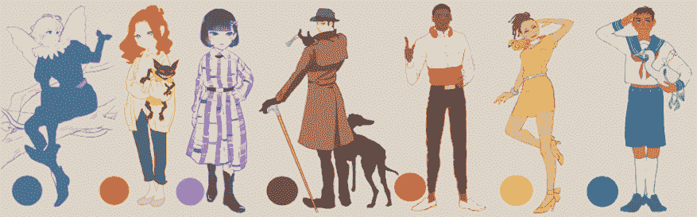

图 15.1：具有主题颜色的角色样本艺术

另一个想法是通过整体颜色组合传达作品背后的正确印象或情感。例如，当我们想要创造浪漫氛围时，我们不使用原色，而倾向于使用它们来表达危险或刺激。*图 15.2*中的样本展示了不同颜色组合的艺术作品。

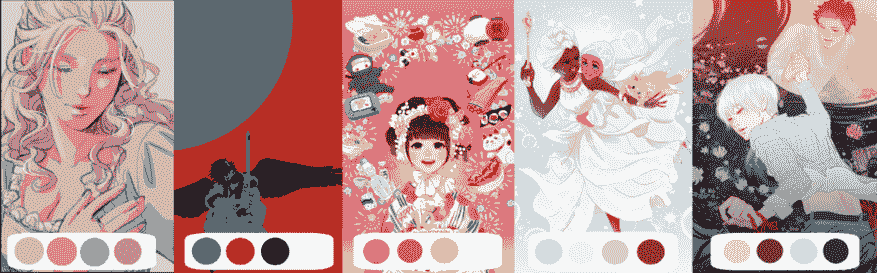

图 15.2：具有各种颜色组合的样本艺术

从左到右，我们可以观察到浪漫、危险、可爱、清新和梦幻的美学风格，以表达氛围，每种颜色组合都支持它们。

当然，前面的图像仅仅是示例。我们可以编辑/创建自己的。我通过使用四五种有限的色彩，在一小时内以一个主题绘制一幅彩色插图来训练自己，这极大地帮助我理解了使用色彩的力量。你也可以通过研究你喜欢的艺术/照片中的色彩，并用它们在你的艺术作品中绘制来尝试。顺便说一句，上面所有的样本艺术作品都是使用 Clip Studio Paint 创作的，使用了其色彩调色板，这些将在本章后面介绍。

# 理解色彩选择器

对于传统绘画工具，你需要画布、画笔、颜料颜色和调色板才能开始。在本节中，我们将探讨数字世界中的颜料颜色和各种调色板。在 Clip Studio Paint 中，与其他数字绘图工具类似，调色板已经预装了颜色；多么方便！

当我们为特定的用途选择颜色时，如果你在选择上有所疑虑，我可以提供一些建议。对于阴影，我在**正片叠底**混合模式下添加浅紫色；你将在本书下一章的*探索图层混合模式*部分中找到如何操作。另一个小贴士是，靠近摄像机的物体的颜色往往更温暖、更红，而远离摄像机的物体颜色则更冷、更蓝。

在 Clip Studio Paint 中有许多选择颜色的方法，但最常用的三种是**色彩轮**、**色彩滑块**和**色彩集**调色板。每个调色板都为我们提供了不同的方式来制作我们可以在数字插画和漫画中想象到的几乎所有颜色。让我们在接下来的部分中查看每个调色板以及如何使用它们来选择颜色。

## 色彩轮调色板

**色彩轮**调色板可能是数字领域中选择颜色最常用的方法。色彩轮调色板有两种模式，**HLS**模式和**HSV**模式：

+   **HLS**模式：这代表**色调**、**亮度**和**饱和度**。色调是颜色的变化程度，亮度是颜色的亮度，饱和度是纯色在混合中的比例（饱和度越低，颜色越灰）。

+   **HSV**模式：这代表**色调**、**饱和度**和**明度**。色调是颜色的变化程度，饱和度是纯色在混合中的比例（饱和度越低，颜色越灰），明度是添加到颜色中的白色或黑色量，以形成新的颜色。

*图 15.3* 展示了色彩轮调色板的 HLS 模式。

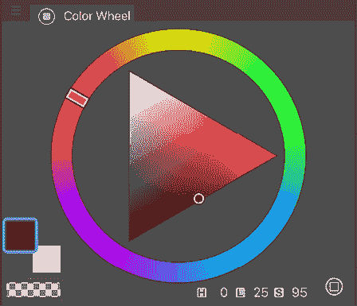

图 15.3：色彩轮调色板的 HLS 模式

颜色环的外环控制色调。圆圈内部的三角形显示了纯色调（从外环中选择）。当我们向上和向左移动时，颜色变得较浅，更接近纯白色。当我们向下和向左移动时，颜色变得较深，更接近纯黑色。通过点击三角形内部，我们可以选择当前选择的色调的任何饱和度或亮度。

通过这个三角形形状，我们可以看到三色色相组合：三角形所指的三个颜色是当它们在艺术作品中一起使用时创造出强烈印象的颜色。所以，当你想要一个生动而强烈的氛围时，想象在颜色圆圈中间有一个三角形，然后旋转它，然后选择每个角落所指的三个颜色。

在*图 15.4*中的样本中，我们看到三色与其他颜色组合一起工作得很好。

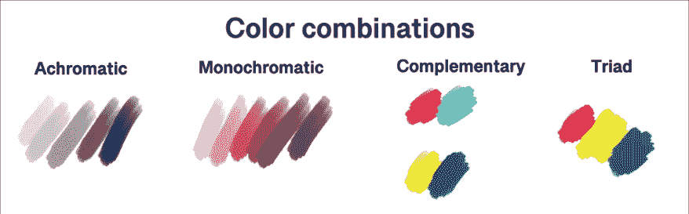

图 15.4：各种颜色组合的样本

调色板的左下角显示了我们的当前选定的前景色和背景色，以及我们的透明色块。我们可以快速选择从调色板或用户界面的主工具栏中使用前景色或背景色。

在调色板的底部边缘，我们可以看到当前所选颜色的色调、亮度和饱和度的数值，分别标记为**H**、**L**和**S**。在前一个屏幕截图中，色调值为**0**，亮度值为**25**，饱和度值为**95**。

**提示**

了解这些数值可以帮助你在切换到其他图形软件时匹配你使用的颜色。通过点击数值区域，选项可以从色调、亮度和饱和度更改为**红、绿、蓝**（**RGB**）值。

调色板右下角的图标将我们的颜色轮调色板切换到**HSV**模式，这在*图 15.5*中显示。

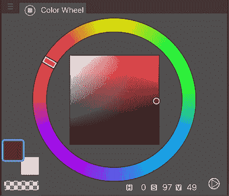

图 15.5：颜色轮调色板中的 HSV 模式

与 HLS 模式类似，我们可以通过在调色板的外环上点击来选择色调。正方形的右上角显示了纯色调。通过向右下角移动，颜色变得较深，更接近黑色。左上角是纯白色，选择接近它的颜色会使颜色亮度更高。向左下角移动会使颜色饱和度降低（更接近灰色）并更接近黑色。

如果我们查看颜色轮左上角的矩形标记，我们会找到一个直接相对的颜色，这就是互补色。这些样本在*图 15.4*中展示。如果你在艺术作品中只使用这两种颜色，它将创造出最高的对比度，许多流行设计都使用这种技术。

颜色选择器下的数字显示了当前所选颜色的**H**、**S**和**V**值。

让我们看看下一类调板。

## 颜色滑块调板

颜色调板的下一个标签是图 15.6 中显示的**颜色滑块**调板。您可以通过在**文件**菜单中点击**窗口**，然后点击**颜色滑块**来在屏幕上打开它。

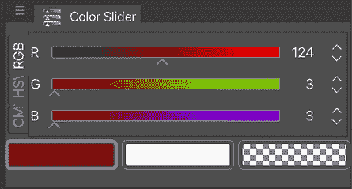

图 15.6：颜色滑块调板

**颜色滑块**调板左侧边缘的标签允许我们选择不同的颜色选择方式。上一张截图显示的是 RGB 模式。在此模式下，每个滑块控制不同颜色的量。顶部的滑块控制当前颜色中的红色量，中间的滑块控制绿色量，底部的滑块控制蓝色量。调板窗口底部的色块是当前的前景色和背景色，以及我们信任的透明色块。

此调板中的第二个标签是 HSV 模式，它与颜色轮调板中的 HSV 模式相同，但不同的是，我们使用滑块来控制颜色选择的各个方面，而不是轮子和正方形。

颜色滑块调板的最后一个标签是 CMYK 选择。**CMYK**代表**青色、品红色、黄色和黑色**，这些是在纸张上打印彩色图像时使用的颜色。虽然我们不能将文档设置为 CMYK 模式，但我们可以使用这些颜色滑块根据 CMYK 值选择颜色，以控制每种颜色的数量。

当尝试精确匹配颜色时，例如从标志或网站设计中使用的颜色时，颜色滑块非常有用。如果您知道颜色的数值，您可以使用颜色滑块调板中的一个标签精确地输入它们。

继续阅读，了解第三个调板**颜色集**。您可能会发现它比前两个更容易使用。

## 颜色集调板

我们将要查看的最后一个颜色调板是图 15.7 中显示的颜色集调板。您可以通过在**文件**菜单中点击**窗口** | **颜色集**来访问它，而不是使用滑块来控制颜色，您可以直接从一组颜色中选择一个颜色。

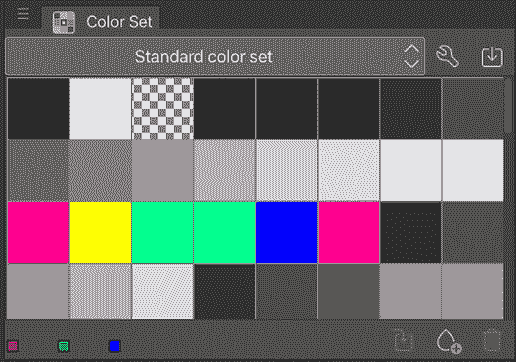

图 15.7：颜色集调板

如果您是 Photoshop 用户，正在切换到 Clip Studio Paint，并且您曾经使用过**颜色样本**，这个调板对您来说可能很熟悉。颜色集是预先制作的颜色样本，您可以点击它们来选择。*图 15.8*显示了使用标准颜色集颜色的一个示例插图。

图 15.8：使用标准颜色集创建的插图

我们可以使用这些来选择一个接近我们想要的颜色，然后使用颜色轮调板或颜色滑块调板对其进行调整，以达到我们想要的精确色调，或者直接使用颜色集。

颜色集调色板顶部的下拉菜单允许我们在不同的颜色集合之间进行选择。前面截图（*图 15.8*）中显示的集合是标准颜色集。我们也可以创建自己的自定义颜色集，以便我们可以保存经常使用的颜色，比如用于漫画项目中的主要角色。如果将一个特定角色使用的所有颜色收集在同一地方，并且您通常首先使用的颜色位于集合的顶部，这将提高为同一角色多次上色的效率。

按照以下步骤创建自定义颜色集：

1.  点击**颜色集**调色板顶部下拉菜单右侧的扳手图标。将出现如图 15.9 所示的窗口。

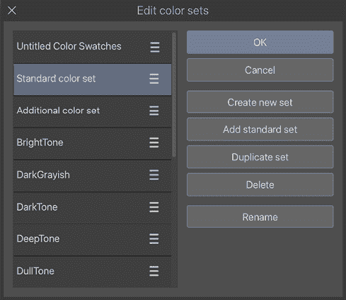

图 15.9：编辑颜色集窗口

1.  在**编辑颜色集**窗口中点击**创建新集**。

1.  为新颜色集输入名称，然后点击**确定**。

现在在**颜色集**调色板中，将显示由透明方块组成的新颜色集。

1.  为了向集合中添加颜色，首先，点击您想要放置新颜色的透明方块。然后，使用其中一个颜色选择器设置颜色，将其保存为当前活动的前景色。

1.  在**颜色集**调色板中，点击下角右侧的**替换颜色**图标（如图 15.10 所示），然后前景色将替换透明方块。

图 15.10：替换颜色图标

1.  要将颜色添加到新方块而不是替换当前选中的颜色，请点击如图 15.11 所示的**添加颜色**图标。

*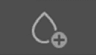*

图 15.11：添加颜色图标

**提示**

您可以通过从应用了**颜色匹配**的画布中挑选颜色来创建您的新颜色集。**颜色匹配**功能根据参考图像或颜色渐变改变整个颜色。

您可以通过进入**文件**菜单，然后点击**编辑** | **色调校正** | **颜色匹配…**来找到它。如何使用**颜色匹配**在*第十六章*，*使用 Clip Studio Paint 为你的漫画上色*中的*使用颜色匹配和过滤器选项*部分有描述。

一旦我们用它来构思颜色搭配，我们就可以挑选出好的颜色，创建一个新的颜色集！

您已经看到了两种不同的颜色轮调色板、颜色滑块调色板，以及最后，颜色集调色板，现在您知道如何创建自己的颜色集。拥有稳固的颜色集将给您带来不会丢失出色颜色组合的安全感。

现在，让我们看看调色板中的其他标签页，了解它们如何帮助我们为插图添加颜色。

# 探索颜色历史、中间颜色、近似颜色和颜色混合调色板

**色彩历史**、**中级调色板**、**近似颜色**和**色彩混合**都是位于 Clip Studio Paint 界面中的调色板。色彩历史允许我们跟踪我们在艺术作品中已经使用的颜色，中级调色板和近似颜色、色彩混合调色板允许我们以不同的方式混合颜色。在本节中，我们将探索这些调色板并学习如何使用它们。

## 色彩历史调色板

你是否曾经绘画，需要使用之前使用过的颜色，但它已经与周围的色彩混合得如此之深，以至于无法再获得纯净的颜色？色彩历史调色板是解决你祈祷的答案，而且使用起来非常简单！

在打开色彩历史调色板之前，打开一个空白文档并选择画笔或笔工具。选择一种颜色，在打开的画布上涂鸦。用几种其他颜色重复此操作几次。在色彩历史调色板能够显示任何内容之前，我们需要在我们的页面上使用一些颜色，以便建立历史记录。使用颜色的方式可以是简单的鼠标点击或触控笔的划动，只要使用了颜色即可。

现在我们已经在画布上使用了一些颜色，通过在**文件**菜单中点击**窗口** | **色彩历史**或在调色板中点击**色彩历史**标签来打开**色彩历史**调色板。**色彩历史**调色板应该看起来像*图 15.12*。

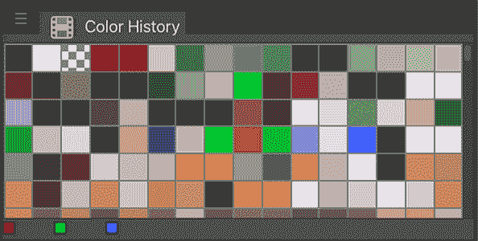

图 15.12：色彩历史调色板

调色板将显示最近使用的任何颜色。点击所需颜色的方块，使其再次变为活动状态。

要从色彩历史调色板保存颜色，点击调色板左上角的菜单图标，然后点击**注册到色集调色板**以保存颜色样本。要清除色彩历史，点击左上角的图标并选择**清除色彩历史**。这将重置调色板并重新开始色彩历史。

色彩历史是一个简单的小调色板，没有很多选项，但对于数字画家来说，它可以是一个强大的工具，并使在整个作品中保持一致的色彩变得容易得多。

接下来，我们将看到一种挑选中间颜色的优秀调色板。

## 中级调色板

中级调色板允许我们创建和谐的颜色组合，用于我们的插画和漫画。通过让 Clip Studio Paint 进行混合，我们可以轻松地创建一个相互协调的色彩方案。

我们将遵循的步骤来学习如何使用此调色板，如果能够同时看到中级调色板和色轮或色集调色板，效果最佳。当调色板紧密嵌套在一起时，例如在 Clip Studio Paint 的默认用户界面中，这是不可能的。我们需要弹出其中一个调色板，以便同时查看它们。

要弹出**中级色彩**调色板，在色彩调色板嵌套的标签中找到它。点击调色板顶部显示调色板名称的标签。在按住鼠标按钮或笔触的同时，将**中级色彩**标签从色彩调色板中拖出。*图 15.13*显示了调色板正在被拖动到画布视图区域的过程。

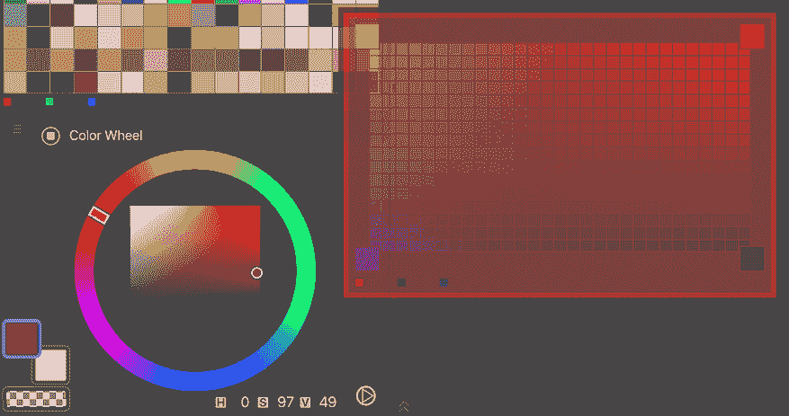

图 15.13：移动中级色彩调色板

一旦将中级色彩调色板从主色彩调色板区域移出，释放鼠标按钮。你现在应该能够看到中级色彩调色板和色彩轮盘或色彩集调色板并排，如图*图 15.14*所示。

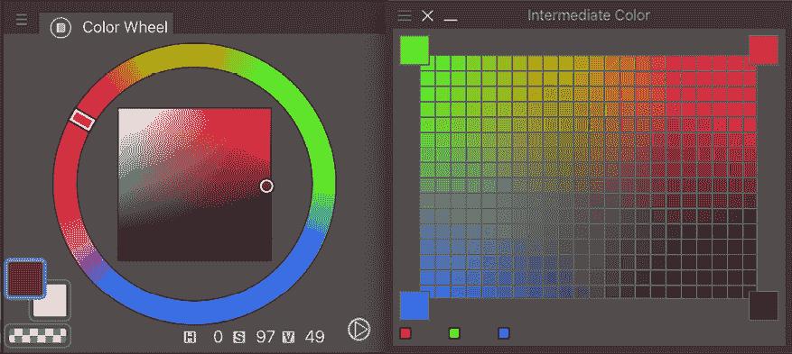

图 15.14：并排放置的两个色彩调色板

一旦这些调色板并排放置，按照以下步骤使用中级色彩调色板创建一个相互协调的色彩方案：

1.  从**色彩轮盘**、**色彩集**或**色彩滑块**调色板窗口中选择一种颜色。这可以是你在色彩方案中希望使用的任何颜色。

1.  使用你选定的颜色作为当前活动颜色，将光标移至**中级色彩**调色板左上角的大方块上。光标将变成油漆桶图标。点击以将颜色添加到角落框中。

1.  对于色彩方案中的其他颜色，重复*步骤 1 和 2*，将新颜色添加到其他角落的框中。在*图 15.15*中，我们在左上角使用了绿色，右上角使用了红橙色，左下角使用了蓝色，右下角使用了黑色。

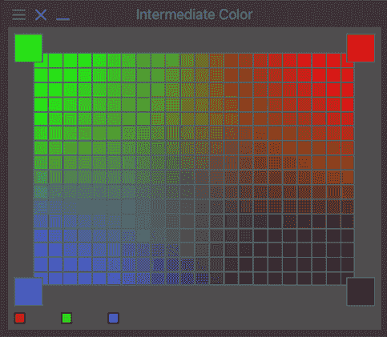

图 15.15：带有新颜色的中级色彩调色板

1.  使用光标从**中级色彩**调色板中心的小方块色彩样本中选择颜色，以给你的图像上色。

当我们在中级色彩调色板的角落添加颜色时，调色板内部的方块会自动填充这些颜色的混合。这是一种简单的方法，就像我们在现实物理世界中用颜料混合颜色一样，但通过使用数字工具来为我们进行色彩混合。这是一个展示良好明暗色彩的绝佳调色板！*图 15.16*展示了使用中级色彩调色板的示例：

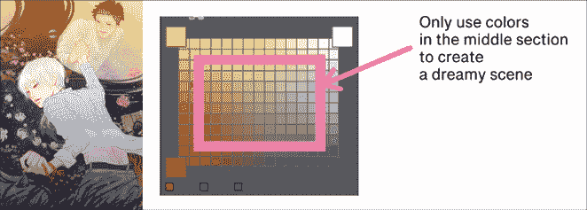

图 15.16：使用中级色彩调色板的示例图像

当我们想要避免使用原色进行绘图时，看到中间色彩一目了然是很有帮助的。继续阅读，了解一个更具实验性的调色板——近似色彩调色板，它可以为你产生意外的良好色彩协调！

## 近似色彩调色板

**近似颜色**调板是一种完全不同的颜色混合方式。此调板需要一些实验来适应不同的颜色模式滑块，但一旦你玩起来，你可能就会爱上它！当我们想要在主颜色中添加更多细微差别时，这个调板就派上用场了。你可以搜索稍微更鲜艳或更灰的色调，然后调板会显示所有可能的变体网格！只需加入一点其他颜色的微光，你就可以用它来表达来自附近物体颜色的反射光。近似颜色调板在*图 15.17*中显示。

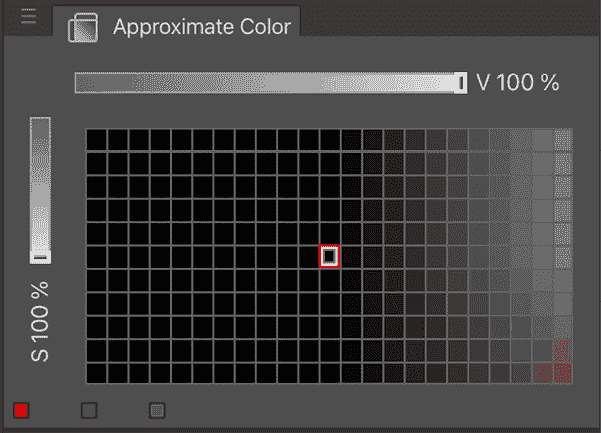

图 15.17：近似颜色调板

按照以下说明学习如何使用近似颜色调板：

1.  通过点击颜色调板中的标签或通过点击**文件**菜单中的**窗口**并点击**近似颜色**来打开**近似颜色**调板。

1.  选择除黑色以外的颜色作为活动前景色。当前选定的前景色将改变**近似颜色**调板中的混合结果。

1.  点击顶部滑块右侧的文本以打开混合选项的弹出菜单。这些选项将在稍后详细讨论。

1.  点击**近似颜色**调板窗口左侧滑块下方的文本。从弹出菜单中选择一个选项进行混合。

1.  通过移动顶部和左侧滑块来调整它们，并查看调板中的颜色如何变化。

1.  点击调板中的颜色方块以选择该颜色作为活动前景色。

此调板中滑块旁边的选项是**色调**、**饱和度**、**亮度**、**亮度**、**红色**、**绿色**和**蓝色**。

此列表提供了每个选项的详细信息：

+   **色调**：颜色的变化程度。

+   **饱和度**：颜色的鲜艳程度。值越高，颜色越鲜艳。

+   **亮度**：混合进来的颜色的值。

+   **亮度**：颜色的鲜艳亮度的强度。

+   **红色**：混合进来的红色量。

+   **绿色**：混合进来的绿色量。

+   **蓝色**：混合进来的蓝色量。

每个轴上的滑块控制当前所选参数的使用量。例如，将水平和垂直轴都设置为**色调**并将滑块值都设置为**100%**，当当前活动颜色为类似饱和度时，会产生许多非常饱和的颜色。*图 15.18*显示了选择饱和紫色并设置水平和垂直轴为**色调**时**近似颜色**调板的外观。

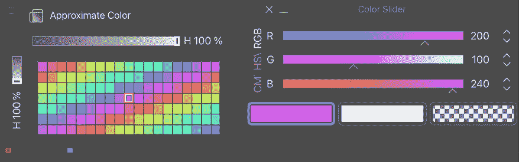

图 15.18：近似颜色和颜色滑块调板

我们将要探索的最后一个调板是颜色混合调板，它提供了一种更直观的颜色混合方式。

## 颜色混合调板

最新添加到 Clip Studio Paint 中的颜色调色板是颜色混合调色板。它重现了传统画家所做的传统颜色混合体验。它与油画画笔配合得最好。*图 15.19*中的示例艺术作品是用颜色混合调色板绘制的。

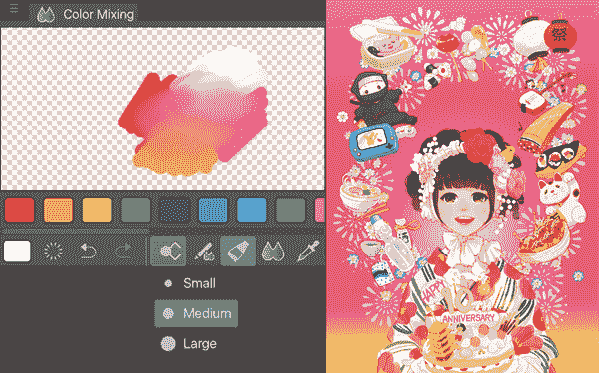

图 15.19：颜色混合调色板和艺术作品

按照以下说明使用颜色混合调色板：

1.  在**文件**菜单中点击**窗口**，然后点击**颜色混合**。

1.  从调色板上的颜色列表中选择一种颜色，点击画笔形状图标，然后从*图 15.19*中的下拉菜单中选择画笔的大小，在棋盘区域做一个标记。从颜色列表中选择另一种您想要混合的颜色。再次选择画笔，然后在您刚才做的标记上绘制。

1.  选择**混合颜色**图标，其形状为两个水滴合并，然后在两种颜色重叠的区域进行拖动。

1.  选择**颜色选择器**图标，并点击颜色混合的区域。您将看到您选择的颜色现在是**前景色**。

您可以通过点击列表最右侧的**+**图标向颜色列表中添加更多颜色。此外，**橡皮擦**（用于激活橡皮擦工具）、**后退一步**（用于撤销您所做的最后一个操作）和**前进一步**（用于重做已撤销的操作）图标位于颜色列表下方。

通过在颜色混合调色板上添加和混合颜色，您的工作方式就像传统画家一样，这意味着您可以获得更直接的感觉，就像物理颜色混合体验一样。

# 从子视图调色板创建颜色调色板

除了在本章中探索的所有其他选择颜色的奇妙方式之外，我们还可以从已加载到子视图调色板中的参考中选取颜色。这很简单，方便，对于那些在漫画中反复使用相同颜色为角色或环境着色的人来说，这真的是节省时间的。

按照以下步骤将图像导入到子视图调色板中，然后从中选择颜色：

1.  定位**子视图**调色板。它通常与导航器嵌套在一起。如果无法在界面中找到，请转到**文件**菜单，点击**窗口** | **子视图**以将其打开。

1.  在调色板底部，点击**导入**图标，如*图 15.20*中所示。

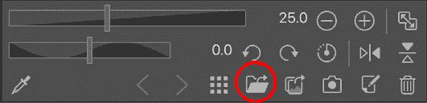

图 15.20：子视图调色板

1.  定位您的参考图像，并点击它以选择它，然后点击**打开**按钮以完成导入。

1.  您的图像现在将显示在**子视图**调色板中。

1.  要从参考图像中选择颜色，请点击*图 15.21*中圈出的吸管图标。

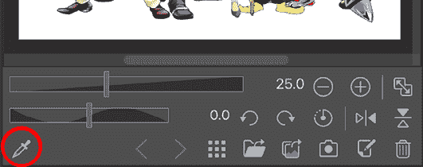

图 15.21：带有图像的子视图调色板

1.  将光标移至“子视图”调板中的图像上，并使用吸管工具点击以从参考图像中选择颜色。所选颜色将成为当前活动颜色。

“子视图”调板是一个存放经常使用的参考的好地方，例如角色概念艺术、环境设计和解剖与姿态参考。能够从中选择颜色意味着彩色角色参考以自己的方式成为易于使用的调板。我们可以直接从角色概念艺术中选择颜色，然后使用它们为我们的漫画添加颜色。此外，从你拍摄的带有金色云彩的天空或黑暗森林的风景照片中，你当然可以使用它们作为调板！

对于最近开始使用 Clip Studio Paint 的 Photoshop 用户，下一节是为你准备的！

# 从 Adobe Photoshop 导入调板

如果你正在从 Adobe Photoshop 切换到 Clip Studio Paint，没有理由你不能将你可能创建的任何自定义颜色样本带到你的新软件中！在本节中，我们将导入 Photoshop 颜色样本到颜色集调板中。

在能够导入你的 Photoshop 样本之前，你需要将它们从 Photoshop 保存为 **.aco** 文件。在 Photoshop 中，你将想要转到“样本”调板并点击菜单（它很可能是右上角，取决于你的 Photoshop 版本）。接下来，点击菜单中的“保存样本”。将文件保存到你的计算机上的一个文件夹中，这样你就可以轻松找到它。你还可以在网上找到带有如 Copic 标记墨水等颜色的 **.aco** 文件进行下载。

按照以下步骤将 Adobe Photoshop 中的颜色样本集导入到 Clip Studio Paint 中：

1.  通过在“文件”菜单中的“窗口”选项下点击，打开“颜色集”调板，然后点击“颜色集”。

1.  点击“颜色集”调板左上角的三条杠形状菜单图标以查看下拉菜单。

1.  在“颜色集”菜单中点击“导入颜色集”。

1.  导航到你的计算机硬盘上存储 **.aco** 文件的文件夹。点击文件以选择它，如图 15.22 所示，然后点击“打开”。

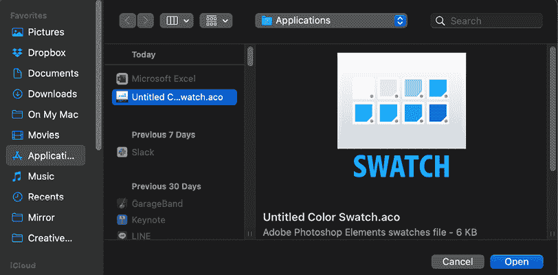

图 15.22：Finder 中的颜色样本文件

1.  颜色文件中的样本将被自动导入并命名，如图 15.23 所示。

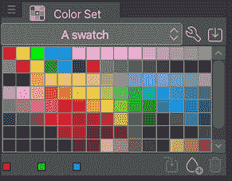

图 15.23：导入的颜色样本

1.  要重命名导入的颜色集，点击“颜色集”调板中的扳手图标。将打开“编辑颜色集”窗口。

1.  在左侧的列表中找到导入的颜色集名称。点击一次以选择它，如图 15.24 所示。

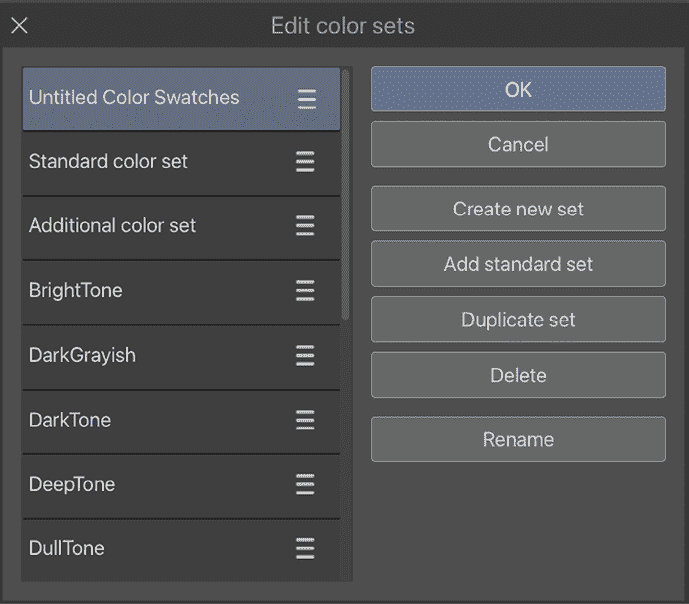

图 15.24：编辑颜色集窗口

1.  点击**重命名**设置。左侧的名称将变为文本输入框。为颜色集输入新名称，然后按*Enter*键。

1.  颜色集的名称将如*图 15.25*所示更改。

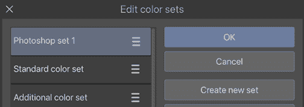

图 15.25：设置新名称的颜色集编辑窗口

1.  点击**确定**以保存更改。

太好了，我们现在已从 Photoshop 导入了一个颜色集，这为在 Clip Studio Paint 和 Photoshop 之间来回工作的人提供了效率。

# 摘要

在本章中，我们开始探索色彩这个奇妙的世界。色彩是一个复杂的话题，对其有效使用可以进行许多研究，但通过使用 Clip Studio Paint 中的工具和调色板，我们可以使处理变得稍微容易一些。我们学习了如何使用调色板、颜色滑块和颜色集调色板。然后，我们学习了如何使用颜色历史、中间颜色、近似颜色和颜色混合调色板来追踪和混合我们的颜色。最后，我们从 Photoshop 导入颜色样本，并学习了如何从子视图调色板中选择颜色以及从 Photoshop 导入颜色样本。毫无疑问，这些功能将帮助你在未来的创作中上色，保留你喜欢的颜色，或构建美丽的色彩组合。

那么，我们如何将这些颜色应用到我们的数字艺术中呢？在下一章中，我们将学习如何创建颜色平面、使用图层混合模式、上色墨水层，以及使用颜色匹配。这将是一个内容丰富的章节，所以让我们立即开始吧！

# 加入我们的 Discord！

与其他用户一起阅读这本书。提出问题，为其他读者提供解决方案，等等。

扫描二维码或访问链接加入社区。

[`packt.link/clipstudiopaint`](https://packt.link/clipstudiopaint)

