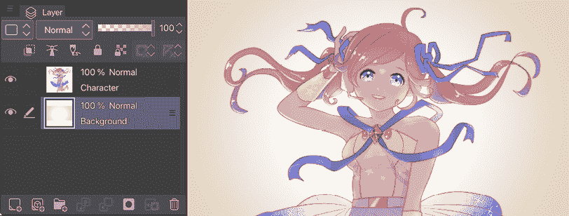
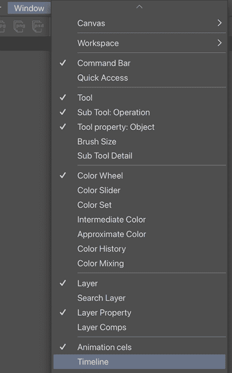

# 18

# 探索 Clip Studio Assets 和动画

两个最令人兴奋的 Clip Studio Paint 功能是 Clip Studio Assets，它允许快速轻松地下载新的画笔和其他资产，以及能够在程序中创建动画的能力。在本章中，我们将探讨这两个选项以及如何使用它们。

本章将涵盖以下主题：

+   Clip Studio Assets

+   创建账户并登录

+   从资产下载

+   创建动画

+   导出动画

我们将从这个章节开始，先了解 Clip Studio Assets 是什么，然后是如何创建账户并登录到资产库。接着，我们将学习 Assets 的界面，以及如何搜索您想要的资产，甚至实际下载一个样本资产。然后，我们将通过两个示例步骤了解如何在 Clip Studio Paint 中创建动画，最后学习如何导出动画。

到本章结束时，您将掌握如何获取用于您创作的材料的有用知识，并且您将能够开始使用您创建的图像来创建动画！

让我们直接进入这些令人惊叹的功能！

# 技术要求

要开始使用，您需要在您的设备上已安装 Clip Studio Paint，并拥有一个 1280 x 720 像素、144 dpi 的画布，其中包含分开的字符艺术和背景艺术图层。您还需要一个 Clip Studio 账户来登录。

# 从资产下载

Clip Studio Assets 包含用户创建的画笔、材质、3D 对象、音效等，这些都可以下载用于您自己的作品中。

在本节中，我们将通过搜索、下载和注册准备使用的材料来学习如何使用 Clip Studio Assets。

要访问可下载的材料，请点击 **CLIP STUDIO START** 屏幕右上角的九宫格图标，并在弹出的菜单窗口中点击 **搜索材料 - 资产** 链接。*图 18.1* 展示了编写时的资产库。

图 18.1：资产库

每个资产都有一个缩略图显示资产的外观。在缩略图下方，我们有关于资产的信息。第一行告诉我们资产的类型（姿态、工作区、图像材质、画笔等）。下一行告诉我们材质的名称。第三行告诉我们创建并上传资产到在线库的人的用户名。下一行告诉我们该资产被下载了多少次，最后一行告诉我们资产的成本。

**重要提示**

资产下载库中的许多项目都是免费的。然而，一些资产需要特殊货币，如 Clippy 或金币。你可以在 Clip Studio Assets 上通过做一些活动来收集 Clippy 积分，例如上传你制作的材料，但金币需要花钱购买。为了下载付费资产，你首先需要从 Celsys 购买金币。在撰写本文时，1,000 金币大约需要 10 美元。金币有一个有效期，通常是购买之日起一年，所以如果你购买金币，务必在使用前用完它！

要搜索特定资产，请在资产窗口顶部的**搜索**栏中输入关键词或关键词。按下键盘上的*Enter*键以完成搜索。搜索栏右侧标记为**筛选器**的按钮可以点击，然后用于缩小搜索结果。例如，在下面的屏幕截图中，我们已输入搜索关键词**Heart**。如果我们只想看到匹配该关键词的画笔资产，请点击**筛选器**窗口下的**画笔**选项，如图 18.2 所示。这将相应地过滤搜索结果。

图 18.2：搜索选项

也有一种非常实用的方法可以快速挑选好的资产，那就是改变显示搜索结果的顺序，正如你从图 18.3 中的三个选项中可以看到的那样。

图 18.3：搜索结果顺序选项

你可以选择**最新优先**、**最早优先**或**热门**。我建议选择**热门**，因为下载次数最多的资产将首先显示，这意味着它们可能是最有用的。如果你在寻找非常独特的资产，请选择**最新优先**以查看最新资产。一些旧资产可能是基础的，并且与 Clip Studio Paint 的最新版本不兼容。

因此，如果你想首先浏览最受欢迎的免费心形画笔，你可以在搜索栏中输入**Heart**，然后在键盘上按*Enter*键，从**筛选器**下拉选项中选择**画笔**和**免费**，然后点击**关闭**按钮。最后，从显示顺序选项中点击**热门**，最有可能满足你需求的资产将显示在顶部！

**重要信息**

截至 2024 年，Clip Studio Assets 现在自动将材料名称翻译成英语、法语、德语、西班牙语、韩语、繁体中文或日语。当你点击一个材料时，你会看到翻译后的名称和括号中的原始名称。材料现在还有一个独特的内容 ID，用户可以在搜索栏中输入以查找特定材料。如果这没有返回你想要的结果，那么可能需要你自己制作那个资产并发布出来供其他人下载！这是展示你的 Clip Studio 技巧的绝佳方式，而且如果你创建了一个很多人下载的付费资产，你还可以赚一点额外的钱。

一旦我们找到我们可能感兴趣下载的资产，我们可以点击缩略图来查看更多关于它的详细信息。*图 18.4*中的资产是**复古芯片画笔**，看起来相当不错。

图 18.4：复古芯片画笔资产详情

从此详细信息窗口中，我们可以通过点击心形按钮给资产添加**赞**（并且我们还可以看到资产有多少赞）。我们可以通过点击星形按钮将资产添加到我们的收藏夹。如果您喜欢，收藏夹可以充当付费资产的愿望清单。

向下滚动将提供我们想要下载的资产更多详细信息。大多数用户都会包括更多缩略图和如何在图像中使用该资产的创意。在决定下载资产之前，请务必查看这些信息。

复古芯片画笔资产是一个付费资产，因此我们需要在我们的账户中有金币才能下载这个画笔。在**免费**资产中，我们将在屏幕右上角看到**下载**按钮。点击免费资产的**下载**按钮或付费资产的**立即结账**按钮，您就可以下载它们。

一旦您开始下载资产，请点击齿轮形状的**设置**图标，然后选择**数据传输**以查看下载状态，如图*图 18.5*所示。

图 18.5：数据传输窗口

任何正在下载和最近下载的项目都将显示在此窗口中。我们将看到当前下载项目的名称、内容 ID 和进度条，下载的名称、日期和时间，下载的状态以及下载过程的状态，这显示了过程是否成功，对于已下载的项目。在尝试再次下载资产之前，请检查以确保下载成功。

现在我们已经下载了资产，我们需要在 Clip Studio Paint 的材质面板中找到它。

## 在 Clip Studio Paint 中定位您的下载

当我们将资产下载到 Clip Studio Paint 时，它会进入我们的材质面板。要查看并编辑您的材质，请点击**CLIP STUDIO START**屏幕左侧菜单中的**管理材质**图标。您将看到带有缩略图的材质列表。在 Clip Studio Paint 中，打开**材质**面板，如果您找不到**下载**类别，请点击**所有材质**旁边的箭头。如果您点击**下载**，最近下载的资产将显示在右侧，如图*图 18.6*所示。

图 18.6：材质面板

如果您下载的资产是一张图片、图案或 3D 资产，您将能够直接从材质面板中使用它。如果它是一个画笔资产，您仍然需要将该资产注册到**子工具**面板之一。这是一个非常简单的流程。要注册画笔材质，请按照以下简单步骤操作：

1.  打开**子工具**面板以显示您希望注册新画笔资产的工具组。在本指令中，我们将注册一个新的**画笔**资产。

1.  在素材面板的**下载**部分，点击您想要注册到子工具的画笔资产的缩略图。

1.  点击并按住缩略图，保持压力，然后将其拖动到**子工具**面板，不要松开。一旦它移动到**子工具**面板，您将看到资产旁边出现一个**+**符号。现在松开压力。

1.  新资产将被注册到**子工具**面板中。在*图 18.7*中，我们可以看到之前截图中的画笔现在位于**画笔子工具**类别中：

图 18.7：画笔子工具面板

能够访问大量有助于您创作的素材不是非常棒吗？首先，我们从**CLIP STUDIO ASSETS**屏幕开始，了解它是做什么的以及它提供了什么。然后，我们继续学习如何创建账户并登录使用资产，以及如何搜索资产素材。最后，我们学习了如何下载和注册画笔素材。说实话，我可以整天搜索和收集花哨且有用的素材，因为这非常有趣且富有启发性。

在下一节中，我们将探讨如何在 Clip Studio Paint 中创建动画。继续阅读以探索这个出色的功能！

# 在 Clip Studio Paint 中创建动画

在本节中，我们将通过两个示例学习如何使用 Clip Studio Paint 中的**图层**和**时间轴**面板创建动画。

从技术上讲，单词“animation”来自拉丁语“animare”，意为“赋予生命”。如今，它是指“动态图像”的另一种说法。它是一种非常复杂的艺术形式，需要大量的学习和实践才能掌握。有许多书籍和互联网资源，例如由 Richard Williams 撰写的*《动画师生存手册：经典、计算机、游戏、定格动画和互联网动画师的方法、原则和公式手册》*，或者 YouTube 上的 AlanBeckerTutorials 的*《12 个动画原则》*视频。它们将用关于如何动画、动画原则和动画技巧的内容来启发你。这些内容可能超出了本书的范围。然而，我们可以探索如何创建具有动画时间轴的 Clip Studio 文件，然后添加动画原画，使我们的图片具有运动的外观。一旦你习惯了动画的基础，我鼓励你查看这些资源并提高你的技能。同时，我只想教你如何创建基本的动画——如何创建动画时间轴以及如何添加动画原画。

**重要提示**

在使用 Clip Studio Paint Pro 时，您的动画帧在时间轴上仅限于 24 帧。Clip Studio Paint EX 可以在时间轴上创建无限数量的动画帧。

我们将学习两种从您的艺术作品中创建动画的不同方法。一种是通过使用图像，另一种是通过使用相机移动功能。

## 使用一张图像创建动画

您可以创建一个仅用于动画的新文件，或者将动画添加到现有的艺术作品中。在本节中，我们将使用您现有的艺术作品。按照以下步骤创建您的第一个动画：

1.  首先，创建一个**1280 x 720**像素的画布，分辨率为**144 dpi**。您需要确保您的艺术作品中的角色和背景绘制在单独的图层中，如图*图 18.8*所示：

图 18.8：带有图层面板的插图

1.  创建两个栅格图层，并分别命名为**1**和**2**。

1.  在**图层 1**上绘制您想要动画化的元素。在这个例子中，我画了粉色的星星，如图*图 18.9*所示：

图 18.9：添加的元素（1）

1.  将**图层 1**的不透明度调整到大约**30%**，通过移动**图层**面板顶部的滑块条，并以半透明的**图层 1**作为参考绘制**图层 2**中的图像变化。

图 18.10：添加的元素（2）

1.  在您完成在**图层 2**上的绘制后，不要忘记将**图层 1**的不透明度恢复到**100%**。

1.  在**文件**菜单中，点击**动画**，然后点击**新建动画图层**，最后点击**动画文件夹**，在**图层**面板中创建一个名为**文件夹 1 : 0**的动画文件夹，如图*图 18.11*所示。

图 18.11：动画下拉菜单和图层面板

1.  在**图层**面板中，选择**图层 1**和**图层 2**，然后点击并按住它们，将它们拖动到**文件夹 1 : 0**中并释放。

1.  一旦两个图层安全地存储在**文件夹 1**中，通过点击文件夹的眼形图标使其文件夹隐藏。

1.  从**文件**菜单中选择**窗口**，然后从下拉菜单中选择**时间轴**以打开**时间轴**面板，如图*图 18.12*所示。

图 18.12：窗口下拉菜单

1.  现在您有一个空的**时间轴**面板。在**时间轴**面板中，点击**新建时间轴**图标，如图*图 18.13*所示，以打开**新建时间轴**对话框。

图 18.13：时间轴面板

1.  在**新建时间轴**对话框中，将**帧率**设置为**8**，将**播放时间**设置为**8**，然后点击**确定**，如图*图 18.14*所示：

图 18.14：新建时间轴对话框

1.  您当前的**时间轴**面板应该看起来像*图 18.15*，其中有一个名为**1**的时间轴。右键单击第一个帧，即红色高亮显示的区域，以弹出右键菜单：

图 18.15：时间轴面板

1.  从以下菜单中选择**图层 1**，将图像插入到**时间轴 1**的目标帧中：

图 18.16：右键菜单

1.  右键单击**时间轴 1**的**帧 4**（因为我们设置了每秒 8 帧，帧 4 出现在半秒处），从右键菜单中选择**层 2**，然后您将看到如下结果：

图 18.17：包含八帧动画的时间轴调色板

1.  您的动画现在已完成！点击**文件夹 1 : 2**旁边的复选框，使其再次可见。

1.  要播放动画，请点击**时间轴**调色板上的三角形**播放/停止**图标。您也可以通过点击**循环播放**图标来循环播放，如图 18.18 所示：

图 18.18：时间轴调色板

当动画循环播放时，通过改变大小和角度，它给人一种星星围绕着角色跳舞的错觉！

**提示**

我们可以通过使用**洋葱皮**功能在画布上同时显示当前显示的动画帧和前后帧！从**文件**菜单中选择**动画**，然后选择**显示动画帧**|**洋葱皮设置**。或者点击**时间轴**调色板上的**洋葱皮**图标，如图 18.19 所示。

图 18.19：时间轴调色板上的洋葱皮图标

您可以通过点击**动画**|**显示动画帧**|**洋葱皮设置**来编辑设置，如显示颜色和帧数。

现在看到您的艺术作品有了动作，不是很好吗？在我们了解如何导出动画之前，让我们再学习一种创建动画的方法。

## 使用摄像机移动功能创建单张图片的动画

有一些动画可以通过移动摄像机位置而不是角色来创建。我们需要添加一些称为关键帧的东西，这些关键帧指示从哪个时间点开始添加效果，例如摄像机移动，以及它结束的时间点。按照以下步骤使用摄像机移动功能创建动画：

1.  首先，创建一个**1280 x 720 px**的画布，分辨率为**144 dpi**，将角色和背景绘制分开在不同的图层中，如图 18.20 所示。

图 18.20：艺术作品和图层调色板

1.  从**文件**菜单中选择**窗口**，然后从下拉菜单中点击**时间轴**以打开**时间轴**调色板。

1.  在**时间轴**调色板中，点击图 18.21 中圈出的**新时间轴**图标，以打开**新时间轴**对话框。

图 18.21：时间轴调色板上的新时间轴图标

1.  在**新时间轴**对话框的*图 18.22*中，将**帧率**设置为**8**，将**回放时间**设置为**8**，然后点击**确定**。

图 18.22：新时间轴对话框

1.  在**时间轴**调色板中，点击图 18.23 中圈出的**在此图层上启用关键帧**图标。

图 18.23：时间轴调色板

1.  点击第一个帧，它以红色突出显示*图 18.24*。

图 18.24：时间轴调板 2

1.  在**工具**调板上点击**操作**工具，然后选择**对象**子工具。您将在画布上看到一个带有手柄的方形，如图**图 18.25**所示。

图 18.25：子工具调板和画布

1.  点击并拖动以使用顶部控制点旋转，并使用角落的手柄更改比例。当您变换一个图层（确保您想要移动的图层在**图层**调板上被选中）时，**时间轴**调板上的第一帧会创建一个关键帧，这是一个菱形标记，如图**图 18.26**所示。

图 18.26：时间轴调板

1.  点击**时间轴**调板上的第五帧，并使用**对象**子工具在画布上将艺术品变换到您想要的缩放比例。当您变换它时，**时间轴**调板上会创建一个关键帧。菱形关键帧标记可以被点击并拖动到其他帧。现在，您可以在**图 18.27**中看到两个菱形关键帧标记。

图 18.27：带关键帧的时间轴调板

1.  点击您第一次添加的关键帧标记，然后右键单击并从菜单中选择**复制**。

1.  在时间轴上选择最终的**第八**帧，右键单击以弹出菜单，然后选择**粘贴**。现在，关键帧已经粘贴在第八帧上。

1.  点击**动画** | **编辑轨道** | **复制**以复制选定的关键帧，点击**动画** | **编辑轨道** | **粘贴**以将复制的关键帧粘贴到平板电脑和移动用户的新位置。我们也可以以与第一次相同的方式在画布上变换艺术作品：

图 18.28：带关键帧的时间轴调板

您已经使用摄像机移动功能创建了一个动画！让我们通过点击**播放**图标来检查它是否真的工作。

当动画循环播放时，它显示角色逐渐变大然后变小，好像他们要从背景中跳出来，如下面的帧截图所示：

图 18.29：动画帧

**提示**

您可以在一个文件夹中创建动画图像，但在进行更复杂的动画，如角色移动和相互交互时，您可能通过在一个动画文件夹中草拟动画并在另一个文件夹中细化动作会更有成功的机会。这样，原始草图得以保留，您可以按需调整任何内容。这与传统动画类似：在铅笔草图上草拟动作，然后将在透明赛璐珞上绘制完成的动画。

您现在已创建了两种类型的动画：一种是通过在新图层中移动一个艺术图像和绘图元素，另一种是通过添加关键帧使用摄像机移动功能。

是时候导出这些动画与他人分享了——继续阅读以了解如何操作。

# 导出动画

就像我们导出静态图像一样，我们也可以导出动画。这是一个简单的过程，但我们需要探索几种导出格式，以便知道哪种是我们目的的正确选择。

在本节中，我们将查看每种导出动画的方法。

在**文件**菜单中，你会看到**导出动画**选项，在该选项下有我们可以导出动画的不同方式。这些在*图 18.30*中显示。

图 18.30：导出动画选项

我们将在下面讨论这些选项中的每一个。

## 图像序列

图像序列是一系列静态图像。每个动画图像都导出为一个带编号的图像，然后可以导入到其他软件中进行进一步编辑。**图像序列导出设置**窗口如下所示：

图 18.31：图像序列导出设置窗口

顶部是一个用于**预设**导出信息的下拉菜单。你可以创建、编辑和导入此信息。在**名称**字段中输入的文本将是每个图像的文件名。在**分隔符**字段中输入的字符将分隔最终文件名中的名称和数字。通过更改**起始编号**的输入，我们可以调整图像序列开始的编号。

在**高级设置**下，我们可以从下拉菜单设置图像的文件格式。你也可以通过勾选相应的框来选择导出草稿图像序列或已创建的帧。

**大小设置**可以用来选择你想要导出的**绘图区域**的大小：可以是**输出帧**、**溢出帧**或**整个画布**。我们还可以通过在**输出图像**上设置值来调整导出图像的**宽度**和**高度**。如果你想要导出使用图像序列创建的相机运动，你也可以勾选**应用 2D 相机效果**框。

**帧导出**设置可以用来指定要导出的帧部分，或者可以导出所有帧。**帧率**选项可以用来更改帧率。

查看下一个导出选项，**动画 GIF**。

## 动画 GIF

动画 GIF 是互联网上分享动画最常见的方式之一。你无疑在无数网站和社交媒体帖子中看到过作为网络迷因的动画 GIF。要将你的动画导出为 GIF，请从**导出动画**菜单选项中选择**动画 GIF…**选项。

首先，命名要保存的文件。然后，**动画 GIF 导出设置**将出现，如图*图 18.32*所示。

图 18.32：动画 GIF 导出对话框

下拉菜单中没有其他选择。点击**确定**，会弹出一个新窗口，让你编辑导出设置，如图所示：

图 18.33：动画 GIF 导出设置对话框

在这里你可以输入帧的**宽度**和**高度**值；通常，低分辨率为 720 x 480，中等分辨率为 960 x 540，而 1280 x 720 则被认为是高分辨率动画。在该选项下，我们可以设置导出多少帧，帧率以及动画循环的次数。动画视频的标准帧率通常是每秒 24 帧（fps），但可能会根据风格而变化。对于 GIF 动画，8 fps 就足够了。在屏幕底部，有两个选项。你可以打开**抖动**来使 GIF 看起来更自然，质量更高，还有一个复选框，如果你想要**使背景透明**。当你点击**确定**时，将弹出一个保存位置窗口。导航到你想导出动画 GIF 的位置。Clip Studio Paint 的 Mac 和 PC 版本可能会跳过对话框，直接进入**导出位置**对话框。

让我们看看下一个导出选项，**动画贴纸**（**APNG**）！

## 动画贴纸（APNG）

一个动画贴纸，或称 APNG，是一种具有**.png**文件特性的动画图像，而不是**.gif**文件，常用于即时通讯应用中的动画贴纸。APNG 导出选项显示在*图 18.34*中。

图 18.34：动画贴纸（APNG）导出对话框

这些选项与**.gif**选项相同；下拉菜单中没有其他选项。再次提醒，Clip Studio Paint 的 Mac 和 PC 版本可能会跳过此对话框，直接显示类似于动画 GIF 导出设置的导出设置对话框，然后是**导出位置**对话框。

让我们来看看最后一个导出选项，**电影…**。

## 电影文件

电影文件可以上传到 YouTube 或导入到视频编辑软件中添加声音或其他效果。当你选择**电影…**选项时，系统会提示你添加文件名并选择文件类型，如图 18.35 所示。

图 18.35：电影导出对话框

作为一个有趣的事实，MP4 文件类型比 QuickTime 电影文件类型更轻，在平台上使用得更广泛，但 QuickTime 电影在图像和音频质量上优于 MP4。一旦添加了文件名，选择了文件类型，然后点击**确定**，以下窗口将出现：

图 18.36：电影导出设置窗口

在窗口顶部，我们有**缩放设置**。通过使用**宽度**和**高度**设置，我们可以调整最终文件的尺寸。如果你勾选了标记为**应用 2D 相机效果**的框，你创建的相机移动也将被导出。**帧率**选项控制播放的帧率。

现在你已经知道了如何使用 Clip Studio Assets 以及快速开始创建动画并从 Clip Studio Paint 导出动画的方法！

# 概述

在本章中，我们首先了解了 Clip Studio Assets 是什么，以及如何注册并登录开始使用它。然后，我们学习了如何搜索我们想要的材料，然后下载它们，最后注册画笔材料。接着，我们快速浏览了如何使用两种不同的方法给我们的插图添加动画，以及不同方式导出它们以适应不同的用途。现在，你可以下载并使用新的资产，并创建和导出动画用于 GIF、贴纸和 YouTube 视频！

在下一章中，我们将学习如何导出、打印和上传你的漫画。如果你再次阅读，你将更好地了解完成后的漫画将是什么样子，以及如何设置页面，就像在*第五章*“页面和分镜塑造漫画”中看到的那样，这将帮助你更深入地理解。我们将讨论许多方法，我们可以将我们的作品导出以在网页和印刷品上展示。通过实体漫画书籍或网络漫画，你将看到如何展示你创作的多种可能性。

# 加入我们的 Discord 社群！

与其他用户一起阅读这本书。提出问题，为其他读者提供解决方案，等等。

扫描二维码或访问链接加入社区。

[`packt.link/clipstudiopaint`](https://packt.link/clipstudiopaint)

