# 打印、打印输出和上传您的漫画

现在我们已经完成了漫画或插画的草图、上色和着色，是时候将它们从 Clip Studio Paint 导出到打印店或社交媒体或网站上了。最后一章将教会您关于软件中的导出选项，包括如何在导出时调整页面大小和分辨率。

我们将从这个章节开始学习如何通过调整打印设置和以打印店友好的格式渲染文件，了解每种文件格式的独特性，使您的漫画文件准备好家庭打印。我们将仔细研究如何调整图像质量和文件大小，以及如何调整最终图像的大小。最后，我们将学习如何使用额外的两个仅限 EX 版本的功能导出适合网页上传的漫画文件。

本章将涵盖以下主题：

+   家庭打印

+   打印输出

+   调整图像质量和文件大小

+   导出时调整图像大小

+   网页展示输出

+   导出网络漫画（仅限 EX）

+   批量导出页面（仅限 EX）

+   导出到 Clip Studio SHARE

到本章结束时，您将能够理解如何处理您的漫画，无论是从互联网上发布还是在实体装订的漫画书中发布。这将给您一个很好的想法，了解您的漫画最终会是什么样子，这样当您创建新的漫画时，您可以在画布大小和分辨率方面做出最佳选择！

让我们准备好与世界分享我们的作品！

# 技术要求

要开始，您需要在您的设备上已经安装了 Clip Studio Paint，并且为了制作至少三页的漫画，我建议创建一个 A5 竖版画布，每页 300 dpi，以便浏览本章内容。

# 家庭打印

准备打印需要大量的工作，然后是实际打印和自行装订所有东西，但艺术作品会给你一种美妙的工艺感！在本节中，我们将学习如何使您的漫画创作准备好家庭打印。

在过去的几年里，家用打印机变得更加经济实惠且功能强大。仅仅十年前，大多数家用打印机只能从数字照片中打印出不错的打印效果。现在，我们有了可以打印出美丽、高质量图像的家用打印机，而且价格合理。一些打印机甚至现在是“艺术家级”的，可以打印宽幅格式，在布料上打印，等等。

现在市面上有如此多的家用打印机，我们显然无法在这本书中详细介绍它们。在购买打印机之前，最好自己进行研究，并考虑你将如何使用打印机。如果你主要进行黑白打印，你可能可以用稍微便宜一点的打印机，甚至可以使用使用碳粉而不是墨盒的激光打印机。如果你要打印大量的大幅打印品，你可能需要考虑购买宽幅打印机。打印机可以设置连续墨水系统，以节省打印大量高质量照片或绘画的人的彩色墨水成本。在购买之前，在线阅读评论并比较不同打印机的功能。我推荐使用佳能或爱普生打印机，因为它们的艺术打印效果非常出色！我最喜欢的是佳能 PIXMA 系列，因为它的高质量和色彩表现力。

**提示**

如果你在家打印很多，确保你手头有墨盒。墨水总是在最不方便的时候用完！而且，总是购买正品墨盒比购买兼容的便宜墨盒更安全，因为这可以延长打印机的使用寿命。

你还需要一些高质量的纸张。我喜欢使用照片纸、卡纸或演示纸来打印我的艺术作品，但也可以使用较薄的纸张。然而，确保不要太薄，因为如果我们用大量的墨水浸透薄纸，它就会起皱和变形，纸张背面会变得半透明！

大多数喷墨打印机可以从设置为 RGB 颜色模式的文件中打印得很好，所以当我们完成我们的漫画创作后，我们根本不需要将 Clip Studio 文件转换为打印。确保你的打印机驱动程序是最新的，因为这可以解决大多数打印机问题。

按照以下步骤从 Clip Studio Paint 打印图片：

1.  在 Clip Studio Paint 中打开你想要打印的文件。无论是彩色文件还是黑白文件，由你决定。

1.  在**文件**菜单中，点击**文件** | **打印设置**来查看**打印设置**对话框。**打印设置**对话框如下所示：

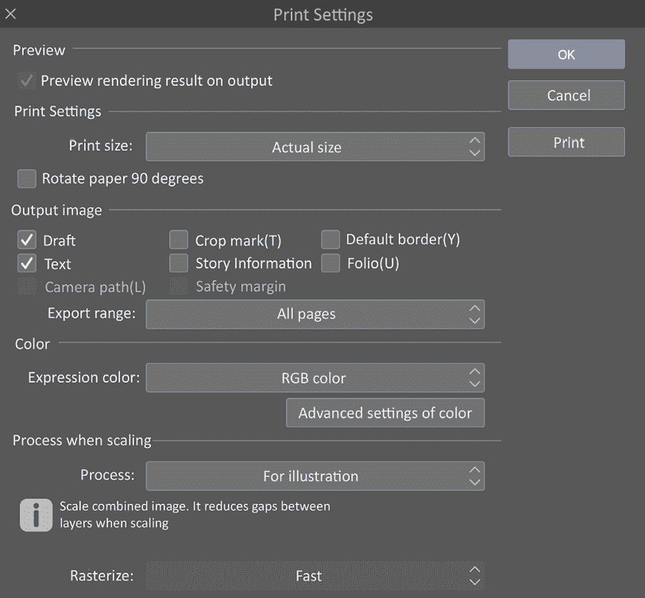

图 19.1 – 打印设置对话框

1.  在**预览**下，勾选**预览输出渲染结果**旁边的复选框。此选项允许我们在打印开始之前看到我们的页面将是什么样子，并且如果出现问题，我们可以停止打印过程。

1.  从下拉菜单中选择正确的**打印尺寸**设置。

我们现在将检查**打印设置**对话框中剩余的选项：

+   **打印设置**：大多数打印作业应该能够使用**实际大小**或**按纸张大小缩放**选项。**实际大小**设置会根据文件设置的大小进行打印。**按纸张大小缩放**选项会将打印内容调整到打印机中纸张的大小，如下面的打印示例所示：

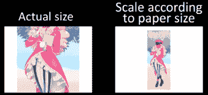

图 19.2 – 实际大小和根据纸张大小缩放选项结果截图

+   其他**打印设置**选项包括**像素大小**、**双页（仅限 EX）**和**展开（仅限 EX）**。使用**像素大小**，打印的大小会调整，使得图像像素和屏幕像素的比例为 1 比 1。使用**双页（仅限 EX）**，打印的页面布局设置为双页。两页打印在同一张纸上。前侧的边距变为外侧，因为装订边距将在纸的外侧。最后，使用**展开（仅限 EX）**，打印的页面布局设置为双页展开。两页打印在同一张纸上。边距将在纸的外侧。

+   **输出图像**：此选项让我们有机会选择是否打印图像的某些部分。通常，任何设置为**草稿**层的图层都不会打印或导出，但我们可以通过勾选**草稿**旁边的框来选择打印草稿层。我们还可以选择是否打印文本、故事信息等。在**导出范围（仅限 EX）**下有**所有页面**、**到裁剪标记偏移量**或**到裁剪标记内部**选项。如果我们有超出任何裁剪标记（艺术作品的出血区域）的艺术作品，但希望它被打印，我们应该选择**所有页面**选项。其他两个选项将在裁剪标记或裁剪标记内部停止打印。以下截图显示了各种选项的结果：

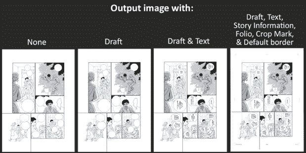

图 19.3 – 输出图像选项结果截图

+   **颜色**：在**表达式颜色**设置下，我们还有一个包含几个选项的下拉菜单。第一个是**自动检测合适的颜色深度**，它允许 Clip Studio Paint 根据打印的文件自动设置颜色深度。

有两个**双色**选项，一个称为**阈值**，另一个称为**色调**。这两个选项都以纯黑白打印，没有灰色调。**阈值**选项将任何灰色或彩色调自动转换为黑白。**色调**选项仍然以纯黑白打印，没有灰色，但它将任何灰色或彩色区域转换为模仿阴影的黑色点区域。**灰度**选项以灰度打印，**RGB 颜色**设置以打印机转换为其自身油墨颜色的 RGB 值打印图像：

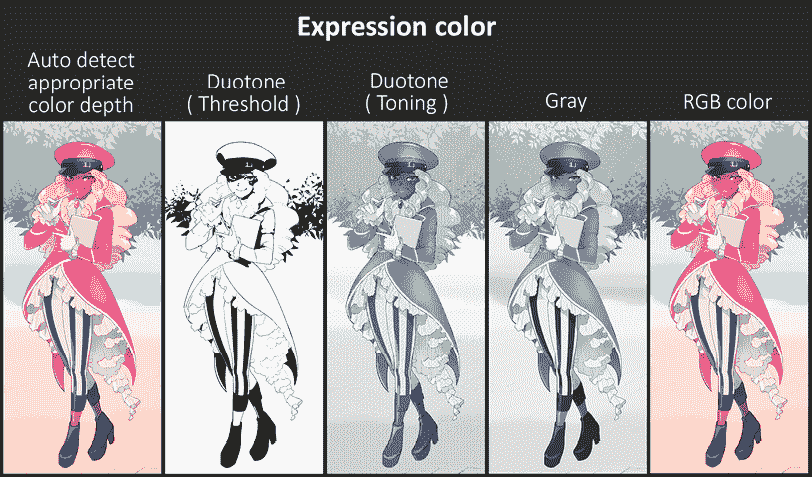

图 19.4 – 表达式颜色选项结果截图

+   选择与您要打印的图像最匹配的**表达式颜色**设置。以下截图显示了所有颜色选项：

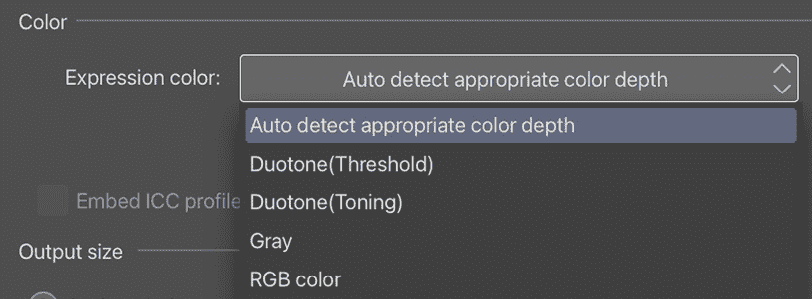

图 19.5 – 表达式颜色选项的截图

+   **颜色高级设置**选项实际上并没有提供给我们高级颜色选项，而是打印裁剪标记和色调的选项。以下是**颜色高级设置**对话框的截图：

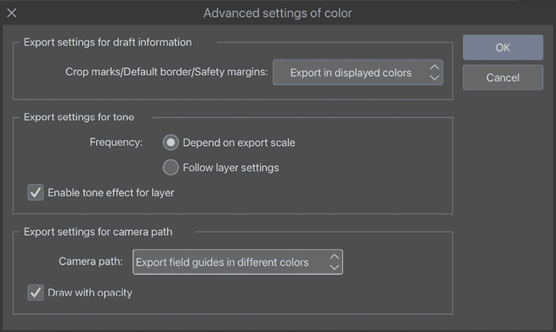

图 19.6 – 颜色对话框高级设置的截图

+   在**裁剪标记/默认边框/安全边距**选项中，我们可以将其设置为**导出显示颜色**（以首选项中边框设置的颜色打印）或设置为**导出为黑色**和**导出为青色**，这两个选项都很直观！

    在**导出色调设置**下，我们可以根据打印的缩放比例调整屏幕色调的大小（**根据导出缩放**）或使用图像中色调的设置（**跟随图层设置**）。根据打印图像的缩放比例，这可以用来控制可能由屏幕色调引起的任何莫尔图案。莫尔是一种在线条图案重叠的区域无意中出现的图案，有时出现在你使用了屏幕色调的打印上：

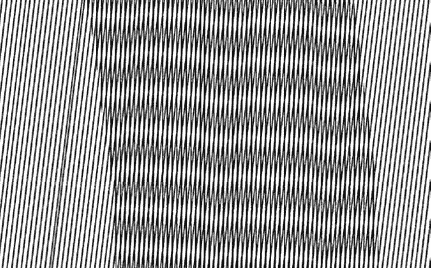

图 19.7 – 莫尔图案示例的截图

+   我们可以忽略**导出相机路径设置**，除非你在动画中用关键帧记录了相机路径。

+   **缩放时处理**：我们现在可以回到**打印设置**来完成选项的调整。以下截图所示的最后打印设置部分是**缩放时处理**选项。这些是**用于插图**和**用于漫画**。

这些设置改变了打印前图像的处理方式。如果我们没有使用很多色调，那么**用于插图**设置适合我们的需求。在**用于漫画**设置中，色调层在打印前单独处理，以便它们可以缩放，这意味着出现莫尔图案的机会更小：

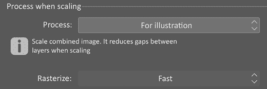

图 19.8 – 缩放设置时的截图

最后，我们有一个下拉菜单用于我们的**光栅化**设置。如果我们只是打印一份快速副本来看看我们的文本或布局看起来如何，**快速**设置就足够了。为了更好的打印效果，请使用**优先质量**设置。好吧，这就是打印设置的说明。现在，按照以下步骤保存你刚刚调整的设置：

1.  点击**确定**按钮。

1.  要立即打印，请点击**打印**按钮。你将需要选择你的打印机以及任何打印机设置，然后才能看到打印预览屏幕。如果在预览屏幕上任何东西看起来不对，取消打印作业，调整打印设置，然后再次尝试。

1.  如果你没有从**打印设置**窗口执行打印，当你准备好时可以点击**文件** | **打印**来打印图像。

即使只关注 Clip Studio Paint 提供的打印选项，也有很多内容需要了解！请确保查看任何可能需要调整的打印机特定选项，例如打印质量和打印数量。您可能需要调整几次才能从您的家用打印机获得最佳的打印效果。

对于大多数家用打印机来说，打印多份我们的漫画以分发或出售并不经济。这可能非常适合小批量彩色印刷，但对于任何更大数量的印刷，我们希望导出我们的图像，以便我们可以将它们发送给出版社或印刷店。让我们在下一节中找出如何操作。

# 打印导出

无论您是在制作漫画书还是制作在集会上出售的海报图像，您都需要知道如何从 Clip Studio Paint 打印或如何导出您创建的图像以发送到本地印刷店、在线印刷店或出版社。如果您还不知道，您可以将您的艺术作品打印在贴纸、徽章、杯子、T 恤、贴片等更多物品上！

在本节中，我们正在探讨如何准备您的漫画文件，使其准备好发送到印刷店或出版社。

**提示**

即使您只计划在网上展示您的作品，您也应该考虑将文件设置成好像您要打印它一样。以 300 dpi 工作，并将文件尺寸设置为与您最终要打印的纸张尺寸相匹配。即使您现在只考虑互联网，您最终可能想开始打印您的艺术作品。在创建时为打印设置将节省大量时间、头痛和重绘！

将我们的文件发送给专业的胶版印刷机或处理少量按需印刷书籍的出版社，与将它们发送到街角的复印店之间有很大的区别。在将文件发送出去印刷时，请确保您已经研究过打印机接受的文件格式以及他们是否有任何限制。当您将文件带到当地的连锁办公用品店或复印店时，大多数文件格式都可以正常工作，所以您可以根据自己的喜好来格式化您的图像。

**提示**

如果可能的话，找到一个可以大量印刷的小型本地印刷店。他们不仅通常有更好的价格，而且他们可以经常与您合作完成特殊项目。此外，这些小型商店的员工通常对他们的设备以及如何为您的艺术作品获得最佳打印质量有更多的了解。

在本节中，我们将导出高质量、无损的图像版本，这些图像在打印时看起来很好，即使他们没有 Clip Studio Paint，任何人也可以打开。按照以下步骤导出适合打印的图像格式：

1.  打开您想要导出的图像。

1.  在**文件**菜单中，点击**文件**，然后选择**导出（单层）**选项。

1.  在**导出（单层**）选项下的选项列表中，选择要导出的图像文件格式，然后点击它。文件格式将在这些步骤之后讨论。

1.  在出现的窗口中命名你的文件并选择保存位置。

1.  点击**保存**以弹出导出设置对话框。

1.  在窗口中选择要导出的参数。它应该看起来类似于以下截图所示的**psd 导出设置**窗口。其中一些选项应该与上一节中的**打印设置**中的选项相似：

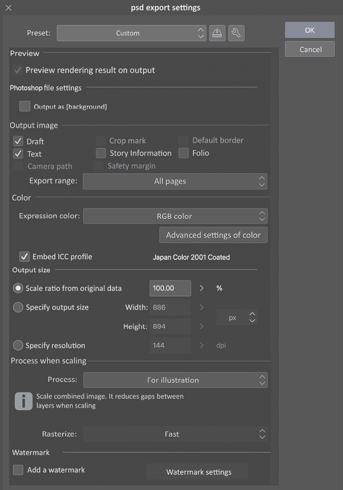

图 19.9 – psd 导出设置对话框截图

1.  点击**确定**完成导出。

这里是**导出**设置下可用的文件格式截图：

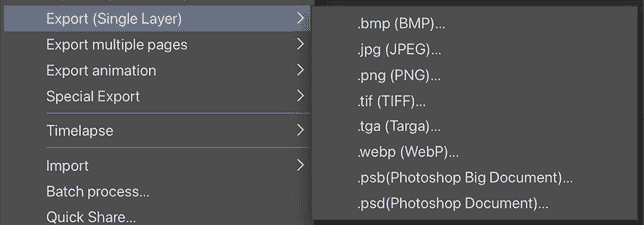

图 19.10 – 导出（单层）选项的截图

以下列表解释了每种文件格式：

+   **.bmp**（**BMP**）：位图图像。无损格式，无压缩。创建大文件大小。

+   **.jpg**（**JPEG**）：广泛使用的压缩图像格式。适用于网页显示，但在打印图像时有时不适用。

+   **.png**（**可移植网络图形（PNG**））：无损图像格式，能够在最终输出中保留透明度，适用于彩色或灰度。图像文件大小小，但保持原始质量。

+   **.tif**（**TIFF**）：无损文件格式，可以保留图层信息、透明度和原始质量。不适用于在线显示，但适合存储或编辑。

+   **.tga**（**Truevision 高级光栅图形适配器（TARGA**））：位图图像格式，不适用于照片或具有大量渐变的图像，但适用于图标、卡通和线艺术等简单图像。

+   **.webp（WebP**）：由谷歌制作的文件格式，允许网站以比 PNG 和 JPEG 等其他格式小得多的尺寸显示高质量图像。适用于网页显示。

+   **.psb**（**Photoshop 大文档**）：Adobe Photoshop 图像格式，适用于处理具有大量颜色深度、分辨率或大画布大小的图像。不适用于网页显示。

+   **.psd**（**Photoshop 文档**）：Adobe Photoshop 文档格式，适用于将在 Photoshop 中打开和进一步编辑的图像。不适用于网页显示。

你不必记住与每个文件格式相关的所有信息，只需记住最适合你的格式即可，这样下次导出漫画文件时，你就能确切知道选择哪一个。一般来说，了解 JPEG 适用于网页显示，而 PNG 和 PSD 适用于打印是很好的。

你现在了解了尺寸格式，但关于控制图像质量和文件大小呢？这意味着 JPEG 是一种压缩图像格式，不适用于打印吗？我们将在下一节中找到答案。

# 调整图像质量和文件大小

有时候您不需要保存全分辨率图像，例如在导出用于互联网或发送给客户证明时。本节将解释如何导出具有压缩的图像，以便图像质量和文件大小降低，便于处理。在开始以下步骤之前，您需要有一个打开的文件进行导出：

1.  在**文件**菜单中，转到**文件** | **导出（单层）** | **.jpg (JPEG)**。

1.  命名文件并选择要保存的文件夹。点击**保存**。

1.  **JPEG 导出设置**对话框将出现。点击窗口顶部旁边的复选框**在输出上预览渲染结果**以启用此选项。

1.  在**JPEG 设置**下，找到**质量**设置。以下屏幕截图中已标记：

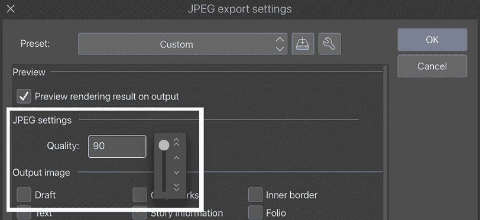

图 19.11 – JPEG 导出设置截图

1.  使用滑块或箭头调整设置以更改文件的压缩率。数字越小，文件压缩程度越高。压缩牺牲了图像质量以使最终文件大小更小。

1.  点击**确定**。

1.  现在将出现**导出预览**窗口。如果需要，继续使用预览窗口右下角的设置调整质量。

1.  点击**确定**以完成导出。

质量设置控制最终文件中的压缩量。压缩降低图像质量以使整体文件大小更小，使图像在互联网上加载更快。

在以下屏幕截图中，**质量**选项设置为**90**。注意窗口右下角的大文件大小，为 601.97 KB：

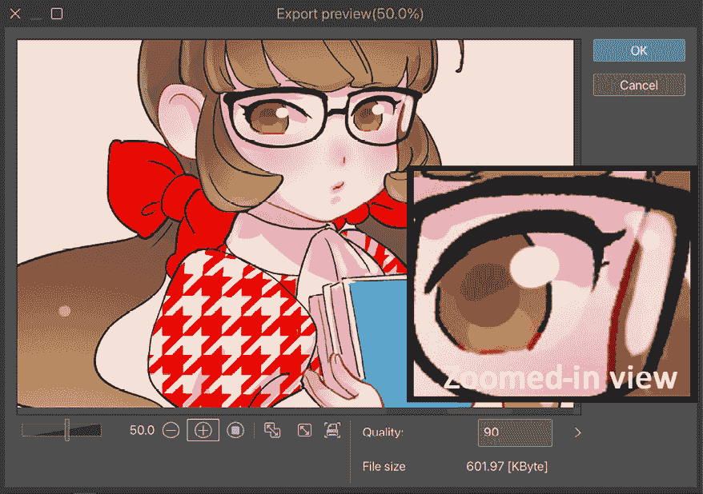

图 19.12 – 质量为 90%的导出预览截图

通过降低质量，我们可以使最终文件大小更小。这样做会降低图像质量。注意以下屏幕截图中文件大小下降了多少，但也要注意由于低质量，图像变得多么像素化，尤其是在渐变和黑色线条周围：

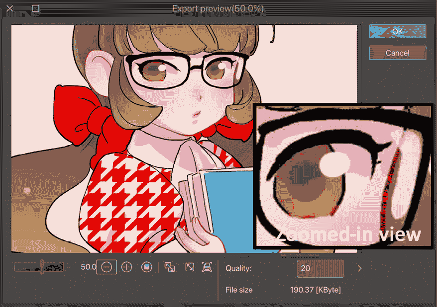

图 19.13 – 质量为 20%的导出预览截图

我们降低了图像质量，因此文件大小更轻，更容易处理！这对于可以用作互联网缩略图的图像来说非常完美。显然，由于图像的低质量和像素化噪声，我们无法用于打印。我建议仅将**.jpg**图像文件用于互联网使用。

**重要提示**

只有在导出为`.jpg`和`.webp`文件格式时才能调整图像质量。其他格式是无损的，无法压缩。

现在，您已经知道如何调整图像质量，以及如果您将图像质量降低到较低分辨率会发生什么。然而，`.jpg`和`.webp`是调整质量的唯一格式；其他文件格式可以在保持文件质量的同时调整大小。我们可以按百分比、宽度或分辨率导出文件，这将在下一节中介绍。

# 在导出时调整图像大小

另一种更改导出图像文件大小的方法是在过程中更改图像的宽度和高度。这可以在不更改原始文件的情况下即时完成，确保您永远不会意外保存原始绘图的 600 像素宽版本。

为了完成以下步骤，您需要一个打开的文件以进行导出：

1.  在**文件**菜单中，转到**导出（单个图层**）并选择新文件的所需文件格式。在这个例子中，我们将使用**.png**文件格式。

1.  为文件命名并在您的计算机上选择一个文件夹以保存它。点击**保存**。将显示您在*步骤 1*中选择的文件格式的导出设置。

1.  定位**输出大小**选项。它们在此屏幕截图中标记：

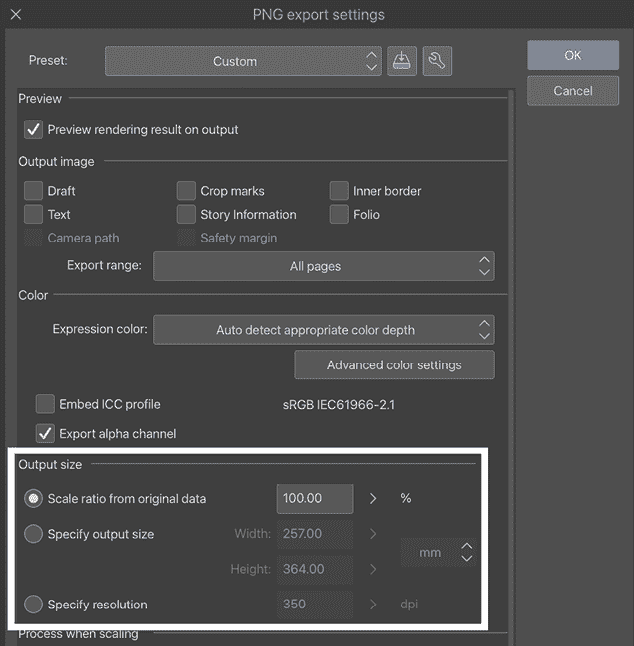

图 19.14 – PNG 导出设置对话框的屏幕截图

1.  选择**从原始数据中缩放比例**旁边的比例按钮，以按百分比缩放图像。在*图 19.15*中，缩放比例已设置为**50.00**%。请注意，**宽度**和**高度**会随着比例的变化而变化：

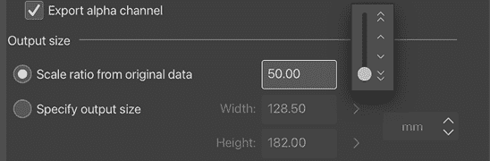

图 19.15 – 输出大小选项的屏幕截图

1.  选择**指定输出大小**旁边的比例按钮，以输入确切的**宽度**或**高度**测量值。您可以通过下拉菜单更改测量比例到**厘米**、**毫米**、**英寸**、**像素**和**点**。在下面的屏幕截图中，我们输入了**210** **毫米**的宽度。当我们输入新的**宽度**测量值时，**高度**会自动更改：

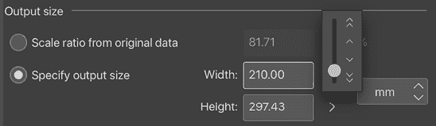

图 19.16 – 输出大小选项的屏幕截图（2）

1.  点击**确定**以完成导出。

太好了！现在我们知道了如何更改导出图像的质量和大小。让我们看看在下一节中上传图像到互联网时需要具体做什么。

# 为网页显示导出

除了打印您的作品外，成为知名艺术家的最佳方式之一是将您的作品发布在互联网上。无论您是否有自己的网站、托管账户，还是在社交媒体上发布，互联网都是与其他艺术家建立联系并与世界分享您的艺术和故事的好方法。

让我们使用适合互联网的设置导出一个漫画页面。您需要打开一个图像以进行导出。它可以具有任何宽度、高度和分辨率。我们将在完成导出过程中调整这些参数。

按照以下步骤完成此过程：

1.  按照本章前几节中的详细说明执行**导出（单层）**命令，并选择适合网络显示的格式。**JPEG**因其文件大小小且能够控制压缩，以及大多数社交媒体平台都接受它，因此推荐使用。

1.  为你的文件命名，并在你的电脑上选择一个文件夹来保存它。点击**保存**。

1.  在随后出现的**导出设置**窗口中，确保已勾选**在输出时预览渲染结果**选项。

1.  如果你使用的是`.jpg`格式，请根据上一节中的说明调整**质量**选项。在此截图中，我们将**质量**选项设置为**70**。

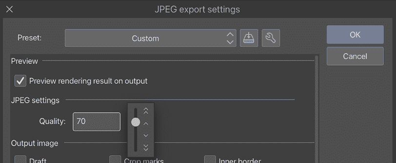

图 19.17 – JPEG 质量选项的截图

1.  调整**输出尺寸**选项到适合网络的尺寸。通常，宽度为**1000**像素或更少，但根据你的图像格式或上传图像的网站，这可能会变化。例如，水平漫画条可能需要比这更宽才能清晰可读。在以下截图中，我们使用了**指定输出尺寸**选项将图像宽度设置为**1000**像素：

图 19.18 – JPEG 输出尺寸选项的截图

1.  在导出设置对话框的底部，我们有**缩放时处理**选项。如果你正在导出彩色图像或未使用网点的图像，请选择**用于插图**选项。如果导出的图像是带有网点的漫画，请选择**用于漫画**选项，以减少导出图像中的摩尔纹数量。

1.  点击**确定**。

**导出预览**窗口将在图像渲染完成后显示。使用此预览来检查最终导出文件的尺寸和质量。通过预览窗口右下角的选择项来调整文件质量。这允许我们在最终导出前更改压缩设置，以确保我们有一个外观良好且文件大小合理的图像。

在以下截图中，我们将质量从初始的**70**调整到**80**，以在保持文件大小小的同时提高图像质量：

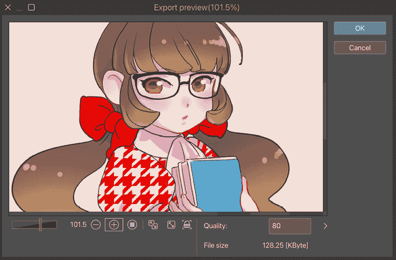

图 19.19 – 导出预览窗口的截图

1.  点击**确定**以完成导出。

完成！你现在可以准备好将你的作品上传到互联网上了！

对于已经拥有或考虑切换到 Clip Studio Paint EX 版本（比专业版更昂贵，具有更多专家使用功能）的人，我想告诉你们，有一个非常实用的功能用于创建网络漫画。网络漫画如今在滚动阅读风格的漫画和漫画网站上成为一个更大的现象。继续阅读以了解如何将文件导出为网络漫画。

# 导出网络漫画（仅限 EX 版）

网络漫画是一种带状形的漫画或漫画书，就像电影胶卷一样，供读者滚动阅读漫画或漫画书。您可以创建一个非常长的网络漫画，读者可以滚动阅读，无需点击即可阅读下一页。这对于像 X 这样的平台来说效果非常好，因为在一个帖子中只能附加有限数量的图像。

以下截图显示了模拟故事漫画和网络漫画之间的风格差异：

![img/B22275_19_19.20.png]

图 19.20 – 风格差异的截图

然而，如果内容过长，处理起来也会变得困难。您无法在缩略图中检查内容，而且不容易跳转到特定位置进行编辑。最好的方法是创建一个 B5 大小的漫画页面，然后将几页放在一起形成带状。

在本节中，我们将学习如何借助 Clip Studio Paint EX 轻松将文件导出为网络漫画。

您可以通过以下步骤来完成此操作：

1.  创建包含超过两页的漫画。

1.  在**文件**菜单中，选择**特殊导出** | **导出网络漫画…**以打开**导出网络漫画**对话框，其外观如下截图所示：

![img/B22275_19_19.21.png]

图 19.21 – 导出网络漫画对话框的截图

1.  在**文件格式**下拉菜单中，有导出文件格式的选择，包括**.png (PNG) 或 .jpg (JPEG)**。选择**.jpg (JPEG)**是一个安全的选择，因为它在大多数网站和社交媒体平台上都广泛使用。同时，也可以更改导出文件的名称为您的选择。

1.  在**输出大小**设置中，您可以通过更改百分比数字来放大或缩小。您还可以通过输入像素值来选择**指定宽度**。这对于一些限制图像宽度的社交媒体平台或网站来说非常有用。

1.  在**页面范围**设置中，您可以选择要导出的页面。选择**所有页面**将导出所有页面，而选择**指定页面**则可以输入起始和结束页码。

1.  在**文件导出**设置中，选择**单独导出页面**将页面导出为单独的图像。选择**导出为单页**将所有选定的页面导出为一个图像，这些页面垂直连接，类似于电影胶卷。通过选择**垂直分割**，您还可以在输入的像素点或长度处将页面分割成两个垂直部分。在对话框底部，您可以看到文件数量和总像素高度。

1.  一旦您已设置好所有设置，请点击**确定**以导出。请耐心等待；这可能需要几分钟才能完成。

在以下截图中，展示了使用**导出为单页**和**垂直分割**选项导出文件时的样本：

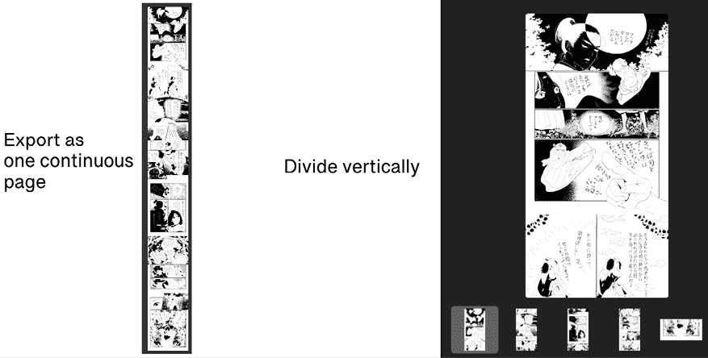

图 19.22 – 两个导出文件的截图

您现在已经掌握了如何创建用于在社交媒体或网站上分享的网络漫画！

现在，我们将探讨 Clip Studio EX 拥有的另一个出色功能，即批量导出页面，这意味着您不需要逐个调整大小或更改图像质量！多么节省时间！继续阅读以了解如何操作。

# 批量导出页面（仅限 EX）

在本节中，我们将学习如何批量导出漫画页面。

只要您拥有 Clip Studio Paint EX，就无需逐页导出整个漫画。因为我们可以在软件的 EX 版本中创建故事文件，我们也可以一次性导出所有或部分这些故事文件。它们甚至可以同时调整大小和压缩，从而在完成项目时为您节省大量时间和精力。

按照以下步骤一次性导出整章的页面：

1.  在**文件**菜单中，转到**导出多个页面**，然后点击**批量导出…**。此菜单在下面的截图中显示：

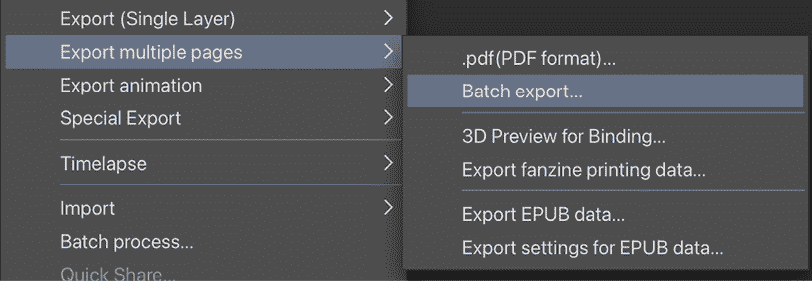

图 19.23 – 导出多个页面选项的截图

1.  **批量导出**对话框将出现，如下面的截图所示：

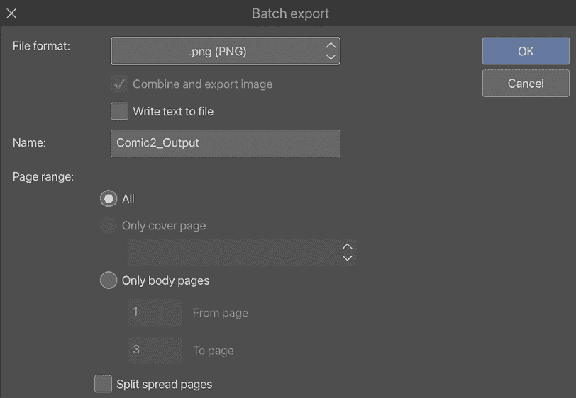

图 19.24 – 批量导出对话框的截图

1.  使用下拉菜单选择导出图像的文件格式。

1.  如有需要，点击**写入文本到文件**旁边的框，以创建用于故事文件中的文本文件。

1.  在**名称**框中，输入一个名称，这将作为每个导出图像的文件名开头。

1.  选择**页面范围**。**全部**选项将导出故事文件中的所有图像。**仅封面页**选项将允许我们导出仅前封面、仅后封面或所有封面页。**仅正文页**选项允许我们选择要导出的内部页面范围。

1.  要将两页跨页作为单独的图像导出，请勾选**分割跨页页面**旁边的框。

1.  点击**确定**。

Clip Studio Paint 现在将加载文件并准备导出。这可能会根据您的计算机规格和文件大小需要几分钟时间。请耐心等待！

1.  文件加载后，将显示所选文件格式的导出设置。根据本章其他部分中详细说明的内容进行调整。

1.  当所有设置都已调整完毕，点击**确定**以完成导出。

我确信，如果您正在创作长篇故事漫画，这将为您节省大量时间。但您知道 Clip Studio Start 屏幕中有一个漫画分享功能吗？这是分享您创作的一个绝佳地方，它将为您创建一个 3D 查看器虚拟漫画书。然后，您可以使用页面链接将其发布到您的社交媒体！让我们在下一节中找出这个功能。

# 导出到 Clip Studio SHARE

在本节中，我们将探索 Clip Studio Start 中的 Clip Studio SHARE 功能，您可以在其中创建您作品的展示。

当你上传超过四页的漫画时，在 X、Instagram、Facebook、Tumblr 或其他社交媒体平台上按顺序展示所有内容会很困难。

使用 Clip Studio SHARE 可以帮助你通过创建一个特殊链接以方便浏览，将超过四页的漫画按正确顺序上传到社交媒体！Clip Studio SHARE 甚至为你创建一个带有封面和设计书脊的虚拟 3D 漫画书。

首先，你需要有一部包含超过三页的漫画，然后按照以下步骤使用 Clip Studio SHARE 创建你的漫画展示：

1.  点击命令栏上的**CLIP STUDIO**图标以转到 Clip STudio Start 屏幕。图标如下截图所示：

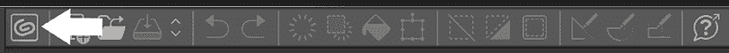

图 19.25 – 命令栏截图

1.  点击 Clip Studio Start 屏幕右上角的九宫格图标，如下截图所示：

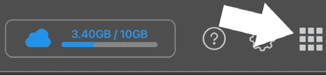

图 19.26 – Clip Studio Start 菜单图标截图

1.  Clip Studio Start **菜单** 窗口将弹出。点击以下截图所示的区域，选择**展示你的作品**图标：

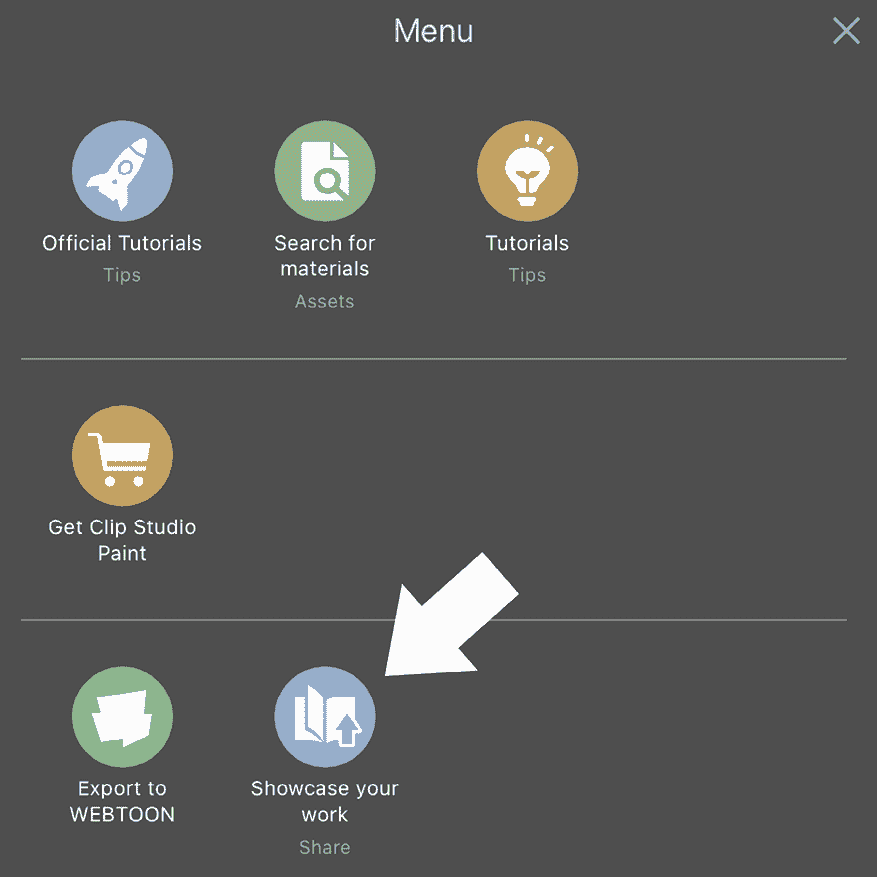

图 19.27 – Clip Studio Assets 菜单窗口截图

1.  在**Clip Studio SHARE**屏幕上，点击以下截图所示的**发布你的故事**按钮：

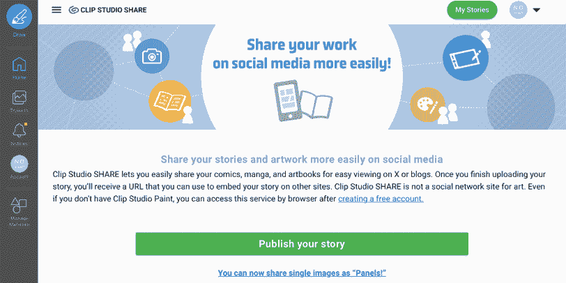

图 19.28 – Clip Studio SHARE 屏幕截图

1.  有两种选项 – **从浏览器上传**和**从 Clip Studio 上传**。点击**从浏览器上传**选项将允许你从电脑浏览器中选择图片，而**从 Clip Studio 上传**将带你到**你的作品**列表以选择故事（唯一带有 EX 版本的选项）或列表中的图片。选择**从浏览器上传**将带你到**阅读方向**设置屏幕，你可以选择首选的方向。屏幕如下截图所示：

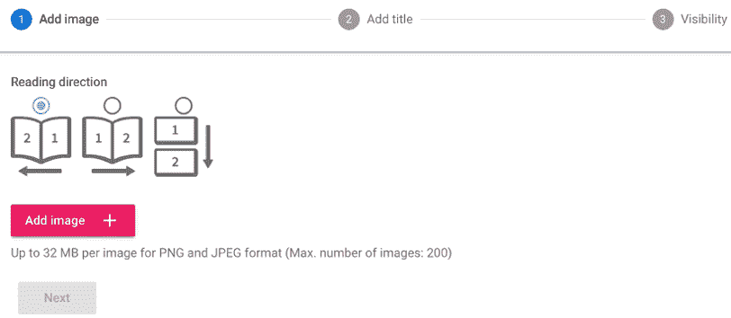

图 19.29 – 阅读方向设置屏幕截图

1.  在选择阅读方向后，点击**添加图片** **+** 以在电脑浏览器中按顺序选择图片，然后点击**添加**。屏幕将显示你选择的图片列表以及它们将显示的顺序，如下截图所示：

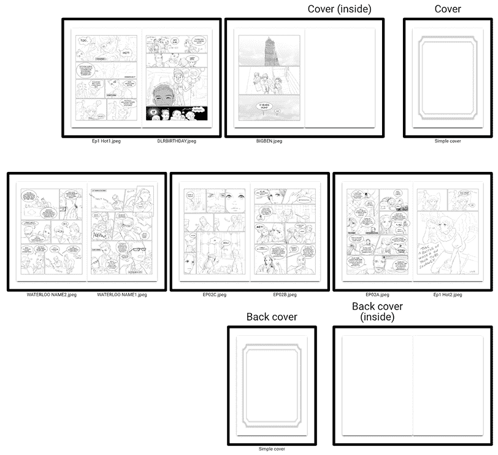

图 19.30 – 模拟页面列表截图

1.  如果你一切都看起来正常，点击**下一步**按钮。如果你在*步骤 5*中选择了**从 Clip Studio 上传**，将出现阅读方向选项。选择一个选项将带你到**选择作品**列表，以选择你想要上传的漫画作品。如果你有 Clip Studio EX 版本，你可以选择**故事（水平阅读方向）**。如果没有，你只能选择另一个选项，**网络漫画（垂直阅读方向）**。选择艺术品后，将出现一个确认窗口。然后，在窗口中点击**确定**。

1.  一旦你从浏览器或 Clip Studio 上传了图像，你将看到一个输入关键信息的屏幕，包括标题、缩略图图像、用 200 个字符总结你的漫画、社交媒体分享的缩略图、3D 查看器书籍大小选择（A4、B5 或 B6）、选择图像是否对齐到书籍大小、封面硬度、封面纹理/完成度、页面纹理和书脊图像。

1.  在输入上述关键信息后，点击屏幕底部的**创建预览**按钮，在公开显示之前查看你的漫画预览。3D 查看器将类似于以下截图：

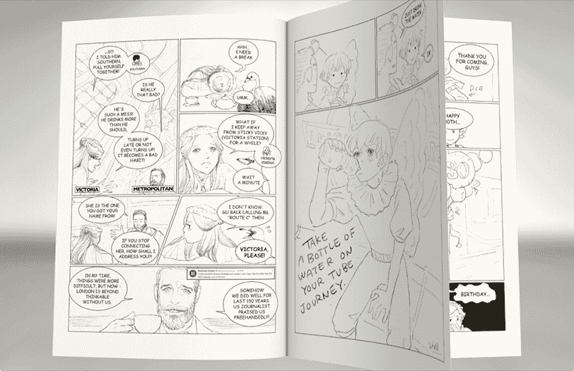

图 19.31 – 样本 3D 查看器截图

1.  你可以编辑内容并点击底部的**显示预览**按钮，直到预览看起来对你来说满意为止。一旦你对预览满意，点击屏幕底部的**下一步**按钮，将弹出**可见性**设置屏幕，如下截图所示：

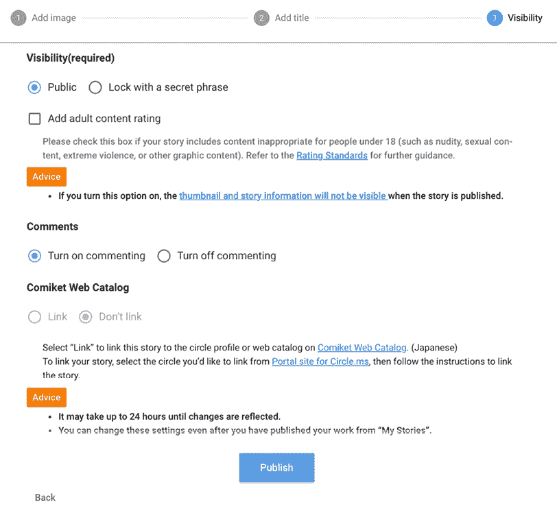

图 19.32 – 可见性设置屏幕截图

1.  在**可见性**设置屏幕上，你可以通过选择**公开**（任何人可见）或**使用密码锁定**（只有知道密码的人可见）来选择发布你的漫画。

1.  如果你选择**使用密码锁定**，将出现一个文本框供你输入密码短语。如果漫画不适合年轻观众，请勾选旁边的**添加成人内容评级**框。最后，选择是否允许人们评论你的漫画，然后点击**发布**按钮。然后，将出现如下截图所示的成功上传屏幕：

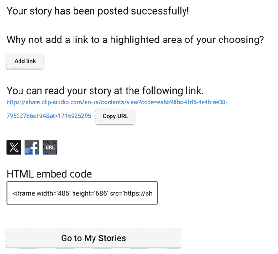

图 19.33 – 成功上传屏幕截图

1.  你可以添加链接、复制 URL、复制 HTML 嵌入代码，或者跳转到 X 和 Facebook 来发布链接。如果你想编辑或删除漫画，可以通过点击**前往我的故事**按钮进入一个包含你上传的漫画列表的屏幕。

虽然这是虚拟的，但看到你的漫画书籍有封面和书脊，可以像实体书一样翻阅，真是太棒了！现在，你有一个展示自己在线漫画的地方，人们可以在那里留下评论。所以，让我们与世界分享吧。

# 摘要

在这一章中，我们学习了如何将我们的艺术作品从 Clip Studio Paint 转换为可以与世界分享的文件。首先，我们学习了如何从 Clip Studio 打印图像到我们的家用打印机。然后，我们学习了如何导出图像发送到印刷店、复印店或出版社。我们学习了如何调整图像质量和尺寸，以及如何导出图像以便在互联网上显示良好。然后，我们学习了什么是网络漫画，以及如何以 EX 版本导出，我们还了解到了另一个伟大的 EX 权限——批量导出页面。最后，我们了解了一个伟大的 Clip Studio Start 服务，Clip Studio SHARE，您可以在其中创建一个虚拟的漫画展示。

这是本书的最后一章。学习如何使用 Clip Studio Paint 进行创作已经是一段漫长而有趣的旅程，现在它已经结束了。我希望所有这些技巧和提示都能对您的创意生活有所帮助和启发。

学习如何画漫画，当然，永远不会真正结束。考虑到这一点，我想建议两个你可能觉得有价值的资源。如果你有继续探索的愿望，我推荐：

+   *《理论与实践中的漫画：创作漫画的艺术》*，由《JoJo 的奇妙冒险》的创作者荒木飞吕彦所著。这本书非常适合关于如何编写故事和理解少年漫画类型的技巧。

+   *YouTube 上的“Deep Blizzard 的艺术学校”(`@deepblizzard`)。这个频道提供了最好的数字绘画技巧，包括许多与 Clip-Studio-Paint 相关的主题。

如果这本书在您的艺术创作中有所帮助，请随意在 Instagram 上标记我，`@inko_dokotei`，或通过社交媒体上的 `#clipstudiopaintart` 标签与其他 Clip Studio Paint 艺术家分享您的进度。

最重要的是，享受乐趣！

# 加入我们的 Discord！

与其他用户一起阅读这本书。提出问题，为其他读者提供解决方案，等等。

扫描二维码或访问链接加入社区。

[`packt.link/clipstudiopaint`](https://packt.link/clipstudiopaint)

[packt.com](http://packt.com)

订阅我们的在线数字图书馆，全面访问超过 7,000 本书和视频，以及行业领先的工具，帮助您规划个人发展并推进您的职业生涯。更多信息，请访问我们的网站。

# 为什么订阅？

+   使用来自 4,000 多位行业专业人士的实用电子书和视频，节省学习时间，增加编码时间

+   通过为您量身定制的技能计划提高您的学习效果

+   每月免费获得一本电子书或视频

+   完全可搜索，便于轻松访问关键信息

+   复制粘贴、打印和收藏内容

在 [www.packt.com](http://www.packt.com)，您还可以阅读一系列免费的技术文章，订阅各种免费通讯，并享受 Packt 书籍和电子书的独家折扣和优惠。

# 您可能还会喜欢的其他书籍

如果您喜欢这本书，您可能对 Packt 的其他书籍也感兴趣：

**《精通 Adobe Photoshop Elements - 第六版**》

Robin Nichols

ISBN: 9781835469385

+   掌握 Photoshop Elements 2024 的新功能，包括 AI 驱动的工具和移动端一键修复

+   创建吸引人的照片拼贴、数字绘画和图形设计

+   高效组织您的照片收藏，以便轻松访问和管理

+   使用专业编辑的照片和艺术品增强您的社交媒体影响力

+   使用高级图层技术创建更强大和沉浸式的插图

+   获取全面知识，成为熟练的 Photoshop Elements 用户

**《Final Cut Pro 高效编辑 - 第二版**》

Iain Anderson

ISBN: 9781837631674

+   组织和管理来自多个来源的媒体

+   使用直观界面和强大工具编辑和操作视频

+   通过自定义工作空间和快捷键简化工作流程

+   轻松同步和编辑多机位采访，并学习高级剪辑技巧

+   使用高级音频和色彩分级工具实现专业品质的完成效果

+   使用内置协作工具与其他编辑器合作

+   创建令人惊叹的视觉效果和复杂的动态图形标题

+   以多种格式导出视频项目，以便在多个平台和用户设备上分发

**《音乐制作人 Ableton Live 11 创意指南 - 第一版**》

Anna Lakatos

ISBN: 9781801817639

+   理解 Live 的概念、音频和 MIDI 录音与编辑的工作流程以及 Warping

+   利用 Groove、MIDI 效果和 Live 11 的新工作流程增强功能来创作创新音乐

+   使用音频到 MIDI 转换工具快速翻译和生成想法

+   深入了解 Live 的自动化和调制功能，并探索项目组织技巧以加快工作流程

+   利用 MIDI 多声部表现力创作不断发展的声音和纹理

+   采用有用的技术进行制作，并发现现场表演的能力

**《音乐制作人 FL Studio 21 完全指南 - 第二版**》

Joshua Au-Yeung

ISBN: 9781837631650

+   结合压缩器、均衡器和立体声宽度效果插件等技术

+   将音频录入 FL Studio，校准音高并重新调整样本时间，并获得关于如何应用效果到人声的建议

+   创建人声和声，并学习如何使用声码器用乐器调制您的声音

+   创建故障效果，将音频样本转换为可演奏的乐器，并使用尖端效果进行声音设计

+   通过营销最佳实践和创作内容的技巧来打造您的品牌，以吸引更广泛的受众

+   在线发布您的音乐并收集版税收入

# Packt 正在寻找像您这样的作者

如果您有兴趣成为 Packt 的作者，请访问[authors.packtpub.com](http://authors.packtpub.com)并今天申请。我们已与成千上万的开发者和技术专业人士合作，就像您一样，帮助他们将见解分享给全球科技社区。您可以提交一般申请，申请我们正在招募作者的特定热门话题，或者提交您自己的想法。

# 分享您的想法

您已经完成了《学习 Clip Studio Paint，第四版》，我们非常想听听您的想法！如果您在亚马逊购买了这本书，请[点击此处直接进入该书的亚马逊评论页面](https://packt.link/r/1835886590)并分享您的反馈或在该购买网站上留下评论。

您的评论对我们和科技社区都非常重要，它将帮助我们确保我们提供的是高质量的内容。
