# 第二章：从简单文本创建图像

在本章中，将通过解释其操作方式和包含的元素来介绍**可缩放矢量图形**（**SVG**）。在浏览器环境中，SVG 与 HTML 非常相似，并且是 D3 表达其功能的一种方式。理解 SVG 的节点和属性将使我们能够创建许多类型的可视化，而不仅仅是地图。本章包括以下内容：

+   SVG 及其关键元素的概述

+   SVG 坐标系

+   SVG 的主要元素（线条、矩形、圆、多边形和路径）

SVG，一种 XML 标记语言，旨在描述二维矢量图形。SVG 标记语言位于 DOM 中，作为一个节点，精确地描述了如何绘制一个形状（曲线、线、圆或多边形）。就像 HTML 一样，SVG 标签也可以通过标准 CSS 进行样式化。请注意，由于所有命令都位于 DOM 中，形状越多，节点就越多，浏览器的工作量就越大。这一点很重要，因为随着 SVG 可视化变得更加复杂，它们的性能将变得不那么流畅。

主要的 SVG 节点声明如下：

```js
<svg width="200" height="200"></svg> 
```

此节点的基本属性是宽度和高度；它们为构成可视化的其他节点提供了主要容器。例如，如果你想在`200` x `200`的框中创建 10 个连续的圆，标签看起来会是这样：

```js
<?xml version="1.0"?> 
<svg width="200" height="200"> 
  <circle cx="60" cy="60" r="50"/> 
  <circle cx ="5" cy="5" r="10"/> 
  <circle cx="25" cy="35" r="45"/> 
  <circle cx="180" cy="180" r="10"/> 
  <circle cx="80" cy="130" r="40"/> 
  <circle cx="50" cy="50" r="5"/> 
  <circle cx="2" cy="2" r="7"/> 
  <circle cx="77" cy="77" r="17"/> 
  <circle cx="100" cy="100" r="40"/> 
  <circle cx="146" cy="109" r="22"/> 
</svg> 
```

注意，10 个圆需要 10 个 DOM 节点，加上其容器。

SVG 包含几个原语，允许开发者快速绘制形状。

我们将在本章中介绍以下原语：

+   `circle`：具有定义的半径和位置属性的常规圆

+   `rect`：具有高度、宽度和位置属性的常规矩形

+   `polygon`：任何多边形，由一系列点描述

+   `line`：具有起点和终点的线

+   `path`：通过一系列绘图命令创建的复杂线

# SVG 坐标系

关于位置的问题？这些原语在 SVG 元素内部绘制在哪里？如果你想在左上角放一个圆，在右下角放另一个圆怎么办？从哪里开始？

SVG 通过一个类似于笛卡尔坐标系的网格系统进行定位。然而，在 SVG 中（0,0）是左上角。*x*轴从左到右水平延伸，起始值为 0。*y*轴也从 0 开始，向下延伸。请参见以下插图：


关于在形状上方绘制形状的问题？如何控制*z*索引？在 SVG 中，没有*z*坐标。深度由绘制形状的顺序决定。如果你要绘制一个坐标为（10,10）的圆，然后绘制另一个坐标为（10,10）的圆，你会看到第二个圆覆盖在第一个圆的上方。

以下章节将介绍用于绘制形状的基本 SVG 原语及其一些最常见属性。

# 线

SVG 线条是库中最简单的一种。它从

从一个点到另一个点。语法非常简单，可以在以下位置进行实验：`http://localhost:8080/chapter-2/line.html`，假设 HTTP 服务器正在运行：

```js
<line x1="10" y1="10" x2="100" y2="100" stroke-width="1" 
 stroke="red"/>
```

这将给出以下输出：

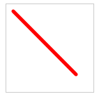

元素的属性描述如下：

+   `x1`和`y1`: 起始的*x*和*y*坐标

+   `x2`和`y2`: 结束的*x*和*y*坐标

+   `stroke`: 这会给线条一个红色

+   `stroke-width`: 这表示要绘制的线条的像素宽度

`line`标签也有改变线条末端风格的能力。例如，添加以下内容将改变图像，使其具有圆形末端：

```js
stroke-linecap: round; 
```

如前所述，所有 SVG 标签也可以使用 CSS 元素进行样式设置。产生相同图形的另一种方法是在以下代码中首先创建一个 CSS 样式：

```js
      line { 
        stroke: red; 
        stroke-linecap: round; 
        stroke-width: 5; 
      } 
```

然后你可以使用以下代码创建一个非常简单的 SVG 标签：

```js
<line x1="10" y1="10" x2="100" y2="100"></line> 
```

使用`path`标签可以实现更复杂的线条以及曲线；我们将在*路径*部分进行介绍。

# 长方形

创建矩形的 HTML 代码如下：

```js
<rect width="100" height="20" x="10" y="10"></rect> 
```

让我们应用以下样式：

```js
      rect { 
        stroke-width: 1; 
        stroke:steelblue; 
        fill:#888; 
        fill-opacity: .5; 
      } 
```

我们将创建一个以坐标(`10`,`10`)开始的长方形，宽度为`100`像素，高度为`20`像素。根据样式，它将有一个蓝色轮廓，灰色内部，并且看起来稍微不透明。请参见以下输出和示例

`http://localhost:8080/chapter-2/rectangle.html`:

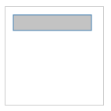

在创建圆角边框时，还有两个有用的属性

(`rx`和`ry`):

```js
<rect with="100" height="20" x="10" y="10" rx="5" ry="5"></rect> 
```

这些属性表示`x`和`y`角落将会有`5`像素的曲线。

# 圆形

圆的位置由`cx`和`cy`属性确定。这些属性表示圆心的*x*和*y*坐标。半径由`r`属性确定。以下是一个你可以实验的示例（`http://localhost:8080/chapter-2/circle.html`）：

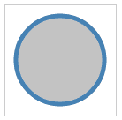

```js
<circle cx="62" cy="62" r="50"></circle> 
```

现在输入以下代码：

```js
   circle { 
        stroke-width: 5; 
        stroke:steelblue; 
        fill:#888; 
        fill-opacity: .5; 
   } 
```

这将创建一个具有熟悉的蓝色轮廓、灰色内部和半透明度的圆。

# 多边形

要创建多边形，请使用`polygon`标签。最好的方法是将其与孩子的点对点游戏进行比较。你可以想象一系列的点，用笔将每个(*x, y*)坐标用直线连接起来。一系列的点在`points`属性中标识。以下是一个示例（`http://localhost:8080/chapter-2/polygon.html`）：

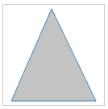

```js
<polygon points="60,5 10,120 115,120"/> 
```

首先，我们从`60,5`开始，移动到`10,120`。然后，我们继续到`115,120`，最后返回到`60,5`。

笔自动返回到起始位置。

# 路径

当使用 D3 创建地图时，最常使用的是 `path` SVG 标签。根据 W3C 的定义，你可以将 `path` 标签视为一系列命令，这些命令解释了如何通过在纸上移动笔来绘制任何形状。`path` 命令从放置笔的位置开始，然后是一系列后续命令，告诉笔如何用线条连接额外的点。`path` 形状也可以填充或对其轮廓进行样式化。

让我们看看一个非常简单的例子，复制我们创建的多边形三角形。

打开你的浏览器，转到 `http://localhost:8080/chapter-2/path.html`，你将在屏幕上看到以下输出：

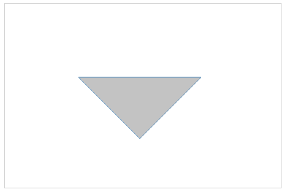

在三角形的任何位置右键单击并选择“检查元素”。

此形状的 `path` 命令如下：

```js
<path d="M 120 120 L 220 220, 420 120 Z" stroke="steelblue" 
 fill="lightyellow" stroke-width="2"></path>
```

包含路径绘制命令的属性是 `d`。命令遵循以下结构：

+   `M`: 将笔放下，开始在 `x = 120 y = 120` 处绘制

+   `L`: 画一条直线连接 (`120`,`120`) 到 `x = 220 y = 220`，然后画另一条直线连接 (`220`,`220`) 到 `x = 420 y = 120`

+   `Z`: 将最后一个数据点 (`420`,`120`) 连接到起始点 (`120`,`120`)

# 实验

让我们尝试一些实验来巩固我们刚刚学到的知识。从 Chrome 开发者工具中，只需简单地从路径末尾移除 `Z`，然后按 *Enter*：

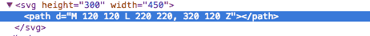

你应该看到最上面的线条消失了。尝试在 `L` 子命令中更改数据点的其他实验。

# 曲线路径

路径也可以有曲线。概念仍然是相同的；你用线条连接几个数据点。主要区别在于现在你在连接点时应用曲线。有三种类型的曲线命令：

+   立方贝塞尔

+   二次贝塞尔

+   椭圆弧

每个命令都在 [`www.w3.org/TR/SVG11/paths.html`](http://www.w3.org/TR/SVG11/paths.html) 中详细解释。作为一个例子，让我们将立方贝塞尔曲线应用到三角形上。命令的格式如下：

```js
C x1 y1 x2 y2 x y 
```

此命令可以插入到路径结构中的任何位置：

+   `C`: 表示我们正在应用立方贝塞尔曲线，就像前一个例子中的 `L` 表示直线

+   `x1` 和 `y1`: 添加一个控制点以影响曲线的切线

+   `x2` 和 `y2`: 在应用 `x1` 和 `y1` 后添加第二个控制点

+   `x` 和 `y`: 表示线条最终停留的位置

要将此命令应用到我们之前的三角形上，我们需要将第二条线条命令 (`320 120`) 替换为立方命令 (`C 200 70 480 290 320 120`)。

之前，语句如下：

```js
<path d="M 120 120 L 220 220, 320 120 Z"></path> 
```

添加立方命令后，它将如下所示：

```js
<path d="M 120 120 L 220 220, C 200 70 480 290 320 120 Z"></path> 
```

这将产生以下形状：

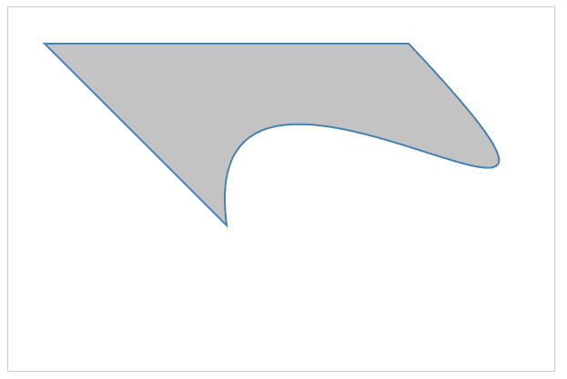

为了说明立方贝塞尔曲线的工作原理，让我们画圆和线来显示 `C` 命令中的控制点：

```js
<svg  height="300" width="525"> 
      <path d="M 120 120 L 220 220 C 200 70 480 290 320 120 Z ">
       </path> 
      <line x1="220"  y1="220" x2="200" y2="70"></line> 
      <circle cx="200" cy="70" r="5" ></circle> 
      <line x1="200"  y1="70"  x2="480" y2="290"></line> 
      <circle cx="480" cy="290"  r="5"></circle> 
      <line x1="480"  y1="290" x2="320" y2="120"></line> 
</svg> 
```

输出应该看起来像以下屏幕截图所示，可以在 `http://localhost:8080/chapter-2/curves.html` 进行实验。您可以看到由控制点（输出中用圆圈表示）和应用的立方贝塞尔曲线创建的角度。

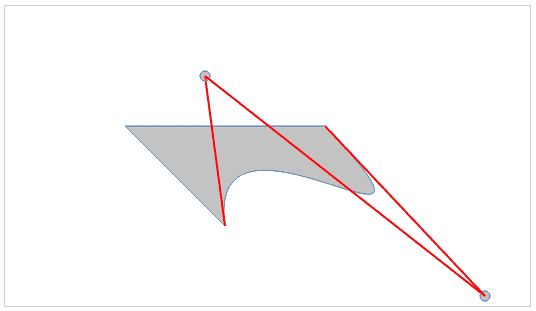

SVG 路径是在绘制地理区域时利用的主要工具。然而，想象一下，如果您要手动使用 SVG 路径绘制整个地图，这项任务将变得非常耗时！例如，我们第一章中欧洲地图的命令结构有 3,366,121 个字符！即使是一个简单的州，如科罗拉多州，如果手动执行，代码也会很多：

```js
<path  id="CO_1_" 
 style="fill:#ff0000" d="M 115.25800,104.81000 L 
 116.51200,84.744000 L 117.00000,77.915000 L 106.82700,77.077000 L 
 99.371000,76.452000 L 88.014000,75.198000 L 81.709000,74.431000 L 
 80.907000,81.189000 L 79.932000,88.018000 L 78.788000,96.547000 L 
 78.329000,99.932000 L 78.154000,101.11800 L 88.641000,102.37200 L 
 99.898000,103.72200 L 109.88400,104.39200 L 111.91300,104.60300 L 
 115.39700,104.77700"/>
```

我们将在后面的章节中学习 D3 如何提供帮助。

# 变换

`transform` 允许您动态地更改您的可视化，这是使用 SVG 和命令绘制形状的优点之一。变换是您可以添加到我们迄今为止讨论的任何元素上的一个附加属性。在处理我们的 D3 地图时，两种重要的 `transform` 类型是：

+   **平移**：移动元素

+   **缩放**：调整元素中所有属性的坐标

# 翻译

您可能会在所有地图制图工作中使用这种变换，并在大多数在线的 D3 示例中看到它。作为一种技术，它通常与边距对象一起使用，以移动整个可视化。以下语法可以应用于任何元素：

```js
transform="translate(x,y)" 
```

在这里，`x` 和 `y` 是移动元素的坐标。

例如，一个平移 `transform` 可以使用以下代码将我们的圆向左移动 `50` 像素，向下移动 `50` 像素：

```js
<circle cx="62" cy="62" r="50" transform="translate(50,50)"></circle> 
```

这里是输出：

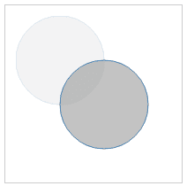

注意，半透明的图像代表原始图像和形状移动的起始位置。`translate` 属性不是绝对位置。它相对于 `cx`、`cy` 调整圆的起点，并给这些坐标加上 `50`。如果您要将圆移动到容器的左上角，您将使用负值进行平移。例如：

```js
transform="translate(-10,-10)" 
```

随意使用您的 Chrome 开发者工具或代码编辑器进行实验。

`http://localhost:8080/chapter-2/translate.html`。

# 缩放

缩放变换易于理解，但如果您失去了缩放起源的焦点，它通常会创建不希望的效果。

缩放调整元素中所有属性的 (*x, y*) 值。使用之前的 `circle` 代码，我们有以下内容：

```js
<circle cx="62" cy="62" r="50" stroke-width="5" fill="red"  
 transform="scale(2,2)"></circle>
```

缩放将使 `cx`、`cy`、半径和 `stroke-width` 加倍，产生以下输出（`http://localhost:8080/chapter-2/scale.html`）：

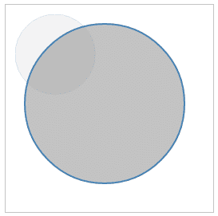

需要强调的是，因为我们使用 SVG 命令来绘制形状，所以在缩放图像时不会出现质量损失，这与 PNG 或 JPEG 这样的光栅图像不同。可以通过组合变换类型来调整缩放，改变形状的 *x* 和 *y* 位置。以下代码中使用了我们之前用过的 `path` 示例：

```js
<path d="M 120 120 L 220 220 C 200 70 480 290 320 120 Z" 
 stroke="steelblue" fill="lightyellow" stroke-width="2" 
 transform="translate(-200,-200), scale(2,2)"></path>
```

上述代码将产生以下输出（`http://localhost:8080/chapter-2/scale_translate.html`）：


# 分组

`<g>` 组标签在 SVG 中经常使用，尤其是在地图中。它用于将元素分组，然后对该组应用一系列属性。它提供了以下好处：

+   它允许您将一组形状视为单个形状，用于缩放和平移。

+   它通过允许您在较高级别设置属性并让它们继承所有包含的元素来防止代码重复。

+   组对于以高效的方式应用变换到大量 SVG 节点至关重要。分组相对于父组进行偏移，而不是修改组中每个项目的每个属性。

让我们将用于解释贝塞尔曲线的形状集添加到一个单独的组中，在以下代码中结合我们迄今为止所学的一切：

```js
    <svg height="500" width="800"> 
      <g transform="translate(-200,-100), scale(2,2)"> 
        <path d="M 120 120 L 220 220 C 200 70 480 290 320 120 Z">
         </path> 

        <line x1="220"  y1="220" x2="200" y2="70"></line> 
        <circle cx="200" cy="70"   r="5" ></circle> 

        <line x1="200"  y1="70"  x2="480" y2="290"></line> 
        <circle cx="480" cy="290"  r="5" ></circle> 

        <line x1="480"  y1="290" x2="320" y2="120"></line> 
      </g> 
    </svg> 
```

上述代码将产生以下图像（`http://localhost:8080/chapter-2/group.html`）：

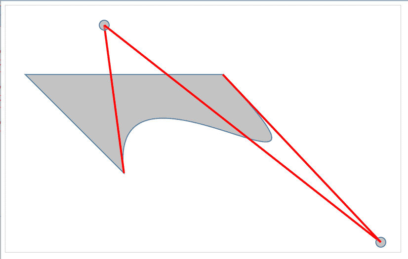

如果不使用组元素，我们就必须对集合中的所有六个形状应用变换、平移和缩放。分组帮助我们节省时间，并允许我们在将来快速调整对齐。

# 文本

文本元素，正如其名称所描述的，用于在 SVG 中显示文本。创建文本节点的基本 HTML 代码如下：

```js
<text x="250" y="150">Hello world!</text> 
```

它有一个 `x` 和 `y` 坐标来告诉它在 SVG 坐标系中从哪里开始写入。可以通过 CSS 类来实现样式，以便在我们的代码库中清晰地分离关注点。例如，查看以下代码：

```js
<text x="250" y="150" class="myText">Hello world!</text> 

.myText{ 
  font-size:22px; 
  font-family:Helvetica; 
  stroke-width:2; 
} 
```

文本也支持旋转，以便在可视化中定位时提供灵活性：

```js
<svg width="600" height="600"> 
        <text x="250" y="150" class="myText" 
         transform="rotate(45,200,0)" font-family="Verdana" 
         font-size="100">Hello world!</text> 
</svg>; 
```

一些示例位于 `http://localhost:8080/chapter-2/text.html`，并如图所示显示：

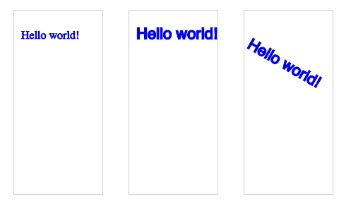

请记住，如果您旋转文本，它将相对于其原点（*x* 和 *y*）旋转。您可以通过 `cx` 和 `cy` 或在此情况下 `250,150` 指定平移的原点。请参阅代码中的 `transform` 属性以获得更多清晰度。

# 摘要

本章为我们提供了关于 SVG 的丰富信息。我们解释了路径、线条、圆形、矩形、文本及其一些属性。我们还介绍了通过缩放和变换形状的变换。由于本章为我们提供了一个坚实的基础，我们现在可以创建复杂的形状。下一章将介绍 D3 以及它是如何用于程序化地管理 SVG 的。我们继续前进！
