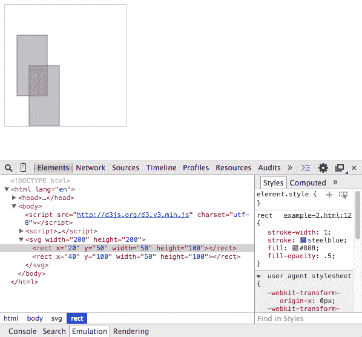
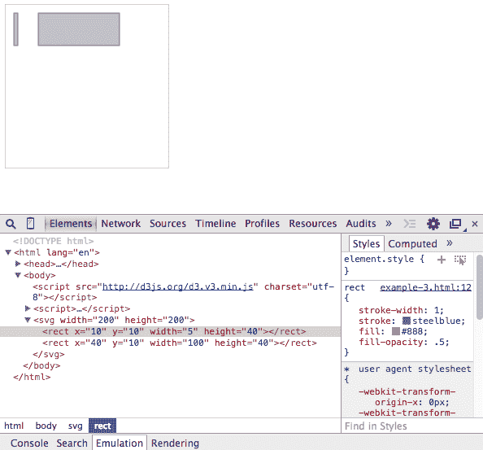
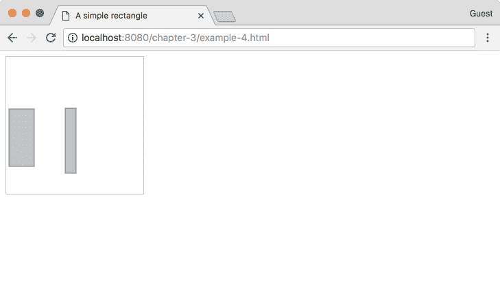
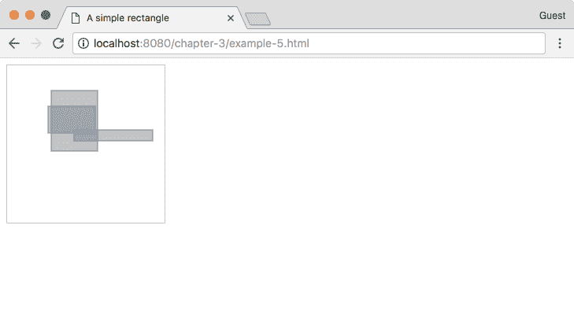
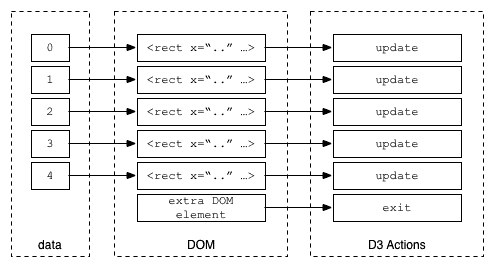
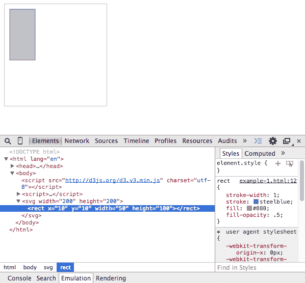

# 从数据生成图形 - D3 的基础

我们已经获得了我们的工具箱并复习了 SVG 的基础知识。现在是时候探索 D3.js 了。D3 是 Protovis ([`mbostock.github.io/protovis/`](http://mbostock.github.io/protovis/)) 库的进化。如果你已经深入研究数据可视化并对为你的网络应用制作图表感兴趣，你可能已经使用过这个库。还存在其他库，它们可以通过渲染图形的速度以及与不同浏览器的兼容性来区分。例如，Internet Explorer 不支持 SVG，但使用其自己的实现，VML。这使得 `Raphaël.js` 库成为一个极佳的选择，因为它可以自动映射到 VML 或 SVG。另一方面，jqPlot 使用简单，其简单的 jQuery 插件界面允许开发者快速采用它。

然而，Protovis 有其独特之处。鉴于该库的矢量性质，它允许你展示不同类型的可视化，以及生成流畅的过渡。请随意查看提供的链接并亲自验证。查看力导向布局：[`mbostock.github.io/protovis/ex/force.html`](http://mbostock.github.io/protovis/ex/force.html)。在 2010 年，这些可视化既有趣又引人入胜，尤其是对于浏览器来说。

受 Protovis 的启发，斯坦福大学的一个团队（由 Jeff Heer、Mike Bostock 和 Vadim Ogievetsky 组成）开始专注于 D3。D3 及其应用于 SVG，为开发者提供了一个简单的方法来将他们的可视化绑定到数据并添加交互性。

对于研究 D3，有大量的信息可用。在 D3 网站上可以找到一份全面覆盖的宝贵资源：[`github.com/mbostock/d3/wiki`](https://github.com/mbostock/d3/wiki)。在本章中，我们将介绍以下将在整本书中使用的概念：

+   创建基本的 SVG 元素

+   `enter()` 函数

+   `update` 函数

+   `exit()` 函数

+   AJAX

# 创建基本的 SVG 元素

在 D3 中，一个常见的操作是选择一个 DOM 元素并附加 SVG 元素。随后的调用将设置 SVG 属性，这些属性我们在第二章 创建简单的文本图像中已经学习过。D3 通过一种易于阅读的、功能性的语法——**方法链**来完成这个操作。让我们通过一个非常简单的例子来展示这是如何实现的（如果你正在运行 http-server，请访问 `http://localhost:8080/chapter-3/example-1.html`）：

```js
var svg = d3.select("body") 
    .append("svg") 
    .attr("width", 200) 
    .attr("height", 200) 
```

首先，我们选择 `body` 标签并向其中附加一个 SVG 元素。这个 SVG 元素的宽度和高度为 `200` 像素。我们还把选择存储在一个变量中：

```js
svg.append('rect') 
    .attr('x', 10) 
    .attr('y', 10) 
    .attr("width",50) 
    .attr("height",100); 
```

接下来，我们使用 `svg` 变量并添加一个 `<rect>` 项目到它。这个 `rect` 项目将从 (`10`,`10`) 开始，宽度为 `50`，高度为 `100`。从您的 Chrome 浏览器中，打开带有 Elements 选项卡的 Chrome 开发者工具并检查 SVG 元素：


注意模式：`append('svg')` 创建 `<svg></svg>`。`attr('width',200)` 和 `attr('height',200)` 分别设置 `width="200"` 和 `height="200"`。一起，它们产生了我们在上一章中学到的 SVG 语法：

```js
<svg width="200" height="200">...</svg> 
```

# enter() 函数

`enter()` 函数是每个基本 D3 可视化的一部分。它允许开发者定义一个带有附加数据的开端点。`enter()` 函数可以被认为是一段代码，当数据首次应用于可视化时执行。通常，`enter()` 函数将跟随 DOM 元素的选择。让我们通过一个例子来了解一下 (`http://localhost:8080/chapter-3/example-2.html`）：

```js
var svg = d3.select("body") 
    .append("svg") 
    .attr("width", 200) 
    .attr("height", 200); 
```

创建 SVG 容器，就像我们之前做的那样，如下所示：

```js
svg.selectAll('rect').data([1,2]).enter() 
```

`data` 函数是我们将数据绑定到选择的方式。在这个例子中，我们将一个非常简单的数组 `[1,2]` 绑定到选择 `<rect>`。`enter()` 函数将遍历 `[1,2]` 数组并应用后续的函数调用，如下面的代码所示：

```js
.append('rect') 
.attr('x', function(d){ return d*20; }) 
.attr('y', function(d){ return d*50; }) 
```

当我们遍历数组中的每个元素时，我们将执行以下操作：

+   添加一个新的 `rect` SVG 元素

+   将 `rect` 元素定位在坐标 *x = d * 20* 和 *y = d * 50*，其中 *d* 对于第一个元素等于 1，对于第二个元素等于 2，如下面的代码所示：

```js
.attr("width",50) 
.attr("height",100); 
```

我们将保持 `height` 和 `width` 不变：

```js
<svg width="200" height="200"> 
  <rect x="20" y="50" width="50" height="100"></rect> 
  <rect x="40" y="100" width="50" height="100"></rect> 
</svg> 
```

仔细观察；看看 Chrome 开发者工具。我们看到两个矩形，每个矩形对应于数组中的一个元素，如下面的截图所示：



记住，数据不一定非得是枯燥的数字，比如 1 或 2。数据数组可以由任何数据对象组成。为了说明这一点，我们将在下一个例子中将之前的数组更改为对象数组（见 `http://localhost:8080/chapter-3/example-3.html`）：



如您在下面的代码片段中看到的，我们的数据数组有两个对象，每个对象有四个不同的键值对：

```js
var data = [ 
  { 
    x:10, 
    y:10, 
    width:5, 
    height:40 
  },{ 
    x:40, 
    y:10, 
    width:100, 
    height:40 
  } 
]; 

  var svg = d3.select("body") 
    .append("svg") 
    .attr("width", 200) 
    .attr("height", 200); 

  svg.selectAll('rect').data(data).enter() 
    .append('rect') 
    .attr('x', function(d){ return d.x}) 
    .attr('y', function(d){ return d.y}) 
    .attr("width", function(d){ return d.width}) 
    .attr("height", function(d){ return d.height}); 
```

现在，当我们遍历数组中的每个对象时，我们将执行以下操作：

+   仍然添加一个新的 `rect` SVG 元素。

+   通过对象的属性定位和调整 `rect` 元素的大小。第一个矩形将定位在 `x=10`，`y=10`，宽度为 `5`，高度为 `40`。第二个矩形将定位在 `40`，`10`，宽度为 `100`，高度为 `40`。

+   记住，`d` 代表数据，或数组中的每个对象，这就是为什么我们用 `d.x` 或 `d.y` 来获取相应的 `x` 和 `y` 属性。

# 更新函数

不仅我们有矩形，我们还把它们连接到一个由两个对象组成的数据集中。这两个对象共享相同的属性，即`x`、`y`、`width`和`height`，因此很容易遍历它们并将值绑定到我们的可视化中。结果是静态 SVG 元素集。本节将介绍如何更新 SVG 元素和属性，当连接的数据发生变化时。让我们增强前面的例子来解释这是如何工作的（`http://localhost:8080/chapter-3/example-4.html`）：



```js
function makeData(n){ 
  var arr = []; 

  for (var i=0; i<n; i++){ 
    arr.push({ 
      x:Math.floor((Math.random() * 100) + 1), 
      y:Math.floor((Math.random() * 100) + 1), 
      width:Math.floor((Math.random() * 100) + 1), 
      height:Math.floor((Math.random() * 100) + 1) 
    }) 
  }; 

  return arr; 
} 
```

此函数创建了一个新的对象数组，具有随机的`x`、`y`、`width`和`height`属性。我们可以使用它来模拟数据的变化，允许我们创建具有不同属性的`n`个项目：

```js
var rectangles = function(svg) { 
```

在这里，我们创建了一个函数，每次调用 D3 时都会将矩形插入 DOM 中。其描述如下：

```js
var data = makeData(2); 
```

让我们生成我们的假数据：

```js
var rect = svg.selectAll('rect').data(data); 
```

让我们选择我们的矩形并将其数据分配给它。这给我们一个变量，我们可以轻松地应用`enter()`和`update`。以下部分以详尽的方式编写，以精确说明`enter()`、`update`和`exit()`正在发生的事情。虽然可以在 D3 中走捷径，但最好坚持以下风格以避免混淆：

```js
  // Enter 
  rect.enter().append('rect') 
    .attr('test', function(d,i) { 
      // Enter called 2 times only 
      console.log('enter placing initial rectangle: ', i) 
    }); 
```

如前文所述，对于数组中的每个元素，我们将其附加到一个矩形标签到 DOM 中。如果你在 Chrome 浏览器中运行此代码，你会注意到控制台只显示`enter placing initial rectangle`两次。这是因为只有当数组中的元素多于 DOM 中的元素时，`enter()`部分才会被调用：

```js
  // Update 
  rect.transition().duration(500).attr('x', function(d){ 
     return d.x; }) 
      .attr('y', function(d){ return d.y; }) 
      .attr('width', function(d){ return d.width; }) 
      .attr('height', function(d){ return d.height; }) 
      .attr('test', function(d, i) { 
        // update every data change 
        console.log('updating x position to: ', d.x) 
      }); 
```

`update`部分应用于原始选择集中的每个元素，但不包括已进入的元素。在前面的例子中，我们为每个数据对象设置了矩形的`x`、`y`、`width`和`height`属性。`update`部分没有使用显式的`update`方法。D3 在没有提供其他部分的情况下隐式地假设了一个`update`调用。如果你在 Chrome 浏览器中运行代码，你会看到每次数据变化时控制台都会显示`updating x position to:`：

```js
var svg = d3.select("body") 
    .append("svg") 
    .attr("width", 200) 
    .attr("height", 200); 
```

以下命令插入我们的工作 SVG 容器：

```js
rectangles(svg); 
```

以下命令绘制了我们可视化的第一个版本：

```js
setInterval(function(){ 
  rectangles(svg); 
},1000); 
```

`setInterval()`函数是 JavaScript 中用于每*x*毫秒执行操作的函数。在这种情况下，我们每`1000`毫秒调用一次`rectangles`函数。

每次调用`rectangles`函数时，它都会生成一个新的数据集。它具有与我们之前相同的属性结构，但与这些属性相关联的值是介于*1*和*100*之间的随机数。在第一次调用时，将调用`enter()`部分，并创建我们的初始两个矩形。每`1000`毫秒，我们使用相同的数据结构但不同的随机属性属性重新调用`rectangles`函数。因为结构相同，所以现在跳过了`enter()`部分，只对现有的矩形应用`update`。这就是为什么每次绘图时我们都会得到具有不同尺寸的相同矩形。

`update`方法非常有用。例如，您的数据集可以与股市相关联，并且您可以每*毫秒*更新一次可视化以反映股市的变化。您还可以将更新绑定到由用户触发的事件，并让用户控制可视化。选项是无限的。

# `exit()`函数

我们已经讨论了`enter()`和`update`。我们看到了一个如何确定可视化起点，另一个如何根据传入的新数据修改其属性。然而，先前的例子中数据元素的数量与属性完全相同。如果我们的新数据集包含不同数量的项目会发生什么？如果它有更多或更少呢？

让我们以前面的`update`部分为例，稍作修改以展示我们正在讨论的内容（`http://localhost:8080/chapter-3/example-5.html`）：



我们可以通过对`rectangles`函数进行两个小的修改来解释它是如何工作的：

```js
var rectangles = function(svg) { 
var data = makeData((Math.random() * 5) + 1); 
```

在这里，我们告诉`data`函数创建一个随机数量的`data`对象：

```js
  var rect = svg.selectAll('rect').data(data); 

  // Enter 
  rect.enter().append('rect') 
    .attr('test', function(d,i) { 
      // Enter called 2 times only 
      console.log('enter placing inital rectangle: ', i) 
  }); 

  // Update 
  rect.transition().duration(500).attr('x', function(d){ return d.x; }) 
      .attr('y', function(d){ return d.y; }) 
      .attr('width', function(d){ return d.width; }) 
      .attr('height', function(d){ return d.height; }) 
      .attr('test', function(d, i) { 
        // update every data change 
        console.log('updating x position to: ', d.x) 
      }); 
```

`exit()`函数将与之前相同。添加一个新的`exit()`部分：

```js
  // Exit 
  rect.exit().attr('test', function(d) { 
    console.log('no data...') 
  }).remove(); 
} 
```

`exit()`方法的作用是清除或清理我们可视化中不再使用的 DOM 元素。这很有帮助，因为它允许我们将数据与 DOM 元素同步。记住这个方法的一个简单方法是：如果有比 DOM 元素更多的数据元素，将调用`enter()`部分；如果有比 DOM 元素更少的数据元素，将调用`exit()`部分。在先前的例子中，如果没有匹配的数据，我们就移除了 DOM 元素。

以下是在调用`enter()`和`update`函数时发生的序列的图形表示。注意，对于数据元素**6**没有 DOM 元素，因此执行了`enter()`部分。对于数据元素**0**到**5**，始终调用更新代码。对于数据元素**6**，在`enter`过程完成后，将执行**update**部分。请参考以下图表：



# AJAX

**异步 JavaScript 和 XML**（**AJAX**）并不完全与 D3 相关。它实际上基于 JavaScript。简而言之，AJAX 允许开发者从网页的背景中获取数据。这种技术在地图开发中非常有用，因为地理数据集可以非常大。从背景获取数据将有助于产生更精细的用户体验。此外，在第六章“查找和使用地理数据”中，我们将介绍压缩地理数据大小的技术。

将数据与代码库分离也将带来以下优势：

+   一个更轻量级的代码库，更容易管理

+   能够在不更改代码的情况下更新数据

+   使用第三方数据源提供者的能力

这是通过使用 D3 函数通过 AJAX 调用获取数据来实现的。让我们来检查以下代码：

```js
d3.json("data/dataFile.json", function(error, json) { 
```

`d3.json()`方法有两个参数：文件路径和回调函数。回调函数指示在数据传输后要做什么。在前面的代码中，如果调用正确获取了数据，它将数据分配给`json`变量。`error`变量只是一个通用错误对象，指示在获取数据时是否出现了任何问题：

```js
if (error) return console.log(error); 
var data = json; 
```

我们将 JSON 数据存储到 data 变量中，并继续像之前示例中那样处理它：

```js
  var svg = d3.select("body") 
    .append("svg") 
    .attr("width", 200) 
    .attr("height", 200); 

  svg.selectAll('rect') 
    .data(data).enter() 
    .append('rect') 
    .attr('x', function(d){ return d.x; }) 
    .attr('y', function(d){ return d.y; }) 
    .attr("width", function(d){ return d.width; }) 
    .attr("height", function(d){ return d.height; }); 
}); 
```



D3 为我们提供了许多种数据获取方法，JSON 只是其中一种。它还支持 CSV 文件、纯文本文件、XML 文件，甚至是整个 HTML 页面。我们强烈建议您在以下文档中阅读有关 AJAX 的内容：[`github.com/d3/d3/blob/master/API.md#requests-d3-request`](https://github.com/d3/d3/blob/master/API.md#requests-d3-request)。

# 摘要

在本章中，我们解释了 D3 的核心元素（`enter()`、`update`和`exit()`）。

我们理解了将数据与可视化结合的强大功能。数据不仅可以来自许多不同的来源，而且可视化也可以自动更新。

在 D3 Gallery 中可以找到许多详细的示例：[`github.com/mbostock/d3/wiki/Gallery`](https://github.com/mbostock/d3/wiki/Gallery)。

在下一章中，我们将结合所有这些技术从头开始构建我们的第一张地图。准备好吧！
