# 创建地图

到目前为止，我们已经经历了一段相当精彩的旅程。我们探讨了创建地图的所有不同方面。我们接触了 SVG、JavaScript 和 D3 的基础知识。现在，是时候将所有这些部件组合起来，并真正拥有一个最终交付的产品了。在本章中，我们将通过一系列实验来涵盖以下主题：

+   基础 - 创建您的基本地图

+   实验 1 - 调整边界框

+   实验 2 - 创建渐变图

+   实验 3 - 向我们的可视化添加点击事件

+   实验 4 - 使用更新和过渡来增强我们的可视化

+   实验 5 - 添加兴趣点

+   实验 6 - 将可视化作为兴趣点添加

# 基础 - 创建您的基本地图

在本节中，我们将介绍创建标准地图的基础知识。

您可以通过打开本书提供的本章节的`example-1.html`文件来查看示例。如果您已经启动了 HTTP 服务器，您可以将浏览器指向`http://localhost:8080/chapter-4/example-1.html`。屏幕上显示的是墨西哥（奥斯卡钟爱的国家）！

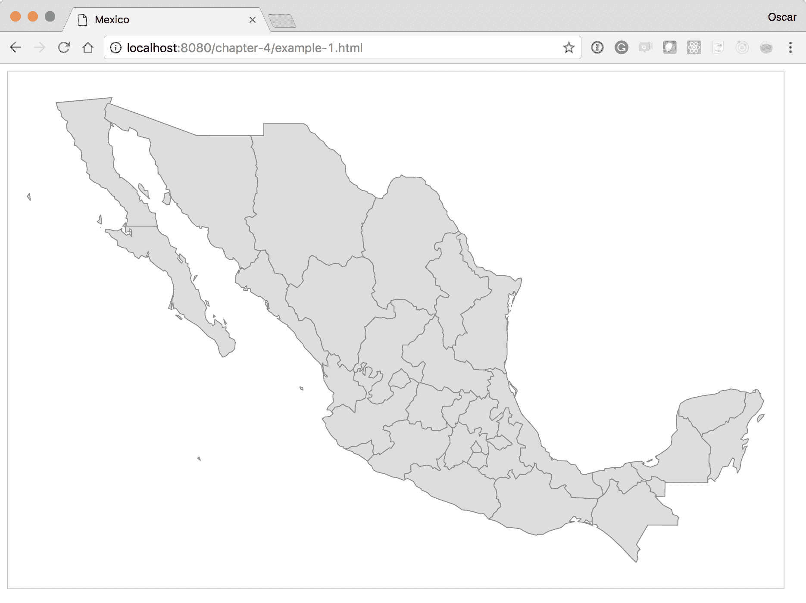

让我们逐步分析代码，以了解如何创建此地图。

`width`和`height`可以是您想要的任何值。根据您的地图将在哪里可视化（手机、平板电脑或桌面），您可能需要考虑提供不同的`width`和`height`：

```js
var height = 600; 
var width = 900; 
```

下一个变量定义了一个投影算法，它允许您从地图空间（纬度和经度）到笛卡尔空间（*x, y*）进行转换——基本上是将纬度和经度映射到坐标。您可以将投影视为将三维地球映射到平面的一种方式。有许多种类的投影，但`geoMercator()`通常是您将使用的默认值：

```js
var projection = d3.geoMercator(); 
var mexico = void 0; 
```

如果您正在制作美国的地图，您可以使用一个更好的投影，称为 AlbersUsa。这是为了更好地定位阿拉斯加和夏威夷。通过创建`geoMercator()`投影，阿拉斯加将按其大小渲染，与美国全境相媲美。`geoAlbersUsa()`投影抓取阿拉斯加，使其变小，并将其放置在可视化的底部。以下截图是`geoMercator()`：

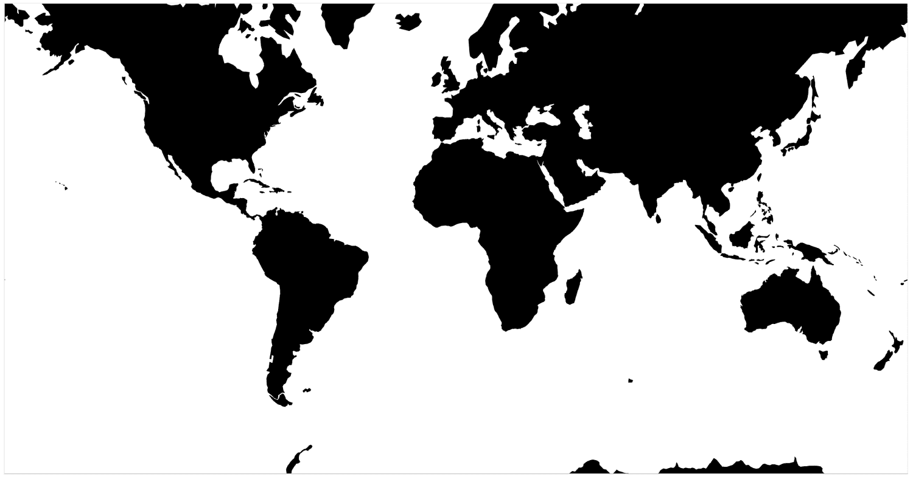

下一个截图是`geoAlbersUsa()`：

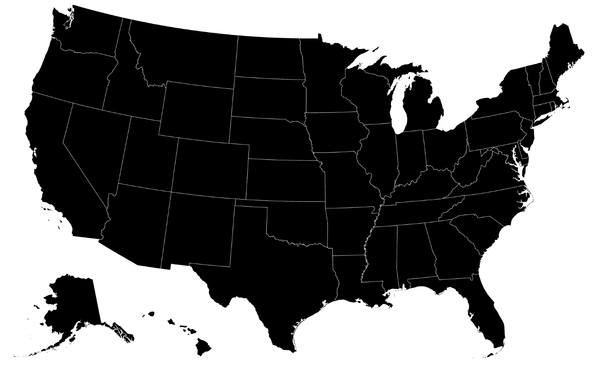

D3 库目前包含许多内置的投影算法。每个算法的概述可以在[`github.com/d3/d3-geo/blob/master/README.md#projections`](https://github.com/d3/d3-geo/blob/master/README.md#projections)查看。

接下来，我们将投影分配给我们的`geoPath()`函数。这是一个特殊的 D3 函数，它将 JSON 格式的地理数据映射到 SVG 路径。`geoPath()`函数所需的数据格式称为 GeoJSON，将在第六章中介绍，*寻找和使用地理数据*：

```js
var path = d3.geoPath().projection(projection); 
var svg = d3.select("#map") 
    .append("svg") 
    .attr("width", width) 
    .attr("height", height); 
```

# 包括数据集

所需数据已提供给您，位于`data`文件夹中，文件名为`geo-data.json`：

```js
d3.json('geo-data.json', function(data) { 
  console.log('mexico', data); 
```

我们从 AJAX 调用中获取数据，正如我们在上一章中看到的。

数据收集完毕后，我们只想绘制我们感兴趣的数据部分。此外，我们还想自动调整地图的比例，以适应我们可视化定义的高度和宽度。

如果你查看控制台，你会看到`mexico`有一个`objects`属性。嵌套在`objects`属性内部的是`MEX_adm1`。这代表墨西哥的行政区域。理解你正在使用的地理数据非常重要，因为其他数据源可能对行政区域属性的命名不同：

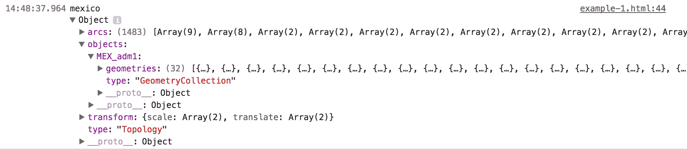

注意到`MEX_adm1`属性包含一个包含 32 个元素的`geometries`数组。这些元素中的每一个代表墨西哥的一个州。使用这些数据来绘制 D3 可视化：

```js
  var states = topojson.feature(data, data.objects.MEX_adm1); 
```

在这里，我们将所有行政区域传递给`topojson.feature()`函数，以便提取并创建一个 GeoJSON 对象数组。前面的`states`变量现在包含`features`属性。这个`features`数组是一个包含 32 个 GeoJSON 元素的列表，每个元素代表墨西哥一个州的地理边界。我们将初始比例和转换设置为`1`和`[0,0]`：

```js
  // Setup the scale and translate 
  projection.scale(1).translate([0, 0]); 
```

此算法非常有用。边界框是一个球形框，返回包含地理数据的最小/最大坐标的二维数组：

```js
  var b = path.bounds(states); 
```

引用 D3 文档：

"边界框由一个二维数组表示：[[左，下]，[右，上]]，其中左是最小经度，下是最小纬度，右是最大经度，上是最大纬度。"

如果你想以编程方式设置地图的比例和转换，这将非常有用。在这种情况下，我们希望整个国家都能适应我们的`height`和`width`，因此我们确定墨西哥国家中每个州的边界框。

比例尺是通过将我们边界框的最长地理边长除以该边在可视化中的像素数来计算的：

```js
var s = .95 / Math.max((b[1][0] - b[0][0]) / width, (b[1][1] - 
 b[0][1]) / height);
```

这可以通过首先计算`width`的比例，然后计算`height`的比例，最后取两个中的较大值来计算。所有逻辑都压缩在前面给出的单行中。这三个步骤在下图中解释：

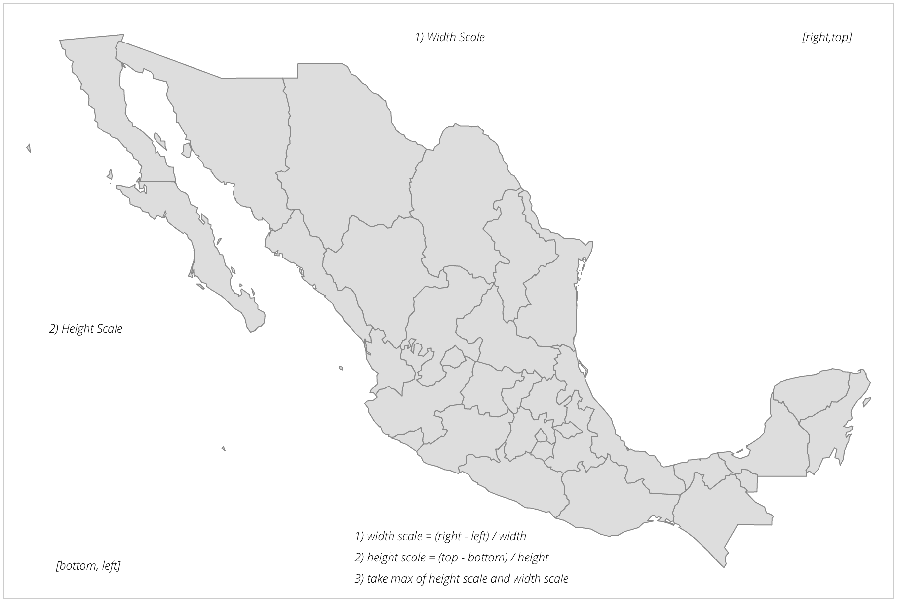

`95` 这个值调整了比例，因为我们给地图边缘留出了一些空间，以便路径不会与 SVG 容器元素的边缘相交，基本上减少了 5% 的比例。

现在，我们有了地图的准确比例，这是基于我们设置的 `width` 和 `height`：

```js
var t = [(width - s * (b[1][0] + b[0][0])) / 2, (height - s * 
 (b[1][1] + b[0][1])) / 2];
```

正如我们在 第二章 中看到的，*从简单的文本创建图像*，当我们对 SVG 进行缩放时，它会缩放所有属性（甚至 *x* 和 *y*）。为了将地图返回到屏幕中心，我们将使用 `translate()` 函数。

`translate()` 函数接收一个包含两个参数的数组：沿 *x* 方向平移的量，以及沿 *y* 方向平移的量。我们将通过找到中心 *(topRight - topLeft)/2* 并乘以比例来计算 *x*。然后从 SVG 元素的宽度中减去这个结果。

我们的 *y* 平移计算方式类似，但使用 *bottomRight - bottomLeft* 的值除以 2，乘以比例，然后从 `height` 中减去。

最后，我们将重置投影以使用我们新的比例和平移：

```js
  projection.scale(s).translate(t); 
```

在这里，我们将创建一个地图变量，它将把所有下面的 SVG 元素组合到一个 `<g>` SVG 标签中。这将允许我们应用样式并更好地包含所有前面的路径元素：

```js
  var map = svg.append('g').attr('class', 'boundary'); 
```

最后，我们回到了经典的 D3 enter、update 和 exit 模式。我们有我们的数据，墨西哥各州的列表，我们将把这个数据连接到 `path` SVG 元素上：

```js
    mexico = map.selectAll('path').data(states.features); 

    //Enter 
    mexico.enter() 
       .append('path') 
       .attr('d', path); 
```

`Enter` 部分和相应的 `path` 函数在数组中的每个数据元素上执行。作为一个提醒，数组中的每个元素代表墨西哥的一个州。`path` 函数已经被设置好，以正确绘制每个州的轮廓，并将其缩放和平移以适应我们的 SVG 容器。

恭喜！你已经创建了你的第一张地图！

# 实验 1 – 调整边界框

现在我们有了基础，让我们开始我们的第一个实验。对于这个实验，我们将使用上一节学到的知识手动放大到墨西哥的一个州。代码可以在 `example-2.html` 中找到（`http://localhost:8080/chapter-4/example-2.html`）；然而，你可以自由地编辑 `example-1.html` 来边学边做。

对于这个实验，我们将修改一行代码：

```js
  var b = path.bounds(states.features[5]); 
```

在这里，我们告诉计算基于 `features` 数组的第六个元素创建边界，而不是墨西哥国家的每个州。边界数据现在将运行通过其余的缩放和平移算法，以调整地图到下一张截图所示：

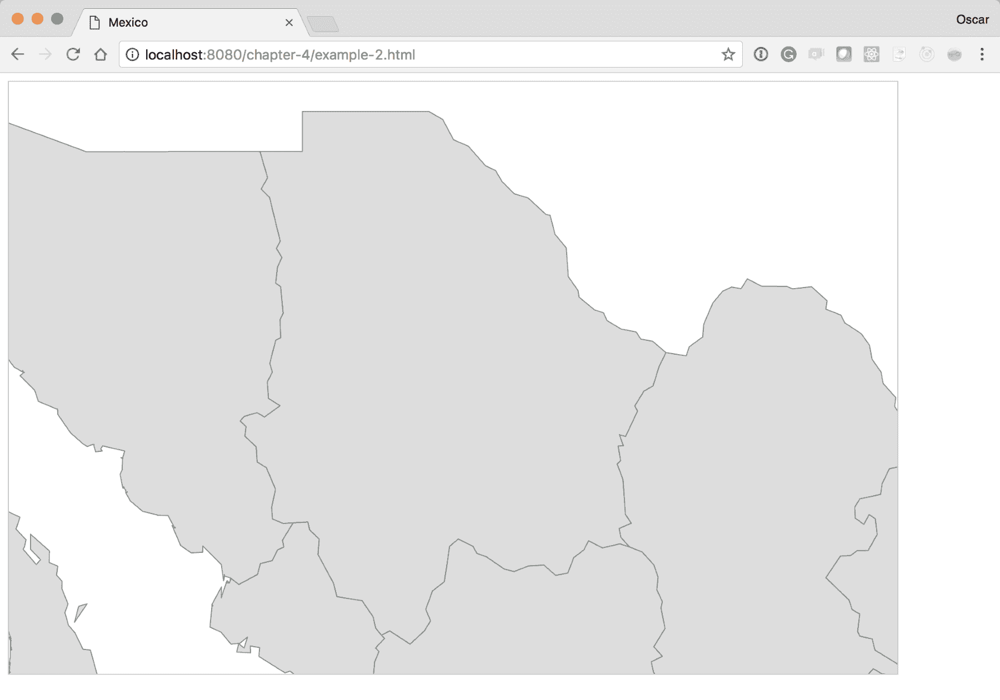

我们基本上将边界框的最小/最大值减少，以包含墨西哥一个州的地理坐标（见下一张截图），D3 会自动缩放和平移这些信息：

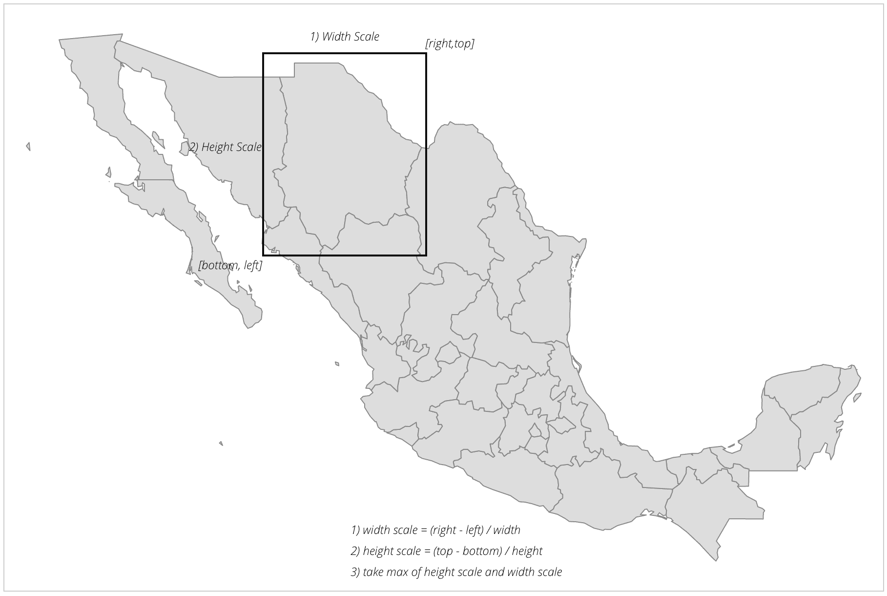

这在您可能无法从周围区域独立获取所需数据的情况下非常有用。因此，您始终可以放大您感兴趣的地区，并将其从其他区域中分离出来。

# 实验 2 – 创建渐变图

D3.js 地图的常见用途之一是制作渐变图。这种可视化方式让您能够区分不同地区，并为它们赋予不同的颜色。通常，这种颜色与某些其他值相关联，例如流感水平或公司的销售额。在 D3.js 中制作渐变图非常简单。在这个实验中，我们将基于所有州数组中州的索引值创建一个快速的渐变图。查看以下代码，或使用您的浏览器并访问此处：`http://localhost:8080/chapter-4/example-3.html`。

我们只需要修改 D3 代码中 `Update` 部分的两行代码。在 `enter()` 部分之后，添加以下两行：

```js
  //Update 
  var color = d3.scaleLinear().domain([0,33]).range(['red', 
   'yellow']); 
  //Enter
  mexico.enter()
           .append('path')
           .attr('d', path)
           .attr('fill', function(d,i){
            return color(i);
           });
```

`color` 变量使用了另一个非常有价值的 D3 函数，名为 `scale`。在 D3 中创建可视化时，缩放功能非常强大；有关缩放的更多详细信息，请参阅：[`github.com/d3/d3/blob/master/API.md#scales-d3-scale`](https://github.com/d3/d3/blob/master/API.md#scales-d3-scale)。

现在，让我们描述一下这个缩放定义了什么。在这里，我们创建了一个名为 `color()` 的新函数。这个 `color()` 函数在一个输入域中寻找介于 `0` 和 `33` 之间的任何数字。D3 将这些输入值线性映射到输出范围中的红色和黄色之间的颜色。D3 包含了将线性范围内的颜色自动映射到渐变的特性。这意味着执行新的 `color` 函数，使用 `0` 将返回红色，`color(15)` 将返回橙色，而 `color(33)` 将返回黄色。

这里有一个小表格，仅用于视觉参考。它显示了颜色及其相应的 RGB 值：

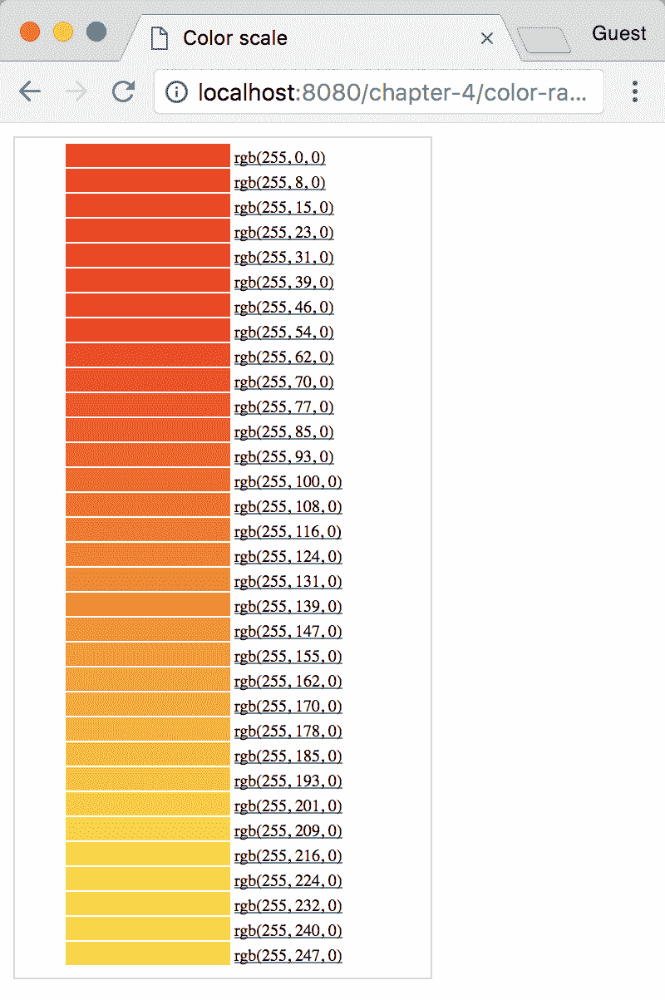

现在，在更新部分，我们将路径的 `fill` 属性设置为新的 `color()` 函数。这将提供一个颜色线性缩放，并使用索引值 `i` 来确定应该返回什么颜色。

如果颜色是由数据点的不同值确定的，例如 `d.scales`，那么您将有一个颜色实际上代表销售额的渐变图。前面的代码应该渲染如下：

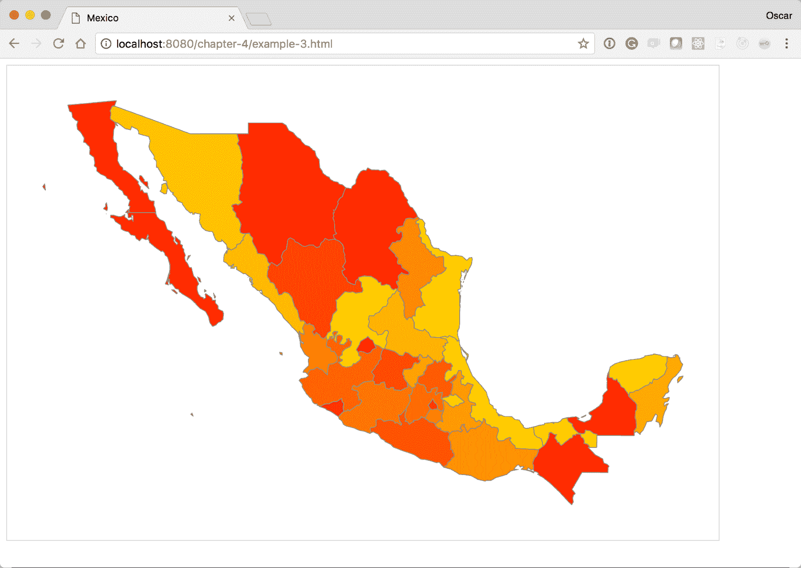

# 实验 3 – 为我们的可视化添加点击事件

我们已经看到了如何制作地图并为地图的不同区域设置不同的颜色。接下来，我们将添加一些交互性。这将展示如何将点击事件绑定到地图上的简单示例。对于这个实验，我们将基于之前的练习，`example-3.html`。您可以在以下位置查看完成的实验：`http://localhost:8080/chapter-4/example-4.html`。

首先，我们需要对国家中的每个州有一个快速参考。为此，我们将在`mexico`变量下方创建一个新的函数，名为`geoID`：

```js
  var height = 600; 
  var width = 900; 
  var projection = d3.geoMercator(); 
  var mexico = void 0; 

  var geoID = function(d) { 
    return "c" + d.properties.ID_1; 
  }; 
```

这个函数接收一个`state`数据元素，并根据数据中找到的`ID_1`属性生成一个新的可选择的 ID。`ID_1`属性包含数组中每个状态唯一的数值。如果我们将其作为`id`属性插入到 DOM 中，那么我们将创建一个快速且简单的方法来选择国家中的每个状态。

下面的`geoID()`函数创建了一个名为`click`的另一个函数：

```js
  var click = function(d) { 
    d3.selectAll('path').attr('fill-opacity',0.2)
    d3.select('#' + geoID(d)).attr('fill-opacity', 1); 
  }; 
```

这个方法使得分离`click`所做的工作变得容易。`click`方法接收数据项并改变所有州的填充不透明度值为`0.2`。这样做是为了当你点击一个州然后点击另一个州时，之前的州不会保持`clicked`样式。注意，函数调用正在使用 D3 更新模式遍历 DOM 的所有元素。在使所有州透明后，我们将给定点击项的填充不透明度设置为`1`。这将从所选州中移除所有透明样式。注意，我们正在重用之前创建的`geoID()`函数，以快速找到 DOM 中的州元素。

接下来，让我们更新`enter()`方法，将我们的新`click`方法绑定到`enter()`附加的每个新 DOM 元素：

```js
  //Enter 
  mexico.enter() 
     .append('path') 
     .attr('d', path) 
     .attr('id', geoID) 
     .on("click", click)
     .attr('fill', function(d,i) { return color(i); }) 
```

我们还添加了一个名为`id`的属性；这会将`geoID()`函数的结果插入到`id`属性中。同样，这使得找到被点击的州变得非常容易。

代码库应该生成如下所示的地图。检查一下，并确保点击任何州。你会看到它的颜色比周围州稍微亮一些：

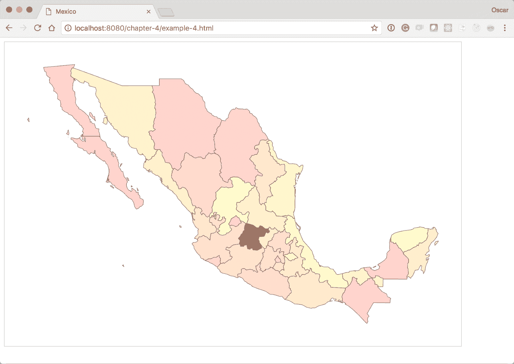

# 实验 4 – 使用更新和过渡来增强我们的可视化

在我们的下一个实验中，我们将结合所有知识，并为地图添加一些平滑的过渡。过渡是添加风格和流畅数据变化的绝佳方式。

这个实验再次需要我们从`example-3.html`开始。完整的实验可以在`http://localhost:8080/chapter-4/example-5.html`查看。

如果你还记得，我们利用 JavaScript 的`setInterval()`函数以固定的时间频率执行更新。现在我们将回到这个方法，为现有的`color()`函数分配一个介于 1 和 33 之间的随机数。然后我们将利用 D3 方法在随机颜色变化之间进行平滑过渡。

在更新部分下方，添加以下`setInterval()`代码块：

```js
    setInterval(function(){
      map.selectAll('path').transition().duration(500)
          .attr('fill', function(d) {
            return color(Math.floor((Math.random() * 32) + 1));
          });
    },2000);
```

此方法表示，对于每 `2000` 毫秒（2 秒），应执行 `map` 更新部分，并将颜色设置为 `1` 到 `32` 之间的随机数。新的 `transition` 和 `duration` 方法在 `500` 毫秒内从上一个状态过渡到新状态。在浏览器中打开 `example-5.html`，你应该看到基于状态索引的初始颜色。2 秒后，颜色应平滑过渡到新值。

# 实验 5 – 添加兴趣点

到目前为止，我们所做的一切都涉及到直接处理地理数据和地图。然而，有许多情况需要你在地图上叠加额外的数据。我们将首先通过在墨西哥地图上添加一些感兴趣的城市来慢慢开始。

这个实验再次需要我们从 `example-3.html` 开始。完整的实验可以在：`http://localhost:8080/chapter-4/example-6.html` 上查看。

在这个实验中，我们将在页面上添加一个 `text` 元素来标识城市。为了使文本更具视觉吸引力，我们首先在 `<style>` 部分添加一些简单的样式：

```js
text{ 
  font-family: Helvetica; 
  font-weight: 300; 
  font-size: 12px; 
} 
```

接下来，我们需要一些数据来指示城市名称、纬度和经度坐标。为了简化，我们添加了一个包含几个起始城市的文件。名为 `cities.csv` 的文件与示例在同一目录中：

```js
name,lat,lon, 
Cancun,21.1606,-86.8475 
Mexico City,19.4333,-99.1333 
Monterrey,25.6667,-100.3000 
Hermosillo,29.0989,-110.9542 
```

现在，添加几行代码来引入数据，并在你的地图上绘制城市位置和名称。在退出部分（如果你从 `example-2.html` 开始）下方添加以下代码块：

```js
    d3.csv('cities.csv', function(cities) { 
      var cityPoints = svg.selectAll('circle').data(cities); 
      var cityText = svg.selectAll('text').data(cities); 

      cityPoints.enter() 
          .append('circle') 
          .attr('cx', function(d) {
             return projection ([d.lon, d.lat])[0]
          })
          .attr('cy', function(d) {
             return projection ([d.lon, d.lat])[1]
          }) 
          .attr('r', 4) 
          .attr('fill', 'steelblue'); 

      cityText.enter() 
          .append('text') 
          .attr('x', function(d) {
             return projection([d.lon, d.lat])[0]})
          .attr('y', function(d) {
             return projection([d.lon, d.lat])[1]}) 
          .attr('dx', 5) 
          .attr('dy', 3) 
          .text(function(d) {return d.name}); 
    }); 
```

让我们回顾一下我们刚刚添加的内容。

`d3.csv` 函数将向我们的数据文件发出 AJAX 调用，并将整个文件自动格式化为 JSON 对象的数组。对象的每个属性都将采用 `.csv` 文件中相应列的名称。例如，看看以下代码行：

```js
[{ 
  "name": "Cancun",  
  "lat":"21.1606",  
  "lon":"-86.8475" 
}, ...] 
```

接下来，我们定义两个变量来保存我们的数据连接到圆形和文本 SVG 元素。

最后，我们将执行一个典型的输入模式，将点放置为圆形，并将名称作为文本 SVG 标签放置在地图上。*x* 和 *y* 坐标是通过调用我们之前的 `projection()` 函数，并使用数据文件中的相应纬度和经度坐标来确定的。

注意，`projection()` 函数返回一个包含 *x* 和 *y* 坐标的数组 (*x, y*)。*x* 坐标是通过取返回数组的 `0` 索引来确定的。*y* 坐标是从索引 `1` 中确定的。例如，看看以下代码：

```js
.attr('cx', function(d) {return projection([d.lon, d.lat])[0]})  
```

这里，`[0]` 表示 *x* 坐标。

你新的地图应该看起来像以下截图所示：

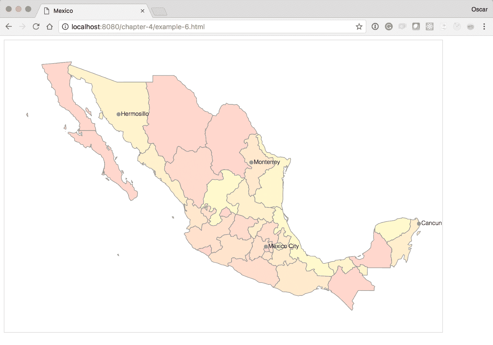

# 实验 6 – 将可视化作为兴趣点添加

对于我们的最终实验，我们将在可视化之上叠加更多的可视化！从我们上次停止的地方`http://localhost:8080/chapter-4/example-6.html`开始，我们将向数据中添加一个虚构的列来表示龙舌兰的消费指标（最终版本可以在`http://localhost:8080/chapter-4/example-7.html`中查看）：

```js
name,lat,lon,tequila 
Cancun,21.1606,-86.8475,85,15 
Mexico City,19.4333,-99.1333,51,49 
Monterrey,25.6667,-100.3000,30,70 
Hermosillo,29.0989,-110.9542,20,80 
```

只需两行代码，我们就可以让城市点表达意义。在这个实验中，我们将根据龙舌兰的消费量来调整城市圆的半径：

```js
var radius = d3.scaleLinear().domain([0,100]).range([5,30]);  
```

在这里，我们将引入一个新的比例，将输入值从`1`到`100`线性分布到`5`到`30`之间的半径长度。这意味着圆的最小半径将是`5`，最大半径将是`30`，防止圆变得过大或过小以至于无法阅读：

```js
cityPoints.enter() 
          .append('circle') 
          .attr('cx', function(d) {
             return projection([d.lon, d.lat])[0];})          
          .attr('cy', function(d) {
             return projection([d.lon, d.lat])[1];}) 
          .attr('r', 4) 
          .attr('fill', 'steelblue'); 
```

接下来，我们将更改前面的代码行，将其改为调用`radius`函数而不是硬编码的`4`值。现在的代码将看起来像这样：

```js
.attr('r', function(d) {return radius(d.tequila); }) 
```

在这两个小添加之后，你的地图应该看起来像以下截图所示：

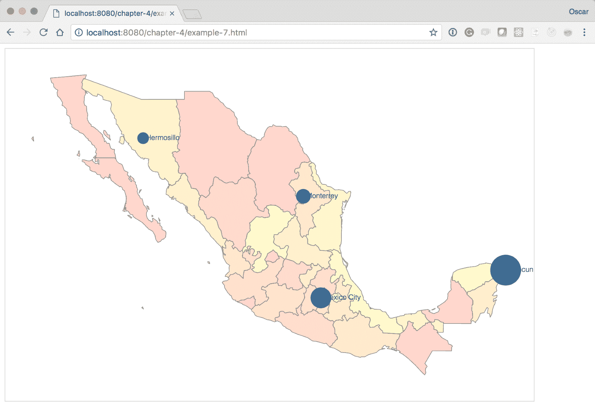

# 摘要

你学习了如何构建多种不同类型的地图，以满足不同的需求。色块图和地图的数据可视化是一些最常见的基于地理的数据表示形式，你将会遇到。我们还通过基本的过渡和事件为我们的地图添加了交互性。你将很容易意识到，凭借你迄今为止收集的所有信息，你可以独立创建引人入胜的地图可视化。你可以在下一章学习高级交互技术来扩展你的知识。

请系好安全带！
