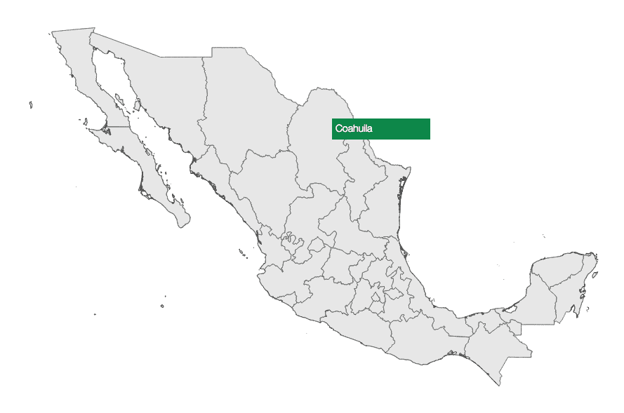
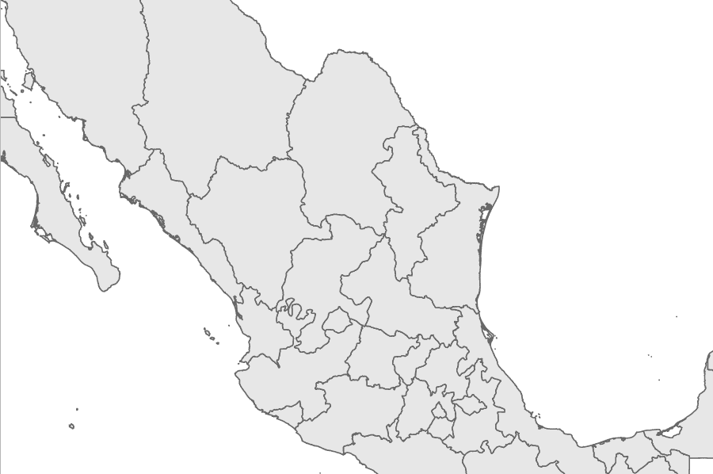
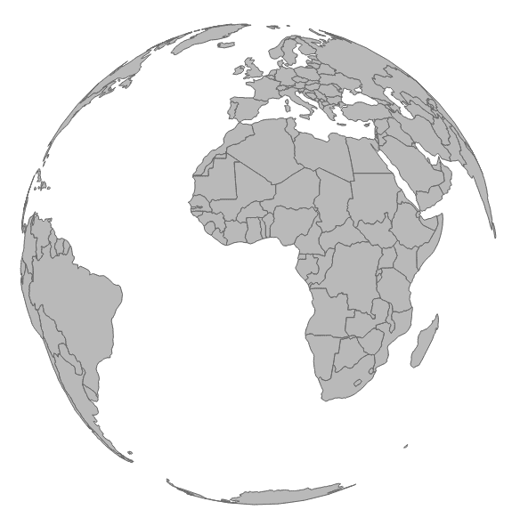
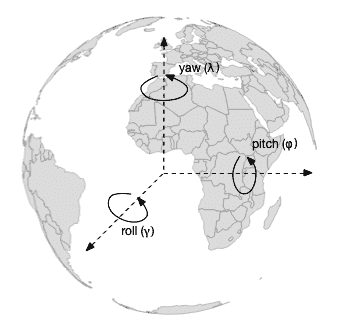
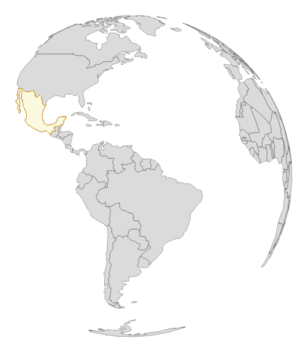
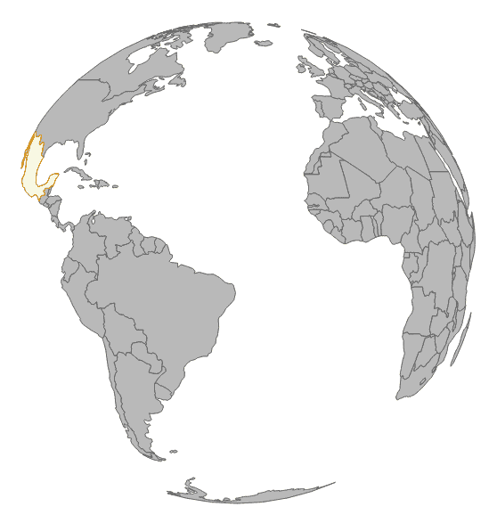

# 点击-点击-爆炸！将交互性应用到你的地图上

在上一章中，你学习了如何使用 D3.js 构建基本地图所需的内容。我们还讨论了 enter、update 和 exit 的概念以及它们如何应用于地图。你也应该理解 D3 如何将 HTML 与数据混合匹配。然而，假设你想更进一步，给你的地图添加更多交互性。在上一章中，我们只触及了冰山一角，关于点击事件。现在，是时候深入挖掘了。

在本章中，我们将扩展我们对事件和事件类型的知识。我们将通过实验和构建你所学的内容来逐步前进。本章涵盖了以下主题：

+   事件及其发生方式

+   实验 1 - 悬停事件和工具提示

+   实验 2 - 带有可视化的工具提示

+   实验 3 - 平移和缩放

+   实验 4 - 正射投影

+   实验 5 - 旋转正射投影

+   实验 6 - 拖动正射投影

# 事件及其发生方式

以下内容直接来自 w3 规范：

“事件接口用于向处理事件的处理器提供关于事件的上下文信息。实现事件接口的对象通常作为事件处理器的第一个参数传递。通过从事件派生出包含与伴随事件类型直接相关的信息的额外接口，可以更具体地传递上下文信息到事件处理器。这些派生接口也由传递给事件监听器的对象实现。”

换句话说，事件是在浏览器中发生的用户输入动作。如果你的用户点击、触摸、拖动或旋转，就会触发一个事件。如果你为这些特定事件注册了事件监听器，监听器将捕获事件并确定事件类型。监听器还将公开与事件相关的属性。例如，如果我们想在纯 JavaScript 中添加事件监听器，我们会添加以下几行代码：

```js
<body> 
  <button id="btn">Click me</button> 

  <script> 
    varbtn = document.getElementById('btn'); 
    btn.addEventListener('click', function() { 
      console.log('Hello world'); }, false ); 
  </script> 
</body> 
```

注意，你首先需要在 DOM 中有按钮，以便获取其 ID。一旦你有了它，你就可以简单地添加一个事件监听器来监听元素的点击事件。每当点击事件触发时，事件监听器都会捕获点击事件并将`Hello world`记录到控制台。

在 jQuery 之前，事件处理非常复杂，不同的浏览器有不同的捕获这些事件的方式。然而，幸运的是，这些都已成为过去。现在，我们生活在一个现代浏览器在事件处理上更加一致的世界。

在 D3 的世界中，你不必担心这个问题。生成事件、捕获它们和响应它们是库内置的，并且可以在所有浏览器中工作。一个很好的例子是悬停事件。

# 实验 1 – 悬停事件和工具提示

建立在先前的示例之上，我们可以轻松地将我们的`click`方法与`hover`方法交换。不再有`var click`，我们现在将拥有`var hover`以及相应的函数。请随意打开`chapter-5`代码库中的`example-1.html`来查看完整的示例（`http://localhost:8080/chapter-5/example-1.html`）。让我们回顾一下将我们的点击事件更改为悬停事件的必要代码。在这种情况下，我们需要更多的 CSS 和 HTML。在我们的`<style>`标签中，添加以下行：

```js
#tooltip{ 
position: absolute; 
z-index: 2; 
background: rgba(0,153,76,0.8); 
width:130px; 
height:20px; 
color:white; 
font-size: 14px; 
padding:5px; 
top:-150px; 
left:-150px; 
font-family: "HelveticaNeue-Light", "Helvetica Neue Light", 
 "Helvetica Neue", Helvetica, Arial, "Lucida Grande", sans-serif; 
} 
```

此样式适用于基本工具提示。它被绝对定位，以便它可以接受我们给出的任何*x*和*y*坐标（左和顶）。它还有一些填充样式用于字体和颜色。`tooltip`被样式化为 DOM 中具有 ID 为`#tooltip`的元素：

```js
<div id="tooltip"></div> 
```

接下来，我们添加处理悬停事件的逻辑：

```js
var hover = function(d) { 
  var div = document.getElementById('tooltip'); 
  div.style.left = event.pageX +'px'; 
  div.style.top = event.pageY + 'px'; 
  div.innerHTML = d.properties.NAME_1; 
}; 
```

此函数除了记录事件外，还将找到具有 ID 为`tooltip`的 DOM 元素，并将其定位在事件的*x*和*y*坐标上。这些坐标是事件属性的一部分，分别命名为`pageX`和`pageY`。接下来，我们将插入包含状态名称（`d.properties.NAME_1`）的文本到`tooltip`中：

```js
//Enter 
mexico.enter() 
  .append('path') 
  .attr('d', path) 
  .on("mouseover", hover); 
```

最后，我们将更改代码中的绑定，从点击事件更改为`mouseover`事件。我们还将将事件处理程序更改为我们之前创建的`hover`函数。

保存并查看更改后，你应该会在地图上注意到基本的工具提示：



# 实验 2 – 带有可视化的工具提示

在接下来的实验中，我们将通过额外的可视化增强我们的工具提示。以类似的方式，我们将概述额外的代码以提供此功能（`http://localhost:8080/chapter-5/example-2.html`）。

我们需要向我们的 CSS 中添加以下代码行：

```js
#tooltip svg{ 
border-top:0; 
margin-left:-5px; 
margin-top:7px; 
} 
```

这将使我们的 SVG 容器（在我们的 tooltip DOM 元素内部）与州的标签对齐。

接下来，我们将包含两个新的脚本以创建可视化：

```js
<script src="img/base.js"></script> 
<script src="img/sparkline.js"></script> 
```

上述 JavaScript 文件包含创建折线图可视化的 D3 代码。图表本身包含并利用了 Mike Bostock 所描述的*可重用图表*：[`bost.ocks.org/mike/chart/`](http://bost.ocks.org/mike/chart/)。请随意检查代码；这是一个非常简单的可视化，遵循进入、更新和退出的模式。我们将在第七章中进一步探讨此图表，*测试*：

```js
var db = d3.map(); 
var sparkline = d3.charts.sparkline().height(50).width(138); 
```

我们现在将声明两个新变量。`db`变量将包含一个 hashmap，以便可以通过`geoID`快速查找值。`sparkline`变量是绘制我们的简单折线图的函数：

```js
var setDb = function(data) { 
  data.forEach(function(d) { 
    db.set(d.geoID, [ 
       {"x": 1, "y": +d.q1}, 
       {"x": 2, "y": +d.q2}, 
       {"x": 3, "y": +d.q3}, 
       {"x": 4, "y": +d.q4} 
    ]); 
  }); 
}; 
```

此函数解析数据并将其格式化为`sparkline`函数可以使用的结构，以创建折线图：

```js
var geoID = function(d) { 
  return "c" + d.properties.ID_1; 
}; 
```

我们将把来自 第四章，*创建地图*，的 `geoID` 函数重新引入，以便为每个州快速创建唯一的 ID：

```js
var hover = function(d) { 
  var div = document.getElementById('tooltip'); 
  div.style.left = event.pageX +'px'; 
  div.style.top = event.pageY + 'px'; 
  div.innerHTML = d.properties.NAME_1; 

  var id = geoID(d); 
  d3.select("#tooltip").datum(db.get(id)).call(sparkline.draw); 
}; 
```

对于我们的悬停事件处理程序，我们需要添加两行新代码。首先，我们将声明一个 ID 变量，它持有我们悬停的州的唯一 `geoID`。然后，我们将调用我们的 `sparkline` 函数在 `tooltip` 选择中绘制折线图。数据是从前面的 `db` 变量中检索的。有关调用工作方式的更多信息，请参阅：[`developer.mozilla.org/en-US/docs/Web/JavaScript/Reference/Global_Objects/Function/call`](https://developer.mozilla.org/en-US/docs/Web/JavaScript/Reference/Global_Objects/Function/call)：

```js
d3.csv('states-data.csv', function(data) { 
  setDb(data); 
}); 
```

我们通过 AJAX 加载我们的 `.csv` 文件，并调用前面描述的 `setDb()` 函数。

您现在应该看到一个显示每个墨西哥州带有折线图的 `tooltip` 的地图。总之：

1.  地图按常规绘制。

1.  我们将创建一个小的查找 `db`，其中包含关于每个州的额外数据。

1.  然后，我们将注册一个悬停事件，当用户的鼠标悬停在某个州上时，该事件将被触发。

1.  悬停事件被触发并检索关于该州的数据。

1.  悬停事件还将州名放入 DOM 中，并调用一个函数来使用检索到的数据创建一个折线图：![img/2f2788b5-1820-4e55-b32f-d3465e138d29.png]

# 实验 3 – 平移和缩放

在处理地图时，一个非常常见的请求是提供在可视化周围平移和缩放的能力。当一个大地图包含大量细节时，这尤其有用。幸运的是，D3 提供了一个事件监听器来帮助实现此功能。在本实验中，我们将概述为您的地图提供基本平移和缩放原理。本实验需要我们从 `example-1.html` 开始；然而，您可以自由地查看 `http://localhost:8080/chapter-5/example-3.html` 以获取参考。

首先，我们将在 `<style>` 部分添加一个简单的 CSS 类；这个类将在整个地图上作为矩形。这将是我们可缩放的区域：

```js
.overlay { 
fill: none; 
pointer-events: all; 
} 
```

接下来，我们需要定义一个函数来处理缩放监听器触发的事件。以下函数可以放在地图声明下方：

```js
var zoomed = function () { 
  map.attr("transform", "translate("+ d3.event.translate + ")
   scale(" + d3.event.scale + ")"); 
}; 
```

此函数利用了在平移和缩放时暴露的两个变量：`d3.event.scale` 和 `d3.event.translate`。这些变量定义如下：

+   `d3.event.scale`：这定义了以 SVG 缩放级别为单位的缩放级别。

+   `d3.event.translate`：这定义了地图相对于鼠标的位置，以 SVG 平移为单位。

在获得这些信息后，我们可以将地图容器的 SVG 属性（缩放和平移）设置为事件变量：

```js
var zoom = d3.behavior.zoom() 
    .scaleExtent([1, 8]) 
    .on("zoom", zoomed); 
    .size([width, height]); 
```

与悬停事件监听器类似，我们需要创建一个新的缩放事件监听器。在 `zoom()` 函数之后创建前面的函数。请注意，有一个额外的设置需要理解，即 `scaleExtent()`。

`scaleExtent()` 设置提供了缩放量的缩放范围。数组中的第一个元素是地图可以缩放到的最大范围。数组中的第二个元素是地图可以缩放到最大的范围。记住，`1` 是基于我们来自 第四章，*创建地图* 的边界框公式的地图原始大小。`scaleExtent()` 可以设置为的最小值是 `0`，用于缩放。在 `example-3.html` 中，改变这些数字以了解它们的工作方式。例如，如果你将 `1` 改为 `5`，你会看到地图可以缩放到其原始大小的一半。

在以下位置可以查看此事件监听器的附加设置：[`github.com/mbostock/d3/wiki/Zoom-Behavior`](https://github.com/mbostock/d3/wiki/Zoom-Behavior)：

```js
svg.append("rect") 
      .attr("class", "overlay") 
      .attr("width", width) 
      .attr("height", height) 
      .call(zoom); 
```

最后，在 `mexico.exit` 部分之后，我们将在整个可视化中添加一个透明的矩形并绑定新的监听器。记住，这个矩形使用我们在实验开始时定义的 CSS 类。

现在，你应该在墨西哥地图上拥有完整的缩放和平移功能。你可以双击来缩放或使用鼠标滚轮。这些交互也应该适用于平板电脑上的滑动和捏合手势：



# 实验 4 – 正射投影

对于本章接下来的实验，我们将转换方向，查看正射投影（在二维屏幕上表示三维地图）的交互性。为了更好地说明这些概念，整个地球比单个国家是一个更好的可视化。这个实验将从 `http://localhost:8080/chapter-5/example-4.html` 开始，并需要一个新数据文件，它已经为你提供了。你会注意到代码库几乎相同，除了以下三个我们将概述的更改：

```js
var height = 600; 
var width = 900; 
var projection = d3.geo.orthographic().clipAngle(90); 
var path = d3.geo.path().projection(projection); 
```

首先，我们将我们的 `d3.geo` 投影从 `d3.geo.mercator` 更改为 `d3.geo.orthographic`。我们还有一个额外的设置来配置：`clipAngle` 为 `90` 度。这将在地球中放置一个假想的平面并裁剪投影的背面：

```js
d3.json('world.json', function(data) { 
var countries = topojson.feature(data, data.objects.countries); 
var map = svg.append('g').attr('class', 'boundary'); 
var world = map.selectAll('path').data(countries.features); 
```

接下来，我们将用新的数据文件 `world.json` 替换旧的 `geo-data.json` 文件。我们还将为我们的数据连接设置新的变量，以便在代码中提供更好的可读性：

```js
world.enter() 
      .append('path') 
      .attr('d', path); 
```

如我们所见多次，我们将应用标准的 `enter()` 模式。你现在应该有一个静态的地球地图，如下面的截图所示。你也可以直接使用 `example-4.html`。

在最后两节中，我们将使地球变得生动起来！



# 实验 5 – 旋转正射投影

我们之前的例子非常引人入胜。我们只用了几行代码，就从二维地图的可视化转换到了三维。下一步是动画化它。对于这个实验，请在代码示例中打开`http://localhost:8080/chapter-5/example-5.html`。现在让我们把它拼凑起来：

```js
var i = 0; 
```

我们添加了一个索引变量来保存旋转速率。别担心，我们将在这里解释它是如何使用的：

```js
d3.json('world.json', function(data) { 
var countries = topojson.feature(data, data.objects.countries); 
var mexico = countries.features[102]; 
```

由于墨西哥是宇宙的中心，需要特别注意，我们通过从国家的特征数组中提取相应的特征将其隔离到自己的变量中。这将允许我们单独操作它，而不影响地球的其他部分：

```js
var map = svg.append('g').attr('class', 'boundary'); 
var world = map.selectAll('path').data(countries.features); 
var mexico = map.selectAll('.mexico').data([mexico]); 
```

接下来，我们将之前隔离的信息与自己的变量进行数据连接。这样，我们将有一个代表整个世界的地图，另一个只代表墨西哥的地图：

```js
mexico.enter() 
  .append('path') 
  .attr('class', 'mexico') 
  .attr('d', path) 
  .style('fill', 'lightyellow').style('stroke', 'orange'); 
```

我们将注入墨西哥的地图，并应用包含与我们用于世界地图相同的投影的`geo.path`。我们还将使用`fill` CSS 样式添加浅黄色背景，并使用`stroke`添加橙色边框：

```js
setInterval(function() { 
i = i+0.2; 
      // move i around in the array to get a feel for yaw, pitch 
      // and roll 
      // see diagram 
projection.rotate([i,0,0]) 
world.attr('d', path); 
mexico.attr('d', path)
   .style('fill', 'lightyellow').style('stroke', 'orange'); 
    }, 20); 
```

这就是动作开始的地方，字面上讲。我们创建了一个每 20 毫秒执行一次的间隔。这个间隔包含一个函数，该函数使用我们的索引变量并将值增加`0.2`。然后，这个值被应用到我们的投影的`rotate`函数上。具体来说，我们将在这行代码上每`20`毫秒调整旋转：

```js
projection.rotate([i,0,0]) 
```

偏航由数组的第一个值表示（在这种情况下，`i`），俯仰由第二个值表示，翻滚由第三个值表示。偏航、俯仰和翻滚是旋转角度，并应用于它们各自的向量。以下图像展示了这些角度的旋转方式：



在这里，我们看到偏航向量指向*z*方向，并围绕中心轴旋转。俯仰沿着我们的*x*轴，而偏航则围绕*y*轴旋转。希腊字符（在前面图像中的括号内）通常用来表示偏航、俯仰和翻滚。

在我们的例子中，索引变量`i`正在增加，并分配给偏航旋转。这意味着我们的地球将围绕中心轴从左向右旋转。如果我们交换索引的位置，使其位于俯仰位置（第二个数组元素），我们的地球将垂直旋转：

```js
project.rotate([0,i,0]); 
```

最后，我们将使用相同的 D3 更新模式并更新所有路径以使用新的投影。试一试，玩一玩这个例子，看看地球是如何在不同方向上旋转的。完成后，你将在浏览器中看到旋转的地球，如下面的截图所示：



# 实验 6 – 拖动正射投影

对于我们的最后一个例子，我们将添加拖动地球的功能，这样用户就可以将其向左或向右旋转。从代码示例中打开`http://localhost:8080/chapter-5/example-6.html`，让我们开始吧：

```js
var dragging = function(d) { 
var c = projection.rotate(); 
projection.rotate([c[0] + d3.event.dx/2, c[1], c[2]]) 

world.attr('d', path); 
mexico.attr('d', path) 
        .style('fill', 'lightyellow').style('stroke', 'orange'); 
}; 
```

我们的第一段新代码是我们的拖动事件处理器。这个函数将在用户在屏幕上拖动鼠标时执行。算法执行以下步骤：

1.  存储当前的旋转值。

1.  根据拖动的距离更新投影的旋转。

1.  更新世界地图中的所有路径。

1.  更新墨西哥地图中的所有路径。

第二步需要更多的解释。就像`d3.behavior.zoom`事件处理器一样，`d3.behavior.drag`暴露了执行动作的信息。在这种情况下，`d3.event.dx`和`d3.event.dy`表示从上一个位置拖动的距离。`c[0] + d3.event.dx/2`代码告诉我们，我们需要取上一个偏航值并加上用户执行的拖动量。我们将拖动量除以二，以减半旋转速度；否则，用户每拖动一个像素都将对应于*1*度的旋转：

```js
var drag = d3.behavior.drag() 
    .on("drag", dragging); 
```

接下来，我们将我们的`dragging`方法绑定到拖动事件，就像我们之前看到的，通过点击、悬停和缩放：

```js
svg.append("rect") 
      .attr("class", "overlay") 
      .attr("width", width) 
      .attr("height", height) 
      .call(drag); 
```

最后，我们需要一个区域来绑定我们的拖动事件。使用我们之前的技术，我们将在可视化上添加一个透明的矩形。这将允许我们非常清楚地检测 SVG 元素上的*x*和*y*位置。

给它一个旋转！你会注意到，如果你点击并拖动世界，它将在相应的偏航方向上旋转：



# 摘要

我们介绍了许多示例，帮助你开始使用 D3 地图可视化进行交互。我们讨论了事件处理的基础，探索了将事件绑定到地图的各种方法，概述了两个`d3.behavior` API，甚至涉足了正射投影。如果你想要深入了解世界旋转和相关的数学，请查看 Jason Davies 的文章：[`www.jasondavies.com/maps/rotate/`](http://www.jasondavies.com/maps/rotate/)。

在绘制和与地图交互了两章之后，下一章将解释如何获取地理数据以创建你想要的任何地图。我们还将包括一些优化数据文件以供网页查看的技术。
