# 第九章：使用 Canvas 和 D3 进行映射

是时候离开我们的房子和树了。我知道这很悲伤，但我们将继续探索可能更有趣的事情来构建。在上一章中，你学到了如何使用 Canvas 绘制，如何使用 Canvas 动画，以及如何将 D3 生命周期与 Canvas 结合的模式。由于 D3 通常与 SVG 合作，你也了解了一些 SVG 和 Canvas 之间的关键差异。了解任何一种方法的优缺点对于做出关于使用哪种渲染模式的明智决策至关重要。以下是本章我们将要探讨的内容：

+   我们将首先总结使用 SVG 或 Canvas 的关键原因。

+   然后，我们将继续回顾使用 SVG 构建飞行路径可视化的步骤，然后再使用 Canvas 构建。

+   在此过程中，我们将关注性能测量，以了解我们可以使用这两种方法走多远。

这将进一步从概念和技术上对比和比较这两种方法。它还将使我们能够展示选择 Canvas 而不是 SVG 的主要原因——大量点的动画。

# 选择 Canvas 或 SVG

当使用这两种渲染方法中的任何一种时，你已经看到了一些好处和一些需要克服的挑战。本节旨在总结最重要的差异。因此，它应该能让你了解在何种情况下使用什么。请注意，我是在比较 SVG 和 Canvas，而不是 HTML 和 SVG 与 Canvas。由于 SVG 在可视化方面的优势，将其作为 D3 的主要构建块来关注似乎是合适的。然而，同样的逻辑也适用于同样保留的 HTML。

# 选择 SVG 的原因

让我们先看看 SVG 的好处：

+   SVG 是一种基于矢量的图形系统。它允许无分辨率依赖的绘制，你可以进行缩放而不会影响质量。

+   你可以轻松访问 DOM 中的元素来移动、更改或添加交互性。

+   你可以使用 CSS 进行样式设置。

+   D3 与 DOM 密切合作，允许进行简洁的操作，如单次遍历中的元素选择和样式设置，以及使用 SVG 的声明性动画。

+   SVG 默认对屏幕阅读器和 SEO 机器人是可访问的。Canvas 需要回退文本或子 DOM 以提供一定程度的可访问性。

# 选择 Canvas 的原因

虽然 SVG 可能更容易处理，但在显示和动画更多元素时，Canvas 具有优势：

+   SVG 允许你绘制大约 10,000 个元素并动画化大约 1,000 个元素。使用 Canvas，你可以动画化大约 10,000 个点。为什么？首先，Canvas 是一个更低级的系统，内存中需要保持和管理的抽象层更少。其次，浏览器（如大多数显示器）主要支持每秒 60 帧的帧率，这意味着屏幕每秒更新 60 次。这留下了 *1000 / 60 = 16.67* 毫秒来完成所有必要的渲染和清理活动。由于人类大脑被欺骗以在每秒 16 帧的速率感知流畅的动画，渲染一帧的最大时间是 *1000 / 16 = 62.5* 毫秒——但你应该努力缩短这个时间。对于 SVG，这些活动包括 DOM 解析、渲染树生成、布局和屏幕绘制，仅举最重要的例子。Canvas 和图像之间的路径更短。浏览器在将其绘制到画布上之前，将上下文指令转换为一个像素值的数组。

+   如果你需要渲染或动画更多元素，访问替代的 WebGL 上下文就像定义 `canvas.getContext('webgl')` 一样简单。WebGL 允许你动画化 10k 个元素甚至更多。虽然 WebGL 代码接近 GPU 编程，因此不适合胆小的人，但像 `Three.js`、`Pixi.js` 或 `regl` 这样的抽象库使其更容易访问。

查看彼得·贝沙伊（Peter Beshai）关于使用 WebGl 和 regl 动画 100,000 个点的出色教程，[`peterbeshai.com/beautifully-animate-points-with-webgl-and-regl.html`](https://peterbeshai.com/beautifully-animate-points-with-webgl-and-regl.html)。

+   Canvas 是一个 **光栅化** 的图形系统。这仅仅意味着图像由一个 *光栅*（我们也可以说是一个 *矩阵*）的像素组成。因此，缩放可能会导致模糊，但反过来，将你的 Canvas 作为图像下载是简单的。另一个问题是高 **每英寸点数**（**DPI**）或视网膜屏幕，这可能会使 Canvas 模糊。你可以使用以下设置来支持 Canvas 上的视网膜显示：

```js
var devicePixelRatio = window.devicePixelRatio || 1
var canvas = d3.select(‘body').append(‘canvas')
    .attr(‘width', width * devicePixelRatio)
    .attr(‘height', height * devicePixelRatio)
    .style(‘width', width + ‘px')
    .style(‘height', height + ‘px');
var context = canvas.getContext(‘2d');
context.scale(devicePixelRatio, devicePixelRatio);
```

考虑到这一点，似乎尽可能长时间坚持使用 SVG 是明智的选择，当需要绘制或移动许多元素时再拿出 Canvas。你可能想要保持简单，直到不能再简化为止。一个不那么简单的情况可能是大量点的动画。让我们通过首先使用 SVG 然后使用 Canvas 构建一个元素密集型、动画化的应用程序来演示 Canvas 的性能优势。

# 使用 Canvas 和 D3 可视化飞行路径

数据可以包含大量单独的数据点。地图尤其可以成为大型数据集的游乐场。虽然将数据集的特征可视化为一组单独的元素可能很有吸引力，但在解释性数据可视化中，通常有道理将数据聚合起来，以便更好地传达一个观点。虽然 Canvas 允许你显示和动画化许多点，但你可能希望负责任地使用这种能力。

话虽如此，观察动态数据展开以及传达特定观点往往令人着迷。结合用户参与和简洁的学习内容当然是一个很好的加分项，如果可能的话应该加以利用。考虑到地图数据，有许多动态可视化示例，包含众多动画元素，例如自然元素如风或洋流，文化元素如思想的传播或发明，以及技术元素如汽车、船只或飞机。在本节中，我们将关注后者，并可视化飞行路径。

我们的目标将是双重的。首先，我们希望构建一个包含许多动画元素的地图可视化——不仅仅是为了展示许多元素，但我们展示的细节应该有助于理解视觉效果。其次，我们希望比较 SVG 和 Canvas 的性能。我们已经在之前的章节中从理论上进行了描述，但现在让我们来实践一下。

我们将构建以下内容：

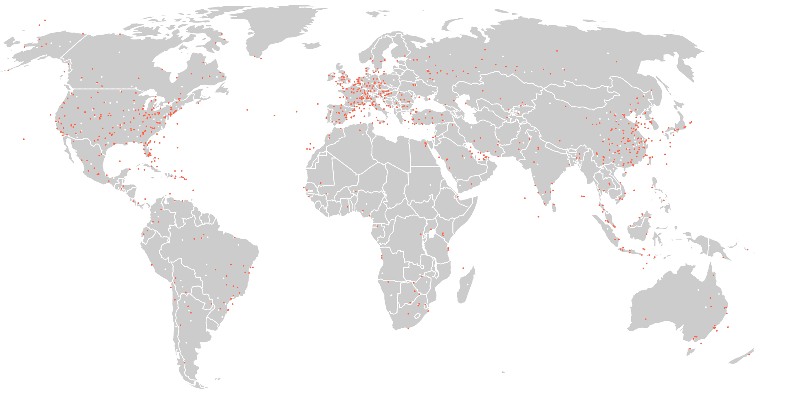

1,000 条飞行路径可视化。每个红色圆点都是一个动画飞机（保证！）

我们将绘制三个主要元素类别：*世界、机场*（白色圆点，有意识地保持在背景中，因为它们只有辅助作用），以及*飞机*（红色圆点）。代表真实飞机的红色圆点将沿着它们自己的飞行路径动画化，从起点飞往目的地。以下是展示飞机飞行路径的图片：

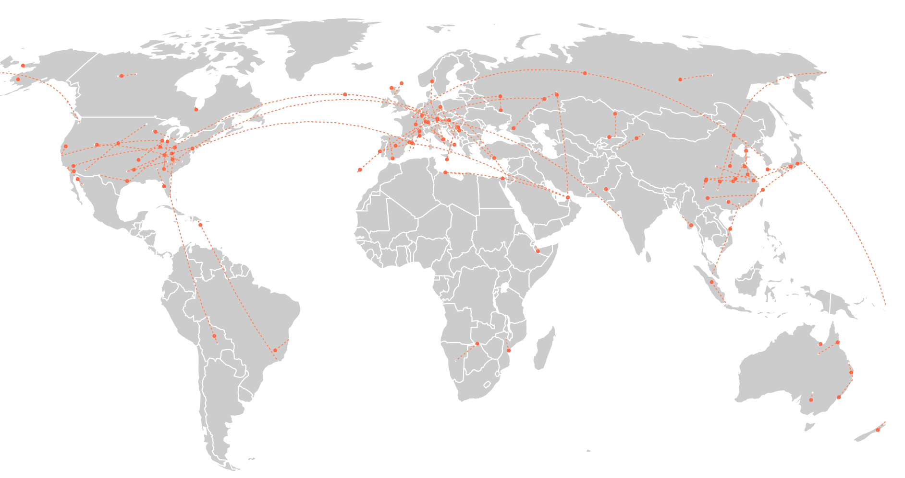

显示 100 条航线的路径及其相应的飞机

此视觉效果的源数据包括超过 65,000 条全球航线，飞往和来自超过 7,000 个机场。我们无法动画化所有这些航线，即使是使用 Canvas 也无法实现。我们的可视化目标将是尽可能多地展示，以传达对活跃与不活跃飞行区域以及常用与较少使用的航线的直观理解。

在视觉效果的底部，我们将展示一排按钮：


启动动画的按钮

这些按钮将允许用户设置一次显示的航班数量。重要的是，这不会是实时或重放的。我们不会引入任何航班时刻表，显示航班在当天/日期出发或到达的时间，我们将同时显示所有航班！首先，这支持之前描述的可视化目标，其次，它将有助于测试性能，因为尽可能多的元素将在同一时间被动画化。

为了测试浏览器性能，我们将在应用程序的左上角添加一个来自`stats.js`的小信息框。一旦将其放入你的代码中，这个巧妙的工具就会在你的页面上显示页面性能指标，其中我们将主要对**每秒帧数**（**FPS**）感兴趣。你很快就会看到它的实际效果，但这是放大后的样子，表示每秒 60 帧：

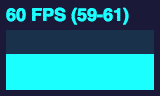

# 数据

根据我们想要表示的三个元素类别，我们需要三个数据源来构建可视化。这些数据源包括地图数据、机场位置数据以及每架航班的起点和终点数据。我们将称之为**路线数据**。这两个数据集都来自[openflights.org](https://openflights.org/)，它提供了一个工具，你可以用它来绘制航班图，以及包括路线和机场位置数据在内的全球航班数据库。这正是我们所追求的。

在进行简单的清洁和少量修改后，包含 100 个航班的路线数据和机场位置数据的前 10 条记录如下：

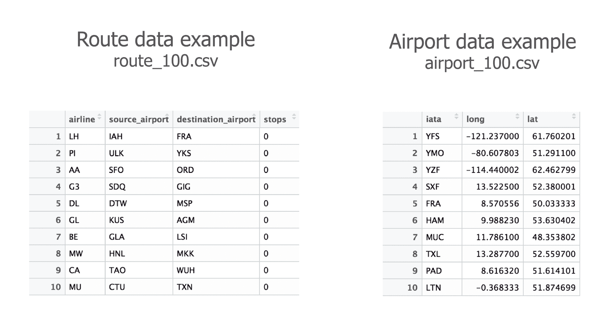

路线数据和机场数据

所有变量名都是自解释的。请注意，机场数据中的第一个变量 *i**ata**，代表**国际航空运输协会**（**IATA**）的官方三位字母机场代码。此外，请注意，我们必须根据数据集删除一些航班，因为并非每个机场位置都可用，这实际上导致航班数量（少于 2-3%）低于按钮所暗示的数量。

# 在 SVG 中构建飞行路径图

在本章中，我们将重点关注使用 Canvas 进行映射，以及 Canvas 动画的基准测试。为了明智地利用我们的时间和精力，我已经预先构建了一个 SVG 地图，我们可以将其用作基准，这样我们就可以将本章的其余部分专注于如何构建 Canvas 飞行路径应用程序。毕竟，章节的标题是*使用**Canvas**和 D3 进行映射*...

尽管如此，让我们快速看一下构建此应用程序所需的步骤。大致有八个逻辑步骤需要遵循：

1.  你使用容器 SVG、投影和地图路径生成器设置地图

1.  你加载地图数据并绘制地图

1.  你监听按钮事件，并根据按下的按钮加载适当的数据集

1.  你绘制机场

1.  你计算每架飞机的起点和终点位置，并计算从起点到终点的路径

1.  你沿着每架飞机的路径采样点并将它们存储在数组中（我们将它们称为*航点*）

1.  使用 D3，你让每架飞机沿着其路径过渡

1.  当每架飞机到达目的地后，你让过渡再次开始

现在我们已经创造出了 SVG 飞行路径可视化，让我们看看我们能够启动多少架飞机而不会出现任何问题。

# 测量性能

所以，让我们开始吧——让一些飞机飞起来。我们应该从简单做起，尝试 100 条路线：

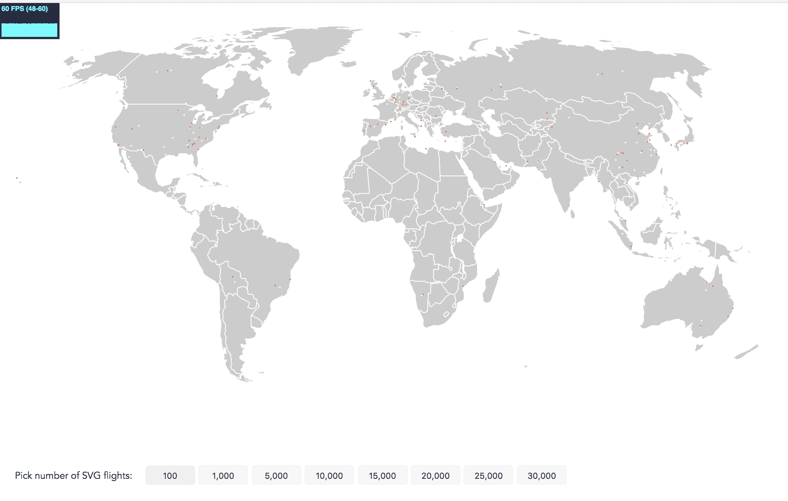

60 FPS 下 100 条飞行路径的 SVG 可视化

看看左上角的帧率吗？它有点小，但我们仍然非常满意！每秒显示 60 帧是完美的。1,000 架航班将给我们带来高达 40 帧每秒。这是一个下降，但动画仍然流畅。然而，即使在 1,000 架航班的情况下，我们也看不到任何主要的航班活动集群。所以，让我们尝试同时显示 5,000 架航班：

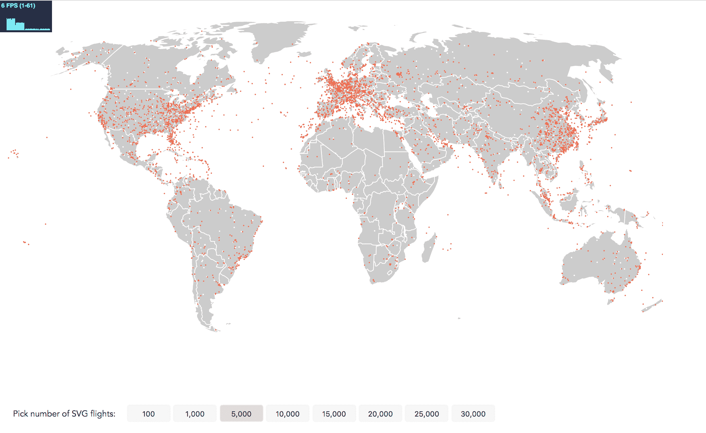

6 FPS 下 5,000 条飞行路径的 SVG 可视化

我们的性能下降到 6 FPS。虽然这个静态图像让我们更接近我们的可视化目标，即识别高航班交通区域，但观看这种抖动的动画并不有趣。Canvas 来拯救。

在浏览器中查看此步骤：[`larsvers.github.io/learning-d3-mapping-9-1`](https://larsvers.github.io/learning-d3-mapping-9-1)。代码示例[09_01.html](https://github.com/larsvers/Learning-D3.js-4-Mapping/blob/master/Chapter%2009%20-%20Mapping%20with%20D3%20and%20Canvas/09_01.html)。我建议使用最新版本的 Chrome 来查看和操作本章的示例。

在每个步骤结束时，您将在靠近相关图像的信息框中找到两个链接。第一个链接将带您到浏览器中可以查看的此步骤的工作实现。第二个**代码示例**链接将带您到完整的代码。如果您正在阅读印刷版，您可以在[`github.com/larsvers/Learning-D3.js-4-Mapping`](https://github.com/larsvers/Learning-D3.js-4-Mapping)的相关章节中找到所有代码示例。

# 在 Canvas 中构建飞行路径地图

在我们将应用拆解之前，让我们先概述一下我们的 Canvas 应用。

最好快速处理 HTML，因为它不可能更简单。我们手头有一个用于画布的 `div` 以及我们的按钮：

```js
<div id="canvas-map"></div>
<div id="controls">
    <div class="flight-select" id="button-header">Pick number of flights:</div>
    <button class="flight-select" data-flights="100">100</button>
    <button class="flight-select" data-flights="1000">1,000</button>
    <button class="flight-select" data-flights="5000">5,000</button>
    <button class="flight-select" data-flights="10000">10,000</button>
    <button class="flight-select" data-flights="15000">15,000</button>
    <button class="flight-select" data-flights="20000">20,000</button>
    <button class="flight-select" data-flights="25000">25,000</button>
    <button class="flight-select" data-flights="30000">30,000</button>
</div>
```

注意，每个按钮都获得相同的类选择器以及一个 `data-flights` 属性来传递每个按钮代表的航班数量。您将稍后使用此属性来加载正确的数据集！

现在我们来看看在 Canvas 中构建此应用的步骤，并查看我们对之前描述的 SVG 应用流程所做的更改。我已经**突出显示**了 Canvas 流程中更改的部分，并删除了 SVG 部分（括号内）：

1.  您设置**画布和上下文**（而不是容器 SVG），以及地图的投影和路径生成器

1.  您加载地图数据并绘制地图

1.  您监听按钮事件并根据按下的按钮加载适当的数据集

1.  您绘制机场**和世界地图**，因为它们位于同一个 Canvas 上，重绘成本很低

1.  您计算每架飞机的起点和终点位置，并计算从起点到终点的路径

1.  您在每个飞机的路径上采样**航路点**并将它们存储在数组中

1.  **您启动游戏循环**（而不是使用 D3 过渡）：

    1.  清除 Canvas

    1.  更新位置

    1.  绘制飞机

1.  在 SVG 示例中，我们一旦每架飞机到达目的地，就重新启动一个过渡。在我们的 Canvas 应用程序中，这是游戏循环中的**更新步骤**的一部分。

# 设置地图

首先，我们设置了一些全局变量：

```js
var width = 1000,
    height = 600,
    countries,
    airportMap,
    requestID;
```

`width`和`height`不言而喻。国家将持有 GeoJSON 数据来绘制地球，这需要从各种函数作用域中访问。因此，在这个小型应用程序中将其定义为全局变量更容易。`airportMap`将允许我们通过三位字母 IATA 代码将机场与路线数据连接起来。`requestID`将被我们的循环函数`requestAnimationFrom()`填充，并用于取消当前循环。我们很快就会了解到这一点。

然后，我们设置两个上下文：一个用于世界的上下文和一个用于飞机的上下文。这种在开始时的小额外工作使我们的生活后来容易得多。如果我们把世界和飞机画在同一个上下文中，每次飞机飞行的距离很短时，我们就必须更新世界和飞机。将世界保持在单独的画布上意味着我们只需要绘制一次世界，并且可以保持该图像/上下文不变：

```js
var canvasWorld = d3.select('#canvas-map').append('canvas')
  .attr('id', 'canvas-world')
  .attr('width', width)
  .attr('height', height);

var contextWorld = canvasWorld.node().getContext('2d');

var canvasPlane = d3.select('#canvas-map').append('canvas')
  .attr('id', 'canvas-plane')
  .attr('width', width)
  .attr('height', height);

var contextPlane = canvasPlane.node().getContext('2d');
```

我们使用绝对 CSS 定位来堆叠画布，使其完美地堆叠在一起：

```js
#canvas-world, #canvas-plane {
  position: absolute;
  top: 0;
  left: 0;
}
```

接下来，我们设置`投影`：

```js
var projection = d3.geoRobinson()
    .scale(180)
    .translate([width / 2, height / 2]);

```

请注意，您可以使用 D3 方便的方法`.fitExtent()`或`.fitSize()`而不是使用`.scale()`和`.translate()`来居中和调整您的投影。您将 viz 维度和您想要投影的 GeoJSON 对象传递给它们，它们会为您计算最佳比例和转换。

还要注意，我们不是使用无处不在的**墨卡托**投影，而是使用**罗宾逊**投影来绘制我们的世界地图。它在国家大小比例方面以稍微更真实的方式绘制世界。**罗宾逊**和其他许多非标准投影可以在额外的**d3-geo-projection 模块**中找到。

现在我们需要一个路径生成器。实际上，你需要构建两个路径生成器：

```js
var pathSVG = d3.geoPath()
    .projection(projection);

var pathCanvas = d3.geoPath()
    .projection(projection)
    .pointRadius(1)
    .context(contextWorld);
```

`pathSVG`将用于在内存中生成飞行路径。我们希望使用 SVG 来完成，因为它提供了方便的方法来计算其长度和从中提取样本点。`pathCanvas`将用于将我们的`geo`数据绘制到屏幕上。注意，我们添加了`d3.geoPath()`的`.context()`方法，并将其传递给我们的`contextWorld`。如果我们向这个`.context()`方法传递一个 Canvas 上下文，路径生成器将返回一个针对该上下文的 Canvas 路径。如果没有指定，它将返回一个 SVG 路径字符串。你可以将其视为一个切换按钮，告诉 D3 使用哪个渲染器。

# 绘制地图并监听用户输入

与 SVG 过程一样，我们首先加载数据：

```js
d3.json('data/countries.topo.json', function(error, world) {
  if (error) throw error;
  d3.select('div#controls').style('top', height + 'px');
  countries = topojson.feature(world, world.objects.countries); // GeoJSON;
  drawMap(countries);
```

然后我们做一些清理工作，并将按钮移动到 `div#controls` 下方画布下面。你在绘制地图之前，将 TopoJSON 重新编码为 GeoJSON 功能，并将数据保存为全局变量：

```js
function drawMap(world) {
  countries.features.forEach(function(el, i) {

    contextWorld.beginPath();
    pathCanvas(el);
    contextWorld.fillStyle = '#ccc';
    contextWorld.fill();

    contextWorld.beginPath();
    pathCanvas(el);
    contextWorld.strokeStyle = '#fff';
    contextWorld.lineWidth = 1;
    contextWorld.stroke();

  });
}
```

多亏了 D3 的多功能路径生成器，绘制世界地图只需要这些。很简单！

在我们的异步 `d3.json()` 数据加载函数中，接下来你将处理按钮事件。记住，目前还没有发生任何事，但一旦用户点击按钮，动画就应该开始。

你将鼠标按下监听器附加到所有按钮上：

```js
d3.selectAll('button.flight-select').on('mousedown', handleFlights);
```

继续编写处理程序：

```js
function handleFlights() {
  d3.selectAll('button').style('background-color', '#f7f7f7');
  d3.select(this).style('background-color', '#ddd');

  if (requestID) cancelAnimationFrame(requestID);
    var flights = this.dataset.flights;

    d3.queue()
      .defer(d3.csv, 'data/routes_' + flights + '.csv')
      .defer(d3.csv, 'data/airports_' + flights + '.csv')
      .await(ready);
  }
```

按钮颜色在前两行处理。下一行将停止当前循环。我们甚至还没有循环，所以一旦我们有循环，我们就会回到这里。

最后，我们检索按钮代表的航班数量，并从服务器加载相应的航线和机场位置数据。这就是 `d3.json()` 回调的全部内容，因为一旦数据加载，`ready()` 函数就会接管。

# 准备和绘制 Canvas

在 `ready()` 函数中，我们想要在 Canvas 上实现三件事：

```js
function ready(error, routes, airports) {
  if (error) throw error;

  // 1) Draw the background scene
  // 2) Calculate plane positions
  // 3) Animate and render the planes
}
```

# 绘制背景场景

在我们绘制机场之前，我们操纵机场位置数据。我们创建一个数组，每个机场包含一个 GeoJSON 点 `geometry` 对象：

```js
var airportLocation = [];
airports.forEach(function(el) {
  var obj = {};
  obj.type = 'Feature';
  obj.id = el.iata;
  obj.geometry = {
    type: 'Point',
    coordinates: [+el.long, +el.lat]
  };
  obj.properties = {};
  airportLocation.push(obj);
});
airportMap = d3.map(airportLocation, function(d) { return d.id; });
```

然后我们使用 `d3.map()` 函数生成一个地图，并将其填充到全局变量 `airportMap` 中。`d3.map()` 是一个实用函数，它接受一个对象数组，生成我们可以通过其 `map.get()` 方法访问的键值对。我们不会立即使用这个地图，但稍后我们会用到它。

每次我们调用 `ready()` 函数，也就是每次用户按下新按钮时，我们都会重新绘制机场和世界。两者都绘制在同一个画布上。如果我们想在画布上更改一项内容，我们需要更改画布上的所有内容。有方法只更新具有 clip-paths 的区域，但在多个元素的复杂动画中，这可能会很快变得混乱。因此，我们擦除并重建：

```js
contextWorld.clearRect(0, 0, width, height);
drawMap(countries);
drawAirports(airportLocation);
```

注意，我们正在绘制第一个画布 - 通过 `contextWorld` 访问。我们之前看到过 `drawMap()` 函数，`drawAirports()` 函数甚至更简单，不言自明：

```js
function drawAirports(airports) {
  airports.forEach(function(el,i) {

    contextWorld.beginPath();
    pathCanvas(el);
    contextWorld.fillStyle = '#fff';
    contextWorld.fill();

  });
}
```

就这样。这个背景场景将在每次按钮点击时更新显示的机场。

# 定义飞机

接下来，我们为我们的动画建立基础。本质上，我们想要每个飞机航线上的一系列点。我们将它们称为**航路点**，以下是飞行路径**法兰克福到亚特兰大**的航路点作为数组和路径上的点：

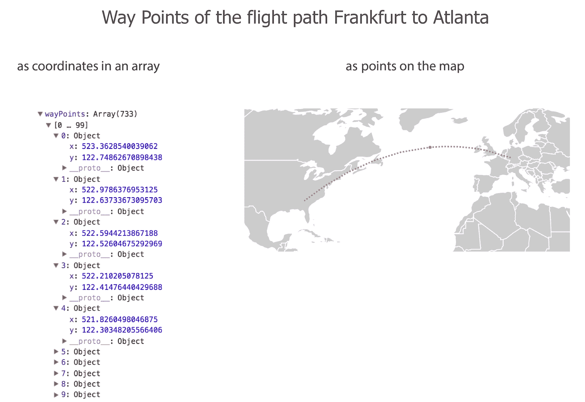

航路点在数组中（显示前 10 个 733 个）和在地图上（一个示意图，不是精确的）

**航路点**是动画的核心成分，是我们的动画燃料。当我们动画第一帧时，我们将：

1.  清除飞机自己的画布 `contextPlane`。

1.  提取每个飞机的第一个航路点。

1.  在这个位置绘制那架飞机。

当我们绘制第二帧时，我们做同样的事情，但在 *步骤 2* 中提取第二个 `wayPoint`。对于第三帧，我们将提取第三个 `wayPoint`，依此类推。

我们不希望浏览器在每一帧之间因为复杂的计算而停滞，所以我们将在动画之前计算所有飞机的位置。注意，这并不总是可能的，位置可能取决于用户输入或你的力导向图中的任意电荷等因素。然而，无论你能预先计算什么，都应该这样做。

# 计算飞机的位置

我们如何得到 `wayPoints` 数组？从概念上讲，我们已经说过了。我们现在用代码表达它。首先，你需要创建一个数组来存储所有飞机，这取决于相应按钮点击加载的路线数据：

```js
var routeFromTo = [];
  routes.forEach(function(el) {
    var arr = [el.source_airport, el.destination_airport];
    routeFromTo.push(arr);
  });
```

这是一个简单的元素数组，代表三位字母的起点和目的地 IATA 机场代码。

接下来，你遍历这个起点和终点数组来计算 `wayPoints`。你将创建一个名为 `planes` 的对象来存储数据，以及两个辅助函数来计算数据。但在那之前，让我们看看生成飞机的简单算法：

```js
routeFromTo.forEach(function(el, i) {
  var plane = planes.getPlane(el);
  plane.route = planes.getPath(el);
  plane.wayPoints = planes.getWayPoints(plane);
  planes.items.push(plane);
});
```

从概念上讲，你为每条路线生成一架飞机。然后你获取这架飞机的路线路径并将其存储在飞机中。接下来，你采样路径的多个 *x*，*y* 坐标 – 我们的 `wayPoints` – 并也将它们存储在 `plane` 中。最后，你将包含所有所需信息的 `plane` 添加到 `planes.items` 数组中。这就是概述中的所有计算魔法。一旦完成，你就可以动画化这些点。

现在，让我们简要地看看 `planes` 对象。注意复数形式！这与我们为每条路线构建的 `plane` 对象不同。它是所有 `plane` 对象的家。`planes.items` 将保存所有 `plane` 对象，`planes.getPlane()` 将生成它们，`planes.getPath()` 将创建路线的路径，而 `planes.getWayPoints()` 将从路径中采样我们的 `wayPoints`：

```js
var planes = {
  items: [],
  getPlane: function(planeRoute) { },
  getPath: function(planeRoute) { },
  getWayPoints: function(plane) { }
}
```

让我们看看每个 `planes` 函数的作用。这里有三个简单的步骤：首先，我们构建飞机，然后绘制每架飞机的路径，最后从该路径中采样点，我们可以迭代这些点来使飞机移动：

+   **制造飞机**：`getPlane()` 函数接受 `planeRoute` – 起点和目的地的三位字母机场代码 – 并用它来初始化飞机的位置：

```js
getPlane: function(planeRoute) {

  var origin = planeRoute[0], destination = planeRoute[1];

  var obj = {};

  obj.od = [origin, destination];

  obj.startX = projection(airportMap.get(origin).geometry.coordinates)[0];
  obj.startY = projection(airportMap.get(origin).geometry.coordinates)[1];

  obj.x = projection(airportMap.get(origin).geometry.coordinates)[0];
  obj.y = projection(airportMap.get(origin).geometry.coordinates)[1];

  obj.route = null;
  obj.wayPoints = [];
  obj.currentIndex = 0;

  return obj;

}
```

它返回一个对象，包含从你之前创建的 `airportMap` 查找中检索到的 `startX` 和 `startY` 位置。它还有 `x` 和 `y` 坐标，代表飞机的当前位置。对于第一帧，这和 `startX` 和 `startY` 相同。它还包含一个尚未填写的对象，用于 `route` 路径和我们在下一步计算的 `wayPoints`。最后，它有一个 `currentIndex`，用于跟踪我们在改变飞机位置时飞机所在的 `wayPoint`（这很快就会变得清楚）。

+   **绘制每架飞机的路径**：飞机初始化。现在，让我们获取路径。记得我们在设置期间创建了两个路径生成器吗？一个是用于绘制世界、机场和平面圆的 Canvas 路径。另一个是`pathSVG`，用于创建作为 SVG 路径的路线。你为什么要这样做呢？因为 SVG 路径有很好的`.getTotalLength()`和`.getPointAtLength()`方法，这使得从该路径中采样点变得容易。以下是使用 D3 创建路径的方法：

```js
getPath: function(planeRoute) {
  var origin = planeRoute[0], destination = planeRoute[1];
  var pathElement = document.createElementNS(d3.namespaces.svg,
  'path');

  var route = d3.select(pathElement)
    .datum({
      type: 'LineString',
      coordinates: [
         airportMap.get(origin).geometry.coordinates,
         airportMap.get(destination).geometry.coordinates
       ]
    })
    .attr('d', pathSVG);

    return route.node();
}
```

你不会在 DOM 中创建路径，而是在内存中创建并保存到`pathElement`变量中。由于它是一个 SVG 而不是 HTML 元素，你需要指定 SVG 命名空间，这可以通过 D3 的`.namespaces.svg`实用函数来完成。然后你在返回原始元素而不是 D3 选择`route.node()`之前创建路径。

+   **检索航点**：所有设置都已就绪以计算航点。`getWayPoints()`接受一个飞机，此时飞机的路径已存储在`plane.route`属性中。我们使用我们刚刚赞扬的路径采样函数来处理其路径，并返回一个包含该特定飞机路线路径所有航点的数组：

```js
getWayPoints: function(plane) {
  var arr = [];
  var points = Math.floor(plane.route.getTotalLength() * 2.5);

  d3.range(points).forEach(function(el, i) {
    var DOMPoints = plane.route.getPointAtLength(i/2.5);
    arr.push({ x: DOMPoints.x, y: DOMPoints.y });
  });

  return arr;
}
```

首先，你创建一个名为`arr`的空数组，它将保存所有航点。然后，你生成一个保存在`points`变量中的整数。这个整数将代表我们从路径中想要采样的点的数量。你获取路径的总长度，这由路径将占据的像素数表示。这个值乘以`2.5`。这个因子非常重要，它控制了将采样多少点以及动画的快慢。数字越高，采样的点越多，动画看起来越慢。如果你选择一个低数字甚至是一个分数，如*0.1*，采样的点会很少，动画看起来会更快。

你使用`d3.range(points).forEach()`来检索在每个路径点由`.getPointAtLength()`返回的所谓`DOMPoints`坐标。然后你将它们中的每一个推入数组，然后就是你的航点。

恭喜你。你刚刚构建了一架飞机。实际上，你构建了一架飞机及其路线以及所有需要使其跳跃的点，这样观众就会认为它在飞行。这就是它内部的样子：

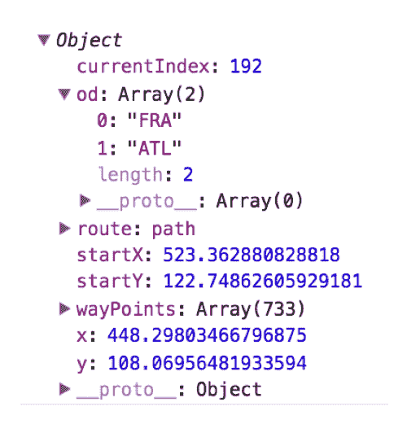

从法兰克福飞往亚特兰大的飞机

# 飞机动画

剩下的很简单。你只需要将游戏循环应用到画布上。我们已经遇到过几次这种情况；你创建一个名为`animate()`的函数，并让它在一个连续的循环中运行：

```js
function animate() {
  planes.clearPlanes(contextPlane);
  planes.items.forEach(function(el) {
    planes.updatePlane(el);
    planes.drawPlane(contextPlane, el.x, el.y);
  });
  requestID = requestAnimationFrame(animate);
}

requestAnimationFrame(animate);
```

注意，我们还把使用的函数添加到了飞机对象中，以保持所有与飞机相关的函数代码在一起。

首先，我们清除画布。`planes.clearPlanes()`实际上只是清除我们传递给它的上下文。

然后，我们遍历包含所有飞机的`planes.items`数组，并使用`planes.updatePlane()`更新每个飞机。我们传递相应的飞机，如果飞机已到达目的地，则将其`x`和`y`坐标移动到起点，或者将其移动到下一个航点的坐标：

```js
updatePlane: function(plane) {
  plane.currentIndex++;
  if (plane.currentIndex >= plane.wayPoints.length) {
    plane.currentIndex = 0;
    plane.x = plane.startX;
    plane.y = plane.startY;
  } else {
    plane.x = plane.wayPoints[plane.currentIndex].x;
    plane.y = plane.wayPoints[plane.currentIndex].y;
  }
}
```

在这里，`currentIndex`的使用应该变得更加清晰。它跟踪每个飞机在其路径上的位置，并在每次更新时将飞机向前移动一个航点。

最后，我们绘制了平面（这时我们意识到我们并没有真正建造一个飞机，而是一个**番茄色**的圆圈）：

```js
drawPlane: function(ctx, x, y) {
  ctx.beginPath();
  ctx.fillStyle = 'tomato';
  ctx.arc(x, y, 1, 0, 2*Math.PI);
  ctx.fill();
}
```

最后，你使用`requestAnimationFrame()`来启动它。你可以使用`setInterval()`，但你应该使用`requestAnimationFrame()`。它将允许浏览器在下次重绘之前选择最佳时间来触发其回调。这比强制的`setInterval()`更经济。它还有额外的优点，即当应用程序运行的浏览器标签页不在焦点时，可以中断循环。注意，我们还保存了每个循环的`requestID`。你可能记得，当用户按下按钮启动新循环时，我们使用这个唯一的 ID 通过`cancelAnimationFrame(requestID)`取消当前循环。

完成。做得好。

# 性能测量

到目前为止，一切顺利。但是它工作吗？如果它工作，它比 SVG 示例工作得更好吗？让我们回忆一下，SVG 飞行路径可视化为我们提供了 100 个动画圆的 60 FPS 和大约 5,000 个动画圆的 6 FPS。让我们从 100 个圆开始，关注左上角的`stats.js`度量：

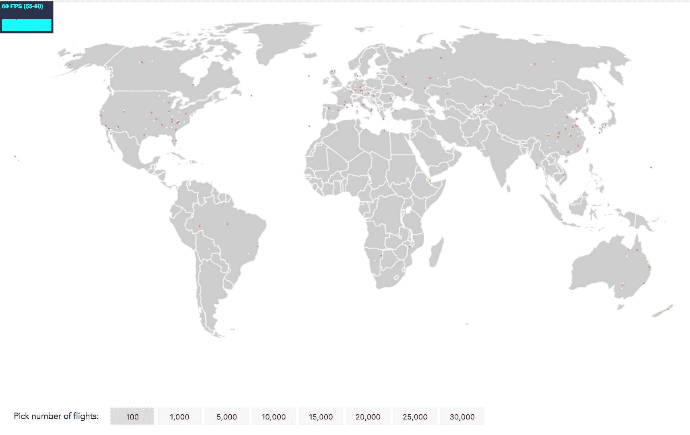

60 FPS 的 100 条飞行路径的 Canvas 可视化

在浏览器中查看此步骤：[`larsvers.github.io/learning-d3-mapping-9-2a`](https://larsvers.github.io/learning-d3-mapping-9-2a)。代码示例[09_02a.html](https://github.com/larsvers/Learning-D3.js-4-Mapping/blob/master/Chapter%2009%20-%20Mapping%20with%20D3%20and%20Canvas/09_02a.html)。

我们期望 60 FPS。让我们增加到 1,000 架航班：

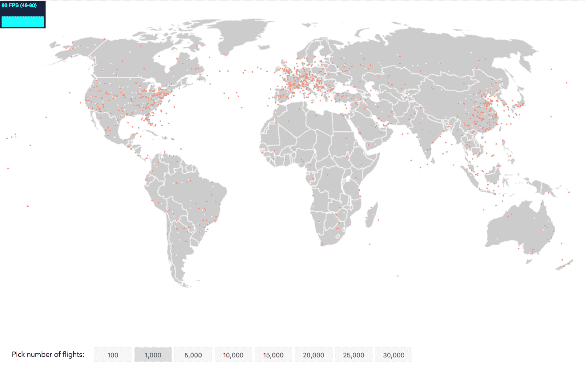

60 FPS 的 1,000 条飞行路径的 Canvas 可视化

再次，60 FPS！5,000 架飞机？

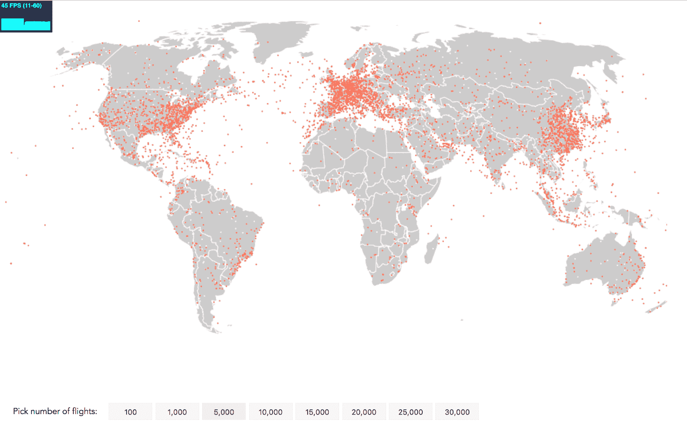

45 FPS 的 5,000 条飞行路径的 Canvas 可视化

它正在下降，但仍然保持在 45 FPS，保持动画流畅。让我们看看 10,000 架航班：

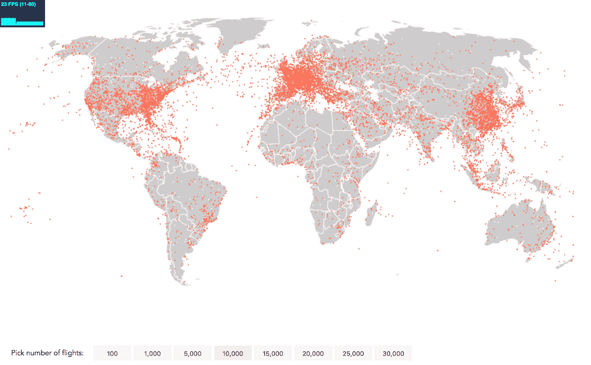

23 FPS 的 10,000 条飞行路径的 Canvas 可视化

我们仍然看到与观看 23 FPS 电影时相似的帧率。然而，让我们尝试挤出更多一些。

# 性能优化

记住，我们为这个可视化使用了两个 Canvas，一个 Canvas 用于绘制带有地图和机场的静态背景场景，另一个 Canvas 用于动态飞行动画。我们这样做是因为它保持了绘制关注点的分离。

使用额外画布的另一个原因是提高了性能。我们可以使用一个画布作为 **内存缓冲区** 来预渲染元素，然后将其内容复制到主可见画布上。这节省了渲染成本，因为绘制在可见画布上比绘制在不可见画布上然后复制图像到主画布要低效。性能进一步得到提升，因为我们将要使用的上下文的 `drawImage()` 方法默认是硬件加速的（这意味着它使用 GPU 的并行处理能力）。

对于我们的小程序，动画元素是飞机圆圈。我们不必在每次更新时使用 `drawPlane()` 函数来绘制它们，而是可以先在小型缓冲画布上创建一个圆圈的单一图像，然后使用 `drawImage()` 将其传输到 `canvasPlane`。

我们在全局范围内创建了一个单独的飞机图像：

```js
function createPlaneImage() {
  var planeImg = document.createElement('canvas');
  planeImg.width = planeImg.height = 2;
  var contextPlaneImg = planeImg.getContext('2d');
  contextPlaneImg.beginPath();
  contextPlaneImg.fillStyle = 'tomato';
  contextPlaneImg.arc(planeImg.width/2, planeImg.height/2, 1, 0,
  2*Math.PI);
  contextPlaneImg.fill();
  return planeImg;
}
```

我们在空中创建了一个名为 `planeImg` 的缓冲画布，将其 `width` 和 `height` 设置为 `2`（是平面期望半径 `1` 的两倍），并获取其上下文。在返回之前，我们将在其上绘制一个 `tomato` 颜色的圆圈。

我们在初始化 `planes` 对象时调用此函数一次，并将其作为图像存储在 `planes` 对象中：

```js
var planes = {
  items: [],
  icon: createPlaneImage(),
  getPlane: function(planeRoute) {
  // ...
```

最后，我们只需移除我们用来在每次更新时绘制圆圈的 `drawPlane()` 函数。相反，我们向 `planes` 对象添加一个名为 `drawPlaneImage()` 的新函数，该函数使用 `drawImage()` 将我们的飞机图标（圆圈）添加到我们确定的上下文中：

```js
drawPlaneImage: function(ctx, x, y) {
  ctx.drawImage(this.icon, x, y);   
}
```

最后，我们在 `animate()` 函数中不调用 `drawImage()`，而是调用 `drawPlaneImage()`：

```js
function animate() {
  planes.clearPlanes(contextPlane);
  planes.items.forEach(function(el) {
    planes.updatePlane(el);
    planes.drawPlaneImage(contextPlane, el.x, el.y);
  });

  requestID = requestAnimationFrame(animate);
}
```

# 继续测量性能

现在让我们检查动画 10,000 个点的帧率：

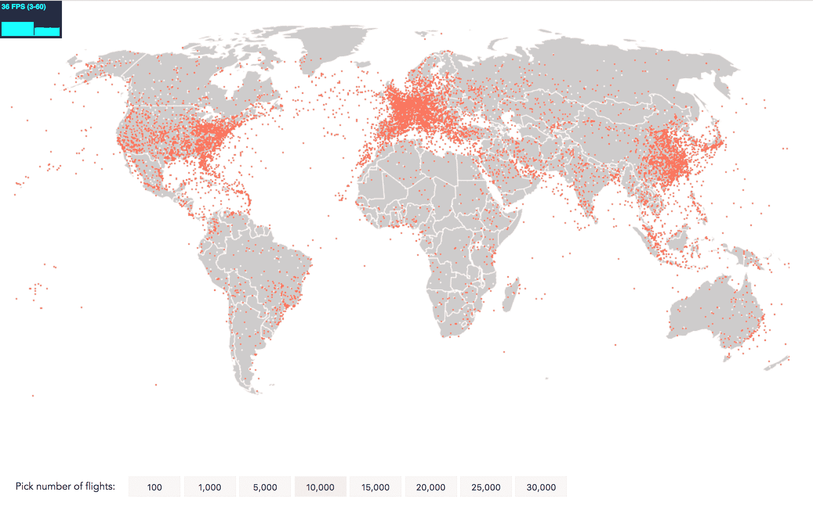

在 36 FPS 而不是 23 FPS 下，10,000 条飞行路径的画布可视化

查看完整应用程序：[`larsvers.github.io/learning-d3-mapping-9-2b`](https://larsvers.github.io/learning-d3-mapping-9-2b)。代码示例：[09_02b.html](https://github.com/larsvers/Learning-D3.js-4-Mapping/blob/master/Chapter%2009%20-%20Mapping%20with%20D3%20and%20Canvas/09_02b.html)。

这太棒了，与不使用 `drawImage()` 的能力相比，性能提升了约 +57%。这里没有显示，但 5,000 个点以 60 FPS 而不是 45 FPS 动画。耶。

接下来，15,000 架飞机以 24 FPS 飞行，20,000 架飞机以高达 18 FPS 飞行。这仍然略高于通常认为的最低可能帧率 16 FPS，以欺骗大脑相信流畅的动画。即使 25,000 架飞机仍然以大约每秒 14 帧的速度移动，表现出轻微的卡顿，而 30,000 架飞机在 12 FPS 下仍然只有轻微的卡顿。

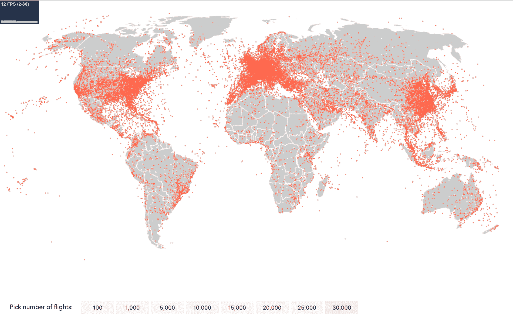

在 12 FPS 下，30,000 条飞行路径的画布可视化

虽然性能会因不同的浏览器、CPU 和 GPU 而异，但从 SVG 跳转到 Canvas 的提升是显著的！

使用 Canvas，我们实现了我们的叙事任务，即可视化高飞行活动区域。整个欧洲似乎都在空中，以及美国的东海岸和西海岸以及中国的东部。其他大陆在其海岸线上显示出增加的航空活动线。你可能会对沿着泰国和印度尼西亚移动的飞机带感到惊讶，尽管这是一个人口密集的地区。

# 摘要

在本章中，你学习了如何使用 SVG 和 Canvas 构建飞行路径可视化，将之前学到的许多知识整合在一起。你看到了使用 Canvas 编程动画需要不同的思维模式，这最好通过游戏循环来概括：处理数据，清除绘图，重新绘制动画。你使用了 D3 来设置可视化，但也看到了由于不同的编码概念，Canvas 可能需要你稍微远离 D3 的核心功能，如过渡效果。然而，所有这些努力都得到了回报，因为我们见证了 Canvas 在动画方面的强大功能。我们不仅能够流畅地动画化 1,000 个点，还通过优化的 Canvas 技巧安全地动画化了 15,000 个点，并且优雅地动画化了 20,000 个点。

在看到了 Canvas 的好处之后，现在让我们找到一个解决其缺点之一的方案：交互性！
