# 为您的 Canvas 地图添加交互性

在上一章中，您看到了 Canvas 的一个闪亮特性——在屏幕上以平滑动画的方式动画化成千上万的点。在本章中，您将处理 Canvas 的一个注意事项：交互。虽然与 HTML 或 SVG 元素的交互是直接的，但使用 Canvas 进行交互需要更多的思考和一些技巧。在本章中，您将跟随这些思路，学习完成以下任务所需的技巧：

+   使地球移动，并为其添加缩放和旋转交互

+   学习如何通过**拾取**与 Canvas 元素交互

+   从 Canvas 元素中检索数据以在工具提示中显示

在本章之后，您将涵盖 Canvas、绘图、动画以及最终与 Canvas 交互的所有重要方面。

# 为什么 Canvas 交互是不同的

在上一章中，您通过移除 DOM 实现了成千上万点的平滑动画。DOM 是浏览器内存中每个元素的表示。绕过它，您在动画过程中处理的开销要小得多。然而，DOM 在 Web 开发的其他目标中非常有用。在列表中高居榜首——特别是对于数据可视化——是屏幕上元素的**交互**。

您可以为元素添加一个`onmousemove`或`onclick`监听器。您不能对 Canvas 上的元素这样做。它们是过去代码的像素表现，在浏览器中不表示为模型。

然而，不要绝望，有一些间接但简单的技术可以与您的 Canvas 交互。我们将在本章中查看最重要的技术，构建一个交互式地球：

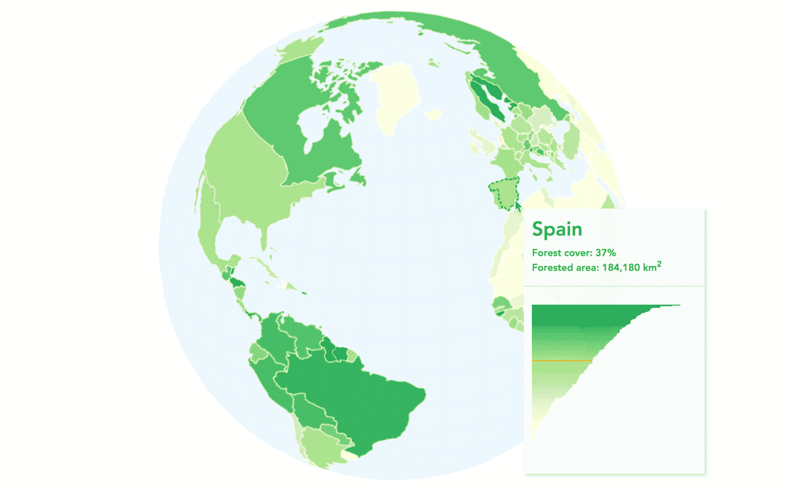

按国家划分的世界森林覆盖率地图

放弃飞行飞机，您将构建一个显示每个国家森林覆盖率百分比的地球。一个国家越绿（您猜对了），森林覆盖率就越高。正如您在前面的图中可以看到，当您悬停在每个国家上时，您将有一个显示特定国家信息的工具提示。用户还可以随意旋转地球并放大到特定区域。

您可以在[`larsvers.github.io/learning-d3-mapping-10-4`](https://larsvers.github.io/learning-d3-mapping-10-4)查看最终的应用程序，以及一个[代码示例](https://larsvers.github.io/learning-d3-mapping-10-4)在[10_04.html](https://github.com/larsvers/Learning-D3.js-4-Mapping/blob/master/Chapter%2010%20-%20Adding%20Interactivity/10_04.html)。

在每个步骤结束时，您将在靠近相关图像的信息框中找到两个链接。第一个链接将带您到一个可以浏览器的实际实现步骤。第二个*代码示例*链接将带您到完整的代码。如果您正在阅读印刷版，您可以在[`github.com/larsvers/Learning-D3.js-4-Mapping`](https://github.com/larsvers/Learning-D3.js-4-Mapping)的相关章节中找到所有代码示例。

# 在 Canvas 上绘制世界

让我们从绘制地球仪开始。这很简单，很大程度上是基于前面的章节。

# 设置

首先，您将创建一些初始化所需的变量。随着应用程序的增长，我们将回到这个列表，但到目前为止，它很简单：

```js
var width = 960,
    height = 600,
    projectionScale = height / 2.1,
    translation = [width / 2, height / 2];
```

您正在设置 Canvas 的`width`和`height`以及地球仪的缩放和转换。每个投影都有自己的理想起始缩放。您可以调整这个数字以找到合适的缩放。您将直接使用`width`和`height`来设置 Canvas 及其上下文：

```js
var canvas = d3.select('#canvas-container').append('canvas')
    .attr('id', 'canvas-globe')
    .attr('width', width)
    .attr('height', height);
var context = canvas.node().getContext('2d');
```

这里没有魔法。请注意，在我们的 HTML 中有一个带有`#canvas-container` ID 的`div`，在其中添加主 Canvas。

让我们再生成一个`bufferCanvas`。您在前面的章节中学习了 buffer Canvas 的好处。简而言之，在内存中渲染图像并将其复制到主 Canvas 上比直接在主 Canvas 上渲染图像更高效：

```js
var bufferCanvas = document.createElement('canvas');
var bufferContext = bufferCanvas.getContext('2d');

bufferContext.canvas.width = width;
bufferContext.canvas.height = height;
```

构建地球仪的一个相当核心的部分是正确的投影。构建地球仪将我们的选择大大减少到`d3.geoOrthographic()`投影，这是一个 2D 地球投影，它是标准 d3-geo 模块的一部分。您已经在第五章，“点击-点击-爆炸！将交互性应用于您的地图”中使用过它。让我们首先设置它：

```js
var projection = d3.geoOrthographic()
    .scale(projectionScale)
    .translate(translation)
    .clipAngle(90);
```

我们应用了上面指定的缩放和转换数组，以及将`.clipAngle()`设置为 90 度，以便始终裁剪投影的背面，即我们的地球仪。

由于我们使用`bufferCanvas`进行所有绘图，因此我们将投影绑定到一个仅绘制到 buffer Canvas 的路径生成器，如下所示：

```js
var bufferPath = d3.geoPath()
    .projection(projection)
    .context(bufferContext);
```

您将创建两个更多的地理辅助工具：一个基本的**球体**和一个**经纬网**：

```js
var sphere = { type: 'Sphere' };
var grid = d3.geoGraticule()();
```

这两个都是地理可视化原语。**球体**是一个您用来在地表下构建地球的球体。然后您可以填充它或给它一个轮廓，以使地球在各国之外呈现圆形。**经纬网**是主要子午线（经度线）和纬度线（纬度线）的网格，彼此之间相隔 10 度（是的，您需要四个括号来生成实际的经纬网对象）。我们很快就会看到它们的作用。

# 绘制世界

场景已经设定。在本节中，您将加载一些国家形状数据来绘制世界。您将设置四个小函数来实现绘制：

+   一个`数据加载`函数

+   一个`ready()`函数，它准备数据并将其传递给渲染函数

+   一个启动世界绘制并将最终图像从缓冲区复制到主 Canvas 上的`renderScene()`函数

+   一个将世界渲染到`bufferCanvas`上的`drawScene()`函数。

这可能听起来只是为了绘制一个静态地球而有些过度，但请让我向你保证，它确实是。然而，我们正在追求更高的目标，这将大大有助于我们已经建立的结构。

数据加载函数只是请求数据并将其传递给`ready()`函数：

```js
d3.json('../../data/world/world-110.json', function(error, data) {
  if(error) throw error;
  ready(data);
});
```

到目前为止，`ready()`函数并没有增加多少复杂性：

```js
function ready(world) {
  var countries = topojson.feature(world,
  world.objects.ne_110m_admin_0_countries); 
  renderScene(countries);
}
```

它将 TopoJSON 转换为 GeoJSON `countries`数组，并调用`renderScene()`。`renderScene()`做的是我们在前面的代码中已经描述过的。它在`bufferContext`上绘制地球，完成后立即将其复制到刚刚清除的主 Canvas 上：

```js
function renderScene(world){
  drawScene(world);
  context.clearRect(0, 0, width, height);
  context.drawImage(bufferCanvas, 0, 0, bufferCanvas.width,
  bufferCanvas.height);
}
```

虽然`drawScene()`是我们最长的函数，但它并不复杂：

```js
function drawScene(countries) {

  bufferContext.clearRect(0, 0, bufferCanvas.width, bufferCanvas.height);
  // Sphere fill
  bufferContext.beginPath(); 
  bufferPath(sphere);
  bufferContext.fillStyle = '#D9EAEF';
  bufferContext.fill();

  // Grid
  bufferContext.beginPath();
  bufferPath(grid);
  bufferContext.lineWidth = 0.5;
  bufferContext.strokeStyle = '#BDDAE3';
  bufferContext.stroke();

  // Country fill
  bufferContext.beginPath();
  bufferPath(countries);
  bufferContext.fillStyle = '#FFFAFA';
  bufferContext.fill();

  // Country stroke
  bufferContext.beginPath();
  bufferPath(countries);
  bufferContext.lineWidth = 0.5;
  bufferContext.strokeStyle = '#D2D3CE';
  bufferContext.stroke();

}
```

它清除`buffer`上下文，然后以浅蓝色绘制一个基础球体，以略带饱和度的蓝色绘制经纬网格。然后以浅灰色填充国家，并以较深的灰色勾勒每个国家。就是这样。这就是你自己的 Canvas 地球：

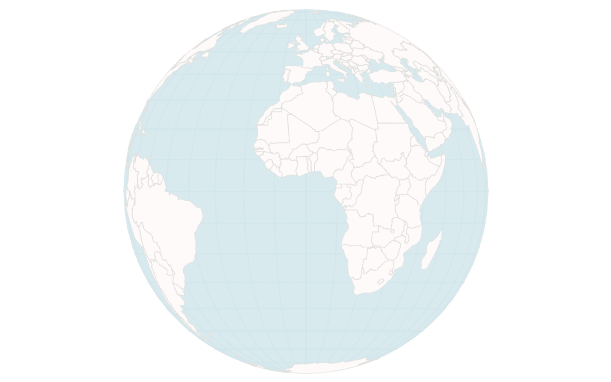

一个静态的 Canvas 地球

在浏览器中查看此步骤的[`larsvers.github.io/learning-d3-mapping-10-1`](https://larsvers.github.io/learning-d3-mapping-10-1)和代码示例[10_01.html](https://github.com/larsvers/Learning-D3.js-4-Mapping/blob/master/Chapter%2010%20-%20Adding%20Interactivity/10_01.html)。

太好了！你学会了绘制 Canvas 地球，这很好，即使有点单维。那么，让我们添加与它的第一次交互，并让用户（以及我们自己）放大和旋转地球。

# 让世界移动

我发现放大和旋转地球投影是一项真正愉快的消遣活动。除了很有趣之外，当处理地球投影时，它也非常有用，因为用户需要能够从不同的角度查看世界。

在本节中，我们将向地球添加第一点 Canvas 交互功能。我们将使用户能够放大和旋转地球。除了设置两个额外的全局变量外，我们将在`ready()`函数中独家进行工作——我们的中心函数，负责准备数据。从现在开始，它还将处理交互性，就在这里：

```js
function ready(world) {
  var countries = topojson.feature(world, 
  world.objects.ne_110m_admin_0_countries);
  requestAnimationFrame(function() {
    renderScene(countries);
  });

  /* Interactivity goes here */
}
```

此外，请注意，我们将`renderScene()`函数包装在`requestAnimationFrame()`函数中，以便浏览器始终决定最佳时间点进行新的渲染。

注意，这里是一个处理 D3 中缩放和平移（不是旋转）的突出和常用方法，使用`context.scale()`和`context.translate()`。然而，为了实现缩放和旋转，我们不会使用这些内置方法，而是会改变投影。我们稍后会回到为什么这样做的原因，因为随着过程的进行，它将变得清晰。

# 设置行为

缩放不过是改变我们的投影比例。旋转不过是改变我们投影的旋转值。当你想让用户控制缩放和旋转时，你需要监听他们的鼠标移动。因此，你需要设置一个缩放监听器来跟踪用户的鼠标滚轮和拖动操作，并将其附加到画布上。我们已经在第五章中实现了缩放和旋转，*点击-点击-爆炸！将交互性应用于您的地图*。在我们的`ready()`函数中，如上所述，我们将使用 D3 的缩放行为来提供我们需要的所有用户交互变化：

```js
var zoom = d3.zoom()
   .scaleExtent([0.5, 4])
   .on("zoom", zoomed);

canvas.call(zoom);

function zoomed() { // our handler code goes here }
```

首先，你使用`d3.zoom()`创建缩放行为，定义介于*0.5*和*4*之间的缩放限制，并通知行为在触发“缩放”事件时立即触发我们的`zoomed()`处理程序。然而，到目前为止，这只是一个粗糙的工具。要了解它做什么，你必须在一个元素上调用它。在你的画布元素上调用它，那么这个元素将成为所有与缩放相关的用户事件的传感器。重要的是，它将监听鼠标滚轮和拖动事件，并在全局的`d3.event`对象中暴露事件信息。它还将存储在它被调用的基本元素中的信息（在我们的情况下，是主画布），但我们将由可以在每个事件中访问的`d3.event`对象所服务。

此外，我们还想在缩放期间设置一些变量来跟踪我们的比例和旋转位置。我们在代码的顶部这样做，使用以下全局变量：

```js
var width = 960,
    height = 600,
    projectionScale = origProjectionScale = height / 2.1,
    translation = [width / 2, height / 2],
    projectionScaleChange,
    prevTransformScale = 1,
    rotation;
```

上述代码中的新变量是`origProjectionScale`、`projectionScaleChange`、`prevTransformScale`和`rotation`。它们的作用将在接下来的段落中变得清晰。

# 处理缩放和旋转

我们设置了缩放行为，这意味着我们的画布

1.  监听每个鼠标滚轮和拖动

1.  在每个这些事件上触发`zoomed()`处理程序

现在让我们填充我们的处理程序，对地球进行一些操作。

我们想做什么？从鸟瞰的角度来看，对于每次缩放，我们想要为投影建立比例，将其应用于路径，并稍微放大或缩小地球。对于每次拖动，我们想要建立新的旋转值，将其应用于投影和路径，并稍微旋转地球。为了达到这个目的，处理程序应该区分缩放和拖动。缩放应该导致投影比例的变化，而拖动应该导致旋转的变化。对于每个路径，你计算位置变化。一旦完成，你需要重新绘制地球。这是游戏循环的咒语：处理用户输入，清除画布，然后使用更新后的数据重新绘制画布。

让我们从缩放动作开始：

```js
function zoomed() {
  var event = d3.event.sourceEvent.type;     

  if (event === 'wheel') {
    var transformScale = d3.event.transform.k;
    projectionScaleChange = (transformScale – prevTransformScale) *
    origProjectionScale;
    projectionScale = projectionScale + projectionScaleChange;
    projection.scale(projectionScale);
    prevTransformScale = transformScale;
  } else if (event === 'mousemove'){
    // Here goes the rotation logic as this will be triggered upon dragging
  }

  requestAnimationFrame(function() {
    renderScene(countries);
  });
}
```

首先，我们需要区分缩放和拖动事件。D3 通过`d3.event`对象持有`sourceEvent`属性来指定用户触发的事件`type`，使我们很容易做到这一点。如果是`wheel`事件，我们改变比例；如果是`mousemove`事件，我们改变旋转。很简单。

改变比例看起来很复杂，但实际上相当简单。在我们深入代码之前，让我们做一个重要的区分。投影有一个比例，用户缩放时的变换也有一个比例。然而，它们是不同的。投影比例在不同投影之间是不同的。我们的`d3.geoOrthographic()`投影的初始比例大约是*286*（我们将其设置为*height / 2.1 = 286*）。我们的变换的初始比例是*1*。这是默认值。

因此，您可以通过`d3.transform.k`检索当前的`transformScale`。您记录下这个比例与之前变换比例的变化，这可能对于放大是负数，对于缩小是正数。然而，由于您的投影比例是一个相当大的数字（例如，初始为*286*）并且变换比例的变化每次缩放都会很小（对于正常的鼠标滚轮转动，变化可能大约是*0.005*），您可能希望将这个数字放大以在投影中获得明显的变化。因此，您需要将它乘以一个较大的数字。您可以选择任何您喜欢的较大数字，但选择我们称为`origProjectionScale`的初始投影比例可以使您将这个计算转移到任何其他投影上，并且应该工作得很好。然后，您只需通过这个`projectionScaleChange`更改当前的`projectionScale`。

其余的都是简单的。只需使用`projection.scale(projectionScale)`将其应用于地球的投影，将之前的变换比例设置为更新的变换比例，并重新渲染地球。注意，您不需要更新路径生成器，因为每次调用它时，它都会使用调用时的投影，我们已经相应地更改了它。

这是最困难的部分。旋转甚至更简单。您只需要跟踪用户鼠标移动的变化并将其应用到 D3 的`projection.rotate()`参数上。让我们在`zoomed()`处理器的顶部跟踪鼠标坐标的变化：

```js
function zoomed(
  var dx = d3.event.sourceEvent.movementX;
  var dy = d3.event.sourceEvent.movementY;

  // all the rest
```

注意，Safari 或 Internet Explorer 中不可用两个`MouseEvent`属性`.movementX`和`.movementY`。您可以在代码示例[10_02.html](https://github.com/larsvers/Learning-D3.js-4-Mapping/blob/master/Chapter%2010%20-%20Adding%20Interactivity/10_02.html#L237)中看到一个跨浏览器的实现，该示例在[`github.com/larsvers/Learning-D3.js-4-Mapping`](https://github.com/larsvers/Learning-D3.js-4-Mapping)计算这两个值。

旋转逻辑将在用户拖动或触发`mousemove`事件时触发，这进入我们条件语句的`else if`部分：

```js
if (event === ‘wheel’) {
  // here goes the zoom logic described previously 
} else if (event === ‘mousemove’) {
 var r = projection.rotate();
 rotation = [r[0] + dx * 0.4, r[1] - dy * 0.5, r[2]];
 projection.rotate(rotation);
} else { 
  console.warn('unknown mouse event in zoomed()'); // alerting issues
}
```

在前面的代码中，我们首先从投影变量`r`中检索当前的旋转值。然后，通过鼠标坐标的 x 变化改变`r[0]`，即偏航值（负责围绕其法线或垂直轴旋转世界），通过鼠标坐标的 y 变化进一步改变`r[1]`，即翻滚值（围绕横向轴旋转世界，从左到右水平移动）。我们保留第三个俯仰值不变，并且是的，最佳方式是将这些值通过`dx * 0.4`和`dy * 0.5`分别限制在一个合理的旋转速度。请注意，这是旋转地球的直接但天真方法。在我们的情况下，这完全足够。如果你想应用极致的精度，可以使用**向量拖动**（查看[`tiny.cc/versor`](http://tiny.cc/versor)）。关键区别在于，即使地球倒置，向量拖动也能使地球向正确的方向旋转。

旋转就到这里。记住，在这个条件之后，世界会被重新渲染，因为我们这样做是在接下来的 Canvas 游戏循环中：获取用户输入 - 计算新位置 - 重新渲染。

这里尝试静态展示动态缩放和旋转：

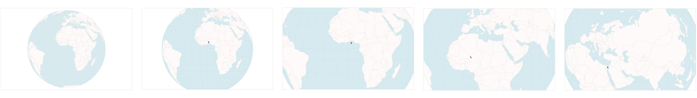

缩放和旋转 Canvas 地球

在浏览器中查看前面截图所示的步骤，网址为[`larsvers.github.io/learning-d3-mapping-10-2`](https://larsvers.github.io/learning-d3-mapping-10-2)，以及其代码示例在[10_02.html](https://github.com/larsvers/Learning-D3.js-4-Mapping/blob/master/Chapter%2010%20-%20Adding%20Interactivity/10_02.html)。

通过投影变化进行缩放的主要好处是它允许旋转（这是一个优点）并保证世界的**语义缩放**而不是**几何缩放**。当你使用`context.scale()`对 Canvas 对象进行缩放时，它会天真地放大 Canvas 上的任何内容。例如，国家边界会随着缩放程度的增加而越来越宽。这就是**几何缩放**。然而，我们希望保持一切恒定，除了个别国家多边形的面积。这被称为**语义缩放**。**投影变化**的另一个好处是，通过鼠标悬停获取 Canvas 对象的坐标更加直接。这是我们下一步要做的。

# 找到鼠标下的 Canvas 对象 - 选择

我们已经完成了缩放和旋转。让我们通过添加另一个关键交互性元素来庆祝：鼠标悬停。实际上，我们不仅仅想要任何鼠标悬停。我们想要鼠标悬停在 Canvas 上绘制的对象上，并从该对象中检索信息。一旦我们有了这些，我们就有很多——我们可以创建工具提示，我们可以突出显示对象，我们可以将视图与显示相同数据点的另一个图表链接，等等。

# 选择，理论

那么，我们是如何做到这一点的？如上所述多次建立，我们不能仅仅向一组像素添加监听器，因为事件是浏览器维护的对象，与 DOM 节点交互。然而，我们的浏览器不知道像素。它没有它想要与之交互的画布像素的表示。那么，怎么办？

答案相对简单：我们自己去构建。不是 DOM，那将是疯狂的行为，而是我们画布绘制的表示，其中目标对象的像素被赋予这个对象的信息。

那么，我们需要构建自己的小视觉对象表示？简而言之，你将构建两个画布。一个**主画布**用于生成我们的视觉（已经完成）和一个**隐藏画布**（就像你看不见它一样），用于生成相同的视觉。关键在于，第二个画布上的所有元素相对于画布原点与第一个画布上的位置相同。在实践中，我们会稍微弯曲这个规则，但，现在，想象一下苏格兰的北端在主画布的像素位置*250, 100*，并且它也在隐藏画布的*250, 100*位置。

主画布和隐藏画布之间只有一个关键区别。隐藏画布上的每个元素都将获得**独特的颜色**。更重要的是，这些颜色值将是查找我们的数据值的索引。在我们的情况下，我们将*rgb(0,0,0)*分配给国家列表中的第一个国家：阿富汗。我们的第二个国家将获得颜色值*rgb(1,0,0)*，以此类推，直到我们的最后一个国家——津巴布韦——将获得颜色值*rgb(176,0,0)*。

为什么？因为，接下来，我们将为主画布附加一个 mousemove 监听器，以获取我们移动鼠标时的鼠标位置流。在每个鼠标位置，我们可以使用画布的自身方法`context.getImageData()`来获取此确切位置的像素颜色。我们只需从我们的 RGB 颜色中提取 R 值，然后查询我们的数据数组以获取所需的对象。

我们的行程清晰，并且，通过三个步骤，相对较短。首先，我们将创建隐藏画布。其次，我们将用每个国家的独特颜色绘制世界。最后，我们将编写 mousemove 处理程序来拾取颜色并获取数据。最后，我们必须决定如何处理我们可以访问的所有数据。

在我们开始之前，让我们确保我们确实为每个国家有一些数据。这是我们的 GeoJSON 国家对象，显示了 177 个国家中的前两个国家的数据内容：

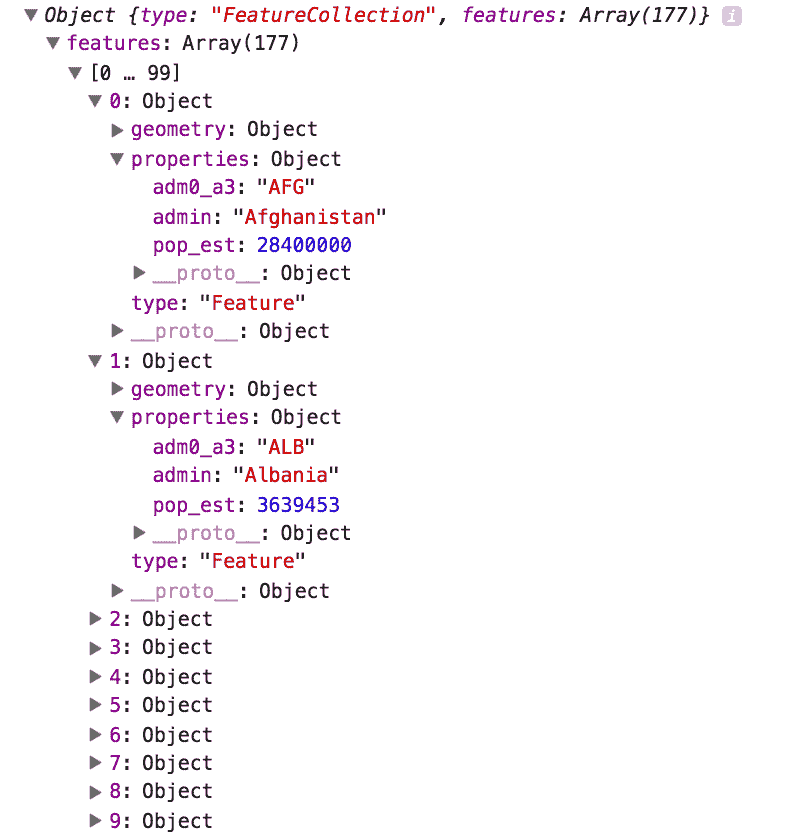

国家数组的属性

我们的 GeoJSON 世界是一个`FeatureCollection`，每个国家有一个特征，按国家名称升序排序。每个特征是一个包含`type`属性、国家多边形的`geometry`和称为`properties`的属性的对象。在这里，我们有三个数据点：国家缩写、国家名称，甚至还有国家人口的估计。现在，让我们通过鼠标悬停来获取这些数据。

# 创建所有隐藏的事物

到现在为止，你已经设置了这么多 Canvas，在最坏的情况下，这段代码只会让你感到无聊：

```js
var hiddenCanvas = d3.select('#canvas-container').append('canvas')
    .attr('id', 'canvas-hidden')
    .attr('width', width)
    .attr('height', height);

var hiddenContext = hiddenCanvas.node().getContext('2d');
```

我们在这里唯一想要确保的是应用与主 Canvas 相同的宽度和高度。

接下来，我们将绘制世界地图。为了做到这一点，我们必须构建一个投影和路径生成器，然后遍历所有国家，将每个国家绘制到 Canvas 上；让我们这样做：

```js
var hiddenProjection = d3.geoEquirectangular()
    .translate([width / 2, height / 2])
    .scale(width / 7);

var hiddenPath = d3.geoPath()
    .projection(hiddenProjection)
    .context(hiddenContext);
```

我们当然需要一个新路径生成器，因为我们需要将现在隐藏的绘图上下文传递给`.context()`方法。然而——等等——我们已经有了一个主 Canvas 的投影。我们不应该也使用它来绘制隐藏 Canvas 吗？特别是，正如我们上面所说的，理想情况下，隐藏 Canvas 上的对象应该与主 Canvas 上的对象在确切的位置上，以便轻松查询隐藏位置？然而，在这里，我们使用了一个**等距**投影，这将以与我们主 Canvas 上的**正射投影**截然不同的方式绘制世界。我们不需要相同的投影来生成相同的地球吗？

答案是否定的，我们不需要相同的投影。当我们的鼠标位于主 Canvas 上的特定位置时，我们只需要找到隐藏 Canvas 上相同的位置。毫无疑问，最简单的方法是使用确切的相同坐标。然而，我们也可以使用主投影的`projection.invert([x,y])`函数来检索该位置的经纬度值。然后我们将使用隐藏投影将地理坐标转换为隐藏 Canvas 上的像素坐标。冗长吗？是的，有一点。然而，对于像缩放和旋转的地球这样的移动对象，这可以让我们避免重新绘制隐藏 Canvas。我们将在第三步构建处理程序时很快看到这一点。

首先，让我们绘制隐藏 Canvas。

# 绘制隐藏 Canvas

在这一步中，只有一个简单的函数可以完成你需要的功能：

```js
function drawHiddenCanvas(world) {
  var countries = world.features;
  countries.forEach(function(el, i) {
    hiddenContext.beginPath();
    hiddenPath(el);
    hiddenContext.fillStyle = 'rgb(' + i + ',0,0)';
    hiddenContext.fill();
  });
}
```

唯一的参数——`world`——是我们的 GeoJSON 要素集合。`countries`提取出包含多边形和我们所追求的额外数据的国家信息数组。我们遍历所有这些信息，使用`hiddenContext`绘制每个国家，并且——最重要的是——我们使用`rgb(<country index>, 0, 0)`模式为每个国家分配了一种颜色。

这里就是它！我们 Canvas 视觉的图状结构，代表我们的数据。

到目前为止，它只是一个函数，所以让我们调用它。我们只需要在有数据可用时调用一次`drawHiddenCanvas()`。因此，我们进入`ready()`函数，并在使用`renderScene()`绘制主 Canvas 之后立即调用它：

```js
  requestAnimationFrame(function() {
    renderScene(countries);
    drawHiddenCanvas(countries);
  });
```

这里就是它们；我们的两个世界：

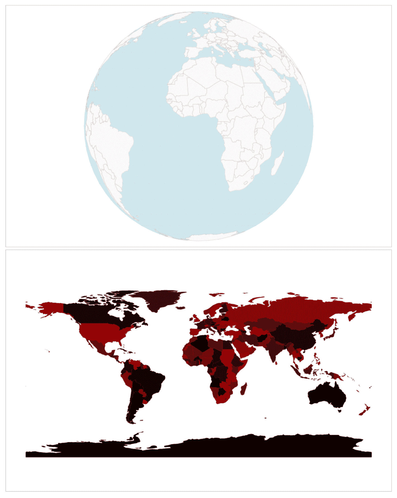

主 Canvas 和隐藏 Canvas

每个国家都有略微不同的颜色，从黑色到红色，或从 *rgb(0,0,0)* = *阿富汗* 到 *rbg(176,0,0) = 津巴布韦*。你可以看到，字母表中排名靠前的国家——南极洲、澳大利亚、巴西或加拿大——比字母表中排名靠后的国家——美国或俄罗斯——要暗得多。注意，为了演示目的，我们将保持隐藏 Canvas 可见，但在生产中，我们只需添加 CSS 规则 `{ display: hidden }` 来隐藏我们的 Canvas。没有人需要知道我们的这个小技巧。

# 选择值

到目前为止，你已经拥有了所有实现悬停的工具。现在，你需要让它发生。为了连接所有这些，你需要执行以下步骤：

1.  监听主 Canvas 上的鼠标移动。

1.  将这些坐标转换到隐藏 Canvas 上的位置。

1.  从那个位置选择颜色。

1.  提取代表数据数组索引的数据的颜色值。

1.  退后一步，想想如何使用它。

监听鼠标移动很简单；你只需要执行以下命令：

```js
canvas.on('mousemove', highlightPicking);
```

完成。在 `highlightPicking()` 中，我们首先将主 Canvas 上的鼠标位置转换为隐藏 Canvas 上的坐标：

```js
function highlightPicking() {
  var pos = d3.mouse(this);
  var longlat = projection.invert(pos);
  var hiddenPos = hiddenProjection(longlat);
```

我们首先获取 *x, y* 鼠标坐标。每当鼠标移动时，这个坐标将会更新。`pos` 变量的一个示例值是 *[488, 85]*，这位于法国的北部。我们使用 D3 的 `projection.invert()`，它是 `projection()` 的逆操作。`projection()` 做什么呢？它接受一个 [经度, 纬度] 值的数组，并返回一对 [x, y] 像素坐标。嗯，`projection.invert()` 做的是相反的操作。它接受一个像素坐标数组，并返回相应的经纬度数组。在我们的例子中，这将是一个 [2.44, 48.81] 的数组。经度稍微偏向 *0* 的右边，即格林尼治，所以，这似乎是正确的。注意，这个投影是我们主要的 Canvas 投影。接下来，我们使用我们的 `hiddenProjection()` 函数将 `longlat` 值重新投影到这个位置的像素坐标。在我们的例子中，`hiddenPos` 被分配了像素坐标 [485.83, 183.17]。这就是法国北部的同一位置在隐藏的 Canvas 上！这正是我们想要的。

为了演示这一点，请看以下截图：

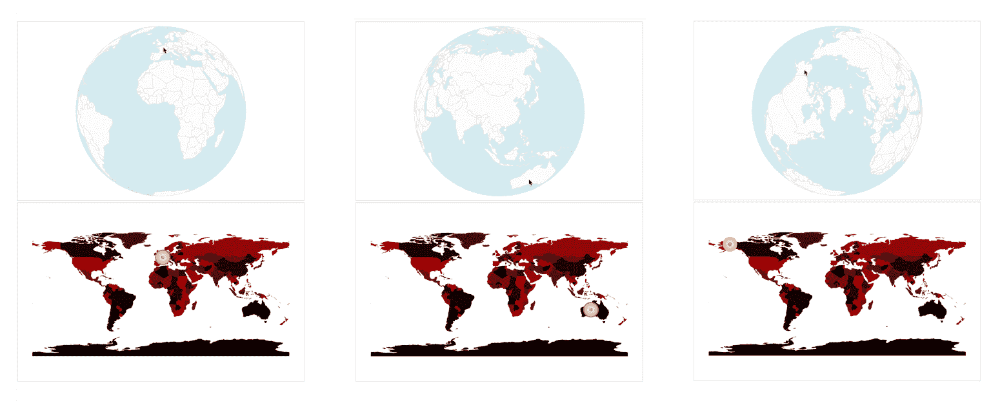

将主 Canvas 鼠标坐标转换为隐藏 Canvas 坐标

我们在主 Canvas 上表示的鼠标位置 `pos` 被转换成表示为 `hiddenPos` 变量的下方的橙色圆圈。

现在，我们终于可以挑选那个颜色了：

```js
var pickedColor = hiddenContext.getImageData(hiddenPos[0], hiddenPos[1], 1, 1).data;
```

这返回了一个名为 `Uint8ClampedArray` 的特殊数组，这个名字听起来很复杂，它代表了在精确像素处的 R、G、B 和 alpha 值（特别地，这些值也范围从 *0* 到 *255*）。在我们的例子中，例如，对于法国（前一个截图中最左侧的选择），颜色是 `52`：

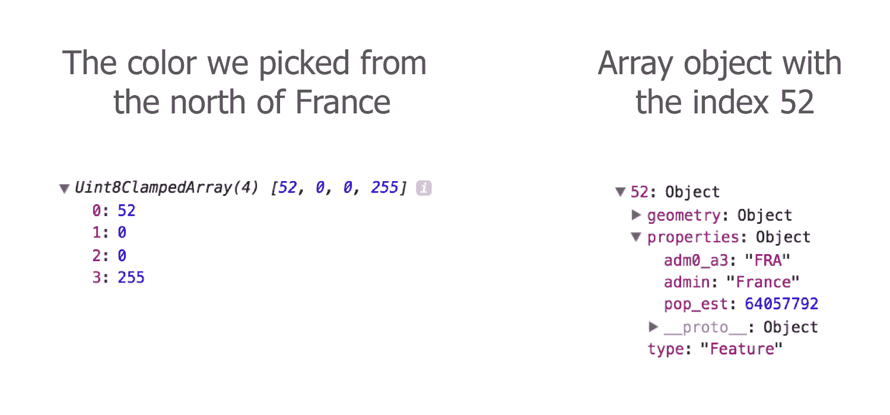

选择的颜色数组

通过与我们的`countries`数组进行交叉检查，我们可以确认索引为`52`的数组元素是**法国**。

然而，在我们能够确信鼠标悬停在某个国家之前，我们将设置两个安全检查。首先，你需要检查用户的鼠标是否在地球上，而不是在太空中某个地方：

```js
var inGlobe =
    Math.abs(pos[0] - projection(projection.invert(pos))[0]) < 0.5 &&
    Math.abs(pos[1] - projection(projection.invert(pos))[1]) < 0.5;
```

在一个理想的世界里，为了我们的目的，`projection.invert(pos)`上面在移动到地球之外时会返回`undefined`或类似值；然而，它仍然返回实际的像素坐标，这并不是我们想要的。问题是`projection.invert()`不是**双射**的，这意味着它可以实际上为不同的像素位置输入返回相同的*[经度, 纬度]*坐标。这在我们移动鼠标超出地球边界时尤其如此。为了减轻这个问题，我们在这里进行所谓的**正向投影**。这仅仅意味着我们投影投影的反向。我们接收像素坐标，将它们转换为*[经度, 纬度]*值，并将它们重新投影回像素坐标。如果我们的鼠标在地球内，这将返回我们的确切鼠标位置（实际上我们在这里给了它+/- 0.5 像素的容差）。如果鼠标在地球外，正向投影将偏离鼠标的像素位置。

我们进行的第二次检查是确保鼠标位于一个国家而不是国家边界上：

```js
selected = inGlobe && pickedColor[3] === 255 ? pickedColor[0] : false;
```

让我们逐一来看。`selected`将保存索引。然而，你只有在用户的鼠标在地球内(`inGlobe` === `true`)时才会得到索引。这是我们的第一个检查。其次，我们特殊`pickedColor`数组的第四个元素必须正好是*255*。否则，`selected`将为`false`。这个第二个检查是为了超越**抗锯齿**效果。

我们为什么需要这样做呢？浏览器中像素的问题在于它们比我们聪明。边缘的线条被羽化，以允许从线条到背景的平滑过渡印象：

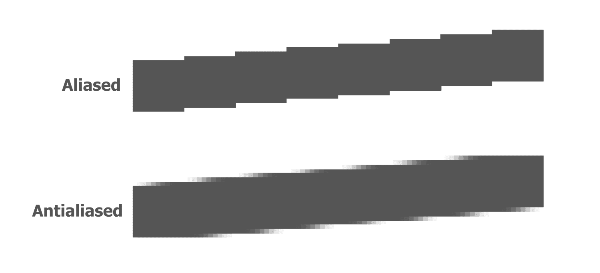

在抗锯齿线之上的别名线

在这些羽化边缘选择值不会返回完全不透明的颜色，而是不同程度的透明值。这些值具有低于 255 的 alpha 通道，因此检查我们的 alpha 是否为 255 可以让我们只从别名区域中选择。

太棒了！我们已经为自己构建了一个第二个 Canvas，它充当了我们主要数据上对象的记忆。接下来，我们将使用它。Canvas 改变任何元素和对象的方式是将信息传递给我们的应用程序的重绘部分，以便在那里相应地使用它。

# 存储更多数据和使用查找数组

我们很幸运，因为我们可视化的世界只有 176 个国家。这样，我们只需要跟踪 176 个索引。然而，你经常处理更多的数据对象，所以 256（就像 0-255）会很快用完。幸运的是，我们不仅有 R、G 和 B 值及其独特的组合，这使我们达到了 *256*256*256 = 16,777,216* 个可能的索引可以存储。这将带你走得很远。

查看教程[`tiny.cc/d3-canvas`](http://tiny.cc/d3-canvas)以获取更多详情。

# 鼠标悬停时突出显示国家

每当选择一个国家时，我们只需将选定的变量传递给我们的 `drawScene()` 函数，该函数在每个鼠标悬停时绘制世界：

```js
  // ...
  selected = inGlobe && pickedColor[3] === 255 ? pickedColor[0] : false;

  requestAnimationFrame(function() {
    renderScene(countries, selected);
  });

} // highlightPicking()
```

在我们的高亮处理程序结束时，我们不仅将 `countries` 传递给我们的渲染函数，我们还沿着路发送了我们新创建的 `selected`。`renderScene()` 函数只是将其传递给 `drawScene()`，该函数将世界绘制到 `buffer` Canvas 上。记住，`renderScene()` 只是调用 `drawScene()`，然后清除主 Canvas，并将 `buffer` 图像复制到主 Canvas 上。

在 `drawCanvas()` 中，我们将添加一个单独的块：

```js
function drawScene(countries, countryIndex) {
  // Clear …
  // Sphere fill …
  // Grid …
  // Country fill …
  // Country stroke - each country ….

  // Country stroke - hovered country
  if (countryIndex >= 0) {
    bufferContext.beginPath();
    bufferContext.setLineDash([4,2]);
    bufferPath(countries.features[countryIndex]);
    bufferContext.lineWidth = 1;
    bufferContext.strokeStyle = '#777';
    bufferContext.stroke();
    bufferContext.setLineDash([]);
  }
}
```

我们将通过 `countryIndex` 参数接收 `selected` 索引，并检查它是否大于或等于 *0*（记住，那将是 *阿富汗*）。如果是这样，我们将在国家周围绘制一条虚线。我们如何知道是哪个国家？我们通过 `countries.features[countryIndex]` 访问正确的国家，并相应地绘制它。这让人感到困惑：

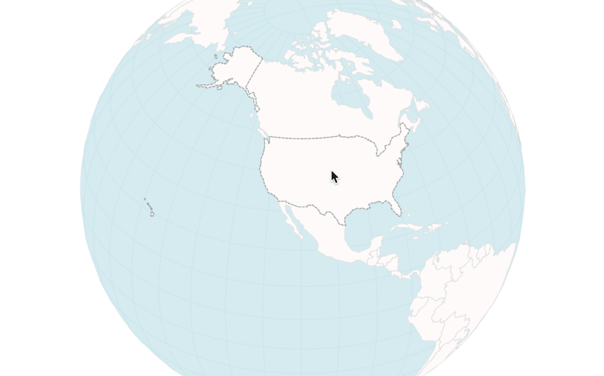

美国周围的一条虚线，仅仅因为我们选对了颜色

在浏览器中查看此步骤[`larsvers.github.io/learning-d3-mapping-10-3`](https://larsvers.github.io/learning-d3-mapping-10-3)和代码示例[10_03.html](https://github.com/larsvers/Learning-D3.js-4-Mapping/blob/master/Chapter%2010%20-%20Adding%20Interactivity/10_03.html)。

# 按国家可视化数据和添加工具提示

你学会了如何构建一个数据驱动的和给予的视觉表示。你也用它来突出显示鼠标悬停时的国家。然而，你还没有真正挖掘出这个交互选项的丰富性。让我们现在就做这件事。你可以做很多事情，但我认为工具提示是一个合理的起点。

在我们开始构建工具提示之前，让我们给地球添加一些更有趣的数据。到目前为止，我们有 **国家名称**、**国家名称缩写**和**人口估计**。这已经是有东西可以工作了。然而，让我们给自己一个任务，向我们的地球添加一个额外的数据源，适当地可视化它，并为用户探索添加合理的交互。

作为一个小提醒，这就是你将要构建的内容：

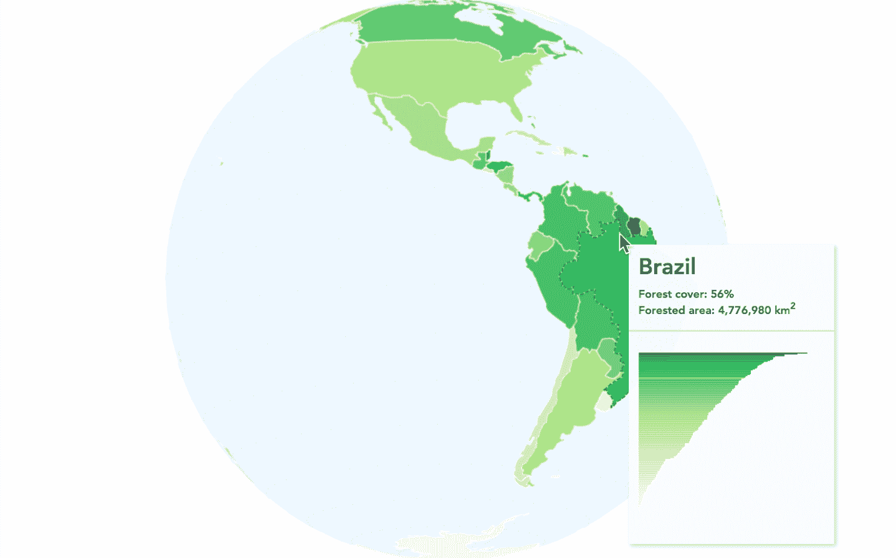

我们的最终 Canvas 冒险

在[`larsvers.github.io/learning-d3-mapping-10-4`](https://larsvers.github.io/learning-d3-mapping-10-4)查看最终应用程序，并在[10_04.html](https://github.com/larsvers/Learning-D3.js-4-Mapping/blob/master/Chapter%2010%20-%20Adding%20Interactivity/10_04.html)查看代码示例。

前面的截图显示了按国家森林覆盖率的地球可视化。数据来自所有智慧之源，维基百科。建议将其可视化为一个等值线图。虽然近年来等值线图可能被过度使用，但它们无疑是一个展示地理区域百分比比较的好选择。

数据来自[`en.wikipedia.org/wiki/List_of_countries_by_forest_area`](https://en.wikipedia.org/wiki/List_of_countries_by_forest_area)。北塞浦路斯、索马里兰和海地的数据已估算。

这些步骤相对简单。首先，我们将森林数据添加到我们的 GeoJSON 世界对象中。我们将迅速继续根据新数据为各国着色，并最终添加带有 HTML 和 SVG 的提示信息。

# 向我们的旧地球添加新数据

在复制粘贴或从维基百科抓取数据后，您应该将森林文件保存为您选择的数据格式。我们将其保存为 CSV，因为我们现在有多个数据源需要加载以创建一个视觉图表，我们将使用`d3.queue()`等待两个文件加载完毕后再调用`ready()`：

```js
d3.queue()
  .defer(d3.json, 'data/world-110.json')
  .defer(d3.csv, 'data/forests.csv')
  .await(ready);
```

然后，根据需要调整`ready()`函数的参数并开始：

```js
function ready(error, world, forests) {
  if (error) throw error;
```

保持国家数据准备状态不变（即我们将世界国家的数组推入一个名为`countries`的变量中）并继续将森林数据包含到世界中。我们想要的是这个：

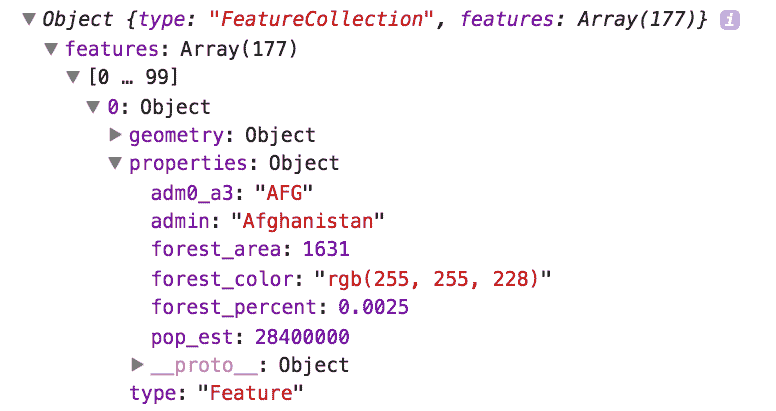

我们努力追求的更新后的数据对象

我们需要用于着色和提示的属性是国家名称（`admin`）、`forest_percent`和`forest_area`。注意，我们这里也有`forest_color`。这是该国家的等值线颜色。在绘图之前将数据准备好通常是有益的。在重绘期间进行大量计算可能会降低性能并重新渲染。

森林 CSV 国家的名称已更改为与 GeoJSON 中国家的确切命名相匹配。这样，您可以使用这些名称将两个数据集连接起来。为了快速连接数据，我们将使用**二分查找**。二分查找利用我们`countries`数组的排序特性快速找到匹配的国家。简而言之，它会查看我们想要找到的国家名称，而不是在 GeoJSON 中遍历所有国家，而是将`countries`数组分成两半，并检查搜索项是否在上半部分或下半部分。它会重复这样做，直到找到该术语。这比**线性搜索**（遍历所有数据）快得多；在我们的案例中，大约快 10 倍。

你可以使用 D3 中的`d3.bisect()`实现二分搜索，这正是我们将要使用的。我们通过一个我们称之为`insertForestDataBinary()`的函数添加数据。我们将在`ready()`函数中将此函数调用和函数添加到数据准备流程中：

```js
function insertForestDataBinary() {
  var bisectName = d3.bisector(function(d) { return d.properties.admin;
  }).right;
  for (var i = 0; i < forests.length; i++) {
    var indexBisect = bisectName(countries.features, forests[i].country);
    var indexMatch = indexBisect - 1;
    countries.features[indexMatch].properties.forest_area = +forests[i].area;
    countries.features[indexMatch].properties.forest_percent = 
    +forests[i].percent;
    countries.features[indexMatch].properties.forest_color =
    colorScale(+forests[i].percent);
  }
 }
```

首先，你创建一个*bisector*函数，这样 D3 就知道我们想要找到哪个变量的名称（`d.properties.admin`，国家名称）。然后，你遍历所有森林对象。每个森林对象包含`country`（我们要匹配的名称）、`forest_percent`和`forest_area`属性。二分搜索将搜索数组，并在匹配的`countries`对象之后返回索引（或到`.right`，如我们上面指定的）。一旦你有了这个，你就可以在索引位置之前添加新的属性。

对于最后一个属性，`forest_color`，你需要在更高作用域的某个地方创建一个`colorScale`：

```js
var colorScale = d3.scaleSequential(d3.interpolateYlGn).domain([0,1]);
```

# 为地球着色

注意，你在绘制地球之前已经实现了所有这些更改。这很好，因为你现在可以简单地使用新的颜色方案绘制它。唯一的变化是在我们的`drawScene()`函数中，在循环中相应地填充`countries`：

```js
function drawScene(countries, countryIndex) {
  // Clear the rect, draw the sphere and the graticule
  // Country fill - individual

  countries.features.forEach(function(el) {
    bufferContext.beginPath();
    bufferPath(el);
    bufferContext.fillStyle = el.properties.forest_color;
    bufferContext.fill();
  });

  // Draw the country stroke…
}
```

此外，请注意，我们对球体填充和网格线颜色做了一些调整，以更好地与我们的黄色-绿色国家颜色尺度相匹配：

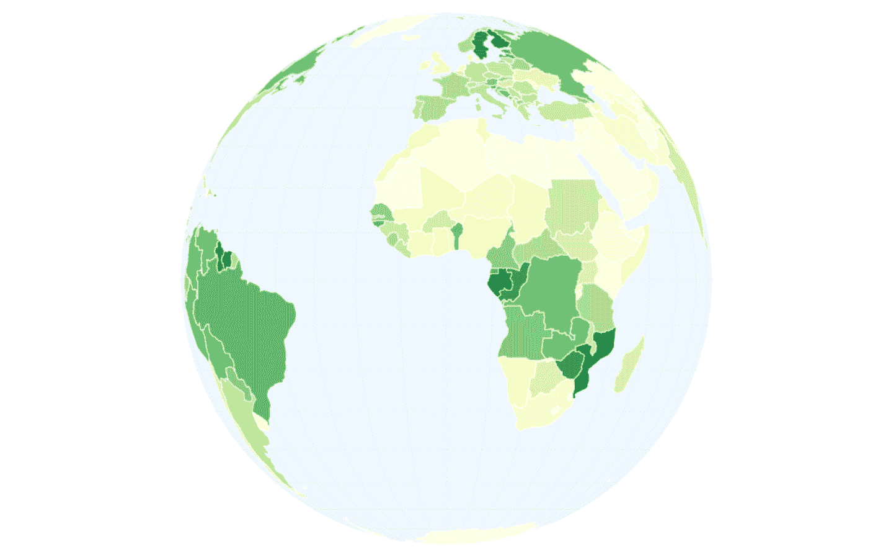

一个表示每个国家森林覆盖率比率的等值线地球视觉

# 添加工具提示

你的地球通过森林覆盖率着色。黄色国家覆盖率低；深绿色覆盖率较高。这已经是一个很好的线索，说明了每个国家森林的比例。然而，用户可能还想知道森林覆盖的确切程度，以及这与其他国家相比如何。你手中拥有所有数据，所以让我们不要吝啬，添加以下工具提示：

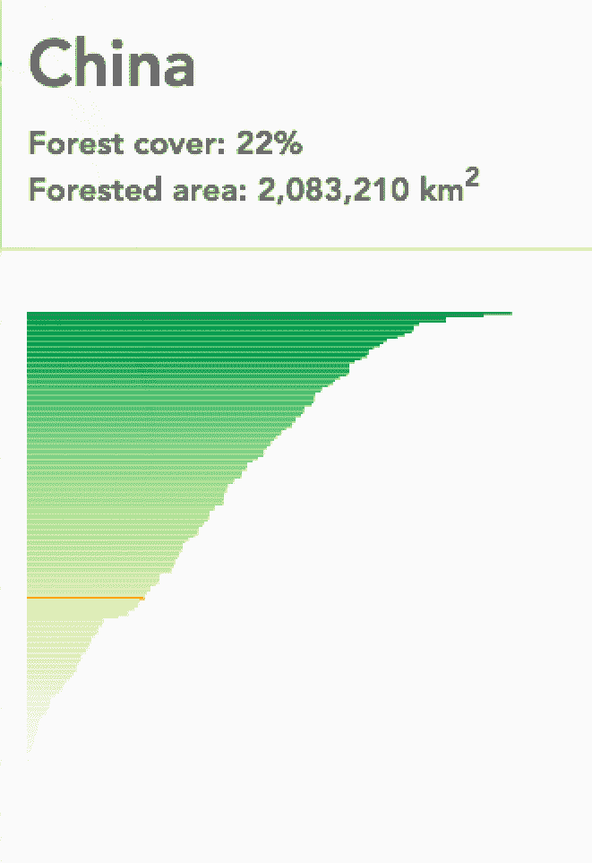

我们的工具提示

工具提示中的视觉显示了一个所有国家的排序条形图、森林覆盖率百分比，以及一个表示悬停国家在整体分布中位置的红色指示器。

# HTML

这很简单，如下所示：

```js
<div id="tooltip">
  <div id="tip-header">
    <h1></h1>
    <div></div>
  </div>
  <div id="tip-body">
    <svg id="tip-visual"></svg>
  </div>
</div>
```

一个工具提示包装器`div`，一个带有`h1`标题的国家头部，以及一个`div`来存放信息。以下是一个包含用于存放条形图的 SVG 元素的正文。注意，我们在画布上添加了 HTML 和 SVG 元素，这当然没问题。我们甚至可以在画布元素上绘制 SVG 元素，反之亦然。

# 构建工具提示的静态部分

接下来，我们将构建工具提示。更准确地说，我们将构建工具提示的*静态*部分，即条形图。我们将添加在悬停国家时立即出现的可变部分，如标题信息和红色指示器。首先，我们将数据扭曲成正确的形状，然后构建一个简单的条形图：

```js
function buildTooltip(data) {
  var forestsByPercent = data
    .slice()
    .sort(function(a, b) {
      return d3.descending(+a.percent, +b.percent);
    })
    .map(function(el) {
      return {
        country: el.country,
        percent: +el.percent,
        color: colorScale(+el.percent)
      };
    });

  var countryList = forestsByPercent.map(function(el) {
    return el.country;
  });  
```

我们传递给这个函数的数据是——正如你所猜到的——我们的林业增强国家的 GeoJSON。`forestsByPercent`只是一个包含我们需要的用于条形图数据的对象的排序数组。`countryList`只是一个（也排序的）`countries`数组，我们将将其用作我们的序数刻度的扩展。以下就是生成的条形图：

```js
    var tipWidth = 200,
        tipHeight = 200;

    var xScale = d3.scaleLinear()
        .domain([0, 1])
        .range([0, tipWidth]);

    var yScale = d3.scaleBand()
        .domain(countryList)
        .rangeRound([0, tipHeight]);

    svg = d3.select('svg#tip-visual')
        .attr('width', tipWidth)
        .attr('height', tipHeight);

    svg.selectAll('.bar')
        .data(forestsByPercent)
      .enter().append('rect')
        .attr('class', 'bar')
        .attr('id', function(d) { return stripString(d.country); })
        .attr('x', xScale(0))
        .attr('y', function(d) { return yScale(d.country); })
        .attr('width', function(d) { return xScale(d.percent); })
        .attr('height', yScale.bandwidth())
        .attr('fill', function(d) { return d.color; });

  } // buildTooltip()
```

这很简单。顺便说一下，我们在`ready()`函数中构建了我们所有的交互式工具提示函数。这样，我们可以访问我们需要的所有数据，并且将它们很好地隔离在任何外部 JavaScript 作用域之外。在现实生活中，可能值得考虑将交互性外包给其自己的模块，以保持关注点的分离。

我们在定义了一个可以从其他两个工具提示函数`tooltipShow()`和`tooltipHide()`中访问的`svg`变量后，在`ready()`函数中调用这个`buildTooltip()`函数，这两个函数我们将在后面构建。

```js
var svg;
buildTooltip(forests);
```

# 显示和隐藏工具提示

我们需要一个小的逻辑块来告诉我们的应用程序何时显示工具提示，何时隐藏工具提示。使用 SVG，这个逻辑通常很简单，因为我们可以利用 mouseover 和 mouseout。使用 Canvas，我们实际上只有整个 Canvas 上的 mousemove。因此，我们构建了自己的 mouseover 和 mouseout 逻辑。我们从名为`highlightPicking()`的 mousemove 处理程序开始：

```js
function highlightPicking() {

  // Here, you find the country index and store it in pickedColor
  // and you check if the user’s mouse is in the globe or not with inGlobe

  selected = inGlobe && pickedColor[3] === 255 ? pickedColor[0] : false;
  requestAnimationFrame(function() {
    renderScene(countries, selected);
  });

  var country = countries.features[selected];
  if (selected !== false) showTooltip(pos, country); // build tooltip
  if (selected === false) hideTooltip(); // remove tooltip
}
```

你可以将鼠标悬停的国家的数据存储在`country.`中。如果`selected`包含一个数字（一个国家索引），我们将触发名为`showTooltip()`的创意函数，并传递主画布的鼠标位置和国家。如果`selected`返回`false`，则鼠标没有悬停在某个国家上，我们将触发同样具有创意的函数`hideTooltip()`。

在`showTooltip()`中，你需要弄清楚何时构建一个新的工具提示，何时只是移动现有的工具提示。当鼠标从一个国家移动到另一个国家时，你想要构建一个新的工具提示。当鼠标在特定国家的边界内时，你只想将工具提示随鼠标移动。

我们将通过一个像**队列**一样工作的数组来实现这一点。你可以想象一个堆栈垂直站立，只能将新数据添加到顶部或从顶部移除数据。相比之下，你可以想象一个像冰淇淋店前排队一样水平的队列。人们从队列的后面到达，从队列的前面离开。

我们的队列将只有两个人长。实际上，它不会是两个人长，而是两个国家长。每次我们移动鼠标，队列都会将我们所在的国家的名字添加到队列的一侧（实际上是在前面），立即将另一侧（在后面）的国家推出。当我们从美国的一个地方移动到另一个地方时，它会说`[“United States of America”, “United States of America”]`。一旦我们的鼠标轻松地移动到墨西哥，它就会在队列的前面添加`“Mexico”`，将之前`0`索引的`“United States of America”`推到索引位置`1`，并在那里切断数组。现在，我们有一个包含`[“Mexico”, “United States of America”]`的数组。

现在检查我们是否更改了国家变得简单，只需比较队列中的两个值。如果它们相同，我们只需移动鼠标；如果不同，我们为墨西哥创建一个新的工具提示。

这就是为什么在应用程序交互频繁时，SVG 或 HTML 通常比 Canvas 更受欢迎的典型例子。尽管如此，这并不太糟糕，对吧？让我们来实现它。首先，你需要定义你的空队列：

```js
var countryQueue = [undefined, undefined];
```

然后，你需要编写`showTooltip()`函数，它接受鼠标位置和元素，即鼠标所在的那个国家：

```js
function showTooltip(mouse, element) {
  var countryProps = element.properties;
  countryQueue.unshift(countryProps.admin);
  countryQueue.pop();
```

你将国家的数据保存在`countryProps`中，使用 JavaScript 的`.unshift()`方法将国家的名字添加到队列的前面，然后使用`pop()`方法从队列中移除最后一个值。

然后，我们将确定是否有国家变更：

```js
  if (countryQueue[0] !== countryQueue[1]) {
    var headHtml =
      'Forest cover: ' + formatPer(countryProps.forest_percent) + '' +
      '<br>Forested area: ' + formatNum(countryProps.forest_area) + '
       km<sup>2</sup>';

    d3.select('#tip-header h1').html(countryProps.admin);
    d3.select('#tip-header div').html(headHtml);

    svg.selectAll('.bar').attr('fill', function(d) { return d.color; });
    d3.select('#' + stripString(countryProps.admin)).attr('fill', 'orange');

    d3.select('#tooltip')
      .style('left', (mouse[0] + 20) + 'px')
      .style('top', (mouse[1] + 20) + 'px')
      .transition().duration(100)
      .style('opacity', 0.98);
```

如果有，你将工具提示的标题填充上特定国家的信息。在为这个特定国家的条形图着色红色之前，你也会根据适当的颜色为所有条形图着色。其余的只是随着鼠标移动移动提示，并提高其透明度以使其可见。

```js
If the queue values are the same, you just move the tip:
  } else {
    d3.select('#tooltip')
      .style('left', (mouse[0] + 20) + 'px')
      .style('top', (mouse[1] + 20) + 'px');
  }
}
```

记住，`showTooltip()`每次鼠标悬停在某个国家上时都会显示，并且我们的`selected`变量会填充一个国家索引。如果`selected`为假，我们知道我们不在国家上，这意味着我们想要移除我们的工具提示。我们用`hideTooltip()`来做这件事：

```js
function hideTooltip() {
  countryQueue.unshift(undefined);
  countryQueue.pop();
  d3.select('#tooltip')
    .transition().duration(100)
    .style('opacity', 0);
}
```

我们决定，如果我们不在一个国家上，就适当地将`undefined`分配给队列，所以我们将其`unshift()`到队列的前面，并`pop()`掉数组的最后一个值，以确保我们总是可以比较下一移动的成对数据。最后，我们将透明度过渡回零，它又消失了。就是这样！全部完成。

# 摘要

你已经正式看到并使用了 Canvas。你享受了它的辉煌时刻，掌握了它的怪癖。你从一个皇家蓝色的矩形开始，现在已经成功地构建了一个整个世界，你可以旋转它，按需调整大小，并检索特定国家的信息。在这个过程中，你也看到了 Canvas 与 SVG 相比的工作方式。你了解了在接近机器图形处理部分编码时的好处和问题。

当然，这些章节的目的是扩展你的技术技能集。然而，除此之外，它还提出了如何接近 Canvas 的替代概念——过程式风格、游戏循环常规以及 Canvas 与 D3 交互的方式——这些内容拓宽了作为开发者的视野，并允许从不同的角度来解决问题。
