# 第十二章：使用 GitHub Pages 发布您的可视化

在完成创建您的可视化的艰苦工作后，您应该向世界展示它，而互联网似乎是展示它的完美场所。

在本章中，您将学习如何在线发布您的可视化。有几种方法可以实现，从使用您的机器作为服务器执行简单的命令行单行命令，到需要您自己构建和部署服务器的完整托管服务。我们将重点介绍一种简单、快速且方便的方法——**GitHub Pages**。以下是我们将涵盖的内容：

+   理解 Git、GitHub 和 GitHub Pages

+   创建一个包含您的文件和文件夹的 GitHub 仓库

+   将您的文件上传到 GitHub 并编辑它们以供发布

+   在 GitHub Pages 上发布您的可视化

这些步骤都很简单，无论您是经验丰富的 Git 和 GitHub 用户，还是刚刚开始，都是如此。让我们深入探讨。

# 我们将要发布的内容

首先，您需要一些可以发布的内容。假设在映射了这么多地球事物之后，您正在向太空进发——映射我们的太阳系：

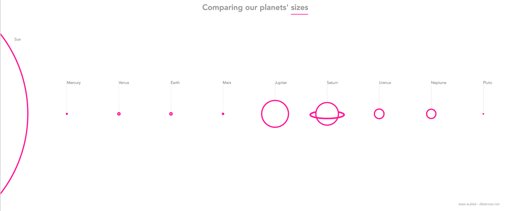

粉红色的行星

这个可视化显示了我们的太阳系中所有的行星，按从左到右的顺序排列，按距离太阳的远近排列，并显示它们相对于彼此的缩放大小。它还显示了太阳（不是一个行星，而是一颗恒星）和冥王星（官方上，是一颗矮行星）。

因此，在这个阶段，您在 HTML 文件或一组拼接到 HTML 或 JavaScript 文件中的文件中有一个可视化；这就是您所需要的。由于 GitHub Pages 使过程变得如此简单，您的发布作品只需几步即可完成。

欢迎查看我们将设置的 GitHub 账户，包括代码在 [`github.com/GoodToBeHere/pink-planets`](https://github.com/GoodToBeHere/pink-planets) 以及发布的视觉作品在 [`goodtobehere.github.io/pink-planets/`](https://goodtobehere.github.io/pink-planets/) 或 [planetsin.pink/](http://planetsin.pink/)。

# 理解您可以发布的内容类型

在我们深入之前，让我们简要地考虑一下 GitHub Pages 可以托管的内容类型。简而言之，GitHub Pages 将允许您托管任何 **静态网页** 或具有 **动态客户端脚本** 的网页。如果您想托管具有动态服务器端脚本的项目，您可能需要选择不同的设置，例如 **Heroku**。

简而言之，静态或平面网页由一组文件组成——或者至少是一个为每个用户提供相同内容的单个 HTML 文件。如果您想更改内容，您需要更改源代码。

动态网页由一组等待外部请求或输入的文件组成，然后即时构建、更改并服务内容。它们可能为不同的用户显示不同的内容，或者在不同时间或操作系统上显示。

动态网页有两种类型：

+   使用 **客户端脚本** 的网页通常使用 JavaScript 及其衍生品将用户输入转换为更改后的 DOM 结构。它是 *客户端* 执行的，这意味着它完全在浏览器的范围内发生。

+   使用 **服务器端脚本** 的网页需要将输入参数传递到应用程序的服务器。PHP、Python、Node.js 或类似的服务器端语言以特定情况的方式组装页面内容，通常是从数据库中检索信息。

简而言之，如果您的项目不依赖于服务器端脚本，您可以在 GitHub Pages 上托管它。只要用户输入在客户端范围内发生，您就可以促进用户输入。您可以在 GitHub 页面上加入和更新所有来自存储为平文件的数据，这可以是 `.csv` 或其他分隔数据文件，但您不能连接到，例如，一个关系型 SQL 数据库（它依赖于结构化的相互关系）。当然，您可以在客户端计算和重新计算数据。

为了选择合适的托管技术来发布您的可视化，了解这一限制非常重要。然而，野外许多 D3 项目可以作为静态网页或具有专用客户端脚本的动态网页托管。

# 在 GitHub 上托管您的代码

在本节中，我们将为您设置视觉内容的发布。我们将解释一些关键术语，这将有助于理解 GitHub 及其目的；我们创建账户，上传我们的内容，并为其发布做准备。这将是对 GitHub 的温和介绍。如果您已经有了账户并且了解仓库、提交、拉取、推送、合并和分支，请自由跳转到 *在 GitHub Pages 上发布您的项目* 部分。

# 理解一些关键术语和概念

让我们先看看一些术语。如果您是经验丰富的 Git 或 GitHub 用户，请自由跳过这个介绍。

这是对 Git 和 GitHub 的非常高级的介绍，绝对不是完整的。如果您想了解更多关于 Git 的信息，我建议阅读优秀的文档 [`git-scm.com/`](https://git-scm.com/)。如果您想了解更多关于 GitHub 的信息，[`guides.github.com/activities/hello-world/`](https://guides.github.com/activities/hello-world/) 是一个很好的起点。

Git 是一个 **分布式版本控制系统**。让我们来分解一下。文件的 **版本控制**（通常是一个文本文件，如 `.html` 或 `.js` 文件）仅仅意味着跟踪文件的所有更改。在使用它之前，您需要下载、安装并在您想要跟踪文件的文件夹中初始化它。Git 有三个核心概念，可以让您的编码生活变得更轻松。

# 跟踪您文件的历次更改

一旦在一个文件夹中初始化，Git 允许你在更改文件后将其保存或**提交**到该文件夹。如果没有 Git，你可能不得不降低到显式复制你正在工作的文件，并滥用其名称来表示版本，例如 `myFile-v01.html` 和 `myFile-v02.html`。相反，Git 会为每个提交分配一个提交 ID。回顾所有提交很容易；只需打开或检出你想要看到的版本即可。通常，你不仅仅控制单个文件，而是控制位于不同项目文件夹中的多个文件。所有你想要进行版本控制的键文件的主文件夹，你在其中初始化 Git 的文件夹，被称为 Git **仓库**。

# 在项目上进行协作

与其前辈相比，Git 的一大优势在于它是分布式的。它允许许多人访问同一项目文件，并且每个获得授权的人都能看到每个文件的完整版本历史。它是为了协作而设计的。为了共享仓库，它需要通过某种网络方式可访问，例如，互联网。这就是 GitHub 发挥作用的地方。

假设你以一个明确的目标开始一个项目，即可视化我们的太阳系，你可以自己开始编码。你创建自己的本地仓库，并将你想要在仓库中跟踪的文件添加和提交。几天后，经过多次提交，你意识到这个任务对你一个人来说太大，难以完成。你邀请朋友来帮忙。为了共同工作在代码库上，你将所有文件上传到 GitHub，并通过 Git 将其与本地仓库关联起来。Git 现在知道有一个本地仓库和远程仓库，后者镜像了本地仓库。

一旦你在本地对文件进行了更改并提交了它们，你可以通过**推送**这个文件来覆盖远程 GitHub 仓库中的相同文件。你的朋友可以将你做出的更改拉到他们的本地机器上，看到与你完全相同的文件，包括你刚刚更改的文件以及之前所做的所有更改。

# 在项目分支上工作

你还可以维护你项目的并行**分支**。每个分支都是你项目的副本。

想象一下，您有一个生产版本的项目，它存在于每天被数百万访客访问的网站上。这个生产版本将是您的**主分支**。现在您想要添加一个新功能；例如，一个将行星颜色从粉红色变为紫色的按钮。您不希望在生产版本中开发这个功能。这可能会很危险，因为事情可能会出错，您的数百万访客可能会因为厌恶而离开。所以，您创建了一个项目的副本——一个您可以称之为 *purple* 的分支。现在您可以在本地愉快地开发，提交不同的版本，并做出和修复错误。您可以将您的更改推送到 GitHub，与您的朋友协作，直到它工作，经过测试，让您满意。然后，您将所有更改从 *purple* 分支复制到 *master* 分支，或者用 Git 术语更好地表达：您**合并**了 purple 分支到 master 分支。

正如所说，这只能是对 Git 和 GitHub 的基本功能的快速浏览。当然还有更多，但只要您对这些关键概念和术语感到舒适，您现在就可以自信地为自己和项目在 GitHub 上设置账户。

# 设置 GitHub 账户

由于设置在线账户可能是您在生活中已经做过很多次的事情，我们不会在这方面花费太多时间。下面是步骤：

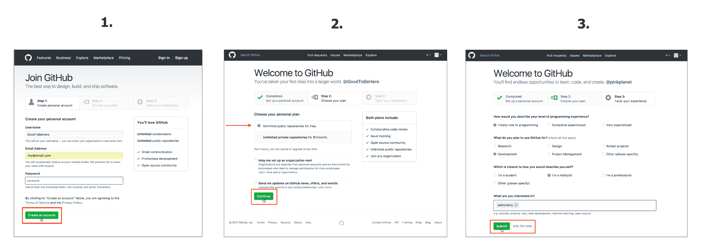

设置 GitHub 账户

前往 [`github.com/`](https://github.com/)，点击 **Sign in**，并按照步骤操作。我们通过选择用户名 `GoodToBeHere` 并输入我们的电子邮件地址和密码来表达我们对 GitHub 的一般积极态度。在第二屏，我们选择免费账户，并在第三屏回答几个可选问题后，完成注册。

# 创建仓库

接下来，我们想要设置一个仓库。请记住，仓库是您项目的根目录，包含所有您的文件和文件夹。在 GitHub 上创建这个仓库有两种方式：

+   您可以将本地仓库推送上去——即您本地机器上的项目文件夹

+   您可以通过 GitHub 在线创建一个新的仓库

在本章中，我们只将探讨第二种方式，并在网上完成所有操作。

如果您持续使用 Git 和 GitHub 进行工作，通过命令行将项目连接到 GitHub 是很有意义的。这只需要对命令行有基本的熟悉度，您可以在[`help.github.com/articles/adding-an-existing-project-to-github-using-the-command-line/`](https://help.github.com/articles/adding-an-existing-project-to-github-using-the-command-line/)了解更多信息。

在设置好账户后，您将被引导到您自己的 GitHub 仪表板，正如您在 URL 中看到的：

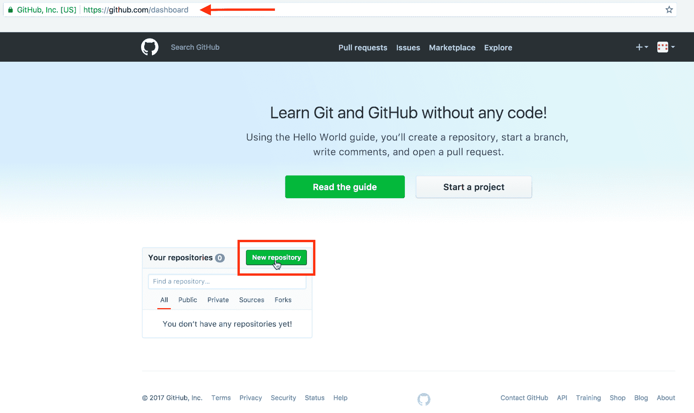

您的 GitHub 仪表板

要创建一个新的仓库，请点击“New repository”。

考虑到下一张截图，我们首先命名我们的仓库。您所有的仓库都将归您所有，因此它们都将以您的用户名开头。每个仓库在您的仓库列表中都需要有一个独特的名称。目前，您非常灵活，因为这是您迄今为止的第一个也是唯一的仓库。我们将适当地将我们的仓库命名为`pink-planets`，避免在名称中使用空格：

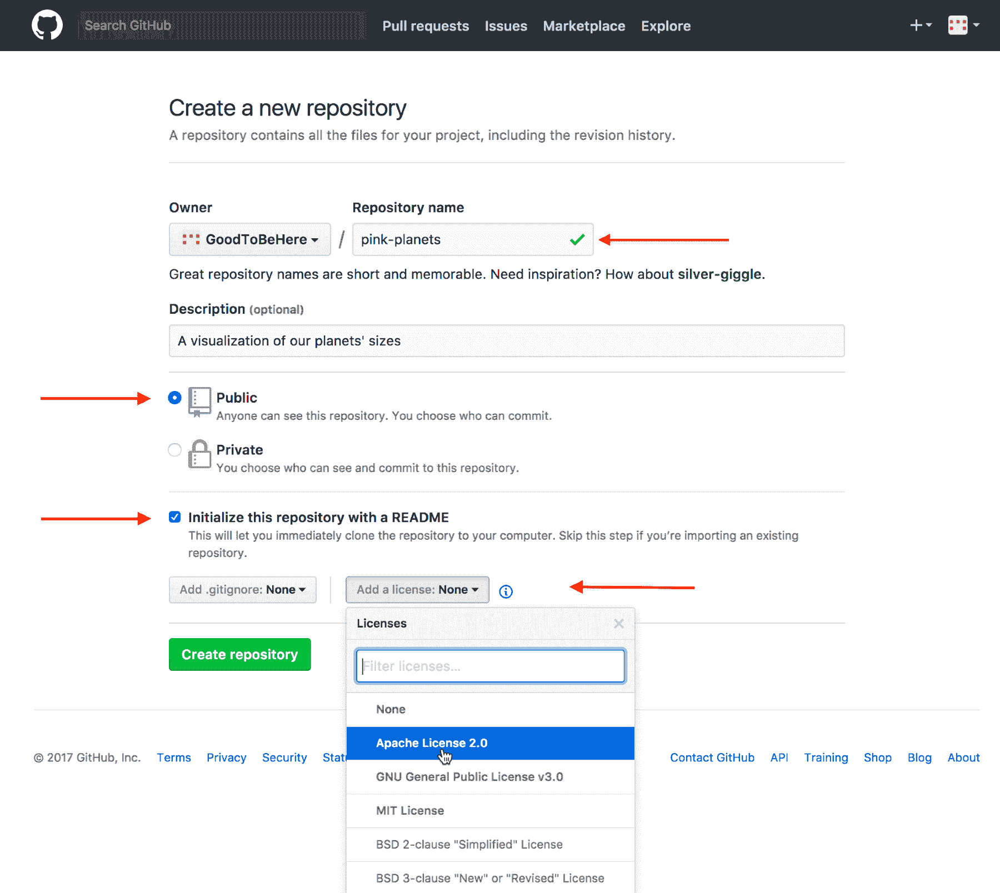

创建仓库

我们所有的仓库都将公开，这意味着每个人都可以看到您的所有代码！如果您希望或需要保持您的代码私密，您可以选择付费的个人计划。

初始化仓库时包含一个`README`文件是一个好习惯，它允许您描述您的项目。不用担心`.gitignore`文件，我们在这里不需要它。最后，我们添加一个许可证，在我们的例子中是一个 Apache License 2.0。您可以选择的许可证有很多，了解这里的选项是个好主意。

最后，我们点击那个大绿色的“创建仓库”按钮，它确实会这样做，并直接带我们到仓库页面：

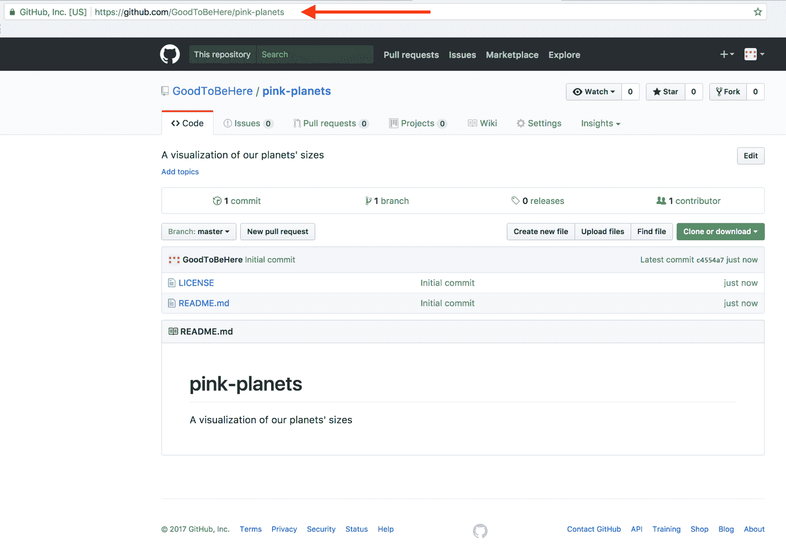

我们仓库的页面

您可以看到您仓库的名称，一个带有多个标签的控制栏，显示当前聚焦的代码标签的内容，以及一个快速描述。接下来，有一个显示一些一般信息的栏，例如已经完成的提交（或文件保存）数量，这个仓库有多少分支（或项目副本），有多少个发布，以及有多少贡献者可以访问这个仓库。

在按钮控制行之后，我们有一个我们仓库中所有文件和文件夹的文件夹视图。目前，只有我们刚刚创建的两个文件：`LICENSE`和`README.md`文件；`.md`代表**markdown**，它允许您使用简单的语法格式化文本文件。您可以在几分钟内了解其精髓，例如在[`guides.github.com/features/mastering-markdown/`](https://guides.github.com/features/mastering-markdown/)。

在底部，您可以看到`README`文件的内容，为访问者或合作者提供了一个关于您的项目快速总结。

它仍然有点单调，所以让我们来修改它，同时学习如何通过 GitHub 编辑文件。

# 在 GitHub 上编辑文件

如果您想编辑一个文件，首先需要点击您仓库中它的链接。接下来，您点击右上角的“编辑此文件”铅笔：

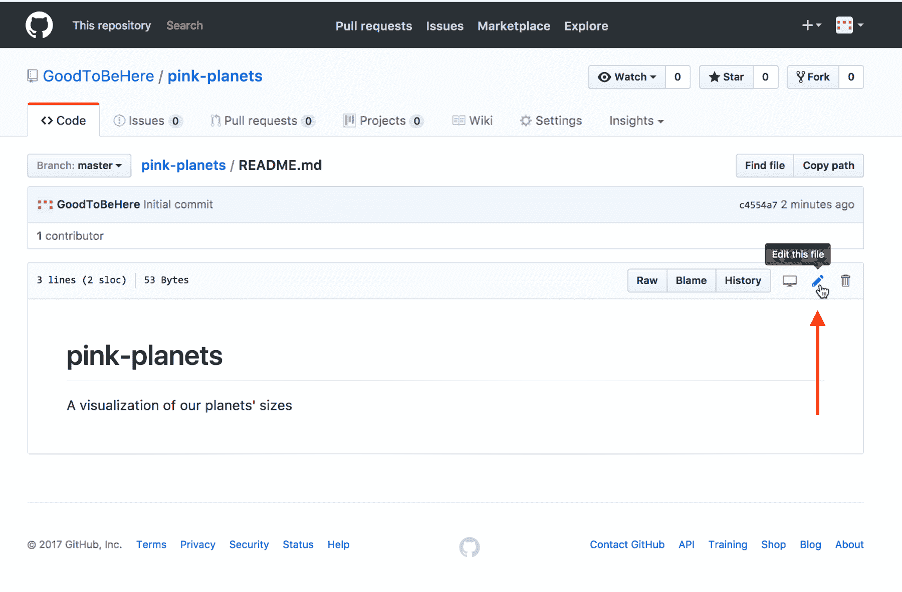

打开文件进行编辑

这将带您进入文件的可编辑视图。在这里，您可以在编辑器窗口上方更改文件的名称（我们保留它，因为我们喜欢`README.md`这个名字），您可以在“编辑文件”视图中更改文件的内容：

修改 README.md 文件

我们在这里只做了一些更改：我们将标题大写，并添加了一些文字来描述项目的内容。我们使用 markdown 语法通过在文本前加 `#` 来标记标题为一级标题。我们还使用 markdown 将 `sun` 以粗体形式打印出来，使用前置和后置的星号。关于 markdown 文件的好之处在于，我们还可以使用正常的 HTML 标签进行样式设置，就像我们在这里对单词 `dwarfed`*—*进行下标处理一样。

在完成我们的编辑后，我们可以从“编辑文件”选项卡切换到“预览更改”选项卡，查看我们做了什么。预览通过着色和删除线清晰地标记我们的更改：

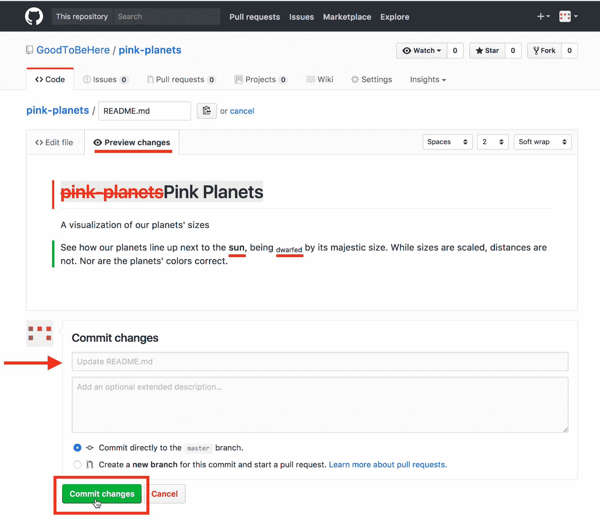

预览我们的更改

我们现在想要保存这些更改，在 Git 的语言中，这意味着**提交**。我们可以通过底部的绿色大按钮来完成这个操作。然而，在我们这样做之前，我们必须添加一个包含一个强制性的简短摘要行和一个可选的扩展描述的提交信息。我们可以在“提交更改”下的文本字段中添加这些内容。将提交摘要行视为电子邮件标题，将扩展描述视为电子邮件正文。

一个好的提交摘要行应该简短（少于 70 个字符），并完成句子“这个提交将…”，简洁地总结更改包含的内容。GitHub 非常友好地为我们提供了根据我们所做的更改预定义的描述。在这种情况下，它为我们提供了更新 README.md 的描述，我们对此非常满意，所以我们将不会更改它。我们将留空可选的扩展描述字段，并点击“提交更改”。

# 将文件上传到仓库

现在让我们上传我们的项目文件和文件夹。回到我们的仓库页面，我们找到上传文件按钮：

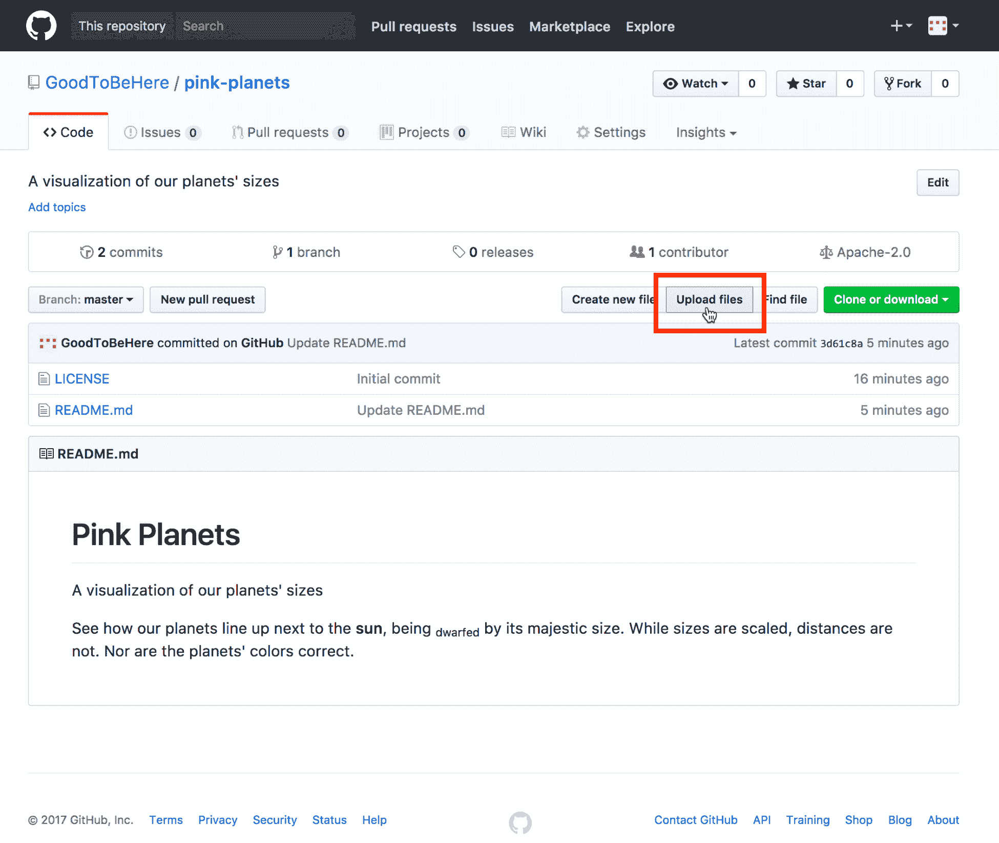

上传文件

我们到达一个上传字段，并将所有项目文件拖动过来，就像这样：

拖动我们的文件进行上传

我们的项目由三个文件夹中的四个文件组成。我们在根目录中有一个 `planets.html` 文件，三个名为 `/css`、`/data` 和 `/js` 的文件夹包含 `planets.css`、`planets.csv` 和 `planets.js` 文件。我们只需从我们的文件夹中抓取它们并将它们拖动过来。

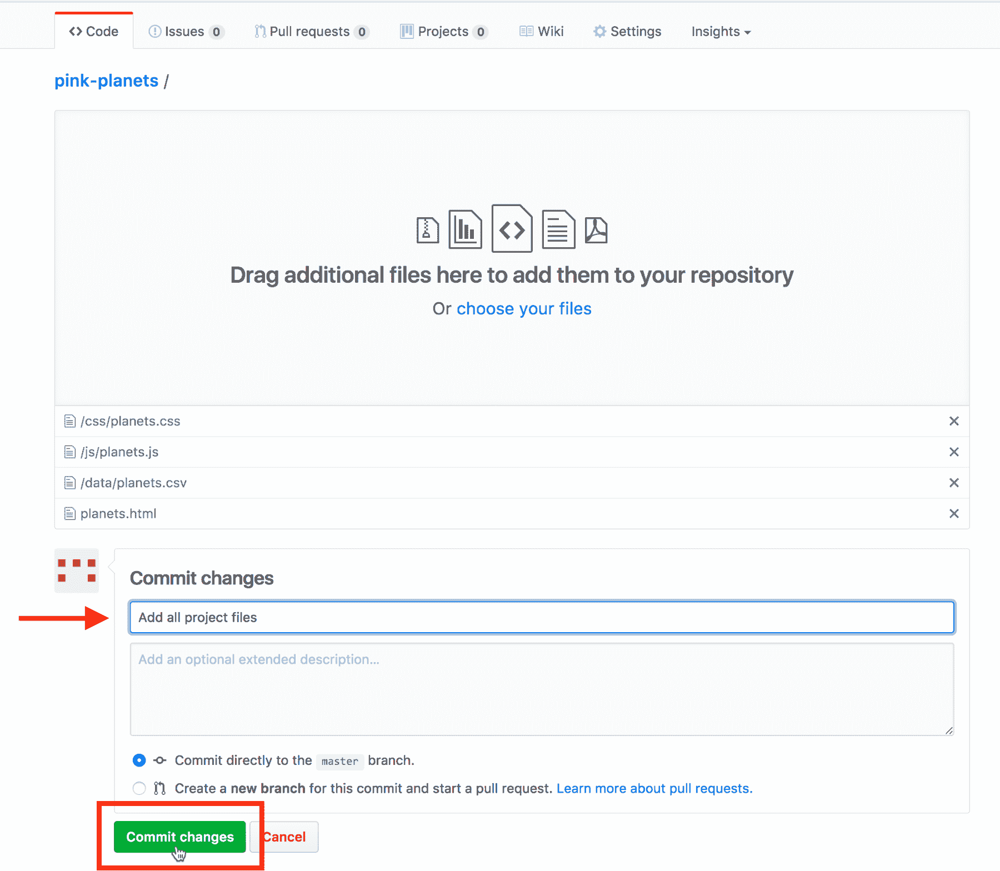

提交我们的项目文件和文件夹

一旦上传，我们需要提交我们的更改。我们添加一个简短的提交信息摘要，并点击“提交更改”。

我们将被重定向到仓库页面，并可以看到我们上传的所有文件：

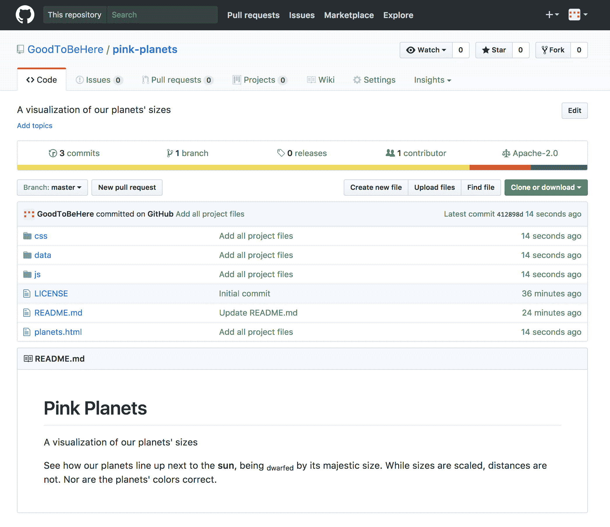

包含所有项目文件的仓库

# 在 GitHub Pages 上发布您的项目

太好了，您已经在 GitHub 上有了您的项目。它不会更复杂。您只需进行两项小准备和一些点击，就可以将您的项目上线！

# 准备文件以发布

在我们点击发布按钮之前，我们需要确保您的文件以正确的方式相互链接，并且您的主 HTML 文件被命名为`index.html`。

# 保持路径绝对

首先，让我们检查所有我们的文件引用。在我们的 HTML 文件中有两个链接，一个指向我们的`.css`文件，另一个指向我们的`.js`文件：

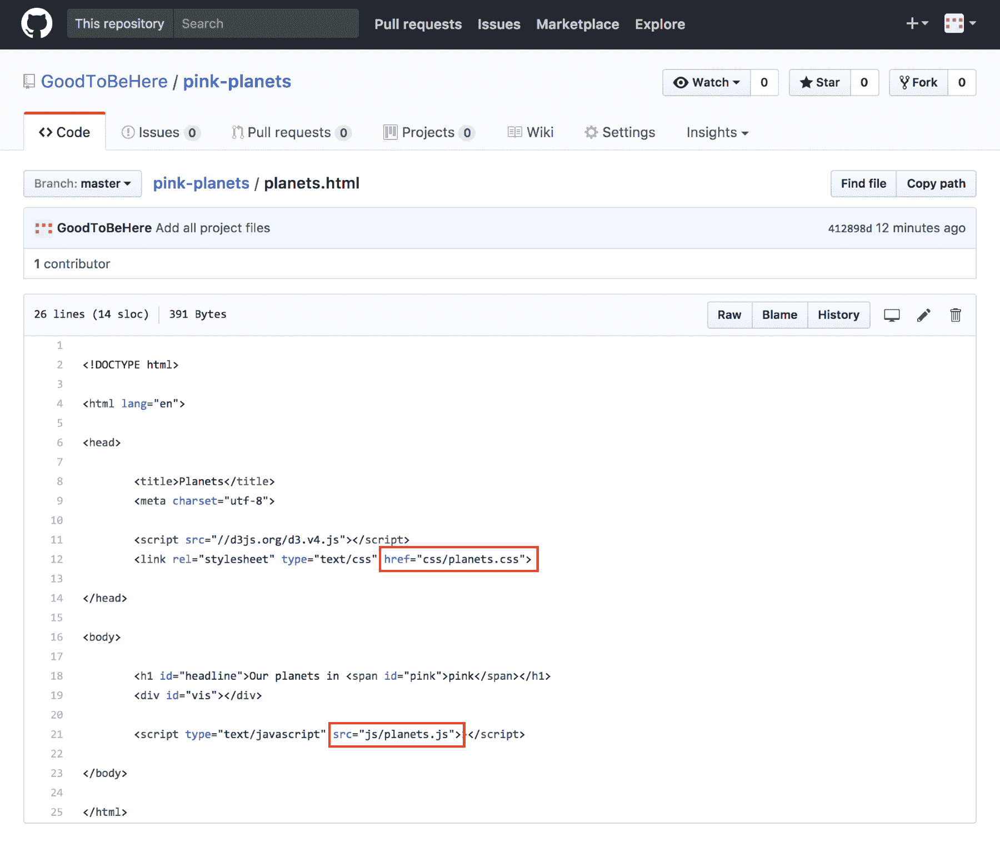

HTML 文件中的正确链接

GitHub 上的所有路径都可以作为指向根目录的绝对路径进行引用。这可以节省您从目录树中的任何文件和任何深度计算相对路径。然而，这也意味着您可能需要将本地目录中的相对路径更改为基于根目录的绝对路径。您的 HTML 文件`planets.html`（我们将在下一步将其更改为`index.html`）位于根目录中。`css`和`js`文件夹也保存在根目录中，因此这两个路径相对于根目录是绝对的，并且在本地和 GitHub 上都将有效。

然而，在我们的项目中，我们还在`js/planets.js`文件中引用了`data/planets.csv`文件。在本地，您可能将其作为相对路径引用，首先使用`../`向上移动一个级别，例如`'../data/planets.csv'`。然而，在 GitHub 上，以下方式将有效：

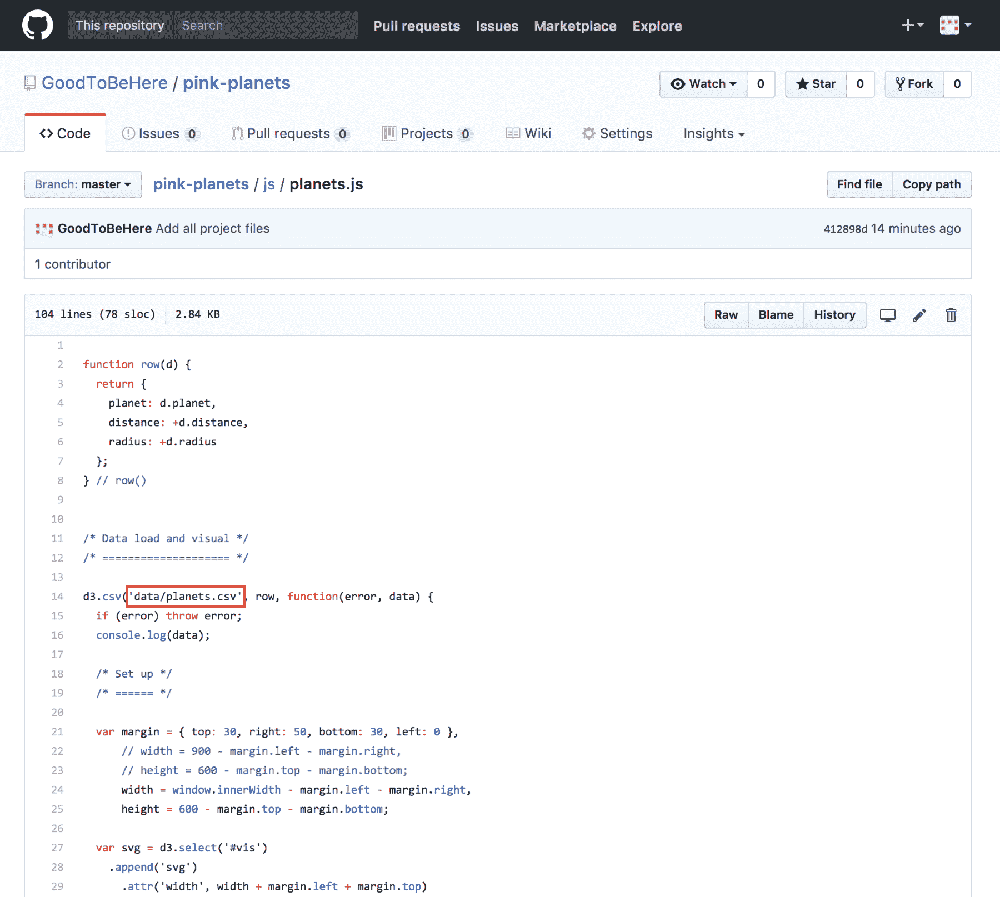

在嵌套文件中使用的绝对路径

简而言之，您始终可以在 GitHub 项目中使用相对于根目录的绝对路径。

# 将主 HTML 文件名更改为 index.html

您的主要 HTML 文件可能已经命名为`index.html`。如果不是，只需转到该文件并将其重命名为`index.html`，如下所示：

确保我们的主 HTML 文件名为**index.html**

做得好，这就是所有需要的准备。现在，让我们发布！

# 发布您的项目

在所有这些艰苦的工作之后，您应该有一个简单的发布过程。嗯，您正好需要五次点击才能在线查看您的项目。这里就是：

1. 从您的仓库主页点击设置选项卡：

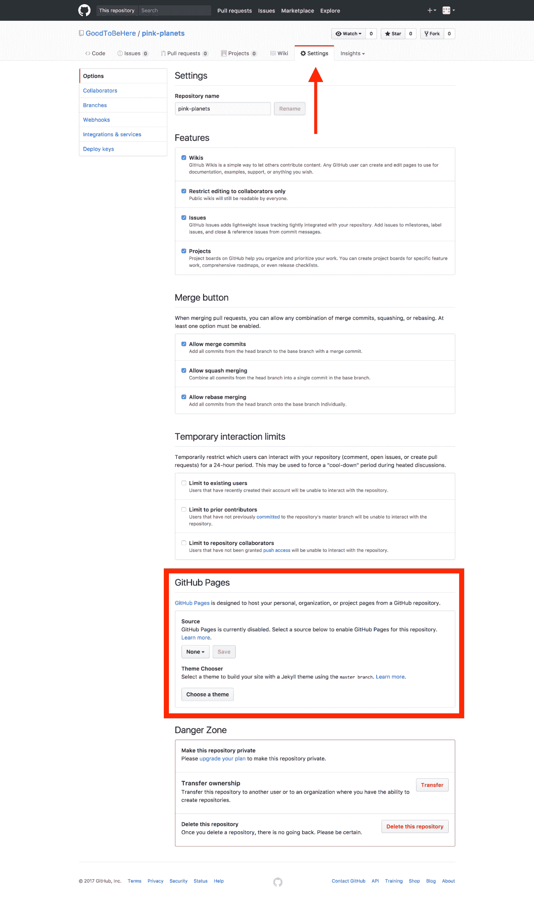

您的仓库设置

2. 导航到 GitHub Pages 区域并展开源字段中的下拉菜单：

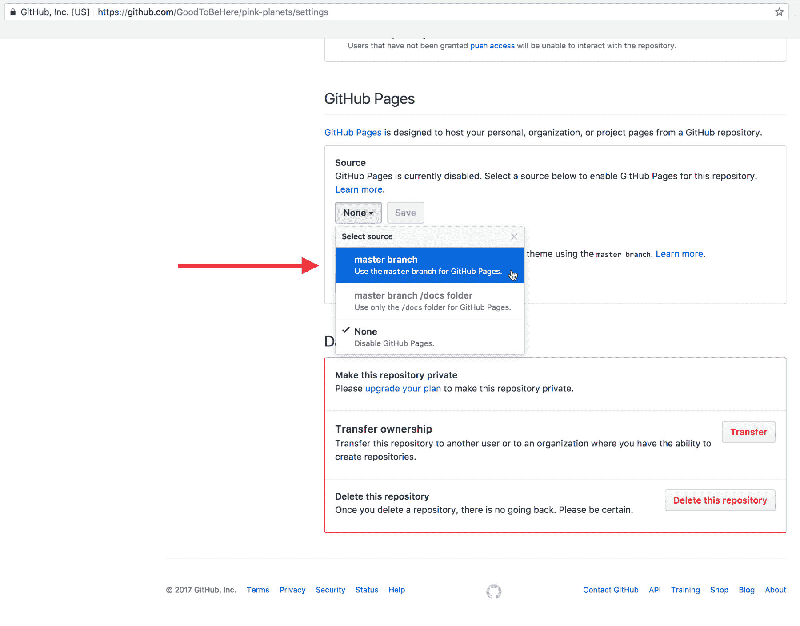

您即将完成

3. 选择从 master 分支发布（我们没有创建其他分支，所以这就是正确的分支）然后点击保存。

接下来，您将看到以下消息，提供您在线项目的链接：

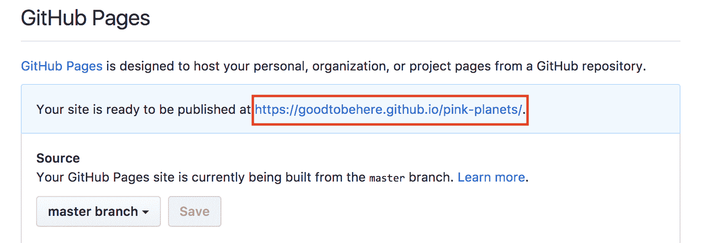

只需再点击一次！

5. 点击它！项目可能需要一段时间才能占据其应有的位置，所以您可能需要等待痛苦的一分钟，但最终，它将被发布：

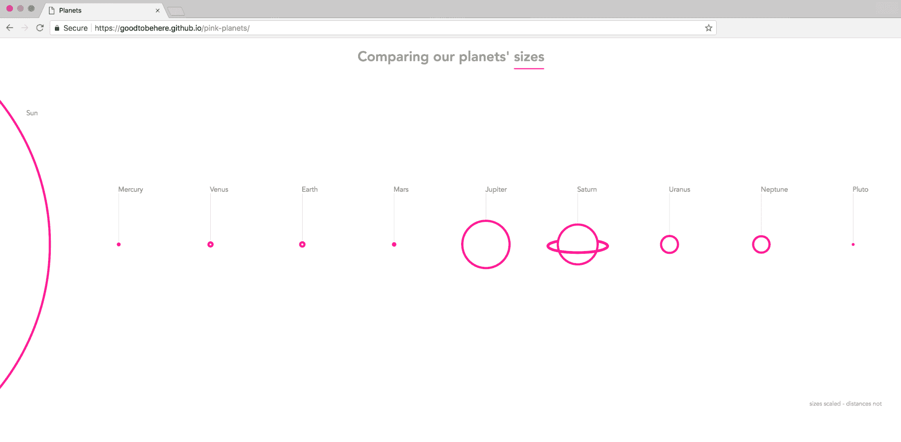

您发布的作品

太棒了！您的作品已发布，其余的就是历史了！恭喜您。

我们的网址是[`goodtobehere.github.io/pink-planets/`](https://goodtobehere.github.io/pink-planets/)，或者更普遍地，`https://<你的用户名>.github.io/<仓库的名称>`。尽管这是一个逻辑结构，但它可能看起来有点笨拙。你可以将其更改为自定义 URL，就像我们在示例中所做的那样：

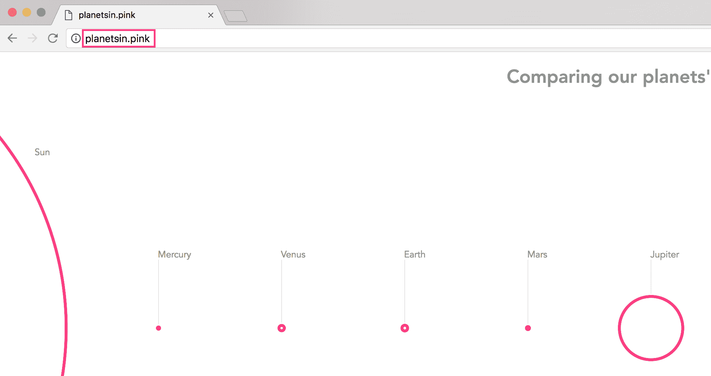

自定义域名

这将要求你使用你通过所选 DNS 提供商安全保护的域名，并在 DNS 提供商的一侧以及在某些情况下在 GitHub 上更改一些设置，但这也是一个你可能想要考虑的简单过程。

关于自定义域的出色指导，请参阅[`help.github.com/articles/using-a-custom-domain-with-github-pages/`](https://help.github.com/articles/using-a-custom-domain-with-github-pages/)。

# 摘要

在本章中，你学习了如何在 GitHub Pages 上发布你的可视化作品，或者实际上任何项目。你了解了你可以在 GitHub Pages 上发布和不能发布的页面类型。在使用它作为代码的家园之前，你瞥见了 Git 的力量和 GitHub 的益处。经过一些微调和准备，你最终将项目在线发布。看待这一成就的一种方式是，你的项目现在与网络上的任何其他页面拥有相同的在线空间，这是可以构建的。
