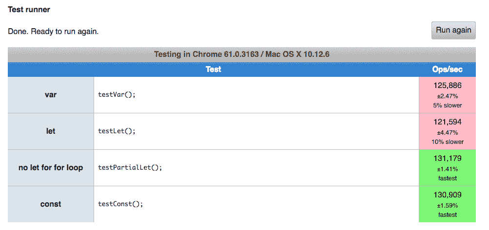

# 第一章：ECMAScript 入门

**ECMAScript 2017**（**ES8**）于 2017 年 6 月底由**技术委员会第 39 号**（**TC39**）发布。它是 ECMA 的一部分，该机构根据 ECMAScript 规范标准化 JavaScript 语言。目前，该标准旨在每年发布一个新的 ES 规范版本。ES6 于 2015 年发布，ES7 于 2016 年发布。ES6 发布时发生了许多变化（箭头函数、类、生成器、模块加载器、异步编程等），随着时间的推移，还有更多有趣的事情发生。

在本章中，我们将从 JavaScript 的基础知识开始，从 ES6 基础知识开始，逐步过渡到 ES8 的内容。此外，我们还将探讨传统 JS 的一些有趣方面，如闭包，以及一些新特性，如箭头函数。

作为一名自学者，我强烈推荐不仅阅读这本书，还尝试将在这里学到的知识应用到一些小而有趣的项目中。这将帮助你轻松地保留大量知识。

在本章中，我们将介绍以下内容：

+   使用`let`关键字创建块作用域变量

+   使用`const`关键字创建常量变量

+   扩展运算符和剩余参数

+   变量提升

+   使用解构赋值从可迭代对象和对象中提取数据

+   箭头函数

+   闭包及其处理方法

+   在 JavaScript 中使用分号

+   比较`let`、`var`和`const`的性能基准

+   创建对象属性的新的语法

# `let`关键字

使用`let`关键字可以声明一个块作用域变量（关于这一点稍后会有更多介绍），并可选择性地将其初始化为某个值。来自不同编程语言背景但新接触 JavaScript 的程序员，常常会编写出容易出错的 JavaScript 程序，认为使用传统`var`关键字创建的 JavaScript 变量是块作用域的。几乎每种流行的编程语言在变量作用域方面都有相同的规则，但 JavaScript 由于缺乏块作用域变量而表现得略有不同。由于 JavaScript 变量不是块作用域的，存在内存泄漏的风险，并且 JavaScript 程序更难以阅读和调试。

# 声明函数作用域变量

使用`var`关键字声明的 JavaScript 变量被称为**函数作用域变量**。函数作用域变量对整个脚本全局可用，即如果在外部函数中声明，则在整个脚本中可用。同样，如果函数作用域变量在函数内部声明，则它们在整个函数中可用，但不在函数外部。让我们看一个例子：

```js
 var a = 12; // accessible everywhere
 function myFunction() {
   console.log(a); // alerts 12
   var b = 13;
   if(true) {
     var c = 14; // this is also accessible throughout the function!
     alert(b); // alerts 13
   }
   alert(c); // alerts 14
 }
 myFunction();
 alert(b); // alerts undefined
```

显然，在函数内部初始化的变量仅限于该函数内部。然而，在块作用域（即不在函数内的花括号`{}`，例如`if`语句）中声明的变量也可以在那些块外部使用。

# 声明块级作用域变量

使用`let`关键字声明的变量被称为**块级作用域变量**。当在函数外部声明时，块级作用域变量的行为与函数级作用域变量相同，即它们是全局可访问的。但是，当块级作用域变量在块内部声明时，它们只在其定义的块内部（以及任何子块）可访问，而块外部则不可访问：

```js
 let a = 12; // accessible everywhere
 function myFunction() {
   console.log(a); // alerts 12
   let b = 13;
   if(true) {
     let c = 14; // this is NOT accessible throughout the function!
     alert(b); // alerts 13
   }
   alert(c); // alerts undefined
 }
 myFunction();
 alert(b); // alerts undefined
```

仔细研究代码。这与前面的示例相同，但是将`var`替换为`let`。观察现在 C 如何提示`undefined`（`let`使其在`if {}`之外不可访问）。

# 重新声明变量

当你使用`var`关键字声明一个变量，而这个变量已经在同一作用域内使用`var`关键字声明过时，那么它会被**覆盖**。考虑以下示例：

```js
var a = 0;
var a = 1;
alert(a); // alerts 1
function myFunction() {
 var b = 2;
 var b = 3;
 alert(b); // alerts 3
}
myFunction();
```

结果正如预期。但是，使用`let`关键字创建的变量并不以相同的方式表现。

当你使用`let`关键字声明一个变量，而这个变量已经在同一作用域内使用`let`关键字声明过时，那么它会抛出一个**SyntaxError 异常**。考虑以下示例：

```js
let a = 0;
let a = 1; // SyntaxError
function myFunction() {
 let b = 2;
 let b = 3; // SyntaxError
 if(true) {
    let c = 4;
    let c = 5; // SyntaxError
 }
}
myFunction();
```

当你使用一个在函数（或内部函数）中已经可访问的名称声明一个变量，或者是一个使用`var`或`let`关键字分别创建的子块时，那么它就是一个不同的变量。这里有一个示例，展示了这种行为：

```js
 var a = 1;
 let b = 2;
 function myFunction() {
   var a = 3; // different variable
   let b = 4; // different variable
   if(true) {
     var a = 5; // overwritten
     let b = 6; // different variable
     console.log(a); // 5
     console.log(b); // 6
 }
     console.log(a); // 5
     console.log(b); // 4
 }
 myFunction();
 console.log(a);
 console.log(b);
```

# 闭包和`let`关键字

恭喜你到达这里！让我们面对现实，JavaScript 有一些奇怪（以及一些不好）的一面。**闭包**是 JavaScript 奇怪的一面之一。让我们看看“闭包”这个术语实际上是什么意思。

当你声明一个局部变量时，该变量有一个受限的作用域，也就是说，它不能在声明它的特定作用域之外使用（这取决于`var`和`let`）。如前所述，局部变量在块（如`let`的情况）或函数作用域（如`var`或`let`的情况）之外是不可用的。

让我们通过以下示例来了解前一段落所阐述的内容：

```js
function() {
  var a = 1;
  console.log(a); // 1
} 
console.log(a); // Error
```

当一个函数完全执行完毕，即返回了它的值，它的局部变量就不再需要，并且从内存中清理掉。然而，闭包是一个**持久的局部变量作用域**。

考虑以下示例：

```js
function counter () {
  var count = 0;
  return function () {
    count += 1;
    return count;
  }
}
```

显然，返回的函数使用了`counter()`函数的局部变量。当你调用`counter()`时会发生什么？

```js
let myCounter = counter(); // returns a function (with count = 1)
myCounter(); // now returns 2
myCounter(); // now returns 3
```

仔细观察，我们并没有反复执行`counter()`。我们将`counter`返回的值存储在`myCounter`变量中，然后不断调用返回的函数。

返回的`myCounter`函数每次被调用时都会增加一。当你调用`myCounter()`时，你正在执行一个包含对变量（`count`）的引用的函数，该变量存在于父函数中，并且在技术上应该在完全执行后销毁。然而，JavaScript 以一种不同的堆保留了返回函数中的使用过的变量。这种属性被称为闭包。

闭包已经存在很长时间了，那么有什么不同？使用`let`关键字。看看这个例子：

```js
for(var i=0;i<5;i++){
  setTimeout(function() {
    console.log(i);
  }, 1000);
}
```

输出将是：

```js
 5 5 5 5 5 
```

为什么呢？因为在`setTimeout`触发之前，循环已经结束，`i`变量已经是`5`了。但这种情况不会发生在`let`上：

```js
for(let i=0;i<5;i++){
  setTimeout(function() {
    console.log(i);
  }, 1000);
}
```

输出：

```js
0 1 2 3 4
```

`let`将变量绑定到块（因此，在这种情况下，是`for`循环）的事实意味着它将变量绑定到每个迭代。所以，当循环结束时，你将拥有五个`setTimeout`函数（`i`分别为`0`、`1`、`2`、`3`、`4`），它们将依次触发。

`let`通过在每次迭代中创建自己的闭包来实现这一点。在`let`中，这发生在幕后，所以你不需要编写这方面的代码。

要在不使用`let`的情况下修复此代码，我们需要创建一个立即执行的函数表达式（**IIFE**），其外观如下：

```js
for(var i=0;i<5;i++){
  (function(arg) {
    setTimeout(function() {
      console.log(arg); 
    }, 1000);
  }(i));
}
```

这就是`let`在幕后所做的大致事情。那么这里发生了什么？

我们创建了一个匿名函数，它在每个循环周期立即执行，并带有与其关联的正确`i`值。现在，这个函数将正确的`i`值作为`arg`传递给函数参数。最后，我们使用`console.log`在两秒后得到正确的输出`0 1 2 3 4`。

所以你可以观察到，一个简单的`let`语句可以在这种情况下大大简化代码。

# `const`关键字

使用`const`关键字，你可以创建一旦初始化后就不能改变其值的变量（因此它们被称为**常量**），即你无法在代码的后续部分用另一个值重新初始化它们。

如果你尝试重新初始化一个`const`变量，将抛出一个只读异常。此外，你不能只声明而不初始化一个`const`变量。它也会抛出异常。

例如，你可能希望当有人试图更改计算器中的特定常数，比如`pi`时，你的 JavaScript 崩溃。下面是如何实现这一点：

```js
const pi = 3.141;
pi = 4; // not possible in this universe, or in other terms, 
        // throws Read-only error
```

# 常量变量的作用域

`const`变量是块级作用域变量，即它们遵循与使用`let`关键字声明的变量相同的范围规则。以下示例演示了常量变量的作用域：

```js
const a = 12; // accessible globally
function myFunction() {
  console.log(a);
  const b = 13; // accessible throughout function
  if(true) {
    const c = 14; // accessible throughout the "if" statement
    console.log(b);
  }
console.log(c);
}
myFunction();
```

上述代码的输出是：

```js
12
13
ReferenceError Exception
```

这里，我们可以看到，常量变量在作用域规则方面与块级作用域变量表现相同。

# 使用常量变量引用对象

当我们将一个对象赋值给变量时，变量持有的是对象的引用，而不是对象本身。因此，当将对象赋值给常量变量时，对象的引用变为对该变量的常量引用，而不是对对象的引用。因此，对象是可变的。

考虑以下示例：

```js
const a = {
  name: "Mehul"
};
console.log(a.name);
a.name = "Mohan";
console.log(a.name);
a = {}; //throws read-only exception

```

上述代码的输出是：

```js
Mehul
Mohan
<Error thrown>
```

在这个例子中，`a` 变量存储的是对象的地址（即引用）。因此，对象的地址是 `a` 变量的值，并且不能被更改。但是对象是可变的。因此，当我们尝试将另一个对象赋值给 `a` 变量时，我们得到了异常，因为我们试图更改 `a` 变量的值。

# 何时使用 var/let/const

`const` 和 `let` 之间的区别在于 `const` 确保不会发生重新绑定。这意味着您不能重新初始化一个 `const` 变量，但 `let` 变量可以被重新初始化（但不能重新声明）。

在特定的作用域内，`const` 变量始终引用同一个对象。因为 `let` 可以在运行时更改其值，所以不能保证 `let` 变量始终引用同一个值。因此，作为一般规则，您可以（不是严格地）遵循以下规则：

+   如果您知道您不会更改值（最大性能提升），请默认使用 `const`。

+   只有当您认为在您的代码中需要/可能发生重新赋值时才使用 `let`（现代语法）

+   避免使用 `var`（`let` 在块作用域中定义时不会创建全局变量；如果您来自 C、C++、Java 或任何类似背景，这会使您更不容易混淆）

# let 与 var 与 const 的性能基准

目前，在我的笔记本电脑上（MacBook Air，Google Chrome 版本 61.0.3163.100（官方构建）（64 位））运行基准测试产生以下结果：



很明显，在 Chrome 上，全局作用域中的 `let` 性能最慢，而块内的 `let` 和 `const` 性能最快。

首先，上述基准测试是通过运行循环 1000 x 30 次来执行的，循环中执行的操作是将一个值追加到数组中。也就是说，数组从 [1] 开始，然后在下一次迭代中变为 [1,2]，然后是 [1,2,3]，依此类推。

这些结果意味着什么？我们可以从这些结果中得出的一个推论是，当在声明中使用 `let` 时，`let` 在 `for` 循环中较慢：`for(let i=0;i<1000;i++)`。

这是因为 `let` 在每次迭代时都会重新声明（将此与您之前阅读的闭包部分联系起来），而 `for(var i=0;i<1000;i++)` 则为整个代码块声明了 `i` 变量。这使得 `let` 在循环定义中使用时稍微慢一些。

然而，当 `let` 不在循环体内部使用而是在循环外部声明时，它的性能相当不错。例如：

```js
let myArr = [];
for(var i = 0;i<1000;i++) {
   myArr.append(i);
}
```

这将为您带来最佳结果。然而，如果您不是进行成百上千次的迭代，这应该不会有什么影响。

# JavaScript 中的不可变性

不可变性，用一行定义，意味着一旦该值被赋值，那么它就永远不能*改变*：

```js
var string1 = "I am an immutable";
var string2 = string1.slice(4, 8);
```

`string1.slice` 不会改变 `string1` 的值。事实上，没有字符串方法会改变它们操作的字符串，它们都返回新的字符串。原因是字符串是不可变的——它们不能改变。

字符串不是 JavaScript 中唯一的不可变实体。数字也是不可变的。

# Object.freeze 与 const 的比较

之前，我们看到即使你在对象前使用 `const`，程序员仍然能够修改其属性。这是因为 `const` 创建了一个不可变的绑定，也就是说，你不能将新值赋给这个绑定。

因此，为了真正使对象成为常量（即，不可修改的属性），我们必须使用一个叫做 `Object.freeze` 的东西。然而，`Object.freeze` 又是一个浅层方法，也就是说，你需要递归地应用于嵌套对象以保护它们。让我们用一个简单的例子来澄清这一点。

考虑这个例子：

```js
var ob1 = {
   prop1 : 1,
    prop2 : {
        prop2_1 : 2 
    }
};
Object.freeze( ob1 );

const ob2 = {
   prop1 : 1,
    prop2 : {
        prop2_1 : 2 
    }
}

ob1.prop1 = 4; // (frozen) ob1.prop1 is not modified 
ob2.prop1 = 4; // (const) ob2.foo gets modified

ob1.prop2.prop2_1 = 4; // (frozen) modified, because ob1.prop2.prop2_1 is nested
ob2.bar.value = 4; // (const) modified 

ob1.prop2 = 4; // (frozen) not modified, bar is a key of obj1
ob2.prop2 = 4; // (const) modified

ob1 = {}; // (frozen) ob1 redeclared (ob1's declaration is not frozen)
ob2 = {}; // (const) ob2 not redeclared (used const)
```

我们冻结了 `ob1`，因此它的所有第一级层次属性都被冻结了（即，不能被修改）。一个冻结的对象在尝试修改时不会抛出错误，而是简单地忽略所做的修改。

然而，当我们深入研究时，你会注意到 `ob1.bar.value` 被修改了，因为它有 2 个层级并且没有被冻结。所以，你需要递归地冻结嵌套对象以使它们*常量*。

最后，如果我们看看最后两行，你会意识到何时使用 `Object.freeze` 和何时使用 `const`。`const` 声明不再声明，而 `ob1` 被重新声明，因为它不是常量（它是 `var`）。`Object.freeze` 不会冻结原始变量绑定，因此不是 `const` 的替代品。同样，`const` 不会冻结属性，也不是 `Object.freeze` 的替代品。

此外，一旦一个对象被冻结，你不能再向它添加属性。然而，你可以向嵌套对象添加属性（如果存在）。

# 默认参数值

在 JavaScript 中，没有定义的方法可以为未传递的函数参数分配默认值。因此，程序员通常会检查具有 `undefined` 值的参数（因为它是不传递参数的默认值）并将默认值分配给它们。以下示例演示了如何做到这一点：

```js
 function myFunction(x, y, z) {
 x = x === undefined ? 1 : x;
 y = y === undefined ? 2 : y;
 z = z === undefined ? 3 : z;
 console.log(x, y, z); //Output "6 7 3"
 }
 myFunction(6, 7);
```

这可以通过为函数参数提供默认值来更容易地完成。以下代码演示了如何做到这一点：

```js
function myFunction(x = 1, y = 2, z = 3) {
 console.log(x, y, z); 
}
myFunction(6,7); // Outputs 6 7 3
```

在前面的代码块中，由于我们在函数调用语句中传递了前两个参数，默认值（即 `x = 1` 和 `y = 2`）将被我们传递的值（即 `x = 6` 和 `y = 7`）覆盖。第三个参数没有传递，因此使用其默认值（即 `z = 3`）。

此外，传递 `undefined` 被认为是缺少一个参数。以下示例演示了这一点：

```js
function myFunction(x = 1, y = 2, z = 3) {
   console.log(x, y, z); // Outputs "1 7 9"
 }
 myFunction(undefined,7,9);
```

这里发生类似的事情。如果你想省略第一个参数，只需在那个位置传递`undefined`即可。

默认值也可以是表达式。以下示例演示了这一点：

```js
 function myFunction(x = 1, y = 2, z = x + y) {
   console.log(x, y, z); // Output "6 7 13"
 }
 myFunction(6,7);
```

这里，我们正在使用默认参数值内部的参数变量！也就是说，无论你传递什么作为前两个参数，如果第三个参数没有传递，它将取前两个参数之和的值。由于我们向第一个和第二个参数传递了`6`和`7`，所以`z`变为*6 + 7 = 13*。

# 扩展运算符

**扩展运算符**由`...`标记表示。扩展运算符将可迭代对象拆分为其单个值。

**可迭代**是一个包含一组值并实现了 ES6 可迭代协议的对象，使我们能够遍历其值。**数组**是内置可迭代对象的一个例子。

扩展运算符可以放置在代码中需要多个函数参数或多个元素（对于数组字面量）的任何地方。

扩展运算符通常用于将可迭代对象的值扩展到函数的参数中。让我们以数组为例，看看如何将其拆分为函数的参数。

要将数组的值作为函数参数提供，你可以使用`Function`的`apply()`方法。此方法对每个函数都可用。以下示例演示了：

```js
function myFunction(a, b) {
  return a + b;
}
var data = [1, 4];
var result = myFunction.apply(null, data);
console.log(result); //Output "5"
```

这里，`apply`方法接受一个数组，提取其值，将它们作为单独的参数传递给函数，然后调用它。

这里有一个使用现代方法（即使用扩展运算符）的示例：

```js
function myFunction(a, b) {
    return a + b; 
}
let data = [1, 4];
let result = myFunction(...data);
console.log(result); //Output "5"
```

在运行时，在 JavaScript 解释器调用`myFunction`函数之前，它将`...data`替换为`1,4`表达式：

```js
let result = myFunction(...data);
```

之前的代码被替换为：

```js
let result = myFunction(1,4);
```

在此之后，函数被调用。

# 扩展运算符的其他用法

扩展运算符不仅限于将可迭代对象扩展到函数参数，它还可以用于代码中需要多个元素（例如，数组字面量）的任何地方。因此，它有很多用途。让我们看看扩展运算符在数组中的其他一些用例。

# 将数组值作为另一个数组的一部分

扩展运算符也可以用来将数组值作为另一个数组的一部分。以下示例代码演示了如何在创建数组的同时将现有数组的值作为另一个数组的一部分：

```js
let array1 = [2,3,4];
let array2 = [1, ...array1, 5, 6, 7];
console.log(array2); //Output "1, 2, 3, 4, 5, 6, 7"
```

考虑以下代码：

```js
 let array2 = [1, ...array1, 5, 6, 7];
```

这段代码等同于：

```js
 let array2 = [1, 2, 3, 4, 5, 6, 7];
```

# 将数组值推送到另一个数组

有时，我们可能需要将现有数组的值推送到另一个现有数组的末尾。

这就是程序员过去通常的做法：

```js
var array1 = [2,3,4];
var array2 = [1];
Array.prototype.push.apply(array2, array1);
console.log(array2); //Output "1, 2, 3, 4"
```

但从 ES6 开始，我们有一个更简洁的方式来完成它，如下所示：

```js
let array1 = [2,3,4];
let array2 = [1];
array2.push(...array1);
console.log(array2); //Output "1, 2, 3, 4"
```

这里，`push`方法接受一系列变量，并将它们添加到调用它的数组的末尾。

看以下行：

```js
array2.push(...array1);
```

这将被替换为以下行：

```js
array2.push(2, 3, 4);
```

# 扩展多个数组

可以在单行表达式中展开多个数组。例如，以下代码：

```js
let array1 = [1];
let array2 = [2];
let array3 = [...array1, ...array2, ...[3, 4]];//multi arrayspread
let array4 = [5];
function myFunction(a, b, c, d, e) {
  return a+b+c+d+e;
}
let result = myFunction(...array3, ...array4); //multi array spread
console.log(result); //Output "15"
```

# 剩余参数

**剩余参数**也用`...`标记表示。带有`...`的函数的最后一个参数被称为剩余参数。剩余参数是一个数组类型，当参数的数量超过命名参数的数量时，它包含函数的其余参数。

剩余参数用于从函数内部捕获一个可变数量的函数参数。

`arguments`对象也可以用来访问所有传递的参数。`arguments`对象不是严格意义上的数组，但它提供了一些类似于数组的接口。

以下示例代码展示了如何使用`arguments`对象来检索额外的参数：

```js
function myFunction(a, b) {
    const args = Array.prototype.slice.call(arguments, myFunction.length);
    console.log(args);
}
myFunction(1, 2, 3, 4, 5); //Output "3, 4, 5"
```

这可以通过使用剩余参数以更简单、更干净的方式完成。以下示例演示了如何使用剩余参数：

```js
function myFunction(a, b, ...args) {
    console.log(args); //Output "3, 4, 5"
}
myFunction(1, 2, 3, 4, 5);
```

`arguments`对象不是一个数组对象。因此，要对`arguments`对象执行数组操作，你需要将其转换为数组。剩余参数易于处理。

这个`...`标记叫什么？

`...`标记被称为扩展操作符或剩余参数，具体取决于其使用方式和位置。

# 提升机制

**提升机制**是 JavaScript 的默认行为：将声明移动到顶部。这意味着以下代码在 JavaScript 中将会工作：

```js
bookName("ES8 Concepts");
function bookName(name) {
   console.log("I'm reading " + name);
}
```

如果你来自 C/C++的背景，一开始这可能会觉得有点奇怪，因为那些语言不允许你在至少声明其原型之前调用函数。但 JavaScript 在幕后会提升函数，也就是说，所有的函数声明都会移动到上下文的顶部。所以，本质上，前面的代码等同于以下代码：

```js
function bookName(name) {
   console.log("I'm reading " + name);
}

bookName("ES8 Concepts");
```

提升机制只移动声明，而不是初始化。因此，尽管前面的代码可以工作，但以下代码将不会工作：

```js
bookName("ES8 Concepts"); // bookName is not a function
var bookName = function(name) {
   console.log("I'm reading " + name);
}
```

这是因为，正如我们之前所说的，只有声明会被提升。因此，浏览器看到的是类似以下的内容：

```js
var bookName; // hoisted above
bookName("ES8 Concepts"); // bookName is not function 
                          // because bookName is undefined
bookName = function(name) { // initalization is not hoisted
   console.log("I'm reading " + name);
}
```

猜猜以下代码的输出：

```js
function foo(a) {
   a();
   function a() {
      console.log("Mehul");
   }
}

foo(); // ??
foo( undefined ); // ??
foo( function(){ console.log("Not Mehul"); } ); // ??
```

准备好揭晓答案了吗？你的可能答案是：

+   ```js
    Mehul
    undefined
    Not Mehul
    ```

+   ```js
    Program throws error
    ```

+   ```js
    Mehul
    Mehul
    Mehul
    ```

输出将会是：

```js
Mehul
Mehul
Mehul
```

为什么？因为这就是浏览器看到这段代码的方式（在应用提升机制之后）：

```js
function foo(a) { 
   // the moment below function is declared, 
   //the argument 'a' passed is overwritten.
   function a() {
      console.log("Mehul");
   }
   a();
}

foo();
foo( undefined );
foo( function(){ console.log("Not Mehul"); } );
```

一旦函数被提升，你传递给该函数的内容就不再重要。它总是会被`foo`函数内部定义的函数覆盖。

因此，输出结果仅仅是`Mehul`这个词重复三次。

# 解构赋值

**解构赋值**是一种表达式，它允许你使用类似于数组或对象构造字面量的语法，将可迭代或对象中的值或属性赋给变量。

解构赋值使得从可迭代或对象中提取数据变得简单，因为它提供了一个更短的语法。解构赋值已经存在于像 Perl 和 Python 这样的编程语言中，并且它们的工作方式是一样的。

有两种解构赋值表达式：**数组**和**对象**。让我们详细看看每一种。

# 数组解构赋值

**数组解构赋值**用于从可迭代对象中提取值并将它们赋给变量。它被称为数组解构赋值，因为表达式类似于数组构造字面量。

程序员过去是这样做的，将数组的值赋给变量：

```js
 var myArray = [1, 2, 3];
 var a = myArray[0];
 var b = myArray[1];
 var c = myArray[2];

```

在这里，我们正在提取数组的值并将它们分别赋值给`a`、`b`、`c`变量。

使用数组解构赋值，我们可以用一行语句完成：

```js
let myArray = [1, 2, 3];
let a, b, c;
[a, b, c] = myArray; //array destructuring assignment syntax

```

如你所见，`[a, b, c]`是一个数组解构表达式。

在数组解构语句的左侧，我们需要放置我们想要将数组值赋给变量的变量，使用与数组字面量类似的语法。在右侧，我们需要放置一个数组（实际上可以是任何可迭代对象），我们想要从中提取值。

以这种方式，前面的示例代码可以变得更短：

```js
let [a, b, c] = [1, 2, 3];

```

在这里，我们在同一语句中创建变量，而不是提供数组变量，我们提供带有构造字面量的数组。

如果变量比数组中的项目少，则只考虑前几个项目。

如果你将非可迭代对象放在数组解构赋值语法的右侧，则会抛出 TypeError 异常。

# 忽略值

我们也可以忽略可迭代对象的一些值。以下示例代码展示了如何做到这一点：

```js
 let [a, , b] = [1, 2, 3]; // notice -->, ,<-- (2 commas)
 console.log(a);
 console.log(b);
```

输出如下：

```js
1 3
```

# 在数组解构赋值中使用剩余操作符

我们可以使用`...`符号来给数组解构表达式的最后一个变量加前缀。在这种情况下，如果其他变量的数量少于可迭代对象的值，该变量总是被转换为一个数组对象，该对象包含可迭代对象的所有剩余值。

考虑这个例子来理解它：

```js
   let [a, ...b] = [1, 2, 3, 4, 5, 6];
   console.log(a);
   console.log(Array.isArray(b));
   console.log(b);

```

输出如下：

```js
 1
   true
   2,3,4,5,6 
```

在前面的示例代码中，你可以看到`b`变量被转换为一个数组，并且它包含了右侧数组中的所有其他值。

这里`...`符号被称为剩余操作符。

我们也可以在使用剩余操作符时忽略值。以下示例演示了这一点：

```js
   let [a, , ,...b] = [1, 2, 3, 4, 5, 6];
   console.log(a);
   console.log(b);

```

输出如下：

```js
1 4,5,6
```

这里，我们忽略了`2`、`3`值。

# 变量的默认值

在解构时，如果数组索引是`undefined`，你也可以为变量提供默认值。以下示例演示了这一点：

```js
   let [a, b, c = 3] = [1, 2];
   console.log(c); //Output "3"

```

# 嵌套数组解构

我们也可以从多维数组中提取值并将它们赋给变量。以下示例演示了这一点：

```js
   let [a, b, [c, d]] = [1, 2, [3, 4]];

```

# 使用解构赋值作为参数

我们还可以使用数组解构表达式作为函数参数，以提取作为函数参数传递的可迭代对象的值。以下示例演示了这一点：

```js
   function myFunction([a, b, c = 3]) {
     console.log(a, b, c); //Output "1 2 3"
   }
   myFunction([1, 2]);

```

在本章前面，我们了解到如果我们将 `undefined` 作为参数传递给函数调用，那么 JavaScript 会检查默认参数值。因此，我们也可以在这里提供一个默认数组，如果参数是 `undefined`，它将被使用。以下示例演示了这一点：

```js
   function myFunction([a, b, c = 3] = [1, 2, 3]) {
     console.log(a, b, c);  //Output "1 2 3"
   }
    myFunction(undefined);
```

这里，我们传递了 `undefined` 作为参数，因此使用了默认数组 `[1, 2, 3]` 来提取值。

# 对象解构赋值

对象解构赋值用于提取对象的属性值并将它们分配给变量。

这是一个传统（并且仍然有用）的方法，用于将属性值赋给对象：

```js
   var object = {"name" : "John", "age" : 23};
   var name = object.name;
   var age = object.age;

```

我们可以用一行语句完成这个操作，使用对象解构赋值：

```js
   let object = {"name" : "John", "age" : 23};
   let name, age;
   ({name, age} = object); //object destructuring assignment syntax

```

在对象解构语句的左侧，我们需要放置我们想要将对象属性值分配到的变量，使用类似于对象字面量的语法。在右侧，我们需要放置我们想要提取属性值的对象。最后，使用 `( )` 符号关闭语句。

在这里，变量名必须与对象属性名相同。如果你想使用不同的变量名，可以这样操作：

```js
   let object = {"name" : "John", "age" : 23};
   let x, y;
   ({name: x, age: y} = object);

```

之前的代码可以这样进一步缩短：

```js
   let {name: x, age: y} = {"name" : "John", "age" : 23};

```

这里我们在同一行创建了变量和对象。我们不需要使用 `( )` 符号关闭语句，因为我们是在同一语句中创建变量的。

# 变量的默认值

如果在解构时对象属性是 `undefined`，你也可以为变量提供默认值。以下示例演示了这一点：

```js
   let {a, b, c = 3} = {a: "1", b: "2"};
   console.log(c); //Output "3"

```

一些属性名是使用表达式动态构建的。在这种情况下，为了提取属性值，我们可以使用 `[ ]` 符号提供一个带有表达式的属性名。以下示例演示了这一点：

```js
   let {["first"+"Name"]: x} = { firstName: "Eden" };
   console.log(x); //Output "Eden"

```

# 解构嵌套对象

我们还可以从嵌套对象中提取属性值，即对象中的对象。以下示例演示了这一点：

```js
   var {name, otherInfo: {age}} = {name: "Eden", otherInfo: {age:
   23}};
   console.log(name, age); //Eden 23

```

# 使用对象解构赋值作为参数

就像数组解构赋值一样，我们也可以将对象解构赋值用作函数参数。以下示例演示了这一点：

```js
   function myFunction({name = 'Eden', age = 23, profession = 
                       "Designer"} = {})   {
     console.log(name, age, profession); // Outputs "John 23 Designer"
   }
   myFunction({name: "John", age: 23});

```

这里，我们传递了一个空对象作为默认参数值，如果将 `undefined` 作为函数参数传递，它将用作默认对象。

# 箭头函数

一眼看上去，箭头函数只是创建常规 JavaScript 函数的一种花哨方式（然而，也有一些惊喜）。使用箭头函数，你可以创建简洁的一行代码函数，而且它们确实可以工作！

以下示例演示了如何创建一个箭头函数：

```js
let circumference = (pi, r) => {
  let ans = 2 * pi * r;
  return ans;
}
let result = circumference(3.141592, 3);
console.log(result); // Outputs 18.849552
```

在这里，周长是一个变量，引用了匿名箭头函数。

之前的代码与以下 ES5 代码类似：

```js
var circumference = function(pi, r) {
  var area = 2 * pi * r;
  return area;
}
var result = circumference(3.141592, 3);
console.log(result); //Output 18.849552
```

如果你的函数只包含一个语句（并且你想返回该语句的结果），那么你不需要使用`{}`括号来包裹代码。这使得它成为一行代码。以下示例演示了这一点：

```js
let circumference = (pi, r) => 2 * pi * r;
let result = circumference(3.141592, 3);
console.log(result); //Output 18.849552
```

当不使用`{}`括号时，则语句体的值将自动返回。前面的代码等同于以下代码：

```js
let circumference = function(pi, r) { return 2 * pi * r; }
let result = circumference(3.14, 3);
console.log(result); //Output 18.84
```

此外，如果只有一个参数，你可以省略括号以使代码更短。考虑以下示例：

```js
let areaOfSquare = side => side * side;
let result = areaOfSquare(10);
console.log(result); //Output 100
```

由于只有一个参数，`side`，因此我们可以省略圆括号。

# 箭头函数中的"this"值

在箭头函数中，`this`关键字的值与封闭作用域（全局或函数作用域，无论箭头函数定义在何处）的`this`关键字的值相同。这意味着，与传统的函数中`this`的值（即函数作为属性所在的对象的上下文）不同，`this`实际上指的是全局或函数作用域，其中函数被调用。

考虑以下示例以了解传统函数和箭头函数之间的区别，这个值：

```js
var car = {
  name: 'Bugatti',
  fuel: 0,
  // site A
  addFuel: function() {
             // site B
             setInterval(function() {
              // site C
              this.fuel++;
              console.log("The fuel is now " + this.fuel);
             }, 1000)
           }
}

```

你认为当你调用`car.addFuel()`方法时会发生什么？如果你猜到`燃料现在未定义`将永远出现，那么你是正确的！但为什么呢？！

当你在**`function() {}`**（上述网站 B）内部定义`addFuel`方法时，你的`this`关键字指向当前对象。然而，一旦你进入函数的更深层次（网站 C），你的`this`现在指向那个特定的函数及其原型。因此，你不能使用`this`关键字访问父对象的属性。

我们如何解决这个问题？看看这些箭头函数！

```js
var car = {
  name: 'Bugatti',
  fuel: 0,
  // site A
  addFuel: function() {
             // site B
             setInterval(() => { // notice!
              // site C
              this.fuel++;
              console.log("The fuel is now " + this.fuel);
             }, 1000)
           }
}
```

现在，在网站 C 内部，`this`关键字指向父对象。因此，我们只能使用`this`关键字来访问`fuel`属性。

# 箭头函数与传统函数之间的其他区别

箭头函数不能用作**对象构造函数**，也就是说，不能将`new`运算符应用于它们。

除了**语法**、**值**和`new`运算符之外，箭头函数和传统函数之间没有其他区别，即它们都是`Function`构造函数的实例。

# 增强的对象字面量

曾经，JavaScript 要求开发者写出完整的函数名、属性名，即使函数名/属性名值相同（例如：`var a = { obj: obj }`）。然而，ES6/ES7/ES8 以及之后的版本放宽了这一限制，并以多种方式允许代码的压缩和可读性。让我们看看如何。

# 定义属性

ES6 引入了为具有与属性同名的变量赋值对象属性的更短语法。

传统上，你会这样做：

```js
var x = 1, y = 2;
var object = {
 x: x,
 y: y 
};
console.log(object.x); //output "1"
```

但现在，你可以这样做：

```js
let x = 1, y = 2;
let object = { x, y };
console.log(object.x); //output "1"
```

# 定义方法

从 ES6 开始，提供了定义对象上方法的新语法。以下示例演示了新语法：

```js
let object = {
    myFunction(){
        console.log("Hello World!!!"); //Output "Hello World!!!"
    }
}
object.myFunction();
```

这个简洁的函数允许在其中使用`super`，而传统的对象方法不允许使用`super`。我们将在本书的后面了解更多关于这个内容。

# 计算属性名

在运行时评估的属性名称为计算属性名。表达式通常被解析以动态找到属性名。

计算属性曾经是这样定义的：

```js
var object = {};
object["first"+"Name"] = "Eden";//"firstName" is the property name
//extract
console.log(object["first"+"Name"]); //Output "Eden"
```

在这里，在创建对象之后，我们将属性附加到对象上。但在 ES6 中，我们可以在创建对象时添加具有计算名称的属性。以下示例演示了这一点：

```js
let object = {
["first" + "Name"]: "Eden",
};
//extract
console.log(object["first" + "Name"]); //Output "Eden"
```

# 尾随逗号和 JavaScript

**尾随逗号**是指在数组列表、对象或函数参数末尾找到的逗号。当向 JavaScript 代码添加新元素、参数或属性时，它们可能很有用。它只是让开发者可以选择将数组写成`[1,2,3]`或`[1,2,3,]`（注意第二个示例中的逗号）

JavaScript 长期以来允许在数组和对象中使用尾随逗号。最终，在 ECMAScript 2017（ES8）中，标准现在允许你将尾随逗号添加到函数参数中。

这意味着以下所有示例都是有效的 JavaScript 代码：

数组：

```js
var arr = [1, 2, 3,,,];
arr.length; // 5
arr[3]; // undefined

var arr2 = [1, 2, 3,];
arr2.length; // 3
```

上述示例显然是有效的 JavaScript 代码，`arr`被创建为`[1, 2, 3, undefined, undefined]`

让我们现在来探索带有尾随逗号的物体行为。

对象：

```js
var book = { 
  name: "Learning ES8", 
  chapter: "1",
  reader: "awesome", // trailing comma allowed here
};
```

可以看到，即使在最后一个属性名后放置逗号，代码也不会抛出任何错误。现在让我们转向函数。

函数：

```js
function myFunc(arg) {
   console.log(arg);
}

function myFunc2(arg,) {
   console.log(arg)
} 

let myFunc3 = (arg) => {
   console.log(arg);
};

let myFunc4 = (arg,) => {
   console.log(arg);
}
```

所有上述函数定义从 ES2017（ES8）规范起都是有效的。

# 分号困境

你一定见过很多带有分号的 JavaScript 代码，也见过很多不带分号的代码。而且令人惊讶的是，两者都工作得很好！虽然像 C、C++、Java 等语言对分号的使用非常严格，而另一方面像 Python 这样的语言对不使用分号（只有缩进）非常严格，但 JavaScript 没有这样的固定规则。

所以让我们看看在 JavaScript 中何时需要分号。

# JavaScript 中的自动分号插入

ECMAScript 语言规范（[`www.ecma-international.org/ecma-262/5.1/#sec-7.9`](http://www.ecma-international.org/ecma-262/5.1/#sec-7.9)）指出：

"某些 ECMAScript 语句必须以分号结束。这样的分号可以始终显式出现在源文本中"

但规范还说：

"为了方便起见，然而，在某些情况下，可以从源文本中省略这些分号。"

因此，规范指出 JavaScript 能够根据其自身判断处理自动分号插入。然而，在某些情况下，它极其容易出错，而且一点也不直观。

考虑这个例子：

```js
var a = 1 
var b = 2 
var c = 3
```

JavaScript 会自动插入分号，使代码看起来像：

```js
var a = 1;
var b = 2;
var c = 3;

```

到目前为止一切顺利。

# 在 JavaScript 中在哪里插入分号？

有时，你可能会发现自己跳过了某些分号，但你发现代码仍然可以正常工作！这与你在 C 或 C++等语言中遇到的情况正好相反。让我们看看一个可能会因为不正确使用分号而陷入困境的场景。

考虑以下代码：

```js
var fn = function (arg) {
    console.log(arg);
} // Semicolon missing

// self invoking function
(function () {
    alert(5);
})() // semicolon missing

fn(7)
```

仔细观察并猜测可能出现的警告及其顺序。当你准备好答案后，看看以下内容，这是 JavaScript 编译后的代码（实际上并不是，只是插入自动分号后的代码）：

```js
var fn = function (arg) {
    alert(arg);
}(function () { // <-- semicolon was missing here, 
                // this made it an argument for the function
    alert(5);
})();

fn(7);
```

因此，与其调用那个自调用的函数，你显然是，将整个函数作为参数传递给第一个函数。因此，尽量使用分号来避免代码中的歧义。你总是可以在之后使用 JavaScript 压缩器，它会处理保留分号必要的地方。从这个例子中我们可以得到的启示是**使用分号**。

# 摘要

在本章中，我们学习了变量作用域、只读变量、将数组拆分为单个值、向函数传递不定参数、从对象和数组中提取数据、箭头函数以及创建对象属性的新语法、提升、IIFE、分号的使用以及更多。

在下一章中，我们将学习内置对象和符号，并会发现 JavaScript 为我们提供的许多基本工具，这些工具是开箱即用的。
