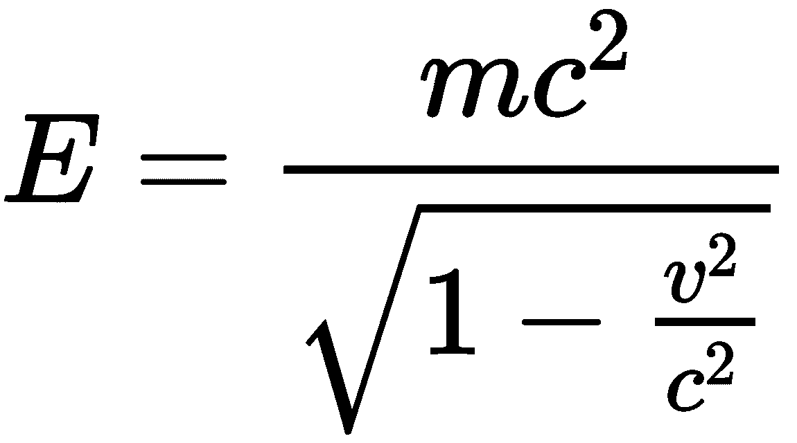
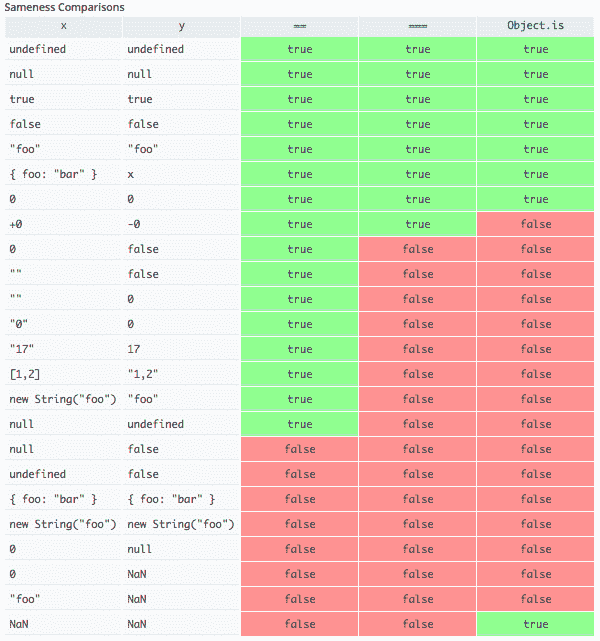

# 了解你的库

ES6/ES7/ES8 向内置 JavaScript 对象添加了许多新的属性和方法。这些新功能旨在帮助开发者避免使用黑客和易出错的技巧来完成与数字、字符串和数组相关的各种操作。

从上一章，你现在对 JavaScript 有了相当多的背景知识，包括它是如何工作的、其基础以及诸如提升、变量作用域和不可变性等基本内容。现在让我们继续前进，看看一些你将在代码中实际使用的话题。

在本章中，我们将涵盖：

+   `Number`、`Object`、`Math`和`Array`对象的新属性和方法

+   将数字常量表示为二进制或八进制

+   创建多行字符串和`String`对象的新方法

+   映射和集合

+   使用数组缓冲区和类型化数组

+   如何使用一些内置方法正确地遍历数组

+   字符串填充，等等！

# 处理数字

ES6、ES2016（ES7）和 ES2017（ES8）带来了创建数字的新方法以及`Number`对象的新属性，使得处理数字更加容易。`Number`对象在 ES6 中得到了极大的增强，使其更容易创建数学丰富的应用程序并防止导致错误的常见误解。

# 二进制表示法

以前，没有原生的方法来表示数字常量作为二进制。但现在，你可以使用`0b`前缀来前缀数字常量，使 JavaScript 将它们解释为二进制。

这里有一个示例：

```js
let a = 0b00001111;
let b = 15;
console.log(a === b);
console.log(a);
```

输出如下：

```js
true
15
```

这里，`0b00001111`是十进制 15 的二进制表示。

# 八进制表示法

八进制表示法是一种仅使用八个数字的数制，即从 0 到 7。如果你喜欢，你可以使用 JavaScript 以八进制格式表示一个数字。

以前，要表示数字常量作为八进制，我们需要使用`0`前缀。例如，看看以下内容：

```js
const a = 017;
const b = 15;
console.log(a === b);
console.log(a);
```

输出如下：

```js
true
15
```

但是，对于 JavaScript 的新程序员来说，八进制表示法和以`0`开头的十进制数字常常会让他们感到困惑。例如，他们认为`017`和`17`是相同的。因此，为了消除这种困惑，JavaScript 现在允许我们使用`00`前缀来前缀数字常量，使 JavaScript 将它们解释为八进制。

这里有一个示例来演示这一点：

```js
const a = 0017;
const b = 15;
console.log(a === b);
console.log(a);
```

输出如下：

```js
true
15
```

# `Number.isInteger(number)`方法

JavaScript 中的数字以 64 位浮点数的形式存储。因此，JavaScript 中的整数是没有小数部分的浮点数，或者小数部分全是 0 的浮点数。

在 ES5 中，没有内置的方法来检查一个数字是否为整数。`Number`对象中存在一个新的方法`isInteger()`，它接受一个数字并返回`true`或`false`，这取决于该数字是否为整数。

这里有一个示例：

```js
let a = 17.0;
let b = 1.2;
console.log(Number.isInteger(a));
console.log(Number.isInteger(b));
```

输出如下：

```js
true
false
```

# `Number.isNaN(value)`方法

`Number.isNaN` 函数仅在值等于 `NaN` 时返回 `true`。在其他所有情况下，它都返回 `false`。这意味着它不会尝试将不是数字的东西类型转换为数字（这通常会导致返回 `NaN`）。

检查以下示例：

```js
let a = "NaN";
let b = NaN;
let c = "hello";
let d = 12;
console.log(Number.isNaN(a)); // false
console.log(Number.isNaN(b)); // true
console.log(Number.isNaN(c)); // false
console.log(Number.isNaN(d)); // false
```

这里你可以看到，`Number.isNaN()` 方法仅在传入的值正好是 `NaN` 时返回 `true`。

你可能会问，为什么不使用 `==` 或 `===` 运算符而不是 `Number.isNaN(value)` 方法？`NaN` 值是唯一一个不等于自身的值，即表达式 `NaN==NaN` 或 `NaN===NaN` 将返回 `false`。

如果你声明 `x = NaN`，那么 `x` 就不等于自身！

# isNaN 与 Number.isNaN

对我来说，一个名为 `isNaN` 的方法应该直观地只在数字上返回 `false`，在其他所有情况下返回 `true`。这正是 `isNaN()` 全局方法所做的事情。然而，如果你想要将一个值与 `NaN`（你不能使用 `===` 或 `==`）进行比较，那么 `Number.isNaN` 就是你的选择。

例如：

```js
isNaN(' '); // false => because Number(' ') is equal to 0 (a number)
isNaN(true); // false => because Number(true) is equal to 1 (a number)
```

简而言之，`isNaN` 也试图执行类型转换。这就是为什么一些开发者认为它是损坏的。

# Number.isFinite(number) 方法

全局 `isFinite()` 函数接受一个值并检查它是否是有限数。但不幸的是，它也会对转换为 `Number` 类型的值返回 `true`。

`Number.isFinite()` 方法解决了 `window.isFinite()` 函数的问题。以下是一个示例来演示这一点：

```js
console.log(isFinite(10)); // true 
console.log(isFinite(NaN)); // false
console.log(isFinite(null)); // true
console.log(isFinite([])); // true
console.log(Number.isFinite(10)); // true
console.log(Number.isFinite(NaN)); // false
console.log(Number.isFinite(null)); // false
console.log(Number.isFinite([])); // false
```

# Number.isSafeInteger(number) 方法

JavaScript 中的数字以 64 位浮点数的形式存储，遵循国际 IEEE 754 标准。这种格式使用 64 位存储数字，其中数字（分数）存储在 0 到 51 位，指数在 52 到 62 位，符号在最后一位。

因此，在 JavaScript 中，安全的整数是指那些不需要四舍五入到其他整数以适应 IEEE 754 表示的数字。从数学上讲，从 -(2⁵³-1) 到 (2⁵³-1) 的数字被认为是安全的整数。

以下是一个示例来演示这一点：

```js
console.log(Number.isSafeInteger(156));
console.log(Number.isSafeInteger('1212'));
console.log(Number.isSafeInteger(Number.MAX_SAFE_INTEGER));
console.log(Number.isSafeInteger(Number.MAX_SAFE_INTEGER + 1));
console.log(Number.isSafeInteger(Number.MIN_SAFE_INTEGER));
console.log(Number.isSafeInteger(Number.MIN_SAFE_INTEGER - 1));
```

输出如下：

```js
true
false
true
false
true
false
```

在这里，`Number.MAX_SAFE_INTEGER` 和 `Number.MIN_SAFE_INTEGER` 是在 ES6 中引入的常量值，分别代表 (2⁵³-1) 和 -(2⁵³-1)。

# Number.EPSILON 属性

JavaScript 使用二进制浮点数表示，结果导致计算机无法准确表示像 0.1、0.2、0.3 等这样的数字。当你的代码执行时，像 0.1 这样的数字会被四舍五入到该格式中最接近的数字，这会导致小的舍入误差。

考虑以下示例：

```js
console.log(0.1 + 0.2 == 0.3);
console.log(0.9 - 0.8 == 0.1);
console.log(0.1 + 0.2);
console.log(0.9 - 0.8);
```

输出如下：

```js
false
false
0.30000000000000004
0.09999999999999998
```

`Number.EPSILON` 属性是在 ES6 中引入的，其值约为 2^(-52)。这个值表示在比较浮点数时合理的误差范围。使用这个数字，我们可以创建一个自定义函数来比较浮点数，同时忽略最小的舍入误差。以下示例代码：

```js
function epsilonEqual(a, b) {
  return Math.abs(a - b) < Number.EPSILON;
}
console.log(epsilonEqual(0.1 + 0.2, 0.3));
console.log(epsilonEqual(0.9 - 0.8, 0.1));
```

输出如下：

```js
true
true
```

在这里，`epsilonEqual()` 是我们构建的用于比较两个值是否相等的自定义函数。现在，输出符合预期。

# 进行数学运算

ES6 及以上版本向 `Math` 对象添加了许多新方法，涉及三角学、算术和杂项。这使得开发者可以使用原生方法而不是外部数学库。原生方法针对性能进行了优化，并且具有更好的十进制精度。

# 与三角学相关的操作

经常需要使用与三角学、指数、对数等相关联的数学函数。JavaScript 提供了原生方法来简化我们的工作。

以下示例代码，展示了添加到 `Math` 对象的所有与三角学相关的方法：

```js
console.log(Math.sinh(0)); //hyberbolic sine of a value
console.log(Math.cosh(0)); //hyberbolic cosine of a value
console.log(Math.tanh(0)); //hyberbolic tangent of a value
console.log(Math.asinh(0)); //inverse hyperbolic sine of a value
console.log(Math.acosh(1)); //inverse hyperbolic cosine of a value
console.log(Math.atanh(0)); //inverse hyperbolic tangent of a value
console.log(Math.hypot(2, 2, 1));//Pythagoras theorem
```

输出如下：

```js
0
1
0
0
0
0
3
```

# 与算术相关的操作

正如我们之前讨论的，JavaScript 也公开了一些用于执行对数和指数计算的函数，这在很多情况下都非常有用（尤其是在你创建游戏时）。

以下示例代码，展示了添加到 `Math` 对象的所有与算术相关的方法：

```js
console.log(Math.log2(16)); //log base 2
console.log(Math.log10(1000)); //log base 10
console.log(Math.log1p(0)); //same as log(1 + value)
console.log(Math.expm1(0)); //inverse of Math.log1p()
console.log(Math.cbrt(8)); //cube root of a value
```

输出如下：

```js
4
3
0
0
2
```

# 指数操作符

ES7 引入了一种使用 JavaScript 执行指数计算的新方法，即使用新的 `**` 操作符。如果你来自 Python 背景，你应该能够立即联想到这一点。单个星号表示乘法；然而，两个一起表示指数。`a**b` 表示 `a` 的 `b` 次幂。看看以下例子：

```js
const a = 5**5;
const b = Math.pow(5, 5);
console.log(a);
console.log(a == b);
```

输出如下：

```js
3125
true
```

`Math.pow` 之前用于执行指数计算。现在，`a**b` 表示将 `a` 乘以自身 `b` 次。

# 杂项数学方法

除了我们之前讨论的日常数学方法和运算符之外，还有一些 *无聊* 的方法，并不总是被使用。然而，如果你正在尝试构建下一个在线科学计算器，这里有一份你应该了解的函数列表。

# `Math.imul(number1, number2)` 函数

`Math.imul()` 函数将两个数字作为 32 位整数相乘，并返回结果的下 32 位。这是 JavaScript 中执行 32 位整数乘法的唯一原生方法。

这里有一个例子来演示这一点：

```js
console.log(Math.imul(590, 5000000)); //32-bit integer multiplication
console.log(590 * 5000000); //64-bit floating-point multiplication
```

输出如下：

```js
-1344967296
2950000000
```

在这里，当进行乘法运算时，产生了一个太大以至于无法存储在 32 位中的数字；因此，低位的数字丢失了。

# `Math.clz32(number)` 函数

`Math.clz32()` 函数返回一个数字在 32 位表示中的前导零位数。

这里有一个例子来演示这一点：

```js
console.log(Math.clz32(7));
console.log(Math.clz32(1000));
console.log(Math.clz32(295000000));
```

输出如下：

```js
29
22
3
```

`Math.clz32()` 函数通常用于 DSP 算法中，用于在声音和视频处理中归一化样本。

# `Math.sign(number)` 函数

`Math.sign()` 函数返回一个数字的符号，指示数字是负数、正数还是零。

这里有一个例子来演示这一点：

```js
console.log(Math.sign(11));
console.log(Math.sign(-11));
console.log(Math.sign(0));
```

输出如下：

```js
1
-1
0
```

从前面的代码中，我们可以看到 `Math.sign()` 函数在数字为正时返回 `1`，在数字为负时返回 `-1`，在数字为零时返回 `0`。

# Math.trunc(number) 函数

`Math.trunc()` 函数通过删除任何小数位来返回数字的整数部分。以下是一个示例来演示这一点：

```js
console.log(Math.trunc(11.17));
console.log(Math.trunc(-1.112));
```

输出如下：

```js
11
-1
```

# Math.fround(number) 函数

`Math.fround()` 函数将一个数字四舍五入到 32 位浮点值。

以下是一个示例来演示这一点：

```js
console.log(Math.fround(0));
console.log(Math.fround(1));
console.log(Math.fround(1.137));
console.log(Math.fround(1.5));
```

输出如下：

```js
0
1
1.1369999647140503
1.5
```

# 处理字符串

ES6/ES7/ES8 提供了创建字符串的新方法，并为全局 `String` 对象及其实例添加了新属性，以使处理字符串更容易。与 Python 和 Ruby 等编程语言相比，JavaScript 中的**字符串**缺乏功能和能力；因此，ES6 增强了字符串以改变这一点。

在我们深入研究新的字符串功能之前，让我们复习一下 JavaScript 的内部字符编码和转义序列。在 Unicode 字符集中，每个字符都由一个称为代码点的十进制基数表示。代码单元是内存中存储代码点的固定位数。编码方案决定了代码单元的长度。如果使用 UTF-8 编码方案，则代码单元是 8 位，如果使用 UTF-16 编码方案，则代码单元是 16 位。如果一个代码点不适合代码单元，它将被分成多个代码单元，即表示单个字符的序列中的多个字符。

默认情况下，JavaScript 解释器将 JavaScript 源代码解释为 UTF-16 代码单元的序列。如果源代码是用 UTF-8 编码方案编写的，那么有各种方法可以告诉 JavaScript 解释器将其解释为 UTF-8 代码单元的序列。JavaScript 字符串始终是 UTF-16 代码点的序列。

任何具有小于 65,536 的代码点的 Unicode 字符都可以使用其代码点的十六进制值在 JavaScript 字符串或源代码中进行转义，前面加上 `\u`。转义序列是六个字符长。它们需要紧跟 `\u` 的正好四个字符。如果十六进制字符代码只有一位、两位或三位，则需要用前导零填充它。以下是一个示例来演示这一点：

```js
const \u0061 = "\u0061\u0062\u0063";
console.log(a); //Output is "abc"
```

# repeat(count) 方法

字符串的 `repeat()` 方法构建并返回一个新的字符串，该字符串包含在它被调用的指定数量的副本，并将它们连接在一起。以下是一个示例来演示这一点：

```js
console.log("a".repeat(6)); //Output "aaaaaa"
```

# includes(string, index) 方法

`includes()` 方法用于检查一个字符串是否可以在另一个字符串中找到，根据适当的情况返回 `true` 或 `false`。以下是一个示例来演示这一点：

```js
const str = "Hi, I am a JS Developer";
console.log(str.includes("JS")); //Output "true"
```

它接受一个可选的第二个参数，表示在字符串中开始搜索的位置。以下是一个示例来演示这一点：

```js
const str = "Hi, I am a JS Developer";
console.log(str.includes("JS", 13)); // Output "false"
```

# startsWith(string, index) 方法

`startsWith()` 方法用于检查一个字符串是否以另一个字符串的字符开头，根据情况返回 `true` 或 `false`。以下是一个示例来演示这一点：

```js
const str = "Hi, I am a JS Developer";
console.log(str.startsWith('Hi, I am')); //Output "true"
```

它接受一个可选的第二个参数，表示在字符串中开始搜索的位置。以下是一个示例来演示这一点：

```js
const str = "Hi, I am a JS Developer";
console.log(str.startsWith('JS Developer', 11)); //Output "true"
```

# `endsWith(string, index)` 函数

`endsWith()` 方法用于检查一个字符串是否以另一个字符串的字符结尾，根据情况返回 `true` 或 `false`。它还接受一个可选的第二个参数，表示假设为字符串末尾的位置。以下是一个示例来演示这一点：

```js
const str = "Hi, I am a JS Developer";
console.log(str.endsWith("JS Developer")); //Output "true"
console.log(str.endsWith("JS", 13)); //Output "true"
```

# `indexOf(string)` 函数

个人来说，99% 的时间，我使用 `indexOf` 而不是 `startsWith` 或 `endsWith`、`includes`，主要是因为我非常习惯于它，而且它非常直观。此方法将返回您在给定字符串中传递的子字符串的第一次出现的位置。如果不存在，则返回 `-1`。例如：

```js
const string = "this is an interesting book and this book is quite good as well.";
console.log(string.indexOf("this"))
The output for the preceding code is: 
0
```

这是因为子字符串在较大字符串的 0^(th) 位置找到。如果子字符串不在字符串中，`indexOf` 返回 `-1`。

你能否想出一个用 `indexOf` 替换 `startsWith` 方法的方案？以下就是答案！

```js
const string = "this is a sentence.";
console.log(string.startsWith("this")); // true => starts with "this"
console.log(string.indexOf("this") == 0); // true => starts with "this"
```

# `lastIndexOf(string)`

`lastIndexOf` 方法基本上与 `indexOf` 做的事情相同，但它将从字符串的末尾开始搜索子字符串。因此，`indexOf` 返回子字符串第一次出现的位置，而 `lastIndexOf` 返回子字符串最后一次出现的位置：

```js
const string = "this is an interesting book and 
 this book is quite good as well.";
console.log(string.lastIndexOf("this"))
```

从这个输出结果是：

```js
32
```

虽然用 `lastIndexOf` 替换 `endsWith` 字符串方法可能有点麻烦，但我仍然强烈建议你尝试自己实现它。一旦你准备好了你的解决方案，请检查以下答案：

```js
const string = "this is an interesting book and 
                this book is quite good as well";
console.log(string.endsWith("well")); // true
console.log(string.lastIndexOf("well") + "well".length == string.length); // true
```

# `padStart(length [, padString])`

ES2017 (ES8) 提供了 `padStart()` 方法，该方法使用另一个给定的字符串填充给定的字符串，以使原始字符串达到所需的长度。填充是从字符串的开始进行的。

如果没有传递 `padString`，则默认使用空格。请看以下示例：

```js
'normal'.padStart(7);
'1'.padStart(3, '0');
'My Awesome String'.padStart(20, '*');
''.padStart(10, '*');
'Hey!'.padStart(13, 'But this is long');
```

每一行的输出结果将是：

```js
" normal"
"001"
"****My Awesome String"
"**********"
"But this Hey!"
```

注意，`padStart` 函数中提供的长度将是整个字符串的最大长度。如果原始字符串已经大于 `padStart` 提供的长度，则根本不应用填充。

类似于上一个示例，如果 `padString` 的长度超过了所需的填充长度，`padString` 将从最左侧部分开始被截断，直到达到所需的长度。

这种用法的一个可能案例是：

```js
for(let i=1;i<=100;i++) {
   console.log(`Test case ${(i+"").padStart(3, "0")}`);
}
```

你能猜出以下输出的结果吗？这里是答案：

```js
Test case 001
Test case 002
Test case 003
....
...
Test case 010
Test case 011
...
..
Test case 100
```

没有使用 `padStart` 函数，要实现这个解决方案是相当棘手的。您必须以某种方式手动跟踪数字，并意识到何时需要附加多少个零。尝试在没有 `padStart` 的情况下想出一个替代方案。

# `padEnd(length [, padString])`

`padEnd`与`padStart`类似。区别，正如函数名所说，是它会在字符串的末尾附加提供的填充字符串。

再次考虑以下示例：

```js
'normal'.padEnd(7);
'1'.padEnd(3, '0');
'My Awesome String'.padEnd(20, '*');
''.padEnd(10, '*');
'Hey!'.padEnd(13, 'But this is long');
```

这个输出的结果是：

```js
"normal "
"100"
"My Awesome String***"
"**********"
"Hey!But this "
```

你也可以一起使用`padStart`和`padEnd`，例如：`"1".padStart(5, "*").padEnd(10, "*")`，以生成`****1****`。

# 模板字符串

**模板字符串**只是创建字符串的新字面量，这使得许多事情变得容易。它们提供了嵌入表达式、多行字符串、字符串插值、字符串格式化、字符串标记等功能。它们总是在运行时被处理和转换为普通 JavaScript 字符串；因此，它们可以在我们使用普通字符串的任何地方使用。

模板字符串使用反引号而不是单引号或双引号来编写。以下是一个简单模板字符串的示例：

```js
let str1 = `hello!!!`; //template string
let str2 = "hello!!!";
console.log(str1 === str2); //output "true"
```

# 表达式

模板字符串还把所谓的“表达式”带到了 JavaScript 中。之前，除了简单地连接字符串外别无选择。例如，要在普通字符串中嵌入表达式，你会这样做：

```js
var a = 20;
var b = 10;
var c = "JavaScript";
var str = "My age is " + (a + b) + " and I love " + c;
console.log(str);
```

输出如下：

```js
My age is 30 and I love JavaScript
```

然而，现在模板字符串使得在字符串中嵌入表达式变得容易得多。模板字符串可以包含表达式。这些表达式放置在由美元符号和大括号指示的占位符中，即`${expressions}`。占位符中表达式的解析值以及它们之间的文本被传递给一个函数，以解析模板字符串为普通字符串。默认函数只是将部分连接成一个单一的字符串。如果我们使用自定义函数来处理字符串部分，那么模板字符串被称为**标记模板字符串**，而自定义函数被称为**标记函数**。

这里有一个示例，展示了如何在模板字符串中嵌入表达式：

```js
const a = 20;
const b = 10;
const c = "JavaScript";
const str = `My age is ${a+b} and I love ${c}`;
console.log(str);
```

输出如下：

```js
My age is 30 and I love JavaScript
```

# 标记模板字面量

让我们创建一个标记模板字符串，即使用一个函数来处理模板字符串字面量。让我们实现标记函数来执行与默认函数相同的事情。以下是一个演示此功能的示例：

```js
const tag = function(strings, aPLUSb, aSTARb) {
  // strings is: ['a+b equals', 'and a*b equals']
  // aPLUSb is: 30
  // aSTARb is: 200
  return 'SURPRISE!';
};

const a = 20;
const b = 10;

let str = tag `a+b equals ${a+b} and a*b equals ${a*b}`;
console.log(str);
```

输出如下：

```js
SURPRISE!
```

刚才发生了什么？使用标记函数，你返回的任何内容都是分配给变量的最终值。第一个参数，strings，包含你模板字面量中的所有**静态**字符串，作为一个数组。元素在找到表达式时被分隔。后续参数是在解析模板字面量中的表达式后收到的动态值。

所以，如果你在`tag`函数中修改`aPLUSb`变量，那么在最终结果中值将被更新。我的意思是：

```js
const tag = function(strings, aPLUSb, aSTARb) {
  // strings is: ['a+b equals', 'and a*b equals']
  // aPLUSb is: 30
  // aSTARb is: 200
  aPLUSb = 200;
  aSTARb = 30;
  return `a+b equals ${aPLUSb} and a*b equals ${aSTARb}`;
};

const a = 20;
const b = 10;
>
let str = tag `a+b equals ${a+b} and a*b equals ${a*b}`;
console.log(str);
```

现在的输出是：

```js
a+b equals 200 and a*b equals 30
```

# 多行字符串

模板字符串提供了一种创建包含多行文本的字符串的新方法。

在 ES5 中，我们需要使用`\n`换行符来添加新行。以下是一个演示此功能的示例：

```js
console.log("1\n2\n3");
```

输出如下：

```js
1
2
3
```

在 ES6 中，使用多行字符串，我们可以简单地写：

```js
console.log(`1
2
3`);
```

输出如下：

```js
1
2
3
```

在前面的代码中，我们只是在需要放置 `\n` 的地方添加了新行。在将模板字符串转换为普通字符串时，新行会被转换为 `\n`。

# 原始字符串

**原始字符串** 是一种普通字符串，其中转义字符不会被解释。我们可以使用模板字符串创建原始字符串。我们可以使用 `String.raw` 标签函数获取模板字符串的原始版本。以下是一个示例来演示这一点：

```js
let s = String.raw `xy\n${ 1 + 1 }z`;
console.log(s);
```

输出如下：

```js
 xy\n2z
```

在这里 `\n` 不会被解释为换行符。相反，它是一个由两个字符组成的原始字符串，即 `\` 和 `n`。变量 `s` 的长度将是 `6`。如果你创建了一个标签函数并希望返回原始字符串，那么请使用第一个参数的原始属性。

原始属性是一个数组，它包含第一个参数的字符串的原始版本。以下是一个示例来演示这一点：

```js
let tag = function(strings, ...values) {
  return strings.raw[0]
};
let str = tag `Hello \n World!!!`;
console.log(str);
```

输出如下：

```js
Hello \n World!!!
```

# 模板字面量中的转义序列问题

标签模板很棒！然而，在模板字面量内部（如果使用）的转义序列有一些规则：

+   以 `\u` 开头的任何内容都将被视为 Unicode 转义序列

+   以 `\x` 开头的任何内容都将被视为十六进制转义序列

+   以 `\` 开头然后跟一个数字的任何内容都将被视为八进制转义序列

因此，截至目前，即使有标签模板，由于这些语言的语法，也无法在模板字符串中使用如 LaTeX 这样的语言。

LaTeX 是一种文档准备系统，通常用于编写复杂的方程、数学公式等。使用如 *`E &= \frac{mc²}{\sqrt{1-\frac{v²}{c²}}}`* 这样的转义序列将生成一个花哨的公式：

.

ES2018（即 ES9 规范）旨在解决这个问题。

# 数组

向全局 `Array` 对象及其实例添加了一些新属性，以便更容易地处理数组。与 Python 和 Ruby 等编程语言相比，JavaScript 中的数组在功能和能力方面缺乏。让我们看看一些与数组相关且用途广泛的流行方法。

# Array.from(iterable, mapFunc, this) 方法

`Array.from()` 方法从一个可迭代对象创建一个新的数组实例。第一个参数是可迭代对象的引用。第二个参数是可选的，是一个回调函数（称为 **Map 函数**），它会对可迭代对象的每个元素进行调用。第三个参数也是可选的，是 Map 函数内部的值。

以下是一个示例来演示这一点：

```js
let str = "0123";
let arr = Array.from(str, value => parseInt(value) * 5);
console.log(arr);
```

输出如下：

```js
 [0, 5, 10, 15].
```

`Array.from` 在将“类似数组”结构转换为实际数组时非常有用。例如，当处理**文档对象模型**（**DOM**）时（如第十章所述，*JavaScript 中的存储 API*），当你从 DOM 树中获取大量元素时，你可能会希望使用诸如`forEach`之类的函数。然而，由于`forEach`之类的函数仅存在于实际数组中，因此你不能使用它们。但是，一旦你使用`Array.from`方法将其转换为实际数组，你就可以顺利使用了。一个简单的例子如下：

```js
const arr = document.querySelectorAll('div');
/* arr.forEach( item => console.log(item.tagName) ) */ // => wrong
Array.from(arr).forEach( item => console.log(item.tagName) ); 
// correct
```

`arr.forEach`是错误的，因为`arr`实际上不是一个数组。它在结构上是“类似数组”的（关于这一点稍后还会讨论）。

# `Array.of(values…)`方法

`Array.of()`方法是为创建数组而提供的`Array`构造函数的替代方案。当使用`Array`构造函数时，如果我们只传递一个参数，而且这个参数也是一个数字，那么`Array`构造函数将创建一个空数组，其数组长度属性等于传递的数字，而不是创建一个包含该数字的单元素数组。因此，引入了`Array.of()`方法来解决这个问题。

这里有一个例子来演示这一点：

```js
let arr1 = Array(2);
let arr2 = Array.of(2);
console.log(arr1);
console.log(arr2);
```

输出如下：

```js
[undefined, undefined]
[2]
```

当你动态构建一个新的数组实例时，应该使用`Array.of()`而不是`Array`构造函数，即当你不知道值的类型和元素数量时。

而不是浏览器显示[undefined, undefined]，你的浏览器可能会显示[undefined x 2]或[empty x 2]作为输出。

# `fill(value, startIndex, endIndex)`方法

数组的`fill()`方法从`startIndex`到`endIndex`（不包括`endIndex`）用给定的值填充数组中的所有元素。请记住，`startIndex`和`endIndex`参数是可选的；因此，如果它们没有提供，则整个数组将用给定的值填充。

如果只提供了`startIndex`，则`endIndex`默认为数组长度减 1。如果`startIndex`为负数，则视为数组长度加上`startIndex`。如果`endIndex`为负数，则视为数组长度加上`endIndex`。

这里有一个例子来演示这一点：

```js
let arr1 = [1, 2, 3, 4];
let arr2 = [1, 2, 3, 4];
let arr3 = [1, 2, 3, 4];
let arr4 = [1, 2, 3, 4];
let arr5 = [1, 2, 3, 4];
arr1.fill(5);
arr2.fill(5, 1, 2);
arr3.fill(5, 1, 3);
arr4.fill(5, -3, 2);
arr5.fill(5, 0, -2);
console.log(arr1);
console.log(arr2);
console.log(arr3);
console.log(arr4);
console.log(arr5);
```

输出如下：

```js
[5,5,5,5]
[1,5,3,4]
[1,5,5,4]
[1,5,3,4]
[5,5,3,4]
```

# `includes()`方法

`includes()`方法如果某个指定的元素存在于数组中，则返回`true`；如果不存在，则返回`false`。

这一点仅用一个例子就足够简单易懂了：

```js
const arr = [0, 1, 1, 2, 3, 5, 8, 13];
arr.includes(0); // true
arr.includes(13); // true
arr.includes(21); // false
```

# `includes()`与`indexOf()`方法的比较

就像字符串一样，`indexOf`也存在于数组中，正如你所期望的，它将返回元素在数组中的位置。看看这个例子：

```js
const arr = ['apple', 'mango', 'banana'];
console.log(arr.indexOf('apple')); // 0
console.log(arr.indexOf('mango')); // 1
console.log(arr.indexOf('apple') >= 0); // true => apple exists
console.log(arr.includes('apple')); // true => apple exists
console.log(arr.indexOf('pineapple') >= 0); // false => pineapple  
                                            // doesn't exists
console.log(arr.includes('pineapple')); // false => pineapple doesn't 
                                        //exists
```

那么，它们之间有什么区别呢？除非我们谈论`NaN`和所有那些奇怪的东西，否则实际上并没有区别。例如：

```js
const arr = ['Some elements I like', NaN, 1337, true, false, 0017];
console.log(arr.includes(NaN)); // true
console.log(arr.indexOf(NaN) >= 0); // false => indexOf says there is 
                                    //no NaN element in array
```

这是因为，在底层，`indexOf`使用的是等价检查（`===`），正如之前讨论的那样，这显然在`NaN`上失败。因此，在数组的情况下，`includes`是一个更好的选择。

# `find(testingFunc)`方法

数组的`+`方法如果满足提供的测试函数，则返回一个数组元素。否则，返回`undefined`。

`find()`方法接受两个参数；也就是说，第一个参数是测试函数，第二个参数是测试函数中的这个值的值。第二个参数是可选的。

测试函数有三个参数：第一个参数是正在处理的数组元素，第二个参数是正在处理的当前元素的索引，第三个参数是调用`find()`的数组。

测试函数需要返回`true`以满足一个值。`find()`方法返回满足提供的测试函数的第一个元素。

这里有一个示例来演示`find()`方法：

```js
const x = 12;
const arr = [11, 12, 13];
const result = arr.find( (value, index, array) => value == x )
console.log(result); //Output "12"
```

# `findIndex(testingFunc)`方法

`findIndex()`方法与`find()`方法类似。`findIndex()`方法返回满足条件的数组元素的索引，而不是元素本身。看看这个例子：

```js
const x = 12;
const arr = [11, 12, 13];
const result = arr.findIndex( (value, index, array) => value == x );
console.log(result); 
```

输出是`1`。

# `copyWithin(targetIndex, startIndex, endIndex)`函数

数组的`copyWithin()`方法用于将数组的值序列复制到数组中的不同位置。

`copyWithin()`方法接受三个参数：第一个参数表示要复制元素的目标索引，第二个参数表示开始复制的索引位置，第三个参数表示索引，即复制元素应该结束的位置。

第三个参数是可选的，如果没有提供，则默认为`length-1`，其中`length`是数组的长度。如果`startIndex`是负数，则计算为`length+startIndex`。同样，如果`endIndex`是负数，则计算为`length+endIndex`。

这里有一个示例来演示这一点：

```js
const arr1 = [1, 2, 3, 4, 5];
const arr2 = [1, 2, 3, 4, 5];
const arr3 = [1, 2, 3, 4, 5];
const arr4 = [1, 2, 3, 4, 5];
arr1.copyWithin(1, 2, 4);
arr2.copyWithin(0, 1);
arr3.copyWithin(1, -2);
arr4.copyWithin(1, -2, -1);
console.log(arr1);
console.log(arr2);
console.log(arr3);
console.log(arr4);
```

输出如下：

```js
[1,3,4,4,5]
[2,3,4,5,5]
[1,4,5,4,5]
[1,4,3,4,5]
```

# `entries()`、`keys()`和`values()`方法

数组的`entries()`方法返回一个可迭代对象，它包含数组的每个索引的键/值对。同样，数组的`keys()`方法返回一个可迭代对象，它包含数组中每个索引的键。

同样，数组的`values()`方法返回一个可迭代对象，它包含数组的值。`entries()`方法返回的可迭代对象以数组的形式存储键/值对。

这些函数返回的可迭代对象不是一个数组。

这里有一个示例来演示这一点：

```js
const arr = ['a', 'b', 'c'];
const entries = arr.entries();
const keys = arr.keys();
const values = arr.values();
console.log(...entries);
console.log(...keys);
console.log(...values);
```

输出如下：

```js
0,a 1,b 2,c
0 1 2
a b c
```

`arr.values()`在写作时（2017 年 11 月）仍然非常实验性，并且大多数浏览器中尚未实现。

# 数组迭代

在开发过程中，你大部分时间都会在迭代数组：来自 REST API 的数组、来自用户输入的数组、来自这里的数组、来自那里的数组。因此，掌握一些你可以用来迭代数组的重要工具是至关重要的。

# `map()`方法

`map()`方法创建并返回一个新数组，并将该数组的每个元素传递给提供的函数。看看这个例子：

```js
const arr = [1, 2, 3, 4, 5, 6, 7, 8, 9, 10];
const squaredNums = arr.map( num => num**2 );
console.log(squaredNums);
```

输出如下：

```js
[1, 4, 9, 16, 25, 36, 49, 64, 81, 100]
```

在前面的函数中，当你对`arr`运行`map`时，每个值都会逐个传递给提供的函数。值包含为`num`。由于我们使用 ES6 箭头函数表示法，一切看起来都非常简洁和整洁。

# filter()方法

`filter()`方法创建一个新数组，只包含通过程序员定义的测试的给定数组中的元素。

例如：

```js
const arr = ['Mike', 'John', 'Mehul', 'Rahul', 'Akshay', 'Deep','Om', 'Ryan'];
const namesWithOnly4Letters = arr.filter( name => name.length == 4 );
console.log(namesWithOnly4Letters);
```

输出如下：

```js
["Mike", "John", "Deep", "Ryan"]
```

如您所见，在`filter`中，我们提供的函数始终返回一个布尔值。每当内部函数返回`true`时，该特定元素就会包含在`namesWithOnly4Letters`中。每当它返回`false`时，它就不会包含。

# forEach()方法

`forEach()`方法会对数组中的每个元素调用给定的函数。它与`map`函数不同，因为`map`函数基于从`map`函数返回的内容创建原始数组的副本。但`forEach`只是对每个元素运行一个函数。它不关心你从函数返回什么。

看看这个：

```js
const arr = [1, 2, 3, 4];
arr.forEach( (value, index) => console.log(`arr[${index}] = ${value}`) );
```

输出如下：

```js
arr[0] = 1
arr[1] = 2
arr[2] = 3
arr[3] = 4
```

显然，当你只想对数组的元素执行一系列操作时，使用`forEach`。

# some()方法

`some()`方法将检查给定数组中的任何元素是否通过提供的测试（使用函数）。如果它找到一个通过测试的元素，它就会停止，不会运行进一步（并返回`true`）。否则，它将返回`false`。

这里有一个例子：

```js
const arr = [1, 3, 5, 7, 9, 10, 11];
const isAnyElementEven = arr.some( elem => { 
   console.log('Checking '+elem); 
   return elem % 2 == 0
});
console.log(isAnyElementEven); // true
```

输出如下：

```js
Checking 1
Checking 3
Checking 5
Checking 7
Checking 9
Checking 10
true
```

注意，一旦测试通过，它就会停止在`10`。

# 集合

**集合**是一个将多个元素存储为单一单元的对象。ES6 引入了各种新的集合对象，以提供更好的存储和组织数据的方法。

在 ES5 中，数组是唯一的集合对象。现在我们有 ArrayBuffers、SharedArrayBuffers、Typed Arrays、Sets 和 Maps，这些都是内置的集合对象。

让我们探索 JavaScript 中提供的不同集合对象。

# ArrayBuffer

数组的元素可以是任何类型，例如字符串、数字、对象等。数组可以动态增长。数组的问题在于它们在执行时间上较慢，并且占用更多内存。这导致在开发需要大量计算和处理大量数字的应用程序时出现问题。因此，引入了数组缓冲区来解决这个问题。

**数组缓冲区**是内存中 8 位块的集合。每个块都是一个数组缓冲区元素。数组缓冲区的大小在创建时需要确定；因此，它不能动态增长。数组缓冲区只能存储数字。所有块在创建数组缓冲区时都初始化为数字 0。

使用`ArrayBuffer`构造函数创建数组缓冲区对象：

```js
const buffer = new ArrayBuffer(80); //80 bytes size
```

使用`DateView`对象可以从`ArrayBuffer`对象中读取值并写入值。不强制使用 8 位来表示一个数字。我们可以使用 8 位、16 位、32 位和 64 位来表示一个数字。以下是一个示例，展示了如何创建`DateView`对象并读取/写入`ArrayBuffer`对象：

```js
const buffer = new ArrayBuffer(80);
const view = new DataView(buffer);
view.setInt32(8,22,false);
const number = view.getInt32(8,false);
console.log(number); //Output "22"
```

在这里，我们使用`DataView`构造函数创建了一个`DataView`对象。`DataView`对象提供了几种方法来将数字读入和写入`ArrayBuffer`对象。这里我们使用了`setInt32()`方法，它使用 32 位来存储提供的数字。所有用于将数据写入`ArrayBuffer`对象的`DataView`对象的方法都接受三个参数。第一个参数表示偏移量，即我们想要写入数字的字节。第二个参数是要存储的数字。第三个参数是一个布尔类型，表示数字的端序，例如`false`表示大端序。

类似地，所有用于从`ArrayBuffer`对象读取数据的`DataView`对象的方法都接受两个参数。第一个参数是偏移量，第二个参数表示使用的端序。

这里是`DataView`对象提供的其他存储数字的函数：

+   `setInt8`: 使用 8 位来存储一个数字。它接受一个有符号整数（负数或正数）。

+   `setUint8`: 使用 8 位来存储一个数字。它接受一个无符号整数（正数）。

+   `setInt16`: 使用 16 位来存储一个数字。它接受一个有符号整数。

+   `setUint16`: 使用 16 位来存储一个数字。它接受一个无符号整数。

+   `setInt32`: 使用 32 位来存储一个数字。它接受一个有符号整数。

+   `setUint32`: 使用 32 位来存储一个数字。它接受一个无符号整数。

+   `setFloat32`: 使用 32 位来存储一个数字。它接受一个有符号的十进制数。

+   `setFloat64`: 使用 64 位来存储一个数字。它接受一个有符号的十进制数。

这里是其他通过`DataView`对象检索存储数字的函数：

+   `getInt8`: 读取 8 位。返回一个有符号整数。

+   `getUint8`: 读取 8 位。返回一个无符号整数。

+   `getInt16`: 读取 16 位。返回一个有符号整数。

+   `getUint16`: 读取 16 位。返回一个无符号整数。

+   `getInt32`: 读取 32 位。返回一个有符号整数。

+   `getUint32`: 读取 32 位。返回一个无符号整数。

+   `getFloat32`: 读取 32 位。返回一个有符号的十进制数。

+   `getFloat64`: 读取 64 位。返回一个有符号的十进制数。

# 类型化数组

我们看到了如何在数组缓冲区中读取和写入数字。但是方法非常繁琐，因为我们必须每次都调用一个函数。类型化数组允许我们像对普通数组那样读取和写入`ArrayBuffer`对象。

**类型化数组**作为`ArrayBuffer`对象的包装器，并将`ArrayBuffer`对象中的数据视为 n 位数字的序列。`n`值取决于我们如何创建类型化数组。

接下来是一个代码示例，演示了如何创建`ArrayBuffer`对象并使用类型数组对其进行读写：

```js
const buffer = new ArrayBuffer(80);
const typed_array = new Float64Array(buffer);
typed_array[4] = 11;
console.log(typed_array.length);
console.log(typed_array[4]);
```

输出如下：

```js
10
11
```

我们使用`Float64Array`构造函数创建了一个类型数组。因此，它将`ArrayBuffer`中的数据视为 64 位有符号十进制数的序列。这里`ArrayBuffer`对象的大小为 640 位；因此，只能存储 10 个 64 位数字。

类似地，还有其他类型数组构造函数，用于将`ArrayBuffer`中的数据表示为不同位数的序列。以下是列表：

+   `Int8Array`：表示 8 位有符号整数

+   `Uint8Array`：表示 8 位无符号整数

+   `Int16Array`：表示 16 位有符号整数

+   `Uint16Array`：表示 16 位无符号整数

+   `Int32Array`：表示 32 位有符号整数

+   `Uint32Array`：表示 32 位无符号整数

+   `Float32Array`：表示 32 位有符号十进制数

+   `Float64Array`：表示 64 位有符号十进制数

类型数组提供了正常 JavaScript 数组提供的所有方法。它们还实现了可迭代协议；因此，它们可以用作可迭代对象。

我们将在第十二章“共享内存和原子操作”中使用类型数组

# Set

**Set**是一个包含任何数据类型唯一值的集合。Set 中的值按插入顺序排列。Set 是通过`Set`构造函数创建的。以下是一个示例：

```js
const set1 = new Set();
const set2 = new Set("Hello!!!");
```

在这里，`set1`是一个空集，而`set2`是使用可迭代对象（即字符串的字符和字符串）创建的，因此不为空；因此，`set2`不为空。以下示例代码演示了可以在 Set 上执行的各种操作：

```js
let set = new Set("Hello!!!");
set.add(12); //add 12
console.log(set.has("!")); //check if value exists
console.log(set.size);
set.delete(12); //delete 12
console.log(...set);
set.clear(); //delete all values
```

输出如下：

```js
true
6
H e l o !
```

在这里，我们向`Set`对象中添加了九个项目，但大小仅为六个，因为 Set 会自动删除重复的值。字符`l`和`!`被重复多次。`Set`对象还实现了可迭代协议，因此可以用作可迭代对象。

当你想维护一组值并检查值是否存在而不是检索值时，使用集合。例如，如果你在代码中只使用数组的`indexOf()`方法来检查值是否存在，则可以将集合用作数组的替代品。

# WeakSet

下面是`Set`和`WeakSet`对象之间的区别：

+   `Set`可以存储原始类型和对象引用，而`WeakSet`对象只能存储对象引用

+   `WeakSet`对象的一个重要特性是，如果没有其他引用指向存储在`WeakSet`对象中的对象，则它们会被垃圾回收

+   最后，`WeakSet`对象是不可枚举的：也就是说，你不能找到它的大小；它也没有实现可迭代协议

除了这三个区别之外，`WeakSet`的行为与`Set`完全相同。除了这三个区别之外，`Set`和`WeakSet`对象之间的一切都是相同的。

一个 `WeakSet` 对象是通过 `WeakSet` 构造函数创建的。你不能将可迭代对象作为参数传递给 `WeakSet` 对象。

这里有一个示例来演示 `WeakSet`：

```js
let weakset = new WeakSet();
(function(){ 
   let a = {}; 
   weakset.add(a);
})();  //here 'a' is garbage collected from weakset
console.log(weakset.size); //output "undefined"
console.log(...weakset); //Exception is thrown
weakset.clear(); //Exception, no such function
```

# Map

一个 **Map** 是键/值对的集合。Map 的键和值可以是任何数据类型。键/值对按插入顺序排列。`Map` 对象是通过 `Map` 构造函数创建的。

这里有一个示例，展示了如何创建一个 `Map` 对象并在其上执行各种操作：

```js
let map = new Map();
let o = {n: 1};
map.set(o, "A"); //add
map.set("2", 9);
console.log(map.has("2")); //check if key exists
console.log(map.get(o)); //retrieve value associated with key
console.log(...map);
map.delete("2"); //delete key and associated value
map.clear(); //delete everything
//create a map from iterable object
let map_1 = new Map([[1, 2], [4, 5]]);
console.log(map_1.size); //number of keys
```

输出如下：

```js
true
A
[object Object],A 2,9
2
```

当从一个可迭代对象创建 `Map` 对象时，我们需要确保可迭代对象返回的值是长度为 `2` 的数组；也就是说，索引 `0` 是键，索引 `1` 是值。

如果我们尝试添加一个已经存在的键，那么它会被覆盖。`Map` 对象也实现了可迭代协议，因此也可以用作可迭代对象。在通过可迭代协议迭代 `Map` 时，它们返回键/值对数组，正如前一个示例所示。

# WeakMap

`WeakMap`，正如其名所示，是一个对象，其中的键是弱引用到键/值对的。这意味着值可以是任何东西。键是弱引用的，因为键是对象。

`Map` 和 `WeakMap` 对象之间的区别如下：

+   `Map` 对象的键可以是原始类型或对象引用，但 `WeakMap` 对象中的键只能是对象引用。

+   `WeakMap` 对象的一个重要特性是，如果一个对象没有其他引用，那么该对象被键引用时，该键会被垃圾回收。

+   最后，一个 `WeakMap` 对象是不可枚举的，也就是说，你不能找到它的大小，它也没有实现可迭代协议。

在其他所有方面，除了这三个区别之外，`Map` 和 `WeakMap` 对象是相似的。

`WeakMap` 是通过 `WeakMap` 构造函数创建的。以下是一个演示其用法的示例：

```js
let weakmap = new WeakMap();

(function(){ 
  let o = {n: 1}; 
  weakmap.set(o, "A");
})();  // here 'o' key is garbage collected

let s = {m: 1};
weakmap.set(s, "B");
console.log(weakmap.get(s));
console.log(...weakmap); // exception thrown
weakmap.delete(s);
weakmap.clear(); // Exception, no such function
let weakmap_1 = new WeakMap([[{}, 2], [{}, 5]]); //this works
console.log(weakmap_1.size); //undefined
```

# Objects

**对象**在 JavaScript 中已经存在很长时间了。它们是 JavaScript 的骨架，因为几乎每种数据类型都可以与 *对象* 关联（`new String()`、`new Number()`、`new Boolean()` 等等）。当你在处理网络应用程序或 JavaScript 时，你经常会发现自己一直在处理和操作对象。

ES6、ES2016（ES7）和 ES2017（ES8）引入了许多与对象相关的新属性和方法。让我们来看看它们。

# Object.values()

ES8 引入了 `Object.values()` 方法，以便程序员可以以数组的形式检索对象的所有值。这之前可以通过手动遍历对象的每个属性并将它的值存储在数组中来实现。

这里有一个示例：

```js
const obj = {
    book: "Learning ES2017 (ES8)",
    author: "Mehul Mohan",
    publisher: "Packt",
    useful: true
};
console.log(Object.values(obj));
```

输出将如下：

```js
["Learning ES2017 (ES8)", "Mehul Mohan", "Packt", true]
```

# Object.entries()

`Object.entries()` 可以用来将一个对象转换成数组形式的键/值对。这意味着你的对象将被转换成一个二维数组（在最简单的情况下），每个元素都是一个包含键和值的数组。看看这个例子：

```js
const obj = {
    book: "Learning ES2017 (ES8)",
    author: "Mehul Mohan",
    publisher: "Packt",
    useful: true
};
console.log(Object.entries(obj));
```

输出将如下：

```js
[["book","Learning ES2017 (ES8)"],["author","Mehul Mohan"],["publisher","Packt"],["useful",true]]
```

# `__proto__` 属性

JavaScript 对象有一个内部 `[[prototype]]` 属性，它引用对象的原型，即它继承的对象：这是 JavaScript 使用的 **原型继承模型**。为了读取属性，我们必须使用 `Object.getPrototypeOf()`，为了创建具有给定原型的新的对象，我们必须使用 `Object.create()` 方法。`[[prototype]]` 属性不能直接读取或修改。

由于 `[[prototype]]` 属性的性质，继承变得很繁琐；因此，一些浏览器在对象中添加了一个特殊的 `__proto__` 属性，它是一个访问器属性，暴露了内部的 `[[prototype]]` 属性，使得与原型的工作更加容易。`__proto__` 属性在 ES5 中没有标准化，但由于其流行，它在后续版本中得到了标准化。

以下是一个演示这个的示例：

```js
//In ES5
var x = {prop1: 12};
var y = Object.create(x, {prop2: {value: 13}});
console.log(y.prop1); //Output "12"
console.log(y.prop2); //Output "13"
console.log(x); // Output: {prop1: 12}
console.log(y); // Output: {prop2: 13}

//In ES6 onwards
let a = {prop1: 12, __proto__: {prop2: 13}};
console.log(a.prop1); //Output "12"
console.log(a.prop2); //Output "13"
console.log(a); // Output: {prop1: 12}
console.log(a.__proto__); // Output: {prop2: 13}
```

仔细观察：

+   在 ES5 的例子中，对象 `y` 从对象 `x` 继承；因此，当你简单地对对象 `y` 使用 `console.log` 时，它从对象 `x` 继承的属性不会直接可见（或者更确切地说，它们是隐藏的）。然而，当你尝试访问 `y.prop2` 时，JavaScript 不会在对象 `y` 上找到它，所以它会查看 `__proto__` 链（这是 JavaScript 的工作方式），并发现实际上在原型链上有一个对 `prop2` 的引用。然而，在 ES5 中无法直接编辑它。

+   在 ES6/ES7/ES8/ES.next 及以后的版本中，你可以直接向对象的原型链中添加值。

# `Object.is(value1, value2)` 方法

`Object.is()` 方法确定两个值是否相等。它与 `===` 运算符类似，但 `Object.is()` 方法有一些特殊情况。以下是一个演示这些特殊情况的示例：

```js
console.log(Object.is(0, -0));
console.log(0 === -0);
console.log(Object.is(NaN, 0/0));
console.log(NaN === 0/0);
console.log(Object.is(NaN, NaN));
console.log(NaN ===NaN);
```

输出如下：

```js
false
true
true
false
true
false
```

这里有一个你可能想要查看的方便的表格，用于比较 0、==、=== 和 Object.is 之间的区别：**



虽然看起来直观，`Object.is` 可以比较两个给定的对象是否相同，但这并不是事实。`x = {foo: 1}` 和 `y = {foo: 1}` 在所有三个运算符（`==`、`===` 和 `Object.is`）中都不是相同的。

# `Object.setPrototypeOf(object, prototype)` 方法

`Object.setPrototypeOf()` 方法只是另一种方式来分配对象的 `[[prototype]]` 属性，这是我们刚刚讨论过的。你可以使用这个方法或者直接操作 `__proto__` 属性。然而，使用方法是一种更干净、更容易阅读的方法。以下是一个示例来演示这一点：

```js
let x = {x: 12};
let y = {y: 13};
Object.setPrototypeOf(y, x);
console.log(y.x); //Output "12"
console.log(y.y); //Output "13"
```

# `Object.assign(targetObj, sourceObjs...)` 方法

`Object.assign()` 方法用于从一个或多个源对象复制所有可枚举的自有属性到目标对象。此方法将返回 `targetObj`。以下是一个演示此功能的示例：

```js
let x = {x: 12};
let y = {y: 13, __proto__: x};
let z = {z: 14, get b() {return 2;}, q: {}};
Object.defineProperty(z, "z", {enumerable: false});
let m = {};
Object.assign(m, y, z);
console.log(m.y);
console.log(m.z);
console.log(m.b);
console.log(m.x);
console.log(m.q == z.q);
```

输出如下：

```js
13
undefined
2
undefined
true
```

在使用 `Object.assign()` 方法时，以下是一些重要事项需要记住：

+   它在源上调用 getter，在目标上调用 setter。

+   它只是将源属性的值赋给目标的新或现有属性。

+   它不会复制源的 `[[prototype]]` 属性。

+   JavaScript 属性名可以是字符串或符号。`Object.assign()` 会复制两者。

+   属性定义不是从源中复制的；因此，你需要使用 `Object.getOwnPropertyDescriptor()`。

+   它会忽略带有 null 和 undefined 值的键的复制。

# Object.getOwnPropertyDescriptors()

在 ES8 中引入的 `Object.getOwnPropertyDescriptors()` 方法将返回给定对象的全部属性描述符。这究竟意味着什么呢？让我们来看一看：

```js
const details = { 
  get food1() { return 'tasty'; },
  get food2() { return 'bad'; }
};
Object.getOwnPropertyDescriptors(details);
```

生成的输出是：

```js
{
 food1: {
 configurable: true,
 enumerable: true,
 get: function food1(){}, //the getter function
 set: undefined
 },
 food2: {
 configurable: true,
 enumerable: true,
 get: function food2(){}, //the getter function
 set: undefined
 }
}
```

当你尝试访问属性时（但同时也想先做一堆事情），`get()` 函数会被触发。所以，当你执行 `details.food1` 时，会返回 `tasty`。

这种实际用法主要应用于 **装饰器**（这是一个全新的主题）以及创建浅拷贝，如下所示：

```js
const x = { foo: 1, __proto__: { bar: 2 } };
const y = Object.create( 
  Object.getPrototypeOf(x), 
  Object.getOwnPropertyDescriptors(x) 
);
console.log(y.__proto__); // { bar: 2 }
```

# 摘要

在本章中，我们学习了 ES8、ES7 和 ES6 中新增的用于处理数字、字符串、数组和对象的特性。我们看到了数组在数学密集型应用中的影响以及如何使用数组缓冲区来替代。我们还探讨了 ES8 提供的新集合对象。

在下一章中，我们将探讨符号和迭代协议，同时也会探索 `yield` 关键字和生成器。许多激动人心和前沿的内容即将呈现在你面前！请保持耐心！
