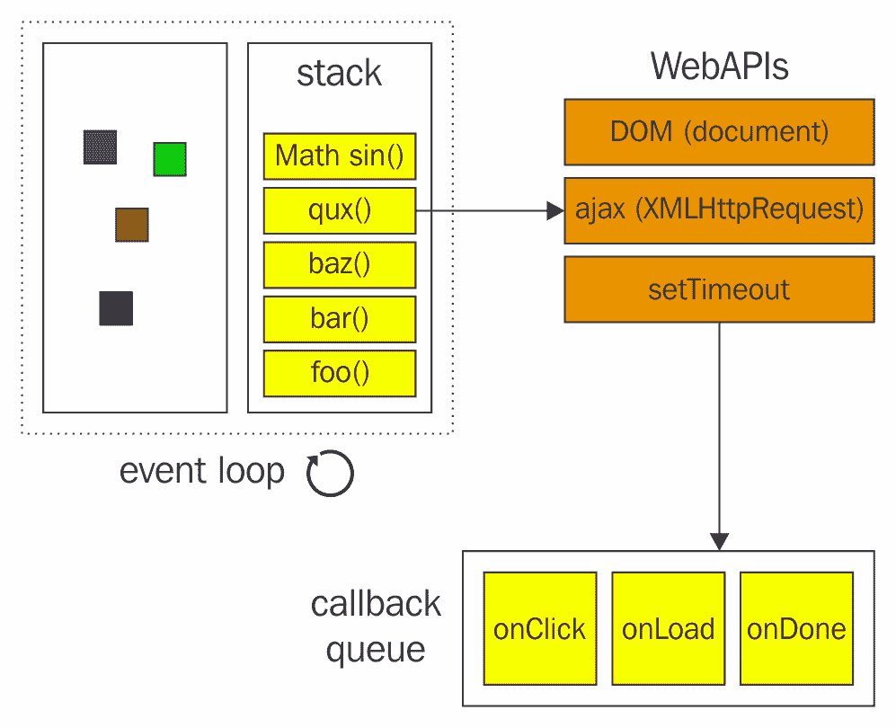

# 异步编程

在本书的所有章节中，这是我最喜欢的章节，因为我过去遇到过不良异步编程的后果，包括事件监听器上的回调、HTTP 请求以及基本上所有需要延迟的操作。

JavaScript 已经从所有这些杂乱无章、难以阅读、难以维护的编程实践中发展而来，这就是我们将在本章学习的内容。

无论如何，让我们学习异步程序是什么。你可以将异步程序想象为包含两行代码的程序，比如说 L1 和 L2。我们都知道，在给定的文件中，代码总是从上到下执行。此外，这是直观的，代码会在执行下一行之前等待当前行完成。

在异步编程的情况下，代码将执行 L1，但不会在 L1 完成之前阻塞 L2。你可以将其视为一种*非阻塞*编程。

在本章中，我们将涵盖：

+   JavaScript 执行模型

+   事件循环

+   编写异步代码时遇到的困难

+   什么是 promises？

+   创建和使用 promises

+   async/await 与 promises 的不同之处

+   使用 async/await 进行高级异步编程

让我们开始吧！

# JavaScript 执行模型

JavaScript 代码是在单线程中执行的，也就是说，脚本的两部分不能同时运行。浏览器中打开的每个网站都获得一个用于下载、解析和执行网站的单独线程，称为主线程。

主线程也维护一个队列，其中包含排队等待依次执行的任务。这些排队任务可以是事件处理器、回调函数或任何其他类型的任务。当发生 AJAX 请求/响应、事件发生、注册计时器等情况时，新任务会被添加到队列中。一个长时间运行的队列任务可能会停止所有其他队列任务和主脚本的执行。主线程尽可能执行队列中的任务。

HTML5 引入了 Web Workers，这是与主线程并行运行的真正线程。当 Web Worker 完成执行或需要通知主线程时，它只需将一个新的事件项添加到队列中。我们将在第九章“Web 上的 JavaScript”中单独讨论 Web Workers。

# 事件循环

JavaScript 在运行机制上遵循基于事件循环的模型。这与 Java 等语言非常不同。尽管现代 JavaScript 编译器实现了非常复杂且高度优化的事件循环模型，我们仍然可以基本理解事件循环是如何工作的。

# 调用栈

JavaScript 是一种单线程语言。这意味着它可以在给定时间只有一个调用栈（一个线程等于一个调用栈）。此外，这也意味着 JavaScript 一次不能做超过两件事。或者它可以吗？

当你调用一个函数时，你进入该函数内部。这个函数被添加到调用栈中。当函数返回一个值时，该函数从调用栈中弹出。

让我们看看这个例子：

```js
const page1 = $.syncHTTP('http://example.com/page1');
const page2 = $.syncHTTP('http://example.com/page2');
const page3 = $.syncHTTP('http://example.com/page3');
const page4 = $.syncHTTP('http://example.com/page4');

console.log(page1, page2, page3, page4);
```

为了简化，假设`$.syncHTTP`是一个预定义的方法，它执行**同步**HTTP 请求，也就是说，它会在完成之前阻塞代码。让我们假设每个请求需要大约 500 毫秒来完成。因此，如果所有这些请求在点击按钮时触发，JavaScript 会立即阻止浏览器在两秒钟内做任何事情！这会以 100 倍的比例杀死用户体验！

显然，调用栈将包含第一个请求，然后在 500 毫秒后从调用栈中移除它，然后转到第二个请求，将其添加到调用栈中，等待 500 毫秒以接收响应，然后从调用栈中移除，依此类推。

然而，当我们使用像`setTimeout()`这样的异步函数时，会发生一些奇怪的事情。看看这个例子：

```js
console.log('Start');

setTimeout( () => {
  console.log('Middle');
}, 1000 )

console.log('End');
```

这里，正如你所期望的，我们首先会打印出`Start`，因为调用栈将`console.log`添加到栈中，执行它，然后从栈中移除。然后 JavaScript 来到`setTimeout()`，将其添加到调用栈中，神奇地不做任何事情（关于这一点稍后还会详细说明），来到最后的`console.log`，将其添加到调用栈中，执行它以显示`End`，然后从调用栈中移除。

最后，神奇的是，1 秒后，另一个`console.log`出现在调用栈中，被执行以打印`Middle`，然后从调用栈中移除。

让我们理解这个魔法。

# 栈、队列和 Web API

那么，当我们在前面的代码中调用`setTimeout()`时发生了什么？它是如何神奇地从调用栈中消失，为下一个函数执行腾出空间的？

好吧，`setTimeout()`是每个浏览器单独提供的 Web API。当你调用`setTimeout`时，调用栈会将`setTimeout()`函数调用发送到 Web API，然后它会跟踪计时器（在我们的例子中）直到它完成。

一旦 Web API 意识到计时器已完成，它不会立即将内容推回栈中。它会将`setTimeout()`函数的回调推送到一个称为队列的东西**。**正如其名所示，这可以是一个等待执行的功能队列。

这时，事件循环就派上用场了。事件循环是一个简单的工具，它始终检查栈和队列，看看栈是否为空；如果队列中有内容，它会从队列中取出并将其推入栈中。

所以本质上，一旦你离开了调用栈（异步函数），你的函数必须等待调用栈被清空后才能执行。

根据上一行，猜测这段代码的输出：

```js
console.log('Hello');
setTimeout( () => {
  console.log('World')
}, 0 ) // 0 second timeout (executes immediately)
console.log('???')
```

想想这个问题。当你准备好了，看看下面的答案：

```js
Hello
???
World
```

现在的原因是，当你调用 `setTimeout()` 时，它会被从调用栈中清除，然后调用下一个函数。Web API 发现 `setTimeout()` 的计时器已超时，并将其推入队列。事件循环等待最后的 `console.log` 语句执行完毕，然后将 `setTimeout()` 的回调函数推入栈中。因此，我们得到了之前显示的输出。

下图说明了之前的代码：



# 编写异步代码

尽管现代 JavaScript 引入了 promises 和 ES8 引入了 async/await（我们很快就会看到），但仍然会有时候你遇到使用回调机制/基于事件的机制进行异步操作的老旧 API。

理解老旧的异步编程实践的工作原理非常重要。这是因为，如果不真正理解其工作原理，你无法将基于回调的异步代码片段转换为基于 promises/async-await 的闪亮代码！

JavaScript 早期原生支持两种编写异步代码的模式，即事件模式和回调模式。在编写异步代码时，我们通常启动一个异步操作，并注册事件处理器或传递回调函数，这些函数将在操作完成后执行。

事件处理器或回调的使用取决于特定异步 API 的设计。为事件模式设计的 API 可以通过一些自定义代码包装成回调模式，反之亦然。例如，AJAX 是为事件模式设计的，但 jQuery AJAX 以回调模式暴露它。让我们考虑一些涉及事件和回调的异步代码编写示例及其困难。

# 涉及事件的异步代码

对于涉及事件的异步 JavaScript API，你需要注册根据操作是否成功执行的成功和错误事件处理器。

例如，在发起 AJAX 请求时，我们会注册根据 AJAX 请求是否成功执行的事件处理器。考虑以下代码片段，它发起一个 AJAX 请求并记录检索到的信息：

```js
function displayName(json) {
    try {
        //we usally display it using DOM
        console.log(json.Name);
    } catch(e) {
    console.log("Exception: " + e.message);
    }
}

function displayProfession(json) {
    try {
        console.log(json.Profession);
    } catch(e) {
        console.log("Exception: " + e.message);
    }
}

function displayAge(json) {
    try {
        console.log(json.Age);
    } catch(e) {
        console.log("Exception: " + e.message);
    }
}

function displayData(data) {
    try {
        const json = JSON.parse(data);
        displayName(json);
        displayProfession(json);
        displayAge(json);
    } catch(e) {
        console.log("Exception: " + e.message);
    }
}

const request = new XMLHttpRequest();
const url = "data.json";
request.open("GET", url);
request.addEventListener("load", function(){

    if(request.status === 200) {
        displayData(request.responseText);
    } else {
        console.log("Server Error: " + request.status);
    }

}, false);

request.addEventListener("error", function(){
    console.log("Cannot Make AJAX Request");
}, false);

request.send();
```

这里，我们假设 `data.json` 文件包含以下内容：

```js
{
    "Name": "Eden",
    "Profession": "Developer",
    "Age": "25"
}
```

`XMLHttpRequest()` 对象的 `send()` 方法是异步执行的，它检索 `data.json` 文件，并根据请求是否成功调用加载或错误事件处理器。

这个 AJAX 的工作方式完全没有问题，但问题在于我们如何编写涉及事件处理的代码。以下是我们在编写前一段代码时遇到的问题：

+   我们不得不为每个将要异步执行的代码块添加异常处理器。我们不能只用一个 `try` 和 `catch` 语句包裹整个代码。这使得捕获异常变得困难。

+   代码难以阅读，因为嵌套函数调用使得代码流程难以追踪。

如果程序的另一部分想要知道异步操作是否已完成、挂起或正在执行，那么我们必须为该目的维护自定义变量。因此，我们可以说找到异步操作的状态是困难的。如果你嵌套了多个 AJAX 或其他异步操作，这段代码可能会变得更加复杂和难以阅读。例如，在显示数据后，你可能希望让用户验证数据是否正确，然后将布尔值发送回服务器。以下是一个代码示例，演示了这一点：

```js
function verify() {
    try {
        const result = confirm("Is the data correct?");
        if (result) {
        //make AJAX request to send data to server
        } else {
        //make AJAX request to send data to server
        }
    } catch(e) {
        console.log("Exception: " + e.message);
    }
}

function displayData(data) {
    try {
        const json = JSON.parse(data);
        displayName(json);
        displayProfession(json);
        displayAge(json);
        verify();
    } catch(e) {
        console.log("Exception: " + e.message);
    }
}
```

# 异步代码涉及回调

对于涉及回调的异步 JavaScript API，你需要传递成功和错误回调，这些回调将根据操作是成功还是失败而分别被调用。例如，在用 jQuery 发起 AJAX 请求时，我们需要传递回调，这些回调将根据 AJAX 请求是否成功执行。考虑以下使用 jQuery 发起 AJAX 请求并记录检索信息的代码片段：

```js
function displayName(json) {
    try {
        console.log(json.Name);
    } catch(e) {
        console.log("Exception: " + e.message);
    }
}

function displayProfession(json) {
    try {
        console.log(json.Profession);
    } catch(e) {
        console.log("Exception: " + e.message);
    }
}

function displayAge(json) {
    try {
        console.log(json.Age);
    } catch(e) {
        console.log("Exception: " + e.message);
    }
}

function displayData(data) {
    try {
        const json = JSON.parse(data);
        displayName(json);
        displayProfession(json);
        displayAge(json);
    } catch(e) {
        console.log("Exception: " + e.message);
    }
}

$.ajax({
url: "data.json", 
success: function(result, status, responseObject) {
    displayData(responseObject.responseText);
}, 
error: function(xhr,status,error) {
    console.log("Cannot Make AJAX Request. Error is: " + error);
}
});
```

即使在这里，jQuery AJAX 的工作方式完全没有问题，但问题在于我们如何编写涉及回调的代码。以下是我们在编写前面代码时遇到的问题：

+   捕获异常很困难，因为我们必须使用多个`try`和`catch`语句。

+   代码难以阅读，因为嵌套函数调用使得代码流程难以追踪。

+   维护异步操作的状态很困难。如果我们嵌套多个 jQuery AJAX 或其他异步操作，这段代码将变得更加复杂。

# 承诺和异步编程

JavaScript 现在有一个新的原生模式来编写异步代码，称为**Promise**模式。这个新模式消除了事件和回调模式中常见的代码问题。它还使代码看起来更像同步代码。承诺（或`Promise`对象）代表一个异步操作。现有的异步 JavaScript API 通常用承诺包装，而新的 JavaScript API 则完全使用承诺实现。承诺在 JavaScript 中是新的，但已经在许多其他编程语言中存在。支持承诺的编程语言，如 C# 5、C++ 11、Swift、Scala 等，是一些例子。

让我们看看如何使用承诺。

# 承诺状态

承诺始终处于以下状态之一：

+   **已履行**：如果解析回调以非承诺对象作为参数或没有参数被调用，那么我们说承诺已履行

+   **拒绝**：如果拒绝回调被调用或在执行器作用域中发生异常，那么我们说承诺被拒绝

+   **挂起**：如果解析或拒绝回调尚未被调用，那么我们说承诺是挂起的

+   **已解决**：如果`Promise`被实现或拒绝，但不是挂起状态，则称其为已解决

一旦`Promise`被实现或拒绝，它就不能再转换。尝试转换将没有任何效果。

# `Promise`与回调的比较

假设你想要依次执行三个 AJAX 请求。以下是在回调风格中的示例实现：

```js
ajaxCall('http://example.com/page1', response1 => {
   ajaxCall('http://example.com/page2'+response1, response2 => {
     ajaxCall('http://example.com/page3'+response2, response3 => {
       console.log(response3)
     }
   })
})
```

你可以很快地看到如何进入所谓的**回调地狱**。多层嵌套不仅使代码难以阅读，而且难以维护。此外，如果你在每次调用后开始处理数据，并且下一个调用基于前一个调用的响应数据，代码的复杂性将无法匹敌。

**回调地狱**指的是多个异步函数嵌套在每个回调函数内部。这使得代码更难阅读和维护。

`Promise`可以简化这段代码。让我们看看：

```js
ajaxCallPromise('http://example.com/page1')
.then( response1 => ajaxCallPromise('http://example.com/page2'+response1) )
.then( response2 => ajaxCallPromise('http://example.com/page3'+response2) )
.then( response3 => console.log(response3) )
```

你可以看到代码复杂性突然降低，代码看起来更干净、更易读。让我们首先看看`ajaxCallPromise`将如何实现。

请阅读以下解释，以更清晰地了解前面的代码片段。

# Promise 构造函数和（resolve，reject）方法

要将现有的*回调类型*函数转换为`Promise`，我们必须使用`Promise`构造函数。在前面的例子中，`ajaxCallPromise`返回一个`Promise`，开发人员可以将其实现或拒绝。让我们看看如何实现`ajaxCallPromise`：

```js
const ajaxCallPromise = url => {
  return new Promise((resolve, reject) => {
    // DO YOUR ASYNC STUFF HERE
    $.ajaxAsyncWithNativeAPI(url, function(data) {
      if(data.resCode === 200) {
          resolve(data.message)
      } else {
          reject(data.error)
      }
    })
  })
}
```

等等！刚才发生了什么？

1.  首先，我们从`ajaxCallPromise`函数中返回`Promise`。这意味着我们现在所做的任何操作都将是一个`Promise`。

1.  `Promise`接受一个函数参数，该函数本身接受两个非常特殊的参数，即 resolve 和 reject。

1.  `resolve`和`reject`本身是函数。

1.  当在`Promise`构造函数函数体内调用`resolve`或`reject`时，`Promise`将获得一个*已解决*或*已拒绝*的值，该值在之后无法更改。

1.  我们随后使用原生的基于回调的 API 并检查一切是否正常。如果一切确实正常，我们使用由服务器发送的消息（假设是 JSON 响应）来`resolve` `Promise`。

1.  如果响应中存在错误，我们拒绝`Promise`。

你可以在`then`调用中返回一个`Promise`。当你这样做时，你可以简化代码而不是再次链式调用`Promise`。

例如，如果`foo()`和`bar()`都返回`Promise`，则`then`而不是：

```js
foo().then( res => {
   bar().then( res2 => {
     console.log('Both done')
   })
})
```

我们可以这样写：

```js
foo()
.then( res => bar() ) // bar() returns a Promise
.then( res => {
   console.log('Both done')
})
```

这简化了代码。

# `then`（onFulfilled，onRejected）方法

`Promise`对象的`then`方法允许我们在`Promise`实现或拒绝后执行任务。该任务也可以是另一个事件驱动或基于回调的异步操作。

`Promise` 对象的 `then()` 方法接受两个参数，即 `onFulfilled` 和 `onRejected` 回调。如果 `Promise` 对象得到实现，则执行 `onFulfilled` 回调；如果承诺被拒绝，则执行 `onRejected` 回调。

如果在执行器的作用域中抛出异常，则也会执行 `onRejected` 回调。因此，它表现得像异常处理程序，即它捕获异常。

`onFulfilled` 回调接受一个参数，即承诺的实现值。同样，`onRejected` 回调接受一个参数，即拒绝的原因：

```js
ajaxCallPromise('http://example.com/page1').then( 
  successData => { console.log('Request was successful') },
  failData => { console.log('Request failed' + failData) } 
)
```

当我们在 `ajaxCallPromise` 定义内部拒绝承诺时，第二个函数将执行（`failData` 一个），而不是第一个函数。

让我们通过将 `setTimeout()` 从回调转换为承诺来举一个例子。这是 `setTimeout()` 的样子：

```js
setTimeout( () => {
  // code here executes after TIME_DURATION milliseconds
}, TIME_DURATION)
```

承诺版本看起来可能如下所示：

```js
const PsetTimeout = duration => {
   return new Promise((resolve, reject) => {
      setTimeout( () => {
         resolve()
      }, duration);
   })
}

// usage:

PsetTimeout(1000)
.then(() => {
  console.log('Executes after a second')
})
```

在这里，我们以无值的方式解决了这个承诺。如果你这样做，它将以等于 `undefined` 的值解决。

# `catch(onRejected)` 方法

当我们只使用 `then()` 方法来处理错误和异常时，使用 `Promise` 对象的 `catch()` 方法代替 `then()` 方法。`catch()` 方法的工作方式没有特别之处。只是它使代码更容易阅读，因为单词 *catch* 使其更有意义。

`catch()` 方法只接受一个参数，即 `onRejected` 回调。`catch()` 方法的 `onRejected` 回调以与 `then()` 方法的 `onRejected` 回调相同的方式被调用。

`catch()` 方法总是返回一个承诺。以下是 `catch()` 方法返回新 `Promise` 对象的方式：

+   如果 `onRejected` 回调中没有返回语句，那么将内部创建一个新的实现 `Promise` 并返回。

+   如果我们在 `onRejected` 回调中返回一个自定义的 `Promise`，那么它将内部创建并返回一个新的 `Promise` 对象。新承诺对象解决了自定义承诺对象。

+   如果在 `onRejected` 回调中返回的不是自定义的 `Promise`，那么将内部创建一个新的 `Promise` 对象并返回。新 `Promise` 对象解决了返回的值。

+   如果我们传递 `null` 而不是 `onRejected` 回调，或者省略它，那么将内部创建一个回调并使用它。内部创建的 `onRejected` 回调返回一个被拒绝的 `Promise` 对象。新 `Promise` 对象被拒绝的原因与父 `Promise` 对象被拒绝的原因相同。

+   如果调用 `catch()` 的 `Promise` 对象得到实现，那么 `catch()` 方法简单地返回一个新的实现承诺对象并忽略 `onRejected` 回调。新 `Promise` 对象的实现值与父 `Promise` 的实现值相同。

要理解 `catch()` 方法，考虑以下代码：

```js
ajaxPromiseCall('http://invalidURL.com')
.then(success => { console.log(success) },
failed => { console.log(failed) });
```

这段代码可以使用 `catch()` 方法重写如下：

```js
ajaxPromiseCall('http://invalidURL.com')
.then(success => console.log(success))
.catch(failed => console.log(failed));
```

这两个代码片段的工作方式大致相同。

# `Promise.resolve(value)` 方法

`Promise` 对象的 `resolve()` 方法接受一个值，并返回一个 `Promise` 对象，该对象解析传递的值。`resolve()` 方法基本上用于将值转换为 `Promise` 对象。当你发现自己有一个可能是也可能不是 `Promise` 的值，但你想将其用作 `Promise` 时，它非常有用。例如，jQuery 承诺与 ES6 承诺有不同的接口。因此，你可以使用 `resolve()` 方法将 jQuery 承诺转换为 ES6 承诺。

以下是一个演示如何使用 `resolve()` 方法的示例：

```js
const p1 = Promise.resolve(4);
p1.then(function(value){
  console.log(value);
}); //passed a promise object

Promise.resolve(p1).then(function(value){ 
 console.log(value);
});

Promise.resolve({name: "Eden"})
.then(function(value){ 
  console.log(value.name);
});
```

输出如下：

```js
4
4
Eden
```

# `Promise.reject(value)` 方法

`Promise` 对象的 `reject()` 方法接受一个值，并返回一个带有传递值作为原因的拒绝的 `Promise` 对象。与 `Promise.resolve()` 方法不同，`reject()` 方法用于调试目的，而不是将值转换为承诺。

以下是一个演示如何使用 `reject()` 方法的示例：

```js
const p1 = Promise.reject(4);
p1.then(null, function(value){
console.log(value);
});
Promise.reject({name: "Eden"})
.then(null, function(value){
console.log(value.name);
});
```

输出如下：

```js
4
Eden
```

# `Promise.all(iterable)` 方法

`Promise` 对象的 `all()` 方法接受一个可迭代对象作为参数，并在可迭代对象中的所有承诺都得到满足时返回一个承诺。

这在我们在一些异步操作完成后想要执行任务时非常有用。以下是一个演示如何使用 `Promise.all()` 方法的代码示例：

```js
const p1 = new Promise(function(resolve, reject){
 setTimeout(function(){
  resolve();
 }, 1000);
});

const p2 = new Promise(function(resolve, reject){
 setTimeout(function(){
  resolve();
 }, 2000);
});

const arr = [p1, p2];
Promise.all(arr).then(function(){
console.log("Done"); //"Done" is logged after 2 seconds
});
```

如果可迭代对象包含一个不是 `Promise` 对象的值，则它将使用 `Promise.resolve()` 方法转换为 `Promise` 对象。

如果传递的任何承诺被拒绝，那么 `Promise.all()` 方法会立即返回一个新的拒绝的 `Promise`，原因与被拒绝的传递 `Promise` 相同。以下是一个演示此功能的示例：

```js
const p1 = new Promise(function(resolve, reject){
 setTimeout(function(){
  reject("Error");
 }, 1000);
});

const p2 = new Promise(function(resolve, reject){
 setTimeout(function(){
  resolve();
 }, 2000);
});

const arr = [p1, p2];
Promise.all(arr).then(null, function(reason){
console.log(reason); //"Error" is logged after 1 second
});
```

# `Promise.race(iterable)` 方法

`Promise` 对象的 `race()` 方法接受一个可迭代对象作为参数，并在可迭代对象中的任何一个承诺满足或拒绝时立即满足或拒绝，使用该 `Promise` 的满足值或原因。

如其名所示，`race()` 方法用于在承诺之间进行竞争，以查看哪个先完成。以下是一个展示如何使用 `race()` 方法的代码示例：

```js
var p1 = new Promise(function(resolve, reject){ 
setTimeout(function(){ 
resolve("Fulfillment Value 1"); 
}, 1000);
});
var p2 = new Promise(function(resolve, reject){ 
setTimeout(function(){
resolve("fulfillment Value 2"); 
}, 2000);
});
var arr = [p1, p2];
Promise.race(arr).then(function(value){ 
console.log(value); //Output "Fulfillment value 1"
}, function(reason){ 
console.log(reason);
});
```

现在，我假设你已经对承诺的工作方式、它们是什么以及如何将回调式 API 转换为承诺式 API 有了一个基本的了解。让我们来看看 **async/await**，异步编程的未来。

# async/await – 异步编程的未来

说实话，async/await 完全超越了之前关于 Promise 的任何阅读。但是！显然，你需要了解 Promise 是如何工作的，才能知道如何使用 async/await。async/await 是基于 Promise 构建的；然而，一旦你习惯了它们，你就不会回到 Promise（除非，再次，你需要将回调类型 API 转换为 async/await（你需要使用 Promise 来完成这个转换））。

关于 async/await：

+   它用于异步编程

+   它让代码看起来与同步代码极其相似，因此非常强大且易于阅读

+   它是基于 Promise 构建的

+   它让错误处理变得轻而易举。你终于可以使用`try`和`catch`进行异步编程了！

+   ES8 引入了 async/await，到你看这篇文档的时候，它将已经在所有浏览器中原生支持（在写作时，只有 IE 和 Opera 不支持 async/await）

# async/await 与 Promise 的比较

虽然 async/await 实际上在底层是 Promise，但它们通过极大地提高代码的可读性而非常有帮助。在表面层面上，我认为开发者应该意识到 async/await 与 Promise 使用上的细微差别。这里是一些这些差别的概述：

| **async/await** | **Promise** |
| --- | --- |
| 极其干净的代码库 | 嵌套 Promise 的更丑陋的代码库 |
| 使用原生的`try`-`catch`块进行错误处理 | 分离的`catch()`方法进行错误处理 |
| Promise 的语法糖（基于 Promise 构建） | 标准中的原生实现 |
| 在 ES8 中引入 | 在 ES6 中引入 |

# 异步函数和 await 关键字

为了使用`await`关键字，我们需要有一个`async`函数。函数和`async`函数之间的区别在于`async`函数后面跟着一个`*async*`关键字。让我们看看一个例子：

```js
async function ES8isCool() {
   // asynchronous work
   const information = await getES8Information() // Here getES8Information itself is an async function
}
```

这是问题的关键。你只能在`async`函数中使用`await`。这是因为当你调用一个`async`函数时，它返回一个`Promise`。然而，我们并不是使用`then`与它结合，这最终会形成一个 Promise 链，而是在它前面使用`await`关键字，在`async`函数的上下文中暂停执行（实际上并不是）。

让我们看看一个真实的例子：

```js
function sendAsyncHTTP(url) {
 return new Promise((resolve, reject) => {
  const xhttp = new XMLHttpRequest()
  xhttp.onreadystatechange = function() {
    if (this.readyState == 4) { // success
    if(this.status == 200) {
           resolve(xhttp.responseText)
      } else {
           console.log(this.readyState, this.status)
           reject(xhttp.statusText) // failed
      }
    }
  };
  xhttp.open("GET", url, true);
  xhttp.send();
 })
}

async function doSomeTasks() {
   const documentFile1 = await sendAsyncHTTP('http://example.com')
   console.log('Got first document')
   const documentFile2 = await sendAsyncHTTP('http://example.com/?somevar=true')
   console.log('Got second document')
   return documentFile2
}

doSomeTasks() // returns a Promise
.then( res => console.log("res is a HTML file") ) 
```

好的！首先，记住异步函数返回一个`Promise`吗？为什么我们没有在`sendAsyncHTTP`中使用`async`关键字？为什么我们从`sendAsyncHTTP`返回一个`Promise`？下面的代码为什么不会工作？

```js
async function sendAsyncHTTP(url) {
  const xhttp = new XMLHttpRequest()
  xhttp.onreadystatechange = function() { // <-- hint
    if(this.status == 200) {
          resolve(xhttp.responseText)
     } else {
          console.log(this.readyState, this.status)
          reject(xhttp.statusText) // failed
     }
  };
  xhttp.open("GET", url, true);
  xhttp.send();
}
```

仔细看看提示注释行。由于我们在`onreadystatechange`中使用了一个函数，在该函数内部返回并不会返回父函数。所以本质上，你从`sendAsyncHTTP`函数中返回的是`undefined`而不是有效的响应。如果有其他使用`await`关键字的异步函数，我们就可以返回一个值而不需要使用`new Promise()`声明。

感到困惑？请继续跟我。如果你之前没有真正理解发生了什么，请继续阅读。你会的。看看下一个函数：

```js
async function doSomeTasks() {
   const documentFile1 = await sendAsyncHTTP('http://example.com')
   console.log('Got first document')
   const documentFile2 = await sendAsyncHTTP('http://example.com/?somevar=true')
   console.log('Got second document')
   return documentFile2
}
```

仔细看看！我们在这里没有使用 `return new Promise` 返回一个 `Promise`。那么这是为什么它能工作呢？这是因为这个函数实际上使用 `await` 关键字等待一个 `async` 函数。看，当代码到达第 1 行时，它会在执行下一行 `(console.log('Got first document'))` 之前暂停。

当 JavaScript 遇到 `await` 后跟一个返回 `Promise` 的函数时，它会等待那个 Promise 解决或拒绝。在我们的例子中，`sendAsyncHTTP` 使用网站源代码解决，所以我们通过 `documentfile2` 变量获取它。

我们再次做类似的事情，但这次使用了一个稍微不同的 URL。一旦我们完成这两个步骤，我们就返回 `documentFile2`。在这里等一下。再次记住，`async function` 返回一个 `Promise`。这意味着，无论你从 `async` 函数中返回什么值，它实际上是那个返回的 `Promise` 的解决值。而且，无论你在 `async` 函数内部 `throw` 的什么值，它都会作为那个返回的 `Promise` 的拒绝值。这很重要！

最后，我们调用了 `doSomeTasks()`，正如之前提到的，它返回了一个 `Promise`。因此，你可以使用一个 `then` 链来简单地将其输出到控制台，表明一切已完成。`res` 变量包含你返回的任何值。`catch()` 方法将捕获 `async` 函数内部抛出的任何错误。

# 让异步代码看起来是同步的

尝试将以下 `Promise` 代码转换为 async/await：

```js
const doSomething = () => {
  return p1().then(res1 => {
      return p2().then(res2 => {
          // finally we need both res1 and res2 
          return p3(res1, res2)
        })
    })
}
```

你看？即使有 Promise，如果你需要在链的某个地方使用第一个 Promise 的值，你也不能避免嵌套。这是因为，如果你展开 Promise 链，你最终会失去之前 Promise 返回的值。

准备好答案了吗？看这里：

```js
const doSomething = async () => {
  const res1 = await p1()
  const res2 = await p2()
  return p3(res1, res2)
}
```

你能看出后者的代码清晰度吗？这是非常显著的！尽可能使用 async/await，而不是回调或 Promise。

# 摘要

在本章中，我们学习了 JavaScript 如何执行异步代码。我们学习了事件循环，以及 JavaScript 如何在不使用任何额外线程的情况下管理所有异步和多个任务。我们学习了编写异步代码的不同模式。

我们看到了 Promise 如何使异步代码的读写更容易，以及 async/await 如何在实践中取代 Promise。在下一章中，我们将探讨如何使用模块化编程方法组织你的 JavaScript 代码。
