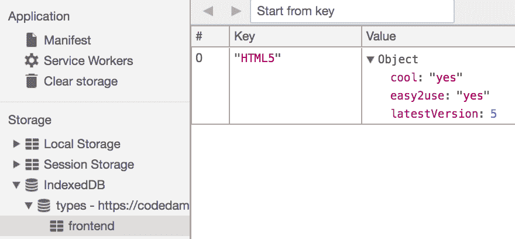

# JavaScript 中的存储 API

想象一下，你正在使用 Facebook 并登录到了你的账户。你看到了你的新闻动态；一切看起来都很正常。接下来，你点击了一个帖子，然后被要求再次登录。这很奇怪。你继续操作并再次登录，帖子才打开。你点击了一条评论中的链接，然后又被要求再次登录。这是怎么回事？

如果我们生活在一个前端没有存储 API 的世界里，会发生这样的事情。

在本章中，我们将探讨以下主题：

+   网络是如何因为 cookies 而工作的

+   JavaScript 中可用的不同数据存储区域形式

+   与`localStorage`和`sessionStorage`对象相关的方法

+   `indexedDB`简介

+   如何使用`indexedDB`执行基本的添加、删除和读取操作

# 超文本传输协议（HTTP）

HTTP 是一个无状态协议。无状态协议意味着服务器上没有存储任何状态，这反过来意味着服务器在向客户端发送响应后就会忘记一切。考虑以下情况：

你在你的浏览器中输入了`http://example.com`。当你的请求到达服务器时，服务器知道你的 IP 地址、你请求的页面以及与你的 HTTP 请求相关的任何其他头信息。它从文件系统或数据库中获取内容，将响应发送给你，然后忘记这一切。

在每个新的 HTTP 请求中，客户端和服务器都会像第一次见面一样互动。那么，这难道不是意味着我们之前的 Facebook 例子在现实世界中也是正确的吗？

实质上，情况就是这样。所有网站都使用**cookies**进行身份验证，这是一种模拟协议状态性的方法。从每个请求中移除 cookies，你将能够看到你面前的原始、无状态的 HTTP 协议。

# 什么是 TLS/SSL 握手？

在深入了解握手是什么之前，让我们花一分钟来理解一下**传输层安全性**（**TLS**）/**安全套接字层**（**SSL**）是什么。

首先，我们应该注意，TLS 只是 SSL 的一个升级版，一个更现代的版本。那么，SSL 是什么呢？

SSL 是安全协议中的一个标准，用于在您的计算机和远程服务器之间建立一个加密和安全的隧道。它阻止了正在监听您互联网连接的人，比如您的**互联网服务提供商**（**ISP**），窃取通过网络传输的数据。

在当今的每个主要网站上，你都会在浏览器中 URL 的左侧看到一个绿色的锁。这是安全的象征，这意味着你的浏览器正在使用 TLS/SSL 加密与服务器进行通信。

现在，什么是握手？正如字面意义，握手是浏览器和服务器交换它们在每次通信中使用的加密密钥的地方，用于加密或解密彼此发送的消息。

为什么我们要讨论 TLS/SSL？这是因为 TLS/SSL 握手在性能上很昂贵。当只有一次握手时，它们并不真正昂贵，但如果我们引入无状态的概念，它们就会开始成为一个问题。这意味着你的浏览器和服务器会在每次请求时忘记他们已经知道彼此的加密密钥。这意味着你的浏览器和服务器需要为每次请求执行 TLS 握手，这将使一切变得相当缓慢。为了避免这种情况，TLS/SSL 协议实际上是一个有状态的协议。

HTTP 之所以如此可扩展，是因为它是无状态的。有状态的协议，如 TLS 和 SSL，在逻辑实现上较为复杂。如果你想了解更多关于 TLS/SSL 的工作原理，请阅读以下内容：https://security.stackexchange.com/a/20833/44281

# 模仿 HTTP 状态

使用 cookie 是一种存储与访问你网站的用户相关的小量数据的方式。你将在下一节中了解更多关于 cookie 的内容。你在特定网站上存储在 cookie 中的任何内容都会附加到对该网站的每个 HTTP 请求上。所以，基本上，你的 HTTP 协议在每次请求中都会传输一个 cookie 字符串，这允许服务器存储与每个连接到它的客户端相关的一些信息。

当我们向我们的`XMLHttpRequest`添加自定义头（记得上一章中的“T*he* *Fetch API 自定义”部分？），这使得在 HTTP 协议上伪造我们的状态变得容易。授权头是浏览器在每次请求中发送的另一个头，如果设置了的话。

现在我们实际来看看这些存储区域，比如 cookie、`localStorage`、`sessionStorage`和`indexedDB`。

# 使用 cookie 存储数据

Cookies 是一些小字符串，一旦为某个域和路径设置，就会在每次请求中反复发送到服务器。这对于身份验证来说很完美，但如果你使用它们来存储你只需要一次或需要在前端访问的数据，比如你不在服务器上存储结果的某个游戏的玩家得分，那么就不是很理想。

人们通常使用 cookie 来存储大量数据，以便在域的某些其他路径上可用。这是一种不良做法，因为你会不断地将数据传输到服务器，如果数据量很大，这会使你的通信变慢。

# 设置 cookie

让我们看看如何使用 JavaScript 访问和设置 cookie：

存储在 cookie 中的信息以`key=value;`格式存在。让我们使用下面的代码片段在浏览器中创建一些 cookie：

```js
document.cookie = "myFirstCookie=good;"
document.cookie = "mySecondCookie=great;"
console.log(document.cookie);
```

**警告：前方有奇怪的行为！**

你期望在这里记录什么？答案是如下：


为什么没有覆盖`document.cookie`对象？所有这些内容将在下一节中解释。

# document.cookie 是一个奇怪的对象

如您之前所见，`document.cookie`显示了一种特殊的行为。它不是替换所有 cookie，而是将变量更新为新 cookie。这种行为是通过一个实际上被称为**宿主对象**的文档实现的，而不是原生对象。宿主对象具有做任何事的能力，因为它们不需要遵循常规对象的语义。

宿主对象实际上是在特定环境中提供的对象--在我们的案例中，是浏览器。当 JavaScript 在服务器（Node.js）上运行时，您无法访问 document 或 window。这意味着它们是宿主对象--也就是说，依赖于宿主并由宿主实现（浏览器）。

在这种情况下，`document.cookie`覆盖了赋值运算符，实际上是将值附加到变量而不是修改它。

关于`[[PutValue]]`的更多技术信息可以在[`es5.github.io/#x8.7.2`](http://es5.github.io/#x8.7.2)找到。

现在的问题是，我们如何删除我们设置的 cookie？我们将在下一节中查看。

# 删除 cookie

要删除 cookie，您需要回到 cookie 并为其指定一个过期日期。之后，浏览器将删除 cookie，并且不再在每次请求时将其发送到服务器。

下面是如何在代码中实现它的示例：

```js
document.cookie = "myFirstCookie=good;"
document.cookie = "mySecondCookie=great;"
console.log(document.cookie);
document.cookie = "mySecondCookie=; expires=Thu, 01 Jan 1970 00:00:00 GMT";
console.log(document.cookie);
```

`1970 年 1 月 1 日 00:00:00`是我们可以追溯的时间点，因为 JavaScript 遵循 Unix 的时间戳。前面代码的输出如下：


# 获取 cookie 值

JavaScript 没有提供任何方便的方法来直接获取 cookie 值。我们只有一串随机 cookie，可以通过`document.cookie`访问。我们需要做一些工作，如下面的代码片段所示：

```js
document.cookie = "awesomecookie=yes;";
document.cookie = "ilovecookies=sure;";
document.cookie = "great=yes";

function getCookie(name) {
    const cookies = document.cookie.split(';');
    for(let i=0;i < cookies.length;i++) {
        if(cookies[i].trim().indexOf(name) === 0) {
            return cookies[i].split('=')[1];
        }
    }
    return null;
}

console.log(getCookie("ilovecookies"));
console.log(getCookie("doesnotexist"));
```

因此，输出将如下所示：

```js
sure
null
```

如您在下面图像的高亮部分中可以看到，当我们重新加载页面时，设置的 cookie 会在每次请求时发送到服务器：


这些 cookie 将随后由服务器访问，具体取决于您使用的后端语言。

# 与 localStorage 一起工作

`localStorage`对象在所有主要浏览器中都是可用的。它是在 HTML5 中引入的。本地存储允许您在用户的计算机上持久存储数据。除非您的脚本或用户明确想要清除数据，否则数据将保持不变。

本地存储遵循相同的源策略。我们将在下一章中详细讨论源策略，但就目前而言，只需了解相同的源策略可以限制不同网站及其对特定网站本地存储的访问。

此外，请注意，localStorage 中的键值对只能是字符串值。要存储对象，您必须首先使用`JSON.stringify`对其进行序列化。

# 创建本地存储条目

我们可以以比 cookie 更直观和方便的方式向本地存储添加条目。以下是使用`localStorage.setItem(key, value)`的语法：

```js
localStorage.setItem('myKey', 'awesome value');
console.log('entry added');
```

`localStorage`是一个同步 API。它会在完成之前阻塞线程执行。

现在我们快速、粗略地确定`localStorage.setItem`平均需要多少时间，如下所示：

```js
const now = performance.now();

for(let i=0;i<1000;i++) {
    localStorage.setItem(`myKey${i}`, `myValue${i}`);
}

const then = performance.now();
console.log('Done')
console.log(`Time taken: ${(then - now)/1000} milliseconds per operation`);
```

如你所见，结果并不那么糟糕：


因此，一个操作大约需要`0.02`毫秒。这对于一个常规应用来说已经很不错了。

# 获取存储的项目

你可以使用`localStorage.getItem`、`localStorage.key`或`localStorage['key']`方法访问 session 存储对象中的存储项目。我们将在稍后的`localStorage.getItem('key')`与`localStorage.key`部分更详细地探讨这个问题，我们将看到哪种方法是最好的，以及为什么不要使用其他方法；现在，尽管如此，让我们坚持使用`localStorage.getItem`方法。

从本地存储中获取存储的项目很容易，如下面的代码片段所示：

```js
const item = localStorage.getItem('myKey');
console.log(item); // my awesome value
```

# 删除存储的项目

你可以从`localStorage`对象中删除单个项目。为此，你需要有你想删除的键值对的键。这可能是一切你不再需要的东西。

在你的代码中进一步访问它将导致`null`，如下所示：

```js
localStorage.removeItem('myKey');
console.log(localStorage.getItem('myKey')); // null
```

# 清除所有项目

有时候，在实验过程中，你可能会发现你在存储中放入了很多无用的键值对。你可以使用本地存储中的`clear`方法一次性清除它们。你可以用以下命令做到这一点：

```js
localStorage.clear();
console.log(localStorage); // blank object {}
```

# `localStorage.getItem('key')`与`localStorage.key`与`localStorage['key']`

这三个方法，`localStorage.getItem('key')`、`localStorage.key`和`localStorage['key']`，都做同样的事情。然而，出于以下原因，建议使用提供的方法：

+   `localStorage.getItem('key-does-not-exist')`返回`null`，而`localStorage['key-does-not-exist']`将返回`undefined`。在 JavaScript 中，`null`不等于`undefined`。例如，假设你想要设置一个实际上是对象属性或函数名称的键，比如`getItem`和`setItem`。在这种情况下，你最好使用`getItem`方法，如下所示：

    ```js
    localStorage.setItem('getItem', 'whohoo we are not overwriting getItem'); // #1
    localStorage.getItem('getItem'); // whohoo we are not overwriting getItem

    localStorage.getItem = 'oh no I'm screwed'; // #2 
    localStorage.getItem('getItem'); // Error! getItem is not a function.
    ```

+   如果你意外地使用了`#2`而不是`#1`来存储一个数字，`localStorage`将覆盖`getItem`函数，你将无法再访问它，如下面的代码片段所示：

    ```js
    localStorage.setItem('length', 100); // Stores "1" as string in localStorage
    localStorage.length = 100; // Ignored by localStorage
    ```

这里的经验是使用`localStorage`上的`getItem`、`setItem`和其他方法。

# 与 SessionStorage 一起工作

Session 存储就像本地存储一样，只是 session 存储不是持久的。这意味着每次你关闭设置 session 存储的标签页时，你的数据都会丢失。

会话存储可能有用的情况之一是当你有一个基于 Ajax 的网站，该网站动态加载一切。你想要创建一个类似状态的对象，你可以使用它来存储界面的状态，这样当用户返回他们已经访问过的页面时，你可以轻松地恢复该页面的状态。

现在我们快速浏览一下会话存储的所有方法。

# 创建会话存储条目

要在`sessionStorage`对象中创建键值对，你可以使用`setItem`方法，类似于`localStorage`对象。就像`localStorage`一样，`sessionStorage`也是一个同步 API，所以你可以确信你将立即能够访问你存储的任何值。

向会话存储中添加项目就像处理本地存储一样，如下面的代码片段所示：

```js
sessionStorage.setItem('my key', 'awesome value');
console.log('Added to session storage');
```

# 获取存储项

可以使用`sessionStorage.getItem`、`sessionStorage.key`或`sessionStorage['key']`方法访问`sessionStorage`对象中的存储项。然而，与`localStorage`一样，建议使用`getItem`来安全地获取正确的存储值，而不是`sessionStorage`对象的属性。

以下代码片段演示了如何从会话存储中获取存储项：

```js
const item = sessionStorage.getItem('myKey');
console.log(item); // my awesome value
```

# 移除存储的项目

你可以从`sessionStorage`对象中移除单个项目。为此，你需要拥有你想要移除的键值对的键。这可以是任何你不再需要的东西。

在你的代码中进一步访问它将导致`null`，如下面的代码片段所示：

```js
sessionStorage.removeItem('myKey');
console.log(sessionStorage.getItem('myKey')); // null
```

# 清除所有项目

有时候，在实验过程中，你可能会发现你在存储中放入了大量的无用键值对。你可以使用会话存储中的`clear`方法一次性清除它们，如下面的代码片段所示：

```js
sessionStorage.clear();
console.log(sessionStorage); // blank object {}
```

# 处理多个标签页之间的存储更改

当存储发生变化时，会发出某些事件，其他打开的标签页可以捕获这些事件。你可以为它们设置事件监听器来监听并执行任何适当的修改。

例如，假设你在网站的一个标签页中添加了`localStorage`。一个用户也打开了你的网站的另一个标签页。如果你想反映该标签页中`localStorage`的变化，你可以监听存储事件并相应地更新内容。

注意，更新事件将在除了更改的那个标签页之外的所有其他标签页上触发：

```js
window.addEventListener('storage', e => { 
  console.log(e);
});
localStorage.setItem('myKey', 'myValue'); // note that this line was run in another tab
```

以下代码产生以下输出：


你可以注意到它包含有关存储事件的大量有用信息。

网络工作者（在第十一章中讨论）无法访问本地存储或会话存储。

# 与本地存储相比的 Cookies

到目前为止，你可能已经观察到 cookies 和本地存储几乎完全服务于不同的目的。它们唯一共同的地方是它们存储数据。以下是对 cookies 和本地存储的简要比较：

| **Cookies** | **Local** **storage** |
| --- | --- |
| 浏览器会在每次请求时自动将 cookies 传输到服务器 | 要将本地存储数据传输到服务器，你需要手动发送 Ajax 请求或通过隐藏表单字段发送 |
| 如果数据需要由客户端和服务器同时访问和读取，请使用 cookies | 如果数据只需要由客户端访问和读取，请使用本地存储 |
| Cookies 可以设置过期日期，过期后它们将被自动删除 | 本地存储不提供此类过期日期功能；它只能通过 JavaScript 清除 |
| 一个 cookie 的最大大小是 4 KB | 本地存储的最大大小取决于浏览器和平台，但通常每个域大约是 5 MB |

# `indexedDB` - 存储大量数据

与我们已讨论的其他存储介质相比，`indexedDB`是一个相对较新且底层的 API。它用于存储比本地存储更大的数据量。然而，这个缺点是它难以使用和设置。

你可以用几行代码在本地存储中完成的事情，在`indexedDB`中可能需要很多行代码和回调。因此，在使用它时要小心。如果你在应用程序中使用它，我们建议你使用流行的包装器而不是直接编写端点，这样会使事情更容易。

`indexedDB`如此庞大，可以说它值得拥有自己的一整章。我们无法在本章中涵盖每个方面，但我们会尽力传达所需的关键信息。

# 打开`indexedDB`数据库

`indexedDB`对象在`window`对象上可用。你需要实际打开一个数据库才能在`indexedDB`中存储数据，如下所示：

```js
const open = window.indexedDB.open("myDB", 1);
```

你必须首先从`indexedDB`请求打开数据库。这里的第一个参数是数据库的名称。如果它不存在，它将被自动创建。

第二个参数是数据库的版本号。这意味着你可以为每个数据库模式分配一个版本号，这在以下示例中很有用。

考虑到你已发布了使用`indexedDB`的应用程序。现在，`indexedDB`由一个数据库模式组成，它规定了数据在数据库中应如何呈现，其数据类型等规则。然而，你很快就会意识到你需要更新你的数据库设计。现在，你可以通过`indexedDB.open`将生产代码与更高版本一起发布，这进一步使你能够在代码中知道你的旧数据库模式可能与新版本不兼容。

如果数据库已经存在，并且你用更高的版本号（比如我们案例中的 2）打开它，那么它将触发`upgradeneeded`事件，你可以在代码中处理该事件。

版本号仅支持整数。任何传递的浮点数都将四舍五入到最接近的较低整数。例如，将 2.3 作为版本号与传递 2 相同。

# 处理`upgradeneeded`事件

如前所述，我们现在可以处理`upgradeneeded`事件。由于我们刚刚第一次创建了数据库，下面的`upgradeneeded`事件将会被触发：

```js
const open = window.indexedDB.open("types", 1);

// Let us create a schema for the database
open.onupgradeneeded = () => {
    const dbHandler = open.result;
    const storeHandler = dbHandler.createObjectStore("frontend");
};
```

好的，在上面的代码中，我们通过调用`open.result`得到了`IDBDatabase`对象处理器，我们称之为`dbHandler`。

然后，我们在`indexedDB`中创建了一个名为对象存储的东西。对象存储类似于`indexedDB`中的表，其中数据以键值对的形式存储。

# 向对象存储中添加数据

我们可以使用`storeHandler`通过以下代码将数据实际放入一个表中：

```js
const open = window.indexedDB.open("types", 1);

open.onupgradeneeded = () => {
    const dbHandler = open.result;
    const storeHandler = dbHandler.createObjectStore("frontend");
    storeHandler.add({
        latestVersion: 5,
        cool: "yes",
        easy2use: "yes"
    }, "HTML5");
};
```

让我们花点时间来理解刚刚发生了什么。通过调用`storeHandler.add()`，我们能够将数据添加到我们的`types`数据库（版本 1）中的`frontend`表中。第一个参数——即我们传递的对象——是值，它可以是`indexedDB`中的对象。值只能是`localStorage`中的字符串。第二个参数——即`HTML5`——是我们键的名称。

结果应该看起来像以下屏幕截图：



在前面的屏幕截图中，你应该能够看到`indexedDB`、`types`数据库，然后是一个名为`frontend`的表，该表将键存储为`HTML5`，将值存储为我们提供的对象。

# 从对象存储中读取数据

每当建立连接时，`onsuccess`事件就会被触发。只有`onupgradeneeded`中的读写操作才会工作，因为如果数据库的版本号没有增加，它就不会被触发。

实际上，我们建议从`onupgradeneeded`事件中更改数据库模式。当你处于`onsuccess`时，只执行 CRUD 操作（即创建、更新、检索和删除）。

我们可以在`success`事件内部使用以下代码执行我们的操作：

```js
const open = window.indexedDB.open("types", 1); // same database as above
open.onsuccess = () => {
    const dbHandler = open.result;
    const transaction = dbHandler.transaction(['frontend'], 'readonly');
    const storeHandler = transaction.objectStore('frontend');
    const req = storeHandler.get("HTML5");
    req.onsuccess = e => {
        console.log(e.target.result);
    }
};
```

程序的输出如下：

```js
{latestVersion: 5, cool: "yes", easy2use: "yes"}
```

结果与之前存储的数据完全相同，但事务是什么呢？它们如下所示：

+   `indexedDB`使用事务来在数据库上执行读取和写入操作。

+   我们首先以`readonly`模式打开数据库`frontend`的事务；另一种模式是`readwrite`模式，当你想向数据库写入时使用。

+   从那个事务中，我们得到了`storeHandler`，这与我们在早期部分创建存储时拥有的存储处理器相同。

+   现在，我们使用`get`方法获取与我们存储的键关联的值。

+   然后，我们等待`req`调用`success`事件，在事件中我们在控制台日志中记录目标结果值，这实际上就是我们的存储对象。

# 从对象存储中删除数据

与写入和读取类似，我们也可以从对象存储中删除数据，如下所示：

```js
const open = window.indexedDB.open("types", 1); // same database as above
open.onsuccess = () => {
    const dbHandler = open.result;
    const transaction = dbHandler.transaction(['frontend'], 'readwrite');
    const storeHandler = transaction.objectStore('frontend');
    storeHandler.delete("HTML5");
};
```

在这里我们唯一做的事情是使用`delete`方法。请注意，我们必须给事务提供`readwrite`访问权限才能删除记录。

建议您阅读 MDN 文档以深入了解如何在大型项目中使 `indexedDB` 正常工作；您可以在[`developer.mozilla.org/en-US/docs/Web/API/IndexedDB_API/Using_IndexedDB`](https://developer.mozilla.org/en-US/docs/Web/API/IndexedDB_API/Using_IndexedDB)找到它们。

# 摘要

太好了！这又是一个我们已掌握的概念。在本章中，您学习了如何有效地在客户端存储数据，以及浏览器如何自动将 cookies 发送到服务器。在接下来的两个章节中，我们将深入探讨 web workers 和共享内存，当它们结合在一起时可以创建一些非常强大的功能。让我们开始吧！
