# 共享内存和原子操作

让我们来看看低级内存内容！这一章将会有些高级，但很有趣。我会尽量让它尽可能简单易懂。

在这些准备工作完成之后，让我们来看看 JavaScript 中最终能实现的功能！低级内存访问、多线程、原子操作、共享内存以及所有那些酷炫强大的功能。但正如有人所说，权力越大，责任越大。让我们开始吧！

本章我们将涵盖以下内容：

+   计算机内存管理基础

+   什么是共享内存？

+   使用`SharedArrayBuffer`

+   介绍并行编程

+   多线程访问同一内存位置时可能出现的问题

+   什么是原子操作？

+   执行原子操作

+   JavaScript 中的原子 API

+   正确使用并行编程

# 内存基础

我们必须稍微了解内存是如何工作的，才能理解`SharedArrayBuffer`在 JavaScript 中的重要性。

将内存想象成一个大衣柜里的一堆抽屉，你可以打开一个抽屉并放些东西进去。每个抽屉都有自己的最大容量。

每个抽屉还贴有一个标签，上面有一个唯一的数字，这有助于你记录哪个抽屉有数据，哪个没有。当需要访问这些数据时，你会得到一个编号的抽屉，然后可以相应地取出数据。

现在，让我们先了解内存存储的基础。假设我想在内存中存储一个数字，比如 100。首先，我们需要将这个数字转换为二进制，因为这是计算机理解的方式，对它们来说存储起来也很容易：


上述图示是数字 100 的二进制表示，也是它在内存中的存储方式。

简单！以类似的方式，我们可以存储更复杂的数据，例如字母，通过将它们转换为数字（称为 ASCII 值），然后直接存储这些数字，而不是字母。同样，一个图像（假设是黑白图像）可以通过存储每个像素的亮度级别浮点数来存储。

# 内存管理的抽象

内存管理意味着你实际上是在直接与硬件交互，从你的代码中自己存储/更新/释放内存块。大多数高级编程语言都从开发者那里拿走了内存管理。

这是因为管理内存很困难。真的！在复杂的程序中，人类难免会犯错误，造成大量问题，不仅限于内存泄漏（这是人们最容易犯的错误）。

当然，这种抽象化会带来性能上的代价。但与安全性、可读性和便利性的优势相比，这是一个公平的交易。

JavaScript 也会自动管理内存。JavaScript 引擎负责在创建新变量时注册内存，在不再需要时释放内存，等等。想象一下自己管理一个**闭包**程序的内存！即使程序稍微复杂一些，也很容易在函数执行结束后弄不清楚哪些变量需要保留在内存中，哪些可以丢弃。JavaScript 来拯救！

# 垃圾回收

JavaScript 是一种垃圾回收语言。这意味着 JavaScript 引擎会偶尔触发一个叫做垃圾回收器的东西，它会查找程序中内存中的未使用和不可访问的引用，并将它们清除，使内存可用于存储其他数据。

垃圾回收器让生活变得容易多了，但在性能关键的应用程序中会稍微增加一些开销。比如说你正在编写一个 3D 游戏，你希望在不太好的硬件上实现非常高的**每秒帧数**（**FPS**）。

你可能会发现，与垃圾回收的语言如 Java 相比，用 C/C++编写的游戏效果非常好。这是因为当你玩游戏时，垃圾回收器可能会在不必要的时候启动，这浪费了一些本可以由渲染线程使用的资源。

# 手动管理内存

在内存管理方面，像 C/C++这样的语言是独立的。在这些语言中，你必须自己分配内存和释放内存。这也是为什么 C/C++如此快的原因——因为它们非常接近硬件，几乎没有抽象。但这也使得编写复杂的应用程序变得痛苦，因为事情可能会迅速失控。

有一种叫做**WebAssembly**的东西，它是网络中 JavaScript 替代方案的编译形式。C/C++代码可以编译成 WebAssembly，在某些情况下比原生 JavaScript 快 100-200%！

WebAssembly 由于其速度和多种语言支持，将成为网络的未来。然而，它又要求你自行管理内存，因为最终，你需要用 C/C++来编写代码。

手动管理内存很困难。在大型程序中，很难知道何时清除不再需要的内存部分。过早清除，应用程序会崩溃。过晚清除，你会耗尽内存。这就是为什么在很多情况下抽象是好的。

# 什么是共享内存？

假设我们正在开发一个实时性能关键的应用程序，这就是我们为什么如此关注这个有趣话题的原因。假设我在后台运行了两个 Web Workers，并且我想从一个 Worker 共享一些数据到另一个 Worker。Web Workers 在单独的操作系统级别线程上独立运行，彼此之间没有任何了解。

一种方法是通过`postMessage`在 Web Workers 之间传输消息，正如我们在上一章中看到的。然而，这很慢。

另一种方式是将对象完全传输到另一个工作者；然而，如果你记得，那样会使传输的对象对发送它的工作者不可访问。

这个问题的解决方案是 `SharedArrayBuffer`。

# 共享 `ArrayBuffer` 介绍

`SharedArrayBuffer` 是创建一个所有工作者可以同时访问的内存存储的方式。现在，如果你一直在仔细阅读，你将已经理解到一旦允许存在类似共享内存存储的东西，可能会发生一些淘气的事情。

如果你记得，工作者没有直接访问 `DOM` 的唯一原因是因为 DOM API 不是线程安全的，可能会导致死锁和竞态条件等问题。如果你能判断出这里可能也会发生同样的事情，你是对的！但这将是后续章节（*竞态条件*）的主题。

让我们回到 `SharedArrayBuffer`。那么它与 `ArrayBuffer` 有什么不同？

好吧，`SharedArrayBuffer` 几乎就是许多脚本可用的 `ArrayBuffer`。你只需要在一个地方创建 `SharedArrayBuffer`，然后使用 `postMessage` 将其发送到其他工作者（而不是传输！）

你不应该传输它，因为那样你就会失去对 `SharedArrayBuffer` 的所有权。当你发送它时，只有缓冲区的引用会自动传递并可供所有其他脚本使用：

```js
const sab = new SharedArrayBuffer(1024);
worker.postMessage(sab); // DO NOT TRANSFER: worker.postMessage(sab, [sab]);
```

一旦你这样做，所有的工作者都将能够访问、读取和写入 `SharedArrayBuffer`。请看以下表示：

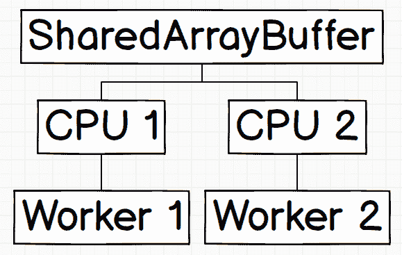

这是一种粗略的表示，你可以想象 `SharedArrayBuffer` 如何与底下的内存连接。现在，让我们假设每个线程都在不同的 CPU 上生成。

# 理解并行编程

并行编程，正如其名所示，就是以这种方式运行的一个程序，该程序的实例会同时多次运行。

另一方面，并发编程与并行编程非常相似，但不同之处在于任务永远不会同时发生。

# 并行与并发编程的区别

为了理解并行编程和并发编程之间的区别，让我们考虑一个例子。

假设有一个比赛，比赛内容是吃放在两个盘子上的糖果。盘子之间相距五米。现在，假设你是唯一的参赛者，约束条件是你必须保持两个盘子上的糖果数量差异小于两个。

你在这里会做什么？你必须从第一个盘子开始吃，跑到五米外的第二个盘子，从第二个盘子吃，然后再跑五米回到第一个盘子，以此类推。

现在，假设你有一个朋友。现在，你们两个人都可以选择一个盘子并开始吃自己的糖果。

尝试将其与并发编程和并行编程分别联系起来。在第一个例子中，你是 CPU 的核心，在这里到处运行，一次又一次，在两个线程（盘子）之间。你跑得很快，但由于你的物理限制，无论你多么努力，你都无法同时从两个盘子中取食。同样，在并发编程中，CPU 执行这两个任务，但它不是同时执行，而是分块执行。

在下一个例子中，对于并行编程，你的朋友就像另一个 CPU，完全处理另一个线程。这样，你们每个人只需要执行自己的线程。这就是并行性。

如果这说得通，那么让我们进入并行编程，这是 Web Workers 给我们带来的东西，以及如何利用并行编程中的共享内存来真正加快速度而不是减慢速度（因为当你做错的时候，这种情况经常发生）。

# 破除迷思——并行计算总是更快

似乎很直观地说，并行计算应该总是比单线程计算更快。就像 spawning two threads 应该，直观上，几乎可以减半计算时间。这不仅从数字上是错误的，而且如果做得不正确，并行计算会产生垃圾结果。

要理解这一点，可以考虑一个被分配任务将一堆积木从一个地方转移到另一个地方的人：


他以某种速度完成这项工作。带上另一个人可能听起来像是加倍工作的速度，但这两个人实际上可能在路上撞到一起，反而使事情变得更慢而不是更快。

当并行性实现不正确时，这种情况实际上经常发生，我们现在就会看到。

# 让我们数到十亿！

为了验证如果设置不当，并行计算实际上就是垃圾，让我们用 JavaScript 的单线程和多线程环境数到十亿。

让我们首先尝试单线程计数：

```js
// Main thread

const sharedMem = new SharedArrayBuffer(4);

function countSingleThread(limit) {
    const arr = new Uint32Array(sharedMem);
    for(let i=0; i<limit; i++) {
        arr[0] = arr[0] + 1;
    }
}

const now = performance.now();
countSingleThread(1000000000);
console.log(`Time Taken: ${performance.now() - now}`);
```

在我的 MacBook Air 上，这个程序运行需要 *∼2606* 毫秒。这大约是 *2.6* 秒：

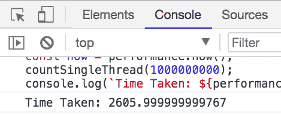

现在我们尝试将代码分配给两个工人，看看会发生什么：

```js
// Main thread

const sharedMem = new SharedArrayBuffer(4);
const workers = [new Worker('worker.js'), new Worker('worker.js')];
let oneWorkerDone = false;
const now = performance.now();

for(let i=0;i<2;i++) {
  workers[i].postMessage({message: 'sab', memory: sharedMem});

  workers[i].addEventListener('message', data => {
      if(!oneWorkerDone) {
        oneWorkerDone = true;
      } else {
        console.log("Both workers done. The memory is: ", new
        Uint32Array(sharedMem))
        console.log(`Time taken: ${performance.now()-now}`)
      }
  });

  workers[i].postMessage({cmd: 'start', iterations: 500000000});
}
```

好吧！那么这里到底发生了什么？以下是一个解释：

1.  我们创建了一个 `SharedArrayBuffer`，以便创建一个可以被两个生成的 Web 工人同时访问的内存存储区域。

1.  `SharedArrayBuffer` 的大小是 `4`，因为，为了将数字添加到整数数组中，我们将它转换为 `Uint32Array`，其大小是 `4` 的倍数。

1.  我们从同一个文件启动了两个 Web 工人。

1.  我们给了他们访问 `SharedArrayBuffer` 的权限。

1.  我们在主脚本中监听，当两个工人都说他们完成了。

1.  我们向每个工人发送了 5 亿次迭代，从而将这些工作分配给这两个线程。

现在我们来看看 `worker.js` 的样子：

```js
// worker.js
let sharedMem;

addEventListener('message', ({data}) => {
  //console.log(data);
    if(data.message == 'sab') {
        sharedMem = data.memory;
        console.log('Memory ready');
    }
    if(data.cmd == 'start') {
      console.log('Iterations ready');
        startCounting(data.iterations);
    }
});

function startCounting(limit) {
    const arr = new Uint32Array(sharedMem);
    for(let i=0;i<limit;i++) {
        arr[0] += 1;
    }
    postMessage('done')
}
```

在 `worker.js` 中，我们执行以下操作：

1.  监听来自主脚本的消息。

1.  检查消息是否指示存储 `SharedArrayBuffer`；如果是，我们就存储它。

1.  如果消息指示开始迭代，我们首先将其转换为 `Uint32Array`。

1.  在迭代之后，我们向主脚本发送一个友好的 'done' 消息，通知它我们已经完成。

**预期结果：**程序的速度将提高约 2 倍，因为每个线程都必须完成一半的工作。我们还期望最终值为一亿。

**现实情况：**测试 #1 如下所示。

首次运行前面的代码会产生以下结果：

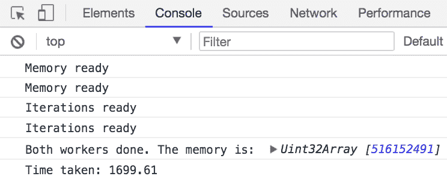

测试 #2 如下所示。

第二次运行前面的代码会产生以下结果：

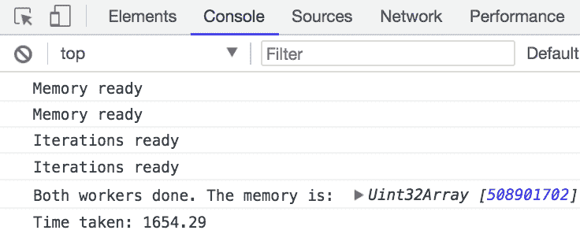

测试 #3 如下所示。

第三次运行前面的代码会产生以下结果：

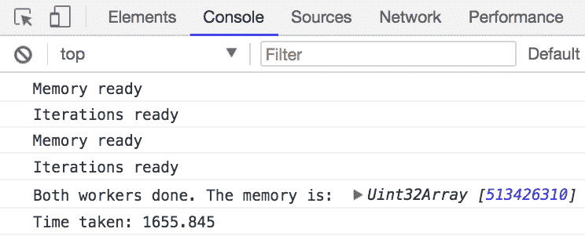

我得到了垃圾值！每次我运行程序，我都会得到不同的值，接近 5 亿。为什么会这样？

# 竞态条件

在前两个截图中的垃圾值代表了一个经典的竞态条件示例。你还记得我在 *SharedArrayBuffer 简介* 部分中展示的第一个图像吗？记得链接到 **CPU 1** 和 **CPU 2** 的 `SharedArrayBuffer`，它分别链接到 **Worker 1** 和 **Worker 2** 吗？好吧，结果证明这并不完全正确。

这是你在机器上的实际设置：

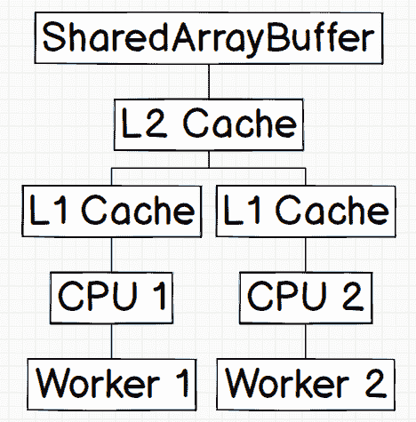

问题就出现在这里。竞态条件意味着 **CPU 1** 从共享内存中获取数据并发送给 **Worker 1**。与此同时，**CPU 2** 也获取了它，但它不知道 **CPU 1** 已经在处理它。所以，当 **Worker 1** 将值从 *0* 更改为 *1* 时，**CPU 2**，即 **Worker 2**，仍然在获取值 0。

**Worker 1** 然后将共享内存更新为 1 的值，然后 **Worker 2** 将其自己的副本更新为 1（因为它不知道 **CPU 1** 已经将其更新为 1），然后再次将其写入共享内存。

这里，我们成功地浪费了两个计算，而只需要一个。这是一个如何不进行并行处理的快速示例：

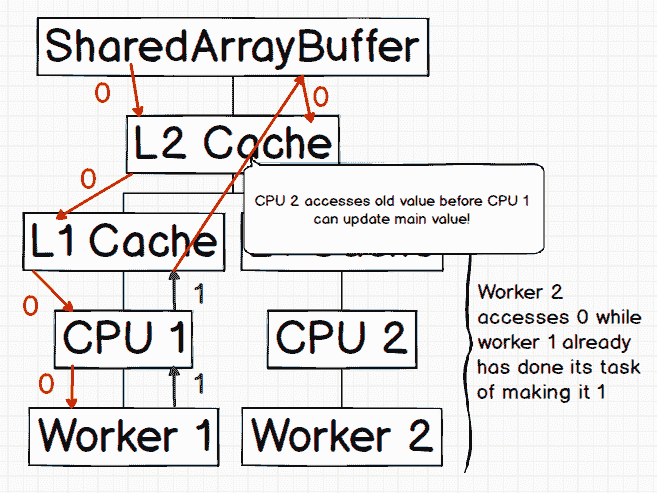

我们该如何解决这个问题？原子操作（我们将在本章后面的部分，即 *使用原子操作修复十亿计数* 部分中回到这个问题）。

# 原子操作是什么？

原子操作是什么？原子操作，或者更准确地说，一个原子操作，是一个一次性发生而不是分步骤发生的操作。它就像一个原子——不可分割的（尽管在技术上原子是可以分割的，但让我们不要破坏这个类比）。

原子操作是一个对所有其他工作线程可见的单个操作。它立即发生。它就像一条机器代码的执行，要么尚未完成，要么已经完成。中间没有其他状态。

简而言之，某物是原子的意味着一次只能对其执行一个操作。例如，更新一个变量可以使其成为原子的。这可以用来避免竞争条件。

# 锁和互斥锁的信息

当我说更新一个变量可以使其成为原子的，我的意思是，在某个线程访问该内存的期间，不应该允许其他线程访问它。这只有在你在访问的变量上引入锁或互斥锁（互斥排他）时才可能。这样，其他线程就知道该变量正在使用中，它应该等待锁被释放。

这样就可以进行原子操作。但这种安全感也伴随着代价。原子锁定不是一个可以忽略不计时间的操作，所以它肯定涉及一些开销。

做一亿次，你可能就完蛋了（我们很快将在 *使用原子操作修复一亿次计数* 中看到这一点）。

# JavaScript 中的 Atomics

JavaScript 有一个 `Atomics` 对象，它为我们提供了之前讨论过的确切功能。然而，它在某种程度上相当有限，因为你只能进行加法、减法、按位与、按位或、按位异或和存储。

其他功能可以建立在这些功能之上，未来将会有库提供这些功能。现在，让我们了解一下原生可用的方法。

# 使用 Atomics.load(typedArray, index) 方法

`Atomics.load` 方法返回一个特定索引值内类型数组的值。以下是使用方法：

```js
const sab = new SharedArrayBuffer(1);
const arr = new Uint8Array(sab);
arr[0] = 5;

console.log(Atomics.load(arr, 0));
```

上述代码只是线程安全地访问 `arr[0]` 的方式。

这会输出：

```js
5
```

# 使用 Atomics.add(typedArray, index, value) 方法

`Atomics.add` 是向类型数组中的特定索引添加特定值的方法。它很容易理解和编写：

```js
const sab = new SharedArrayBuffer(1);
const arr = new Uint8Array(sab);
arr[0] = 5;

console.log(Atomics.add(arr, 0, 10));
console.log(Atomics.load(arr, 0));
```

`Atomics.add` 又是执行 `arr[0] += 10` 的线程安全方式。

这会输出：

```js
5
15
```

`Atomics.add` 返回该索引处的旧值。在命令执行后，该索引处的值将被更新。

# 使用 Atomics.sub(typedArray, index, value) 方法

`Atomics.sub` 是从类型数组中特定索引减去特定值的方法。它也很容易使用：

```js
const sab = new SharedArrayBuffer(1);
const arr = new Uint8Array(sab);
arr[0] = 5;

console.log(Atomics.sub(arr, 0, 2));
console.log(Atomics.load(arr, 0));
```

`Atomics.sub` 又是执行 `arr[0] -= 2` 的线程安全方式。

这会输出：

```js
5
3
```

`Atomics.sub` 返回该索引处的旧值。在命令执行后，该索引处的值将被更新。

# 使用 Atomics.and(typedArray, index, value) 方法

`Atomics.and` 在类型数组中特定索引的值和您提供的值之间执行按位与运算：

```js
const sab = new SharedArrayBuffer(1);
const arr = new Uint8Array(sab);
arr[0] = 5; // 5 is 0101 in binary.

Atomics.and(arr, 0, 12); // 12 is 1100 in binary
console.log(Atomics.load(arr, 0));
```

`Atomics.and` 在这里执行 `arr[0]` 和数字 `12` 之间的按位与运算。

这会输出：

```js
4
```

# 按位与运算的工作原理

假设我们想要对 5 和 12 进行按位与运算：

1.  将两个数字转换为二进制；5 是 0101，12 是 1100。

1.  按位与运算从第一个位开始逐位执行 `AND` 操作：

    *5 & 12*

    *0 && 1 = 0*

    *1 && 1 = 1*

    *0 && 0 = 0*

    *1 && 0 = 0*

1.  因此，*5 && 12 = 0100*，这是 4。

# 使用 Atomics.or(typedArray, index, value) 方法

与按位与类似，`Atomics.or` 方法执行按位或操作：

```js
const sab = new SharedArrayBuffer(1);
const arr = new Uint8Array(sab);
arr[0] = 5; // 5 is 0101 in binary.

Atomics.or(arr, 0, 12); // 12 is 1100 in binary
console.log(Atomics.load(arr, 0));
```

在这里，`Atomics.or` 方法在 `arr[0]` 和数字 `12` 之间执行了按位或操作。

输出如下：

```js
13
```

# 按位或的工作原理

假设我们想要对 5 和 12 进行按位或操作：

1.  将两个数字都转换为二进制；5 是 0101，12 是 1100

1.  按位或操作是逐位进行或操作的，从第一个位开始：

    *5 | 12*

    *0 || 1 = 1*

    *1 || 1 = 1*

    *0 || 0 = 0*

    *1 || 0 = 1*

1.  因此，*5 | 12 = 1101*，即 13。

# 使用 Atomics.xor(typedArray, index, value) 方法

再次，`Atomics.xor` 方法执行按位异或操作，这是一种排他或操作（即，它是一个或门，当两个输入都是 `1` 时输出 `0`）

```js
const sab = new SharedArrayBuffer(1);
const arr = new Uint8Array(sab);
arr[0] = 5; // 5 is 0101 in binary.

Atomics.xor(arr, 0, 12); // 10 is 1100 in binary
console.log(Atomics.load(arr, 0));
```

`Atomics.xor` 这里在 `arr[0]` 和数字 `10` 之间执行了异或操作。

这会输出：

```js
9
```

# 按位异或的工作原理

假设我们想要对 5 和 12 进行按位异或操作：

1.  将两个数字都转换为二进制；5 是 0101，12 是 1100。

1.  按位异或操作是逐位进行的，从第一个位开始：

    *5 ^ 12*

    *0 ^ 1 = 1*

    *1 ^ 1 = 0*

    *0 ^ 0 = 0*

    *1 ^ 0 = 1*

1.  因此，*5 ^ 12 = 1001*，即 9。

在我们所需的关于原子操作的所有知识的基础上，让我们回到我们的一千亿计数问题，看看一个可能的解决方案。

# 使用原子操作修复一亿计数问题

现在我们知道了垃圾值的原因，并且，使用原子操作，应该很容易修复这个问题。对吗？不对。

使用原子锁定一亿次会有巨大的性能损失。现在让我们看看我们的更新后的 `worker.js` 代码：

```js
// worker.js
let sharedMem;

addEventListener('message', ({data}) => {
  //console.log(data);
    if(data.message == 'sab') {
        sharedMem = data.memory;
        console.log('Memory ready');
    }
    if(data.cmd == 'start') {
      console.log('Iterations ready');
        startCounting(data.iterations);
    }
});

function startCounting(limit) {
    const arr = new Uint32Array(sharedMem);
    for(let i=0;i<limit;i++) {
        Atomics.add(arr, 0, 1);
    }
    postMessage('done')
}
```

这与我们的先前实现类似，只是变化在于我们不是直接将其添加到数组中，而是在执行原子操作，这样在另一个线程添加值时，值不会被其他线程更改。

当然，这是一个漂亮的解决方案。它也有效：

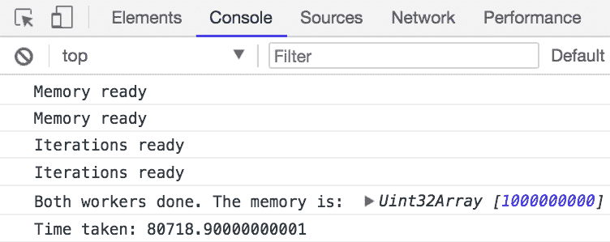

但看看那个时间：80 秒！这就是当你在一亿次锁定和解锁内存时得到的惩罚。

单线程更快，因为它可以从寄存器中快速访问局部变量值并使用它们。我们的性能较慢，因为我们正在获取共享内存的引用，锁定它，增加它，然后释放它。

让我们再读一遍。单线程更快，因为它可以从寄存器中快速访问局部变量值并使用它们。我们能做些什么吗？让我们看看！

# 优化的解决方案

为什么不结合原子操作和 CPU 寄存器中局部变量的速度优势呢？这里就是：

```js
// worker.js
let sharedMem;

addEventListener('message', ({data}) => {
  //console.log(data);
    if(data.message == 'sab') {
        sharedMem = data.memory;
        console.log('Memory ready');
    }
    if(data.cmd == 'start') {
      console.log('Iterations ready');
        startCounting(data.iterations);
    }
});

function startCounting(limit) {
    const arr = new Uint32Array(sharedMem);
    let count = 0;
    for(let i=0;i<limit;i++) {
        count += 1;
    }
    Atomics.add(arr, 0, count);
    postMessage('done')
}
```

在这里，从我们最后的实现中，我们将 `Atomics.add` 从循环中移除，以避免调用它一亿次。相反，我们在这个 web worker 内部的局部变量中执行分配给它的任务，并在完成后仅使用原子操作更新内存。这确保了在两个线程同时完成时不会发生覆盖。现在是时候查看输出结果了。

看看这些令人惊叹的结果：

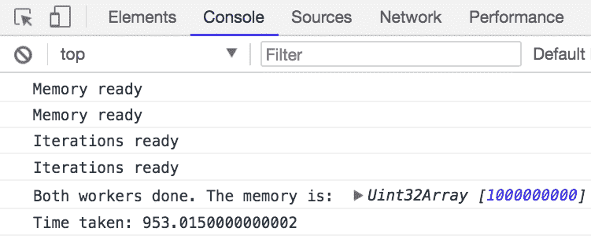

不到一秒！仅仅使用两个工作者就实现了大约 2.5 倍的提升！当我们正确实现了并行编程，我们能够超越预期的 2 倍加速，达到大约 2.5 倍！

等一下。故事还没有结束。让我们增加 4 个工作者，看看会发生什么：

```js
// Main Script

const sharedMem = new SharedArrayBuffer(4);
const workers = [new Worker('worker.js'), new Worker('worker.js'), new Worker('worker.js'), new Worker('worker.js')];
let workersDone = 0;

const now = performance.now();

for(let i=0;i<2;i++) {
  workers[i].postMessage({message: 'sab', memory: sharedMem});

  workers[i].addEventListener('message', data => {
      if(++workersDone == 4) { // don't worry. this is thread-safe ;)
        console.log("All workers done. The memory is: ", new Uint32Array(sharedMem))
        console.log(`Time taken: ${performance.now()-now}`)
      }
  });

  workers[i].postMessage({cmd: 'start', iterations: 1000000000/workers.length});
}
```

对看到结果感到兴奋吗？我也是！让我们看看：

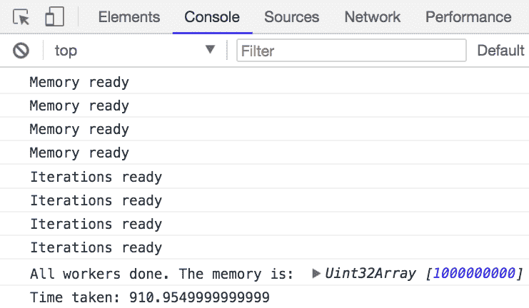

哎呀。嗯，这看起来并不是一个非常令人印象深刻的性能提升。从单线程到双线程是一个巨大的提升。为什么从双线程到四线程，提升不是一倍呢？

让我们看看“网络”标签页：

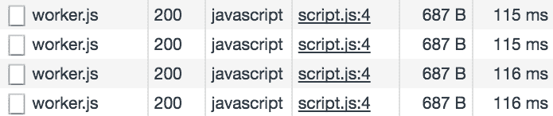

哈哈，我们好像找到了一个突破！看起来我们在总共 911 毫秒的程序执行时间中，有 462 毫秒是在仅仅下载`worker.js`文件上！这甚至不包括 JavaScript 引擎在下载后对每个单独脚本编译成机器代码的时间。

不幸的是，这就是我们能从我们这边做到的尽头。现在浏览器需要优化的是，如果单个文件在 web worker 中被反复调用，它应该从缓存中提取编译后的文件，这样它实际上可以使用一个已经编译的文件实例，而不是再次下载三次并重新编译。

在未来，如果 Chrome 根据前面的建议进行优化，我们可以说它将花费大约*~120*毫秒而不是 462 毫秒来下载和编译。

因此，我们的脚本在不久的将来，将花费大约~570 毫秒来计算到十亿。这是相对于单线程的 500%的性能提升。这就是 JavaScript 中的多线程，朋友们。

# 一瞥 Spectre

2018 年 1 月 3 日，我们发现了一个与我们过去 20 年使用的 CPU 架构相关的根本性缺陷。这动摇了现代安全的根基。虽然 Spectre 和 Meltdown 的工作原理非常复杂（如果你对安全领域感兴趣，这非常有趣），你现在需要知道的是，由于 Spectre，所有主要的浏览器供应商都默认禁用了`SharedArrayBuffer`。

你可以通过访问`chrome://flags`并搜索`SharedArrayBuffer`来启用`SharedArrayBuffer`。

禁用`SharedArrayBuffer`的原因是为了减轻 Spectre 的影响，这是一个危险但精心设计的漏洞，需要非常精确的时间测量来攻击。`SharedArrayBuffer`为多个线程提供了一种方式，使得每个线程都可以访问到，原子操作则提供了对数据的更多精确控制。这可以通过`SharedArrayBuffer`创建高度精确的时钟，可以用来执行 Spectre 攻击。

Spectre 主要利用了现代 CPU 预计算大量事情并将它们放入缓存的事实。所以，如果你发现你的程序不应该访问的内存部分被拒绝访问的速度比预期快得多，那么很可能，那个特定的内存块就在缓存中。使用精心制作的脚本，甚至可以知道缓存中存储了哪个值，因为你的程序是将其放入那里的！

哎！要真正地玩转 Spectre 和 Meltdown，需要很长的一章。但这将是另一天，另一本书的内容。这里的要点是，在撰写本章时，`SharedArrayBuffer` 在浏览器中默认未启用。当所有浏览器供应商都实施适当的补丁时，它将在未来启用。

这里有一些文章，适合那些觉得这类东西很酷的人：

+   如何 Spectre 工作：[`www.i-programmer.info/news/149-security/11449-how-spectre-works.html`](http://www.i-programmer.info/news/149-security/11449-how-spectre-works.html)

+   解释 Spectre 和 Meltdown：[`www.csoonline.com/article/3247868/vulnerabilities/spectre-and-meltdown-explained-what-they-are-how-they-work-whats-at-risk.html`](https://www.csoonline.com/article/3247868/vulnerabilities/spectre-and-meltdown-explained-what-they-are-how-they-work-whats-at-risk.html)

到那时，请保持安全！

# 摘要

不得不说，这现在是我的最爱章节，而**第四章，异步编程**则降至第二位。这项技术是原始的、新鲜的，等待被探索。

在本章中，我们关于 ES2017 学到了很多新知识，这些知识在不久的将来将成为用 JavaScript 编写的多线程程序的基础。好吧，就是这样！你现在已经成为一个了解 ES2017（即 ES8）以及更多未来技术的优秀开发者了。运用你的力量，让这个世界变得更美好！
