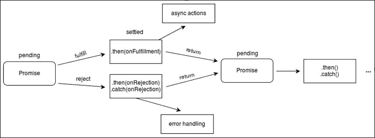

# 第四章 异步编程

ES6 引入了对知名编程模式的原生支持。其中一种模式是 Promise 模式，它使得异步代码的读写更加容易。在本章中，我们将学习如何使用 ES6 Promise API 编写异步代码。新的 JavaScript 和 HTML5 异步 API 现在正通过 Promise 实现，以简化代码的编写。因此，深入学习 Promise 非常重要。我们还将看到一些使用 Promise 公开的示例 API，例如**Web Cryptography API**和**Battery Status API**。

在本章中，我们将涵盖：

+   JavaScript 执行模型

+   编写异步代码时遇到的困难

+   创建 Promise 及其工作原理

+   Promise 如何简化异步代码的编写

+   Promise 的不同状态

+   Promise 对象的各种方法。

+   使用 Promise 的 JavaScript 和 HTML5 API

# JavaScript 执行模型

JavaScript 代码是在单线程中执行的，也就是说，两段脚本不能同时运行。浏览器中打开的每个网站都会获得一个用于下载、解析和执行网站的单独线程，称为主线程。

主线程还维护一个队列，该队列包含排队等待依次执行的任务。这些排队任务可以是事件处理器、回调函数或任何其他类型的任务。当发生 AJAX 请求/响应、事件发生、注册计时器等情况时，新任务会被添加到队列中。一个长时间运行的队列任务可能会停止所有其他队列任务和主脚本的执行。主线程会在可能的情况下执行队列中的任务。

### 注意

HTML5 引入了**Web Workers**，它们是与主线程并行运行的线程。当 Web Worker 完成执行或需要通知主线程时，它只需将一个新的事件项添加到队列中。

这个队列使得异步执行代码成为可能。

# 编写异步代码

ES5 原生支持两种编写异步代码的模式，即事件模式和回调模式。在编写异步代码时，我们通常启动一个异步操作并注册事件处理器或传递回调函数，这些函数将在操作完成后执行。

根据特定的异步 API 设计，使用事件处理器或回调函数。为事件模式设计的 API 可以通过一些自定义代码包装成回调模式，反之亦然。例如，AJAX 是为事件模式设计的，但**jQuery** AJAX 将其暴露为回调模式。

让我们考虑一些涉及事件和回调的异步代码编写示例及其困难。

## 涉及事件的异步代码

对于涉及事件的异步 JavaScript API，你需要注册成功和错误事件处理器，它们将根据操作是否成功而分别执行。

例如，在发起 AJAX 请求时，我们注册的事件处理器将根据 AJAX 请求是否成功而执行。考虑以下发起 AJAX 请求并记录检索信息的代码片段：

```js
function displayName(json)
{
  try
  {
    //we usally display it using DOM
    console.log(json.Name);
  }
  catch(e)
  {
    console.log("Exception: " + e.message);
  }
}
function displayProfession(json)
{
  try
  {
    console.log(json.Profession);
  }
  catch(e)
  {
    console.log("Exception: " + e.message);
  }
}

function displayAge(json)
{
  try
  {
    console.log(json.Age);
  }
  catch(e)
  {
    console.log("Exception: " + e.message);
  }
}

function displayData(data)
{
  try
  {
    var json = JSON.parse(data);

    displayName(json);
    displayProfession(json);
    displayAge(json);
  }
  catch(e)
  {
    console.log("Exception: " + e.message);
  }
}

var request = new XMLHttpRequest();
var url = "data.json";

request.open("GET", url);
request.addEventListener("load", function(){
  if(request.status === 200)
  {
    displayData(request.responseText);
  }
  else
  {
    console.log("Server Error: " + request.status);
  }
}, false);

request.addEventListener("error", function(){
  console.log("Cannot Make AJAX Request");
}, false);

request.send();
```

在这里，我们假设 `data.json` 文件包含以下内容：

```js
{
  "Name": "Eden",
  "Profession": "Developer",
  "Age": "25"
}
```

`XMLHttpRequest` 对象的 `send()` 方法是异步执行的，它检索 `data.json` 文件并调用 `load` 或 `error` 事件处理器，具体取决于请求是否成功。

对于 AJAX 的工作方式，绝对没有任何问题，但问题在于我们编写涉及事件处理的代码。以下是我们在编写前一段代码时遇到的问题：

+   我们不得不为每个将要异步执行的代码块添加异常处理器。我们不能只用一个 `try…catch` 语句来包裹整个代码。这使得捕获异常变得困难。

+   代码的可读性较差，因为嵌套的函数调用使得代码流程难以追踪。

+   如果程序的其他部分想要知道异步操作是否已完成、挂起或正在执行，那么我们必须维护用于此目的的自定义变量。因此，我们可以说找到异步操作的状态是困难的。

如果你在嵌套多个 AJAX 或其他任何异步操作，这段代码可能会变得更加复杂和难以阅读。例如，在显示数据后，你可能希望让用户验证数据是否正确，然后将布尔值发送回服务器。以下是一个代码示例，演示了这一过程：

```js
function verify()
{
  try
  {
    var result = confirm("Is the data correct?");
    if (result == true)
    {
      //make AJAX request to send data to server
    }
    else
    {
      //make AJAX request to send data to server
    }
  }
  catch(e)
  {
    console.log("Exception: " + e.message);
  }
}

function displayData(data)
{
  try
  {
    var json = JSON.parse(data);

    displayName(json);
    displayProfession(json);
    displayAge(json);

    verify();
  }
  catch(e)
  {
    console.log("Exception: " + e.message);
  }
}
```

## 涉及回调的异步代码

对于涉及回调的异步 JavaScript API，你需要传递成功和错误回调，它们将根据操作是否成功或失败而分别被调用。

例如，在使用 jQuery 进行 AJAX 请求时，我们需要传递回调函数，这些函数将根据 AJAX 请求是否成功而执行。考虑以下使用 jQuery 进行 AJAX 请求并记录检索信息的代码片段：

```js
function displayName(json)
{
  try
  {
    console.log(json.Name);
  }
  catch(e)
  {
    console.log("Exception: " + e.message);
  }
}

function displayProfession(json)
{
  try
  {
    console.log(json.Profession);
  }
  catch(e)
  {
    console.log("Exception: " + e.message);
  }
}

function displayAge(json)
{
  try
  {
    console.log(json.Age);
  }
  catch(e)
  {
    console.log("Exception: " + e.message);
  }
}

function displayData(data)
{
  try
  {
    var json = JSON.parse(data);

    displayName(json);
    displayProfession(json);
    displayAge(json);
  }
  catch(e)
  {
    console.log("Exception: " + e.message);
  }
}

$.ajax({url: "data.json", success: function(result, status, responseObject){
    displayData(responseObject.responseText);
}, error: function(xhr,status,error){
    console.log("Cannot Make AJAX Request. Error is: " + error);
}});
```

即使在这里，jQuery AJAX 的工作方式绝对没有任何问题，但问题在于我们编写涉及回调的代码。以下是我们在编写前一段代码时遇到的问题：

+   捕获异常很困难，因为我们不得不使用多个 `try` 和 `catch` 语句。

+   代码的可读性较差，因为嵌套的函数调用使得代码流程难以追踪。

+   维护异步操作的状态很困难。

即使这样，如果我们在嵌套多个 jQuery AJAX 或其他任何异步操作，代码也会变得更加复杂。

# 承诺拯救

ES6 引入了一种新的本地模式来编写异步代码，称为 Promise 模式。

这种新的模式消除了事件和回调模式中常见的代码问题。它还使代码看起来更像同步代码。

Promise（或 Promise 对象）表示一个异步操作。现有的异步 JavaScript API 通常用 Promise 包装，新的 JavaScript API 正在纯使用 Promise 实现。

Promise 在 JavaScript 中是新的，但已经在许多其他编程语言中存在。例如，支持 Promise 的编程语言有 C# 5、C++ 11、Swift、Scala 等。

ES6 提供了 Promise API，我们可以使用它创建 Promise 并使用它。让我们探索 ES6 的 Promise API。

## Promise 构造函数

使用`Promise`构造函数来创建新的 Promise 实例。Promise 对象表示一个异步操作。

我们需要将一个回调函数传递给`Promise`构造函数，该函数执行异步操作。这个回调函数被称为**执行器**。执行器应该接受两个参数，即`resolve`和`reject`回调。如果异步操作成功，则应执行`resolve`回调，如果操作失败，则应执行`reject`回调。如果异步操作成功并且有一个结果，则我们可以将异步操作的结果传递给`resolve`回调。如果异步操作失败，则我们可以将失败原因传递给`reject`回调。

这里有一个代码示例，演示了如何创建一个 Promise 并使用它包装一个 AJAX 请求：

```js
var promise = new Promise(function(resolve, reject){

  var request = new XMLHttpRequest();
  var url = "data.json";

  request.open("GET", url);

  request.addEventListener("load", function(){
    if(request.status === 200)
    {
      resolve(request.responseText);
    }
    else
    {
      reject("Server Error: " + request.status);
    }
  }, false);

  request.addEventListener("error", function(){
    reject("Cannot Make AJAX Request");
  }, false);

  request.send();

});
```

执行器是同步执行的。但是执行器正在执行一个异步操作，因此，执行器可以在异步操作完成之前返回。

Promise 始终处于以下状态之一：

+   **已履行**：如果`resolve`回调以非 Promise 对象作为参数调用或没有参数，那么我们说 Promise 已履行

+   **已拒绝**：如果调用`reject`回调或执行器作用域中发生异常，那么我们说 Promise 已拒绝

+   **挂起**：如果`resolve`或`reject`回调尚未被调用，那么我们说 Promise 是挂起的

+   **已解决**：如果 Promise 要么已履行要么已拒绝，但不是挂起，则称 Promise 已解决

一旦 Promise 被履行或拒绝，它就不能再回退。尝试转换它将没有效果。

### 注意

如果`resolve`回调以 Promise 对象作为参数调用，那么 Promise 对象要么已履行，要么已拒绝，具体取决于传递的 Promise 对象是已履行还是已拒绝。

## 履行值

已履行 Promise 的履行值表示成功异步操作的结果。

如果我们传递给`resolve`回调函数的参数不是另一个 Promise 对象，那么这个参数本身就被视为 Promise 对象的完成值。

如果我们没有向`resolve`回调函数传递任何内容，那么完成值被视为`undefined`，并且 Promise 被认为是完成的。

要了解当我们将 Promise 对象作为参数传递给`resolve`回调函数时会发生什么，请考虑以下示例——假设我们有一个名为 A 的 Promise。当通过传递 Promise B 作为参数调用 Promise A 的`resolve`回调函数时，如果 Promise B 被完成，那么 Promise A 也被认为是完成的，并且 Promise A 的完成值现在与 Promise B 的完成值相同。

考虑以下代码示例：

```js
var a = new Promise(function(resolve, reject){
  var b = new Promise(function(res, rej){
    rej("Reason");
  });

  resolve(b);
});

var c = new Promise(function(resolve, reject){
  var d = new Promise(function(res, rej){
    res("Result");
  });

  resolve(d);
});
```

在前面的例子中，由于 Promise B 被拒绝，因此 Promise A 也被拒绝。两个 Promise 拒绝的原因是字符串`"Reason"`。同样，如果 D 被完成，那么 C 也会被完成。C 和 D 的完成值是字符串`"Result"`。

### 注意

当我们说“Promise 以某个值解决，或者被某个值解决”时，这意味着 Promise 的执行者调用了或已经调用了`resolve`回调函数，并传递了该值。

## `then(onFulfilled, onRejected)`方法

Promise 对象的`then()`方法允许我们在 Promise 完成或拒绝后执行一些任务。这个任务也可以是另一个事件驱动或基于回调的异步操作。

Promise 对象的`then()`方法接受两个参数，即`onFulfilled`和`onRejected`回调函数。如果 Promise 对象被完成，则执行`onFulfilled`回调函数；如果 Promise 被拒绝，则执行`onRejected`回调函数。

如果在执行者作用域中抛出异常，则也会执行`onRejected`回调函数。因此，它表现得像一个异常处理器，即它捕获异常。

`onFulfilled`回调函数接受一个参数，即 Promise 的完成值。同样，`onRejected`回调函数接受一个参数，即拒绝的原因。

传递给`then()`方法的回调函数是异步执行的。

下面是演示`then()`方法的代码示例：

```js
var promise = new Promise(function(resolve, reject){
  var request = new XMLHttpRequest();
  var url = "data.json";
  request.open("GET", url);
  request.addEventListener("load", function(){
    if(request.status === 200)
    {
      resolve(request.responseText);
    }
    else
    {
      reject("Server Error: " + request.status);
    }
  }, false);
  request.addEventListener("error", function(){
    reject("Cannot Make AJAX Request");
  }, false);

  request.send();
});

promise.then(function(value){
  value = JSON.parse(value);
  return value;
}, function(reason){
  console.log(reason);
});
```

在这里，如果 AJAX 请求成功（即 Promise 被完成），则通过传递响应文本作为参数执行`onFulfilled`回调函数。`onFulfilled`回调函数将 JSON 字符串转换为 JavaScript 对象。`onFulfilled`回调函数返回 JavaScript 对象。

许多程序员移除了 Promise 对象变量，并这样编写前面的代码：

```js
function ajax()
{
  return new Promise(function(resolve, reject){
    var request = new XMLHttpRequest();
    var url = "data.json";
    request.open("GET", url);
    request.addEventListener("load", function(){
      if(request.status === 200)
      {
        resolve(request.responseText);
      }
      else
      {
        reject("Server Error: " + request.status);
      }
    }, false);
    request.addEventListener("error", function(){
      reject("Cannot Make AJAX Request");
    }, false);

    request.send();
  });
}

ajax().then(function(value){
  value = JSON.parse(value);
  return value;
}, function(reason){
  console.log(reason);
});
```

这种风格使代码更容易阅读。所有使用 Promises 实现的新的 JavaScript API 都采用这种模式。

`then()`方法始终返回一个新的`promise`对象，该对象解决调用回调函数的返回值。以下是`then()`方法返回新的`promise`对象的方式：

+   如果`onFulfilled`回调被调用，并且其中没有返回语句，那么内部会创建一个新的已解决的`Promise`并返回。

+   如果`onFulfilled`回调被调用，并且我们返回一个自定义`Promise`，那么它会内部创建并返回一个新的`promise`对象。新`Promise`对象解析为自定义`Promise`对象。

+   如果`onFulfilled`回调被调用，并且我们返回的不是自定义`Promise`，那么也会内部创建一个新的`Promise`对象并返回。新`Promise`对象解析为返回值。

+   如果我们传递`null`而不是`onFulfilled`回调，那么内部会创建一个回调并替换为`null`。内部创建的`onFulfilled`返回一个新的已解决的`promise`对象。新`promise`对象的解决值与父`Promise`的解决值相同。

+   如果`onRejected`回调被调用，并且其中没有返回语句，那么内部会创建一个新的被拒绝的`Promise`并返回。

+   如果`onRejected`回调被调用，并且我们返回一个自定义`Promise`，那么它会内部创建并返回一个新的`promise`对象。新`promise`对象解析为自定义`Promise`对象。

+   如果`onRejected`回调被调用，并且我们返回的不是自定义`Promise`，那么内部也会创建一个新的`promise`对象并返回。新`promise`对象解析为返回的值。

+   如果我们传递`null`而不是`onRejected`回调，或者省略它，那么内部会创建一个回调并使用它。内部创建的`onRejected`回调返回一个新的被拒绝的`promise`对象。新`promise`对象被拒绝的原因与父`Promise`被拒绝的原因相同。

在之前的代码示例中，我们还没有将检索到的数据记录到控制台。我们可以通过链式连接`Promise`来实现这一点。此外，在之前的代码中，我们没有处理`onFulfilled`回调中可能发生的异常。以下是我们可以如何扩展代码来记录数据和处理所有链式`onFulfilled`回调的异常：

```js
function ajax()
{
  return new Promise(function(resolve, reject){
    var request = new XMLHttpRequest();
    var url = "data.json";
    request.open("GET", url);
    request.addEventListener("load", function(){
      if(request.status === 200)
      {
        resolve(request.responseText);
      }
      else
      {
        reject("Server Error: " + request.status);
      }
    }, false);
    request.addEventListener("error", function(){
      reject("Cannot Make AJAX Request");
    }, false);

    request.send();
  });
}

ajax().then(function(value){
  value = JSON.parse(value);
  return value;
}).then(function(value){
  console.log(value.Name);
  return value;
}).then(function(value){
  console.log(value.Profession);
  return value;
}).then(function(value){
  console.log(value.Age);
  return value;
}).then(null, function(reason){
  console.log(reason);
});
```

在这个代码示例中，我们使用`then()`方法链式连接多个`Promise`，以解析和记录链中第一个`Promise`的执行者接收到的响应。在这里，最后一个`then()`方法被用作所有`onFulfilled`方法和执行者的异常或错误处理器。

这里有一张图展示了多个链式`Promise`的执行方式：



图片由 MDN 提供

让我们继续向链中添加一个事件驱动的异步操作，即验证显示的数据是否正确。以下是我们可以如何扩展代码来完成此操作：

```js
function ajax()
{
  return new Promise(function(resolve, reject){
    var request = new XMLHttpRequest();
    var url = "http://localhost:8888/data.json";
    request.open("GET", url);
    request.addEventListener("load", function(){
      if(request.status === 200)
      {
        resolve(request.responseText);
      }
      else
      {
        reject("Server Error: " + request.status);
      }
    }, false);
    request.addEventListener("error", function(){
      reject("Cannot Make AJAX Request");
    }, false);

    request.send();
  });
}

function verify(value)
{
  return new Promise(function(resolve, reject){
    if(value == true)
    {
      //make AJAX request to send data to server
    }
    else
    {
      //make AJAX request to send data to server
    }
  });
}

ajax().then(function(value){
  value = JSON.parse(value);
  return value;
}).then(function(value){
  console.log(value.Name);
  return value;
}).then(function(value){
  console.log(value.Profession);
  return value;
}).then(function(value){
  console.log(value.Age);
  return value;
}).then(function(value){
  var result = confirm("Is the data correct?");
  return result;
}).then(verify).then(null, function(reason){
  console.log(reason);
});
```

现在我们可以看到，将 AJAX 操作用`Promise`包装使代码更容易阅读和编写。现在代码一开始看起来就更容易理解。

## catch(onRejected)方法

当我们只使用`then()`方法来处理错误和异常时，使用`promise`对象的`catch()`方法代替`then()`方法。`catch()`方法的工作方式并没有什么特别之处。它只是使代码更容易阅读，因为“catch”这个词使其更有意义。

`catch()`方法只接受一个参数，即`onRejected`回调。`catch()`方法的`onRejected`回调以与`then()`方法的`onRejected`回调相同的方式被调用。

`catch()`方法始终返回一个`Promise`。以下是`catch()`方法如何返回一个新的`promise`对象：

+   如果`onRejected`回调中没有返回语句，那么内部会创建一个新的实现`Promise`并返回。

+   如果我们返回一个自定义`Promise`，那么它内部创建并返回一个新的`promise`对象。新`promise`对象解析自定义`promise`对象。

+   如果在`onRejected`回调中返回除自定义`Promise`之外的其他内容，那么也会内部创建一个新的`promise`对象并返回。新`promise`对象解析返回的值。

+   如果我们传递`null`而不是`onRejected`回调，或者省略它，那么内部会创建一个回调并使用它代替。内部创建的`onRejected`回调返回一个拒绝的`promise`对象。新`promise`对象拒绝的原因与父`promise`对象拒绝的原因相同。

+   如果被`catch()`调用的`promise`对象得到实现，那么`catch()`方法简单地返回一个新的实现`promise`对象，并忽略`onRejected`回调。新`promise`对象的成功值与父`Promise`的成功值相同。

要理解`catch()`方法，考虑以下代码：

```js
promise.then(null, function(reason){
});
```

这段代码可以使用`catch()`方法重写为以下方式：

```js
promise.catch(function(reason){
});
```

这两个代码片段工作方式完全相同。

让我们通过用`catch()`方法替换最后一个链式`then()`方法来重写 AJAX 代码示例：

```js
function ajax()
{
  return new Promise(function(resolve, reject){
    var request = new XMLHttpRequest();
    var url = "data.json";
    request.open("GET", url);
    request.addEventListener("load", function(){
      if(request.status === 200)
      {
        resolve(request.responseText);
      }
      else
      {
        reject("Server Error: " + request.status);
      }
    }, false);
    request.addEventListener("error", function(){
      reject("Cannot Make AJAX Request");
    }, false);

    request.send();
  });
}

function verify(value)
{
  return new Promise(function(resolve, reject){
    if(value == true)
    {
      //make AJAX request to send data to server
    }
    else
    {
      //make AJAX request to send data to server
    }
  });
}

ajax().then(function(value){
  value = JSON.parse(value);
  return value;
}).then(function(value){
  console.log(value.Name);
  return value;
}).then(function(value){
  console.log(value.Profession);
  return value;
}).then(function(value){
  console.log(value.Age);
  return value;
}).then(function(value){
  var result = confirm("Is the data correct?");
  return result;
}).then(verify)
.catch(function(reason){
  console.log(reason);
});
```

现在代码在第一眼看起来就更容易阅读了。

## `Promise.resolve(value)`方法

`Promise`对象的`resolve()`方法接受一个值，并返回一个解析传递值的`promise`对象。

`resolve()`方法基本上用于将一个值转换为`promise`对象。当你发现自己有一个可能或可能不是`Promise`的值，但你想将其用作`Promise`时，它很有用。例如，jQuery Promises 与 ES6 Promises 有不同的接口。因此，你可以使用`resolve()`方法将 jQuery Promises 转换为 ES6 Promises。

这里是一个代码示例，演示了如何使用`resolve()`方法：

```js
var p1 = Promise.resolve(4);
p1.then(function(value){
  console.log(value);
});

//passed a promise object
Promise.resolve(p1).then(function(value){
  console.log(value);
});

Promise.resolve({name: "Eden"}).then(function(value){
  console.log(value.name);
});
```

输出如下：

```js
4
4
Eden
```

## `Promise.reject(value)`方法

`Promise`对象的`reject()`方法接受一个值，并返回一个带有传递值的拒绝`promise`对象。

与 `Promise.resolve()` 方法不同，`reject()` 方法用于调试目的，而不是将值转换为 Promises。

下面是一个代码示例，演示如何使用 `reject()` 方法：

```js
var p1 = Promise.reject(4);
p1.then(null, function(value){
  console.log(value);
});

Promise.reject({name: "Eden"}).then(null, function(value){
  console.log(value.name);
});
```

输出如下：

```js
4
Eden
```

## Promise.all(iterable) 方法

`Promise` 对象的 `all()` 方法接受一个可迭代对象作为参数，并在可迭代对象中的所有 Promise 都被实现时返回一个实现的 Promise。

这在我们在一些异步操作完成后想要执行一些任务时非常有用。

下面是一个代码示例，演示如何使用 `Promise.all()` 方法：

```js
var p1 = new Promise(function(resolve, reject){
  setTimeout(function(){
    resolve();
  }, 1000);
});

var p2 = new Promise(function(resolve, reject){
  setTimeout(function(){
    resolve();
  }, 2000);
});

var arr = [p1, p2];

Promise.all(arr).then(function(){
  console.log("Done"); //"Done" is logged after 2 seconds
});
```

如果可迭代对象包含一个不是 `promise` 对象的值，那么它将使用 `Promise.resolve()` 方法转换为 Promise 对象。

如果传递的任何一个 Promise 被拒绝，那么 `Promise.all()` 方法会立即返回一个新的被拒绝的 Promise，其拒绝原因与被拒绝的传递的 Promise 相同。以下是一个演示此功能的示例：

```js
var p1 = new Promise(function(resolve, reject){
  setTimeout(function(){
    reject("Error");
  }, 1000);
});

var p2 = new Promise(function(resolve, reject){
  setTimeout(function(){
    resolve();
  }, 2000);
});

var arr = [p1, p2];

Promise.all(arr).then(null, function(reason){
  console.log(reason); //"Error" is logged after 1 second
});
```

## Promise.race(iterable) 方法

`Promise` 对象的 `race()` 方法接受一个可迭代对象作为参数，并返回一个 Promise，该 Promise 在可迭代对象中的任何一个 Promise 被实现或拒绝时立即实现或拒绝，其实现值或原因来自那个 Promise。

如其名所示，`race()` 方法用于在多个 Promise 之间进行竞争，以查看哪个先完成。

下面是一个代码示例，展示如何使用 `race()` 方法：

```js
var p1 = new Promise(function(resolve, reject){
  setTimeout(function(){
    resolve("Fulfillment Value 1");
  }, 1000);
});

var p2 = new Promise(function(resolve, reject){
  setTimeout(function(){
    resolve("fulfillment Value 2");
  }, 2000);
});

var arr = [p1, p2];

Promise.race(arr).then(function(value){
  console.log(value); //Output "Fulfillment value 1"
}, function(reason){
  console.log(reason);
});
```

# 基于 Promises 的 JavaScript API

新的异步 JavaScript API 现在基于 Promise 模式，而不是事件和回调。旧 JavaScript API 的新版本现在也基于 Promises。

例如，旧版本的电池状态 API 和 Web 加密 API 基于事件，但这些 API 的新版本完全使用 Promises 实现。让我们看看这些 API 的概述。

## 电池状态 API

电池状态 API 提供了电池的当前充电水平和充电状态。以下是一个新电池状态 API 的代码示例：

```js
navigator.getBattery().then(function(value){
  console.log("Batter Level: " + (value.level * 100));
}, function(reason){
  console.log("Error: " + reason);
});
```

`navigator` 对象的 `getBattery()` 方法在成功检索电池信息时返回一个实现的 Promise。否则，它返回一个被拒绝的 Promise。

如果 Promise 被实现，那么实现值是一个包含电池信息的对象。实现值的 `level` 属性表示剩余的充电水平。

## Web 加密 API

Web 加密 API 允许我们进行哈希、签名生成和验证、加密和解密。

下面是新 Web 加密 API 的代码示例：

```js
function convertStringToArrayBufferView(str)
{
    var bytes = new Uint8Array(str.length);
    for (var iii = 0; iii < str.length; iii++)
    {
        bytes[iii] = str.charCodeAt(iii);
    }

    return bytes;
}

function convertArrayBufferToHexaDecimal(buffer)
{
    var data_view = new DataView(buffer)
    var iii, len, hex = '', c;

    for(iii = 0, len = data_view.byteLength; iii < len; iii++)
    {
        c = data_view.getUint8(iii).toString(16);
        if(c.length < 2)
        {
            c = '0' + c;
        }

        hex += c;
    }

    return hex;
}

window.crypto.subtle.digest({name: "SHA-256"}, convertStringToArrayBufferView("ECMAScript 6")).then(function(result){
  var hash_value = convertArrayBufferToHexaDecimal(result);
  console.log(hash_value);
});
```

在此代码示例中，我们将找到一个字符串的 SHA-256 哈希值。

`window.crypto.subtle.digest` 方法接收一个字符串的数组缓冲区和哈希算法名称，并返回一个 Promise 对象。如果成功生成了哈希值，则返回一个已解决的 Promise，其解决值是一个表示哈希值的数组缓冲区。

# 摘要

在本章中，我们学习了 JavaScript 如何执行异步代码。我们了解了编写异步代码的不同模式。我们看到了 Promises 如何使异步代码的读写更加容易，以及如何使用 ES6 Promise API。我们还看到了一些基于 Promises 的 JavaScript API。总的来说，本章旨在解释 Promises、它们的优点以及如何使用基于它们的 API。

在下一章中，我们将学习 ES6 Reflect API 及其用法。
