# 第二章 创建基本元素

在上一章中，你学习了关于**Google Apps Script**（**GAS**）以及如何创建脚本项目。在本章中，你将学习如何创建可点击按钮、自定义菜单、消息框、侧边栏和对话框，以及如何调试你的脚本。我们将使用 Sheets 来完成前两个任务，而其他所有任务将使用 Docs。

# 创建可点击按钮

在上一章中，你学习了如何在 Google Sheets 中打开脚本编辑器。对于这个任务，在新建或任何现有 Google Sheet 中打开脚本编辑器，并按照以下步骤操作：

1.  选择单元格*B3*或任何其他单元格。点击**插入**并选择**绘图…**，如下面的截图所示：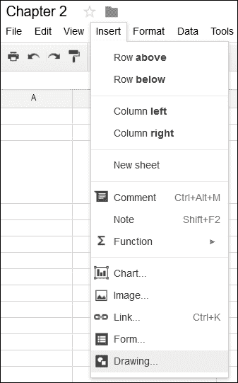

1.  将会打开一个绘图编辑器窗口。点击**文本框**图标，然后在画布区域内点击任意位置。输入`Click Me`。调整对象大小以仅包含文本，如下面的截图所示：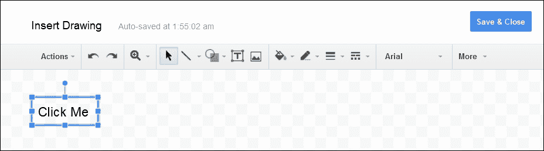

1.  点击**保存并关闭**以退出绘图编辑器。现在，**点击我**图片将被插入到活动单元格（*B3*），如下面的截图所示：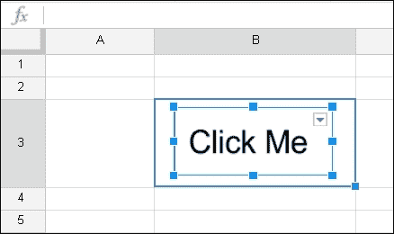

    你可以将此图片拖动到工作表中的任何位置，除了菜单栏。

    ### 小贴士

    在 Google Sheets 中，图片不会锚定到特定的单元格，并且可以被拖动或移动。

    如果你点击图片，右上角将出现一个下拉箭头：

    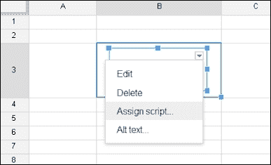

1.  点击**分配脚本…**菜单项。一个脚本分配窗口将会打开。输入`greeting`或任何你喜欢的名字，但请记住这个名称，因为在下一步中将会使用相同的名称来创建一个函数。点击**确定**：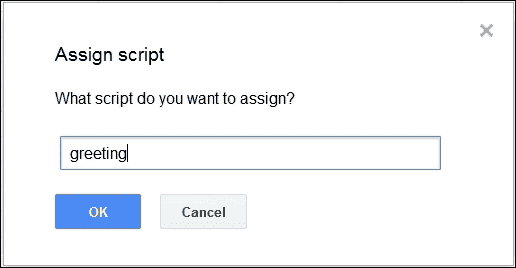

1.  现在在同一个工作表中打开脚本编辑器。当你打开脚本编辑器时，一个项目选择对话框将会打开。你可以关闭它或选择**空白项目**。编辑器中将会有一个默认函数`myFunction`。删除编辑器中的所有内容，并插入以下代码：

    ```js
    function greeting() {
      Browser
    }
    ```

    当你在“浏览器”旁边输入`.`时，代码补全提示将会打开，如下所示：

    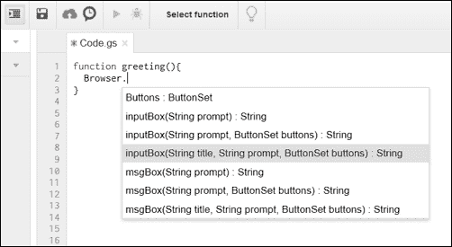

    如果你点击`msgBox(String title, String prompt, ButtonSet buttons):String`，那么`msgBox(title, prompt, buttons)`将会自动插入。

    ### 小贴士

    除了代码提示功能外，你还可以使用自动缩进功能。确保在**保存**图标左侧的**缩进**图标被按下。选择你想要缩进的几行代码，然后按下键盘上的*Tab*键。现在你可以看到这些代码行已经自动缩进了。

    在此代码中，`Browser`表示您正在从`Base`（或基本）脚本服务中调用`Browser`类。`msgBox`是`Browser`类的具有三个参数的方法。参数的名称是自解释的。`title`参数表示消息框的标题，`prompt`表示您对用户的消息，而`buttons`表示您希望在消息框中包含的按钮类别或按钮集。

1.  现在编辑或替换以下代码：

    ```js
    function greeting() {
      Browser.msgBox("Greeting", "Hello World!", Browser.Buttons.OK);
    }
    ```

1.  点击**保存**图标，如果需要，请输入项目名称。您已完成了`greeting`函数的编码。

1.  现在，激活电子表格标签/窗口，并点击您的**点击我**按钮。将打开一个授权窗口，您需要点击**继续**。在随后的**请求权限**窗口中，点击**允许**，如图所示：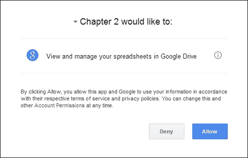

    您只需为此特定范围执行此操作一次。范围将在相关的权限对话框/窗口中显示。在此脚本中，范围是**在 Google Drive 中查看和管理您的电子表格**。在范围上方，您可以看到标题**第二章希望：**，这意味着您的脚本项目（项目名称**第二章**）或应用程序希望为此特定范围获取您的权限。

    一旦您点击**允许**，权限对话框将关闭，您的实际问候消息框将如以下所示打开：

    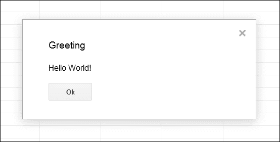

    点击**确定**关闭消息框。每次您点击按钮时，此消息框都会打开。

恭喜！您已创建了一个可点击的按钮，并将其与 GAS 函数关联。

# 点击按钮时显示提示

提示作为带有标题和消息的弹出窗口出现在活动电子表格的右下角。要创建提示对话框，编辑或替换`greeting`函数如下：

```js
function greeting() {
  SpreadsheetApp.getActiveSpreadsheet()
   .toast("Hello World!", "Greeting");
}
```

现在如果您点击该按钮，则会出现一个类似于以下截图的提示对话框，并在 5 秒内消失（默认）：

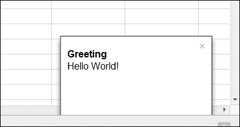

您可以在`toast`方法中包含第三个参数，即超时秒数。这意味着提示将可见多长时间。如果您想让它永远显示，请输入一个负数。例如，`toast("Hello World!", "Greeting", -1)`。

### 小贴士

提示仅适用于表格。

# 创建自定义菜单

您可能想知道是否可以在不使用按钮的情况下执行`greeting`函数。答案是肯定的。在脚本编辑器中，有一个**运行**菜单。如果您点击**运行** | **greeting**，则`greeting`函数将被执行，并打开消息框。

为每个函数创建按钮可能不可行。尽管您无法更改或添加到应用程序的标准菜单（除了**附加组件**菜单）中的项目（如**文件**、**编辑**、**查看**等），但您可以添加自定义菜单和菜单项。

对于这个任务，创建一个新的 Google Docs 文档或打开一个现有的文档。打开脚本编辑器并输入以下两个函数：

```js
function createMenu() {
  DocumentApp.getUi()
   .createMenu("PACKT")
   .addItem("Greeting","greeting")
   .addToUi();
}

function greeting() {
  var ui = DocumentApp.getUi();
  ui.alert("Greeting", "Hello World!", ui.ButtonSet.OK);
}
```

在第一个函数中，你正在使用 `DocumentApp` 类，调用 `getUi` 方法，然后通过方法链连续调用 `createMenu`、`addItem` 和 `addToUi` 方法。第二个函数你应该很熟悉，因为你已经在之前的任务中创建了它，但这次使用的是 `DocumentApp` 类及其相关方法。

### 小贴士

不要复制粘贴这些函数或代码；请一行一行地自己创建/编辑它们。这将帮助你熟悉脚本编辑器的代码提示和自动完成功能。

现在运行 `createMenu` 函数并切换到文档窗口/标签页。你将看到在 **帮助** 菜单旁边新增了一个名为 **PACKT** 的菜单项。你可以看到自定义菜单 **PACKT**，其中包含一个名为 **Greeting** 的项目，如以下截图所示。项目标签 **Greeting** 与函数 `greeting` 相关联。

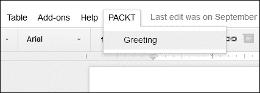

菜单项 **Greeting** 与之前任务中创建的按钮工作方式相同。使用这种方法插入自定义菜单的缺点是，为了使自定义菜单显示出来，你需要在脚本编辑器中每次都运行 `createMenu`。考虑一下，如果用户不知道 GAS 和脚本编辑器，他们将如何使用这个 `greeting` 函数。想想你的用户可能不像你一样是程序员。为了使用户能够执行选定的 GAS 函数，你应该创建一个自定义菜单，并在文档打开时立即使其可见。要做到这一点，将 `createMenu` 函数重命名为 `onOpen`，这就足够了。

### 小贴士

`onOpen` 函数是一个特殊函数名。每当用户打开文档时，GAS 解释器首先执行此函数。其他类似函数名有 `onEdit`、`onInstall`、`doGet` 和 `doPost`。前两个是与电子表格事件相关的函数，后两个是发布脚本服务的 `get` 和 `post` 回调函数。你不应该将这些函数名用于除预期目的之外的其他目的。

# 创建侧边栏

侧边栏是一个静态对话框，包含在文档编辑窗口的右侧。要创建侧边栏，请在编辑器中输入以下代码：

```js
function onOpen() {
  var htmlOutput = HtmlService
  .createHtmlOutput('<button onclick="alert(\'Hello World!\');">Click Me</button>')
  .setTitle('My Sidebar');

  DocumentApp.getUi().showSidebar(htmlOutput);
}
```

在前面的代码中，你正在使用 `HtmlService` 并调用其方法 `createHtmlOutput`，然后连续调用 `setTitle` 方法。要测试此代码，请运行 `onOpen` 函数或重新加载文档。侧边栏将如以下截图所示在文档窗口的右侧打开。侧边栏布局大小是固定的，这意味着你不能更改、修改或调整它的大小。

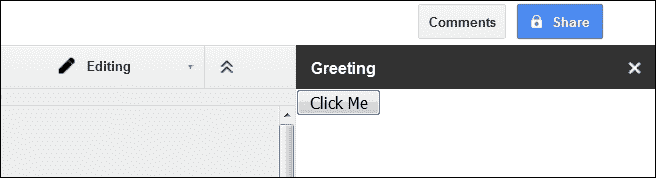

侧边栏中的按钮是一个 HTML 元素，而不是 GAS 元素，如果点击，它将打开浏览器界面的警告框。

# 创建一个扩展菜单

在上一个任务中，您将 HTML 代码作为字符串参数内联包含在`createHtmlOutput`方法中。作为替代，您可以将此 HTML 片段放入单独的 HTML 文件中。

要创建一个新的 HTML 文件，在脚本编辑器中，前往**文件** | **新建** | **HTML 文件**，如图所示：

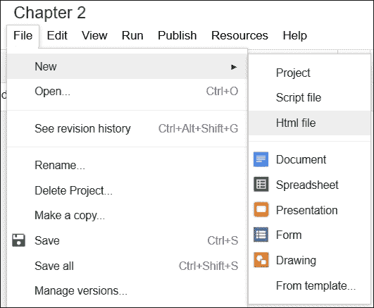

然后在**创建文件**框中，输入您为新 HTML 文件选择的名称。对于这个任务，输入`Index`并点击**确定**按钮。`.html`扩展名将自动添加。

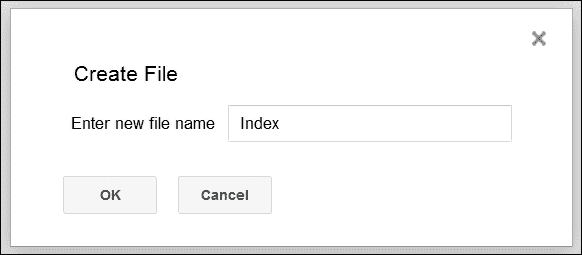

将创建一个包含几行默认 HTML 代码的新`Index.html`文件，如图所示：

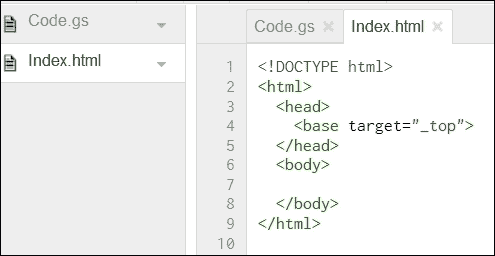

将您的`button`标签插入到`body`标签之间，如图所示：

```js
<!DOCTYPE html>
<html>
  <head>
    <base target="_top">
  </head>
  <body>
    <button onclick="alert('Hello World!');">Click Me</button>
  </body>
</html>
```

将以下代码插入到`Code.gs`文件中：

```js
function onOpen(){
  DocumentApp.getUi()
  .createAddonMenu()
  .addItem("Show Sidebar", "showSidebar")
  .addToUi();
}

function showSidebar() {
  DocumentApp.getUi()
  .showSidebar(
    HtmlService.createHtmlOutputFromFile('Index')
    .setTitle('Greetings')
  );
}
```

要测试代码，运行`onOpen`函数或重新加载文档。在**附加组件**菜单中，将添加一个新项目，称为**第二章**（项目名称），如图所示：

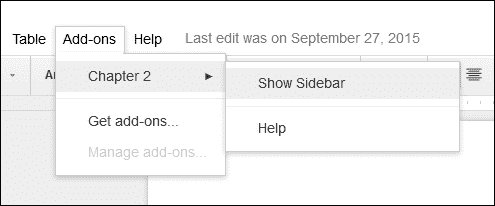

**显示侧边栏**是`showSidebar`函数的标签；点击它以显示您的侧边栏。

# 创建模态对话框

要创建一个阻止用户在电子表格或文档中更新任何内容的模态对话框，请按照图示更新`Code.gs`文件中的代码：

```js
function onOpen(){
  DocumentApp.getUi()
  .createAddonMenu()
  .addItem("Show Dialog", "showDialog")
  .addToUi();
}

function showDialog() {
  var html = HtmlService
   .createHtmlOutputFromFile('Index');
  DocumentApp.getUi()   
   .showModalDialog(html, 'Greeting');
}
```

前往**附加组件** | **第二章** | **显示对话框**，将弹出一个模态对话框：

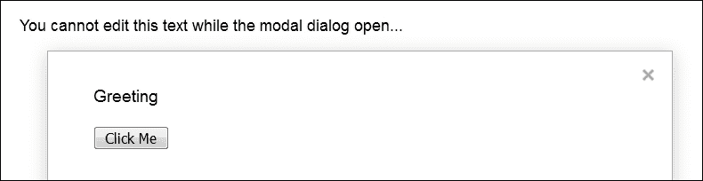

# 创建无模态对话框

现在我们将创建一个无模态对话框，并查看模态对话框和无模态对话框之间的区别。按照图示更新`showDialog`函数：

```js
function showDialog() {
  var html = HtmlService.createHtmlOutputFromFile('Index');
  DocumentApp.getUi()
  .showModelessDialog(html, 'Greeting');
}
```

注意，`showModalDialog`方法已更改为`showModelessDialog`。

无模态对话框不会阻止您做其他事情，例如编辑文档，并且您可以像图示中那样拖动对话框。

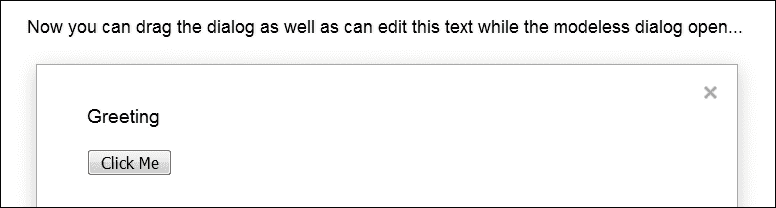

# 调试脚本

在测试和调试代码时，在几个点上记录变量的值是至关重要的。`Logger`类是一个有用的工具来完成这项工作，并且有几个对调试代码至关重要的方法。

按照图示更新`showDialog`函数：

```js
function showDialog() {
  var ui = DocumentApp.getUi();

  var response = ui.prompt(
      'Greeting', 'Will you enter your name below?', ui.ButtonSet.YES_NO
  );

  if (response.getSelectedButton() == ui.Button.YES) {
    Logger.log('Your name is %s.', response.getResponseText());
  } else if (response.getSelectedButton() == ui.Button.NO) {
    Logger.log('You clicked \'NO\' button');
  } else {
    Logger.log('You closed the dialog.');
  }
}
```

如常从**附加组件**菜单运行`showDialog`函数。做任何事，例如，输入您的名字并点击**是**或**否**或关闭对话框。

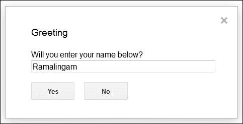

现在，在脚本编辑器中，按*Ctrl* + *Enter*（Windows）或 Command + *Enter*（Mac），或从**视图**菜单中选择**日志**，然后您可以看到带有时间戳的已记录文本，如图所示：

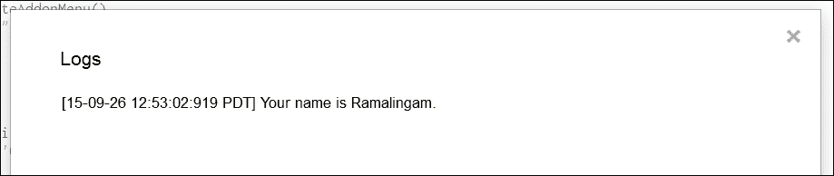

要对`Logger`进行更详细的研究，创建一个名为`debug`的函数，如图所示：

```js
function debug(){
  var square = 0;
  for(var i = 0; i < 10; i++){
    square = i * i;
    Logger.log(square);
  }
}
```

运行`debug`函数，查看如图所示的`Logger`结果：

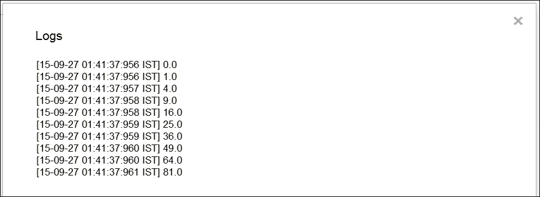

除了记录之外，你还可以使用编辑器的`debug`功能。在编辑器中，你在一行或多行设置断点。要这样做，点击你想要设置断点的行号。行号左侧将切换一个红色圆点，如图所示：

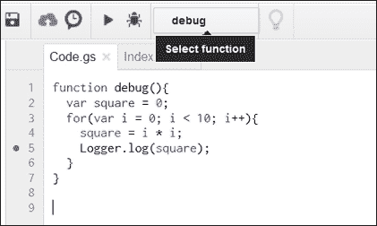

在**选择函数**选择器中，如果你还没有选择，请选择你想要调试的`debug`函数。点击函数选择器左侧的**调试**按钮（显示为昆虫形状）。函数执行到断点处然后暂停。编辑窗口水平分割，并在窗口的下半部分显示对象及其值，如图所示：

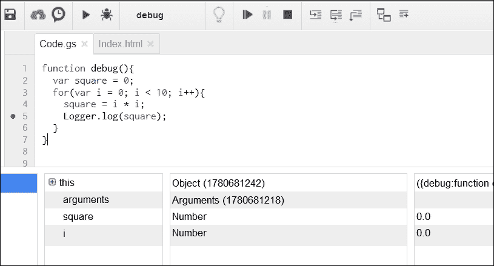

点击**继续调试**按钮，以查看`for`循环的每一轮的值。

### 小贴士

你可以尝试其他功能，如进入、跳过和退出。

要退出调试会话，点击**停止调试**按钮，并记得移除（切换）所有断点。

# 摘要

在本章中，你学习了多种对话框及其创建和显示方法，发现了如何使用`Logger`类记录值，还看到了如何调试你的脚本。在下一章，你将学习关于 Gmail 和联系人。

### 小贴士

**下载示例代码**

你可以从[`www.packtpub.com`](http://www.packtpub.com)的账户下载此书的示例代码文件。如果你在其他地方购买了此书，你可以访问[`www.packtpub.com/support`](http://www.packtpub.com/support)并注册，以便将文件直接通过电子邮件发送给你。

你可以通过以下步骤下载代码文件：

+   使用你的电子邮件地址和密码登录或注册我们的网站。

+   将鼠标指针悬停在顶部的**支持**标签上。

+   点击**代码下载与勘误**。

+   在**搜索**框中输入书籍的名称。

+   选择你想要下载代码文件的书籍。

+   从下拉菜单中选择你购买此书籍的来源。

+   点击**代码下载**。

文件下载完成后，请确保使用最新版本的以下软件解压缩或提取文件夹：

+   WinRAR / 7-Zip for Windows

+   Zipeg / iZip / UnRarX for Mac

+   7-Zip / PeaZip for Linux
