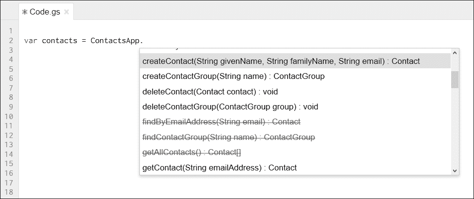
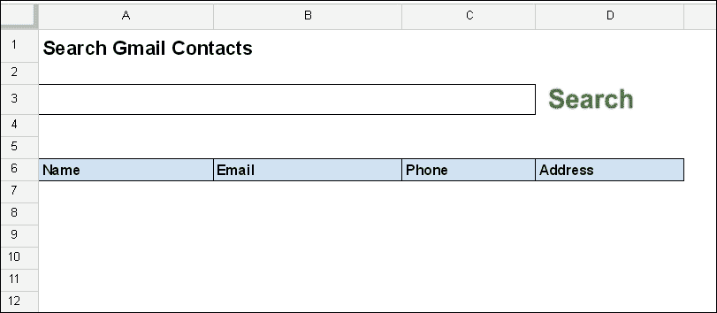
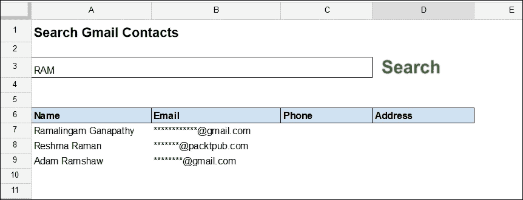
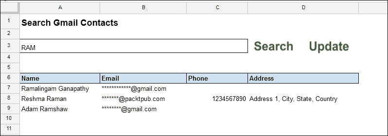
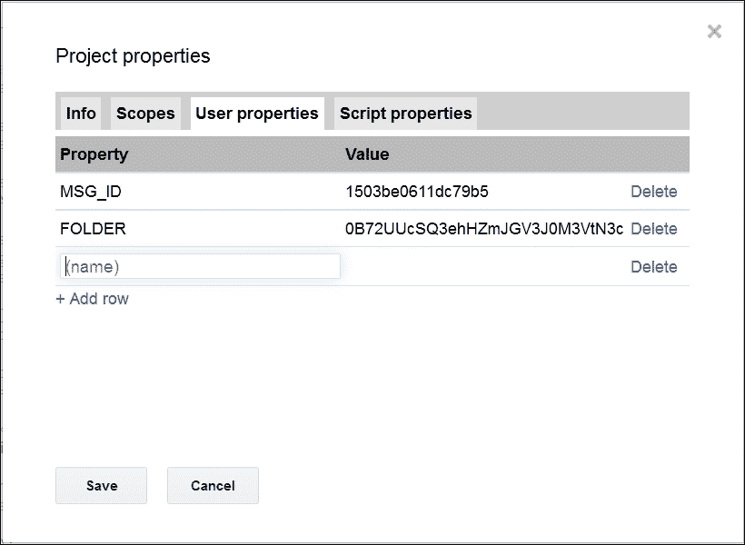
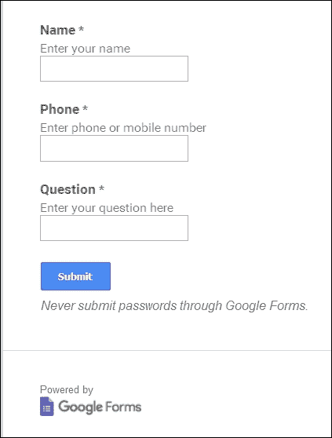
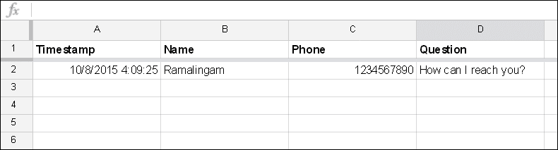
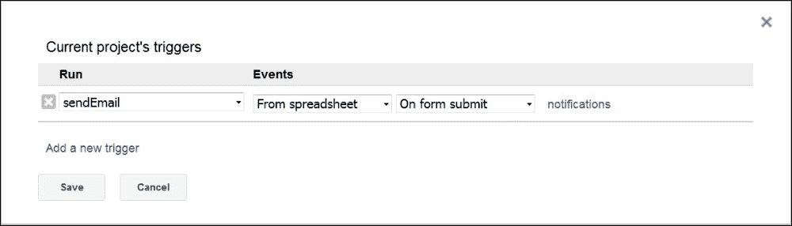
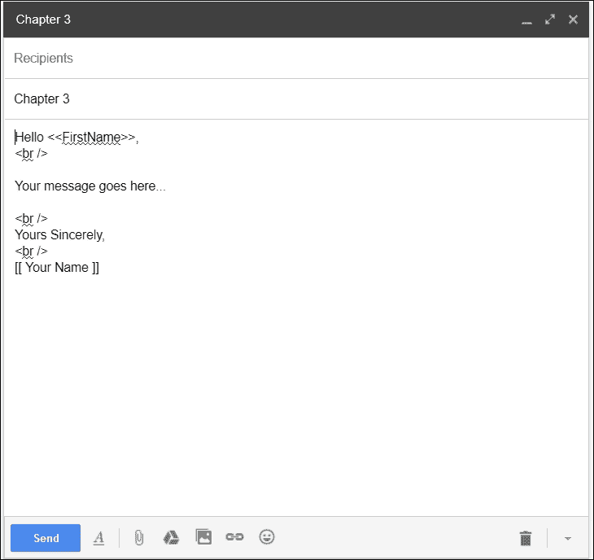
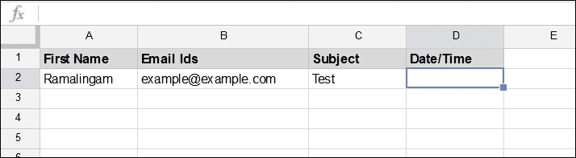

# 第三章。解析和发送电子邮件

在上一章中，你学习了如何创建基本的 GAS 元素，例如自定义菜单、对话框和吐司。你还学习了如何调试你的脚本代码。在本章中，你将学习许多现实世界的 Gmail 和联系人应用程序，包括邮件合并应用程序。

### 注意

在本章中，如果你在代码中遇到像`[[ value ]]`这样的左右方括号，那么将`value`替换为包括括号在内的实际值。

例如，如果电子邮件 ID 是`example@emample.com`，并且你通过`My email id [[emailid]] \n`进行替换，那么将其替换为`My email id example@example.com \n`。

# 通过脚本创建 Gmail 联系人

你可以使用`ContactsApp`类的`createContact`方法通过脚本创建 Gmail 联系人。例如，如果名字是 Anika Sumi，电子邮件 ID 是`<anika@example.com>`，那么`ContactsApp.createContact("Anika", "Sumi", "anika@example.com")`代码将创建预期的联系人。

要了解`ContactsApp`类的更多可用方法，在代码编辑器中输入`ContactsApp`和它旁边的`.`（一个点）。然后，你可以查看代码提示中显示的所有可用方法及其参数细节，如下面的截图所示：



你可以在前面的截图中看到已弃用的方法被划掉；建议你不要使用这些方法。

# 访问工作表、单元格、范围和偏移量

一个 Google 工作表的电子表格中包含一个或多个 Sheet 或标签页。Sheet 从左到右按索引顺序排列，从 0 开始。例如，最左边的 Sheet 通过索引 0 引用，下一个通过 1 引用，依此类推。在 GAS 中，我们可以通过索引或名称来引用 Sheet。

例如：

+   `getSheets()`方法返回一个包含 Sheet 对象的数组。从数组中，我们可以通过索引引用单个 Sheet。

+   `getSheetByName("Contacts")`函数返回一个名为`Contacts`的 Sheet 对象。

在 Google Sheets 中，列标签从字母*A*开始，从左到右按程序性方式计数，从 1 开始。例如，列*A*是 1，*B*是 2，以此类推。行通过其相应的标签数字进行标识。在 GAS 中，我们可以通过*A1*表示法或通过单独的行和列数字来引用单元格或单元格范围。

例如：

+   `getRange('D1:F10')`方法返回一个引用从*D1*到*F10*的`Range`对象。

+   `getRange(1,4,10,3)`方法返回一个引用相同范围的`Range`对象。

偏移量是一种间接引用方法，用于从基准单元格引用单元格/范围。偏移引用由它相对于基准单元格移动的行数和列数确定。

例如，如果基准单元格是*D1*，那么`offset(10,3)`方法返回范围*D1:F10*。

# 读取和写入工作表数据

通常你需要从表格中读取和/或写入数据。通常，使用 `getValue` 方法从单元格中读取一个值，使用 `getValues` 方法从范围中读取值。`getValue` 方法返回单个值，而 `getValues` 方法返回一个二维数组值。要写入单个值和二维数组值，分别使用 `setValue` 和 `setValues` 方法。

# 构建 Gmail 联系人搜索应用程序

现在，我们将创建一个应用程序来搜索现有的联系人。这个应用程序能够搜索并列出你在表格中的 Gmail 联系人。创建一个新的表格，并将 `Sheet1` 重命名为 `Contacts`，并按照以下截图所示进行设置。创建一个按钮，并将之前章节中学到的函数名称 `searchContacts` 分配给它。



按照以下内容创建 `searchContacts` 函数：

```js
function searchContacts(){

  var SheetContacts = SpreadsheetApp.getActiveSpreadsheet()
      .getSheetByName("Contacts");

  // Read input from cell A3 
  var searchCriteria = SheetContacts.getRange("A3").getValue();

  //  First 10 contacts.
  //  [You can change this limit, but advised to keep small.]
  var numOfContacts = 10;

  // Clear existing sheet data
  SheetContacts.getRange(7,1,numOfContacts,4).clear();
```

在这里，`clear` 是 `Range` 对象的方法，用于清除一个范围内的所有内容，包括格式和公式。你可以使用 `Sheet` 对象的 `clear` 方法来清除整个表格。或者，你也可以使用 `clearContent` 方法来仅清除内容。

```js
  // Returns an array of contacts where
  // contacts name matches with search text.
  var contacts = ContactsApp.getContactsByName(searchCriteria);

  //  Limit number of contacts.
  if(contacts.length > numOfContacts) contacts.length = numOfContacts;

  var cell = SheetContacts.getRange("A7");

  for(var i in contacts){
    var name = contacts[i].getFullName();
    var email = contacts[i].getEmails()[0];

    if(email) email = email.getAddress();
    else email = "";

    // For simplicity get the first phone number
    var phone = contacts[i].getPhones()[0];

    if (phone) phone = phone.getPhoneNumber();
    else phone = "";

    // For simplicity get the first address
    var address = contacts[i].getAddresses()[0];

    if(address) address = address.getAddress();
    else address = "";

    // cell.offset(rowOffset, columnOffset)
    cell.offset(i,0).setValue(name);
    cell.offset(i,1).setValue(email);
    cell.offset(i,2).setValue(phone);
    cell.offset(i,3).setValue(address);
  }
};
```

### 小贴士

不要复制粘贴前面的代码，而是自己编辑它。这样做，你将了解 `SpreadsheetApp`、`ContactApp` 和 `Contact` 等类中可用的方法签名（方法名称和参数），借助脚本编辑器的代码提示功能。

在没有错误地编辑和保存代码后，转到电子表格窗口。如果你在 *A3* 单元格（搜索框）中输入一个搜索词，然后点击 **搜索**，那么前 10 个联系人将按以下截图所示列出（列出的联系人详细信息根据你的 Gmail 用户名和联系人而异）：



如果你想通过 `searchContacts` 函数更新列出的联系人怎么办？例如，你可能想更新联系人的电话号码和/或地址。要更新联系人字段，我们将创建另一个名为 `updateContacts` 的函数。在创建该函数之前，在 `Contacts` 表格中，在 **搜索** 旁边添加一个名为 **更新** 的按钮，并按以下截图所示分配函数名称 `updateContacts`：



更新你想要更新的字段值。现在创建以下列出的函数：

```js
function updateContacts(){
  var SheetContacts = SpreadsheetApp.getActiveSpreadsheet()
      .getSheetByName("Contacts");

  var cell = SheetContacts.getRange("A7");

  var numOfContacts = 10;

  for(var i = 0; i < numOfContacts; i++){

    var email = cell.offset(0, 1).getValue();

    // Skip if email field is null
    if(!email) continue;

    var contact = ContactsApp.getContact(email);

    // Skip if contact is null or undefined
    if(!contact) continue;

    var name = cell.offset(i, 0).getValue();

    // Skip if name field is null
    if(!name) continue;
    contact.setFullName(name);

    var phone = cell.offset(i, 2).getValue().toString();

    // Returns phone numbers as an array
    var contPhone = contact.getPhones(ContactsApp.Field.MAIN_PHONE)[0];

    // Update main phone number if exist otherwise add.
    if(phone){

      if(contPhone){
        contPhone.setPhoneNumber(phone);
      } else {
        contact.addPhone(ContactsApp.Field.MAIN_PHONE, phone);
      }

    }

    var address = cell.offset(i, 3).getValue().toString();

    // Returns address as an array
    var contAddress = contact
        .getAddresses(ContactsApp.Field.HOME_ADDRESS)[0];

    // Update home address if exist otherwise add.
    if(address){

      if(contAddress) {
        contAddress.setAddress(address);
      } else {
        contact.addAddress(ContactsApp.Field.HOME_ADDRESS, address);
      }

    }

  }
};
```

前面的函数通过给定的电子邮件 ID 检索联系人；并且，对于每个联系人，它还会检索字段值，并使用表格值更新/添加这些字段值。此函数可以更新/添加全名、电话和地址字段，但不能更新电子邮件 ID。

# 构建 Gmail 解析应用程序

`parseEmail` 函数能够检查最新的 10 个收件箱线程，从未读消息中提取 **发件人** 字段和正文文本，并将收集到的数据放在表格最左侧的标签页中。按照以下内容创建 `parseEmail` 函数：

```js
/** 
 *  Gets content of latest unread message in Gmail inbox
 *    and puts gathered data in left most tab of Sheets.
 *
 */
function parseEmail(){

  // Left most sheet/tab
  var emailSheet = SpreadsheetApp.getActiveSpreadsheet()
      .getSheets()[0];

  // Clear the entire sheet.
  emailSheet.clear();

  // Checks maximum 10 threads
  var thread = GmailApp.getInboxThreads(0,10);

  var row = 1;

  for(var thrd in thread){
    var messages = thread[thrd].getMessages();

    for (var msg in messages) {
      var message = messages[msg];

      if(message && message.isUnread())
      emailSheet.getRange(row,1).setValue(message.getFrom());

      emailSheet.getRange(row++,2)
      .setValue(message.getPlainBody());
    }
  }

};
```

你可以使用 `RegExp` 从消息正文文本中提取所需的数据。

# 属性服务

GAS 提供了属性服务来存储和/或检索项目相关的数据。数据以键/值对的形式组织，可以手动设置或通过脚本代码设置。以下截图显示了如何手动设置属性。要查看此对话框，请点击 **文件** 菜单并选择 **项目属性**：



### 注意

你可以在脚本代码中使用手动创建的项目属性，但有时代码创建的属性可能不在 **项目属性** 对话框中可见。你可以在代码中创建、更新或删除项目属性。

在下一个任务中，我们将使用项目属性。

# 将 Gmail 附件下载到 Drive

`saveEmailAttachmentsToDrive` 函数可以将 Gmail 附件下载到 Drive。在这个函数中，使用 `PropertiesService` 来避免重复下载相同的附件。`createFolder_` 函数用于在 Drive 中创建具有给定名称的文件夹，如果不存在的话。

### 提示

如果任何函数名后附加了 `_`，则它将不会在 **运行** 菜单下列出。你不能直接运行这些函数，但可以从其他函数中调用它们。这些被称为 **私有函数**。

你可以在与 `saveEmailAttachmentsToDrive` 函数相同的脚本文件中创建 `createFolder_` 函数，或者在一个单独的脚本文件中，例如 `Library.gs`：

```js
/**
 *  Checks latest 100 inbox threads,
 *    saves attachments in 'Gmail attachments' folder,
 *
 */
function saveEmailAttachmentsToDrive(){

  // Create 'Gmail Attachments' folder if not exists.
  createFolder_('Gmail attachments');

  // Get inbox threads starting from the latest one to 100.
  var threads = GmailApp.getInboxThreads(0, 100);

  var messages = GmailApp.getMessagesForThreads(threads);

  var folderID = PropertiesService.getUserProperties()
      .getProperty("FOLDER");

  var file, folder = DriveApp.getFolderById(folderID);

  for (var i = 0 ; i < messages.length; i++) {
    for (var j = 0; j < messages[i].length; j++) {
      if(!messages[i][j].isUnread()){

        var msgId = messages[i][j].getId();

        // Assign '' if MSG_ID is undefined.
        var oldMsgId = PropertiesService.getUserProperties()
            .getProperty('MSG_ID') || '';

        if(msgId > oldMsgId){
          var attachments = messages[i][j].getAttachments();

          for (var k = 0; k < attachments.length; k++) {
            PropertiesService.getUserProperties()
              .setProperty('MSG_ID', messages[i][j].getId());

            try {
              file = folder.createFile(attachments[k]);
              Utilities.sleep(1000);// Wait before next iteration.
            } catch (e) {
              Logger.log(e);
            }
          }

        }
        else return;

      }
    }
  }

};
```

前面的函数使用文件夹名称作为参数调用以下 `createFolder_` 函数。`createFolder_` 函数会查找指定的文件夹，如果不存在则创建它，并返回其唯一 ID：

```js
function createFolder_(name) {
  var folder, folderID, found = false;

  /*
   * Returns collection of all user folders as an iterator.
   * That means it do not return all folder names at once, 
   * but you should get them one by one.
   *
   */
  var folders = DriveApp.getFolders();

  while (folders.hasNext()) {
    folder = folders.next();
    if (folder.getName() == name) {
      folderID = folder.getId();
      found = true;
      break;
    }
  };

  if (!found) {
    folder = DriveApp.createFolder(name);
    folderID = folder.getId();
  };

  PropertiesService.getUserProperties()
    .setProperty("FOLDER", folderID);

  return folderID;
}
```

在前面的函数中，`getFolders` 方法是一个迭代器方法。迭代器不会一次性返回所有数据，而只返回当前数据。要获取后续数据，你应该反复调用 `next` 方法，直到 `hasNext` 变为 `false`。

# 使用 MailApp 服务发送电子邮件

`sendEmail` 函数能够发送带有前缀消息的电子邮件。请记住替换电子邮件 ID 和消息文本。此服务主要用于发送具有有限方法的电子邮件（只有 `sendEmail` 和 `getRemainingDailyQuota`），并且无法访问你的 Gmail 账户。你可以使用 `GmailApp` 类进行更多操作：

```js
function sendEmail(){
  var to = "[[reciever email id]]";
  var message = "[[message]]\n";

  MailApp.sendEmail(to, "Chapter 3", message);
}
```

# 在表单提交时发送电子邮件通知

想象一下，如果你创建了一个表单并展示给许多用户。每次都要打开响应表来验证是否有用户提交表单将会很麻烦。如果你创建了多个表单并发送给多个用户，问题会更糟。当有表单提交时，收到通知电子邮件将会很有帮助。

对于这个任务，创建一个包含三个字段的表单，如图所示：



从实时表单提交测试数据。您提交的数据将被保存在一个名为类似`Form Responses 1`的响应工作表中。列标题将与您的表单字段一致，如以下截图所示。数据可能因您的输入而异。



在脚本文件中，您需要进行以下更改：

1.  从以下代码中输入`sendEmail`函数。

1.  替换接收者的电子邮件地址。如果您运行此函数，它将发送包含响应工作表中最后提交的数据（最底行）的电子邮件。

1.  检查工作表的实际名称和代码中使用的名称；它们应该完全相同。如果您不确定，右键单击工作表名称并选择**重命名...**。

1.  从**重命名**对话框中复制工作表名称，并将其粘贴到以下代码中：

    ```js
    function sendEmail(){
      var sheet = SpreadsheetApp.getActiveSpreadsheet()
          .getSheetByName("Form Responses 1");

      var lastRow = sheet.getLastRow();
      var lastCol = sheet.getLastColumn();
      var data = sheet.getRange(lastRow,1,1,lastCol)
          .getValues()[0];

      var to = "[[ receiver email id]]";
      var message = "Name: " + data[1] + "\n";

      message += "Phone: " + data[2] + "\n";
      message += "Question: " + data[3] + "\n";

      // MailApp.sendEmail(recipient, subject, body);
      MailApp.sendEmail(to, "Chapter 3", message);
    }
    ```

您创建了一个表单和一个函数，用于将响应数据发送到电子邮件地址。创建一个触发器以便在表单提交时立即运行`sendEmail`函数，将完成此任务。

# 手动创建触发器

要创建触发器，在代码编辑器中点击**资源**并选择**当前项目的触发器**，然后**当前项目的触发器**对话框将打开。已创建的触发器将列在此对话框中，否则将出现创建新触发器的链接。点击**没有设置触发器。点击此处添加一个**链接。从下拉菜单中选择选项，如以下截图所示：



在**运行**标题下，选择您想要创建触发器的`sendEmail`函数。在**事件**标题下选择**从电子表格**和**在表单提交时**，如前一张截图所示。

如果表单用户将数据提交到电子表格，触发器将运行`sendEmail`函数。

关于触发器的更多信息，请访问[`developers.google.com/apps-script/guides/triggers/`](https://developers.google.com/apps-script/guides/triggers/).

# 通过脚本创建和删除触发器

您可以像以下示例代码所示，以编程方式创建或删除触发器。

```js
/**
 * Deletes all the triggers.
 *
 */
function deleteTriggers(){
  var triggers = ScriptApp.getProjectTriggers();

  triggers.forEach(function(trigger){

    try{
      ScriptApp.deleteTrigger(trigger);
    } catch(e) {
      throw e.message;
    };

    Utilities.sleep(1000);

  });

};

function createTrigger(){
  var ss = SpreadsheetApp.getActiveSpreadsheet();

  // Create new trigger
  ScriptApp.newTrigger("sendEmail")
    .forSpreadsheet(ss).onFormSubmit().create();
};
```

### 注意

在`deleteTriggers`函数中，使用`Utilities`服务的`sleep`方法暂时暂停脚本指定毫秒数。否则，您可能会遇到`Too many service invocation…`错误。

# 如果消息正文中找到特定关键字，则转发电子邮件

`forwardEmails`函数能够转发电子邮件消息，如果正文文本中找到特定关键字，则将其转发到前缀电子邮件地址。在测试代码时，请注意`for`循环的迭代次数，以避免错误地转发大量消息：

```js
/**
 *  1\. Checks all unread inbox threads and messages.
 *
 *  2\. If specific keyword found then forwards it to another
 *     recipient.
 *
 *  3\. Marks that message as Read.
 *
 */
function forwardEmails() {
  var recipient = "[[forward email id]]";
  /*
   *  Use keywords separated by '|'.
   *  For example: "purchase | invoice"
   *
   */
  var words = "keywords list";
  var regExp = new RegExp(words,'g');

  var len = GmailApp.getInboxUnreadCount();

  for (var i = 0; i < len; i++) {
    // get 'i'th thread in inbox
    var thread = GmailApp.getInboxThreads(i,1)[0];

    // get all messages in 'i'th thread
    var messages = thread.getMessages();
    var msgLen = messages.length;
    var isAllMarkedRead = true;

    // iterate over each message
    // CAUTION: limit loop iterations for initial testing.
    for (var j = 0; j < 5 /* msgLen */; j++) {
      var message = messages[j];

      if(message.isUnread()){
        var bodyText = message.getPlainBody();
        var test = regExp.exec(bodyText);
        message.forward(recipient);
        isAllMarkedRead = false;
        message.markRead();
      }

    };

    if(isAllMarkedRead) len++;
    Utilities.sleep(1000);
  }

};
```

# 通过附件发送电子邮件

您可以通过设置以下代码中的选项将任何类型的文件附加到您的电子邮件消息中。以下代码将活动工作表的左侧工作表内容作为 PDF 附加。

```js
function sendEmailWithAttachments(){
  var file = SpreadsheetApp.getActiveSpreadsheet()
      .getAs(MimeType.PDF);

  // MailApp.sendEmail(recipient, subject, body, options)
  MailApp.sendEmail(
    "[[ Recipient email id ]]",
    "Chapter 3",
    "",
    {
      attachments: [file],
      name: 'Chapter 3 test attachment'
    }
  );

}
```

# 在电子邮件消息中嵌入内联图像

要在电子邮件消息中嵌入图像，如徽标，你可以使用 HTML 代码而不是纯文本。将你的图像上传到 Google Drive，检索，并在代码中使用该文件 ID：

```js
function sendEmail(){
  var sheet = SpreadsheetApp.getActiveSpreadsheet()
      .getSheetByName("Form Responses 1");

  var lastRow = sheet.getLastRow();
  var lastCol = sheet.getLastColumn();
  var data = sheet.getRange(lastRow,1,1,lastCol).getValues()[0];

  var image = DriveApp.getFileById("[[image file's id in Drive ]]").getBlob();

  var to = "[[Recipient email id ]]";
  var message = '';

  message += "<p>Name: " + data[1] + "</p>";
  message += "<p>Phone: " + data[2] + "</p>";
  message += "<p>Question: " + data[3] + "</p>";

  MailApp.sendEmail(
    to,
    "Chapter 3 inline image example",
    "",
    {
      inlineImages:{ logo:image },
      htmlBody:message
    }
  );
}
```

# 构建电子邮件合并应用

一次向数百个收件人发送个性化的电子邮件可能是一项耗时的工作。为每条消息编写草稿、输入主题和收件人的电子邮件 ID 可能也很繁琐。使用这个邮件合并应用，你可以向所有收件人发送相同类型的信息，但可以在一定程度上进行定制。例如，问候个人。

第一步是在你的 Gmail 中创建一个草稿，如下面的截图所示。草稿用作模板。你可以使用任何特殊字符来包围要替换的文本。在草稿中，如下面的截图所示的代码使用左(`<<`)和右(`>>`)尖括号将`EmailList`工作表中的**First Name**列数据替换为第一个名字。你可以根据需要包括任何其他占位符或字段。设置草稿，但现在不要发送：



在新的工作表或现有工作表中创建一个名为`EmailList`的工作表。创建如下所示的列标题：



在脚本编辑器中创建如下所示的函数，用实际值替换草稿和发件人姓名。根据你的每日电子邮件发送配额设置`maxEmails`（此代码使用`50`）：

```js
// Returns your draft text.
function getDraftBody(draftName){
  var drafts = GmailApp.getDraftMessages();

  for(var i in drafts)
    if( drafts[i].getSubject() == draftName )
      return drafts[i].getPlainBody();
}

function sendEmails(){
  // EmailList sheet column numbers, 0 based.
  const FIRST_NAME_COL = 0;
  const EMAIL_IDS_COL = 1;
  const SUB_COL = 2;
  const DATE_COL = 3;

  var maxEmails = 50;
  var draftName = "Chapter 3";// Draft's subject name

  var draftBody = getDraftBody(draftName);
  var quotaLeft = MailApp.getRemainingDailyQuota();

  var ss = SpreadsheetApp.getActive();
  var sheet = ss.getSheetByName("EmailList");

  // Gets all sheet data as a 2-dimensional array.  
  var data = sheet.getDataRange().getValues();
  var header = data.shift();

  for(var i=0,count=0; count < maxEmails && count < quotaLeft
      && i < data.length; ++i){
    var firstName = data[i][FIRST_NAME_COL];
    var recipient = data[i][EMAIL_IDS_COL];
    var subject = data[i][SUB_COL];
    var htmlBody = draftBody.replace("<<FirstName>>", firstName);

    if(recipient){
      GmailApp.sendEmail(
        recipient,
        subject,
        "",
        {
          name:"[[ Sender Name ]]",
          htmlBody:htmlBody
        }
      );

      data[i][DATE_COL] = new Date();

      ++count;
    }
  };

  // Inserts header at top of the array.
  data.unshift(header);

  // Stores values of array in sheet.
  sheet.getRange(1, 1, data.length, header.length)
    .setValues(data);
}
```

在`EmailList`工作表中填充数据。要发送电子邮件，运行`sendEmails`函数。你的草稿中的`<<FirstName>>`字段将根据你在`EmailList`工作表中的**First Name**列数据替换。就是这样！

恭喜！你已经创建了一个工作的电子邮件合并应用。

# 摘要

在本章中，你学习了`ContactsApp`、`MailApp`和`GmailApp`类及其方法。使用这些类，你创建了多个有用的现实世界应用，包括一个电子邮件合并应用。在下一章中，你将学习如何使用`FormApp`和`HtmlService`类程序化地创建表单。你还将了解`doGet`和`doPost`简单的触发函数。
