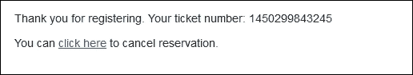

# 第四章 创建交互式表单

在上一章中，您学习了`GmailApp`和`ContactApp`的许多功能，并构建了许多实际应用。在本章中，您将学习如何使用`FormApp`和`HtmlService`编程创建表单。您还将了解`doGet`和`doPost`函数。

# 使用脚本创建表单

在第一章 *引入 Google Apps Scripts* 中，您手动创建了一个表单，但这次我们将通过脚本编程创建表单。首先，我们将创建一个包含四个选项和一个**其他**选项的表单。为了简单起见，我们将地点添加为多选单选组。每个选项只能单独选择。在电子表格代码文件中创建名为`createForm`的函数，如下所示：

```js
function createForm() {

  var places = ["Place 1","Place 2","Place 3","Place 4"];

  var form = FormApp.create("Vacation Form");

  form.addMultipleChoiceItem()
    .setTitle('Where will you go for vacation?')
    .setChoiceValues(places)
    .showOtherOption(true);

}
```

`places`变量包含一些随机地点，您可以将任何地点名称和任何数量的地点作为字符串数组分配。`FormApp`类的`create`方法在您的 Google Drive 根目录（`My Drive`）中创建一个名为`Vacation Form`的表单。运行函数后，创建的表单将如下所示：


选项在代码中是硬编码的。如果您想更改任何选项或添加更多选项，那么您应该编辑代码以进行必要的更改。如果您需要频繁更改选项，可能会变得令人烦恼或难以每次都编辑代码。现在我们将从电子表格的数据中添加地名，而不是将它们硬编码。添加或重命名一个现有的工作表为`Places`，并在其中添加一些地名，如下所示：


现在更新`createForm`函数，如下所示：

```js
function createForm() {

  var ThisSpreadsheet = SpreadsheetApp.getActive();
  var SheetPlaces = ThisSpreadsheet.getSheetByName("Places");

  // Load 'Places' sheet data as a 2-dimensional array.
  var data = SheetPlaces.getDataRange().getValues();

  // remove the header row
  data.shift();

  var places = [];

  // Populate the places array with the first column's data
  data.forEach(function(row){
    places.push(row[0]);
  });

  // Create a new form
  var form = FormApp.create("Vacation Form");

  form.addMultipleChoiceItem()
    .setTitle('Where will you go for a vacation?')
    .setChoiceValues(places)
    .showOtherOption(true);

}
```

前面的函数将创建一个表单，其选项文本是从工作表的数据中检索的。选项文本和/或选项数量可以根据您的工作表数据进行调整。如果您想更改选项文本，那么只需编辑工作表数据即可，您不需要编辑代码。

当您运行前面提到的函数时，它将在`My Drive`文件夹中创建一个名为`Vacation Form`的表单。要打开编辑模式的表单，双击或右键单击（上下文点击）表单名称，然后转到**打开方式** | **Google 表单**。以下截图显示了编辑模式下的表单外观。您可以在编辑模式下进行任何调整和/或格式设置：


要打开实时表单，右键单击（上下文点击）表单名称，点击**获取链接**，复制链接，然后将链接粘贴到浏览器地址栏中。以下截图显示了实时表单的外观：


您可以将实时表单链接与您的用户共享。您用户的响应将存储在表单本身中。您可以在表单编辑器中查看响应，或者将其链接到电子表格以查看响应，如下所示：


您可以通过点击表单编辑器右上角的图标手动将表单响应链接到电子表格。在选定的电子表格中创建一个新的“表单响应”工作表。

要以编程方式链接电子表格，请使用以下代码：

```js
form.setDestination( FormApp.DestinationType.SPREADSHEET, ThisSpreadsheet.getId() ); // Replace with your spreadsheet's ID
```

# 将脚本发布为网络应用程序

您可以通过将脚本发布为网络应用程序来创建令人惊叹的网页/应用程序。在本节中，您将了解如何发布脚本。首先，在脚本编辑器中创建一个新的工作表，并输入以下代码：

```js
function doGet(){
  var str = "Hello world!";
  return ContentService.createTextOutput(str);
}
```

`doGet` 函数将在向脚本发送 HTTP/HTTPS 请求时执行。在上面的代码中，使用 `ContentService` 返回字符串给浏览器。内容服务可以用来返回任何类型的内容，包括简单的文本、HTML、XML、JSON、CSV 等等。

要发布脚本，在脚本编辑器中，导航到**发布** | **部署为网络应用程序…**。将打开一个新的**部署为网络应用程序**对话框，如下所示：


选择任何一个现有的项目版本或选择**新建**以创建一个新的项目版本。在“作为谁执行应用程序”选项下，将有两个选择**我**和**用户**，用于访问网络应用程序。对于此应用程序，请选择**我**（您的用户 ID）。这意味着脚本将以您的用户 ID 运行。如果您选择了第二个选项，则脚本将以访问应用程序的用户的名义运行。在“谁可以访问应用程序”选项下选择**任何人，即使是匿名用户**。

### 小贴士

在“谁可以访问应用程序”选项下，还有两个额外的选择**仅我**和**任何人**可用。如果您只想访问已发布的应用程序，请选择**仅我**。如果您想允许他人访问，但请注意，其他人应该使用他们的 Google 用户 ID 登录。如果您选择**任何人，即使是匿名用户**，则您的用户可以是任何人，并且不需要登录。他们甚至不需要是 Google 用户。

最后，点击**部署**按钮。然后，将打开另一个对话框，如下面的截图所示：


### 小贴士

如果您是第一次发布脚本，那么您需要授权脚本。授权是在网络应用程序部署之前启动的。在授权对话框中点击**允许**。

在这个对话框中，你可以在**当前网络应用 URL**文本框下看到已发布的 URL。你可以将此 URL 复制并粘贴到新的浏览器窗口/标签页地址栏中，以查看你的网络应用程序的工作情况。对于前面的代码，返回的文本将是**Hello world**！点击**确定**关闭对话框。

### 小贴士

如果你对你的代码进行了任何修改，那么你应该再次发布新版本，否则更新将不会生效。或者，你可以使用**最新代码**URL 进行开发。

# HtmlService

在本章的开头，你使用脚本代码创建了一个表单。然而，这个表单是静态的，这意味着你无法在客户端添加动态格式或脚本。如果需要，你只能在服务器端执行格式化和计算。

`HtmlService` 允许脚本向客户端返回 HTML 或网页。出于安全原因，包括 CSS 和 JavaScript 在内的 HTML 内容在返回到客户端浏览器之前由 Caja 编译器编译和沙盒化。返回的网页可以使用 `google.script.run` API 方法与服务器端 GAS 函数交互。

使用 `HtmlService` 的优点是：

+   你可以使用 CSS 和客户端 JavaScript

+   你可以创建动态 HTML 表单，而不是静态表单

+   你可以分别处理客户端 HTML 和服务器端脚本代码

`HtmlService` 可以从模板创建 HTML 代码。**模板**是混合了 HTML 标记和脚本的 HTML 文件（这些被称为**脚本片段**，并在服务器端执行）。

被 `<?` 和 `?>` 包围的脚本片段会执行，但不会向包含的 HTML 输出任何内容。换句话说，它们不会改变周围的 HTML 代码。被 `<?=` 和 `?>` 包围的脚本片段将输出返回到周围的 HTML 代码。脚本片段内的任何函数都可以调用其他脚本片段或服务器脚本函数的函数，但服务器函数不能调用脚本片段内的函数。

要进一步了解脚本片段标签，请访问：[`developers.google.com/apps-script/guides/html/templates`](https://developers.google.com/apps-script/guides/html/templates)。

# 使用 HtmlService 创建表单

创建一个名为 `Form.html` 的文件，我们将使用它作为 HTML 模板，并在其中输入以下代码：

```js
<!-- Form.html  -->
<!DOCTYPE html>
<html>

  <head>
    <base target="_top">
  </head>

  <body>
    <form>
      <h4>Where will you go for vacation?</h4>

      <input type="radio" name="places" value="Place 1" />Place 1

      <br />
      <input type="radio" name="places" value="Place 2" />Place 2

      <br />
      <input type="radio" name="places" value="Place 3" />Place 3

      <br />
      <input type="radio" name="places" value="Place 4" />Place 4

      <br />
      <br />
      <input type="submit" value="SUBMIT" />
    </form>
  </body>
</html>
```

使用相同的名称属性值为单选类型输入字段，这样它们就会全部分组在一起。这意味着它们将仅限使用。更新 `Code.gs` 文件中的 `doGet` 函数以渲染前面提到的 HTML 表单，如下所示：

```js
// Code.gs
function doGet() {
  var template = HtmlService.createTemplateFromFile("Form.html");
  var html = template.evaluate();

  return HtmlService.createHtmlOutput(html);
}
```

发布脚本，并在浏览器地址栏中输入已发布的 URL。返回的基本 HTML 表单如下所示：


要从电子表格数据自动填充位置，请更新 HTML 代码，如下所示：

```js
   <form>
      <h4>Where will you go for vacation?</h4>
      <? for (var i in places) { ?>
        <input type="radio" name="places" value="<?= places[i] ?>" /><?= places[i] ?><br />
      <? } ?>
      <br />
      <input type="submit" value="SUBMIT" />
    </form>
```

脚本片段 `<?= places[i] ?>` 返回 `places` 数组的第 *i* 个元素。你还需要更新如下的 `doGet` 函数：

```js
function doGet() {
  // Replace with your spreadsheet's ID.
  var ss = SpreadsheetApp.openById("spreadsheet's id");
  var SheetPlaces = ss.getSheetByName("Places");

  var data = SheetPlaces.getDataRange().getValues();

  // Remove header row.
  data.shift();

  var places = [];

  // Populate the places array with the first column's data.
  data.forEach(function(row){
    places.push(row[0]);
  });

  var template = HtmlService.createTemplateFromFile("Form.html");

  // Assign the places array to the template object.
  template.places = places;

  var html = template.evaluate();
  return HtmlService.createHtmlOutput(html);
}
```

在 `doGet` 函数中将 `places` 数组分配给模板并在 HTML 模板中引用。然后，输出变为以下内容：


要将此表单数据提交到电子表格，您需要向表单元素添加方法和动作属性：

```js
    <form method="post" action="<?= pubUrl ?>" >
```

在 `doGet` 函数中将发布的 URL 分配给 `template` 对象，例如：

```js
template.pubUrl = "https://script.google.com/macros/s/AKfycbzMqmOaaD- TTDbycMl2AxF7dtn9EqxqZTwozcQBNHxe9hg4Kbc/exec";
```

您也可以按照以下方式分配：

```js
template.pubUrl = ScriptApp.getService().getUrl();
```

要处理提交的表单数据，请添加一个 `doPost` 函数。`doGet` 或 `doPost` 函数根据 HTTP/HTTPS 请求方法（`GET` 和 `POST`）执行：

```js
function doPost(e){
  // Replace with your spreadsheet's ID.
  var ss = SpreadsheetApp.openById("spreadsheet's id");

  var SheetResponses = ss.getSheetByName("Responses");

  // Create a 'Responses' sheet if it does not exist.
  if(!SheetResponses){
     SheetResponses = ss.insertSheet("Responses");
  };

  SheetResponses.appendRow([e.parameter.places]);

  return ContentService.createTextOutput(
     "Your response submitted successfully. Thank you!"
  );

}
```

表单提交后，会返回一条感谢信息作为正常的文本内容：


# 使用 Google 脚本 API 方法提交表单

要使用 `google.script.run` API 方法提交数据，请向 **提交** 按钮添加 `onclick` 属性：

```js
<input type="submit" value="SUBMIT" onclick="google.script.run.postFormDataToSheet(this.parentNode);" />
<!-- this.parentNode is the 'form' element -->
```

按照以下方式创建 `postFormDataToSheet` 函数：

```js
function postFormDataToSheet(e){
  // Replace with your spreadsheet's ID.
  var ss = SpreadsheetApp.openById("spreadsheet's id");

  var SheetResponses = ss.getSheetByName("Responses");

  // Create a 'Responses' sheet if it does not exist.
  if(!SheetResponses){
    SheetResponses = ss.insertSheet("Responses");
  }

  SheetResponses.appendRow([e.places]);
}
```

要显示表单提交结果或错误信息，请在单独的 `<script>` 标签中插入 `postData` 函数，并添加成功和失败处理程序，如下所示：

```js
    <script>
      function postData(form){
        google.script.run
          .withSuccessHandler(callback)
          .withFailureHandler(callback)
          .postFormDataToSheet(form);
      }

      function callback(msg){
        alert(msg);
      }
    </script>
```

在 `postFormDataToSheet` 函数的末尾插入一个带有消息的返回语句。

要将 `User` 对象添加到 `google.script.run` API 调用中，请添加 `withUserObject` 方法以及成功和失败处理程序：

包含 `user` 对象的完整 HTML 代码如下所示：

```js
<!DOCTYPE html>
<html>
  <head>
    <base target="_top">

    <script>
      function postData(form){
        google.script.run
          .withSuccessHandler(showSuccess)
          .withFailureHandler(showError)
          .withUserObject(form)
          .postFormDataToSheet(form);
      }

      /*
       * msg -  the error or success message returned *        from the server.
       *
       * elem - the reference to the user object (form).
       *
       */
      function showSuccess(msg,elem) {
        var newElement = document.createElement("div");
        newElement.innerHTML = '<font color="green">'
          + msg + '</font>';
        elem.appendChild(newElement);
      }

      /*
       * msg -  the error or success message returned *        from the server.
       *
       * elem - the reference to the user object (form).
       *
       */
      function showError(msg,elem){
        var newElement = document.createElement("div");

        newElement.innerHTML = '<font color="red">'
          + msg + '</font>';

        elem.appendChild(newElement);
      }

    </script>
  </head>

  <body>
    <form>
      <h4>Where will you go for vacation?</h4>

      <? for (var i in places) { ?>
        <input type="radio" name="places"
          value="<?= places[i] ?>" /><?= places[i] ?>
        <br />
      <? } ?>

      <br />
      <input type="button" value="SUBMIT"
        onclick="postData(this.parentNode);" />
    </form>
  </body>
</html>
```

`postFormDataToSheet` 函数的完整版本如下所示：

```js
function postFormDataToSheet(e){
  // Replace with your spreadsheet's ID.
  var ss = SpreadsheetApp.openById("spreadsheet's id");
  var SheetResponses = ss.getSheetByName("Responses");

  // Create 'Responses' sheet if it does not exist.
  if(!SheetResponses){
    SheetResponses = ss.insertSheet("Responses");
  }

  SheetResponses.appendRow([e.places]);

  return "Your response submitted successfully. Thank you!";
}
```

在此脚本中，您使用了名为 `Form.html` 的单独文件中的 HTML 代码。此文件用作 GAS 服务器中的模板，并且只将生成的标记和脚本代码返回给用户的浏览器。从浏览器（客户端）来看，我们使用 Google 客户端 JavaScript API (`google.script.run`) 与 GAS 服务器进行交互。这是客户端和服务器之间类似于 AJAX 的交互。在这里，客户端和服务器分别是您的浏览器和 GAS 服务器。

大多数情况下，使用纯 JavaScript 引用 HTML 标签/元素（DOM 元素）是一项繁琐的任务。为了使生活更轻松，您可以使用 jQuery 库。此外，您不需要在 `<style>` 标签中自己定义 CSS 样式；相反，您可以使用任何官方支持的（由 Google 支持）第三方样式表。

# 使用插件 CSS 和 jQuery 库创建表单

使用 Google 插件 CSS 和 jQuery 库的相同 HTML 代码如下：

```js
<!DOCTYPE html>
<html>
  <head>
    <base target="_top">

    <!-- Google's Add-ons stylesheet //-->
    <link rel="stylesheet" href="https://ssl.gstatic.com/docs/ script/css/add-ons1.css" />

    <script src="img/jquery.min.js"></script>

    <script>
      // on document load, assign postData function to submit // button's onclick property.
      $(function(){
        $("#btnSubmit").click(postData);
      });

      // Calls server side function 'postFormDataToSheet'
      // with form as the argument.
      function postData(){
        google.script.run
          .withSuccessHandler(showSuccess)
          .withFailureHandler(showError)
          .withUserObject(this)
          .postFormDataToSheet(this.parentNode);
      }

      /*
       * msg -  the error or success message returned *        from the server.
       *
       * elem - the reference to the user object (form).
       *
       */
      function showSuccess(msg,elem) {
        var div = $('<div id="error"> <font color="green">' + msg + '</font></div>');
        $(elem).after(div);
      }

      /*
       * msg -  the error or success message returned *        from the server.
       *
       * elem - the reference to the user object (form).
       *
       */
      function showError(msg,elem) {
        var div = $('<div id="error" class="error">' + msg + '</div>');
        $(elem).after(div);
      }
    </script>
  </head>

  <body>
    <form>
      <h4>Where will you go for vacation?</h4>

      <? for (var i in places) { ?>
        <input type="radio" name="places"
          value="<?= places[i] ?>" /><?= places[i] ?>
        <br />
      <? } ?>

      <br />
      <input class="submit" id="btnSubmit" type="button" value="SUBMIT" />
    </form>
  </body>
</html>
```

# 创建电子投票应用程序

之前的应用程序将每个响应附加到 `Responses` 工作表。但是，我们需要更新每个选项的计数。如果我们能让选定的选项通过计数器增加，那么我们可以使用相同的应用程序进行电子投票。

按照以下方式编辑 `Places` 工作表中列 *A* 和 *B* 的标签/标题：


按照以下方式更新 `Form.html` 文件中的 HTML 代码：

```js
<!DOCTYPE html>
<html>
  <head>
    <base target="_top">

    <link rel="stylesheet" href="https://ssl.gstatic.com/docs/ script/css/add-ons1.css" />
    <script src="img/jquery.min.js"></script>

    <script>
      $(function(){
        $("#btnSubmit").click(postData);
      });

      function postData(){
        // Remove previous messages if any
        $("#error,#success").remove();

        // Disable the submit button until server returns // anything.
        this.disabled = true;

        // Call server function
        google.script.run
          .withSuccessHandler(showSuccess)
          .withFailureHandler(showError)
          .withUserObject(this)
          .postFormDataToSheet(this.parentNode);
      }

      /*
       * msg -  the error or success message returned *        from the server.
       *
       * elem - the reference to the user object (form).
       *
       */
      function showSuccess(msg,elem) {
        elem.disabled = false;
        var div = $('<div id="success"> <font color="green">' + msg + '</font></div>');
        $(elem).after(div);
      }

      /*
       * msg -  the error or success message returned *        from the server.
       *
       * elem - the reference to the user object (form).
       *
       */
      function showError(msg,elem) {
        elem.disabled = false;
        var div = $('<div id="error" class="error">' + msg + '</div>');
        $(elem).after(div);
      }
    </script>
  </head>

  <body>
    <form>
      <h4>Where will you go for vacation?</h4>

      <? for (var i in places) { ?>
        <input type="radio" name="places" value="<?= i ?>" /><?= places[i] ?><br />
      <? } ?>

      <br />
      <input class="blue" id="btnSubmit" type="button" value="SUBMIT" />
    </form>
  </body>
</html>
```

对于此应用程序，保留`Form.html`代码不变，但更新`doGet`和`postFormDataToSheet`函数，如下所示：

```js
function doGet() {
  // Replace with your spreadsheet's ID.
  var ss = SpreadsheetApp.openById("spreadsheet's id");
  var SheetPlaces = ss.getSheetByName("Places");

  var data = SheetPlaces.getDataRange().getValues();
  data.shift();

  var places = [];
  data.forEach(function(row){
    places.push(row[0]);
  });

  var template = HtmlService.createTemplateFromFile("Form.html");
  template.places = places;

  var html = template.evaluate();
  html.setTitle("eVoting");

  return HtmlService.createHtmlOutput(html);
}

function postFormDataToSheet(e){
  // Replace with your spreadsheet's ID.
  var ss = SpreadsheetApp.openById("spreadsheet's id");
  var SheetPlaces = ss.getSheetByName("Places");

  var data = SheetPlaces.getDataRange().getValues();

  var i = Number(e.places)+1;
  data[i][1]++;

  SheetPlaces.getRange(1, 1, data.length, data[0].length).setValues(data);

  return "Your response submitted successfully. Thank you!";
}
```

在此应用程序中，响应不会附加，而是在每次提交时增加计数。以下是一个示例输出：


# 创建票务预订应用程序

此应用程序作为用户提交值到服务器的 HTML 表单。这可能包括预订演出门票、预订场馆座位、预订酒店房间以及更多目的。

创建一个电子表格，并创建如下截图所示的列标签：


在代码文件中，创建`doGet`、`doPost`和`cancelReservation`函数：

```js
function doGet(e) {
  // Maximum available
  const MAX_TICKETS = 25;

  // 'cancel' is a query string appended with the published URL.
  var cancel = e.parameter.cancel;

  if(cancel){
    var msg = cancelReservation(cancel);
    return ContentService.createTextOutput(msg);
  }

  // Replace with your spreadsheet's ID.
  var ss = SpreadsheetApp.openById("spreadsheet's id");
  var SheetReservations = ss.getSheetByName("Reservations");

  var data = SheetReservations.getDataRange().getValues();
  data.shift();

  var template = HtmlService.createTemplateFromFile("Form.html");
  template.available = MAX_TICKETS - data.length;

  if(template.available < 1)
  return ContentService.createTextOutput ("All tickets reserved, sorry!");

  // Use the following line of code for testing purposes only
  // Replace with your development URL.
  template.pubUrl = "https://script.google.com/macros/s/ " + " AKfycbzIkrLEaMMRRYwOA_d_Tiy1TFtxUylaotB07HB4wZGW/dev";

  // Uncomment the following line for the production use.
  //template.pubUrl = ScriptApp.getService().getUrl();

  var html = template.evaluate();
  return HtmlService.createHtmlOutput(html);

}
```

在前面的代码中，`doGet`函数最初检查任何查询，如附加到 URL 的`cancel`。如果存在`cancel`，则调用`cancelReservation`函数，否则返回 HTML 表单：

```js
/**
 *  This function post the form data to the
 *  spreadsheet.
 *
 */
function doPost(e){
  // Replace with your spreadsheet's ID.
  var ss = SpreadsheetApp.openById("spreadsheet's id");
  var SheetReservations = ss.getSheetByName("Reservations");

  // name, phone_number and e-mail are form elements.
  var name = e.parameter.name;
  var phoneNumber = e.parameter.phone_number;
  var email = e.parameter.email;
  var ticketNumber = +new Date(); // current date as epoch number

  SheetReservations.appendRow(
    [name, phoneNumber, email, ticketNumber, "Reserved"]
  );

  // Use the following line of code for testing purposes only.
  // Replace with your development URl.
  var pubUrl = "https://script.google.com/macros/s/ " + " AKfycbzIkrLEaMMRRYwOA_d_Tiy1TFtxUylaotB07HB4wZGW/dev";

  // Uncomment the following line for production use.
  //pubUrl = ScriptApp.getService().getUrl();

  var emailBody = '<p>Thank you for registering. Your ticket number: ' + ticketNumber + '</p>';

  emailBody += '<p>You can <a href="'+ pubUrl +'?cancel=' + ticketNumber + '">click here</a> to cancel reservation.</p>';

  // Send confirmation e-mail with cancel link
  MailApp.sendEmail({
    to: email,
    subject: "Reservation Confirmation",
    htmlBody: emailBody
  });

  // Return confirmation text message to the browser.
  return ContentService.createTextOutput("Your ticket reserved and confirmation email has been sent.\nThank you!");
}

function cancelReservation(timestamp){

  // Replace with your spreadsheet id.
  var ss = SpreadsheetApp.openById("spreadsheet's id");

  var SheetReservations = ss.getSheetByName("Reservations");

  var data = SheetReservations.getDataRange().getValues();

  /*
   * Identify sheet row by timestamp if it matches
   * then mark as cancelled.
   *
   */
  for(var i = 0; i < data.length; i++){
    if(data[i][3] == timestamp) data[i][4] = "Cancelled";
  }

  // Replace the updated data in sheet
  SheetReservations.getRange(1, 1, data.length, data[0].length).setValues(data);

  return "Your reservation cancelled.";
}
```

前面的函数将票号（`timestamp`）与现有数据进行比较，如果该票号存在，则将其标记为已取消。

在`Form.html`文件中插入以下代码：

```js
<!DOCTYPE html>
<html>
  <head>
    <base target="_top">
    <link rel="stylesheet" href="https://ssl.gstatic.com/docs/script/ css/add-ons1.css" />
    <script src="img/jquery.min.js"></script>
  </head>

  <body>
    <form method="post" action="<?= pubUrl ?>" >

      <h4>Reservation Form</h4>
      <p>Available: <?= available ?></p>

      <input type="text" name="name" placeholder="Enter your name"/>

      <br />
      <input type="text" name="phone_number" placeholder="Enter phone number"/>

      <br />
      <input type="text" name="email" placeholder="Enter email id"/>

      <br /><br />
      <input class="blue" id="btnSubmit" type="submit" value="Reserve"/>

    </form>
  </body>
</html>
```

以下是一个电子邮件正文文本的示例截图：



以下是一个`Reservations`工作表的示例输出：


# 摘要

在本章中，你学习了如何创建许多有用的实际应用程序，包括预订系统应用程序。下一章将专注于谷歌日历。你将学习如何创建日历事件以及如何启用谷歌的高级服务。你还将学习创建谷歌驱动文件路由和搜索应用程序。
