# 第五章 创建谷歌日历和驱动应用程序

在上一章中，你学习了如何使用`FormApp`、`ContentService`和`HtmlService`编程创建表单。你还学习了如何使用`doGet`和`doPost`函数。

在本章中，你将学习如何：

+   创建日历事件

+   启用谷歌的高级服务

+   创建几个驱动应用程序

# `CalendarApp`类

`CalendarApp`类提供了对日历基本服务的直接访问。此服务允许你读取和更新你的默认日历以及订阅的日历。使用 GAS，你可以创建日历事件，并通过编程方式邀请你的朋友。你甚至可以抓取事件详情并将它们填充到表格中。

## 从简单描述创建日历事件

你可以通过将描述作为参数传递给`CalendarApp`类的`createEventFromDescription`方法来创建一个事件：

```js
function createCalendarEventFromDescription(){
  CalendarApp.getDefaultCalendar()
    .createEventFromDescription('Team Meeting, Monday from 3 PM to 4 PM');
}
```

## 创建简单的日历事件

你也可以通过指定标题、开始时间和结束时间来创建事件：

```js
function createCalendarEvents() {
    var title = "Title of the event";
    var startTime = new Date("October 21, 2015 21:00:00");
    var endTime = new Date("October 21, 2015 21:30:00");

    CalendarApp.getDefaultCalendar()
      .createEvent(title, startTime, endTime);
}
```

## 使用选项创建事件

以下代码显示了如何使用指定的选项创建事件，例如描述和位置。只有在你插入嘉宾的电子邮件 ID 时才取消注释`sendInvites`行。如果有多个电子邮件 ID，请使用逗号分隔它们：

```js
function createCalendarEventsWithOptions() {
  var options = {
    description : 'Description of the event',
    location : 'Event Location',
    //sendInvites : true,
    //guests : 'Comma-separated list of guest email IDs.'
  };

  var title = "Title of the event";
  var startTime = new Date("October 21, 2015 21:00:00");
  var endTime = new Date("October 21, 2015 21:30:00");

  CalendarApp.getDefaultCalendar()
    .createEvent(title, startTime, endTime, options);
}
```

## 从表格数据创建事件

要从预先填充的表格数据创建事件，创建一个名为`Events`的表格，并创建如所示的头列：

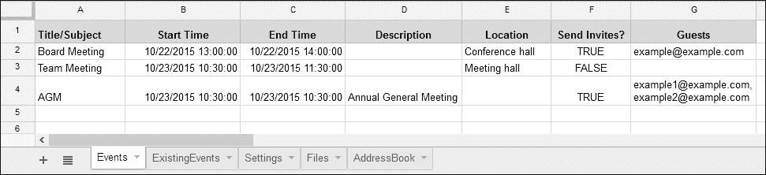

创建如所示的`createCalendarEventsFromSheetData`函数：

```js
function createCalendarEventsFromSheetData() {
  /*
   * 'Events' sheet column numbers,
   * use 0 for column 'A',
   * 1 for column 'B' and so on.
   * This makes life easy to use in '0' indexed JS arrays.
   *
   */
  const TITLE = 0;
  const START_TIME = 1;
  const END_TIME = 2;
  const DESCRIPTION = 3;
  const LOCATION = 4;
  const SEND_INVITES = 5;
  const GUESTS = 6;

  var sheet = SpreadsheetApp.getActiveSpreadsheet()
              .getSheetByName("Events");

  var data = sheet.getDataRange().getValues();

  // Remove header
  var header = data.shift();

  var options = {
    description : '',
    location : '',
    sendInvites : false,
    guests : ''
  };

  for(var i in data){
    /*
     * 'data' is a 2-dim array.
     * First index for row numbers and
     * second index for column numbers.
     *
     */
    options.description = data[i][DESCRIPTION];
    options.location = data[i][LOCATION];
    options.sendInvites = data[i][SEND_INVITES];
    options.guests = data[i][GUESTS];

    var title = data[i][TITLE];
    var startTime = data[i][START_TIME];
    var endTime = data[i][END_TIME];

    CalendarApp.getDefaultCalendar()
      .createEvent(title, startTime, endTime, options);
  }  
}
```

## 从外部 CSV 文件的内容创建事件

与从表格数据创建事件不同，你可以从上传到驱动的外部 CSV 文件中创建它们。上传一个与上一个任务中相同的头列的 CSV 文件。

获取上传文件的密钥/ID，并用以下代码替换它：

```js
function createEventsFromCsvData(){
  // CSV columns, 0 based.
  const TITLE = 0;
  const START_TIME = 1;
  const END_TIME = 2;
  const DESCRIPTION = 3;
  const LOCATION = 4;
  const SEND_INVITES = 5;
  const GUESTS = 6;

  // Put the key/ID of the CSV file placed in Drive.
  var blob = DriveApp.getFileById("[[ CSV file id ]]").getBlob();
  var str = blob.getDataAsString();

  var data = Utilities.parseCsv(str);
  // Now the data is a two-dimensional array

  // Remove header
  data.shift();

  var options = {
    description : '',
    location : '',
    sendInvites : false,
    guests : ''
  };

  for(var i in data){

    // Skip if no title
    if(!data[i][0]) continue;

    // Populate the options object
    options.description = data[i][DESCRIPTION];
    options.location = data[i][LOCATION];
    options.sendInvites = data[i][SEND_INVITES];
    options.guests = data[i][GUESTS];

    var title = data[i][TITLE];
    var startTime = data[i][START_TIME];
    var endTime = data[i][END_TIME];

    CalendarApp.getDefaultCalendar()
      .createEvent(title, startTime, endTime, options);

  }
}
```

# 启用高级谷歌服务

到目前为止，你一直在使用 GAS 的基本服务，例如`GmailApp`和`ContactsApp`。现在是你学习如何启用高级服务的时候了。

在这个任务中，我们将使用一个高级服务——日历服务，因此在使用之前我们必须启用它。

在脚本编辑器中，点击**资源**，然后点击**高级谷歌服务…**，将打开一个弹出窗口：

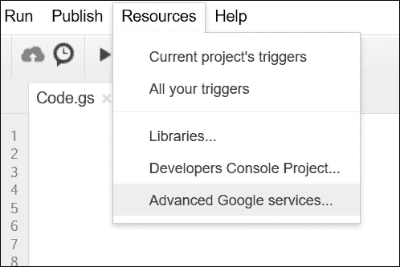

在**高级谷歌服务**弹出窗口中，所有 GAS 高级服务都将列出。查找**日历 API**服务，选择最新版本（默认选中），然后如果尚未启用，则启用它。在以下屏幕截图中，你可以看到日历 API 服务已启用：

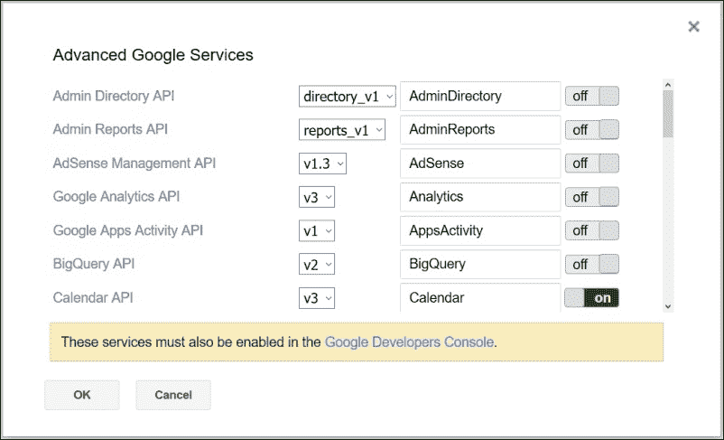

仅在脚本中启用高级服务是不够的，你还需要在谷歌开发者控制台中启用它，如弹出窗口中所示。为此，请点击弹出窗口中提供的链接。

然后，将打开一个新的浏览器窗口或标签页，其中列出了一些作为组的流行 API。您可以在 **Google Apps APIs** 组下看到 **Calendar API**。如果没有列出，请使用页面顶部的搜索选项搜索`calendar`一词。

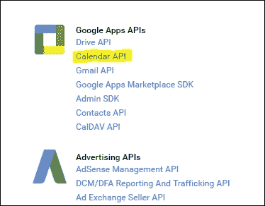

点击 **Calendar API**（如前一张截图中所示，用黄色突出显示），然后在随后的网页上点击 **启用 API**：

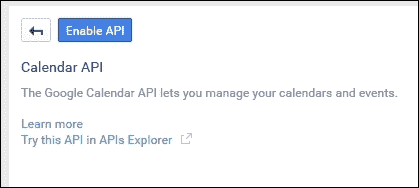

就这些；您已启用日历高级服务。

## 列出所有日历

启用日历高级服务后，您可以使用 `listCalendars` 函数记录所有您的日历：

```js
/**
 *  Logs all of your calendars with IDs.
 *
 */
function listCalendars() {
  var calendars, pageToken = null;

  do {
    calendars = Calendar.CalendarList.list({
      maxResults: 100,
      pageToken: pageToken
    });

    if (calendars.items && calendars.items.length > 0) {
      for (var i = 0; i < calendars.items.length; i++) {
        var calendar = calendars.items[i];
        Logger.log('%s (ID: %s)', calendar.summary, calendar.id);
      }
    } else {
      Logger.log('No calendars found.');
    };

    // If more than one page, then return a token, else null.
    pageToken = calendars.nextPageToken;

  } while (pageToken);
}
```

`Calendar.CalendarList.list` 对象返回所有日历的列表，前提是日历的数量小于 `maxResults` 的值。如果日历的数量大于此值，则使用 `nextPageToken` 值作为下一迭代的页面令牌。以下是日志的示例输出：

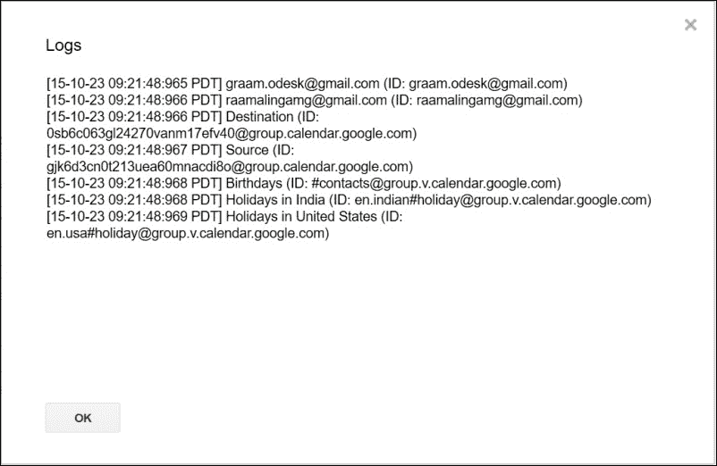

## 在表格中列出日历事件

要将任何日历的事件列表到表格中，创建一个名为 `ExistingEvents` 的新表格，并添加以下函数：

```js
function listEventsFromOneCalendar() {
  var sheet = SpreadsheetApp.getActiveSpreadsheet()
        .getSheetByName("ExistingEvents");

  var source = "Replace with source calendar email id";
  var srcCalId = Calendar.Calendars.get(source).id;

  var syncdays = 30;
  var now = new Date();
  var min = new Date(now.getFullYear(), now.getMonth(), now.getDate());
  var max = new Date(now.getFullYear(), now.getMonth(), now.getDate() + syncdays);

  var srcEvents = Calendar.Events.list(srcCalId, {
    timeMin: min.toISOString(),
    timeMax: max.toISOString(),
    singleEvents: true,
    orderBy: 'startTime',
  }).items;

  /*
   * To store events data in a spreadsheet we need
   * to construct a 2-dim array
   *
   */
  var output = [];

  /*
   * 'srcEvents' is an array of event objects.
   *
   * Every event object is passed as 'e' to the anonymous
   * function.
   *
   */
  srcEvents.forEach(function(e){
    // Construct an event array (1-dim)
    var event = [];

    /*
     * Returns "" if object value is 'null' or 'undefined'
     *   otherwise returns the object value.
     *
     */
    event.push(e.summary || "");
    event.push(e.start.dateTime || "");
    event.push(e.end.dateTime || "");
    event.push(e.description || "");
    event.push(e.location || "");

    // Push each event array to output (2-dim array).
    output.push(event);
  });

  var header = [
                 "Title/Subject",
                 "Start Time",
                 "End Time",
                 "Description",
                 "Location"
               ];

  // Insert header at the top of the output.
  output.unshift(header);

  sheet.clearContents();

  sheet.getRange(1, 1, output.length, header.length)
  .setValues(output);
};
```

我们刚才提到的函数从日历中收集所有事件，构建一个二维数组，并将该数组存储在 `ExistingEvents` 表格中。以下是前面代码的示例输出：

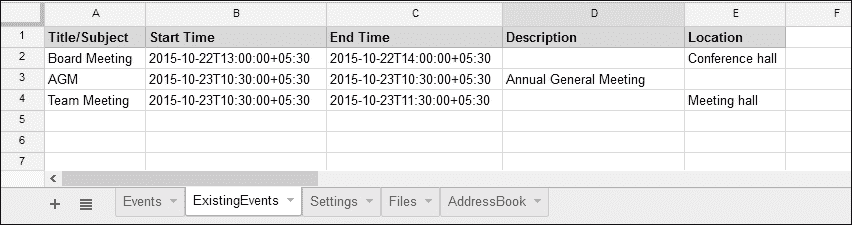

## 从一个日历同步事件到另一个日历

`syncEvents` 函数（如下面的代码中列出）同步源日历到目标日历的最后 30 天事件。为了测试此应用程序，创建主函数 `syncEvents` 和其他辅助函数，如 `updateEvent_`、`deleteEvent_` 和 `insertEvent_`。我们通过在事件标题/摘要前加上 `sync:` 并用方括号括起来来标记从源同步到目标的事件。例如，如果源事件是 `Example event`，则它将被标记为 `[sync:Example event]` 并插入/更新到目标日历中：

```js
/**
 *  Replace Source and Destination with your own Calendars name.
 *
 *  You should have write access in the destination Calendar,
 *  in other words it should have been created by you.
 *
 */
function syncEvents() {
  const RATE_LIMIT = 10; // Milliseconds

  var source = "[[ Source ]]"; // Source calendar email id.
  var destination = "Destination"; // Destination calendar name.

  var srcCalId = Calendar.Calendars.get(source).id;

  // Returns calendars (matching with the name) as an array
  var dstCal = CalendarApp
                 .getCalendarsByName(destination)[0];

  var dstCalId = dstCal.getId();

  var syncdays = 30;
  var now = new Date();

  var min = new Date(now.getFullYear(), now.getMonth(), now.getDate());
  var max = new Date(now.getFullYear(), now.getMonth(), now.getDate() + syncdays);

  // Get all source events as an array of objects.
  var srcEvents = Calendar.Events.list(srcCalId, {
    timeMin: min.toISOString(),
    timeMax: max.toISOString(),
    singleEvents: true,
    orderBy: 'startTime',
  }).items;

  // Get all destination events as an array of objects.
  var allDstEvents = Calendar.Events.list(dstCalId, {
    timeMin: min.toISOString(),
    timeMax: max.toISOString(),
    singleEvents: true,
    orderBy: 'startTime',
  }).items;

  /*
   * Get all destination events already synced from source
   * identified with the help of prefix '[sync:'
   *
   */
  var dstEvents = allDstEvents.filter(function(event){
      return /\[sync:\w+/.test(event.summary)?true:false;
  });

  // UPDATE all dstEvents with the corresponding srcEvents.
  for(var d in dstEvents){
    for(var s in srcEvents){

      if(dstEvents[d] && srcEvents[s] && dstEvents[d].id == srcEvents[s].id){
        /*
         * Update srcEvents with 'sync:' marking in the * destination calendar.
         *
         */
        srcEvents[s].summary = srcEvents[s].summary||'' + " [sync:"+source+"]";

        updateEvent_(srcEvents[s],dstCalId);

        // Delete updated dstEvents and srcEvents.
        srcEvents.splice(s,1);
        dstEvents.splice(d,1);
        Utilities.sleep(RATE_LIMIT);
      }

    }
  };

  /*
   * DELETE remaining dstEvents (those that do not exist in
   * srcEvents).
   *
   */
  for(var d in dstEvents){
    deleteEvent_(dstEvents[d],dstCalId);
    Utilities.sleep(RATE_LIMIT);
  };

  // INSERT remaining srcEvents (those do not exist in dstEvents).
  for(var s in srcEvents){
    srcEvents[s].summary = srcEvents[s].summary||'' 
+ " [sync:"+source+"]";
    insertEvent_(srcEvents[s],dstCalId);
    Utilities.sleep(RATE_LIMIT);
  }
};
```

之前提到的 `syncEvents` 函数从 `Source` 和 `Destination` 事件中收集事件，并按以下方式处理：

+   它更新了源和目的地（两个数组都有的）中出现的所有事件

+   它删除源中不存在但在目的地中存在的事件（即仅在目的地中出现）

+   它将源中出现但不在目的地中出现的事件插入（即仅在源中出现）

辅助函数列在这里：

```js
function updateEvent_(evt,calId){
  Calendar.Events.update( evt, calId, evt.id );
};

function deleteEvent_(evt,calId){
  Calendar.Events.remove(calId, evt.id);
};

function insertEvent_(evt,calId){
  try{
    Calendar.Events.insert(evt, calId);
  } catch(e) {
    var err = e.message;
    var newEvt = {
      summary:evt.summary,
      start:evt.start,
      end:evt.end,
      attachments:evt.attachments,
      attendees:evt.attendees,
      reminders:evt.reminders
    };

    if(err.search(/identifier already exists/gi) >= 0){
      updateEvent_(evt,calId);
    } else if(err.search(/Not Found/gi) >= 0){
      insertEvent_(newEvt,calId);
    } else if(err.search(/Invalid resource/gi) >= 0){
      insertEvent_(newEvt,calId);
    } else {
      Logger.log("%s [%s]\n",evt,err);
    };
  }
};
```

恭喜！您已创建了一个工作的日历同步应用程序。

# `DriveApp` 类

此类允许您在您的 Drive 中创建、搜索和修改文件和文件夹。

关于`DriveApp`类的参考文档，请参阅网站：[`developers.google.com/apps-script/reference/drive/drive-app?hl=en`](https://developers.google.com/apps-script/reference/drive/drive-app?hl=en)。

## 创建自定义 PDF 文件

假设你需要从工作表或外部数据创建自定义 PDF 文件。我们可以从 HTML 模板创建 PDF 文件。你只需格式化列标题，并在新的工作表（`AddressBook`）中放入一些示例数据，如下面的截图所示：

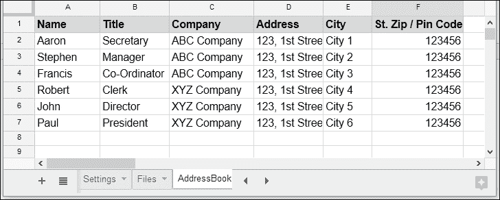

在`Code.gs`文件中创建`createPdfs`函数，具体步骤如下：

```js
function createPdfs(){

  // 0 based column numbers
  const NAME = 0;
  const TITLE = 1;
  const COMPANY = 2;
  const ADDRESS = 3;
  const CITY = 4;
  const ZIP_PIN = 5;

  /* Get data from the sheet */
  var sheet = SpreadsheetApp.getActiveSheet();
  var data = sheet.getDataRange().getValues();
  /*
   * Alternatively you can get data * from an external CSV file or anything else.
   * 
   * Example:
   * var blob = DriveApp.getFileById(id).getBlob();
   * var text = blob.getDataAsString();
   * var data = JSON.parse(text);
   *
   */

  // Remove headers
  data.shift();

  var folderName = "Letters";
  var folder, folders = DriveApp.getFoldersByName(folderName);

  // 'folders' is an iterator
  if (folders.hasNext()){
    // Get first folder if more than 1 with same name.
    folder = folders.next();
  } else {
    // Create folder if it does not exist.
    folder = DriveApp.createFolder(folderName);
  }

  for(var i in data){
    /*
     * Set as global variables so that we will be able to access
     * in the Template.html code.
     *
     */
    name = data[i][NAME];
    title = data[i][TITLE];
    company = data[i][COMPANY];
    address = data[i][ADDRESS];
    city = data[i][CITY];
    zip_pin = data[i][ZIP_PIN];

    var html = HtmlService.createTemplateFromFile ("Template.html").evaluate();

    // Convert HTML to PDF
    var pdf = html.getAs("application/pdf") 
.setName(name + ".pdf");

    // Save in the 'My Drive | Letter' folder.
    folder.createFile(pdf);
  }

}
```

`createPdfs`函数从工作表获取数据，或者你可以修改它以从外部源获取数据。它为每一行数据创建一个 HTML 模板，将其转换为 PDF，并将其存储在 Drive 文件夹中。让我们将`name`、`title`、`company`、`address`、`city`和`zip_pin`变量分配为全局变量。只有这样，我们才能在 HTML 模板中获取这些值。

创建一个名为`Template.html`的 HTML 文件，并输入以下代码：

```js
<!DOCTYPE html>
<html>
  <body>
    <p>To</p>
    <p>
      <?= name ?><br />
      <?= title ?><br />
      <?= company ?><br />
      <?= address ?><br />
      <?= city ?><br />
      <?= zip_pin ?><br />
    </p>
    <p>&nbsp;</p>
    <p>Dear <?= name ?>,</p>
    <p>Your message goes here...</p>

    <p>Regards,<br />[Your name]</p>
  </body>
</html>
```

此代码获取我们描述的全局变量值，并返回自定义的 HTML。在适当的位置更新你的消息和姓名。从这个 HTML 模板中，`createPdfs`函数创建 PDF 文件，每个文件都根据工作表中的单个行数据进行了定制。所有创建的 PDF 文件都保存在 Drive（`我的驱动器` | `信件`）文件夹中。

根据工作表数据（第 2 行）创建的 PDF 文件之一（`Aaron.pdf`）的内容如下所示：

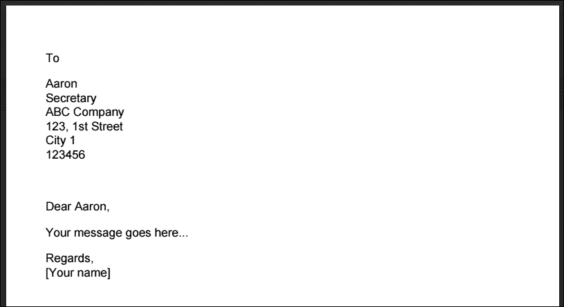

为了示例，我们使用了这个模板来创建一封简单的信件，但你可以根据你的需求和想象力使用任何类型的模板，例如发票、简历、求职申请等。

## 创建一个 Drive 文件路由应用

此应用程序可以通过匹配`设置`选项卡中的标准术语来移动文件。首先，创建一个新的工作表或选项卡，命名为`设置`，并按以下方式设置列标题：

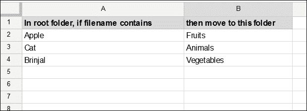

此外，创建`moveDriveFiles`函数，如下面的代码片段所示。如果你运行此函数，则它将根据**设置**工作表中的设置将文件从根文件夹移动到适当的文件夹。如果尚不存在，将创建目标文件夹。你还可以创建一个触发器，在预定时间或定期运行此函数：

```js
function moveDriveFiles(){
  var SheetSettings = SpreadsheetApp.getActiveSpreadsheet()
        .getSheetByName("Settings");

  // Open the root folder.
  var rootFolderName = "Replace with root folder name.";
  var rootFolder, destFolder, folders = DriveApp
        .getFoldersByName(rootFolderName);

  // 'folders' is an iterator
  if (folders.hasNext()) rootFolder = folders.next();
  else {
    // Show warning "Folder does not exist."
    Browser.msgBox(
      "The root folder " + rootFolderName + " not exist."
    );

    return;
  }

  var data = SheetSettings.getDataRange().getValues();
  data.shift();// Remove header row

  for(var i in data){
    var fileName = data[i][0];
    var folderName = data[i][1];

    // Open or create the destination folder
    folders = rootFolder.getFoldersByName(folderName);

    if (folders.hasNext()) destFolder = folders.next();
    else destFolder = rootFolder.createFolder(folderName);

    /*
     * Move matching files to the destination folder
     * The filename should be enclosed in quotes.
     *
     */
    var dest, file, files = rootFolder
          .searchFiles('title contains "' + fileName + '"');
    /*
     * In the above line, the searchFiles method's argument should
     * be a string (SQL-like query), so take care to escape special
     * characters.
     * Here is an alternative way to write the method:
     * searchFiles("title contains \"" + fileName + "\"")
     *
     */

    /*
     * We cannot move files directly,
     * so copy file to the destination and remove in source.
     *
     */
    while (files.hasNext()){
      dest = destFolder;
      file = files.next();

      file.makeCopy(file, dest);
      rootFolder.removeFile(file);
    }
  }
}
```

## 创建一个 Drive 文件搜索应用

现在你将创建一个文件搜索应用。它可以在文本字段中根据某些标准搜索 Drive 中的文件。在`Code.gs`文件中创建`onOpen`、`showSidebar`和`listDriveFiles`函数，如下所示：

```js
function onOpen(){
  SpreadsheetApp.getUi().createAddonMenu()
  .addItem("File Search", "showSidebar")
  .addToUi();
  showSidebar();
}

/**
 * Opens sidebar containing the user interface.
 *
 */
function showSidebar() {
  SpreadsheetApp.getUi().showSidebar(
    HtmlService.createHtmlOutputFromFile('Sidebar')
      .setTitle('Search Files in Drive')
  );
}
```

`onOpen`函数创建一个插件菜单并调用`showSidebar`函数。这意味着每次打开电子表格时，都会添加插件菜单并显示侧边栏：

```js
/**
 *  Lists files matching with arg 'txt', in the Settings sheet.
 *  
 */
function listDriveFiles(txt){
  // 'Files' sheet column heading.
  var header = ["File", "URL"];

  var output = [header];

  var file, files = DriveApp.searchFiles ('title contains "' + txt + '"');

  // 'files' is an iterator.
  while (files.hasNext()){
    file = files.next();
    var name = file.getName();
    var link = file.getUrl();

    output.push([name,link]);
  };

  var sheet = SpreadsheetApp.getActiveSpreadsheet()
        .getSheetByName("Files");

  sheet.clearContents();

  /*
   * output.length for number of rows and
   * header.length for number of columns
   *
   */
  sheet.getRange(1, 1, output.length, header.length)
    .setValues(output);
}
```

创建一个名为 `Sidebar.html` 的新 HTML 文件，并将以下代码放入其中：

```js
<!DOCTYPE html>
<html>
  <head>
    <base target="_top">
    <link rel="stylesheet" href="https://ssl.gstatic.com/docs/script /css/add-ons1.css" />
    <script src="img/jquery.min.js">
    </script>

  </head>

  <body>
    <input type="text" id="txt" />
    <button class="green" id="btn">Search</button>
  </body>

  <script>
    // On document load, assign click handler to the search
    // button.
    $(function() {
      $('#btn').click(listFiles);
    });

    function listFiles() {
      this.disabled = true;
      $('#error,#success').remove();
      google.script.run
        .withSuccessHandler(function(msg,elm){
           elm.disabled = false;
         })
        .withFailureHandler(function(err,elm){
           elm.disabled = false;
           showError(err,elm);
         })
        .withUserObject(this)
        .listDriveFiles($('#txt').val());
    }

    /**
     * Inserts a div that contains success message after a given 
     * element.
     *
     * @param {string} msg - The message to display.
     * @param {object} element - The element after which to 
     * display the message.
     *
     */
    function showSuccess(msg,element) {
      var div = $('<div id="success"><font color="green">' + msg + '</font></div>');
      $(element).after(div);
    }

    /**
     * Inserts a div that contains error message after a given 
     * element.
     *
     * @param {string} msg - The error message to display.
     * @param {object} element - The element after which to 
     *  display the error.
     *
     */
    function showError(msg, element) {
      var div = $('<div id="error" class="error">' + msg + '</div>');
      $(element).after(div);
    }

  </script>
</html>
```

在打开电子表格或运行 `showSidebar` 函数时，侧边栏将打开，如以下截图所示，除了文本字段中的 `Chapter` 文本。你可以输入任何其他文本来搜索文件。点击 **搜索** 按钮后，脚本将在 Drive 中搜索包含该文本的文件，并在 `Files` 工作表中填充数据。

以下截图显示了侧边栏和示例输出：

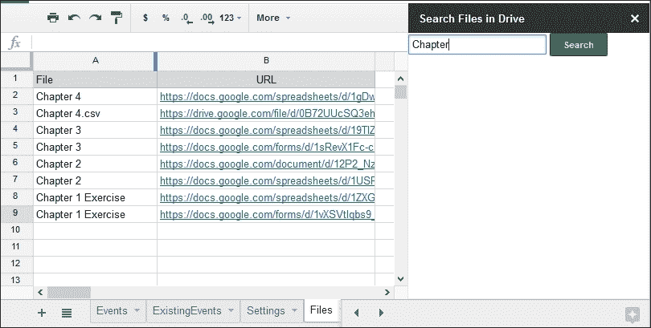

# 摘要

在本章中，你学习了并创建了许多有用的实际应用，包括一个事件同步应用。在下一章中，你将学习如何创建 RSS/Atom 阅读器和语言翻译应用。
