# 第六章。创建 Feed 阅读器和翻译应用程序

在上一章中，你学习了如何创建日历事件和 Drive 应用程序。你构建了许多实际的应用程序。

在本章中，你将学习如何

+   创建 Google 搜索

+   创建股票报价滚动条

+   创建 RSS 源阅读器

+   创建 Atom 源阅读器

+   创建语言翻译应用程序

+   创建文档审阅和即时内联评论应用程序

# UrlFetchApp 类

`UrlFetchApp` 类可用于发出 HTTP/HTTPS 请求并从任何网站/URL 获取响应。例如，`UrlFetchApp.fetch ("https://ajax.googleapis.com/ajax/services/search/web?v=1.0&q=PACKT")` 代码返回了带有搜索词 `PACKT` 的搜索结果。响应将包含原始内容和 HTTP 标头。

如果 `UrlFetchApp` 类的 `fetch` 方法和 URL 之间的通信正常，则 URL 应返回响应代码 `200`。否则，任何其他数字都对应于错误类型。我们可以在使用 `getResponseCode` 方法之前检查响应代码。

你可以使用 `getContentText` 方法获取内容文本，并将其解析为 JSON 对象。以下代码片段提取了内容文本并将其解析为 JSON：

```js
var url = "https://ajax.googleapis.com/ajax/services/search /web?v=1.0&q=PACKT";
try{
    var resp = UrlFetchApp.fetch(url);
    if(resp.getResponseCode() == 200){
      var text = resp.getContentText();
      var json = JSON.parse(text);
      Logger.log(json);
    }
  } catch(e){
    Logger.log(e);
  };
```

为了帮助你理解，以下提供了日志输出（文本可能被截断和格式化以节省空间）：

```js
{
  responseDetails=null,
  responseData={
    cursor={
      moreResultsUrl=http://www.google.com/search?oe=utf8&ie=utf8
        &source=uds&start=0&hl=en&q=PACKT,
      resultCount=800,000,
      pages=[{start=0, label=1}, {start=4, label=2}, {start=8, 
        label=3}, {start=12, label=4}, {start=16, label=5}, 
        {start=20, label=6}, {start=24, label=7}, {start=28, 
        label=8}],
      searchResultTime=0.29,
      currentPageIndex=0,
      estimatedResultCount=800000
    },
    results=[
      {
        visibleUrl=www.packtpub.com,
        cacheUrl=http://www.google.com/search?q=cache:rbL6l6pFt8…,
        GsearchResultClass=GwebSearch,
        title=<b>Packt</b> Publishing | Technology Books, eBook…,
        titleNoFormatting=Packt Publishing | Technology Books…,
        url=https://www.packtpub.com/,
        content=<b>Packt</b> Publishing is the leading UK provid…,
        unescapedUrl=https://www.packtpub.com/
      }, {
        visibleUrl=www.packtpub.com,
        cacheUrl=http://www.google.com/search?q=cache:wo2TeIpsCG…,
        GsearchResultClass=GwebSearch,
        title=Free Learning | <b>PACKT</b> Books - <b>Packt</b> …,
        titleNoFormatting=Free Learning | PACKT Books - Packt Pu…,
        url=https://www.packtpub.com/packt/offers/free-learning,
        content=A new free programming tutorial book every day...,
      }, {
        visibleUrl=www.packtpub.com,
        cacheUrl=http://www.google.com/search?q=cache:D7qMTpx1Nu…,
        GsearchResultClass=GwebSearch,
        title=All Books and eBooks | <b>PACKT</b> Books - <b>Pac…,
        titleNoFormatting=All Books and eBooks | PACKT Books – P…,
        url=https://www.packtpub.com/all,
        content=Packt Publishing provides technology eBooks, boo…,
        unescapedUrl=https://www.packtpub.com/all
      }
    ]
  },
  responseStatus=200
 }
```

JSON 的顶级对象是 `responseDetails`、`responseData` 和 `responseStatus`。如果 Google 返回了正确的响应，那么 `responseStatus` 的值应该是 `200`。这是由 Google 搜索服务返回的，而不是 `UrlFetchApp` 的状态。你也可以检查 `responseStatus` 的值是否等于 `200`，以确认响应内容是否正常。

你需要深入挖掘 `responseData` 对象，它包含作为对象数组的搜索结果。要获取数组，请使用 `json.responseData.results`，然后遍历数组以获取所需的结果数据。我们将创建一个应用程序来搜索 Google 并在表格中填充结果。

## 创建 Google 搜索应用程序

创建一个新的表格，将其重命名为 `Google` 并创建如下截图所示的标题：

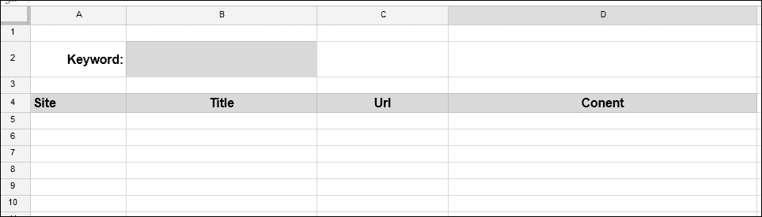

然后，在 `Code.gs` 文件中输入以下代码：

```js
function searchGoogle(){

  var ss = SpreadsheetApp.getActiveSpreadsheet();
  var SheetGoogle = ss.getSheetByName("Google");
  var kwd = SheetGoogle.getRange("B2").getValue();

  // Encode URI components if any in kwd
  kwd = encodeURIComponent(kwd);

  // Replace space with '+'
  kwd = kwd.replace(/%20/gi, "+");

  // Remove '?' marks
  kwd = kwd.replace(/%3F/gi, "");

  var url = "https://ajax.googleapis.com/ajax/services/ search/web?v=3.0&q=" + kwd;

  try{
    var resp = UrlFetchApp.fetch(url).getContentText();
    var json = JSON.parse(resp);
    var result = json.responseData.results;
  } catch(e){
    Logger.log(e);
  };

  // We require a 2-dimensional array to store data in sheet
  var output = [];
  var visibleUrl,title,url,content;

  for(var i=0; i<result.length; i++){
    visibleUrl = result[i].visibleUrl;
    title = result[i].title;
    url = result[i].url;
    content = result[i].content;

    output.push([visibleUrl,title,url,content]);
  };

  /*
   * output.length for number of rows and output[0].length for
   * number of columns
   *
   */
  SheetGoogle.getRange(5, 1, output.length, output[0].length)
    .setValues(output);
}
```

以下截图显示了应用程序的示例输出：

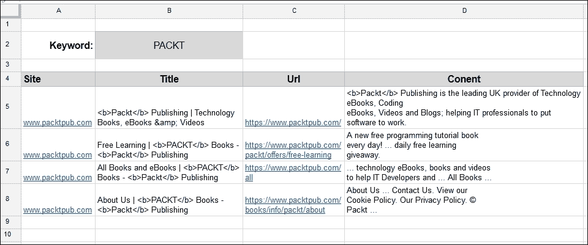

你可以使用单元格 *B2* 中的其他关键词测试代码。你可以为 `searchGoogle` 函数创建一个按钮或自定义菜单，以便你可以频繁搜索。

## 创建股票报价滚动条应用程序

以下截图显示了从 Google 财经获取股票报价的简单函数。查询字符串 (`q`) 指定了 `NASDAQ` 作为证券交易所，`GOOG`（谷歌）作为股票代码。

```js
function getStockQuote1(){
  var url = "http://finance.google.com/finance/info?q=NASDAQ:GOOG";

  var resp = UrlFetchApp.fetch(url).getContentText();
  Logger.log(resp);
}
```

在前面的代码中，我们正在使用 `UrlFetchApp` 类的 `fetch` 方法。日志响应如下：

```js
 // [
{
"id": "304466804484872"
,"t" : "GOOG"
,"e" : "NASDAQ"
,"l" : "717.00"
,"l_fix" : "717.00"
,"l_cur" : "717.00"
,"s": "0"
,"ltt":"4:00PM EST"
,"lt" : "Nov 13, 4:00PM EST"
,"lt_dts" : "2015-11-13T16:00:01Z"
,"c" : "-14.23"
,"c_fix" : "-14.23"
,"cp" : "-1.95"
,"cp_fix" : "-1.95"
,"ccol" : "chr"
,"pcls_fix" : "731.23"
}
]
```

在返回的响应文本中，你可以看到前四个字符是一个换行符，两个斜杠（`//`）和一个空格字符，因此你必须在解析所需的 JSON 对象之前移除它们。从返回的字符串中移除前四个字符会使事情变得更容易。你可以使用 `substr` 方法来移除前四个字符。JavaScript JSON（JavaScript 对象表示法）对象的 `parse` 方法将字符串解析为 JSON 对象。

获取 Google 股票的 **最后交易价格**（**LTP**）的修改后代码如下：

```js
function getStockQuote2(){
  var url = "http://finance.google.com/finance/info?q=NASDAQ:GOOG";

  var resp = UrlFetchApp.fetch(url).getContentText().substr(4);
  var json = JSON.parse(resp);
  Logger.log(json[0].l);
}
```

你可以在查询字符串中使用多个股票代码（以逗号分隔）。例如，`http://finance.google.com/finance/info?q=NASDAQ:GOOG,AMD,MCHP`。然后，响应将是一个股票报价对象的数组。你必须遍历数组以获取每个股票代码的数据。

我们将创建一个完整的股票报价应用程序。创建或添加一个新的表格，并将其重命名为 `Quotes`，填充 `SYMBOL` 列，并按以下格式进行格式化：

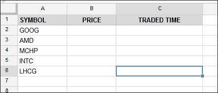

根据 listed here 修改 `Code.gs` 文件中的 `getStockQuotes` 函数：

```js
function getStockQuotes(){
  var SheetQuotes = SpreadsheetApp.getActiveSpreadsheet()
                    .getSheetByName("Quotes");

  var data = SheetQuotes.getDataRange().getValues();

  // Remove the header from data.
  var header = data.shift();

  // Extracts all symbols from sheet data.
  var aScrips = [];
  for(var i in data) aScrips.push(data[i][0]);

  // Join all scrip names with comma.
  var sScrips = aScrips.join(",");

  // Fetch data with scrip names as query.
  var url = "http://finance.google.com/finance/info?q=NASDAQ:"+sScrips;

  // Send the request to the url
  try{
    var resp = UrlFetchApp.fetch(url).getContentText().substr(4);
    var json = JSON.parse(resp);
  } catch (e) {
    Logger.log(e.message);
    return;
  }

  // We require a 2-dimensional array to store data in sheet.
  var output = [];

  // Traverse through all JSON objects.
  for(var i in json){
    var q = json[i];

    // Symbol, price and traded time.
    output.push([q.t,q.l,q.ltt]);
  };

  // Restore the header again.
  output.unshift(header);

  // Save the output in sheet.
  SheetQuotes.getDataRange().setValues(output);
}
```

以下是该应用程序的样本输出：

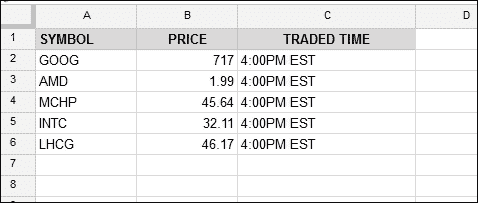

对于重复的报价跳动，你可以为 `getStockQuotes` 函数创建一个按分钟触发的触发器。

## 记录比特币报价

你听说过比特币、数字或虚拟货币吗？是否曾经观察过比特币价格跳动来买卖比特币？**比特币**是一种数字资产，正在全球范围内推广一种新的支付系统。这里有一个有趣的记录实时比特币价格的应用程序。在这个应用程序中，我们将记录 Bitstamp 交易平台的价格。[`www.bitstamp.net`](https://www.bitstamp.net) 提供获取比特币实时价格跳动的 API。

```js
function getBitCoinPrice(){
  // BitStamp api url
  var url = "https://www.bitstamp.net/api/ticker/";

  var resp = UrlFetchApp.fetch(url);

  if(resp.getResponseCode() == 200){
    var json = JSON.parse(resp);
    Logger.log(json);
  }
}
```

解析为 JSON 的 Bitstamp API 的响应在此提供：

```js
{volume=6209.19457553, high=422.00, last=420.39, low=414.00, vwap=419.15, ask=421.48, bid=420.23, open=421.15, timestamp=1455894447}
```

解析所述 JSON 对象到表格的完整代码在此提供：

```js
/**
 *  Log bitcoin price ticks in sheet
 *
 */
function getBitCoinData(){
  var ss = SpreadsheetApp.getActiveSpreadsheet();
  var SheetBitCoin = ss.getSheetByName("Bitcoin");

  // Header labels at the top row of the sheet.
  var header = [
      "Timestamp",
      "High",
      "Low",
      "Volume",
      "Bid",
      "Ask"
    ];

  // Insert headers at the top row of the Bitcoin sheet.
  SheetBitCoin.getRange(1,1,1,6).setValues([header]);
  // setValues accept 2-dim array

  // BitStamp api url
  var url = "https://www.bitstamp.net/api/ticker/";

  try{
    var resp = UrlFetchApp.fetch(url);

    // Proceed if no errors returned.
    if(resp.getResponseCode() == 200){

      var json = JSON.parse(resp);

      var output = [];

      /*
       * Bitstamp returns timestamp in seconds
       * (elapsed since epoch), but JavaScript Date accepts in
       * milliseconds, so multiply by 1000.
       *
       */
      output.push( new Date(json.timestamp *= 1000) );

      // last 24 hours high.
      output.push(json.high);

      // last 24 hours low.
      output.push(json.low);

      // last 24 hours volume.
      output.push(json.volume);

      // highest buy order.
      output.push(json.bid);

      // lowest sell order.
      output.push(json.ask);

      // Append output to Bitcoin sheet.
      SheetBitCoin.appendRow(output);
    }

  } catch(e){
    // Log errors to examine and debug it later.
    Logger.log(e);

    throw e;
  }
};
```

这里提供了一个样本记录的比特币数据。**最高价**、**最低价**和**成交量**值是过去 24 小时内的最高价、最低价和总成交量。**买入价**和**卖出价**是实时值。为 `getBitCoinData` 函数的重复执行创建一个触发器。

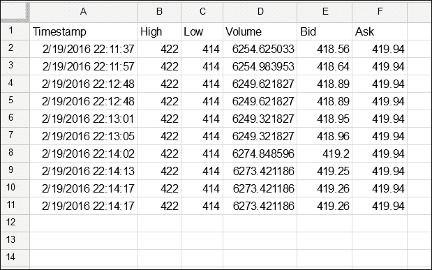

# RSS 和 Atom 源

RSS 代表 **丰富网站摘要**。它用于发布经常更新的信息。用户需要独立的特殊软件应用程序或浏览器插件，称为 **RSS 阅读器**，来读取任何源的信息。

源文档包含摘要或全文、元数据、发布日期、作者姓名等。使用源，用户可以接收网站的及时更新或聚合多个网站的数据。用户不需要频繁手动检查这些网站的更新，但需要订阅源。源阅读器会频繁检查订阅的网站是否有新数据，并检索它们。

## RSS feed 文档的骨架

这里列出了一个 RSS 馈送文档的示例：

```js
<?xml version="1.0" encoding="UTF-8"?>
<rss version="2.0">
  <channel>
    <title>Title of the channel</title>
    <description>A brief description of the channel</description>
    <language>en-US</language>
    <item>
      <title>Item title</title>
      <link>Link to the item</link>
      <pubDate>Fri, 30 Oct 2015 19:41:00 +0000</pubDate>
      <creator><![CDATA[Author Name]]></creator>
      <category><![CDATA[NEWS]]></category>
      <description><![CDATA[encoded description…]]></description>
    </item>
    <item> … </item>
    <item> … </item>
    <item> … </item>
  </channel>
</rss>
```

第一行指定了版本，因为这个是一个 XML 文档，对处理软件应用程序来说。

所有其他元素都包含在 `rss` 根元素内。

`channel` 元素内部的 `title`、`description` 和 `language` 元素分别指定了频道标题、描述以及频道发布的语言。

`item` 元素是重复的，它包含单个馈送项信息，例如 `title`（项的标题）、`link`（项的链接）、`comments`（关于项的评论）、`pubDate`（项的发布日期）、`creator`（项的创建者）、`category`（指定项属于哪个类别）、`description`（关于项的简要描述）以及更多。

## 创建一个 RSS 阅读器应用程序

您必须使用 `XmlService` 从 `UrlFetchApp` 返回的 XML 文档中解析所需内容。实际代码如下所示：

```js
function readRssFeedContents(){
  var SheetData = SpreadsheetApp.getActiveSpreadsheet()
                    .getSheets()[0];

  var title, posturl, author, row, output = [];

  // Prefix namespace.
  var dc = XmlService.getNamespace('http://purl.org/dc/elements/1.1/');

  // Fetch feed document.
  var xml = UrlFetchApp.fetch("http://siliconangle.com/feed/")
            .getContentText();

  // Parse the response text from the URL.
  var doc = XmlService.parse(xml);

  // Get child elements from the root element.
  var items = doc.getRootElement().getChild('channel')
              .getChildren('item');

  // Process the required data.
  for(var i=0; i<items.length; i++){
    title = items[i].getChild('title').getText();
    posturl = items[i].getChild('link').getText();
    author = items[i].getChild('creator', dc).getText();
    row = [title].concat(posturl, author);

    output.push(row);
  };

  // Write new data to sheet
  SheetData.getRange(2, 1, output.length, output[0].length)
    .setValues(output);
}
```

在前面的代码中，使用 `XmlService` 解析任何良好结构的 XML 内容。在提到的示例源中，我们专注于 `channel` 元素和一个或多个 `item` 元素。`item` 元素本身包含更多信息。要获取所需数据，您必须按照 `channel` | `item` | `title` | `link` | `creator` 的顺序挖掘内容。`creator` 元素以 `dc` 前缀开头，因此我们必须在代码的最上面几行分配 `dc` 命名空间 URL。

此应用程序的示例输出如下所示：

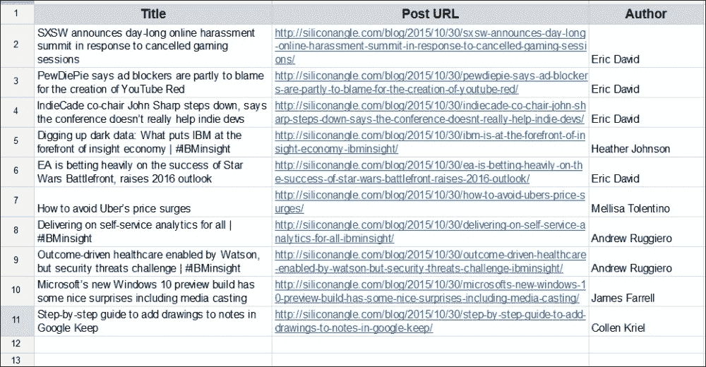

## Atom 馈送文档的骨架

Atom 馈送类似于 RSS 馈送，具有许多高级功能。`root` 元素是 `feed` 而不是 `channel`。这里展示了一个 Atom 馈送文档的示例：

```js
<?xml version="1.0" encoding="utf-8"?>
<feed >
  <title>Atom Feed</title>
  <subtitle>Subtitle of the feed</subtitle>
  <link href="http://example.com/" />
  <updated>2015-11-13T06:30:02Z</updated>
  <entry>
    <title>Title of the item</title>
    <link href="http://example.com" />
    <updated>2015-11-13T06:30:22Z</updated>
    <summary>Summary text of the item</summary>
    <author>
      <name>Author name</name>
      <email>example@example.com</email>
    </author>
  </entry>
  <entry>...</entry>
  <entry>...</entry>
  <entry>...</entry>
</feed>
```

## 创建一个 Atom 馈送阅读器应用程序

此应用程序解析 Google 热门趋势 Atom 馈送。以下是从 Google 热门趋势 Atom 馈送读取内容的代码：

```js
function readAtomFeedContents(){
  // SheetData refers left most sheet.
  var SheetData = SpreadsheetApp.getActiveSpreadsheet()
                  .getSheets()[0];

  // Set column titles.
  var title, description, output = [["Trends", "Related Searches"]];

  // Fetch data from the feed url.
  var xml = UrlFetchApp.fetch("http://www.google.com/trends/ hottrends/atom/feed").getContentText();

  // Parse the result as xml content.
  var doc = XmlService.parse(xml);

  // Get item elements from the root element.
  var items = doc.getRootElement().getChild('channel')
              .getChildren('item');

  // Clear existing sheet data and sets new values.
  SheetData.clearContents();

  // Store new data.
  SheetData.getRange(1, 1, 1,output[0].length).setValues(output);

  /*
   * Dig into 'item' element and parse all the required data.
   * Get other related search terms.
   *
   */
  for(var i=0; i<items.length; i++){
    title = items[i].getChild('title').getText();
    description = items[i].getChild('description').getText();
    output = [title].concat(description.split(','));

    // Sets output data in sheet.
    SheetData.getRange(i+2, 1, 1, output.length)
      .setValues([output]);
  }
};
```

此应用程序的示例输出如下所示：

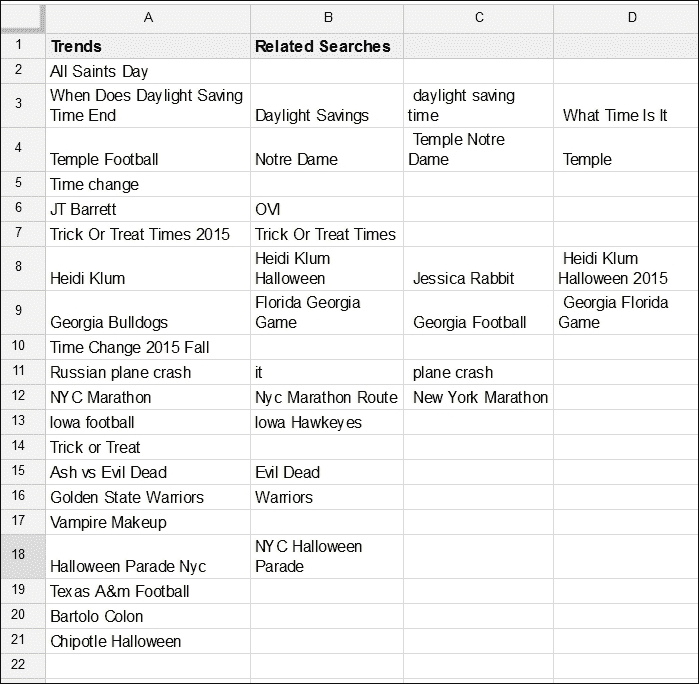

## 使用 UrlFetchApp 类的可选参数

所有上述应用程序从公共 URL 获取结果；这意味着它们不需要凭据。如果网站在发送响应之前需要您的凭据，例如用户名和密码，怎么办？您可以将凭据和其他参数作为 `UrlFetchApp` 类的可选参数提供，例如 `UrlFetchApp.fetch(url, params)`。`params` 参数类似于以下内容：

```js
var params = {
  method: "GET",
  headers: headers
}
```

`headers` 变量（HTTP/HTTPS 请求头）可以是一个 JavaScript 键/值映射。您可以将登录凭据作为头信息提供：

```js
var headers = {
  // Basic authentication
  Authorization: "Basic "
    + Utilities.base64Encode("username:password");
}
```

您的用户名和密码将被编码但不会被加密，因此请优先使用 HTTPS 而不是 HTTP。

### 注意

并非所有网站都支持基本身份验证；它们大多支持 OAuth。`UrlFetchApp`类的内置 OAuth 服务已弃用，并转移到名为 GAS 库的开源库中。有关如何导入外部库和使用 OAuth2 开源库的更多信息，请参阅第九章更多技巧和窍门以及创建插件：

# `LanguageApp`类

`LanguageApp`类提供了`translate`方法，用于将任何文本从一种语言翻译成另一种语言。

例如，要将`Google apps script for beginners`翻译成法语，请使用以下代码：

```js
function translateToFrench(){
  var text = "Google apps script for beginners";
  var sourceLanguage = "en";
  var targetLanguage = "fr";
  var french = LanguageApp
    .translate(text, sourceLanguage, targetLanguage);

  Logger.log(french);
}
```

记录的输出将是：`Google Apps Script pour les débutants`。

### 注意

Google 翻译服务支持许多语言。有关支持的语言的更多信息，请访问：

[`cloud.google.com/translate/v2/using_rest#language-params`](https://cloud.google.com/translate/v2/using_rest#language-params)

## 创建语言翻译应用程序

此应用程序将文本从一种语言翻译成另一种语言。我们将使用一个文档作为源/源文档，另一个文档作为目标/目标文档。我们将开发此应用程序作为插件。尽管内置的翻译服务可用（在文档应用程序中导航到**工具** | **翻译文档…**），但我们提供了语言翻译应用程序来探索 GAS 的功能。

在源文档（文档）的`Code.gs`文件中输入以下代码：

```js
/*
 * Replace with the id/key of the target document in which the
 * translated text to be saved.
 *
 */
var targetDocumentId = "Replace with target document id";
```

之前的代码将目标文档的 ID 设置为`targetDocumentId`全局变量。目标文档是你打算将翻译文本转移到的文档。将双引号内的文本替换为目标文档的 ID 字符串：

```js
/**
 * Creates a menu entry in the Google Docs UI when the document
 * is opened.
 *
 */
function onOpen(e) {
  DocumentApp.getUi().createAddonMenu()
      .addItem('Start', 'showSidebar')
      .addToUi();
}
```

之前的`onOpen`函数创建了一个**插件**菜单，其中有一个名为**开始**的菜单项。它与`showSidebar`函数相关联：

```js
/**
 * Opens a sidebar in the document containing the add-on's user
 * interface.
 *
 */
function showSidebar() {
  var ui = HtmlService.createTemplateFromFile('Sidebar')
           .evaluate()
           .setTitle('Translate');

  DocumentApp.getUi().showSidebar(ui);
}
```

之前的`showSidebar`函数创建了带有所需控制元素的侧边栏。

```js
/**
 * Gets the stored user preferences for the destination language,
 * if exist.
 *
 */
function getPreferences() {
  var userProperties = PropertiesService.getUserProperties();

  var languagePrefs = {
    destLang: userProperties.getProperty('destLang')
  };

  return languagePrefs;
};
```

`getPreferences`函数获取并返回用户的语言偏好。此处显示的`runTranslation`函数将文本从源语言翻译成目标语言。语言用它们的两位字母简称表示。例如，英语是`en`，德语是`de`，默认为自动，这意味着 Google 翻译服务将自动检测源语言。如果`savePrefs`参数为`true`，则用户语言偏好将被保存：

```js
function runTranslation(dest, savePrefs) {
  if (savePrefs == true) {
    var userProperties = PropertiesService.getUserProperties();
    userProperties.setProperty('originLang', 'en');
    userProperties.setProperty('destLang', dest);
  }

  var srcFile = DocumentApp.getActiveDocument();
  var tgtFile = DocumentApp.openById(targetDocumentId);

  var srcBody = srcFile.getBody();
  var tgtBody = tgtFile.getBody();

  tgtBody.appendParagraph("");
  tgtBody.clear();

  var item = srcBody.getChild(0);

  while(item){
    var type = item.getType();

    if(type == "LIST_ITEM"){
      var attrib = item.getAttributes();  
var srcText = item.getText(); 
var transText = LanguageApp.translate(srcText, "en", dest); 
tgtBody.appendParagraph(transText).setAttributes(attrib);

    item = item.getNextSibling();
  };

  tgtBody.getChild(0).removeFromParent();
};
```

下面的`include`辅助函数将来自其他文件的外部 JS/CSS 内容（文件名作为参数给出）放入 HTML 文件中：

```js
function include(filename) {
  return HtmlService.createHtmlOutputFromFile(filename)
    .getContent();
}
```

从**文件**菜单创建一个新的 HTML 文件（`Sidebar.html`）并输入以下代码：

```js
<!DOCTYPE html>
<html>
  <head>
    <base target="_top">
    <script src="img/webcomponents.js"></script>

    <link rel="import" href="//polymerstaticfiles.appspot.com/bower_components /polymer/polymer.html">

    <link rel="import" href="//polymerstaticfiles.appspot.com/ bower_components/font-roboto/roboto.html">

    <link rel="import" href="//polymerstaticfiles.appspot.com/ bower_components/paper-input/paper-input.html">

    <link rel="import" href="//polymerstaticfiles.appspot.com/ bower_components/paper-button/paper-button.html">

    <link rel="import" href="//polymerstaticfiles.appspot.com/ bower_components/paper-checkbox/paper-checkbox.html">

    <link rel="import" href="//polymerstaticfiles.appspot.com/ bower_components/paper-radio-group/paper-radio-group.html">

    <link rel="import" href="//polymerstaticfiles.appspot.com/ bower_components/paper-radio-button/paper-radio-button.html">

    <link rel="import" href="//polymerstaticfiles.appspot.com/ bower_components/paper-input/paper-input-decorator.html">

    <!-- Insert CSS code -->
    <?!= include('Sidebar.css.html'); ?>
  </head>

  <body>
    <div class="sidebar">
      <h4>Translate into</h4>
      <paper-radio-group id="dest">
        <paper-radio-button name="en" id="radio-dest-en" label="English"></paper-radio-button>

        <paper-radio-button name="fr" id="radio-dest-fr" label="French"></paper-radio-button>

        <paper-radio-button name="de" id="radio-dest-de" label="German"></paper-radio-button>

        <paper-radio-button name="ja" id="radio-dest-ja" label="Japanese"></paper-radio-button>

        <paper-radio-button name="es" id="radio-dest-es" label="Spanish"></paper-radio-button>
      </paper-radio-group>

      <br /><br />
      <hr />

      <paper-checkbox id="save-prefs" label="Use this language by default"></paper-checkbox>

      <div id="button-bar">
        <paper-button raised class="colored" id="run- translation">Translate</paper-button>
      </div>
    </div>

    <!--  Insert JS code -->
    <?!= include('Sidebar.js.html'); ?>
  </body>
</html>
```

在前面的代码中，使用了 Google 的聚合物组件库。尽管我们可以使用简单的 HTML 元素，但我们使用了聚合物组件来获得侧边栏的美观外观和感觉。您无需担心该库的功能，只需按照所示包含 URL 即可。`include` 辅助函数插入作为参数给出的相应文件的内容。

创建另一个 HTML 文件，并将其命名为 `Sidebar.css`，包括 `.css` 扩展名。脚本编辑器将添加 `.html` 扩展名，因此文件名将是 `Sidebar.css.html`。在文件中输入以下代码：

```js
<style>
  body {
    font-family: 'RobotoDraft', sans-serif;
    margin: 0;
    padding: 0;
  }

  h4 {
    text-align: center;
    margin: 0;
  }

  paper-button {
    margin: 0;
    margin-top: 10px;
  }

  .sidebar {
    -moz-box-sizing: border-box;
    box-sizing: border-box;
    overflow-y: auto;
    padding: 12px;
    position: absolute;
    width: 100%;
  }

  #dest {
    margin-top: 5px;
  }

  .error {
    color: #dd4b39;
    font-size: small;
    margin-top: 8px;
  }

  .colored {
    background: #4285f4;
    color: #ffffff;
  }
</style>
```

前面的 CSS 代码定义了 `Sidebar.html` 文件中 HTML 元素的样式。CSS 在相关的大括号内定义元素样式。

例如：

+   `body` 样式名称定义了主体元素的样式

+   `h4` 定义了第四级标题元素的样式

+   带有点（`.`）前缀的样式名称定义了属于该类的元素的样式

+   带有井号符号（`#`）前缀的名称定义了与样式名称相同的元素的样式

### 小贴士

要进一步了解 CSS，请参阅 [`developer.mozilla.org/en-US/Learn/CSS`](https://developer.mozilla.org/en-US/Learn/CSS)。

创建另一个 HTML 文件，并将其命名为 `Sidebar.js`。在新建的 `Sidebar.js.html` 文件中输入以下代码：

```js
<script src="img/jquery.min.js"></script>

<script>
  /**
   * On document load, assign click handlers to each button and
   * try to load the user's origin and destination language
   * preferences, if previously set.
   *
   */
  $(function() {
    $('#run-translation').click(runTranslation);

    google.script.run
      .withSuccessHandler(loadPreferences)
      .withFailureHandler(showError).getPreferences();
  });

  /**
   * Callback function that populates the origin and destination
   * selection boxes with user preferences from the server.
   *
   */
  function loadPreferences(languagePrefs) {
    if (languagePrefs.destLang){ 
      $('#dest').prop('selected', languagePrefs.destLang);
    }
  }

  /**
   * Runs a server-side function to translate the text.
   *
   */
  function runTranslation() {
    this.disabled = true;
    $('#error').remove();

    var dest = $('#dest').prop('selected');
    var savePrefs = $('#save-prefs').prop('checked');

    google.script.run
      .withSuccessHandler(
        function(msg, element) {
          element.disabled = false;
        })
      .withFailureHandler(
        function(msg, element) {
          showError(msg, $('#button-bar'));
          element.disabled = false;
        })
      .withUserObject(this)
      .runTranslation(dest, savePrefs);
  }

  /**
   * Inserts a div that contains an error message after a given
   * element.
   *
   */
  function showError(msg, element) {
    var div = $('<div id="error" class="error">' + msg + '</div>');

    $(element).after(div);
  }
</script>
```

在没有错误地输入所有代码后，重新加载文档。在 **扩展程序** 菜单下将出现一个新的条目 **翻译**。点击 **开始** 打开侧边栏，其中将包含您运行应用程序所需的所有控件。要测试应用程序，请在源文档（其中您已输入代码）中输入一些文本。选择您想要将文本翻译成的语言，然后点击 **翻译** 按钮。

翻译后的文本将放置在目标文档中，其 ID 在代码中已输入。打开该文档以查看翻译后的文本。

下面的截图显示了侧边栏：

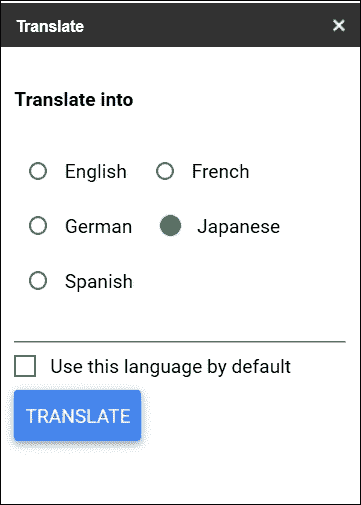

下面的截图显示了翻译前的英文源文档文本：

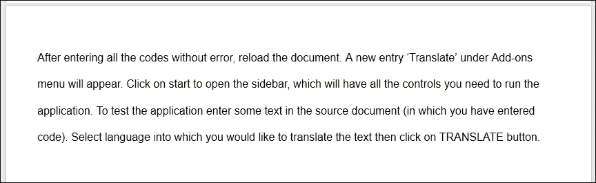

现在如果您打开目标文档，您可以在其中查看保存的翻译文本。前面截图中的示例文本已翻译成日语，如下所示：

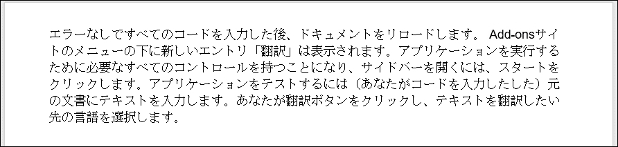

# 创建一个文档审查和即时内联评论应用程序

我们将创建一个文档审查和评论应用程序。文档可以是文章投稿、学生提交的理解测试、研究人员提交的论文，或者任何在接收前需要审查的内容。审查者可以审查并插入预定义的评论或他/她的自定义评论，即时完成。审查者选择文档中的某些文本，然后点击任何一个按钮（预定义评论）进行高亮。然后，脚本将高亮显示文本，并在实际评论旁边内联插入评论文本。您可以在**评论**面板（右上角）看到创建的评论。最后，审查者可以在文档末尾插入评分。

如往常一样，在代码文件中创建`onOpen`触发函数，它将打开侧边栏：

```js
function onOpen() {
  var ui = HtmlService.createHtmlOutputFromFile('Sidebar')
    .setTitle('Review and Comment');

  DocumentApp.getUi().showSidebar(ui);
}
```

`insertComment`函数将实际评论插入到文档中。由于 Drive 是一个高级服务，所以在使用它之前，您应该启用 Drive API。我希望您还记得如何启用高级服务。如果您不记得，请从第五章，*创建 Google 日历和 Drive 应用程序*中复习：

```js
function insertComment(comment, selectedText){
  // You should enable this advanced service (Drive API).
  Drive.Comments.insert(
    {
      "content": comment,
      "context": {"type":"text/html", "value":selectedText},
    },
    DocumentApp.getActiveDocument().getId()
  );
}
```

`insertText`函数使用所选文本或光标所在位置的文本作为参数：

```js
/**
 * Replaces the text of the current selection with the provided
 * text, or inserts text at the current cursor location.
 * (There will always be either a selection or a cursor.)
 * If multiple elements are selected, only inserts the text in the
 * first element that can contain text.
 *
 * @param {string} newText The text with which to replace the
 *                 current selection.
 *
 */
function insertText(newText) {
  var selection = DocumentApp.getActiveDocument().getSelection();

  // If any text selected then get selected text else cursor.
  if (selection) {
    var elements = selection.getRangeElements();
    for (var i = 0; i < elements.length; i++) {
      var startIndex = elements[i].getStartOffset();
      var endIndex = elements[i].getEndOffsetInclusive();

      // If picture/image element selected.
      if(startIndex == endIndex) throw "Error: Select text only.";

      // Highlight the selected text.
      var element = elements[i].getElement()
         .setBackgroundColor(startIndex, endIndex, '#f6d2ab');

      // Insert selected comment next to the selected text.
      element.insertText(endIndex+1, '[' + newText +']')
         .setBackgroundColor(
            endIndex+1, endIndex+newText.length+2, '#bbffbb'
          );

      var text = element.getText()
         .substring(
            startIndex,endIndex+1
          );

      // Call insertComment function      
      insertComment(newText,text);
    }

  } else {

    var curr = DocumentApp.getActiveDocument().getCursor();

    // Exit if document not active or cursor not in document.
    if(!curr) return;

    // Insert comment and call insertComment function.
    curr.insertText('[' + newText +']')
      .setBackgroundColor('#bbffbb');

    insertComment(newText);
  }
}
```

`insertScore`函数在文档末尾插入一条水平线，并根据文档是否符合预期插入评分：

```js
function insertScore(newText){
  var doc = DocumentApp.getActiveDocument();
  var body = doc.getBody();

  body.appendHorizontalRule();
  body.appendParagraph(newText)
    .setAttributes({FONT_SIZE:24,FOREGROUND_COLOR:'#6aa84f'});
}
```

在`Sidebar.html`文件中创建以下代码：

```js
<!-- Sidebar.html -->
<!DOCTYPE html>
<html>
  <head>
    <base target="_top">

    <!-- Google's add-on stylesheet -->
    <link rel="stylesheet" href="https://ssl.gstatic.com/docs/script/css/add-ons1.css" />

    <!-- jQuery UI stylesheet -->
    <link rel="stylesheet" href="//ajax.googleapis.com/ajax/libs/jqueryui/ 1.10.4/themes/smoothness/jquery-ui.css" />

    <!-- jQuery base library -->
    <script src="img/jquery.min.js"></script>

    <!-- jQuery UI library -->
    <script src="img/jquery-ui.min.js"></script>

    <!-- Add additional styles -->
    <style>
      select{ height:35px; }

      textarea{
        width:100%;
        margin-top: 3px;
        margin-bottom: 3px;
      }

      .blue{
        -moz-border-radius: 3px;
        -webkit-border-radius: 3px;
        border-radius: 3px;
      }

      .blue + .blue{
        margin: .5px -.5px;
      }

      .ui-accordion .ui-accordion-header {
        display: block;
        cursor: pointer;
        position: relative;
        margin-top: 1px;
        padding: .4em .25em .4em .25em;
        min-height: 0; /* support: IE7 */
      }

      .ui-accordion .ui-accordion-icons {
        padding-left: 2em;
      }

      .ui-accordion .ui-accordion-content {
        padding: .5em .5em;
        overflow: auto;
      }
    </style>
  </head>
```

`accordion`块的结构在代码注释中提供：

```js
  <body>
    <!-- To comply with the jQuery UI library,
        The accordion should be in the form:
      <div id="accordion">
        <h3>Section 1</h3>
        <div>
          ...
        </div>

        <h3>Section 2</h3>
        <div>
          ...
        </div>
      </div>
    -->

    <div id="accordion">

      <h3>Comments</h3>
      <div>
        <b>Highlight text and click the appropriate comment</b>
        <div id="button-bar">
          <button class="blue comment-button"
            value = "Awkward">Awkward</button>

          <button class="blue comment-button"
            value = "Citation Needed">Citation Needed</button>

          <button class="blue comment-button"
            value="Improper Citation">Improper Citation</button>

          <button class="blue comment-button"
            value="Commonly Confused">Commonly Confused</button>

          <button class="blue comment-button"
            value="Delete">Delete</button>

          <button class="blue comment-button"
            value="Run-on">Run-on</button>

          <button class="blue comment-button"
            value="Vague">Vague</button>
        </div>

        <div>
          <textarea rows="3" id="insert-text"
            placeholder="Type your comment here"></textarea>
        </div>

        <div>
          <button class="blue" id="insert-button">Comment</button>
        </div>
      </div>

      <h3>Scores</h3>
      <div>
        <div id="score-bar">
          Does the document meet the expectation?
          <br />
          <button class="green insert-score" value="Meets"
            >Yes</button>

          <button class="green insert-score" value="Not Yet"
            >No</button>
        </div>
      </div>
    </div>

    <script>
      // On document load assign the events.
      $(function(){

        /**
         * Which accordion block should be active/expanded by
         * default, here the first one.
         *
         */
        $("#accordion").accordion({ active: 0 });

        // Assign a click event to buttons.
        $(".comment-button").click(insertButtonComment);
        $("#insert-button").click(insertCustomComment);
        $(".insert-score").click(insertScore);

      });

      /**
       *  Runs a server-side function to insert pre-defined
       *  comment into the document at the cursor *  or after the selection.
       *
       */
      function insertButtonComment() {
        this.disabled = true;
        $('#error').remove();

        google.script.run
          .withSuccessHandler(
            function(returnSuccess, element) {
              element.disabled = false;
            }
           )
          .withFailureHandler(
             function(msg, element) {
               showError(msg, $('#button-bar'));
               element.disabled = false;
             }
           )
          .withUserObject(this)
          .insertText($(this).val());
      }

      /**
       *  Runs a server-side function to insert custom comment
       *  into the document on pointing the cursor or 
       *  after the selection.
       *
       */
      function insertCustomComment() {
        this.disabled = true;
        $('#error').remove();

        google.script.run
          .withSuccessHandler(
             function(returnSuccess, element) {
               element.disabled = false;
             }
           )
          .withFailureHandler(
             function(msg, element) {
               showError(msg, $('#button-bar'));
               element.disabled = false;
             }
           )
          .withUserObject(this)
          .insertText($('#insert-text').val());
      }

      /**
       *  Runs a server-side function to insert the score
       *
       */
      function insertScore() {
      this.disabled = true;
      $('#error').remove();

      google.script.run
        .withSuccessHandler(
           function(returnSuccess, element) {
             element.disabled = false;
           }
         )
        .withFailureHandler(
           function(msg, element) {
             showError(msg, $('#score-bar'));
             element.disabled = false;
           }
         )
        .withUserObject(this)
        .insertScore($(this).val());
      }

      /**
       *  Inserts a div that contains an error message after a
       *  given element.
       *
       *  @param msg-The error message to display.
       *  @param element-The element after which to display the
       *                 error.
       *
       */
      function showError(msg, element) {
        var div = $('<div id="error" class="error">'
            + msg + '</div>');

        $(element).after(div);
      }
    </script>
  </body>
</html>
```

以下截图显示了侧边栏和文档：

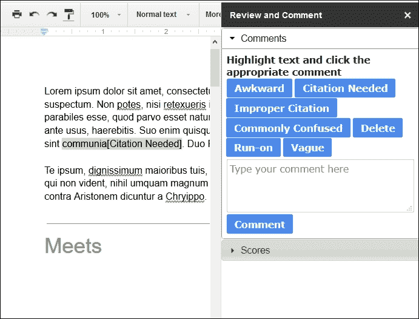

您可以通过点击文档窗口右上角角落的**评论**按钮来查看插入的评论。

# 摘要

在本章中，您学习了并创建了多个有用的应用程序，包括 RSS/Atom 阅读器、语言翻译应用程序以及文档审查和评论应用程序。在下一章中，您将学习如何创建交互式网页、RSS 源、文件上传和考勤应用程序。
