# 第七章. 创建交互式网页

在上一章中，你学习了如何创建 RSS/Atom 源阅读器、股票报价器、语言翻译器，以及创建文档审查和评论应用程序。

在本章中，你将学习：

+   要创建返回电子表格数据作为 HTML、JSON 和 PDF 的网络应用程序

+   要发送带有查询字符串的 HTTP/HTTPS 请求

+   要创建一个 RSS 源

+   要创建一个文件上传应用程序

+   要创建一个时间表应用程序

# 创建一个将电子表格数据渲染为 HTML 的网络应用程序

我们将创建一个应用程序，在浏览器中返回电子表格数据作为 HTML。创建一个电子表格，将其重命名为 `Data`，并填充一些测试数据，如下一个截图所示。你可以使用具有名为 `First Name`、`Last Name` 和 `Full Name` 的三列的任何随机数据填充电子表格：

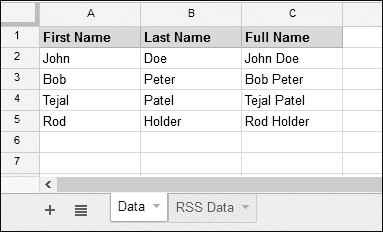

在 `Code.gs` 文件中创建如下所示的 `doGet` 函数：

```js
function doGet() {
  /*
   *  This spreadsheet may not be active while this function
   *  executes, so you cannot get access to active spreadsheet,
   *  use open by id.
   *
   */
  var ss = SpreadsheetApp
      .openById("Replace with this spreadsheet id");

  var SheetData = ss.getSheetByName("Data");

  var data = SheetData.getDataRange().getValues();

  var html = '<!DOCTYPE html><html><body><table border=1>';

  // Each row data passed as argument to the anonymous function.
  data.forEach(function(row){
    html += '<tr>';
    html += '<td>' + row[0] + '</td>';
    html += '<td>' + row[1] + '</td>';
    html += '<td>' + row[2] + '</td>';
    html += '</tr>';
  });

  // Let's close table, body and html tags.
  html += '</table></body></html>';

  // Return as HTML document.
  Return HtmlService.createHtmlOutput(html);

}
```

`HtmlService` 函数可以用来创建任何 HTML 内容。前面的 `doGet` 函数将 `HtmlService` 创建的 HTML 内容返回给浏览器。按照前面解释的方法发布脚本，并在浏览器地址栏中输入 URL。你可以看到如下所示的截图中的结果。显示的数据可能因你的输入数据而异。

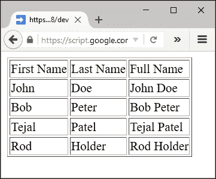

# 创建一个返回 JSON 的网络应用程序

现在，我们将看到如何返回 JSON 字符串而不是 HTML 内容。在 `Data` 电子表格中添加另一个名为 `DOB` 的列，如下所示：

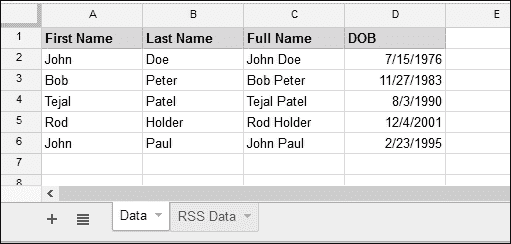

创建如下所示的 `doGet` 函数：

```js
function doGet(){
  /*
   *  This spreadsheet may not be active while this function 
   *  executes, so you cannot get access to active spreadsheet, 
   *  use open by id.
   *
   */
  var ss = SpreadsheetApp
      .openById("Replace with this spreadsheet id");

  var SheetData = ss.getSheetByName("Data");

  var data = SheetData.getDataRange().getValues();

  // Remove header
  data.shift();

  var date = new Date();
  var currYear = date.getFullYear();

  var output = {};

  data.forEach(function(row){
    var dob = new Date(row[3]);
    var dobYear = dob.getFullYear();

    /*
     * Create full name property within output object.
     * Again the full name property is an object.
     *
     */
    output[row[2]] = {};

    /*
     * Assign DOB property to full name object.
     * Change time zone and date format as per your preference.
     *
     */
    output[row[2]].dob = Utilities
      .formatDate(row[3], "UTC", "MM/dd/yyyy");

    // Let's calculate age.
    output[row[2]].age = currYear - dobYear;
  });

  // We can return only string to browser, so convert to string.
  var json = JSON.stringify(output);

  return ContentService.createTextOutput(json);
}
```

浏览器中的输出将是以下 JSON 字符串：

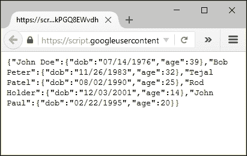

# 将电子表格数据转换为 PDF 文件

你可以创建一个应用程序，将电子表格数据转换为 PDF 文件并存储在 Drive 中，并将 PDF 文件的 URL 返回给用户：

在 `Code.gs` 文件中创建如下所示的 `doGet` 函数：

```js
function doGet() {
  /*
   *  This spreadsheet may not be active while this function 
   *  executes, so you cannot get access to active spreadsheet, 
   *  use open by id.
   *
   */
  var ss = SpreadsheetApp.openById("[[ this spreadsheet id ]]");

  var SheetData = ss.getSheetByName("Data");

  var template = HtmlService
      .createTemplateFromFile("Template.html");

  // Assign 'data' to the template object
  template.data = SheetData.getDataRange().getValues();

  // Evaluate template object as html content
  var html = template.evaluate();

  // Convert html content to pdf
  // var pdf = html.getAs("application/pdf")
  //    .setName("Test_Data.pdf");

  // Or use this code
  var pdf = html.getAs(MimeType.PDF).setName("Test_Data.pdf");

  // Create pdf file in the "My Drive" folder and share it with //public.
  var file = DriveApp.createFile(pdf);

  // Let's set sharing access as anyone can view the pdf.
  file.setSharing(
    DriveApp.Access.ANYONE_WITH_LINK, DriveApp.Permission.VIEW
  );

  // Create and return html content with link to the pdf file.
  return HtmlService.createHtmlOutput(
    'Click <a target="_top" href="'
    + file.getUrl()
    +'">here</a> to view pdf file.'
  );
}
```

创建一个新的 HTML 文件，`Template.html`，并输入以下 HTML 代码。在此代码中，`data` 数组是一个二维数组，已经分配给 `doGet` 函数中的 `template` 对象：

```js
<!DOCTYPE html>
<html>
  <body>
    <table>
      <? for(var i in data) {?>
        <tr>
          <? for(var j in data[i]) { ?>
            <td><?= data[i][j] ?></td>
          <? } ?>
        </tr>
      <? } ?>
    </table>
  </body>
</html>
```

在提到的代码中，模板标记 `<?` 和 `?>` 包围脚本代码，这与正常 HTML 代码中的 `script` 标签相同。包围的代码会执行，但不返回任何内容。标记 `<?=` 和 `?>` 返回包围代码的结果。例如，`<?= data[i][j] ?>` 返回二维 `data` 数组的第 *i* 行第 *j* 列的值。

为了理解前一个代码中没有模板标记的服务器脚本，这里将其重新呈现：

```js
for(var i in data) {
  for(var j in data[i]) {
    data[i][j] 
  }
}
```

发布并将在浏览器地址栏中输入发布的 URL。结果将如下所示。点击超链接在 Drive 中打开 PDF 文件：

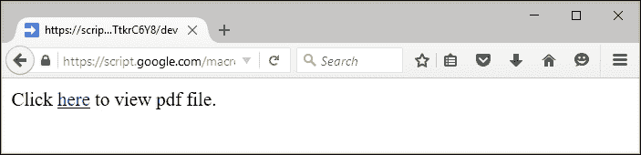

根据表格数据创建的 PDF 的示例输出如下所示截图。输出可能因您的输入数据而异：

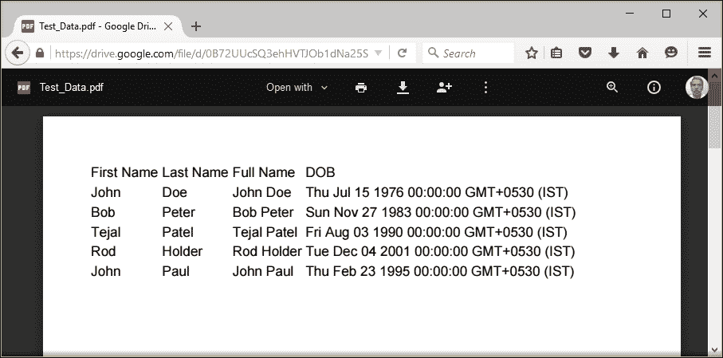

# 带有查询字符串的 HTTP/HTTPS 请求发送

您可以发送一个带有查询字符串的 HTTP/HTTPS 请求。为此，将发布的 URL 与您的查询字符串附加在一起。

例如：`https://script.google.com/macros/s/AKfycbxa4ErKHiX_0gQ0JUU-Q1qMhvRrOsrx3HXuVZp7pzX8UVxMu4w/exec?`**fname=John**

```js
function doGet(e){
  Logger.log(e);
}
```

已记录的 HTTP/HTTPS 请求的`event`对象的示例如下所示：

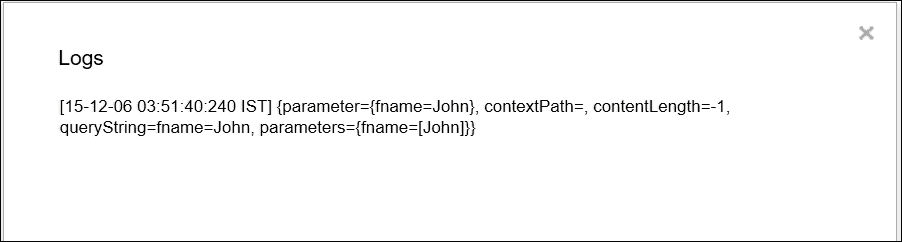

以下代码片段中列出的`doGet`函数显示了您如何使用`event`对象获取进一步处理所需的参数：

```js
function doGet(e){

  // Get the fname value from the query string.
  var firstName = e.parameter.fname;

  /*
   *  There is no active spreadsheet, so you should open by id.
   *  Use the id of the spreadsheet in which your script resides.
   *
   */
  var ss = SpreadsheetApp.openById("Replace spreadsheet id");

  var SheetData = ss.getSheetByName("Data");

  var data = SheetData.getDataRange().getValues();

  // Remove header
  data.shift();

  var date = new Date();

  // Let's get the year in 4 digits.
  var currYear = date.getFullYear();

  var output = {};

  // Let's populate output with dob and age properties.
  data.forEach(function(row){

    // Skip if first name not match.
    if(firstName !== row[0]) return;

    var dob = new Date(row[3]);
    var dobYear = dob.getFullYear();

    output[row[2]] = {};
    output[row[2]].dob = Utilities
      .formatDate(row[3], "UTC", "MM/dd/yyyy");

    output[row[2]].age = currYear - dobYear;
  });

  var json = JSON.stringify(output);

  return ContentService.createTextOutput(json);
}
```

所提到的`doGet`函数从查询字符串中获取`fname`参数，并返回与`fname`匹配的`age`值和`dob`。

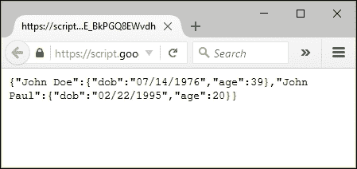

# 使用 ContentService 创建 RSS 源

您在第六章*创建订阅阅读器和翻译器应用程序*中创建了一个 RSS 阅读器应用程序。现在，您可以创建一个发布 RSS 源的应用程序。将 RSS 数据放入如下所示的表格中：

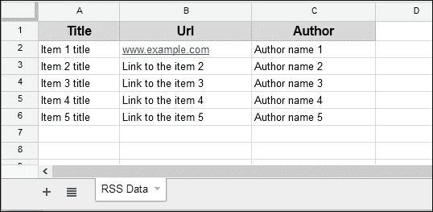

还可以编辑/输入以下`doGet`函数：

```js
function doGet() {
  /*
   *  There is no active spreadsheet, so you should open by id.
   *  Use the id of the spreadsheet in which your script resides.
   *
   */
  var ss = SpreadsheetApp.openById([[ this spreadsheet id ]]);

  var SheetRss = ss.getSheetByName("RSS Data");

  var rssData = SheetRss.getDataRange().getValues();

  // Remove header.
  rssData.shift();

  var strRss = '<?xml version="1.0" encoding="UTF-8"?>';

  // Root element.
  strRss += '<rss>';

  // Open channel element.
  strRss += '<channel>';

  // Add description and language elements.
  strRss += '<description>A brief description of the channel</description>';
  strRss += '<language>en-US</language>';

  // Each row data is passed as an argument to the anonymous
  //function.
  rssData.forEach(function(row){
    strRss += '<item>';
    strRss += '<title>' + row[0] + '</title>';
    strRss += '<link>' + row[1] + '</link>';
    strRss += '<creator>' + row[2] + '</creator>';
    strRss += '</item>';
  });

  // Close channel and root (rss) elements.
  strRss += '</channel></rss>';

  // Return as RSS xml document.
  return ContentService
    .createTextOutput(strRss)
    .setMimeType(ContentService.MimeType.RSS);
}
```

按照之前的方式发布脚本。您可以将发布的 URL 用作上一章中构建的 RSS 阅读器应用程序的 RSS URL。

# 创建文件上传应用程序

您可以创建一个应用程序，从浏览器上传任何文件到 Drive。在`Code.gs`文件中创建`doGet`和`uploadFiles`函数，如下所示：

在`Code.gs`文件中添加以下代码：

```js
function doGet() {
  // Let's return html page created from the Form.html file.
  return HtmlService.createHtmlOutputFromFile('Form.html')
    .setTitle("File Upload");
};

function uploadFiles(form) {
  // You can change the folder name as you like.
  var folderName = "Uploaded Files";

  var folder, folders = DriveApp.getFoldersByName(folderName);

  // folders is an iterator.
  if (folders.hasNext()) folder = folders.next();
  // Let's create a folder if it does not exist.
  else folder = DriveApp.createFolder(folderName);

  // Let's create the file, got from the form, within the folder.
  var file = folder.createFile(form.file);

  // Let's return the file's url
  return file.getUrl();
}
```

`uploadFiles`函数查找名为`Uploaded Files`的现有文件夹。如果没有找到，则在根目录`My Drive`文件夹中创建相同的文件夹。随后，它创建传递给参数的文件，并返回创建的文件的 URL。

更新`Form.html`文件中的代码：

```js
<!DOCTYPE html>
<html>
  <head>
    <base target="_top">

    <link rel="stylesheet" href="//ssl.gstatic.com/docs/script/css/add-ons1.css"/>
    <script src="img/jquery.min.js"></script>
  </head>

  <body>
    <div class="sidebar">
      <form>
        <input type="file" name="file">
        <br /><br />
        <input type="button" id="upload" class="submit" value="Upload">
      </form>
    </div>

    <script>
      $(function(){
        $("#upload").click(fileUpload);
      });

      function fileUpload(){
        this.disabled = true;
        google.script.run
          .withSuccessHandler(function(msg, element){
             element.disabled = false;
             showSucces(msg);
           })
          .withFailureHandler(function(msg, element) {
             element.disabled = false;
             showError(msg, element);
           })
          .withUserObject(this)
          .uploadFiles(this.parentNode);
      }

      function showSucces(msg) {
        alert("File uploaded successfully.\n The file url is: " + msg);
      }

      function showError(msg, element) {
        var div = $('<div id="error" class="error">' + msg + '</div>');

        $(element).after(div);
      }

    </script>
  </body>
</html>
```

上述代码渲染了上传表单控件，如果点击**上传**，则调用`uploadFiles`服务器函数。

文件上传表单的控件示例如下所示：

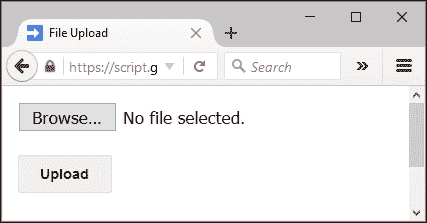

点击**浏览…**按钮选择任何本地存储的文件。然后，点击**上传**按钮将文件上传到 Drive。所选文件将被上传到`My Drive`文件夹中的`Uploaded Files`文件夹。

上传成功后，将显示一个包含上传文件 URL 的警告框，如下所示截图。您可以使用此 URL 验证文件上传是否成功。

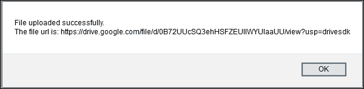

# 创建员工考勤应用程序

通过创建前面的应用程序所积累的知识和经验，您可以创建这个完整的考勤应用。此应用可用于组织或公司记录员工在一天或班次中的工作时间。每日出勤数据将被保存在 `Backup` 工作表中以供将来参考。

创建一个新的工作表，命名为 `EmployeesList`，并填充员工姓名。所有这些姓名将自动在用户界面中以下拉列表的形式列出。

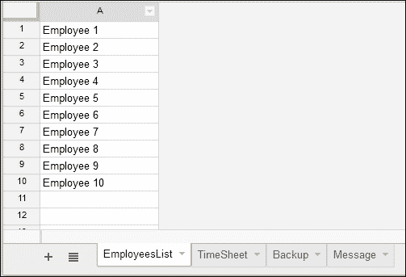

创建另一个名为 `TimeSheet` 的工作表，并按照以下截图所示排列列标题。确保列 *C*、*D*、*E* 和 *F* 格式化为 `date`，否则日期可能显示为纪元数字。将列 *A* 留空，因为它将由脚本用于标记班次状态，例如 `sb`（班次开始）、`bb`（休息开始）、`be`（休息结束）、`se`（班次结束）。

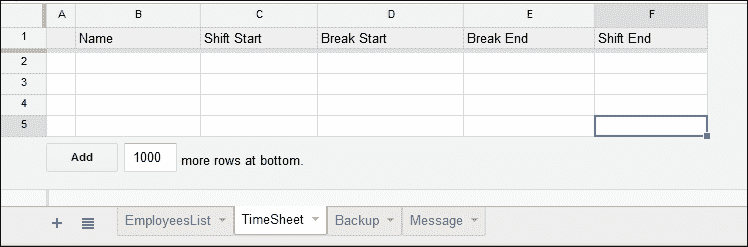

创建另一个名为 `Backup` 的工作表，用于从 `TimeSheet` 工作表备份每天的班次数据。按照以下所示排列列。请记住将列 *B*、*C*、*D* 和 *E* 格式化为 `date`。

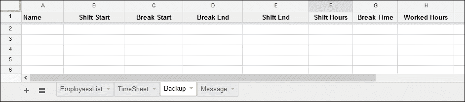

创建另一个新的工作表，命名为 `Message`，用于传递给员工的消息（如果有）：

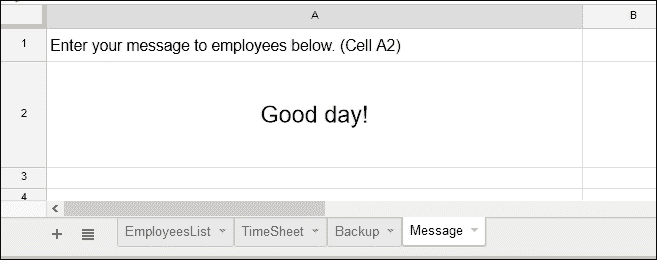

在 `Code.gs` 文件中，创建全局变量以及 `doGet` 和 `getEmpNames` 函数。将 `[[ this spreadsheet id ]]` 替换为实际的工作表 ID/键（作为字符串）：

```js
var ssid = "[[ this spreadsheet id ]]";

// Change date format as per your preference.
var DF = "MM/dd/yyyy HH:mm:ss";
var TZ = Session.getScriptTimeZone();

var ss = SpreadsheetApp.openById(ssid);
var TimeSheet = ss.getSheetByName("TimeSheet");
var EmpSheet = ss.getSheetByName("EmployeesList");
var BackupSheet = ss.getSheetByName("Backup");
var MessageSheet = ss.getSheetByName("Message");
```

`getEmpList` 函数创建并返回员工姓名数组：

```js
/**
 *  Get employee names from the EmployeesList sheet,
 *  construct the data as an array and return.
 *
 */
function getEmpList(){
  var emp = [];
  var data = EmpSheet.getDataRange().getValues();

  for(var i in data) if(data[i][0]) emp.push(data[i][0]);

  return emp;
}
```

在 `doGet` 函数中，消息和员工列表被分配给 `template` 对象，并返回评估后的 HTML 内容：

```js
function doGet(){
  var template = HtmlService.createTemplateFromFile("Timesheet");
  template.message = MessageSheet.getRange("A2").getValue();
  template.empList = getEmpList();

  var html = template.evaluate();
  return html;
}
```

`getEmpStatus` 函数返回员工班次状态数组：

```js
// Returns employee shift status as an array [status, name].
function getEmpStatus(emp){
  var empData = EmpSheet.getDataRange().getValues();
  var timeData = TimeSheet.getDataRange().getValues();

  // Remove header
  timeData.shift();

  for(var i in timeData){
    if(timeData[i][1] == emp) 
      return [timeData[i][0],empData[j][1]];
  }

  // Return null if employee not in shift
  return ["",""];
}
```

`fmtDate_` 函数是一个辅助函数，它返回格式化的日期字符串：

```js
function fmtDate_(d, format){
  // Set the default date format, if 'format' not passed.
  var fmt = format || DF;

  return Utilities.formatDate(d, TZ, fmt);
}
```

`postTime` 函数根据员工姓名和用户点击的按钮填充考勤表，这些值作为参数（`name` 和 `val`）提供。此函数也会抛出错误（如果有）。

### 注意

关键字 `throw` 返回一个错误对象并终止执行。

```js
function postTime(name, val){
  var time = fmtDate_(new Date());
  var data = TimeSheet.getDataRange().getValues();

  // If 'shift start' clicked
  if(val == "sb"){
    // Update start time if clicked again.
    for(var i in data){
      if(data[i][1] == name && data[i][0] == "sb" ){
        data[i][2] = time;
        TimeSheet.getRange(1, 1, data.length, data[0].length)
          .setValues(data);
        return [val,name];
      }
    };

    // Else insert new name and update start time.
    TimeSheet.appendRow([val,name,time]);

    return [val,name];
  }

  // If 'break start' clicked.
  if(val == "bb"){
    for(var i in data){
      // Update break start time only if employee is in shift.
      if(data[i][0] == "sb" && data[i][1] == name ){
        data[i][0] = val;
        data[i][3] = time;

        TimeSheet.getRange(1, 1, data.length, data[0].length)
          .setValues(data);

        return [val,name];
      }
    };

    // If 'break start' clicked before 'shift start'.
    throw "Please start your shift.";
  }

  // If 'break end' clicked
  if(val == "be"){
    for(var i in data){
      if(data[i][0] == "bb" && data[i][1] == name ){
        data[i][0] = val;
        data[i][4] = time;
        TimeSheet.getRange(1, 1, data.length, data[0].length)
          .setValues(data);
        return [val,name];
      }
    };

    // If 'break end' clicked before 'break start'.
    throw "Please start your break.";
  }

  // If shift end clicked
  if(val == "se"){
    for(var i in data){
      if(data[i][1] == name 
           && (data[i][0] == "sb"|| data[i][0] == "be") ){
        var backup = [];
        backup.push(
          data[i][1],    // Name
          data[i][2],    // Shift Start
          data[i][3],    // Break Start
          data[i][4],    // Break End
          time,          // Shift end
          '=(E2-B2)*24', // Col F formula,
          '=(D2-C2)*24', // Col G formula
          '=F2-G2'       // Col H formula
        );

        /*
         * Copy Timesheet data to Backup sheet.
         * Insert a new row before row 2,
         * so that the inserted formulas ever work.
         *
         */
        BackupSheet.insertRowBefore(2);

        BackupSheet.getRange(2, 1, 1, backup.length)
          .setValues([backup]);

        /*
         * Tidy timesheet.
         * Ensure at least one data row before deleting,
         *  to avoid error.
         *
         */
        if(i<2) TimeSheet.appendRow(['']);

        // Delete copied row
        TimeSheet.deleteRow(Number(i)+1);

        return [val,name];
      }
    };

    // If 'shift end' clicked before 'break end'.
    if(data[i][0] == "bb")
      throw "Please end your break.";

    // If 'shift end' clicked without starting shift.
    throw "Please start your shift.";
  }
}
```

前面的 `postTime` 函数根据用户点击的按钮将数据填充到 `TimeSheet` 工作表中。如果班次时间有冲突，它还会抛出错误。例如，用户不能在点击 **Break End** 之前点击 **Break Start**，也不能在不结束上一个班次的情况下点击 **Shift Start**，等等。

创建一个新的 HTML 文件，命名为 `Timesheet`，并在其中输入以下代码：

```js
<!DOCTYPE html>
<html>
  <head>
    <base target="_top">
    <link rel="stylesheet" href="https://ssl.gstatic.com/docs/script/css/add-ons.css" />
    <script src="img/jquery.min.js"></script>
  </head>

  <body>
    <div>
      <fieldset style="padding-bottom:25px;">
        <legend>Timesheet</legend>
        <select id="employee" name="employee">
          <? for(var i in empList){ ?>
              <option value="<?= empList[i] ?>" > <?= empList[i] ?></option>
          <? } ?>
        </select>
        <br /><br />
        <button id="sb" value="sb"><span>Shift Start</span></button>

        <button id="bb" value="bb"><span>Break Start</span></button>

        <button id="be" value="be"><span>Break End</span></button>
        <button id="se" value="se"><span>Shift End</span></button>
      </fieldset>

      <fieldset>
        <div id="message"><?!= message ?></div>
      </fieldset>
    </div>

    <script>
      $(function() {
        // Disable all buttons.
        $('#sb,#bb,#be,#se').prop("disabled", true);

        // Set drop-down change event.
        $('#employee').change(getStatus);

        // Set buttons click event.
        $('#sb,#bb,#be,#se').click(postTime);

        getStatus();
      });

      function getStatus(){
        // Remove all previous error messages.
        $('#error,#success').remove();

        // Disable all buttons.
        $('#sb,#bb,#be,#se').prop("disabled", true);

        // Get employee shift status.
        google.script.run
          .withSuccessHandler(function(status){
            updateStatus(status);
           })
          .getEmpStatus($("#employee").val());
      }

      function postTime(){
        // Remove all previous error messages.
        $('#error,#success').remove();

        // Disable all buttons.
        $('#sb,#bb,#be,#se').prop("disabled", true);

        // Post shift time to sheet.
        google.script.run
          .withSuccessHandler(function(msg){
             updateStatus(msg[0]);
           })
          .withFailureHandler(function(msg, elm){
             showError(msg, elm);
           })
          .withUserObject(this)
          .postTime($("#employee").val(),$(this).val());
      }

      function updateStatus(status){
        // Enable appropriate buttons only.
        switch(status){
          case "sb": $('#bb,#se').prop("disabled", false); break;
          case "bb": $('#be').prop("disabled", false); break;
          case "be": $('#se').prop("disabled", false); break;
          default: $('#sb').prop("disabled", false);
        }      
      }

      function showError(msg, elm) {
        var span = $('<span id="error" class="error">' + msg + '</span>');
        $(elm).after(span);
      }

    </script>
  </body>
</html>
```

发布脚本并将发布的 URL 输入到浏览器的地址栏中，然后你将看到截图所示的工时应用被加载。通过从下拉菜单中选择员工姓名以及点击其旁边的按钮进行实验。对于每个用户操作，`工时`和/或`备份`表的数据将被更新。

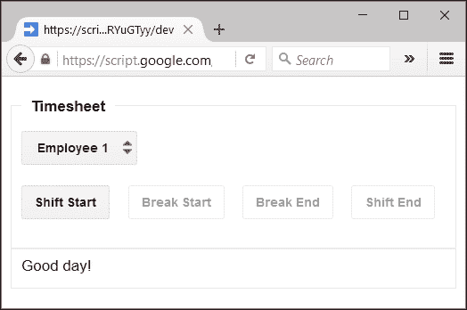

以下是`工时`数据的示例输出：

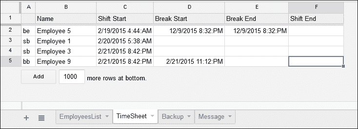

当用户点击**班次结束**时，`工时`表中的相应数据将被转移到`备份`表中，并为`班次小时数`、`休息时间`和`工作时间`列创建公式。这些公式计算日期差异并将其乘以 24，以显示为小时值。以下是`备份`表的示例输出：

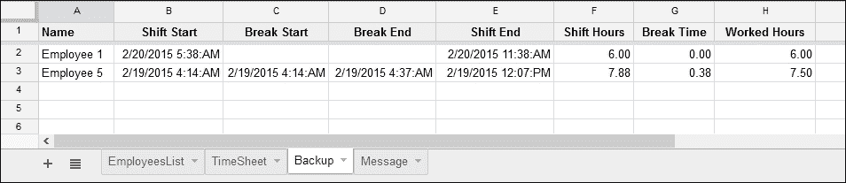

# 摘要

在本章中，你学习了并创建了许多实用的实际应用，包括 RSS 发布者和一个完整的工时应用。在下一章中，你将创建一个订单处理工作流应用。
