# 第一章 网络图表

在本章中，你将了解网络图表的一般背景。这包括网络图表在 Ajax 和 HTML5 成为新标准之前是如何制作的简要历史。将简要讨论 JavaScript 编程的最新进展。然后，介绍 SVG 支持和新的 HTML5 功能 canvas，这是 JavaScript 图表的主要推动力，并进行演示。接下来，将快速介绍市场上可用的其他 JavaScript 绘图包。最后，我们将介绍 Highcharts，并解释使用 Highcharts 相对于其他产品的优势。在本章中，我们将涵盖以下主题：

+   网络图表的简要历史

+   JavaScript 和 HTML5 的兴起

+   市场上的 JavaScript 图表

+   为什么选择 Highcharts？

# 网络图表的简要历史

在深入研究 Highcharts 之前，值得提及的是，网络图表是如何从纯 HTML 和服务器端技术发展到当前客户端技术的。

## HTML 图像映射（服务器端技术）

这种技术自 HTML 的早期就开始使用，当时服务器端操作是主要驱动力。图表只是由网络服务器生成的 HTML 图像。在 PHP 等服务器端脚本语言出现之前，最常见的方法之一是使用**通用网关接口**（**CGI**），它执行绘图程序（如 gnuplot）以输出图像。后来，当 PHP 变得流行时，使用了 GD 图形模块进行绘图。使用这种技术的产品之一是**JpGraph**。

以下是如何在 HTML 页面中包含图表图像的示例：

```js

```

图表脚本文件 `pie_chart.php` 嵌入 HTML `img` 标签中。当页面加载时，浏览器看到 `img src` 属性并发送一个对 `pie_chart.php` 的 HTTP 请求。对于网络浏览器来说，它不知道`.php` 文件是否是一个图像文件。当带有 PHP 支持的服务器接收到请求时，它识别`.php` 扩展名并执行 PHP 脚本。以下是一个简化的 JpGraph 示例；脚本输出图像内容并将其作为 HTTP 响应流回，就像正常图像内容被发送回一样：

```js
// Create new graph
$graph = new Graph(350, 250);
// Add data points in array of x-axis and y-axis values
$p1 = new LinePlot($datay,$datax);
$graph->Add($p1);
// Output line chart in image format back to the client
$graph->Stroke();
```

此外，这项技术与 HTML `map` 标签结合，用于图表导航，因此当用户点击图表的某个区域，例如饼图中的一个切片时，它可以加载一个包含另一个图表的新页面。

这种技术有以下优点：

+   非常适合自动化任务，例如带有图形附件的定时报告或电子邮件警报。

+   不需要 JavaScript。它是健壮的，纯 HTML，且对客户端影响较小。

它有以下缺点：

+   服务器端的工作负载更多

+   纯 HTML 和有限的技术——无法在图表上放置更多交互，也无法在动画上放置任何交互

## Java 小程序（客户端）和 servlet（服务器端）

Java 小程序使网络浏览器能够执行多平台 Java 字节码，以实现 HTML 无法做到的事情，例如图形显示、动画和高级用户交互。这是第一种将传统基于服务器的操作扩展到客户端的技术。要在 HTML 页面中包含 Java 小程序，需要使用 HTML 的`applet`（已弃用）或`object`标签，并且需要在浏览器中安装 Java 插件。

以下是在`object`标签内包含 Java 小程序的示例。由于 Java 在 Internet Explorer 中与其他浏览器运行的环境不同，因此使用了针对 IE 的条件注释：

```js
<!--[if !IE]> Non Internet Explorer way of loading applet -->
<object classid="Java:chart.class" type="application/x-java-applet"
 height="300" width="550" >
<!--<![endif] Internet way of loading applet -->
  <object classid="clsid:8AD9C840..." codebase="/classes/">
  <param name="code" value="chart.class" />
  </object>
<!--[if !IE]> -->
</object>
<!--<![endif]--> 
```

通常，Java 2D 图表产品是由 Java **抽象窗口工具包**（**AWT**）的`java.awt.Graphics2D`类和`java.awt.geom`包构建的。然后，主要的图表库允许用户通过扩展`Applet`类在浏览器中使用它，或者通过扩展`Servlet`类在服务器端运行它。

Java 产品的例子是**JFreeChart**。它包含 2D 和 3D 解决方案，并且免费供非营利使用。JFreeChart 可以作为 applet、servlet 或独立应用程序运行。以下展示了在 applet 内绘制数据点的部分代码：

```js
public class AppletGraph extends JApplet {
  // Create X and Y axis plot dataset and populate
  // with data.
  XYPlot xyPlot = new XYPlot(); 
  xyPlot.setDataset(defaultXYDataset);
  CombinedDomainXYPlot combinedDomainXYPlot = 
    new CombinedDomainXYPlot();
  combinedDomainXYPlot.add(xyPlot);
  // Create a jFreeChart object with the dataset 
  JFreeChart jFreeChart = new JFreeChart(combinedDomainXYPlot);
  // Put the jFreeChart in a chartPanel 
  ChartPanel chartPanel = new ChartPanel(jFreeChart);
  chartPanel.setPreferredSize(new Dimension(900,600));
  // Add the chart panel into the display
  getContentPane().add(chartPanel);
}
```

要在服务器端运行图表应用程序，需要一个 servlet 容器，例如 Apache Tomcat。标准的`web.xml`文件被定义为将 URL 绑定到 servlet：

```js
<?xml version="1.0" encoding="UTF-8"?>
<web-app id="server_charts" version="2.4"  
  xsi:schemaLocation="...">
  <servlet>
    <servlet-name>PieChartServlet</servlet-name>
    <servlet-class>charts.PieChartServlet</servlet-class>
  </servlet>
  <servlet-mapping>
    <servlet-name>PieChartServlet</servlet-name>
    <url-pattern>/servlets/piechart</url-pattern>
  </servlet-mapping>
</web-app>
```

当 Servlet 容器，例如 Tomcat，接收到 URL 为`http://localhost/servlets/piechart`的 HTTP 请求时，它将请求解析为一个 servlet 应用程序。然后，Web 服务器执行图表 servlet，将输出格式化为图像，并将图像内容作为 HTTP 响应返回。

这种技术有以下优点：

+   高级图形、动画和用户界面

+   可重用核心代码以支持不同的部署选项：客户端、服务器端或独立应用程序

它有以下缺点：

+   小程序安全问题

+   如果插件崩溃，可能会导致浏览器挂起或崩溃

+   非常占用 CPU

+   需要 Java 插件

+   长启动时间

+   标准化问题

## Adobe Shockwave Flash (客户端)

Flash 因其能够在网页浏览器中提供音频、图形、动画和视频功能而被广泛使用。浏览器需要安装 Adobe Flash Player 插件。至于绘图，在 HTML5 标准流行之前，这种技术是常见的选择（因为其他选项不多）。

采用这种技术的绘图软件自带其自己的导出**Shockwave Flash**（**SWF**）文件。这些 SWF 文件包含基于压缩矢量的图形和编译后的 ActionScript 指令来创建图表。为了使 Flash Player 能够显示图表，必须从 HTML 页面加载 SWF 文件。为此，需要一个 HTML `object`标签。该标签由软件的 JavaScript 例程内部创建并注入到文档的 DOM 中。

在这个 `object` 标签内包含用于绘制图表的尺寸和 SWF 路径信息。图表变量数据也包含在这个标签内。因此，一旦浏览器看到具有特定参数的 `object` 标签，它就会调用已安装的 Flash Player 来处理 SWF 文件和参数。为了将图表的绘图数据从服务器端传递到客户端 Flash Player，`flashVars` 被嵌入到具有数据类型的 `param` 标签中。以下是一个来自 Yahoo YUI 2 的示例：

```js
<object id="yuiswf1" type="..." data="charts.swf" width="100%" height="100%">
    <param name="allowscriptaccess" value="always">
    <param name="flashVars" value="param1=value1&param2=value2">
</object>
```

该技术具有以下优点：

+   精美的图形和动画，丰富的用户交互

它有以下缺点：

+   如果插件崩溃，它可能会挂起或崩溃浏览器

+   非常占用 CPU 资源

+   长时间启动

+   标准化问题

# JavaScript 和 HTML5 的兴起

JavaScript 的作用已经从几个简单的客户端程序转变为创建和管理网络用户界面的主导语言。随着函数对象、原型和闭包的引入，编程技术已经转向面向对象。这得益于像 Douglas Crockford 这样的先驱者，他通过他的书 *JavaScript: The Good Parts*，*O'Reilly Media / Yahoo Press* 负责将语言转化为教育，使 JavaScript 成为一种更好的语言。其他人包括 Sam Stephenson，Prototype JavaScript 库的创建者（[`www.prototypejs.org`](http://www.prototypejs.org)），以及 John Resig，JQuery 库的创建者（[`jquery.com`](http://jquery.com)），他们把 JavaScript 带入了一个构建更复杂前端网络软件的框架。

本书范围之外，无法介绍这种新的编程风格。读者应了解 jQuery 和 CSS 选择器语法的基础，这些语法在部分章节中使用。读者还应熟悉书中描述的先进 JavaScript 脚本，如 *JavaScript: The Good Parts*，*O'Reilly Media / Yahoo Press*，包括原型、闭包、继承和函数对象。

## HTML5（SVG 和 Canvas）

在本节中，介绍了两种 HTML5 技术：SVG 和 Canvas，以及相应的示例。

### SVG

HTML5 是迄今为止 HTML 标准的最大进步。该标准的采用率正在快速增长（也得益于苹果移动设备，它们停止支持 Adobe Flash）。再次强调，本书范围之外，无法涵盖它们。然而，与网络图表最相关的是 **可缩放矢量图形**（**SVG**）。SVG 是一种 XML 格式，用于描述基于矢量的图形，由路径、文本、形状、颜色等组件组成。这项技术与 PostScript 类似，但 PostScript 是一种基于堆栈的语言。正如其名称所暗示的，SVG 的一个主要优点是它是一种无损技术（与 PostScript 相同）：放大图像时不会出现任何像素化效果。减小图像尺寸不会导致原始内容丢失。

此外，SVG 可以使用**同步多媒体集成语言**（**SMIL**）进行脚本化动画和事件处理。除了 IE 之外，这项 SVG 技术被所有主流浏览器支持，[`caniuse.com/#feat=svg-smil`](http://caniuse.com/#feat=svg-smil)。

以下是一个简单的 SVG 代码示例，展示了两个点之间的单条曲线：

```js
<svg  version="1.1">
  <path id="curveAB" d="M 100 350 q 150 -300 300 0" stroke="blue" stroke-width="5" fill="none" />
  <!-- Mark relevant points -->
  <g stroke="black" stroke-width="3" fill="black">
    <circle id="pointA" cx="100" cy="350" r="3" />
    <circle id="pointB" cx="400" cy="350" r="3" />
  </g>
  <!-- Label the points -->
  <g font-size="30" font="sans-serif" fill="black" stroke="none" text-anchor="middle">
    <text x="100" y="350" dx="-30">A</text>
    <text x="400" y="350" dx="30">B</text>
  </g>
</svg>
```

前面的 SVG 代码按照以下步骤执行：

1.  使用 `id="curveAB"` 绘制路径，并使用数据 (`d`)。首先，将 `M` 移动到绝对坐标 (`100`, `350`)，然后从当前位置绘制一条贝塞尔二次曲线到 (`150`, `-300`)，并最终到达 (`300`, `0`)。

1.  将两个圆形元素——`"pointA"`和`"pointB"`——分别以中心坐标 (`100`, `350`) 和 (`400`, `350`) 以及 `3` 像素的半径组合在一起。然后使用黑色填充两个圆。

1.  将两个文本元素 `A` 和 `B` 组合在一起，起始位置分别为 (`100`, `350`) 和 (`400`, `350`)，使用无衬线字体黑色显示，然后分别在 x 轴（dx）上左右移动 `30` 像素。

以下是从 SVG 脚本生成的最终图形：

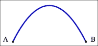

### Canvas

Canvas 是另一个新的 HTML5 标准，被一些 JavaScript 图表软件包所使用。Canvas 的目的正如其名所示；你在 `canvas` 标签上声明一个绘图区域，然后使用新的 JavaScript API 以像素为单位绘制线条和形状。这是两种技术的显著区别：Canvas 基于像素，而 SVG 基于矢量。Canvas 没有内置的动画例程，因此使用定时序列的 API 调用来模拟动画。此外，它没有事件处理支持，因此开发者需要手动将事件处理程序附加到画布上的某些区域。复杂的图表动画可能更难实现。

以下是一个 Canvas 代码示例，它实现了与前面 SVG 曲线相同的效果：

```js
<canvas id="myCanvas" width="500" height="300" style="border:1px solid #d3d3d3;">Canvas tag not supported</canvas>
<script type="text/javascript">
    var c=document.getElementById("myCanvas");
   var ctx=c.getContext("2d");
  // Draw the quadratic curve from Point A to B
   ctx.beginPath();
   ctx.moveTo(100, 250);
   ctx.quadraticCurveTo(250, 0, 400, 250);
   ctx.strokeStyle="blue";
   ctx.lineWidth=5;
   ctx.stroke();
  // Draw a black circle attached to the start of the curve
   ctx.fillStyle="black";
   ctx.strokeStyle="black";
   ctx.lineWidth=3;
   ctx.beginPath();
   ctx.arc(100,250,3, 0, 2* Math.PI);
   ctx.stroke();
   ctx.fill();
  // Draw a black circle attached to the end of the curve
   ctx.beginPath();
   ctx.arc(400,250,3, 0, 2* Math.PI);
   ctx.stroke();
   ctx.fill();
  // Display 'A' and 'B' text next to the points
   ctx.font="30px 'sans-serif'";
   ctx.textAlign="center";
   ctx.fillText("A", 70, 250);
   ctx.fillText("B", 430, 250);
</script> 
```

如您所见，Canvas 和 SVG 都可以完成相同的工作，但 Canvas 需要更多的指令：

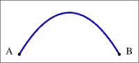

与 SVG 中的连续路径描述不同，这里调用了一系列 JavaScript 绘图方法。前面的 Canvas 代码遵循以下步骤来绘制曲线：

+   在前面的示例中，它首先调用 `beginPath` 在画布上开始一个路径，然后发出 `moveTo` 调用来将路径起点移动到坐标 (`100, 250`) 而不创建线条。`quadraticCurveTo` 方法从 `moveTo` 位置创建曲线路径到曲线顶部和终点，终点是 (`400, 250`)。一旦路径设置好，我们在调用 `stroke` 方法绘制路径上的线条之前设置描边属性。

+   我们调用 `beginPath` 来重置为一个新的路径进行绘制，并调用 `arc` 方法在曲线路径的起始和结束坐标处创建一个微小的圆形路径。一旦我们设置了描边和填充样式，我们就调用 `fill` 和 `stroke` 例程来填充它为黑色，作为坐标标记。

+   最后，我们设置了字体属性，并通过调用`fillText`并在坐标标记附近的位置创建文本`A`和`B`。

简而言之，Canvas 采用多个属性设置程序，而不是像 SVG 那样使用带有多个属性的单一标签。SVG 主要是声明性的，而 Canvas 强制执行命令式编程方法。

# 市场上的 JavaScript 图表

用 SVG 或 Canvas 手动编码编程图表是不可想象的。幸运的是，市场上提供了许多不同的图表库。讨论每一个都是不可能的。

### 小贴士

由于缺乏竞争优势，我们省略了本书第一版中提到的一些产品。

图表库是开源的，但其中一些在基本图表方面并不全面，例如饼图、折线图和条形图，看起来相当不完整。在这里，我们讨论了一些商业和开源产品，包括所有基本图表和一些附加功能。其中一些仍然支持 Flash 插件，这是向后兼容的一个选项，因为 SVG 和 canvas 在旧浏览器中不受支持。尽管其中一些产品对商业开发不是免费的，这是可以理解的，但它们的价格非常合理。

### 注意

查看[`code.google.com/p/explorercanvas/`](http://code.google.com/p/explorercanvas/)。许多库使用这个附加组件来模拟 IE 9 之前的 Canvas。

## amCharts

amCharts 提供了一套完整的 2D 和 3D 图表，以及其他有趣的图表，如雷达图、气泡图、蜡烛图和极坐标图。所有图表看起来都很漂亮，并支持动画。amCharts 对商业使用是免费的，但在图表的左上角会显示一个信用标签。图表的展示效果很好，动画可以完全自定义。与 Highcharts 相比，默认的动画似乎有些过度。

## Ext JS 5 图表

Ext JS 是由专注于 Web 应用开发的先驱公司 Sencha 开发的一个非常流行的 Ajax 应用框架。与使用 YUI 2 Flash 图表库的前一代 Ext JS 3 不同，Ext JS 4 自带一个纯 JavaScript 图表库。随着市场趋势逐渐远离 Adobe Flash，Sencha 推出了自家的图表库。Ext JS 4 涵盖了所有基本的 2D 图表以及仪表盘和雷达图，所有图表都支持动画。对于开源和非商业用途，许可证是免费的，但商业开发需要开发者许可证。Ext JS 图表的一个巨大优势是，与一套全面的 UI 组件集成，例如对于具有存储框架的图表，使用编辑器显示/更新图表和数据表都非常简单。

在 Ext JS 5 中，图表库已经被完全重构。与 Ext JS 4 相比，外观是一个巨大的进步：图表看起来更加专业，与其他竞争对手处于同一水平。尽管 Ext JS 5 的图表布局、颜色和动画可能不如 Highcharts 时尚和流畅，但它们仍然非常接近，并且仍然受到好评。

### 数据驱动文档

**数据驱动文档**（**D3**）是最广泛使用的图表库。它由 Bostock 等人创建，是在他们之前对 Protovis 的学术研究工作上的重大改进。

### 注意

Bostock, Michael; Ogievetsky, Vadim; Heer, Jeffrey (October 2011), *D3: 数据驱动文档*, IEEE Transactions on Visualization and Computer Graphics, *IEEE 出版社*。

D3 的原则非常独特，因为它专注于文档元素中的转换。换句话说，它是一个装饰性框架，通过众多 API 来操作选定的元素，称为*选择*。这些 API 允许用户将选择与图表数据连接，并像 CSS 一样样式化它们，或者应用特定的效果。这种方法使得 D3 能够创建出其他产品无法生产的各种令人印象深刻的图表，并带有动画效果。它是绘制特定科学图表或需要复杂数据可视化展示的图表的理想工具，例如层次边束图。

该软件可用于商业用途且免费，已经吸引了大量用户基础和用户社区的贡献，尤其是来自学术界的贡献。

由于其高度可编程和相对低级的编程方法，它需要更陡峭的学习曲线，可能不会吸引那些不太技术性的用户或寻求在生产级别上获得图表解决方案的开发者。至于在 D3 中构建 3D 图表，这可能是一项具有挑战性的任务。尽管 D3 在性能、控制和展示方面表现优异，但它并非适合所有人。

## FusionCharts

FusionCharts 可能是看起来最令人印象深刻的工具之一，并且在市场上提供了最全面的图表系列。它不仅提供了一系列有趣的 2D 图表（雷达图、仪表盘、地图和蜡烛图）作为独立产品，而且还提供了完全交互式的 3D 图表。所有的图表动画都制作得非常专业。FusionCharts 可以在两种模式下运行：Flash 或 JavaScript。尽管 FusionCharts 的价格较高，但它提供了带有可旋转、动画效果的列、饼图、漏斗图和金字塔图系列的最佳外观图表。

## Raphaël

Raphaël 是另一个免费的图形库。它支持早期浏览器中的 SVG 和 VML。它设计成一个通用的图形库，处理 SVG 元素，但也可以用作图表解决方案。该软件提供 API 来创建类似于 Canvas 的对象，即 paper，用户可以在其中创建基本形状或 SVG 线元素。API 结构在某种程度上与 D3 相似，因为它可以将数据绑定到元素并操作它们，但方法较为原始，而 D3 是一个以数据为中心的解决方案。其文档基础，用户社区较小。与 D3 一样，编程一个可展示的图表比 Highcharts 需要更多努力，并且不是 3D 图表解决方案的理想选择。

# 为什么选择 Highcharts？

Highcharts 在市场上提供了非常吸引人和专业-looking 的 2D/3D 图表。这是一个通过关注细节而脱颖而出的产品，不仅体现在展示方面，还包括后面描述的其他领域。它是由挪威公司 Highsoft AS 开发的，由 Torstein Hønsi 创建和成立，并于 2009 年底发布。Highcharts 不是他们的第一个产品，但无疑是他们最畅销的产品。

## Highcharts 和 JavaScript 框架

虽然 Highcharts 是用 JavaScript 框架库构建的，但其实现方式使其不依赖于特定的框架。Highcharts 附带适配器，使其接口对框架可插拔。

因此，Highcharts 可以与 MooTools、Prototype 或 jQuery JavaScript 框架集成。对于使用纯 JavaScript 编写的用户，Highcharts 还提供了一个独立的框架。这使用户能够在不影响他们已经开发的产品的情况下，或者允许他们选择最适合他们项目的框架。在 jQuery 中开发他们的网络图表应用的用户，只需在 Highcharts 之前加载 jQuery 库即可。

在 MooTools 环境中使用 Highcharts，用户只需执行以下操作：

```js
<script src="img/mootools-yui-compressed.js"></script>
<script type="text/javascript" 
        src="img/mootools-adapter.js"></script>
<script type="text/javascript" 
        src="img/highcharts.js"></script>
```

在 Prototype 下使用 Highcharts，用户需要执行以下操作：

```js
<script src="img/prototype.js"></script>
<script type="text/javascript" 
        src="img/prototype-adapter.js"></script>
<script type="text/javascript" 
        src="img/highcharts.js"></script>  
```

## 展示

Highcharts 在视觉效果和感觉上取得了正确的平衡。图表本身视觉上令人愉悦，同时风格简洁。默认的颜色选择令人舒适，没有强烈的对比，并且不会相互冲突，得益于微妙的阴影和白色边框效果。文本和坐标轴的颜色都不是黑色或任何深色，这有助于将观众的注意力集中在彩色数据展示上。以下是一个 Highcharts 表示的示例：

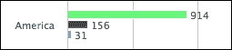

Highcharts 中的所有动画（初始、更新、工具提示）都经过精心调整：平滑且逐渐减速。多系列饼图的初始动画是最令人印象深刻的，这是一个 Highcharts 明显优于其他图表的领域。其他图表的动画过于机械，过多，有时甚至令人反感：

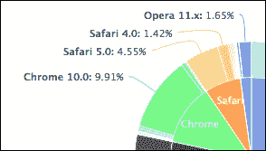

工具提示和图例（包括内边和外边）的圆角以及简单的边框不会与观众的注意力竞争，并且很好地融入图表中。以下是一个工具提示示例：

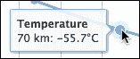

以下是一个带有两个系列的图例示例：


简而言之，Highcharts 中的每个元素都不会与其他元素竞争观众的注意力，因此它们平均分担负载并协同工作作为图表。

## 许可证

Highcharts 提供免费的非商业许可证以及商业许可证。个人和非营利目的的免费许可证是**Creative Commons – Attribution Noncommercial 3.0**。Highcharts 为不同的目的提供不同类型的商业许可证。他们有一个一次性单网站许可证，幸运的是，还有一个开发者许可证。对于网络开发产品，由于以下原因，开发者许可证比按网站使用单位收费或非常昂贵的 OEM 许可证是一个更好的模型：

+   软件公司更容易在其开发计划中计算出数学问题

+   关于销售了多少副本的担忧较少，以免违反许可证

与往常一样，开发者许可证不会自动授予无限期使用 Highcharts 的权利。许可证仅允许在许可证购买日期起一年内无限期使用所有发布的版本。此后，如果开发者决定使用新版本，则需要全新的许可证。此外，OEM 许可证可以协商任何条件，报价通常基于项目中的开发人员数量和部署数量。

## 简单的 API 模型

Highcharts 具有非常简单的 API 模型。要创建图表，构造函数 API 期望一个包含所有必要设置的指定对象。要动态更新现有图表，Highcharts 提供了一组小的 API。配置属性在第二章中详细描述，*Highcharts 配置*。API 调用在第十章中讨论，*Highcharts API*。

## 文档

Highcharts 的在线文档是真正优于其他领域的部分之一。它不仅仅是一个简单的文档页面，将所有定义和示例都堆放在一起。这是一个经过深思熟虑的文档页面。

文档页面的左侧以对象结构组织，正如您创建图表时传递给它一样。您可以根据 JavaScript 控制台中的方式进一步展开和折叠对象的属性。这有助于用户通过自然使用来熟悉产品：

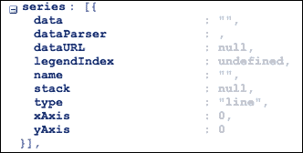

文档中经过深思熟虑的部分在右侧，有属性的说明。每个定义都附带一个描述和每个设置的在线演示，链接到 jsFiddle 网站：

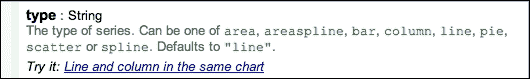

这个即时的 jsFiddle 示例邀请用户探索不同的属性值并观察它们对图表的影响，因此整个文档浏览过程变得非常有效且流畅。

## 开放性（带有用户声音的功能请求）

Highcharts 决定每个主要版本新功能的一个重要方式是通过用户的反馈（这在开源项目中并不罕见，但 Highcharts 在这个领域优于其他项目）。用户可以提交新的功能请求并对它们进行投票。然后公司审查得票最多的功能请求，并制定包括新功能在内的开发计划。该计划的细节随后发布在 Highcharts 网站上。

此外，Highcharts 还托管在 GitHub 上，这是一个在线公共源代码控制服务，允许 JavaScript 开发者贡献并克隆他们自己的版本：


# Highcharts – 快速教程

在本节中，你将了解如何实现你的第一个 Highcharts 图表。假设我们想从我们的本地 Web 服务器运行 Highcharts，首先从 Highcharts 网站下载最新版本：[`www.highcharts.com/download`](http://www.highcharts.com/download)。

或者，我们可以通过以下方式通过**内容分发网络**（**CDN**）加载库：

```js
<script type="text/javascript" 
        src="img/highcharts.js"></script>
```

对于调试，`highcharts.src.js` 也可以从 CDN 获取。

## 目录结构

当你解压下载的 ZIP 文件时，你应该在 `Highcharts-4.x.x` 顶级目录下看到以下目录结构：

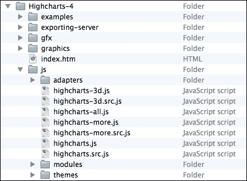

以下每个目录包含的内容及其用途：

+   `index.html`：这是演示 HTML 页面，与 Highcharts 网站上的演示页面相同，这样你就可以离线实验 Highcharts。

+   `examples`：这包含所有示例的源文件。

+   `graphics`：这包含示例中使用的图像文件。

+   `gfx`：这包含一个图像文件，用于为仅支持 VML 的浏览器生成径向渐变效果。

+   `exporting-server`：这个目录包含三个主要组件：一个在线导出服务器的 Java 实现、一个用于在服务端运行 Highcharts 的 PhantomJs 工具包，以及一个使用 Batik 服务的服务器脚本。这个目录对需要设置自己的内部导出服务或作为服务器进程运行 Highcharts 的用户很有用。参见第十四章，*服务器端 Highcharts* 和 第十五章，*Highcharts 在线服务和插件*。

+   `js`：这是 Highcharts 代码的主要目录。每个 JavaScript 文件名有两个后缀：`.src.js`，其中包含带有注释的源代码，以及 `.js`，这是 JavaScript 源文件的压缩版本。`highcharts.js` 文件包含核心功能以及基本的图表实现，`highcharts-3d.js` 是 3D 图表的扩展，而 `highcharts.more.js` 包含额外的系列，如极坐标、仪表、气泡、范围、瀑布、误差条和箱线图。`Highcharts-all.js` 允许用户在他们的应用程序中提供所有图表系列。

+   `adapters`：此目录包含默认的适配器 standalone-framework，以源代码和压缩格式提供。

+   `modules`：自上一版本以来，Highcharts 创建了许多插件模块，如 solid-gauge、funnel、exporting、drilldown、canvas-tools 等。此目录包含这些插件。

    ### 注意

    第三方工具 canvg 支持安卓 2.x 版本，因为原生浏览器没有 SVG 支持，但可以显示 canvas。

+   `themes`：这包含一组预构建的 JavaScript 文件，其中包含背景颜色、字体样式、坐标轴布局等设置。用户可以在他们的图表中加载这些文件之一以实现不同的样式。

您需要做的就是将顶层 `Highcharts-4.x.x/js` 目录移动到您的 Web 服务器文档根目录中。

要使用 Highcharts，您需要在您的 HTML 文件中包含 `Highcharts-4.x.x/js/highcharts.js` 库。以下是一个示例，展示了公共网站浏览器使用的百分比。该示例使用最小配置设置，以便您快速开始。以下示例的上半部分：

```js
<!DOCTYPE HTML>
<html>
  <head>
    <meta http-equiv="Content-Type" 
          content="text/html; charset=utf-8">
    <title>Highcharts First Example</title>
    <script src="img/jquery.min.js"></script>
    <script type="text/javascript" 
        src="img/highcharts.js"></script>
```

我们使用 Google 公共库服务在加载 Highcharts 库之前加载 jQuery 库版本 1.8.2。在撰写本文时，最新的 jQuery 版本是 2.1.1，而 Highcharts 对 jQuery 的系统要求是 1.8.2。

示例的第二部分是主要的 Highcharts 代码，如下所示：

```js
<script type="text/javascript">
var chart;
    $(document).ready(function() {
        Chart = new Highcharts.Chart({
            chart: {
                renderTo: 'container',
                type: 'spline'
            },
            title: {
                text: 'Web browsers statistics'
            },
            subtitle: {
                text: 'From 2008 to present'
            },
            xAxis: {
                categories: [ 'Jan 2008', 'Feb', .... ],
                tickInterval: 3
            },
            yAxis: {
                title: {
                    text: 'Percentage %'
                },
                min: 0
            },
            plotOptions: {
                series: {
                    lineWidth: 2
                }
            },
            series: [{
                name: 'Internet Explorer',
                data: [54.7, 54.7, 53.9, 54.8, 54.4, ... ]
            }, {
                name: 'FireFox',
                data: [36.4, 36.5, 37.0, 39.1, 39.8, ... ]
            }, {
                // Chrome started until late 2008
                name: 'Chrome',
                data: [ null, null, null, null, null, null, 
                        null, null, 3.1, 3.0, 3.1, 3.6, ... ] 
            }, {
                name: 'Safari',
                data: [ 1.9, 2.0, 2.1, 2.2, 2.4, 2.6, ... ]
            }, {
                name: 'Opera',
                data: [ 1.4, 1.4, 1.4, 1.4, 1.5, 1.7, ... ]
            }]
        });
    });
</script>
  </head>
  <body>
  <div>
    <!-- Highcharts rendering takes place inside this DIV --> 
    <div id="container"></div>
  </div>
</body>
</html>
```

通过一个包含所有属性和系列数据的对象指定符创建样条图。一旦创建 `chart` 对象，图表就会在浏览器中显示。在这个对象指定符中，有与图表结构相对应的主要组件：

```js
var chart = new HighCharts.Chart({ 
    chart: {
        ...
    },
    title: '...'
    ... 
});
```

`renderTo` 选项指示 Highcharts 在具有 `'container'` ID 值的 HTML `<div>` 元素上显示图表，该 ID 在 HTML `<body>` 部分中定义。`type` 选项设置为默认的展示类型 `'spline'`，适用于任何系列数据，如下所示：

```js
chart: {
    renderTo: 'container',
    type: 'spline'
}
```

接下来是设置 `title` 和 `subtitle`，它们出现在图表顶部的中央：

```js
title: {
   text: 'Web browsers ... '
},
subtitle: {
   text: 'From 2008 to present'
},
```

`xAxis`属性的`categories`选项包含每个数据点的 x 轴标签数组。由于图表至少有 50 个数据点，打印每个 x 轴标签将使文本重叠。旋转标签仍然会使轴看起来非常拥挤。最佳折衷方案是每打印第三个标签（`tickIntervals: 3`），这样标签之间的间距就很好。

为了简化，我们在`xAxis.categories`中使用 50 个条目来表示时间。然而，我们将在下一章看到一种更优化的、更合理的方式来显示日期和时间数据：

```js
xAxis: {
   categories: [ 'Jan 2008', 'Feb', .... ],
   tickInterval: 3
},
```

`yAxis`中的选项是分配 y 轴的标题并设置可能的最小值为零；否则，Highcharts 将在 y 轴上显示负百分比范围，这对于这个数据集来说是不想要的：

```js
yAxis: {
     title: {
         text: 'Percentage %'
     },
     min: 0
},
```

`plotOptions`属性用于控制每个系列如何显示，根据其类型（线、饼、柱状等）。`plotOptions.series`选项是应用于所有系列类型的通用配置，而不是在`series`数组内部定义每个设置。在这个例子中，每个系列的默认`linewidth`设置为 2 像素宽，如下所示：

```js
 plotOptions: {
    series: {
        lineWidth: 2
    }
},
```

`series`属性是整个配置对象的核心，它定义了所有系列数据。它是一个`series`对象的数组。`series`对象可以通过多种方式指定。在这个例子中，名称是出现在图表图例和工具提示中的系列名称。数据是一个 y 轴值的数组，其长度与`xAxis.categories`数组相同，以形成(x,y)数据点：

```js
series: [{
     name: 'Internet Explorer',
     data: [54.7, 54.7, 53.9, 54.8, 54.4, ... ]
}, {
     name: 'FireFox',
     data: [36.4, 36.5, 37.0, 39.1, 39.8, ... ]
}, {
```

### 提示

**下载示例代码**

您可以从您在[`www.packtpub.com`](http://www.packtpub.com)的账户中下载示例代码文件，以获取您购买的所有 Packt Publishing 书籍。如果您在其他地方购买了这本书，您可以访问[`www.packtpub.com/support`](http://www.packtpub.com/support)并注册，以便将文件直接通过电子邮件发送给您。

以下截图显示了在 Safari 浏览器上最终 Highcharts 应该看起来是什么样子：

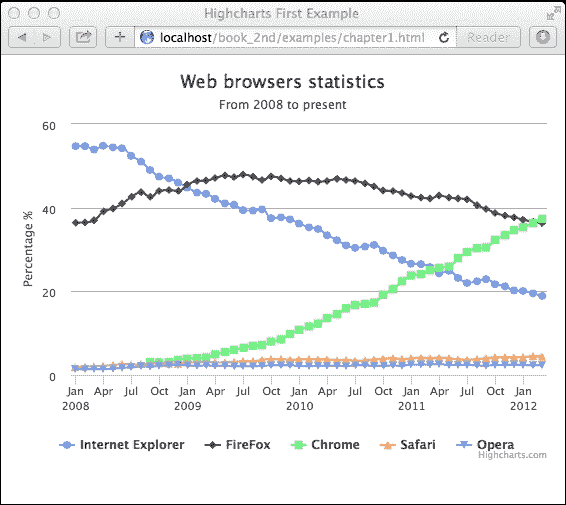

以下截图显示了在 Internet Explorer 11 浏览器上应该看起来是什么样子：

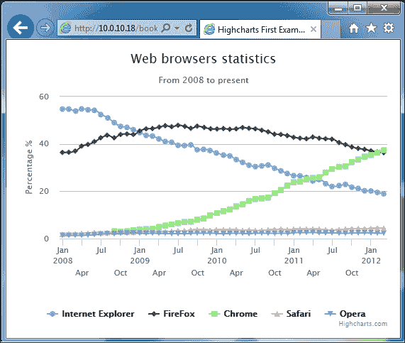

以下截图显示了在 Chrome 浏览器上应该看起来是什么样子：

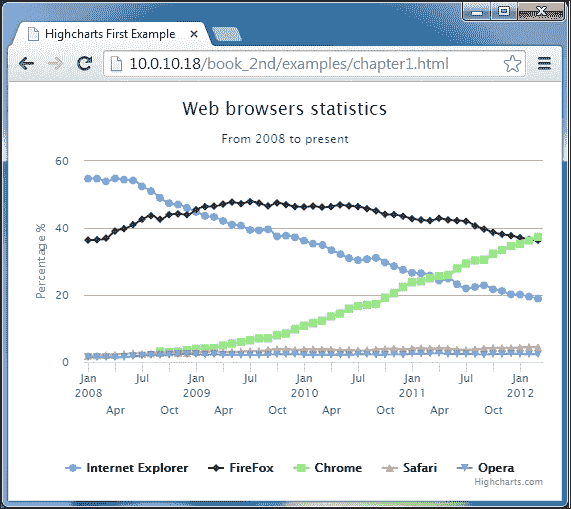

以下截图显示了在 Firefox 浏览器上应该看起来是什么样子：

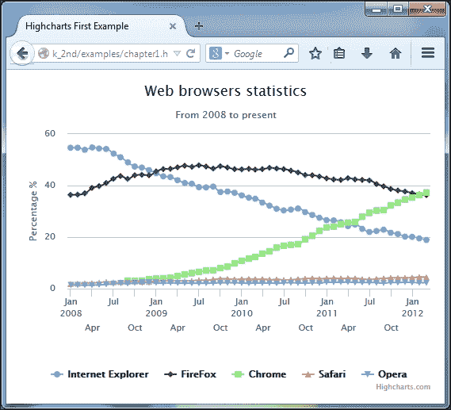

# 摘要

网络图表自 HTML 的早期以来就已经存在，从服务器端技术发展到客户端。在此期间，采用了几种解决方案来克服 HTML 的不足。现在，随着功能丰富的 HTML5 的出现，网络图表又回到了 HTML，这次它是为了永远，得益于 JavaScript。

本章提到了许多 JavaScript 图表产品。在这些产品中，Highcharts 凭借其独特的图形风格和流畅的用户交互脱颖而出。我们还通过一个简单的图表示例来体验创建我们第一个 Highcharts 图表是多么快捷和简单。

在下一章中，我们将更深入地探讨 Highcharts 配置对象，并附带更多示例。配置对象是产品的核心部分，其结构作为所有图表的共同原型。
