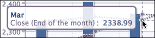

# 第二章 高级图表配置

所有 Highcharts 图表共享相同的配置结构，对我们来说熟悉核心组件至关重要。然而，在本书中不可能涵盖所有配置。在本章中，我们将探索最常用的功能属性，并通过示例进行演示。我们将学习 Highcharts 如何管理布局，然后探讨如何配置坐标轴、指定单系列和多系列数据，接着查看 JavaScript 和 HTML 中格式化和样式化工具提示。之后，我们将了解如何使用各种类型的动画来润色我们的图表，并应用颜色渐变。最后，我们将探索`drilldown`交互功能。在本章中，我们将涵盖以下主题：

+   理解 Highcharts 布局

+   使用坐标轴框定图表

+   重新审视系列配置

+   设置工具提示样式

+   动画图表

+   使用渐变扩展颜色

+   使用`drilldown`系列构建图表

# 配置结构

在 Highcharts 配置对象中，顶层组件代表图表的骨架结构。以下是在本章中涵盖的主要组件列表：

+   `chart`：这包含顶级图表属性（如布局、尺寸、事件、动画和用户交互）的配置

+   `series`：这是一个系列对象的数组（包含数据和特定选项），用于单系列和多系列，其中系列数据可以以多种方式指定

+   `xAxis`/`yAxis/zAxis`：这包含所有轴属性（如标签、样式、范围、间隔、绘图线、绘图带和背景）的配置

+   `tooltip`：这包含系列数据工具提示的布局和格式样式配置

+   `drilldown`：这包含用于钻取系列及其与主系列关联的 ID 字段的配置

+   `title`/`subtitle`：这包含图表标题和副标题的布局和样式配置

+   `legend`：这包含图表图例的布局和格式样式配置

+   `plotOptions`：这包含所有绘图选项，例如显示、动画和用户交互，适用于常见系列和特定系列类型

+   `exporting`：这包含控制打印和导出功能的布局和功能的配置

有关所有配置的参考信息，请访问[`api.highcharts.com`](http://api.highcharts.com)。

# 理解 Highcharts 的布局

在我们开始学习 Highcharts 布局如何工作之前，首先理解一些基本概念是至关重要的。为了做到这一点，让我们首先回顾第一章中使用的图表示例 *Web Charts*，并设置一些可见的边框。首先，设置绘图区域的边框。为此，我们可以在`chart`部分设置`plotBorderWidth`和`plotBorderColor`的选项，如下所示：

```js
        chart: {
                renderTo: 'container',
                type: 'spline',
                plotBorderWidth: 1,
                plotBorderColor: '#3F4044'
        },
```

第二个边框被设置在 Highcharts 容器周围。接下来，我们通过添加额外的设置扩展前面的 `chart` 部分：

```js
        chart: {
                renderTo: 'container',
                ....
                borderColor: '#a1a1a1',
                borderWidth: 2,
                borderRadius: 3
        },
```

这将容器边框颜色设置为 `2` 像素的宽度，并具有 `3` 像素的圆角。

如我们所见，容器周围有一个边框，这是 Highcharts 显示不能超过的边界：


默认情况下，Highcharts 显示有三个不同的区域：空间、标签和绘图区域。绘图区域是包含所有绘图图形的内矩形区域。标签区域是标题、副标题、坐标轴标题、图例和版权信息等标签所在区域，位于绘图区域周围，因此它位于绘图区域边缘和空间区域内边缘之间。空间区域是容器边框和标签区域外边缘之间的区域。

以下截图显示了三种不同类型的区域。插入了一条灰色虚线来表示空间和标签区域之间的边界。


每个图表标签位置可以在以下两种布局之一中进行操作：

+   **自动布局**：Highcharts 会根据标签区域中标签的位置自动调整绘图区域的大小，因此绘图区域根本不会与标签元素重叠。自动布局是配置的最简单方式，但控制较少。这是定位图表元素的默认方式。

+   **固定布局**：没有标签区域的概念。图表标签在固定位置指定，因此它在绘图区域上具有浮动效果。换句话说，绘图区域边不会自动调整以适应相邻的标签位置。这使用户能够完全控制图表的显示方式。

空间区域控制了 Highcharts 在每一边的显示偏移。只要图表边距没有定义，增加或减少空间区域会对自动和固定布局中的绘图区域测量产生全局影响。

## 图表边距和间距设置

在本节中，我们将了解图表边距和间距设置如何影响整体布局。图表边距可以通过 `margin`、`marginTop`、`marginLeft`、`marginRight` 和 `marginBottom` 属性进行配置，并且默认情况下它们是禁用的。设置图表边距会对绘图区域产生全局影响，因此没有任何标签位置或图表间距配置可以影响绘图区域的大小。因此，所有图表元素相对于绘图区域都处于固定布局模式。`margin` 选项是一个包含四个边距值的数组，每个方向都覆盖了一个值，与 CSS 中的相同，从北开始，按顺时针方向进行。此外，`margin` 选项的优先级低于任何方向性的 `margin` 选项，无论它们在 `chart` 部分中的顺序如何。

间距配置默认启用，每侧有一个固定值。这些可以在 `chart` 部分通过属性名称 `spacing`、`spacingTop`、`spacingLeft`、`spacingBottom` 和 `spacingRight` 进行配置。

在本例中，我们将增加或减少图表每侧的 `margin` 或 `spacing` 属性，并观察其效果。以下是一些图表设置：

```js
            chart: {
                renderTo: 'container',
                type: ...
                marginTop: 10,
                marginRight: 0,
                spacingLeft: 30,
                spacingBottom: 0
            },
```

以下截图显示了图表的外观：


`marginTop` 属性将图表区域的顶部边界固定在容器边界的 `10` 像素处。它还将任何标签元素的顶部边界更改为固定布局，因此图表标题和副标题浮在图表区域上方。`spacingLeft` 属性增加左侧的间距区域，因此将 *y* 轴标题推得更远。由于它是自动布局（未声明 `marginLeft`），它还将图表区域的西边界推入。将 `marginRight` 设置为 `0` 将覆盖图表右侧的所有默认间距并将其更改为固定布局模式。最后，将 `spacingBottom` 设置为 `0` 使图例接触容器的底部条，因此它也将图表区域向下拉伸。这是因为即使 `spacingBottom` 设置为 `0`，底部边缘仍然是自动布局。

## 图表标签属性

图表标签如 `xAxis.title`、`yAxis.title`、`legend`、`title`、`subtitle` 和 `credits` 具有共同的属性名称，如下所示：

+   `align`: 这用于标签的水平对齐。可能的关键字是 `'left'`, `'center'`, 和 `'right'`。至于坐标轴标题，它是 `'low'`, `'middle'`, 和 `'high'`。

+   `floating`: 这是为了在图表区域给标签位置一个浮动效果。将此设置为 `true` 将导致标签位置对相邻图表区域的边界没有影响。

+   `margin`: 这是标签与相邻图表区域边界的边距设置。只有某些标签类型有此设置。

+   `verticalAlign`: 这用于标签的垂直对齐。关键字有 `'top'`, `'middle'`, 和 `'bottom'`。

+   `x`: 这用于相对于对齐的横向定位。

+   `y`: 这用于相对于对齐的纵向定位。

至于标签的 `x` 和 `y` 定位，它们不用于图表内的绝对定位。它们是为标签对齐进行精细调整而设计的。以下图表显示了坐标方向，其中中心代表标签位置：


我们可以通过一个简单的`align`和`y`位置设置的示例来实验这些属性，通过将标题和副标题并排放置。标题通过将`align`设置为`'left'`向左移动，而副标题的对齐设置为`'right'`。为了使两个标题出现在同一行，我们将副标题的`y`位置更改为`15`，这与标题的默认`y`值相同：

```js
 title: {
     text: 'Web browsers ...',
     align: 'left'
 },
 subtitle: {
     text: 'From 2008 to present',
     align: 'right',
     y: 15
 },
```

以下是一个截图，显示了两个标题在同一行对齐：


在以下子节中，我们将实验每个标签元素的对齐变化如何影响绘图区域的布局行为。

### 标题和副标题对齐

标题和副标题具有相同的布局属性，唯一的区别是默认值和标题有`margin`设置。指定任何值的`verticalAlign`都会从默认的自动布局更改为固定布局（它内部将`floating`切换为`true`）。然而，手动将副标题的`floating`属性设置为`false`并不会切换回自动布局。以下是一个自动布局中的`title`和固定布局中的`subtitle`的示例：

```js
    title: {
       text: 'Web browsers statistics'
    },
    subtitle: {
       text: 'From 2008 to present',
       verticalAlign: 'top',
       y: 60    
    },
```

副标题的`verticalAlign`属性设置为`'top'`，这会将布局切换到固定布局，并将`y`偏移增加到`60`。`y`偏移将副标题的位置进一步向下推。由于绘图区域不再与副标题处于自动布局关系，绘图区域的上边框会高于副标题。然而，绘图区域仍然与标题处于自动布局关系，因此标题仍然位于绘图区域上方：


### 图例对齐

图例对于`verticalAlign`和`align`属性有不同的行为。除了将对齐设置为`'center'`外，`verticalAlign`和`align`中的所有其他设置都保持自动定位。以下是一个图例位于图表右侧的示例。`verticalAlign`属性被切换到图表的中间，其中水平`align`被设置为`'right'`：

```js
          legend: {
                align: 'right',
                verticalAlign: 'middle',
                layout: 'vertical'
          },
```

将`layout`属性设置为`'vertical'`，这样会导致图例框内的项目以垂直方式显示。正如我们所见，绘图区域会自动调整大小以适应图例框：


注意，在新版本中，图例框周围的边框装饰已被禁用。要显示图例框周围的圆角边框，我们可以使用以下方式添加`borderWidth`和`borderRadius`选项：

```js
          legend: {
                align: 'right',
                verticalAlign: 'middle',
                layout: 'vertical',
                borderWidth: 1,
                borderRadius: 3
          },
```

这里是具有圆角边框的图例框：


### 轴标题对齐

轴标题不使用 `verticalAlign`。相反，它们使用 `align` 设置，可以是 `'low'`、`'middle'` 或 `'high'`。标题的 `margin` 值是轴标题与轴线之间的距离。以下是一个示例，展示了 y 轴标题水平旋转（而不是默认的垂直旋转）并显示在轴线上方而不是旁边的情况。我们还使用 `y` 属性来微调标题位置：

```js
            yAxis: {
                title: {
                    text: 'Percentage %',
                    rotation: 0,
                    y: -15,
                    margin: -70,
                    align: 'high'
                },
                min: 0
            },
```

以下是一个图表右上角的截图，显示标题在 *y* 轴顶部水平对齐。或者，我们可以使用 `offset` 选项代替 `margin` 来达到相同的效果。


### 信用对齐

信用与其他标签元素略有不同。它只支持 `align`、`verticalAlign`、`x` 和 `y` 属性在 `credits.position` 属性中（`credits: { position: … }` 的缩写），并且也不受任何间距设置的影响。假设我们有一个没有图例的图表，并且我们必须将信用移动到图表的左下角区域，以下代码片段显示了如何操作：

```js
            legend: {
                enabled: false
            },
            credits: {
                position: { 
                   align: 'left'
                },
                text: 'Joe Kuan',
                href: 'http://joekuan.wordpress.com'
            },
```

然而，信用文本超出了图表的边缘，如下面的截图所示：


即使我们将 `credits` 标签通过 `x` 定位移动到右侧，标签仍然与 *x* 轴间隔标签有点太近。我们可以引入额外的 `spacingBottom` 在两个标签之间留出间隙，如下所示：

```js
            chart: {
                   spacingBottom: 30,
                    ....
            },
            credits: {
                position: { 
                   align: 'left',
                   x: 20,
                   y: -7
                },
            },
            ....
```

以下是一个截图，显示了经过最终调整的信用：


## 尝试自动布局

在本节中，我们将更详细地检查自动布局功能。为了简化示例，我们将从只有图表标题且没有任何图表间距设置开始：

```js
     chart: {
         renderTo: 'container',
         // border and plotBorder settings
         borderWidth: 2,
         .....
     },
     title: {
            text: 'Web browsers statistics,
     },
```

从前面的示例中，图表标题应出现在容器和绘图区域边框之间，如预期所示：


标题与容器顶部边框之间的空间具有间距区域（默认高度为 10 像素）的默认设置 `spacingTop`。标题与绘图区域顶部边框之间的间隙是 `title.margin` 的默认设置，高度为 15 像素。

通过在 `chart` 部分设置 `spacingTop` 为 `0`，图表标题向上移动到容器顶部边框旁边。因此，绘图区域的大小自动向上扩展，如下所示：


然后，我们将 `title.margin` 设置为 `0`；绘图区域边框向上移动，因此绘图区域的高度进一步增加，如下所示：


如您可能注意到的，顶部边框和图表标题之间仍然有少量像素的间隙。这实际上是由于标题的 `y` 位置设置的默认值，为 15 像素，足够大，可以容纳默认标题字体大小。

以下是将容器和绘图区域之间的所有空间设置为 `0` 的图表配置：

```js
chart: {
     renderTo: 'container',
     // border and plotBorder settings
     .....
     spacingTop: 0
},
title: {
     text: null,
     margin: 0,
     y: 0
}
```

如果我们将 `title.y` 设置为 `0`，绘图区域顶部边缘和顶部容器边缘之间的所有间隙都会关闭。以下是在图表左上角的最终截图，以显示效果。图表标题不再可见，因为它已经被移到了容器上方：


有趣的是，如果我们反向工作到第一个示例，绘图区域顶部和容器顶部之间的默认距离计算如下：

*spacingTop + title.margin + title.y = 10 + 15 + 15 = 40*

因此，更改这三个变量中的任何一个都会自动调整从顶部容器栏开始的绘图区域。这些偏移变量在自动布局中实际上都有其自己的目的。间距是容器和图表内容之间的间隙；因此，如果我们想在网页上与其他元素间隔显示图表，应使用间距元素。同样，如果我们想为标签元素使用特定的字体大小，我们应该考虑调整 `y` 偏移。因此，标签仍然保持一定的距离，不会干扰图表中的其他组件。

## 尝试固定布局

在上一节中，我们学习了绘图区域如何动态调整自身。在本节中，我们将看到如何手动定位图表标签。首先，我们将从 *尝试自动布局* 部分的开头示例代码开始，将图表标题的 `verticalAlign` 设置为 `'bottom'`，如下所示：

```js
chart: {
    renderTo: 'container',
    // border and plotBorder settings    .....
},
title: {
    text: 'Web browsers statistics',
    verticalAlign: 'bottom'
},
```

图表标题被移动到图表的底部，紧邻容器的下边框。请注意，此设置已将标题更改为浮动模式；更重要的是，图例仍然保持在绘图区域的默认自动布局中：


请注意，我们尚未指定 `spacingBottom`，当应用于图表时，它的高度默认值为 15 像素。这意味着标题和容器底部边框之间应该有一个间隙，但并未显示。这是因为 `title.y` 位置相对于间距的默认值为 15 像素。根据 *图表标签属性* 部分的图示，这个正 `y` 值将标题推向底部边框；这补偿了由 `spacingBottom` 创建的空间。

让我们这次对 `y` 偏移位置进行更大的更改，以显示 `verticalAlign` 是浮在绘图区域之上的：

```js
 title: {
     text: 'Web browsers statistics',
     verticalAlign: 'bottom',
     y: -90
 },
```

负 `y` 值将标题向上移动，如下所示：


现在标题与绘图区域重叠。为了证明图例在绘图区域方面仍然是自动布局，这里我们更改了图例的 `y` 位置和 `margin` 设置，即轴标签的距离：

```js
               legend: {
                   margin: 70,
                   y: -10
               },
```

这已经推高了绘图区域的底部。然而，图表标题仍然保持固定布局，并且在应用新的图例设置后，其位置在图表内没有任何改变，如下面的截图所示：


到目前为止，我们应该对如何定位标签元素及其与绘图区域相关的布局策略有了更好的理解。

# 使用轴来框定图表

在本节中，我们将从功能区域的角度探讨 Highcharts 中轴的配置。我们将从一个简单的折线图开始，逐渐向图表应用更多选项以展示其效果。

## 访问轴数据类型

指定图表数据的方式有两种：分类和系列数据。为了显示具有特定名称的区间，我们应该使用 `categories` 字段，它期望一个字符串数组。分类数组中的每个条目都与系列数据数组相关联。或者，轴区间值嵌入在系列数据数组内部。然后，Highcharts 提取两个轴的系列数据，解释数据类型，并适当地格式化和标记值。

以下是一个简单的示例，展示了分类的使用：

```js
    chart: {
        renderTo: 'container',
        height: 250,
        spacingRight: 20 
    },
    title: {
        text: 'Market Data: Nasdaq 100'
    },
    subtitle: {
        text: 'May 11, 2012'
    },
    xAxis: {
        categories: [ '9:30 am', '10:00 am', '10:30 am', 
                      '11:00 am', '11:30 am', '12:00 pm', 
                      '12:30 pm', '1:00 pm', '1:30 pm', 
                      '2:00 pm', '2:30 pm', '3:00 pm', 
                      '3:30 pm', '4:00 pm' ],
        labels: {
            step: 3
        }
    },
    yAxis: {
        title: {
            text: null
        }
    },
    legend: {
        enabled: false
    },
    credits: {
        enabled: false
    },
    series: [{
        name: 'Nasdaq',
        color: '#4572A7',
        data: [ 2606.01, 2622.08, 2636.03, 2637.78, 2639.15, 
                2637.09, 2633.38, 2632.23, 2632.33, 2632.59, 
                2630.34, 2626.89, 2624.59, 2615.98 ]
    }]
```

前面的代码片段生成的图表如下截图所示：


分类字段中的第一个名称对应于数据数组中的第一个值，**9:30 am**，2606.01，等等。

或者，我们可以在系列数据内部指定时间值，并使用 *x* 轴的 `type` 属性来格式化时间。`type` 属性支持 `'linear'`（默认值）、`'logarithmic'` 或 `'datetime'`。`'datetime'` 设置会自动将系列数据中的时间解释为可读形式。此外，我们可以使用 `dateTimeLabelFormats` 属性来预定义时间单位的自定义格式。该选项还可以接受多个时间单位格式。这是当我们事先不知道系列数据中的时间跨度有多长时的情况，因此结果图中的每个单位可以是每小时、每天等等。以下示例展示了如何使用预定义的小时和分钟格式指定图表。格式字符串的语法基于 PHP 的 `strftime` 函数：

```js
    xAxis: {
        type: 'datetime',
         // Format 24 hour time to AM/PM
         dateTimeLabelFormats: {

             hour: '%I:%M %P',
             minute: '%I %M'
         }           
    },
    series: [{
        name: 'Nasdaq',
        color: '#4572A7',
        data: [ [ Date.UTC(2012, 4, 11, 9, 30), 2606.01 ], 
                 [ Date.UTC(2012, 4, 11, 10), 2622.08 ],  
                 [ Date.UTC(2012, 4, 11, 10, 30), 2636.03 ],
                 .....
               ]
    }]
```

注意，*x* 轴使用的是 12 小时制时间格式，如下面的截图所示：


相反，我们可以定义 `xAxis.labels.formatter` 属性的格式处理程序以实现类似的效果。Highcharts 提供了一个实用程序，`Highcharts.dateFormat`，它将毫秒时间戳转换为可读格式。在以下代码片段中，我们使用 `dateFormat` 和 `this.value` 定义了 `formatter` 函数。关键字 `this` 是轴的间隔对象，而 `this.value` 是间隔实例的 UTC 时间值：

```js
    xAxis: {
        type: 'datetime',
        labels: {
            formatter: function() {
                return Highcharts.dateFormat('%I:%M %P', this.value);
            }
        }
    },
```

由于我们的数据点的时值是固定间隔的，它们也可以以缩略版的形式排列。我们只需要定义时间点的起始点 `pointStart` 和它们之间的常规间隔 `pointInterval`（以毫秒为单位）：

```js
series: [{
    name: 'Nasdaq',
    color: '#4572A7',
    pointStart: Date.UTC(2012, 4, 11, 9, 30),
    pointInterval: 30 * 60 * 1000,
    data: [ 2606.01, 2622.08, 2636.03, 2637.78, 
            2639.15, 2637.09, 2633.38, 2632.23, 
            2632.33, 2632.59, 2630.34, 2626.89, 
            2624.59, 2615.98 ]
}] 
```

## 调整间隔和背景

在上一节中，我们学习了如何使用轴类别和系列数据数组。在本节中，我们将看到如何格式化间隔线和背景样式，以产生更清晰的图表。

我们将继续之前的示例。首先，让我们在 *y* 轴上创建一些间隔线。在图表中，间隔自动设置为 20。然而，将间隔线的数量加倍会更清晰。为此，只需将 `tickInterval` 值分配为 `10`。然后，我们使用 `minorTickInterval` 在间隔之间放置另一条线以指示半间隔。为了区分间隔线和半间隔线，我们将半间隔线 `minorGridLineDashStyle` 设置为虚线和点划线样式。

### 注意

Highcharts 中有近十种线型设置可用，从 `'Solid'` 到 `'LongDashDotDot'`。读者可以参考在线手册以获取可能的值。

以下是为创建新设置的第一步：

```js
            yAxis: {
                title: {
                    text: null
                },
                tickInterval: 10,
                minorTickInterval: 5,
                minorGridLineColor: '#ADADAD',
                minorGridLineDashStyle: 'dashdot'
           }
```

间隔线应该看起来像下面的截图：


为了使图表看起来更加美观，我们使用 `alternateGridColor` 添加了带有阴影的条纹效果。然后，我们将间隔线颜色 `gridLineColor` 改变为与条纹相似的范围。以下代码片段被添加到 `yAxis` 配置中：

```js
                gridLineColor: '#8AB8E6',
                alternateGridColor: {
                    linearGradient: {
                        x1: 0, y1: 1,
                        x2: 1, y2: 1
                    },
                    stops: [ [0, '#FAFCFF' ],
                             [0.5, '#F5FAFF'] ,
                             [0.8, '#E0F0FF'] ,
                             [1, '#D6EBFF'] ]
                  }
```

我们将在本章后面讨论颜色渐变。以下是有新阴影背景的图表：


下一步是给 *y* 轴线应用更专业的样式。我们将使用 `lineWidth` 属性在 *y* 轴上画线，并使用以下代码片段在间隔线上添加一些测量标记：

```js
                 lineWidth: 2,
                 lineColor: '#92A8CD',
                 tickWidth: 3,
                 tickLength: 6,
                 tickColor: '#92A8CD',
                 minorTickLength: 3,
                 minorTickWidth: 1,
                 minorTickColor: '#D8D8D8'
```

`tickWidth` 和 `tickLength` 属性在每条间隔线的起始处添加了小标记的效果。我们在间隔标记和坐标线上都应用了相同的颜色。然后，我们将 `minorTickLength` 和 `minorTickWidth` 添加到半间隔线中，尺寸更小。这样就在坐标线上产生了一个很好的测量标记效果，如下面的截图所示：


现在，我们对`xAxis`配置应用类似的润色，如下：

```js
           xAxis: {
               type: 'datetime',
               labels: {
                   formatter: function() {
                       return Highcharts.dateFormat('%I:%M %P', this.value);
                   },
               },
               gridLineDashStyle: 'dot',
               gridLineWidth: 1,
               tickInterval: 60 * 60 * 1000,
               lineWidth: 2,
               lineColor: '#92A8CD',
               tickWidth: 3,
               tickLength: 6,
               tickColor: '#92A8CD',
           },
```

我们将*x*轴的间隔线设置为小时格式，并将线型切换为虚线。然后，我们应用与*y*轴相同的颜色、粗细和间隔刻度。以下是为截图：


然而，在*x*轴线上存在一些缺陷。首先，*x*轴线和*y*轴线的交汇点没有正确对齐。其次，*x*轴上的间隔标签与间隔刻度相接触。最后，第一个数据点的一部分被 y 轴线覆盖。以下是一个放大后的截图，显示了这些问题：


解决坐标轴线对齐问题的有两种方法，如下：

+   将绘图区域向 x 轴方向移动 1 像素。这可以通过将`xAxis`的`offset`属性设置为`1`来实现。

+   将*x*轴线的宽度增加到 3 像素，与*y*轴的刻度间隔宽度相同。

至于*x*轴标签，我们可以通过将`y`偏移值引入`labels`设置来简单地解决这个问题。

最后，为了避免第一个数据点接触 y 轴线，我们可以在*x*轴上施加`minPadding`。这样做是在轴的最小值处添加填充空间，即第一个点。`minPadding`值基于图表宽度的比例。在这种情况下，将属性设置为`0.02`相当于将*x*轴向右移动 5 像素（250 px * 0.02）。以下是为改善图表的附加设置：

```js
    xAxis: {
        ....
        labels: {
               formatter: ...,
               y: 17
        },
        .....
        minPadding: 0.02,
        offset: 1
    }
```

以下截图显示问题已得到解决：


如我们所见，Highcharts 提供了一套全面的、具有高度灵活性的可配置变量。

## 使用折线和折带

在本节中，我们将看到如何使用 Highcharts 在轴上放置线条或带状区域。我们将继续使用上一节中的示例。让我们画几条线来指示 y 轴上一天的最高和最低指数点。`plotLines`字段接受一个对象配置数组，用于每个折线。`plotLines`没有宽度和颜色默认值，因此我们需要明确指定它们才能看到线条。以下是为折线提供的代码片段：

```js
      yAxis: {
              ... ,
              plotLines: [{
                   value: 2606.01,
                   width: 2,
                   color: '#821740',
                   label: {
                       text: 'Lowest: 2606.01',
                       style: {
                           color: '#898989'
                       }
                   }
              }, {
                   value: 2639.15,
                   width: 2,
                   color: '#4A9338',
                   label: {
                       text: 'Highest: 2639.15',
                       style: {
                           color: '#898989'
                       }
                   }
              }]
        }
```

以下截图显示了它应该看起来像什么：


我们可以稍微改善图表的外观。首先，顶部折线的文本标签不应紧挨着最高点。其次，底部线的标签应被系列线和间隔线远程覆盖，如下：


为了解决这些问题，我们可以将绘图线的 `zIndex` 赋值为 `1`，这将文本标签置于区间线之上。我们还设置了标签的 `x` 位置以将文本移至点旁边。以下是新更改：

```js
             plotLines: [{
                   ... ,
                   label: {
                       ... ,
                       x: 25
                   },
                   zIndex: 1
                   }, {
                   ... ,
                   label: {
                       ... ,
                       x: 130
                   },
                   zIndex: 1
              }]
```

以下图表显示标签已被从绘图线移开，并移至区间线上：


现在，我们将更改前面的示例，使用绘图带区域显示市场开盘价和收盘价之间的指数变化。绘图带配置与绘图线非常相似，除了它使用 `to` 和 `from` 属性，并且 `color` 属性接受渐变设置或颜色代码。我们创建了一个带有三角形文本符号和值的绘图带，以表示正收盘价。我们不是使用 `x` 和 `y` 属性来微调标签位置，而是使用 `align` 选项将文本调整到绘图区域的中心（替换上述示例中的 `plotLines` 设置）：

```js
              plotBands: [{
                   from: 2606.01,
                   to: 2615.98,
                   label: {
                       text: '▲ 9.97 (0.38%)',
                       align: 'center',
                       style: {
                           color: '#007A3D'
                       }
                   },
                   zIndex: 1,
                   color: {
                       linearGradient: {
                           x1: 0, y1: 1,
                           x2: 1, y2: 1
                       },
                       stops: [ [0, '#EBFAEB' ],
                                [0.5, '#C2F0C2'] ,
                                [0.8, '#ADEBAD'] ,
                                [1, '#99E699'] 
                       ]
                   }
              }]
```

### 注意

三角形是一个 alt-code 字符；按住左 *Alt* 键，在数字键盘上输入 `30`。有关更多详细信息，请参阅 [`www.alt-codes.net`](http://www.alt-codes.net)。

这产生了一个图表，其中绿色绘图带突出显示了市场中的正收盘价，如下面的截图所示：


## 扩展到多个轴

之前，我们跑过了大多数的轴配置。在这里，我们探讨如何使用多个轴，这些轴只是一个包含轴配置的对象数组。

继续上一个股票市场示例，假设我们现在想包括另一个市场指数，道琼斯，以及纳斯达克。然而，这两个指数在性质上不同，所以它们的值范围差异很大。首先，让我们通过显示具有共同 *y* 轴的两个指数来检查结果。我们更改标题，移除 y 轴上的固定间隔设置，并包含另一个系列的数据：

```js
            chart: ... ,
            title: {
                text: 'Market Data: Nasdaq & Dow Jones'
            },
            subtitle: ... ,
            xAxis: ... ,
            credits: ... ,
            yAxis: {
                title: {
                    text: null
                },
                minorGridLineColor: '#D8D8D8',
                minorGridLineDashStyle: 'dashdot',
                gridLineColor: '#8AB8E6',
                alternateGridColor: {
                    linearGradient: {
                        x1: 0, y1: 1, 
                        x2: 1, y2: 1
                    },
                    stops: [ [0, '#FAFCFF' ],
                             [0.5, '#F5FAFF'] ,
                             [0.8, '#E0F0FF'] ,
                             [1, '#D6EBFF'] ]
                },
                lineWidth: 2,
                lineColor: '#92A8CD',
                tickWidth: 3,
                tickLength: 6,
                tickColor: '#92A8CD',
                minorTickLength: 3,
                minorTickWidth: 1,
                minorTickColor: '#D8D8D8'
            },
            series: [{
              name: 'Nasdaq',
              color: '#4572A7',
              data: [ [ Date.UTC(2012, 4, 11, 9, 30), 2606.01 ], 
                         [ Date.UTC(2012, 4, 11, 10), 2622.08 ],  
                         [ Date.UTC(2012, 4, 11, 10, 30), 2636.03 ], 
                         ...
                       ]
            }, {
              name: 'Dow Jones',
              color: '#AA4643',
              data: [ [ Date.UTC(2012, 4, 11, 9, 30), 12598.32 ], 
                         [ Date.UTC(2012, 4, 11, 10), 12538.61 ],  
                         [ Date.UTC(2012, 4, 11, 10, 30), 12549.89 ], 
                         ...
                       ]
            }]
```

以下图表显示了两个市场指数：


如预期的那样，指数在一天中发生的变化已经通过价值的大幅差异进行了标准化。两条线看起来大致是直的，这错误地暗示指数几乎没有变化。

现在我们来探讨将两个指数分别放在单独的 *y* 轴上。我们应该移除 *y* 轴上的任何背景装饰，因为我们现在在同一背景上共享不同的数据范围。

以下是对 `yAxis` 的新设置：

```js
           yAxis: [{  
                title: {
                    text: 'Nasdaq'
                },
              }, {
                title: {
                    text: 'Dow Jones'
                },
                opposite: true
            }],
```

现在 `yAxis` 是一个轴配置数组。数组中的第一个条目是纳斯达克，第二个是道琼斯。这次，我们显示轴标题以区分它们。`opposite` 属性是将道琼斯 *y* 轴放置在图表的另一侧以提高清晰度。否则，两个 *y* 轴都出现在左侧。

下一步是将 y 轴数组中的索引与系列数据数组对齐，如下所示：

```js
            series: [{
                name: 'Nasdaq',
                color: '#4572A7',
                yAxis: 0,
                data: [ ... ]
            }, {
                name: 'Dow Jones',
                color: '#AA4643',
                yAxis: 1,
                data: [ ... ]
            }]          
```

我们可以清楚地看到新图表中指数的移动，如下所示：


此外，我们可以通过将系列与坐标轴线条进行颜色匹配来改进最终视图。`Highcharts.getOptions().colors`属性包含系列默认颜色列表，因此我们使用前两个条目作为我们的索引。另一个改进是设置*x*轴的`maxPadding`，因为新的 y 轴线条覆盖了*x*轴高端部分的数据点：

```js
            xAxis: {
                ... ,
                minPadding: 0.02,
                maxPadding: 0.02
                },
            yAxis: [{
                title: {
                    text: 'Nasdaq'
                },
                lineWidth: 2,
                lineColor: '#4572A7',
                tickWidth: 3,
                tickLength: 6,
                tickColor: '#4572A7'
            }, {
                title: {
                    text: 'Dow Jones'
                },
                opposite: true,
                lineWidth: 2,
                lineColor: '#AA4643',
                tickWidth: 3,
                tickLength: 6,
                tickColor: '#AA4643'
            }],
```

下面的截图显示了图表改进后的外观：


我们可以通过向`yAxis`和`series`数组中添加条目来扩展前面的示例，并拥有超过两个轴，同时将两者映射在一起。下面的截图显示了一个 4 轴折线图：


# 重新审视系列配置

到目前为止，我们应该已经了解了`series`属性的作用。在本节中，我们将更详细地探讨它。

`series`属性是包含数据-系列特定选项的系列配置对象数组。它允许我们指定单系列数据和多系列数据。系列对象的目的就是通知 Highcharts 数据的格式以及数据在图表中的呈现方式。

图表中的所有数据值都是通过`data`字段指定的。`data`字段非常灵活，可以采用多种形式的数组，如下所示：

+   数值

+   一个包含*x*和*y*值的数组

+   一个具有描述数据点属性的点对象

前两个选项已在*访问轴数据类型*部分中进行了探讨。在本节中，我们将探讨第三个选项。让我们使用单系列纳斯达克示例，并通过数值和对象的混合来指定系列数据：

```js
         series: [{
              name: 'Nasdaq',
              pointStart: Date.UTC(2012, 4, 11, 9, 30),
              pointInterval: 30 * 60 * 1000,
              data: [{ 
                    // First data point
                    y: 2606.01,
                    marker: {
                        symbol: 'url(./sun.png)' 
                        }
                    }, 2622.08, 2636.03, 2637.78, 
                  { 
                    // Highest data point
                    y: 2639.15,
                    dataLabels: {
                        enabled: true
                    },
                    marker: { 
                        fillColor: '#33CC33',
                        radius: 5
                    }
                  }, 2637.09, 2633.38, 2632.23, 2632.33, 
                     2632.59, 2630.34, 2626.89, 2624.59, 
                  {
                    // Last data point
                    y: 2615.98,
                    marker: {
                        symbol: 'url(./moon.png)' 
                        } 
                  }]
            }]
```

第一个和最后一个数据点是具有*y*轴值和图像文件的对象，用于表示市场的开盘和收盘。最高数据点配置了不同的颜色和数据标签。数据点的大小也设置为略大于默认值。其余的数据数组只是数值，如下面的截图所示：


# 探索 PlotOptions

`plotOptions`对象是 Highcharts 中支持的所有系列类型配置对象的包装对象。这些配置具有如`plotOptions.line.lineWidth`这样的属性，这些属性与其他系列类型通用，以及如`plotOptions.pie.center`这样的配置，它仅针对饼图系列类型。在具体的系列中，有`plotOptions.series`，它用于整个系列共享的通用绘图选项。

前面的 `plotOptions` 对象可以在 `plotOptions.series`、`plotOptions.{series-type}` 和系列配置之间形成一个优先级链。例如，`series[x].shadow`（其中 `series[x].type` 是 `'pie'`）的优先级高于 `plotOptions.pie.shadow`，而 `plotOptions.pie.shadow` 的优先级又高于 `plotOptions.series.shadow`。

这样做的目的是图表由多个不同的系列类型组成。例如，在一个包含多个柱状系列和单个线条系列的图表中，柱状图和线条的共同属性可以在 `plotOptions.series.*` 中定义，而 `plotOptions.column` 和 `plotOptions.line` 则持有它们自己的特定属性值。此外，`plotOptions.{series-type}.*` 中的属性可以被系列数组中指定的相同系列类型进一步覆盖。

下面的表格是配置优先级的参考。高级别的配置优先级较低，这意味着链中较低级别的配置可以覆盖链中较高级别的配置。对于系列数组，如果 `series[x].type` 或默认系列类型值与 `plotOptions` 中的系列类型相同，则优先级有效：

```js
chart.type
    series[x].type

plotOptions.series.{seriesProperty}
    plotOptions.{series-type}.{seriesProperty}
        series[x].{seriesProperty}

plotOptions.points.events.*
       series[x].data[y].events.*

plotOptions.series.marker.*
       series[x].data[y].marker.*
```

`plotOptions` 对象包含控制图表中系列类型呈现方式的属性——例如倒置图表、系列颜色、堆叠柱状图、用户与系列的交互等。当我们研究每种图表类型时，所有这些选项都将被详细说明。同时，我们将通过一个月度纳斯达克图来探索 `plotOptions` 的概念。该图有五种不同的系列数据类型：开盘价、收盘价、最高价、最低价和成交量。通常，这些数据用于绘制每日股票图表（OHLCV）。我们将它们压缩到单个图表中，目的是为了演示 `plotOptions`。


下面的代码是生成前面图表的图表配置：

```js
            chart: {
                renderTo: 'container',
                height: 250,
                spacingRight: 30
            },
            title: {
                text: 'Market Data: Nasdaq 100'
            },
            subtitle: {
                text: '2011 - 2012'
            },
            xAxis: {
                categories: [ 'Jan', 'Feb', 'Mar', 'Apr', 
                              'May', 'Jun', 'Jul', 'Aug', 
                              'Sep', 'Oct', 'Nov', 'Dec' ],
                labels: {
                    y: 17
                },
                gridLineDashStyle: 'dot',
                gridLineWidth: 1,
                lineWidth: 2,
                lineColor: '#92A8CD',
                tickWidth: 3,
                tickLength: 6,
                tickColor: '#92A8CD',
                minPadding: 0.04,
                offset: 1
            },
            yAxis: [{
                title: {
                    text: 'Nasdaq index'
                },
                min: 2000,               
                minorGridLineColor: '#D8D8D8',
                minorGridLineDashStyle: 'dashdot',
                gridLineColor: '#8AB8E6',
                alternateGridColor: {
                    linearGradient: {
                        x1: 0, y1: 1,
                        x2: 1, y2: 1
                    },
                    stops: [ [0, '#FAFCFF' ],                      
                             [0.5, '#F5FAFF'] ,
                             [0.8, '#E0F0FF'] ,
                             [1, '#D6EBFF'] ]
                },
                lineWidth: 2,
                lineColor: '#92A8CD',
                tickWidth: 3,
                tickLength: 6,
                tickColor: '#92A8CD'
            }, {
                title: {
                    text: 'Volume'
                },
                lineWidth: 2,
                lineColor: '#3D96AE',
                tickWidth: 3,
                tickLength: 6,
                tickColor: '#3D96AE',
                opposite: true
            }],
            credits: {
                enabled: false
            },
            plotOptions: {
                column: {
                    stacking: 'normal'
                },
                line: {
                    zIndex: 2,
                    marker: {
                        radius: 3,
                        lineColor: '#D9D9D9',
                        lineWidth: 1
                    },
                    dashStyle: 'ShortDot'
                }
            },
            series: [{
              name: 'Monthly High',
              // Use stacking column chart - values on 
              // top of monthly low to simulate monthly
              // high
              data: [ 98.31, 118.08, 142.55, 160.68, ... ],
              type: 'column',
              color: '#4572A7'
            }, {
              name: 'Monthly Low',
              data: [ 2237.73, 2285.44, 2217.43, ... ],
              type: 'column',
              color: '#AA4643'
            }, {
              name: 'Open (Start of the month)',
              data: [ 2238.66, 2298.37, 2359.78, ... ],
              color: '#89A54E'
            }, {
              name: 'Close (End of the month)',
              data: [ 2336.04, 2350.99, 2338.99, ... ],
              color: '#80699B'
            }, {
              name: 'Volume',
              data: [ 1630203800, 1944674700, 2121923300, ... ],
              yAxis: 1,
              type: 'column',
              stacking: null,
              color: '#3D96AE'
            }]
        }
```

虽然图表看起来稍微复杂一些，但我们将逐步分析代码。首先，在`yAxis`数组中有两个条目：第一个是为纳斯达克指数；第二个 y 轴，显示在右侧（`opposite: true`），是用于成交量。在系列数组中，第一个和第二个系列被指定为柱状图系列类型（`type: 'column'`），这覆盖了默认的系列类型`'line'`。然后，在`plotOptions.column`中定义了`stacking`选项为`'normal'`，这将在月度最高价上堆叠月度最低价柱（深蓝色和黑色柱）。严格来说，堆叠柱状图用于显示属于同一类别的数据比率。为了演示`plotOptions`，我们使用了堆叠柱状图来显示月度交易的上下限。为此，我们取月度最高价和最低价的差值，并将这些差值替换回月度最高价系列。因此，在代码中，我们可以看到月度最高价系列中的数据值要小得多。

第三个和第四个系列是市场开盘和收盘指数。两者都采用默认的线系列类型，并继承自`plotOptions.line`中定义的选项。`zIndex`选项被分配为`2`，以将两个线系列叠加在第五个成交量系列之上；否则，两条线都将被成交量柱覆盖。`marker`对象配置是为了减少默认的数据点大小，因为整个图表已经通过柱状图和线条压缩。

最后一个柱状图系列是成交量，系列中的`stacking`选项被手动设置为`null`，这覆盖了从`plotOptions.column`继承的选项。这将系列重置为非堆叠选项，显示为单独的柱状图。最后，将`yAxis`索引选项设置为与成交量系列的 y 轴对齐（`yAxis: 1`）。

# 提示框样式

Highcharts 中的提示框是通过`tooltip.enabled`布尔选项启用的，默认值为`true`。在 Highcharts 4 中，提示框框的默认形状已更改为 callout。以下展示了新的提示框样式：


对于旧式的提示框形状，我们可以将`tooltip.shape`选项设置为`square`，我们将在下面的练习中使用它。

提示框的内容格式是灵活的，可以通过回调处理程序或 HTML 样式来定义。我们将从上一节中的示例继续。由于图表中包含多行和多列，我们可以首先启用十字准线提示框来帮助我们将数据点对齐到轴上。`crosshairs`配置可以接受一个布尔值来激活该功能，或者是一个对象样式来定义十字准线线的样式。以下是一个代码片段，用于设置带有灰色彩色和虚线样式的 x 轴和 y 轴配置数组的十字准线：

```js
            tooltip : {
                shape: 'square',
                crosshairs: [{
                     color: '#5D5D5D',
                     dashStyle: 'dash',
                     width: 2
                }, {
                     color: '#5D5D5D',
                     dashStyle: 'dash',
                     width: 2
                }]
            },
```

### 注意

再次，`dashStyle` 选项使用与 Highcharts 中相同的常用线型值。请参阅十字线参考手册以获取所有可能的值。

以下截图显示了在市场收盘系列中悬停数据点时的视图。我们看到指针旁边出现了一个工具提示框，以及两个轴的灰色十字线：


## 在 HTML 中格式化工具提示

Highcharts 提供了如 `headerFormat`、`pointFormat` 和 `footerFormat` 等模板选项，通过特定的模板变量（或宏）来构建工具提示。这些特定的变量是系列和点，我们可以在模板中使用它们的属性，例如 `point.x`、`point.y`、`series.name` 和 `series.color`。例如，默认的工具提示设置使用 `pointFormat`，其默认值为以下代码片段：

```js
<span style="color:{series.color}">{series.name}</span>: <b>{point.y}</b><br/>
```

Highcharts 会将前面的表达式内部转换为 SVG 文本标记，因此只能支持 HTML 语法的一个子集，即 `<b>`、`<br>`、`<strong>`、`<em>`、`<i>`、`<span>`、`<href>` 以及 CSS 中的字体样式属性。然而，如果我们想要在润色内容方面有更大的灵活性，并且能够包含图像文件，我们需要使用 `useHTML` 选项来实现完整的 HTML 工具提示。此选项允许我们执行以下操作：

+   在工具提示中使用其他 HTML 标签，如 ``

+   在实际的 HTML 内容中创建工具提示，使其位于 SVG 标记之外

在这里，我们可以在工具提示内格式化一个 HTML 表格。我们将使用 `headerFormat` 创建一个用于类别的表头列，并使用底部边框将表头与数据分开。然后，我们将使用 `pointFormat` 设置一个图标图像以及系列名称和数据。图像文件基于 `series.index` 宏，因此不同的系列有不同的图像图标。我们使用 `series.color` 宏以与图表中相同的颜色突出显示系列名称，并使用 `series.data` 宏来应用系列值：

```js
      tooltip : {
         useHTML: true,
         shape: 'square',
         headerFormat: '<table><thead><tr>' + 
             '<th style="border-bottom: 2px solid #6678b1; color: #039" ' + 
             'colspan=2 >{point.key}</th></tr></thead><tbody>',
         pointFormat: '<tr><td style="color: {series.color}">' + 
             '' + 
             '{series.name}: </td><td style="text-align: right; color: #669;">' +
             '<b>{point.y}</b></td></tr>',
         footerFormat: '</tbody></table>'
      },
```

当我们悬停在数据点上时，模板变量 `point` 会内部替换为悬停的点对象，系列则替换为包含数据点的 `series` 对象。

以下是新工具提示的截图。系列名称旁边的图标表示市场收盘：


## 使用回调处理程序

或者，我们可以通过 JavaScript 中的回调处理程序来实现工具提示。工具提示处理程序通过 `formatter` 选项声明。模板选项和处理程序之间的主要区别在于，我们可以通过设置条件和返回布尔值 `false` 来禁用某些点的工具提示显示，而对于模板选项，我们则不能这样做。在回调示例中，我们使用 `this.series` 和 `this.point` 变量来获取系列名称和悬停数据点的值。

以下是一个处理程序的示例：

```js
     formatter: function() {                    
          return '<span style="color:#039;font-weight:bold">' + 
                 this.point.category + 
                 '</span><br/><span style="color:' + 
                 this.series.color + '">' + this.series.name + 
                 '</span>: <span style="color:#669;font-weight:bold">' + 
                 this.point.y + '</span>';
     }
```

之前的手动代码返回一个包含系列名称、类别和值的 SVG 文本提示框，如下截图所示：



## 应用多系列提示框

另一个灵活的提示框功能是允许所有系列数据在同一提示框内显示。这通过在一次操作中查找多个系列数据来简化用户交互。要启用此功能，我们需要将 `shared` 选项设置为 `true`。

我们将继续使用之前的示例来展示多系列提示框。以下是新提示框代码：

```js
         shared: true,
         useHTML: true,
         shape: 'square',
         headerFormat: '<table><thead><tr><th colspan=2 >' +   
                       '{point.key}</th></tr></thead><tbody>',pointFormat:  '<tr><td style="color: {series.color}">' +
                       '{series.name}: </td>' + 
                       '<td style="text-align: right; color: #669;"> ' +
                       '<b>{point.y}</b></td></tr>',footerFormat: '</tbody></table>'
```

之前的代码片段将生成以下截图：


如前所述，我们将使用月最高值和月最低值系列来绘制堆叠柱状图，这些柱状图实际上是用于在同一类别内绘制数据的。因此，月最高值系列的提示框显示了之前放入的减去值。为了在提示框中纠正这一点，我们可以使用处理程序为月最高值系列应用不同的属性，如下所示：

```js
   shared: true,
   shape: 'square',
   formatter: function() {
       return '<span style="color:#039;font-weight:bold">' +         
           this.x + '</span><br/>' +   
           this.points.map(function(point, idx) {return '<span style="color:' + point.series.color +
                   '">' + point.series.name + 
                   '</span>: <span style="color:#669;font-weight:bold">' + 
                     Highcharts.numberFormat((idx == 0) ? point.total : point.y) + '</span>';}).join('<br/>');
       }
```

`point.total` 是差异总和与月最低值系列值的总和。以下截图显示了新的更正后的月最高值：


# 动画图表

Highcharts 中有两种类型的动画：初始动画和更新动画。初始动画是在系列数据准备就绪且图表显示时发生的动画。更新动画发生在初始动画之后，当系列数据或图表结构的任何部分发生变化时。

初始动画配置可以通过 `plotOptions.series.animation` 或 `plotOptions.{series-type}.animation` 来指定，而更新动画则是通过 `chart.animation` 属性来配置。

所有 Highcharts 动画都使用 jQuery 实现。`animation` 属性可以是布尔值或一组选项。对于布尔值，它是 `true`。Highcharts 可以使用 jQuery 进行摆动动画。这些是选项：

+   `duration`：这是完成动画所需的时间，以毫秒为单位。

+   `easing`：这是 jQuery 提供的动画类型。通过导入 jQuery UI 插件可以扩展动画的多样性。一个良好的参考可以在 [`plugindetector.com/demo/easing-jquery-ui/`](http://plugindetector.com/demo/easing-jquery-ui/) 找到。

在这里，我们继续上一节中的示例。我们将应用动画设置到 `plotOptions.column` 和 `plotOptions.line`，如下所示：

```js
            plotOptions: {
                column: {
                    ... ,
                    animation: {
                        duration: 2000,
                        easing: 'swing'
                    }
                },
                line: {
                    .... ,                    
                    animation: {
                        duration: 3000,
                        easing: 'linear'
                    }
                }
            },
```

动画速度被调整得慢得多，因此我们可以看到线性动画和摆动动画之间的区别。线系列沿着 x 轴以线性速度出现，而柱状系列以线性速度向上扩展，然后在接近显示末尾时急剧减速。以下是一个显示正在进行线性动画的截图：


# 使用渐变扩展颜色

Highcharts 不仅支持单色值，还允许复杂的颜色渐变定义。在 Highcharts 中，颜色渐变基于 SVG 线性颜色渐变标准，由以下两组信息组成：

+   `linearGradient`：这为由两组 x 和 y 坐标组成的颜色光谱提供了渐变方向；比例值介于 0 和 1 之间，或者以百分比表示

+   `stops`：这给出了一组要填充到光谱中的颜色，以及它们在渐变方向中的比例位置

我们可以使用之前的股市示例，只使用成交量序列，并将 `yAxis alternateGridColor` 重新定义为以下内容：

```js
       yAxis: [{
            title: { text: 'Nasdaq index' },
            ....     

            alternateGridColor: {
                linearGradient: [ 10, 250, 400, 250 ],                       
                    stops: [ 
                           [ 0, 'red' ],
                        [ 0.2, 'orange' ],
                        [ 0.5, 'yellow' ] ,
                        [ 0.8, 'green' ] ,
                        [ 1, 'lime' ] ]
            }
```

`linearGradient` 是一个按 x1, y1, x2, y2 顺序排列的坐标值数组。这些值可以是绝对坐标、百分比字符串或介于 0 和 1 之间的比例值。区别在于，在坐标值中定义的颜色可能会受到图表大小的影响，而百分比和比例值则避免了这一点。

### 注意

绝对位置渐变的数组语法已被弃用，因为它在 SVG 和 VML 中工作方式不同，它也无法很好地适应不同大小的图表。

`stops` 属性有一个元组数组：第一个值是介于 0 到 1 之间的偏移量，第二个值是颜色定义。偏移量和颜色值定义了颜色在光谱中的位置。例如，`[0, 'red' ]` 和 `[0.2, 'orange' ]` 表示从红色开始，逐渐在水平方向上改变颜色到橙色，位置在 *x = 80 (0.2 * 400)*，然后在 *x = 80* 处从橙色变为黄色，以此类推。以下是多色渐变的截图：


如我们所见，红色和橙色没有出现在图表上，因为渐变是基于坐标的。因此，根据图表的大小，y 轴的位置超过了此示例中的红色和橙色坐标。或者，我们可以按以下方式指定 `linearGradient` 的百分比：

```js
linearGradient: [ '20%', 250, '90%', 250 ]
```

这意味着 `linearGradient` 从图表宽度的 `20%` 开始延伸到 `90%`，这样颜色带就不会局限于图表的大小。以下截图显示了新的 `linearGradient` 设置的效果：


图表背景现在具有完整的颜色光谱。至于指定 0 到 1 之间的比例值，`linearGradient` 必须以对象样式定义，否则值将被视为坐标。请注意，比例值仅指代绘图区域的比例，而不是整个图表。

```js
linearGradient: { x1: 0, y1: 0, x2: 1, y2: 0 }
```

上一行代码是设置水平渐变的另一种方法。


以下代码行调整了垂直渐变：

```js
 linearGradient: { x1: 0, y1: 0, x2: 0, y2: 1 }
```

它在垂直方向上产生渐变背景。我们还分别设置了`'Jan'`和`'Jul'`数据点作为具有垂直方向线性阴影的点对象：


此外，我们可以操作 Highcharts 标准颜色，在系列图中触发颜色渐变。这种方法来自一个在 Highcharts 论坛上实验 3D 图表外观的帖子。在绘制图表之前，我们需要用渐变色覆盖默认系列颜色。以下代码片段将第一个系列颜色替换为水平蓝色渐变阴影。请注意，此示例中的渐变比例值是指系列柱子的宽度：

```js
     $(document).ready(function() {

          Highcharts.getOptions().colors[0] = {
                  linearGradient: { x1: 0, y1: 0, x2: 1, y2: 0 },
                  stops: [ [ 0, '#4572A7' ],
                           [ 0.7, '#CCFFFF' ],
                           [ 1, '#4572A7' ] ]
           };

           var chart = new Highcharts.Chart({  ...
```

下面的截图是一个带有颜色阴影的柱状图：


# 使用钻取功能缩放数据

Highcharts 提供了一个简单的方法，在两个数据系列之间进行交互式缩放数据。这个功能作为一个独立的模块实现。要使用这个功能，用户需要包含以下 JavaScript：

```js
<script type="text/javascript" 
 src="img/drilldown.js"></script>
```

建立交互式钻取图有两种方式：同步和异步。前一种方法要求用户提前提供顶层和详细级别的数据，并在配置中安排这两级数据。这两级数据都指定为标准的 Highcharts `series`配置，除了放大系列位于`drilldown`属性内。为了连接这两级，顶层系列必须提供`series.data[x].drilldown`选项，与详细级别的`drilldown.series.[y].id`选项匹配。

让我们回顾一下网络浏览器统计示例，并将数据绘制在柱状图中。我们将在本书的后面部分更详细地介绍柱状系列。以下是最顶层数据的`series`配置：

```js
      series: [{
          type: 'column',
          name: 'Web browsers',
          colorByPoint: true,
          data: [{
              name: 'Chrome', y: 55.8, drilldown: 'chrome'
          }, {
              name: 'Firefox', y: 26.8, drilldown: 'firefox',
          }, {
              name: 'Internet Explorer', y: 9, drilldown: 'ie'
          }, {
              name: 'Safari', y: 3.8
          }]
      }],
```

每个柱子都使用`drilldown`选项定义并分配一个特定的名称。请注意，并非所有数据点都必须可缩放。前面的例子演示了没有`drilldown`属性的`Safari`列。

为了对应每个`drilldown`分配，配置了一个系列数据数组（详细级别）以匹配值。以下显示了钻取数据的设置：

```js
            drilldown: {
               series: [{
                    id: 'chrome',
                    name: 'Chrome',
                    data: [{
                        name: 'C 32', y: 1
                    }, {
                        name: 'C 31', y: 49
                    }, {
                                           T.
                    }]
               }, {
                    id: 'firefox',
                    name: 'Firfox',
                    data: [{
                        name: 'FF 26', y: 6.9
                    }, {
                        name: 'FF 25', y: 13.3
                    }, {
                                                    w.
                    }]
                                       ….
               }]
            }
```

这产生了以下截图：


如我们所见，x 轴上的类别标签以深色并带有下划线（默认样式）装饰。它们是可点击的，与非钻取列（Safari）相比看起来不同。当我们点击 Firefox 列或标签时，列会动画放大并缩入多个列，同时在右上角有一个返回按钮，如下面的截图所示：


让我们用更多样式修改图表。`drilldown` 选项中包含一些智能化的数据标签属性，如 `activeAxisLabelStyle` 和 `activeDataLabelStyle`，它们接受 CSS 样式的配置对象。在以下代码中，我们使用超链接、蓝色和下划线等功能来润色类别标签。此外，我们将光标样式更改为浏览器特定的放大图标：

### 小贴士

`webkit-zoom-in` 是 Chrome 和 Safari 浏览器特定的光标名称；`moz-zoom-in/out` 是 Firefox 的。

```js
            plotOptions: {
                column: {
                    dataLabels: {
                        enabled: true
                     }
                }
            },
            drilldown: {
                activeAxisLabelStyle: {
                    textDecoration: 'none',
                    cursor: '-webkit-zoom-in',
                    color: 'blue'
                },
                activeDataLabelStyle: {
                    cursor: '-webkit-zoom-in',
                    color: 'blue',
                    fontStyle: 'italic'
                },
                series: [{
                    ....
                }]
            }
```

以下截图显示了新的文本标签样式以及新的类别标签上的新光标图标：


Highcharts 的另一个巨大灵活性在于，顶层和详细级别的图表并不限于同一类型的系列。钻取系列可以是任何最适合展示详细数据的系列。这可以通过在详细级别分配不同的系列 `type` 来实现。以下是对示例的进一步代码更新，其中将 Internet Explorer 列放大并展示为饼图（或环形图）。我们还为饼图设置了数据标签，以显示版本名称和百分比值：

```js
            plotOptions: {
                column: {
                    ....
                },
                pie: {
                    dataLabels: {
                        enabled: true,
                        format: '{point.name} - {y}%'
                    }
                }
            },
            drilldown: {
                activeAxisLabelStyle: {
                    ....
               },
                activeDataLabelStyle: {
                    ....
               },
               series: [{
                    id: 'ie',
                    name: 'Internet Explorer',
                    type: 'pie',
                    innerSize: '30%',
                    data: [{
                        ....
                    }],
               }, {
                   ....
               }]
          }
```

以下是对环形图的截图：


前面的环形图略有误导性，因为所有数据标签的总值为 9%，但环形图的展示给人一种总值为 100% 的印象。为了澄清 9% 是总值，我们可以利用 Highcharts 渲染器引擎（我们将在第五章饼图中进一步探讨）在环的中间显示一个 SVG 文本框。然而，`drilldown` 选项仅允许我们声明系列特定的选项。此外，我们希望当点击 'Internet Explorer' 列时，9% 的文本框才出现。

实现这一点的技巧是使用 Highcharts 事件，这将在第十一章 Highcharts 事件中进一步探讨。在这里，我们使用特定于 `drilldown` 操作的事件。基本思路是，当 `drilldown` 事件被触发时，我们检查被点击的数据点是否为 **Internet Explorer**。如果是，那么我们使用图表的渲染器引擎创建一个文本框。在 `drillup` 事件（当点击 **Back to …** 按钮时触发）中，如果存在文本框，则将其移除：

```js
    chart = new Highcharts.Chart({
        chart: {
            renderTo: 'container',
            events: {
                drilldown: function(event) {
                    // According to Highcharts documentation, 
                    // the clicked data point is embedded inside 
                    // the event object
                    var point = event.point;
                    var chart = point.series.chart;
                    var renderer = chart.renderer;
                    if (point.name == 'Internet Explorer') {
                        // Create SVG text box from 
                        // Highcharts Renderer
                        // chart center position based on
                        // it's dimension
                        pTxt = renderer.text('9%',
                                 (chart.plotWidth / 2) + 
                                 chart.plotLeft - 43, 
                                 (chart.plotHeight / 2) +    
                                 chart.plotTop + 25)
                               .css({
                                   fontSize: '45px',
                                   // Google Font
                                   fontFamily: 'Old Standard TT',
                                   fontStyle: 'italic',
                                   color: 'blue'
                               }).add();
                    }
                },  // drilldown
                drillup: function() {
                    pTxt && (pTxt = pTxt.destroy());
                }
           }
```

这是带有文本框居中的精炼图表：


# 摘要

在本章中，我们讨论并实验了主要的配置组件，并展示了示例。到目前为止，我们应该对我们已经覆盖的内容感到舒适，并准备好以更详细的方式绘制一些基本图表。

在下一章中，我们将探讨 Highcharts 支持的折线图、面积图和散点图。我们将应用本章学到的配置，并探索特定系列的风格选项，以艺术风格绘制图表。
