# 第三章：折线图、面积图和散点图

在本章中，我们将学习折线图、面积图和散点图，并更详细地探讨它们的绘图选项。我们还将学习如何创建堆叠面积图和投影图。然后，我们将尝试以稍微更艺术化的风格绘制图表。这样做的原因是给我们一个机会利用各种绘图选项。在本章中，我们将涵盖以下内容：

+   介绍折线图

+   绘制面积图

+   突出显示和提高基准水平

+   混合线形和面积系列

+   结合散点图和面积系列

# 介绍折线图

首先，让我们从一个单系列折线图开始。我们将使用由*世界银行*组织提供的许多数据集之一。以下是一个创建简单折线图的代码片段，该图显示了日本过去三十年 65 岁及以上人口的比例：

```js
        var chart = new Highcharts.Chart({
            chart: {
                renderTo: 'container'
            },
            title: {
                text: 'Population ages 65 and over (% of total)'
            },
            credits: { 
                         position: {
                         align: 'left',
                         x: 20
                     },
                     text: 'Data from The World Bank'
            },
            yAxis: {
                       title: {
                       text: 'Percentage %'
                   }
            },
            xAxis: {
                categories: ['1980', '1981', '1982', ... ],
                labels: {
                            step: 5
                        }
                   },
            series: [{
                         name: 'Japan - 65 and over',
                         data: [  9, 9, 9, 10, 10, 10, 10 ... ]
                    }]
});
```

以下是一个简单图表的显示：

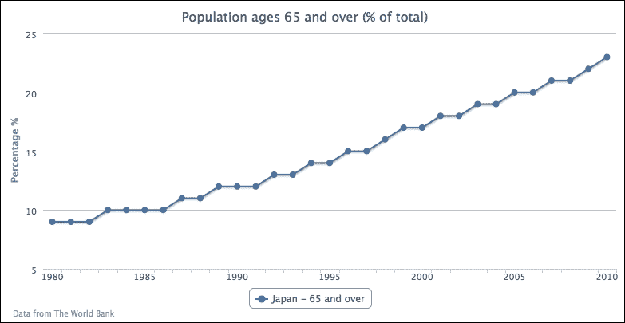

在类别中，我们不是手动指定年份数字作为字符串，而是可以在`series`配置中使用`pointStart`选项来启动第一个点的*x*轴值。因此，我们有空的`xAxis`配置和`series`配置，如下所示：

```js
            xAxis: {
            },
            series: [{
                pointStart: 1980,
                name: 'Japan - 65 and over',
                data: [  9, 9, 9, 10, 10, 10, 10 ... ]       
            }]
```

## 扩展到多系列折线图

我们可以包括更多的线系列，并通过将线宽增加到`6`像素宽来强调日本系列，如下所示：

```js
            series: [{
                lineWidth: 6,
                name: 'Japan',
                data: [  9, 9, 9, 10, 10, 10, 10 ... ]       
            }, {
                Name: 'Singapore',
                data: [ 5, 5, 5, 5, ... ]
            }, {
                   // Norway, Brazil, and South Africa series data...
                                ...
            }]
```

通过使那条线更粗，日本人口折线系列在图表中成为焦点，如下面的截图所示：

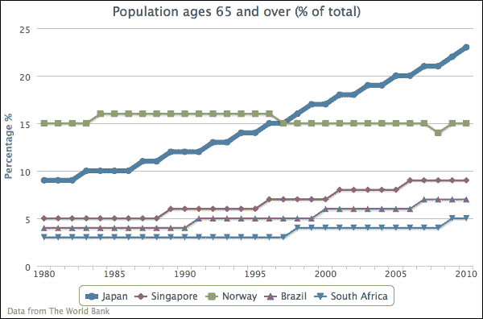

让我们继续到一个更复杂的折线图。为了演示倒置的折线图，我们使用`chart.inverted`选项将 y 轴和 x 轴翻转成相反的方向。然后，我们更改轴的线颜色以匹配上一章中的系列颜色。我们还禁用了所有系列的标记点，并最终将第二个系列与 y 轴数组上的第二个条目对齐，如下所示：

```js
            chart: {
                renderTo: 'container',
                inverted: true
            },
            yAxis: [{
                title: {
                    text: 'Percentage %'
                },
                lineWidth: 2,
                lineColor: '#4572A7'
            }, {
                title: {
                    text: 'Age'
                },
                opposite: true,
                lineWidth: 2,
                lineColor: '#AA4643'
            }],            
            plotOptions: {
                series: {
                    marker: {
                        enabled: false
                    }
                }
            },
            xAxis: {
               categories: [ '1980', '1981', '1982', ...,
                             '2009', '2010' ],
               labels: {
                   step: 5
               }
            },
            series: [{
                name: 'Japan - 65 and over',
                type: 'spline',
                data: [ 9, 9, 9, ... ] 
            }, {
                name: 'Japan - Life Expectancy',
                yAxis: 1,
                data: [ 76, 76, 77, ... ]
            }]
```

以下是一个带有双 y 轴的倒置图表：

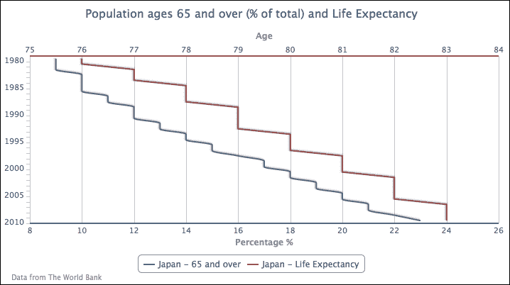

由于通常的时间标签被交换到*y*轴上，数据趋势难以理解，因此图表的数据表示可能看起来有些奇怪。`inverted`选项通常用于以非连续形式和条形格式显示数据。如果我们从图中解释数据，1990 年有 12%的人口年龄在 65 岁或以上，预期寿命为 79 岁。

将`plotOptions.series.marker.enabled`设置为`false`将关闭所有数据点标记。如果我们想显示特定系列的点标记，我们可以全局关闭标记然后为单个系列打开标记，或者反过来：

```js
            plotOptions: {
                series: {
                    marker: {
                        enabled: false
                    }
                }
            },
            series: [{
                marker: {
                    enabled: true
                },
                name: 'Japan - 65 and over',
                type: 'spline',
                data: [ 9, 9, 9, ... ] 
            }, {
```

以下图表显示，只有 65 岁以上的系列有数据点标记：

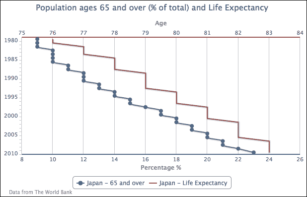

# 突出显示负值并提高基准水平

有时，我们可能希望用不同的颜色突出显示正负区域。在这种情况下，我们可以使用系列选项`negativeColor`指定负值的系列颜色。让我们创建一个包含正负数据的简单通货膨胀数据示例。以下是系列配置：

```js
    plotOptions: {
        line: {
            negativeColor: 'red'
        }
    },
    series: [{
        type: 'line',
        color: '#0D3377',
        marker: {
             enabled: false
        },
        pointStart: 2004, 
        data:[ 2.9, 2.8, 2.4, 3.3, 4.7, 
               2.3, 1.1, 1.0, -0.3, -2.1
        ]
    }]
```

我们将负通货膨胀值指定为红色，并在线条系列中禁用标记。线条系列的颜色由另一种颜色定义，即蓝色，用于正值。以下是以不同颜色显示系列的图表：

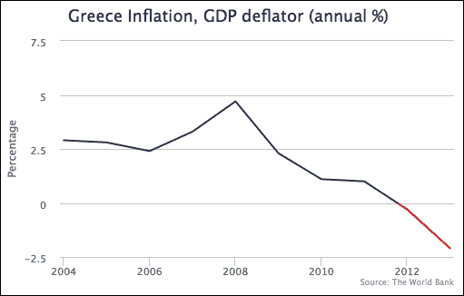

让我们创建另一个稍微复杂一点的例子，其中我们根据主题定义负值区域。我们绘制另一个通货膨胀图表，但基于**欧洲中央银行**（**ECB**）对健康通货膨胀 2%的定义。任何低于该水平的都被认为对经济不健康，因此我们将低于该阈值的颜色设置为红色。除了颜色阈值外，我们还在 y 轴上设置了一条折线，以指示截止水平。以下是我们设置图表的第一个尝试：

```js
         yAxis: {
             title: { text: null },
             min: 0, 
             max: 4,
             plotLines: [{
                 value: 2,
                 width: 3,
                 color: '#6FA031',
                 zIndex: 1,
                 label: {
                     text: 'ECB....',
                     ....
                 }
             }]
         },
         xAxis: { type: 'datetime' },
         plotOptions: {
             line: { lineWidth: 3 }
         },
         series: [{
             type: 'line',
             name: 'EU Inflation (harmonized), year-over-year (%)',
             color: '#0D3377',
             marker: { enabled: false },
             data:[ 
                 [ Date.UTC(2011, 8, 1), 3.3 ],
                 [ Date.UTC(2011, 9, 1), 3.3 ],
                 [ Date.UTC(2011, 10, 1), 3.3 ],
                 ....
```

我们在 y 轴上设置了值为 2 的绿色折线，宽度为 3 像素。`zIndex`选项是为了避免间隔线出现在折线上方。对于膨胀线系列，我们禁用了标记，并将线宽设置为 3 像素宽。以下是没有阈值处理的初始尝试：

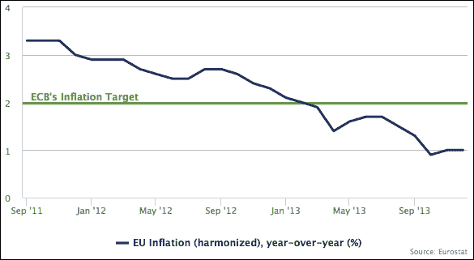

让我们将阈值水平应用于线条系列。y 轴上默认的负色值在 0 处。对于这个特定的例子，负色的基准水平是 2。为了将基准水平提高到 2，我们设置了`threshold`属性以及`negativeColor`选项：

```js
    plotOptions: {
        line: {
            lineWidth: 3,
            negativeColor: 'red',
            threshold: 2
        }
    },
```

前面的修改将部分线条系列变为红色，以表示警告：

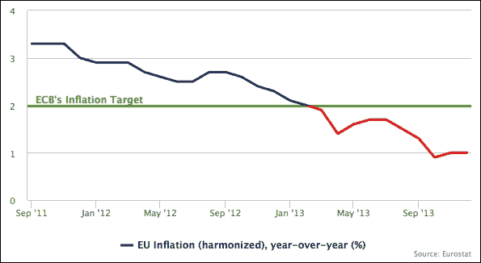

# 绘制面积图

在本节中，我们将使用我们的第一个示例并将其转变为一个更时尚的图表（基于 Kristin Clute 设计的风能海报）：面积样条图。**面积样条图**是通过面积图和样条图的组合属性生成的。主要数据线以样条曲线的形式绘制，线下方的区域以类似颜色填充，具有渐变和不透明样式：

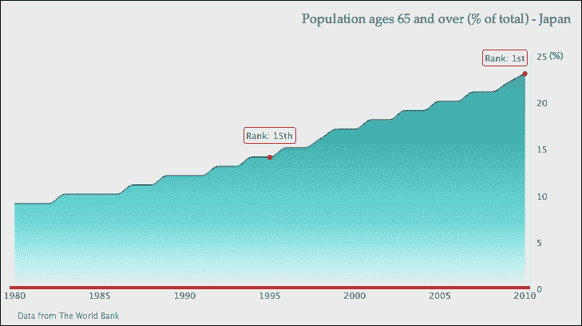

首先，我们希望使图表更容易让观众查找当前趋势的值，因此我们将 y 轴值移动到图表的右侧，这样它们将最接近最近的一年：

```js
            yAxis: {  ....
                opposite: true
            }
```

下一步是移除间隔线，并在 y 轴上有一条细轴线：

```js
          yAxis: { ....
              gridLineWidth: 0,
              lineWidth: 1,
          }
```

然后，我们使用百分比符号简化 y 轴标题，并将其对齐到轴的顶部：

```js
            yAxis: { ....
                title: {
                    text: '(%)',
                    rotation: 0,
                    x: 10,
                    y: 5,
                    align: 'high'
                },
            }
```

至于 x 轴，我们用红色加粗轴线，并移除间隔刻度：

```js
            xAxis: { ....
                lineColor: '#CC2929',
                lineWidth: 4,
                tickWidth: 0,
                offset: 2
            }
```

对于图表标题，我们将标题移动到图表的右侧，增加图表和标题之间的边距，并为标题采用不同的字体：

```js
            title: {
                text: 'Population ages 65 and over (% of total) - Japan ',
                margin: 40,
                align: 'right',
                style: {
                   fontFamily: 'palatino'
                }
            }
```

之后，我们将修改整个系列的展示，所以我们首先将`chart.type`属性从`'line'`更改为`'areaspline'`。请注意，在这个`series`对象内部设置属性将覆盖在`plotOptions.areaspline`等`plotOptions.series`中定义的相同属性。

由于到目前为止图中只有一个系列，因此没有必要显示图例框。我们可以使用`showInLegend`属性来禁用它。然后，我们使用渐变色智能地处理面积部分，并使用较深的颜色处理样条线：

```js
       series: [{
            showInLegend: false,
            lineColor: '#145252',
            fillColor: {
                linearGradient: { 
                    x1: 0, y1: 0, 
                    x2: 0, y2: 1 
                },
                stops:[ [ 0.0, '#248F8F' ] ,
                        [ 0.7, '#70DBDB' ],
                        [ 1.0, '#EBFAFA' ] ]
            },
            data: [ ... ]
       }] 
```

之后，我们在沿线引入了一些数据标签，以表明老龄人口排名随时间增加。我们使用对应于 1995 年和 2010 年的系列数据数组中的值，然后将数值条目转换为数据点对象。由于我们只想显示这两年的点标记，我们在`plotOptions.series.marker.enabled`中全局关闭标记，并在点对象内部单独设置标记，并伴随样式设置：

```js
                plotOptions: {
                    series: {
                        marker: {
                            enabled: false
                        }
                    }
                }, 
                series: [{ ...,
                    data:[ 9, 9, 9, ...,
                           { marker: {
                                 radius: 2, 
                                 lineColor: '#CC2929', 
                                 lineWidth: 2, 
                                 fillColor: '#CC2929',
                                 enabled: true 
                                },
                             y: 14
                           }, 15, 15, 16, ... ]
                }]
```

我们首先在数据标签周围设置了一个圆角边框（`borderRadius`），其边框颜色（`borderColor`）与 x 轴相同。然后，我们使用`x`和`y`选项对数据标签位置进行精细调整。最后，我们更改了数据标签格式器的默认实现。我们不再返回点值，而是打印国家排名：

```js
                series: [{ ...,
                    data:[ 9, 9, 9, ...,
                           { marker: {
                                ...
                             },
                             dataLabels: {
                                enabled: true,
                                borderRadius: 3,
                                borderColor: '#CC2929',
                                borderWidth: 1,
                                y: -23,
                                formatter: function() {
                                    return "Rank: 15th";
                                }
                             },
                             y: 14
                          }, 15, 15, 16, ... ]
                }]
```

最后的修饰是给图表添加灰色背景，并为`spacingBottom`添加额外空间。`spacingBottom`的额外空间是为了避免信用标签和 x 轴标签过于接近，因为我们已经禁用了图例框：

```js
            chart: {
                renderTo: 'container',
                spacingBottom: 30,
                backgroundColor: '#EAEAEA'             
            },
```

当所有这些配置组合在一起时，它会产生本节开头截图所示的图表。

# 混合线形和面积系列

在本节中，我们将探索不同的图表，包括线形和面积系列，如下所示：

+   创建一个投影图，其中一条趋势线与两种不同线型的系列连接

+   绘制一个带有另一个步进线系列的区域样条图

+   探索一个堆叠的面积样条图，其中两个面积样条系列堆叠在一起

## 模拟一个投影图

投影图具有与实际数据部分相对应的样条面积，并使用投影数据以虚线形式继续。为此，我们将数据分为两个系列，一个用于实际数据，另一个用于投影数据。以下是从 2015 年到 2024 年的数据系列配置代码。这些数据基于国家人口和社会安全研究所的报告（[`www.ipss.go.jp/pp-newest/e/ppfj02/ppfj02.pdf`](http://www.ipss.go.jp/pp-newest/e/ppfj02/ppfj02.pdf)）：

```js
            series: [{
                name: 'project data',
                type: 'spline',
                showInLegend: false, 
                lineColor: '#145252',                
                dashStyle: 'Dash',
                data: [ [ 2015, 26 ], [ 2016, 26.5 ],
                          ... [ 2024, 28.5 ] ]
            }]
```

未来系列配置为虚线样式的样条线，图例框被禁用，因为我们想显示两个系列作为同一系列的一部分。然后我们将未来（第二个）系列的颜色设置为与第一个系列相同。最后部分是构建系列数据。由于我们使用`pointStart`属性指定了 x 轴时间数据，我们需要在 2014 年之后对齐投影数据。我们可以使用两种方法来指定时间数据，如下所示：

+   在第二个系列数据数组中插入空值，以与实际数据系列对齐

+   在`tuples`中指定第二个系列数据，这是一个包含时间和投影数据的数组

我们将使用第二种方法，因为系列表示更简单。以下仅为未来数据系列的截图：

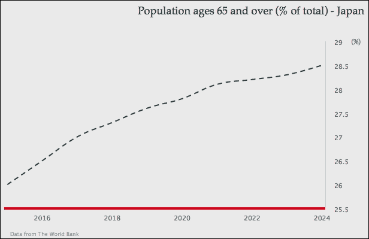

实际数据系列与*绘制面积图*部分开头截图中的图表完全相同，只是没有点标记和数据标签装饰。下一步是将两个系列合并，如下所示：

```js
            series: [{
                name: 'real data',
                type: 'areaspline',
                .... 
            }, {
                name: 'project data',
                type: 'spline',
                ....
            }]
```

由于两个系列数据之间没有重叠，它们产生了一个平滑的投影图：

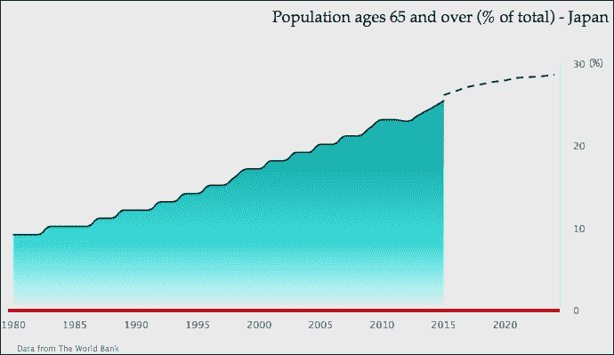

## 对比样条线和步骤线

在本节中，我们将以步骤形式绘制一个面积样条图系列和另一个线条系列。步骤线根据系列数据的变化在垂直和水平方向上穿越。它通常用于表示离散数据：没有连续/渐进运动的数据。

为了显示步骤线，我们将从第一个面积样条图示例继续。首先，我们需要通过移除禁用的`showInLegend`设置来启用图例，并在系列数据中移除`dataLabels`。

接下来是在图表中包含一个新的系列——**0 至 14 岁**——并使用默认的线条类型。然后，我们将线条样式稍作调整，变为不同的步骤。以下是为两个系列配置的以下内容：

```js
            series: [{
                name: 'Ages 65 and over',
                type: 'areaspline',
                lineColor: '#145252',
                pointStart: 1980,
                fillColor: {
                    ....
                },
                data: [ 9, 9, 9, 10, ...., 23 ]
            }, {
              name: 'Ages 0 to 14',
              // default type is line series
              step: true,
              pointStart: 1980,
              data: [ 24, 23, 23, 23, 22, 22, 21,
                      20, 20, 19, 18, 18, 17, 17, 16, 16, 16,
                      15, 15, 15, 15, 14, 14, 14, 14, 14, 14,
                      14, 14, 13, 13 ]
            }]
```

以下截图显示了线条步骤样式中的第二个系列：

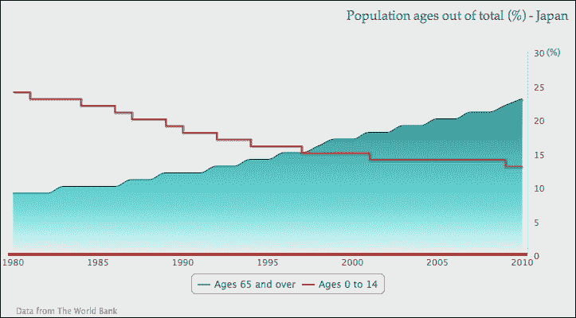

## 扩展到堆叠面积图

在本节中，我们将把两个序列都转换为面积样条图，并将它们堆叠在一起以创建堆叠面积图。由于数据序列堆叠在一起，我们可以观察到各个序列的数量作为单独的、成比例的和总数量。

让我们将第二个序列更改为另一种 `'areaspline'` 类型：

```js
              name: 'Ages 0 to 14',
              type: 'areaspline',
              pointStart: 1980,
              data: [ 24, 23, 23, ... ]
```

将 `stacking` 选项设置为 `areaspline` 的默认设置 `'normal'`，如下所示：

```js
           plotOptions: {
                areaspline: {
                  stacking: 'normal'
                }
           }
```

这样就设置了两个堆叠在彼此之上的面积图。通过这样做，我们可以从数据中观察到，两个年龄组大致相互补偿，总共约占总体人口的 33%，而 **65 岁及以上** 的群体在后期阶段逐渐落后：

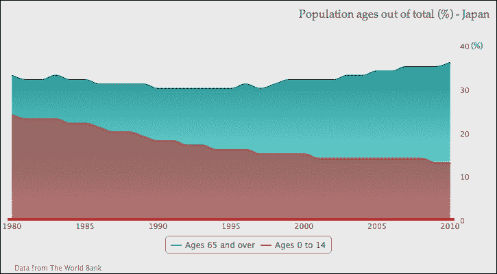

假设我们有三个面积样条序列，我们只想堆叠其中的两个（尽管在柱状图中这样做更清晰，而不是在面积样条图中）。如第二章中 *探索 PlotOptions* 部分所述，*Highcharts 配置*，我们可以在 `plotOptions.series` 中设置 `stacking` 选项为 `'normal'`，并在第三个序列配置中手动关闭 `stacking`。以下是与另一个序列的序列配置：

```js
            plotOptions: {
                series: {
                  marker: {
                     enabled: false
                  },
                  stacking: 'normal'
                }
            },
            series: [{
                name: 'Ages 65 and over',
                ....
            }, {
                name: 'Ages 0 to 14',
                ....
            }, {
                name: 'Ages 15 to 64',
                type: 'areaspline',
                pointStart: 1980,
                stacking: null,
                data: [ 67, 67, 68, 68, .... ]
            }]
```

这创建了一个包含第三个序列 **15 至 64 岁** 覆盖其他两个堆叠序列的面积样条图，如下面的截图所示：

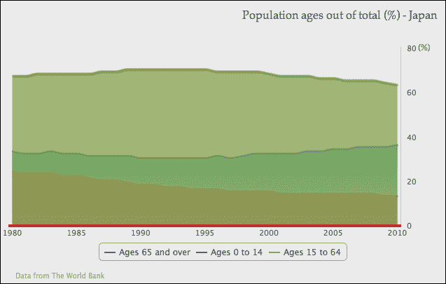

## 绘制具有缺失数据的图表

如果一个序列有缺失数据，那么 Highcharts 的默认行为是将序列显示为折线图。有一个选项——`connectNulls`——允许即使在存在缺失数据的情况下，序列线也可以继续。此选项的默认值是 `false`。让我们通过设置两个具有空数据点的样条序列来检查默认行为。我们还启用了数据点标记，以便我们可以清楚地查看缺失的数据点：

```js
            series: [{
                name: 'Ages 65 and over',
                connectNulls: true,
                ....,
                // Missing data from 2004 - 2009
                data: [ 9, 9, 9, ..., null, null, null, 22, 23 ]

            }, {
                name: 'Ages 0 to 14',
                ....,
                // Missing data from 1989 - 1994
                data: [ 24, 23, 23, ..., 19, null, null, ..., 13 ]
            }]
```

以下是一个具有不同样式的样条序列表示缺失点的图表：

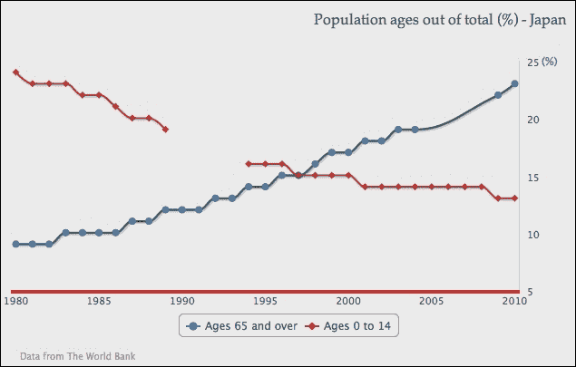

如我们所见，**0 至 14 岁** 的序列有一个明显的断裂线，而 **65 岁及以上** 是通过将 `connectNulls` 设置为 `true` 来配置的，这使用样条曲线连接了缺失的点。如果未启用数据点标记，我们就无法注意到差异。

然而，我们应该谨慎使用此选项，并且绝对不应该与 `stacking` 选项一起启用。假设我们有一个包含两个序列的堆叠面积图，并且只有 **0 至 14 岁** 的序列中存在缺失数据，这是底部序列。对于缺失数据的默认行为将使图表看起来如下截图所示：

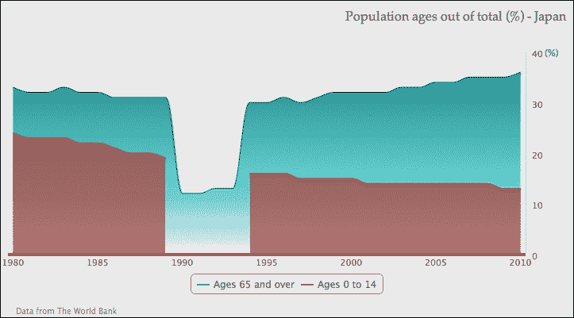

虽然底部系列确实显示了断裂部分，但堆叠图总体上仍然正确。顶部系列的相同区域回到单系列值，总体百分比仍然保持不变。

当我们将`connectNulls`选项设置为`true`时，问题出现了，我们没有意识到系列中存在缺失数据。这导致图表不一致，如下所示：

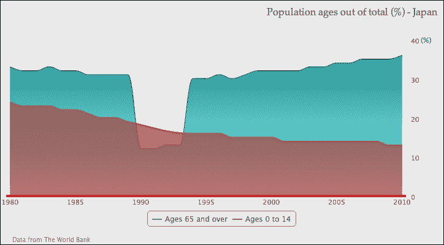

底部系列覆盖了顶部系列留下的孔，这与堆叠图的总体百分比相矛盾。

# 结合散点图和面积图

Highcharts 还支持散点图，使我们能够从大量数据样本中绘制数据趋势。在这里，我们将以不同的方式使用散点系列，这使得我们的图表有点像海报图表。

首先，我们将使用`'Ages 0 to 14'`数据的一个子集，并将系列设置为`scatter`类型：

```js
              name: 'Ages 0 to 14',
              type: 'scatter',
              data: [ [ 1982, 23 ], [ 1989, 19 ], 
                      [ 2007, 14 ], [ 2004, 14 ], 
                      [ 1997, 15 ], [ 2002, 14 ], 
                      [ 2009, 13 ], [ 2010, 13 ] ]
```

然后，我们将为`scatter`系列启用数据标签，并确保`marker`形状始终为`'circle'`，如下所示：

```js
          plotOptions: {
              scatter: {
                  marker: {
                      symbol: 'circle'
                  },
                  dataLabels: {
                      enabled: true
                  }
              }
          }
```

上述代码片段给出了以下图表：

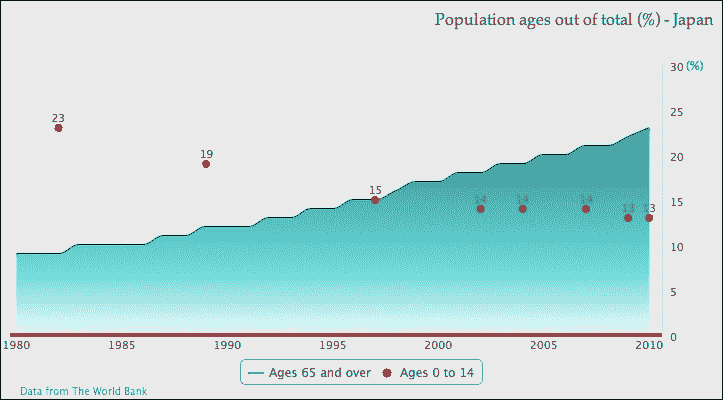

### 提示

Highcharts 提供了一系列的标记符号，并允许用户提供自己的标记图标（见第二章，*Highcharts 配置*）。支持的符号列表包括：圆形、正方形、菱形、三角形和向下三角形。

## 以艺术风格润色图表

下一步是将每个散点点格式化为具有`radius`属性的气泡样式，并手动设置数据标签字体大小与百分比值成比例。

### 注意

我们使用散点系列而不是气泡系列的原因是，本章的大部分内容是为第一版编写的；此图表是用早期版本的 Highcharts 创建的，该版本不支持气泡系列。

然后，使用`verticalAlign`属性调整标签，使其位于放大后的散点点中心。散点点的各种大小要求我们以不同的属性呈现每个数据点。因此，我们需要将系列数据定义更改为点对象配置数组，例如：

```js
            plotOptions: {
              scatter: {
                  marker: {
                      symbol: 'circle'
                  },
                  dataLabels: {
                      enabled: true,
                      verticalAlign: 'middle'
                  }
              }
            },
            data:  { 
                dataLabels: {
                    style: { 
                        fontSize: '25px' 
                    } 
                }, 
                marker: { radius: 31 }, 
                y: 23, 
                x: 1982 
                }, { 
                dataLabels: {
                    style: { 
                        fontSize: '22px' 
                    } 
                }, 
                marker: { radius: 23 }, 
                y: 19, 
                x: 1989 
            }, .....
```

以下截图显示了一个数据点序列的图表，从大标记大小和字体开始，然后根据它们的百分比值逐渐变小：

![以艺术风格润色图表

现在，前一个图表有两个问题。首先，散点系列颜色（默认的第二系列颜色）与标记内的灰色文本标签冲突，使得它们难以阅读。

为了解决这个问题，我们将散点系列的颜色改为较浅的颜色，并使用渐变设置：

```js
        color: {
            linearGradient: { x1: 0, y1: 0, x2: 0, y2: 1 },
            stops: [ [ 0, '#FF944D' ],
                     [ 1, '#FFC299' ] ]
        },
```

然后，在`plotOptions`中给散点点一个更深的轮廓，如下所示：

```js
             plotOptions: {
                 scatter: {
                      marker: {
                           symbol: 'circle',
                           lineColor: '#E65C00',
                           lineWidth: 1
                      },
```

其次，数据点被轴的范围结束所阻挡。可以通过在两个轴中引入额外的填充空间来解决这个问题：

```js
                  yAxis: {
                       .....,
                       maxPadding: 0.09
                  }, 
                  xAxis: {
                       .....,
                       maxPadding: 0.02
                  }
```

下面的图形是新的外观：

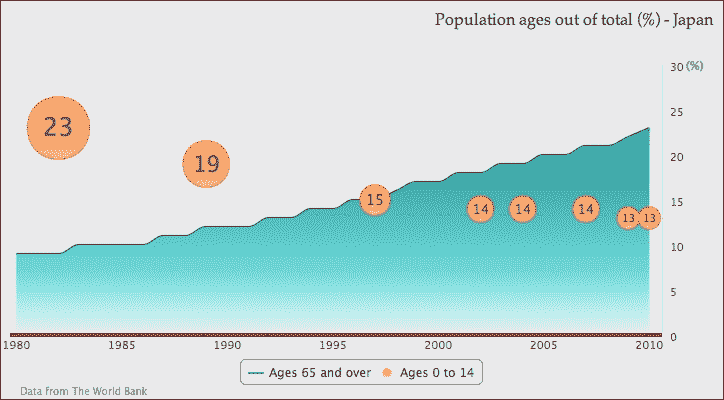

对于下一部分，我们将放置一个标志和一些装饰性文本。将图像导入图表有两种方式——`plotBackgroundImage` 选项或 `renderer.image` API 调用。`plotBackgroundImage` 选项将整个图像带入图表背景，这不是我们想要做的。`renderer.image` 方法提供了更多关于图像位置和大小的控制。以下是图表创建后的调用：

```js
      var chart = new Highcharts.Chart({
                      ...
                  });
      chart.renderer.image('logo.png', 240, 10, 187, 92).add();
```

`logo.png` 是标志图像文件的 URL 路径。接下来的两个参数是图表中图像显示的 x 和 y 位置（从 0 开始，其中 0 是左上角）。最后的两个参数是图像文件的宽度和高度。`image` 调用基本上返回一个 `element` 对象，随后 `.add` 调用将返回的图像对象放入渲染器中。

至于装饰性文本，它是一个带有白色粗体文本的不同大小的红色圆圈。它们都是通过渲染器创建的。在下面的代码片段中，第一个渲染器调用是用来创建一个带有 x 和 y 位置的红色圆圈和半径大小的圆圈。然后使用 `attr` 方法立即设置 SVG 属性，该方法配置了透明度和轮廓的较暗颜色。接下来的三个渲染器调用是用来在红色圆圈内创建文本，并使用 `css` 方法设置字体大小、样式和颜色。我们将在第十章 Highcharts API 中重新访问 `chart.renderer`：

```js
        // Red circle at the back
        chart.renderer.circle(220, 65, 45).attr({
             fill: '#FF7575',
            'fill-opacity': 0.6,
             stroke: '#B24747',
            'stroke-width': 1
        }).add();
        // Large percentage text with special font
        chart.renderer.text('37.5%', 182, 63).css({
             fontWeight: 'bold',
             color: '#FFFFFF',
             fontSize: '30px',
             fontFamily: 'palatino'
        }).add();
        // Align subject in the circle
        chart.renderer.text('65 and over', 184, 82).css({
            'fontWeight': 'bold',
        }).add();
        chart.renderer.text('by 2050', 193, 96).css({
            'fontWeight': 'bold',
        }).add();
```

最后，我们将图例框移动到图表的顶部。为了将图例定位在绘图区域内，我们需要将 `floating` 属性设置为 `true`，这将强制图例进入固定布局模式。然后，我们移除默认的边框线并将图例项列表设置为垂直方向：

```js
            legend: {
                floating: true,
                verticalAlign: 'top',
                align: 'center',
                x: 130,
                y: 40,
                borderWidth: 0,
                layout: 'vertical'
            },
```

下面的图形是我们带有装饰的最终图形：

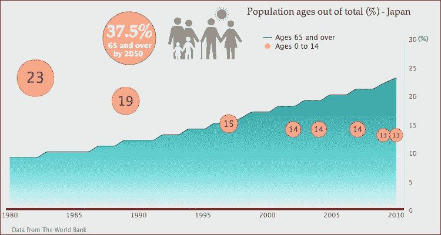

# 摘要

在本章中，我们探讨了线形图、面积图和散点图的用法。我们看到了 Highcharts 可以提供多少灵活性来制作类似海报的图表。

在下一章中，我们将学习如何使用它们的绘图选项绘制柱状图和条形图。
