# 第四章：条形图和柱状图

在本章中，我们将从学习柱状图及其绘图选项开始。然后，我们将应用更高级的选项来堆叠和组合柱状图。之后，我们将通过相同的示例来学习条形图。然后，我们将学习如何润色条形图，并应用技巧将条形图转换为镜像和仪表图表。最后，我们将多个图表的网页组合在一起作为总结练习。在本章中，我们将涵盖以下内容：

+   介绍柱状图

+   堆叠和组合柱状图

+   调整柱状图颜色和数据标签

+   介绍条形图

+   构建镜像图表

+   将单个条形图转换为水平仪表图

+   将图表粘合在一起

    ### 注意

    本章的大部分内容与第一版相同。所有示例都已使用最新版本的 Highcharts 运行。除了不同的配色方案外，生成的图表看起来与本章中展示的截图相同。

# 介绍柱状图

柱状图和条形图之间的区别微不足道。柱状图中的数据是垂直排列的，而条形图中的数据是水平排列的。柱状图和条形图通常用于在 x 轴上具有类别的数据绘图。在本节中，我们将演示如何绘制柱状图。我们将使用的数据来自美国专利和商标局。

在以下代码片段之后的图形显示了过去 10 年中英国授予的专利数量柱状图。以下是该图表配置代码：

```js
            chart: {
                renderTo: 'container',
                type: 'column',
                borderWidth: 1
            },
            title: {
                text: 'Number of Patents Granted',
            },
            credits: { 
                position: {
                   align: 'left',
                   x: 20
                },
                href: 'http://www.uspto.gov',
                text: 'Source: U.S. Patent & Trademark Office'
            },
            xAxis: {
                categories: [ 
                    '2001', '2002', '2003', '2004', '2005', 
                    '2006', '2007', '2008', '2009', '2010',
                    '2011' ]
            },
            yAxis: {
                title: {
                    text: 'No. of Patents'
                }
            },
            series: [{
                name: 'UK',
                data: [ 4351, 4190, 4028, 3895, 3553, 
                        4323, 4029, 3834, 4009, 5038, 4924 ]
            }]
```

下面的结果是前面代码片段得到的结果：

### 注意

这份数据可以在专利技术监测团队发布的在线报告 *所有专利，所有类型报告* 中找到，报告链接为[`www.uspto.gov/web/offices/ac/ido/oeip/taf/apat.htm`](http://www.uspto.gov/web/offices/ac/ido/oeip/taf/apat.htm)。

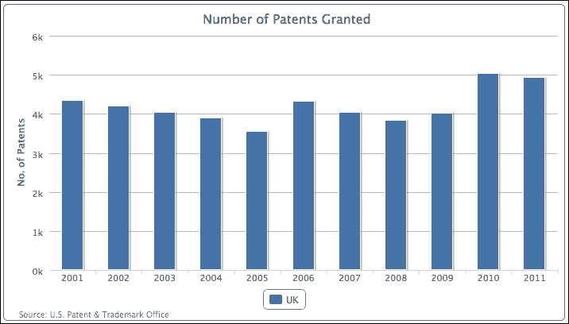

让我们再添加一个系列，法国：

```js
            series: [{
                name: 'UK',
                data: [ 4351, 4190, 4028, .... ]
            }, {
                name: 'France',
                data: [ 4456, 4421, 4126, 3686, 3106, 
                        3856, 3720, 3813, 3805, 5100, 5022 ]
            }]
```

下面的图表显示了两个系列并排对齐：

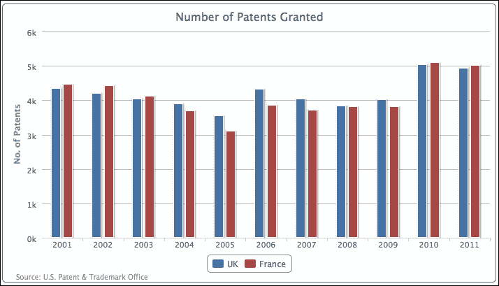

## 重叠柱状图

展示多序列柱状图的另一种方式是重叠柱状图。这种展示方式的主要原因是为了避免图表中类别过多时柱状图变得过于细长和拥挤。结果，观察值和比较它们变得困难。重叠柱状图在各个类别之间提供了更多的空间，因此每个柱状图仍然可以保持其宽度。

我们可以使用填充选项使两个序列部分重叠，如下所示：

```js
            plotOptions: {
                series: {
                    pointPadding: -0.2,
                    groupPadding: 0.3
                }
            },
```

列（以及条形）之间的默认填充设置是 0.2，这是每个类别宽度的分数值。在这个例子中，我们将`pointPadding`设置为负值，这意味着，而不是在相邻列之间有填充距离，我们将列放在一起以重叠。`groupPadding`是组值相对于每个类别宽度的距离，因此 2005 年和 2006 年英国和法国列之间的距离。在这个例子中，我们将它设置为 0.3 以确保列不会自动变宽，因为重叠会在每个组之间产生更多空间。以下是对重叠列的截图：

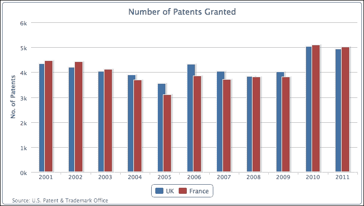

## 堆叠和分组柱状图

与将列并排对齐不同，我们可以将列堆叠在一起。虽然这会使观察每个列的值稍微困难一些，但我们可以立即观察到每个类别的总值以及系列之间的比率变化。当有多个系列时，堆叠列的另一个强大功能是选择性地对它们进行分组。这可以在多个堆叠系列组之间产生一种比例感。

让我们从英国、德国、日本和韩国开始一个新的柱状图。

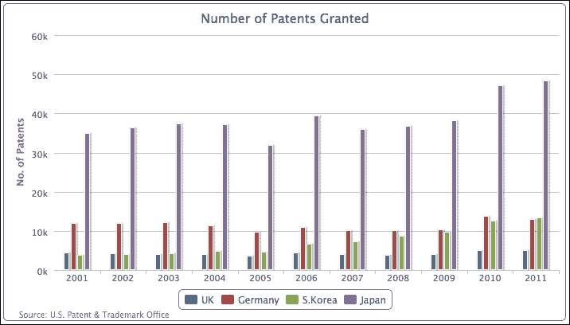

与其他国家相比，日本获得的专利数量超出了常规。让我们使用以下系列配置将多个系列分组和堆叠到欧洲和亚洲：

```js
         plotOptions: {
                column: {
                    stacking: 'normal'
                }
          },
         series: [{
                name: 'UK',
                data: [ 4351, 4190, 4028, .... ],
                stack: 'Europe'
            }, {
                name: 'Germany',
                data: [ 11894, 11957, 12140, ... ],
                stack: 'Europe'
            }, {
                name: 'S.Korea',
                data: [ 3763, 4009, 4132, ... ],
                stack: 'Asia'
            }, {
                name: 'Japan',
                data: [ 34890, 36339, 37248, ... ],
                stack: 'Asia'
            }]
```

我们在`plotOptions`中声明列`stacking`为`'normal'`，然后为每个柱形系列分配一个堆叠组名，`'Europe'`和`'Asia'`，这产生了以下图表：

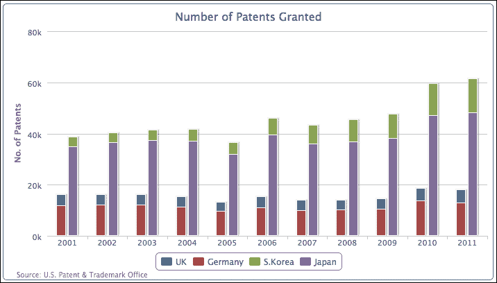

如我们所见，图表将四个垂直条形减少到两个，每个柱形包含两个系列。第一个垂直条形是`'Europe'`组，第二个是`'Asia'`。

### 混合堆叠和单列

在前面的章节中，我们承认了分组和堆叠多个系列的好处。也有时候，多个系列可以属于一个组，但也有一些单独的系列属于它们自己的组。Highcharts 提供了混合堆叠和分组系列与单系列灵活性的功能。

让我们看看混合堆叠柱形和单列的例子。首先，我们移除每个系列的堆叠组分配，因为所有柱形系列的默认行为是保持堆叠在一起。然后，我们引入一个新的柱形系列，美国，并在系列配置中手动声明`stacking`选项为`null`以覆盖默认的`plotOptions`设置：

```js
          plotOptions: {
                column: {
                    stacking: 'normal'
                }
          },
          series: [{
                name: 'UK',
                data: [ 4351, 4190, 4028, .... ]
            }, {
                name: 'Germany',
                data: [ 11894, 11957, 12140, ... ]
            }, {
                name: 'S.Korea',
                data: [ 3763, 4009, 4132, ... ]
            }, {
                name: 'Japan',
                data: [ 34890, 36339, 37248, ... ]
            }, {
                name: 'US',
                data: [ 98655, 97125, 98590, ... ],
                stacking: null
            }
          }]
```

新的系列数组产生了以下图表：

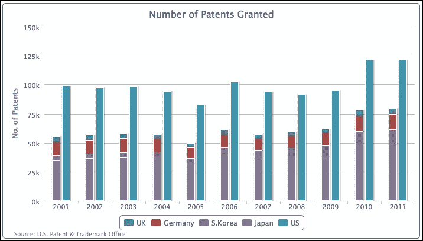

前四个系列，**英国**、**德国**、**韩国**和**日本**，被堆叠在一起作为一个单独的列，而**美国**则作为一个单独的列显示。通过将系列堆叠在一起，我们可以很容易地观察到其他四个国家的专利总数加起来还不到美国专利总数的三分之二（美国的专利数量几乎是英国的四倍）。

### 比较堆叠百分比中的列

或者，我们可以通过将值归一化为百分比并将它们堆叠在一起来查看每个国家在列中的比较情况。这可以通过移除美国系列中的手动`堆叠`设置并将全局列`堆叠`设置为`'percent'`来实现：

```js
            plotOptions: {
                column: {
                    stacking: 'percent'
                }
            }
```

所有系列都被放入一个单独的列中，并且它们的值被归一化为百分比，如下面的截图所示：

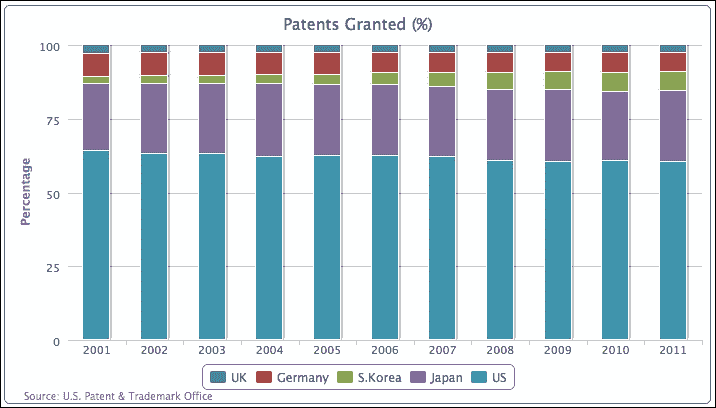

## 调整列颜色和数据标签

让我们再做一个图表；这次我们将绘制获得专利的前十位国家。以下生成图表的代码：

```js
            chart: {
                renderTo: 'container',
                type: 'column',
                borderWidth: 1
            },
            title: {
                text: 'Number of Patents Granted in 2011'
            },
            credits: { ... },
            xAxis: {
                categories: [ 
                    'United States', 'Japan', 
                    'South Korea', 'Germany', 'Taiwan', 
                    'Canada', 'France', 'United Kingdom',
                    'China', 'Italy' ]
            },
            yAxis: {
                title: {
                    text: 'No. of Patents'
                }
            },
            series: [{
                showInLegend: false,
                data: [ 121261, 48256, 13239, 12968, 9907,
                        5754, 5022, 4924, 3786, 2333 ]
            }]
```

以下代码片段生成了以下图表：

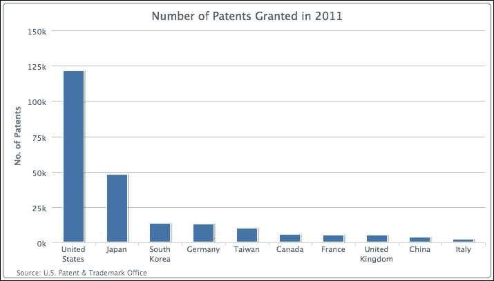

在前面的图表中，我们希望更改几个区域。首先，国家名称中存在换行。为了避免这种情况，我们可以将 x 轴标签旋转，如下所示：

```js
            xAxis: {
                categories: [ 
                    'United States', 'Japan', 
                    'South Korea',  ... ],
                labels: {
                    rotation: -45,
                    align: 'right'
                }
            },
```

其次，与来自其他国家的值相比，`'美国'`的大值已经超出了刻度，因此我们无法轻易识别它们的值。为了解决这个问题，我们可以在 y 轴上应用对数刻度，如下所示：

```js
            yAxis: {
                title: ... ,
                type: 'logarithmic'
            },
```

最后，我们希望沿着列打印值标签，并为每一列用不同的颜色装饰图表，如下所示：

```js
     plotOptions: {
         column: {
             colorByPoint: true,
             dataLabels: {
                 enabled: true,
                 rotation: -90,
                 y: 25,
                 color: '#F4F4F4',                       
                     formatter: function() {
                         return
                          Highcharts.numberFormat(this.y, 0);
                     },
                     x: 10,
                     style: {
                         fontWeight: 'bold'
                     }
                 }
             }
         },
```

下面的图表显示了所有的改进：

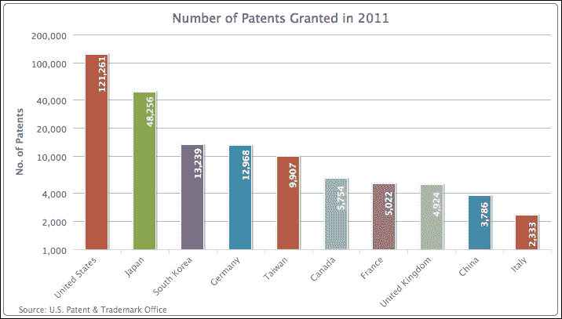

# 介绍条形图

在 Highcharts 中，有两种指定条形图的方法——将系列`type`设置为`'bar'`或将`chart.inverted`选项设置为`true`与列系列（从条形切换到列也是如此）。在柱状图和条形图之间切换只是简单地交换 y 轴和 x 轴之间的显示方向；所有的标签旋转仍然保持不变。此外，实际的配置仍然保留在 x 轴和 y 轴上。为了演示这一点，我们将使用之前的示例，并将`inverted`选项设置为`true`，如下所示：

```js
            chart: {
                .... ,
                type: 'column',
                inverted: true
            },
```

以下代码片段生成了一个条形图，如下所示：

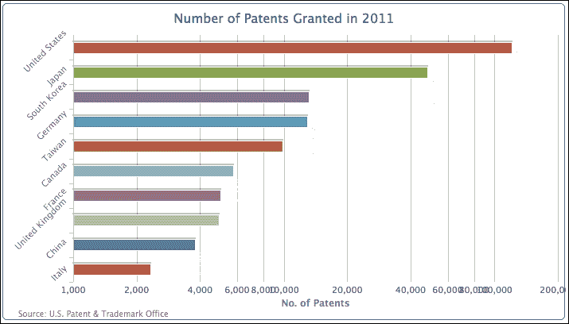

国家名称的旋转和对数轴标签的旋转仍然保持不变。事实上，现在值标签混乱在一起，类别名称与条形没有正确对齐。下一步是将标签方向重置以恢复图表的可读性。我们将简单地交换 y 轴的标签设置到 x 轴：

```js
            xAxis: {
                categories: [ 'United States', 
                              'Japan', 'South Korea', ... ]
            },
            yAxis: {
                 .... , 
                labels: {
                    rotation: -45,
                    align: 'right'
                }
            },
```

然后，我们将通过移除旋转选项并重新调整 x 和 y 位置以对齐柱状图内部来重置默认的列`dataLabel`设置：

```js
            plotOptions: {
                column: {
                    ..... , 
                    dataLabels: {
                        enabled: true,
                        color: '#F4F4F4',
                        x: -50,
                        y: 0,
                        formatter: ....,
                        style: ...
                    }
                }
```

以下是一个具有固定数据标签的图表：

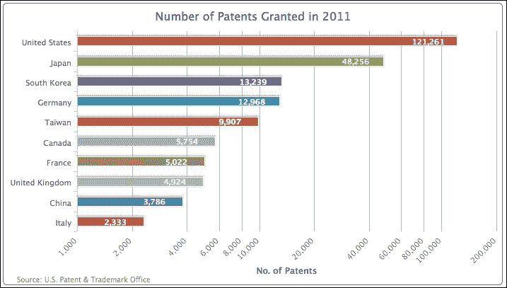

## 给柱状图一个更简单的样子

在这里，我们将轴简化到最基本、最裸露的展示。我们移除整个 y 轴，并调整柱状图上方的类别名称。为了移除 y 轴，我们将使用以下代码片段：

```js
            yAxis: {
                title: {
                    text: null
                },
                labels: {
                    enabled: false
                },
                gridLineWidth: 0,
                type: 'logarithmic'
            },
```

然后，我们将国家标签移动到柱状图上方。这伴随着移除轴线线和间隔刻度线，然后更改标签对齐及其 x 和 y 位置，如下所示：

```js
            xAxis: {
                categories: [ 'United States', 'Japan', 
                              'South Korea', ... ],
                lineWidth: 0,
                tickLength: 0,
                labels: {
                    align: 'left',
                    x: 0,
                    y: -13,
                    style: {
                        fontWeight: 'bold'
                    }
                }
            },
```

由于我们将标签对齐改为在柱状图上方，柱状图的水平位置（绘图区域）已移至图表的左侧，以取代旧标签的位置。因此，我们需要增加左侧的间距，以避免图表看起来过于拥挤。最后，我们在绘图区域添加一个背景图像，`chartBg.png`，以填充空余空间，如下所示：

```js
            chart: {
                renderTo: 'container',
                type: 'column',
                spacingLeft: 20,
                plotBackgroundImage: 'chartBg.png',
                inverted: true
            },
            title: {
                text:  null 
            },
```

以下截图显示了我们的柱状图的新简单外观：

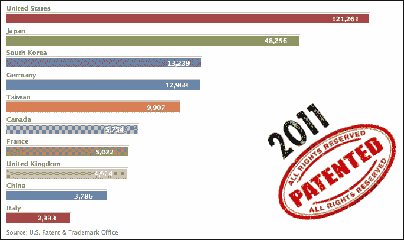

# 构建镜像图

使用镜像图是另一种比较两个柱状系列的方法。而不是将两个系列对齐为相邻的列，镜像图将它们对齐为相对的柱状。有时，这被用作展示两个系列之间趋势的首选方式。

在 Highcharts 中，我们可以利用堆积柱状图并将其稍作修改以形成一个镜像图，用于比较两组数据水平并排。为此，让我们从新的数据系列**专利授予**开始，该系列显示了过去十年英国和中国在专利授予数量上的比较。

我们配置图表的方式实际上是一个堆积柱状图，其中一组数据为正值，另一组数据则手动转换为负值，使得零值轴位于图表中间。然后，我们将柱状图反转成柱状图，并将负值范围标记为正值。为了演示这个概念，让我们首先创建一个堆积柱状图，其中包含正数和自制的负数范围，如下所示：

```js
            chart: {
                renderTo: 'container',
                type: 'column',
                borderWidth: 1	
            },
            title: {
                text: 'Number of Patents Granted'
            },
            credits: { ... },
            xAxis: {
                categories: [ '2001', '2002', '2003', ... ]
            },
            yAxis: {
                title: {
                    text: 'No. of Patents'
                }
            },
            plotOptions: {
                series: {
                  stacking: 'normal'
                }
            },
            series: [{
                name: 'UK',
                data: [ 4351, 4190, 4028, ... ]
                }, {
                name: 'China',
                data: [ -265, -391, -424, ... ]
            }]
```

以下截图显示了 y 轴中间的零值的堆积柱状图：

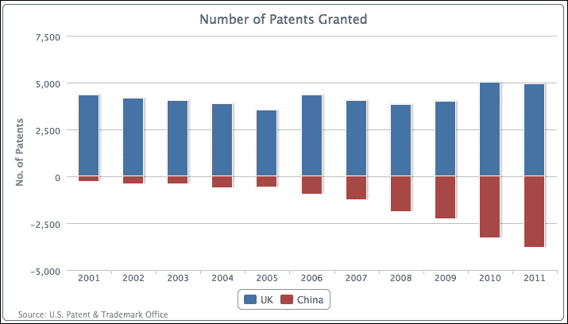

然后，我们将配置更改为一个柱状图，每个侧面都显示两个 x 轴，范围相同。最后一步是定义 y 轴标签的`formatter`函数，将负标签转换为正标签，如下所示：

```js
         chart: {
             .... ,
             type: 'bar'
         },
         xAxis: [{
             categories: [ '2001', '2002', '2003', ... ]
         }, {
             categories: [ '2001', '2002', '2003', ... ],
             opposite: true,
             linkedTo: 0
         }],
         yAxis: {
             .... ,
             labels: {
                 formatter: function() {
                    return
                Highcharts.numberFormat(Math.abs(this.value), 0);
                 }
             }
         },
```

以下是比较过去十年英国和中国授予的专利数量的最终柱状图：

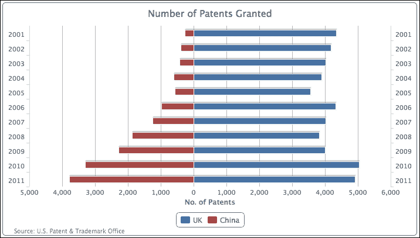

## 扩展到堆积镜像图

我们还可以将列示例中的相同原则应用于堆叠和分组系列图表。我们不是将两组堆叠的柱状图并排放置，而是可以将所有系列堆叠在一起，用零值来分隔两组。以下截图演示了在柱状图中比较欧洲和亚洲堆叠组的情况：

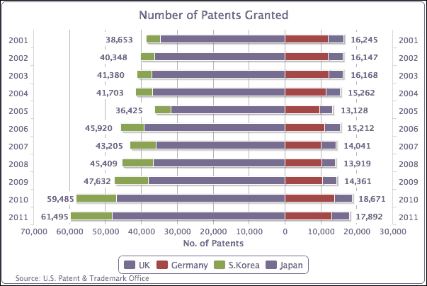

韩国和日本的系列数据堆叠在左侧（负侧），而英国和德国的数据则分组在右侧（正侧）。在生成前面的图表时，唯一棘手的部分是如何输出数据标签框。

首先，韩国和日本的系列数据被手动设置为负值。其次，由于韩国和英国都是各自组的外部系列，我们为这些系列启用了数据标签。以下代码片段显示了系列数组的配置：

```js
            series: [{
                name: 'UK',
                data: [ 4351, 4190, 4028, ... ],
                dataLabels : {
                    enabled: true,
                    backgroundColor: '#FFFFFF',
                    x: 40,
                    formatter: function() {
                        return 
          Highcharts.numberFormat(Math.abs(this.total), 0);
                    },
                    style: {
                        fontWeight: 'bold'
                    }
                }
            }, {
                name: 'Germany',
                data: [ 11894, 11957, 12140, ... ]
            }, {
                name: 'S.Korea',
                data: [ -3763, -4009, -4132, ... ],
                dataLabels : {
                    enabled: true,
                    x: -48,
                    backgroundColor: '#FFFFFF',
                    formatter: function() {
                        return 
          Highcharts.numberFormat(Math.abs(this.total), 0);
                    },
                    style: {
                        fontWeight: 'bold'
                    }
                }
            }, {
                name: 'Japan',
                data: [ -34890, -36339, -37248, ... ]
            }]
```

注意，`formatter` 函数的定义使用的是 `this.total` 而不是 `this.y`，因为我们使用外部系列的位置来打印组的总价值。数据标签的白色背景设置是为了避免与 y 轴间隔线发生冲突。

# 将单个柱状图转换为水平仪表图

仪表图通常用作当前阈值水平的指示器，意味着 y 轴的极端值是固定的。另一个特点是 x 轴上的单值（一维）是当前时间。

接下来，我们将学习如何将单柱图表转换为仪表级图表。基本思路是将绘图区域缩小到与柱状图相同的大小。这意味着我们必须固定绘图区域和柱状图的大小，不考虑容器尺寸。为此，我们将`chart.width`和`chart.height`设置为某些值。然后，我们用边框和背景色装饰绘图区域，使其类似于仪表的容器：

```js
            chart: {
                renderTo: 'container',
                type: 'bar',
                plotBorderWidth: 2,
                plotBackgroundColor: '#D6D6EB',
                plotBorderColor: '#D8D8D8',
                plotShadow: true,
                spacingBottom: 43,
                width: 350,
                height: 120 
            },
```

然后我们关闭 y 轴标题，并在百分比内设置一个常规间隔，如下所示：

```js
            xAxis: {
                categories: [ 'US' ],
                tickLength: 0
            },
            yAxis: {
                title: {
                    text: null
                },
                labels: {
                    y: 20
                },
                min: 0,
                max: 100,
                tickInterval: 20,
                minorTickInterval: 10,
                tickWidth: 1,
                tickLength: 8,
                minorTickLength: 5,
                minorTickWidth: 1,
                minorGridLineWidth: 0
            },
```

最后的部分是配置柱状图系列，使柱状图的宽度完美地适应绘图区域。其余的系列配置是对柱状图应用 SVG 渐变效果，如下所示：

```js
            series: [{
               borderColor: '#7070B8',
               borderRadius: 3,
               borderWidth: 1,
               color: {
                   linearGradient: 
                       { x1: 0, y1: 0, x2: 1, y2: 0 },
                   stops: [ [ 0, '#D6D6EB' ],
                            [ 0.3, '#5C5CAD' ],
                            [ 0.45, '#5C5C9C' ],
                            [ 0.55, '#5C5C9C' ],
                            [ 0.7, '#5C5CAD' ],
                            [ 1, '#D6D6EB'] ]
               },
               pointWidth: 50, 
               data: [ 48.9 ]
            }]
```

### 注意

SVG 支持多个停止渐变，但 VML 不支持。对于 VML 浏览器，如 Internet Explorer 8，停止渐变的数量应限制为两个。

以下是仪表图的最终精炼外观：

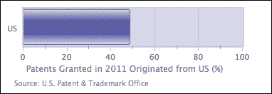

# 将图表拼接在一起

在本节中，我们正在构建一个包含多种图表的页面。主图表显示在左侧面板中，三个迷你图表按从上到下的顺序显示在右侧面板中。布局是通过 HTML `div` 框和 CSS 样式实现的。

左侧图表是从我们之前讨论的多色柱状图示例中提取的。在迷你图表中，所有坐标线和标签都被禁用了。

最上面的第一个迷你图表是一个包含两个系列且只对每个系列的最后一个点启用了`dataLabels`的折线图：数据数组中的最后一个点是一个数据对象。标签颜色被设置为与系列相同的颜色。然后，在 y 轴的 50%值标记处插入了`plotLine`。以下是一个系列配置的示例：

```js
            pointStart: 2001,
            marker: {
                 enabled: false
            },
            data: [ 53.6, 52.7, 52.7, 51.9, 52.4, 
                    52.1, 51.2, 49.7, 49.5, 49.6, 
                    { y: 48.9,
                      name: 'US',
                      dataLabels: {
                          color: '#4572A7',
                          enabled: true,
                          x: -10,
                          y: 14,
                          formatter: function() {
                              return 
                   this.point.name + ": " + this.y + '%';
                          }
                      }
                  }]
```

第二个迷你图表是一个简单的条形图，数据标签位于类别之外。数据标签的样式被设置为更大的粗体字体。

最后一个迷你图表基本上是一个散点图，其中每个系列只有一个点，这样每个系列都可以出现在右侧图例中。此外，我们将每个系列的 x 值设置为零，这样我们就可以有不同的数据点大小，并且可以堆叠在一起。以下是一个散点图配置的示例：

```js
               zIndex: 1,
               legendIndex: 0,
               color: {
                   linearGradient: 
                       { x1: 0, y1: 0, x2: 0, y2: 1 },
                         stops: [ [ 0, '#FF6600' ],
                                  [ 0.6, '#FFB280'  ] ] 
               },
               name: 'America - 49%',
               marker: {
                   symbol: 'circle',
                       lineColor: '#B24700',
                       lineWidth: 1
               },
               data: [ 
                   { x: 0, y: 49, name: 'America', 
                     marker: { radius: 74 } 
               } ]
```

以下是将这些多个图表并排显示的截图：

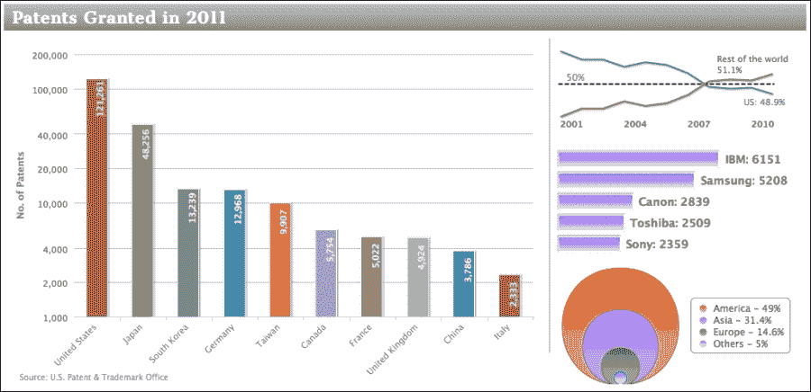

# 摘要

在本章中，我们学习了如何使用柱状图和条形图。我们利用它们的选项来实现列和条形的各种展示配置，以便于比较数据集。我们还学习了不同图表外观的高级配置，例如镜像和仪表图。

在下一章中，我们将探讨饼图系列。
