# 第五章。饼图

在本章中，你将学习如何绘制饼图并探索它们的各种选项。然后我们将检查如何在图表中放置多个饼。之后，我们将找出如何创建环形图。然后我们将通过绘制包含我们迄今为止所学的所有系列类型的图表来结束本章——柱状图、折线图和饼图。在本章中，我们将涵盖以下主题：

+   理解图表、饼图和系列之间的关系

+   绘制简单的饼图 – 单个系列

+   在图表中绘制多个饼 – 多个系列

+   准备环形图 – 多个系列

+   使用多种系列类型构建图表

+   理解`startAngle`和`endAngle`选项

+   创建简化版的股票选择轮图表

# 理解图表、饼图和系列之间的关系

饼图绘制简单：它们没有轴需要配置，只需要带有类别的数据。通常，术语**饼图**指的是只有一个饼系列图表。在 Highcharts 中，一个图表可以处理多个饼系列。在这种情况下，一个图表可以显示多个饼：每个饼都与一系列数据相关联。而不是显示多个饼，Highcharts 可以显示一个环形图，它基本上是一个有多个同心圆叠加的饼图。每个同心圆是一个饼系列，类似于堆叠饼图。我们首先将学习如何绘制单个饼的图表，然后在本章后面我们将探讨在单独的饼和环形图中使用多个饼系列进行绘制。

# 绘制简单的饼图 – 单个系列

在本章中，我们将使用由**vgchartz**提供的视频游戏数据（[www.vgchartz.com](http://www.vgchartz.com)）。以下是一个饼图配置，数据是根据出版商基于 2011 年销量前 100 的游戏销售数量。Wii Sports 被从数据集中去除，因为它与 Wii 游戏机捆绑免费：

```js
      chart: {
        renderTo: 'container',
        type: 'pie',
        borderWidth: 1,
        borderRadius: 5
      },
      title: {
        text: 'Number of Software Games Sold in 2011 Grouped by Publishers',
      },
      credits: { 
        ...
      },
      series: [{
        data: [ [ 'Nintendo', 54030288 ], 
            [ 'Electronic Arts', 31367739 ],
            ... ]
      }]
```

这里是一个简单的饼图截图，第一个数据点（任天堂）从 12 点钟位置开始。除非我们使用`startAngle`选项指定不同的起始点，否则第一片总是从 12 点钟位置开始，我们将在本章后面探讨这一点。

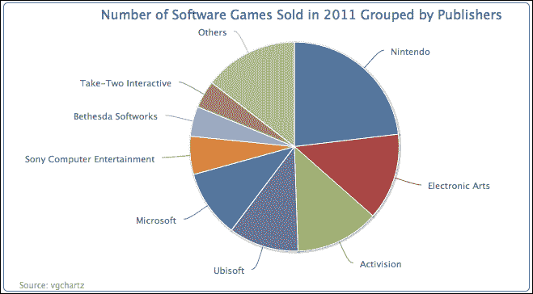

## 配置带有切割部分的饼图

我们可以将之前的饼图改进，包括标签中的值和换行一些出版商的长名称。以下是为饼系列配置的代码。`allowPointSelect`选项允许用户通过点击数据点与图表进行交互。至于饼系列，这用于从饼图中切割掉一个部分（见以下截图）。`slicedOffset`选项用于调整从饼图中切割部分的距离。对于换行标签，我们将标签样式`dataLabels.style.width`设置为 140 像素宽：

```js
   plotOptions: {
     pie: {
       slicedOffset: 20,
       allowPointSelect: true,
       dataLabels: {
         style: {
              width: '140px'
         },
         formatter: function() {
           var str = this.point.name + ': ' +          
             Highcharts.numberFormat(this.y, 0);
           return str;
         }
       }
     }
   },
```

此外，我们希望在初始显示中切掉最大的部分；其标签以粗体字体显示。为此，我们需要将最大的数据点转换为对象配置，如下面的截图所示。然后我们将`sliced`属性放入对象中，并将默认值`false`更改为`true`，这迫使切片从中心切掉。此外，我们通过将`fontWeight`选项分配给`dataLabels`来覆盖默认设置：

```js
    series: [{
      data: [ { 
        name: 'Nintendo', 
        y: 54030288, 
        sliced: true, 
        dataLabels: { 
          style: { 
          fontWeight: 'bold' 
          } 
        } 
       }, [ 'Electronic Arts', 31367739 ], 
        [ 'Activision', 30230170 ], .... ]
    }]
```

下面的图表显示了经过精炼的标签：

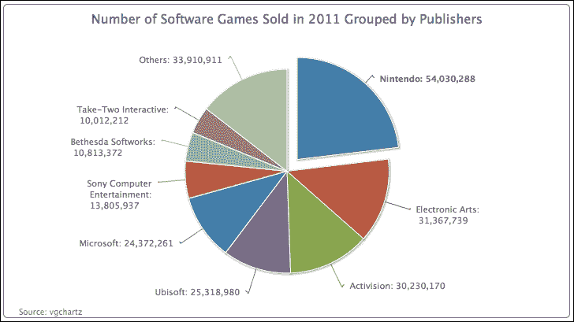

如前所述，`slicedOffset`选项也将切掉的部分推得更远，默认距离为 10 像素。`slicedOffset`选项适用于所有切掉的部分，这意味着我们无法控制单独分开的部分的距离。还值得注意的是，由于这个原因，连接线（切片和数据标签之间的线条）变得弯曲。在下一个示例中，我们演示了`sliced`属性可以应用于我们想要的任意多个数据点，并移除`slicedOffset`选项以恢复默认设置以显示差异。以下图表通过重复数据对象设置（Nintendo）为其他两个点，展示了三个分开的切片：

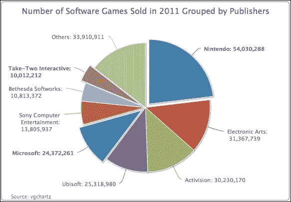

注意到连接线又变回了平滑的线条。然而，对于`sliced`选项，还有一个有趣的行为。对于默认设置为`false`的`sliced`选项的切片，只有一个可以被切掉。例如，用户点击**其他**部分，它会从图表中移开。然后，点击**Activision**将切片切掉，**其他**部分会向中心移动，而三个配置为`sliced: true`的部分保持它们分开的位置。换句话说，将`sliced`选项设置为`true`，这使得它的状态可以独立于设置为`false`的其他部分。

## 将图例应用到饼图中

到目前为止，图表包含大量数字，很难真正理解一个部分比另一个部分大多少。我们可以打印所有标签的百分比。让我们将所有出版商名称放入图例框中，并在每个切片中打印百分比值。

绘图配置重新定义为以下内容。要启用图例框，我们将`showInLegend`设置为`true`。然后，我们将数据标签的字体颜色和样式分别设置为粗体和白色，并稍微修改`formatter`函数以使用仅适用于饼图系列的`this.percentage`变量。`distance`选项是数据标签与饼图外边缘之间的距离。正值将数据标签移出边缘，负值将数据标签移向相反方向：

```js
      plotOptions: {
        pie: {
          showInLegend: true,
          dataLabels: {
            distance: -24,
            color: 'white',
            style: {
              fontWeight: 'bold'
            },
            formatter: function() {
              return Highcharts.numberFormat(this.percentage) + '%';
            }          
          }
        }
      },
```

然后，对于图例框，由于图例项较多，我们添加了一些填充，并将图例框设置得更靠近饼图，如下所示：

```js
      legend: {
        align: 'right',
        layout: 'vertical',
        verticalAlign: 'middle',
        itemMarginBottom: 4,
        itemMarginTop: 4,
        x: -40
      },
```

以下是对图表的另一种展示：

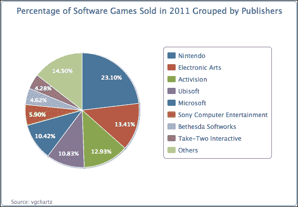

# 在图表中绘制多个饼图 – 多个系列

使用饼图，我们可以通过并排显示另一个饼图来比较数据，从而提供更多信息。这可以通过在系列数组中简单地指定两个系列配置来完成。

我们可以继续使用左侧图表的先前示例，并从相同的数据集中创建一个新的类别系列，但这次是按平台分组。以下是这样做的系列配置：

```js
      plotOptions:{
        pie: {
           ....,
           size: '75%'
        }
      },
      series: [{
        center: [ '25%', '50%' ],
        data: [ [ 'Nintendo', 54030288 ], 
                [ 'Electronic Arts', 31367739 ], 
                .... ]
      }, {
        center: [ '75%', '50%' ],
        dataLabels: {
          formatter: function() {
            var str = this.point.name + ': ' +                    Highcharts.numberFormat(this.percentage, 0) + '%';
            return str;
          }
        },
        data: [ [ 'Xbox', 80627548 ], 
                [ 'PS3', 64788830 ], 
                   ....  ]
      }]
```

如我们所见，我们使用了一个新的选项`center`来定位饼图。该选项包含一个包含两个百分比值的数组——第一个是 x 位置与整个容器宽度的比例，而第二个百分比值是 y 比例。默认值是`['50%', '50%']`，位于容器中间。在这个例子中，我们将第一个百分比值指定为`'25%'`和`'75%'`，分别位于左右两半的中间。我们使用`plotOptions.pie.size`将饼图系列的大小设置为 75%，这确保了两个饼图大小相同，否则左侧的饼图将显得更小。

在第二系列中，我们将选择显示带有百分比数据标签的饼图，而不是单位值。以下是一个双饼图的截图：

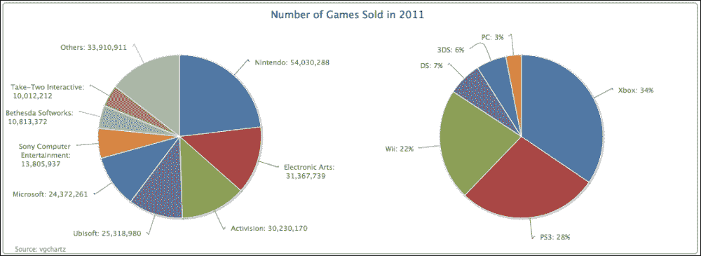

表面上看，这与在单个`<div>`标签中绘制两个独立的饼图没有太大区别，除了共享相同的标题。主要好处是我们可以在同一图表下结合不同的系列类型展示。例如，假设我们想在多个列系列组上方直接展示饼图系列的比例分布。我们将在本章后面学习如何做到这一点。

# 准备环形图 – 多个系列

Highcharts 提供了另一种类型的饼图，即**环形图**。它具有钻取类别以创建子类别的效果，是查看更详细数据的便捷方式。这种钻取效果可以应用于多个级别。在本节中，我们将创建一个简单的环形图，它有一个与内部类别（发行商）对齐的外环子类别（游戏标题）。

为了简化，我们只将使用前三个游戏发行商作为内部饼图。以下是环形图的系列数组配置：

```js
      series: [{
        name: 'Publishers',
        dataLabels : {
          distance: -70,
          color: 'white',
          formatter: function() {
             return this.point.name + ':<br/> ' +
 Highcharts.numberFormat(this.y / 1000000, 2);
          },
          style: {
             fontWeight: 'bold'
          }
        },
        data: [ [ 'Nintendo', 54030288 ], 
                [ 'Electronic Arts', 31367739 ],
                [ 'Activision', 30230170 ] ]
      }, {
        name: 'Titles',
        innerSize: '60%',
        dataLabels: {
          formatter: function() {
            var str = '<b>' + this.point.name + '</b>: ' + 
                 Highcharts.numberFormat(this.y / 1000000, 2);
            return str;
          }
        },
        data: [ // Nintendo
            { name: 'Pokemon B&W', y: 8541422,
             color: colorBrightness("#4572A7",
                        0.05) }, 
            { name: 'Mario Kart', y: 5349103,
             color: colorBrightness('#4572A7',
                        0.1) },
            ....

            // EA
            { name: 'Battlefield 3', y: 11178806,
             color: colorBrightness('#AA4643',
                        0.05) }, 
            .... 

            // Activision
            { name: 'COD: Modern Warfare 3', 
             y: 23981182, 
             color: colorBrightness('#89A54E',
                        0.1) },
            ....
        }]
      }]
```

首先，我们有两个系列——内部饼图系列，或**出版商**，以及外部环系列，或**标题**。**标题**系列包含所有子类别的数据，并且与**出版商**系列对齐。顺序是这样的，**任天堂**类别的子类别值在**艺电**的子类别数据之前，依此类推（参见**标题**系列中的数据数组顺序）。

子类别系列中的每个数据点都被声明为一个数据点对象，以便将颜色分配到与它们的主要类别相似的范围。这可以通过遵循 Highcharts 演示来调整颜色亮度：

```js
color: Highcharts.Color(color).brighten(brightness).get()
```

基本上，这个功能是使用主要类别的颜色值来创建一个`Color`对象，然后通过亮度参数调整颜色代码。这个参数是从子类别值的比率中得出的。我们将这个示例重写成一个名为`colorBrightness`的函数，并在图表配置中调用它：

```js
 function colorBrightness(color, brightness) {
   return   
     Highcharts.Color(color).brighten(brightness).get();
 }
```

下一个部分是指定哪个系列进入内部饼图，哪个进入外部环。外部系列使用`innerSize`选项，**标题**创建一个内部圆圈。因此，**标题**系列形成一个环形的饼图。`innerSize`选项的值可以是像素或绘图区域大小的百分比值。

最后的部分是用数据标签装饰图表。显然，我们希望将内部图表的数据标签定位在内部饼图的上方，因此我们将`dataLabels.distance`选项赋值为负值。我们不是打印长值，而是定义`formatter`将它们转换为百万单位。

下面的显示是饼图的展示：

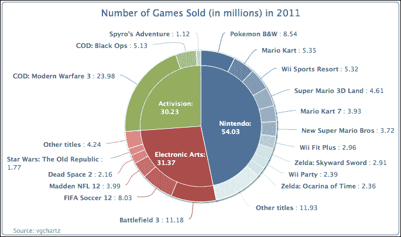

注意，在饼图中心放置饼图不是强制性的。这只是本例的展示风格。我们可以有多个同心环。下面的图表与前面提到的示例完全相同，只是为**出版商**的内部系列添加了`innerSize`选项：

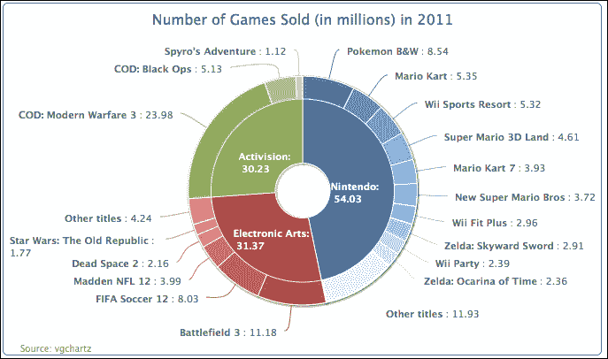

我们甚至可以通过引入第三个系列来进一步复杂化饼图。我们在三个层次上绘制以下图表。代码简单地从示例中扩展了另一个系列并包含了更多数据。源代码和演示可在[`joekuan.org/Learning_Highcharts/`](http://joekuan.org/Learning_Highcharts/)找到。两个外部系列使用`innerSize`选项。由于内部饼图将变得甚至更小，并且没有足够的空间放置标签，因此我们通过`showInLegend`选项启用最内部系列的图例框。

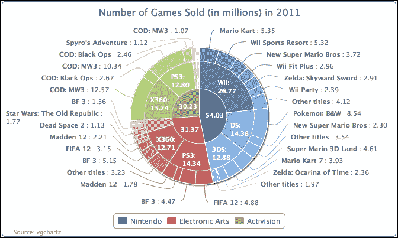

# 构建多系列类型的图表

到目前为止，我们已经学习了线形、柱形和饼图系列类型。现在是时候将这些不同的系列展示方式汇总到一个图表中。在本节中，我们将使用 2008 年至 2011 年的年度数据来绘制三种不同类型的系列：柱形、线形和饼图。柱形类型表示每种游戏机每年的销量。饼图系列显示了每个供应商每年销售的年度游戏机数量。最后一个是样条图系列，它揭示了每年所有游戏机总共发布了多少新游戏标题。

为了确保整个图表使用相同的颜色方案来表示每种游戏机类型，我们必须手动为饼图和柱形系列中的每个数据点分配一个颜色代码：

```js
    var wiiColor = '#BBBBBB',
        x360Color = '#89A54E',
        ps3Color = '#4572A7',
        splineColor = '#FF66CC';
```

然后，我们以更酷的方式装饰图表。首先，我们给图表添加一个深色背景和颜色渐变：

```js
    var chart = new Highcharts.Chart({
      chart: {
        renderTo: 'container',        
        borderWidth: 1,
        spacingTop: 40,
        backgroundColor: {
          linearGradient: { x1: 0, y1: 0, 
                            x2: 0, y2: 1 },
          stops: [ [ 0, '#0A0A0A' ],
                   [ 1, '#303030' ] ]
        }
      },
      subtitle: {
          floating: true,
          text: 'Number of consoles sold (in millions)',
          y: -5
      },
```

然后，我们需要将柱形向右移动，以便为（稍后描述的）要放置在右上角的照片留出足够的空间：

```js
      xAxis: {
        minPadding: 0.2,
        tickInterval: 1,
        labels: {
          formatter: function() {            
            return this.value;
            },  
          style: {
           color: '#CFCFCF'
          } 
        }
      },
```

下一个任务是为饼图留出足够的空间，以便将它们放置在柱形上方。这可以通过在两个 y 轴上引入`maxPadding`选项来实现：

```js
      yAxis: [{
        title: {
          text: 'Number of games sold',
          align: 'low',
          style: {           
            color: '#CFCFCF'
          }
        },
        labels: {
          style: {
           color: '#CFCFCF'
          }
        },
        maxPadding: 0.5
      }, {
        title: {
          text: 'Number of games released',
          style: {           
           color: splineColor
          } 
        },
        labels: {
          style: {
           color: splineColor
          } 
        },
        maxPadding: 0.5,
        opposite: true
      }],
```

每个饼图系列单独显示，并与其对应的柱形顶部以及年份类别对齐。这是通过调整系列数组中饼图的`center`选项来实现的。我们还想减小饼图系列的显示尺寸，因为图表中还有其他类型的系列需要共享。我们将使用`size`选项并设置百分比值。百分比值是饼图系列的直径与绘图区域大小的比例：

```js
      series:[{
        type: 'pie',
        name: 'Hardware 2011',
        size: '25%',
        center: [ '88%', '5%' ],
        data: [{ name: 'PS3', y: 14128407, 
             color: ps3Color }, 
            { name: 'X360', y: 13808365, 
             color: x360Color }, 
            { name: 'Wii', y: 11567105, 
             color: wiiColor } ],
        .....
```

样条图系列被定义为对应于相反的 y 轴。为了使系列与第二个轴明显关联，我们应用相同的颜色方案来绘制线条、轴标题和标签：

```js
      {  name: "Game released",
        type: 'spline',
        showInLegend: false,
        lineWidth: 3,
        yAxis: 1,
        color: splineColor,
        pointStart: 2008, 
        pointInterval: 1,
        data: [ 1170, 2076, 1551, 1378 ]
      }, 
```

我们使用`renderer.image`方法将图像插入到图表中，并确保图像具有更高的`zIndex`，这样轴线就不会位于图像的顶部。我们不是包含一个 PNG 图像，而是使用 SVG 图像。这样，图像在图表缩放时保持清晰，避免了像素化效果：

```js
    chart.renderer.image('./pacman.svg', 0,
               0, 200, 200).attr({
       'zIndex': 10 
    }).add();
```

以下是在图表中添加了 Pac-Man SVG 图像的最终图形，以给图表增添游戏主题：

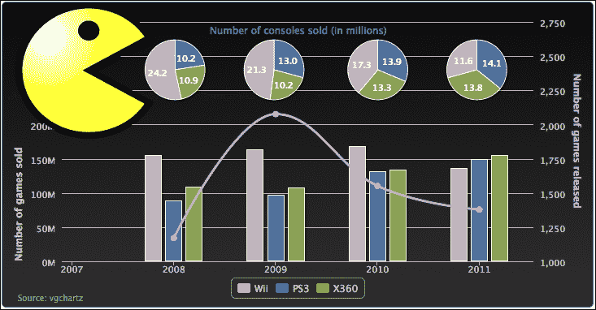

## 创建股票选择轮

股票选择轮图表是由投资者智能（[`www.investorsintelligence.co.uk/wheel/`](http://www.investorsintelligence.co.uk/wheel/））设计的一种金融图表，该图表提供了一种交互式的方式来可视化市场指数中主要股票的整体和详细表现。以下是该图表的截图：

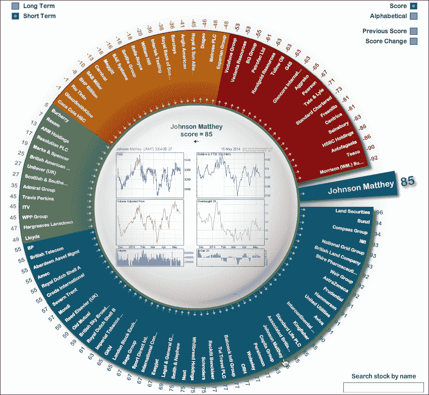

基本上，这是一个开口的环形图。每个切片代表一家蓝筹股公司，所有切片的宽度都相等。根据股价表现分数，切片被分为不同的颜色带（从红色到橙色、绿色和蓝色）。当用户将鼠标悬停在某个公司名称上时，环形图缺口处会出现一个更大的切片，并显示该公司的详细业绩信息。尽管这个令人印象深刻的图表是用 Adobe Flash 实现的，但我们还是想尝试看看 Highcharts 是否能在本节中产生一个类似的外观。我们将专注于环形图，并将中间图表留作你稍后的练习。

## 理解 startAngle 和 endAngle

在我们开始绘制股票选择轮图表之前，我们需要知道如何创建一个开口的环形图。`startAngle` 和 `endAngle` 选项可以使饼图在任何大小和方向上分裂。然而，在绘制实际图表之前，我们需要熟悉这些选项。默认情况下，第一个切片的起始位置在 12 点钟，这被认为是 `startAngle` 选项的 0 度。`startAngle` 选项从原点开始，顺时针移动到 `endAngle`。让我们制作一个简单的饼图，将 `startAngle` 和 `endAngle` 分别设置为 `30` 和 `270`：

```js
            plotOptions: {
               pie: {
                   startAngle: 30,
                   endAngle: 270 
               }
            },
```

上述代码生成了以下图表。请注意，尽管系列数据的饼图面积变小了，但数据仍然会按比例调整：

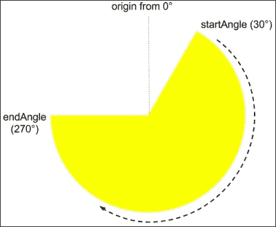

为了在饼图的右侧显示一个间隙，`endAngle` 选项需要稍作不同的处理。为了使 `endAngle` 选项最终位于 `startAngle` 选项之上，即 `endAngle` 选项绕过原点并在 0 度处通过，`endAngle` 的值必须超过 360，而不是再次从 0 度开始。让我们将 `startAngle` 和 `endAngle` 的值分别设置为 120 和 420，并将 `innerSize` 值增加以形成一个环形图。以下是新的配置：

```js
            plotOptions: {
                pie: {
                    startAngle: 120,
                    endAngle: 420,
                    innerSize: 110,
                    ....
                }
           } 
```

我们可以看到 `endAngle` 选项超过了原点，并在 `startAngle` 选项之上结束。请看以下截图：

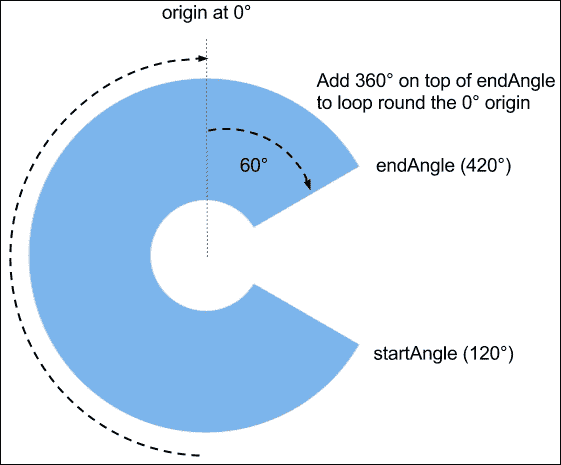

## 创建股票符号的切片

到目前为止，我们已经成功地创建了股票选择轮图表的一般形状。下一个任务是给每个切片填充等大小的财务数据标签。而不是像原始图表那样使用 FTSE 指数的一百只股票，我们将使用道琼斯工业平均指数，它由 30 只主要股票组成。首先，我们生成一个按百分比变化降序排列的股票符号数据数组：

```js
          var data = [{
               name: 'MCD 0.96%',
               y: 1,
               dataLabels: { rotation: 35 },
               color: colorBrightness('#365D97', ratio1)
          }, {
              name: 'HD 0.86%',
              y: 1,
              dataLabels: { rotation: 45 },
              color: colorBrightness('#365D97', ratio2)
          }, {
              ....
          }]
```

我们将每个份额符号的 y 轴值设置为 1，以便使所有切片的大小相同。然后，我们根据这些股份的百分比变化与整体最大值和最小值之间的比率来评估正负渐变色变化。然后，我们将这个比率值应用到我们之前讨论过的`colorBrightness`方法上，以实现渐变效果。

至于标签旋转，因为我们事先知道每个份额符号的位置和应该应用的旋转角度，我们可以根据公司的份额符号位置从`startAngle`计算标签旋转。`dataLabel`的朝向与`startAngle`不同，它以 3 点钟位置为 0 度（因为我们水平阅读文本）。以`startAngle`为 120 度，我们可以轻松计算出第一个切片的`dataLabel`旋转为 30 度（我们再增加 5 度以便`dataLabel`位于切片的中间），每个切片比前一个切片多旋转 10 度。以下说明了这种计算的逻辑：

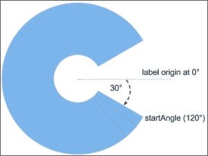

我们接下来的任务是移除连接线并将默认的`dataLabel`位置（位于切片外部）移动到饼图的中心。我们通过将`connectorWidth`值设置为零并将`distance`选项设置为负值来实现这一点，这样就可以将`dataLabel`拖向图表的中心，使得标签位于切片内部。以下是`plotOptions.pie`配置：

```js
       plotOptions: {
           pie: {
               size: '100%',
               startAngle: 120,
               endAngle: 420,
               innerSize: 110,
               dataLabels: {
                   connectorWidth: 0,
                   distance: -40,
                   color: 'white',
                   y: 15
               }
    },
```

以下截图显示了旋转标签以实现股票选择轮效果的切片方向：

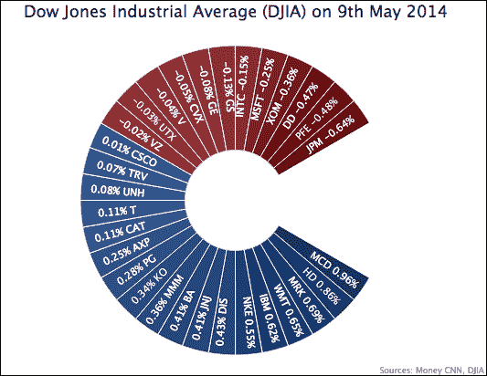

## 使用 Highcharts 的渲染器创建形状

这个实验最后缺失的部分是在用户将指针悬停在切片上时显示一个显示份额符号详细信息的弧线。为了做到这一点，我们使用了 Highcharts 渲染器引擎，它提供了一套 API 来在图表中绘制各种形状和文本。在这个练习中，我们调用`arc`方法来创建一个动态切片并将其定位在间隙内。

由于这是由用户操作触发的，因此该过程必须在事件处理程序内部执行。以下是事件处理程序代码：

```js
  var mouseOver = function(event) {
         // 'this' keyword in this handler represents 
         // the triggered object, i.e. the data point
         // being hovered over 
         var point = this;

         // retrieve the renderer object from the 
         // chart hierarchy
         var renderer = point.series.chart.renderer;

         // Initialise the SVG elements group
         group = renderer.g().add();

         // Calculate the x and y coordinate of the 
         // pie center from the plot dimension
         var arcX = c.plotWidth/2 - c.plotLeft;
         var arcY = c.plotHeight/2 + c.plotTop;

         // Create and display the SVG arc with the 
         // same color hovered slice and add the arc 
         // into the group
         detailArc = 
             renderer.arc(arcX, arcY, 230, 70, -0.3, 0.3)
                      .css({
                           fill: point.options.color
                       }).add(group);

         // Create and display the text box with stock
         // detail and add into the group
         detailBox = renderer.text(sharePrice, 
                                   arcX + 80, arcY - 5)
                             .css({
                                   color: 'white',
                                   fontWeight: 'bold',
                                   fontSize: '15px'
                             }).add(group);
  };

  plotOptions: {
      pie: {
          ....
          point: {
              events: {
                  mouseOver: mouseOver,
                  mouseOut: function(event) {
                      group && (group = group.destroy());
                  }
          }
```

在鼠标悬停事件中，我们首先根据 Highcharts API 文档从处理程序内部的`'this'`关键字中提取触发数据点对象。从那里，我们可以向下传播以恢复`renderer`对象。然后，我们使用渲染器的`g()`调用创建一个组对象，然后调用该对象的方法`add`将其插入到图表中。这个组处理对象使我们能够后来将多个 SVG 元素组合成一个组，以便更容易处理。

我们随后调用弧线方法来生成一个带有图表的 x 和 y 中心位置的切片，该位置是通过评估图表的绘图维度得到的。我们还指定了`innerRadius`参数，并赋予一个非零值（70），以便使弧线呈现出甜甜圈图表的切片效果。然后，我们使用`css`将调用与点对象相同的颜色链式调用，并将`add`方法链接到组上。接着，我们在新弧线内部创建一个包含股票详情的文本框；调用以相同的方式通过`css`和`add`链接到同一个组。

对于鼠标移出事件，我们可以利用组对象。我们不需要逐个删除每个元素，只需在组对象上调用`destroy`方法即可。以下截图显示了新切片的显示效果：

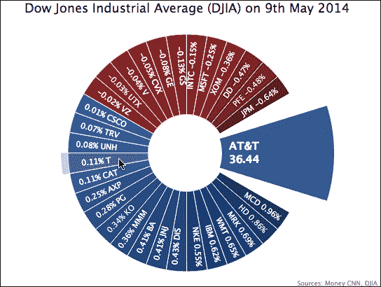

因此，我们创建了一个类似 Highcharts 的股票选择轮，这证明了 Highcharts 的多功能性。然而，为了简化，这个练习省略了一些复杂性，这影响了最终的外观。实际上，如果我们足够努力地使用 Highcharts，我们可以完成一个看起来甚至更接近原始图表的图表。以下是一个这样的例子，其中每个切片都有几个颜色带和颜色渐变：

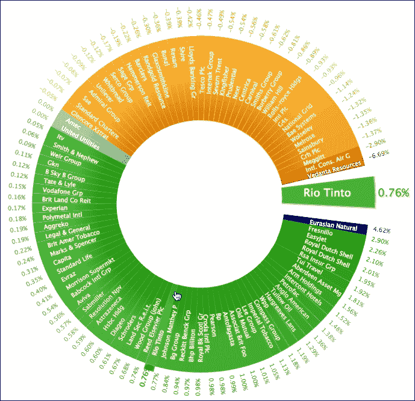

在线演示可以在[`joekuan.org/demos/ftse_donut`](http://joekuan.org/demos/ftse_donut)找到。

# 摘要

在本章中，我们学习了如何绘制饼图及其变体甜甜圈图。我们还绘制了一个包含我们迄今为止所学所有系列类型的图表。

在下一章中，我们将探讨负责创建动态图表的 Highcharts API，例如使用 AJAX 查询更新图表内容、访问 Highcharts 对象中的组件、将图表导出为 SVG 等等。
