# 第七章：气泡图、箱线图和误差线图

在本章中，我们将通过首先研究如何从各种系列选项中确定气泡大小，然后通过复制现实生活中的图表来熟悉它。之后，我们将研究箱线图的结构，并讨论将过度拥挤的蜘蛛图转换为箱线图的论文。我们将使用它作为练习，以熟悉箱线图。最后，我们将转向误差线系列，了解其结构，并将其应用于一些统计数据。

本章假设您对统计学有一些基本知识，例如平均值、百分位数、标准误差和标准差。对于需要复习这些主题的读者，有大量的在线材料涵盖了它们。或者，Deborah J. Rumsey 编著的《统计学傻瓜指南》提供了很好的解释，并涵盖了一些基本图表，如箱线图。

在本章中，我们将涵盖以下主题：

+   气泡大小是如何确定的

+   在逐步复制现实生活中的图表时，气泡图选项

+   在重新绘制蜘蛛图数据时，箱线图结构和系列选项

+   带有现实数据的误差线图

# 气泡图

气泡系列是散点系列的扩展，其中每个数据点的大小都是可变的。它通常用于在二维图表上显示三维数据，气泡大小反映了 z 值之间的比例。

## 理解气泡大小是如何确定的

在 Highcharts 中，气泡大小是通过将最小的 z 值关联到 `plotOptions.bubble.minSize` 选项，将最大的 z 值关联到 `plotOptions.bubble.maxSize` 来决定的。默认情况下，`minSize` 被设置为直径 8 像素，而 `maxSize` 被设置为绘图区域大小的 20%，这是宽度和高度的较小值。

另外还有一个选项，`sizeBy`，它也会影响气泡大小。`sizeBy` 选项接受字符串值：`'width'` 或 `'area'`。宽度值表示气泡宽度由其在系列中的 z 值比例决定，与 `minSize` 和 `maxSize` 范围成比例。至于 `'area'`，气泡的大小通过取 z 值比例的平方根来缩放（有关 `'area'` 实现的更多描述，请参阅 [`en.wikipedia.org/wiki/Bubble_chart`](http://en.wikipedia.org/wiki/Bubble_chart)）。此选项是为那些在比较圆圈大小时有不同的感知的观众设计的。为了演示这个概念，让我们以 Highcharts 在线 API 文档中的 `sizeBy` 示例 ([`jsfiddle.net/ZqTTQ/`](http://jsfiddle.net/ZqTTQ/)) 为例。以下是示例中的代码片段：

```js
        plotOptions: {
            series: { minSize: 8, maxSize: 40 }
        },
        series: [{
            data: [ [1, 1, 1], [2, 2, 2], 
                    [3, 3, 3], [4, 4, 4], [5, 5, 5] ],
            sizeBy: 'area', 
            name: 'Size by area'
        }, {
            data: [ [1, 1, 1], [2, 2, 2], 
                    [3, 3, 3], [4, 4, 4], [5, 5, 5] ],
           sizeBy: 'width',
            name: 'Size by width'
        }]
```

设置了两组具有不同 `sizeBy` 方案的气泡。最小和最大气泡大小分别设置为 8 和 40 像素宽。以下是该示例的屏幕输出：

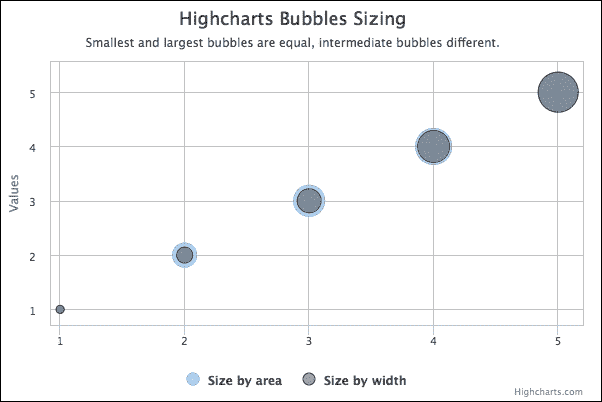

两个系列具有完全相同的 x、y 和 z 值，因此它们在极端值（1 和 5）处具有相同的气泡大小。对于中间值 2 到 4，**按面积大小**的气泡开始时比**按宽度大小**的气泡面积大，并且两种方案逐渐缩小到相同的大小。以下是一个表格，显示了每种方法在不同 z 值下的最终大小值，而括号内的关联值是系列中的 z 值比率：

| **Z-值** | 1 | 2 | 3 | 4 | 5 |
| --- | --- | --- | --- | --- | --- |
| **按宽度大小（比率）** | 8 (0) | 16 (0.25) | 24 (0.5) | 32 (0.75) | 40 (1) |
| **按面积大小（比率）** | 8 (0) | 24 (0.5) | 31 (0.71) | 36 (0.87) | 40 (1) |

让我们看看在这两种方法中气泡大小是如何计算的。**按宽度大小**的比率计算为*(Z - Zmin) / (Zmax - Zmin)*。因此，对于 z 值 3，比率计算为*(3 - 1) / (5 - 1) = 0.5*。要评估**按面积大小**方案的比率，只需取**按宽度大小**比率的平方根。在这种情况下，对于 z 值 3，计算结果为*√0.5 ≈ 0.71*。然后，我们将比率值转换为基于`minSize`和`maxSize`范围的像素数。**按宽度大小**的 z 值 3 计算如下：

*比率 * (maxSize - minSize) + minSize = 0.5 * (40 - 8) + 8 = 24*

## 重现现实生活中的图表

在本节中，我们将通过复制一个现实生活中的例子（MLB 球员图表：[`fivethirtyeight.com/datalab/has-mike-trout-already-peaked/`](http://fivethirtyeight.com/datalab/has-mike-trout-already-peaked/))来检查气泡系列选项。以下是一名棒球运动员里程碑的气泡图：

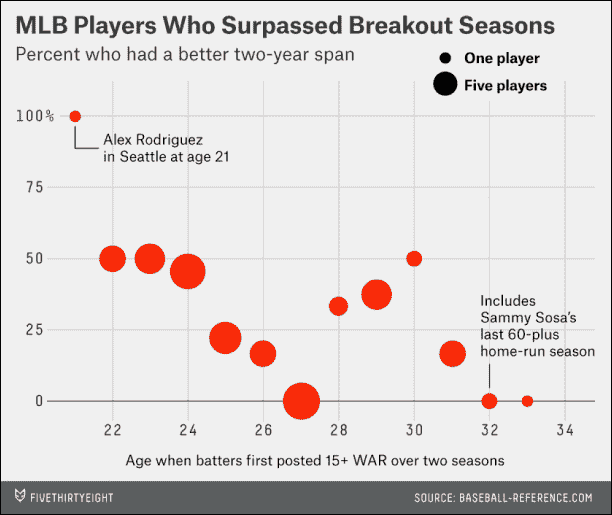

首先，我们有两种方式可以在系列中列出数据点（这些值是从图表的最佳估计中得出的）。传统的方式是一个包含 x、y 和 z 值的数组，其中 x 是本例中从 21 岁开始的年龄值：

```js
            series: [{
                 type: 'bubble',
                 data: [ [ 21, 100, 1 ],
                         [ 22, 50, 5 ],
                         .... 
```

或者，我们可以简单地使用`pointStart`选项作为初始年龄值，并省略其余部分：

```js
            series: [{
                type: 'bubble',
                pointStart: 21,
                data: [ [ 100, 1 ],
                        [ 50, 5 ],
                        ....
```

然后，我们定义背景颜色、轴标题，并将*y*轴标题旋转到图表的顶部。以下是我们第一次尝试的结果：

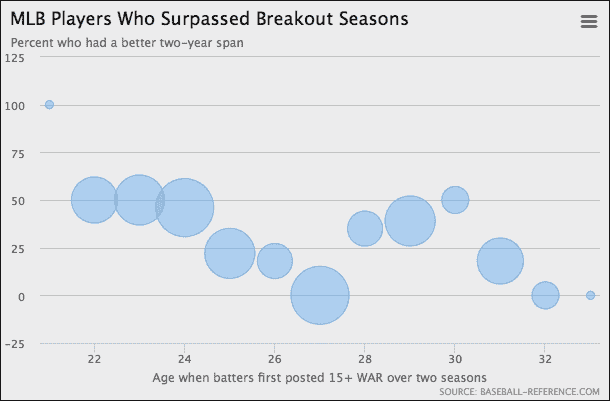

如我们所见，有一些区域并不完全正确。让我们首先修复气泡大小和颜色。与原始图表相比，前一个图表对于较高值有更大的气泡大小，气泡应该是实心红色。我们更新`plotOptions.bubble`系列如下：

```js
      plotOptions: {
           bubble: {
               minSize: 9,
               maxSize: 30,
               color: 'red'
           }
      },
```

这将气泡大小视角调整为更接近原始图表：

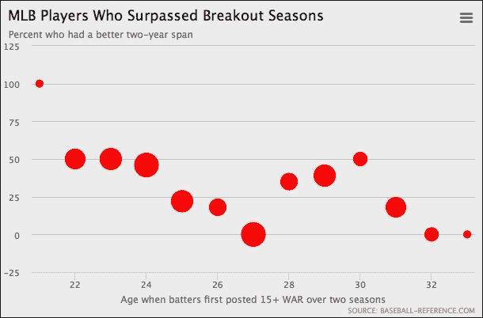

下一步是固定 y 轴范围，因为我们希望它仅在 0 到 100 之间。因此，我们将以下配置应用于`yAxis`选项：

```js
     yAxis: {
         endOnTick: false,
         startOnTick: false,
         labels: {
             formatter: function() {
                  return (this.value === 100) ? 
                       this.value + ' %' : this.value;
             }
         }
     },
```

通过将`endOnTick`和`startOnTick`选项设置为`false`，我们移除了两端额外的间隔。标签格式化器仅在`100`间隔处打印`%`符号。以下图表显示了*y*轴上的改进：

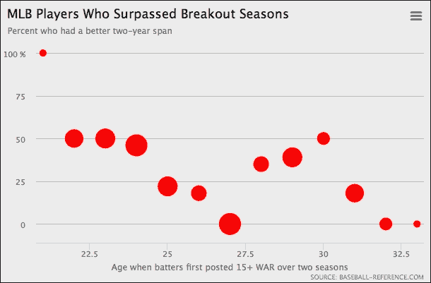

下一个改进是将*x*轴移动到零值级别，并将*x*轴细化成偶数间隔。我们还启用了每个主要间隔的网格线，并增加了轴线的宽度，使其类似于原始图表：

```js
     xAxis: {
         tickInterval: 2,
         offset: -27,
         gridLineColor: '#d1d1d1',
         gridLineWidth: 1,
         lineWidth: 2,
         lineColor: '#7E7F7E',
         labels: {
             y: 28
         },
         minPadding: 0.04,
         maxPadding: 0.15,
         title: ....
     },
```

`tickInterval`属性设置标签间隔为偶数，`offset`选项将*x*轴级别向上推，与零值对齐。通过将`gridLineWidth`选项设置为非零值来启用间隔线。在原始图表中，*x*轴两端有额外的空间用于数据标签。我们可以通过将`minPadding`和`maxPadding`都设置为比例值来实现这一点。通过增加`y`值的属性，将*x*轴标签向下推得更远。以下截图显示了改进：

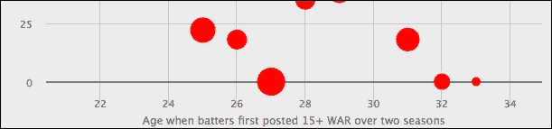

最终的改进是将数据标签放在第一个和倒数第二个数据点旁边。为了为特定点启用数据标签，我们将特定的点值转换为具有`dataLabels`选项的对象配置，如下所示：

```js
     series: {
         pointStart: 21,
         data: [{ 
             y: 100, 
             z: 1, 
             name: 'Alex Rodriguez <br>in Seattle at age 21', 
             dataLabels: {
                 enabled: true,
                 align: 'right',
                 verticalAlign: 'middle',
                 format: '{point.name}',
                 color: 'black',
                 x: 15
             }
         }, ....
```

我们使用`name`属性作为数据标签内容，并将`format`选项设置为指向`name`属性。我们还将标签定位在数据点的右侧，并分配标签颜色。

![重现真实生活中的图表从前面的观察中，我们注意到字体似乎相当模糊。实际上，这是气泡系列中`dataLabels`的默认设置。（默认标签颜色为白色，气泡内部填充系列颜色。因此，即使应用了文本阴影效果，数据标签实际上看起来也很清晰）此外，原始图表中气泡和数据标签之间存在连接器。这是我们第二次尝试改进图表：```js         { y: 100,            z: 1,            name: 'Alex Rodriguez <br>in Seattle at age 21',            dataLabels: {               enabled: true,               align: 'right',               verticalAlign: 'middle',               format: '<div style="float:left">' +                        '<font size="5">∟</font></div>' +                       '</span><div>{point.name}</div>',               color: 'black',               shadow: false,               useHTML: true,               x: -2,               y: 18,               style: {                   fontSize: '13px',                   textShadow: 'none'               }           }         },```要去除模糊效果，我们重新定义了标签样式，不使用 CSS 的`textShadow`。至于 L 形连接器，我们使用 alt-code（alt-code：28）和更大的字体大小。然后，我们将内联 CSS 样式放在`format`选项中，使两个`DIV`框的连接器和文本标签相邻。新的布局看起来更加精致：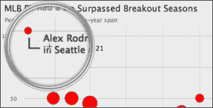

我们将同样的技巧应用于其他标签；以下是我们的气泡图的最终草案：

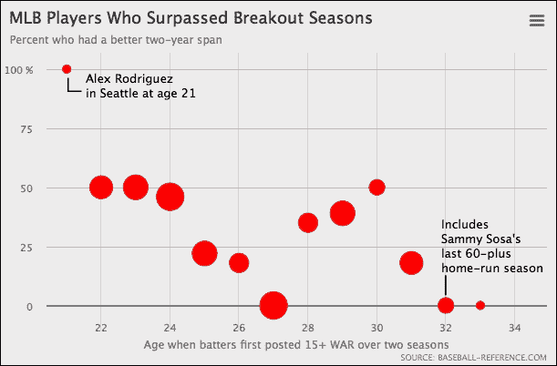

剩下的部分是气泡大小图例。不幸的是，Highcharts 目前不提供此类功能。然而，这可以通过使用图表的渲染器引擎来创建圆形和文本标签来完成。我们将把这个作为读者的练习。

从技术角度讲，我们可以用散点系列创建相同的图表，每个数据点在对象配置中指定，并将预先计算的 z 值比例分配给 `data.marker.radius` 选项。

# 理解箱线图

箱线图是一种技术图表，它以分布形状来展示数据样本。在我们可以创建箱线图之前，我们需要了解其基本结构和概念。以下图表展示了箱线图的结构：

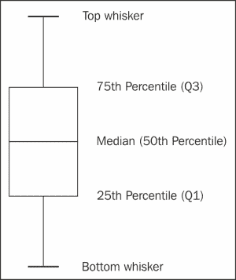

为了找出百分位数，首先需要对整个数据样本进行排序。基本上，箱线图由顶部和底部须线值、第一（Q1）和第三（Q3）四分位数以及中位数组成。四分位数 Q1 代表 50 百分位数和最小数据之间的中位数。四分位数 Q3 以类似的方式工作，但与最大数据相关。对于完美正态分布的数据，箱线图中的每个部分之间将具有相等的距离。

严格来说，还有其他类型的箱线图，它们在须线百分位数覆盖的程度上有所不同。有些使用 1.5 倍的四分位距的定义，即 *1.5 * (Q3 - Q1)*，或者标准差。目的是隔离异常数据并将它们作为单独的点绘制出来，这些点可以与箱线图一起放入散点数据点中。在这里，我们使用最简单的箱线图形式：最大和最小数据点分别被视为顶部和底部须线。

## 绘制箱线图

为了创建箱线图，我们需要加载一个额外的库，`highcharts-more.js`：

```js
<script src="img/highcharts-more.js"></script>
```

Highcharts 提供了一系列选项来塑造和样式化箱线图系列，例如线宽、样式和颜色，这些在以下代码片段中显示：

```js
          plotOptions: {
              boxplot: {
                  lineWidth: 2,
                  fillColor: '#808080',
                  medianColor: '#FFFFFF',
                  medianWidth: 2,
                  stemColor: "#808080",
                  stemDashStyle: 'dashdot',
                  stemWidth: 1,
                  whiskerColor: '#808080',
                  whiskerWidth: 2,
                  whiskerLength: '120%'
              }
          },
```

`lineWidth` 选项是箱线图的整体线宽，而 `fillColor` 用于箱体内部的颜色。`median` 选项指的是箱体内的水平中位数线，而 `stem` 选项用于四分位数和须线之间的线。`whiskerLength` 选项是对应于四分位数箱体宽度的比例。在这个例子中，我们将增大 `whiskerLength` 选项以方便可视化，因为图表中包含了许多箱线图。

箱线图的系列数据值以升序数组形式列出，因此从底部到顶部的须线。以下是一个系列数据的示例：

```js
        series: [{
            type: 'boxplot',
            data: [
                   [16.855, 19.287, 26.537, 31.368, 33.035 ],
                   [16.139, 18.668, 25.33, 30.632, 32.385 ],
                   [12.589, 15.536, 23.5495, 28.960, 30.848 ],
                   [13.395, 16.399, 22.078, 27.013, 29.146 ],
                   ....
            ]
        }]
```

## 理解箱线图数据

在我们深入探讨一个真实数据示例之前，值得参考一篇优秀的文章([`junkcharts.typepad.com/junk_charts/2014/04/an-overused-chart-why-it-fails-and-how-to-fix-it.html`](http://junkcharts.typepad.com/junk_charts/2014/04/an-overused-chart-why-it-fails-and-how-to-fix-it.html))，这篇文章由营销分析及数据可视化专家 Kaiser Fund 撰写，他也是大数据处理方面的书籍作者之一。在文章中，Kaiser 从一部名为 *Arctic Death Spiral* 的视频([`youtu.be/20pjigmWwiw`](http://youtu.be/20pjigmWwiw))中提出对蜘蛛图的观察，如下所述：

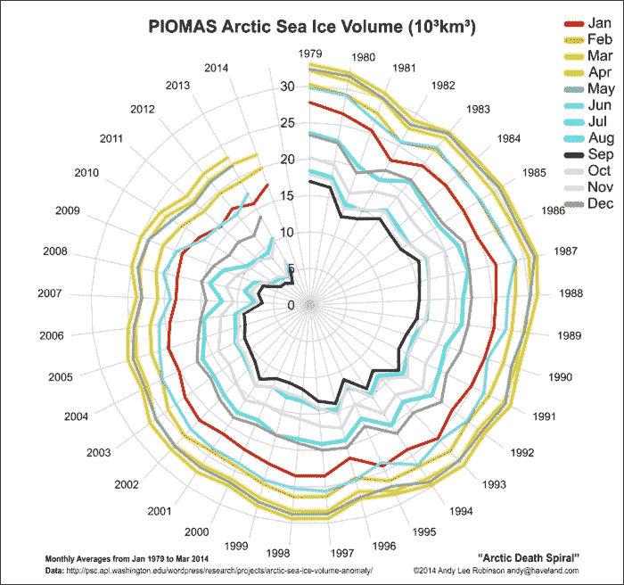

视频演示了北极海冰体积（每年每个系列每月的数据）以惊人的速度螺旋向中心移动。他辩称，使用蜘蛛图并不能公正地展示数据中的重要信息。为了总结他的论点：

+   在圆形图表中，读者很难理解真实的下降趋势尺度。

+   与圆形运动相比，人类更自然地以水平进展的方式来感知时间序列数据。

+   如果一年内月度数据的波动幅度大于其他年份，我们将有多个线系列相互交叉。结果，我们得到的是一大堆难以理解的图表，就像意大利面一样。

为了解决这个问题，Kaiser 建议箱线图是最好的选择。他不是将 12 个多个系列线挤在一起，而是使用箱线图来表示年度数据分布。每年的 12 个月数据都进行了排序，只有中位数、四分位数和极端值被替换到箱线图中。尽管由于数据较少而丢失了一些细节，但在此情况下，时间趋势的范围和尺度得到了更好的表示。

以下是在 Highcharts 中的最终箱线图展示：

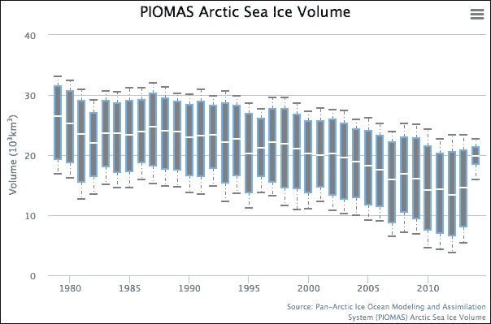

## 箱线图提示框

由于箱线图系列包含各种值，因此系列有不同的属性名称—`low`、`q1`、`median`、`q3`、`high`—来指代它们。以下是一个 `tooltip.formatter` 的示例：

```js
      chart: {
          ....
      },
      ....,
      tooltip: {
          formatter: function() {
              return "In year: " + this.x + ", <br>" +
                     "low: " + this.point.low + ", <br>" +
                     "Q1: " + this.point.q1 + ", <br>" +
                     "median: " + this.point.median + ", <br>" + 
                     "Q3: " + this.point.q3 + ", <br>" +
                     "high: " + this.point.high;
              }
          },
      series: [{
          ....
      }]
```

注意，`formatter` 应该添加到主选项对象的 `tooltip` 属性中，而不是 `series` 对象中。以下是箱线图提示框的样式：

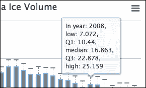

# 误差线图

误差线图是另一种技术图表，它显示了标准误差，即标准差除以样本大小的平方根。这意味着随着样本大小的增加，样本均值的变化会减小。误差线系列具有与箱线图相似的色彩和样式选项，但仅适用于须和茎：

```js
               plotOptions: {
                   errorbar: {
                       stemColor: "#808080",
                       stemDashStyle: 'dashdot',
                       stemWidth: 2,
                       whiskerColor: '#808080',
                       whiskerWidth: 2,
                       whiskerLength: '20%'
                   }
               },
```

同样，这也适用于提示框格式化器，其中 `low` 和 `high` 指的是误差棒的两侧。至于系列数据选项，它接受一个包含下限和上限值的元组的数组：

```js
        series: [{
            type: 'column',
            data: ....
        }, {
            name: 'error range',
            type: 'errorbar',
            data: [
                   [ 22.76, 23.404 ],
                   [ 25.316, 29.976 ],
```

为了展示误差线，我们使用了来自每个赛道的所有车队在[`www.formula1.com/results/season/2013`](http://www.formula1.com/results/season/2013)的 F1 停站时间。我们将每个赛道的平均值绘制在柱状系列中。然后我们计算标准误差并将结果应用于平均值。以下是误差线图表的截图：

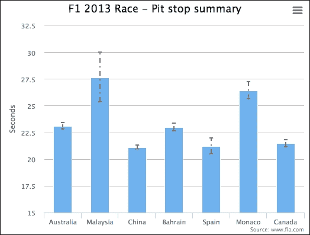

注意，当在柱状图中显示误差线系列时，误差线系列必须在系列数组中先于柱状系列指定。否则，误差线的一半会被柱状线遮挡，如下例所示：

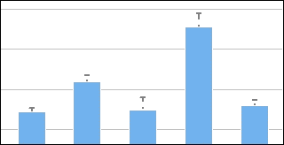

# 摘要

在本章中，我们学习了气泡图以及气泡大小是如何确定的。我们还通过重新创建一个现实生活中的图表来测试了气泡图系列。我们考察了箱线图的原则和结构，并练习了如何将数据样本转换为百分位数数据并将布局转换为箱线图。最后，我们通过使用一些统计数据来研究误差线图。

在下一章中，我们将研究瀑布图、漏斗图、金字塔图和热力图图表的特性，并对其进行实验。
