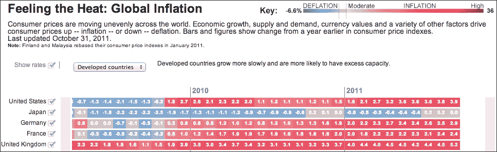

# 第八章：瀑布图、漏斗图、金字塔图和热力图图

在本章中，我们通过使用简单的销售和会计数据，探索了一些不太常见的图表，例如瀑布图和漏斗图。我们实验了如何将这两个图表与相关信息链接起来。然后，我们继续研究如何绘制金字塔图，并通过模仿一份合适的商业报告中的金融金字塔图来评估 Highcharts 的灵活性。最后，我们以逐步的方法研究热力图图，并使用现实生活中的统计数据调整各种特定选项。在本章中，我们将涵盖以下主题：

+   构建瀑布图

+   制作漏斗图

+   将瀑布图和漏斗图结合使用

+   绘制商业金字塔图

+   探索带有通货膨胀数据的热力图图

+   尝试热力图图的数据类和 nullColor 选项

# 构建瀑布图

瀑布图是一种柱状图类型，其中正负值沿*x*轴类别累积。相邻列的起始和结束对齐在同一水平上，列的上升或下降取决于值。它们主要用于在较高层次上展示现金流。

要使用瀑布图，必须包含`highcharts-more.js`库：

```js
<script type="text/javascript" 
 src="img/highcharts-more.js"></script>
```

让我们从简单的瀑布图开始，其中包含一些收入和支出的值。以下系列配置如下：

```js
            series: [{
                type: 'waterfall',
                upColor: Highcharts.getOptions().colors[0],
                color: '#E64545',
                data: [{
                    name: 'Product Sales',
                    y: 63700
                }, {
                    name: 'Renew Contracts',
                    y: 27000
                }, {
                    name: 'Total Revenue',
                    isIntermediateSum: true,
                    color: '#4F5F70'
                }, {
                    name: 'Expenses',
                    y: -43000
                }, {
                    name: 'Net Profit',
                    isSum: true,
                    color: Highcharts.getOptions().colors[1]
                }]
           }]
```

首先，我们将系列`type`指定为`waterfall`，然后为`upColor`选项分配一个颜色值（蓝色），这将设置任何正值列的默认颜色。在下一行，我们声明另一个颜色值（红色），这是用于负值列的颜色。数据点条目与普通柱状图相同，除了表示到目前为止的总和的列。这些列使用`isIntermediateSum`和`isSum`布尔选项指定，没有`y`轴值。瀑布图将显示这些为累积列。我们使用另一种颜色指定累积列，因为它们既不是收入也不是支出。

最后，我们需要启用数据标签以显示价值流动，这是瀑布图的主要目的。以下是与数据标签样式和格式相关的`plotOptions`设置：

```js
      plotOptions: {
          series: {
              borderWidth: 0,
              dataLabels: {
                  enabled: true,
                  style: {
                      fontWeight: 'bold'
                  },
                  color: 'white',
                  formatter: function() {
                      return Highcharts.numberFormat(this.y / 1000, 1, '.') + ' k';
                  }
              }
          }
      },
```

下面是瀑布图的截图：


## 制作水平瀑布图

假设我们需要绘制一个稍微复杂一些的瀑布图，因为我们有更多关于收入、支出和支出计划的图表。此外，我们还需要显示累积收入的多个阶段。与传统瀑布图中的垂直列不同，我们声明了`inverted`选项来将列切换为水平。由于列更加紧凑，数据标签可能无法放在列内。因此，我们将数据标签放在列的末尾。以下是变更的总结：

```js
            chart: {
                renderTo: 'container',
                inverted: true
            },
            ....,
            plotOptions: {
                series: {
                    borderWidth: 0,
                    dataLabels: {
                        enabled: true,
                        inside: false,
                        style: {
                            fontWeight: 'bold'
                        },
                        color: '#E64545',
                        formatter: ....
                    }
                }
            },
            series: [{
                type: 'waterfall',
                upColor: Highcharts.getOptions().colors[0],
                color: '#E64545',
                name: 'Q1 Revenue',
                data: [{
                    name: 'Product A Sales',
                    y: 63700,
                    dataLabels: {
                        color: Highcharts.getOptions().colors[0]
                    }
                }, {
                    name: 'Product B Sales',
                    y: 33800,
                    dataLabels: {
                        color: Highcharts.getOptions().colors[0]
                    }
                }, {
                    // Product C & Renew Maintenance
                    ....
                }, {
                    name: 'Total Revenue',
                    isIntermediateSum: true,
                    color: '#4F5F70',
                    dataLabels: {
                        color: '#4F5F70'
                    }
                }, {
                    name: 'Staff Cost',
                    y: -83000
                }, {
                    // Staff Cost, Office Rental and Tax
                    ....
                }, {
                    name: 'Net Profit',
                    isSum: true,
                    color: Highcharts.getOptions().colors[1],
                    dataLabels: {
                        color: Highcharts.getOptions().colors[1]
                    }
            }]
```

以下是新外观的瀑布图：


# 构建漏斗图

如其名所示，漏斗图的形状就像漏斗。漏斗图是另一种以递减方式展示数据流动的方式。例如，它可以用来展示从销售线索数量、演示和会议到实际销售的阶段，或者通过考试、面试和接受实际工作邀请的求职者数量。

漏斗图作为一个独立的模块打包，需要包含以下 JavaScript 文件：

```js
<script type="text/javascript" src="img/funnel.js"></script>
```

在这个漏斗图示例中，我们将从网站访问开始，追踪到产品销售。以下是系列配置：

```js
series: [{
      type: 'funnel',
      width: '60%',
      height: '80%',
      neckWidth: '20%',
      dataLabels: {
          format: '{point.name} - {y}',
          color: '#222'
      },
      title: {
          text: "Product from Web Visits to Sales"
      },
      data: [{
          name: 'Website visits',
          y: 29844
      }, {
          name: 'Product downloads',
          y: 9891
      }, {
          ....
      }]
}]
```

除了系列类型选项外，Highcharts 简单地以漏斗形状配置绘制一组数据点。我们使用`neckWidth`选项来控制漏斗狭窄部分的宽度，作为绘图区域的比率。同样适用于`width`和`height`选项。以下是说明这一点的屏幕截图：


# 结合瀑布图和漏斗图

到目前为止，我们已经探讨了瀑布图和漏斗图。这两种图表都已在销售数据中使用。在本节中，我们将结合先前的瀑布图和漏斗图示例，以便当客户点击水平条（比如说**产品 B 销售**）时，瀑布图将缩放到漏斗图以显示产品的潜在比率。为了实现这一点，我们使用钻取功能（在第二章中描述和演示，*Highcharts 配置*）。

首先，我们设置一个带有钻取标识符的数据点，例如`productB`。然后，我们将前一个示例中的整个漏斗系列配置导入钻取选项中，匹配`id`值。最后，我们将钻取回退按钮移至屏幕底部。最终更改应如下所示：

```js
             series: [{
                type: 'waterfall',
                ....
                data: [{
                    ....
                }, {
                    name: 'Product B Sales',
                    y: 33800,
                    drilldown: 'productB',
                    ....
               }]
             }],
             drilldown: {
                drillUpButton: {
                    position: {
                        verticalAlign: 'bottom',
                        align: 'center',
                        y: -20
                    }
                },
                series: {
                    type: 'funnel',
                    id: 'productB',
```

现在，我们有一个完全交互式的图表，从收入分解瀑布图到产品前景漏斗图。以下是一个带有钻取功能的瀑布图：


# 绘制商业金字塔图

金字塔图是漏斗图的倒数，但形状为金字塔，通常用于表示数据的自上而下的层次排序。由于这是漏斗图模块的一部分，需要`funnel.js`。

数据条目默认顺序是系列数据数组中的最后一个条目显示在金字塔的顶部。这可以通过将`reverse`选项切换为 false 来纠正。让我们用一个现实生活中的例子来做这个练习。以下是从 2013 年瑞士信贷全球财富数据手册中摘取的全球财富金字塔图表的图片：


如我们所见，在每一边以及中间都有数据标签，看起来非常时尚。让我们尝试一下重现这个图表：

```js
        title: {
            text: "The global wealth pyramid",
            align: 'left',
            x: 0,
            style: {
                fontSize: '13px',
                fontWeight: 'bold'
            }
        },
        credits: {
            text: 'Source: James Davies, ....',
            position: {
                align: 'left',
                verticalAlign: 'top',
                y: 40,
                x: 10
            },
            style: {
                fontSize: '9px'
            }
        },
        series: [{
            type: 'pyramid',
            width: '70%',
            reversed: true,
                dataLabels: {
                    enabled: true,
                    format: '<b>{point.name}</b> ({point.y:,.1f}%)',
                },
            data: [{
                name: '3,207 m',
                y: 68.7,
                color: 'rgb(159, 192, 190)'
            }, {
                name: '1,066 m',
                y: 22.9,
                color: 'rgb(140, 161, 191)'
            }, {
                name: '361 m',
                y: 7.7,
                color: 'rgb(159, 165, 157)'
            }, {
                name: '32 m',
                y: 0.7,
                color: 'rgb(24, 52, 101)'
            }]
        }]
```

首先，我们将标题和版权信息移动到左上角。然后，我们将颜色和百分比值复制到系列中，这样就得到了以下图表：


与原始图表相比，有两个主要问题：每一层的比例是错误的，数据标签要么缺失，要么位置不正确。正如我们所见，现实是富裕人口实际上比原始图表显示的要小得多，有趣的是只有一个像素。在下一节中，我们将看到我们可以将 Highcharts 推进多远，以制作财务图表。

## 绘制高级金字塔图表

让我们面对现实。原始图表中的层并没有反映它们的真实百分比，这在之前的图表中已经证明。因此，我们需要调整比例值，使它们与原始图表相似。其次，在金字塔图表中，数据标签的重新定位是有限的。将数据标签移动到金字塔每一层中心的唯一方法是不启用连接线，并逐渐调整`plotOptions.pyramid.dataLabels`中的`distance`选项。然而，这仅允许我们每个数据层有一个标签，并且我们只能将相同的定位设置应用于所有标签。

那么，我们如何将额外的数据标签放在每一层的两侧以及金字塔底部的标题呢？答案是（经过数小时的尝试和错误）使用多个 y 轴和`plotLines`。想法是拥有三个 y 轴，将数据标签放在金字塔的左侧、中心和右侧。然后，我们隐藏所有 y 轴的间隔线和它们的标签。我们将 y 轴标题放置在轴线的底部，不旋转，我们只为左侧（**财富**）和右侧（**总财富**）轴旋转。

我们禁用了剩余的 y 轴标题。技巧是使用 x 轴标题代替中心标签（**成人数量**），因为它位于金字塔的顶部。以下是配置这些轴的代码片段：

```js
        chart: {
            renderTo: 'container',
            // Force axes to show the title
            showAxes: true,
            ....
        },
        xAxis: {
            title: {
                text: "Number of adults (percentage of world population)"
            },
            // Only want the title, not the line
            lineWidth: 0
        },
        yAxis: {
            // Left Y-axis
            title: {
                align: 'low',
                text: 'Wealth',
                rotation: 0,
                x: 30
            },
            // Don't show the numbers
            labels: {
                enabled: false
            },
            gridLineWidth: 0,
            min: 0,
            max: 100,
            reversed: true,
            ....
        }, {
            // Center Y-axis
            title: {
                text: ''
            },
            // Same setting to hide the labels and lines
            ....
        }, {
            // Right Y-axis
            opposite: true,
            title: {
                align: 'low',
                text: 'Total Wealth <br>(percent of world)',
                rotation: 0,
                x: -70
           },
            // Same setting to hide the labels and lines
            ....
```

以下截图展示了金字塔图表底部对齐的标题：

![绘制高级金字塔图表

下一步是简单地为金字塔每一层的每个 y 轴创建一个`plotLine`，并为这些`plotLines`设置标签。由于我们知道每个金字塔层的数值范围，我们可以为所有 y 轴上的`plotLines`设置相同的`y`值，以便在相同级别上显示标签。以下是左 y 轴的`plotLines`选项示例：

```js
            plotLines: {
                value: 40,
                label: {
                    text: '< USD 10,000',
                    x: 20
                },
                width: 1, 
            }, {
                value: 30,
                label: {
                    text: 'USD 10,000 - 100,000',
                    x: 35
                },
                width: 1
            }, {
```

我们对中心标签也这样做，而不是使用点的数据标签。请注意，这里的 x 位置是为了适应图表中的数据。如果图表有动态数据，必须计算新的 x 位置以适应新的数据。以下是 Highcharts 中的最终外观：

)：



在 Highcharts 中，热力图模块作为 Highmaps 扩展的一部分发布，它可以作为 Highmaps 的一部分使用，也可以作为 Highcharts 的一个模块。为了将热力图作为 Highcharts 模块加载，它包括以下库：

```js
<script src="img/heatmap.js"></script>
```

首先，月份被绘制在 y 轴上，而 x 轴持有国家名称。因此，我们需要反转图表：

```js
        chart: {
            renderTo: 'container',
            type: 'heatmap',
            inverted: true
        },
```

下一步是将 x 轴和 y 轴都设置为具有特定标签的分类轴。然后，我们设置 x 轴没有间隔线。至于 y 轴，我们将标签定位在单元格的顶部，通过将相反的选项设置为 true 并包含一个偏移距离，以确保轴线不会太靠近：

```js
  xAxis: {
      tickWidth: 0,
      // Only show a subset of countries
      categories: [ 
          'United States', 'Japan', 'United Kingdom', 
          'Venezuela', 'Singapore', 'Switzerland', 'China' 
      ]
  },
  yAxis: {
      title: { text: null },
      opposite: true,
      offset: 8,
      categories: [ 'Aug 2010', 'Sept', 'Oct', 'Nov', 'Dec', ...
```

我们还需要配置一个额外的轴，即`colorAxis`（参见[`api.highcharts.com/highmaps`](http://api.highcharts.com/highmaps)），这是热力图图表和 Highmaps 特有的。`colorAxis`选项类似于`x/yAxis`，与它共享许多选项。主要区别在于`colorAxis`是在颜色与值之间的映射定义。有两种方式来定义颜色映射：离散和线性颜色范围。

在本例中，我们演示了如何定义多个线性颜色范围。正如我们所见，通货膨胀示例具有非对称的颜色刻度，因此范围从-6.6%到 36%，但请注意，-0.1%到 0.1%之间的颜色是灰色。为了更接近地模仿颜色刻度，我们使用`stops`选项来定义离散光谱的片段。`stops`选项接受一个包含比例范围和颜色的元组数组，我们将通货膨胀和颜色值从示例转换为多个比例（我们选择从-1%到 30%的范围，因为子集样本的原因）：

```js
          colorAxis: {
                min: -0.9,
                max: 30,
                stops: [
                    [0, '#1E579F'],
                    // -6.6
                    [0.085, '#467CBA'],
                    // -6
                    [0.1, '#487EBB'],
                    // -2
                    [0.2, '#618EC4'],
                    // -1
                    [0.225, '#7199CA'],
                    // -0.2
                    [0.245, '#9CB4D9'],
                    // Around 0
                    [0.25, '#C1C1C1'],
                    // Around 0.2
                    [0.256, '#ECACA8'],
                    // Around 10
                    [0.5, '#D02335'],
                    // Around 20
                    [0.75, '#972531'],
                    [1.0, '#93212E']
                ],
                labels: {
                    enabled: true
                }
          }
```

此外，我们按照原始图表复制了标题（左上角）、颜色刻度图例（右上角）和致谢（右下角），以下为配置信息：

```js
    title: {
        text: "Feeling the Heat: Global Inflation",
        align: 'left',
        style: {
            fontSize: '14px'
        }
    },
    subtitle: {
        text: "From Aug 2010 - Aug 2011",
        align: 'left',
        style: {
            fontSize: '12px'
        }
    },
    legend: {
        align: 'right',
        verticalAlign: 'top',
        floating: true,
        x: -60,
        y: -5
    },
    credits: {
        text: 'Sources: CEIC Data; national statistical ....',
        position: {
            y: -30
        }
    },  
```

最后一步是定义三维数据和开启`dataLabels`选项：

```js
        series: [{
            dataLabels: {
                enabled: true,
                color: 'white'
            },
            // Country Category Index, Month/Year Index, Inflation
            data: [ 
                // US
                [ 0, 0, 1.1 ],
                [ 0, 1, 1.1 ],
                ....,
                // Japan
                [ 1, 0, -0.9 ],
                [ 1, 1, -0.6 ],
```

这是显示效果：


# 在热图中尝试使用 dataClasses 和 nullColor 选项

定义颜色轴的另一种方法是让特定范围的值与颜色相关联。让我们绘制另一个热图图表。在本例中，我们重构了一个从[`kindofnormal.com/truthfacts`](http://kindofnormal.com/truthfacts)获取的图表，如下所示：


为了重新创建前面的图表，我们首先使用倒置的热图来模拟它作为一个条形图，但条本身是由颜色逐渐变化的单元格组成。我们将每个块视为 y 轴值的单位，并且每个两个间隔与一个颜色值相关联。因此，y 轴的范围在 0 到 8 之间。以下是修剪后的配置：

```js
     yAxis: {
         title: { text: null },
         gridLineWidth: 0,
         minorTickWidth: 1,
         max: 8,
         min: 0,
         offset: 8,
         labels: {
             style: { .... },
             formatter: ....,
```

然后，我们使用`dataClasses`选项指定`colorAxis`，将值范围分为四个颜色组：

```js
     colorAxis: {
         dataClasses: [{
             color: '#2D5C18',
             from: 0,
             to: 2
         }, {
             color: '#3B761D',
             from: 2,
             to: 4
         }, {
             color: '#70AD28',
             from: 4,
             to: 6
         }, {
             color: '#81C02E',
             from: 6,
             to: 8
         }]
     },
```

为了使条形看起来由多个块组成，我们将边框宽度和边框颜色设置为与图表背景颜色相同：

```js
   plotOptions: {
       heatmap: {
           nullColor: '#D2E4B4',
           borderWidth: 1,
           borderColor: '#D2E4B4',
       },
   },
```

注意到有一个`nullColor`选项；这是为了设置具有 null 值的点的颜色。我们将 null 数据点分配与背景相同的颜色。我们将在稍后看到这种 null 颜色在热图中能做什么。

在热图中，与柱状图不同，我们可以指定列之间的距离和分组。要在类别之间有间隔，唯一的方法是伪造它，因此一个带有空标题的类别：

```js
     xAxis: {
            tickWidth: 0,
            categories: [ 'Food', '', 'Water', '', 'Sleep', 
                          '', 'Internet' ],
            lineWidth: 0,
            ....,
     },
```

由于我们正在模拟一个颜色值变化与 y 轴值相关的条形图，z 值与 y 值相同。以下是**食品**和**水**类别的系列数据配置：

```js
series: [{
    data: [  [ 0, 7, 7 ], [ 0, 6, 6 ], [ 0, 5, 5 ], [ 0, 4, 4 ],
             [ 0, 3, 3 ], [ 0, 2, 2 ], [ 0, 1, 1 ], [ 0, 0, 0 ],
             [ 2, 0, 0 ], [ 2, 1, 1 ], [ 2, 2, 2 ], [ 2, 3, 3 ],
             [ 2, 4, 4 ], [ 2, 5, 5 ],
```

第一组数据点在倒置的 x 轴上为零值，这是类别——**食品**的索引。该组有八个数据点的完整范围。接下来是六个数据点的组（由于虚拟类别，x 轴上的值为二），这对应于**水**类别中的六个块。

为了演示`nullColor`的工作原理，我们不是像原始图表那样显示一个单元格块，而是稍微改变一下，使其具有分数单位的单元格。在**睡眠**和**互联网**类别中，我们将值分别改为 1.5 和 0.25。显示不是完整块的单元格的热力图的小技巧是使用`nullColor`选项，即分配给 null 的单元值的一部分，null 值的颜色与图表背景颜色相同，以“隐藏”其余的单元：

```js
        [ 4, 0, 0 ],
        [ 4, 1, 1 ],
        [ 4, 1.5, null ],

        [ 6, 0, 0 ],
        [ 6, 0.25, null ]
```

这里是 Highcharts 中复制的截图：


# 摘要

在本章中，我们学习了如何使用虚构的销售数据绘制瀑布图和漏斗图。我们通过从财务报告中重建金字塔图来熟悉并测试了 Highcharts 的灵活性。我们检查了热力图图表的构建，并通过不同的示例研究了颜色轴属性。

在下一章中，我们将探讨那个备受期待的高图表功能——3D 图表。我们将探讨如何在图表上应用 3D 方向，并绘制一系列 3D 系列图表的画廊。
