# 第十章. Highcharts API

Highcharts 提供了一组小型 API，专为动态交互式绘图而设计。为了理解 API 的工作原理，我们首先需要熟悉图表的内部对象以及它们在图表内部的组织方式。在本章中，我们将学习图表类模型以及如何通过引用对象调用 API。然后，我们使用 PHP、jQuery 和 jQuery UI 构建一个简单的股价应用程序来演示 Highcharts API 的使用。之后，我们将关注四种不同的更新系列的方法。我们通过实验所有系列更新方法，目的是构建一个应用程序来展示视觉效果的差异，以及它们之间 CPU 性能的差异。最后，我们调查使用流行的网络浏览器更新系列时的性能，从不同大小的数据集的角度来看。在本章中，我们将涵盖以下主题：

+   理解 Highcharts 类模型

+   使用 Ajax 获取数据并通过 `Chart.addSeries` 显示新的系列

+   使用同时进行的 Ajax 调用显示多个系列

+   使用 `Chart.getSVG` 将 SVG 数据格式化为图像文件

+   使用 `Chart.renderer` 方法

+   探索更新系列的不同方法及其性能

+   使用大数据集实验 Highcharts 性能

# 理解 Highcharts 类模型

Highcharts 类之间的关系非常简单且明显。一个图表由五个不同的类组成——`Chart`、`Axis`、`Series`、`Point` 和 `Renderer`。其中一些类包含一组低级组件和一个对象属性，用于回引用到高级所有者组件。例如，`Point` 类有一个 `series` 属性指向所有者 `Series` 类。每个类也有一组用于管理和显示其自身层的方法。在本章中，我们将重点关注动态修改图表的 API 集合。以下类图描述了这些类之间的关系：

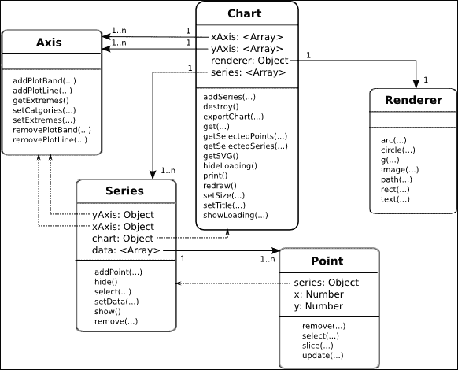

`Chart` 类是表示整个图表对象的顶层类。它包含操作整个图表的方法调用——例如，将图表导出为 SVG 或其他图像格式以及设置图表的维度。`Chart` 类具有多个 `Axis` 和 `Series` 对象数组；也就是说，一个图表可以有一个或多个 *x* 轴、*y* 轴和系列。`Renderer` 类是一个实用类，每个图表都有一个一对一的关系，并为基于 SVG 和 VML 的浏览器提供绘制的一个通用接口。

`Series` 类包含一个 `Point` 对象数组。该类具有指向 `Chart` 和 `Axis` 对象的回引用属性（参见前一个图中的虚线）并提供管理其 `Point` 对象列表的函数。在 `Series` 类中，`yAxis` 和 `xAxis` 属性是必要的，因为图表可以拥有多个轴。

`Point` 类只是一个包含 x 和 y 值以及对其序列对象的反向引用的简单对象（见虚线）。API 用于管理图表中的数据点。

## Highcharts 构造函数 – Highcharts.Chart

不言而喻，API 中最重要的方法是 `Highcharts.Chart` 方法，我们之前已经看到了很多关于这个构造函数的用法。然而，这个构造函数调用还有更多内容。`Highcharts.Chart` 创建并返回一个图表对象，但它还有一个名为 `callback` 的第二个可选参数：

```js
Chart(Object options, [ Function callback ])
```

当图表创建并渲染时，会调用回调函数。在函数内部，我们可以调用组件方法或访问图表对象内的属性。新创建的图表对象通过唯一的回调函数参数传递。我们还可以在回调函数内部使用 `this` 关键字，它也指向图表对象。我们可以在 `chart.events.load` 处理程序内部声明代码，而不是使用 `Highcharts.Chart` 回调参数，这将在下一章中探讨。

## 在 Highcharts 组件中导航

为了使用 Highcharts API，我们必须在类层次结构中导航到正确的对象。有几种方法可以在图表对象内部进行遍历：通过图表层次结构模型，直接使用 `Chart.get` 方法检索组件，或者两者的组合。

### 使用对象层次结构

假设图表对象已创建，如下所示：

```js
<script type="text/javascript">
  $(document).ready(function() {
    var chart = new Highcharts.Chart({
      chart: {
          renderTo: "container"
      },
      yAxis: [{
        min: 10,
        max: 30
      }, {
        min: 40,
        max: 60
      }],
      series: [{
        data: [ 10, 20 ]
      }, {
        data: [ 50, 70 ],
        yAxis: 1
      }],
      subtitle: {
          text: "Experiment Highcharts APIs"
      }

    });
  }, function() {
   ...
  });
</script>
```

然后，我们可以通过索引 0 从图表中访问序列对象的第一个位置。在回调处理程序内部，我们使用 `this` 关键字如下引用图表对象：

```js
var series = this.series[0];
```

假设配置中有两个 *y* 轴。要检索第二个 *y* 轴，我们可以这样做：

```js
var yAxis = this.yAxis[1];
```

要从第二个序列中检索第三个数据点对象，请输入以下内容：

```js
var point = this.series[1].data[2];
```

假设页面上创建了多个图表，可以通过 Highcharts 命名空间访问图表对象：

```js
var chart = Highcharts.charts[0];
```

我们还可以通过 `container` 选项检索图表的容器元素：

```js
var container = chart.container;
```

要检查创建的图表的选项结构，请使用 `options` 属性：

```js
// Get the chart subtitle
var subtitle = chart.options.subtitle.text;
```

### 使用 Chart.get 方法

我们可以直接使用 `Chart.get` 方法检索组件，而不是沿着对象层次结构向下遍历（`get` 方法仅在图表级别可用，不在每个组件类中）。通过 ID 分配组件将允许您使用 `get` 方法直接访问它们，而不是遍历对象的层次结构节点。配置使用选项键 `id`，因此此值必须是唯一的。

假设我们已使用以下配置代码创建了一个图表：

```js
xAxis: {
  id: 'xAxis',
  categories: [ ... ]
},
series: [{
  name: 'UK',
  id: 'uk',
  data: [ 4351, 4190, 
      { y: 4028, id: 'thirdPoint' }, 
      ... ]
}]
```

我们可以按以下方式检索组件：

```js
var series = this.get('uk');
var point = this.get('thirdPoint');
var xAxis = this.get('xAxis');
```

如果之前没有配置 `id` 选项，我们可以使用 JavaScript `filter` 方法根据属性搜索项目：

```js
this.series.filter(function(elt) {return elt.name == 'uk';})[0];
```

### 使用对象层次结构和 Chart.get 方法

为图表中的每个组件定义`id`选项很麻烦。作为替代，我们可以使用两种方法中的任何一种来遍历组件，如下所示：

```js
var point = this.get('uk').data[2];
```

# 使用 Highcharts API

在本节中，我们将使用 jQuery、jQuery UI 和 Highcharts 构建一个示例，以探索每个组件的 API。从现在开始的所有示例代码都将使用对象层次结构来访问图表组件，即`chart.series[0].data[0]`。这里使用的用户界面外观非常简洁，远非完美，因为这项练习的主要目的是检查 Highcharts API。

首先，让我们看看这个用户界面的用法；然后我们将剖析代码以了解操作是如何执行的。以下是在本节中创建的最终 UI 截图：

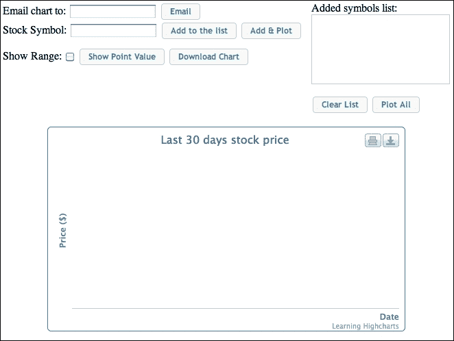

这是一个简单的 Web 前端，用于绘制过去 30 天的股票数据图表。顶部是一组按钮，用于设置股票符号、获取股票价格和通过下载或电子邮件检索图表图像。**添加到列表**按钮用于直接将股票符号添加到列表中，而无需获取股票价格和绘制数据。**绘制所有**按钮用于从符号列表中同时启动多个股票价格查询，并在所有结果到达时绘制数据。或者，**添加并绘制**是一个快速选项，用于绘制单个股票符号。

下半部分包含一个我们已经创建的图表。图表以空数据和带有标题的轴（将`showAxes`选项设置为`true`）显示。整个想法是重用现有的图表，而不是每次新结果到来时都重新创建一个新的图表对象。因此，当图表被销毁和创建时没有闪烁效果，它看起来像是一个平滑的更新动画。这也提供了更好的性能，无需运行额外的代码来重新生成图表对象。

此示例也可在[`www.joekuan.org/Learning_Highcharts/Chapter_10/Example_1.html`](http://www.joekuan.org/Learning_Highcharts/Chapter_10/Example_1.html)在线获取。

## 图表配置

以下是用作示例的图表配置。一旦执行股票查询，服务器端脚本将请求过去 30 天的股票价格，并将结果格式化为以毫秒为单位的日单位。因此，*x*轴被配置为以每日为基础的`datetime`类型：

```js
    var chart = new Highcharts.Chart({
      chart: {
        renderTo: 'container',
        showAxes: true,
        borderWidth: 1
      },
      title: { text: 'Last 30 days stock price' },
      credits: { text: 'Learning Highcharts' },
      xAxis: {
        type: 'datetime',
        tickInterval: 24 * 3600 * 1000,
        dateTimeLabelFormats: { day: '%Y-%m-%d' },
        title: {
          text: 'Date',
          align: 'high'
        },
        labels: {
          rotation: -45,
          align : 'center',
          step: 2,
          y: 40,
          x: -20
        }
      },
      yAxis: {
        title: { text: 'Price ($)' }
      },
      plotOptions: {
        line: { allowPointSelect: true }
      }
     });
```

## 使用 Ajax 获取数据并在 Chart.addSeries 中显示新的系列

让我们检查**添加并绘制**按钮背后的动作，如下所示 HTML 语法：

```js
Stock Symbol: <input type=text id='symbol' /> 
<input type='button' value='Add to the list' id='addStockList' /> <input type='button' value='Add &amp; Plot' id='plotStock'>
....
Added symbols list:
<ol id='stocklist'>
</ol>
```

按钮动作的 jQuery 代码如下：

```js
   $('#plotStock').button().click( 
     function(evt) {

      // Get the input stock symbol, empty the 
      // list andinsert the new symbol into the list
      $('#stocklist').empty();
      var symbol = $('#symbol').val();
           $('#stocklist').append($("<li/>").append(symbol)); 

      // Kick off the loading screen
      chart.showLoading("Getting stock data ....");

      // Launch the stock query
      $.getJSON('./stockQuery.php?symbol=' + 
                   symbol.toLowerCase(),
           function(stockData) {
             // parse JSON response here
             .....
           }
      );
     }
   );
```

之前的代码定义了**添加 & 绘制**按钮的点击事件的处理器。首先，它会清空股票符号列表框中所有 ID 为`stocklist`的条目。然后，它从输入字段`symbol`中检索股票符号值并将其添加到列表中。下一步是通过调用`chart.showLoading`方法在图表上启动一个加载信息屏幕。以下截图显示了加载信息屏幕：

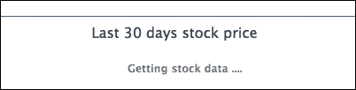

下一个调用是启动一个 jQuery Ajax 调用，`$.getJSON`，以查询股票价格。`stockQuery.php`服务器脚本（当然，可以使用任何其他服务器端语言）执行两个任务：它将符号解析为组织的全名，从另一个网站（[`ichart.finance.yahoo.com/table.csv?s=BATS.L`](http://ichart.finance.yahoo.com/table.csv?s=BATS.L)）查询过去的股票价格数据，然后将数据打包成行并编码成 JSON 格式。以下是在`stockQuery.php`文件中的代码：

```js
<?php
  $ch = curl_init();
  curl_setopt($ch, CURLOPT_RETURNTRANSFER, true);

  // Get the stock symbol name
  curl_setopt($ch, CURLOPT_URL, "http://download.finance.yahoo.com/d/quotes.csv?s={$_GET['symbol']}&f=n");
  $result = curl_exec($ch);
  $name = trim(trim($result), '"');

  // Get from now to 30 days ago
  $now = time();
  $toDate = localtime($now, true);
  $toDate['tm_year'] += 1900;
  $fromDate = localtime($now - (86400 * 30), true);
  $fromDate['tm_year'] += 1900;
  $dateParams = "a={$fromDate['tm_mon']}&b={$fromDate['tm_mday']}&c={$fromDate['tm_year']}" ."&d={$toDate['tm_mday']}&e={$toDate['tm_mday']}&f={$toDate['tm_year']}";

  curl_setopt($ch, CURLOPT_URL, "http://ichart.finance.yahoo.com/table.csv?s={$_GET['symbol']}&{$dateParams}&g=d");
  $result = curl_exec($ch);
  curl_close($ch);

  // Remove the header row
  $lines = explode("\n", $result);
  array_shift($lines);

  $stockResult['rows'] = array();
  // Parse the result into dates and close value
  foreach((array) $lines as $ln) {
    if (!strlen(trim($ln))) {
      continue;
    }
    list($date, $o, $h, $l, $c, $v, $ac) = 
      explode(",", $ln, 7);
    list($year, $month, $day) = explode('-', $date, 3);
    $tm = mktime(12, 0, 0, $month, $day, $year);
    $stockResult['rows'][] = 
      array('date' => $tm * 1000, 
         'price' => floatval($c));
  }

  $stockResult['name'] = $name;
  echo json_encode($stockResult);
?>
```

以下是从服务器端以 JSON 格式返回的结果：

```js
{"rows":[ {"date":1348138800000,"price":698.7},
     {"date":1348225200000,"price":700.09},
     ... ],
 "name": "Apple Inc."
}
```

一旦 JSON 结果到达，数据就会被传递到`getJSON`处理器的定义中，并解析成一个行数组。以下是对处理器代码的详细说明：

```js
$.getJSON('./stockQuery.php?symbol=' + 
     symbol.toLowerCase(),
     function(stockData) {

         // Remove all the chart existing series
         while (chart.series.length) {
             chart.series[0].remove();
         }

         // Construct series data and add the series
         var seriesData = [];
         $.each(stockData.rows, 
             function(idx, data) {
                 seriesData.push([ data.date, data.price ]);
             }
         );

         var seriesOpts = {
             name: stockData.name + ' - (' + symbol +')',
             data: seriesData,

             // This is to stop Highcharts rotating
             // the color and data point symbol for
             // the series
             color: chart.options.colors[0],
             marker: {
                 symbol: chart.options.symbols[0]
             }
         };

         chart.hideLoading();
         chart.addSeries(seriesOpts);
     }
);
```

首先，我们通过调用`Series.remove`移除图表中显示的所有现有系列。然后，我们构建一个包含日期（UTC 时间）和价格的数据数组的系列选项。然后，我们通过调用`Chart.hideLoading`移除加载屏幕，并使用`Chart.addSeries`方法显示一个新的系列。唯一的小问题是，当系列被重新插入时，系列的默认颜色和点标记会改变；当系列被移除并重新添加到图表中时，`chart.options.colors`和`chart.options.symbols`中的内部索引会增加。我们可以显式设置系列颜色和点符号来解决这个问题。

或者，我们可以调用`Series.setData`以实现相同的结果，但是一旦分配了系列（主题）的名称并创建了系列，就不允许更改。因此，我们在这个例子中坚持使用`Chart.addSeries`和`Series.remove`。

以下是一个单个股票查询的截图：

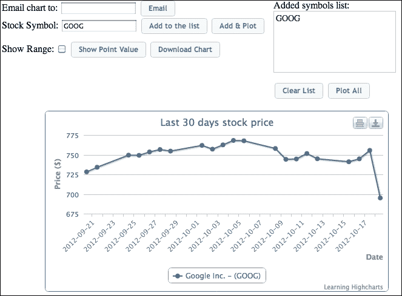

## 使用同时进行的 Ajax 调用显示多个系列

下一个部分是探索如何同时启动多个 Ajax 查询，并在所有结果都返回后一起绘制系列。实现方式基本上与绘制单个股票查询相同，只是我们在收集结果的同时构建系列数组选项，并在最后一个结果到达时才绘制它们：

```js
// Query all the stocks simultaneously and 
// plot multipleseries in one go
$('#plotAll').button().click( 

  function(evt) {

    // Kick off the loading screen
    chart.showLoading("Getting multiple stock data ....");

    // Get the list of stock symbols and launch 
    // the query foreach symbol 
    var total = $('#stocklist').children().length;

    // start Ajax request for each of the items separately
      $.each($('#stocklist').children(), 
      function(idx, item) {
       var symbol = $(item).text();
       $.getJSON('./stockQuery.php?symbol=' +
         symbol.toLowerCase(),
              function(stockData) {

          // data arrives, buildup the series array
          $.each(stockData.rows, 
            function(idx, data) {
             $.histStock.push([ data.date,
                      data.price ]);
            }
          );

          seriesOpts.push({
           name: stockData.name + ' - (' +       
              symbol +')',
           data: $.histStock,
           // This is to stop Highcharts 
           // rotating the colorfor the series
           color: chart.options.colors[idx],
           marker: {
             symbol: chart.options.symbols[idx]
           }
          });

          // Plot the series if this result 
          // is the last one
          if (seriesOpts.length == total) {

            // Remove all the chart existing series
            while (chart.series.length) {
              chart.series[0].remove()
            }

            chart.hideLoading();
            $.each(seriesOpts, 
              function(idx, hcOption) {
               chart.addSeries(hcOption, 
                       false);
              }
            );

            chart.redraw();
                } // else – do nothing, 
          // not all results came yet 
         } // function(stockData) 
        ); // getJSON
     }); // $.each($('#stocklist')
    }); // on('click'
```

`Chart.addSeries`的第二个布尔参数`redraw`被传递为`false`。相反，我们通过一个单一的调用`Chart.redraw`来最终化所有更新，以节省 CPU 时间。以下是多个股票查询的截图：

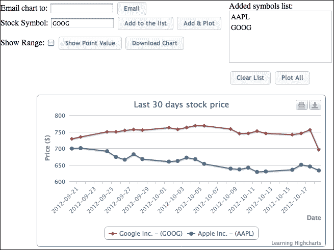

## 使用 Chart.getSVG 提取 SVG 数据

在本节中，我们将学习如何提取图表输出并通过电子邮件或文件下载来交付。虽然我们可以依赖导出模块并调用`exportChart`方法将图表导出为所需的图像格式，但了解从格式化原始 SVG 内容到创建图像文件的全过程将更有益。之后，只需在服务器端调用不同的实用工具来交付图像文件即可。

要从显示的图表中提取 SVG 下面的数据，需要调用`getSVG`方法，该方法在导出模块加载时可用。此方法类似于`exportChart`：它接受`chartOptions`参数，该参数用于将配置应用到导出图表输出。

这是处理**下载**和**电子邮件**按钮的客户端 jQuery 代码。

在这里，我们使用`protocol`变量来指定图表的动作，并且两个按钮都调用定义的通用函数`deliverChart`：

```js
 // Export chart into SVG and deliver it to the server
 function deliverChart(chart, protocol, target) {

   // First extracts the SVG markup content from the
   // displayed chart
   var svg = chart.getSVG();

   // Send the whole SVG to the server and url
   $.post('./deliverChart.php', {
       svg: svg,
       protocol: protocol,
       target: target
     },
     function(result) {
       var message = null;
       var title = null;

       switch (protocol) {

         // Create a dialog box to show the 
         // sent status
         case 'mailto':
           message = result.success ? 
            'The mail has been sent successfully' : 
            result.message;
           title = 'Email Chart';
           break;

         // Uses hidden frame to download the 
         // image file created on the server side
         case 'file':        
           // Only popup a message if error occurs
           if (result.success) {
             $('#hidden_iframe').attr("src",
                      "dlChart.php");
           } else {
             message = result.message;
             title = 'Download Chart';
           }
           break;
       }

       if (message) {
         var msgDialog = $('#dialog');
         msgDialog.dialog({ autoOpen: false, 
           modal: true, title: title});
         msgDialog.text(message);
         msgDialog.dialog('open');
       }
   }, 'json');
 }
```

`deliverChart`方法首先调用 Highcharts API 的`getSVG`来提取 SVG 内容，然后使用 SVG 数据和动作参数启动一个`POST`调用。当`$.post`返回任务状态值时，它会显示一个消息对话框。至于下载图表，我们在任务状态值成功返回时创建一个隐藏的`<iframe>`来下载图表图像文件。

以下是将 SVG 内容转换为并交付导出文件的简单服务器端脚本：

```js
<?php
$svg = $_POST['svg'];
$protocol = $_POST['protocol'];
$target = $_POST['target'];

function returnError($output) {
  $result['success'] = false;
  $result['error'] = implode("<BR/>", $output);
  echo json_encode($result);
  exit(1);
}

// Format the svg into an image file
file_put_contents("/tmp/chart.svg", $svg);
$cmd = "convert /tmp/chart.svg /tmp/chart.png";
exec($cmd, $output, $rc);
if ($rc) {
  returnError($output);
}

// Deliver the chart image file according to the url
if ($protocol == 'mailto') {

  $cmd = "EMAIL='{$target}' mutt -s 'Here is the chart' -a /tmp/chart.png -- {$protocol}:{$target} <<.
Hope you like the chart
.";

  exec($cmd, $output, $rc);
  if ($rc) {
   returnError($output);
  }
  $result['success'] = true;

} else if ($protocol == 'file') {
  $result['success'] = true;
}

echo json_encode($result);
?>
```

### 注意

网络服务器运行在 Linux 平台（Ubuntu 12.04）上。至于电子邮件操作，我们使用两个命令行工具来帮助我们。第一个是一个快速图像转换工具**convert**，它是**ImageMagick**包的一部分（更多详情请访问[`www.imagemagick.org/script/index.php`](http://www.imagemagick.org/script/index.php)）。在脚本中，我们将从`POST`参数中保存 SVG 数据到一个文件，然后运行 convert 工具将其格式化为 PNG 图像。convert 工具支持许多其他图像格式，并附带了许多高级功能。或者，我们可以使用 Batik 通过以下命令进行直接的转换：

```js
java -jar batik-rasterizer.jar /tmp/chart.svg

```

给定的命令还可以将 SVG 文件转换为`/tmp/chart.png`并自动输出。为了快速实现电子邮件功能，我们将启动一个电子邮件工具**mutt**（更多详情请访问[`www.mutt.org`](http://www.mutt.org)），而不是使用 PHP 邮件扩展。一旦 PNG 图像文件创建完成，我们使用 mutt 将其作为附件发送，并使用 heredoc 指定消息正文。

### 小贴士

**heredoc** 是在 Unix 命令行中快速输入带有换行和空格的字符串的一种方法。请参阅 [`en.wikipedia.org/wiki/Here_document`](http://en.wikipedia.org/wiki/Here_document)。

以下是被发送的电子邮件的截图：

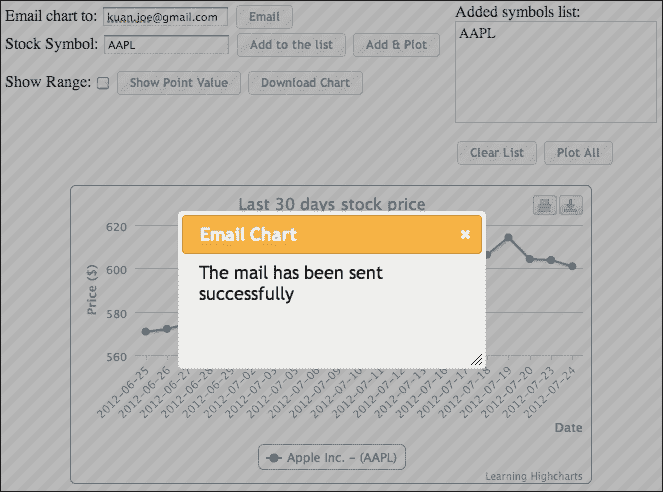

以下是我电子邮件账户中收到的附件电子邮件的截图：

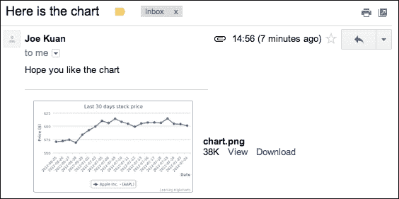

## 选择数据点和添加绘图线

接下来是实现 **显示范围** 复选框和 **显示点值** 按钮。**显示范围** 选项在图表的最高点和最低点显示绘图线，而 **显示点值** 选项在选中一个点时在左下角显示一个包含值的框。以下截图展示了如何在图表中同时启用这两个功能：

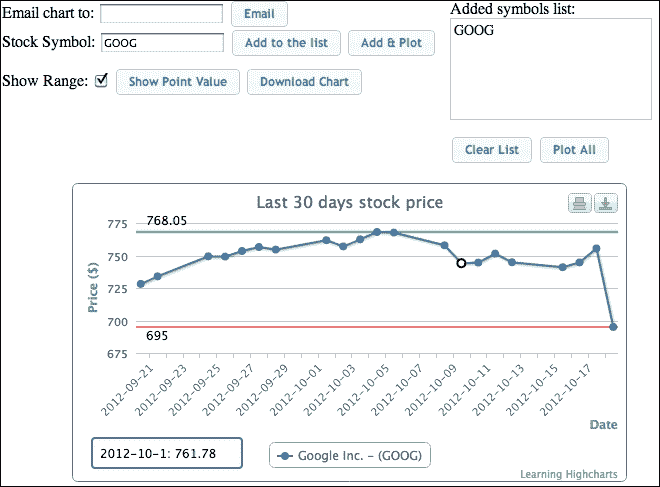

### 注意

虽然对于 **显示点值** 复选框来说，显示选中的点显示更为自然，但这将成为每个点选择事件的回调实现。相反，我们在这里使用一个按钮，这样我们就可以直接调用 `Chart.getSelectedPoints` 方法。

### 使用 Axis.getExtremes 和 Axis.addPlotLine

`Axis.getExtremes` 方法不仅返回轴当前显示的最小和最大范围，还包括数据点的最高和最低值。在这里，我们使用该方法与 `Axis.addPlotLine` 函数结合，在 *y* 轴上添加一对绘图线。`addPlotLine` 例程期望一个绘图线配置。

在这个例子中，我们指定了一个数据标签以及一个 `id` 名称，这样我们就可以在未勾选 **显示范围** 选项或需要用新值重新显示绘图线时，同时移除高点和低点的线条。以下是为 **显示范围** 动作编写的代码：

```js
  // Show the highest and lowest range in the plotlines. 
  var showRange = function(chart, checked) {
    if (!chart.series || !chart.series.length) {
        return;  
    }

    // Checked or not checked, we still need to remove
    // any existing plot lines first
    chart.yAxis[0].removePlotLine('highest');
    chart.yAxis[0].removePlotLine('lowest');

    if (!checked) {
      return;
    }

    // Checked - get the highest & lowest points
    var extremes = chart.yAxis[0].getExtremes();

    // Create plot lines for the highest & lowest points 
    chart.yAxis[0].addPlotLine({
      width: 2,
      label: {
        text: extremes.dataMax,
        enabled: true,
        y: -7
      },
      value: extremes.dataMax,
      id: 'highest',
      zIndex: 2,
      dashStyle: 'dashed',
      color: '#33D685'
    });

    chart.yAxis[0].addPlotLine({
      width: 2,
      label: {
        text: extremes.dataMin,
        enabled: true,
        y: 13
      },
      value: extremes.dataMin,
      zIndex: 2,
      id: 'lowest',
      dashStyle: 'dashed',
      color: '#FF7373'
    });
  };
```

### 使用 Chart.getSelectedPoints 和 Chart.renderer 方法

**显示点值** 按钮利用 `Chart.getSelectedPoints` 方法检索当前选中的数据点。请注意，此方法需要首先启用系列选项 `allowPointSelect`。一旦选中数据点并点击 **显示点值** 按钮，我们使用 `Chart.renderer` 方法提供的函数来绘制一个类似工具提示的框，显示选中的值。我们可以使用 `Renderer.path` 或 `Renderer.rect` 方法来绘制圆角框，然后使用 `Renderer.text` 方法来绘制数据值。

### 小贴士

Highcharts 也支持多数据点选择，可以通过按住 *Ctrl* 键并单击鼠标左键来实现。

此外，我们使用 `Renderer.g` 例程将 SVG 框和值字符串组合在一起，并将生成的组元素添加到图表中。这样做的原因是，我们可以通过删除整个旧组对象而不是每个单独的元素来重新显示带有新值的框：

```js
 $('#showPoint').button().click(function(evt) {
   // Remove the point info box if exists 
   chart.infoBox && (chart.infoBox =
            chart.infoBox.destroy());

   // Display the point value box if a data point 
   // is selected
   var selectedPoint = chart.getSelectedPoints();
   var r = chart.renderer;
   if (selectedPoint.length) {
     chart.infoBox = r.g();
     r.rect(20, 255, 150, 30, 3).attr({
       stroke: chart.options.colors[0],
       'stroke-width': 2,
       fill: 'white'
     }).add(chart.infoBox);

     // Convert selected point UTC value to date string
     var tm = new Date(selectedPoint[0].x);
     tm = tm.getFullYear() + '-' + 
       (tm.getMonth() + 1) + '-' + tm.getDate();
     r.text(tm + ': ' + selectedPoint[0].y, 
       28, 275).add(chart.infoBox);
     chart.infoBox.add();
   }
 });
```

Highcharts 的`Renderer`类还提供了其他方法来在图表上绘制简单的 SVG 形状，例如`arc`、`circle`、`image`、`rect`、`text`、`g`和`path`。对于更复杂的形状，我们可以使用`path`方法，它接受 SVG 路径语法，并在 VML 路径上有有限的兼容性。此外，`Renderer`类可以独立于图表使用——也就是说，我们可以在创建图表之前调用`Renderer`类的各种方法，并将 SVG 内容添加到 HTML 元素中：

```js
var renderer = new Highcharts.Renderer($('#container')[0], 200, 100);
```

这创建了一个`Renderer`对象，它允许我们在`container`元素内部创建 SVG 元素，其面积为 200 像素宽和 100 像素高。

## 探索系列更新

系列更新是在图表中执行的最频繁的任务之一。在本节中，我们将以高清晰度研究它。在 Highcharts 中，有几种更新系列的方法。通常，我们可以从系列或数据点级别更新系列。然后，更新方法本身可以是实际更改值，也可以是重新插入它。我们将讨论每种方法，并创建一个综合示例来实验所有技术。

为了比较每种方法，我们将继续使用股票市场数据，但这次我们将改变用户界面以启用回放历史股票价格。以下是示例操作的截图：

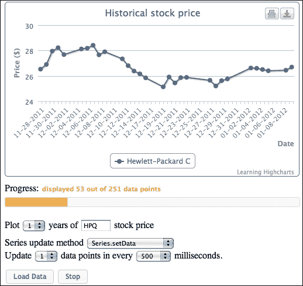

如我们所见，有多个选择框可供选择：要回放多少年的历史股票价格，每次迭代中要更新多少个数据点，以及每次更新之间的等待时间有多长。最重要的是，我们可以选择应该使用哪种系列更新方法；观察它们在整个回放过程中的行为差异很有趣，特别是观察它们的行为差异。这个演示也发布在我的网站上，[`www.joekuan.org/Learning_Highcharts/Chapter_10/Example_2.html`](http://www.joekuan.org/Learning_Highcharts/Chapter_10/Example_2.html)。我强烈推荐读者尝试一下。在我们深入研究每种更新方法之前，让我们找出如何构建这个连续系列更新过程。

### 连续系列更新

一旦我们输入股票代码并选择要回放多少年的股票价格，我们就可以点击**加载数据**按钮来检索价格数据。一旦数据到达，就会弹出一个带有**开始**按钮的确认对话框来启动过程。以下是为**开始**按钮的动作代码：

```js
 // Create a named space to store the current user
 // input field values and the timeout id
 $.histStock = {};

 $('#Start').button().click(function() {

   chart.showLoading("Loading stock price ... "); 

   // Remove old timeout if exists
   $.histStock.timeoutID && 
     clearTimeout($.histStock.timeoutID);

   var symbol = 
     encodeURIComponent($('#symbol').val().toLowerCase());
   var years = encodeURIComponent($('#years').val());

   // Remember current user settings and initialise values
   // for the run
   $.histStock = {
     // First loop start at the beginning
     offset: 0,
     // Number of data pts to display in each iteration
     numPoints: 30,
     // How long to wait in each iteration
     wait: parseInt($('#updateMs').val(), 10),
     // Which Highcharts method to update the series
     method: $('#update').val(),
     // How many data points to update in each iteration
     update: parseInt($('#updatePoints').val(), 10)
   };

   // Clean up old data points from the last run
   chart.series.length && chart.series[0].setData([]);

   // Start Ajax query to get the stock history
   $.getJSON('./histStock.php?symbol=' + symbol + 
        '&years=' + years,
     function(stockData) {
       // Got the whole period of historical stock data
       $.histStock.name = stockData.name;
       $.histStock.data = stockData.rows;

       chart.hideLoading();
       // Start the chart refresh
       refreshSeries();
     }
   );
 })
```

我们首先在 jQuery 命名空间下创建一个变量`histStock`，该变量在演示的各个部分中被访问。`histStock`变量包含当前用户的输入和刷新任务的引用。任何来自用户界面的更改都会更新`$.histStock`，因此系列更新会相应地响应。

基本上，当点击**开始**按钮时，我们初始化`$.histStock`变量，并使用股票符号和年数参数启动一个 Ajax 查询。然后，当查询返回股票价格数据时，我们将结果存储到变量中。我们随后调用`refreshSeries`，它通过定时器例程调用自身。以下代码是该方法的简化版本：

```js
var refreshSeries = function() {
  var i = 0, j;

  // Update the series data according to each approach
  switch ($.histStock.method) {
    case 'setData':
       .... 
    break;
    case 'renewSeries':
       .... 
    break;
    case 'update':
       .... 
    break;
    case 'addPoint':
       .... 
    break;
  }

  // Shift the offset for the next update
  $.histStock.offset += $.histStock.update; 

  // Update the jQuery UI progress bar
  ....

  // Finished 
  if (i == $.histStock.data.length) {
    return;
  }

  // Setup for the next loop
  $.histStock.timeoutID = 
       setTimeout(refreshSeries, $.histStock.wait);
};
```

在`refreshSeries`内部，它检查`$.histStock`变量内的设置，并根据用户的选择更新系列。一旦更新完成，我们就增加`offset`值，这是将股票结果数据复制到图表的起始位置。如果计数器变量`i`达到股票数据的末尾，它将简单地退出方法。否则，它将调用 JavaScript 定时器函数来设置下一个循环。下一个目标是回顾每种更新方法是如何执行的。

## 测试各种 Highcharts 方法的性能

更新系列数据有四种技术：`Series.setData`、`Series.remove`/`Chart.addSeries`、`Point.update`和`Series.addPoint`。我们使用资源监视器工具测量所有四种技术在 CPU 和内存使用方面的性能。每种方法在回放过去一年的股票价格时都会被计时，每次更新之间有 0.5 秒的等待时间。我们重复进行了两次相同的运行，并记录了平均值。实验在 Firefox、Chrome、Internet Explorer 8 和 11 以及 Safari 等浏览器上进行了重复。尽管 IE 8 不支持 SVG，只支持 VML，但在实验中使用它很重要，因为 Highcharts 的实现与 IE 8 兼容。我们立刻注意到，在 IE8 上显示的相同图表不如 SVG 吸引人。

### 注意

整个实验在一个安装了 Windows 7 Ultimate 的 PC 上运行，硬件配置为 4GB RAM Core 2 Duo 3.06 GHz，并配备了 Intel G41 显卡芯片组。

浏览器版本包括 Firefox 31.0、Chrome 36.0.1985、IE11 11.0.9600、Safari 5.1.7 以及 IE8 8.0.6001。Safari 可能不是一个真正的性能指标，因为它对于一个 PC 平台来说相对较旧。

由于微软已经停止支持，现在在 Windows 7 上安装/运行 IE8 不再可能。虽然我们可以在 IE11 上设置用户代理为 IE8 并执行实验，但这并不能真正反映 IE8 的性能。因此，我们设置了一个运行 Windows XP 且硬件相同的系统，上面安装了 IE8。

在接下来的章节中，将解释每个系列更新方法，并展示不同浏览器之间的性能比较。读者不应将结果作为浏览器一般性能的指南，因为浏览器的一般性能是通过在多个领域的众多测试中得出的。我们在这里实验的是 Highcharts 在各个浏览器上针对 SVG 动画的性能。

### 注意

注意，与上一版中展示的结果相比，结果有所不同。这主要是因为使用了更新版本的 Highcharts：我们在这次实验中使用的是 4.0.3，而上一版中记录的是 2.2.24。

### 使用 Series.setData 应用新数据集

我们可以使用`Series.setData`方法将一组新数据应用到现有的系列上：

```js
setData (Array<Mixed> data, [Boolean redraw])
```

数据可以是一维数据的数组，x 和 y 值对的数组，或者数据点对象的数组。请注意，这种方法是所有方法中最简单的一种，并且根本不提供任何动画效果。以下是我们如何在示例中使用`setData`函数：

```js
  case 'setData':
    var data = [];

    // Building up the data array in the series option
    for (i = $.histStock.offset, j = 0; 
       i < $.histStock.data.length && 
       j < $.histStock.numPoints; i++, j++) {
      data.push([ 
        $.histStock.data[i].date,
        $.histStock.data[i].price ]);
    }

    if (!chart.series.length) {

      // Insert the very first series
      chart.addSeries({
        name: $.histStock.name,
        data: data    
      });
    } else {

      // Just update the series with 
      // the new data array
      chart.series[0].setData(data, true);
    }
    break;
```

图表中出现了两组动画：*x*轴标签从图表中心移动，以及系列中的数据点。尽管系列滚动得很平滑，但*x*轴标签的移动看起来太快，变得断断续续。以下图表显示了使用`setData`方法在浏览器之间性能比较：

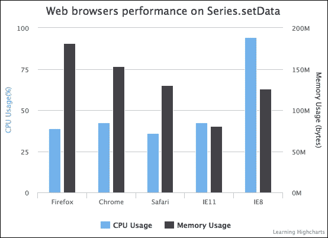

在 CPU 使用方面，除了运行在 VML 而不是 SVG 上的 IE8 之外，存在一些细微的差异。IE8 消耗了更高的 CPU 使用率，并且完成时间更长。在整个实验过程中，动画都出现了滞后。在所有浏览器中，Safari 的表现略好。在所有浏览器中，Firefox 的内存占用最大，而 IE 11 的内存占用最小。也许一个轻微的惊喜是，Safari 的性能优于 Firefox，并且也非常接近 Chrome。

### 使用 Series.remove 和 Chart.addSeries 重新插入带有新数据的系列

或者，我们可以使用`Series.remove`方法删除整个系列，然后用数据和系列选项重建系列，最后使用`Chart.addSeries`重新插入一个新的系列。这种方法的一个缺点是，默认颜色和点符号的内部索引会增加，正如我们在早期示例中发现的那样。我们可以通过指定颜色和标记选项来补偿这一点。以下是`addSeries`方法的代码：

```js
  case 'renewSeries':
    var data = [];
    for (i = $.histStock.offset, j = 0; 
       i < $.histStock.data.length && 
       j < $.histStock.numPoints; i++, j++) {
      data.push([ $.histStock.data[i].date, 
            $.histStock.data[i].price ]);
    }
    // Remove all the existing series
    if (chart.series.length) {
      chart.series[0].remove();
    }

    // Re-insert a new series with new data
    chart.addSeries({
      name: $.histStock.name,
      data: data,
      color: chart.options.colors[0],
      marker: {
        symbol: chart.options.symbols[0]
      }
    });
    break;
```

在这个实验中，我们使用每半秒的刷新率，这比默认动画的时间跨度要短。因此，系列更新看起来没有多少动画，就像在`setData`中一样，显得不规则。然而，如果我们把刷新率改为 3 秒或更长，那么我们就可以看到每次更新时系列从左侧到右侧的重绘。与其它方法不同，x 轴标签的更新没有任何动画：

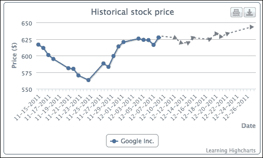

以下图表显示了使用`addSeries`方法在浏览器之间性能比较：

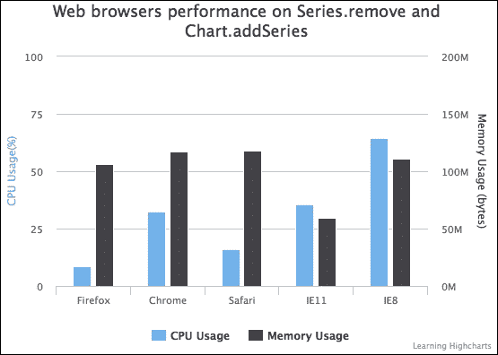

由于这种方法似乎动画最少，因此所有浏览器的 CPU 使用率水平相对较低，内存使用也是如此。正如预期的那样，IE8 消耗的资源最多。其次是 IE11，其性能与 Chrome 大致相当。最不寻常的结果是，当动画较少时，Firefox 的 CPU 使用量比 Chrome 和 Safari 都要少得多。我们将在稍后的部分进一步调查这一点。

### 使用 Point.update 更新数据点

我们可以使用 `Point.update` 方法更新单个数据点。更新方法具有与 `setData` 相似的原型，它接受单个值、x 和 y 值的数组或数据点对象。每次更新调用都可以带动画或不带动画地重新绘制到图表中：

```js
update ([Mixed options], [Boolean redraw], [Mixed animation])
```

这里是如何使用 `Point.update` 方法的：我们遍历每个点对象并调用其成员函数。为了节省 CPU 时间，我们将 `redraw` 参数设置为 `false`，并在最后一个数据点更新后调用 `Chart.redraw`：

```js
  case 'update':
    // Note: Series can be already existed 
    // at start if we click 'Stop' and 'Start'
    // again
    if (!chart.series.length || 
        !chart.series[0].points.length) {
      // Build up the first series
      var data = [];
      for (i = $.histStock.offset, j = 0; 
         i < $.histStock.data.length && 
         j < $.histStock.numPoints; i++, j++) {
        data.push([ 
          $.histStock.data[i].date, 
          $.histStock.data[i].price ]); 
      }

      if (!chart.series.length) {
        chart.addSeries({
          name: $.histStock.name,
          data: data    
        });
      } else {
        chart.series[0].setData(data);
      }

    } else {
      // Updating each point
      for (i = $.histStock.offset, j = 0; 
         i < $.histStock.data.length && 
         j < $.histStock.numPoints; i++, j++) {
        chart.series[0].points[j].update([
          $.histStock.data[i].date,                         
          $.histStock.data[i].price ],
        false);
      }
      chart.redraw();
    }
    break;
```

`Point.update` 方法垂直动画每个数据点。随着图表的逐步更新，整体上产生波浪效果。与 `setData` 方法类似，标签以对角线方式接近 x 轴线。以下图表显示了 `Point.update` 方法在各个浏览器中的性能比较：

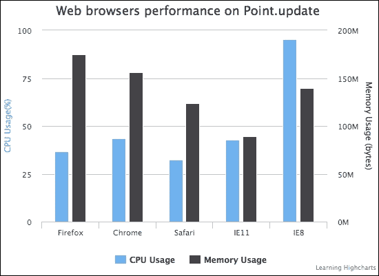

由于动画与 `setData` 方法几乎相同，因此前面图表中显示的性能与 `setData` 性能实验的结果非常接近。

### 使用 Point.remove 和 Series.addPoint 移除和添加数据点

我们不需要逐个更新每个数据点，可以使用 `Point.remove` 来从 `series.data` 数组中移除数据点，并使用 `Series.addPoint` 将新的数据点重新添加到系列中：

```js
remove ([Boolean redraw], [Mixed animation])
addPoint (Object options, [Boolean redraw], [Boolean shift], 
          [Mixed animation])
```

对于时间序列数据，我们可以使用 `addPoint` 并将 `shift` 参数设置为 `true`，这将自动移动系列点数组：

```js
  case 'addPoint':
    // Note: Series can be already existed at
    // start if we click 'Stop' and 'Start' again
    if (!chart.series.length || 
        !chart.series[0].points.length) {

      // Build up the first series
      var data = [];
      for (i = $.histStock.offset, j = 0; 
          i < $.histStock.data.length && 
        j < $.histStock.numPoints; i++, j++) {
        data.push([ 
          $.histStock.data[i].date,
          $.histStock.data[i].price ]); 
      }

      if (!chart.series.length) {
        chart.addSeries({
          name: $.histStock.name,
          data: data    
        });
      } else {
        chart.series[0].setData(data);
      }

      // This is different, we don't redraw 
      // any old points
      $.histStock.offset = i;

    } else {

      // Only updating the new data point
      for (i = $.histStock.offset, j = 0; 
        i < $.histStock.data.length && 
        j < $.histStock.update; i++, j++) {
        chart.series[0].addPoint([
          $.histStock.data[i].date, 
          $.histStock.data[i].price ],
          false, true );
      }
      chart.redraw();
    }
    break;
```

以下图表显示了 `addPoint` 方法在各个浏览器中的性能比较：

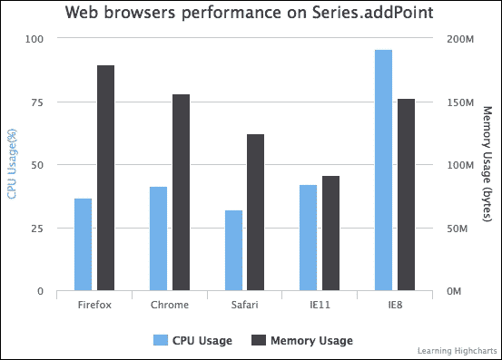

在 CPU 和内存使用方面，`addPoint` 方法、`setData` 和 `update` 几乎没有区别。

### 探索浏览器上的 SVG 动画性能

到目前为止，我们已经看到 CPU 使用率随着动画的增加而增加。然而，尚未回答的问题是为什么 Safari 的 CPU 消耗低于 Chrome 和 Firefox。在测试机器上运行了多个浏览器基准测试套件，以确认普遍共识，即 Firefox 和 Chrome 浏览器在整体性能上优于 Safari。

### 注意

所有浏览器都使用 SunSpider [`www.webkit.org/perf/sunspider/sunspider.html`](http://www.webkit.org/perf/sunspider/sunspider.html)、谷歌的 V8 基准测试套件 [`octane-benchmark.googlecode.com/svn/latest/index.html`](http://octane-benchmark.googlecode.com/svn/latest/index.html) 和 Peacekeeper [`peacekeeper.futuremark.com/`](http://peacekeeper.futuremark.com/) 进行基准测试。

尽管如此，Safari 在一个特定领域比其他浏览器有更好的性能：SVG 动画；这一点在我们之前的实验中已经体现出来。在这里，我们使用由 Cameron Adams 编写的基准测试，专门用于测量每秒帧数中的弹跳粒子 SVG 动画。这个测试（HTML5 与 Flash：动画基准测试 [`www.themaninblue.com/writing/perspective/2010/03/22/`](http://www.themaninblue.com/writing/perspective/2010/03/22/））最初是为了比较各种 HTML5 动画技术与 Flash 的。在这里，我们使用 Chrome 和 Safari 浏览器运行 SVG 测试。以下是在 500 个粒子测试下运行的 Safari 截图：

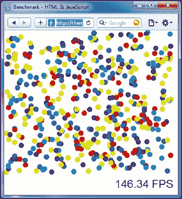

对于 Chrome，测试运行在大约 165 FPS。我们在两个浏览器上使用不同数量的粒子重复评估。以下图表总结了 SVG 动画方面的性能差异：

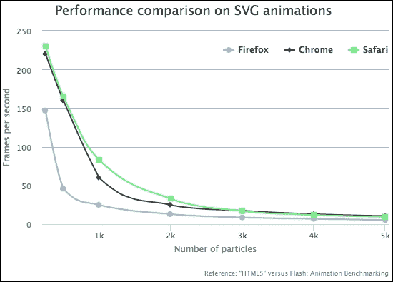

如我们所见，Safari 在粒子数少于 3,000 个时能够管理更高的帧率。之后，Safari 的性能开始与 Chrome 并行下降。Firefox 的帧率始终较低，并且与其他浏览器相比帧率下降得相当多。

这引出了另一个不可避免的问题：既然两个浏览器都运行在相同的 webkit 代码库上，为什么会有如此大的差异？很难确定差异所在。然而，这两个产品之间少数几个差异之一是 JavaScript 引擎，这可能会影响该区域，或者可能是由于 webkit 版本之间的微小差异造成的。此外，[`jsperf.com`](http://jsperf.com) 上也运行了其他特定的 SVG 性能测试，其中 Safari 再次比 Chrome 得分高。

在下一节中，我们将看到 Highcharts 的性能如何与数据大小相对应。

## 比较 Highcharts 在大型数据集上的性能

我们的最终测试是观察 Highcharts 在大型数据集上的表现。在这个实验中，我们将绘制不同数据大小的散点系列，并观察显示数据所需的时间。我们选择使用散点系列，因为当存在包含数万个样本的非常大的数据集时，用户很可能会在图表上仅绘制数据点。以下是说明我们如何操作的简化代码：

```js
var data = [];
// Adjust for each experiment
var num = 0;
if (location.match(/num=/)) {
   var numParam = location.match(/num=([^&]+)/)[1];
   num = parseInt(numParam, 10);
}
for (var i = 0; i < num; i ++) {
    data.push([ Math.random() * 1000000000, Math.random() * 50000 ]);
}

var start = new Date().getTime();
var chart = new Highcharts.Chart({
    chart: {
         renderTo: 'container',
         showAxes: true,
         animation: false,
         ....
    },
    series: [{
         type: 'scatter',
         data: data
    }],
    tooltips: {
         enabled: false
    },
    plotOptions: {
         series: {
             turboThreshold: 1,
             animation: false,
             enableMouseTracking: false
         }
    }
    }, function() {
         var stop = new Date().getTime();
         // Update the time taken label
         $('#time').append(((stop - start) / 1000) + " sec");
    });
```

页面通过 URL 参数加载，以指定数据集大小。我们在创建图表对象之前开始计时，并在构造函数中的 `Chart` 方法回调处理程序处停止。我们使用在之前的基准测试实验中使用的每个浏览器重复具有相同数据集大小的实验。一旦页面在浏览器上加载，数据集就会随机生成。然后，在图表对象构建之前开始计时，并在 Highcharts 中的回调方法处停止。当图表最终显示在屏幕上时，执行图表函数。以下截图显示了在 Safari 浏览器上显示 3,000 个数据点所需的时间：

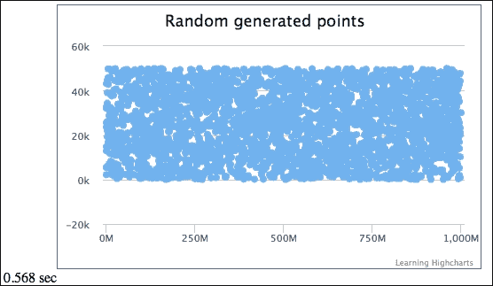

下面的图表说明了不同数据集大小下 Highcharts 在不同浏览器上的性能。线条越低，显示数据点数量所需的时间越少，这表明性能越好：

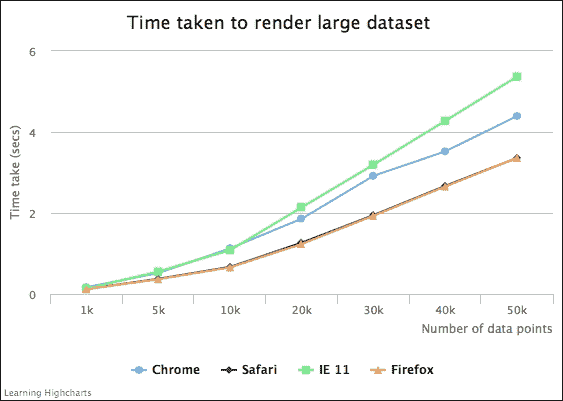

没有浏览器在显示大数据集时特别耗时。这显示了 Highcharts 令人印象深刻的可扩展性能。即使是所有测试中始终较慢的 IE 11，也只需 5.3 秒就能渲染 50,000 个数据点。至于较小的数据集，计时几乎没有差异。Firefox 和 Safari 的结果非常相似，尽管 Firefox 略好。这是因为散点系列中没有动画，Firefox 通常在没有 SVG 动画的情况下表现更好。这也支持我们在最不活跃的 `addSeries` 实验中的发现，其中 Firefox 需要更少的 CPU 使用量。至于 Chrome，其性能大致位于 Safari/Firefox 和 IE 11 之间。

从所有这些实验中，我们可以得出结论，Safari 在 Windows PC 上使用 Highcharts 时表现最佳，尤其是在图表中有大量 SVG 动画时。如果图表是静态的，那么 Firefox 会提供最佳性能。IE 11 在浏览器中具有最佳的内存利用率，但运行速度较慢。Chrome 实现了稳定的中间性能。我们必须强调，SVG 只是性能测试的许多领域之一，Chrome 在基准分数中优于其他浏览器。

# 摘要

在本章中，我们学习了 Highcharts API，从类模型到将其应用于应用程序。然后我们对 Highcharts 中更新图表系列的不同技术进行了全面研究，并进行了实验以分析它们的性能差异。最后，本章通过分析不同大小的大数据集在渲染数据点时的不同网页浏览器的速度来结束。

在下一章中，我们将探讨 Highcharts 事件处理，这与 Highcharts API 密切相关。
