# 第十一章。Highcharts 事件

在上一章中，我们学习了 Highcharts API。在本章中，我们将学习 Highcharts 事件处理。我们将从介绍 Highcharts 支持的事件集开始本章。然后，我们将构建两个网络应用程序来涵盖大多数事件；每个应用程序探索不同的事件集。尽管这些应用程序远非完美，并且有大量的改进空间，但唯一目的是演示 Highcharts 事件的工作原理。在本章中，我们将涵盖以下主题：

+   使用图表 `load` 事件启动 Ajax 查询

+   使用图表 `redraw` 事件激活用户界面

+   使用点 `select` 和 `unselect` 事件选择和取消选择数据点

+   使用图表选择事件缩放所选区域

+   使用点 `mouseover` 和 `mouseout` 事件悬停在数据点上

+   使用图表 `click` 事件创建绘图线

+   使用系列 `click` 事件启动对话框

+   使用系列 `checkboxClick` 事件启动饼图

+   使用 `click`、`update` 和 `remove` 事件编辑饼图

# 介绍 Highcharts 事件

到目前为止，我们已经了解了大部分 Highcharts 的配置，但还有一个领域尚未涉及：事件处理。Highcharts 在多个区域提供了一套事件选项，例如图表事件、系列事件和轴基本事件；它们通过 API 调用和用户与图表的交互触发。

Highcharts 事件可以通过创建图表时通过对象配置指定，也可以通过接受对象配置的 API 指定，例如 `Chart.addSeries`、`Axis.addPlotLine` 和 `Axis.addPlotBand`。

事件处理程序通过事件对象传递，该对象包含鼠标信息和与事件操作相关的特定动作数据。例如，`event.xAxis[0]` 和 `event.yAxis[0]` 存储在 `chart.events.click` 处理程序的参数中。在事件函数内部，可以使用 `'this'` 关键字，它指向基于事件函数的 Highcharts 组件。例如，`chart.events.click` 中的 `'this'` 关键字指向 `chart` 对象，而 `plotOptions.series.events.click` 中的 `'this'` 关键字指向被点击的 `series` 对象。

以下是一个 Highcharts 事件的列表：

+   `chart.events`: `addSeries`、`click`、`load`、`redraw`、`selection`、`drilldown` 和 `drillup`

+   `plotOptions.<series-type>.events`: `click`、`checkboxClick`、`hide`、`mouseover`、`mouseout`、`show`、`afterAnimate` 和 `legendItemClick`

    ### 注意

    或者，我们可以在系列数组中为特定系列指定事件选项，例如：`series[ { events: click: function { ... }, ... } ]`。

+   `plotOptions.<series-type>.point.events`: `click`、`mouseover`、`mouseout`、`remove`、`select`、`unselect`、`update` 和 `legendItemClick`

    ### 注意

    我们可以为特定系列定义点事件，如下所示：`series[ { point : { events: { click: function() { ... } }, ... } } ]`。

    对于在系列中的特定数据点定义事件，我们可以如下指定：`series[ { data: [ { events: { click: function() { ... } } ], ... } ]`。

+   `x/yAxis.events`：`setExtremes` 和 `afterSetExtremes`

+   `x/yAxis.plotBands[x].events` 和 `x/yAxis.plotLines[x].events`：`click`、`mouseover`、`mousemove` 和 `mouseout`

Highcharts 在线文档提供了全面的参考和大量的迷你示例；强烈建议您查阅。重复相同的练习没有太大意义。相反，我们将构建两个稍微大一点的示例，以利用大多数 Highcharts 事件，并展示这些事件如何在应用程序中协同工作。由于完整的示例代码太长，无法在本章中列出，因此只编辑并展示了相关部分。

完整的演示和源代码可以在[`www.joekuan.org/Learning_Highcharts/Chapter_11/chart1.html`](http://www.joekuan.org/Learning_Highcharts/Chapter_11/chart1.html)找到。

# 投资组合历史示例

此应用程序扩展了上一章中的历史股票图表，并添加了额外的投资组合功能。前端使用 jQuery 和 jQuery UI 实现，以下事件在本示例中得到了覆盖：

+   `chart.events`：`click`、`load`、`redraw` 和 `selection`

+   `plotOptions.series.points.events`：`mouseover`、`mouseout`、`select` 和 `unselect`

+   `xAxis/yAxis.plotLines.events`：`mouseover` 和 `click`

以下为演示的启动屏幕，其中组件已标注：

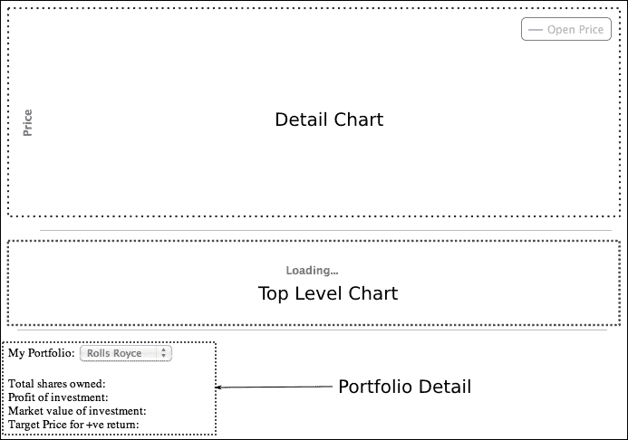

应用程序包含一对时间序列图表。底部图表是显示整个历史价格走势并指向公司股票购买和卖出时间的顶级图表。顶部图表是详细图表，当在底部图表中创建选区时，它会放大以显示更详细的细节。

一旦在浏览器中加载了网络应用程序，就会创建两个图表。顶级图表配置了一个加载事件，该事件会自动从网络服务器请求股票历史价格和投资组合历史。

以下截图显示了自动加载顶级图表后的图形：

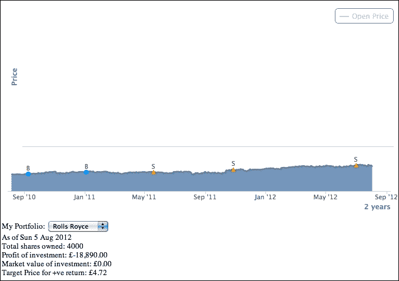

在顶级图表上方有圆形和三角形的数据点。这些表示交易历史。**B**符号表示股票被购买时，而**S**符号表示股票被卖出时。顶级图表下方的信息是截至当前日期的股票投资组合详情。

如果我们点击这些交易历史点之一，投资组合详情部分将更新以反映所选日期的投资历史。此外，当我们选择一个区域时，它会在详细图表中放大并显示股价走势。事件处理中涉及其他功能，我们将在后面的章节中讨论它们。

## 顶级图表

以下是为顶级图表（底部图表显示整个历史价格走势）的配置代码，我们将`chart`对象存储在`myApp`命名空间中，如下所示：

```js
     $.myApp.topChart = new Highcharts.Chart({
         chart: {
             zoomType: 'x',
             spacingRight: 15,
             renderTo: 'top-container',
             events: {
                 // Load the default stock symbol of 
                 // the portfolio
                 load: function() {  ....  },

                 // The top level time series have
                 // been redrawn, enable the portfolio
                 // select box
                 redraw: function() { .... },

                 // Selection - get all the data points from
                 // the selection and populate into the 
                 // detail chart
                 selection: function(evt) {  ....  },
             }
         },
         title: { text: null },
         yAxis: {
             title: { text: null },
             gridLineWidth: 0,
             labels: { enabled: false }
         },
         tooltip: { enabled: false },
         xAxis: {
             title: { text: null },
             type: 'datetime'
         },
         series: [ ... ],
         legend: { enabled: false },
         credits: { enabled: false }
     });
```

在此配置中有很多事情在进行。图表定义时大部分功能都被禁用，例如图例、标题、工具提示和*y*轴标签。更重要的是，图表配置了`zoomType`选项，这使得图表可以沿*x*轴方向缩放；因此，我们可以使用`select`事件。系列数组由多个系列组成，这些系列也包含事件配置。

### 构建顶级图表的系列配置

在系列数组中，定义了多个系列，包括开盘价和收盘价、买入和卖出交易日期，以及一个用于跟踪详细图表中鼠标移动的隐藏系列：

```js
        series: [{
             // Past closed price series  
             type: 'areaspline',
             marker: { enabled: false },
             enableMouseTracking: false
        }, {                   
             // This is the open price series and never shown
             // in the bottom chart. We use it to copy this
             // to the detail chart
             visible: false
        }, {
             // Series for date and price when shares 
             // are bought
             type: 'scatter',
             allowPointSelect: true,
             color: $.myApp.boughtColor,
             dataLabels: {
                 enabled: true,
                 formatter: function() { return 'B'; }
             },
             point: {
                 events: { .... }
             }
        }, {
             // Series for date and price when shares are sold
             type: 'scatter',
             allowPointSelect: true,
             color: $.myApp.soldColor,
             dataLabels: {
                 enabled: true,
                 formatter: function() { return 'S'; }
             },
             point: {
                 events: { .... }
             }
        }, {
             // This is the tracker series to show a single 
             // data point of where the mouse is hovered on 
             // the detail chart 
             type: 'scatter',
             color: '#AA4643'
         }]
```

第一系列是历史股价系列，配置时没有数据点标记。第二系列是隐藏的，并在详细图表中作为历史开盘价数据的占位符。第三（买入）和第四（卖出）系列是散点系列，揭示了股票交易的具体日期。这两个系列都设置了`allowPointSelect`选项，因此我们可以在`point.events`选项中定义`select`和`unselect`事件。最后一个系列也是一个散点系列，使用`mouseover`和`mouseout`事件来反映详细图表中的鼠标移动；我们将在稍后看到这些是如何实现的。

### 使用图表加载事件启动 Ajax 查询

如前所述，一旦顶级图表创建并加载到浏览器中，它就可以从服务器获取数据。以下是为该图表的`load`事件处理器定义：

```js
     chart: {
         events: { 
             load: function() {
                 // Load the default stock symbol of 
                 // the portfolio
                 var symbol = $('#symbol').val();
                 $('#symbol').attr('disabled', true);
                 loadPortfolio(symbol);
             },
```

我们首先从**我的投资组合**选择框中检索值，并在查询期间禁用选择框。然后，我们调用一个预定义的函数`loadPortfolio`。该方法执行多个任务，如下所示：

1.  使用 Ajax 调用`$.getJSON`来加载过去的股价和投资组合数据。

1.  设置处理返回的 Ajax 结果的处理器，以进一步执行以下步骤：

    1.  隐藏图表加载遮罩。

    1.  解包返回的数据，并使用`Series.setData`方法将其填充到系列数据中。

    1.  更新**投资组合详情**部分的数据，以显示截至当前日期的投资价值。

### 使用图表重绘事件激活用户界面

一旦顶级图表填充了数据，我们就可以在页面上启用**我的投资组合**选择框。为此，我们可以依赖于`redraw`事件，该事件由步骤 2 中的子步骤 2 中的`Series.setData`调用触发：

```js
       redraw: function() {
           $('#symbol').attr('disabled', false);  
       },
```

### 使用点选择和取消选择事件选择和取消选择数据点

购买和销售系列具有相同的事件处理；它们之间的唯一区别是颜色和点标记形状。想法是，当用户点击这些系列中的数据点时，**投资详情**部分会更新以显示交易日期的股票投资详情。以下截图显示了选择第一次购买交易点后的效果：

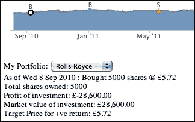

为了保持数据点被选中，我们将使用 `allowPointSelect` 选项，它允许我们定义 `select` 和 `unselect` 事件。以下是购买和销售系列的事件配置：

```js
        point: {
            events: {
                select: function() {
                    updatePortfolio(this.x);
                },
                unselect: function() {
                    // Only default back to current time
                    // portfolio detail when unselecting
                    // itself
                    var selectPt =          
                        $.myApp.topChart.getSelectedPoints();
                    if (selectPt[0].x == this.x) {
                        updatePortfolio(new Date().getTime());
                    }
                }
            }
        }
```

基本上，`select` 事件处理器调用一个预定义的函数，`updatePortfolio`，根据所选数据点的时间：`this.x` 更新 **投资详情** 部分。处理器中的 `'this'` 关键字指的是所选点对象，其中 `x` 是时间值。

取消选择数据点将调用 `unselect` 事件处理器。前面的实现意味着，如果未选择的数据点 (`this.x`) 与之前选择的数据点相同，那么这表明用户取消选择了相同的数据点，因此我们希望显示当前日期的投资详情。否则，它将不执行任何操作，因为这表示用户已选择另一个交易数据点；因此，将使用不同日期调用另一个 `select` 事件。

### 使用图表选择事件放大所选区域

`selection` 事件在顶层图表和详细图表之间形成桥梁。当我们选择顶层图表中的区域时，所选区域会被突出显示，详细图表中的数据会被放大。这个动作会触发 `selection` 事件，以下是对事件处理器的简化代码：

```js
           selection: function(evt) {
               // Get the xAxis selection
               var selectStart = Math.round(evt.xAxis[0].min);
               var selectEnd   = Math.round(evt.xAxis[0].max);

               // We use plotBand to paint the selected area
               // to simulate a selected area
               this.xAxis[0].removePlotBand('selected');
               this.xAxis[0].addPlotBand({
                   color: 'rgba(69, 114, 167, 0.25)',
                   id: 'selected',
                   from: selectStart,
                   to: selectEnd
               });
               for (var i = 0; 
                    i < this.series[0].data.length; i++) {
                  var pt = this.series[0].data[i];
                  if (pt.x >= selectStart && 
                      pt.x <= selectEnd) {
                      selectedData.push([pt.x, pt.y]);
                  }

                  if (pt.x > selectEnd) {
                      break;
                  }
               }

               // Update the detail serie 
               var dSeries = $.myApp.detailChart.series[0];               
               dSeries.setData(selectedData, false);
               ....

               // Update the detail chart title & subtitle
               $.myApp.detailChart.setTitle({
                   text: $.myApp.stockName + " (" +
                         $.myApp.stockSymbol + ")",
                   style: { fontFamily: 'palatino, serif',
                            fontWeight: 'bold' }
                   }, {
                   text: Highcharts.dateFormat('%e %b %y', 
                         selectStart) + ' -- ' +
                         Highcharts.dateFormat('%e %b %y',
                         selectEnd),
                   style: { fontFamily: 'palatino, serif' }
               });

               $.myApp.detailChart.redraw();
               return false;
          }
```

处理器代码中包含几个步骤。首先，我们从处理器参数中提取所选范围值——`evt.xAxis[0].min` 和 `evt.xAxis[0].max`。下一步是使所选区域在顶层图表中保持突出显示。为此，我们使用 `this.xAxis[0].addPlotBand` 在相同区域创建一个绘图带以模拟选择。

`'this'` 关键字指的是顶层图表对象。接下来的任务是赋予一个固定的 `id`，以便我们可以移除旧的选择并突出显示新的选择。此外，绘图带应该与图表上被拖动的选择具有相同的颜色。我们所需做的只是将绘图带颜色赋值为 `chart.selectionMarkerFill` 选项的默认值。

之后，我们将所选范围内的数据复制到一个数组中，并使用 `Series.setData` 将其传递给详细图表。由于我们多次调用了 `setData` 方法，因此将 `redraw` 选项设置为 `false` 以节省资源，然后调用 `redraw` 方法。

最后，最重要的步骤是在函数末尾返回`false`。返回`false`布尔值告诉 Highcharts 在做出选择后不要采取默认操作。否则，整个顶级图表将被重新绘制并拉伸（或者，我们也可以调用`event.preventDefault()`）。

以下截图放大并显示另一个图表的详细信息：

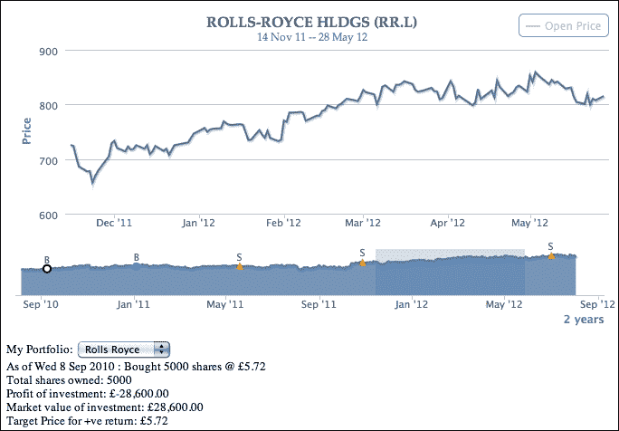

## 详细图表

详细图表只是一个折线图，显示了从顶级图表中选择的区域。图表配置了一个固定在上左角的工具提示和我们将要讨论的一些事件：

```js
       $.myApp.detailChart = new Highcharts.Chart({
            chart: {
                showAxes: true,
                renderTo: 'detail-container',
                events: {
                    click: function(evt) {
                        // Only allow to prompt stop order
                        // dialog if the chart contains future
                        // time
                        ....
                    }
                },
             },
             title: {
                margin: 10,
                text: null
             },
             credits: { enabled: false },
             legend: {
                enabled: true,
                floating: true,
                verticalAlign: 'top',
                align: 'right'
             },
             series: [ ... ],
             // Fixed location tooltip in the top left
             tooltip: {
                shared: true,
                positioner: function() {
                    return { x: 10, y: 10 }
                },
                // Include 52 week high and low
                formatter: function() {  .... }
             },
             yAxis: {
                title: { text: 'Price' }
             },
             xAxis: { type: 'datetime' }
        });
```

以下是一个截图，显示了悬停的数据点以及显示在上左角的工具提示：

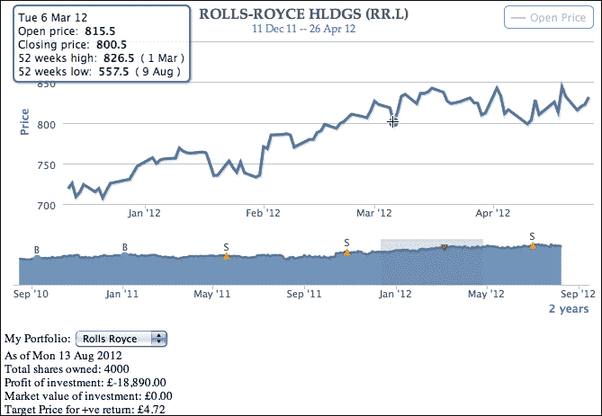

### 构建详细图表的系列配置

详细图表中配置了两个系列。主要关注的是第一个系列，即股票收盘价。该系列没有数据点标记，并将`'crosshair'`作为`cursor`选项，正如我们在前面的截图中所见。此外，为创建顶级图表中追踪系列标记的数据点定义了`mouseout`和`mouseover`事件。我们将在下一节中讨论这些事件。系列数组定义如下：

```js
           series: [{
               marker: {
                   enabled: false,
                   states: {
                       hover: { enabled: true }
                   }
               },
               cursor: 'crosshair',
               point: {
                   events: {
                       mouseOver: function() { ... },
                       mouseOut: function() { ... }
                   }
               },
               stickyTracking: false,
               showInLegend: false
           }, {
               name: 'Open Price',
               marker: { enabled: false },
               visible: false
           }],
```

### 使用鼠标悬停和鼠标移出事件悬停在数据点上

当我们在详细图表的系列上移动鼠标指针时，该移动也会在所选区域内的顶级图表中反映出来。以下截图显示了在顶级图表中显示的追踪点（倒三角形）：

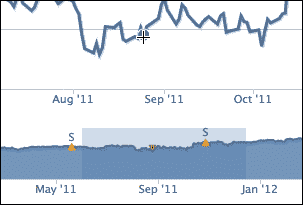

倒三角形表示我们在顶级图表中浏览的位置。为此，我们将在详细图表系列中设置`mouseOut`和`mouseOver`点事件选项，如下所示：

```js
        point: {
            events: {
                mouseOver: function() {
                    var series = $.myApp.topChart.series[4];
                    series.setData([]);
                    series.addPoint([this.x, this.y]);
                },
                mouseOut: function() {
                     var series = $.myApp.topChart.series[4];              
                     series.setData([]);
                }
            }
        },
```

在`mouseOver`处理程序内部，`'this'`关键字指向悬停的数据点对象，而`x`和`y`属性指向时间和价格值。由于顶级图表和详细图表在 x 和 y 轴上共享相同的数据类型，我们只需简单地将一个数据点添加到顶级图表的追踪系列中。至于`mouseOut`事件，我们通过清空数据数组来重置系列。

### 应用图表点击事件

在本节中，我们将应用图表点击事件来为投资组合创建一个*止损订单*。**止损订单**是一个投资术语，指的是在未来指定日期/时间范围内，当股票达到价格阈值时卖出或买入股票。它通常用于限制损失或保护利润。

注意，顶层图表的右侧有一个空白区域。实际上，这是故意创建的，用于从当前日期开始的下一个 30 天范围。让我们突出显示该区域，以便未来日期出现在详细图表中：

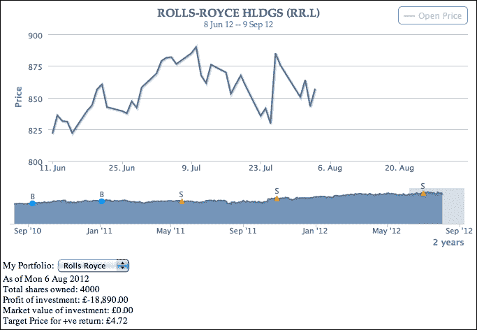

如我们所见，详细图表中的线条系列在触及当前日期时立即停止。如果我们点击详细图表中未来日期的区域，将出现一个**创建停止订单**对话框。然后，图表上点击的 x，y 位置被转换为日期和价格，这些值随后被填充到对话框中。以下是对话框的截图：

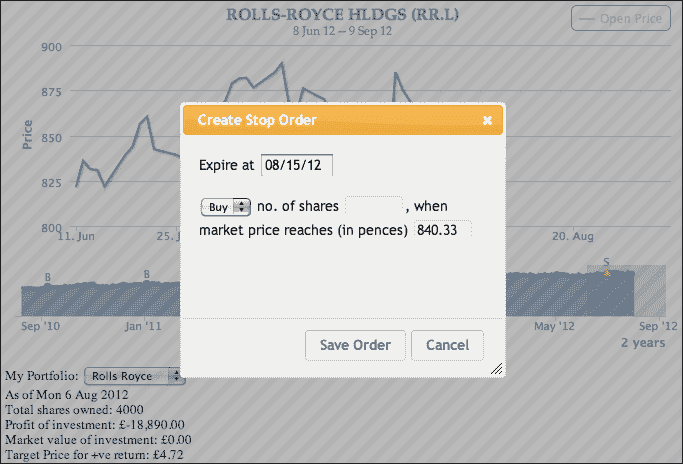

如果需要，可以进一步调整到期日期和价格字段。一旦点击**保存订单**按钮，就会创建一个停止订单，并生成一对 x 和 y 绘图线来标记图表。以下是在图表上显示两个停止订单的截图：

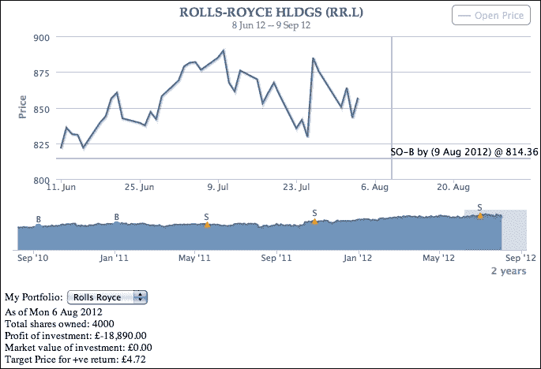

让我们看看所有这些操作如何从代码中推导出来。首先，基于页面上声明的 HTML 表单创建 jQuery UI 对话框：

```js
  <div id='dialog'>
     <form>
        <fieldset>
           <label for="expire">Expire at</label>
           <input type=text name="expire" id="expire" size=9 ><br/><br/>
           <select name='stopOrder' id='stopOrder'>
              <option value='buy' selected>Buy</option>
              <option value='sell'>Sell</option>
           </select>
           <label for="shares">no. of shares</label>
           <input type="text" name="shares" id="shares" value="" size=7 class="text ui-widget-content ui-corner-all" />,
           <label for="price">when market price reaches (in pences)</label>
           <input type="text" name="price" id="price" value="" size=7 class="text ui-widget-content ui-corner-all" />
        </fieldset>
     </form>
  </div>
```

然后定义详细图表的`click`事件处理程序，如下所示：

```js
           click: function(evt) {

               // Only allow to prompt stop order dialog
               // if the chart contains future time
               if (!$.myApp.detailChart.futureDate) {
                   return;
               }

               // Based on what we click on the time, set
               // input field inside the dialog
               $('#expire').val(
                   Highcharts.dateFormat("%m/%d/%y",
                   evt.xAxis[0].value));
               $('#price').val(
                   Highcharts.numberFormat(
                   evt.yAxis[0].value, 2));

               // Display the form to setup stop order
               $('#dialog').dialog("open");
           }
```

第一个保护条件是查看详细图表中是否包含任何未来日期。如果存在未来日期，那么它将从`click`事件中提取 x 和 y 值，并将它们分配到表单输入字段中。之后，它调用 jQuery UI 对话框方法，在对话框中布局 HTML 表单，并显示它。

以下代码片段显示了如何定义 jQuery UI 对话框及其操作按钮。代码已编辑以提高可读性：

```js
           // Initiate stop order dialog
           $( "#dialog" ).dialog({
              // Dialog startup configuration – 
              // dimension, modal, title, etc
              .... ,
              buttons: [{
                 text: "Save Order",
                 click: function() {
                     // Check whether this dialog is called
                     // with a stop order id. If not, then 
                     // assign a new stop order id
                     // Assign the dialog fields into an
                     // object - 'order' 
                     .... 
                     // Store the stop order 
                     $.myApp.stopOrders[id] = order; 
                     // Remove plotlines if already exist.
                     // This can happen if we modify a stop
                     // order point
                     var xAxis = $.myApp.detailChart.xAxis[0];
                     xAxis.removePlotLine(id);
                     var yAxis = $.myApp.detailChart.yAxis[0];
                     yAxis.removePlotLine(id);

                     // Setup events handling for both 
                     // x & y axis plotlines
                     var events = {
                         // Change the mouse cursor to pointer
                         // when the mouse is hovered above 
                         // the plotlines
                         mouseover: function() { ... },

                         // Launch modify dialog when 
                         // click on a plotline
                         click: function(evt) { ... }
                     };

                     // Create the plot lines for the stop
                     // order
                     xAxis.addPlotLine({
                         value: order.expire,
                         width: 2,
                         events: events,
                         color: (order.stopOrder == 'buy') ? $.myApp.boughtColor : $.myApp.soldColor,
                         id: id,
                         // Over both line series and 
                         // plot line
                        zIndex: 3
                     });

                     yAxis.addPlotLine({
                         value: order.price,
                         width: 2,
                         color: (order.stopOrder == 'buy') ? $.myApp.boughtColor : $.myApp.soldColor,
                         id: id,                                 
                         zIndex: 3,
                         events: events,
                         label: {
                             text: ((order.stopOrder == 'buy') ? 'SO-B by (' : 'SO-S by (')  + Highcharts.dateFormat("%e %b %Y", parseInt(order.expire)) + ') @ ' + order.price,
                             align: 'right'
                         } 
                      });

                      $('#dialog').dialog("close");
                 }
              }, {
                 text: "Cancel",
                 click: function() {   
                      $('#dialog').dialog("close"); 
                 } 
              }]                           
           });
```

对话框设置代码稍微复杂一些。在**保存订单**按钮的处理程序中，它执行以下几个任务：

1.  它从对话框中提取输入值。

1.  它检查对话框是否以特定的停止订单`id`打开。如果没有，则分配一个新的停止订单`id`，并将带有`id`的值存储到`$.myApp.stopOrders`中。

1.  如果我们修改现有的停止订单，它会删除任何与`id`匹配的现有绘图线。

1.  它为 x 轴和 y 轴的绘图线设置`click`和`mouseover`事件处理程序。

1.  它在详细图表中使用在第 4 步中构建的事件定义创建 x 和 y 绘图线。

一个包含停止订单的场景是，用户可能在条件满足之前想要更改或删除一个停止订单。因此，在第 4 步中，绘图线上的`click`事件的目的就是弹出修改对话框。此外，我们希望在鼠标悬停在绘图线上时将鼠标光标更改为指针，以显示它是可点击的。

### 使用鼠标悬停事件更改绘图线上的鼠标光标

要更改绘图线上的鼠标光标，我们定义了如下`mouseover`事件处理程序：

```js
         mouseover: function() {
             $.each(this.axis.plotLinesAndBands, 
                 function(idx, plot) {
                    if (plot.id == id) {
                        plot.svgElem.element.style.cursor =
                           'pointer';
                        return false;
                    }
                 }
             );
         },
```

`this`关键字包含一个轴对象，悬停的绘图线属于该轴。由于每个轴可以有多个绘图线，我们需要遍历轴对象中`plotLinesAndBands`属性内的绘图线和绘图带数组。一旦通过匹配`id`找到目标绘图线，我们将深入内部元素并设置光标样式为`'pointer'`。以下截图显示了鼠标光标悬停在绘图线上：

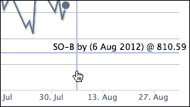

### 使用点击事件设置绘图线动作

绘图线的`click`事件启动**修改停止订单**对话框以进行停止订单：

```js
           // Click on the prompt line
           click: function(evt) {
               // Retrieves the stop order object stored in
               // $.myApp.stopOrders                                      
               $('#dialog').dialog("option", 
                                   "stopOrderId", id);
               var stopOrder = $.myApp.stopOrders[id];

               // Put the settings into the stop order form
               $('#dialog').dialog("option", "title", 
                                   "Modify Stop Order");
               $('#price').val(
                   Highcharts.numberFormat(
                            stopOrder.price, 2));

               $('#stopOrder').val(stopOrder.stopOrder);
               $('#shares').val(stopOrder.shares);
               $('#expire').val(
                   Highcharts.dateFormat("%m/%d/%y", 
                            stopOrder.expire));

               // Add a remove button inside the dialog
               var buttons = 
                   $('#dialog').dialog("option", "buttons");
               buttons.push({
                   text: 'Remove Order',
                   click: function() {
                       // Remove plot line and stop order
                       // settings
                       delete $.myApp.stopOrders[id];
                       var xAxis =  
                           $.myApp.detailChart.xAxis[0];
                       xAxis.removePlotLine(id);
                       var yAxis =  
                           $.myApp.detailChart.yAxis[0];
                       yAxis.removePlotLine(id);

                       // Set the dialog to original state
                       resetDialog();                
                       $('#dialog').dialog("close");                
                   }
               });

               $('#dialog').dialog("option", 
                                   "buttons", buttons);

               $('#dialog').dialog("open");                
           }
```

`click`事件处理程序简单地检索停止订单设置，并将值放入**修改停止订单**对话框中。在启动对话框之前，将一个**移除订单**按钮添加到对话框中，按钮处理程序调用`removePlotLine`，并带有绘图线`id`。以下是对**创建停止订单**对话框的截图：


# 股票增长图表示例

我们接下来的示例（对于在线演示，请参阅[`joekuan.org/Learning_Highcharts/Chapter_11/chart2.html`](http://joekuan.org/Learning_Highcharts/Chapter_11/chart2.html)）是为了演示以下事件：

+   `chart.events`: `addSeries`

+   `plotOptions.series.events`: `click`, `checkboxClick`, 和 `legendItemClick`

+   `plotOptions.series.point.events`: `update` 和 `remove`

假设我们想要根据过去的股票增长表现来制定一个长期投资组合。演示中包含了一个从两个系列开始的图表，即“投资组合”和“平均增长”，以及一个输入股票代码的表单。基本上，在这个演示中，我们输入一个股票代码，然后一个股票增长线系列就被插入到图表中。

因此，我们可以绘制多个股票收益趋势，并调整它们在投资组合中的比例，以观察**平均**线和**投资组合**线的表现。以下截图显示了初始屏幕：

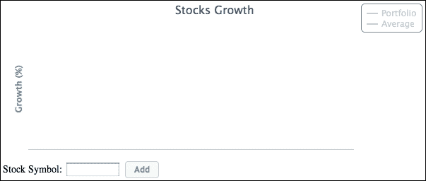

## 从显示的股票系列中绘制平均系列

让我们查询两只股票，并点击**平均**图例以启用系列：

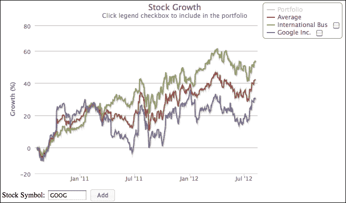

如预期的那样，**平均**线绘制在两条股票线之间。假设未来的增长与过去相似，如果我们对投资组合中的两只股票进行等额投资，**平均**线将预测未来的增长。让我们在图表上添加另一个股票代码：

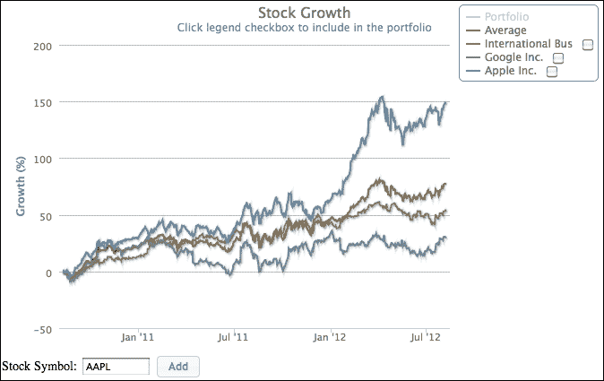

新的增长线产生更高的收益，因此**平均**线自动调整并移动到顶部第二行。让我们看看它是如何实现的。以下是对应的图表配置代码：

```js
          $.myChart = new Highcharts.Chart({
               chart: {
                   renderTo: 'container',
                   showAxes: true,
                   events: {
                       addSeries: function() { ... }       
                   }
               },
               series: [{
                   visible: false,
                   name: 'Portfolio',
                   color: $.colorRange.shift(),
                   marker: { enabled: false },
                   events: {
                       legendItemClick: function(evt) { ... }
                   }
               }, {
                   name: 'Average',
                   events: {
                       legendItemClick: function(evt) { ... }
                   },
                   color: $.colorRange.shift(),
                   visible: false,
                   marker: { enabled: false }
               }, {
                   visible: false,
                   type: 'pie',
                   point: {
                       events: {
                           click: function(evt) { ... }, 
                               update: function(evt) { ... },
                               remove: function(evt) { ... }
                       }
                   },
                   center: [ '13%', '5%' ],
                   size: '30%',
                   dataLabels: { enabled: false }
               }],
               title: { text: 'Stocks Growth' },
               credits: { enabled: false },
               legend: {
                   enabled: true,
                   align: 'right',
                   layout: 'vertical',
                   verticalAlign: 'top'
               },
               yAxis: {
                   title: { text: 'Growth (%)' }
               },
               xAxis: { type: 'datetime' }
           });
```

图表包含三个系列：投资组合、平均和用于编辑投资组合分布的饼图系列。

当我们点击带有股票代码的**添加**按钮时，调用`showLoading`方法在图表前放置一个加载遮罩，然后与服务器建立 Ajax 连接以查询股票收益数据。我们通过调用`addSeries`函数将新系列插入图表来实现 Ajax 处理程序。

一旦触发`addSeries`事件，这意味着数据已经返回并准备好绘图。在这种情况下，我们可以禁用图表加载遮罩，如下所示：

```js
            chart: {
                .... ,
                events: {
                    addSeries: function() { 
                        this.hideLoading();
                    }       
                },
                .... , 
```

以下是实现**添加**按钮动作的代码：

```js
   $('#add').button().on('click', 
       function() {
           var symbol = $('#symbol').val().toLowerCase();
           $.myChart.showLoading();
           $.getJSON('./stockGrowth.php?symbol=' + symbol + 
                     '&years=' + $.numOfYears, 
               function(stockData) {
                   // Build up the series data array
                   var seriesData = [];

                   if (!stockData.rows.length) {
                       return;
                   }

                   $.symbols.push({ 
                       symbol: symbol, 
                       name: stockData.name 
                   });

                   $.each(stockData.rows, 
                       function(idx, data) {
                           seriesData.push([ 
                               data.date * 1000, 
                               data.growth ]);
                   });

                   $.myChart.addSeries({
                       events: {
                           // Remove the stock series
                           click: { ... },
                           // Include the stock into portfolio
                           checkboxClick: { ... }
                       },
                       data: seriesData,
                       name: stockData.name,
                       marker: { enabled: false },
                       stickyTracking: false,
                       showCheckbox: true,

                       // Because we can add/remove series, 
                       // we need to make sure the chosen
                       // color used in the visible series
                       color: $.colorRange.shift()
                   }, false);

                   updateAvg(false);
                   $.myChart.redraw();
               }  // function (stockData)    
            );  //getJSON
        });
```

我们从 Ajax 返回的数据中构建一个系列配置对象。在这个新的系列配置中，我们将图例项旁边的复选框的`showCheckbox`选项设置为`true`。配置中还添加了几个事件，`click`和`checkboxClick`，稍后讨论。

在调用`addSeries`方法之后，我们接着调用一个预定义的例程`updateAvg`，它只重新计算并重新绘制显示的**平均**线。

从前面的平均系列事件定义中回忆，我们使用`legendItemClick`事件来捕捉在图例框中点击平均系列的情况：

```js
               series: { 
                    ... 
                   }, {
                   name: 'Average',
                   events: {
                       legendItemClick: function(evt) {
                           if (!this.visible) {
                               updateAvg();
                           }
                       }
                   },
                   .....
```

前面的代码意味着，如果平均系列当前不在可见状态，那么在处理程序返回后，系列将变为可见。因此，它计算平均值并显示系列。

## 使用系列点击事件启动对话框

我们不是通过点击图例项来启用或禁用股票收益线，而是可能想要完全移除系列线。在这种情况下，我们使用`click`事件来完成，如下所示：

```js
       $.myChart.addSeries({
            events: {
                // Launch a confirm dialog box to delete 
                // the series
                click: function() {
                    // Save the clicked series into the dialog
                    $("#dialog-confirm").dialog("option",
                       "seriesIdx", this.index);
                    $("#dialog-confirm").dialog("option",
                       "seriesName", this.name);
                    $("#removeName").text(this.name);

                    $("#dialog-confirm").dialog("open");
                },
                // Include the stock into portfolio
                checkboxClick: function(evt) { ... }
            },
            ....
       });
```

点击动作启动一个确认对话框，用于从图表中移除系列。我们在对话框中存储被点击的系列（`'this'`关键字）信息。**移除**按钮的处理程序使用这些数据来移除系列，并在显示的情况下重新计算平均系列。以下截图显示了这一过程：

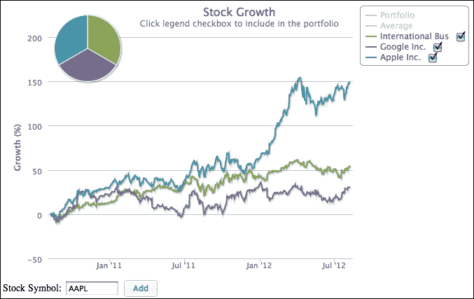

由于增长线系列配置了`showCheckbox`选项，我们可以定义`checkboxClick`事件，当复选框被勾选时启动饼图：

```js
          checkboxClick: function(evt) {
              updatePie(this, evt.checked);
          }
```

在此演示中，`updatePie` 函数在多个地方被调用，例如，在删除系列、图例复选框被选中时等。以下是代码的简短版本：

```js
          var updatePie = function(seriesObj, checked) {

             var index = seriesObj.index;

             // Loop through the stock series. If checkbox
             // checked, then compute the equal distribution 
             // percentage for the pie series data
             for (i = $.pfloIdx + 1; 
                  i < $.myChart.series.length; i++) {
                 var insert = (i == index) ? checked : $.myChart.series[i].selected;
                 if (insert) {
                     data.push({ 
                         name: $.myChart.series[i].name, 
                         y: parseFloat((100 / count).toFixed(2)), 
                         color: $.myChart.series[i].color
                     });
                 }
             }

             // Update the pie chart series
             $.myChart.series[$.pfloIdx].setData(data, false);
             $.myChart.series[$.pfloIdx].show();
         };
```

上述代码片段基本上遍历股票系列数组，并检查它是否被选中。如果是，则以均匀分布的方式将股票包含在饼图系列中。然后，如果有一个或多个条目，将显示饼图。

## 使用数据点的点击、更新和删除事件编辑饼图的切片

投资组合中所有股票的分布可能不会均匀。因此，我们可以通过修改饼图内部的部分来增强示例。当点击饼图的某个切片时，会弹出一个对话框。这允许我们调整或删除投资组合内的部分。以下截图显示了这一点：

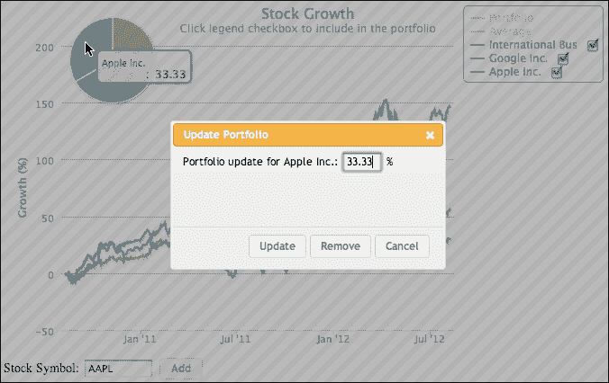

**更新**对话框中的**更新投资组合**按钮使用 `Point.update` 方法更新饼图切片，而**删除**按钮调用 `Point.remove` 方法。这两个调用分别触发 `update` 和 `remove` 事件。在这里，我们在饼图中定义了数据点的 `click`、`update` 和 `remove` 事件：

```js
      series:  { 
          ....
          },
          visible: false,
          type: 'pie',
          point: {
              events: {
                  // Bring up the modify dialog box
                  click: function(evt) {
                      // Store the clicked pie slice 
                      // detail into the dialog box                                    
                      $('#updateName').text(evt.point.name);               
                      $('#percentage').val(evt.point.y);
                      $('#dialog-form').dialog("option", 
                          "pieSlice", evt.point);

                      $('#dialog-form').dialog("open");
                  }, 
                  // Once the Update button is clicked, 
                  // the pie slice portion is updated
                  // Hence, this event is triggered and the
                  // portfolio series is updated
                  update: function(evt) {
                      updatePortfolio();
                  },
                  // Pie slice is removed, unselect the series
                  // in the legend checkbox and update the
                  // portfolio series
                  remove: function(evt) {
                      var series = nameToSeries(this.name);
                      series && series.select(false);
                      updatePortfolio();
                  }
              }
         }
```

`click` 事件函数将点击的切片（点对象）存储在修改对话框中并启动它。在对话框内部，**更新**和**删除**按钮的按钮处理程序随后提取这些存储的点对象，调用饼图，并使用对象的更新或删除方法来反映显示的饼图中的更改。这随后触发点 `update` 或 `remove` 事件处理程序并调用预定义的函数 `updatePortfolio`，该函数重新计算包含股票的新分布。因此，让我们将过去最佳表现股票的分布更新为 80% 的比例，其他两种股票各 10%。投资组合系列会自动从 `update` 事件中调整自身，如下面的截图所示：

![使用数据点的点击、更新和删除事件编辑饼图的切片

如我们所见，投资组合系列（从顶部数第二行）已经偏向于更高的增长趋势，而不是像平均系列那样处于所有股票的中间。

# 摘要

在本章中，我们介绍了 Highcharts 配置的最后一部分：事件处理。我们使用 jQuery 和 jQuery UI 构建了两个股票组合应用程序，以演示大多数 Highcharts 事件。

在下一章中，我们将使用 jQuery Mobile 将 Highcharts 带到移动设备上。
