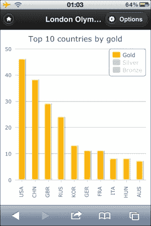

# 第十二章：Highcharts 和 jQuery Mobile

Highcharts 不仅在桌面浏览器中工作；它还支持移动平台。在本章中，我们将探讨如何使用基于 jQuery 的 Web 移动框架 jQuery Mobile 将 Highcharts 部署到移动平台。以下是 jQuery Mobile 的简要介绍。我们将探讨几个对理解移动框架基础至关重要的领域。然后，我们将通过构建一个使用 2012 年奥运会奖牌表的移动应用程序来集成 Highcharts 和 jQuery Mobile。我们将演示如何应用移动事件，如滑动、旋转和捏合来导航图表。在本章中，我们将涵盖以下主题：

+   介绍 jQuery Mobile

+   理解移动页面结构

+   理解页面初始化

+   移动页面之间的链接

+   集成 Highcharts 和 jQuery Mobile

+   从一个图表深入到另一个图表的数据

+   通过触摸动作更改图表显示：滑动、旋转和捏合

# jQuery Mobile 简介简述

本章绝对不是 jQuery Mobile（jQM）的完整教程，但它是一个使用 Highcharts 的快速入门指南。JQuery Mobile 是一个基于 jQuery 的移动设备网络开发框架。它旨在与所有移动平台兼容，并且 UI 的外观和感觉模仿了原生移动应用程序。这种优势在于单源代码的低成本开发，无需在所有移动平台和浏览器上进行测试。

在我们深入探讨 Highcharts 如何与 jQM 集成之前，需要理解一些重要概念。

# 理解移动页面结构

在 jQM 中最重要的概念是理解移动页面的结构，这与正常的 HTML 页面不同。移动页面是在一个带有 jQM 特定属性 `data-role='page'` 的 HTML `<div>` 框架内构建的，该属性作为边界。实际上，`data-*` 语法是 HTML5 标准中定义的**客户数据属性**。这允许网络开发者存储特定于页面或应用的定制数据，可以轻松访问数据属性值。有关 HTML API 的更多信息，请访问 [`dev.w3.org/html5/spec/single-page.html#custom-data-attribute`](http://dev.w3.org/html5/spec/single-page.html#custom-data-attribute)。在移动页面中，使用正常的 HTML 标签，如输入、超链接、选择等。

一个 HTML 文档可以通过锚点和 `id` 属性包含多个移动页面和链接。锚点与正常的 HTML 锚点相同（例如，`#chart`）。框架解析锚点引用并检索具有匹配 `id` 属性的移动页面，其语法如下：

```js
<div data-role="page" id="chart">     
```

以下是一个 HTML 文档中单个移动页面的示例：

```js
<!DOCTYPE html>
<html>
<head> 
  <title>My Page</title> 
  <meta name="viewport" 
        content="width=device-width, initial-scale=1, 
                 maximum-scale=1, user-scalable=0">
  <!-- CDN loading of jQuery and jQM -->
  <link rel="stylesheet" 
   href="https://code.jquery.com/mobile/1.4.3/jquery.mobile-1.4.3.min.css" />
  <script  
   src="img/jquery-2.1.1.min.js"></script>
  <script 
   src="img/jquery.mobile-1.4.3.min.js"></script>
</head>
<body>
  <div data-role="page">
     <div data-role="header">
         <h1>jQuery Mobile</h1>
     </div><!-- /header -->
     <div data-role="content">
          ....
     </div>
  </div><!-- /page -->
</body>
</html>
```

根据移动应用程序的目的，所有页面可以构建成一个单独的 HTML 文档，或者它们可以存在于单独的文档中。一个重要的方面是，如果文档中定义了多个移动页面，那么 `<body>` 标签中的第一个页面总是会被加载到屏幕上。在 jQM 中，一个页面通常由头部和内容组成，可选的页脚和导航栏。每个组件也有一个带有 `data-role` 的 `<div>` 框，以指示移动页面中的组件类型。以下代码显示了文档中多个移动页面的加载方式：

```js
<div data-role="page" >
   <div data-role="header">
      <h1>jQuery Mobile</h1>
      <a href="#config" data-rel='dialog' 
         data-icon="gear">Options</a>
   </div><!-- /header -->
   <div data-role="content">
       ....
   </div>
</div><!-- /page -->

<!-- Page for the option dialog -->
<div data-role="page" id='config'>
   <div data-role="header">
       <h1>Config</h1>
   </div><!-- /header -->

   <div data-role="content">
       <a href="#" data-role="button" 
          data-rel="back" >Cancel</a>
   </div>
</div><!-- /page -->
```

如我们所见，这里有包含 `data-role='page'` 属性的两个 `<div>` 框。第一个 `<div>` 框与上一个例子相同，额外包含一个指向第二个移动页面的“选项”链接按钮，该页面的 `id` 为 `config`。`data-icon="gear"` 属性使用框架提供的齿轮图标装饰了按钮。

要查看图标的全列表，请访问 [`demos.jquerymobile.com/1.4.3/icons`](http://demos.jquerymobile.com/1.4.3/icons)。当按钮被按下时，由于 `data-rel='dialog'` 属性，它将以模态对话框的形式打开第二个页面。以下截图显示了第一个移动页面在 iPhone 上的视图：


# 理解页面初始化

在本节中，我们将探讨为什么我们不使用传统的 DOM-ready 方法来为移动页面运行初始化代码。假设一个页面的内容需要某种初始化，那么使用传统的 DOM-ready 方法 `$.ready` 可能会有负面影响。这是因为 `$.ready` 方法会在文档中所有 DOM 加载完毕后立即运行。换句话说，如果初始化代码在 DOM ready 处理器内部，我们就无法控制其运行的时间。

然而，jQM 提供了一个特定的事件，`pageinit`，用于处理这种情况。我们只需要在 `<div data-role='page'>` 标记内分配一个 `id` 值，然后为该 `id` 值定义 `pageinit` 事件处理器。每当一个页面即将被初始化以显示时，这个事件就会被触发。请注意，`$.ready` 方法仍然会被调用，但我们只是在 jQM 中不使用它。为了演示这个概念，让我们使用之前的带有额外 `$.ready` 调用的多页面示例：

```js
  <script type="text/javascript">
      $(document).on('pageinit', '#main_page', function() {
           alert('jQuery Mobile: pageinit for Main page');
      });

      $(document).on('pageinit', '#config', function() {
           alert('jQuery Mobile: pageinit for Config page');
      });

      $(document).ready(function() {
           alert('jQuery ready');
      });
  </script>
  </head>
  <body> 
    <!--  MAIN PAGE -->
    <div data-role="page" id='main_page'>
       <div data-role="header">
          <h1>jQuery Mobile</h1>
             <a href="#config" data-rel='dialog' 
                data-icon="gear" 
                class='ui-btn-right'>Options</a>
       </div><!-- /header -->

       <div data-role="content" id=''>
       </div>
    </div><!-- /page -->

    <!-- CONFIG PAGE -->
    <div data-role="page" id='config' >
       <div data-role="header">
          <h1>Config</h1>
       </div><!-- /header -->

       <div data-role="content">
          <a href="" data-role="button" 
             data-rel="back" >Cancel</a>
       </div>
    </div><!-- /page -->
```

在这个例子中定义了两个移动页面：`main_page` 和 `config`。每个移动页面都与它的 `pageinit` 事件处理器相关联。使用 `$.ready` 方法，我们可以观察与其他 `pageinit` 事件的调用顺序。当我们第一次将文档加载到浏览器中时，我们看到以下截图：


记住，jQM 总是显示 HTML 体中的第一个页面。这意味着`main_page`的`pageinit`事件在`main_page`的 DOM 完全加载并初始化用于显示时立即触发。同样重要的是要理解，在执行点，后续`config`页面的 DOM 尚未加载。当我们触摸**确定**按钮时，执行继续，并加载`config`页面的 DOM。因此，文档中的所有 DOM 都已加载，然后调用`$.ready`方法；它显示了以下截图中的第二个警告消息：


当我们触摸**确定**按钮时，警告框消失，控制权返回到浏览器。现在，如果我们触摸右上角的**选项**按钮，`config`对话框页面被初始化并在屏幕上显示。因此，调用`config`页面的`pageinit`处理程序：


# 移动页面之间的链接

jQM 的第二个重要概念是如何将移动页面链接在一起。理解这个概念可以帮助我们设计具有流畅用户体验的 Web 移动应用程序。在 jQM 中，有两种方式可以加载外部移动页面：HTTP 和 Ajax。根据我们如何设置`data-`属性，它解释`href`值并决定加载移动页面的方式。默认情况下，除了第一个文档加载是正常的 HTTP 传输外，移动页面通过 Ajax 加载。

以下块图解释了如何在文档中管理多个移动页面块：


当一个移动页面调用另一个移动页面时，jQM 框架基本上解析`href`值。由于这是一个锚点引用，它表示这是一个内部移动页面块。框架通过匹配`id`值从当前 DOM 中定位页面块。然后它初始化并渲染页面，这也会触发页面 B 的`pageinit`事件，如前一个块图所示。

假设我们有两个独立的 HTML 文档，其中一个页面上的按钮引用了另一个文档。以下块图描述了该场景：


在此情况下，我们添加一个属性，`data-ajax="false"`（为了简化 JavaScript 代码的管理），告诉 jQM 这个按钮需要一个文档加载而不是后台 Ajax 加载。这很重要，因为否则`<script>`标签内的`pageinit`处理代码（或任何 JavaScript 文件）将不会为新移动页面`B.html`加载。

### 注意

JavaScript 代码可以嵌入到移动页面块内的`<script>`标签中并执行。这种方法的缺点是它需要更多的代码管理，因为每个页面块都有自己的`pageinit`处理代码。

有一种加载多个文档中 Ajax 的替代方法，但我们将在这里省略。这已经足够实现一个简单的移动网络应用。读者可以从 jQuery Mobile 文档中了解更多信息。

# 高级图表在触摸屏环境中的使用

Highcharts 的好处是它可以在桌面浏览器和移动网络环境中完美运行，无需更改任何代码。唯一需要考虑的部分是事件处理，因为移动设备都是基于触摸屏的，这意味着鼠标光标是不可见的。

在 Highcharts 中，所有鼠标悬停事件仍然可以在触摸设备上触发，尽管鼠标光标没有显示。例如，如果我们定义了一个具有 `mouseOut`、`mouseOver` 和 `click` 事件处理的系列。如果我们触摸该系列，`mouseOver` 和 `click` 事件都会被触发。然而，如果我们触摸另一个系列导致之前选中的系列被取消选中，第一个系列的 `mouseOut` 事件就会被触发。不用说，事件的顺序会与真实的光标设备不同。一般来说，我们应该避免在基于触摸屏的设备中使用任何鼠标悬停事件。

在下一节中，我们将学习如何将 jQM 与 Highcharts 集成，包括如何将触摸事件应用于图表，如何使用图表 `click` 事件启动另一个图表和移动页面等。

# 使用奥运奖牌表应用整合 Highcharts 和 jQuery Mobile

在本节中，我们将构建一个用于浏览 2012 年奥运奖牌表结果的移动应用。此应用仅在 iPhone 和 iPad 上进行了测试。启动屏幕提供了四个菜单来查找结果，如下面的截图所示：


初始页面由指向其他页面的四个超链接列表组成，如下面的代码所示：

```js
  <head>
      <!-- CDN load of Highcharts, jQuery and jQM -->
      ....
  </head>
  <body>
  <div data-role="page">
     <div data-role="header">
        <h1>London Olympic 2012 </h1>
     </div><!-- /header -->

     <div data-role="content">
         <ul data-role="listview" data-inset="true">
             <li><a href="./gold.html" 
 data-ajax="false" >Top 10 countries by gold</a></li>
             <li><a href="./medals.html" 
 data-ajax="false" >Top 10 countries by medals</a></li>
             <li><a href="#">A-Z countries</a></li>
             <li><a href="#">A-Z olympians</a></li>
         </ul>
     </div>
  </div><!-- /page -->
  </body>
```

因此，当点击**金牌前 10 名国家**按钮时，`gold.html` 文件是通过 HTTP 加载的（不是 Ajax），因为我们定义了 `data-ajax="false"`。由于这是一个 HTTP 加载，整个页面 `gold.html` 以及 `<script>` 标签中正在执行的所有内容都将加载到浏览器中。

## 加载金牌页面

以下为 `gold.html` 文件的内容：

```js
   <head>
      <!-- CDN load of Highcharts, jQuery and jQM -->
      ....
      <script type="text/javascript" src="img/common.js"></script>
      <script type="text/javascript" src="img/gold.js"></script>
   </head>
   <body>
   <div data-role="page" id='gold_chart'>
      <div data-role="header">
       <a href="olympic.html" data-icon="home" 
          data-iconpos="notext">Home</a>
       <h1>London Olympic 2012 - Top 10 countries by gold</h1>
       <a href="#options" data-rel='dialog' 
          data-icon="gear" id='options'>Options</a>
      </div><!-- /header -->

      <div data-role="content">
        <div id='chart_container'></div>
      </div>
    </div><!-- /page -->

    <!-- options dialog -->
    <div data-role="page" id='options' >
       ....
    </div>
  </body>
```

由于整个 HTML 文档都是通过 HTTP 加载到浏览器中的，因此 `common.js` 和 `gold.js` 文件也被加载（参见 [`joekuan.org/Learning_Highcharts/Chapter_12/`](http://joekuan.org/Learning_Highcharts/Chapter_12/)）。`common.js` 文件包含在演示中共享的通用代码，例如设备检测、方向检测、图表创建等。`gold.js` 文件包含 `gold.html` 文件中所有移动页面的 `pageinit` 处理器代码。作为移动页面块，`gold_chart` 是文档中首先定义的块，因此它会被自动加载并渲染到显示中；因此，`gold_chart` 页面块的 `pageinit` 事件被触发。

## 检测设备属性

对于检测移动设备，技术范围从 `navigator.userAgent` 选项的字符串匹配、`jQuery.support`、`jQuery.browser`（已弃用）、CSS 媒体查询，到第三方插件如 Modernizer（详情请见 [`modernizr.com/`](http://modernizr.com/)）。然而，并没有一个标准的做法。或许是因为兼容性检查的多样化需求。本书的范围并不包括对每种技术的优缺点的讨论。对于这个演示，我们只对屏幕尺寸的差异感兴趣；也就是说，如果显示空间更大（例如平板设备），则我们在图表中显示完整的国家名称，而不是用于较小设备的国家代码。我们假设以下技术足以区分手机和平板设备：

```js
function getDevice() { 
    return ($(window).width() > 320)  ? "tablet" : "phone";
}
```

`$(window).width` 属性返回设备以像素为单位的宽度，无论设备方向如何。至于获取当前设备方向，我们有以下方法：

```js
function getOrientation() { 
    return (window.innerHeight/window.innerWidth) > 1 ?           
            'portrait' : 'landscape';
} 
```

## 在移动设备上绘制 Highcharts 图表

以下是为 `gold_chart` 移动页面编写的 `pageinit` 处理器代码：

```js
$(document).on('pageinit', '#gold_chart', 
     function() {
       var device = getDevice();

       // current orientation
       var orientation = getOrientation();

       $.olympicApp = $.olympicApp || {};

       // Setup the point click events for all the 
       // country medal charts – used by plotGoldChart method
       var pointEvt = {
           events: {
              click: function(evt) { ... }
           }
       };

       // Switch between column and pie chart
       $('#chart_container').on('swipeleft', 
             function(evt) { ... } );

       $('#chart_container').on('swiperight', 
             function(evt) { ... } );

       // Switch between column and bar chart on 
       // smaller display
       $(document).on('orientationchange', 
             function(evt) { ... } );

       // General method for plotting gold medal chart
       // Used by dialog box also to toggle chart options
       // such as column stacking, labels etc
       $.olympicApp.plotGoldChart = function(chart, options) {
              .....
       };
       // Create and display Highcharts for gold medal chart
       $.olympicApp.goldChart = createChart({
              device: device,
              orientation: orientation, 
              load: $.olympicApp.plotGoldChart,
              type: (orientation == 'landscape') ?
                    'bar' : 'column',
              // legend and title settings specific
              ....

       });
    }
 );
```

后续将讨论触摸事件，如 `swipeleft`、`swiperight` 和 `orientationchange`。当用户在金牌图表中的国家条上点击时，事件处理器 `pointEvt` 会进一步深入到另一个图表。我们也会稍后探讨这种交互。首先让我们关注代码的最后部分，这部分用于创建图表。`createChart` 方法是一个通用流程，用于创建具有所有图表移动页面共享的常见选项的 Highcharts 图表。例如，`renderTo` 选项始终设置为 `chart_container`，它位于 `data-role='content'` 属性内部。以下代码展示了 `createChart` 的实现：

```js
   // Main routine for creating chart
   function createChart(options) {

      // Based on the device display and current orientation
      // Work out the spacing options, labels orientation
      return new Highcharts.Chart({
          chart: {
              renderTo: 'chart_container',
              type: options.type,
              events: {
                  load: function(chart) {
                      // Execute the page general plot routine
                      options.load && 
                      options.load(chart, options);
                  }
              },
              spacingLeft: ....,
              ....
          },
          title: { text: options.title },
          xAxis: {
             labels: ....
          },
          ....
      });
   }      
```

注意，在 `options` 参数中没有定义系列，并且 `options.load` 属性被设置为在图表创建并加载到浏览器中时调用 `plotGoldChart` 函数。以下代码片段是 `plotGoldChart` 函数的一部分：

```js
  // chart is the target chart object to apply new settings,
  // options is an object containing the new settings
  $.olympicApp.plotGoldChart = 
   function(chart, options) {

       // Get the top 10 countries with the
       // most gold medals
       $.getJSON('./gold_10.json', 

           function(result) {

               var device = getDevice();

               // Remove any series in the chart if exists
               ....

               // If display pie chart, 
               // then we only plot the gold medals series
               if (options && options.type == 'pie') {
                   var goldOpt = { 
                       data: [], 
                       point: pointEvt,
                       type: 'pie',
                       dataLabels: { ... }
                   };
                   $.each(result.rows, 
                       function(idx, data) { 
                           goldOpt.data.push({ 

                              // If device is phone, 
                              // set short country labels
                              // otherwise full names
                              name: (device === 'phone') ?
                                  data.code : data.country,  
                              y: data.gold, 
                              color: pieGoldColors[idx] 
                           });
                   });
                   chart.addSeries(goldOpt, false);

                   // Disable option button for pie chart
                   $('#options').addClass('ui-disabled');

               } else {
                   // Sorting out chart option - stacking, 
                   // dataLabels if specified in the option
                   // parameters
                   var dataLabel = (options && 
                                    options.dataLabel) ? {
                       enabled: true,
                       rotation: 
                         (getOrientation() == 'landscape') ?
                         0 : -45,
                       color: '#404040'
                       } : {
                       enabled: false
                   } ;
                   var stacking = (options &&
                       options.stacking) || null;

                   var bronzeOpt = { 
                       data: [], name: 'Bronze', 
                       color: '#BE9275', 
                       stacking: stacking,
                       dataLabels: dataLabel, 
                       point: pointEvt 
                      };
                   var silverOpt = { 
                       data: [], name: 'Silver', 
                       color: '#B5B5B5', 
                       stacking: stacking,
                       dataLabels: dataLabel, 
                       point: pointEvt 
                   };
                   var goldOpt = { 
                       data: [], 
                       name: 'Gold', 
                       color: '#FFB400', 
                       point: pointEvt, 
                       stacking: stacking,
                       dataLabels: dataLabel 
                   };
                   var category = [];

                   $.each(result.rows, 
                       function(idx, data) {
                          // Display country code on phone
                          // otherwise name 
                             category.push((device === 'phone') ?
                                   data.code : data.country);
                          goldOpt.data.push(data.gold);
                          silverOpt.data.push(data.silver);
                          bronzeOpt.data.push(data.bronze);
                   });

                   chart.xAxis[0].setCategories(category);
                   chart.addSeries(bronzeOpt, false);
                   chart.addSeries(silverOpt, false);
                   chart.addSeries(goldOpt, false);
                   // Enable the option button for the
                   // column chart
                   $('#options').removeClass('ui-disabled');
               }
               chart.redraw();
            });   // function(result)
     };  // function(chart, …
```

`plotGoldChart`方法是一个通用例程，用于将一个系列绘制到现有图表中。`options`参数是一个配置对象，包含要应用到图表中的新设置。首先，该函数调用 Ajax 调用`gold_10.json`以获取获得最多金牌的前 10 个国家。以下是 JSON 格式的结果：

```js
{"rows": [{
  "country":"United States","gold":46,"silver":29,"bronze":29,
  "total":104,"code":"USA"
},{
  "country":"China","gold":38,"silver":27,"bronze":23,
  "total":88,"code":"CHN"
},{
  "country":"Great Britain & N.Ireland",
  "gold":29,"silver":17,"bronze":19, "total":65,"code":"GBR"
},{
  "country":"Russia Federation",
  "gold":24,"silver":26,"bronze":32,"total":82,"code":"RUS"
}, {
  ....
}]
```

当结果返回后，处理函数会检查`options`参数中的系列类型、设备方向以及其他字段（来自`config`对话框的堆叠和数据标签，我们将在后面讨论）。然后，根据设置创建图表。如果`type`属性是`column`，则创建三个名为`Gold`、`Silver`和`Bronze`的柱状系列，并配置了点`click`事件。如果`type`值是`pie`，则创建一个金牌的单一饼状系列，颜色逐渐变化并带有数据标签。

因此，当`gold_chart`页面首次加载时，会创建并显示一个柱状图。以下截图显示了初始的纵向模式柱状图：



如果我们触摸图例项以显示银牌和铜牌的数量，图表看起来如下截图所示：


## 使用 jQuery Mobile 对话框切换图形选项

右上角的**选项**按钮仅在当前显示的图表是柱状图时启用。它启动一个用于切换堆叠列和数据标签的选项对话框。以下代码是用于对话框的移动页面：

```js
<div data-role="page" id='options' >
    <div data-role="header">
       <h1>Config</h1>
    </div><!-- /header -->

    <div data-role="content">
       <label for="stacking">Stacking:</label>
       <select name="stacking" id="stacking" 
               data-role="slider">
           <option selected="selected">Off</option>
           <option>On</option>
       </select>

       <label for="dataLabel">Show Values:</label>
       <select name="dataLabel" id="dataLabel" 
               data-role="slider">
           <option selected="selected">Off</option>
           <option>On</option>
       </select>

       <a href="#" data-role="button" 
          data-rel="back" id='updateChart' >Update</a>
       <a href="#" data-role="button" 
          data-rel="back" >Cancel</a>
    </div>
</div><!-- /page -->
```

jQM 中的`<select>`标记被渲染为具有`data-role='slider'`属性的滑块开关，而超链接被渲染为具有`data-role='button'`属性的对话框按钮。以下截图显示了对话框页面：


同样，我们为对话框页面编写了`pageinit`处理程序以初始化**更新**按钮动作：

```js
  $(document).on('pageinit', '#options', 
        function() {
            var myApp = $.olympicApp;

         $('#updateChart').click(function() {

             var stacking = 
                 ($('#stacking').val() === 'Off') ? 
                    null: 'normal';
             var dataLabel = 
                 !($('#dataLabel').val() == 'off');

             myApp.plotGoldChart(myApp.goldChart, {
                 stacking: stacking,
                 dataLabel: dataLabel
             });
         });
  });
```

实际上，按钮的动作代码非常简单。因为我们用`data-rel='back'`属性定义了**更新**按钮，所以当我们点击按钮时，对话框就会关闭，我们返回到上一页。`<select>`输入框的选项值会被传递给`plotGoldChart`例程以重新绘制当前图表。以下是一个仅开启**显示值**的截图：


以下截图显示了一个同时开启了堆叠和数据标签的柱状图：


## 通过 swipeleft 手势事件更改图形展示

在这里，我们通过向图表添加`swipeleft`事件来增强用户体验。我们试图实现的是在现有的柱状图上从右侧向左侧施加滑动动作。这个动作将柱状图切换为具有相同数据集的饼图，反之亦然，使用`swiperight`动作：

```js
    // Switch to pie chart
    $('#chart_container').on('swipeleft', 
        function(evt) {
            var myApp = $.olympicApp;
            if (myApp.goldChart.series[0].type == 'column') {
                myApp.plotGoldChart(myApp.goldChart, { 
                   type: 'pie'                       
                });
            }
        });
   // Switch back to default column chart
    $('#chart_container').on('swiperight', 
        function(evt) {
            var myApp = $.olympicApp;
            if (myApp.goldChart.series[0].type == 'pie') {
                myApp.plotGoldChart(myApp.goldChart);
            }
    });
```

处理程序内的守卫条件是为了停止以相同展示方式重绘图表。以下是`swipeleft`动作后的视图：


## 使用 orientationchange 事件切换图形方向

假设我们在横屏位置使用触摸手机设备查看柱状图。如果我们旋转设备，图表将自动调整大小，但 y 轴的刻度会被压缩。因此，在比较每个国家的表现时，清晰度会降低。为了克服这个问题，我们使用另一个 jQuery Mobile 事件`orientationchange`，该事件在设备旋转时触发。以下是处理程序的实现：

```js
var device = ($(window).width() > 750) ? 'tablet' : 'phone';

// Switch between vertical and horizontal bar
$(document).on('orientationchange', 
       function(evt) {

        // We only do this for phone device because
        // the display is narrow
        // Tablet device have enough space, the 
        // chart will look fine in both orientations
        if (device == 'phone') {

           var myApp = $.olympicApp;
           var orientation = getOrientation();

           // I have to destroy the chart and recreate
           // to get the inverted axes and legend box
           // relocated
           myApp.goldChart.destroy();

           // create the chart optimized for horizontal
           // view and invert the axis. 
           myApp.goldChart = createChart({
                device: device,
                orientation: orientation,
                inverted: (orientation === 'landscape'),
                load: myApp.plotGoldChart,
                legend: ....,
           }); 

           // Hide the address bar
           window.scrollTo(0,1);
        }
       }
   );
```

我们将图表的`inverted`选项设置为`true`以交换 x 轴和 y 轴，并将图例定位在右下角。在配置中还为图表的`load`事件设置了一个方法。最终，生成了一个倒置的图表，如下面的截图所示：


以下是从平板设备上拍摄的金牌和银牌图表的截图：


`plotGoldChart`方法检测到更大的显示区域，并使用`setCategories`方法渲染图表（使用完整的国家名称而不是 JSON 结果中的国家代码）。

# 使用点点击事件深入数据

到目前为止，我们只对按金牌数量排序的前几名国家进行了调整。让我们看看我们如何使用 Highcharts 事件在 jQuery Mobile 中导航其他图表。回到`chart_page`的`pageinit`处理程序代码，我们声明了`pointEvt`变量，它是金牌图表中所有系列共享的`click`事件处理程序。以下是对该事件的代码：

```js
 var pointEvt = {
     events: {
         click: function(evt) {
             document.location.href = './sport.html?country=' 
             // Country code or name
             + encodeURIComponent(this.category) + 
             // Medal color
             '&color=' + this.series.name;
         }
     }
 };
```

此事件由触摸柱状图中的柱或饼图中的切片触发。因此，它加载了一个新的文档页面（`sport.html`），其中包含柱状图。文档页面的 URL 在处理程序内部构建，使用所选国家代码和奖牌颜色作为参数。该页面的 HTML 内容列在下一节中。`this`关键字指的是被点击的数据点（即国家柱）。柱状图显示了所选国家赢得奖牌的体育项目列表，以及奖牌颜色。以下截图显示了英国和北爱尔兰赢得金牌的体育项目列表图：


在新页面内部，它使用与金牌国家图表类似的代码来生成前面屏幕截图所示的图表。唯一的区别是它嵌入了点`click`回调。我们将在下一节中看到。

# 使用点点击事件构建动态内容对话框

现在我们知道了哪些运动在奥运会上获得了金牌，但我们还想进一步找出获奖者是谁。让我们触摸图表中的**田径**条目。出现一个对话框，并列出运动员的缩略图、他们的名字、照片以及他们的比赛信息，如下面的屏幕截图所示：


注意，前一个屏幕截图显示的对话框不是静态的 HTML 页面。这是通过一个点`click`事件构建的，并从结果动态构建对话框内容。问题是，为了在 jQM 中启动对话框页面，我们需要在页面上某个地方有一个按钮来开始。技巧是创建一个 jQM 隐藏按钮和一个程序，从事件处理器内部调用点击动作。以下代码是隐藏按钮和对话框页面的 HTML（`sport.html`）：

```js
<!-- hidden dialog -->
<a id='hiddenDialog' href="#atheletes_dialog" 
   data-rel="dialog" data-transition="pop"   
   style='display:none;'></a>
<!-- medalists page -->
<div data-role="page" id='atheletes_dialog' >
   <div data-role="header">
      <h1></h1>
   </div><!-- /header -->

   <div data-role="content">
      <ul data-role="listview" data-inset="true"
          id='atheletes_list' >
      </ul>
   </div>

   <a href="" data-role="button" data-rel="back">Cancel</a>
</div><!-- /page -->
```

以下是对体育图表的`click`处理器的实现：

```js
point: {
    events: {
        click: function(evt) {
            var params = {
                country : urlParams.country,
                color : urlParams.color.toLowerCase(),
                sport : this.category
            };

            // Set the title for dialog
            $('#atheletes_dialog h1').text(this.category + 
               " (" + urlParams.country + ") - " +
               urlParams.color + " medalists");

            // Simulate a button click to launch the 
            // list view dialog
            $('#hiddenDialog').click();

            // Launch ajax query, append the result into 
            // a list and launch the dialog
            $.getJSON('./olympic.php', params,  
               function(result) {

                 $("#atheletes_list").empty();
                 $.each(result.rows, 
                    function(idx, athelete) {
                       // Formatting the image, name, and
                       // the sport event
                       var content = "<li>" + "<h3>" + 
                          athelete.name + "</h3><p><strong>"
                          + athelete.event +
                          "</strong></p><p>" + 
                          athelete.desc + "</p></li>";

                       $("#atheletes_list").append(content);
                    });
                    // Need this to apply the format to 
                    // the new entry
                    $('#atheletes_list').listview('refresh');
            });  // getJSON
        }
     }
```

首先，我们为即将发布的对话框页面准备标题。然后，我们触发一个动作点击到隐藏按钮，调用如下：

```js
$('#hiddenDialog').click();
```

这反过来又生成一个点击事件来启动对话框页面。然后，我们发出一个 Ajax 查询，获取当前选定国家、奖牌颜色和运动的获奖者列表。服务器页面`olympic.php`包含每个国家的奥运结果。它根据 URL 参数对结果进行排序，并以 JSON 格式格式化排序后的列表。然后我们将 JSON 结果中的每个项目转换为并插入到`<ul>`列表`atheletes_list`中。

# 将手势变化（捏合动作）事件应用于饼图

到目前为止，我们只探索了涉及单个触摸点的动作。我们的下一个目标是学习如何使用多指应用更高级的动作事件。最常见的一种动作是捏合放大/缩小。iOS 的 Safari 浏览器通过 `gesturestart`、`gesturechange` 和 `gestureend` 事件支持这种动作。当有两个或更多手指触摸屏幕时，会触发 `gesturestart` 事件。然后，当手指在屏幕上移动时，会触发 `gesturechange` 事件。当手指离开屏幕时，会生成 `gestureend` 事件。在将控制权返回给事件处理器时，如果动作被识别，事件对象中的某个属性将被更新。例如，事件对象中的 `scale` 属性在捏合放大时设置为大于 1.0，在捏合缩小时设置为小于 1.0。有关 `GestureEvent` 类的参考，请参阅 [`developer.apple.com/library/mac/documentation/AppleApplications/Reference/SafariWebContent/HandlingEvents/HandlingEvents.html`](https://developer.apple.com/library/mac/documentation/AppleApplications/Reference/SafariWebContent/HandlingEvents/HandlingEvents.html)。

在本节中，我们将捏合动作应用于饼图。对于捏合放大的动作，我们将饼图转换为带有额外信息的环形图——反之亦然，对于捏合缩小的动作，将环形图转换回饼图。首先，让我们启动一个新的图表，**按奖牌数量排名前 10 的国家**，这是前端菜单的第二项。以下截图是图表的输出：


当我们执行捏合放大的动作时，图表将重新绘制，如下面的截图所示：


外环显示了每个国家每种颜色奖牌的比例。此外，原始饼图的数据标签向内移动，为外环腾出空间。让我们看看 `gesturechange` 事件是如何实现的。以下是在 `pageinit` 处理器内部的代码：

```js
      $('#chart_container').on('gesturechange', 
          function(evt) {
              evt = evt.originalEvent || evt;
              var myApp = $.olympicApp;

              if (evt.scale > 1) {
                  // Pinch open - from pie chart to 
                  // donut chart
                  if (!myApp.medalChart.series[1].visible) {
                      myApp.medalChart.destroy();
                      myApp.medalChart = createChart({
                          orientation: getOrientation(),
                          device: device,
                          outerRing: true,
                          load: myApp.plotMedalChart
                      });
                  }
              } else if (myApp.medalChart.series[1].visible) {
                  // Pinch close
                  myApp.medalChart.destroy();
                  myApp.medalChart = createChart({
                      orientation: getOrientation(),
                      device: device,
                      load: myApp.plotMedalChart
                  });
              } 
      });
```

我们将手势事件绑定到图表容器。每当在屏幕上执行多指手势操作时，例如捏合或旋转动作，都会调用此事件处理器。为了确保这是一个捏合动作，我们需要查看由 jQuery 层包装的浏览器生成的原始事件。我们将检查是否设置了 `scale` 属性，并决定它是捏合放大还是缩小，然后根据需要重新创建饼图或环形图。

# 摘要

本章的目标是在移动触摸设备上部署 Highcharts 图表。为了做到这一点，我们使用了移动网页开发框架 jQuery Mobile。我们简要介绍了框架的概念。然后，我们探讨了如何将 Highcharts 与 jQuery Mobile 集成。

然后，我们演示了一个移动应用程序，以展示 2012 年奥运会的奖牌榜结果。我们使用 jQuery Mobile 对话页面构建了一个图表菜单，然后展示了如何使用单点触控、多点触控和方向事件在图表之间导航。我们还展示了如何使用 Highcharts 的点击事件动态构建对话页面。

在下一章中，我们将学习如何将 Highcharts 与 ExtJs 结合使用，这是一个非常强大且流行的 **富互联网应用** (**RIA**) 框架，用于构建桌面风格的应用程序。
