# 第十三章. Highcharts 和 Ext JS

本章从 Sencha 的 Ext JS 介绍开始。由于 Ext JS 框架涵盖了广泛的功能，它包含了一个庞大的类集合。因此，我们将给出一个小集合的快速指南，特别是对于可能用于 Highcharts 的用户界面组件。然后，我们将学习我们为 Ext JS 提供的 Highcharts 扩展以及如何在 Ext JS 中创建 Highcharts 图表。我们还将了解扩展提供的一小部分 API。之后，我们将使用网络数据构建一个简单的应用程序来演示 Ext JS 组件如何与 Highcharts 交互。最后，我们将简要查看一个与 Highcharts 一起工作的商业 Ext JS 应用程序。在本章中，我们将涵盖以下主题：

+   介绍并快速讲解 Sencha Ext JS 类

+   介绍 Ext JS 的 Highcharts 扩展

+   展示如何将扩展的现有 Highcharts 配置进行转换

+   为扩展准备 Ext JS JsonStore 对象

+   描述扩展模块提供的 API

+   说明如何使用 Highcharts 扩展创建 Ext JS 应用程序

# Sencha Ext JS 的简要介绍

Sencha 的 Ext JS 是市场上最全面的 **富互联网应用**（RIA）框架之一。RIA 框架可以生成一个像桌面应用程序一样表现的前端网页。Ext JS 支持许多功能，如代理存储、图表、管理 SVG、标签页、工具栏、多种不同的表单输入等。还有其他流行的 RIA 框架，例如基于 Java 的 **Google Web Toolkit**（GWT）和基于 Python 的 Dojo。这两个框架都可以通过第三方贡献的软件与 Highcharts 集成。

### 注意

请参阅 *第三方实现* 部分的 [`www.highcharts.com/download`](http://www.highcharts.com/download)，以获取其他开发者贡献的软件完整列表。

Highcharts 扩展最初由 Daniel Kloosterman 为 Ext JS 2+ 编写，作为一个适配器，因为当时它不支持任何图表。在 Ext JS 3 中，它开始采用 YUI 图表库作为图表解决方案。然而，这些图表缺乏功能和样式，主要缺点是它们需要 Flash 才能运行。自从 Ext JS 3.1 以来，我一直维护 Highcharts 扩展，并添加了诸如支持饼图和增强一些 API 等功能。

虽然 Ext JS 4 自带图表库，但一些用户仍然更喜欢 Highcharts 而不是 Ext JS 4 图表，因为 Highcharts 在样式和灵活性方面更胜一筹。此外，Ext JS 4 可以与版本 3 代码并行运行，因此增强扩展以原生支持 Ext JS 4 是很有必要的，我已经实现了这一点。扩展实现始终遵循原始方法，即尽可能保留 Highcharts 配置的使用。

在撰写本文时，Ext JS 5 刚刚发布，从 Ext JS 4 到 Ext JS 5 的变化并不像从 Ext JS 3 到 Ext JS 4 那样剧烈。Highcharts 扩展已被更新，以完全兼容 Ext JS 4 和 5。在本章中，我们将专注于使用 Ext JS 5。所有示例都简单地来自上一版，该版基于 Ext JS 4，并且已更新以与 Ext JS 5 一起工作。

在线有演示 [`joekuan.org/demos/Highcharts_Sencha/desktop.extjs5/`](http://joekuan.org/demos/Highcharts_Sencha/desktop.extjs5/)，并且可以从 [`github.com/JoeKuan/Highcharts_Sencha/`](http://github.com/JoeKuan/Highcharts_Sencha/) 下载扩展。

与 jQuery UI 不同，Ext JS 应用程序是用纯 JavaScript 编程的，无需与 HTML 标记协作或调整特定的 CSS 类（严格来说，有时需要与 HTML 和 CSS 进行接口，但这并不常见，而且只是小量）。这使得程序员能够专注于用单一语言开发整个 Web 应用程序，并专注于应用程序逻辑。这也推动服务器端开发仅限于数据操作，与一些使用服务器端语言与 HTML 和 CSS 一起提供客户端页面的方法不同。

从技术上讲，JavaScript 没有类：函数本身就是一个对象。Ext JS 框架通过类方法提供对其组件的访问，这些组件以分层的方式组织。在本章中，我们将使用“类”一词来指代 Ext JS 类。

# Ext JS 组件快速浏览

Ext JS 中有大量的类，本书的范围超出了介绍它们的范围。Sencha 提供了三种类型的在线文档，在质量和数量方面：参考手册、教程（书面和视频）以及工作演示。强烈建议您花充足的时间审查这些材料。在本节中，对一些组件进行了非常简要的介绍，特别是那些可能需要与 Highcharts 接口的部分。但这章绝对不足以让您开始使用 Ext JS 进行编程，但应该足以让您有一个大致的概念。

## 实现和加载 Ext JS 代码

一个 Ext JS 应用程序始终可以分成多个 JavaScript 文件，但它们应该始终从一个 HTML 文件开始。以下代码片段演示了如何从一个 HTML 文件启动 Ext JS：

```js
<html>
  <head>
    <meta http-equiv="Content-Type" 
          content="text/html; charset=UTF-8">
    <title>Highcharts for Ext JS 5</title>
    // At the time of writing, there is no CDN for ExtJs 5
    // Download http://www.sencha.com/products/extjs/download/ext-js-5.0.0/3164
    <link rel="stylesheet" type="text/css" 
          href="/extjs5/packages/ext-theme-classic/build/resources/ext-theme-classic-all.css" />
  </head>
  <body></body>
  <script type="text/javascript" src="img/ext-all.js"></script>
  <script type='text/javascript'>
          Ext.require('Ext.window.Window');
          Ext.onReady(function() {
               // application startup code goes here
               ....
          });
  </script>
</html>
```

Ext JS 5 包含了各种主题。前面的示例演示了如何加载可用的主题之一。在示例中，我们将应用不同的主题来展示 Ext JS 5 的外观和感觉。脚本文件 `ext-all.js` 以压缩格式包含了所有 Ext JS 类。

### 注意事项

Ext JS 有构建自定义类文件的设施，以减少生产部署的加载。我们将这个留给你们去探索。

`Ext.require`用于加载应用程序中使用的特定类。`Ext.onReady`是 DOM 就绪方法，与应用程序启动代码在函数内部开始运行的`$.ready` jQuery 方法相同。

## 创建和访问 Ext JS 组件

在 Ext JS 的所有类中，我们应该首先讨论`Ext.Component`，它是 Ext JS 用户界面组件的基类。根据组件的特性，其中一些组件，如`Panel`、`Window`、`FieldSet`和`RadioGroup`可以包含多个组件，因为它们是通过另一个类`Container`继承的。我们将在稍后更详细地查看`Container`。

要创建一个 Ext JS 对象，我们使用`Ext.create`方法，它接受两个参数。第一个参数是类路径的字符串表示，例如`'Ext.window.Window'`，或者一个别名，例如`'widget.window'`。第二个参数是对象指定符，包含实例化类的初始值：

```js
var win = Ext.create('Ext.window.Window', {
       title: 'Ext JS Window',
       layout: 'fit',
       items: [{
            xtype: 'textarea',
            id: 'textbox',
            value: 'Lorem ipsum dolor sit amet, ... '
       }]
});

win.show();
```

前面的代码片段用于创建一个窗口小部件，其内容是通过`items`选项定义的。`Window`类是从`Container`类派生出来的，它继承了`items`选项以包含其他组件。当窗口最终创建并准备好渲染时，它会遍历`items`数组中的每个对象指定符，并创建每个组件。

`xtype`选项是 Ext 特定的类型，它有一个简短的唯一名称来表示组件的类路径。在 Ext JS 中，所有界面组件都有自己的`xtype`名称（这指的是`Ext.Component`手册）。`xtype`选项通常用于方便在容器内创建组件，而不是使用带有完整路径名的`Ext.create`。

`id`字段是为了给一个组件赋予一个唯一的 ID 名称。其目的是在任何程序内部直接访问一个组件。要检索具有 ID 值的组件，我们可以执行以下代码行：

```js
var tb = Ext.getCmp('textbox');
```

或者，我们可以使用`itemId`选项来分配一个唯一的名称。区别在于 ID 必须对整个应用程序全局唯一，而`itemId`只需要在父容器内部唯一，以避免在应用程序的其他地方发生名称冲突。要访问具有`itemId`值的组件，我们需要从直接父容器调用`getComponent`，如下所示：

```js
var tb = win.getComponent('textbox');
```

此外，我们可以从顶级一直链式调用到所需的组件，如下所示：

```js
var val =   
win.getComponent('panel').getComponent('textbox').getValue();
```

带有`itemId`定义的`'textbox'`组件是在父容器`'panel'`内部构建的，该容器位于窗口对象内部。尽管`getCmp`方法提供了直接、简单的访问组件的方式，但它通常应该避免作为最佳实践的一部分，因为它的性能较慢，如果意外使用了重复的 ID，可能会产生不期望的效果。

### 注意

为了避免长样本代码，我们在一些演示中使用了`getCmp`调用。

注意，Sencha 还提供了方便的组件导航，`up`和`down`方法通过 CSS 样式选择器搜索目标组件。以下是一个示例：

```js
var val = win.down('#textbox').getValue(); 
```

如我们所见，前面的表达式更加简化且直接。`down`方法基本上是向下遍历到其子组件，等等，直到遇到第一个符合条件组件。在这种情况下，匹配表达式`'#textbox'`表示一个`itemId`被指定为文本框的组件。可以使用许多不同的搜索表达式，另一个例子是`down('textarea')`，表示搜索第一个具有`xtype`值为 textarea 的子组件。

## 使用布局和视口

如我们之前提到的，某些类型的组件具有包含其他组件的能力，因为它们是从`Container`类扩展而来的。`Container`类的另一个特性是在包含组件之间安排布局；布局策略通过`layout`选项指定。大约有十几种布局策略：其中`'anchor'`、`'border'`和`'fit'`是最常用的（`card`布局也经常使用，但通过标签面板）。`border`布局在 GUI 编程中被广泛使用。布局被精细地划分为`'north'`、`'east'`、`'south'`、`'west'`和`'center'`区域。

当开发需要利用整个浏览器空间的应用程序时，我们通常使用与`border`布局结合的`Viewport`类。`Viewport`是一种特殊的容器，其大小会自动绑定到浏览器。以下是一个使用视口的简单示例：

```js
    var viewport = Ext.create('Ext.container.Viewport', {
      layout: 'border',
      defaults: {
         frame: true
      },
      items: [{
          region: 'north',
          html: '<h1>North</h1>'
      }, {
          region: 'east',
          html: '<h1>East</h1>',
          width: '15%'
      }, {
          region: 'south',
          html: '<h1>South</h1>'
      }, {
          region: 'west',
          html: '<h1>West</h1>',
          width: '20%'
      }, {
          region: 'center',
          html: '<h1>Center</h1>'
      }]
    });
```

以下截图显示了灰色主题中的`border`布局：

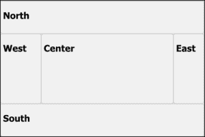

## 面板

`Panel`是一个基本的容器组件，通常用作布局格式的构建块，然后与更多的面板或组件结合使用。另一种一般用途是将`Panel`类扩展为特殊用途的面板类型，例如在线门户演示中的`PortalPanel`。最广泛使用的面板类型是`GridPanel`、`FormPanel`和`TabPanel`。

### 网格面板

`GridPanel`用于以表格格式显示数据，并附带许多有用的功能，例如拖放列排序、列排序、灵活的数据渲染、启用或禁用列显示功能等。`GridPanel`还可以与不同的插件一起使用，例如行编辑器，允许用户即时编辑字段值。该类提供了一套大量的事件设置，可以与其他组件建立顺畅的协调。尽管如此，最紧密耦合的组件是存储对象，我们将在后面的部分进行演示。

### 表单面板

`FormPanel` 是一个用于容纳表单样式字段输入组件的面板，即左侧是标签，右侧是输入，以及按钮数组。Ext JS 提供了大量的表单输入，例如日期时间字段、组合框、数字字段、滑块等。在 `FormPanel` 层下面，有一个 `BasicForm` 组件，它通过存储的 `Record` 类为字段验证、表单提交和加载服务做出贡献，用于添加和编辑条目。

以下是一个 `FormPanel` 的截图，展示了各种输入：

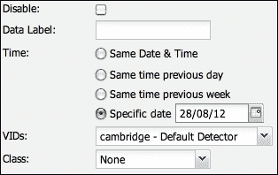

### TabPanel

`TabPanel`，正如其名称所暗示的，是一个与标签关联的面板。它支持动态创建和删除标签以及在不同标签之间滚动。以下代码片段展示了如何创建一个标签面板：

```js
items:[{
      xtype: 'tabpanel',
      items: [{
           title: 'Tab 1',
           xtype: 'form',
           items: [{
                .....
           }]
      }, {
          title: 'Tab 2',
          ....
      }]
}]
```

以下是一个带有滚动功能的标签面板内标签的截图：

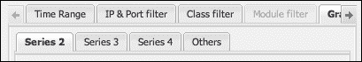

## Window

`Window` 是一种特殊的面板类型，它不绑定到任何父容器，并在应用程序中自由浮动。它提供了许多在普通桌面窗口中找到的功能，例如调整大小和最大化/最小化，还提供了添加工具栏、页脚栏和按钮的选项。稍后，我们将通过一个示例来查看 `Window` 面板的实际应用。

## Ajax

Ext JS 框架提供自己的方法，`Ajax.request`，用于发起 Ajax 查询。当返回的 JSON 数据不需要转换为表格行和字段列时，使用此方法。该方法通常与 `Ext.decode` 配合使用，将返回的 JSON 格式字符串转换为 JavaScript 对象，并直接访问对象内部的各个字段。

以下代码片段展示了发起一个 Ajax 查询的示例：

```js
Ext.Ajax.request({
     url: 'getData.php ',
     params: { id: 1 },
     success: function(response) {
          // Decode JSON response from the server
          var result = Ext.decode(response.responseText);
          if (result && result.success) {
              .... 
          } else {
              ....
          }
     }
});
```

## Store 和 JsonStore

`Store` 是一种用于模型数据的通用存储类。有几个类是从 `Store` 派生出来的，但 Highcharts 最重要的是 `JsonStore`。它是一个代理缓存的存储类，负责发起 Ajax 查询并将返回的 JSON 数据解包成模型数据。`JsonStore` 类通常用于访问位于服务器端的数据库数据。存储对象可以与多个组件绑定，例如，一个 `JsonStore` 对象可以绑定到一个网格面板和一个柱状图。在网格面板中点击列排序方向可以改变 `JsonStore` 中的行顺序，从而影响图表中显示的列顺序。换句话说，`Store` 类充当一个骨架，以使多个组件能够轻松且系统地协同工作。

需要注意的是，`Store` 类中的加载方法是异步的。如果我们想在数据加载后执行某个操作，应将事件处理程序分配给加载事件。可以通过 `listeners.click` 通过对象指定器或 `store.on` 方法指定操作。

### JsonStore 和 GridPanel 的示例

到目前为止，已经介绍了一些 Ext JS 组件；我们应该看看它们是如何协同工作的。让我们构建一个简单的窗口应用程序，其中包含一个表格（`GridPanel`），显示从服务器返回的主机列表及其下载使用情况。假设我们从服务器返回的数据行是以 JSON 格式：

```js
{ "data": [
       { "host" : "192.168.200.145", "download" : 126633683 },  
       { "host" : "192.168.200.99" , "download" : 55840235 },
       { "host" : "192.168.200.148", "download" : 54382673 },
        ...
] }
```

首先，我们定义数据模型以与 JSON 数据相对应。为了简化，我们可以将所有演示代码放在 `Ext.onReady` 中，而不是单独的 JavaScript 文件中：

```js
Ext.onReady(function() {
    Ext.define('NetworkData', {
        extend: 'Ext.data.Model',
        fields: [
            {name: 'host',  type: 'string'},
            {name: 'download', type: 'int'}        
        ]
    });
});
```

### 注意

接受服务器返回的字段名不是强制的。`Ext.data.Model` 提供了 `mapping` 选项，可以将备用字段名映射到客户端使用。

下一步是定义一个 `JsonStore` 对象，包含 URL、连接类型和数据格式类型。我们将 `JsonStore` 对象绑定到前面代码片段中定义的 `NetworkData` 数据模型：

```js
var netStore = Ext.create('Ext.data.JsonStore', {
      autoLoad: true,
      model: 'NetworkData',
      proxy: {
        type: 'ajax',
        url: './getNetTraffic.php',
        reader: {
            type: 'json',
            idProperty: 'host',
            rootProperty: 'data'
        }
    }
});
```

`idProperty` 用于定义如果未提供默认的 `'id'` 字段名，哪个字段被视为 ID，以便 `Store.getById` 等方法可以正常工作。`root` 选项告诉读取器（`JsonReader`），哪个属性名包含来自服务器的 JSON 响应中的行数据数组。接下来的任务是构建一个 `Window` 面板，使用 `GridPanel` 类，如下所示：

```js
var win = Ext.create('Ext.window.Window', {
      title: 'Network Traffic',
      layout: 'fit',
      items: [{
             xtype: 'grid',
             height: 170,
             width: 270,
             store: netStore,
             columns: [{
                 header: 'IP Address',
                 dataIndex: 'host',
                 width: 150
             }, {
                 header: 'Download',
                 dataIndex: 'download'
             }]
      }]
}).show();
```

我们指示网格面板绑定到 `netStore` 对象，并定义要显示的列列表。然后，我们通过 `dataIndex` 选项将每个列与存储的数据字段匹配。以下是一个窗口（清晰主题）截图，其中包含网格面板的一部分：

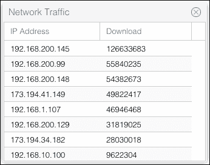

# Highcharts 扩展

在本节中，我们将探讨在 Ext JS 中创建 Highcharts 组件是多么简单。我们通过从现有的 Highcharts 配置中导入来实现这一点。让我们从上一个 JsonStore 示例继续，并将其纳入扩展中。

## 第 1 步 - 移除一些 Highcharts 选项

假设我们已经有了一个工作独立的 Highcharts 配置，如下所示：

```js
var myConfig = {
      chart: {
            renderTo: 'container',
            width: 350,
            height: 300,
            ....
      },
      series: [{
          type: 'column',
          data: [ 126633683, 55840235, .... ]
      }],
      xAxis: { 
          categories: [ "192.168.200.145", 
                        "192.168.200.99", ... ],
          ....
      },
      yAxis: { .... },
      title: { .... },
      ....
};
```

第一步是移除扩展将内部处理的全部字段并将它们传递给 Highcharts。因此，我们需要移除 `chart.renderTo` 和维度选项。我们还需要移除 `chart.series` 数组，因为最终 `JsonStore` 将是图形数据的来源。我们还想移除 `chart.xAxis.categories`，因为它包含图形数据。

## 第 2 步 - 转换为 Highcharts 扩展配置

下一步是构建一个新的配置，用于扩展旧的 Highcharts 配置。让我们从一个新的配置对象 `myNewConfig` 开始，包含大小属性：

```js
var myNewConfig = {
        width: 350,
        height: 300
};
```

下一步是创建一个新的选项 `chartConfig`，这是扩展所必需的。我们将 `myConfig` 对象中剩余的属性移向 `chartConfig`。以下代码片段显示了新的配置应该是什么样子：

```js
// ExtJS component config for Highcharts extension
var myNewConfig = {
        width: 450,
        height: 350,
        chartConfig: {
              // Trimmed Highcharts configuration here
              chart: { .... },
              xAxis: { .... },
              yAxis: { .... },
              title: { .... },
              ....
        }
};
```

## 步骤 3 – 通过映射 JsonStore 数据模型构建系列选项

回顾存储对象的 data 模型，我们有以下代码片段：

```js
        fields: [
            { name: 'host', type: 'string' },
            { name: 'download', type: 'int' }        
        ]
```

下一个任务是构建一个与 `JsonStore` 数据模型匹配的系列数组。新的系列数组结构与 Highcharts 选项中的结构类似。我们还需要在对象配置中链接存储对象。最终，选项对象应类似于以下代码片段：

```js
var myNewConfig = {
        width: 450,
        height: 350,
        store: netStore,
        series: [{
              name: 'Network Traffic',
              type: 'column',
              // construct the series data out of the
              // 'download' field from the return Json data
              dataIndex: 'download'
        }],
        // construct the x-axis categories data from
        // 'host' field from the return Json data
        xField: 'host',
        chartConfig: {
             .... 
        }
};
```

`dataIndex` 选项用于将 `JsonStore` 中的 *y* 值映射到系列数据数组中。由于 `'host'` 字段是字符串类型的数据，它被用作类别。因此，我们指定 `xField` 选项在系列数组外部，与系列共享。

## 步骤 4 – 创建 Highcharts 扩展

最后一步是将所有内容组合起来，在 Ext JS 中显示图表。我们首先创建一个 Highcharts 组件，并将其放入 Ext JS 容器对象中，如下所示：

```js
var hcChart = Ext.create('Chart.ux.Highcharts', myNewConfig);
var win = Ext.create('widget.window', {
      title: 'Network Traffic',
      layout: 'fit',
      items: [ hcChart ]
}).show();
```

或者，我们也可以通过使用 `xtype` 在一个配置中创建整个结构，如下所示：

```js
var win = Ext.create('widget.window', {
      title: 'Network Traffic',
      layout: 'fit',
      items: [{
             xtype: 'highchart',
             itemId: 'highchart',
             height: 350,
             width: 450,
             store: netStore,
             series: [{ .... }],
             xField: 'host',
             chartConfig: {
                 chart: { .... },
                 xAxis: { .... },
                 yAxis: { .... },
                 ....
      }]
}).show();
```

以下截图显示了 Ext JS 窗口（经典主题）内的 Highcharts 图表：

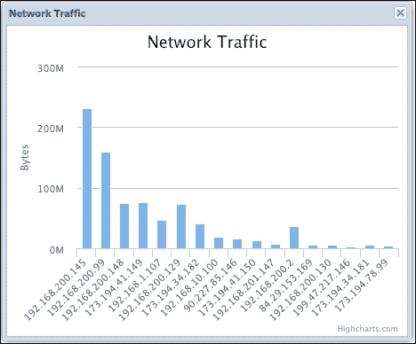

### 注意

为了在启动时显示数据，必须通过将 `autoLoad` 选项设置为 `true` 或在程序开始时手动调用 `Store.load` 方法来实例化 JsonStore。

### 在 Highcharts 扩展中传递特定系列的选项

如果我们需要传递特定系列的选项，例如颜色、数据点装饰等，那么我们只需以通常在 Highcharts 中做的方式，将它们放入系列配置中：

```js
       .....
       store: netStore,
            series: [{
                  name: 'Network Traffic',
                  type: 'column',
                  dataIndex: 'download',
                  color: '#A47D7C'
            }],
```

在创建系列的同时，扩展将复制这些选项。

## 将数据模型转换为 Highcharts 系列

在上一个示例中，我们学习了如何将简单的数据模型从 Ext JS 存储映射到 Highcharts。然而，有几种声明数据映射的方法，每种方法根据场景的不同有不同的影响，尤其是在多个系列的情况下。

### X 轴类别数据和 y 轴数值

这是最简单且可能是最常见的情况。每个系列在 *y* 轴上有数值，并在类别间共享数据。由于历史原因，`dataIndex` 选项也可以替换为另一个选项名称 `yField`，它具有更高的优先级，并且两者行为完全相同：

```js
            series: [{
                  name: 'Upload',
                  type: 'column',
                  yField: 'upload'
            }, {
                  name: 'Download',
                  type: 'column',
                  yField: 'download'
           }],
           // 'Monday', 'Tuesday', 'Wednesday' ....  
           xField: 'day'
```

### x 轴和 y 轴的数值

另一种情况是，*x* 轴和 *y* 轴都由数值组成。有两种不同的方式来指定数据映射。首先，每个系列持有 *y* 轴值并共享共同的 *x* 轴值。在这种情况下，系列指定方式与上一个示例相同：

```js
           series: [{
                  name: 'Upload',
                  type: 'line',
                  yField: 'upload'
            }, {
                  name: 'Download',
                  type: 'line',
                  yField: 'download'
           }], 
           // Time in UTC
           xField: 'time'
```

另一种情况是，每个系列都持有自己的 *x* 和 *y* 值对，如下所示：

```js
           series: [{
                  name: 'Upload',
                  type: 'line',
                  yField: 'upload',
                  xField: 'upload_time'
            }, {
                  name: 'Download',
                  type: 'line',
                  yField: 'download',
                  xField: 'download_time'
           }]
```

这两种设置的差异在于，第一种配置最终在图表中产生两个线系列，数据点沿 *x* 轴对齐，而后者则没有，存储数据模型也有所不同。

### 从存储数据执行预处理

假设我们需要在绘制图表之前对服务器数据进行预处理。我们可以通过覆盖系列配置中的模板方法来实现这一点。

在扩展代码中，每个系列实际上是从一个 `Serie` 类实例化的。这个类定义了一个标准方法，名为 `getData`，用于从存储中检索数据。让我们看看 `getData` 的原始实现：

```js
  getData : function(record, index) {
     var yField = this.yField || this.dataIndex, 
         xField = this.xField, 
         point = {
             data : record.data,
             y : record.data[yField]
         };
     if (xField)
         point.x = record.data[xField];
     return point;
  },
```

### 注意

这个扩展中的类和方法被原始作者命名为包含单词 "`Serie`"。

基本上，每次从 `JsonStore` 返回的每一行都会调用 `getData` 方法。该方法传递两个参数。第一个参数是一个 Ext JS `Record` 对象，它是一个数据行的对象表示。第二个参数是记录在存储中的索引值。在 `Record` 对象内部，`data` 选项在创建存储对象时根据模型定义持有值。

如我们所见，`getData` 的简单实现是根据 `xField`、`yField` 和 `dataIndex` 的值访问 `record.data`，并将其格式化为 Highcharts `Point` 配置。我们可以根据我们声明系列时的数据转换需求来覆盖此方法。让我们继续例子：假设服务器以 JSON 字符串的形式返回数据：

```js
{"data":[
      {"host":"192.168.200.145","download":126633683,
       "upload":104069233},
      {"host":"192.168.200.99","download":55840235,
       "upload":104069233},
      {"host":"192.168.200.148","download":54382673,
       "upload":19565468},
       ....
```

`JsonStore` 将前面的数据解释为具有以下模型定义的行：

```js
    fields: [
        {name: 'host',  type: 'string'},
        {name: 'download', type: 'int'}, 
        {name: 'upload', type: 'int'}        
    ]
```

我们需要绘制一个柱状图，其中每个条形是上传和下载字段的总量，因此我们为系列定义了如下的 `getData` 方法。请注意，我们不再需要声明 `yField` 或 `dataIndex`，因为此特定系列的 `getData` 方法已经处理了字段映射：

```js
   series: [{
       name: 'Total Usage',
       type: 'column',
       getData: function(record, index) {
           return {
               data: record.data,
               y: record.data.upload + 
                  record.data.download
           };
       } 
   }],
   xField: 'host',
   ....
```

## 绘制饼图

绘制饼图与线图、柱状图和散点图略有不同。饼图系列由数据值组成，其中每个值来自一个类别。因此，该模块有两个特定的选项名称，分别为 `categorieField` 和 `dataField`，分别用于类别和数据。要绘制饼图，系列需要指定以下内容：

```js
    series: [{
        type: 'pie',
        categorieField: 'host',
        dataField: 'upload'
    }]
```

`PieSeries` 类的 `getData` 方法随后将存储中的映射数据转换为 `Point` 对象，并将值分配给 `name` 和 `y` 字段。

### 绘制环形图

让我们提醒自己，环形图实际上是一个包含两个系列的饼图，其中内饼图的数据是外饼图的子类别。换句话说，内系列中的每个切片总是其外部分的总和。因此，从 `JsonStore` 返回的数据必须设计成可以通过字段名将这些数据分组到子类别中。在这种情况下，JSON 数据应该返回如下所示：

```js
{ "data": [
       { "host" : "192.168.200.145", "bytes" : 126633683,
         "direction" : "download"},  
       { "host" : "192.168.200.145", "bytes" : 104069233,
         "direction" : "upload"},  
       { "host" : "192.168.200.99", "bytes" : 55840235,
         "direction" : "download"},  
       { "host" : "192.168.200.99", "bytes" : 104069233, 
         "direction" : "upload"},  
       ....
] }
```

然后，我们使用一个额外的布尔选项 `totalDataField`，对于内饼图系列，表示我们想要使用 `dataField` 来扫描每个 `"host"` 类别的总值。对于外系列，我们只需将其定义为正常的饼图系列，但将 `"direction"` 和 `"bytes"` 分别定义为 `categorieField` 和 `dataField`。以下是为环形图定义的系列：

```js
             series: [{
                   // Inner pie
                   type: 'pie',
                   categorieField: 'host',
                   dataField: 'bytes',
                   totalDataField: true,
                   size: '60%',
                   ....
             }, {
                   // Outer pie
                   type: 'pie',
                   categorieField: 'direction',
                   dataField: 'bytes',
                   innerSize: '60%',
                   ....
             }]
```

以下截图显示了 Ext JS（aria 主题）中的环形图的外观：

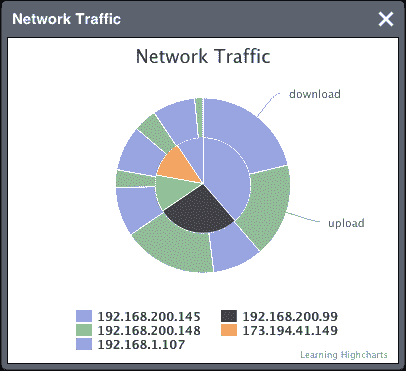

在扩展内部，`PieSeries` 类的 `getData` 方法的实现与其他系列类型显著不同，以便处理饼图和环形图的数据。因此，不建议覆盖此方法。稍后，我们将看到如何使用此模块绘制饼图和环形图。

## 模块 API

Highcharts 扩展包含一组小的 API。其中大部分是辅助函数，用于修改 Ext JS 层中的系列。至于 Highcharts 原生 API，可以通过扩展组件内部的 `chart` 属性来调用，例如：

```js
win.down('#highchart').chart.getSVG({ ... });
```

在前面的代码行中，`'highchart'` 是创建图表组件时的 `itemId` 值。`down` 方法是 Ext JS 使用 CSS 选择样式遍历层次组件的便捷方式。

如前所述，`chartConfig` 选项包含所有 Highcharts 配置。一旦创建图表组件，它就会在组件内部保存 `chartConfig`。因此，`chartConfig` 属性包含创建图表的所有初始配置。稍后，我们将看到这个 `chartConfig` 属性如何在 API 调用中发挥作用。

### addSeries

`addSeries` 方法将一个或多个系列添加到图表中。添加的系列也存储在 `chartConfig.series` 数组中，如下所示：

```js
addSeries : function(Array series, [Boolean append]) 
```

系列参数是一个系列配置对象的数组。`addSeries` 不仅允许使用 `xField`、`yField` 和 `dataIndex` 选项进行系列配置，还支持使用数据数组进行系列配置，因此它不会通过存储对象提取数据。以下是如何以不同方式使用 `addSeries` 的示例：

```js
Ext.getComponent('highchart').addSeries([{
       name: 'Upload',
       yField: 'upload'
}], true);

Ext.getComponent('highchart').addSeries([{
       name: 'Random',
       type: 'column',
       data: [ 524524435, 434324423, 43436454, 47376432 ]
}], true);
```

可选的 `append` 参数将系列参数设置为替换当前显示的系列或将系列添加到图表中。默认值为 `false`。

### removeSerie 和 removeAllSeries

`removeSerie` 方法从图表中移除单个系列，而 `removeAllSeries` 方法移除为图表定义的所有系列。这两种方法也会移除 `chartConfig.series` 中的系列配置，如下所示：

```js
removeSerie : function(Number idx, [Boolean redraw])
removeAllSeries : function()
```

`idx` 参数是系列数组中的索引值。可选的 `redraw` 参数设置在移除系列后是否重新绘制图表。默认值为 `true`。

### setTitle 和 setSubTitle

`setTitle` 和 `setSubTitle` 都会更改当前图表标题以及 `chartConfig` 中的标题设置，如下所示：

```js
setSubTitle : function(String title)
setTitle: function(String title)
```

### draw

到目前为止，我们提到了 `chartConfig`，但还没有真正解释它在模块中的功能。`draw` 方法实际上销毁了内部 Highcharts 对象，并根据当前 `chartConfig` 内的设置重新创建图表。假设我们已创建了一个图表组件，但想更改一些显示属性。我们修改 `chartConfig`（Highcharts 配置）内的属性，并调用此方法来重新创建内部 Highcharts 对象：

```js
draw: function()
```

虽然我们可以通过内部 `chart` 选项调用 Highcharts 的原生 API 而不销毁和重新创建图表，但并非所有 Highcharts 元素都可以通过 API 调用来更改，例如系列颜色、图例布局、列堆叠选项、反转图表轴等等。

因此，此方法使扩展组件能够在不重新创建组件本身的情况下，通过任何配置更改刷新内部图表。因此，它通过不在父容器中移除并重新插入一个新组件来增强 Ext JS 应用程序。此外，父容器中的布局也不会被打乱。

## 事件处理和导出模块

为扩展指定图表事件处理器与我们在 Highcharts 中通常声明事件处理器的方式完全相同。由于现在它处于 Ext JS 和 jQuery 环境下，实现可以使用 Ext JS 和 jQuery 方法。

Highcharts 导出图表模块不受扩展的影响。导出设置只是绕过此扩展并直接工作。

## 使用 Highcharts 扩展示例

在本节中，我们将构建一个更大的示例，其中包含其他类型的面板和图表。应用程序使用视口显示两个区域——`'center'` 区域是一个包含三个标签的标签面板，每个标签对应不同类型的网络数据图表，而 `'west'` 区域显示当前显示图表的表格数据。第一个标签中的图表是 **带宽利用率**，表示通过网络的数据速率。

以下截图显示了应用程序的前端屏幕（neptune 主题）：

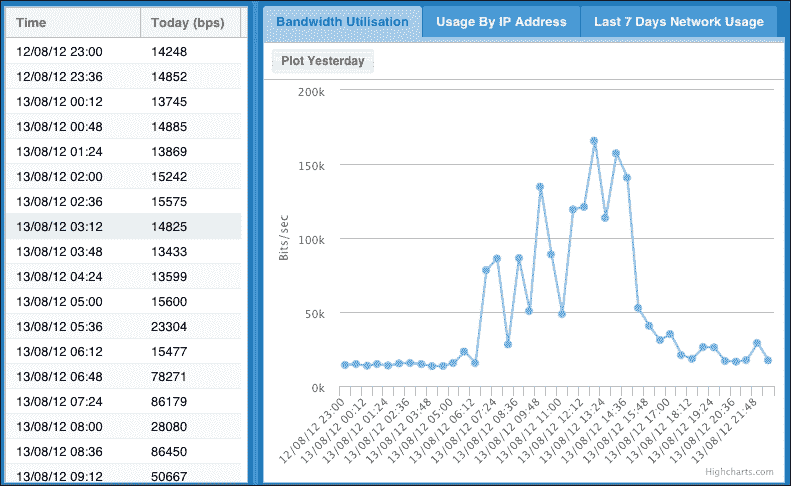

工具栏中的**昨天**按钮是一个切换按钮，它会在同一图表上触发一个额外的系列**昨天**。在左侧表格中还会显示一个名为**昨天**的额外数据列，如下面的截图所示：

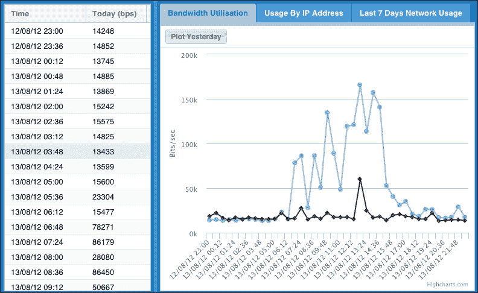

**昨天**按钮处理程序内部使用`addSeries`和`removeSeries`方法来切换**昨天**系列。以下是其实现：

```js
    toggleHandler: function(item, pressed) {
        // Retrieve the chart extension component
        var chart = Ext.getCmp('chart1').chart;
        if (pressed && chart.series.length == 1) {
            Ext.getCmp('chart1').addSeries([{
                name: 'Yesterday',
                yField: 'yesterday'
            }], true);
            // Display yesterday column in the grid panel
            .... 
        } else if (!pressed && chart.series.length == 2) {
            Ext.getCmp('chart1').removeSerie(1);
            // Hide yesterday column in the grid panel
            ....
        }
     }
```

让我们转到第二个标签页，它是一个柱状图，显示了主机列表及其上行和下行方向的网络使用情况，如下所示：

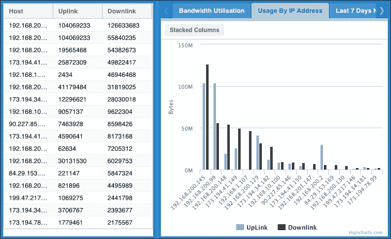

当我们点击**堆叠柱状图**按钮时，两个系列的条形会堆叠在一起，而不是相邻对齐，如下所示：

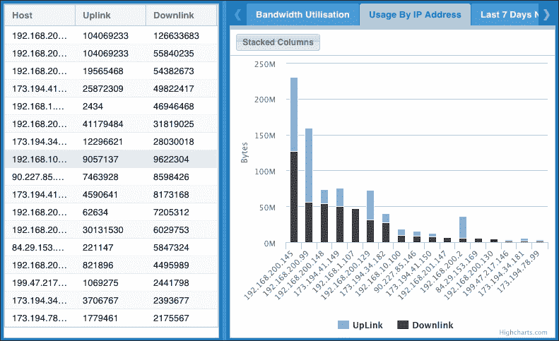

这是通过修改扩展的`chartConfig`属性中的列`stacking`选项，并使用模块的`draw`方法重新创建整个图表来实现的：

```js
  toggleHandler: function(item, pressed) {
       var chart2 = Ext.getCmp('chart2');    
           chart2.chartConfig.plotOptions.column.stacking = 
              (pressed) ? 'normal' : null;
           chart2.draw();
  }
```

注意，我们在创建图表时在`chartConfig`内部声明了默认的`stacking`选项，这样我们就可以在稍后的处理代码中直接修改该属性：

```js
     chartConfig: {
         .... ,                  
         plotOptions: {
             column: { stacking: null }
         },
         ......
```

最后一个标签页是**最近 7 天网络使用情况**，它有一个饼图显示了最近七天的网络使用情况，如下面的截图所示：

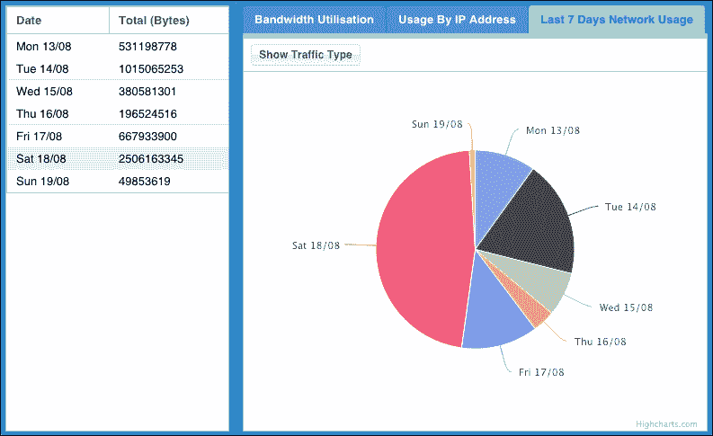

让我们详细看看这个饼图是如何实现的。`JsonStore`被调整为以下格式返回数据：

```js
{"data": [
      {"date": "Mon 13/08", "type": "wan", 
       "bytes": 92959786, "color": "#8187ff" },
      {"date": "Mon 13/08", "type": "lan", 
       "bytes": 438238992, "color": "#E066A3" },
      {"date": "Tue 14/08", "type": "wan", 
       "bytes": 241585530, "color": "#8187ff" },
      {"date":"Tue 14/08", "type": "lan", 
       "bytes": 773479723, "color": "#E066A3" },
      .....
```

然后，我们定义标签页内容，如下所示：

```js
           items:[{              
                 xtype: 'highchart',
                 id: 'chart3',
                 store: summStore,
                 series: [{ 
                     type: 'pie',
                     name: 'Total',
                     categorieField: 'date',
                     dataField: 'bytes', 
                     totalDataField: true,
                     size: '60%',  
                     showInLegend: true,
                     dataLabels: { enabled: true }
                 }],
                 chartConfig: {
                     chart: {...},
                     title: {  text: null },
                     legend: { enabled: false }
                 }
           }]
```

系列被设置为内部系列，因此使用了`totalDataField`和`dataField`选项来获取`"lan"`和`"wan"`的总字节数，作为每个`'host'`的切片值。如果我们点击**显示流量类型**按钮，那么饼图就会变成一个环形图，如下面的截图所示：

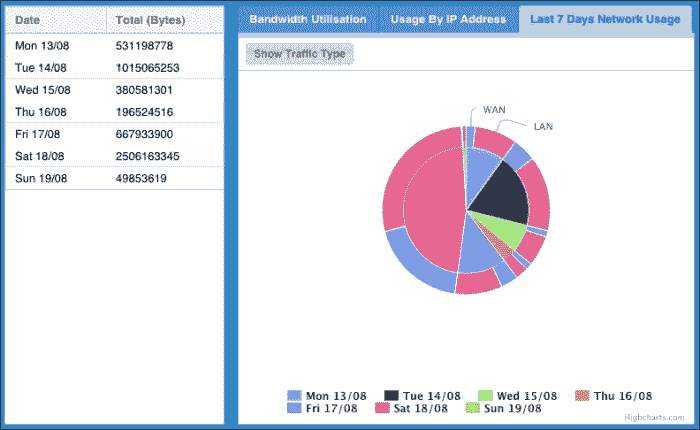

第一张饼图中的原始数据标签被替换为图例框内的项目。一个外部系列以固定的颜色方案显示，以展示**局域网**和**广域网**的流量部分。以下是为**显示流量类型**按钮的按钮处理代码：

```js
     toggleHandler: function(item, pressed) {
         var config = Ext.getCmp('chart3').chartConfig;
         if (pressed) {
             Ext.getCmp('chart3').addSeries([{
                 type: 'pie',
                 center: [ '50%', '45%' ],
                 categorieField: 'type',
                 dataField: 'bytes',
                 colorField: 'color',
                 innerSize: '50%',
                 dataLabels: {
                     distance: 20,
                     formatter: function() {
                       if (this.point.x <= 1) {
                         return this.point.name.toUpperCase();
                       }
                       return null;
                     }
                 },
                 size: '60%'
             }], true);

             config.legend.enabled = true;
             config.series[0].dataLabels.enabled = false;
             config.series[0].size = '50%';
             config.series[0].center = [ '50%', '45%' ];
         } else {
             Ext.getCmp('chart3').removeSerie(1);
             config.legend.enabled = false;
             config.series[0].dataLabels.enabled = true;
             config.series[0].size = '60%';
             config.series[0].center = [ '50%', '50%' ];
         }
         Ext.getCmp('chart3').draw();
     }
```

如果切换按钮被启用，那么我们通过 `addSeries` 方法添加一个外部的饼图系列（带有 `innerSize` 选项）。此外，我们根据流量 `'type'` 对外系列进行相应对齐，因此 `categorieField` 和 `dataField` 被分配给 `'type'` 和 `'bytes'`。由于需要更多信息来显示第二个系列，我们将内部系列的大小设置为更小，以获得更多空间。为了只显示外部系列中的前两个数据标签，我们实现了 `dataLabels.formatter` 来在 `this.point.x` 为 0 和 1 时打印标签。之后，我们在 `formatter` 函数中返回 null 来禁用数据标签。最后，使用 `draw` 方法来反映所有更改。

### 通过点击数据点显示上下文菜单

对于交互式应用，允许用户通过点击数据点来启动特定操作将非常有用。为了做到这一点，我们需要处理 Highcharts 的点击事件。在这里，我们创建了一个简单的菜单，用于显示选定点与系列平均值之间的差异。以下是示例代码：

```js
point: {
  events: {
    click: function(evt) {
      var menu = 
        Ext.create('Ext.menu.Menu', {
          items: [{
            text: 'Compare to Average Usage',
            scope: this,
            handler: function() {
              var series = this.series, 
                  yVal = this, avg = 0, msg = '';

              Ext.each(this.series.data, function(point) {
                avg += point.y;
              });
              avg /= this.series.data.length;

              if (yVal > avg) {
                msg = 
                  Highcharts.numberFormat(yVal - avg) + 
                  " above average (" +               
                  Highcharts.numberFormat(avg) + ")";
              } else {
                msg = 
                  Highcharts.numberFormat(avg - yVal) + 
                  " below average (" +  
                  Highcharts.numberFormat(avg) + ")";
              }

              Ext.Msg.alert('Info', msg);
            }
          }]  // items:
        });

        menu.showAt(evt.point.pageX, evt.point.pageY);
      }
    }
  }
```

首先，我们创建一个简单的 Ext JS `Menu` 对象，带有菜单项 **与平均使用情况比较**。`click` 处理器使用鼠标事件参数 `evt` 被调用，然后我们获取鼠标指针位置，`pageX` 和 `pageY`，并将其传递给菜单对象。结果，在点击数据点后，Ext JS 菜单出现在指针旁边。

在 `click` 事件处理器中的 `'this'` 关键字指的是选定的点对象。然后我们使用 `scope` 选项将 Highcharts 点对象传递给菜单处理器层。在处理器内部，`'this'` 关键字变成了数据点对象，而不是 Ext JS 菜单项。我们提取系列数据来计算平均值，并计算与选定点值的差异。然后，我们显示带有该值的消息。以下是该菜单的截图：

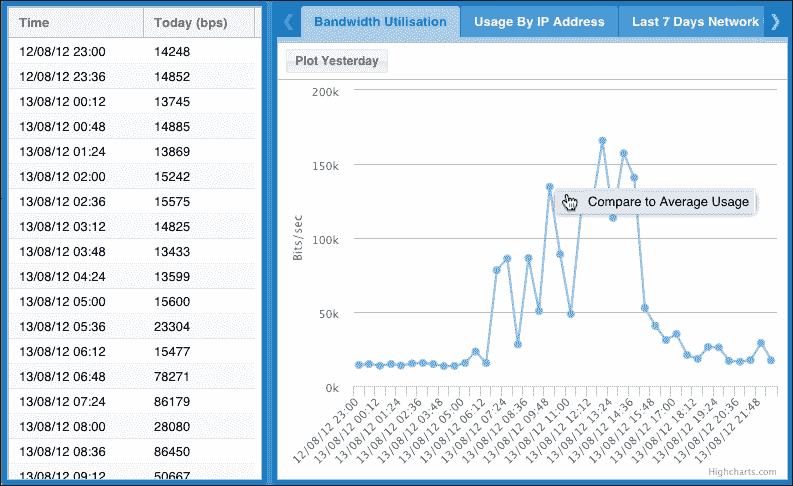

# 带有 Highcharts 的商业 RIA – Profiler

到目前为止，我们已经展示了如何在 Ext JS 框架中应用 Highcharts。然而，这个演示本身对于一个 RIA 产品来说似乎有点过于封闭。在本节中，我们将快速浏览一个商业应用，**Profiler**，这是由 iTrinegy 开发的一个用于分析公司网络场景的工具。由于其业务性质，此类应用需要一系列诊断图表。整个应用被设计成多个门户，用于监控来自多个地点的网络流量。用户可以从利用率图表向下钻取到按 IP 地址排序的上行链路使用情况图表，修改过滤器属性以显示多个系列中的相关数据，等等。

为了微调分析参数并提供门户界面，需要一个提供动态和校准用户界面的框架。因此，Ext JS 是一个合适的候选者，因为它提供了一套丰富的专业外观的小部件组件，并且它的跨浏览器支持使得构建复杂的 RIA 软件变得可管理。以下是通过特定参数启动带宽利用率报告图的界面：

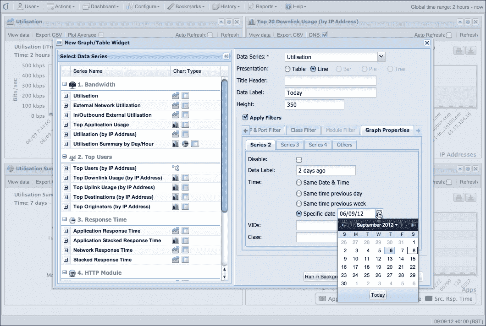

Highcharts 事件可以轻松地与 Ext JS 组件绑定，从而实现全交互式导航风格。例如，如果**利用率**图上出现一个峰值，用户可以点击峰值数据点或突出显示特定时间范围内的区域，然后会出现一个包含网络图选择的上下文菜单。这一操作意味着我们可以将选定的时区添加到累积的过滤器中，并导航到特定的图表。以下是一个上下文菜单的截图，它出现在图表之一中：

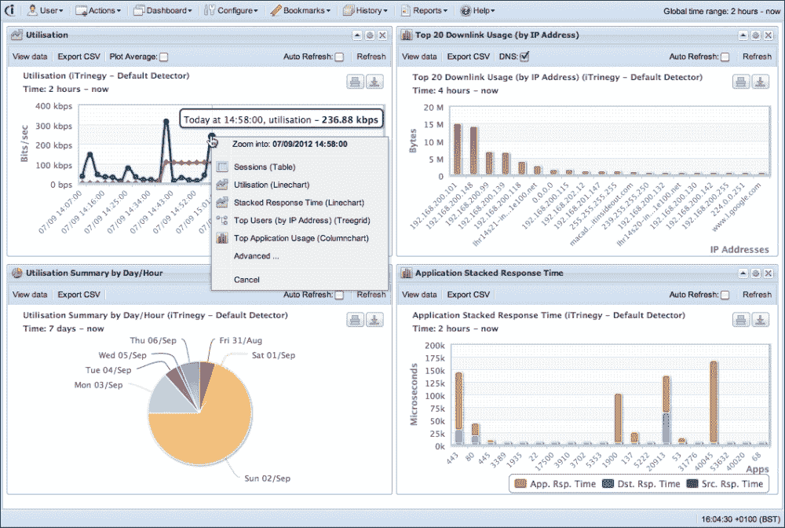

如果我们通过再次选择相同的图表，即**利用率**，这意味着我们想在选定的时区内更详细地放大。这并不使用 Highcharts 的默认缩放操作，它只是拉伸图表系列并重新绘制坐标轴。实际上，它启动了另一个带有选定时间的 Ajax 查询，并返回更细粒度的图表数据，因此可以进一步诊断图中的峰值。换句话说，该应用程序使用户能够通过一系列不同的图表进行视觉筛选。同时，用户逐渐在不同维度上细化过滤器。这个过程以迅速、直观和有效的方式将问题剖析到根本原因。

# 摘要

在本章中，我们学习了 Ext JS 的基础知识，它是一个用于构建**富互联网应用**（**RIAs**）的框架。我们快速介绍了可能用于与 Highcharts 扩展结合使用的十几个 Ext JS 组件。然后，我们以逐步的方式探讨了如何从现有的 Highcharts 配置中创建 Highcharts 组件。我们研究了扩展模块提供的少量 API，并使用网络使用数据构建了一个简单的应用程序。最后，我们简要地看了看 Highcharts 和 Ext JS 在商业网络分析应用中的应用。

在下一章中，我们将探讨如何在服务器端运行 Highcharts。
