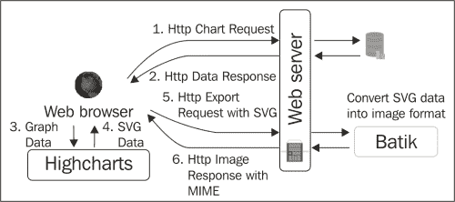
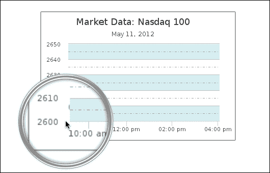
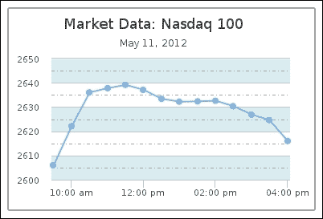
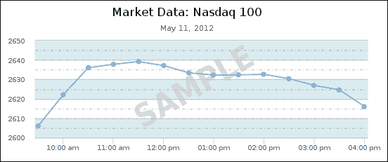

# 第十四章 服务器端 Highcharts

第一版《学习 Highcharts》涵盖了在服务器端运行 Highcharts 的多种方法。从那时起，这个领域已经取得了显著的发展。结果是，Highcharts 采用了 PhantomJS（无头 webkit）作为服务器解决方案，以及 PhantomJS/Batik 作为 Java 服务器实现。我们还将探讨如何使用 PhantomJS 创建我们自己的 Highcharts 服务器进程，以及如何使用 Highcharts 发布的官方服务器端脚本。

在本章中，我们将涵盖以下主题：

+   为什么我们想在服务器端运行 Highcharts

+   为什么 Highcharts 采用了 PhantomJS 和 Batik

+   PhantomJS 和 Batik 的基本知识

+   创建我们自己的 PhantomJS 脚本来导出图表

+   如何在命令行和服务器模式下使用 Highcharts 服务器端脚本

# 在服务器端运行 Highcharts

在服务器端运行 Highcharts 的主要原因是为了允许基于客户端的图形应用程序在服务器端自动化和访问。在某些情况下，我们希望在前端生成图表，同时在后端交付带有图表的自动化报告。为了保持一致性和开发成本，我们希望在两端生成相同风格的图表。以下是我们可能希望在服务器端生成图表的其他场景：

+   应用程序需要在服务器端运行一个计划任务。它生成带有图表的常规总结报告（例如，服务水平协议报告），并自动将报告通过电子邮件发送给客户或具有管理角色的用户。

+   数据的本质意味着它需要很长时间来计算图表。相反，用户将参数发送到服务器以生成图表。一旦完成，图表设置被保存，然后用户被通知查看从预计算的 JSON 设置中实时 Highcharts 图表。

+   应用程序涉及大量重复数据，这些数据仅保留一定时期，例如自动生成并存储为图像格式的数据趋势图表，以供记录。

# 服务器端 Highcharts

在本书的第一版中，我们提到了一些可以用于在服务器端纯服务器端生成图表图像的技术。在这些技术中，PhantomJS 是最突出的。简而言之，它是一个能够运行服务器端 JavaScript 的独立程序。除此之外，它易于使用，设置简单，且可编程且健壮。

另一种方法是使用 Rhino，这是一种 JavaScript 引擎的 Java 实现，可以在服务器端运行 JavaScript，以便 Highcharts 可以在服务器端运行并将图表导出为 SVG 文件。然后，SVG 文件被转发到 Batik，这是一个基于 Java 的通用 SVG 工具包，从 SVG 生成图像文件。

从那时起，Highcharts 对不同的方法进行了广泛实验，并得出结论，将 PhantomJS 纳入解决方案是未来的方向。这个决定有几个原因。首先，与 PhantomJS 相比，Rhino 存在渲染问题，这使得 PhantomJS 成为更好的选择。此外，PhantomJS 还可以导出图像，尽管当数据点的数量增加到约 1,500 时，它在渲染图表方面存在可扩展性问题。还考虑了图像转换器 ImageMagick，但它也存在特定的性能和可靠性问题。有关发现详情，请参阅 [`www.highcharts.com/component/content/article/2-articles/news/52-serverside-generated-charts#phantom_usage`](http://www.highcharts.com/component/content/article/2-articles/news/52-serverside-generated-charts#phantom_usage)。

对于需要在 Java 中实现的服务器端解决方案，Batik 是格式化 SVG 的更自然选择，而 PhantomJS 则用于运行 Highcharts 以处理 SVG 内容。至于非 Java 方法，PhantomJS 本身就足够驱动整个服务器端解决方案。

## Batik – SVG 工具包

Batik 是 Apache 基金会项目的一部分，[`xmlgraphics.apache.org/batik/`](http://xmlgraphics.apache.org/batik/)。其目的是提供一项网络服务，用于查看、生成和转换 SVG 数据。例如，Highcharts 使用第三方软件将 SVG 数据转换为图像格式。当用户点击导出按钮时，Highcharts 内部将图表的 SVG 数据和用户选择的图像格式请求转发给 Batik。

然后，Batik 接收 SVG 数据并将其转换为所需的图像格式。以下图表总结了正常 Highcharts 图表如何使用 Batik 的导出服务：



要安装 Batik，请从 [`xmlgraphics.apache.org/batik/download.html#binary`](http://xmlgraphics.apache.org/batik/download.html#binary) 下载最新发行版，并按照安装说明进行操作。对于 Ubuntu，只需执行以下操作：

```js
apt-get install libbatik-java

```

在整个 Batik 软件包中，我们只需要图像转换组件，即 `batik-rasterizer.jar` 文件。要从 SVG 转码为 PNG 文件，可以使用以下命令：

```js
java -jar batik-rasterizer.jar chart.svg

```

之前的命令将转换 `chart.svg` 并在同一目录下创建 `chart.png`。

## PhantomJS (无头 WebKit)

WebKit 基本上是驱动 Safari 和 Google Chrome 等浏览器的后端引擎。它实现了 HTML5 中的几乎所有功能，除了浏览器的用户界面。PhantomJS（位于 [`phantomjs.org/`](http://phantomjs.org/)，由 Ariya Hidayat 创建和维护）是一个无头 WebKit，这意味着 WebKit 引擎可以作为独立程序运行。它在许多方面都很有用，其中之一就是服务器端 SVG 渲染。

## 创建简单的 PhantomJS 脚本

虽然 Highcharts 发布了一个 PhantomJS 脚本以在服务器端导出图表，但了解 PhantomJS 的概念及其工作原理仍然很有价值。假设我们已经有了一个运行中的 Web 服务器和 PhantomJS。要从命令行在 PhantomJS 上运行 HTML 页面，请运行以下命令：

```js
phantomjs loadPage.js

```

`loadPage.js`页面可以像这样简单：

```js
var page = require('webpage').create();

page.onError = function(msg, trace) {
    console.error(msg);
    phantom.exit(1);
};

page.onConsoleMessage = function(msg) {
    console.log(msg);
};

page.open('http://localhost/mychart.html', function(status) {
    if (status === 'success') {
        console.log('page loaded');
        phantom.exit();
    }
});
```

在 PhantomJS 进程中，它首先加载`webpage`模块并创建一个`page`对象。

### 提示

这只是一个简短的示例，用于说明。对于正确处理错误消息的方法，请参阅 PhantomJS API 文档。

`page.onError`和`page.onConsoleMessage`方法通过`console.log`将页面错误和输出消息重定向到终端输出。请注意，这里的`console.log`是指我们的终端控制台。如果页面内部调用`console.log`，它将仅保留在页面对象的生命周期内，除非定义了`page.onConsoleMessage`来重定向这些消息。

上述脚本仅将 HTML 页面打开到`webpage`对象中，然后终止，这并不特别有用。

### 创建我们自己的服务器端 Highcharts 脚本

让我们以稍微更高级的方式使用 PhantomJS。在 PhantomJS 中，我们不需要依赖 Web 服务器来提供服务页面。相反，我们本地加载一个 Highcharts 页面文件，并包含另一个 JSON 文件中的系列数据。然后，我们将结果渲染到图像文件中。因此，以下是我们在命令行上运行服务器端脚本的方式：

```js
phantomjs renderChart.js chart.html data.json chart.png

```

`chart.html`页面只是一个我们通常会创建的简单 Highcharts 页面。在这个练习中，我们将系列数据保留为变量`seriesData`。以下显示了如何构建`chart.html`页面：

```js
<html>
  <head>
     <meta> ....
     <script src='..../jquery.min.js'></script>
     <script src='..../Highcharts.js'></script>
     <script type='text/javascript'>
     $(function () {
     $(document).ready(function() {
        chart = new Highcharts.Chart({
            chart: {
                ....       
            },
            plotOptions: {
                ....  
            },
            ....,
            series: [{
                   name: 'Nasdaq',
                   data: seriesData
            }]
        });
     });
  });
  </script>
  </head>        
  <body>
   <div id="container" ></div>
  </body>
</html>
```

然后，`data.json`只是一个简单的 JSON 文件，包含*x*和*y*系列数据的数组。以下是其中的一些内容：

```js
[[1336728600000,2606.01],[1336730400000,2622.08],
 [1336732200000,2636.03],[1336734000000,2637.78],
 [1336735800000,2639.15],[1336737600000,2637.09],
 ....
```

对于 PhantomJS 文件`renderChart.js`，令人惊讶的是，我们只需要添加很少的额外代码（粗体突出显示）就能达到结果：

```js
var page = require('webpage').create(),
 system = require('system'),
 fs = require('fs');

// Convert temporary file with series data – data.json
var jsonData = fs.read(system.args[2]);
fs.write('/tmp/data.js', 'var seriesData = ' + jsonData + ';');

page.onError = function(msg, trace) {
    console.error(msg);
    phantom.exit(1);
}

page.onConsoleMessage = function(msg) {
    console.log(msg);
};

// initializes the seriesData variable before loading the script
page.onInitialized = function() {
 page.injectJs('/tmp/data.js');
};

// load chart.html
page.open(system.args[1], function(status) {
    if (status === 'success') {
        // output to chart.png
        page.render(system.args[3]);
        phantom.exit();
    }
});
```

我们首先加载`system`和`fs`模块，这些模块在本例中用于选择命令行参数并在 JSON 文件上处理文件 I/O。脚本基本上读取（`fs.read`）JSON 文件的内容，将其转换为 JavaScript 表达式，并将其保存（`fs.write`）到文件中。然后，我们为页面对象定义`onInitialized`事件处理器，该事件在 URL 加载之前触发。因此，我们在页面对象加载`chart.html`页面之前插入（`injectJs`）`seriesData`的 JavaScript 表达式。一旦页面加载，我们就将页面内容导出（`page.render`）到图像文件中。

注意，生成的图像文件并不完全正确，因为折线系列实际上缺失了。然而，如果我们更仔细地观察图像，实际上线条已经开始绘制（请参见以下截图）：



这是因为图表默认的动画设置。在我们通过将 `plotOptions.series.animation` 选项设置为 `false` 关闭初始动画后，线条系列就会出现：



# 运行 Highcharts 服务器脚本

到目前为止，我们的脚本示例在功能和错误检查功能方面还不足，远非完美。尽管如此，我们可以看到创建自己的服务器端 Highcharts 进程以生成图像是多么容易。在本节中，你将学习如何使用 Highcharts 的官方服务器端脚本，它具有更多功能，可用于不同场景。

## 服务器脚本使用

自版本 3 以来，Highcharts 与服务器端脚本 `highcharts_convert.js` 一起打包，该脚本位于 `exporting-server/phantomjs` 目录中。该脚本可以作为命令行或监听服务器运行。

### 小贴士

对于用法和参数的完整描述，请参阅 [`github.com/highslide-software/highcharts.com/tree/master/exporting-server/phantomjs`](https://github.com/highslide-software/highcharts.com/tree/master/exporting-server/phantomjs)。

### 将脚本作为独立命令运行

这是 `highcharts_convert.js` 的典型命令行格式：

```js
phantomjs highcharts-convert.js -infile file 
 -outfile chart1.png | -type ( png | jpg | pdf | svg ) -tmpdir dir
 [-scale num | -width pixels ] [ -constr (Highcharts | Highstocks) ]
 [-callback script.js ]

```

以下是在前一个命令中使用的参数列表：

+   `-infile`：这是脚本的输入源，可以是 JSON 格式的图表配置（通用用法）或 SVG 文件。服务器脚本会自动检测内容类型，并按所需格式处理和导出图表/内容。

+   `-outfile`，`-type`，`-tmpdir`：指定输出格式的两种方式是通过 `-type` 或 `-outfile`。使用 `-outfile` 参数时，脚本将从扩展名推导图像格式。或者，使用 `-type`，例如，输入 `png`，将格式化为 PNG 图像文件，并使用 `-tmpdir` 将输出文件保存到特定位置。

+   `-scale`，`-width`：有两个可选参数用于调整输出图像大小，通过 `-scale` 或 `-width`。正如其名所示，一个是通过缩放调整大小，另一个是通过绝对大小调整。

+   `-constr`：`-constr` 参数用于指示脚本是否将图表导出为 Highcharts 或 Highstock 图表（另一个用于金融图表的产品）。

+   `-callback`：`-callback` 参数用于在图表加载后和导出之前执行额外的 JavaScript 代码。

让我们将之前的图表配置文件应用到这个命令行中。此外，我们还将使用回调参数在图表上叠加水印，`SAMPLE`。

首先，我们将整个图表配置对象及其系列数据保存到文件中：

```js
            { chart: {
                renderTo: 'container',
                height: 250,
                spacingRight: 30,
                animation: false
              },
              . . . .
            }
```

然后，我们创建一个回调脚本，以下代码用于添加水印，`watermark.js`：

```js
function(chart) {
    chart.renderer.text('SAMPLE', 220, 200).
          attr({
              rotation: -30
          }).
          css({
              color: '#D0D0D0',
              fontSize: '50px',
              fontWeight: 'bold',
              opacity: 0.8
          }).
          add();
}
```

最后，我们运行以下命令：

```js
phantomjs highcharts-convert.js -infile options.json -outfile chart.png -width 550 -callback watermark.js

```

命令在运行时会生成输出：

```js
Highcharts.options.parsed
Highcharts.cb.parsed
Highcharts.customCode.parsed
/tmp/chart.png

```

它还生成以下截图：



### 以监听服务器运行脚本

要将脚本作为监听 HTTP 请求的服务器运行，我们使用以下命令启动脚本：

```js
phantomjs highcharts-convert.js -host address -port num
 -type ( png | svg | jpg | pdf )

```

让我们使用以下命令启动一个 Highcharts 导出服务器：

```js
phantomjs highcharts-convert.js -host 127.0.0.1 -port 9413 -type png

```

这将启动一个只监听本地端口 9413 的服务器，以下消息输出到屏幕：

```js
OK, PhantomJS is ready.

```

### 向监听服务器传递选项

一旦服务器进程准备就绪，我们就可以开始发送嵌入 Highcharts 配置数据中的 POST 请求。请求中使用的 Highcharts 选项与我们在命令行中使用的相同。让我们重用上一个练习中的配置，并将它们打包成一个 POST 请求。

首先，我们需要将整个图表配置“字符串化”为一个值，作为 `infile` 选项的值。接下来，我们以同样的方式处理回调方法。然后，我们将其余的选项放入一个 JSON 格式，并保存到一个名为 `post.json` 的文件中：

```js
{ "infile" : " { chart: { .... }, series { .... } } " , 
  "callback" : "function(chart) { .... } ",
  "scale" : 1.2
}
```

下一个任务是把这个数据打包成一个 POST 查询。由于本章的目的是服务器端处理，我们应该以命令行风格操作。因此，我们使用 `curl` 工具来创建一个 POST 请求。以下命令可以完成这项工作：

```js
curl -X POST -H "Content-Type: application/json" -d @post.json http://localhost:9413/ | base64 -d > /tmp/chart.png

```

之前的 `curl` 命令是用来创建一个带有 JSON 内容类型的 POST 请求。`-d @` 参数通知 `curl` 命令哪个文件包含 POST 数据。由于 HTTP 是一个 ASCII 协议，结果二进制图像数据的响应以 base-64 编码返回。因此，我们需要将 POST 响应数据管道到另一个实用程序，base64，以解码数据并将其写入文件。

# 摘要

在本章中，我们描述了在服务器端运行 Highcharts 的目的，并学习了 Highcharts 在服务器上选择使用的技术。你学习了 PhantomJS 的基础知识以及 Batik 的作用。你扩展了对 PhantomJS 的理解，以创建自己的 Highcharts 服务器端脚本。除此之外，我们还实验了如何以单命令行和服务器模式运行 Highcharts 发布的官方 PhantomJS 脚本。

在下一章中，我们将简要了解 Highcharts 提供的在线服务，并探索一些 Highcharts 插件。
