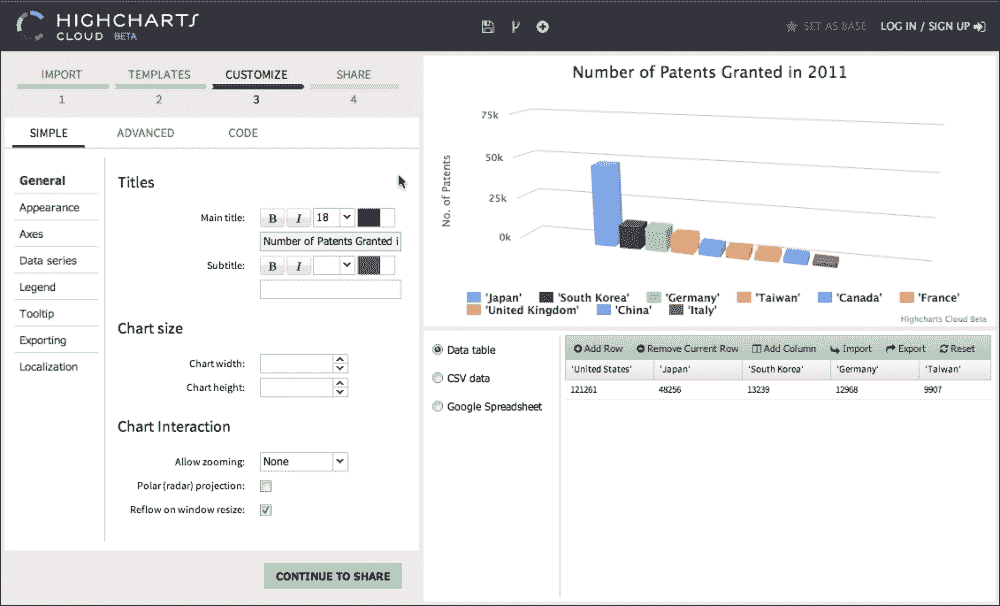

# 第十五章. Highcharts 在线服务和插件

在上一章中，你学习了如何在服务器端运行 Highcharts。这使得 Highcharts 能够将其范围扩展到在线服务。我们将在本章中访问这些服务，并探讨我们可以从它们中获得哪些好处。此外，我们还将探讨如何通过插件扩展 Highcharts。在本章中，我们将涵盖以下主题：

+   服务 [export.highcharts.com](http://export.highcharts.com) 提供的内容

+   使用新云服务——[cloud.highcharts.com](http://cloud.highcharts.com) 创建在线图表的逐步练习

+   高 charts 插件是什么

+   两个插件示例 - 回归和可拖动点

+   通过互操作插件创建新的用户体验

+   如何编写插件 – 扩展现有方法、导出新方法以及处理事件

# Highcharts 导出服务器 – export.highcharts.com

在上一章中，我们探讨了在服务器端运行 Highcharts。然而，一些用户可能不想设置自己的服务器操作。这时，[export.highcharts.com](http://export.highcharts.com) 就派上用场了。最初，它仅用于设置导出模块，以便在互联网上运行 Highcharts 的用户可以自由导出他们的图表。后来，URL 扩展以支持在线服务。这使得用户可以输入自己的 Highcharts 配置并下载生成的图表图像。

以下内容是 [export.highcharts.com](http://export.highcharts.com) 网页的一部分：


如我们所见，用户输入确实对应于服务器端脚本的参数，即我们在上一章中提到的 `highcharts_convert.js`。Web 界面和服务器过程都是用 Java 实现的，它们将用户的选择传递给 PhantomJS/`highcharts_convert.js` 进程，并将其导出为 SVG。一旦 Java 服务器收到 SVG 结果，它就会启动 Batik 将其格式化为图像文件。整个网络服务解决方案的源代码位于 `exporting-server/java/highcharts-export` 目录中。

在线导出服务的缺点是它不是所见即所得（WYSIWYG），因此使用起来可能不太直观。因此，诞生了一个具有更丰富用户体验的新网络服务——**Highcharts 云服务**。我们将在下一节中体验一下，看看它带来了哪些不同。

# Highcharts 云服务

在本节中，我们将回顾由 Highcharts 团队开发的一个全新的在线图表服务——Highcharts 云服务 ([`cloud.highcharts.com`](http://cloud.highcharts.com))。以下截图显示了初始欢迎屏幕：


Highcharts 云服务是扩展产品线的一个重大里程碑。它旨在为用户提供：

+   即使没有任何 JavaScript 或 Highcharts 知识，也能创建 HTML5 图表（在 SIMPLE 模式下）

+   无需在 Web 服务器和 Highcharts 上安装和设置，即可交互式地原型化图表

+   使用简单的超链接将图表嵌入在线文章、应用程序或网页中

+   将他们的图表存储在云中而不是本地

+   与其他人轻松分享他们的图表

以下是从云服务创建的图表的新闻网站截图：


让我们尝试使用云服务创建我们的第一个图表。Web 界面基于向导，对任何非技术用户来说都是直观的。以下是云服务的初始屏幕：


界面中分为三个主要部分：左侧向导面板、右上角的结果图表面板和右下角的系列数据编辑器。在左侧向导面板的顶部，显示了我们当前所处的阶段。在第一个阶段（**导入**），我们可以将 CSV 数据粘贴到文本区域并点击上传，或者通过右下角的编辑器手动输入系列数据。

在前一张截图中，我们已经在左侧面板中粘贴了一些数据。当我们点击**上传并继续**按钮时，应用程序进入第 2 阶段（**模板**）。以下是截图：


首先，我们可以看到右上角面板更新了默认的折线系列，而右下角的编辑器面板填充了系列数据。尽管右上角的图表没有显示任何有意义的内容，但在稍后的配置阶段将会变得清晰。在此阶段，如果我们需要，可以进一步在编辑器面板中编辑系列数据。让我们在左侧面板中选择一个系列，**3D 柱状图**，这将立即更新右上角的图表：


在右上角面板中显示了一个 3D 柱状图，但坐标轴和图表标题仍然不正确。我们可以点击**继续自定义**按钮（如前一张截图所示）或点击**自定义**进入下一阶段，调整图表中的每个组件：



如我们所见，图表中有不同的区域我们可以选择进行配置。在这个例子中，我们已更改了图表标题、坐标轴类型、标题和标签格式。请注意，在**自定义**阶段，下面显示了三个标签。这使用户可以选择如何更新图表。**简单**是最基本的，适用于没有编程经验的技术用户，或者用于快速简单的更改。**高级**模式适用于熟悉 Highcharts 选项的用户。用户界面是以名称和值样式进行的简单属性更新。**代码**级别适用于希望为图表编写 JavaScript 代码的用户，例如事件处理程序。以下截图显示了**高级**和**代码**用户界面：


一旦我们对最终的图表满意，我们可以点击 **继续分享** 以生成图表的链接。

# Highcharts 插件

Highcharts 可以通过插件进行扩展，这些插件允许我们在不干扰代码核心层的情况下添加功能，并且易于共享。网上有一个插件库，由 Highcharts 员工和其他用户贡献，位于 [`www.highcharts.com/plugin-registry`](http://www.highcharts.com/plugin-registry)。开发插件功能的一个显著优势是我们可以选择和选择插件功能，并从中构建一个压缩的 JavaScript 库。实际上，我们已经在下载页面上的 Highcharts 库中做到了类似的事情。

在本节中，我们将浏览一些你可能觉得有用的插件。

## 回归绘图插件

当我们创建一个包含大量数据点的散点图时，通常值得叠加回归线。当然，我们可以通过手动添加线系列来实现这一点。然而，我们仍然需要编写回归分析的代码。包含一个插件会方便得多。Ignacio Vazquez 创建的 Highcharts 回归插件做得很好。首先，我们包含该插件：

```js
<script src="img/highcharts-regression.js"> </script>
```

然后，我们像往常一样创建我们的散点图。由于我们包含了回归插件，它提供了额外的回归选项：

```js
            series: [{
                regression: true ,
                regressionSettings: {
                    type: 'linear',
                    color:  'rgba(223, 83, 83, .9)'
                },
                name: 'Female',
                color: 'rgba(223, 83, 83, .5)',
                data: [ [161.2, 51.6], [167.5, 59.0],
                        .... 
```

这里是演示中的图表（[`www.highcharts.com/plugin-registry/single/22/Highcharts%20regression`](http://www.highcharts.com/plugin-registry/single/22/Highcharts%20regression)）：


## 可拖动点插件

这里是 Torstein 另一个引人注目的插件，它允许图表查看者拖动任何系列数据点。我们使用以下行导入该插件：

```js
<script src="img/draggable-points.js"></script>
```

此插件引入了两个新的点事件，`drag` 和 `drop`，我们可以通过 `plotOptions.series.point.events` 选项（或数据点对象中的 `events` 选项）来定义处理程序。以下是演示中的示例代码：

```js
events: {                    
     drag: function(e) {
         // Update new data value in 'drag' div box
         $('#drag').html(
             'Dragging <b>' + this.series.name + '</b>, <b>' +
             this.category + '</b> to <b>' + 
             Highcharts.numberFormat(e.newY, 2) + '</b>'
         );
     },
     drop: function() {
         $('#drop').html(
              'In <b>' + this.series.name + '</b>, <b>' +
               this.category + '</b> was set to <b>' + 
               Highcharts.numberFormat(this.y, 2) + '</b>'
         );
     }
 }
```

当我们选择一个数据点并移动鼠标时，会触发拖动事件，并且演示代码将更新图表下方的文本框，如下面的截图所示。该插件提供了几个新选项来控制我们如何拖放数据点。以下是一个使用示例：

```js
    series: [{
        data: [0, 71.5, 106.4, .... ],
        draggableY: true,
        dragMinY: 0,
        type: 'column',
        minPointLength: 2
    }, {
        data: [0, 71.5, 106.4, ....],
        draggableY: true,
        dragMinY: 0,
        type: 'column',
        minPointLength: 2
    }, {
```

布尔选项 `draggableX/Y` 通知数据点可以拖动的方向。此外，可以通过 `dragMinX/Y` 和 `dragMaxX/Y` 选项限制拖动范围。以下截图显示了正在拖动的柱状图：


## 通过组合插件创建新的效果

到目前为止，我们已经看到了两个独立插件的效果。是时候通过加载这两个插件并组合它们的效果来创建新的用户体验了。想法是创建一个带有可移动数据点的回归图，这样当我们拖动一个数据点时，回归线会自动实时调整。在这样做的时候，我们需要稍微修改回归插件代码。以下是原始代码的一部分：

```js
(function (H) {

    H.wrap(H.Chart.prototype, 'init', function (proceed) {
       ....
       for (i = 0 ; i < series.length ; i++){
            var s = series[i];
            if ( s.regression && !s.rendered ) {
                 // Create regression series option
                 var extraSerie = {
                     ....
                 };
                 // Compute regression based on the type
                 if (regressionType == "linear") {
                    regression = _linear(s.data) ;
                    extraSerie.type = "line";
                 }
            }
      }
      // Append to series configuration array
      ....
   });

   function _linear(data) {
   ....
   }

   ....
})(Highcharts);
```

基本上，在图表创建和渲染之前，插件会扫描系列数据，计算回归结果，并将结果格式化为线系列选项。为此，回归实现被包含在 `Chart` 类的 `init` 方法中，该方法在创建 `Chart` 对象时被调用。为了扩展 Highcharts 中的现有功能，我们在对象的原型中的方法上调用 `wrap` 函数。换句话说，当创建 `Chart` 对象时，它将调用 `init` 函数，该函数执行堆叠在内部的每个函数（闭包）。我们将在稍后进一步研究这个主题。

为了在运行时更新回归线，我们需要从插件外部调用 `_linear` 的能力。以下是添加新方法 `updateRegression` 的新修改的伪代码：

```js
(function (H) {    
    H.wrap(H.Chart.prototype, 'init', function (proceed) {
     ....
    });

    H.Chart.prototype.updateRegression = function(point) {
          // Get the series from the dragged data point
          var series = point.series;
          var chart = series.chart;
          // Get the regression series associated 
          // with this data series
          var regressSeries = chart.series[series.regressIdx];

          // Recompute based on the regression type and 
          // update the series
          if (series.regressionType == "linear") {
            regression = _linear(series.data) ;
          }
          regressSeries.update(regression, true);
    };

   function _linear(data) {
   ....
   }

   ....
})(Highcharts);
```

现在我们有一个具有可访问方法 `updateRegression` 的回归插件，可以调用内部作用域函数 `_linear`。有了这个新的插件函数，我们可以将功能与可拖拽插件导出的 `drag` 事件链接起来：

```js
plotOptions: {
  series: {
    point: {
      events: {
          drag: function(e) {
             // Pass the dragged data point to the     
             // regression plugin and update the
             // regression line
             Highcharts.charts[0]
                          .updateRegression(e.target);
        }
      }
    }
  }
}    
```

为了更清楚地观察新的效果，我们使用了一组更小的散点图。以下是包含两个插件选项的系列配置：

```js
    series: [{
        regression: true ,
        regressionSettings: {
            type: 'linear',
            color:  'rgba(223, 83, 83, .9)'
        },
        draggableX: true,
        draggableY: true,
        name: 'Female',
        color: 'rgba(223, 83, 83, .5)',
        data: [ [161.2, 51.6], [167.5, 59.0], [159.5, 49.2], 
                [157.0, 63.0], [155.8, 53.6], [170.0, 59.0],
                [159.1, 47.6], [166.0, 69.8], [176.2, 66.8],
                ....
```

在配置中，我们有在 x 和 y 方向上都可以拖动的散点图，回归类型是线性的。让我们加载我们新的改进图表。以下是初始屏幕：


让我们假设一种过度活跃、未经批准的减肥药“鼠标按下”已经进入市场，它有一些未报告的副作用。不幸的人会迅速增加，而真正不幸的人的身高会下降。以下是新结果的结果：


当我们在最右侧的数据点的这些权重上按下鼠标时，回归线会实时响应，并更新左上角的图例框。

## 创建插件的指南

一些用户创建插件是因为某些任务无法通过 API 完成，而且这个任务足够通用，对其他图表用户也有益。然而，没有标准的 API 来创建插件；开发者必须亲自动手，利用他们对 Highcharts 代码的了解。尽管如此，我们可以从现有的插件中概括出一些指导方针。

### 在自调用匿名函数中实现插件

总是在一个自调用的匿名函数中实现插件，并将 Highcharts 作为参数。自调用的匿名函数是 JavaScript 中相当常见的技术。所有 Highcharts 插件都是用这种方式实现的。以下代码展示了示例：

```js
(function (Highcharts) {
        ....
        // what happens in anonymous function, 
        // stays in anonymous function
        function hangoverIn(place) { 
           if (place === 'home') {
                return 'phew';
            } else if (place === 'hospital') {
                return 'ouch';
            } else if (place === 'vegas') {
                return 'aaahhhhh!!';
            }
        }
})(Highcharts);
```

插件中声明的所有命名函数和变量都无法从外部访问，因为它们是在自调用的匿名函数的作用域内声明的（闭包和模块模式）。因此，实现对外部是私有的，除非我们在 Highcharts 命名空间中分配属性。

### 使用 Highcharts.wrap 来扩展现有函数

根据插件任务，某些插件需要扩展现有函数。例如，回归插件调用 `H.wrap` 来扩展 `init` 函数，该函数由 `Chart` 构造函数调用。请参见以下代码：

```js
(function (H) {
    H.wrap(H.Chart.prototype, 'init', 
        function (proceed) {
            // Plugin specific code for processing 
            // chart configuration
            .... 
            // Must include this instruction for wrap 
            // method to work
            proceed.apply(this,
                 Array.prototype.slice.call(arguments, 1));
        }
    );
})(Highcharts);
```

`Highcharts.wrap` 是插件中常用的一种函数。`wrap` 函数的工作方式是用包含先前实现 `proceed` 的新函数体覆盖 `init` 函数。当我们用匿名函数中的新插件代码扩展方法时，我们必须接受 `proceed` 参数，它代表父函数体。在我们自己的插件代码之前或之后，我们必须对相同的参数调用 `proceed.apply`，以完成执行链。

作为参考，我们始终可以扩展特定系列的方法，例如 `Highcharts.seriesTypes.column.prototype`，其中 `seriesTypes` 是一个包含所有系列类的对象。或者，如果插件需要为所有系列设置，我们可以调用 `Highcharts.Series.prototype` 上的 `wrap` 方法代替（所有系列类都是从 `Highcharts.Series` 扩展的）。

### 使用原型来暴露插件方法

有时我们可能需要为插件导出特定的方法。为此，我们应始终在 `prototype` 属性内部定义新方法，例如：

```js
(function (H) {
     H.Chart.prototype.pluginMethod = function(x, y) {
        ....            
     };
})(Highcharts);
```

这是因为在匿名函数内声明的任何代码都无法从外部访问。因此，创建可调用方法的唯一方法是将对象绑定到匿名函数传递的对象上，在这种情况下是顶级 Highcharts 对象。`prototype` 属性是 JavaScript 中从对象继承属性和方法的标准方式。在 `prototype` 属性中附加方法的原因是我们不知道开发者会如何使用插件。例如，他们可能会决定创建一个新的 `Chart` 对象并调用插件方法。在这种情况下，插件代码仍然可以工作。

### 定义一个新的事件处理器

插件的一种动作类型是定义新事件，正如我们在可拖动插件中看到的那样。这里的问题是：我们需要访问图表元素来绑定事件处理器，也就是说，在图表渲染之后。然而，`init` 类方法是在图表渲染之前执行的。这就是`Highcharts.Chart.prototype.callbacks` 数组发挥作用的地方。这是一个设计用来存储需要访问元素的外部函数的地方。例如，导出模块使用这个数组来在图表中插入按钮。以下是一些设置事件的伪代码：

```js
(function (H) {
    Highcharts.Chart.prototype.callbacks.push(function (chart) {
        // A DOM element, e.g. chart, container, document,
        var element = chart.container;
        // DOM event type: mousedown, touchstart, etc
        var eventName = 'mousedown';

        // We can call fireEvent to fire a new event 
        // defined in this plugin
        fireEvent(element, newEvent, evtArgs, 
                  function(args) {
                  ....
        });

        // Plugin event
        function handler(e) {
                // Plugin code
                ...
        }
        // Bind specific event to the defined handler
        Highcharts.addEvent(element, eventName, handler);
    });
})(Highcharts);
```

Highcharts 有两个与事件相关的方法：`addEvent` 和 `fireEvent`。前者方法是将事件绑定到图表元素并带有处理器，而 `fireEvent` 则在元素上触发事件。

之前的代码基本上创建了一个匿名函数，该函数组织所有事件设置，例如定义处理器并将它们绑定到元素上。该函数必须接受 `chart` 作为唯一参数。最后，我们将该函数追加到 `callbacks` 数组中。该函数将在图表完全渲染后自动执行。

# 摘要

在本章中，我们参观了 Highcharts 在线导出服务器和新的云服务。我们对云服务进行了简短的游览，并展示了我们如何在线创建图表，而无需任何先前的 JavaScript 和 Highcharts 知识。另一个讨论的主题是 Highcharts 插件，我们在其中尝试了两个插件：回归和可拖动数据点。然后我们演示了如何修改一个插件，使其两个插件能够协同工作，提供新的用户体验。

到目前为止，我所有关于 Highcharts 的知识和经验都包含在这本日志中。在三年内完成两版对我来说比预期的要困难得多。因此，我的 Highcharts 之旅已经结束，我可以把时间重新投入到它应该始终在的地方，家庭。对于您购买和阅读这本书，我表示由衷的感谢。我的目标是向您展示 Highcharts 的动态性和令人印象深刻之处，我希望我已经实现了这一点，并以一个高调的结尾结束了这本书。
