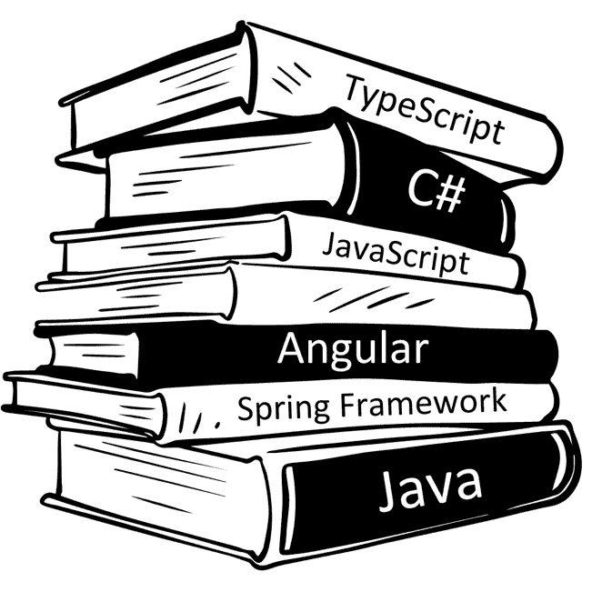
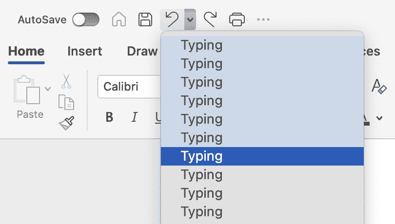
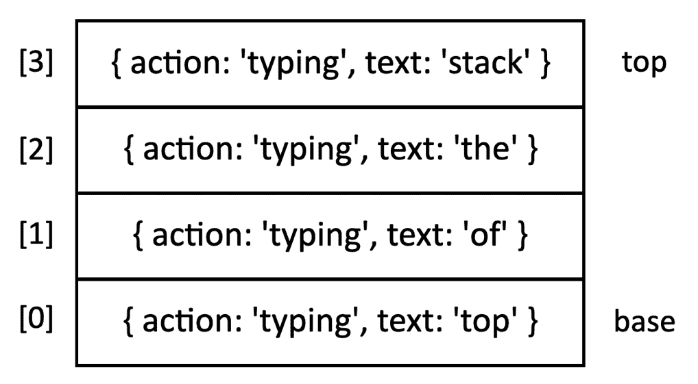
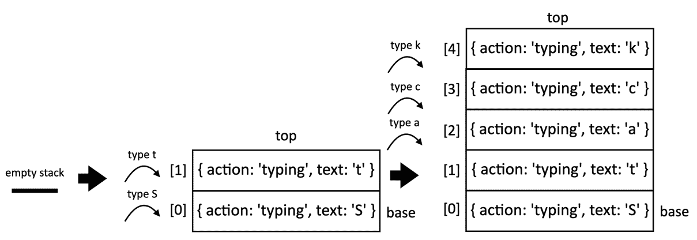
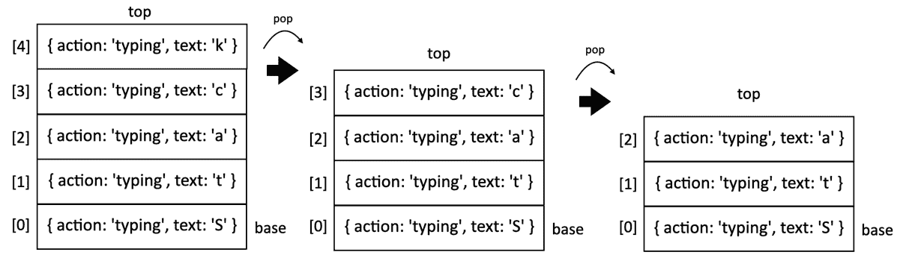
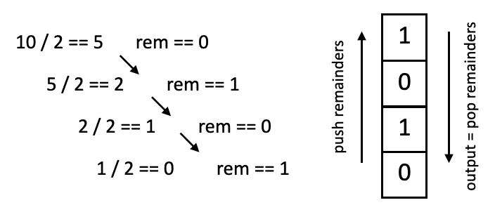

# 第五章：4 栈

**在开始之前：加入我们的 Discord 书籍社区**

直接向作者本人提供反馈，并在我们的 Discord 服务器上与其他早期读者聊天（在“学习 JavaScript 数据结构与算法 4e”频道下找到“EARLY ACCESS SUBSCRIPTION”）。


[`packt.link/EarlyAccess/`](https://packt.link/EarlyAccess/)

在上一章中，我们学习了如何创建和使用数组，这是计算机科学中最常见的类型之一。正如我们所学的，我们可以在任何所需的索引处向数组中添加或移除元素。然而，有时我们需要某种形式的数据结构，使我们能够更多地控制添加和移除项目。有两种数据结构与数组有一些相似之处，但它们使我们能够更多地控制元素的添加和移除。这些数据结构是**栈**和**队列**。

在本章中，我们将涵盖以下主题：

+   栈数据结构

+   向栈中添加元素

+   从栈中弹出元素

+   如何使用 Stack 类

+   我们可以使用栈数据结构解决的问题

## 栈数据结构

想象你在自助餐厅或食品广场有一堆托盘，或者像以下图像中那样有一堆书籍：



图 4.1：关于编程语言和框架的书籍堆

现在假设你需要向这堆书中添加一本新书。标准做法是将新书简单地放在书籍堆的顶部。如果你需要将书籍放回书架，你会拿起堆顶的书籍，放好，然后取走堆顶的下一本书，直到所有书籍都被存放好。从书籍堆中添加或移除书籍的行为遵循栈数据结构的相同原则。

栈是有序元素集合，遵循**后进先出**（**LIFO**）原则。新元素的添加或现有元素的移除发生在同一端。栈的末端被称为**顶部**，起始端被称为**底部**。最新元素靠近顶部，最旧元素靠近底部。

栈在编程语言中的编译器中被使用，用于在计算机内存中存储变量和方法调用，以及浏览器历史记录（浏览器的后退按钮）。

另一个栈数据结构的真实世界例子是文本编辑器（如 Microsoft Word 或 Google 文档）中的*撤销功能*，如下面的图像所示：



图 4.2：Microsoft Word 软件中撤销风格功能的图像

在此示例中，我们有一个由 Microsoft Word 内部使用的栈：*撤销样式*功能，其中所有在文档中执行的操作都被堆叠起来，我们可以通过点击撤销样式按钮多次来撤销任何操作，直到操作栈为空。

让我们通过使用 JavaScript 和 TypeScript 创建自己的栈类来将这些概念付诸实践。

## 创建基于数组的栈类

我们将创建自己的类来表示栈。本章的源代码可在 GitHub 上的`src/04-stack`文件夹中找到。

我们将首先创建`stack.js`文件，该文件将包含我们使用基于数组的策略表示栈的类。

首先，我们将声明我们的`Stack`类：

```js
class Stack {
  #items = []; // {1}
  // other methods
} 
```

我们需要一个数据结构来存储栈的元素。由于我们已经熟悉数组数据结构（`{1}`），我们可以使用数组来完成此操作。此外，注意变量`items`的前缀：我们使用了一个哈希`#`前缀。这意味着`#items`属性只能在`Stack`类内部引用。这将允许我们保护这个私有数组，因为数组数据结构允许我们在数据结构的任何位置添加或删除元素。由于栈遵循 LIFO 原则，我们将限制可用于插入和删除元素的功能。

`Stack`类中将提供以下方法：

+   `push(item)`: 此方法将新项目添加到栈的顶部。

+   `pop()`: 此方法从栈中移除顶部元素。它还返回被移除的元素。

+   `peek()`: 此方法返回栈的顶部元素。栈不会被修改（它不会删除元素；它只返回元素以供信息用途）。

+   `isEmpty()`: 此方法返回`true`，如果栈不包含任何元素，如果栈的大小大于 0，则返回`false`。

+   `clear()`: 此方法移除栈中的所有元素。

+   `size()`: 此方法返回栈包含的元素数量。它与数组的`length`属性类似。

我们将在以下章节中为每个方法编写代码。

### 将元素推送到栈顶

我们将要实现的第一种方法是`push`方法。此方法负责向栈中添加新元素，有一个非常重要的细节：我们只能将新项目添加到栈顶，即数组的末尾（内部）。`push`方法表示如下：

```js
push(item) {
  this.#items.push(item);
}
```

由于我们使用数组来存储栈的元素，我们可以使用上一章中介绍的 JavaScript `Array`类的`push`方法。

### 从栈中弹出元素

接下来，我们将实现 `pop` 方法。此方法负责从堆栈中移除项目。由于堆栈使用 LIFO 原则，我们将移除最后添加的项目。因此，我们可以使用 JavaScript `Array` 类中的 `pop` 方法，我们在上一章中也介绍了这个方法。`Stack.pop` 方法表示如下：

```js
pop() {
  return this.#items.pop();
}
```

如果堆栈为空，此方法将返回值 `undefined`。

由于 `push` 和 `pop` 方法是唯一可用于向堆栈添加和移除项目的功能，LIFO 原则将适用于我们的 `Stack` 类。

### 查看堆栈顶部的元素

接下来，我们将在我们的类中实现额外的辅助方法。如果我们想知道最后添加到我们的堆栈中的元素是什么，我们可以使用 `peek` 方法。此方法将返回堆栈顶部的项目：

```js
peek() {
  return this.#items[this.#items.length - 1];
}
```

由于我们使用数组来内部存储项目，我们可以使用 `length - 1` 来从数组中获取最后一个项目，如下所示：



图 4.3：模拟文本编辑器撤销功能的四个打字动作的堆栈。

假设我们正在模拟文本编辑器的撤销功能。我们输入 "stack 的顶部"。我们正在开发的功能将分别堆叠每个单词。因此，我们将得到一个包含四个项目的堆栈；因此，内部数组的长度是 4。在内部数组中使用的最后一个位置是 3。因此，`length - 1`（4 - 1）是 3。

因此，如果我们查看堆栈的顶部，我们将得到以下结果：`{ action: 'typing', text: 'stack' }`。

### 验证堆栈是否为空及其大小

我们将要创建的下一个方法是 `isEmpty` 方法，它返回 `true` 如果堆栈为空（没有添加元素），否则返回 `false`：

```js
isEmpty() {
  return this.#items.length === 0;
}
```

使用 `isEmpty` 方法，我们可以简单地验证内部数组的长度是否为 0。

就像从数组类继承的 `length` 属性一样，我们也可以为我们的 `Stack` 类添加一个获取长度的 getter。对于集合，我们通常使用术语 `size` 而不是 `length`。同样，由于我们使用数组来内部存储元素，我们可以简单地返回其 `length`：

```js
get size() {
  return this.#items.length;
}
```

在 JavaScript 中，我们可以利用 getter 来高效地跟踪我们的堆栈数据结构的大小。Getter 提供了更简洁的语法，允许我们像访问属性一样检索大小（`myStack.size`），而不是调用像 `myStack.size()` 这样的方法。这增强了代码的可读性和可维护性。

### 清除堆栈的元素

最后，我们将实现 `clear` 方法。`clear` 方法简单地清空堆栈，移除所有元素。实现此方法的最简单方式是直接将内部数组重置为空数组，如下所示：

```js
clear() {
  this.#items = [];
}
```

另一种实现方式是调用 `pop` 方法直到堆栈为空：

```js
clear2() {
  while (!this.isEmpty()) {
   this.pop();
  }
}
```

然而，在大多数情况下，JavaScript 中第一种实现被认为是更好的，因为它更高效。通过直接将内部数组重置为空数组，操作通常是常数时间（*O(1)*），无论栈的大小如何。第二种方法（`clear2()`）遍历栈并逐个弹出每个元素，时间复杂度是线性的（*O(n)*），其中 `n` 是栈中元素的数量——这意味着随着栈的增长，这个操作会变慢。从内存使用角度来看，对于第一种方法，虽然创建一个新的空数组看起来会使用更多内存，但 JavaScript 引擎通常会优化这个操作，尽可能重用内存。

在极少数情况下，如果栈非常大，并且对 `clear()` 的内存使用有顾虑，那么由于它的增量方法，`clear2()` 可能会稍微好一些。然而，这是一个边缘情况，在大多数实际场景中，效率差异可能微乎其微。此外，对于 `clear()` 方法，一些开发者可能会争论，在最坏的情况下，它实际上是 *O(n)*，因为垃圾回收。

### 将 Stack 数据结构作为库类导出

我们创建了一个名为 `src/04-stack/stack.js` 的文件，其中包含我们的 Stack 类。我们希望在不同的文件中使用 Stack 类以方便我们代码的维护性（`src/04-stack/01-using-stack-class.js`）。我们如何实现这一点？

根据你工作的环境，有不同的方法。

我们将要学习的第一种方法是 **CommonJS 模块**（`module.exports`）。这是在 **Node.js** 中导出模块的传统方式：

```js
// stack.js
class Stack {
  // our Stack class implementation
}
module.exports = Stack;
```

最后一行将暴露我们的类，这样我们就可以在不同的文件中使用它，如下所示：

```js
// 01-using-stack-class.js
const Stack = require('./stack');
const myStack = new Stack();
```

在本书中，我们将使用 CommonJS 模块方法，因为我们使用以下命令来查看我们代码的输出：

```js
node src/04-stack/01-using-stack-class.js
```

然而，如果你想在前端使用代码，我们可以使用 **ECMAScript 模块**（`export default`）如下所示：

```js
// stack.js
export default class Stack {
  // our Stack class implementation
}
```

并且要在不同的文件中使用它：

```js
import Stack from './stack.js';
const myStack = new Stack();
```

我们还可以在前端使用的一种第三种方法是 **命名导出**，它允许我们从模块中导出多个项目：

```js
export class Stack {
  // our Stack class implementation
}
```

并且要在不同的文件中使用它：

```js
import { Stack } from './stack'; 
const myStack = new Stack();
```

虽然我们将使用 Node.js 方法，但了解其他方法是有用的，这样我们就可以根据不同的环境调整我们的代码。

### 使用 Stack 类

测试 Stack 类的时间到了！如前一小节所述，让我们继续创建一个单独的文件，这样我们就可以编写尽可能多的测试：`src/04-stack/01-using-stack-class.js`。

我们需要做的第一件事是从 stack.js 文件中导入代码并实例化我们刚刚创建的 Stack 类：

```js
const Stack = require('./stack');
const stack = new Stack();
```

接下来，我们可以验证它是否为空（输出 `is true`，因为我们还没有向我们的栈中添加任何元素）：

```js
 console.log(stack.isEmpty()); // true
```

接下来，让我们模拟文本编辑器的撤销功能。假设我们的文本编辑器将存储动作（如输入），以及正在输入的文本。每个按键都会被存储为一个动作。

例如，让我们输入 *Stack*。在每次按键后，我们将 `action` 和 `text` 作为对象推入栈中。我们将从 "St" 开始。

```js
stack.push({action: 'typing', text: 'S'});
stack.push({action: 'typing', text: 't'});
```

如果我们调用 `peek` 方法，它将返回文本为 `t` 的对象，因为它是最后添加到栈中的元素：

```js
 console.log(stack.peek()); // { action: 'typing', text: 't' }
```

让我们也检查栈的大小：

```js
 console.log(stack.size); // 2
```

现在，让我们再输入几个字符：“*ack*”。这将把另外三个字符推入栈中：

```js
stack.push({action: 'typing', text: 'a'});
stack.push({action: 'typing', text: 'c'});
stack.push({action: 'typing', text: 'k'});
```

如果我们检查大小并检查栈是否为空：

```js
console.log(stack.size); // 5
console.log(stack.isEmpty()); // false
```

以下图表显示了迄今为止执行的所有 push 操作以及我们的栈的状态：



图 4.4：通过输入 Stack 在栈中进行的 push 操作

接下来，让我们通过从栈中移除两个元素来撤销最后两个动作：

```js
 stack.pop();
    stack.pop();
```

在我们两次调用 `pop` 方法之前，我们的栈中有五个元素。经过两次 `pop` 方法的执行后，栈现在只剩三个元素。我们可以通过输出大小和查看栈顶来检查：

```js
console.log(stack.size); // 3
console.log(stack.peek()); // { action: 'typing', text: 'a' }
```

以下图表展示了 `pop` 方法的执行过程：



图 4.5：通过弹出两个元素在栈中进行的 pop 操作

#### 通过创建 toString 方法增强栈

如果我们尝试执行以下代码：

```js
console.log(stack);
```

我们将得到以下输出：

```js
[object Object],[object Object],[object Object]
```

这一点也不友好，我们可以通过在 `Stack` 类中创建一个 `toString` 方法来增强输出：

```js
toString() {
  if (this.isEmpty()) {
    return "Empty Stack";
  } else {
    return this.#items.map(item => { // {1}
      if (typeof item === 'object' && item !== null) { // {2}
        return JSON.stringify(item); // Handle objects
      } else {
        return item.toString(); // Handle other types {3}
      }
    }).join(', '); // {4}
  }
}
```

如果栈为空，我们可以返回一条消息或简单地返回 `[]`（根据您的喜好）。由于我们使用基于数组的栈，我们可以利用 `map` 方法迭代并转换我们的栈中的每个元素（`{1}`）。对于每个项目或元素，我们可以检查项目是否是对象（`{2}`），并为用户友好的输出输出对象的 JSON 版本。否则，我们可以使用项目的自身 `toString` 方法（`{3}`）。并且为了分隔栈中的每个元素，我们可以使用逗号和空格（`{4}`）。

### 审查我们的栈类的效率

由于栈类是我们从头开始创建的第一个数据结构，让我们通过回顾 Big O 符号来审查每个方法的效率，以时间执行为标准：

| **方法** | **复杂度** | **说明** |
| --- | --- | --- |
| `push(item)` | *O(1)* | 将项目添加到数组的末尾通常是常数时间。 |
| `pop()` | *O(1)* | 从数组中移除最后一个项目通常是常数时间。 |
| `isEmpty()` | *O(1)* | 检查数组的长度是一个常数时间的操作。 |
| `get size()` | *O(1)* | 访问数组的 `length` 属性是常数时间。 |
| `clear()` | *O(1)* | 分配一个新的空数组通常被认为是常数时间，尽管一些开发者可能会因为垃圾回收器在最坏情况下的表现而将其视为 O(n)。 |
| `toString` | *O(n)* | 遍历栈中的每个元素需要线性时间。 |

表 4.1：

在基于数组的实现中，由于数组需要调整大小，`push()` 等操作有时可能会更长。然而，平均而言，时间复杂度在多次操作中仍然倾向于 *O(1)*。JavaScript 数组不像某些其他语言中的数组那样是固定大小的。它们是动态的，这意味着它们可以根据需要增长或缩小。内部，它们通常实现为动态数组或哈希表。

JavaScript 遵循 ECMAScript 标准，每个浏览器或引擎可能有它自己的实现，这意味着 Node.js、Chrome、Firefox 或 Edge 中的数组 `push` 方法可能有不同的内部源代码。无论实现如何，契约或功能都将相同，这意味着 `push` 方法将向数组的末尾添加一个新元素，即使不同的引擎在如何实现它方面有不同的方法。

对于动态数组方法，当你将一个元素推入数组时，如果数组没有更多空间，可能需要分配一个更大的内存块，将现有元素复制过去，然后添加新元素。这种调整大小可能是一个昂贵的操作，需要 *O(n)* 的时间（其中 *n* 是元素的数量）。在一些 JavaScript 引擎中，数组可能内部使用哈希表以实现更快的访问：`push` 和 `pop` 操作通常仍然是 `O(1)`，但具体细节可能因实现而异。我们将在 *第八章，字典和哈希表* 中了解更多关于哈希表的内容。

## 创建基于 JavaScript 对象的 `Stack` 类

创建 `Stack` 类的最简单方法就是使用数组来存储其元素。当处理大量数据（这在现实世界的项目中相当常见）时，我们还需要分析最有效率的操作数据的方式。

当我们回顾基于数组的 `Stack` 类的效率时，我们了解到一些 JavaScript 引擎可能使用哈希表来实现数组。我们还没有学习哈希表，但我们可以使用 JavaScript 对象来存储栈元素，并通过这样做，我们可以直接访问任何元素，时间复杂度为 *O(1)*。当然，也要遵守 LIFO 原则。让我们看看我们如何实现这种行为。

我们将首先声明 `Stack` 类（`src/04-stack/stack-object.js` 文件）如下：

```js
class Stack {
  #items = {}; // {1}
  #count = 0; // {2}
  // other methods
}
```

对于这个版本的 `Stack` 类，我们将使用一个 JavaScript 空对象而不是空数组 (`{1}`) 来存储数据，并使用一个 `count` 属性来帮助我们跟踪栈的大小（并且，相应地，也有助于我们在添加和删除元素时）。 

### 向栈中推入元素

我们将声明第一个方法，用于向栈顶添加元素：

```js
push(item) {
  this.#items[this.#count] = item;
  this.#count++;
}
```

在 JavaScript 中，一个对象是一组 **键** 和 **值** 对。要将一个 **`item`** 添加到栈中，我们将使用 **`count`** 变量作为 **`items`** 对象的键，而 **`item`** 将是其值。在将元素推入栈后，我们将增加 `count`。

在 JavaScript 中，我们有两种主要方式来为对象中的特定键赋值：

+   *点表示法*：`this.#items.1 = item`。当我们事先知道键名时，这是最常见且简洁的赋值方式。

+   *括号表示法*：`this.#items[this.#count] = item`。括号表示法提供了更多的灵活性，因为可以使用变量或表达式来确定键名。在处理动态键时，这种表示法是必不可少的，正如我们在这个场景中所做的那样。

我们可以使用之前的相同示例来使用 **`Stack`** 类并输入 "St"：

```js
// src/04-stack/02-using-stack-object-class.js
const Stack = require('./stack-object');
const stack = new Stack();
stack.push({action: 'typing', text: 'S'});
stack.push({action: 'typing', text: 't'});
```

在内部，我们将在 **`items`** 和 **`count`** 私有属性中拥有以下值：

```js
#items = {
  0: { action: 'typing', text: 'S' },
  1: { action: 'typing', text: 't' }}
};
#count = 2; 
```

### 验证栈是否为空及其大小

**`#count`** 属性也作为栈的大小。因此，对于 **`size`** 获取器，我们可以简单地返回 **`#count`** 属性：

```js
get size() {
  return this.#count;
}
```

要验证栈是否为空，我们可以比较 **`#count`** 值是否为 **`0`**，如下所示：

```js
isEmpty() {
  return this.#count === 0;
}
```

### 从栈中弹出元素

由于我们没有使用数组来存储元素，我们需要实现手动删除元素的逻辑。**`pop`** 方法也返回从栈中删除的元素。基于对象的 **`pop`** 方法如下所示：

```js
pop() {
  if (this.isEmpty()) { // {1}
    return undefined;
  }
  this.#count--; // {2}
  const result = this.#items[this.#count]; // {3}
  delete this.#items[this.#count]; // {4}
  return result; // {5}
}
```

首先，我们需要验证栈是否为空（`{1}`），如果是，则返回值 **`undefined`**（数组 `pop` 方法在数组为空时返回 undefined，因此我们遵循相同的行为）。如果栈不为空，我们将减少 **`#count`** 属性（`{2}`），并将栈顶的值临时存储起来，以便在元素被删除后（`{4}`）返回它（`{5}`）。

由于我们正在使用 JavaScript 对象，要从一个特定的值中删除，我们可以使用 JavaScript 的 **`delete`** 操作符，如第 `{4}` 行所示。

让我们使用以下内部值来模拟 **`pop`** 操作：

```js
#items = {
  0: { action: 'typing', text: 'S' },
  1: { action: 'typing', text: 't' }}
};
#count = 2; 
```

要访问栈顶的元素（最新添加的 **`text`**：`t`），我们需要访问值为 `1` 的键。为此，我们需要将 **`#count`** 变量从 `2` 减少到 `1`。我们可以访问 `#items[1]`，删除它，并返回其值。

### 查看栈顶并清除它

要查看栈顶的元素，我们将使用以下代码：

```js
peek() {
  return this.#items[this.#count - 1];
}
```

其行为类似于基于数组的实现中的 peek 方法。如果栈为空，它将返回 `undefined`。

要清除栈，我们可以简单地将其重置为初始化类时的相同值：

```js
clear() {
  this.#items = {};
  this.#count = 0;
}
```

### 创建 toString 方法

要为基于对象的 **`Stack`** 类创建 **`toString`** 方法，我们将使用以下代码：

```js
toString() {
  if (this.isEmpty()) {
    return 'Empty Stack';
  }
  let objString = this.#itemToString(this.#items[0]); // {1}
  for (let i = 1; i < this.#count; i++) { // {2}
    objString += `, ${this.#itemToString(this.#items[i])}`; // {3}
  }
  return objString;
}
#itemToString(item) { // {4}
  if (typeof item === 'object' && item !== null) {
    return JSON.stringify(item); // Handle objects
  } else {
    return item.toString(); // Handle other types
  }
}
```

如果栈为空，我们可以返回一个消息或 `{}`（根据您的偏好）。接下来，我们将第一个元素转换为字符串 (`{1}`) – 这是在栈只有一个元素或我们不需要在字符串末尾添加逗号的情况下。接下来，我们将通过使用 `#count` 属性（它也在我们的 `#items` 对象中作为键）迭代所有元素 (`{2}`)。对于每个额外的元素，我们将添加一个逗号，然后是元素的字符串版本 (`{3}`)。由于我们需要将栈的第一个元素和所有后续元素转换为字符串，而不是重复代码，我们可以创建另一个方法 (`{4}`) 来将元素转换为字符串（这是我们在基于数组的版本中使用的相同逻辑）。通过在方法前加上哈希 (`#`) 前缀，JavaScript 不会公开此方法，并且它将不可用于在类外部使用（这是一个私有方法）。

### 比较基于对象的实现与基于数组的栈

对于基于对象的 `Stack` 类的所有方法，时间复杂度都是常数时间 (*O(1)*)，因为我们可以直接访问任何元素。唯一一个线性时间 (*O(n)*) 的方法是 `toString` 方法，因为我们需要遍历栈中的所有元素，其中 *n* 是栈的大小。

如果我们将基于数组的实现与基于对象的实现进行比较，你认为哪一个更好？

让我们回顾一下这两种方法：

+   *性能*：这两种实现对于大多数操作都具有相似的 Big O 复杂度。然而，由于基于对象的栈可能存在潜在的调整大小问题，基于数组的栈在整体性能上可能略有优势。

+   *元素访问*：基于数组的栈通过索引提供高效的随机访问，这在某些场景中可能很有用。在一些现实世界的例子中，例如撤销功能，如果用户想要一次性撤销多个步骤，可以根据其在栈中的位置快速访问相关更改（在这种情况下，栈对 LIFO 行为不是那么严格）。如果栈操作主要是由推送、弹出和查看顶部元素组成，那么随机访问可能不是一个重要的因素。

+   *顺序*：如果保持元素严格顺序很重要，基于数组的栈是首选选择。

+   *内存*：基于数组的栈通常更节省内存。

对于涉及栈的大多数用例，基于数组的实现通常推荐，因为它保留了顺序、高效的访问和更好的内存使用。在顺序不是关键，并且需要简单直接的基本栈操作实现的情况下，可以考虑基于对象的实现。

## 使用 TypeScript 创建 Stack 类

如本书之前所述，使用 TypeScript 创建类似于我们的 Stack 类的数据结构 API 相比于纯 JavaScript 有几个显著的优势，例如：

+   增强类型安全性：通过静态类型在开发期间捕获类型相关错误，防止它们导致运行时失败。这在构建其他人将使用的 API（如我们的 Stack 类）时至关重要，因为它有助于确保正确的使用。

+   显式合约：TypeScript 的接口和类型别名让我们能够定义我们的栈将持有的数据的精确结构和类型，这使得其他人更容易理解如何与之交互。

+   泛型：我们可以通过使用泛型来指定 Stack 类将存储的数据类型，使 Stack 类更加通用。这允许对各种类型的数据（数字、字符串、对象等）进行类型安全的操作。

+   自文档化代码：TypeScript 的类型注解作为内置文档，解释了函数、参数和返回值的目的。这减少了单独文档的需求，并使我们的代码更容易理解。

让我们看看如何使用 TypeScript 的基于数组的实现来重写我们的 Stack 类：

```js
// src/04-stack/stack.ts
class Stack<T> { // {1}
  private items: T[] = []; // {2}
  push(item: T): void { }
  pop(): T | undefined { }
  peek(): T | undefined { }
  isEmpty(): boolean { }
  get size(): number { }
  clear(): void { }
  toString(): string { }
}
export default Stack; // {3}
```

我们将使用泛型（`{1}`）来使我们的类更灵活。它可以持有任何类型的元素（`T`），无论是数字、字符串、对象还是自定义类型。这比 JavaScript 实现有更大的优势，因为 JavaScript 允许数据结构中混合类型的数据，通过为我们的 Stack 类添加类型，我们强制所有元素都将具有相同的类型（`{2}`）。TypeScript 还有一个 `private` 关键字来声明私有属性和方法。这个特性在 JavaScript 添加哈希 # 前缀以允许私有属性和方法之前几年就已经可用。

方法内的代码与 JavaScript 实现相同。这里的优势是我们可以为任何方法参数及其返回类型进行类型化，从而更容易地阅读代码。

导出（`{3}`）语法遵循我们在本章前面回顾的 ECMAScript 方法。

如果我们想在单独的文件中使用这个数据结构以便进行测试，我们可以创建另一个文件（相当于我们创建的 JavaScript 文件）：

```js
// src/04-stack/01-using-stack-class.ts
import Stack from './stack';
enum Action { // {4}
  TYPE = 'typing'
}
interface EditorAction { // {5}
  action: Action;
  text: string;
}
const stack = new Stack<EditorAction>(); // {6}
stack.push({action: Action.TYPE, text: 'S'});
stack.push({action: Action.TYPE, text: 't'});
```

我们可以创建一个枚举器来定义文本编辑器中允许的所有类型（`{4}`）。这一步是可选的，但是一个良好的实践，可以避免打字错误。接下来，我们可以创建一个接口来定义我们的栈将存储的数据类型（`{5}`）。最后，当我们实例化 `Stack` 数据结构时，我们可以对其进行类型化以确保所有元素都将具有相同的类型（`{6}`）。剩余的示例代码将与 JavaScript 中的相同。

要查看示例文件的输出，我们可以使用以下命令：

```js
npx ts-node src/04-stack/01-using-stack-class.ts
```

`ts-node` 包允许我们在不先手动编译的情况下执行 TypeScript 代码。输出将与 JavaScript 中的相同。

## 使用栈解决问题

现在我们已经知道了如何使用 `Stack` 类，让我们用它来解决一些计算机科学问题。在本节中，我们将介绍十进制转二进制问题，并将该算法转换为基数转换算法。

### 将十进制数转换为二进制

我们已经熟悉十进制基数。然而，在计算机科学中，二进制表示尤为重要，因为计算机中的所有东西都是由二进制位（0 和 1）表示的。

在处理数据存储时，例如，这非常有帮助。计算机将所有信息存储为二进制位。当我们保存文件时，每个字符或像素的十进制表示在存储到硬盘或其他存储介质之前会被转换为二进制。一些文件格式，如图像文件（.bmp, .png）和音频文件（.wav），部分或全部以二进制格式存储数据。理解二进制转换对于在低级别处理这些文件至关重要。另一个应用是条形码，它本质上是由黑白线条组成的二进制模式，代表十进制数。扫描仪将这些模式解码回十进制以识别产品和其他信息。

要将十进制数转换为二进制表示，我们可以将数字除以 2（二进制是一个基数为 2 的数制）直到除法结果为 0。作为一个例子，我们将数字 10 转换为二进制位：



图 4.6：将数字 10 转换为二进制位数的数学表示

这是在计算机科学课程中最早学习的内容之一。十进制到二进制的算法如下所示：

```js
// src/04-stack/decimal-to-binary.js
const Stack = require('./stack');
function decimalToBinary(decimalNumber) {
  const remainderStack = new Stack();
  let binaryString = '';
  if (decimalNumber === 0) { '0'; }
  while (decimalNumber > 0) { // {1}
    const remainder = Math.floor(decimalNumber % 2); // {2}
    remainderStack.push(remainder); // {3}
    decimalNumber = Math.floor(decimalNumber / 2); // {4}
  }
  while (!remainderStack.isEmpty()) { // {5}
    binaryString += remainderStack.pop().toString();
  }
  return binaryString;
}
```

在提供的代码中，只要除法的商非零（行 `{1}`），我们就使用取模运算符（行 `{2}`）计算余数并将其推入栈中（行 {3}）。然后我们通过除以 2 并使用 `Math.floor`（行 `{4}`）丢弃任何小数部分来更新下一次迭代的被除数。这是必要的，因为 JavaScript 无法区分整数和浮点数。最后，我们弹出栈中的元素直到栈为空（行 `{5}`），将它们连接成字符串以形成二进制表示。

如果我们调用 `decimalToBinary(13)`，这个过程将会是这样的：

1.  13 % 2 = 1（余数推入栈中）；13 / 2 = 6（整数除法）

1.  6 % 2 = 0（余数推入栈中）；6 / 2 = 3

1.  3 % 2 = 1（余数推入栈中）；3 / 2 = 1

1.  1 % 2 = 1（余数推入栈中）；1 / 2 = 0（循环终止）

1.  栈：[1, 1, 0, 1]（从上到下）

1.  从栈中弹出并构建结果字符串："1101"

### 基数转换算法

我们可以修改之前的算法，使其作为从 `2` 到 `36` 之间的十进制到基数的转换器工作。我们不需要将十进制数除以 2，而是可以将所需的基数作为方法的参数传递，并在除法操作中使用它，如下面的算法所示：

```js
// src/04-stack/decimal-to-base.js
const Stack = require('./stack');
function decimalToBase(decimalNumber, base) {
  if (base < 2 || base > 36) {
    throw new Error('Base must be between 2 and 36');
  }
  const digits = '0123456789ABCDEFGHIJKLMNOPQRSTUVWXYZ'; // {6}
  const remainderStack = new Stack();
  let baseString = '';
  while (decimalNumber > 0) {
    const remainder = Math.floor(decimalNumber % base);
    remainderStack.push(remainder);
    decimalNumber = Math.floor(decimalNumber / base);
  }
  while (!remainderStack.isEmpty()) {
    baseString += digits[remainderStack.pop()]; // {7}
  }
  return baseString;
}
```

我们还需要更改一件事。在十进制到二进制的转换中，余数将是 0 或 1；在十进制到八进制的转换中，余数将是 0 到 8；在十进制到十六进制的转换中，余数可以是 0 到 9 加上字母 A 到 F（值 10 到 15）。因此，我们需要将这些值也转换（`{6}` 和 `{7}` 行）。所以，从 base 11 开始，每个字母将代表其基数。字母 `A` 代表 base 11，`B` 代表 base 12，以此类推。

我们可以使用之前的算法并输出其结果如下：

```js
console.log(decimalToBase(100345, 2)); // 11000011111111001
console.log(decimalToBase(100345, 8)); // 303771
console.log(decimalToBase(100345, 16)); // 187F9
console.log(decimalToBase(100345, 35)); // 2BW0
```

我们何时可以在现实世界中使用这个算法？这个算法有多个应用，例如：

+   十六进制（基数 16）：网络开发人员和图形设计师经常使用十六进制表示法在 HTML、CSS 和其他数字设计工具中表示颜色。例如，白色表示为 `#FFFFFF`，相当于十进制值 `16777215`。`decimalToBase` 算法可用于在十进制和十六进制表示之间转换颜色值。

+   Base64 编码：Base64 是一种常见的编码方案，用于将二进制数据（图像、音频等）表示为文本。它使用一个 64 个字符的字母表（A-Z，a-z，0-9，+，/）并将二进制数据转换为 base-64 表示，以便更容易地在基于文本的协议（如电子邮件）中传输。我们可以增强我们的算法以转换为 base-64（将其作为挑战尝试，你将在本书的源代码中找到解决方案）。

+   短网址或唯一标识符：像 [bit.ly](https://bit.ly) 这样的服务生成使用字母数字字符混合的短网址。这些短网址通常代表已转换为更高基数（例如：base 62）的唯一数字标识符，以使其更加紧凑。

> 当你下载本书的源代码时，你也会找到 *汉诺塔* 的示例。

## 练习

我们将使用本章学到的概念解决来自 **LeetCode** 的几个数组练习。

### Valid Parentheses

我们将解决的第一个练习是 [`leetcode.com/problems/valid-parentheses/`](https://leetcode.com/problems/valid-parentheses/) 上的 *20\. Valid Parentheses* 问题。

当使用 JavaScript 或 TypeScript 解决问题时，我们将在函数 `function isValid(s: string): boolean {}` 内部添加我们的逻辑，该函数接收一个字符串并期望返回一个布尔值。

以下是由问题提供的样本输入和预期输出：

+   输入 "()"，输出 true。

+   输入 "()"，输出 true。

+   输入 "(]", 输出 false。

一个输入字符串是有效的，如果：

+   开括号必须由相同类型的括号关闭。

+   开括号必须以正确的顺序关闭。

+   每个闭合括号都有一个相同类型的对应开括号。

问题还提供了三个提示，其中包含我们需要实现以解决此问题的逻辑：

+   使用字符栈。

+   当你遇到开括号时，将其推入栈顶。

+   当你遇到闭括号时，检查栈顶是否为其开括号。如果是，则从栈中弹出。否则，返回 false。

让我们编写`isValid`函数：

```js
const isValid = function(s) {
  const stack = []; // {1}
  const open = ['(', '[', '{']; // {2}
  const close = [')', ']', '}']; // {3}
  for (let i = 0; i < s.length; i++) { // {4}
    if (open.includes(s[i])) { // {5}
      stack.push(s[i]);
    } else if (close.includes(s[i])) { // {6}
      const last = stack.pop(); // {7}
      if (open.indexOf(last) !== close.indexOf(s[i])) { // {8}
        return false;
      }
    }
  }
  return stack.length === 0; // {9}
}
```

之前的代码使用栈数据结构来跟踪括号，如提示中所示（`{1}`）。尽管我们没有使用自己的栈类来解决这个问题，但我们了解到我们可以使用数组，并通过使用 JavaScript 数组类的 push 和 pop 方法来应用 LIFO 行为。我们还声明了两个数组：`open`（`{2}`）和`close`（`{3}`），分别包含三种开闭括号。然后，我们遍历字符串（`{4}`）。如果它遇到`open`数组中存在的开括号（`{5}`），则将其推入栈中。如果它遇到`close`数组中存在的闭括号（`{6}`），则从栈中弹出最后一个元素（`{7}`）并检查弹出的开括号是否与其相应的闭括号匹配（`{8}`）。在循环结束后，如果栈为空（`{9}`），则意味着所有开括号都已正确匹配闭括号，因此函数返回`true`，否则如果栈中仍有元素，则意味着存在未匹配的开括号。

这是通过所有测试并解决问题的解决方案。然而，如果这个练习用于技术面试，面试官可能会要求你尝试一个不同的解决方案，该方案不包括用于跟踪开闭括号的数组，毕竟，`includes`方法的时间复杂度是 O(n)，因为它可能会遍历整个数组，即使我们的数组只包含三个元素。

在本章中，我们了解到可以使用 JavaScript 对象来作为键值对。因此，我们可以使用 JavaScript 对象重写`isValid`函数，以映射开闭括号：

```js
const isValid2 = function(s) {
  const stack = [];
  const map = { // {10}
    '(': ')',
    '[': ']',
    '{': '}'
  };
  for (let i = 0; i < s.length; i++) {
    if (map[s[i]]) { // {11}
      stack.push(s[i]);
    } else if (s[i] !== map[stack.pop()]) { // {12}
      return false;
    }
  }
  return stack.length === 0;
}
```

逻辑仍然是相同的，然而，我们可以将开括号映射为键，闭括号映射为值（`{10}`）。这允许我们在`{11}`和`{12}`行中直接访问对象内的元素，从而避免遍历数组。

这个函数的时间复杂度是*O(n)*，其中*n*是字符串`s`的长度。这是因为函数遍历字符串`s`一次，对字符串中的每个字符执行恒定的操作（要么推入栈，要么从栈中弹出，要么比较字符）。

空间复杂度也是*O(n)*，因为在最坏的情况下（当所有字符都是开括号时），函数会将所有字符推入栈中。

你能想到我们可以对这个算法应用哪些优化吗？

尽管我们的代码正在运行，但可以通过在算法开始时添加一些对边缘情况的验证来进一步优化：

```js
const isValid3 = function(s) {
  // opt 1: if the length of the string is odd, return false
  if (s.length % 2 === 1) return false;
  // opt 2: if the first character is a closing bracket, return false
  if (s[0] === ')' || s[0] === ']' || s[0] === '}') return false;
  // opt 3: if the last character is an opening bracket, return false
  if (s[s.length - 1] === '(' ||
s[s.length - 1] === '[' || s[s.length - 1] === '{') return false;
  // remaining algorithm is same
}
```

函数开头进行的优化不会改变整体的时间复杂度，因为它们是常数时间操作。然而，它们可能通过允许函数提前退出而提高函数在某些场景下的性能。

在算法挑战、竞赛和技术面试中，这些优化特别重要。这样的优化表明你注重细节，关心编写干净、高效的代码。这可以向潜在雇主发出积极的信号。能够识别和实施这些优化表明你能够批判性地思考代码效率，并对问题的约束有良好的理解。面试官通常重视这种能力，因为它展示了你对算法和数据结构的更深入理解。

### 最小栈

我们将要解决的下一个练习是*155. 最小栈*，可在[`leetcode.com/problems/min-stack`](https://leetcode.com/problems/min-stack)找到。

这是一个设计问题，要求你设计一个支持 push、pop、top 和在常数时间内检索最小元素的栈。问题还指出，你必须为每个函数实现一个*O(1)*时间复杂度的解决方案。

我们已经在本章中设计了`Stack`类（`top`方法是我们的`peek`方法）。我们需要做的是跟踪栈中的最小元素。

给定的示例输入是：

+   ["MinStack", "push", "push", "push", "getMin", "pop", "top", "getMin"]

+   [[], [-2], [0], [-3], [], [], [], []]

给出的解释是：

```js
MinStack minStack = new MinStack();
minStack.push(-2);
minStack.push(0);
minStack.push(-3);
minStack.getMin(); // return -3
minStack.pop();
minStack.top();    // return 0
minStack.getMin(); // return -2
```

让我们回顾一下`MinStack`的设计如下：

```js
class MinStack {
  stack = [];
  minStack = []; // {1}
  push(x) {
    this.stack.push(x);
    if (this.minStack.length === 0 ||
x <= this.minStack[this.minStack.length - 1]) {
      this.minStack.push(x);
    }
  }
  pop() {
    const x = this.stack.pop();
    if (x === this.minStack[this.minStack.length - 1]) {
      this.minStack.pop();
    }
  }
  top() {
    return this.stack[this.stack.length - 1];
  }
  getMin() {
    return this.minStack[this.minStack.length - 1];
  }
}
```

为了能够在常数时间内返回栈的最小元素，我们还需要跟踪最小值。有几种不同的方法可以实现这一点，而第一种选择是也保持一个`minStack`来跟踪最小值（`{1}`）。

`push`方法接受一个数字`x`作为参数，并将其推入栈中。然后检查`minStack`是否为空或`x`是否小于或等于当前最小元素（这是`minStack`中的最后一个元素）。如果任一条件为真，`x`也将被推入`minStack`。

`pop`方法从栈中移除顶部元素并将其赋值给`x`。如果`x`等于当前最小元素（再次，这是`minStack`中的最后一个元素），它也将从`minStack`中移除顶部元素。

`top`方法与我们的`peek`方法有相同的实现。`getMin`方法与查看`minStack`相同，`minStack`始终在其顶部持有栈当前状态的最小元素。

另一种方法是跟踪变量中的最小元素而不是栈。我们会在`push`方法中将其初始化为`min= +Infinity`，这是 JavaScript 中最大的数值，每次向栈中添加新元素时，我们会更新其值（`this.min = Math.min(val, this.min)`），在`pop`方法中，如果从栈中移除相同的元素，我们也会更新最小值（`if (this.min === val) this.min = Math.min(...this.stack)`）。而对于`getMin`方法，我们只需简单地返回`this.min`。然而，在这种方法中，`pop`方法的时间复杂度会是*O(n)*，因为它每次弹出元素时都会使用`Math.min(...this.stack)`来找到新的最小值，这个操作需要遍历整个栈，所以这并不一定是更好的解决方案。

> 当你下载这本书的源代码时，你也会找到*第 77 题 简化路径*的解决方案。

## 摘要

在本章中，我们深入探讨了基本栈数据结构。我们使用数组和 JavaScript 对象实现了自己的栈算法，掌握了如何使用`push`和`pop`方法高效地添加和移除元素。

我们探索并比较了 Stack 类的不同实现，权衡了内存使用、性能和顺序保持等因素，为实际用例提供了明智的建议。我们还审查了使用 TypeScript 实现的 Stack 类及其优点。

不仅仅是实现，我们还使用栈解决了著名的计算机科学问题，并剖析了在技术面试中常见的一些练习题，分析了它们的时间和空间复杂度。

在下一章中，我们将把重点转向队列，这是一种与栈紧密相关的数据结构，它的工作原理与控制栈的 LIFO（后进先出）模型不同。
