# 第七章：6 链表

**在开始之前：加入我们的 Discord 书籍社区**

直接向作者本人提供反馈，并在我们的 Discord 服务器上与其他早期读者聊天（在“学习 JavaScript 数据结构与算法 4e”频道下找到“早期访问订阅”）。


[`packt.link/EarlyAccess/`](https://packt.link/EarlyAccess/)

在前面的章节中，我们探讨了存储在内存中的顺序数据结构。现在，我们将注意力转向链表，这是一种动态且线性的数据结构，具有非顺序的内存排列。本章深入探讨了链表的内部工作原理，包括：

+   链表数据结构

+   添加和删除链表元素的技术

+   链表的变体：双向链表、循环链表和有序链表

+   链表如何用于实现其他数据结构

+   使用链表实现其他数据结构

+   使用链表的练习

## 链表数据结构

数组，这是一种几乎在每种编程语言中都存在的通用数据结构，提供了一种方便的方式来存储元素集合。它们熟悉的括号表示法（`[]`）提供了对单个项目的直接访问。然而，数组存在一个关键限制：在大多数语言中它们的固定大小。这种限制使得从开始或中间插入或删除元素变得昂贵，因为需要移动剩余的元素。虽然 JavaScript 提供了处理这些的方法，但底层过程仍然涉及这些移动，影响性能。

链表，就像数组一样，维护一个元素的顺序集合。然而，与数组中元素占据连续内存位置不同，链表将元素存储为散布在内存中的节点。每个节点封装了元素的数据（我们想要存储的信息或值）以及一个引用（也称为指针或链接），它指向序列中的下一个节点。以下图展示了这种链表结构：

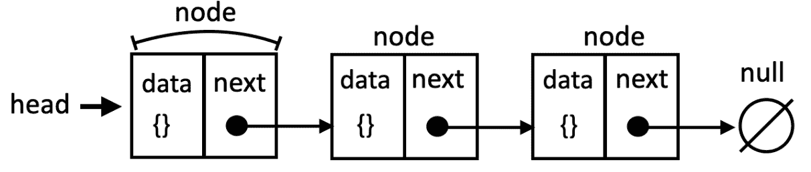

具有节点、数据和指针的链表数据结构

第一个节点被称为 *头*，最后一个节点通常指向 `null`（或 `undefined`）以指示列表的末尾。

与传统的数组相比，链表的一个关键优势是能够在不涉及其他项的昂贵开销的情况下插入或删除元素。然而，这种灵活性是以使用指针为代价的，这要求在实现过程中更加小心。虽然数组允许直接访问任何位置的元素，但链表需要从头部遍历才能到达中间的元素，这可能会影响访问时间。

然而，如果你需要通过索引访问元素（就像我们使用数组那样），链表并不是最佳的数据结构。这是因为我们需要从列表的开始遍历，这可能会更慢。链表还需要额外的内存来存储，因为每个节点都需要额外的内存来存储指针，这对于简单的数据来说可能是额外的开销。

由于其灵活性和处理动态数据的效率，链表在现实世界中有着众多的应用。一个流行的例子是媒体播放器。媒体播放器使用链表来组织和管理工作表。添加、删除和重新排列歌曲或视频在链表上作为以下表示是直接的操作：

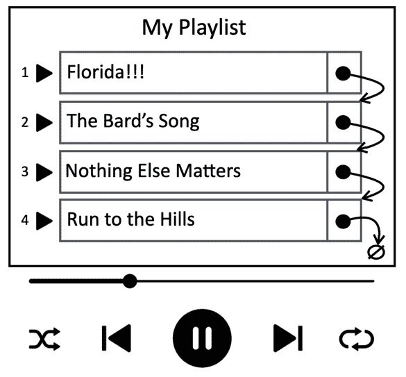

使用链表作为数据结构的媒体播放器表示

存在着不同类型的链表：

+   **单链表**（或简称链表）：每个节点都有一个指向下一个节点的指针。

+   **双链表**：每个节点都有指向下一个和前一个节点的指针。

+   **循环链表**：最后一个节点指向头节点，形成一个循环。

在本章中，我们将介绍链表及其变体，但让我们先从最简单的数据结构开始。

## 创建 LinkedList 类

现在你已经了解了链表是什么，让我们开始实现我们的数据结构。我们将创建自己的类来表示链表。本章的源代码位于`src/06-linked-list`文件夹中。我们将首先创建`linked-list.js`文件，该文件将包含表示我们的数据结构的类以及存储数据和指针所需的节点。

首先，我们定义一个`LinkedListNode`类，它代表链表中的每个元素（或节点）。每个节点包含我们想要存储的数据，以及一个指向后续节点的引用（`next`）：

```js
class LinkedListNode {
  constructor(data, next = null) {
    this.data = data;
    this.next = next;
  }
}
```

默认情况下，新创建的节点的`next`指针被初始化为`null`。然而，构造函数还允许你在事先知道的情况下指定下一个节点，这在某些场景中非常有用。

接下来，我们声明`LinkedList`类，它代表我们的链表数据结构：

```js
class LinkedList {
  #head;
  #size = 0;
  // other methods
} 
```

这个类首先声明一个私有的`#head`引用，指向列表中的第一个节点（元素）。为了避免每次需要元素计数时都遍历整个列表，我们还维护一个私有的`#size`变量。这两个属性都使用`#`前缀来保持私有，以确保封装。

`LinkedList`类将提供以下方法：

+   `append(data)`: 在列表的末尾添加包含`data`的新节点。

+   `prepend(data)`: 在列表的头部（头节点）添加包含`data`的新节点。

+   `insert(data, position)`: 在列表的指定`position`位置插入包含`data`的新节点。

+   `removeAt(position)`: 从列表的特定`position`位置删除节点。

+   `remove(data)`: 从列表中删除包含指定 `data` 的第一个节点。

+   `indexOf(data)`: 返回包含指定 `data` 的第一个节点的索引。如果 `data` 未找到，则返回 `-1`。

+   `isEmpty()`: 如果列表不包含任何元素，则返回 `true`，否则返回 `false`。

+   `clear()`: 从列表中删除所有元素。

+   `size()`: 返回当前列表中元素的数量。

+   `toString()`: 返回链表的字符串表示形式，按顺序显示元素。

我们将在以下章节中详细实现这些方法。

### 将元素追加到链表末尾

当在 LinkedList 的末尾追加元素时，我们会遇到两种情况：

+   空列表：列表没有现有元素，我们正在添加第一个元素。

+   非空列表：列表已经包含元素，我们正在将其添加到列表的末尾。

以下是对 `append` 方法的实现：

```js
append(data) {
  const newNode = new LinkedListNode(data);
  if (!this.#head) {
    this.#head = newNode;
  } else {
    let current = this.#head;
    while (current.next !== null) {
      current = current.next;
    }
    current.next = newNode;
  }
  this.#size++;
}
```

无论列表的状态如何，第一步是创建一个新节点以保存数据。

对于第一种情况，我们检查列表是否为空。如果 `#head` 指针当前为 `null`（或 `undefined`），则条件 `!this.#head` 评估为 `true`，表示列表为空。

如果列表为空，新创建的节点（`newNode`）将成为列表的头部。由于它是列表中唯一的节点，其下一个指针将自动为 `null`。

让我们看看这些步骤的直观表示：

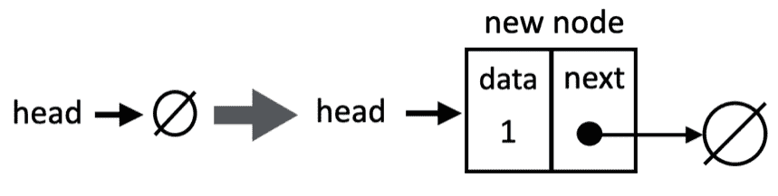

向空链表添加新元素

在我们的链表不为空的情况下，我们只有一个对 `head`（第一个节点）的引用。要向末尾添加新元素，我们需要遍历列表：

+   我们首先将一个临时变量，通常称为 `current`，赋值给列表的 `head`。这个变量将作为我们在列表中移动时的指针。

+   使用循环，我们不断地将 `current` 移动到下一个节点（`current.next`），只要 `current.next` 不是 `null`。这意味着我们继续移动，直到达到最后一个节点，其下一个指针将是 `null`。

+   一旦循环终止，`current` 将引用最后一个节点。我们只需将 `current.next` 设置为我们的新节点，从而将其添加到列表的末尾。

最后，我们增加 `size` 以反映新节点的添加。

以下图表展示了在链表不为空时将元素追加到末尾的情况：

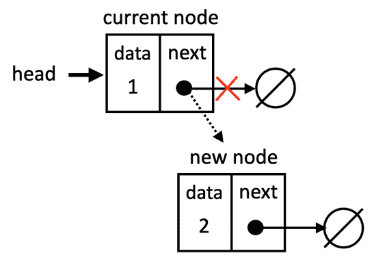

添加新元素到链表末尾

### 向链表添加新元素到头部

将新元素添加到链表的头部（开始处）是一个简单的操作：

```js
prepend(data) {
  const newNode = new LinkedListNode(data, this.#head);
  this.#head = newNode;
  this.#size++;
}
```

第一步是创建一个新节点以保存`data`。重要的是，我们将列表的当前`head`作为构造函数的第二个参数传递。这设置了新节点的`next`指针指向当前`head`，从而建立了链接。如果列表为空，当前头部是`null`，因此新节点的`next`引用也将是`null`。

接下来，我们更新列表的`head`，使其指向新创建的节点（`newNode`）。由于新节点已经与之前的头部节点相连，整个列表可以无缝调整。最后，我们增加列表的`size`以反映新节点的添加。以下图表展示了这一场景：

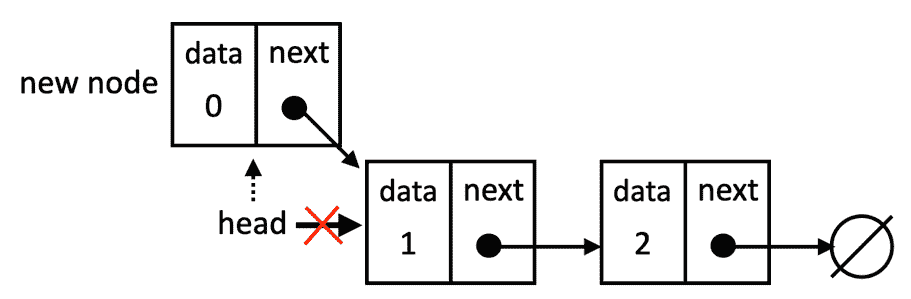

在链表中预加一个新元素

### 在特定位置插入新元素

现在，让我们探讨如何在链表的任何位置插入元素。为此，我们将创建一个`insert`方法，该方法接受`data`和期望的`position`作为参数：

```js
insert(data, position) {
  if (this.#isInvalidPosition(position)) {
    return false;
  }
  const newNode = new LinkedListNode(data);
  if (position === 0) {
    this.prepend(data);
    return true;
  }
  let current = this.#head;
  let previous = null;
  let index = 0;

  while (index++ < position) {
    previous = current;
    current = current.next;
  }

  newNode.next = current;
  previous.next = newNode;
  this.#size++;
  return true;
}
```

我们首先使用一个名为`#isInvalidPosition`的辅助私有方法验证提供的`position`是否有效。有效的位置是指落在列表边界内（0 到 size-1）的位置。如果位置无效，该方法返回`false`以表示插入失败。辅助方法声明如下：

```js
#isInvalidPosition(position) {
  return position < 0 || position >= this.size;
}
```

接下来，我们创建将保存要插入的数据的新节点。

第一种情况是处理在列表头部插入。如果`position`为 0，这意味着我们在列表的起始位置进行插入。在这种情况下，我们可以简单地调用我们之前定义的`prepend`方法，并返回`true`表示成功。

如果不是在头部插入，这意味着我们需要遍历列表。为此，我们需要一个名为`current`的辅助变量，并将其设置为第一个节点（`head`）。我们还需要第二个辅助变量来帮助连接新节点，我们将其命名为`previous`。同时，我们初始化一个索引变量以跟踪我们在遍历中的位置。

然后，我们将遍历列表，直到达到期望的位置。为此，`while`循环迭代，直到索引与`position`匹配。在每次迭代中，我们将`previous`移动到`current`节点，并将`current`移动到下一个节点。

循环结束后，`previous`指向插入点之前的节点，而`current`指向插入点的节点。我们调整下一个指针：`newNode.next`设置为`current`（原本位于插入点的节点），而`previous.next`设置为`newNode`，从而将新节点有效地插入到列表中。

让我们在以下图表中看看这个场景的实际操作：

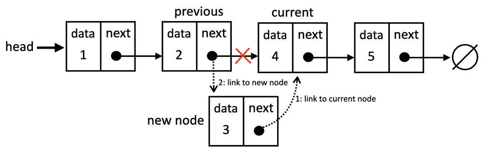

在链表中间插入元素

> 拥有引用我们需要控制的节点的变量非常重要，这样我们才不会丢失节点之间的链接。我们可以只用一个变量（`previous`），但这样控制节点之间的链接会更困难。因此，最好声明一个额外的变量来帮助我们进行这些引用。

### 返回元素的索引

现在我们知道了如何遍历列表直到达到期望的位置，这使得在列表中搜索特定元素并返回其索引变得更容易。

让我们回顾一下`indexOf`方法的实现：

```js
indexOf(data, compareFunction = (a, b) => a === b) {
  let current = this.#head;
  let index = 0;
  while (current) {
    if (compareFunction(current.data, data)) {
      return index;
    }
    index++;
    current = current.next;
  }
  return -1;
}
```

我们首先创建一个变量`current`来跟踪列表中的节点，它最初设置为列表的头部。我们还初始化一个索引变量为 0，代表列表中的当前位置。

当当前节点不是`null`时（我们还没有到达列表的末尾），`while`循环会继续。在每次迭代中，我们检查当前节点的数据属性是否与我们要搜索的元素匹配，如果是，则返回该元素位置的索引。

我们可以将自定义比较函数传递给`indexOf`方法。这个函数应该接受两个参数（两个不同的对象）并返回`true`，如果根据所需标准两个对象匹配，否则返回`false`。有了这个函数，我们获得了灵活性，能够精确地定义元素的比较方式，以适应复杂的数据结构和不同的匹配标准。如果没有提供比较函数，默认情况下我们只是比较对象的引用。

> 使用比较函数也是其他编程语言中的标准做法。如果你愿意，我们可以在`LinkedList`类的构造函数中放置该函数，这样就可以在需要时使用它，而不是直接将函数传递给方法。

如果元素在当前节点中未找到，则增加`index`并移动到下一个节点。

如果循环完成而没有找到元素，这意味着元素不在列表中。在这种情况下，该方法返回`-1`（这是行业惯例）。

拥有一个`indexOf`方法很有用，因为我们可以使用这个方法来搜索元素，我们也会重用它来从列表中删除元素。

### 从特定位置删除元素

让我们探索如何从我们的链表中删除元素。与追加类似，有两个场景需要考虑：删除第一个元素（头节点）和删除任何其他元素。

`removeAt`代码如下所示：

```js
 removeAt(position) {
    if (this.#size === 0) {
      throw new RangeError('Cannot remove from an empty list.');
    }
    if (this.#isInvalidPosition(position)) {
      throw new RangeError('Invalid position');
    }
    if (position === 0) {
      return this.#removeFromHead();
    }
    return this.#removeFromMiddleOrEnd(position);
  }
```

我们将逐步深入这段代码：

1.  首先，我们检查列表是否为空，如果为空，则返回错误。

1.  接下来，我们使用`#isInvalidPosition`辅助方法检查给定位置是否有效。

1.  然后我们检查第一种情况：删除列表的第一个元素，如果是这样，我们将逻辑分离到一个单独的私有方法中，以获得更好的组织和理解。

1.  最后，如果我们不是删除第一个元素，这意味着我们正在删除最后一个元素或链表中间的元素。对于单链表，这两种情况是相似的，因此我们将它们在单独的私有方法中处理。

虽然从链表中删除节点可能看起来很复杂，但将问题分解成更小、更易于管理的步骤可以简化过程。这种方法不仅对于链表操作是一种有价值的技巧，而且在各种现实场景中解决复杂任务时也非常有用。

让我们深入了解`#removeFromHead`方法，这是我们第一个场景，用于从链表中删除第一个元素：

```js
#removeFromHead() {
  const nodeToRemove = this.#head;
  this.#head = this.#head.next;
  this.#size--;
  return nodeToRemove.data;
}
```

如果`position`是 0（表示头部），我们首先将头节点存储在`nodeToRemove`中。然后，我们简单地移动`head`指针到它的`next`节点，从而有效地断开原始的`head`。最后，我们减少链表的大小并返回被删除节点的数据。

以下图表展示了这一动作：

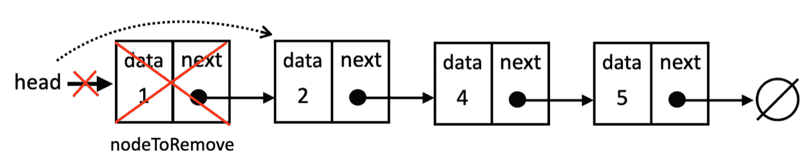

删除链表头部的元素

接下来，让我们检查删除链表中间或末尾节点的代码：

```js
#removeFromMiddleOrEnd(position) {
  let nodeToRemove = this.#head;
  let previous;
  for (let index = 0; index < position; index++) {
    previous = nodeToRemove;
    nodeToRemove = nodeToRemove.next;
  }
  // unlink the node to be removed
  previous.next = nodeToRemove.next;
  this.#size--;
  return nodeToRemove.data;
}
```

对于除了位置 0 之外的其他位置，我们需要遍历链表以找到要删除的节点。在之前的章节中，我们使用了`while`循环，现在我们将使用`for`循环来展示有不同方式可以达到相同的结果。

我们保留两个变量，`nodeToRemove`（从第一个元素开始）和`previous`，以遍历链表。在每次迭代中，我们将`previous`移动到当前节点（`nodeToRemove`），并将`nodeToRemove`移动到下一个节点。

一旦我们到达目标位置，`previous`指向我们想要删除的节点之前的节点，而`nodeToRemove`指向节点本身。我们调整`previous`节点的`next`指针以跳过`nodeToRemove`节点，直接链接到`nodeToRemove`之后的节点。这实际上删除了`nodeToRemove`节点。然后我们可以减少链表的大小并返回被删除的数据。

以下图表展示了从链表中间删除元素的过程：

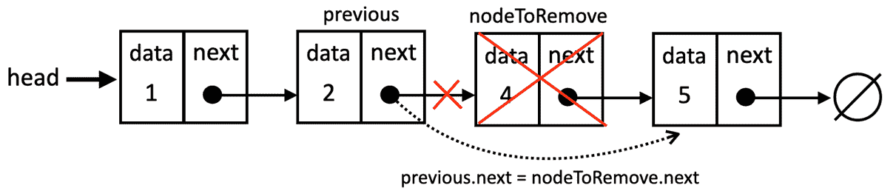

从链表中间删除元素

这种逻辑也适用于链表的最后一个元素，因为`nodeToRemove`的下一个值将是`null`，当`previous.next`接收到`null`时，它将自动断开最后一个元素的链接。以下图表展示了这一动作：

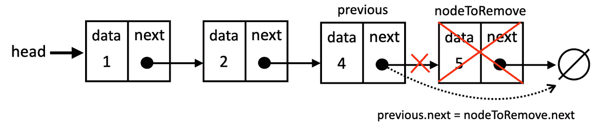

删除链表的最后一个元素

现在我们知道了如何从列表中删除任何元素，让我们学习如何搜索特定元素然后删除它。

### 在链表中搜索和删除元素

有时候，我们需要在不了解其确切位置的情况下从链表中删除一个元素。在这种情况下，我们需要一个基于其数据搜索元素并删除它的方法。我们将创建一个接受目标数据和可选的`compareFunction`以进行自定义比较逻辑的`remove`方法：

```js
remove(data, compareFunction = (a, b) => a === b) {
  const index = this.indexOf(data, compareFunction);
  if (index === -1) {
    return null;
  }
  return this.removeAt(index);
}
```

该方法首先利用我们之前创建的`indexOf`方法来确定第一个数据与提供的`data`匹配的节点的位置（`index`），使用可选的`compareFunction`。

如果`indexOf`返回-1，则表示元素未在列表中找到。在这种情况下，我们返回`null`。如果找到元素，该方法将调用`removeAt(index)`来删除该位置的节点。`removeAt`方法返回被删除的数据，然后该方法也返回该数据。

### 检查是否为空、清除和获取当前大小

`isEmpty`、获取`size`和`clear`方法与我们在上一章中创建的方法非常相似，为管理我们的链表提供了基本操作。让我们无论如何看看它们：

```js
isEmpty() {
  return this.#size === 0;
}
get size() {
  return this.#size;
}
clear() {
  this.#head = null;
  this.#size = 0;
}
```

这里有一个解释：

+   `isEmpty`：此方法检查链表是否为空。它是通过简单地比较私有`#size`属性与零来完成的。如果`#size`是 0，则表示列表没有元素，并返回`true`；否则，它返回`false`。

+   `size`：此方法直接返回私有`#size`属性的值，提供链表中当前元素的数量。

+   `clear`：此方法用于完全清空链表。它是通过将`#head`指针设置为`null`来完成的，从而有效地断开所有节点。`#size`属性也被重置为 0。

### 将链表转换为字符串

最后一个方法是`toString`方法，其主要目标是提供链表的字符串表示形式。这对于调试、记录或简单地向用户显示列表内容非常有用：

```js
toString() {
  let current = this.#head;
  let objString = '';
  while (current) {
    objString += this.#elementToString(current.data);
    current = current.next;
    if (current) {
      objString += ', ';
    }
  }
  return objString;
}
```

初始化一个临时变量`current`以指向链表的`head`。这将是我们在遍历列表时的游标。创建一个空字符串`objString`以累积列表的字符串表示形式。

`while`循环在`current`不是`null`的情况下继续。这意味着我们将遍历列表中的每个节点，直到我们到达末尾（最后一个节点的`next`属性是`null`）。

被称为`#elementToString`的私有方法（我们在前面的章节中已经编写过）被调用来将存储在`current`节点（`current.data`）中的数据转换为字符串表示形式。然后，这个字符串被附加（添加）到`objString`中。我们将`current`游标向前推进到列表的`next`节点，如果有下一个节点（我们还没有到达末尾），则将逗号和空格附加到`objString`中以分隔最终字符串表示中的元素。

## 双向链表

双链表与普通或单链表之间的区别在于，在链表中我们只从一个节点到下一个节点建立链接，而在双链表中，我们有一个双链接：一个用于下一个元素，一个用于前一个元素，如下面的图所示：

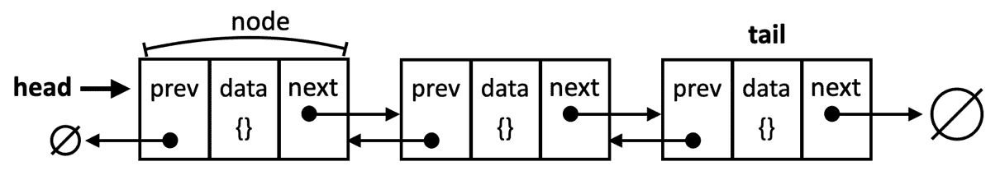

带有前一个和下一个节点的双链表

让我们开始实施`DoublyLinkedList`类所需的变化。我们首先声明我们的双链表节点：

```js
class DoublyLinkedListNode {
  constructor(data, next = null, previous = null) {
    this.data = data;
    this.next = next;
    this.previous = previous; // new
  } 
}
```

在双链表中，每个节点维护两个引用：

1.  `next`：指向列表中下一个节点的指针。

1.  `previous`：指向列表中前一个节点的指针。

这种双向链接使得双向遍历变得高效。为了适应这种结构，我们在`DoublyLinkedListNode`类中添加了`previous`指针。构造函数被设计成灵活的。默认情况下，`next`和`previous`指针都被初始化为`null`。这允许我们创建尚未连接到列表中其他节点的节点。当将节点插入列表中时，我们明确更新这些指针以在列表内建立正确的链接。

接下来，我们将声明我们的`DoublyLinkedList`类：

```js
class DoublyLinkedList {
  #head;
  #tail; // new
  #size = 0;
  // other methods
} 
```

双链表的一个关键区别是它跟踪了`head`（第一个节点）和`tail`（最后一个节点）。这种双向链接使我们能够高效地在两个方向上遍历列表，与单链表相比提供了更大的灵活性。

虽然双链表的核心功能与单链表相似，但实现方式不同。在双链表中，我们必须为每个节点管理两个引用：`next`（指向后续节点）和`previous`（指向前一个节点）。因此，在插入或删除节点时，我们不仅需要仔细更新下一个指针（如单链表中的情况），还需要更新前一个指针以保持整个列表的正确链接。这意味着像`append`、`prepend`、`insert`和`removeAt`这样的方法将需要修改以适应这种双向链接。

让我们深入了解每个必要的修改。

### 添加新元素

在双链表中插入新元素与链表非常相似。区别在于在链表中我们只控制一个指针（`next`），而在双链表中我们需要控制`next`和`previous`两个引用。

让我们看看`append`方法在双链表中的表现：

```js
append(data) {
  const newNode = new DoublyLinkedListNode(data);
  if (!this.#head) { // empty list
    this.#head = newNode;
    this.#tail = newNode;
  } else { // non-empty list
    newNode.previous = this.tail;
    this.#tail.next = newNode;
    this.#tail = newNode;
  }
  this.#size++;
}
```

当我们试图将新元素添加到列表末尾时，会遇到两种不同的场景：如果列表为空或非空。如果列表为空（`head`为`null`），我们创建一个新的节点（`newNode`）并将`head`和`tail`都设置为这个新节点。由于它是唯一的节点，它既是开始也是结束。

如果列表不为空，双链表的优点是我们不需要遍历整个列表就能到达其末尾。因为我们有`tail`引用，我们可以简单地将新节点的`previous`指针链接到尾部，然后我们将尾部的`next`指针链接到新节点，最后我们将`tail`引用更新为新节点。这些操作的顺序至关重要，因为如果我们提前更新`tail`，我们将失去对原始最后一个节点的引用，这将使得无法正确地将新节点链接到列表的末尾。以下图示了将新节点添加到列表末尾的过程：

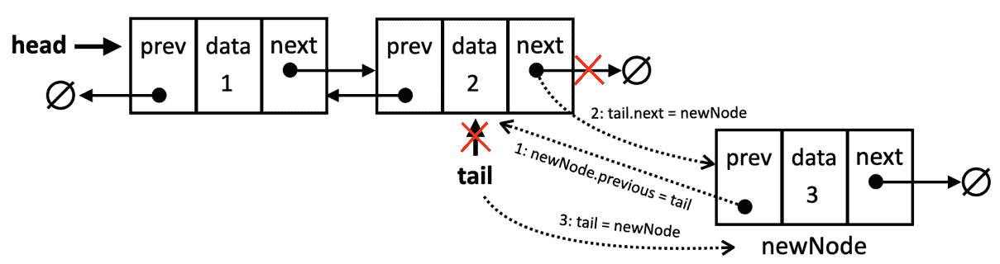

在双链表中添加新节点

接下来，让我们回顾并修改需要添加到双链表中的元素。

### 在双链表中添加新元素到头部

在双链表中添加新元素到头部与在单链表中添加新元素到头部没有太大区别：

```js
prepend(data) {
  const newNode = new DoublyLinkedListNode(data);
  if (!this.#head) {  // empty list
    this.#head = newNode;
    this.#tail = newNode;
  } else { // non-empty list
    newNode.next = this.#head;
    this.#head.previous = newNode;
    this.#head = newNode;
  }
  this.#size++;
}
```

再次，我们有两种情况。如果列表为空，其行为与`append`方法相同，新节点同时成为`head`和`tail`。

如果列表不为空，我们将新节点（`newNode`）的`next`指针设置为当前的`head`。然后我们更新当前头节点的`previous`指针以引用`newNode`。最后，我们将`head`更新为`newNode`，因为它现在是列表中的第一个节点。

在单链表中， prepend 操作只需要更新新节点的`next`指针和列表的`head`。然而，在双链表中，我们必须还更新原始头节点的`previous`指针以确保双向链接得到维护。

现在我们能够向列表的头部和尾部添加元素，让我们来看看如何在任何位置插入。

### 在任何位置插入新元素

在双链表中任意位置插入元素需要比简单地追加或 prepend 考虑更多的因素。让我们看看如何在任何位置插入：

```js
insert(data, position) {
  if (this.isInvalidPosition(position)) {
    return false;
  }
  if (position === 0) { // first position
    this.prepend(data);
    return true;
  }
  if (position === this.#size) { // last position
    this.append(data);
    return true;
  }
  // middle position
  return this.#insertInTheMiddle(data, position);
}
```

让我们逐个案例进行回顾：

1.  首先，我们检查位置是否有效，如果不是，我们返回`false`以指示插入操作未成功。

1.  接下来，我们将检查插入操作是否在`head`处，如果是的话，我们可以重用`prepend`方法，并返回`true`以指示插入操作成功。

1.  下一种情况是，如果插入操作在列表的末尾，那么我们可以重用`append`方法并返回`true`。检查这种情况将避免遍历整个列表以到达其末尾。

1.  如果既不是在头部添加也不是在尾部添加，这意味着位置在列表的中间，对于这种情况，我们将创建一个私有方法来保存逻辑。

如果位置在中间，我们将使用`#insertInTheMiddle`来帮助我们更好地组织步骤，如下所示：

```js
#insertInTheMiddle(data, position) {
  const newNode = new DoublyLinkedListNode(data);
  let currentNode = this.#head;
  let previousNode;
  for (let index = 0; index < position; index++) {
    previousNode = currentNode;
    currentNode = currentNode.next;
  }
  newNode.next = currentNode;
  newNode.previous = previousNode;
  currentNode.previous = newNode;
  previousNode.next = newNode;
  this.#size++;
  return true;
}
```

因此，我们将创建一个新节点，并将遍历列表到所需的位置。在`for`循环之后，我们将按照以下步骤在之前的引用和当前引用之间插入新节点：

1.  `newNode`的`next`指针被设置为`currentNode`。

1.  `newNode`的`previous`指针被设置为`previousNode`。通过这两个步骤，我们已经将新节点部分插入到列表中。我们现在需要更新列表中现有节点的引用到新节点。

1.  `currentNode`的`previous`指针被更新，以指向`newNode`。

1.  `previousNode`的`next`指针被更新，以指向`newNode`。

以下图表展示了这一场景：

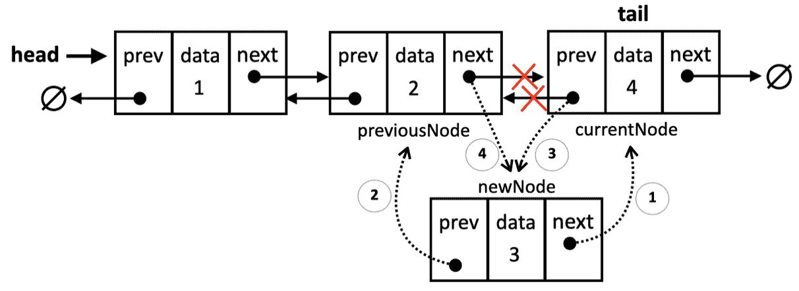

在双链表的中间插入一个新节点

> 由于我们有一个对列表的`head`和`tail`的引用，我们可以对这个方法进行改进，即检查位置是否大于大小/2，如果是，则最好从末尾开始迭代而不是从开头开始（这样做，我们将不得不遍历列表中的更少元素）。

现在我们已经了解了如何处理列表中插入节点时两个指针的细节，让我们看看如何从任何位置删除一个元素。

### 从特定位置删除一个元素

让我们深入了解删除列表中任何位置的元素的细节和区别：

```js
removeAt(position) {
  if (this.#size === 0) {
    throw new RangeError('Cannot remove from an empty list.');
  }
  if (this.#isInvalidPosition(position)) {
    throw new RangeError('Invalid position.');
  }
  if (position === 0) {
    return this.#removeFromHead();
  }
  if (position === this.#size - 1) {
    return this.#removeFromTail();
  }
  return this.#removeFromMiddle(position);
}
```

我们首先检查列表是否为空，以及是否有一个无效的位置。如果列表为空或给定位置超出了列表的有效范围（0 到 size-1），我们将抛出一个`RangeError`。

接下来，我们将检查三种可能的情况：

1.  如果是从头部（列表的第一个位置）进行删除

1.  如果是从尾部（列表的最后一个位置）进行删除

1.  或从列表的中间删除。

让我们深入了解每个场景。

第一种情况是删除第一个元素。以下是`#removeFromHead`私有方法的代码：

```js
#removeFromHead() {
  const nodeToRemove = this.#head;
  this.#head = nodeToRemove.next;
  if (this.#head) {
    this.#head.previous = null;
  } else {
    this.#tail = null; // List becomes empty
  }
  this.#size--;
  nodeToRemove.next = null;
  return nodeToRemove.data;
}
```

我们首先创建一个引用（`nodeToRemove`）到当前头节点。这很重要，因为我们需要稍后返回其数据。接下来，`head`引用现在移动到列表中的下一个节点。

如果只有一个节点，`nodeToRemove.next`将是`null`，`head`将变为`null`，表示列表为空。

如果删除后列表不为空，新`head`节点的`previous`引用（之前是第二个节点）被设置为`null`，因为它现在是第一个节点，没有前驱。

如果列表为空，则`head`和`tail`都需要设置为`null`。由于我们在方法的第二行已经将`head`设置为`null`，我们只需要将`tail`设置为`null`。

最后，我们需要移除`nodeToRemove`的下一个引用，以防万一。以下图表展示了这一场景：

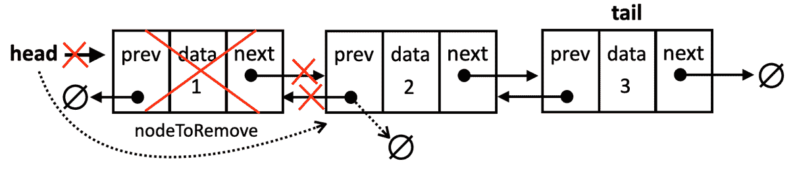

从双链表的头部移除节点

下一个场景是检查我们是否在移除尾部（最后一个元素）。以下是对 `#` `removeFromTail` 私有方法的代码：

```js
#removeFromTail() {
  const nodeToRemove = this.#tail;
  this.#tail = nodeToRemove.previous;
  if (this.#tail) {
    this.#tail.next = null;
  } else {
    this.#head = null; // List becomes empty
  }
  this.#size--;
  nodeToRemove.previous = null;
  return nodeToRemove.data;
}
```

在创建对当前 `tail` 节点的引用后，将 `tail` 引用移动到 `previous` 节点。我们需要检查移除后列表是否为空——这与 `removeFromHead` 方法的行为类似。如果列表不为空，我们将新尾部的 `next` 指针设置为 `null`。如果列表为空，我们还将 `head` 更新为 `null`。以下图展示了这个场景：

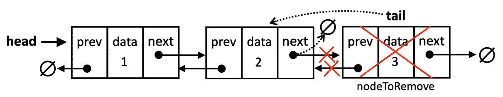

从双链表的尾部移除节点

最后一个场景是从列表的中间移除元素。`#removeFromMiddle` 方法如下所示：

```js
 #removeFromMiddle(position) {
    let nodeToRemove = this.#head;
    let previousNode;
    for (let index = 0; index < position; index++) {
      previousNode = nodeToRemove;
      nodeToRemove = nodeToRemove.next;
    }

    previousNode.next = nodeToRemove.next;
    nodeToRemove.next.previous = previousNode;
    nodeToRemove.next = null;
    nodeToRemove.previous = null;
    this.#size--;
    return nodeToRemove.data;
  }
```

由于位置不是 `head` 或 `tail`，我们需要遍历列表以找到节点并正确调整周围节点的引用。我们首先声明一个 `nodeToRemove`，将其引用到 `head` 作为起点，我们将在迭代过程中移动这个节点。`previousNode` 跟踪 `nodeToRemove` 之前的节点，它从 `null` 开始，因为头部没有前一个节点。

`for` 循环会一直继续，直到 `index` 与我们想要移除的位置 `position` 匹配。在循环内部，我们更新 `previousNode` 为当前节点（在我们移动它之前）并将 `nodeToRemove` 设置为下一个节点。

当循环停止时，`nodeToRemove` 将引用我们想要移除的节点。因此，我们通过使 `previousNode` 的 `next` 指针指向 `nodeToRemove` 后的节点来跳过对 `nodeToRemove` 的引用。

然后，`nodeToRemove.next.previous = previousNode` 更新了 `nodeToRemove` 后的节点的 `previous` 指针，使其指向 `previousNode`。这一步对于维护双链表的结构至关重要。

最后，我们移除 `nodeToRemove` 的下一个和前一个引用，减少列表的大小，并返回被移除的数据。

下面的图展示了这个场景：

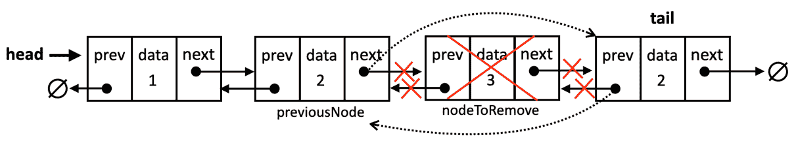

从双链表的中间移除节点

> 要检查双链表其他方法的实现（因为它们与链表相同），请参考书籍的源代码。源代码的下载链接在书的序言中提到，也可以在以下网址访问：[`github.com/loiane/javascript-datastructures-algorithms`](http://github.com/loiane/javascript-datastructures-algorithms)。

## 循环链表

循环链表是链表的一种变体，其中最后一个节点的下一个指针（或 `tail.next`）引用第一个节点（`head`），而不是 `null` 或 `undefined`。这创建了一个封闭的环状结构，如下面的图所示：

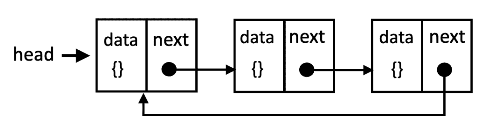

循环链表的结构

双向循环链表有`tail.next`指向头元素，`head.previous`指向`tail`元素，如下所示：

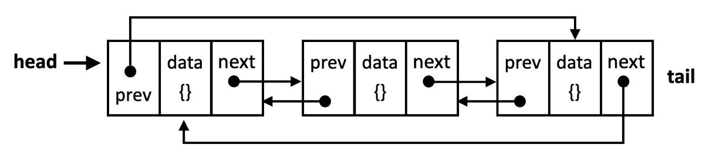

双向循环链表的结构

循环链表与常规（线性）链表的关键区别在于，循环链表没有明确的*结束*。你可以从任何节点开始连续遍历列表，最终返回到起点。

> 我们将实现一个单链循环链表，你可以在本书的源代码中找到双向循环链表的奖励源代码。

让我们查看创建`CircularLinkedList`类的代码：

```js
class CircularLinkedList {
  #head;
  #size = 0;
  // other methods
}
```

我们将利用相同的`LinkedListNode`结构为我们的`CircularLinkedList`类，因为基本的节点结构保持不变。然而，列表的循环性质引入了一些关键差异，这些差异体现在我们实现`append`、`prepend`和`removeAt`等操作的方式上。让我们详细探讨这些修改。

### 追加新元素

将新元素追加到循环链表与追加到标准链表有相似之处，但由于循环结构，有一些关键的区别。让我们看看`append`方法的代码：

```js
 append(data) {
    const newNode = new LinkedListNode(data);
    if (!this.#head) { // empty list                             
      this.#head = newNode;
      newNode.next = this.#head; // points to itself
    } else { // non-empty list
      let current = this.#head;
      while (current.next !== this.#head) {
        current = current.next;
      }
      current.next = newNode;
      newNode.next = this.#head; // circular reference
    }
    this.#size++;
  }
```

我们首先创建一个新节点来保存数据。然后检查列表是否为空。如果是，新节点成为`head`，其下一个指针设置为指向自身，完成循环。以下图例展示了第一种情况：

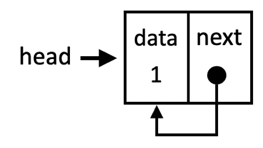

在循环链表中追加一个元素作为唯一的节点

如果列表不为空，我们需要找到最后一个节点。这是通过从`head`开始遍历列表，直到找到一个其下一个指针指向`head`的节点来完成的。

一旦找到最后一个节点（`current`），其下一个指针被更新为引用`newNode`。然后`newNode`的下一个指针设置为指向`head`，重新建立循环链接。以下图例展示了第二种情况：

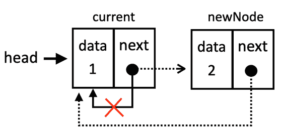

非空循环链表中追加元素

接下来，让我们看看如何在循环链表的开始处插入一个新节点。

### 预先添加一个新元素

由于循环结构的性质，在循环链表中预先添加一个新元素涉及几个关键步骤。让我们首先查看代码：

```js
prepend(data) {
  const newNode = new LinkedListNode(data, this.#head);
  if (!this.head) {
    this.head = newNode;
    newNode.next = this.head; // make it circular
  } else {
    // Find the last node
    let current = this.head;
    while (current.next !== this.head) {
      current = current.next;
    }
    current.next = newNode;
    this.head = newNode;
  }
  this.#size++;
}
```

我们首先创建一个新节点来保存数据。新节点的`next`指针立即设置为该列表的当前`head`，以保持插入后的列表的循环性质。

如果列表为空，新节点成为`head`，我们添加一个自引用作为下一个指针。

如果列表不为空，我们找到最后一个元素，因此我们可以更新它的`next`指针到新节点，该节点将成为新的`head`。下面的图例展示了这一动作：

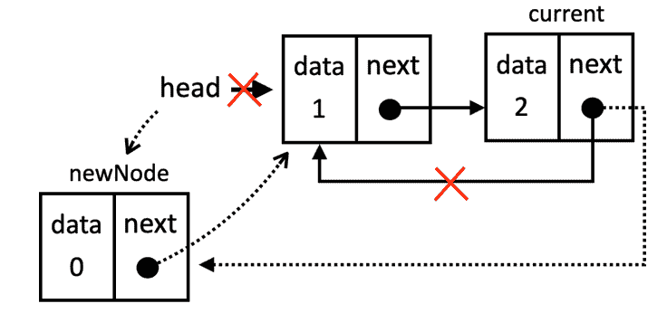

在非空循环链表中预加一个元素

如果我们想在列表中间插入一个新元素，代码与`LinkedList`类相同，因为不会对列表的最后一个或第一个节点应用任何更改。

### 从特定位置移除元素

对于循环链表元素的移除，我们将介绍移除第一个和最后一个元素，因为从中间移除元素的行为与单链表相同。

首先，让我们看看如何从头部移除，代码如下：

```js
 #removeFromHead() {
    const nodeToRemove = this.#head;
    let lastNode = this.#head;
    while (lastNode.next !== this.#head) { // Find the last node
      lastNode = lastNode.next;
    }
    this.#head = nodeToRemove.next; // skip the head
    lastNode.next = this.#head;  // make it circular

    if (this.#size === 1) {  // only one node
      this.#head = null;
    }
    this.#size--;               
    return nodeToRemove.data;
  }
```

以下是对此的解释：

1.  首先，我们遍历列表以找到最后一个节点。

1.  接下来，我们将头节点设置为下一个节点以移除第一个元素。

1.  然后我们将最后一个节点指向新的`head`，闭合循环。

1.  最后，如果移除的节点是列表中唯一的节点，将`head`设置为`null`以重置它。

下面的图例展示了这一动作：

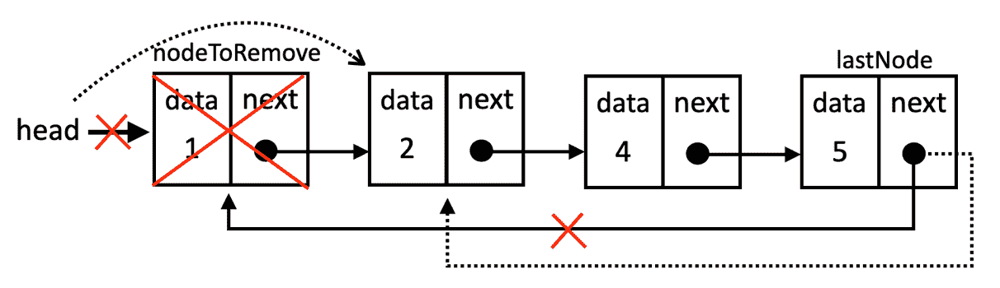

从循环链表中移除头部

现在，让我们看看如何从列表末尾移除：

```js
#removeFromTail() {
  if (this.#head.next === this.#head) { // single node case
    const nodeToRemove = this.#head;
    this.#head = null;
    this.#size--;
    return nodeToRemove.data;
  } else {
    let lastNode = this.#head;
    let previousNode = null;
    while (lastNode.next !== this.#head) { // Find the last node
      previousNode = lastNode;
      lastNode = lastNode.next;
    }
    previousNode.next = this.#head; // skip the last node to remove it
    this.#size--;                 
    return lastNode.data;         
  }
}
```

以下是对此的解释：

1.  如果只有一个节点（`head`指向自身），移除它会使列表为空。我们更新`head`为`null`并返回移除的数据。

1.  如果列表不为空，我们需要找到最后一个节点和第二个最后一个节点（`previousNode`）。因此，我们遍历列表直到其末尾，更新`previous`和`last`节点引用。

1.  当`while`循环结束时，`lastNode`就是我们想要移除的节点。因此，我们设置`previousNode.next = this.#head`，使第二个最后一个节点指向头部，跳过现在已被移除的最后一个节点。

1.  我们减少列表大小并返回移除的`data`。

下面的图例展示了这一动作：

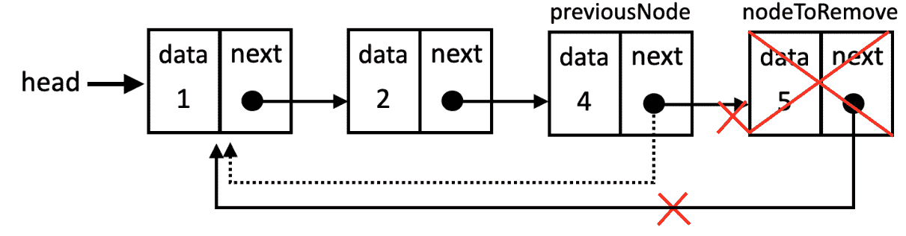

从循环链表中移除尾部

现在我们已经知道如何从三种不同类型的链表中添加和移除元素，让我们通过创建一个有趣的项目来应用我们学到的所有这些概念！

## 使用链表创建媒体播放器

为了巩固我们对链表的理解并探索新的概念，让我们构建一个现实世界的应用：一个媒体播放器！这个项目将利用链表结构，并介绍我们如何使用双循环链表和有序插入等额外技术。

在我们深入之前，让我们概述一下媒体播放器的核心功能：

+   有序歌曲插入：根据歌曲标题将歌曲添加到播放列表中。

+   顺序播放：模拟按播放列表顺序播放歌曲。

+   导航：轻松跳转到上一首或下一首歌。

+   连续重复：自动循环播放列表，重复播放歌曲。

以下图像表示我们将使用链表开发的媒体播放器：

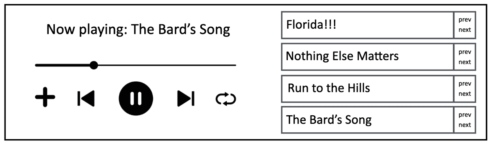

使用双循环链表的多媒体播放器

为了模拟我们的媒体播放器的播放列表，我们将使用自定义节点结构来表示每首歌曲。以下是 `MediaPlayerSong` 类：

```js
class MediaPlayerSong {
  constructor(songTitle) {
    this.songTitle = songTitle;
    this.previous = null;
    this.next = null;
  }
}
```

每个 `MediaPlayerSong` 节点存储：

+   `songTitle`: 歌曲的标题。

+   `previous`: 对播放列表中前一个歌曲节点的引用（如果是第一首歌曲，则是最后一个歌曲的引用）。

+   `next`: 对播放列表中下一个歌曲节点的引用（如果是最后一首歌曲，则是第一个歌曲的引用）。

这将使我们能够实现媒体播放器的连续重复功能。

接下来，让我们定义我们的 `MediaPlayer` 类的结构：

```js
class MediaPlayer {
  #firstSong;
  #lastSong;
  #size = 0;
  #playingSong;
  // other methods
} 
```

`MediaPlayer` 类维护：

+   `#firstSong`: 对播放列表中第一个 `MediaPlayerSong` 的引用。

+   `#lastSong`: 对播放列表中最后一个 `MediaPlayerSong` 的引用。

+   `#size`: 当前播放列表中歌曲的数量。

+   `#playingSong`: 对当前正在播放的 `MediaPlayerSong` 的引用。

在我们开始播放歌曲之前，我们需要能够将歌曲添加到我们的播放列表中。让我们看看下一节如何实现。

### 按标题顺序添加新歌曲（排序插入）

为了保持字母顺序的播放列表，我们将实现一个名为 `addSongByTitle` 的方法。此方法将根据歌曲的标题将新歌曲插入正确的位置，确保播放列表保持排序。

> 在幕后，我们正在双循环链表中执行排序插入操作！

我们将首先声明插入新歌曲的方法：

```js
addSongByTitle(newSongTitle) {
  const newSong = new MediaPlayerSong(newSongTitle);
  if (this.#size === 0) { // empty list
    this.#insertEmptyPlayList(newSong);
  } else {
    const position = this.#findIndexOfSortedSong(newSongTitle);
    if (position === 0) { // insert at the beginning
      this.#insertAtBeginning(newSong);
    } else if (position === this.#size) { // insert at the end
      this.#insertAtEnd(newSong);
    } else { // insert in the middle
      this.#insertInMiddle(newSong, position);
    }
  }
  this.#size++;
}
```

在我们深入了解细节之前，这里有一个简要的解释：

1.  我们首先使用给定的 `newSongTitle` 创建一个新的 `MediaPlayerSong` 节点。

1.  如果播放列表为空，我们调用私有方法 `#insertEmptyPlayList` 来处理第一首歌曲的插入。

1.  对于非空播放列表，我们调用私有方法 `#findIndexOfSortedSong` 来确定新歌曲应该插入的正确 `位置` 以保持字母顺序。

1.  根据返回的 `位置`，方法将插入操作调度到三个私有方法之一：

    1.  `#insertAtBeginning`: 在列表开头插入新歌曲。

    1.  `#insertAtEnd`: 在列表末尾插入新歌曲。

    1.  `#insertInMiddle`: 在指定位置将新歌曲插入列表中间。

1.  最后，将播放列表的 `#size` 增加以反映新歌曲的添加。

让我们更详细地回顾每个步骤。

#### 向空播放列表插入

在这个场景中，我们正在处理双循环链表的插入。让我们深入了解 `#insertEmptyPlayList` 方法：

```js
#insertEmptyPlayList(newSong) {
  this.#firstSong = newSong;
  this.#lastSong = newSong;
  newSong.next = newSong; // points to itself
  newSong.previous = newSong; // points to itself
}
```

我们将新歌曲分配给 `firstSong`（头）和 `lastSong`（尾）。为了保持循环引用，我们将新歌曲的 `next` 和 `previous` 引用设置为自身。

逻辑的下一步是找到在播放列表不为空的情况下需要插入歌曲的位置。

#### 查找字母顺序排序的插入位置

我们正在处理一个复杂场景：将排序插入到双循环链表中。为了简化，我们将分两个阶段来处理，第一阶段是确定新歌曲应该插入以保持字母顺序的正确位置（索引），第二阶段是实际的插入操作。所以，现在让我们专注于找到正确的插入索引：

```js
#findIndexOfSortedSong(newSongTitle) {
  let currentSong = this.#firstSong;
  let i = 0;
  for (; i < this.#size && currentSong; i++) {
    const currentSongTitle = currentSong.songTitle;
    if (this.#compareSongs(currentSongTitle, newSongTitle) >= 0) {
      return i;
    }
    currentSong = currentSong.next;
  }
  return 0;
}
```

我们将遍历列表以找到插入的位置。为此，我们将使用一个名为 `currentSong` 的光标。我们还需要一个索引计数器 `i`。

我们将从播放列表的第一首歌曲循环到最后一首歌曲。在循环内部，我们将调用一个包含比较歌曲逻辑的辅助方法。如果辅助方法的结果是 0（重复歌曲）或正数，这意味着我们找到了位置。

如果新歌曲不属于当前位置，我们将移动到列表中的下一首歌曲。如果循环完成而没有返回，这意味着新歌曲应该插入到开始位置（索引 0）。

接下来，让我们检查 `#compareSongs` 方法的代码：

```js
#compareSongs(songTitle1, songTitle2) {
  return songTitle1.localeCompare(songTitle2);
}
```

此方法是一个辅助函数，用于按字母顺序比较两首歌曲标题，考虑地区特定的排序规则。localeCompare 方法返回一个数字，表示两个字符串之间的排序关系：

+   负数：`songTitle1` 在字母顺序中排在 `songTitle2` 之前。

+   0（零）：在当前地区，`songTitle1` 和 `songTitle2` 被认为是相等的。

+   正数：`songTitle1` 在字母顺序中排在 `songTitle2` 之后。

您可以根据需要修改此方法以自定义您想要比较歌曲标题的方式。

现在我们知道了需要插入的位置，让我们回顾一下每个方法。

#### 在播放列表开头插入

让我们检查如何在非空播放列表中添加一首新歌曲：

```js
#insertAtBeginning(newSong) {
  newSong.next = this.#firstSong;
  newSong.previous = this.#lastSong;
  this.#firstSong.previous = newSong;
  this.#lastSong.next = newSong;
  this.#firstSong = newSong;
}
```

给定我们的下一首歌曲，我们将将其 `next` 引用指向第一首歌曲（头），并将其 `last` 引用指向最后一首歌曲（尾）。然后，我们更新现有第一首歌曲的前一个引用到新歌曲，并更新最后一首歌曲的 `next` 引用到新歌曲。最后，我们更新第一首歌曲引用到新歌曲。

接下来，让我们看看如何追加一首新歌曲。

#### 在播放列表末尾插入

让我们回顾一下如何使用以下方法在播放列表末尾添加新歌曲：

```js
#insertAtEnd(newSong) {
  newSong.next = this.#firstSong;
  newSong.previous = this.#lastSong;
  this.#lastSong.next = newSong;
  this.#firstSong.previous = newSong;
  this.#lastSong = newSong;
}
```

给定新歌曲，当插入到末尾时，我们需要将其下一个引用链接到第一首歌曲，并将其上一个引用链接到最后一首歌曲，这样我们就可以保持双重循环引用。然后，我们需要更新最后一首歌曲的下一个引用为新歌曲，第一首歌曲的前一个引用也更新为新歌曲以保持循环引用，最后，更新最后一首歌曲的引用为新歌曲。

现在，最后一步是在播放列表的中间插入一首歌曲。

#### 在播放列表中间插入

现在我们已经涵盖了在双链表的头部和尾部插入，让我们深入了解如何在列表的中间插入一个新元素，如下所示：

```js
#insertInMiddle(newSong, position) {
  let currentSong = this.#firstSong;
  for (let i = 0; i < position - 1; i++) {
    currentSong = currentSong.next;
  }
  newSong.next = currentSong.next;
  newSong.previous = currentSong;
  currentSong.next.previous = newSong;
  currentSong.next = newSong;
}
```

在中间插入与在双链表中插入相同。因为我们既有前一个也有下一个引用，所以我们不需要两个引用。所以首先，我们找到我们正在寻找的位置，并在我们想要的位置之前停止。然后，我们将新歌曲的下一个引用链接到当前歌曲的下一个引用，并将新歌曲的前一个引用链接到当前歌曲。通过这一步，我们已经将新歌曲插入到列表中，现在我们需要修复剩余的链接。因此，我们修复当前歌曲的下一个节点的上一个引用为新歌曲，以及当前歌曲的下一个引用为新歌曲。

将歌曲添加到播放列表后，我们可以开始播放它们！

### 播放歌曲

当我们选择媒体播放器的播放歌曲功能时，目标是开始播放歌曲。对于我们的模拟，这意味着将第一首歌曲分配给正在播放的歌曲引用，如下所述：

```js
play() {
  if (this.#size === 0) {
    return null;
  }
  this.#playingSong = this.#firstSong;
  return this.#playingSong.songTitle;
}
```

如果播放列表中没有歌曲，我们可以返回`null`，或者如果您愿意，也可以抛出一个错误。然后，我们将正在播放的歌曲的引用分配给第一首歌曲，并返回我们正在播放的标题。

### 播放下一首或上一首歌曲

播放下一首或上一首歌曲的行为非常相似。区别在于我们正在更新的引用：“前一个”或“下一个”。让我们首先回顾播放下一首歌曲的行为：

```js
next() {
  if (this.#size === 0) {
    return null;
  }
  if (!this.#playingSong) {
    return this.play();
  }
  this.#playingSong = this.#playingSong.next;
  return this.#playingSong.songTitle;
}
```

如果播放列表中没有歌曲，我们返回`null`。同样，如果此时没有歌曲正在播放，我们将播放第一首歌曲。然而，如果有歌曲正在播放，而我们决定想播放下一首歌曲，我们只需更新正在播放的歌曲为其下一个引用，并返回歌曲标题。

之前方法的代码也非常相似：

```js
previous() {
  if (this.#size === 0) {
    return null;
  }
  if (!this.#playingSong) {
    return this.play();
  }
  this.#playingSong = this.#playingSong.previous;
  return this.#playingSong.songTitle;
}
```

差别在于如果有歌曲正在播放，而我们想播放上一首歌曲，我们只需更新当前歌曲为其上一个引用。

在这两种情况下，当我们到达播放列表的末尾或播放列表的第一首歌曲时，我们可以继续播放，因为有了双重循环引用。

### 使用我们的媒体播放器

既然我们已经构建了我们的媒体播放器，让我们来测试一下。我们将从创建一个实例并添加我们最喜欢的歌曲开始：

```js
const mediaPlayer = new MediaPlayer();
mediaPlayer.addSongByTitle('The Bard\'s Song');
mediaPlayer.addSongByTitle('Florida!!!');
mediaPlayer.addSongByTitle('Run to the Hills');
mediaPlayer.addSongByTitle('Nothing Else Matters');
```

在我们的播放列表创建后，我们可以开始播放歌曲并查看输出：

```js
console.log('Playing:', mediaPlayer.play()); // Florida!!!
```

我们可以多次选择下一首歌曲并检查连续播放是否按以下方式工作：

```js
console.log('Next:', mediaPlayer.next()); // Nothing Else Matters
console.log('Next:', mediaPlayer.next()); // Run to the Hills
console.log('Next:', mediaPlayer.next()); // The Bard's Song
console.log('Next:', mediaPlayer.next()); // Florida!!!
```

如果我们反过来选择上一个按钮：

```js
console.log('Previous:', mediaPlayer.previous()); // The Bard's Song
console.log('Previous:', mediaPlayer.previous()); // Run to the Hills
console.log('Previous:', mediaPlayer.previous()); // Nothing Else Matters
console.log('Previous:', mediaPlayer.previous()); // Florida!!!
```

> 如果我们回顾输出，可以确认歌曲是按字母顺序插入的。

享受使用我们的媒体播放器吧！

## 检查链表的效率

让我们通过查看每种方法的执行时间的大 O 符号来检查每个方法的效率：

| **方法** | **单链表** | **双链表** | **循环链表** | **说明** |
| --- | --- | --- | --- | --- |
| `append` | *O(n)* | *O(1)* | *O(n)* | 在单链表和循环链表中，我们必须遍历到末尾才能追加。双链表有尾引用，可以实现常数时间的追加。 |
| `prepend` | *O(1)* | *O(1)* | *O(n)* | 所有列表都可以直接添加新节点作为头部。然而，在循环链表中，我们必须更新最后一个节点的下一个指针到新的头部。 |
| `insert` | *O(n)* | *O(n)* | *O(n)* | 对于所有类型，我们都需要遍历到插入位置。 |
| `removeAt` | *O(n)* | *O(n)* | *O(n)* | 与插入类似，需要遍历到指定位置。双链表在删除尾部时有一个优化（*O(1)*），但这比从任意位置删除要少见。 |
| `remove` | *O(n)* | *O(n)* | *O(n)* | 在所有情况下，搜索数据需要 *O(n)*，然后删除本身要么是 *O(1)*（如果节点在头部找到）或 *O(n)*（遍历到节点）。 |
| `indexOf` | *O(n)* | *O(n)* | *O(n)* | 在最坏的情况下，我们可能需要遍历整个列表来找到数据或确定其不存在。 |
| `isEmpty` | *O(1)* | *O(1)* | *O(1)* | 检查列表是否为空是一个简单的尺寸参考检查。 |
| `size` | *O(1)* | *O(1)* | *O(1)* | 大小作为一个属性跟踪，可以直接访问。 |
| `clear` | *O(1)* | *O(1)* | *O(1)* | 清空列表只需重置头指针（在双链表中还包括尾指针），这是一个常数时间操作。 |
| `toString` | *O(n)* | *O(n)* | *O(n)* | 构建字符串表示需要访问每个节点。 |

由于尾指针的存在，双链表在追加操作中通常具有性能优势。否则，所有三种列表类型在大多数操作中的时间复杂度相似，因为它们都涉及某种程度的遍历。

所有三种类型的空间复杂度都是 *O(n)*，因为使用的空间与存储的元素数量成正比。

如果我们要将链表与数组进行比较，每种数据结构都有其优缺点。让我们回顾几个关键点：

+   *链表*：在以下情况下优先选择链表：

    +   您需要一个动态集合，其中元素的数目频繁变化。

    +   您经常在列表的开始或中间进行插入和删除操作。

    +   您不需要随机访问元素。

+   *数组*：在以下情况下优先选择数组：

    +   您事先知道集合的最大大小。

    +   您需要通过索引快速访问元素。

    +   您主要需要按顺序遍历元素。

我们在这本书的前面也学习了栈、队列和双端队列，并且我们内部使用了数组。这些数据结构也可以使用链表实现。那么，每种数据结构最好的实现方式是什么？在决定时，我们需要考虑以下因素：

+   操作频率：如果你经常需要通过索引（随机访问）访问元素，数组可能是一个更好的选择。如果开始或中间的插入和删除操作很常见，链表可能更适合。

+   内存限制：如果内存是一个重要的问题，并且你知道数据结构的最大大小，数组可能更节省内存。然而，如果大小高度可变，链表可以通过不预留未使用的内存来节省空间。

+   简单性与灵活性：数组实现通常更容易编码。链表提供了更多动态调整大小和高效修改的灵活性。

当涉及到答案时，这完全取决于我们将要执行的最多的操作（以及在哪里）以及我们需要存储数据的空间。

对于栈和队列，由于它们的简单性，数组实现通常是默认选择。然而，如果你需要实现一个具有非常频繁操作（如 push/pop 和 queue/dequeue）的队列，一个具有头和尾引用的双向链表可能更有效率。对于双端队列，双向链表是自然的选择，因为它们允许在两端以常数时间进行高效的插入和删除。

> 由于我们已经学习了链表，这是一种多功能的动态数据结构，现在用你的知识来测试一下！尝试使用链表而不是数组来重新实现经典的数据结构，如栈、双端队列和队列。这个动手练习将加深你对链表和这些抽象数据类型的理解。此外，你可以比较你的基于链表的版本与基于数组的版本的性能和特性。作为参考，你可以在本书的源代码中找到这些链表实现。

让我们通过一些练习来将我们的知识付诸实践。

## 练习

我们将解决一个来自**LeetCode**的练习，这样我们可以学习本章尚未涉及的概念。

然而，在 LeetCode 上有很多有趣的链表练习，我们应该能够用本章学到的概念来解决。以下是一些额外的建议，你可以尝试解决，你还可以在本书的源代码中找到解决方案和解释：

+   2. 加法两个数：遍历两个链表并求和每个数字。

+   62. 旋转列表：从尾部移除节点并将它们预加到列表中。

+   203. 删除链表元素：遍历列表并检查需要删除的值。提示：保持一个前向引用可以使删除更容易。

+   234. 回文链表：检查链表的元素是否是回文。

+   642. 设计循环双端队列：实现双端队列数据结构。

+   622. 设计循环队列实现队列数据结构。

### 反转链表

我们将要解决的练习是可在 [`leetcode.com/problems/reverse-linked-list/description/`](https://leetcode.com/problems/reverse-linked-list/description/) 找到的 *206. 反转链表* 问题。

当使用 JavaScript 或 TypeScript 解决这个问题时，我们需要在函数 `function reverseList(head: ListNode | null): ListNode | null` 中添加我们的逻辑，该函数接收链表的头节点，并期望一个表示反转链表头节点的节点。`ListNode` 类由一个 `val`（数字）和一个 `next` 指针组成。

让我们编写 `reverseList` 函数：

```js
function reverseList(head: ListNode | null): ListNode | null {
  let current = head;
  let newHead = null;
  let nextNode = null;
  while (current) {
    nextNode = current.next;
    current.next = newHead;
    newHead = current;
    current = nextNode;
  }
  return newHead;
}
```

为了更好地理解代码中发生的事情，让我们使用一些图表。我们将使用练习提供的示例，这是一个具有以下值的链表：[1, 2, 3, 4, 5]，并期望以下结果：[5, 4, 3, 2, 1]。

对于这个练习，我们将使用三个变量：

1.  `current` 指向列表的头部。

1.  `newHead` 开始时为 `null`，代表反转链表的新头节点。它也是我们将作为函数结果返回的变量。

1.  `nextNode` 是原始列表中下一个节点的一个临时指针。

逻辑仅由一个循环组成，该循环将遍历整个列表。在循环内部，我们有四个重要的操作：

1.  `nextNode = current.next`：在我们修改当前节点的链接之前保存下一个节点。

1.  `current.next = newHead`：反转当前节点的链接，使其指向前一个节点（现在是 `newHead`）。

1.  `newHead = current`：将 `newHead` 向前移动一步，使 `current` 节点成为新的头节点。

1.  `current = nextNode`：将 `current` 移动到下一个节点（之前存储在 `nextNode` 中）。

在循环内部第一次遍历之后，列表将看起来是这样的：

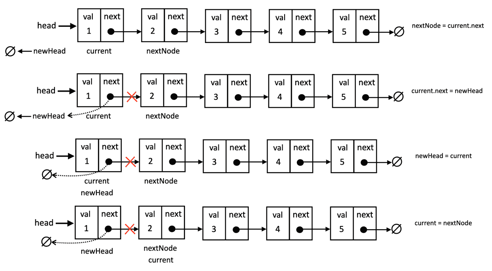

while 循环内部第一次遍历后的反转链表

在循环的第二次遍历之后，列表将看起来是这样的：

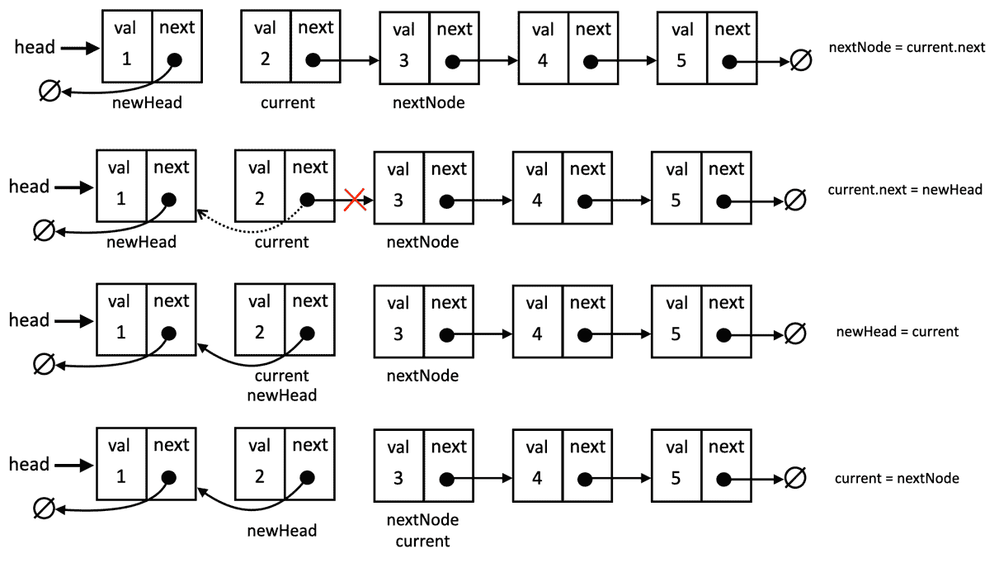

while 循环内部第二次遍历后的反转链表

并且这个过程会一直持续到 `current` 是 `null` 并且链表被反转。这个解决方案通过了所有的测试并且解决了问题。

这个函数的时间复杂度是 *O(n)*，其中 *n* 是链表中的节点数量。空间复杂度是 *O(1)*，因为我们只使用了额外的变量来跟踪节点，并且我们没有使用任何额外的空间，因为我们的解决方案是在原地反转链表。

> 回到 `LinkedList`、`DoublyLinkedList` 和 `CircularLinkedList` 类，创建一个方法来原地反转每个列表，遵循我们用来解决这个练习的类似逻辑。你也会在这个书的源代码中找到这个方法。

## 概述

本章探讨了链表及其变体：单链表、双链表和循环链表。我们涵盖了插入、删除和遍历技术，强调了链表由于其动态特性，在频繁添加和删除元素方面相较于数组具有的优势。

为了巩固我们的知识，我们构建了一个媒体播放器，应用了双循环链表和有序链表等概念。我们还解决了一个 LeetCode 挑战，就地反转链表，增加了额外的趣味性。

准备好了！接下来，我们将深入探讨集合，这是一种独特的用于存储不同元素的数据结构。
