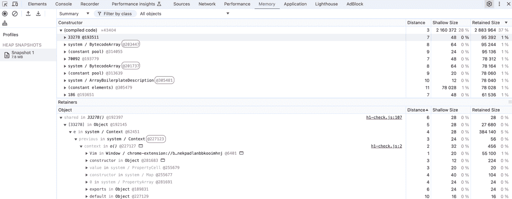
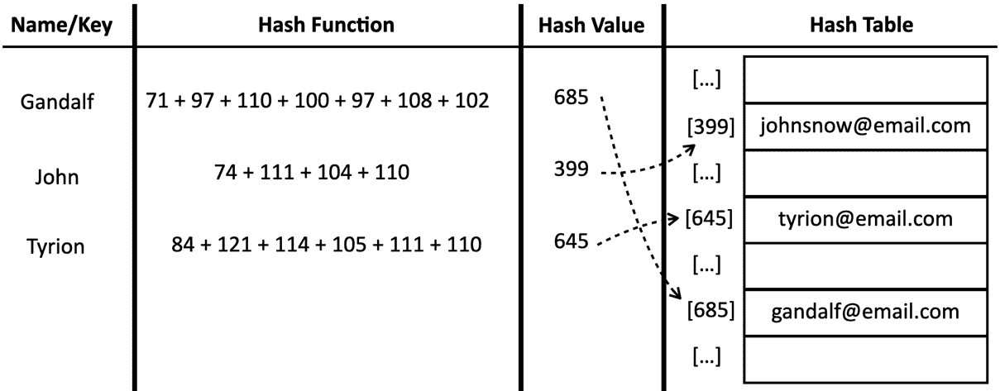
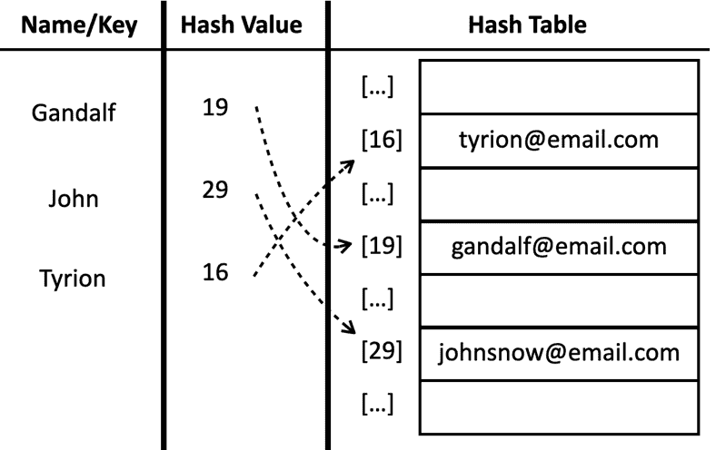
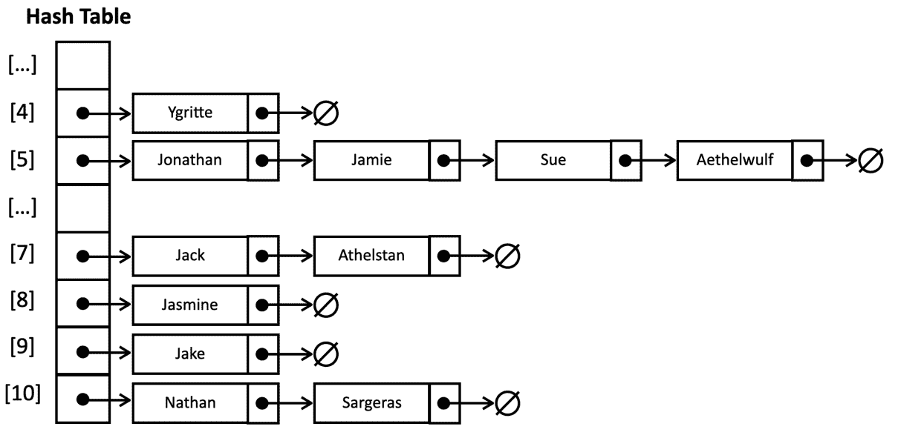
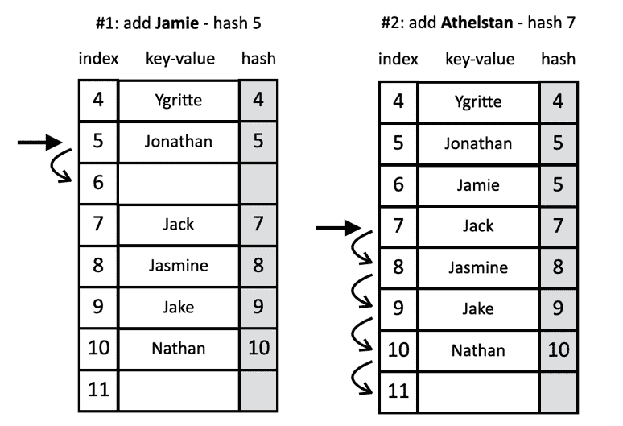
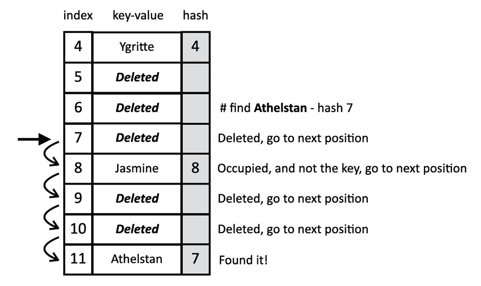
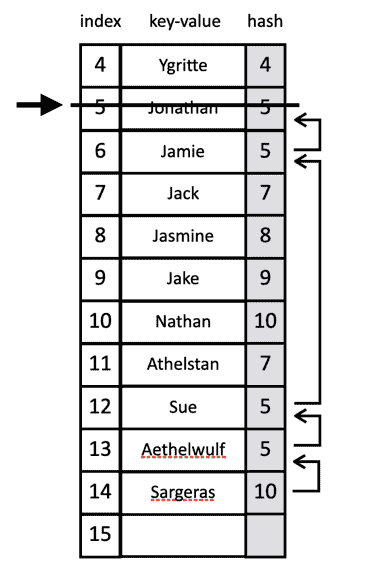

# 第九章：8 字典和散列

**在开始之前：加入我们的 Discord 书籍社区**

直接向作者本人提供反馈，并在我们的 Discord 服务器上与其他早期读者聊天（在“学习 JavaScript 数据结构算法第 4 版”频道下找到“EARLY ACCESS SUBSCRIPTION”）。


[`packt.link/EarlyAccess/`](https://packt.link/EarlyAccess/)

在上一章中，我们深入探讨了集合的世界，关注它们高效存储唯一值的能力。在此基础上，我们现在将探索两个旨在存储不同元素的数据结构：字典和哈希。

虽然集合优先考虑值本身作为主要元素，但字典和哈希采取了不同的方法。这两种结构都以键值对的形式存储数据，使我们能够将一个唯一的键与相应的值关联起来。这种配对是字典和哈希工作的基本原理。

然而，在实现上存在一个微妙但重要的区别。正如我们很快就会发现的，字典遵循每个键一个值的严格规则。另一方面，哈希表在处理与同一键关联的多个值时提供了一些灵活性，为数据组织和检索开辟了额外的可能性。

在本章中，我们将涵盖：

+   字典数据结构

+   哈希表数据结构

+   处理哈希表中的冲突

+   JavaScript 原生的 `Map`、`WeakMap` 和 `WeakSet` 类

## 字典数据结构

正如我们所探讨的，集合是一组唯一的元素集合，确保在结构中不存在重复的元素。相比之下，**字典**被设计用来存储键值对。这种配对使我们能够利用键作为标识符，有效地定位特定的元素。

虽然字典与集合有相似之处，但它们存储的数据类型存在一个关键的区别。集合维护一组键键对，其中对的两元素是相同的。另一方面，字典包含键值对，将每个唯一的键与相应的值关联起来。

值得注意的是，在不同的环境中，字典有不同的名称，包括 **映射**、**符号表**和**关联数组**。这些术语突出了字典的基本目的：在键和值之间建立关联，促进高效的数据检索和组织。

在计算机科学中，字典经常被用来存储对象的引用地址。这些地址作为内存中对象的唯一标识符。为了可视化这个概念，请考虑打开 *Chrome 开发者工具* 并导航到 **内存** 选项卡。运行快照将显示一个对象列表及其相应的地址引用，通常以 *@<数字>* 的格式显示。以下截图说明了字典如何将这些键与这些内存地址关联起来，从而实现高效的对象检索和处理。



浏览器内存标签页显示地址引用的内存分配

在本章中，我们还将涵盖一些如何在现实世界项目中使用字典数据结构的示例。

## 创建字典类

除了`Set`类之外，**ECMAScript 2015** (ES6) 还引入了`Map`类，这是一个在编程中常被称为字典的基本数据结构。这种原生实现是我们将在本章中开发的自定义字典类的基础。

我们将要构建的`Dictionary`类在很大程度上借鉴了 JavaScript Map 实现的设计原则。在我们探索其结构和功能时，你会观察到与`Set`类惊人的相似之处。然而，一个关键的区别在于数据存储机制。与 Set 只存储值不同，我们的字典类将容纳键值对。这种修改使我们能够将唯一的键与其对应的值关联起来，从而释放字典作为数据结构的全部功能和灵活性。

我们的实现将位于`src/08-dictionary-hash/dictionary.js`文件中。我们将首先定义`Dictionary`类：

```js
class Dictionary {
  #items = {};
  #size = 0;
}
```

我们使用一个对象（`{}`）在`#items`私有属性中存储元素。这个对象的键代表唯一的键，而相应的值可以是任何东西。我们还将使用`size`属性跟踪集合中的元素数量。

在理想情况下，一个字典可以无缝地存储字符串类型的键和任何类型的值，无论是原始值如数字或字符串，还是更复杂的对象。然而，JavaScript 的动态类型特性引入了一个潜在的挑战。由于我们无法保证键始终是字符串，我们必须实现一个机制来将任何作为键传递的对象转换为字符串格式。这种转换简化了在字典类中搜索和检索值的过程，增强了其整体功能。相同的逻辑也可以应用于我们在上一章中探讨的 Set 类。

> 注意，在 TypeScript 实现中我们没有这个问题，因为我们可以将键的类型定义为字符串。

为了实现这一关键转换，我们需要一个能够可靠地将对象转换为字符串的函数。作为一个默认选项，我们将利用本书之前在先前数据结构中定义的`#elementToString`方法。这个函数提供了一个可重用的解决方案，用于将键字符串化，使其适用于我们创建的任何数据结构：

```js
#elementToString(data) {
  if (typeof data === 'object' && data !== null) {
    return JSON.stringify(data);
  } else {
    return data.toString();
  }
}
```

这个方法有效地将数据转换为字符串表示。如果数据是一个复杂对象（不包括`null`），它将使用`JSON.stringify()`生成**JSON**字符串。否则，它利用`toString`方法确保任何其他数据类型的字符串转换。

现在，让我们定义将赋予我们的字典/映射数据结构功能的方法：

+   `set(key, value)`: 将新的键值对插入到字典中。如果指定的键已经存在，其关联的值将使用新值进行更新。

+   `remove(key)`: 从字典中移除与提供的键对应的条目。

+   `hasKey(key)`: 确定给定的键是否存在于字典中，如果存在则返回`true`，否则返回`false`。

+   `get(key)`: 获取与指定键关联的值。

+   `clear()`: 清空字典，移除所有键值对。

+   `size()`: 返回当前存储在字典中的键值对数量，类似于数组的长度属性。

+   `isEmpty()`: 检查字典是否为空，如果大小为零则返回`true`，否则返回`false`。

+   `keys()`: 生成一个包含字典中所有键的数组。

+   `values()`: 生成一个包含字典中所有值的数组。

+   `forEach(callbackFn)`: 遍历字典中的每个键值对。接受键和值作为参数的`callbackFn`函数对每个条目执行。如果回调函数返回`false`，则可以终止迭代过程，这与`Array`类中的`every`方法的行为类似。

我们将在接下来的章节中详细实现这些方法。

### 验证键是否存在于字典中

我们将要实现的第一种方法是`hasKey(key)`方法。这个方法是基本的，因为它将在`set`和`remove`等其它方法中使用。让我们来看看它的实现：

```js
hasKey(key) {
  return this.#items[this.#elementToString(key)] != null;
}
```

在 JavaScript 中，对象的键本质上是字符串。因此，如果提供了一个复杂对象作为键，我们必须将其转换为字符串表示形式。为了实现这一点，我们一致地调用`#elementToString`方法，确保在我们的字典中键始终被视为字符串。

`hasKey`方法检查在项目表中（我们字典的底层存储）是否有与给定键关联的值。如果表中对应的位置不是`null`或`undefined`，表明存在值，则方法返回`true`。如果没有找到值，则方法返回`false`。

现在我们有了这个方法，我们可以继续实现添加和移除值的相应方法。

### 在字典中设置键和值

接下来，我们将在我们的`Dictionary`类中实现`set`方法。`set`方法具有双重作用：它既可以向字典中添加新的键值对，也可以更新现有键的值：

```js
set(key, value) {
  if (key != null && value != null) {
    const tableKey = this.#elementToString(key);
    this.#items[tableKey] = value;
    this.#size++;
    return true;
  }
  return false;
}
```

此方法接受一个`key`和一个`value`作为输入。如果键和值都有效（不是`null`或`undefined`），则方法继续将键转换为字符串表示形式。这是一个关键步骤，因为 JavaScript 对象键只能是字符串。这个转换由私有的`#elementToString`方法内部处理，确保所有键类型的一致性和可靠性。在键以字符串形式存在后，该方法将值存储在字典的内部存储（`#items`）中。

最后，该方法通过返回`true`来传达其成功，表示键值对已成功插入或更新，并且我们增加其大小。如果键或值无效（`null`或`undefined`），则方法返回`false`，表示插入或更新操作失败。

### 删除和清除字典中的所有值

删除方法的主要功能是根据提供的键从字典中删除键值对。它在尝试删除之前检查键的存在性，并相应地更新大小，以确保字典的完整性：

```js
delete(value) {
  if (this.has(value)) {
    delete this.#items[value];
    this.#size--;
    return true;
  }
  return false;
}
```

我们首先验证提供的键是否存在于字典中。这是通过调用`has`方法实现的，该方法检查字典的底层存储中是否存在指定的键。这个检查是至关重要的，以防止在尝试删除不存在的条目时出现错误。

如果找到键，JavaScript 中的`delete`运算符被用来从字典的内部数据结构（`#items`）中删除相应的键值对。在成功删除条目后，字典的内部大小计数器（`#size`）减一，以准确反映存储元素数量的变化。

作为最后一步，方法通过返回`true`来表示操作的结果，以指示键存在且已成功删除，或者返回`false`以指示键未找到且未发生删除。

如果我们想要从集合中移除所有元素，我们可以使用`clear`方法，如下所示：

```js
clear() {
  this.#items = {};
  this.#size = 0;
}
```

这实际上丢弃了所有之前的键值对，并为未来的添加创建了一个全新的空容器。我们还把`#size`属性重置为 0，以准确反映集合现在不包含任何元素。

### 检索大小并检查是否为空

我们接下来要实现的方法是`size`方法，如下所示：

```js
 get size() {
    return this.#size;
  }
```

此方法简单地返回我们用来计数的`size`属性。

为了确定字典是否为空，我们实现了`isEmpty()`方法，遵循与本书中覆盖的其他数据结构一致的模式：

```js
isEmpty() {
  return this.#size === 0;
}
```

此方法直接比较私有的`#size`属性与 0。属性`#size`被精心维护，始终反映集合中的元素数量。

### 从字典中检索值

要在我们的字典中搜索特定的键并检索其关联的值，我们使用 `get` 方法。这个方法通过封装必要的逻辑简化了访问存储数据的过程，如下所示：

```js
 get(key) {
  return this.#items[this.#elementToString(key)];
}
```

当接收到 `key` 作为输入时，`get` 方法首先使用私有的 `#elementToString` 函数将其转换为字符串表示。然后，方法直接从字典的内部存储（`#items`）访问相应的值。这是通过使用字符串化的键来索引到 #items 对象来实现的，该对象假设包含键值对。如果找到，方法将返回与给定键关联的值。

### 从字典中检索所有值和键

让我们探索如何从我们的自定义 JavaScript 字典类中检索所有值和键。我们将从声明方法 `values` 开始，该方法将检索字典类中存储的所有值，如下所示：

```js
values() {
  return Object.values(this.#items);
}
```

这个方法非常直接。它利用了内置的 `Object.values()` 函数，该函数接受一个对象（在这种情况下，我们的私有 `#items` 存储）并返回一个包含所有值的数组。

接下来，我们有 `keys` 方法：

```js
keys() {
  return Object.keys(this.#items);
}
```

类似地，`keys` 方法使用了 `Object.keys()` 函数。这个函数，当给定一个对象时，会返回该对象中所有基于字符串的键（属性名）的数组。由于我们确保在字典实现中所有键都是字符串，所以这工作得非常完美。

在大多数情况下，这些方法都有良好的性能。然而，对于特别大的字典，在某些 JavaScript 引擎中直接遍历 `#items` 对象可能会稍微高效一些。让我们看看我们如何在下一节中实现这一点。

### 使用 `forEach` 迭代字典中的每个值-键对

到目前为止，我们还没有实现一个方法来方便地遍历存储在我们数据结构中的每个值。现在，我们将介绍 `Dictionary` 类的 `forEach` 方法，它带来的额外好处是这种行为也可以应用于我们之前构建的其他数据结构。

这里是 `forEach` 方法：

```js
forEach(callbackFn) {
  for (const key in this.#items) {
    if (this.#items.hasOwnProperty(key)) {
      callbackFn(this.#items[key], key);
    }
  }
}
```

`forEach` 方法旨在遍历字典中的每个键值对，对每个条目应用提供的回调函数。对于每个键值对，提供的 `callbackFn` 函数被执行，接收值和键作为参数。

我们使用`for...in`循环遍历对象属性。然而，为了确保我们只处理字典的自身属性（而不是从其原型链继承的属性），我们采取了一种保护措施。`hasOwnProperty`方法检查属性是否直接属于对象。在这种情况下，它验证循环中的当前`key`是否是`#items`对象中的实际键，即字典的底层存储。然后，我们将提供的回调函数应用于每个条目，从字典中检索值并将键作为参数传递给回调。

现在我们有了我们的数据结构，让我们来测试它！

### 使用字典类

想象我们正在构建一个简单的语言学习程序。我们想要存储常用单词和短语的翻译，以帮助用户快速查找不同语言中的含义。

这个示例的源代码可以在文件`src/08-dictionary-hash/01-using-dictionary-class.js`中找到。让我们先创建字典并添加一些值：

```js
const translations = new Dictionary();
// Add some translations - English to Portuguese
translations.set("hello", "olá");
translations.set("thank you", "obrigado");
translations.set("book", "livro"); 
translations.set("cat", "gato");
translations.set("computer", "computador");
```

我们使用`set`来用表示单词翻译的键值对填充字典。键是英语单词，值是它们的葡萄牙语翻译。

接下来，我们将创建一个函数，以便用户可以与之交互以检索特定单词或短语的翻译：

```js
function translateWord(word) {
  if (translations.hasKey(word)) {
    const translation = translations.get(word);
    console.log(`The translation of "${word}" is "${translation}"`);
  } else {
    console.log(`Sorry, no translation found for "${word}"`);
  }
}
```

`translateWord`函数接受一个`word`作为输入。它使用`hasKey`来检查单词是否存在于字典中。如果找到单词，它使用`get`方法检索翻译并打印出来。如果没有找到，它显示“未找到翻译”的消息。

我们可以用以下代码尝试这个函数：

```js
translateWord("hello"); // Output: The translation of "hello" is "olá"
translateWord("dog");  // Output: Sorry, no translation found for "dog"
```

我们还可以检查所有可用的翻译：

```js
console.log("All translations:", translations.values());
// All translations: [ 'olá', 'obrigado', 'livro', 'gato', 'computador' ]
```

我们有所有可用的交易词汇：

```js
console.log("All words:", translations.keys());
// All words: [ 'hello', 'thank you', 'book', 'cat', 'computer' ]
```

如果我们想打印字典，可以使用`forEach`方法如下：

```js
translations.forEach((value, key) => {
  console.log(`${key}: ${value}`);
});
```

我们将得到以下输出：

```js
hello: olá
thank you: obrigado
book: livro
cat: gato
computer: computador
```

因此，现在我们有了与原生 JavaScript Map 类非常相似的实现，

## JavaScript Map 类

ECMAScript 2015 将 Map 类作为 JavaScript API 的一部分引入。我们的字典类是基于 ES2015 Map 类开发的。

在其核心，Map 是一个键值对的集合，类似于其他编程语言中的字典或哈希表。然而，与纯 JavaScript 对象不同，Map 提供了以下几个关键优势：

+   Map 类允许任何数据类型的键，包括对象、函数，甚至是其他 Map 对象。相比之下，对象键会自动转换为字符串。

+   Map 类维护键值对插入的顺序，使得迭代可预测。

+   我们可以轻松地使用`size`属性获取条目数量，而对于对象，我们通常需要使用`Object.keys(obj).length`。

+   Map 类原生支持使用`for...of`循环进行迭代，这使得与它一起工作更加方便。

现在，让我们看看原生 Map 类中可用的方法和功能：

+   `set(key, value)`: 添加或更新一个键值对。

+   `get(key)`: 获取与键关联的值。

+   `has(key)`: 检查键是否存在。

+   `delete(key)`: 移除键值对。

+   `size`: 返回条目的数量。

+   `clear()`: 移除所有条目。

+   `forEach(callbackFn)`: 遍历所有条目。

如果我们想要重写我们的翻译应用程序示例，我们是否可以简单地用`Map`替换`Dictionary`，代码仍然可以按以下方式工作：

```js
const translations = new Map();
translations.set("hello", "olá");
translations.set("thank you", "obrigado");
translations.set("book", "livro"); 
translations.set("cat", "gato");
translations.set("computer", "computador");
```

其他方法，如`get`、`size`、`has`、`values`和`forEach`也会按预期工作。

构建我们的自定义`Dictionary`类已经证明是一个富有教育意义的努力，让我们对映射数据结构的内部机制有了更深入的理解。虽然内置的 JavaScript `Map`类为大多数日常场景提供了效率和便利，但创建我们自己的字典使我们获得了宝贵的知识。

JavaScript 还支持 Map 和 Set 类的弱版本：`WeakMap`和`WeakSet`。让我们简要地看看它们。

### JavaScript 的`WeakMap`和`WeakSet`类

除了标准的`Map`和`Set`类之外，JavaScript 还提供了两种称为`WeakMap`和`WeakSet`的专用集合类型。这些类提供了一种独特的方式来管理对象引用，在内存管理是关注点的情况下尤其有用。

与`Map`类似，`WeakMap`存储键值对。然而，`WeakMap`中的键必须是*对象*，并且对这些键的引用是弱引用。这意味着如果对象的唯一引用是作为`WeakMap`中的键存在，JavaScript 垃圾回收器可以将其从内存中移除。

`WeakSet`的功能类似于`Set`，存储一组唯一的值。然而，它只能存储`对象`，并且对这些对象的引用是弱引用。类似于`WeakMap`，如果一个对象的唯一引用是它在`WeakSet`中的存在，那么它可以被垃圾回收。

`WeakMap`和`WeakSet`也与其常规对应物相比方法较少。它们缺少`size`、`clear`和迭代方法（如`forEach`和`keys()`）。

让我们回顾一个现实场景，我们会使用这些类。想象一下，我们正在设计一个提供`Person`类的程序。我们希望存储与每个实例相关的一些敏感的私有数据，例如他们的社会保险号（或税号）或医疗记录。然而，我们不希望对象本身被这些属性所杂乱，并且我们想要确保它们可以在`Person`对象不再需要时被垃圾回收。以下是演示此场景的代码：

```js
const privateData = new WeakMap();
class Person {
  constructor(name, age) {
    this.name = name;
    this.age = age;
    privateData.set(this, { ssn: 'XXX-XX-XXXX', medicalHistory: [] });
  }
  getSSN() {
    return privateData.get(this)?.ssn;
  }
}
```

创建一个 `WeakMap` 来存储私有数据。键是 `Person` 对象本身（`this`）。在 `Person` 构造函数内部，我们使用 `privateData.set(this, { ... })` 将私有数据与新创建的人对象（`this`）关联起来。`getSSN` 方法使用 `privateData.get(this)` 获取私有 SSN 数据。注意 **可选链** (`?.`) 以安全地处理 `Person` 对象可能不再存在的情况（这样我们就不会得到一个 *null pointer* 错误）。

为什么在这里使用 `WeakMap` 而不是 `Map`？当一个 `Person` 对象变得不可访问（没有对其的引用）时，垃圾收集器可以移除对象的引用以及 `WeakMap` 中相关的私有数据，防止内存泄漏。这可以被认为是一种管理敏感或临时数据的好做法，这些数据不需要比与之关联的对象存活得更久。

> 这种模式也可以用来在引入哈希（#）符号之前在 JavaScript 类中实现私有属性。

现在我们已经了解了映射或字典数据结构，让我们通过哈希表将其提升到下一个层次。

## 哈希表数据结构

**哈希表**数据结构，也称为 **哈希映射**，是字典或映射数据结构的哈希实现。哈希表也是一个键值对的集合。键是一个唯一的标识符，值是你想要与该键关联的数据。哈希表通过使用 **哈希函数** 来实现其速度。

这就是哈希表的工作方式：

+   *哈希函数*：哈希函数接受一个键作为输入，并产生一个唯一的数值，称为 **哈希码**（或 **哈希值**）。这个哈希码就像键的指纹。

+   *存储（桶/槽）*：哈希表内部由一个数组（或类似的结构，如链表）组成，具有固定大小的桶或槽。每个桶可以存储一个或多个键值对。

+   *插入*：当你插入一个键值对时：

    +   哈希函数应用于键以获取其哈希码。

    +   哈希码用于确定键值对应该存储的索引（桶）。

    +   这对数据被放入那个桶中。

+   *检索*：当你想要检索一个值时，你提供一个键和：

    +   哈希函数再次应用于键，产生相同的哈希码。

    +   哈希码用于直接访问应存储值的桶。

    +   值（希望）就在那个桶中。

哈希表存在于许多不同的地方。例如：

+   数据库：用于为快速检索索引数据。

+   缓存：存储最近访问的数据以快速查找。

+   符号表：在编译器中用于存储有关变量和函数的信息。

哈希表最经典的例子之一是电子邮箱簿。例如，每当我们想要发送电子邮件时，我们会查找人的名字并检索他们的电子邮件地址。以下图像展示了这个过程：



一个基于联系名的电子邮件地址存储的哈希表

在这个例子中，我们将使用一个哈希函数，该函数将简单地累加键长度的每个字符的 ASCII 值。这被称为**输输哈希**函数，这是一个非常简单的函数，可能导致我们在下一节中将要探讨的不同问题。

让我们将这个图表翻译成源代码，通过在新的主题中创建一个`HashTable`类，这样我们就可以深入探讨这个概念。

## 创建哈希表类

我们的哈希表实现将位于`src/08-dictionary-hash/hash-table.js`文件中。我们首先定义`HashTable`类：

```js
class HashTable {
  #table = [];
}
```

这个初始步骤只是初始化私有的`#table`数组，它将作为我们的键值对的底层存储。

接下来，我们将为我们的`HashTable`类配备三个基本方法：

1.  `put(key, value)`：这个方法要么将新的键值对添加到哈希表中，要么更新与现有键关联的值。

1.  `remove(key)`：这个方法根据提供的键从哈希表中删除值及其对应的键。

1.  `get(key)`：这个方法从哈希表中检索与特定键关联的值。

为了使这些方法的功能得以实现，我们还需要创建一个关键组件：哈希函数。这个函数将在确定哈希表中每个键值对的存储位置中发挥至关重要的作用，成为我们实现的基础。

### 创建输输哈希函数

在实现核心的`put`、`remove`和`get`方法之前，我们必须首先建立一个`hash`方法。这个方法是基本的，因为它将决定哈希表中键值对的存储位置。代码如下所示：

```js
hash(key) {
  return this.#loseLoseHashCode(key);
}
```

`hash`方法作为`loseLoseHashCode`方法的包装器，将提供的`key`作为其参数。这种包装器设计具有战略意义：它允许我们在不影响我们代码的其他使用哈希码的区域的情况下，未来灵活地修改哈希函数。`loseLoseHashCode`方法是实际哈希计算发生的地方：

```js
#loseLoseHashCode(key) {
  if (typeof key !== 'string') {
    key = this.#elementToString(key);
  }
  const calcASCIIValue = (acc, char) => acc + char.charCodeAt(0);
  const hash = key.split('').reduce((acc, char) => calcASCIIValue, 0);
  return hash % 37; // mod to reduce the hash code
}
```

在`loseLoseHashCode`中，我们首先检查键是否已经是字符串。如果不是，我们使用我们在前几章中创建的`#elementToString`方法将其转换为字符串，以确保对键的一致处理。

接下来，我们通过计算键字符串中每个字符的 ASCII 值的总和来计算一个哈希值。它利用两个强大的数组方法`split`和`reduce`来有效地实现这一点。它首先将字符串拆分为一个包含单个字符的数组。然后，它使用`reduce`方法遍历这些字符，将它们的 ASCII 值累加到一个单一的哈希值中。对于每个字符，我们使用`charCodeAt`方法检索其 ASCII 值，并将其添加到哈希变量中。

最后，为了避免处理可能不适合数字变量的较大数字，我们使用一个任意的除数（在这种情况下，37）对哈希值应用模运算（除以另一个数后的余数）。这确保了生成的哈希码在一个可管理的范围内，优化了哈希表中的存储和检索。

现在我们有了哈希函数，我们可以开始深入研究下一个方法。

### 在哈希表中放置键和值

在建立了我们的`hash`函数之后，我们现在可以继续实现`put`方法。此方法与`Dictionary`类中的`set`方法的功能相似，只是在命名约定上略有不同，以符合其他编程语言中的惯例。`put`方法如下所示：

```js
put(key, value) {
  if (key == null && value == null)  {
    return false;
  }
  const index = this.hash(key);
  this.#table[index] = value;
  return true;
}
```

`put`方法便于在哈希表中插入或更新键值对。它首先验证提供的键和值，确保它们都不是`null`或`undefined`。这个检查防止在哈希表中存储不完整或无意义的数据。

如果键和值都被认为是有效的，我们就继续计算给定键的哈希码。这个哈希码由`hash`函数确定，将作为在底层`#table`数组中存储值的索引。

最后，`put`方法返回`true`以指示键值对已成功插入或更新。相反，如果键或值无效，该方法返回`false`，表示操作未成功。

一旦值存在于表中，我们就可以尝试检索它。

### 从哈希表中检索值

从`HashTable`实例中检索值是一个简单的过程，由`get`方法提供便利。此方法使我们能够根据其关联的键高效地访问哈希表中存储的数据：

```js
get(key) {
  if (key == null) {
    return undefined;
  }
  const index = this.hash(key);
  return this.#table[index];
}
```

我们首先验证输入的键，确保它不是`null`或`undefined`。如果键确实有效，我们继续使用先前定义的`hash`函数确定其在哈希表中的位置。这个函数将键转换为一个数值哈希码，该哈希码直接对应于底层数组中值的索引。

利用这个计算出的索引，方法访问表数组中的相应元素并返回其值。这提供了一种无缝的方式从哈希表中检索数据，因为`hash`函数消除了线性搜索的需要，并直接指向所需值的存储位置。

> 值得注意的是，在我们的`HashTable`实现中，我们已经包括了输入验证，以确保提供的键和值不是无效的（`null`或`undefined`）。这是一种推荐的做法，可以应用于我们在这本书中迄今为止开发的所有数据结构。通过主动验证输入，我们增强了数据结构的健壮性和可靠性，防止了由错误或不完整数据引起的错误和意外行为。

最后，让我们将注意力转向我们类中的剩余方法：`remove`方法。

### 从哈希表中删除一个值

我们将为我们的`HashTable`实现的最后一个方法是`remove`方法，它旨在根据提供的键删除键值对。此方法对于维护动态和可适应的哈希表结构至关重要：

```js
remove(key) {
  if (key == null) {
    return false;
  }
  const index = this.hash(key);
  if (this.#table[index]) {
    delete this.#table[index];
    return true;
  }
  return false;
}
```

要成功删除一个值，我们首先需要确定它在哈希表中的位置。这是通过使用`hash`函数获取给定键对应的哈希码来实现的。

接下来，我们从计算出的哈希位置检索存储的值对。如果这个值对不是`null`或`undefined`，表明键存在于哈希表中，我们就继续删除它。这是通过使用 JavaScript 的`delete`运算符来实现的，它有效地从哈希表的内部存储中消除了键值对。

为了提供操作成功与否的反馈，如果删除成功（意味着键存在且已被删除），我们返回`true`；如果键在哈希表中未找到，则返回`false`。

值得注意的是，作为使用删除运算符的替代方案，我们也可以将`null`或`undefined`分配给相应的哈希位置，以表示其空缺。这种方法仍然可以有效地从哈希表中删除键值关联，同时可能提供管理数组中空槽位的不同策略。

现在我们类的实现已经完成，让我们看看它是如何工作的。

### 使用`HashTable`类

让我们说明如何使用我们的`HashTable`类来创建一个电子邮件地址簿：

```js
const addressBook = new HashTable();
// Add contacts
addressBook.put('Gandalf', 'gandalf@email.com');
addressBook.put('John', 'johnsnow@email.com');
addressBook.put('Tyrion', 'tyrion@email.com');
```

通过检查为特定键生成的哈希码，我们可以深入了解我们哈希表的内部结构。例如，我们可以观察使用哈希方法计算出的"Gandalf"、"John"和"Tyrion"的哈希值：

```js
console.log(addressBook.hash('Gandalf')); // 19
console.log(addressBook.hash('John')); // 29
console.log(addressBook.hash('Tyrion')); // 16
```

生成的哈希码（分别是 19、29 和 16）揭示了哈希表如何将这些键分布在其底层数组的不同位置。这种分布对于高效存储和检索值至关重要。

以下图表示包含这些值的`HashTable`数据结构：



一个包含三个联系人的哈希表

现在，让我们测试我们的`get`方法。通过执行以下代码，我们可以验证其行为：

```js
console.log(addressBook.get('Gandalf')); // gandalf@email.com
console.log(addressBook.get('Loiane')); // undefined
```

由于“Gandalf”是我们`HashTable`中存在的一个键，因此`get`方法成功检索并输出了其关联的值“gandalf@email.com”。然而，当我们尝试检索“Loiane”的值，一个不存在的键时，`get`方法返回`undefined`，表示该键不在哈希表中。

接下来，让我们使用`remove`方法从`HashTable`中移除“Gandalf”：

```js
console.log(addressBook.remove('Gandalf')); // true
console.log(addressBook.get('Gandalf')); // undefined
```

在移除“Gandalf”后，调用`hash.get('Gandalf')`现在结果为`undefined`。这证实了条目已被成功删除，并且该键不再存在于哈希表中。

有时，不同的键会导致相同的哈希值，这种现象被称为**碰撞**。让我们深入了解如何在我们的哈希表中有效地管理碰撞。

### 哈希表中的键碰撞

在某些情况下，不同的键可能会产生相同的哈希值。我们将这种现象称为碰撞，因为它会导致在哈希表中同一索引处尝试存储多个键值对。

例如，让我们回顾以下电子邮件地址簿：

```js
const addressBook = new HashTable();
addressBook.put('Ygritte', 'ygritte@email.com');
addressBook.put('Jonathan', 'jonathan@email.com');
addressBook.put('Jamie', 'jamie@email.com');
addressBook.put('Jack', 'jack@email.com');
addressBook.put('Jasmine', 'jasmine@email.com');
addressBook.put('Jake', 'jake@email.com');
addressBook.put('Nathan', 'nathan@email.com');
addressBook.put('Athelstan', 'athelstan@email.com');
addressBook.put('Sue', 'sue@email.com');
addressBook.put('Aethelwulf', 'aethelwulf@email.com');
addressBook.put('Sargeras', 'sargeras@email.com');
```

为了说明碰撞概念，让我们检查每个提到的名字调用`addressBook.hash`方法生成的输出：

```js
4 - Ygritte
5 - Jonathan
5 - Jamie
7 - Jack
8 - Jasmine
9 - Jake
10 - Nathan
7 - Athelstan
5 - Sue
5 - Aethelwulf
10 - Sargeras
```

注意到多个键共享相同的哈希值：

+   内森和萨格拉斯都有一个哈希值 10。

+   杰克和艾瑟尔斯坦都有一个哈希值 7。

+   乔纳森、杰米、苏和艾瑟尔乌尔夫都共享一个哈希值 5。

在添加所有联系人后，哈希表内部发生了什么？哪些值最终被保留？为了回答这些问题，让我们引入一个`toString`方法来检查哈希表的内容：

```js
toString() {
  const keys = Object.keys(this.#table);
  let objString = `{${keys[0]} => ${this.#table[keys[0]].toString()}}`;
  for (let i = 1; i < keys.length; i++) {
    const value = this.#elementToString(this.#table[keys[i]]).toString();
    objString = `${objString}\n{${keys[i]} => ${value}}`;
  }
  return objString;
}
```

`toString`方法提供了哈希表内容的字符串表示。由于我们无法直接确定底层数组中哪些位置包含值，我们使用`Object.keys`从`#table`对象中检索一个键数组。然后我们遍历这些键，构建一个格式化的字符串，显示每个键值对。

在调用`console.log(hashTable.toString())`后，我们观察到以下输出：

```js
{4 => ygritte@email.com}
{5 => aethelwulf@email.com}
{7 => athelstan@email.com}
{8 => jasmine@email.com}
{9 => jake@email.com}
{10 => sargeras@email.com}
```

在他的例子中，乔纳森、杰米、苏和艾瑟尔乌尔夫都共享相同的哈希值 5。由于我们当前哈希表实现的性质，作为最后添加的艾瑟尔乌尔夫占据了位置 5。乔纳森、杰米和苏的值已被覆盖。具有其他碰撞哈希值的键也会发生类似的覆盖。

由于碰撞而丢失值在哈希表中是不希望的。这种数据结构的目的在于保留所有键值对。为了解决这个问题，我们需要碰撞解决技术。有几种方法，包括**分离链接**、**线性探测**和**双重哈希**，我们将详细探讨前两种。

### 使用分离链接技术处理碰撞

分离链接是一种广泛用于处理哈希表冲突的技术。在哈希表的每个索引（桶）中，不是存储单个值，分离链接允许每个桶持有值的*链表*（或类似的数据结构）。当发生冲突时（多个键哈希到相同的索引），新的键值对将简单地追加到该索引处的链表中。

为了可视化这个概念，让我们考虑上一节中用于测试的代码。如果我们应用分离链接并图示化地表示结果结构，输出将类似于以下内容：



使用分离链接技术的哈希表

在这种表示中，位置 5 将包含一个包含四个元素的链表，而位置 7 和 10 将各自包含包含两个元素的链表。位置 4、8 和 9 将各自包含包含单个元素的链表。这说明了分离链接如何通过在同一个桶中存储多个键值对的链表来有效地处理冲突。

使用分离链接技术有一些优点：

+   当发生冲突时，优雅地处理冲突，不会覆盖数据。

+   与其他冲突解决技术相比，该实现相对简单易懂。

+   链表具有动态大小，可以根据需要增长，从而可以容纳更多的冲突，而无需对哈希表进行大小调整。

+   只要链（链表）保持相对较短，搜索、插入和删除操作仍然高效（平均情况下接近*O(1)*），这意味着它具有令人满意的表现。

任何技术一样，它也有一些缺点：

+   链表需要额外的内存开销。

+   在最坏的情况下，如果许多键哈希到相同的索引，链表可能会变得很长，影响性能。

为了展示分离链接的实际应用，让我们创建一个新的数据结构，称为`HashTableSeparateChaining`。这个实现将主要关注 put、get 和 remove 方法，展示分离链接如何增强哈希表中的冲突处理。为了在我们的哈希表中实现分离链接，我们从以下代码开始，该代码位于`src/08-dictionary-hash/hash-table-separate-chaining.js`文件中：

```js
const LinkedList = require('../06-linked-list/linked-list');
class HashTableSeparateChaining {
  #table = [];
} 
```

这个初始代码片段完成了两个关键任务：

1.  它从另一个文件（`../06-linked-list/linked-list.js`）中导入`LinkedList`类，这是我们之前在*第六章，链表*中创建的。

1.  它还定义了`HashTableSeparateChaining`类，该类将封装我们的哈希表功能。该类有一个私有属性`#table`，初始化为空数组。这个数组将作为我们哈希表的主干，每个元素都充当一个桶，可以潜在地存储键值对的链表。

随后的步骤将涉及填充核心方法（`put`、`get`和`remove`），这些方法利用链表来有效地处理冲突并在哈希表中管理键值对。

#### 使用分离链接技术插入键和值

让我们实现第一个方法，使用分离链接技术实现的`put`方法如下：

```js
put(key, value) {
  if (key != null && value != null) {
    const index = this.hash(key);
    if (this.#table[index] == null) {
      this.#table[index] = new LinkedList();
    }
    this.#table[index].append({key, value});
    return true;
  }
  return false;
}
```

我们`HashTableSeparateChaining`类的`put`方法负责插入或更新键值对。其第一步是验证输入，确保键和值都不是`null`或`undefined`。

接下来，我们使用哈希函数计算哈希码（索引）。这个索引决定了键值对应该存储的桶。

我们首先检查计算出的索引处的桶是否为空。如果是空的，则创建一个新的`LinkedList`来存储该索引处的值。这是分离链接法的核心：使用链表来容纳散列到相同索引的多个值。

最后，键值对，封装为对象`{key, value}`，被追加到指定索引处的链表中。如果链表中已存在该键，则其关联的值将被更新。方法在成功插入或更新后返回`true`，如果键或值无效则返回`false`。

#### 使用分离链接技术检索值

现在，让我们实现`get`方法，根据给定的键从我们的`HashTableSeparateChaining`类中检索值：

```js
get(key) {
  const index = this.hash(key);
  const linkedList = this.#table[index];
  if (linkedList != null) {
    linkedList.forEach((element) => {
      if (element.key === key) {
        return element.value;
      }
    });
  }
  return undefined; // key not found
}
```

在这个方法中，我们首先将提供的键哈希，以确定其在哈希表中的对应索引。然后我们访问存储在该索引处的链表。

如果存在链表（`linkedList != null`），我们使用`forEach`循环遍历其元素，传递一个回调函数。对于链表中的每个元素，我们比较其键属性与输入键。如果我们找到一个匹配项，我们返回该元素的对应值属性。

如果在链表中找不到键，或者计算出的索引处的链表为空，则该方法返回`undefined`，表示键不在哈希表中。

通过结合链表结构和遍历，这个`get`方法有效地处理了由多个键散列到相同索引引起的潜在冲突，确保即使在冲突存在的情况下，我们也能检索到正确的值。

##### `LinkedList`的`forEach`方法

由于我们之前的`LinkedList`类缺少`forEach`方法，我们需要为`HashTableSeparateChaining`类的`get`方法中所需的效率遍历添加它。

下面是`LinkedList`类的`forEach`方法的实现：

```js
forEach(callback) {
  let current = this.#head;
  let index = 0;
  while (current) {
    callback(current.data, index);
    current = current.next;
    index++;
  }
}
```

`current`变量跟踪列表中的当前节点。它从列表的头部（`this.#head`）开始。循环继续，直到处理完所有节点（`current is not null`）。在每次迭代中，提供的`callback`函数被调用，传递当前节点存储的元素及其索引作为参数。`current`变量更新为列表中的下一个节点，将迭代向前推进。

#### 使用分离链接技术删除值

从`HashTableSeparateChaining`实例中删除值与之前实现的`remove`方法略有不同。由于使用了链表，我们现在需要特别针对并从哈希表中的相关链表中删除元素。

让我们分析`remove`方法的实现：

```js
remove(key) {
  const index = this.hash(key);
  const linkedList = this.#table[index];
  if (linkedList != null) {
    const compareFunction = (a, b) => a.key === b.key;
    const toBeRemovedIndex = linkedList.indexOf({key}, compareFunction);
    if (toBeRemovedIndex >= 0) {
      linkedList.removeAt(toBeRemovedIndex);
      if (linkedList.isEmpty()) {
        this.#table[index] = undefined;
      }
      return true;
    }
  }
  return false; // key not found
}
```

我们首先计算给定键的哈希码（`index`），类似于`get`方法。然后检索存储在该索引处的链表。如果链表存在（`linkedList != null`），我们定义一个比较函数（`compareFunction`），该函数将用于识别要删除的元素。此函数比较两个对象的键（`a`和`b`）。

接下来，我们使用链表的`indexOf`方法找到要删除的元素的索引。`indexOf`方法接受要搜索的元素（`{key}`）和比较函数作为参数。如果找到元素，`indexOf`返回其索引；否则，返回-1。

如果找到元素（`toBeRemovedIndex >= 0`），我们使用`removeAt`方法从链表中删除它，该方法从指定的索引删除元素。

删除元素后，我们检查链表是否现在为空。如果是，我们将哈希表中的相应桶（`this.#table[index]`）设置为`undefined`，从而有效地删除空链表。最后，我们返回`true`以指示删除成功。

如果在链表中找不到键，或者计算出的索引处的链表为空，我们返回`false`，表示键不在哈希表中。

通过结合链表删除逻辑，这个增强的`remove`方法无缝地与分离链接方法集成，即使在发生冲突的情况下也能有效地删除键值对。接下来，让我们深入了解另一种处理冲突的技术。

### 使用线性探测技术处理冲突

线性探测是处理哈希表冲突的另一种技术，其处理存储具有相同哈希码的多个键值对的方法与分离链接不同。

线性探测不是使用链表，而是直接在哈希表数组本身中存储所有键值对。当发生冲突时，线性探测按顺序搜索数组中下一个可用的空槽，从原始哈希索引开始。

以下图表展示了此过程：



使用线性探测技术的哈希表

让我们考虑一个场景，即我们的哈希表已经包含几个值。当添加一个新的键值对时，我们计算新键的哈希值。如果表中相应位置是空的，我们就可以直接在该索引处插入值。然而，如果位置已被占用，我们则启动*线性探测*。我们将索引加一，并检查下一个位置。这个过程会一直持续，直到我们找到一个空槽位或确定表已满。

线性探测提供了一个简单且空间高效的冲突解决机制。然而，它可能导致聚类，随着表的填充，连续占用的槽位会降低性能。

为了说明线性探测的实际应用，我们将开发一个新的数据结构，称为`HashTableLinearProbing`。这个类将位于`src/08-dictionary-hash/hash-table-linear-probing.js`文件中。我们首先定义基本结构：

```js
class HashTableLinearProbing {
  #table = [];
} 
```

这个初始结构反映了`HashTable`类，有一个私有属性`#table`，初始化为一个空数组以存储键值对。然而，我们将重写`put`、`get`和`remove`方法，以采用线性探测技术来解决冲突。这种修改将从根本上改变哈希表处理多个键哈希到相同索引的情况的方式，与分离链接方法相比，展示了一种独特的方法。

#### 使用线性探测技术插入键和值

现在，让我们实现我们的三个核心方法中的第一个：`put`方法。该方法负责在哈希表中插入或更新键值对，并采用线性探测技术来解决冲突：

```js
put(key, value) {
  if (key != null && value != null) {
    let index = this.hash(key);
    // linear probing to find an empty slot
    while (this.#table[index] != null) {
      if (this.#table[index].key === key) {
        this.#table[index].value = value;
        return true;
      }
      index++;
      index %= this.#table.length;
    }
    this.#table[index] = {key, value};
    return true;
  }
  return false;
}
```

我们首先确保键和值都是有效的（不是`null`）。然后我们计算键的哈希码，这决定了值应该存储的初始位置。

然而，如果初始位置已经被占用，线性探测过程就开始了。该方法进入一个 while 循环，如果当前索引被一个值占用，则循环继续。在循环内部，它首先检查当前索引的`key`是否与提供的`key`匹配。如果是，则更新值，并返回`true`。否则，索引递增，如果需要，过程会绕回表的开始，继续寻找空槽位。

一旦找到空槽位，键值对就存储在该索引处，并返回`true`以指示成功插入。如果键或值无效，则该方法返回`false`。

> 在某些编程语言中，我们需要定义数组的大小。使用线性探测的一个担忧是当数组没有未占用的位置时。当算法到达数组的末尾时，它需要回到开始并继续迭代其元素——如果需要，我们还需要创建一个更大的数组并将元素复制到新数组中。在 JavaScript 中，我们得益于数组的动态特性，它可以自动按需增长。因此，我们不需要显式管理表的大小或担心空间不足。这简化了我们的实现，并允许哈希表适应存储的数据量。

让我们使用线性探测来处理冲突，在我们的哈希表中模拟插入过程：

1.  ***Ygritte***: “Ygritte”的哈希值为 4。由于哈希表最初为空，我们可以直接在位置 4 插入它。

1.  ***Jonathan***: 哈希值为 5，且位置 5 是可用的，所以我们将其插入那里。

1.  ***Jamie***: 这也哈希到 5，但位置 5 现在被占用。我们探测到位置 6（5 + 1），该位置是空的，所以我们将其插入那里。

1.  ***Jack***: 哈希值为 7，且位置 7 是空的，所以我们无冲突地插入“Jack”。

1.  ***Jasmine***: 哈希值为 8，且位置 8 是可用的，所以“Jasmine”被插入。

1.  Jake: 哈希值为 9，且位置 9 是开放的，这允许我们无冲突地插入“Jake”。

1.  ***Nathan***: 哈希值为 10，且位置 10 是空的，“Nathan”被顺利插入。

1.  ***Athelstan***: 这也哈希到 7，但位置 7 被“Jack”占用。我们线性探测到位置 8、9、10（都已被占用），最后在第一个可用位置 11 插入“Athelstan”。

1.  ***Sue***: 将“Sue”哈希到 5，我们发现位置 5 到 11 已被占用。我们继续探测，并在位置 12 插入“Sue”。

1.  ***Aethelwulf***: 类似地，哈希到 5，我们探测过被占用的位置，并在位置 13 插入“Aethelwulf”。

1.  ***Sargeras***: 哈希值为 10，位置 10 到 13 已被占用。我们进一步探测，并在位置 14 插入“Sargeras”。

这个模拟突出了线性探测如何通过在哈希表数组中系统地搜索下一个可用槽位来解决冲突。虽然有效，但重要的是要注意，线性探测可能导致聚集，这可能会影响后续插入和检索的性能。

接下来，让我们回顾一下如何检索一个值。

#### 使用线性探测技术检索值

现在哈希表包含元素后，让我们实现 get 方法来根据相应的键检索值：

```js
get(key) {
  let index = this.hash(key);
  while (this.#table[index] != null) {
    if (this.#table[index].key === key) {
      return this.#table[index].value;
    }
    index++;
    index %= this.#table.length;
  }
  return undefined;
}
```

要检索一个值，我们首先需要确定它在哈希表中的位置。我们使用哈希函数计算给定键的初始索引。如果键存在于哈希表中，其值应位于初始索引或由于潜在的冲突而更远的位置。

如果初始索引不为空（`this.#table[index] != null`），我们需要验证该位置的元素是否与我们正在搜索的键匹配。如果键匹配，我们立即返回相应的值。

然而，如果键不匹配，由于线性探测，可能已将所需的值移位。我们进入一个 `while` 循环，遍历表中的后续位置，增加索引，并在必要时进行环绕。循环继续，直到找到键或遇到空槽，这表示键不存在。

如果在遍历表之后，索引指向一个空槽（`undefined` 或 `null`），这意味着未找到键，该方法返回 `undefined`。

接下来，让我们回顾如何使用线性探测技术移除值。

#### 使用线性探测技术移除值

使用线性探测从哈希表中移除值与其他数据结构相比，提出了独特的挑战。在线性探测中，由于潜在的冲突，元素不一定存储在直接从其哈希值计算出的索引处。简单地删除哈希索引处的元素可能会破坏探测序列，使其他元素不可访问。

为了解决这个问题，我们需要一种策略，在移除所需的键值对的同时，仍然保持探测序列的完整性。有两种主要的方法：

1.  软删除，也称为墓碑标记。

1.  硬删除和重新哈希表。

在软删除方法中，我们不是物理删除元素，而是使用特殊值（通常称为墓碑或标志）将其标记为 *已删除*。此值表示该槽位之前被占用，但现在可供重用。此方法易于实现，然而，随着时间的推移，搜索键值将变得缓慢，这会逐渐降低哈希表的效率。此方法还需要额外的逻辑来处理插入和搜索操作中的墓碑。以下图表展示了使用软删除方法的搜索操作过程：



使用软删除的线性探测移除

第二种方法，硬删除，涉及物理删除已删除的元素，然后重新哈希探测序列中的所有后续元素。这确保了探测序列在未来的搜索中保持完整。在此方法中，由于墓碑而造成的空间浪费不存在，并且它保持了一个最佳的探测序列。然而，它可能计算成本较高，尤其是在大型哈希表或频繁删除的情况下。此实现也比软删除更复杂。在搜索键时，这种方法可以防止找到空位，但如果需要移动元素，这意味着我们将在哈希表中移动键值。以下图表展示了此过程：



带有重新散列的线性探测删除

> 两种方法都有其优缺点。对于本章，我们将实现第二种方法（重新散列：将一个或多个元素移动到向后位置）。要检查懒删除方法的实现（`HashTableLinearProbingLazy`类），请参阅本书的源代码。源代码的下载链接在本书的序言中提及，或者也可以在[`github.com/loiane/javascript-datastructures-algorithms`](http://github.com/loiane/javascript-datastructures-algorithms)访问。

让我们看看删除方法的代码。

##### 实现带有重新散列的删除方法

我们散列表中的`remove`方法与`get`方法非常相似，但有一个关键的区别。它不是简单地检索值，而是删除整个键值对：

```js
remove(key) {
  let index = this.hash(key);
  while (this.#table[index] != null) {
    if (this.#table[index].key === key) {
      delete this.#table[index];
      this.#verifyRemoveSideEffect(key, index);
      return true;
    }
    index++;
    index %= this.#table.length;
  }
  return false;
}
```

在`get`方法中，当我们找到键时，我们返回其值。然而，在`remove`中，我们使用`delete`运算符从散列表中删除元素。这可能是在原始散列位置，也可能是因为之前的冲突而位于不同的位置。

挑战在于我们不知道由于冲突，具有相同散列值的其他元素是否被放置在其他地方。如果我们简单地删除找到的元素，我们可能会在探测序列中留下空隙，导致在搜索这些被替换的元素时出现错误。为了解决这个问题，我们引入了一个辅助方法，`#verifyRemoveSideEffect`。此方法负责管理删除元素可能产生的潜在副作用。其目的是将任何碰撞元素在探测序列中向后移动以填充新创建的空位，确保散列表结构的完整性。这个过程也被称为重新散列：

```js
#verifyRemoveSideEffect(key, removedPosition) {
  const size = this.#table.length;
  let index = removedPosition + 1;
  while (this.#table[index] != null) {
    const currentKey = this.#table[index].key;
    const currentHash = this.hash(currentKey);
    // check if the element should be repositioned
    if (currentHash <= removedPosition) {
      this.#table[removedPosition] = this.#table[index];
      delete this.#table[index];
      removedPosition = index;
    }
    index++;
    index %= size;
  }
}
```

我们首先初始化几个变量：要删除的`key`，键值对所在的`removedPosition`，散列表数组的`size`，以及一个用于遍历表的`index`变量。索引从删除元素后的位置开始（`removedPosition + 1`）。

该方法的核心在于一个`while`循环，只要表中还有要检查的元素，它就会继续。在每次迭代中，从当前`index`处的元素中提取`key`及其散列值。

然后评估一个关键条件，`currentHash <= removedPosition`。这检查元素的原哈希值（在线性探测之前）是否在表的起始索引到 `removedPosition` 的范围内。如果这个条件为 `true`，则意味着元素最初由于与被移除元素的冲突而被放置在探测序列的更下游。为了纠正这一点，将当前 `index` 处的元素移动回现在为空的 `removedPosition`。然后清除其原始位置，并将 `removedPosition` 更新为当前 `index`。这确保了探测序列中的后续元素也被考虑进行重新定位。

此过程重复进行，增加索引，并在达到表尾时回绕，直到检查并必要时重新定位所有可能受影响的元素。通过仔细评估哈希值并重新定位元素，我们保证在移除后探测序列保持完整，确保哈希表的持续功能和效率。

> 这是一个简化的实现，因为我们本可以添加对边缘情况的验证并优化性能。然而，这段代码展示了如何通过线性探测管理哈希表中删除元素时的副作用的核心逻辑。

让我们模拟从我们之前创建的哈希表中移除 "Jonathan" 的过程，以展示线性探测删除和随后副作用验证的过程。

1.  ***定位和移除 Jonathan***：我们在位置 5（哈希值 5）找到 "Jonathan" 并将其移除，留下位置 5 为空。现在，我们需要评估这次移除的副作用。

1.  ***评估 Jamie***：我们将位置移动到 6，其中存储着 "Jamie"（同样具有哈希值 5）。由于 Jamie 的哈希值小于或等于被移除的位置（5），我们认识到 Jamie 是由于冲突而最初放置在这里的。我们将 Jamie 复制到位置 5，并删除位置 6 的条目。

1.  ***跳过 Jack 和 Jasmine***：我们继续到位置 7 和 8，其中存储着 "Jack"（哈希值 7）和 "Jasmine"（哈希值 8）。由于它们的哈希值大于被移除的位置（5）和当前的位置（6），我们确定它们没有受到 Jonathan 移除的影响，应保持在其当前位置。

1.  我们重复此评估，从位置 9 到 11，没有发现需要重新定位的元素。

1.  ***重新定位 Sue***：在位置 12，我们找到 "Sue"（哈希值 5）。由于哈希值小于或等于被移除的位置（5），我们将 Sue 复制到位置 6（最初空出的位置）并删除位置 12 的条目。

1.  ***重新定位 Aethelwulf 和 Sargeras***：我们继续对位置 13 和 14 进行此过程，发现 "Aethelwulf"（哈希值 5）和 "Sargeras"（哈希值 10）都需要被移动回原位。Aethelwulf 被复制到位置 12，Sargeras 被复制到位置 13。

通过遵循这些步骤，`remove`方法以及`#verifyRemoveSideEffect`辅助函数确保了移除"Jonathan"不会在探测序列中留下任何空隙。所有元素都根据需要重新定位，以保持哈希表的完整性和可搜索性。

在我们的示例中，我们故意使用了 lose-lose 哈希函数来突出碰撞的发生并说明解决碰撞的机制。然而，在实际场景中，使用更健壮的哈希函数来最小化碰撞并优化哈希表性能至关重要。我们将在下一节深入探讨更好的哈希函数选项。

### 创建更好的哈希函数

一个设计良好的哈希函数在性能和碰撞避免之间取得平衡。它应该快速计算以实现高效的元素插入和检索，同时最大限度地减少碰撞的可能性，即不同的键产生相同的哈希码。虽然网上有众多实现，我们也可以创建自己的自定义哈希函数以满足特定需求。

lose-lose 哈希函数的一个替代方案是`djb2`哈希函数，以其简单性和相对良好的性能而闻名。以下是其实施方法：

```js
#djb2HashCode(key) {
  if (typeof key !== 'string') {
    key = this.#elementToString(key);
  }
  const calcASCIIValue = (acc, char) => (acc * 33) + char.charCodeAt(0);
  const hash = key.split('').reduce((acc, char) => calcASCIIValue, 5381);
  return hash % 1013;
}
```

在将`key`转换为字符串之后，键字符串被分割成一个单独字符的数组。然后使用`reduce`方法遍历这些字符，累积它们的 ASCII 值。从初始值 5381（在这个算法中最常见的素数）开始，累加器乘以 33（用作一个神奇数字），然后将结果与每个字符的 ASCII 码相加，从而有效地生成这些码的总和。

最后，我们将使用总数量除以另一个随机素数（1013）的余数，这个素数大于我们认为哈希表实例可能具有的大小。在我们的场景中，让我们将 1000 作为大小。

让我们回顾一下线性探测部分中的插入场景，但这次使用`djb2HashCode`函数而不是`loseloseHashCode`。对于相同的一组键，生成的哈希码将是：

+   807 - 伊格丽特

+   288 - 约翰逊

+   962 - 詹姆斯

+   619 - 杰克

+   275 - 贾丝明

+   877 - 杰克

+   223 - 内森

+   925 - 阿塞尔斯坦

+   502 - 苏

+   149 - 埃塞尔沃尔夫

+   711 - 萨格拉斯

尤其值得注意的是，在这个场景中我们没有观察到任何碰撞。这是由于`djb2HashCode`函数提供的哈希值分布比简单的`loseloseHashCode`函数得到了改进。

虽然`djb2HashCode`不是最好的哈希函数，但在编程社区中，由于其简单性、有效性和在许多用例中相对良好的性能，它被广泛认可和推荐。它在这个示例中显著减少碰撞的能力强调了选择适合您特定数据和应用程序需求合适的哈希函数的重要性。

现在我们已经对哈希表有了坚实的掌握，让我们回顾集合的概念，并探讨如何利用哈希来增强其实现，创建一个称为**哈希集合**的强大数据结构。

## 哈希集合数据结构

**哈希集合**是一组唯一的值（不允许重复）。它结合了数学集合的特性与哈希表的效率。像哈希表一样，哈希集合使用哈希函数计算每个我们想要存储的元素（值）的哈希码。这个哈希码决定了值应该放置在底层数组中的索引（桶）。

我们可以重用本章中创建的代码来创建哈希集合数据结构，但有一个重要的细节：在插入操作之前，我们需要检查重复的值。

使用哈希集合的好处是，可以保证集合中的所有值都是唯一的。在 JavaScript 中，原生的 Set 类也被认为是哈希集合数据结构。例如，我们可以使用哈希集合来存储所有英语单词（不包括它们的定义）。

## Maps 和 TypeScript

在 TypeScript 中实现像映射或哈希映射这样的数据结构可以显著受益于语言静态类型的能力。通过显式定义变量和方法参数的类型，我们增强了代码的清晰度，减少了运行时错误的风险，并使更好的工具支持成为可能。

让我们检查 `HashTable` 类的 TypeScript 签名：

```js
class HashTable<V> {
  private table: V[] = [];
  private loseLoseHashCode(key: string): number { }
  hash(key: string): number { }
  put(key: string, value: V): boolean { }
  get(key: string): V { }
  remove(key: string): boolean { }
}
```

在这个 TypeScript 实现中，我们引入了一个泛型类型参数 `<V>` 来表示哈希表中存储的值的类型。这允许我们创建可以存储任何特定类型值的哈希表（例如：`HashTable<string>`，`HashTable<number>` 等）。`table` 属性被定义为泛型类型 `V[]` 的数组，表示它存储了指定类型的值数组。

使用 TypeScript 的一个显著优势在 `loseLoseHashCode` 方法中变得明显。由于 `key` 参数被显式地定义为 `string` 类型，我们不再需要在方法中检查其类型。类型系统保证只有字符串会被作为键传递，消除了冗余检查的需要，并简化了代码：

```js
privaye loseLoseHashCode(key: string) {
  const calcASCIIValue = (acc, char) => acc + char.charCodeAt(0);
  const hash = key.split('').reduce(calcASCIIValue, 0);
  return hash % 37;
}
```

通过利用 TypeScript 的类型系统，我们增强了哈希表实现的健壮性、可维护性和可读性，使其更容易在大项目中推理和工作。

## 审查映射和哈希映射的效率

让我们通过审查每个方法的 Big O 符号来审查其执行时间效率：

| **方法** | **字典** | **哈希表** | **分离链接** | **线性探测** |
| --- | --- | --- | --- | --- |
| `put(key, value)` | *O(1)* | *O(1)* | *O(1)** | *O(1)** |
| `get(key)` | *O(1)* | *O(1)* | *O(1)** | *O(1)** |
| `remove(key)` | *O(1)* | *O(1)* | *O(1)** | *O(1)** |

对于`Dictionary`类，由于可以直接通过字符串化的键访问底层对象，平均情况下所有操作通常是*O(1)*。

对于`HashMap`类，类似于字典，在平均情况下，所有操作通常是*O(1)*，假设有一个好的哈希函数。然而，它缺乏冲突处理，因此冲突会导致数据丢失或覆盖现有条目。

对于`HashTableSeparateChaining`，在平均情况下，所有操作仍然是*O(1)*。分离链接法有效地处理了冲突，因此即使有一些冲突，每个索引处的链表也可能会保持较短。在最坏的情况下（所有键都散列到相同的索引），性能下降到*O(n)*，因为你需要遍历整个链表。

最后，对于`HashTableLinearProbing`，如果哈希表稀疏填充（低负载因子），平均情况下的复杂度也是*O(1)*。然而，随着负载因子的增加和冲突变得更加频繁，线性探测可能导致聚集，其中多个键被放置在连续的槽位中。这可能会将最坏情况下的性能降低到*O(n)*。

检查执行时间，哈希函数的质量会显著影响性能。一个好的哈希函数最小化冲突，使性能更接近*O(1)*。在许多情况下，分离链接法通常比线性探测更优雅地处理冲突，尤其是在较高的负载因子下。在哈希表中，**负载因子**是一个关键指标，用于衡量表有多满。它定义为：

*负载因子 = （表中元素的数量）/（总桶数）*

接下来，让我们回顾每种数据结构的空间复杂度：

| **数据结构** | **空间复杂度** | **说明** |
| --- | --- | --- |
| 字典 | *O(n)* | 使用的空间随着存储的键值对数量线性增长。每个对都占用底层对象的空间。 |
| 哈希表 | *O(n)* | 数组的大小是固定的，但你仍然需要为每个存储的键值对留出空间。未使用的槽位也会消耗空间，特别是如果冲突很少的话。 |
| 分离链接 | *O(n + m)* | *n*是元素的数量，*m*是桶的数量。除了元素的空间外，每个桶还持有链表，这增加了内存开销。 |
| 线性探测 | *O(n)* | 与简单的哈希表类似，但线性探测通常比分离链接法更有效地使用空间，因为没有链表。 |

我们应该使用哪种数据结构？

如果我们在有 150 个桶的哈希表中存储 100 个元素：

+   ***字典***：空间使用与 100 个元素成比例。

+   ***哈希表***（没有冲突处理）：空间使用仍然是 100 个元素，加上剩余 50 个空桶中可能浪费的空间。

+   ***HashTableSeparateChaining***：空间使用是 100 个元素，加上每个桶中链表的额外开销（这可能会根据冲突的数量而变化）。

+   ***HashTableLinearProbing***：空间使用可能接近 100 个元素，因为它试图更密集地填充数组。

到最后，一切都取决于我们正在处理的场景。

让我们通过一些练习来将我们的知识付诸实践。

## 练习

我们将使用映射数据结构从整数数字转换成罗马数字，来解决来自 **LeetCode** 的一个练习。

然而，LeetCode 上有许多有趣的练习，我们应该能够用我们在本章中学到的概念来解决它们。以下是一些额外的建议，你可以尝试解决，你还可以在本书的源代码中找到解决方案及其解释：

+   1. 两数之和：给定一个整数数组，找到两个数，它们的和等于目标总和。这是一个经典问题，它介绍了如何使用哈希表存储补数并快速找到匹配项。

+   242. 有效的字母异位词：确定两个字符串是否是彼此的字母异位词（包含相同的字符，但顺序不同）。哈希表对于计数字符频率很有用。

+   705. 设计 HashSet：实现哈希集合数据结构。

+   706. 设计 HashMap：实现哈希映射数据结构。

+   13. 罗马数字转整数：与我们将要解决的问题类似，但方向相反。

### 整数转罗马数字

我们将要解决的练习是位于 [`leetcode.com/problems/integer-to-roman/description/`](https://leetcode.com/problems/integer-to-roman/description/) 的 *12. 整数转罗马数字* 问题。

当使用 JavaScript 或 TypeScript 解决这个问题时，我们需要在函数 `intToRoman(num: number): string` 中添加我们的逻辑，该函数接收一个数值输入并返回其对应的罗马数字表示字符串。

让我们探索使用映射数据结构来简化转换过程的一个解决方案：

```js
function intToRoman(num: number): string {
  const romanMap = {
    M:1000, CM:900, D:500, CD:400, C:100, XC:90,
    L:50, XL:40, X:10, IX:9, V:5, IV:4, I:1
  };
  let result = '';
  for(let romanNum in romanMap){
    while (num >= romanMap[romanNum]) {
      result += romanNum;
      num -= romanMap[romanNum];
    }
  }
  return result;
}
```

这个函数的核心是 `romanMap`，它作为一个字典，将罗马数字符号与它们对应的整数值关联起来。这个映射包括标准的罗马数字（M, D, C）和用于减法的特殊组合（CM, XC）。在转换过程中，键按值降序排列对于使用的贪婪算法至关重要，因此我们不需要在转换过程之前对数据结构进行排序。

接下来，我们初始化一个空字符串，`result`，用于累积罗马数字字符。然后它进入一个循环，遍历 `romanMap` 的键。

在循环中，一个嵌套的 `while` 循环会反复检查输入的数字 (`num`) 是否大于或等于当前罗马数字的整数值。如果是，则将罗马数字追加到 `result` 字符串中，并从 `num` 中减去其整数值。这个过程会一直持续到 `num` 变得小于罗马数字的值，这表明我们需要移动到映射中下一个更小的罗马数字。

通过迭代选择可以适应剩余输入值的最大可能罗马数字，该函数以*贪婪*的方式构建罗马数字表示。一旦遍历完整个`romanMap`，函数将返回完成的字符串结果，此时它现在包含了原始输入整数的准确罗马数字等价物。

该函数的时间复杂度是*O(1)*。它遍历一组固定的罗马数字符号（总共 13 个符号）。对于每个符号，它执行一系列的减法和连接操作。操作次数受符号数量和输入数字最大值的限制，但由于符号及其值是固定的，操作不会随着输入大小的增加而扩展。

空间复杂度也是*O(1)*。`romanMap`对象是一个常量，其大小不会随着输入而改变，因此它贡献了一个常量空间开销。结果字符串的大小基于表示输入数字所需的罗马数字字符数量。然而，由于表示任何整数所需的罗马数字字符的最大数量是固定的（例如：3999 是 MMMCMXCIX），这也贡献了一个常量空间开销。没有使用与输入大小成比例扩展的额外数据结构。

我们也可以使用原生的`Map`类来存储`romanMap`键值对，然而，在`for`循环中，我们需要首先提取键并对其进行排序。`Map`类不保证键的顺序，因此我们需要在迭代之前提取和排序键，这会增加开销。所以，在这种情况下，最简单的数据结构在我们的解决方案中更有效。

## 摘要

在本章中，我们探索了字典的世界，掌握了添加、删除和检索元素的技术，同时了解了它们与集合的不同之处。我们深入研究了哈希的概念，学习了如何构建哈希表（或哈希映射）以及实现插入、删除和检索等基本操作。此外，我们还学习了如何构造哈希函数，并考察了处理冲突的两种不同技术：分离链接和线性探测。

我们还探讨了 JavaScript 的内置`Map`类，以及专门的`WeakMap`和`WeakSet`类，它们为内存管理提供了独特的功能。通过各种实际示例和 LeetCode 练习，我们巩固了对这些数据结构和它们应用的理解。

带着这些知识，我们现在准备迎接下一章中**递归**的概念，为探索另一个基本的数据结构：**树**铺平道路。
