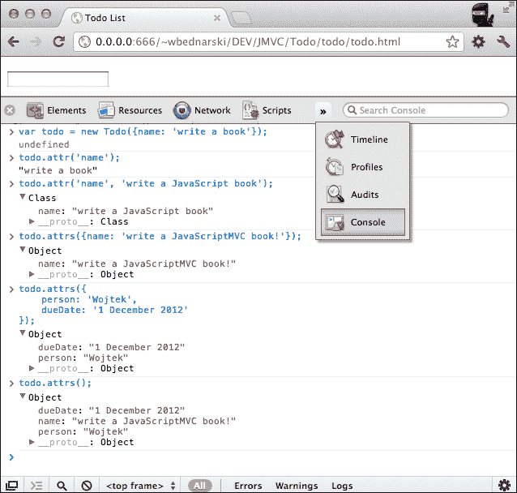
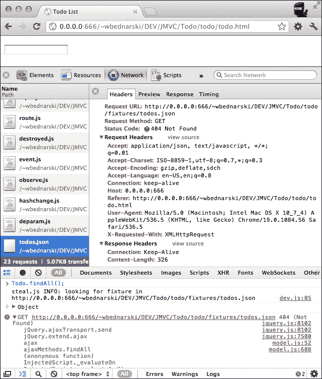
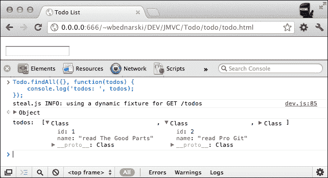
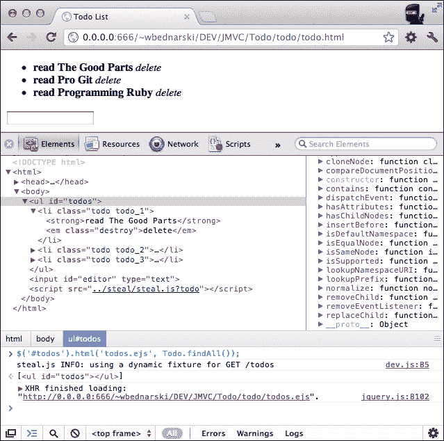

# 第一章. JavaScriptMVC 入门

在本章中，我们将概述 JavaScriptMVC 框架。我们将安装它，了解其架构，并以最佳方式学习它。最后，我们将构建一个简单的应用程序。没有什么比例子更有效了。有人说这是唯一有效的方法。

# 什么是 JavaScriptMVC？

**JavaScriptMVC** （**JMVC**）是一个基于 jQuery 库构建的 JavaScript 开源 **模型-视图-控制器** （**MVC**）框架。

它是一个后端无关的客户端框架，可以与任何后端解决方案一起使用，例如 Node.js、Ruby on Rails、Django 等。

JavaScriptMVC 的理念是提供一套工具，以尽可能短的时间内构建高质量且易于维护的应用程序。

JavaScriptMVC 包含以下独立组件：

+   **StealJS**：这是依赖管理器和生产构建

+   **FuncUnit**：这是单元和功能测试组件

+   **jQueryMX**：这包含一系列插件，提供将大型 JavaScript 代码库实现和组织成良好结构化和组织形式的功能，提供模型-视图-控制器抽象层

+   **DocumentJS**：这是文档

第一个版本于 2008 年 5 月发布。当前版本 3.2 于 2010 年 12 月发布。本书撰写时的最新版本是 3.2.2。

在即将发布的 JavaScriptMVC 3.3 版本中，jQueryMX 项目将被 CanJS 替换。使用当前 JMVC 版本的项目在经过少量重构后应能与 JMVC 3.3 一起工作，这得益于名称回退。

JavaScriptMVC 4.0 将更名为 DoneJS，并将对 StealJS 进行重大更改，使其完全兼容 AMD，并与 CommonJS 一起工作，在 Node.js 上运行。FuncUnit 将分为 3 部分：Syn - 合成事件库，ShouldJS - 使用 Jasmine 或 QUnit 的异步测试驱动，DidJS - 自动测试运行器绑定，用于 Jasmine 或 QUnit，Selenium，PhantomJS 等。

## 许可证

JavaScriptMVC 在以下例外情况下根据 MIT 许可证授权：

+   Rhino：这是 JavaScript 命令行（MPL 1.1）

+   Selenium 浏览器自动化（Apache 2）

## 链接

您可以参考以下 URL 了解更多关于 JavaScriptMVC 的信息：

+   官方网站：[`javascriptmvc.com`](http://javascriptmvc.com)

+   仓库：[`github.com/bitovi/javascriptmvc`](https://github.com/bitovi/javascriptmvc)

# 为什么选择 JavaScriptMVC？

JavaScriptMVC 是一个稳固且文档齐全的框架。

它基于极其流行的 JavaScript 库 **jQuery**，许多 JavaScript 程序员都熟悉其工厂方法和链式函数风格。

JavaScriptMVC 是一个完整的包。它包含我们构建、管理、文档和测试 JavaScript 项目所需的一切。

由于它是一个模块化框架，我们不需要使用所有可用的组件。我们可以从只使用我们实际需要的框架组件开始，并在需要时添加额外的组件。

学习曲线相对较低，尤其是如果读者熟悉其他 JavaScript 框架，如轻量级的 Backbone 和 Sammy 或重量级的工具包，如 Dojo 工具包或 Google Closure。同时，它提供了比轻量级兄弟更多的功能，而没有沉重的感觉，例如 Google Closure，它生成的代码更干净，提供的文档比非常流行的 Dojo 工具包更好。

它的一个杀手级特性是防止内存泄漏。这是客户端应用程序的一个重要方面，这些应用程序在**文档对象模型**（**DOM**）树上进行许多操作。

### 小贴士

**JavaScriptVC 中的 MVC**

JavaScriptMVC 利用经典的 MVC 模式，将业务逻辑和应用程序数据与用户界面分离。

# 系统架构方法

当构建 Web 应用程序时，我们可以区分两种方法——多页面应用和单页面应用。

在**多页面应用**中，大部分的业务逻辑是在后端系统中实现的，同时在 JavaScript 中进行一些增强。例如，Ruby on Rails 应用程序，其中大部分主要逻辑是通过后端 MVC 架构实现的，当用户导航到另一个页面时，会发送一个普通的`http`请求。

在**单页面应用**中，大部分的业务逻辑是在前端实现的。例如，JavaScriptMVC 应用程序，其中大部分主要逻辑是通过前端 MVC 架构实现的。当用户导航到另一个页面时，前端路由器将分发所有请求并调用后端 API；例如，在 Sinatra 中。

## JavaScriptMVC 单页面应用

JavaScriptMVC 是为单页面应用场景设计的。了解与多页面应用相比，单页面应用方法的优缺点是很好的。

### 优点

+   大多数状态都是在客户端维护的，因此我们不需要在服务器端保持会话状态。

+   大多数请求都是通过 XHR 调用完成的，因此每次不需要加载新页面，这可能会导致高内存占用（尤其是在旧式的、非事件驱动的服务器，如 Apache 服务器中）。

+   大部分业务逻辑在客户端，因此我们可以节省许多对服务器的调用。

### 缺点

+   由于使用 RPC 在服务器和客户端之间来回移动数据，负载均衡和**内容分发网络**（**CDN**）可能会变得复杂。

+   **搜索引擎优化**（**SEO**）由于动态构建的 JavaScript 页面可能会变得复杂。

# 真实世界的例子

读者可以在[`community.javascriptmvc.com/posts/in-bucket/apps`](http://community.javascriptmvc.com/posts/in-bucket/apps)找到使用 JavaScriptMVC 框架构建的 Web 应用程序。

# 安装 JavaScriptMVC

安装 JavaScriptMVC 就像泡茶一样简单，但速度更快。

## 选择你的方法

有三种方法。

+   从官方网站([`javascriptmvc.com`](http://javascriptmvc.com))下载完整包，或者构建一个包含我们想要使用的组件的自定义包([`javascriptmvc.com/builder.html`](http://javascriptmvc.com/builder.html))

+   从 GitHub 上托管的 Git 仓库拉取代码。

+   使用 Vagrant

最后两种方法是首选方式，原因如下：

+   易于更新到最新版本

+   通过`checkout`标签轻松切换到另一个版本

+   为项目做出贡献；这有多么酷？有关贡献的更多信息，请访问[`javascriptmvc.com/docs.html#!developwithgit`](http://javascriptmvc.com/docs.html#!developwithgit)

第三种方法似乎是最好的，因为它包含了第二种方法的全部优点，并且创建了一个封装的环境，我们可以轻松快速地创建或删除，而不会影响我们当前的开发环境设置。

### 哪种方法适合我？

对于快速尝试库，选择第一种方法。对于实际开发，肯定选择第二种。

### 第一种方法——下载包

在这个方法中，我们将使用 JavaScriptMVC 网页上的 Web 界面来配置和下载包：

1.  从[`javascriptmvc.com`](http://javascriptmvc.com)下载完整包并解压其内容。

1.  在本地 web 服务器工作目录下创建一个名为`Todo`的文件夹。

1.  将`javascriptmvc-3.2.2`文件夹中的所有文件复制到`Todo`文件夹，并启动 web 服务器。

    ```js
    $ mkdir Todo && cp -r javascriptmvc-3.2.2/* Todo && cd Todo

    ```

就这些；我们已经设置好了，准备出发。

### 第二种方法——从 Git 仓库拉取代码

我们假设读者已经了解并安装了 Git。

如果没有，以下资源可能有所帮助：

+   **安装** **Git**：[`git-scm.com/book/en/Getting-Started-Installing-Git`](http://git-scm.com/book/en/Getting-Started-Installing-Git)

+   **免费书籍 Pro Git**：[`git-scm.com/book`](http://git-scm.com/book)

+   **Git** **参考**：[`gitref.org`](http://gitref.org)

在以下步骤中，我们将为我们的`Todo`示例项目安装 JavaScriptMVC：

1.  在本地 web 服务器目录下，创建一个名为`Todo`的新文件夹：

    ```js
    $ mkdir Todo && cd Todo
    ```

1.  在`Todo`文件夹内，创建一个新的 Git 仓库：

    ```js
    $ git init
    ```

1.  将 JavaScriptMVC 组件作为子模块添加到项目中：

    ```js
    $ git submodule add git://github.com/bitovi/steal.git
    $ git submodule add git://github.com/bitovi/documentjs.git
    $ git submodule add git://github.com/bitovi/funcunit.git
    $ git submodule add git://github.com/jupiterjs/jquerymx jquery
    ```

1.  安装和更新子模块：

    ```js
    $ git submodule init
    $ git submodule update
    ```

1.  我们需要安装的最后一个模块是`Syn`。由于它已经是`FuncUnit`项目的子模块，我们只需要初始化并更新它：

    ```js
    $ cd funcunit
    $ git submodule init
    $ git submodule update
    ```

1.  将`Syn`切换到`master`分支：

    ```js
    $ cd syn/
    $ git checkout master
    ```

1.  返回项目的根目录：

    ```js
    $ cd ../..
    ```

1.  将`js`命令移动到项目的根目录：

    ```js
    $ ./steal/js steal/make.js
    ```

#### 验证安装

项目目录应该有以下的文件夹结构：

```js
.git
.gitmodules
documentjs
funcunit
jquery
js
js.bat
steal
```

就这些；我们已经设置好了，准备出发。

### 注意

更多关于 Git 子模块的信息：[`git-scm.com/book/en/Git-Tools-Submodules`](http://git-scm.com/book/en/Git-Tools-Submodules)

### 第三种方法——Vagrant

要使用此方法安装 JavaScriptMVC，我们需要安装 **Vagrant**，它是一个围绕 Oracle VM VirtualBox 的虚拟化开发工具包装器，Oracle VM VirtualBox 是一个 x86 和 AMD64/Intel64 虚拟化软件包。

1.  下载并安装 Oracle VM VirtualBox ([`www.virtualbox.org`](https://www.virtualbox.org)).

1.  下载并安装 Vagrant ([`downloads.vagrantup.com`](http://downloads.vagrantup.com)).

1.  下载并解压 JavaScriptMVC 启动器 ([`github.com/wbednarski/JavaScriptMVC_kick-starter/archive/master.zip`](https://github.com/wbednarski/JavaScriptMVC_kick-starter/archive/master.zip)).

1.  在 JavaScriptMVC 启动器文件夹中输入 `vagrant up`。

    此命令创建一个虚拟环境和项目目录。它还安装了 Web 服务器。JavaScriptMVC 框架将被放置在 `Todo` 目录中。

我们在项目目录内所做的任何更改都会立即在 `http://192.168.111.111/` 的 Web 浏览器中可见。

# 文档和 API

良好的文档和 API、许多教程以及良好的代码库文档是 JavaScriptMVC 的优势：

+   JavaScriptMVC 文档：[`javascriptmvc.com/docs.html`](http://javascriptmvc.com/docs.html)

+   JavaScriptMVC API：[`jqapi.com`](http://jqapi.com)

+   JavaScriptMVC 教程：[`javascriptmvc.com/docs.html#!tutorials`](http://javascriptmvc.com/docs.html#!tutorials)

+   JavaScriptMVC 代码示例：[`javascriptmvc.com/docs.html#!examples`](http://javascriptmvc.com/docs.html#!examples)

论坛和 Stack Overflow 上的活跃社区：

+   关于 JavaScriptMVC 的 Stack Overflow 问题：[`stackoverflow.com/questions/tagged/javascriptmvc`](http://stackoverflow.com/questions/tagged/javascriptmvc)

+   JavaScriptMVC 官方论坛：[`forum.javascriptmvc.com/allforums`](http://forum.javascriptmvc.com/allforums)

# JavaScriptMVC 的架构

JavaScriptMVC 的架构是模块化的。强大的堆栈包含我们构建一个组织良好、经过测试和文档化的应用程序所需的一切。

这里列出了 JavaScriptMVC 的关键组件以及下一章中涵盖的主题。

## DocumentJS

**DocumentJS** 是一个独立的 JavaScript 文档应用程序，并提供以下功能：

+   带有源代码和 HTML 面板的内联演示

+   向文档添加标签

+   添加文档为收藏

+   自动建议搜索

+   测试结果页面

+   评论

+   扩展 JSDoc 语法

+   添加未记录的代码，因为它理解 JavaScript

## FuncUnit

**FuncUnit** 是一个独立的 Web 测试框架，并提供以下功能：

+   测试点击、输入、移动鼠标光标和拖放实用程序

+   在页面间跟踪用户

+   多浏览器和操作系统支持

+   持续集成解决方案

+   在浏览器中编写和调试测试

+   与 jQuery 并行的链式 API

## jQueryMX

**jQueryMX** 是 JavaScriptMVC 的 MVC 部分，并提供以下功能：

+   鼓励逻辑分离、确定性代码

+   MVC 层

+   统一的客户端模板接口（支持 jq-tmpl、EJS、JAML、Micro 和 Mustache）

+   Ajax 固定值

+   有用的 DOM 工具

+   语言助手

+   JSON 工具

+   类系统

+   自定义事件

## StealJS

**StealJS**是一个独立的代码管理和构建工具，并提供以下强大功能：

### 依赖关系管理

+   加载 JavaScript 和 CoffeeScript

+   加载 CSS、Less 和 Sass 文件

+   加载客户端模板，如 TODO

+   只加载单个文件一次

+   从不同域名加载文件

### 连接和压缩

+   Google Closure 压缩机

+   创建多页构建

+   预处理`TODO`

+   可以有条件地从生产构建中删除指定的代码

+   构建独立的 jQuery 插件

### 记录器

+   在开发模式下记录消息

### 代码生成器

+   生成应用程序骨架

+   添加创建自定义生成器的可能性

### 包管理

+   从 SVN 和 Git 仓库下载并安装插件

+   安装依赖项

+   运行安装脚本

+   只加载单个文件一次

+   从不同域名加载文件

### 代码清理器

+   对你的代码库运行 JavaScript 美化器

+   对你的代码库运行 JSLint

# 构建简单应用

我们安装了 JavaScriptMVC，简要了解了其组件。现在，我们准备好构建第一个 JavaScriptMVC 应用程序。

激动吗？让我们来施展魔法。

## 待办事项列表

我们将学习 JavaScriptMVC，在经典的示例应用——待办事项列表中。

### 注意

如果你好奇，并想根据`todos`应用程序示例比较不同的 JavaScript 框架，那么 GitHub 项目绝对很棒。你可以在[`github.com/tastejs/todomvc/tree/gh-pages/architecture-examples`](https://github.com/tastejs/todomvc/tree/gh-pages/architecture-examples)找到它。项目主页在[`todomvc.com/`](http://todomvc.com/)。

### 加载器

在安装 JavaScriptMVC 期间创建的`Todo`文件夹中，创建一个名为`todo`的文件夹。在`todo`文件夹内创建名为`todo.html`和`todo.js`的文件。

项目目录应具有以下结构：

```js
Todo/
    .git
    .gitmodules
    todo/
        todo.html
        todo.js
    documentjs
    funcunit
    jquery
    js
    js.bat
    steal
```

将以下代码复制并粘贴到`todo.html`中，以加载`StealJS`和`todo.js`文件：

```js
<!doctype html>

<html>
    <head>
        <title>Todo List</title>
        <meta charset="UTF-8" />
    </head>
    <body>
        <ul id="todos">
            <li>all done!</li>
        </ul>

        <script src="img/steal.js?todo"></script>
    </body>
</html>
```

### 注意

`../steal/steal.js?todo`等同于`../steal/steal.js?todo/todo.js`。如果未提供文件名，`StealJS`将尝试加载与给定文件夹同名的 JavaScript 文件。

在`todo.js`中添加以下代码以加载`jQueryMX`插件。它们是实现此应用程序所必需的：

```js
steal(
    'jquery/class',
    'jquery/model',
    'jquery/dom/fixture',
    'jquery/view/ejs',
    'jquery/controller',
    'jquery/controller/route',

    function ($) {

    }
);
```

通过输入`http://YOUR_LOCAL_WEB_SERVER/Todo/todo.html`在网页浏览器中打开页面，并使用像 Google Chrome Inspector 这样的网页开发工具检查`StealJS`和所有列出的插件是否正确加载。

### 模型

下一步是将模型添加到我们的应用程序中，通过扩展`jQueryMX`项目中的`$.Model`。

第一个参数是模型名称（字符串），第二个参数是具有类属性和方法的对象。最后一个参数是原型实例属性，在这个例子中我们将其留为空对象：

```js
steal(
    'jquery/class',
    'jquery/model',
    'jquery/dom/fixture',
    'jquery/view/ejs',
    'jquery/controller',
    'jquery/controller/route',

    function ($) {
 $.Model('Todo', {
 findAll: 'GET /todos',
 findOne: 'GET /todos/{id}',
 create:  'POST /todos',
 update:  'PUT /todos/{id}',
 destroy: 'DELETE /todos/{id}'
 },
 {

 }
 );
    }
);
```

### 注意

类属性不是随机的；它们在模型 API 中有描述。[`javascriptmvc.com/docs.html#!jquerymx`](http://javascriptmvc.com/docs.html#!jquerymx)。

我们已经为我们的 `todo` 列表应用程序创建了 `Todo` 模型。现在，是时候玩转它了。

1.  打开一个网络浏览器，并在 JavaScript 控制台中输入以下行：

    ```js
    var todo = new Todo({name: 'write a book'});
    ```

    `todo` 现在是 `Todo` 的一个实例，属性名为 `write a book`，属性值为 `write a book`。

1.  按如下方式获取属性值：

    ```js
    todo.attr('name');
    ```

1.  如果属性存在，则设置属性值，如下所示：

    ```js
    todo.attr('name', 'write JavaScript book');
    ```

    或者通过 `attrs`，我们可以同时设置多个属性，以及添加新的属性：

    ```js
    todo.attrs({name: 'write JavaScriptMVC book!'});
    ```

1.  添加两个新属性：

    ```js
    todo.attrs({
        person: 'Wojtek',
        dueDate: '1 December 1012'
    });
    ```

1.  列出所有属性：

    ```js
    Todo.attrs();
    ```

以下截图显示了前面命令的执行：



### 固定装置

由于在我们的前端应用程序中没有后端服务来处理 /todo API 调用，因此尝试在 `Todo` 模型上调用模型的一个 CRUD 方法将导致网络错误。

### 注意

**创建、读取、更新、删除**（**CRUD**）是持久存储的四个基本功能。



到目前为止，`$` `.fixture` 出现了救援。有了这个特性，我们可以在后端代码尚未准备好的情况下工作项目。

为 `Todo` 模型创建固定装置：

```js
steal(
    'jquery/class',
    'jquery/model',
    'jquery/util/fixture',
    'jquery/view/ejs',
    'jquery/controller',
    'jquery/controller/route',

    function ($) {
        $.Model('Todo', {
                findAll: 'GET /todos',
                findOne: 'GET /todos/{id}',
                create:  'POST /todos',
                update:  'PUT /todos/{id}',
                destroy: 'DELETE /todos/{id}'
            },
            {

            }
        );

 // Fixtures
 (function () {

 var TODOS = [
 // list of todos
 {
 id:   1,
 name: 'read The Good Parts'
 },
 {
 id:   2,
 name: 'read Pro Git'
 },
 {
 id:   3,
 name: 'read Programming Ruby'
 }
 ];

 // findAll
 $.fixture('GET /todos', function () {
 return [TODOS];
 });

 // findOne
 $.fixture('GET /todos/{id}', function (orig) {
 return TODOS[(+orig.data.id) - 1];
 });

 // create
 var id = 4;
 $.fixture('POST /todos', function () {
 return {
 id: (id++)
 };
 });

 // update
 $.fixture('PUT /todos/{id}', function () {
 return {};
 });

 // destroy
 $.fixture('DELETE /todos/{id}', function () {
 return {};
 });

 }());
    }
);
```

现在，我们可以像后端服务在这里一样使用我们的 `Todo` 模型方法。

例如，我们可以列出所有 `todos`：

```js
Todo.findAll({}, function(todos) {
    console.log('todos: ', todos);
});
```

以下截图显示了 `console.log('todos: ', todos);` 命令的输出：



### 查看

现在是添加一些 HTML 代码的好时机，以便在浏览器控制台之外看到一些内容。为此，使用开源客户端模板系统 **嵌入式 JavaScript**（**EJS**）。

在 `todo` 目录（与 `todo.js` 所在的同一文件夹）中创建一个新的文件 `todos.ejs`，并向其中添加以下代码：

```js
<% $.each(this, function(i, todo) { %>

    <li <%= ($el) -> $el.model(todo) %>>
        <strong><%= todo.name %></strong>
        <em class="destroy">delete</em>
    </li>

<% }) %>
```

然后，在控制台中输入以下内容：

```js
$('#todos').html('todos.ejs', Todo.findAll());
```

现在，我们可以看到所有 `todos` 被打印出来：



基本上，EJS 模板是一个带有在 `<%` 和 `%>` 或 `<%=` 和 `%>`（以及一些其他方式）之间注入的 JavaScript 代码的 HTML 文件。

不同之处在于，在第二种情况下，JavaScript 代码返回的所有值都被转义并打印出来。在第一种情况下，它们只被评估。

第一行是 jQuery 的 `each` 循环——这里没有魔法。然而，下一行对于许多读者来说可能是一个新事物。它是 ECMAScript Harmony 类似的箭头函数语法，用于 EJS 解析器，它的简单性不会使整个画面变得暗淡。

以下语法：

```js
($el) -> $el.model(todo)
```

可以解释如下：

```js
function ($el) {
    return $el.model(todo)
}
```

### 控制器

让我们在用户界面中添加一些动作。

将以下代码添加到 `todo.js` 文件中，并在浏览器中刷新应用程序：

```js
$.Controller('Todos', {
    // init method is called when new instance is created
    'init': function (element, options) {
        this.element.html('todos.ejs', Todo.findAll());
    },

    // add event listener to strong element on click
    'li strong click': function (el, e) {
        // trigger custom event
        el.trigger('selected', el.closest('li').model());

        // log current model to the console
        console.log('li strong click', el.closest('.todo').model());
    },

    // add event listener to em element on click
    'li .destroy click': function (el, e) {
        // call destroy on the model to prevent memory leaking
        el.closest('.todo').model().destroy();
    },

    // add event listener to Todo model on destroyed
    '{Todo} destroyed': function (Todo, e, destroyedTodo) {
        // remove element from the DOM tree
        destroyedTodo.elements(this.element).remove();

        console.log('destroyed: ', destroyedTodo);
    }
});

// create new controller instance
new Todos('#todos');
```

现在，你可以点击`todo`名称来查看控制台日志或删除它。

当一个新的控制器实例化时，会调用`init`方法。

当`controller`元素从 DOM 树中移除（在我们的例子中是`#todos`）时，会自动调用`destroy`方法，解绑所有`controller`事件处理器，并释放其元素以防止内存泄漏。

### 路由

替换以下代码：

```js
// create new Todo controller instance
new Todos('#todos');
```

使用：

```js
// routing
$.Controller('Routing', {
    init: function () {
        new Todos('#todos');
    },

    // the index page
    'route': function () {
        console.log('default route');
    },

    // handle URL witch hash
    ':id route': function (data) {
        Todo.findOne(data, $.proxy(function (todo) {
            // increase font size for current todo item
            todo.elements(this.element).animate({fontSize: '125%'}, 750);
        }, this));
    },

    // add event listener on selected
    '.todo selected':  function (el, e, todo) {
        // pass todo id as a parameter to the router
        $.route.attr('id', todo.id);
    }
});

// create new Routing controller instance
new Routing(document.body);
```

刷新应用并尝试点击`todo`列表元素。你会发现点击带有相应 ID 的`todo`项后，URL 会更新。

### 完整应用代码

这是`Todo`应用的完整代码：

```js
steal(
    'jquery/class',
    'jquery/model',
    'jquery/util/fixture',
    'jquery/view/ejs',
    'jquery/controller',
    'jquery/controller/route',

    function ($) {
        $.Model('Todo', {
                findAll: 'GET /todos',
                findOne: 'GET /todos/{id}',
                create:  'POST /todos',
                update:  'PUT /todos/{id}',
                destroy: 'DELETE /todos/{id}'
            },
            {

            }
        );

        // Fixtures
        (function () {
            var TODOS = [
                // list of todos
                {
                    id:   1,
                    name: 'read The Good Parts'
                },
                {
                    id:   2,
                    name: 'read Pro Git'
                },
                {
                    id:   3,
                    name: 'read Programming Ruby'
                }
            ];

            // findAll
            $.fixture('GET /todos', function () {
                return [TODOS];
            });

            // findOne
            $.fixture('GET /todos/{id}', function (orig) {
                return TODOS[(+orig.data.id) - 1];
            });

            // create
            var id = 4;
            $.fixture('POST /todos', function () {
                return {
                    id: (id++)
                };
            });

            // update
            $.fixture('PUT /todos/{id}', function () {
                return {};
            });

            // destroy
            $.fixture('DELETE /todos/{id}', function () {
                return {};
            });
        }());

        $.Controller('Todos', {
            // init method is called when new instance is created
            'init': function (element, options) {
                this.element.html('todos.ejs', Todo.findAll());
            },

            // add event listener to strong element on click
            'li strong click': function (el, e) {
                // trigger custom event
                el.trigger('selected', el.closest('li').model());

                // log current model to the console
                console.log('li strong click', el.closest('.todo').model());
            },

            // add event listener to em element on click
            'li .destroy click': function (el, e) {
                // call destroy on the model to prevent memory leaking
                el.closest('.todo').model().destroy();
            },

            // add event listener to Todo model on destroyed
            '{Todo} destroyed': function (Todo, e, destroyedTodo) {
                // remove element from the DOM tree
                destroyedTodo.elements(this.element).remove();

                console.log('destroyed: ', destroyedTodo);
            }
        });

        // routing
        $.Controller('Routing', {
            init: function () {
                new Todos('#todos');
            },

            // the index page
            'route': function () {
                console.log('default route');
            },

            // handle URL witch hash
            ':id route': function (data) {
                Todo.findOne(data, $.proxy(function (todo) {
                    // increase font size for current todo item
                    todo.elements(this.element).animate({fontSize: '125%'}, 750);
                }, this));
            },

            // add event listener on selected
            '.todo selected':  function (el, e, todo) {
                // pass todo id as a parameter to the router
                $.route.attr('id', todo.id);
            }
        });

        // create new Routing controller instance
        new Routing(document.body);
    }
);
```

# 摘要

在本章中，我们学习了什么是 JavaScriptMVC，以及为什么它是一个好且稳固的框架。我们还学习了如何安装它，浏览文档和 API。通过构建一个简单的应用，我们对其架构有了概览。

如果你能够理解我们在这章中编写的所有代码，你将能够轻松快速地深入研究框架。恭喜你！
