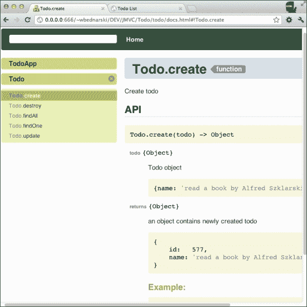

# 第二章. DocumentJS

仅源代码是不够的；文档是软件工程的重要组成部分。**DocumentJS** 是一个强大且简单的工具，旨在轻松为任何 JavaScript 代码库创建可搜索的文档。

在本章中，我们将了解 DocumentJS 的概述。我们将学习它是如何工作的，并学习如何生成其文档。

以下是一些 DocumentJS 的关键特性：

+   灵活且易于扩展

+   支持 Markdown：[`en.wikipedia.org/wiki/Markdown`](http://en.wikipedia.org/wiki/Markdown)

+   集成文档查看器和 API 搜索

+   与任何 JavaScript 代码一起工作，而不仅仅是与 JavaScriptMVC 一起工作

如果你熟悉 JSDoc、YUIDoc、YARD 或类似的文档语法/工具，那么 DocumentJS 可以在几分钟内学会。

DocumentJS 的文档可以在 [`javascriptmvc.com/docs.html#!DocumentJS`](http://javascriptmvc.com/docs.html#!DocumentJS) 找到。

### 注意

**Markdown** 是一个文本到 HTML 转换工具，它允许你使用易于阅读和易于书写的纯文本格式编写（[`daringfireball.net/projects/markdown`](http://daringfireball.net/projects/markdown)）。

# DocumentJS 是如何工作的？

DocumentJS 的架构是围绕类型和标签组织的。

**类型**代表我们可能想要注释的 JavaScript 代码的每个相对独立的部分，例如类、函数（方法）或属性。

标签为类型提供额外的信息，例如参数和返回值。

DocumentJS 解析 JavaScript 和 Markdown 文件以生成用于由 JMVCDoc 渲染文档的 JSONP 文件。

# 编写文档

让我们在第一章 JavaScriptMVC 入门 中添加关于我们的 `Todo` 列表应用的文档，*JavaScriptMVC 入门*。

要添加主文档页面，在 `Todo/todo` 目录中创建一个 Markdown 文件 `todo.md`，内容如下：

```js
@page index TodoApp
@description TodoApp is simple todo application.

# TodoApp documentation

Here we can add some more documentation formatted by [Markdown][1]!

[1]: http://daringfireball.net/projects/markdown/syntax "Check out Markdown syntax"
```

然后，将这些文档块添加到 `todo.js` 文件中：

```js
steal(
    'jquery/class',
    'jquery/model',
    'jquery/util/fixture',
    'jquery/view/ejs',
    'jquery/controller',
    'jquery/controller/route',
    function ($) {

        /**
 * @class Todo
 * @parent index
 * @constructor
 * @author Wojciech Bednarski
 * Creates a new todo.
 */
        $.Model('Todo',{

 /**
 * @function findAll
 * Get all todos
 * @return {Array} an array contains objects with all todos
 */
                findAll: 'GET /todos',

 /**
 * @function findOne
 * Get todo by id
 * @return {Object} an objects contains single todo
 */
                findOne: 'GET /todos/{id}',

 /**
 * @function create
 * Create todo
 * @param {Object} todo
 * Todo object
 * @codestart
 * {name: 'read a book by Alfred Szklarski'}
 * @codeend
 *
 * @return {Object} an object contains newly created todo
 * @codestart
 * {
 *     id:   577,
 *     name: 'read a book by Alfred Szklarski'
 * }
 * @codeend
 *
 * ### Example:
 * @codestart
 * var todo = new Todo({name: 'read a book by Alfred Szklarski'});
 * todo.save(function (todo) {
 *     console.log(todo);
 * });
 * @codeend
 */
                create:  'POST /todos',

 /**
 * @function update
 * Update todo by id
 * @return {Object} an object contains updated todo
 */
                update:  'PUT /todos/{id}',

 /**
 * @function destroy
 * Destroy todo by id
 * @return {Object} an object contains destroyed todo
 */
                destroy: 'DELETE /todos/{id}'
            },
            {

            }
        );

        // Fixtures
        (function () {
            var TODOS = [
                // list of todos
                {
                    id:   1,
                    name: 'read The Good Parts'
                },
                {
                    id:   2,
                    name: 'read Pro Git'
                },
                {
                    id:   3,
                    name: 'read Programming Ruby'
                }
            ];

            // findAll
            $.fixture('GET /todos', function () {
                return [TODOS];
            });

            // findOne
            $.fixture('GET /todos/{id}', function (orig) {
                return TODOS[(+orig.data.id) - 1];
            });

            // create
            var id = 4;
            $.fixture('POST /todos', function () {
                return {
                    id: (id++)
                };
            });

            // update
            $.fixture('PUT /todos/{id}', function () {
                return {};
            });

            // destroy
            $.fixture('DELETE /todos/{id}', function () {
                return {};
            });
        }());

 /**
 * @class Todos
 * Creates a new Todos controller
 * @parent index
 * @constructor
 * @param {String} DOMElement DOM element
 * @return {Object}
 */
        $.Controller('Todos', {
            // init method is called when new instance is created
            'init': function (element, options) {
                this.element.html('todos.ejs', Todo.findAll());
            },

            // add event listener to strong element on click
            'li strong click': function (el, e) {
                // trigger custom event
                el.trigger('selected', el.closest('li').model());

                // log current model to the console
                console.log('li strong click', el.closest('.todo').model());
            },

            // add event listener to em element on click
            'li .destroy click': function (el, e) {
                // call destroy on the model to prevent memory leaking
                el.closest('.todo').model().destroy();
            },

            // add event listener to Todo model on destroyed
            '{Todo} destroyed': function (Todo, e, destroyedTodo) {
                // remove element from the DOM tree
                destroyedTodo.elements(this.element).remove();

                console.log('destroyed: ', destroyedTodo);
            }
        });

 /**
 * @class Routing
 * Creates application router
 * @parent index
 * @constructor
 * @param {String} DOMElement DOM element
 * @return {Object}
 */
        $.Controller('Routing', {
            init: function () {
                new Todos('#todos');
            },

            // the index page
            'route': function () {
                console.log('default route');
            },

            // handle URL witch hash
            ':id route': function (data) {
                Todo.findOne(data, $.proxy(function (todo) {
                    // increase font size for current todo item
                    todo.elements(this.element).animate({fontSize: '125%'}, 750);
                }, this));
            },

            // add event listener on selected
            '.todo selected':  function (el, e, todo) {
                // pass todo id as a parameter to the router
                $.route.attr('id', todo.id);
            }
        });

        // create new Routing controller instance
        new Routing(document.body);
    }
);
```

## 类型指令

类型指令代表你可能想要记录的 JavaScript 构造：

+   `@page`：这添加了一个独立页面

+   `@attribute`：这些是在对象上的文档值

+   `@function`：这些是文档函数

+   `@class`：这记录了一个类

+   `@prototype`：这被添加到之前的类或构造函数的原型函数中

+   `@static`：这被添加到之前的类或构造函数的静态函数中

+   `@add`：这会将文档添加到另一个文件中描述的类或构造函数

## 标签指令

标签指令为注释提供额外的信息：

+   `@alias`：这指定了类或构造函数的其他常用名称

+   `@author`：这指定了类的作者

+   `@codestart`：这指定了代码块的开始

+   `@codeend`：这指定了代码块的结束

+   `@constructor`：这记录了一个构造函数及其参数

+   `@demo`：这是应用程序演示的占位符

+   `@description`：这用于添加简短描述

+   `@download`: 这用于添加下载链接

+   `@iframe`: 这用于添加带有示例代码的 iframe

+   `@hide`: 这隐藏了类视图

+   `@inherits`: 这指定了类或构造函数继承的内容

+   `@parent`: 这指定了当前类型应该位于哪个父类型下

+   `@param`: 这指定了函数参数

+   `@plugin`: 这指定了一个通过它来获取对象的插件

+   `@return`: 这指定了函数返回的内容

+   `@scope`: 这强制当前类型开始作用域

+   `@tag`: 这指定了搜索的标签

+   `@test`: 这指定了测试用例的链接

+   `@type`: 这为当前注释的代码设置类型

+   `@image`: 这添加了一个图片

# 生成文档

要生成文档，我们只需要从命令行（在`Todo`目录内）运行`doc`命令：

```js
$ ./documentjs/doc todo
PROCESSING SCRIPTS

 todo/todo.js
 todo/todo.md

GENERATING DOCS -> todo/docs

Using default page layout.  Overwrite by creating: todo/summary.ejs

```

这将生成文档，我们可以通过打开位于`Todo/todo`目录中的`docs.html`来浏览：



我们可以通过更改`summary.ejs`模板文件来自定义文档的外观和感觉。只需将模板从`documentjs/jmvcdoc`复制到`Todo/todo`并修改它。

# 摘要

在本章中，我们学习了什么是 DocumentJS 以及如何编写和生成其文档。

每个程序员都应该养成的一个好习惯是，他们必须记录代码库并保持其更新。
