# 第一章. 与数据交互：数据源、模板、标签页和网格

今天是成为一名网页开发者的激动人心的时候。网络浏览器和网络标准已经发展到程序员现在有丰富的框架可供选择，以提升生产力，用更少的代码和更少的烦恼触及广泛的受众。HTML、CSS 和 JavaScript 已经合并成一个强大而连贯的单元，使得网络应用在美学和架构上既美丽又优雅。来自 Telerik 的 Kendo UI 是一个拥抱这些进步的现代框架，提供了一套工具，以实现丰富的网络开发和可配置的控件，所有这些都具有熟悉和易访问的语法。

沿着同样的思路，开发工具也在不断改进，Microsoft 的 Visual Studio 2012 就是一个很好的例子。JavaScript 现在是 Microsoft 世界中的第一公民，IDE 中对 JavaScript 开发的改进以及 HTML5 和 CSS3 的支持也得到了改善。这主要是为了支持 Windows 8 中的新编程模型，允许网络开发者将他们的技能带到 Windows 8 桌面，但这些改进也直接受益于 ASP.NET 开发——特别是 ASP.NET MVC。这是我们将在本书中使用的编程环境，用于演示和学习 Kendo UI 框架。

# 设置样本项目

Kendo UI for web development 是一个客户端、由 jQuery 驱动的 JavaScript 框架，它不依赖于任何特定的服务器技术或平台。这意味着您可以使用您选择的工具和调试/测试环境来编写和运行本书中的客户端示例。然而，Telerik 也发布了一套针对 Microsoft ASP.NET MVC 框架的服务器端扩展，这可以显著提高生产力。为了利用这两种模型，我将使用 Visual Studio 2012 和 ASP.NET MVC 4 项目模板来进行所有演示，并邀请您跟我一起学习。Visual Studio 2012 Express 可以从 [`www.microsoft.com/visualstudio/eng/products/visual-studio-overview`](http://www.microsoft.com/visualstudio/eng/products/visual-studio-overview) 免费下载，如果您还没有安装它。

### 小贴士

**是否想要下载完成的样本？**

本书展示的样本可供下载，如果您不想自己设置所有步骤，也可以从完成的代码开始。

一旦您安装了 Visual Studio 2012，请从启动页面或从 **文件** 菜单中选择 **新建项目**。然后从项目选择中的 **Web** 组中选择 **ASP.NET MVC 4 网络应用**。如以下截图所示，我已经将我的项目命名为 `LearningKendoUIWeb`：

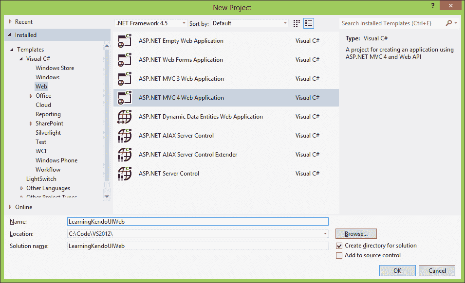

选择此选项并单击 **确定**。下一个窗口将显示一些关于你想要使用的模板类型的选项。我选择了基本模板，但你可以选择任何模板，除了空模板，以便跟随示例。你不需要为本书的目的创建单元测试项目。

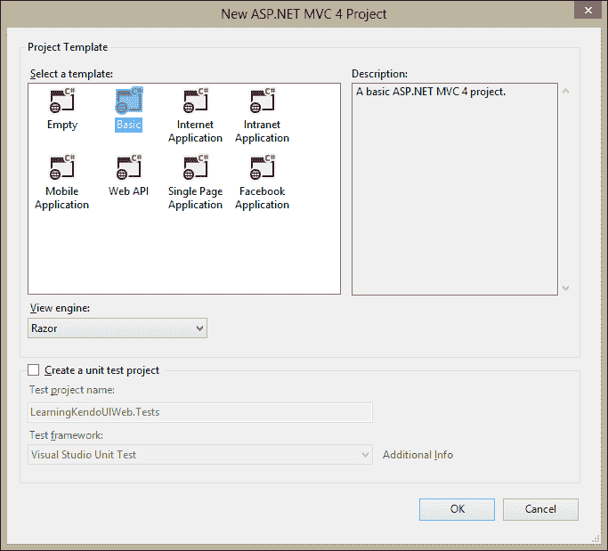

### 小贴士

**下载示例代码**

你可以从你购买的所有 Packt 书籍的账户 [`www.packtpub.com`](http://www.packtpub.com) 下载示例代码文件。如果你在其他地方购买了这本书，你可以访问 [`www.packtpub.com/support`](http://www.packtpub.com/support) 并注册以直接将文件通过电子邮件发送给你。

Visual Studio 将为你的新项目创建文件夹结构，并将所有必要的文件复制到该结构中，以便你可以在调试器中运行你的项目。一旦完成，你将在 Visual Studio IDE 的 **解决方案资源管理器** 部分看到你的项目树。

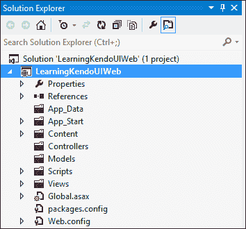

现在我们有了我们的结构，是时候下载 Telerik Kendo UI 文件并将它们放在正确的位置了。导航到 Telerik Kendo UI 网站 [`www.kendoui.com/download.aspx`](http://www.kendoui.com/download.aspx)，下载包含 ASP.NET MVC 服务器包装器的 Kendo UI 完整包的 30 天免费试用版。它将以 ZIP 文件的形式到达，包含你使用 Kendo UI 进行开发所需的所有内容。将 ZIP 文件的内容提取到你可以记住的地方，因为你将需要在本书的其余部分引用这些文件。此截图显示了 ZIP 文件应该包含的内容：

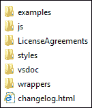

现在，按照以下步骤操作：

1.  返回 Visual Studio，在 **解决方案资源管理器** 中的 `Content` 文件夹上右键单击，并选择 **添加，新建文件夹**。将新文件夹命名为 `kendo`。

1.  右键单击你刚刚创建的 `kendo` 文件夹，再创建两个新的文件夹—`Default` 和 `textures`。现在，右键单击 `Default` 文件夹，并选择 **添加，现有项**。

1.  在显示的文件对话框中，导航到解压后的 Kendo 文件夹所在的文件夹，然后打开 `Styles` 文件夹，接着打开其内部的 `Default` 文件夹。

1.  选择此文件夹中的所有文件，然后单击 **添加** 按钮。这将把这些所有项目添加到 Visual Studio 项目中，以便在 **解决方案资源管理器** 中显示，并可以从 Visual Studio IDE 中进行管理。

1.  接下来，按照相同的步骤将这些所有项目添加到 `textures` 文件夹中。一旦这些文件就位，再次在 **解决方案资源管理器** 中右键单击 `kendo` 文件夹，并选择 **添加，现有项**。

在显示的对话框中，从解压的 kendo 文件夹的 `Styles` 文件夹中选择这两个特定的文件，并将它们也添加进去：

+   `kendo.common.min.css`

+   `kendo.default.min.css`

一旦这两个文件出现在**解决方案资源管理器**中，通过删除文件名中的`.min`部分来重命名它们（`kendo.default.min.css`变为`kendo.default.css`）；这将在接下来的几个段落中详细解释。当你完成时，**解决方案资源管理器**中的`Content`文件夹应该看起来像这样：

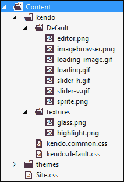

接下来，我们将按照一些非常相似的步骤准备`Scripts`文件夹。在**解决方案资源管理器**中，在`Scripts`文件夹内创建一个`kendo`文件夹，然后从下载的 Kendo 文件的`js`文件夹中复制以下文件：

+   `jquery.min.css`

+   `kendo.all.min.js`

+   `kendo.aspnetmvc.min.js` `kendo.web.min.js`

再次，删除文件名中的`.min`部分。然而，我们稍后将需要两个版本的`kendo.aspnetmvc.js`文件。现在，请复制该文件，但只从其中一个副本中删除文件名中的`<code>.min</code>`部分。这样，你将有一个带有`.min`文件名的文件副本，另一个没有`.min`文件名的文件副本。完成后的`kendo`文件夹在**解决方案资源管理器**中应该看起来像这样：

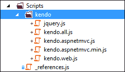

作为一名网页开发者，你肯定熟悉在网页头部引用脚本和样式的练习。ASP.NET MVC 4 自带一个很棒的功能，可以对这些脚本进行打包和压缩，同时内置缓存，以便浏览器可以更快地下载这些文件，从而在几乎不需要你做任何努力的情况下提高你网站的性能。此功能还适用于 CDN 位置，因此你可以在调试时使用本地文件，同时在网站部署时引用 CDN 托管的脚本或样式表。为了使我们的示例项目启用此功能，你需要在项目的`App_Start`文件夹中的`BundleConfig.cs`文件中添加以下代码。首先，在文件顶部添加此代码以启用 CDN 功能并保存我们想要使用的 CDN 位置的路径：

```js
// Enable CDN
bundles.UseCdn = true;

// CDN paths for kendo stylesheet files
var kendoCommonCssPath = "http://cdn.kendostatic.com/2013.1.319/styles/kendo.common.min.css";
var kendoDefaultCssPath = "http://cdn.kendostatic.com/2013.1.319/styles/kendo.default.min.css";

// CDN paths for kendo javascript files
var kendoWebJsPath = "http://cdn.kendostatic.com/2012.2.710/js/kendo.web.min.js";
```

然后，在文件底部添加以下代码以创建您的 Kendo 文件捆绑包。通过将 CDN 位置作为 `ScriptBundle` 构造函数的第二个参数传递，Visual Studio 将在调试时使用您本地的文件构建解决方案，并在发布模式下使用 CDN 位置的文件构建解决方案。这也是我应该解释为什么我们移除了 JavaScript 和样式表文件名中的 `.min` 部分。ASP.NET MVC 的捆绑和压缩功能在调试期间有意忽略了文件名中包含 `.min` 的文件。这意味着在调试期间，您的 Kendo 下载中的所有脚本引用都不会工作，因为我们项目中没有包含预压缩的文件。互联网上有几种处理此问题的方法，但对我们项目来说，最简单的方法就是重命名文件以避免整个问题。

```js
// Create the CDN bundles for kendo javascript files
bundles.Add(new ScriptBundle("~/bundles/kendo/web/js", kendoWebJsPath)
.Include("~/Scripts/kendo/kendo.web.js"));
// The ASP.NET MVC script file is not available from the Kendo Static CDN,
// so we will include the bundle reference without the CDN path.
bundles.Add(new ScriptBundle("~/bundles/kendo/mvc/js")
.Include("~/Scripts/kendo/kendo.aspnetmvc.js"));

// Create the CDN bundles for the kendo styleshseet files
bundles.Add(new StyleBundle("~/bundles/kendo/common/css", kendoCommonCssPath)
    .Include("~/Content/kendo/kendo.common.css"));
bundles.Add(new StyleBundle("~/bundles/kendo/default/css", kendoDefaultCssPath)
    .Include("~/Content/kendo/kendo.default.css"));
```

现在我们已经正确配置了 `BundleConfig.cs` 文件，我们可以调整 `_Layout.cshtml` 文件头部部分的引用。`_Layout.cshtml` 文件通过为所有页面创建统一的头部结构以及一个默认布局，在其中所有其他页面放置其特定内容，充当我们的默认母版页。在 `Views`、`Shared` 文件夹中打开 `_Layout.cshtml` 文件并做一些修改。默认情况下，它将包含一些出现在页面主体部分的脚本引用，以及一些出现在头部部分的。

虽然无疑有很好的理由这样做，但由于在这些脚本引用出现之前，我们页面的主体中已经有了 Kendo 脚本的引用，因此我们需要将所有内容移动到头部部分。由于这个文件不是很长，我已经在这里包含了我的完成版本，以便您可以复制它：

```js
@using Kendo.Mvc.UI;
<!DOCTYPE html>
<html>
<head>
<meta charset="utf-8" />
<meta name="viewport" content="width=device-width" />
<title>@ViewBag.Title</title>
@Styles.Render("~/Content/css")
@Styles.Render("~/bundles/kendo/common/css")
@Styles.Render("~/bundles/kendo/default/css")
@Scripts.Render("~/bundles/jquery")
@Scripts.Render("~/bundles/kendo/web/js")
@Scripts.Render("~/bundles/kendo/mvc/js")
</head>
<body>
@RenderBody()

@RenderSection("scripts", required: false)
</body>
</html>
```

注意，我还已经在文件的顶部添加了一个 `@using` 语句，请确保也复制它，因为它将启用所有页面的 **Intellisense**。Intellisense 是 Visual Studio 的一个功能，可以在您编写代码时自动完成代码，并且是一个极大的生产力提升器。要完全启用此功能，您还需要将 `Kendo.Mvc.dll` 文件添加到您的 Visual Studio 项目中：

1.  首先，在 Visual Studio 的 **Solution Explorer** 中右键单击 **LearningKendoUIWeb** 项目，并选择 **添加引用**。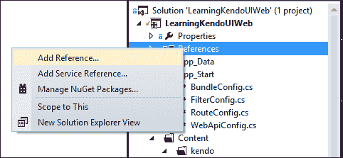

1.  接下来，单击 **浏览** 并在文件对话框中导航到您下载 Kendo 文件的位置。

1.  找到名为 `aspnetmvc` 的文件夹，打开其中名为 `Binaries` 的文件夹，然后打开该文件夹内名为 `Mvc3` 的文件夹。

1.  在这里您可以找到 `Kendo.Mvc.dll` 文件；单击它并选择 **添加**。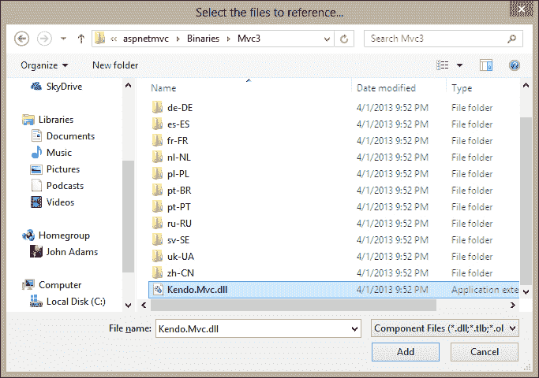

1.  添加此引用后，您可以通过在名为 `web.config` 的文件中添加一个特殊条目，使该代码中的所有内容对您的所有网页可用。

1.  此文件位于你的**LearningKendoUIWeb**项目的根目录中。打开`web.config`文件，找到名为`namespaces`的部分。将`Kendo.Web.UI`命名空间添加到列表中，如下所示：

    ```js
    <pages>
    <namespaces>
      <add namespace="System.Web.Helpers" />
      <add namespace="System.Web.Mvc" />
      <add namespace="System.Web.Mvc.Ajax" />
      <add namespace="System.Web.Mvc.Html" />
      <add namespace="System.Web.Optimization" />
      <add namespace="System.Web.Routing" />
      <add namespace="System.Web.WebPages" />
      <add namespace="Kendo.Mvc.UI" />
    </namespaces>
    </pages>
    ```

现在在项目中创建一个文件夹来存放静态内容。在**解决方案资源管理器**中右键单击项目名称，选择**添加，新建文件夹**。将新文件夹命名为`static`。这将是我们放置所有除 MVC 框架之外客户端示例的位置。

Visual Studio 2012 在 JavaScript Intellisense 方面有一些很好的改进，这将帮助我们编写代码。在脚本文件夹中打开名为`"_references.js"`的文件，并删除其中的所有文本。这是我的`"_references.js"`文件的全部内容，将其复制到你的文件中：

```js
/// <reference path="kendo/jquery.js" />
/// <reference path="kendo/kendo.web.js" />
/// <reference path="kendo/kendo.aspnetmvc.js" />
```

Visual Studio 2012 使用此文件作为编辑器中 Intellisense 应使用的 JavaScript 库列表。我已经包含了 Kendo 压缩包中包含的 jQuery 文件以及我们将在大多数网页中使用的两个 JavaScript 文件。一旦你设置好这些，你将在 JavaScript 文件中获得一些非常有帮助的编码辅助，如下所示：

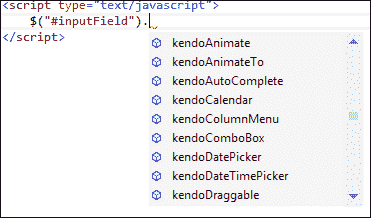

注意当你开始在编辑器中输入 JavaScript 代码时，所有的 Kendo 选项是如何显示出来的？当你在这本书的示例中编程时，这将变成帮助你的一项技能。

好的，现在我们准备好了！

# KendoUI 语法风格

当你在网页中使用 KendoUI 框架时，你会发现有两种方法可以将小部件添加到你的内容中。标准方法是使用类似这样的 jQuery 语法在脚本元素中：

```js
<input type="date" id="makeMeADatePicker" />
<script type="text/javascript">
    $("#makeMeADatePicker").kendoDatePicker();
</script>
```

如所示，惯例是先通过 jQuery 选择元素，然后从 Kendo 命名空间中应用一个 JavaScript 方法，将内容转换为交互式的 Kendo UI 小部件。

现在还有一种方法，通过 HTML5 提供，可以通过称为声明性初始化的方法将 Kendo UI 小部件添加到你的内容中。这是一种通常添加以"data-"开头的特殊属性到你的元素中的实践，然后调用一个初始化器，该初始化器读取这些属性并应用适当的更改。以下代码是一个示例：

```js
<input type="date" id="makeMeADatePicker" data-role="datepicker" />
<script type="text/javascript">
kendo.init($("#makeMeADatePicker"));
</script>
```

这种语法允许 JavaScript 和标记之间有更清晰的分离，这在我们在书中稍后要介绍的 MVVM 模式中非常重要。它也非常强大且表达力丰富，可以使代码更易于阅读，因为相关的属性直接包含在它们相关的元素中。包含代码的脚本块不一定出现在实际受影响的代码旁边，这可能会在复杂的项目中使追踪变得困难。

# Kendo UI MVC – 基础

由于本书将大量使用 ASP.NET MVC，因此我应该定义一些重要术语，以避免以后产生混淆。**MVC**代表**模型-视图-控制器**；让我们围绕这些术语建立一个共同的理解。首先，一个网页被称为*视图*，当使用 C#的 Razor 语法时，网页有一个文件扩展名，`cshtml`。还有使用 Visual Basic 的选项，在这种情况下，网页有一个文件扩展名，`vbhtml`，但本书我们将使用 C#，所以你不会在示例中看到这一点。

其次，*控制器*是一个服务器端类文件，负责生成网页（视图）中包含的所有逻辑。控制器，连同路由表，还负责建立公开可访问的 URL，服务器将对此做出响应，并强制执行访问它们所需的 HTTP 动词。一般来说，控制器负责联系任何外部依赖项，如数据库或 Web 服务器，对从这些外部依赖项检索的数据执行任何必要的逻辑和计算，然后将所有处理过的数据打包成一个称为*模型*的对象。

然后，模型是一个对象容器，包含网页（视图）需要的数据，以便显示自己。在一个正确分离的系统里，控制器是执行所有逻辑、数据处理、用户输入处理、授权和安全的引擎。视图是数据展示者，只关心所提供数据的图形表示；除了展示所需的逻辑之外（不排除展示可能很复杂），不涉及任何其他逻辑。模型是控制器用来将其最终产品发送到视图进行展示的标准数据格式。

当在 ASP.NET MVC 环境中编程时，Kendo UI 提供了一套丰富的服务器端扩展，用于创建其小部件。你不需要编写 HTML 元素，指定其属性并将其连接到 Kendo UI JavaScript，整个过程可以使用出现在视图中的服务器端对象来完成。例如，在 MVC Razor 语法中创建一个`DatePicker`小部件看起来像这样：

```js
@(Html.Kendo().DatePicker().Name("datePickerField"))
```

没有 HTML，没有 JavaScript，只有 HTML 类的扩展方法。然而，当页面生成时，你可以看到发送到浏览器的内容：

```js
<input class="k-input" id="datePicker" name="datePicker" type="date" />
<script>
jQuery(function(){jQuery("#datePicker").kendoDatePicker({format:"M/d/yyyy",
min:new Date(1900,0,1,0,0,0,0),max:new Date(2099,11,31,0,0,0,0)});});
</script>
```

扩展方法会动态创建所有 HTML、JavaScript 和 CSS 信息。你可以看到最终输出如何使用 jQuery 方法选择输入元素，并使用`.kendoDatePicker(…)`通过 JavaScript 创建小部件。因此，尽管程序员没有编写 JavaScript，但 Kendo UI 仍然需要它；MVC 扩展只是正常 Kendo UI 客户端框架的包装器。

我还应该解释，尽管视图是生成发送到用户浏览器的最终网页的部分，但它首先在服务器上处理。Razor 语法（以`@`开头的一切）永远不会出现在最终的页面标记中，它是在服务器上处理的，以便生成最终的标记。这意味着 Kendo MVC 扩展方法实际上是在服务器端创建最终标记的快捷方式，以便它们像在 JavaScript 中那样正常工作。

在 MVC 框架中编程允许在 Web 服务器内部实现非常清晰的关注点分离，这反过来又允许在视图的运行方式和它们对服务器端逻辑的依赖性方面有很大的灵活性。例如，使用数据的控件可以从视图本身接收这些数据（对服务器端逻辑的依赖），或者它们可以通过调用返回 JSON 的动作方法从客户端查询数据（对服务器端逻辑的依赖较少）。

作为服务器依赖实现的一个示例，这里有一个包含嵌入式模型数据的强类型视图，然后可以由页面上的控件使用。强类型视图是一个指定包含其模型数据的特定类型对象的视图页面。您可以在示例的第一行看到强类型模型对象，它以`@model`开头：

```js
@model IEnumerable<LearningKendoUIWeb.Models.StateTerritory>
<textarea id="serverData" style="display:none">
@Html.Raw(ViewBag.serverData)
</textarea>
<script type="text/javascript">
varserverData = eval($("#serverData").html());
for (var i = 0; i<serverData.length; i++) {
console.log(serverData[i].Name);
    }
</script>
```

`ViewBag`是一个动态对象，在控制器动作方法和视图页面上可用。它是一个字典对象，可以包含您在视图页面上需要的任何数据或对象。控制器可以添加任何您需要添加到`ViewBag`中的内容，然后您的视图页面将能够访问这些数据或对象，就像这个示例代码所展示的那样。在这种情况下，控制器附加了一个名为`serverData`的对象，其中包含其模型数据的 JSON 表示。我们使用名为`eval()`的 JavaScript 函数将其解析为 JavaScript 对象，然后在 JavaScript 控制台上显示其内容。这仅仅是一个示例，说明如何将数据嵌入到视图本身，而无需使用额外的网络请求，例如 jQuery 函数`$.get`或`$.ajax`来检索显示在页面上的数据；在某些情况下，这可能是有益的，因为需要权衡网络流量和服务器可以预先提供的即时数据可用性。

`ViewBag.serverData`属性在控制器中填充如下：

```js
publicActionResultAutoCompletePage()
{
var repository = new SampleRepository();
var data = repository.GetStatesAndTerritories();
ViewBag.serverData = new JavaScriptSerializer().Serialize(data);
return View(data);
}
```

注意，在这个示例中，控制器既填充了这个`ViewBag`属性，又将相同的数据作为强类型模型发送到视图；这不是必需的，但在这里很有用，因为我们可以利用服务器的`JavaScriptSerializer`类在我们将其发送到视图之前为我们创建 JSON。以下是当我们用具有**名称**属性的数组对象的 JSON 表示填充`ViewBag.serverData`时，JavaScript 控制台显示的内容：

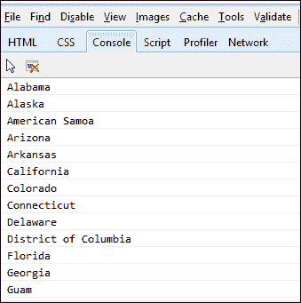

从单独的端点请求数据，然后在获取后使用它的情况要常见得多。这允许使用来自外部源的数据，并打破了服务器在页面内部提供数据的依赖性，这意味着特定的服务器实现可能不太重要且更简单。jQuery 提供了几种常见且友好的方式来检索 JSON 数据，如`$.ajax`、`$.get`和`$.getJSON`。Kendo 也通过其小部件的配置选项提供标准方式来检索外部数据，通常通过`transport.read`属性方法。我们将在本章的其余部分以及本书的其余部分中看到更多关于此的内容，当我们讨论 DataSource 和 Grid 时。

# 管理数据

Kendo UI 框架由两部分组成——框架组件和用户界面（UI）小部件。本书中我们将涵盖的大部分内容与用户界面小部件及其使用方法相关，但我们将从如何在 Kendo UI 中管理数据这个重要主题开始。DataSource 组件和模板提供了一个良好的起点，并将为我们在这本书的其余部分使用的基础。

## 模板

Kendo UI 模板是包含一小部分页面标记的脚本块，这些标记由其他 Kendo UI 小部件用于显示重复内容。我们将首先介绍这些内容，因为它们将在我们接下来的所有示例中使用。以下是一个简单模板的示例：

```js
var template = kendo.template("<span>#= horseColor #</span>");
$("#horseDiv").html(template({
  horseColor: 'brown}));
```

运行此代码会将`horseDiv`的 HTML 内容设置为包含传递到模板函数对象中的`horseColor`值的 span 元素。它将产生以下代码输出：

```js
<div id='horseDiv'><span>brown</span></div>
```

模板也可以在特殊类型的 HTML 脚本块中编写，这样它们的布局在 HTML 内容中看起来更自然。

```js
<script type="text/x-kendo-template" id="template">
<tr>
<td>#= rank #</td>
<td>#= rating #</td>
<td>#= title #</td>
<td>#= year #</td>
</tr>
</script>
```

在这个模板示例中，请注意包含代码片段`#= variable_name #`的行。这些表示由 Kendo UI 模板引擎解释的代码部分。当模板被使用时，这些代码块内的变量名被提供给模板。在模板内部使用的 JavaScript 属性名需要在调用模板时传递给模板的对象上的属性。请注意，脚本类型是`x-kendo-template`而不是`javascript`，这是很重要的，这样浏览器就不会尝试自行执行脚本块。以下是一个代码示例，展示了如何在 JavaScript 中初始化此模板：

```js
<script type="text/javascript">
var template = kendo.template($("#template").html());

functionshowMovies() {
$("#moviesTable").html(template(
            {rank: 1, rating: 9.2, title: 'Prometheus', year: 2012}
        ));
    }
showMovies();
</script>
```

注意模板是通过调用 `kendo.template()` 来创建的。这个方法接受字面模板代码作为其参数，这就是为什么示例中显示了调用 jQuery 语句 `$("#template").html()`，因为这段代码返回了模板脚本块在网页中出现的字面内容。因此，在这个例子中，它等同于调用 `kendo.template('<tr><td>#= rank #</td>…')`。这意味着模板也可以通过直接在构造函数中键入确切的模板代码来创建。

当模板对象作为方法被调用时，它需要传入的数据作为参数。当上面的示例代码运行时，它会产生以下输出：

```js
<table id="moviesTable">
<tr>
<td>1</td>
<td>9.2</td>
<td>Prometheus</td>
<td>2012</td>
</tr>
</table>
```

模板还可以包含 JavaScript，这使得执行更高级的操作成为可能，例如遍历数组并为数组中的每个项目单独渲染模板。在这种情况下，你需要向模板提供一个对象数组而不是之前的一个单独的对象。这次，使用显式的参数名 `data` 是至关重要的。注意 JavaScript 代码被单 `#` 符号包围，如 `# javascript code #`，变量语句被 `#=` 和 `#` 包围，如 `#= variable statement #`。还要注意 `#` 符号和内容之间的空格很重要。

```js
<script type="text/x-kendo-template" id="template">
# for(vari=0; i<data.length; i++) { #
<tr>
<td>#= data[i].rank #</td>
<td>#= data[i].rating #</td>
<td>#= data[i].title #</td>
<td>#= data[i].year #</td>
</tr>
    # } #
</script>
```

模板是构建功能 Kendo UI 小部件的重要组成部分，当与 DataSources 和 Grids 结合使用时，它们将变得更加有用，正如我们稍后将要看到的。

## DataSource

Kendo UI DataSource 是一个 JavaScript 对象，为数据提供了各种 Kendo UI 小部件的共同接口。关于 DataSource 对象的完整文档可以在 Kendo UI 网站上的此地址找到：[`docs.kendoui.com/api/framework/datasource`](http://docs.kendoui.com/api/framework/datasource)。DataSource 是一个相当复杂的对象，依赖于一些需要单独解释的构建块。这些构建块是 Kendo 对象，称为 Schema、Transport 和 Model。让我们首先处理这些，然后再继续探索 DataSource 本身。

重要的是要注意，在创建 DataSource 对象时，你应该使用 `new` 关键字来实例化一个新对象，而不是仅仅使用对象字面量：

```js
var dataSource = new kendo.data.DataSource({...<properties>...});
```

### 模型

模型对象来自命名空间 `kendo.data.Model`，并继承自 Kendo 的 `ObservableObject`。它为 DataSource 使用的提供了一种已知结构，或模型，同时也可以用来启用一些更高级的功能，例如变更跟踪。要创建一个新的模型，你必须通过方法 `kendo.data.Model.define()` 来实现。在这个方法中，你需要传递一个对象来定义模型的结构，并设置数据元素的可配置选项。以下是一个模型的示例：

```js
var Service = kendo.data.Model.define( {
id: "serviceId", // the identifier of the model
fields: {
"serviceName": {
type: "string"
        },
"unitPrice": {
type: "number"
        },
"serviceId": {
type: "number"
  }
    }
});

var currentService = new Service( {
serviceName: "Rotate Tires",
unitPrice: 29.95,
serviceId: 400
});

console.log(currentService.get("serviceName")); // outputs "Rotate Tires"
console.log(currentService.get("unitPrice")); // outputs 29.95
```

在这个示例中，我们创建了一个具有三个属性的模型，并为每个属性设置了数据类型。然后，我们根据模型定义创建了一个新的模型对象，并演示了如何通过 `model.get()` 方法访问其属性。我们刚刚演示了模型对象的 ID 是通过名为 `id` 的属性定义的，字段是通过名为 `fields` 的属性定义的。在 `fields` 属性中，这些是可以设置以配置每个数据元素的选项：

```js
fields: {
"serviceName": {    // Property name for a field
type: "string", // "string"(default), "number", "boolean", or "date"
defaultValue: "Inspection", // Default value for field when model is
                           / created. Default for string is "", number
                         // is 0, and date is new Date() (.i.e. today)
editable: true, // Specifies whether field is editable
nullable: false, // Specifies if default value should be used when empty
parse: function(){...} // Specifies custom parser for field value
validation: {...} // Specifies the validation options used by Kendo
                      // Validator such as 'required', 'min', and 'max'.
    },...
}
```

这些并非都是必需的，但在你需要一个非常具体的配置时它们是可用的。以下是从 Kendo UI 网站上的一个示例：

```js
var Product = kendo.data.Model.define( {
id: "id", // the identifier is the "id" field (declared below)
fields: {
  /* name of the field */ 
name: {
type: "string", // the field is a string
validation: { // validation rules
required: true // the field is required
    },
defaultValue: "<empty>" // default field value
  },

  /* name of the field */ price: {
type: "number", // the field is a number
validation: { // validation rules
required: true, // the field is required
min: 1 // the minimum value is 1
    },
defaultValue: 99.99 // default field value
  },

  /* name of the field */ id: {
editable: false, // this field is not editable
nullable: true // a default value will not be assigned
        }
    }
});
```

由于模型中的属性是可观察的，你需要使用特殊的获取器和设置器方法来正确触发其他函数和对象观察到的行为。要检索这些属性之一的当前值，请使用 `model_name.get()`，例如 `currentService.get('unitPrice')`。要设置属性的值并因此更改它，请使用 `model_name.set()`，例如 `currentService.set('unitPrice', 14.95)`。可观察对象的概念是 MVVM 框架的一个关键特性，我们将在后面的章节中介绍。

模型对象上可用的另外两种方法是 `isNew` 和 `toJSON`。`isNew` 方法检查模型是否为新的。这是通过检查 `id` 字段是否仍然设置为默认值来确定的。如果 `id` 字段没有设置为默认值，则模型对象不被视为新的。`toJSON` 方法返回模型属性和值的完整 JSON 表示。

正如我提到的，模型继承自 `ObservableObject`，它公开了三个你可以附加自定义行为的事件——`change`、`get` 和 `set`。这些的语法是使用 `model.bind()`，后面跟着事件名称和处理该事件的函数：

```js
currentService.bind('change', function(e){
alert(e.field + " just changed its value to " +
currentService.get([e.field]));
});
```

### Schema

DataSource 中的 `schema` 对象负责描述原始数据格式。它在模型之上工作，甚至可以包含模型定义。Schema 的任务是指导 DataSource 在原始数据对象中查找有关错误、聚合、数据、分组和总记录的信息。这些信息作为 `schema` 对象中的属性存在，如下所示：

```js
schema: {
  errors: function(response) {
    return response.errors;
  },
  aggregates: function(response) {
    return response.aggregates;
  },
  data: function(response) {
    return response.data;
  },
  total: function(response) {
    return response.totalCount;
  }
}
```

在前面的代码示例中，每个属性都设置为函数，当传递原始数据对象时，将返回该对象内的适当数据。这些属性也可以设置为文本字段，在这种情况下，给定的字段名必须存在于对象的顶层，并且已经包含适当格式的适当数据：

```js
schema: {
  errors: "errors_field_name",
  aggregates: "aggregates_field_name",
  data: "data_field_name",
  total: "total_field_name"
}
```

`aggregates`属性需要以对象格式返回数据，其结构类似于以下示例。**aggregates**对象中的每个属性名都可以包含有关其聚合值的信息，例如最大值（**max**）、最小值（**min**）或总**计数**：

```js
{
unitPrice: {   // Field Name
  max: 100,     // Aggregate function and value
  min: 1     // Aggregate function and value
  },
productName: {  // Field Name
  count: 42     // Aggregate function and value
  }
}
```

在这种情况下，数据在**unitPrice**字段上定义了**最大值**和**最小值**，在**productName**字段上定义了**计数**。数据源对象没有计算这些值；相反，它们已经存在于从远程服务器发送的原始数据中，并且模式已经向数据源对象指示了它们的位置。可以使用函数来计算聚合值，但通常原始数据已经包含由远程服务器返回的这些值。

如我之前所说，模式可以包含一个模型定义。如果是这种情况，数据源将为你调用`kendo.data.Model.define`来处理模型定义，以便从原始数据中创建模型对象：

```js
var dataSource = new kendo.data.DataSource({
schema: {
  model: {
    id: "ProductID",
    fields: {
    ProductID: {
      editable: false,
      nullable: true
      },
      ...
```

如果你已经定义了一个模型定义，你可以简单地引用它，数据源将像使用它一样使用它：

```js
vardataSource = new kendo.data.DataSource({
schema: {
model: Product // Use the existing Product model
    }
});
```

`schema`对象有一个`parse`属性，你可以将其设置为在处理原始数据之前将被调用的函数。这给你提供了一个机会，如果你需要的话，进行任何预处理。还有一个`type`属性，可以设置为`json`或`xml`。

### 传输

`transport`对象包含数据源可以使用它来与远程服务器通信以执行其任何正常数据功能的属性。这些数据功能是`create`、`destroy`、`read`和`update`（对应于可以在记录上执行的不同操作）。这些数据功能作为`transport`对象内的属性对象存在，并遵循相同的配置选项模式。我应该指出，并非所有数据功能都是必需的；只有那些需要在你的`transport`对象中定义的功能才需要定义。这是`transport`对象的基本配置结构。

```js
transport: {
  create: { // this sets configuration for creating new records
            // on the remote server
  },
  destroy: { // this sets configuration for deleting records
             // on the remote server
  },
  read: {  // this sets configuration for reading records
           // from the remote server
  },
  update: { // this sets configuration for updating records
            // on the remote server
  },
  autoSync: false, // set true to automatically sync all changes
  batch: false     // set true to enable batch mode
}
```

这里是配置传输对象的远程数据操作的不同的选项。这四个属性遵循相同的配置模式，但在本代码示例中，我展示了不同的配置方式以供参考。在这个第一个代码示例中，我配置了**创建**操作，仅将 HTML 元素的值发送到远程服务器。

```js
create: { // for creating data records on remote source.
url: "/orders/create", // the url to the create service.
data: {  // data to send to the create service as part of the request.
// this can also be specified as a function call.
orderId: $("#input").val()
},
cache: true, // make false to force fresh requests every time.
contentType: "application/json", // default is 
  // "application/w-www-form-urlencoded"
dataType: "json", // "jsonp" is also common.
type: "POST" // which http verb to use.
  }
```

在这个示例中，我们已将销毁方法设置为使用 jQuery `$.ajax`函数将数据发送到远程服务器，而不是直接在**销毁**配置对象上配置它。如果你更喜欢 jQuery 语法并希望轻松地将回调函数附加到操作的结果，你可以这样做。

```js
destroy: {  // same options as "create", with some alternatives shown.
      // this is how you use $.ajax() to run this remote service call.
          // this option can be used with "create", "destroy", "read",
              // and "update"
    $.ajax( {
url: "/orders/destroy",
data: options.data, // the data field contains paging, sorting,
                          // filtering, and grouping data
success: function(result) {
               // notify the DataSource that the operation is complete
Options.success(result);
}
});
}
```

在这个例子中，我们创建了一个函数作为读取操作的数据源。如果您需要在接收到远程数据之前执行一些自定义逻辑，或者由于某些原因需要完全绕过远程数据源，这可能很有用。

```js
read: {  // same options as above in "create" and "destroy".
data: function() {  // this is how you specify data as a function.
return {
id: 42,
name: "John Doe"
};
}
}
```

请记住，您刚才看到的配置选项对任何传输操作都有效，我只是简单地展示了每个配置的不同操作作为示例。当 DataSource 配置了这样的传输配置时，它将使用这些选项中的属性和函数来执行相关操作。当它加载数据时将调用`read`，当记录被更改时将调用`update`，当记录被删除时将调用`destroy`，当添加新记录时将调用`create`。

### 其他 DataSource 属性

当从本地数据读取时，您需要通过使用名为`data`的属性来引用它，如下所示：

```js
var someData = [{ title: 'Prometheus', year: 2012, rating: 9, rank: 25 }];

var dataSource = new kendo.data.DataSource({
data: someData
});
```

我们尚未看到的 DataSource 的一些其他属性更多用于数据处理——`aggregate`、`filter`、`group`、`sort`、`page`和`pageSize`。它们可以在客户端数据上工作，或者可以通过使用`serverAggregates`、`serverFiltering`、`serverGrouping`、`serverSorting`和`serverPaging`属性来请求服务器执行操作，通过将这些属性添加到 DataSource 对象属性列表并将它们设置为 true。

`aggregate`属性接受一个字段名和聚合函数名的数组：

```js
aggregate: [{ field: 'title', aggregate: 'count' }]
```

`filter`属性可以接受一个简单的对象、简单对象的数组，或者一个具有更多逻辑的可配置对象，以指定应在数据上执行筛选：

```js
// simple object
filter: { field: 'title', operator: 'startswith', value: 'Shawshank' }

// ...or array...
filter: [{field: 'year', operator: 'eq', value: '1998'}, {field: ...

// ...or configurable object...
filter:{
logic: "or",
filters: [
{ field: 'title', operator: 'startswith', value: 'Shawshank' }]
}
```

这些是可以与筛选对象一起使用的不同运算符。它们也可以在通过使用`serverFiltering`属性向服务器请求筛选时使用。

+   **等于**: `eq`, `==`, `isequalto`, `equals`, `equalto`, `equal`

+   **不等式**: `neq`, `!=`, `isnotequalto`, `notequals`, `notequalto`, `notequal`, `ne`

+   **小于**: `lt`, `<`, `islessthan`, `lessthan`, `less`

+   **小于或等于**: `lte`, `<=`, `islessthanorequalto`, `lessthanequal`, `le`

+   **大于**: `gt`, `>`, `isgreaterthan`, `greaterthan`, `greater`

+   **大于或等于**: `gte`, `>=`, `isgreaterthanorequalto`, `greaterthanequal`, `ge`

+   **以...开头**: `startswith`

+   **以...结尾**: `endswith`

+   **包含**: `contains`

`group`和`sort`属性可以接受一个对象或对象数组来指定分组：

```js
group: { field: 'year', dir: 'asc' }
sort: { field: 'title', dir: 'desc' }
```

`page`和`pageSize`属性都接受数字来分别表示页码和每页的记录数。

### DataSource 方法

DataSource 方法用于更改或检索 DataSource 对象的某些元素。其中一些与刚刚讨论过的相同数据操作属性相关——`aggregate`、`aggregates`、`filter`、`group`、`page`、`pageSize` 和 `sort`。在这些情况下，不传递参数调用方法将返回 DataSource 中同名属性的当前值；调用带有参数值的方法将设置 DataSource 中同名属性的值为传入的新值：

```js
// get the current group descriptors
var g = dataSource.group();

// set a new value for filtering
dataSource.filter({ field: 'year', operator: 'gt', value: 1990 });
```

此外，还有添加和删除记录的方法。`add` 和 `insert` 方法都向 DataSource 添加一个新记录。`add` 方法简单地接受一个模型对象或与 DataSource 中的项目当前数据格式匹配的对象字面量。`insert` 方法接受与 `add` 相同的对象，但还指定一个 `index` 属性，指示插入新记录的零基位置。`remove` 方法接受一个模型对象并将其从 DataSource 中删除：

```js
// add a new item
dataSource.add({ year: 1997, title: 'The Fifth Element', rating: 10 });

// insert an item at the 6th position in the DataSource
dataSource.insert(5, {year: 1995, title: 'Twelve Monkeys', rating 9.5});

// remove an item from the DataSource
var movie = dataSource.at(5);
dataSource.remove(movie);
```

`at`、`get` 和 `getByUid` 方法用于从 DataSource 中检索特定记录：

```js
// get the 3rd item in the DataSource
var movie = dataSource.at(2);

// get the model instance with an id of 5
// (id is determined by the value of the schema.model.id property)
var movie = dataSource.get(5);

// get the model instance, or ObservableObject if no model has been set
// uid is a property inherited from ObservableObject
varuid = $("tr").data("uid");
var movie = dataSource.getByUid(uid);
```

`fetch`、`query`、`read`、`sync`、`cancelChanges` 和 `view` 方法用于管理 DataSource 的当前内容和结构：

```js
// fetches data using the current filter/sort/group/paging information.
// will fetch data from transport if data is not already available in memory.
dataSource.fetch(); // can optionally take a callback function which
                    // is executed once the data is ready.

// executes a query over the data (i.e. paging/sorting/filtering/grouping)
// this effects what the call to dataSource.view() will return.
dataSource.query({ page: 5, pageSize: 20, group:{field:'year',dir:'asc'}});

// read data into the DataSource using the transport.read setting
dataSource.read();  // also conveniently causes the change event to fire

// synchronizes changes through the transport for any pending CRUD operations.
// if batch mode is enabled, it uses only one call per operation type (create,
//   read, update, destroy)
dataSource.sync();

// discards all un-synced changes made to the DataSource
dataSource.cancelChanges();

// returns the current state of the items in the DataSource with all applied
//settings such as paging, sorting, filtering, and grouping.
// to ensure that data is available, this method should be used from
//within the change event of the DataSource
change: function(e){
    ...
kendo.render(template, dataSource.view());
}
```

为了完成列表，我们将查看 `data`、`total` 和 `totalPages`：

```js
// retrieve an observable array of items (the current data within the DataSource)
var movies = dataSource.data();

// set the DataSource to some new data
datSource.data([{year: 2009, title: 'Cargo', rating: 6.8}, {year: ... ]);

// get, but not set, the total number of items in the DataSource
var total = dataSource.total();

// get, but not set, the total number of pages of items in the DataSource
var pages = dataSource.totalPages();
```

重要的是要注意，你必须调用 `dataSource.read()` 以使 DataSource 对象启动读取过程并自行填充数据。换句话说，在你调用 `dataSource.read()` 之前，你的 DataSource 中没有任何可读取的内容。

### DataSource 事件

DataSource 对象上有三个可用的事件——`change`、`error` 和 `requestStart`。当数据从传输中更改或读取时，会触发 `change` 事件。当数据读取或数据同步过程中发生错误时，会触发 `error` 事件；如果 DataSource 中的 `schema.errors` 已设置，并且来自服务器操作的响应包含由 `schema.errors` 指定的字段中的数据，也会触发 `error` 事件。当数据请求即将开始时，会触发 `requestStart` 事件。与其他事件一样，这些事件可以作为 DataSource 定义的一部分设置，或者稍后通过 `bind` 方法设置。

```js
// set event handler as part of DataSource definition
var dataSource = new kendo.data.DataSource({
change: function(e){
        // handle event
    }
});

// or set event handler later through the bind method
dataSource.bind("error", function(e){
    // handle event
});
```

正如你稍后将会看到的，更改事件是一个很好的地方，可以在 DataSource 读取新记录时生成标记。它也是放置任何其他应该对 DataSource 中的更改做出响应的代码的适当位置。

### 开始使用基本用法

既然我们已经看到了 DataSource 内部组件的定义，我们将组合我们的第一个示例页面，以演示在 JavaScript 中使用 DataSource 对象的基本用法。向项目的静态文件夹中添加一个新的 HTML 文件，并将其命名为 `DataSource.html`。首先添加以下代码：

```js
<!DOCTYPE html>
<html>
<head>
<title>DataSource</title>
<script src="img/jquery.js"></script>
<script src="img/kendo.all.js"></script>
<link href="/Content/kendo/kendo.common.css" rel="stylesheet" />
<link href="/Content/kendo/kendo.default.css" rel="stylesheet" />
</head>
<body>
<div id="example" class="k-content">
<table id="movies">
<thead>
<tr>
<th>Rank</th>
<th>Rating</th>
<th>Title</th>
<th>Year</th>
</tr>
</thead>
<tbody>
<tr>
<td colspan="4"></td>
</tr>
</tbody>
</table>
</div>
</body>
</html>
```

我们已经在页面的头部引用了 jQuery 和 Kendo UI Web JavaScript 文件。现在让我们在`div`标签之后添加一个模板块，以便我们可以编写脚本以创建额外的表格行：

```js
<script id="template" type="text/x-kendo-template">
<tr>
<td>#= rank #</td>
<td>#= rating #</td>
<td>#= title #</td>
<td>#= year #</td>
</tr>
<script>
```

现在我们需要的是能够获取一些数据，并使用由这个模板定义的布局来填写表格，即使用数据源。在您刚才输入的模板脚本块之后添加以下代码：

```js
<script type="text/javascript">
    $(document).ready(function() {
        // create a template using the above definition
var template = kendo.template($("#template").html());

var movies = [
{ "rank": 1, "rating": 9.2, "year": 1994,
"title": "The Shawshank Redemption" },
{ "rank": 2, "rating": 9.2, "year": 1972,
"title": "The Godfather" },
{ "rank": 3, "rating": 9, "year": 1974,
"title": "The Godfather: Part II" },
{ "rank": 4, "rating": 8.9, "year": 1966,
"title": "Il buono, ilbrutto, ilcattivo." },
{ "rank": 5, "rating": 8.9, "year": 1994,
"title": "Pulp Fiction" },
{ "rank": 6, "rating": 8.9, "year": 1957,
"title": "12 Angry Men" },
{ "rank": 7, "rating": 8.9, "year": 1993, 
"title": "Schindler's List" },
{ "rank": 8, "rating": 8.8, "year": 1975, 
"title": "One Flew Over the Cuckoo's Nest" },
{ "rank": 9, "rating": 8.8, "year": 2010, 
"title": "Inception" },
{ "rank": 10, "rating": 8.8, "year": 2008, 
"title": "The Dark Knight" }
        ];

var dataSource = new kendo.data.DataSource({
data: movies,
change: function () {
// subscribe to the CHANGE event of the data source
$("#movies tbody").html(
kendo.render(template, this.view())); // populate the table
            }
        });

// read data from the "movies" array
dataSource.read();
    });
</script>
```

让我们逐步分析这段代码。你应该能认出前面几行，其中创建了一个 Kendo 模板，这个模板是从你刚才输入的脚本块中创建的。之后，你将看到一个包含关于各种电影数据的 JavaScript 对象数组。这个数组将成为下一个数据源对象的原始数据。数据源对象被实例化（注意`new`关键字）到名为`dataSource`的变量中。它将`movies`数组作为其数据参数，并定义了一个处理数据源对象`change`事件的函数。在这个`change`事件内部，我们使用 jQuery 选择`movies`表格，然后使用`kendo.render()`从我们的`template`变量为`dataSource`对象中的每个项目生成标记。注意我们使用的模板不需要特殊的 JavaScript 来迭代集合；数据源对象通过`this.view()`将所有数据传递给`change`事件。最后，我们调用`dataSource.read()`来读取数据，从而触发`change`事件，将内容添加到我们的`movies`表格中。

`kendo.render()`方法将其第一个参数作为模板函数，第二个参数作为数据数组。它将数据通过模板运行，生成结果标记并返回给调用者。在上面的例子中，我们使用了 jQuery 将`<tbody>`元素的 HTML 设置为`kendo.render()`函数的结果。

#### 绑定到远程数据

我们上一个例子是演示如何使用本地数据（一个 JavaScript 数组）与数据源结合使用。使用数据源与远程系统上存在的数据进行操作也是非常常见且重要的。为了模拟这种情况，我们将转向 ASP.NET MVC 框架来创建一个用于我们远程数据的服务器。

在 Visual Studio 的解决方案资源管理器窗口中，右键单击**控制器**文件夹，选择**添加，控制器**。将新控制器命名为**KendoController**，并保持打开的对话框的其余部分为默认设置。

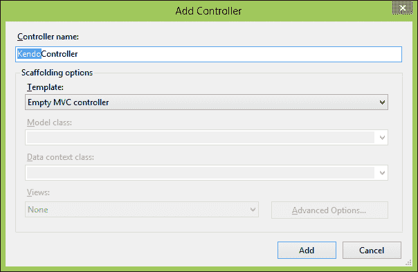

新创建的控制器类将出现在 Visual Studio 的编辑器部分，你将看到文件中有一个通用的`Index()`方法。这个方法被称为**动作方法**，用于处理返回给网页浏览器的 HTML 响应。上面的注释表明了用于定位此动作方法的路由和 HTTP 动词：

```js
// GET: /Kendo/

public ActionResult Index()
{
return View();
}
```

在这种情况下，它表明键入路由"Kendo"，如`http://<server-name>/Kendo/`，将匹配此动作方法并导致它将视图返回到浏览器。指定`http://<server-name>/Kendo/Index`也将有效，通常在正常路由中提供控制器名称"Kendo"和动作方法名称"Index"。按照惯例，MVC 框架使用后缀"Controller"命名所有控制器类，但在实际路由（如您网络浏览器地址栏中的路径）中引用控制器时不使用后缀。这意味着当`KendoController`类是路由的一部分时，它被称为"kendo"。GET 是此控制器在浏览器请求此路由时将接受的默认 HTTP 动词。

在`KendoController`顶部添加一个用于我们即将创建的命名空间`LearningKendoUIWeb.Repository`的`using`语句。还要添加`Kendo.Mvc.UI`和`Kendo.Mvc.Extensions`：

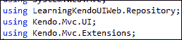

添加一个名为`RemoteData`的新动作方法，并按照以下方式设置它：

```js
publicJsonResultRemoteData()
{
var repository = new SampleRepository();
var data = repository.GetAllMovies();
returnJson(result, JsonRequestBehavior.AllowGet);
}
```

这是一个简单的实例化存储库（我们将在接下来的时刻创建它），从该存储库中收集一些数据，然后将它作为 JSON 返回给客户端的方法。`Json()`方法的第二个参数通知控制器类，即使动词是 GET，也可以从这个方法返回 JSON 数据。

右键单击**Models**文件夹，然后单击**添加，类**。将新类命名为`Movie.cs`。这是一个非常简单的类，用于存储有关电影的数据：

```js
namespace LearningKendoUIWeb.Models
{
public class Movie
  {
public int Rank { get; set; }
public double Rating { get; set; }
public int Year { get; set; }
public string Title { get; set; }
  }
}
```

向项目中添加一个新文件夹，并将其命名为`Repository`。向此文件夹添加一个名为`SampleRepository.cs`的类：

```js
using LearningKendoUIWeb.Models;

namespaceLearningKendoUIWeb.Repository
{
public class SampleRepository
  {
public List<Movie>GetAllMovies()
    {
var movies = new List<Movie>{
new Movie { Rank = 1, Rating = 9.2, 
                    Title = "The Shawshank Redemption", Year = 1994 },
new Movie { Rank = 2, Rating = 9.1,
                    Title = "The Godfather", Year = 1974 }
            };
            Return movies;
      }
   }
}
```

随意添加更多电影到这个列表，越多越好。现在我们有一个简单的存储库类，可以返回电影对象的列表，因此我们在`KendoController`中创建的动作方法最终是有效的。当调用`RemoteData`动作方法时，它将以如下所示的 JSON 对象数组形式返回电影对象列表：

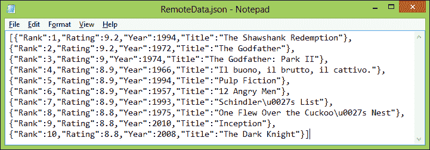

我已经向我的存储库添加了更多电影，但结果的结构是相同的。这正是 DataSource 知道如何使用的数据类型。以下是连接 DataSource 以使用它的方法，在`RemoteData.cshtml`文件中找到创建`dataSource`变量的 JavaScript 代码行，并更改代码，使其看起来像这样：

```js
var dataSource = new kendo.data.DataSource({
  transport: {
read: {
url: 'Kendo/RemoteData/'
        }
    },
change: function () {
        $("#movies tbody").html(kendo.render(template, this.view()));
    }
});
```

我们不是使用`data`属性指向一个本地可用的对象数组，而是使用`transport`属性告诉 Kendo 我们需要从远程源请求数据。在这种情况下，我们只指定了 DataSource 如何读取远程数据，这就是我们所需要的，因为我们对 DataSource 的唯一方法调用就在这一行：

```js
dataSource.read();
```

这些例子只是触及了表面，但它确实展示了 DataSource 在实际页面上的应用。然而，真正独立演示 DataSource 对象是很困难的。实际上，DataSource 只有在它服务于数据丰富的控件时才有用，比如 Kendo UI Grid。在接下来的页面中，我们将探讨这个 Grid 控件，并能够展示一个 Grid 可以充分利用的更完全配置的 DataSource。我们还将看到如何在视图页面中通过 MVC Razor 语法配置 Grid 和 DataSource。

# 页面布局

现在我们已经讨论了 Kendo UI 框架的 DataSource 和 Template 功能，我们可以将注意力转向那些在网页上提供图形元素的控件。其中一些控件实际上帮助您组织页面上的内容或数据，Grid 就是一个很好的例子，我们将在下一部分进行介绍。

## Grid

Kendo UI Grid 是一个非常实用的控件，需要熟悉。它是一种简单的方法，可以将数据转换成可使用和交互式的表格，这在通常需要完整的服务器控件（如 ASP.NET WebForms）或页面标记中的复杂且耗时的 JavaScript 开发中是常见的。实际上，设置一个简单的示例非常容易。假设我们有一些如下所示的 JavaScript 数据，我们想在网页中显示：

```js
<script type="text/javascript">
var repairs = [{
name: "State Inspection",
price: 39.75,
labor: 1,
staff: 1
            },
            {
name: "Brake & Clutch System Service",
price: 149.95,
labor: 3,
staff: 1
            },
            {
name: "Power Steering Service",
price: 109.96,
labor: 3,
staff: 1
            },
            {
name: "Cooling System Service",
price: 126.95,
labor: 2,
staff: 1
            },
            {
name: "Oil Change",
price: 37.77,
labor: 1,
staff: 1
            },
            {
name: "CV Axle Replacement",
price: 271.11,
labor: 5,
staff: 2
            },
            {
name: "Battery Cabling Replacement",
price: 179.97,
labor: 2,
staff: 1
            },
            {
name: "Battery Replacement",
price: 118.38,
labor: 1,
staff: 1
            },
            {
name: "Fuel Induction Service",
price: 168.88,
labor: 3,
staff: 2
            },
            {
name: "Engine Air Filter Replacement",
price: 36.63,
labor: 1,
staff: 1
            },
            {
name: "Timing Belt Replacement",
price: 221.75,
labor: 3,
staff: 2
            },
            {
name: "Drive Belt Replacement",
price: 194.79,
labor: 3,
staff: 2
            }
        ];
</script>
```

为了将其转换成一个格式良好的动态表格，通常需要一些循环和 HTML 标记生成，可能通过 jQuery 实现。然而，通过 Kendo UI，我们只需要创建一个 `kendoGrid()` 函数，我们就可以看到一些魔法在行动。注意，创建一个从这些数据中生成的表格所涉及的代码是多么少：

```js
<div id="repairsGrid"></div>
<script type="text/javascript">
        $("#repairsGrid").kendoGrid({
dataSource: repairs
        });
</script>
```

下面是这段简单代码的页面输出：

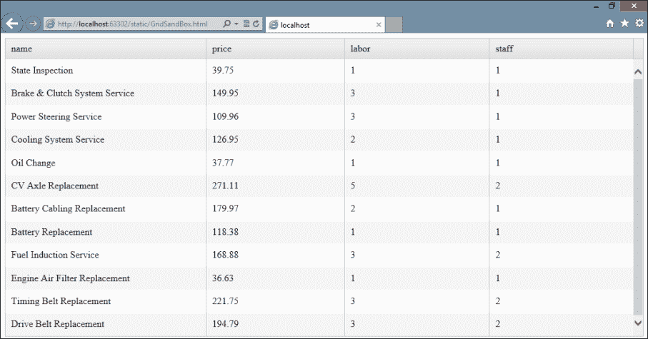

看看相关的代码是否甚至不需要在网页中存在表格？Kendo UI 生成了它需要的一切，以便在页面上以表格的形式显示这些数据。现在我们可以将注意力转向创建更互动和智能的表格，并探索 Kendo UI Grid 控件在显示来自不同来源的数据方面能提供什么。

### 列

首先，我们可以通过在 `columns` 对象数组上指定属性来控制 Grid 的格式化。这个对象数组用于指示 Grid 如何适当地显示数据，以便它在页面上看起来像你想要的那样。以下是一个使用我们刚才看到的 Grid 的列对象示例，展示了可用于格式化的各种选项：

```js
$("#repairsGrid").kendoGrid({
...
columns: [{
field: "name",
title: "Service",
width: 300
    },
    {
field: "price",
title: "Price",
width: 50,
format: "${0:##.##}"
    },
    {
field: "labor",
title: "Labor",
width: 50,
template: "#= labor# hour(s)"
    },
    {
field: "staff",
title: "Staff",
width: 50,
template: "#= staff # tech(s)"
    }]
```

这里是输出效果：

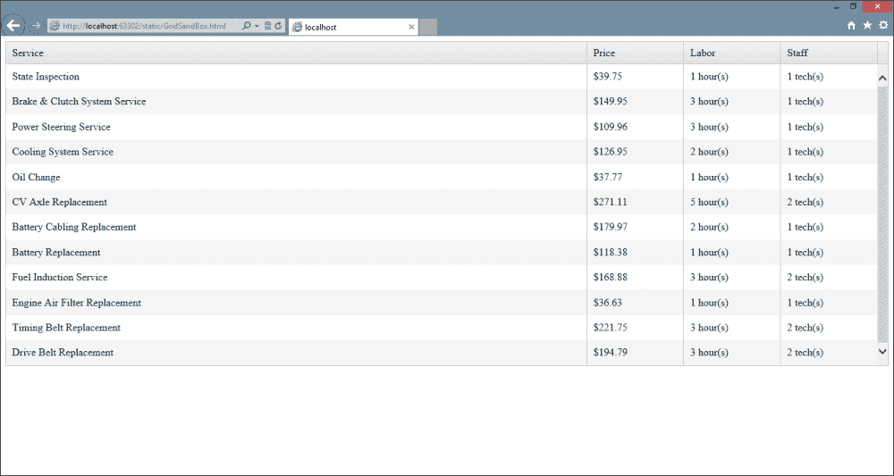

还有一些简单的选项，通过指定哪些列是可筛选或可排序的，来启用一些动态交互行为。请注意，这些选项只有在 Grid 作为整体将 `pageable` 和/或 `sortable` 设置为 `true` 时才有用。

```js
$("#repairsGrid").kendoGrid({
    ...
columns: [{
field: "name",
title: "Service",
width: 300,
sortable: true,
filterable: true
    },
    {
field: "price",
title: "Price",
width: 50,
format: "${0:##.##}",
sortable: true,
filterable: true
    },
    {
field: "labor",
title: "Labor",
width: 50,
template: "#= labor # hour(s)",
sortable: true,
filterable: true
    },
    {
field: "staff",
title: "Staff",
width: 50,
template: "#= staff # tech(s)",
sortable: false,
filterable: false
    }],
sortable: true,
filterable: true
```

注意以下截图，**服务**列是如何按字母顺序排序的，我已经点击了过滤器图标，这使我能够对要在页面上显示的数据输入过滤器。您可以看到过滤器图标位于屏幕上打开窗口的上方，它看起来像一个小漏斗。Kendo UI 通过我们在网格上设置的`dataSource`属性来处理实际的排序和过滤。这意味着您在提供给网格的`dataSource`上设置的设置将被网格用于排序和过滤：

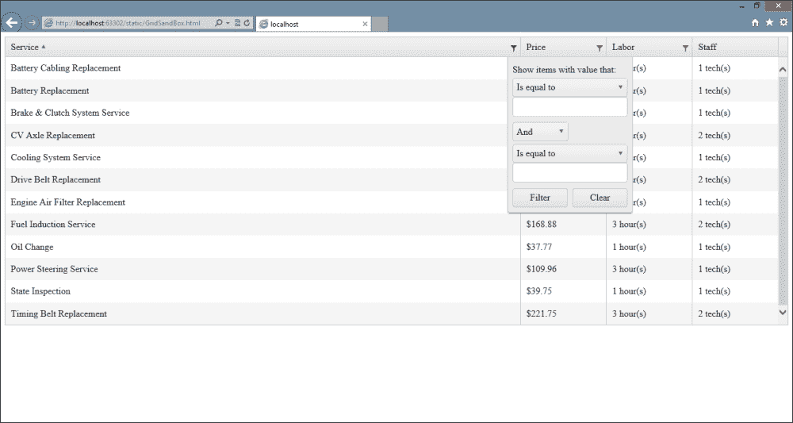

当网格配置为允许编辑数据时，`columns`属性允许您指定一个自定义编辑函数，该函数可以在更改该列中的数据时使用。这是一种为用户提供更简单的方式来输入更改，甚至控制可以进行的更改类型的有用方式。例如，此更新的代码示例显示了向`Labor`列添加编辑函数，以便在编辑时显示下拉列表，为用户提供一组特定的选项进行选择。这里还有一些其他更改，我们将在下一节中讨论：

```js
$("#repairsGrid").kendoGrid({
dataSource: repairs,
columns: [
  {
title: "Action",
width: 75,
command: ["edit"]
  },
{
field: "name",
title: "Service",
width: 300,
sortable: true,
filterable: true
  },
{
field: "price",
title: "Price",
width: 50,
format: "${0:##.##}",
sortable: true,
filterable: true
  },
{
field: "labor",
title: "Labor",
width: 50,
template: "#= labor # hour(s)",
sortable: true,
filterable: true,
editor: function (container, options) {
varselectEditor = $("<select name=" + options.field +
"></select>");
selectEditor.append(new Option("1", 1));
selectEditor.append(new Option("2", 2));
selectEditor.append(new Option("3", 3));
selectEditor.append(new Option("4", 4));
selectEditor.append(new Option("5", 5));
selectEditor.appendTo(container);
    }
  },
  {
field: "staff",
title: "Staff",
width: 50,
template: "#= staff # tech(s)",
sortable: false,
filterable: false
  }],
sortable: true,
filterable: true,
editable: "inline"
```

这是`editor`函数的输出，显示了当行进入编辑模式时出现的下拉列表。设置`<select>`元素的`name`属性非常重要，以便 Kendo 可以在编辑保存时将用户的选项绑定回`dataSource`。

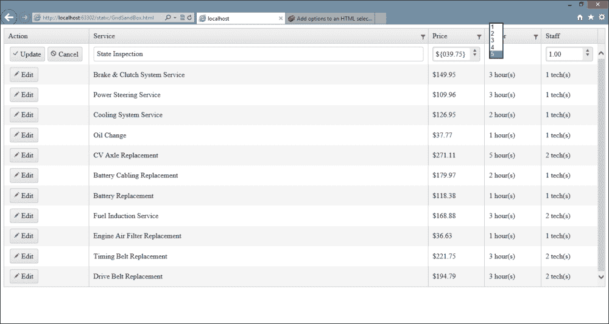

当使用此类自定义编辑函数时，传入的`container`和`options`对象具有一些特定的属性，这些属性在您编写函数时可能对您有所帮助。`container`对象是您应该添加任何新标记的页面元素，正如我们在示例中所做的那样。`options`对象包含两个属性：`options.field`和`options.model`。`options.field`属性包含您应该在新的标记中使用的字段名称，以便 Kendo 可以正确绑定一切。`options.model`属性包含对在`dataSource`中指定的实际数据模型的引用（如果指定了的话）；这使您能够访问在创建自定义逻辑时可能很重要的数据。

在代码示例中出现的其他更改包括在网格定义上的`editable: "inline"`属性（这是编辑功能正常工作所必需的；`inline`的替代方案是`popup`，它打开一个特殊窗口以编辑记录），以及包含命令按钮的新列。列对象的命令属性接受一个命令按钮数组，用于在每一行中生成。此数组可用的选项包括`edit`、`create`、`destroy`、`save`和`cancel`。当我们更详细地介绍如何将网格绑定到 CRUD 操作时，我们将很快回到这个话题。

注意，要向网格添加这些命令按钮，只需指定列对象的 `command` 属性即可。我没有向列添加任何 `<button>` 元素，也没有创建 JavaScript 事件处理器。Kendo UI 通过网格小部件的现有功能为我生成了所有这些必要的标记。

大部分网格功能可以通过描述网格当前能力的属性来启用。每个属性都以 -able 结尾。这些属性是 `editable`、`filterable`、`groupable`、`navigatable`、`pageable`、`scrollable`、`selectable` 和 `sortable`。我们已经看到了 `filterable` 和 `sortable`，并且当使用时它们接受简单的真/假值。我们也看到了 `editable`，但这个选项还有更多可以做的：

```js
...
editable: {
confirmation: "Are you sure?", // text displayed to confirm a delete operation
destroy: true,         // whether or not to delete item when button is clicked
mode: "popup",                 // options are "incell", "inline", and "popup"
template: "#= ... #",          // template to use for pop-up editing
update: true                   // switch item to edit mode when clicked?
}
```

`groupable` 属性允许用户通过将列拖动到屏幕顶部来对列进行分组。`groupable` 选项还包括一个属性 `groupable.messages.empty`，它将在网格的空分组区域中显示。如果您指定此 `messages` 属性，则假定 `groupable: true` 值，并且不需要指定。`navigatable` 属性在网格内打开或关闭键盘导航。以下是我们的网格定义底部在 `groupable` 和 `navigatable` 启用时的外观：

```js
...
sortable: true,
filterable: true,
editable: "inline",
navigatable: true,
groupable: {
messages: {
empty: "Drag column header here for grouping"
    }
}
```

使用这些选项渲染时的页面输出：

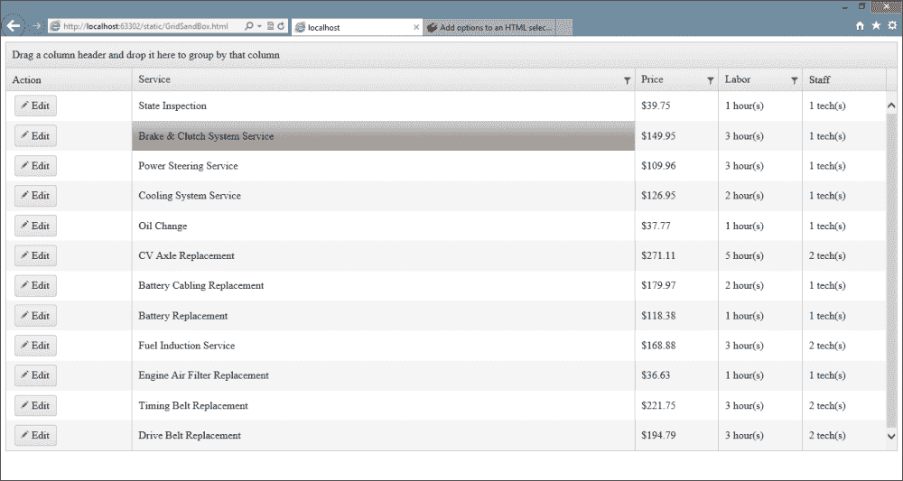

`pageable` 选项可以简单地设置为 `true`/`false`，就像其他几个选项一样，但如果您需要更精细的控制，它也允许这样做：

```js
...
pageable: {
pageSize: 10,
previousNext: true, // show buttons navigating to first/last/next/previous
numeric: true, // show numeric portion of the pager in the Grid?
buttonCount: 10, // number of buttons to show in numeric pager
input: true, // create input element allowing user to navigate to page
pageSizes: [5,10,20], //array of page size choices for user
refresh: true, //  show a refresh button in the Grid?
info: true, // show a label with current paging information in it
messages: {
display: "Detail Template – {1} of {2} items", // info text
empty: "No Records", // text to show when there are no records
page: "Page", // first part of text of input option
of: "of Detail Template", // last part of text of input option
itemsPerPage: "items per page", // text for selecting page size
first: "Go to first page", // text of first page button tooltip
previous: "Go to the previous page", // previous page tooltip
next: "Go to next page", // next page tooltip
last: "Go to the last page", // last page tooltip
refresh: "Refresh" // text of refresh button tooltip
  }
}
```

我们为每页 10 个项目配置的示例代码将看起来像这样：

```js
...
sortable: true,
filterable: true,
editable: "inline",
navigatable: true,
groupable: {
messages: {
empty: "Drag column header here for grouping"
}
},
pageable: {
pageSize: 10
}

```

使用这些选项生成的输出：

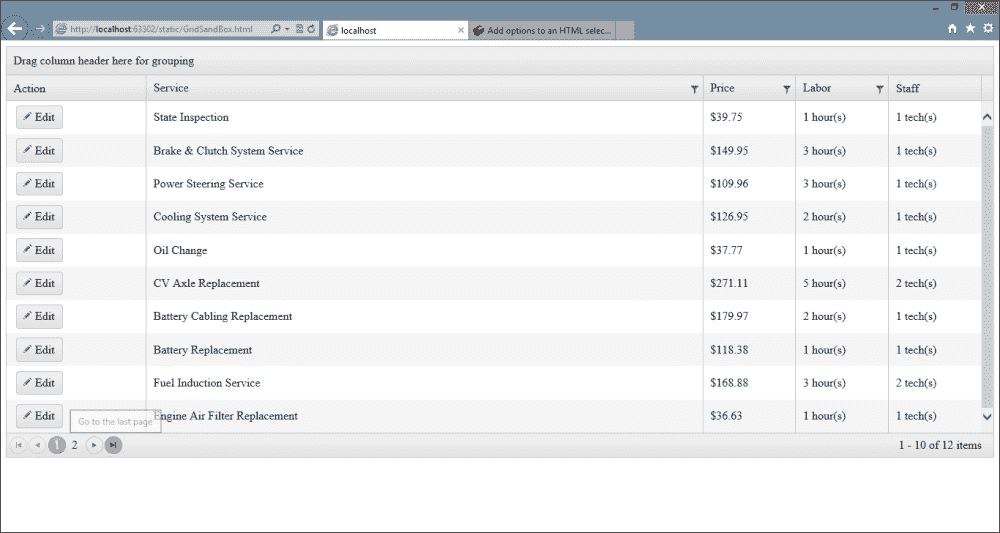

`scrollable` 属性配置网格内部是否可以有一个垂直滚动条，通常在您在页面上限制了网格的高度时指定。它可以设置为简单的布尔值 `true/false`。

`selectable` 属性指示在网格内是否启用或禁用选择。它的可能值是 `row`、`cell`、`multiple, row` 和 `multiple, cell`。以下是我们的示例网格在 `selectable: "multiple, cell"` 时的外观。

注意，我已经选择了部分行进行显示。

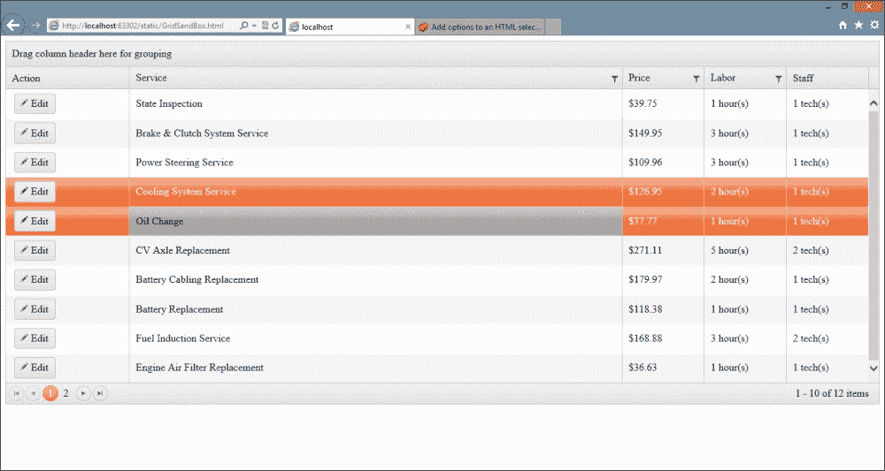

`toolbar` 属性为网格启用一个具有一组命令的工具栏，类似于列对象的命令属性。`toolbar` 对象数组中的每个工具栏都可以配置 `name`、`template` 和 `text`：

```js
...
toolbar: [
"create",
{ name: "save", text: "Save This Record" },
{ name: "cancel", text: "Cancel Changes: }]
```

注意工具栏可以是一个简单的文本值，指示要执行哪个命令。您还可以指定包含所需配置数据的对象（如前面的截图所示）。请参考以下截图：

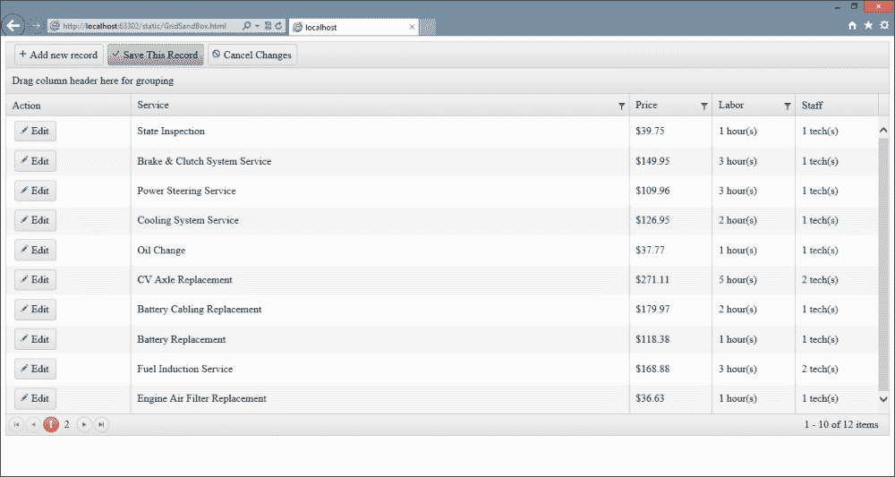

# 摘要

在本章中，我们涵盖了大量的基础知识，以便您能够正确地开始创建启用 Kendo UI 的网页。理解如何使用模板以及如何使用数据源对于在 Kendo UI 框架中做很多事情至关重要。在这些之后，网格是 Kendo UI 框架的一个基本组件，了解如何配置它将在构建需要向用户显示表格数据的页面时给您带来先机。

在下一章中，我们将学习关于自动完成小部件的内容。它允许您向输入文本框添加一个单词轮效果，以帮助用户输入可以从数据源中查找的信息。这是一个许多用户都会被吸引的工具，它将为您的网页添加很多功能，而无需在编写代码上花费太多精力。
