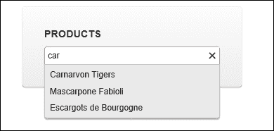
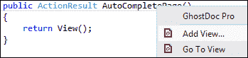
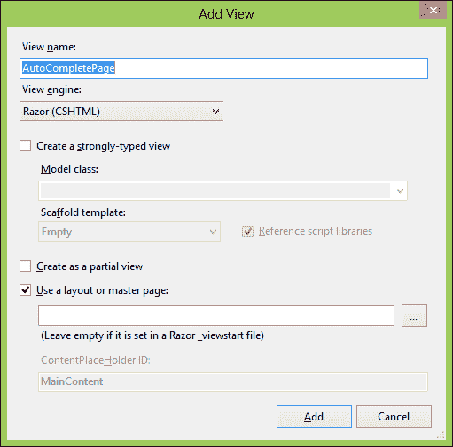
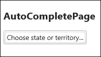
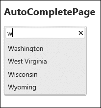
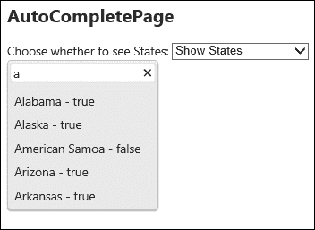

# 第二章. 自动完成小部件及其用法

Kendo UI 中的自动完成小部件在用户输入时会在输入框上创建“单词轮”效果。单词轮是一种效果，当用户输入时，单词会出现在文本框下方，帮助建议可能的搜索词。你经常在像 Google 和 Bing 这样的搜索引擎上看到这种效果。这可以用来给用户一个他们可以选择的批准选项列表，或者它也可以帮助用户准确输入特定的关键词，因为项目的规范形式会直接出现在输入框下方供用户选择。如果用户只需要输入可能的长搜索词中的一个或两个字符，这也可以节省用户的时间。Kendo UI 中的自动完成小部件非常容易配置，并且几乎不需要你做任何工作就能将此功能带给你的网站用户。



# 自动完成小部件 – 基础

打开上一章中创建的 Visual Studio 项目，然后打开`Controllers`文件夹中的`KendoController.cs`类。让我们为我们的初始自动完成测试页面添加一个新的操作方法。

```js
public ActionResult AutoCompletePage()
{
  return View();
}
```

右键单击操作方法的名称，然后选择**添加视图**。现在，选择对话框中出现的默认值，这将带您进入网页，以便我们可以开始操作。



## 将自动完成绑定到本地源

由于我们正在引用上一章中创建的默认布局，因此我们不需要重新输入任何内容就可以在我们的页面标题中获取所有需要的 Kendo 和 jQuery 文件。

我们将首先通过 JavaScript 和本地数据绑定来演示如何使用自动完成小部件。我们需要一个输入元素、一个 JavaScript 数组和一些 jQuery。

```js
<style>
    #stateOrTerritory {
      width:200px;
    }
</style>

<h2>AutoCompletePage</h2>
<input type="text" name="stateOrTerritory" id="stateOrTerritory" />

<script type="text/javascript">
varstatesAndTerritories = ["Alabama",
            "Alaska",
            "American Samoa",
            "Arizona",
            "Arkansas",
            ...
            "Washington",
            "West Virginia",
            "Wisconsin",
            "Wyoming"];

    $("#stateOrTerritory").kendoAutoComplete({
      dataSource: statesAndTerritories,
      filter: "startswith",
      placeholder: "Choose state or territory...",
      separator: ", "
    });

</script>
```

我们可以使用美国和领土的列表来展示字母表，并且列表足够长，可以进行演示。我们到目前为止所做的一切就是为自动完成创建了一些 JavaScript 数据，然后使用 jQuery 和 Kendo UI 将其连接到页面顶部的输入元素。我们指定了我们想使用`statesAndTerritories` JavaScript 数组作为我们的数据源，我们想要在输入元素中使用占位符文本，并且数组中的项由逗号分隔。这些属性在章节末尾有更详细的解释。运行它，你应该能在浏览器中看到一个带有一些看起来不错的占位符文本的输入框。在它里面输入一些字母，你会立即得到一些州和领土的建议。



# 将自动完成绑定到远程数据

现在我们已经看到了如何使用本地 JavaScript 数据来配置 AutoComplete 小部件，接下来让我们看看如何使用远程数据来实现。在 Visual Studio 项目中，将名为`StateTerritory.cs`的新类添加到`Models`文件夹中。将其结构设计为包含关于州和地区的相关数据，以便我们可以在我们的页面上使用它。

```js
namespace LearningKendoUIWeb.Models
{
  public class StateTerritory
  {
    public string Name { get; set; }
    public bool IsState { get; set; }
    public bool IsTerritory { get; set; }
    public bool IsContiguous { get; set; }
  }
}
```

现在打开`SampleRepository.cs`类文件，并添加一些逻辑来创建我们的州和地区数据仓库。请注意，我故意将哥伦比亚特区既视为一个州又视为一个地区，以便于未来的示例。

```js
public List<StateTerritory>GetStatesAndTerritories()
{
var stateTerritories = new List<StateTerritory>{
new StateTerritory{ Name = "Alabama", IsContiguous = true, 
IsState = true, IsTerritory = false },
new StateTerritory{ Name = "Alaska", IsContiguous = false, 
IsState = true, IsTerritory = false },
new StateTerritory{ Name = "American Samoa", IsContiguous = false,
IsState = false, IsTerritory = false },
new StateTerritory{ Name = "Arizona", IsContiguous = true, 
IsState = true, IsTerritory = false },
new StateTerritory{ Name = "Arkansas", IsContiguous = true,
IsState = true, IsTerritory = false },
...
new StateTerritory{ Name = "Washington", IsContiguous = true,
IsState = true, IsTerritory = false },
new StateTerritory{ Name = "West Virginia", IsContiguous = true,
IsState = true, IsTerritory = false },
new StateTerritory{ Name = "Wisconsin", IsContiguous = true,
IsState = true, IsTerritory = false },
new StateTerritory{ Name = "Wyoming", IsContiguous = true, 
IsState = true, IsTerritory = false }
    };
return stateTerritories;
}
```

现在我们有一些可以在服务器端操作的数据，但我们仍然需要通过 HTTP 公开它。回到`KendoController.cs`类文件，并添加一个新动作方法，就像你在这个代码块中看到的那样：

```js
public JsonResult AutoCompleteData()
{
  var repository = new SampleRepository();
  var data = repository.GetStatesAndTerritories();
  returnJson(data, JsonRequestBehavior.AllowGet);
}
```

这将暴露我们的州和地区集合，作为`StateTerritory`对象的 JSON 数组。请记住设置`JsonRequestBehavior.AllowGet`属性，否则这不会工作。现在我们可以修改我们的`AutoCompletePage.cshtml`文件，使用传输属性来获取其数据。

```js
$("#stateOrTerritory").kendoAutoComplete({
  dataSource: {
    transport: {
    read: {
      url: "/Kendo/AutoCompleteData/"
          }
    }
  },
  dataTextField: "Name",
  filter: "startswith",
  placeholder: "Choose state or territory...",
});
```

再次运行页面，并观察它从服务器获取数据。我们必须指定哪个字段包含数据文本字段，因为我们的 JSON 数据是结构为对象，而不是简单的数组。我们也不再需要分隔符属性。


# 使用模型通过 MVC 使用 AutoComplete

我们可以将这一步更进一步，将我们的代码转换为 Razor 语法与 MVC 一起使用。首先，创建一个控制器动作方法，从服务器返回数据。

```js
public ActionResult AutoCompletePage()
{
  var repository = new SampleRepository();
  var data = repository.GetStatesAndTerritories();
  return View(data);
}
```

接下来，打开`AutoCompletePage.cshtml`文件，并在`<h2>`标签之后删除所有内容。在文件顶部，我们需要添加一个声明，以便这个**视图**页面成为我们的新模型类`StateTerritory.cs`的强类型。

```js
@model IEnumerable<LearningKendoUIWeb.Models.StateTerritory>

```

现在添加这段代码，它利用 HTML 辅助类和 Kendo 扩展方法。

```js
<h2>AutoCompletePage</h2>
@(Html.Kendo().AutoComplete()
    .Name("statesAndTerritories")
    .DataTextField("Name")
    .BindTo(Model)
    .Filter("startswith")
    .Placeholder("Choose state or territory...")
)
```

识别出语法了吗？除了`BindTo(Model)`语句外，这些方法名与我们在 JavaScript 中使用的属性名相同（当然，它们的首字母都是大写的）。`BindTo(Model)`的调用是 MVC 控制器将数据传递到 MVC 视图的方式。在这种情况下，我们将视图强类型化为`StateTerritory`对象的集合（`IEnumerable`），在这里的代码中，我们告诉 Kendo 框架这个模型包含要在 AutoComplete 中显示的数据。这个模型中的数据在服务器创建页面时使用，并且只能通过**视图**页面中的 Razor 语法代码语句访问。

尽管我们刚刚通过 MVC 将 AutoComplete 连接到服务器，但我们使用的方法并不真正像是对远程数据的调用。实际上，它是通过将服务器端的所有模型数据保存到 AutoComplete 初始化的 JavaScript 中来使用本地数据。只要我们不尝试将如此多的数据嵌入到页面中以至于它加载缓慢，这并没有什么问题。实际上，在某些情况下，这可能是提高性能的好方法，但了解数据的位置以及页面如何访问它很重要。如果我们想让页面从 URL 请求数据，我们需要对我们的视图做一些修改。

# 通过 Ajax 使用 AutoComplete 与 MVC 结合

打开视图并修改 `AutoComplete()` 扩展方法调用，就像这个代码块一样。

```js
<h2>AutoCompletePage</h2>
@(Html.Kendo().AutoComplete()
    .Name("statesAndTerritories")
    .Placeholder("Choose state or territory...")
    .DataTextField("Name")
    .Filter("startswith")
    .DataSource(source =>
        {
source.Read(read =>
            {
read.Action("AutoCompleteData", "Kendo");
            })
            .ServerFiltering(false);
        })
)
```

我们已经移除了 `BindTo(Model)` 并用 `DataSource()` 调用替换，我们在这里使用 lambda 表达式来定义如何创建数据源。在这种情况下，我们已将其配置为使用之前配置的返回 JSON 数据的动作方法，并且服务器没有执行任何过滤。这实际上将我们的网页设置得与原始使用 `transport` 属性从服务器获取 JSON 数据的 JavaScript 页面相同。

# 向服务器发送数据

我们希望能够在服务器端过滤 AutoComplete 小部件的数据。我们可以在 `transport` JavaScript 对象中的 `data` 属性中使用，或者我们可以继续使用我们的 MVC 示例，并在 `DataSource` lambda 表达式中指定要发送的数据。比如说，如果我们想能够选择在 AutoComplete 小部件中显示哪些州和领地类型，我们可以通过在请求中发送一些数据来实现这一点，然后让服务器修改它发送回的数据。用以下更新后的代码替换 `AutoCompletePage.cshtml` 的内容。

```js
<h2>AutoCompletePage</h2>
<label for="stateType">Choose whether to see States:</label>
<select id="stateType" name="stateType">
<option value="true">Show States</option>
<option value="false">Show Only Territories</option>
</select>
<br />
@(Html.Kendo().AutoComplete()
    .Name("statesAndTerritories")
    .Placeholder("Choose state or territory...")
    .DataTextField("Name")
    .Filter("startswith")
    .DataSource(source =>
        {
          source.Read(read =>
          {
              read.Action("AutoCompleteData", "Kendo")
                    .Data("onAdditionalData");
            })
            .ServerFiltering(false);
        })
)
<script type="text/javascript">
var autocomplete = $("#statesAndTerritories").data("kendoAutoComplete");

functiononAdditionalData() {
  return {
    showStates: $("#stateType").val()
        }
    }
</script>
```

注意 lambda 表达式中的 `Data("onAdditionalData")` 调用和同名的新的 JavaScript 方法 `onAdditionalData()`。当读取 AutoComplete 的数据源时，它将触发这个 JavaScript 事件，并将带有 `showStates` 参数的结果发送到服务器。为了将此数据接收进你的动作方法，你需要添加一个具有匹配名称的参数。

```js
public JsonResult AutoCompleteData(bool showStates = true)
{
  // setting showStates = true means that it is an optional parameter
  // with the default value of true.
  var repository = new SampleRepository();
  var data = repository.GetStatesAndTerritories();
  if (!showStates)
  {
    data = data.Where(s =>s.IsState == false).ToList();
  }
  return Json(data, JsonRequestBehavior.AllowGet);
}
```

现在，当 AutoComplete 代码将其 `showStates` 参数作为其网络请求的一部分发送时，控制器将使用该值来确定是否过滤它发送回的数据。

# 使用模板自定义 AutoComplete

Kendo 模板可以用来自定义 AutoComplete 中项目的显示外观。这甚至可以变得相当复杂，包括图片和特殊样式。这里有一个简单的例子。将 `AutoCompletePage.cshtml` 页面的 Razor 部分更新为如下所示：

```js
@{
var template = "#= Name # - #= IsState #";
}
@(Html.Kendo().AutoComplete()
    .Name("statesAndTerritories")
    .Placeholder("Choose state or territory...")
    .DataTextField("Name")
    .Filter("startswith")
    .DataSource(source =>
    {
      source.Read(read =>
      {
        read.Action("AutoCompleteData", "Kendo")
                    .Data("onAdditionalData");
      })
    .ServerFiltering(false);
    })
    .Template(template)
)
```

在这里，我们添加了一个名为`template`的变量，它包含我们的 Kendo 模板定义。然后我们在`AutoComplete()`设置代码中引用了它。运行页面并查看结果。



# 配置所有自动完成属性

自动完成小部件在初始化期间可以设置几个不同的属性来定制其行为。以下是一个结构化代码示例，展示了自动完成小部件上可用的功能。

```js
$("autocomplete").kendoAutoComplete({
dataSource: dataSource, // see chapter 1
  animation: {
  close: {
    effects: "fadeOut",
      duration: 300,
      hide: true,
      show: false
    },
    open: {
    effects: "fadeIn",
      duration: 300,
      show: true
    }
  },
  dataTextField: "Name", // name of field in data source to display
  delay: 500, // milliseconds before auto complete activates
  enable: true, // set "false" to disable
  filter: "contains", // type of filtration, passed to remote source
  height: 200, // height of drop-down list
  highlightFirst: true, // highlight first item in list?
  ignoreCase: true,
  minLength: 1, // minimum characters before activating drop-down list
  placeHolder: "Enter value...", // placeholder text
  separator: ", ", // separator for completion of search terms.
  //allows for multiple search terms by using comma or
                    //   other delimiter
  suggest: false, // auto-type rest of search term?
  template: template // see chapter 1
}
```

# 钩入自动完成小部件事件

自动完成小部件在执行页面上的操作时将触发几个不同的事件。您可以在自动完成小部件初始化后绑定它们，如下所示：

```js
varautoComplete = $("#autoComplete").data("kendoAutoComplete");
$("#autoComplete").data("kendoAutoComplete").bind("change", function(e) {
    // handle event
});
```

或者，您可以在自动完成小部件本身的属性中定义它们，如下所示：

```js
$("#autoComplete").kendoAutoComplete({
close: function(e) {
        // handle event
    }
});
```

在任何情况下，这都是您可以附加您自己的代码的事件列表。

## 更改

当自动完成小部件中的选择更改时，将触发`change`事件。您可以在初始化后绑定事件。

## 关闭

当从自动完成小部件关闭下拉列表时，将触发`close`事件。

## 打开

`open`事件在每次从自动完成小部件打开下拉列表时都会触发。

## 选择

当从自动完成小部件中选择任何元素时，将触发`select`事件。它将`e.item`参数传递给处理它的函数，以便您可以访问所选择的项。

# 使用 API 自动完成方法

要从 JavaScript 代码内部访问自动完成小部件，您可以通过以下方式通过 jQuery 调用 API：

```js
var autocomplete = $("autocomplete").data("kendoAutoComplete");
```

一旦您有了自动完成小部件的变量引用，您就可以通过代码以您希望的方式调用 API 方法并对其进行操作。这些是自动完成小部件上可用的 API 方法。

## 关闭

`close()`方法关闭自动完成小部件上的下拉列表。

```js
// get a reference to the autocomplete widget
var autocomplete = $("autocomplete").data("kendoAutoComplete");

autocomplete.close();
```

## 数据项

`dataItem()`方法返回指定索引处的数据记录。此`dataItem`对象将是自动完成小部件数据源在指定索引处的特定对象。在我们的示例中，它将是一个特定的`stateOrTerritory`对象。

```js
var autocomplete = $("#autocomplete").data("kendoAutoComplete");

// get the dataItem corresponding to the passed index.
var dataItem = autocomplete.dataItem(1);
```

## 销毁

`destroy()`方法准备自动完成小部件以安全地从 DOM 中移除。它断开所有事件处理程序并删除数据属性。它实际上并不执行从 DOM 中移除的最后一步；这是您必须自己编写的操作。

```js
var autocomplete = $("#autocomplete").data("kendoAutoComplete");

// detach events
autocomplete.destroy();
```

## 启用

`enable()`方法切换自动完成小部件的开启和关闭状态。

```js
// get a reference to the autocomplete widget
var autocomplete = $("autocomplete").data("kendoAutoComplete");

// disables the autocomplete
autocomplete.enable(false);

// enables the autocomplete
autocomplete.enable(true);
```

## 刷新

`refresh()`方法重新渲染自动完成小部件下拉列表中的项。

```js
// get a reference to the Kendo UI AutoComplete
var autocomplete = $("autocomplete").data("kendoAutoComplete");
// re-render the items in drop-down list.
autocomplete.refresh();
```

## 搜索

`search()`方法使用提供的参数过滤自动完成小部件的数据源，然后重新绑定下拉列表。

```js
// get a reference to the autocomplete widget
var autocomplete = $("autocomplete").data("kendoAutoComplete");

// Searches for item which has "Inception" in the name.
autocomplete.search("Inception");
```

## 选择

`select()`方法从自动完成小部件中选择下拉列表项，并设置自动完成输入框的文本。

```js
// get a reference to the autocomplete widget
var autocomplete = $("autocomplete").data("kendoAutoComplete");

// selects by jQuery object
autocomplete.select(autocomplete.ul.children().eq(0));
```

## 建议

`suggest()` 方法将建议强制应用到自动完成小部件的文本上。

```js
// note that this suggest is not the same as the configuration method
// suggest which enables/disables auto suggesting for the AutoComplete
//
// get a reference to the Kendo UI AutoComplete
varautoComplete = $("#autoComplete").data("kendoAutoComplete");

// force a suggestion to the item with the name "Inception"
autoComplete.suggest("Inception");
```

## 价值

`value()` 方法获取或设置自动完成小部件的值。

```js
// get a reference to the autocomplete widget
var autocomplete = $("autocomplete").data("kendoAutoComplete");

// get the text of the autocomplete.
var value = autocomplete.value();
```

# 摘要

自动完成小部件是帮助网站用户的一个很好的方式。任何输入框的值可以被预测的情况，例如当它们来自一组特定的值或搜索常用术语时，自动完成小部件将立即使您的网站更容易使用，并且用户肯定会注意到并欣赏它。不仅如此，配置非常简单，您几乎不需要费力就可以启用它。

在下一章中，我们将学习如何使用日历小部件。这个小部件将允许您在网页中显示和配置交互式日历控件，以便用户可以轻松选择日期。它还将为您提供一种将数据绑定到日历上的方法，以显示重要日期。Telerik Kendo UI 日历小部件将帮助将复杂的 JavaScript 日历转换为开发出色网页的简单易用工具。
