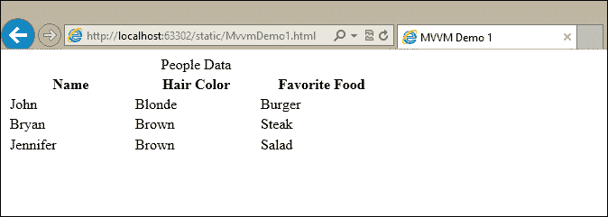
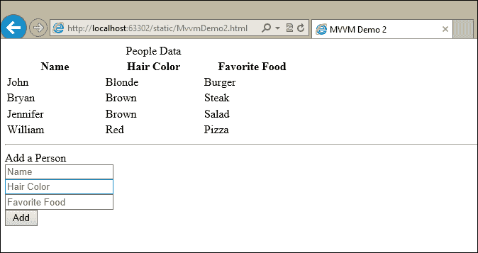
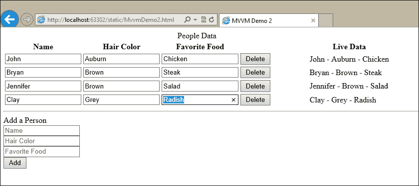
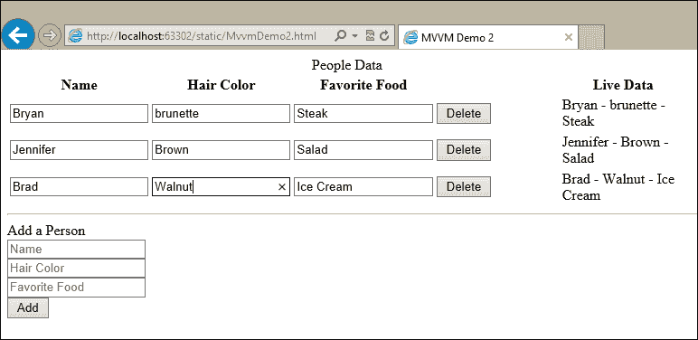

# 第四章：Kendo MVVM 框架

自从 JavaScript 的诞生以及丰富 MVVM 框架的出现以来，JavaScript 开发已经走了很长的路，这无疑是这一演变的美好证明。这些框架允许开发者将代码中的责任分离，以更好地处理复杂性。它们还提供了一个简洁的语法，使得 MVVM 框架本身可以处理将动态数据绑定到网页上的繁琐工作。如果你之前从未使用过 JavaScript MVVM 框架，那么 Kendo MVVM 框架将为你带来一场盛宴。

# 理解 MVVM - 基础

MVVM 代表**模型**（**M**）、**视图**（**V**）和**视图模型**（**VM**）。它是与系统架构相关的设计模式家族的一部分，将责任分离到不同的单元中。一些其他相关的模式是**模型-视图-控制器**（**MVC**）和**模型-视图-表示器**（**MVP**）。它们在框架的每个部分负责的内容上有所不同，但它们都试图通过相同的设计原则来管理复杂性。在这里不深入不必要的细节，只需说这些模式对于开发可靠和可重用的代码是好的，如果你正确实现了它们，你无疑会从中受益。幸运的是，好的 JavaScript MVVM 框架通过为你连接组件，让你专注于代码而不是“管道”工作，使得这变得容易。

在 Kendo UI 的 JavaScript MVVM 模式中，你需要为想要显示和操作的数据（模型）、结构化整个网页的 HTML 标记（视图）以及处理用户输入、响应事件并将静态标记转换为动态元素的 JavaScript 代码（视图模型）创建定义。另一种说法是，你将拥有数据（模型）、展示（视图）和逻辑（视图模型）。

在实践中，模型是 MVVM 模式中最不明确的部分，甚至不一定在实现中作为一个独特的实体存在。视图模型可以直接在其内部包含模型数据属性，而不是作为单独的单元引用它们，从而承担模型和视图模型的双重角色。这是可以接受的，并且在 ASP.NET MVC 中也可以看到，当视图使用`ViewBag`或`ViewData`集合而不是引用强类型模型类时。如果模型没有像视图模型和视图那样定义得很好，请不要让它困扰你。任何模式的实现都应过滤到对您的应用程序真正有意义的内容。

## 简单的数据绑定

作为入门示例，考虑您有一个需要显示数据表的网页，并且还提供用户通过单击特定的单行或元素与该数据交互的能力。数据是动态的，因此您事先不知道将显示多少条记录。此外，任何更改都应该立即反映在页面上，而不是等待从服务器完全刷新整个页面。您如何实现这一点？

一种传统的方法是使用可以动态从数据源创建表格并能够连接一些 JavaScript 交互性的特殊服务器端控件。这种方法的问题通常是需要服务器和浏览器之间进行一些复杂的额外通信，无论是通过“视图状态”，隐藏字段，还是长而丑陋的查询字符串。此外，这些特殊控件生成的输出通常很难进行定制或以重要方式进行操作，这减少了您网站外观和行为的选择。另一个选择是创建特殊的 JavaScript 函数，以异步从端点检索数据，在表格内生成 HTML 标记，然后为按钮和链接连接事件。这是一个好的解决方案，但需要大量的编码和复杂性，这意味着调试和精炼可能需要更长的时间。这也可能超出了某些开发者没有重大研究的能力范围。第三个选项，通过 JavaScript MVVM 如 Kendo UI 提供，在这两种位置之间取得平衡，通过减少 JavaScript 的复杂性，但仍然在页面内提供强大且简单的数据绑定功能。

### 创建视图

这是一个简单的 HTML 页面，展示视图是如何基本工作的：

```js
<!DOCTYPE html>
<html >
<head>
<title>MVVM Demo 1</title>
<script src="img/jquery.js"></script>
<script src="img/kendo.all.js"></script>
<link href="/Content/kendo/kendo.common.css" rel="stylesheet" />
<link href="/Content/kendo/kendo.default.css" rel="stylesheet" />
<style type="text/css">
th {
width: 135px;
   }
</style>
</head>
<body>
<table>
<caption>People Data</caption>
<thead>
<tr>
<th>Name</th>
<th>Hair Color</th>
<th>Favorite Food</th>
</tr>
</thead>
<tbody data-template="row-template" 
data-bind="source: people"></tbody>
</table>
</body>
</html>
```

这里有一个简单的`table`元素，包含三个列，但不是`body`包含任何`tr`元素，而是有一些特殊的 HTML5 `data-*`属性，表明这里正在进行一些特殊操作。这些`data-*`属性本身并不做任何事情，但 Kendo UI 会读取它们（如下所示），并解释它们的值，以便将视图与视图模型链接起来。`data-bind`属性指示 Kendo UI，这个元素应该绑定到一个名为`people`的对象集合。

`data-template`属性告诉 Kendo UI，应该使用 Kendo UI 模板格式化`people`对象。以下是模板的代码：

```js
<script id="row-template" type="text/x-kendo-template">
<tr>
<td data-bind="text: name"></td>
<td data-bind="text: hairColor"></td>
<td data-bind="text: favoriteFood"></td>
</tr>
</script>
```

这是一个简单的模板，为表格中的每一行定义了一个`tr`结构。`td`元素上也有`data-bind`属性，这样 Kendo UI 就知道要插入某个属性的值作为 HTML 元素的“文本”，在这种情况下意味着将值放置在`<td>`和`</td>`之间作为页面上简单的文本。

### 创建模型和视图模型

为了建立这个连接，我们需要一个执行数据绑定的视图模型。以下是这个视图的视图模型代码：

```js
<script type="text/javascript">
var viewModel = kendo.observable({
people: [
            {name: "John", hairColor: "Blonde", favoriteFood: "Burger"},
            {name: "Bryan", hairColor: "Brown", favoriteFood: "Steak"},
            {name: "Jennifer", hairColor: "Brown", favoriteFood: "Salad"}
        ]
    });
kendo.bind($("body"), viewModel);
</script>
```

通过调用 `kendo.observable()` 来声明一个 Kendo UI 视图模型，这会创建一个 **可观察对象**，该对象用于视图中的数据绑定。可观察对象是一个特殊对象，它将一个普通的 JavaScript 变量包装起来，并在该变量的值发生变化时触发事件。这些事件会通知 MVVM 框架更新任何使用该变量值的绑定数据，以便它们可以立即更新并反映变化。这些数据绑定也是双向的，因此如果绑定到可观察对象变量的字段发生变化，绑定到该字段的变量也会实时更改。

在这个例子中，我创建了一个名为 `people` 的数组，其中包含三个具有关于一些人的属性的对象。这个数组在这个例子中充当模型，因为它包含了数据和数据的结构定义。在代码示例的末尾，你可以看到调用 `kendo.bind($("body"), viewModel)`，这是 Kendo UI 实际执行 MVVM 连接的方式。我传递了一个 jQuery 选择器作为 `body` 标签的第一个参数，因为这个 `viewModel` 对象适用于我的整个 HTML 页面，而不仅仅是其中的一部分。

将所有内容组合起来，以下是这个简化示例的完整源代码：

```js
<!DOCTYPE html>
<html >
<head>
<title>MVVM Demo 1</title>
<scriptsrc="img/jquery.js"></script>
<scriptsrc="img/kendo.all.js"></script>
<link href="/Content/kendo/kendo.common.css" rel="stylesheet" />
<link href="/Content/kendo/kendo.default.css" rel="stylesheet" />
<style type="text/css">
th {
width: 135px;
        }
</style>
</head>
<body>
<table>
<caption>People Data</caption>
<thead>
<tr>
<th>Name</th>
<th>Hair Color</th>
<th>Favorite Food</th>
</tr>
</thead>
<tbody data-template="row-template" 
data-bind="source: people"></tbody>
</table>
<script id="row-template" type="text/x-kendo-template">
<tr>
<td data-bind="text: name"></td>
<td data-bind="text: hairColor"></td>
<td data-bind="text: favoriteFood"></td>
</tr>
</script>
<script type="text/javascript">
var viewModel = kendo.observable({
people: [
       {name: "John", hairColor: "Blonde", favoriteFood: "Burger"},
       {name: "Bryan", hairColor: "Brown", favoriteFood: "Steak"},
{ name: "Jennifer", hairColor: "Brown", favoriteFood: "Salad" }
            ]
        });
kendo.bind($("body"), viewModel);
</script>
</body>
</html>
```

这里是页面动作的截图。注意 JavaScript `people` 数组中的数据是如何自动填充到表格中的：



尽管这个例子包含模型、视图和视图模型，但所有三个单元都出现在同一个 HTML 文件中。当然，您可以将 JavaScript 分离到其他文件中，但将它们像这样放在一起也是可以接受的。希望您已经看到了这个 MVVM 框架能为您做什么。

## 可观察数据绑定

使用声明性属性将数据绑定到您的 HTML 网页（视图）中是非常好且非常有用的，但 MVVM 框架还提供了一些更重要的功能，我们在上一个示例中没有看到。MVVM 框架不仅将数据附加到视图并保持不变，而且还维护了视图模型所有属性的运行副本，并实时更新这些属性的引用。这就是为什么视图模型是用名为 "observable" 的函数创建的原因。内部属性是可观察的，它们会向上报告变化，以便数据绑定的字段始终反映最新的数据。让我们看看一些示例。

### 动态添加数据

在我们刚刚看到的示例的基础上，在 HTML 页面中的表格下方添加这条水平线和表单：

```js
<hr />
<form>
<header>Add a Person</header>
<input type="text" name="personName" placeholder="Name" 
data-bind="value: personName" /><br />
<input type="text" name="personHairColor" placeholder="Hair Color" 
data-bind="value: personHairColor" /><br />
<input type="text" name="personFavFood" placeholder="Favorite Food" 
data-bind="value: personFavFood" /><br />
<button type="button" data-bind="click: addPerson">Add</button>
</form>
```

这在页面上添加了一个表单，以便用户可以输入应出现在表格中的新人员数据。注意，我们添加了一些`data-bind`属性，但这次我们绑定的是输入字段的`value`而不是`text`。还要注意，我们在表单底部的`button`上添加了一个`data-bind`属性，将那个`button`的`click`事件与视图模型内部的函数绑定。通过将`click`事件绑定到`addPerson`JavaScript 方法，每次点击这个按钮时，`addPerson`方法都会被触发。

这些绑定始终将那些输入字段的值与视图模型对象链接起来。如果其中一个输入字段的值发生变化，例如当用户在框中输入某些内容时，视图模型对象会立即看到这个变化，并更新其属性以匹配；它还会更新任何绑定到该属性值的页面区域，以便它们与新的数据匹配。

按钮的绑定是特殊的，因为它允许视图模型对象将自身的事件处理器附加到该元素的点击事件上。将事件处理器绑定到事件本身并不是什么特别的事情，但通过这种方式（通过`data-bind`属性）进行绑定是很重要的，这样页面内的特定运行视图模型实例就能将其中的一个函数附加到该事件上，使得事件处理器内部的代码能够访问这个特定视图模型的数据属性和值。这还允许将一个非常具体的上下文传递给事件，否则将很难访问。

下面是我在视图模型中添加到`people`数组下面的代码。在这个例子中，我们拥有的前三个属性构成了模型。它们包含被观察并绑定到页面其余部分的数据：

```js
personName: "",       // Model property
personHairColor: "",  // Model property
personFavFood: "",    // Model property
addPerson: function () {
this.get("people").push({
name: this.get("personName"),
hairColor: this.get("personHairColor"),
favoriteFood: this.get("personFavFood")
});
this.set("personName", "");
this.set("personHairColor", "");
this.set("personFavFood", "");
}
```

你看到的第一个几个属性是我们上面在输入表单中绑定的相同属性。它们以空值开始，因为当页面首次加载时，表单不应该有任何值。在视图模型内部声明这些空属性仍然很重要，以便在它们发生变化时跟踪它们的值。

数据属性之后的函数`addPerson`是我们绑定到输入表单按钮点击事件的函数。在这个函数中，我们正在访问`people`数组，并根据用户在表单字段中提供的信息向其中添加一条新记录。请注意，我们必须使用`this.get()`和`this.set()`函数来访问视图模型内部的数据。这很重要，因为在这个视图模型中的属性是特殊的可观察属性，直接访问它们的值可能不会得到你预期的结果。

您应该注意到的最重要的事情是`addPerson`函数与页面上的数据通过 View-Model 属性进行交互。它没有使用 jQuery、`document.querySelector`或任何其他 DOM 交互来读取元素的值！由于我们在输入元素的值上声明了`data-bind`属性到我们的 View-Model 属性，我们可以通过访问 View-Model 本身始终从这些元素中获取值。这些值始终被跟踪。这允许我们在`addPerson`函数和 HTML 页面中检索并更改这些 View-Model 属性，HTML 页面将立即显示这些更改。通过在属性上调用`this.set()`并将它们的值更改为空字符串，HTML 页面将清除用户刚刚输入并添加到表格中的值。再一次，我们更改 View-Model 属性而不需要我们自己访问 HTML。

这里是这个示例的完整源代码：

```js
<!DOCTYPE html>
<html >
<head>
<title>MVVM Demo 2</title>
<scriptsrc="img/jquery.js"></script>
<scriptsrc="img/kendo.all.js"></script>
<link href="/Content/kendo/kendo.common.css" rel="stylesheet" />
<link href="/Content/kendo/kendo.default.css" rel="stylesheet" />
<style type="text/css">
th {
width: 135px;
        }
</style>
</head>
<body>
<table>
<caption>People Data</caption>
<thead>
<tr>
<th>Name</th>
<th>Hair Color</th>
<th>Favorite Food</th>
</tr>
</thead>
<tbody data-template="row-template" data-bind="source: people"></tbody>
</table>
<hr />
<form>
<header>Add a Person</header>
<input type="text" name="personName" placeholder="Name" data-bind="value: personName" /><br />
<input type="text" name="personHairColor" placeholder="Hair Color" data-bind="value: personHairColor" /><br />
<input type="text" name="personFavFood" placeholder="Favorite Food" data-bind="value: personFavFood" /><br />
<button type="button" data-bind="click: addPerson">Add</button>
</form>
<script id="row-template" type="text/x-kendo-template">
<tr>
<td data-bind="text: name"></td>
<td data-bind="text: hairColor"></td>
<td data-bind="text: favoriteFood"></td>
</tr>
</script>
<script type="text/javascript">
var viewModel = kendo.observable({
people: [
                {name: "John", hairColor: "Blonde", favoriteFood: "Burger"},
                {name: "Bryan", hairColor: "Brown", favoriteFood: "Steak"},
                {name: "Jennifer", hairColor: "Brown", favoriteFood: "Salad"}
            ],
personName: "",
personHairColor: "",
personFavFood: "",
addPerson: function () {
this.get("people").push({
name: this.get("personName"),
hairColor: this.get("personHairColor"),
favoriteFood: this.get("personFavFood")
                });
this.set("personName", "");
this.set("personHairColor", "");
this.set("personFavFood", "");
            }
        });
kendo.bind($("body"), viewModel);
</script>
</body>
</html>
```

这里是页面动作的截图。您会看到通过填写表格，表中已经增加了一名额外的人员。自己试一试，看看这个代码与您之间的即时交互：



### 在 View 中使用可观察属性

我们刚刚看到在 View-Model 中向可观察集合添加新数据是多么简单，以及这如何导致任何数据绑定元素立即显示新数据。让我们添加一些更多功能来展示如何处理单个元素，并看看它们的可观察值如何更新页面内容。

为了演示这个新功能，我在表格中添加了一些列：

```js
<table>
<caption>People Data</caption>
<thead>
<tr>
<th>Name</th>
<th>Hair Color</th>
<th>Favorite Food</th>
<th></th>
<th>Live Data</th>
</tr>
</thead>
<tbody data-template="row-template" data-bind="source: people"></tbody>
</table>
```

第一列新列没有标题文本，但将在页面上为每个表格行包含一个按钮。第二列新列将显示表格中显示的每个对象的“实时数据”在 View-Model 中的值。

这里是更新后的行模板：

```js
<script id="row-template" type="text/x-kendo-template">
<tr>
<td><input type="text" data-bind="value: name" /></td>
<td><input type="text" data-bind="value: hairColor" /></td>
<td><input type="text" data-bind="value: favoriteFood" /></td>
<td><button type="button" 
data-bind="click: deletePerson">Delete</button></td>
<td><span data-bind="text: name"></span>&nbsp;-&nbsp;
<span data-bind="text: hairColor"></span>&nbsp;-&nbsp;
<span data-bind="text: favoriteFood"></span></td>
</tr>
</script>
```

注意，我已经将所有的简单`text data-bind`属性替换为输入元素和`valuedata-bind`属性。我还添加了一个带有`clickdata-bind`属性的按钮和一个显示三个属性文本的列，这样您就可以实时看到可观察行为。

View-Model 为删除按钮获得了一个新方法：

```js
deletePerson: function (e) {
var person = e.data;
var people = this.get("people");
var index = people.indexOf(person);
people.splice(index, 1);
}
```

当通过 Kendo UI 创建的绑定调用此函数时，它会传递一个事件参数，这里称为`e`，到包含数据属性的函数中。这个数据属性是对用于渲染特定数据行的模型对象的引用。在这个函数中，我创建了一个`person`变量来引用这一行的人员，以及一个对`people`数组的引用；然后我们使用这个人员的索引从数组中移除它。当您点击**删除**按钮时，您可以观察到表格立即对变化做出反应。

这里是更新后的 View-Model 的完整源代码：

```js
<script id="row-template" type="text/x-kendo-template">
<tr>
<td><input type="text" data-bind="value: name" /></td>
<td><input type="text" data-bind="value: hairColor" /></td><td><input type="text" data-bind="value: favoriteFood" /></td>
<td><button type="button" data-bind="click:
deletePerson">Delete</button></td>
<td><span data-bind="text: name"></span>&nbsp;-&nbsp;
<span data-bind="text: hairColor"></span>&nbsp;-&nbsp;
<span data-bind="text: favoriteFood"></span></td></tr>
</script><script type="text/javascript">
var viewModel = kendo.observable({
people: [
        {name: "John", hairColor: "Blonde", favoriteFood: "Burger"},
        {name: "Bryan", hairColor: "Brown", favoriteFood: "Steak"},
        {name: "Jennifer", hairColor: "Brown", favoriteFood: "Salad"}
            ],
personName: "",
personHairColor: "",
personFavFood: "",
addPerson: function () {
this.get("people").push({
name: this.get("personName"),
hairColor: this.get("personHairColor"),
favoriteFood: this.get("personFavFood")
                });
this.set("personName", "");
this.set("personHairColor", "");
this.set("personFavFood", "");
            },
deletePerson: function (e) {
var person = e.data;
var people = this.get("people");
var index = people.indexOf(person);
people.splice(index, 1);
            }
        });
kendo.bind($("body"), viewModel);
</script>
</body>
</html>
```

这里是新的页面截图：



点击 **删除** 按钮可以看到一个条目消失。你还可以看到我向表中添加了一个新的人，并且我在表格的输入框中做了更改，这些更改立即显示在右侧。这表明视图模型正在跟踪实时数据，并相应地更新其绑定。

### 更好地利用可观察数组

在最后几个例子中，我们一直在使用一个名为 `people` 的数组来展示带有 Kendo UI 绑定的动态表格。到目前为止，这运行得很好，但随着模型和功能的更加复杂，我们可能会遇到所谓的“瓶颈”。例如，没有方法能让“实时数据”直接来自模型对象本身；我们不得不在模板中将三个 `span` 元素连接起来以形成最终的输出。这可能会给更复杂和功能更全面的页面带来问题，在这些页面上，你可能有一个需要能够自行处理事件和计算值的模型对象数组，而不是在视图模型级别上。

按照以下方式修改行模板：

```js
<script id="row-template" type="text/x-kendo-template">
<tr>
<td><input type="text" data-bind="value: name.stuff" /></td>
<td><input type="text" data-bind="value: hairColor.stuff" /></td>
<td><input type="text" data-bind="value: favoriteFood.stuff" /></td>
<td><button type="button" 
data-bind="click: deletePerson">Delete</button></td>
<td data-bind="text: dataString"></td>
</tr>
</script>
```

我们在 `data-bind` 声明中更改了属性名称，以便它们指向我们为它们创建的内部属性，称为 `stuff`。示例中的重要部分是我们还更改了最后一列，使其指向一个名为 `dataString` 的计算值函数。随着我们继续，这个含义将变得清晰。接下来，更新视图模型的 JavaScript 块，使其看起来像这样：

```js
<script type="text/javascript">
var viewModel = kendo.observable({
people: [],
personName: "",
personHairColor: "",
personFavFood: "",
addPerson: function () {
this.get("people").push(new person({
name: this.get("personName"),
hairColor: this.get("personHairColor"),
favoriteFood: this.get("personFavFood")
            }));
this.set("personName", "");
this.set("personHairColor", "");
this.set("personFavFood", "");
        },
deletePerson: function (e) {
var person = e.data;
var people = this.get("people");
var index = people.indexOf(person);
people.splice(index, 1);
        }
    });

var person = function (data) {
var self = this;
this.name = kendo.observable({ stuff: data.name });
this.hairColor = kendo.observable({ stuff: data.hairColor });
this.favoriteFood = kendo.observable({ stuff: data.favoriteFood });
this.dataString = function () {
returnself.name.get("stuff") + " - " + 
self.hairColor.get("stuff") + " - " +
self.favoriteFood.get("stuff");
        }
    };

viewModel.get("people").push(new person({ name: "John", 
hairColor: "Blonde",
favoriteFood: "Burger" }));
viewModel.get("people").push(new person({ name: "Bryan", 
hairColor: "Brown",
favoriteFood: "Steak" }));
viewModel.get("people").push(new person({ name: "Jennifer",
hairColor:"Brown",
favoriteFood: "Salad" }));

kendo.bind($("body"), viewModel);
</script>
```

我们做了几项更改，让我们仔细地一步步来看。第一个重要的更改就在顶部，我们将静态数组声明替换为 `people` 属性作为一个空数组，使用方括号表示法 `[]`。其次，我们创建了一个新的对象类型 `person`，并给它提供了一个构造函数，其中包含它自己的内部可观察对象。这些可观察对象中的每一个都需要一个对象来管理，简单的值并不完全适用，所以我们为它们创建了一个任意属性，称为 `stuff`。这里发生的事情只是这个新的 `person` 对象类型的属性指向了可观察对象而不是简单数据。为什么？因为如果属性不是可观察的，那么视图模型将不会通知变化，用户界面也不会通过数据绑定进行更新。

这次变更的目的是为了使对象特定实例的计算值本地化，我们已经在`person`构造函数内部通过`dataString`函数实现了这一点。正如你所见，`dataString`函数从本地可观察的属性中提取值，并以格式化的字符串形式返回它们。这很重要，因为它意味着每个`person`对象都有其自己的函数副本，并且视图模型本身并不参与这个计算。这意味着视图模型内部的每个对象都可以观察其特定的变化，并基于这些变化计算值。这种类型的模型在高级场景中非常有用。

在声明`person`构造函数之后，我们手动向`people`数组中添加了一些新的`person`对象，然后像往常一样调用`kendo.bind()`。当渲染时，页面看起来和表现就像上一个例子一样，但现在模型对象更智能了。以下是更新后的视图模型的完整源代码：

```js
<script id="row-template" type="text/x-kendo-template">
<tr>
<td><input type="text" data-bind="value: name.d" /></td>
<td><input type="text" data-bind="value: hairColor.d" /></td>
<td><input type="text" data-bind="value: favoriteFood.d" /></td>
<td><button type="button" 
data-bind="click: deletePerson">Delete</button></td>
<td data-bind="text: dataString"></td>
</tr>
</script>
<script type="text/javascript">
var viewModel = kendo.observable({
people: [],
personName: "",
personHairColor: "",
personFavFood: "",
addPerson: function () {
this.get("people").push(new person({
name: this.get("personName"),
hairColor: this.get("personHairColor"),
favoriteFood: this.get("personFavFood")
                }));
this.set("personName", "");
this.set("personHairColor", "");
this.set("personFavFood", "");
            },
deletePerson: function (e) {
var person = e.data;
var people = this.get("people");
var index = people.indexOf(person);
people.splice(index, 1);
            }
        });

var person = function (data) {
var self = this;
            this.name = kendo.observable({ d: data.name });
this.hairColor = kendo.observable({ d: data.hairColor });
this.favoriteFood = kendo.observable({ d: data.favoriteFood });
this.dataString = function () {
returnself.name.get("d") + " - " +
self.hairColor.get("d") + " - " + self.favoriteFood.get("d");
            }
        };

viewModel.get("people").push(new person({
name: "John", hairColor: "Blonde",
favoriteFood: "Burger"
        }));
viewModel.get("people").push(new person({
name: "Bryan", hairColor: "Brown",
favoriteFood: "Steak"
        }));
viewModel.get("people").push(new person({
name: "Jennifer", hairColor: "Brown",
favoriteFood: "Salad"
        }));

kendo.bind($("body"), viewModel);
</script>
</body>
</html>
```

页面运行时的输出如下：



# Kendo MVVM 的数据绑定属性

在`data-bind` Kendo UI 属性内部可以使用十三种不同的值类型。以下是它们定义和用法的总结。

## `attr`属性

`attr`属性用于将视图模型的值绑定到页面元素的特定 HTML 属性。例如，这对于设置图像的`src`属性或锚点的`href`属性非常有用。

```js
... //View-Model definition
imageSource: 'http://www.images.com/randomImage.jpg',
...

```

这样的绑定将确保图像会随着视图模型的变化而变化，从而允许在网页上动态加载或更改图像。

注意，当属性以逗号分隔时，`attr`属性可以一次设置多个属性，如下所示：

```js
data-bind="attr: {attribute1: value, attribute2: value, attribute3: value, ...}"
```

此属性可以与任何 HTML 元素以及任何有效的 HTML 属性（包括自定义 HTML5 `data-*`属性）一起使用。

## `checked`属性

`checked`属性用于绑定类型为`checkbox`或`radio`的输入元素的选中状态。对于复选框，数据绑定属性可以是布尔值（`true`/`false`）或数组。对于单选选择，属性需要是字符串。例如：

```js
isChecked: true, ...

// Simple Boolean binding
// The data-bound property will be updated when the user clicks the checkbox

<input type="checkbox" data-bind="checked: isChecked" />

animals: ["cow", "pig"], ...

// Array binding for checkboxes
// The array will change based on which checkboxes are checked by the user
// The initial page will show both the "cow" and "pig" inputs as checked

<input type="checkbox" value="horse" data-bind="checked: animals" />
<input type="checkbox" value="cow" data-bind="checked: animals" />
<input type="checkbox" value="pig" data-bind="checked: animals" />

tablet: "surface", ...

// String binding for radio buttons
// The string will change based on which radio option is selected by the user
// The initial page will show the input with the value "surface" as checked

<input type="radio" name="tablet" value="surface" data-bind="checked: tablet" />
<input type="radio" name="tablet" value="ipad" data-bind="checked: tablet" />
<input type="radio" name="tablet" value="android" data-bind="checked: tablet" />
```

如你稍后所见，`checked`绑定可以与`visible`/`invisible`绑定结合使用，这样页面上的复选框或单选按钮将动态显示或隐藏页面上的其他部分。

## 点击属性

`click`属性将按钮的点击事件绑定到视图模型内的一个函数。它是我们稍后将看到的`events`绑定的一种快捷方式。与传统的点击事件连接不同，Kendo UI 框架将传递上下文数据到事件处理器，以允许更丰富的事件处理体验。例如，当在行模板内绑定点击事件时，传递给事件处理器的参数将能够访问源集合中的项目。这使得事件处理器可以直接操作该模型数据，而无需进行任何进一步的 DOM 探索，并保持所有可观察的功能不变。

从技术上讲，Kendo UI 将包装在 jQuery 事件对象中的 DOM 事件传递给绑定中指定的事件处理器，但它也像我们在上一段中讨论的那样管理数据属性。由于事件参数仍然与 DOM 事件相关联，因此您可以在该事件参数上调用`stopPropagation()`和`preventDefault()`来阻止 DOM 在页面上执行任何其他操作。

我们在上面提供的代码示例中已经看到了`click`绑定的例子，所以这里有一些我们当时使用的代码片段：

```js
// Our example row template that included the click binding that will
// pass the data property to the event handler
<script id="row-template" type="text/x-kendo-template">
<tr>
<td><input type="text" data-bind="value: name.d" /></td>
<td><input type="text" data-bind="value: hairColor.d" /></td>
<td><input type="text" data-bind="value: favoriteFood.d" /></td>
<td><button type="button" 
data-bind="click: deletePerson">Delete</button></td>
<td data-bind="text: dataString"></td>
</tr>
</script>

// Our example form that included the click binding that has no
// relevant data property to pass to the event handler
<form>
<header>Add a Person</header>
<input type="text" name="personName" placeholder="Name" 
data-bind="value: personName" /><br />
<input type="text" name="personHairColor" placeholder="Hair Color" 
data-bind="value: personHairColor" /><br />
<input type="text" name="personFavFood" placeholder="Favorite Food" 
data-bind="value: personFavFood" /><br />
<button type="button" data-bind="click: addPerson">Add</button>
</form>

...

// This version of the click binding does not use the event argument
addPerson: function () {
this.get("people").push(new person({
name: this.get("personName"),
hairColor: this.get("personHairColor"),
favoriteFood: this.get("personFavFood")
    }));
this.set("personName", "");
this.set("personHairColor", "");
this.set("personFavFood", "");
},

// This version of the click binding uses the event argument to
// current data item from the source collection
deletePerson: function (e) {
var person = e.data;
var people = this.get("people");
var index = people.indexOf(person);
people.splice(index, 1);
}
```

## 自定义属性

Kendo UI 允许自定义绑定，以便您可以为页面的视图模型创建与自定义行为相关的功能。Kendo UI 文档站点上的一个示例使用基于视图模型中布尔值的 jQuery UI `slideDown`和`slideUp`调用作为一些 UI 转换的快捷方式。有关自定义绑定的更详细 API 参考，请参阅 Kendo UI 文档。

## 禁用/启用属性

`disabled`和`enabled`绑定作用于输入、选择和文本区域 HTML 元素。正如它们的名称所暗示的那样，它们分别禁用或启用绑定的元素。这些绑定是为与布尔属性一起使用而设计的，但为了 JavaScript 的宽松类型，它们将非布尔值`0`、`null`、`undefined`和`""`（空字符串）视为`false`，并将所有其他非布尔值视为`true`。以下是一个示例代码：

```js
allowEdit: false, ...

// This input element will be initially disabled until the View-Model's allowEdit
// View-Model's allowEdit property is changed to true
<input type="text" data-bind="enabled: allowEdit" />
```

## 事件属性

`events`绑定是方便地将视图模型中的事件处理器连接到视图中的 HTML 元素事件的一种方式。正如我们上面看到的，点击绑定是这个模式的一个具体例子，并且以完全相同的方式运行。例如：

```js
<button type="button" data-bind="events: {blur: blurHandler, click: clickHandler,
mouseover: mouseHandler,...}">Interactive Button</button>
```

## html/text 属性

`html`绑定使用视图模型中属性的值设置 HTML 元素的`innerHTML`内容。与`text`绑定不同，它不会在生成输出之前对 HTML 标签进行编码，这意味着视图模型属性中的 HTML 标签将被渲染为 HTML 而不是文本（如果您使用`html`绑定，这可能是您想要的）。以下是一个示例：

```js
spanContent: "<strong>Some Content</strong>",...

<span data-bind="html: spanContent"></span>
```

这将在渲染页面的源代码中生成如下输出：

```js
<span><strong>Some Content</strong></span>
```

`text` 绑定与 `html` 绑定的工作方式完全相同，不同之处在于它设置元素标签之间的简单文本，并且在输出之前会编码 HTML，因此不要在包含要显示的文本的属性中放置 HTML，除非你希望标签作为文本输出的一部分显示。

## 无形/可见属性

`invisible` 和 `visible` 绑定用于 HTML 元素，您希望动态地显示或隐藏这些元素。正如它们的名称所表明的，它们分别使给定元素不可见或可见。这些绑定旨在与布尔属性一起使用，但为了 JavaScript 宽松类型，它们将非布尔值 `0`、`null`、`undefined` 和 `""`（空字符串）视为假，并将所有其他非布尔值视为真。以下是一个示例代码：

```js
showDetails: true, ...

// This element will be initially visible unless the View-Model's
// showDetails property is changed to false
<pdata-bind="visible: showDetails">All sorts of text here...</p>
```

如前所述，将复选框或单选按钮的值与页面上的其他元素的可见状态连接可能非常有用。这允许你根据用户的选择更改页面上显示的数据。以下是一个简单的示例：

```js
showDetails: false, ...

<input type="checkbox" data-bind="checked: showDetails" name="showDetails" />

<p data-bind="visible: showDetails">All sorts of text and details…</p>
```

这段代码将使复选框控制包含某些文本的段落元素的可见性，这些文本仅在复选框被选中时才显示。这可能比在普通 Web 应用程序中使用的代码要简单，但它说明了基本原理。

## `source` 属性

`source` 绑定旨在使用视图模型属性的值来渲染 Kendo UI 模板。如果该属性是数组，则 Kendo UI 框架将为数组的每个元素渲染模板。此模板由附加到相关 HTML 元素上的 `data-template` 属性指定，并且应通过其 `id` 属性指示模板。当模板被渲染时，它们将直接放置在具有 `source` 属性的元素下方 DOM 中。这就是为什么你会在表格的 `tbody` 元素上放置 `source` 属性，以便 Kendo UI 模板中的 `tr` 元素将被渲染并直接放置在 DOM 中，这样它们就会作为表格中的行出现。此绑定可以在任何合理包含一组低级元素的元素上工作，`table` 只是一个自然的例子；其他很好的用途包括 `ul`、`ol` 和 `select` 元素。

我们已经在我们的代码示例中看到了 `source` 绑定。我将粘贴其中一部分作为提醒：

```js
// table with the source binding on the tbody element
<table>
<caption>People Data</caption>
<thead>
<tr>
<th>Name</th>
<th>Hair Color</th>
<th>Favorite Food</th>
<th></th>
<th>Live Data</th>
</tr>
</thead>
<tbody data-template="row-template" data-bind="source: people"></tbody>
</table>
...
// the template that creates the rows
<script id="row-template" type="text/x-kendo-template">
<tr>
<td><input type="text" data-bind="value: name.d" /></td>
<td><input type="text" data-bind="value: hairColor.d" /></td>
<td><input type="text" data-bind="value: favoriteFood.d" /></td>
<td><button type="button" 
data-bind="click: deletePerson">Delete</button></td>
<td data-bind="text: dataString"></td>
</tr>
</script>
```

这是一个使用对象数组 `source` 绑定的好例子。`source` 绑定也可以与简单值数组一起使用，在这种情况下，你会在模板内部使用关键字 `this` 而不是对象内的属性名称：

```js
<script id="row-template" type="text/x-kendo/template">
<tr>
<td data-bind="text: this"></td>
</tr>
</script>
```

`source` 绑定也可以与单个对象（而不是数组）一起使用，在这种情况下，它表现得就像绑定到一个只有一个元素的数组一样。如果您想访问 View-Model 中的单个属性，也可以将其绑定到 View-Model 本身，在这种情况下，您将 `source` 作为 `this` 关键字的一个属性来引用：

```js
// table with the source binding on the tbody element
<table>
<caption>People Data</caption>
<thead>
<tr>
<th>Name</th>
<th>Hair Color</th>
<th>Favorite Food</th>
<th></th>
<th>Live Data</th>
</tr>
</thead>
<tbody data-template="row-template" data-bind="source: viewModel"></tbody>
</table>
...
// the template that creates the rows
<script id="row-template" type="text/x-kendo-template">
<tr>
<td><input type="text" data-bind="value: this.name" /></td>
<td><input type="text" data-bind="value: this.hairColor" /></td>
<td><input type="text" data-bind="value: this.favoriteFood" /></td>
<td><button type="button" 
data-bind="click: deletePerson">Delete</button></td>
<td data-bind="text: dataString"></td>
</tr>
</script>
...
<script type="text/javascript>
var viewModel = kendo.observable({
name: "john",
hairColor: "blonde",
favoriteFood: "burger"
    });
...
</script>
```

注意，结构看起来就像您在引用一个单一对象一样，但我们使用 `this` 关键字，因为我们直接引用了 View-Model。

当绑定到 `select` 元素时，请注意，您可以使用一个简单的值数组或一个对象数组。如果您只有一个对象数组，请使用 `data-text-field` 来指示包含要显示在每个 `option` 中的文本的属性，并使用 `data-value-field` 来指示包含每个 `option` 元素中的值的属性。

## 样式属性

样式绑定是创建您 View-Model 中的数据与页面上的 CSS 样式之间动态关系的一种极好方式。这是一个非常简单的绑定，它直接在 View-Model 中的属性和您的标记中的样式之间建立关系。例如：

```js
<span data-bind="style: {color: myColor, fontWeight: myFontWeight}" />
<script type="text/javascript">
var viewModel = kendo.observable({
myColor: "orange",
myFontWeight: "bold"
    });
</script>
```

显然，如果您将一些逻辑与页面中使用的样式绑定在一起，这将变得非常有用，例如，改变交替表格行的样式或根据某些特殊标准（如透支余额看起来是红色）改变文本颜色。

注意，我们使用了 `fontWeight` 样式属性，这可能会让您感到奇怪。如果您需要引用通常包含连字符（`font-weight`）的样式，您需要在绑定中使用驼峰式版本，以便它作为一个有效的 JavaScript 属性名称工作。因此，`font-weight` 在实际的绑定语句中变为 `fontWeight`。

最后，如果您将样式值设置为空字符串，它将重置值回到其原始设置。

## 值属性

`value` 绑定与 `text` 绑定非常相似，不同之处在于它设置输入元素的值而不是显示元素的文本。默认情况下，在 View-Model 中绑定的值在失去焦点时更新，例如，当您按下 *Tab* 键离开页面上的输入元素。如果您想根据不同的 DOM 事件更新 View-Model 属性，您可以在具有绑定的同一元素上设置 `data-value-update` 属性。我们已经在代码示例中看到了 `value` 绑定的使用。以下是一个使用 `data-value-update` 绑定来自定义某些行为的示例：

```js
// the row template
<script id="row-template" type="text/x-kendo-template">
<tr>
<td><input type="text" data-bind="value: name"
             data-value-update="keyup" /></td>
</tr>
</script>
```

记住，这是一个双向绑定，并且对于从用户那里检索数据（当他们填写表单时）非常有用。

与我们上面看到的 `checked` 绑定类似，`value` 绑定以类似的方式与 `select` 元素一起工作。通过将 `select` 元素的 `value` 绑定到一个字符串属性，如果选项有值，它将绑定到 `select` 元素内部的选中 `option` 元素的值；如果没有 `value`，则绑定到选中 `option` 元素的 `text`。以下是这种绑定在标记中的样子：

```js
// Binding using the value, the selectedCar property will be bound to the numbers
<select data-bind="value: selectedCar">
<option value="1">Honda</option>
<option value="2">Toyota</option>
<option value="3">Ford</option>
</select>

// Binding using the text, the selectedCar property will be bound to the text
// between the option tags
<select data-bind="value: selectedCar">
<option>Honda</option>
<option>Toyota</option>
<option>Ford</option>
</select>
```

当然，你也可以将 `select` 元素的 `source` 和 `value` 都绑定到 View-Model。你不仅限于在 `data-bind` 属性中只有一个绑定。同样，正如你所期望的，如果你将一个多选元素绑定到一个数组（而不是一个简单的字符串），你也可以绑定其值。

# 通过 Data-Role MVVM 属性进行声明性小部件

Kendo 的 MVVM 还允许通过 `data-role` 属性进行声明性小部件初始化。声明性初始化是通过使用 `data-role` 属性而不是通过 JavaScript 设置小部件来创建 Kendo 小部件的一种不同方法。这不如 JavaScript 方法灵活，但它几乎不需要代码就能实现很多功能。以下是从 Kendo UI 网站上摘取的一段代码，展示了作为介绍的一些基本设置。这些小部件的完整细节可以在那里找到。

```js
<table>
<tr>
<th>Widget</th>
</tr>
<tr>
<td>
<h4>AutoComplete</h4>
<input data-role="autocomplete" data-text-field="name" 
data-bind="source: colors, value: autoCompleteValue"/>
</td>
</tr>
<tr>
<td>
<h4>ComboBox</h4>
<select data-role="combobox"
data-text-field="name" data-value-field="value" data-bind="source:
colors, value: comboBoxValue"></select>
</td>
</tr>
<tr>
<td>
<h4>DatePicker</h4>
<input data-role="datepicker" data-bind="value: datePickerValue" />
</td>
</tr>
<tr>
<td>
<h4>DropDownList</h4>
<select data-role="dropdownlist"
data-text-field="name" data-value-field="value" data-bind="source:
colors, value: dropDownListValue"></select>
</td>
</tr>
<tr>
<td>
<h4>Grid</h4>
<div data-role="grid"
data-sortable="true" data-editable="true"
data-columns='["Name", "Price", "UnitsInStock", 
{"command": "destroy"}]'
data-bind="source: gridSource"></div>
</td>
</tr>
<tr>
<td>
<h4>NumericTextBox</h4>
<input data-role="numerictextbox" data-format="c" 
data-bind="value: numericTextBoxValue" />
</td>
</tr>
<tr>
<td>
<h4>Slider</h4>
<input data-role="slider" data-bind="value: sliderValue" />
</td>
</tr>
<tr>
<td>
<h4>TimePicker</h4>
<input data-role="timepicker" data-bind="value: timePickerValue" />
</td>
</tr>
<tr>
<td>
<h4>TabStrip</h4>
<div data-role="tabstrip" data-animation="false">
<ul>
<li class="k-state-active">First</li>
<li>Second</li>
</ul>
<div>
<h4>First page:</h4>
Pick a time: <input data-role="timepicker" 
data-bind="value: timePickerValue"/>
</div>
<div>
<h4>Second page:</h4>
Time is: <span data-bind="text:
displayTimePickerValue"></span>
</div>
</div>
</td>
</tr>
<tr>
<td>
<h4>TreeView</h4>
<div data-role="treeview"
data-animation="false"
data-drag-and-drop="true"
data-bind="source: treeviewSource"></div>
</td>
</tr>
</table>
```

这是一个使用多个绑定一起使用的绝佳例子，以及哪些绑定正确地适用于哪些小部件。

# 摘要

Kendo MVVM 框架将复杂的交互式 JavaScript 带入了简单的 HTML 属性、模板和 View-Model 函数的领域。这是一个非常强大的功能，你可能会很快习惯在网页中使用它。在编写代码时请记住，Kendo 是一个可以非常优雅地构建特性的系统；例如，你可以使用 Kendo 数据源对象作为 `table` 或 `select` 列表的源绑定。

当你手头有这样的强大工具时，你会发现功能丰富的页面变得正常，而不是异常困难，你的编程体验将比以往任何时候都要好。在下一章中，我们将学习关于 Kendo UI HTML 编辑器小部件。这个小部件将一个功能齐全的 HTML 编辑框添加到你的网页中，以便用户可以在一个友好的输入区域中创建带有格式、图片和超链接的内容。如果用户可以在你的网站上贡献内容，例如通过博客或论坛，这尤其有用。
