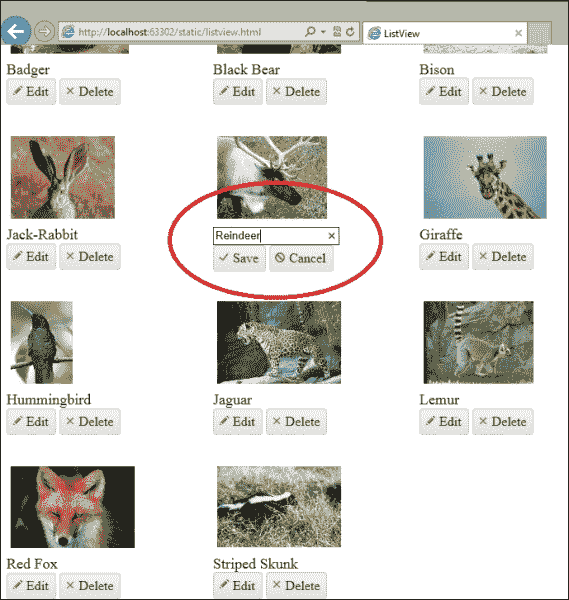

# 第六章 菜单和 ListView

Kendo UI 菜单小部件旨在为您提供一种简单的方法来实现交互式 JavaScript 菜单，该菜单根据用户的命令打开和关闭，并在网页上提供丰富的视觉显示。这些类型的菜单也可以通过其他技巧实现，例如 CSS，但 Kendo UI 小部件为您提供了一个更可配置的框架和访问简化的 JavaScript API。

Kendo UI ListView 小部件是一个用于以图形方式可视化数据元素集合的控制项，特别是如果数据包含图像或特殊样式。像所有 Kendo UI 选项一样，配置是一致的、合理的，并允许您创建外观出色的内容，并提供用于编辑和选择的显示选项。

这些控件是您创建现代网页工具集的良好补充。

# 学习菜单小部件基础

菜单小部件创建了一个出色的下拉菜单，其中包含飞出部分以显示菜单内容。它功能丰富，对于大多数实现来说，代码量非常少。作为介绍，这里是一个从静态无序列表 HTML 创建的基本菜单的代码示例：

```js
<!DOCTYPE html>
<html>
<head>
    <title>Kendo UI Menu</title>
    <script src="img/jquery.js"></script>
    <script src="img/kendo.all.js"></script>
    <link href="/Content/kendo/kendo.common.css" rel="stylesheet" />
    <link href="/Content/kendo/kendo.default.css" rel="stylesheet" />
</head>
<body>
        <div id="menuDemo">
            <ul id="menu">
                <li>
                    Music
                    <ul>
                        <li>
                            Blues / Folk
                            <ul>
                                <li>Contemporary Blues</li>
                                <li>Contemporary Folk</li>
                                <li>Traditional American</li>
                                <li>World Folk</li>
                            </ul>
                        </li>
                        <li>
                            Christian / Gospel
                            <ul>
                                <li>Christian Rock / Hip Hop</li>
                                <li>Contemporary Christian</li>
                                <li>Traditional Gospel</li>
                            </ul>
                        </li>
                        ...
                    </ul>
                </li>
                <li>
                    Videos
                    <ul>
                        <li>Movies</li>
                        <li>TV</li>
                        <li>Trailers</li>
                    </ul>
                </li>
                <li>
                    Events
                </li>
                <li disabled="disabled">
                    News
                </li>
            </ul>
        </div>
        <script>
            $(document).ready(function () {
                $("#menu").kendoMenu();
            });
        </script>
</body>
</html>
```

这是一个显示不同音乐风格、视频以及其他一些选项的菜单，仅用于演示代码的外观。无序列表中的顶级`<li>`元素在输出中均显示为实际的菜单标题，在本例中它们是**音乐**、**视频**、**活动**和**新闻**。

### 注意

注意，这些顶级元素每个都包含自己的名称，并且可以可选地包含一个嵌套的无序列表（`<ul>`），它将成为在页面上选择顶级项时出现的选项。

在向下移动链的过程中，嵌套列表中的每个`<li>`元素也可以包含它自己的`<ul>`，以创建进一步的嵌套菜单选项。这会产生级联效果，当您将鼠标移动到不同的选项时，菜单选项可以继续展开。此外，请注意，最终的顶级`<li>`项“新闻”带有禁用属性，这意味着它仍然会在输出中显示，但不能被选择。

这是页面首次加载时的输出：


当鼠标悬停在菜单中的某些元素上时，这就是菜单小部件的外观。自己试一试，看看菜单对这些事件反应有多快、多流畅；这非常令人印象深刻。


与 Kendo UI 框架中的大多数小部件一样，菜单小部件不必从静态 HTML 运行，它可以由本地或远程数据的`DataSource`对象提供动力。以下是使用本地`DataSource`对象而不是静态 HTML 的代码示例：

```js
<!DOCTYPE html>
<html>
<head>
    <title>Kendo UI Menu</title>
    <script src="img/jquery.js"></script>
    <script src="img/kendo.all.js"></script>
    <link href="/Content/kendo/kendo.common.css" rel="stylesheet" />
    <link href="/Content/kendo/kendo.default.css" rel="stylesheet" />
</head>
<body>
    <div id="menuDemo">
    </div>
    <script type="text/javascript">
        var menuData = [
            {
                text: "Music",
                items: [
                    {
                        text: "Blues/Folk",
                        items: [
                            { text: "Contemporary Blues" },
                            { text: "Contemporary Folk" },
                            { text: "Traditional American" },
                            { text: "World Folk" }
                        ]
                    },
                    {
                        text: "Christian / Gospel",
                        items: [
                            { text: "Christian Rock / Hip Hop" },
                            { text: "Contemporary Christian" },
                            { text: "Traditional Gospel" }
                        ]
                    },

                    ...
                ]
            },
            {
                text: "Videos",
                items: [
                    { text: "Movies" },
                    { text: "TV" },
                    { text: "Trailers" }
                ]
            },
            {
                text: "Events"
            },
            {
                text: "News",
                enabled: false
            }
        ];
    </script>
    <script type="text/javascript">
        $(document).ready(function () {
            $("#menuDemo").kendoMenu(
                { dataSource: menuData });
        });
    </script>
</body>
</html>
```

注意，`DataSource`对象可以配置您在前面章节中看到的所有选项，并且可以轻松地配置一个用于远程数据的传输属性。

输出与第一次使用的静态 HTML 相同：


与大多数 Kendo UI 小部件一样，无论数据来自页面标记还是 JavaScript 数据源，页面上的交互内容都是相同的。为了适应使用 MVC 扩展方法，我们可以在`cshtml`文件中创建一个 MVC 视图，其源代码如下：

```js
@using Kendo.Mvc.UI;

@{
    ViewBag.Title = "Mvc Menu";
}

<h2>Mvc Menu</h2>
@(Html.Kendo().Menu()
    .Name("menuDemo")
    .Items(items =>
        {
            items.Add().Text("Music").Items(sub =>
            {
                sub.Add().Text("Blues / Folk").Items(subsub =>
                {
                    subsub.Add().Text("Contemporary Blues");
                    subsub.Add().Text("Contemporary Folk");
                    subsub.Add().Text("Traditional American");
                    subsub.Add().Text("World Folk");
                });
                sub.Add().Text("Christian / Gospel").Items(subsub =>
                {
                    subsub.Add().Text("Christian Rock / Hip Hop");
                    subsub.Add().Text("Contemporary Christian");
                    subsub.Add().Text("Traditional Gospel");
                });
                ...

            });
            items.Add().Text("Videos").Items(sub => {
                sub.Add().Text("Movies");
                sub.Add().Text("TV");
                sub.Add().Text("Trailers");
            });
            items.Add().Text("Events");
            items.Add().Text("News").Enabled(false);
        })
)
```

注意，在这个代码示例中，我声明了数据是静态的。它也可以很容易地从 C#代码中的不同源收集，或者甚至将其作为 JavaScript 的一部分，并通过 HTTP 从远程源检索。

从这个屏幕截图可以看出，输出与另外两个代码示例相同：


这说明了创建 Kendo UI 菜单小部件的三种独特方法及其之间的区别。

## 带有图像的菜单项

到目前为止，菜单项仅包括文本。然而，菜单小部件还可以包含一个`imageUrl`属性或一个`spriteCssClass`属性，以显示与文本一起的图像。图像或精灵将作为图标出现在菜单项文本的左侧。

这里是一个使用`imageUrl`属性来显示`Videos`菜单项图标的示例：

```js
...
{
  text: "Videos",
  imageUrl: "images/reel.png",
  items: [
    { text: "Movies" },
    { text: "TV" },
    { text: "Trailers" }
  ]
},
...
```

通过添加此属性，输出现在在菜单中显示了图像：


这就是代码示例在 MVC 中的样子：

```js
items.Add().Text("Videos").ImageUrl("/static/images/reel.png").Items(sub => {
  sub.Add().Text("Movies");
  sub.Add().Text("TV");
  sub.Add().Text("Trailers");
});
```

注意添加到输出中的`ImageUrl`扩展方法。

要使用精灵图，您首先需要设置应显示图标的菜单项的背景图像，然后使用`spriteCssClass`属性指定一个 CSS 类，该类将指定每个特定图标的像素偏移。任何指定了`spriteCssClass`属性的菜单项都将自动装饰上`k-sprite` CSS 类，以确保正确连接。以下是一个可能的示例：

```js
<style>
#menuDemo .k-sprite {
  background-image: url("images/sprites.png");
}
.someIcon {
  background-position: 0 0;
}
.someOtherIcon {
  background-position: 0 -32px;
}
</style>
...
<script>
...
{
  text: "Videos",
  spriteCssClass: "someIcon",
  items: [
    { text: "Movies" },
    { text: "TV" },
    { text: "Trailers" }
  ]
},
...
```

这个示例的 CSS 部分显示了为所有`k-sprite`类装饰的元素分配`background-image`属性，并指定了两个精灵像素`background-position`样式。脚本部分显示了正在使用的`spriteCssClass`属性，它将为该菜单项分配精灵图像的相应部分作为图标。

## 带有 URL 的菜单项

到目前为止，我展示的所有示例都是当选择时不会执行任何操作的菜单项。您需要做的只是将`url`属性添加到菜单项中，以便在点击时导航。因此，对于您想要将用户导航到不同页面的任何菜单项，请包括一个`url`属性，如这里所示，它将这样做：

```js
...
{
  text: "Videos",
  spriteCssClass: "someIcon",
   url: "http://www.kendoui.com",
  items: [
    { text: "Movies" },
    { text: "TV" },
    { text: "Trailers" }
  ]
},
...
```


注意，在这个屏幕截图中的网络浏览器显示了**Videos**菜单项现在导航到的 URL。

## 菜单 API 配置选项

如您现在所期望的，Kendo UI 菜单小部件可以通过一组完整的 API 属性和方法进行配置。这些选项是可以配置的属性，以便菜单小部件能够满足您的网页和风格需求。这些配置是在创建菜单小部件的代码点中指定的。以下部分将向您展示您可以使用哪些选项。

### 动画属性

Kendo UI 菜单的动画动作可以配置为样式、速度和方向。当您配置菜单的打开动作时，Kendo 会自动为`close`动作分配相反的行为。如果您想独立于`open`动作配置`close`动作，那么您应该分别配置它们，如下所示：

```js
...
$("menu").kendoMenu({
  animation: {
    close: {  // animation to use when closing a menu
      effects: "slideIn",  // 'slideIn' / 'fadeIn' / 'expand'
      duration: 10
    },
    open: {  // animation to use when opening a menu
      effects: "slideIn:Down", // You can assign a direction too
      duration: 10
    }
  }
});
...
// or you can disable animation entirely
$("menu").kendoMenu({
  animation: false
});
```

### 方向属性

`direction`属性决定了当用户悬停在菜单上时，菜单将打开的方向。这里可用的选项有`top`、`bottom`、`left`和`right`。

```js
$("menu").kendoMenu({
  direction: "bottom"
});
...
// or you can specify how each level of submenus open separately
$("menu").kendoMenu({
  direction: "bottom right" // "bottom" for menu, "right" for sub menus
});
```

### 更多选项

在配置菜单行为方面，还有一些额外的选项可供选择。您可以使用`closeOnClick`、`openOnClick`和`hoverDelay`属性来配置菜单如何根据鼠标移动和点击行为进行操作。您可以使用`orientation`属性来配置整个菜单是水平还是垂直排列，并且可以通过`popupCollision`属性来指导 Kendo UI 框架如何使菜单适应页面。所有这些配置都可以在这里找到：

```js
$("menu").kendoMenu({
  closeOnClick: true,  // close menus when item is selected
  hoverDelay: 100,  // delay before menus open/close
  openOnClick: false,  // root submenus open with item is selected
  orientation: "vertical", // root menu orientation:
  popupCollision: "fit" // how to adjust menu to screen boundaries
                        // Use "fit flip" for vertical menus.
                        // Set to false to disable boundary detection completely.
});
```

## 配置菜单方法

Kendo UI 菜单小部件的一些方法需要您获取现有菜单项对象的引用（而不仅仅是 HTML 元素）作为附加或插入一些额外菜单项的参考点。在这种情况下，您可以通过对 Kendo 菜单的引用来访问菜单项对象，如下所示：

```js
var menu= $("#menuDemo").kendoMenu().data("kendoMenu");
```

在此代码中，您可以从实例化它的同一行代码中获取 Kendo 菜单对象的引用。这样，您可以在页面的其他部分和 JavaScript 逻辑中引用此对象。您还可以在任何代码点通过在包含它的 HTML 元素上调用`.data(…)`来获取 Kendo 菜单对象的引用，但一次性完成是更好的选择。

一旦您有了这个引用，您就可以通过`element`属性访问 Kendo 菜单内部的子项：

```js
menu.element.children("li").eq(3);
```

在此代码示例中，我们正在访问这个特定菜单对象的子代中的第四个`li`元素。这里的返回值将是一个 JavaScript 对象，可以用作`append`、`insertAfter`和`insertBefore`方法的参考点。

### append()、insertAfter()和 insertBefore()方法

`append`方法接受两个参数：要附加为子项的新菜单项的 JSON 表示，以及将作为新附加项父项的菜单项的引用：

```js
var menu = $("menu").data("kendoMenu");
var referenceItem = menu.element.children("li").eq(1);

menu.append(
  [{
    text: "new menu item",
    url: "http://www.music.com",
    items: [...]
  }],
  referenceItem
);
```

此代码将此菜单项作为子项附加到页面上的第二个菜单项。`insertAfter` 和 `insertBefore` 方法的工作方式完全相同，只是它们在相同的菜单级别插入新的菜单项，分别是在参考项之后或之前。

### 注意

所有这些方法都返回菜单对象以支持方法链。

### close()、enable()、open() 和 remove() 方法

这些 Kendo UI 菜单的方法不需要 JavaScript 对象引用；它们直接在页面菜单中的 HTML 元素上操作。因此，您可以使用 jQuery 选择器类型语法来选择要操作的项目（项），并使用熟悉的语法。

`enable` 方法接受两个参数：HTML 元素（元素）的选择器和表示项目应启用（true）或禁用（false）的 `true` 或 `false` 值：

```js
var menu = $("menu").data("kendoMenu");
menu.enable("#secondItem", false);
```

此特定的代码示例将禁用具有 HTML `id` 值为 `secondItem` 的元素。

这里其他的方法，即 `close`、`open` 和 `remove`，只接受一个参数，即 HTML 元素（元素）的选择器。请注意，框架不会为您分配元素的 ID 值或类名，您必须自己将这些值分配给您的元素，以便选择它们：

```js
var menu = $("menu").data("kendoMenu");
menu.close(".green");

menu.open("#item3");

menu.remove("#lastItem");
```

### 注意

所有这些方法都返回菜单对象以支持方法链。

## 菜单事件

Kendo UI 菜单触发三个事件：`close`、`open` 和 `select`。每个事件都提供了一个包含关闭、打开或选择的 HTML `<li>` 元素的 `item` 属性的事件参数，如下所示：

```js
<script>
  $(document).ready(function () {
    function onSelected(e) {
      var menu = $("#menu").data("kendoMenu");
      menu.enable(".green", false);
      alert("disabling green menu");
    }
    $("#menu").kendoMenu({ select: onSelected });

  });
</script>
```

以下代码示例展示了连接到处理选择事件的某个方法，该事件将禁用所有具有类名 `green` 的菜单项。由于此代码没有考虑选择了哪个特定元素，因此无论选择了哪个元素，它都会触发相同的代码。以下是一个不同的示例：

```js
<script type="text/javascript">
  $(document).ready(function () {
    function onSelected(e){
      alert(e.item.innerHTML);
    };
    var menu= $("#menuDemo").kendoMenu(
      { dataSource: menuData, select: onSelected }).data("kendoMenu");
  });
</script>
```

此代码检查所选的特定元素，并将它的 `innerHTML` 属性弹回用户。

# Kendo UI ListView

Kendo UI ListView 小部件旨在在网页上以比标准 HTML 列表更丰富的功能集展示数据集合。ListView 小部件通过 Kendo `DataSource` 对象检索其数据，通过一个或多个 Kendo 模板块展示其数据，并允许用户通过在页面上选择和编辑数据与数据交互。

## ListView 基础

基本上，ListView 小部件通过使用模板和 `DataSource` 对象来显示数据集合：

```js
<!DOCTYPE html>
<html >
<head>
    <title>ListView</title>
    <script src="img/jquery.js"></script>
    <script src="img/kendo.all.js"></script>
    <link href="/Content/kendo/kendo.common.css" rel="stylesheet" />
    <link href="/Content/kendo/kendo.default.css" rel="stylesheet" />
    <style type="text/css">
        .animal {
            width:250px;
            height:200px;
            position:relative;
            float:left;
        }
        .animal-label {
            font-size:large;
        }
        .animal-image {
            max-height:100px;
            max-width: 150px;
            margin: 5px;
        }
        #listView {
            width:750px;
            height:100%;
        }
    </style>
</head>
<body>
    <div id="listView"></div>

    <script type="text/x-kendo-tmpl" id="template">
        <div class="animal">
            
            <div class="animal-label">#= animalName #</div>
        </div>
    </script>
    <script type="text/javascript">
        var animals = [
            { animalName: "African Elephant", 
              imageName: "african-elephant.jpg" },
            { animalName: "African Lion", imageName: "african-lion.jpg" },
            { animalName: "Alpaca", imageName: "alpacas.jpg" },
            { animalName: "Badger", imageName: "badger.jpg" },
            { animalName: "Black Bear", imageName: "bear-black.jpg" },
            { animalName: "Bison", imageName: "bison.jpg" },
            { animalName: "Jack-Rabbit", 
              imageName: "black-tailed-jackrabbit.jpg" },
            { animalName: "Caribou", imageName: "caribou.jpg" },
            { animalName: "Giraffe", imageName: "giraffe.jpg" },
            { animalName: "Hummingbird", imageName: "humming-bird.jpg" },
            { animalName: "Jaguar", imageName: "jaguar.jpg" },
            { animalName: "Lemur", imageName: "lemur.jpg" },
            { animalName: "Red Fox", imageName: "red-fox.jpg" },
            { animalName: "Striped Skunk", imageName: "striped-skunk.jpg" }
        ];

        $(document).ready(function () {
            $("#listView").kendoListView({
                dataSource: animals,
                template: kendo.template($("#template").html())
            });
        });
    </script>
</body>
</html>
```

以下代码示例从上到下显示了将出现在 ListView 小部件内部的元素的一些样式。这些样式声明对于在网页上正确布局 ListView 小部件内部的图像非常重要：

```js
<style type="text/css">
  .animal {
    width:250px;
    height:200px;
    position:relative;
    float:left;
  }
  .animal-label {
    font-size:large;
  }
  .animal-image {
    max-height:100px;
    max-width: 150px;
    margin: 5px;
  }
  #listView {
    width:750px;
    height:100%;
  }
</style>
```

然后我们创建一个 `div` 元素，它将包含 ListView 小部件和 Kendo UI 模板，该模板结构化单个 ListView 元素。这个模板决定了 ListView 中的每个项目如何在网页内渲染。对 ListView 项的任何更改都必须在这里进行：

```js
<div id="listView"></div>
<script type="text/x-kendo-tmpl" id="template">
  <div class="animal">
    
    <div class="animal-label">#= ${animalName #}</div>
  </div>
</script>
```

然后我们有包含一些数据和 ListView 实例化的 JavaScript 对象字面量，其中设置了 `dataSource` 和 `template` 属性：

```js
<script type="text/javascript">
        var animals = [
            { animalName: "African Elephant", 
              imageName: "african-elephant.jpg" },
            { animalName: "African Lion", imageName: "african-lion.jpg" },
            { animalName: "Alpaca", imageName: "alpacas.jpg" },
            { animalName: "Badger", imageName: "badger.jpg" },
            { animalName: "Black Bear", imageName: "bear-black.jpg" },
            { animalName: "Bison", imageName: "bison.jpg" },
            { animalName: "Jack-Rabbit", 
              imageName: "black-tailed-jackrabbit.jpg" },
            { animalName: "Caribou", imageName: "caribou.jpg" },
            { animalName: "Giraffe", imageName: "giraffe.jpg" },
            { animalName: "Hummingbird", imageName: "humming-bird.jpg" },
            { animalName: "Jaguar", imageName: "jaguar.jpg" },
            { animalName: "Lemur", imageName: "lemur.jpg" },
            { animalName: "Red Fox", imageName: "red-fox.jpg" },
            { animalName: "Striped Skunk", imageName: "striped-skunk.jpg" }
        ];

        $(document).ready(function () {
            $("#listView").kendoListView({
                dataSource: animals,
                template: kendo.template($("#template").html())
            });
        });
    </script>
```

像往常一样，请记住，`DataSource` 对象可以完全配置以指向远程数据源，可以使用模式进行结构化，或者可以使用您在生产场景中可能想要利用的任何其他选项。


您可以看到 `DataSource` 对象中的每个元素是如何使用模板渲染的，并且按照预期在页面上进行了样式化和展示。

## 使用 ListView 选择元素

ListView 小部件提供的功能远不止显示数据，首先让我们看看它是如何允许“选择”元素的。在这个代码示例中，我向 ListView 实例化逻辑中添加了一些更多属性和事件处理程序来演示这一点：

```js
        $(document).ready(function () {
            $("#listView").kendoListView({
                dataSource: animals,
                template: kendo.template($("#template").html()),
                selectable: "multiple",
                change: notifyUser
            });

            function notifyUser(e) {
                var selected = $.map(this.select(), function (item) {
                    return animals[$(item).index()].animalName;
                });
                alert(selected.join(", "));
            }
        });
    </script>
```

`selectable` 属性已设置为 `multiple` 以允许多选项目（您可以通过在键盘上按住 *Ctrl* 键并使用鼠标点击来在页面上选择多个项目）。我们还添加了一个 `change` 事件的事件处理程序，以便我们可以看到一个显示已选择元素的警告框。

在 `notifyUser` 事件处理函数中，我想解释一下正在发生的事情，因为乍一看可能有点令人困惑。变量 `selected` 被赋予了一个包含所有已选择元素 `animalName` 属性值的数组。它是通过在 `this.select()` 的结果上使用 `$.map` 来做到这一点的。什么是 `this.select()`？好吧，当 Kendo 从小部件触发事件时，它会设置该事件处理程序的范围，使得 `this` 指向触发事件的 Kendo 小部件。所以，在这种情况下，`this` 是对 ListView 的引用。这意味着在这个事件处理程序中调用 `this.select()` 将返回 ListView 中所有已选择元素的集合。`$.map` 的第二个参数函数然后通过使用 `animals` 数组的索引从这些元素中获取 `animalName` 属性。这段代码的结果是一个包含所有已选择元素的 `animalName` 值的字符串数组。然后使用 `[array].join()` 将其显示给用户。

这里是选择了一些项目并显示从事件处理程序中出现的警告框的输出：


注意动物名称是如何全部显示在页面上弹出的 alert 框中的。这很好，因为这意味着您可以准确地跟踪用户在 ListView 中所做的选择，并按需对这些操作做出响应。

## 使用 ListView 编辑元素

ListView 小部件还提供了一种良好的语法，允许编辑 `DataSource` 对象内的数据。您需要创建一个单独的模板来显示允许用户进行编辑的内容，然后确保您分配了一些 Kendo 特定的类名，以便它能够正确显示和理解命令。以下是新模板的代码。将其放置在最后一个示例中创建的模板下方。

```js
    <script type="text/x-kendo-tmpl" id="edit-template">
        <div class="animal">
            
            <div class="animal-label">
                <input type="text" data-bind="value:animalName" name="animalName"
                    required="required" /></div>
            <div>
                <a class="k-button k-button-icontext k-update-button"
                    href="\\#"><span class="k-icon k-update"></span>Save</a>
                <a class="k-button k-button-icontext k-cancel-button"
                    href="\\#"><span class="k-icon k-cancel"></span>Cancel</a>
            </div>
        </div>
    </script>
```

### 注意

您注意到模板中两个按钮的 `href` 属性中的不寻常字符了吗？双反斜杠字符 `\\#` 防止哈希标记被渲染为 Kendo 模板的一部分。如果这个哈希标记没有被这些反斜杠转义，模板将根本无法渲染。

接下来，我们在创建我们的 ListView 小部件的 JavaScript 块中添加了一些更多配置。具体来说，我们现在有一个 `editTemplate` 属性，它指向我们刚刚创建的模板：

```js
<script type="text/javascript">
        var animals = [
            { animalName: "African Elephant", 
              imageName: "african-elephant.jpg" },
            ...

        ];

        $(document).ready(function () {
            $("#listView").kendoListView({
                dataSource: animals,
                template: kendo.template($("#template").html()),
                editTemplate: kendo.template($("#edit-template").html())
            });
        });
    </script>
</body>
</html>
```

下面是一个截图，其中 Caribou 的名称已被编辑为 Reindeer：



## ListView API 和配置

我们已经在先前的示例中涵盖了 ListView 的几个方面；以下是文档中剩余的配置属性：

```js
$("#listView").kendoListView({
  autoBind: true, // if false, you must call read() manually
  dataSource: ..., // demonstrated above
  editTemplate: ..., // demonstrated above
  navigatable: false, // whether or not keyboard navigation is enabled
  selectable: false, // true/false or "single"/"multiple" are valid options
  template: ..., // demonstrated above
  altTemplate: ... // template used for alternating styles if desired
});
```

### ListView 方法

ListView 小部件有几种可用方法。大多数方法都是设计用来操作 ListView 中的项目，以便您可以通过代码来控制行为。像任何小部件一样，在调用这些方法之前，您需要获得 listView JavaScript 对象的引用，如下所示：

```js
var listView = $("#listView").data("kendoListView");
...
listView.add(...)
```

通过 `.data(...)` 方法获取引用，然后您可以调用 ListView 特定的方法。以下是无需参数的方法的简要概述：

+   `add`：将空项目插入到 ListView 中并准备它进行编辑

+   `cancel`：取消当前编辑项中的更改

+   `clearSelection`：清除 ListView 的选中项并触发 `change` 事件

+   `refresh`：重新加载数据并重新打印 ListView

+   `save`：保存编辑后的 ListView 项目。如果验证成功，它将调用数据源的 `sync` 方法。

有几种其他方法确实接受参数。

#### 编辑方法

此方法编辑指定的 ListView 项目并触发 `edit` 事件。此方法接受一个参数，即需要编辑的 ListView 项目。以下是一个示例：

```js
var listView = $("#listView").data("kendoListView");
...
listView.edit(listView.element.children().first());
```

#### 删除方法

此方法删除指定的 ListView 项目并触发 `remove` 事件。它还会触发数据源的 `sync` 方法。

```js
var listView = $("#listView").data("kendoListView");
...
listView.remove(listView.element.children().first());
```

#### 选择方法

此方法选择指定的 ListView 项目。如果没有提供任何参数调用此方法，它将返回 ListView 中所有选中项目的集合。这正是我们在选择项目的代码示例中所做的。以下是一个使用参数调用此方法的代码示例：

```js
var listView = $("#listView").data("kendoListView");
...
listView.select(listView.element.children().first());
```

### ListView 事件

ListView 小部件公开了几个事件，用于挂钩其生命周期和行为。我们已经在我们的示例中看到了一些。这些事件都可以在 ListView 实例化期间分配给处理程序，正如我们在本章前面所保存的。以下是一个列表：

+   `change`: 当 ListView 选择项发生变化时触发

+   `dataBound`: 当 ListView 从 `DataSource` 对象接收数据并即将渲染时触发

+   `dataBinding`: 当数据即将在页面上渲染时触发

+   `edit`: 当 ListView 进入编辑模式时触发

+   `remove`: 在 ListView 项目被移除之前触发

# 摘要

菜单和 ListView 小部件是结构化网页上数据的优秀工具。菜单小部件使得创建用于导航的交互式 JavaScript 菜单以及显示带有图形的数据变得简单。当您想在网页上以标准方式渲染数据元素集合时，ListView 小部件应该成为您的标准选项。它为您提供了连接功能的能力，否则这将需要大量的代码和调试。

在下一章中，我们将探讨 Kendo UI PanelBar 小部件。它的 API 与 Kendo UI Menu 小部件非常相似，正如您将看到的，它是一种在网页中渲染手风琴控件的有效方式。与 Kendo UI Menu 小部件类似，它的主要职责是以节省屏幕空间的方式组织层次化内容，同时仍然为用户提供一个合理的结构来理解。
