# 第八章. 滑块基本知识

Kendo UI 框架包括一些特殊的滑块小部件，这些小部件在网页上显示滑块条，用户可以通过拖动手柄来增加或减少滑块以选择一个值。这些滑块通常有刻度和标签，指示可用的最高和最低数字以及它们之间的范围。这些小部件是帮助用户在固定刻度上选择数字的出色视觉工具，而不是仅仅输入一个可能或可能不合适的值。例如，在评分系统中，或者在只允许一组特定数字的任何输入控件中，这可能很有用。正如您将看到的，Kendo UI 允许进行良好的配置，因此您可以自定义 UI 的外观和功能以满足您的需求。

# 介绍滑块和范围滑块

我们首先应该介绍的是 Kendo UI 提供的两种不同类型的滑块小部件。有标准的 Kendo **UI 滑块**小部件，还有一个 Kendo **UI 范围滑块**小部件。Kendo UI 范围滑块小部件是为更高级的场景设计的，在这种情况下，你的页面需要在一个页面元素中捕获一个范围（一个底部和一个顶部的数字）而不是仅仅一个值。

理解这些滑块小部件是用于向输入 HTML 元素提供数字的特殊视觉辅助工具是很重要的。滑块小部件的最终输出是用户选择的数字，并且这个数字被设置为输入 HTML 元素的值。这是很重要的，因为输入元素可以随后被放入 HTML 表单中，并在表单提交时由另一端的 Web 服务器使用。

沿着这个思路，当在页面上创建 Kendo UI 滑块小部件时，请务必遵循以下模式：

```js
<!— value is optional, but will set the initial value of the slider if present -->
<input id="sliderId" value="2" />
...
<script>
  $(function(){
    $("#sliderId").kendoSlider({...});
  });
</script>
```

`kendoSlider` 方法需要绑定到一个实际的输入 HTML 元素上。那么 Kendo UI 范围滑块小部件又是如何呢？它使用两个数字，但输入控件只包含一个值。它是如何维护这两个独立值的呢？答案是，它使用两个输入元素在容器`div`标签内部：

```js
<div id="rangeSliderId">
  <input />
  <input />
</div>
...
<script>
  $(function(){
    $("#rangeSliderId").kendoRangeSlider({...});
  });
</script>
```

这样，Kendo UI 范围滑块小部件就在一个`div`元素上创建，并且将它的范围值构建到该容器`div`内部的两个输入元素中，以便正确地在页面上渲染。

## 使用滑块和范围滑块与 MVC 扩展方法

以下代码示例展示了使用 ASP.NET MVC 扩展方法实例化滑块小部件的基本方法。必须调用`Name`方法，以便所有 Kendo 小部件都能正常工作。

```js
@(Html.Kendo().Slider().Name("horizontalSlider"))
...
@(Html.Kendo().RangeSlider().Name("horizontalRangeSlider"))
```

## 实现基本功能

作为介绍，我创建了一个示例页面，展示了各种配置下的滑块和范围滑块。在以下几节中讨论功能和选项时，我们将使用相同的代码示例。在这个示例中，我们使用 CSS 绝对定位固定了元素的位置。这并不一定是网页设计的最佳实践，但它可以用来单独显示这些控件。在这个第一个代码块中，我们创建了包含滑块小部件所需的 HTML 标记。每个滑块都是在包含输入元素的 `div` 元素上创建的。这将在以下代码示例之后进行解释：

```js
<!DOCTYPE html>
...
<body>

  <!-- Two slider widgets -->
    <div id="sliders">
        <h2 style="position:absolute;top:5px;left:40px">Slider Widgets</h2>

       <!-- vertical slider widget -->
        <div style="position:absolute;top:65px;left:100px;">
            <input id="verticalSlider" value="2" /></div>

        <!-- horizontal slider widget -->
        <div style="position:absolute;top:285px;left:15px;">
            <input id="horizontalSlider" value="7" /></div>
    </div>

  <!-- Two rangeslider widgets -->
    <div id="rangeSliders">
        <h2 style="position:absolute;top:5px;left:300px">
            RangeSlider Widgets</h2>

        <!-- vertical rangeslider widget -->
        <div style="position:absolute;top:65px;left:388px"
            id="verticalRangeSlider">
            <!-- these inputs are required for containing the two
                 Values in the range -->

            <input /><input />
        </div>

        <!-- horizontal rangeslider widget -->
        <div id="horizontalRangeSlider"
            style="position:absolute;top:285px;left:300px;">
            <!-- these inputs are required for containing the two
                 Values in the range -->
            <input /><input />
        </div>
    </div>
```

您将看到我们在页面上创建了四个独立的滑块小部件，其中两个是普通滑块小部件，另外两个是范围滑块小部件。下面的 JavaScript 代码部分是将 HTML 标记转换为网页上的 Kendo 小部件。您还可以看到这些示例中的一些配置选项，我们将在接下来的几段中详细讨论。

```js
    <script>
        $(document).ready(function () {
       // create the vertical slider widget
            $("#verticalSlider").kendoSlider({
                min: -10,
                max: 20,
                orientation: "vertical",
                smallStep: 2,
                largeStep: 10,
                tickPlacement: "both"
            });

            // create the horizontal slider widget
            $("#horizontalSlider").kendoSlider({
                min: 0,
                max: 20,
                smallStep: 1,
                largeStep: 5
            });

            // create the vertical rangeslider widget
            $("#verticalRangeSlider").kendoRangeSlider({
                min: 0,
                max: 20,
                orientation: "vertical",
                selectionStart: 2,
                selectionEnd: 6,
                smallStep: 1
            });

            // create the horizontal rangeslider widget
            $("#horizontalRangeSlider").kendoRangeSlider({
                min: 0,
                max: 30,
                selectionStart: 5,
                selectionEnd: 15,
                smallStep: 1,
                largeStep: 5,
                tickPlacement: "none"
            });
        });
    </script>
</body>
</html>
```

这里是执行前面代码块的结果：

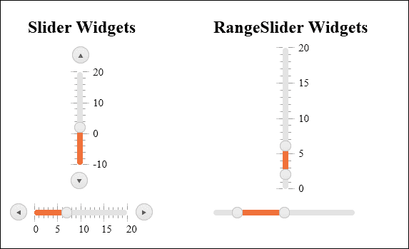

我们组织了页面上的内容，以便您可以看到不同的滑块小部件及其输出。左侧的两个滑块，一个垂直和一个水平，都是普通滑块小部件。右侧的两个滑块，一个垂直和一个水平，都是范围滑块小部件。我还调整了它们各自的属性，以便在演示中显示独特的选项。我们将在本章的其余部分中介绍这些选项。

# 使用 MVC 扩展方法的基本实现

以下代码示例说明了如何使用 ASP.NET MVC 扩展方法实例化这些相同的滑块。我只包括了实际的滑块小部件，而没有包含完整的 HTML 页面。

```js
<div id="sliders">
    <h2 id="slidersLabel">Slider Widgets</h2>
    @(Html.Kendo().Slider().Name("verticalSlider")
        .HtmlAttributes(new { id = "verticalSlider" })
        .Min(-10)
        .Max(20)
        .Orientation(SliderOrientation.Vertical)
        .Value(5)
        .SmallStep(2)
        .LargeStep(10)
        .TickPlacement(SliderTickPlacement.None)
        .Tooltip(tt => 
            tt.Format("{0}")))
    @(Html.Kendo().Slider().Name("horizontalSlider")
        .HtmlAttributes(new { id = "horizontalSlider" })
        .Min(0)
        .Max(20)
        .Orientation(SliderOrientation.Horizontal)
        .Value(7)
        .SmallStep(1)
        .LargeStep(5)
        .TickPlacement(SliderTickPlacement.Both))
</div>
<div id="rangeSliders">
    <h2 id="rangeSlidersLabel">RangeSlider Widgets</h2>
    @(Html.Kendo().RangeSlider().Name("verticalRangeSlider")
        .HtmlAttributes(new { id = "verticalRangeSlider" })
        .Min(0)
        .Max(20)
        .Orientation(SliderOrientation.Vertical)
        .Values(new double[] { 2, 6 })
        .SmallStep(1))
    @(Html.Kendo().RangeSlider().Name("horizontalRangeSlider")
        .HtmlAttributes(new { id = "horizontalRangeSlider" })
        .Min(0)
        .Max(30)
        .Orientation(SliderOrientation.Horizontal)
        .Values(new double[] { 5, 15 })
        .SmallStep(1)
        .LargeStep(5)
        .TickPlacement(SliderTickPlacement.Both))
</div>
```

正如上面正常的 JavaScript 和 HTML 示例一样，这些 MVC 扩展生成的输出是相同的。所有四个滑块都带有相同的选项和配置，并且具有相同的行为。


# 使用工具提示和弹出文本

滑块小部件向用户提供了几个视觉提示，以指示它们的值和控制功能。有工具提示或悬停效果，指示滑块末尾的按钮将执行的操作。这些工具提示始终存在，不需要任何额外的配置或代码，尽管可以使用 API 进行自定义。以下截图显示了出现在**增加**按钮上的工具提示文本：

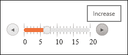

以下截图显示了出现在**减少**按钮上的工具提示文本：

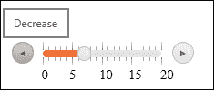

如果存在，还有工具提示标签指示刻度值，以及指示如何通过鼠标拖动与滑块控件交互。以下截图显示了代表数字**18**的刻度上的工具提示文本：

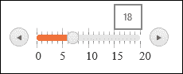

以下截图显示了拖动手柄上的工具提示文本：

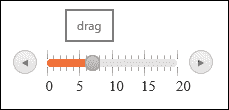

最后，当用户拖动范围滑块小部件的控制时，页面将显示一个标签，指示当前选定的范围。以下截图显示了所选范围内的工具提示文本，在这种情况下，显示手柄位于**4**和**15**：

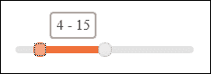

## 学习键盘控制

还要注意，当滑块小部件在页面上获得焦点时，可以使用键盘箭头按钮和*Page Up*和*Page Down*按钮来操纵滑块控件。按下向上或向下的箭头按钮将增加或减少滑块的值，该值包含在`smallStep`属性中。按下*Page Up*或*Page Down*将增加或减少滑块的值，该值包含在`largeStep`属性中。

这些属性，`smallStep`和`largeStep`，可以在 JavaScript 中实例化滑块小部件时设置，正如我们在之前的示例代码中所看到的：

```js
$("#verticalSlider").kendoSlider({
  min: -10,
  max: 20,
  orientation: "vertical",
  smallStep: 2,
  largeStep: 10,
  tickPlacement: "both"
});
```

数字不必是偶数，可以是任何对您的应用程序有意义的整数增量。

# 自定义滑块小部件的用户界面

滑块小部件的许多属性都可以用来自定义用户在网页上如何与之交互。显示在工具提示和刻度标记标签中的文本可以自定义，以显示更符合您页面需求的文本。您还可以自定义滑块的朝向及其默认值。

## 工具提示自定义

滑块小部件的`tooltip`属性可以通过自定义格式或自定义模板进行自定义，如果不需要，也可以完全禁用。例如，假设您的滑块小部件旨在让用户选择度数（例如在温度计上）。您可以自定义工具提示的格式以反映这种独特的格式。您还会看到，当更改工具提示的格式时，数据标签的格式也会自动更改以匹配它：

```js
$("#verticalSlider").kendoSlider({
  min: -10,
  max: 20,
  orientation: "vertical",
  smallStep: 2,
  largeStep: 10,
  tickPlacement: "both",
  tooltip: {
    format: "{0}"
  }
});
```

默认格式是`"{0}"`，因此在此之后添加度数符号，它将正确地显示在页面上：

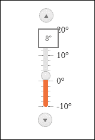

注意标签和工具提示都更改以匹配新的格式。还要注意，我使用未 HTML 编码的度数符号添加了格式，Kendo UI 系统为我处理了适当的编码。

配置`tooltip`属性的完整选项在此处显示：

```js
// options for a kendoSlider
tooltip: {
  enabled: true,  // enable tooltips or not
  format: "{0}",  // format string for tooltips
  template:{
    value: "..."  // template value for tooltips
    }
  }
}
...
// options for a kendoRangeSlider
tooltip: {
  enabled: true,  // enabled or not
  format: "{0}",  // format string for tooltips
  template:{
    selectionStart: "...",  // template value for start range
          selectionEnd: "..."  // template value for end range
    }
  }
}
```

你不应该同时使用格式和模板，因为这两个属性都是为了自定义提示框的显示而设计的。模板，如你在前面的章节中看到的，需要遵循正常的 Kendo 模板语法，并且可以用来为你的滑块控件创建高度定制的提示框。

### 使用 MVC 扩展方法自定义提示框选项

这就是使用 ASP.NET MVC 扩展方法配置的提示框的外观。

```js
...
.Tooltip(tt => 
  tt.Enabled(true)
  .Format("{0}")
  .Tempalte("template would go here")) @* misspelled in the Kendo code *@
```

记住，就像在 JavaScript 中一样，你不会同时设置格式和模板。另外，请注意，Kendo 库拼写了一个单词，它将 "tempalte" 错误地拼写为 "template"。务必在此处检查你的代码，以防 Telerik 已经修复了拼写错误。

## 自定义默认值

滑块小部件可以被配置为以特定的默认值开始。对于一个普通的 Kendo 滑块小部件，这以输入 HTML 元素的 `value` 属性或在此处所示的 Kendo 滑块小部件的 JavaScript 初始化形式出现：

```js
<input id="sliderId" value="4" />

... // or

$("#sliderId").kendoSlider({
  value: 4,
  ...
}
```

这两种方法中的任何一种都将滑块小部件的初始值或默认值设置为数字 `4`。

对于 Kendo 范围滑块，你需要设置范围的两个数字，因此你需要使用不同的属性 `selectionStart` 和 `selectionEnd` 或设置 HTML 中两个输入的值属性：

```js
<div id="rangeSliderId">
  <input value="2" />
  <input value="8" />
</div>

... // or

$("#rangeSliderId").kendoRangeSlider({
  selectionStart: 2,
  selectionEnd: 8
  ...
}
```

这两种方法都将选择范围的开始设置为 `2`，并将选择范围的结束设置为 `8`。

### 自定义刻度放置

滑块小部件上的刻度和数据标签也可以通过选择四种支持的显示选项之一来自定义：`topLeft`、`bottomRight`、`both` 和 `none`。这些是通过名为 `tickPlacement` 的配置属性设置的。

```js
$("#sliderId").kendoSlider({
  tickPlacement: "topLeft"
  ...
});
```

#### 在左上角放置刻度

`topLeft` 刻度放置选项将在垂直滑块的左侧或水平滑块的上侧放置刻度。

```js
$("#sliderId").kendoSlider({
  tickPlacement: "topLeft"
  ...
});
```

这里是输出：

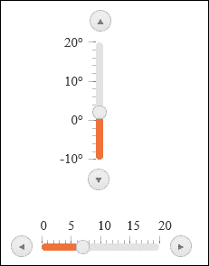

#### 在右下角放置刻度

`bottomRight` 刻度放置选项将在垂直滑块的右侧或水平滑块的底部放置刻度：

```js
$("#sliderId").kendoSlider({
  tickPlacement: "bottomRight"
  ...
});
```

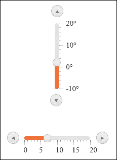

#### 在两侧放置刻度

`both` 刻度放置选项将在滑块的两侧放置刻度：

```js
$("#sliderId").kendoSlider({
  tickPlacement: "both"
  ...
});
```

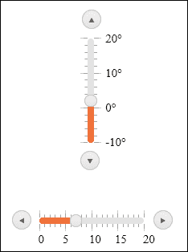

#### 完全移除刻度

`none` 刻度放置选项将从滑块中移除所有刻度：

```js
$("#sliderId").kendoSlider({
  tickPlacement: "none"
  ...
});
```

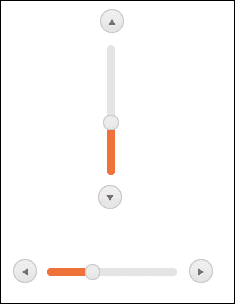

### 自定义滑块方向

你已经看到了滑块小部件的两个方向——水平和垂直，但这里简要看看启用这两个选项所需的代码：

```js
$(function(){
  orientation: "vertical"  // "horizontal" or "vertical"
  ...
}
```

### 注意

如果你没有设置方向，则默认方向将是水平。

# 学习 API 方法

与滑动组件交互时，你必须像往常一样通过 `data()` 方法引用 JavaScript 对象：

```js
// Kendo Slider Widget
var slider = $("#sliderId").data("kendoSlider");

// Kendo RangeSlider Widget
var rangeSlider = $("#rangeSliderId").data("kendoRangeSlider");
```

## 启用和禁用方法

滑动组件支持通过 `enable()` 和 `disable()` 方法启用和禁用网页中的控件。假设你通过 JavaScript 正确引用了对象，这两个滑动组件和范围滑动组件的语法是相同的。

```js
// get a reference to the slider
var slider = $("sliderId").data("kendoSlider");

// disable a slider
slider.disable();

// enable a slider
slider.enable();
```

禁用的滑动组件在网页上显示为部分透明或灰色。在以下屏幕截图中，左侧的滑动条是禁用的，右侧的滑动条是启用的：

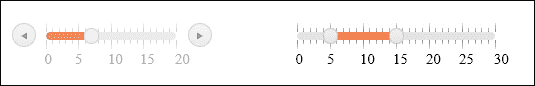

## 使用值

滑动组件的值可以通过 JavaScript API 设置和检索。由于它们在内部使用不同数量的值，因此滑动组件和范围滑动组件的语法不同。

### 使用 Kendo 滑动组件的值

设置和检索 Kendo 滑动组件的值很简单，因为它只包含一个值，如下所示：

```js
// get a reference to the slider
var slider = $("#sliderId").data("kendoSlider");

// set the value of the slider to 7
slider.value(7);

// get the value of the slider
var sliderValue = slider.value(); // returns a number
```

### 使用 Kendo 范围滑动组件的值

当设置或检索范围滑动组件的值时，你必须使用 JavaScript 数组进行通信，以便可以同时持有滑动对象中的两个值。

```js
// get a reference to the slider
var rangeSlider = $("#rangeSliderId").data("kendoRangeSlider");

// set the values for the range slider to 2 and 8
rangeSlider.value([2,8]);

// get the values from the range slider
var sliderValues = rangeSlider.value(); // returns an object array
```

# 事件钩子

就像其他 Kendo UI 组件一样，事件处理器可以在对象实例化时绑定，或者稍后通过 JavaScript `bind()` 方法调用。以下示例将仅展示实例化代码。

## 使用变化事件

当用户通过点击箭头、使用鼠标移动滑动条或使用键盘控件更改滑动条的值时，滑动组件将触发 `change` 事件。

### Kendo 滑动组件的变化事件

Kendo 滑动组件的 `change` 事件可以像以下那样绑定和使用：

```js
$("#sliderId").kendoSlider({
  change: changeHandler,
  ...
});

...

function changeHandler (e){
  alert(e.value);  // e.value contains the new value of the slider
}
```

`e.value` 属性将包含滑动组件的新值，这样你就可以在 JavaScript 代码中正确地响应事件。

### Kendo 范围滑动组件的变化事件

Kendo 范围滑动组件的 `change` 事件可以像以下代码片段所示那样绑定。它与滑动组件的 `change` 事件不同，因为它将数组传递给事件处理器而不是单个值。

```js
$("#rangeSliderId").kendoRangeSlider({
  change: changeHandler,
  ...
});

...

fuction changeHandler (e){
  alert(e.value.toString());  // e.value is an array of the new range values
}
```

## 滑动事件

`slide` 事件在语法上与 `change` 事件相同，但它仅在用户使用鼠标移动滑动条时触发，它不会对键盘事件或按钮点击触发。前面的 `change` 事件示例也适用于 `slide` 事件。

```js
$("#sliderId").kendoSlider({
  slide: changeHandler,
  ...
});
```

## 使用 MVC 扩展方法处理变化和滑动事件

这就是通过使用 ASP.NET MVC 扩展方法来连接事件处理器的方式。请注意，输出与之前概述的相同；这只是为了执行以下代码所需的语法；有关更多信息，请参阅前面的部分。

```js
.Events(events => events
  .Slide("slideHandler")
  .Change("changeHandler"))
```

# 摘要

Kendo UI 滑块和 Kendo UI 范围滑块小部件是收集网页中输入元素的数字的非常实用的工具。当收集必须落在指定范围内的数字时，这些小部件比向用户返回关于数字无效的错误消息要友好得多。我建议在适当的地方使用它们，以使您的网站对用户来说更加有趣。

在下一章中，您将了解 Splitter 和 TreeView 小部件，这些小部件允许您将可调整大小的动态内容加载到您的页面中，并在树形显示中组织层次内容。这些小部件将帮助您构建强大的页面，可以动态处理和加载内容，并以有组织的模式显示内容。
