# 第十章。上传和窗口小部件

现代网络应用已经发展到文件上传和对话框已经从简单的、不吸引人的 HTML 元素发展成交互式和可定制的控件。然而，这种强大的功能并非免费提供；它需要编写良好的 JavaScript 和 CSS 样式。Kendo UI Web 框架提供了预构建的控件，让您几乎无需努力就能获得这种功能。本章将探讨这些控件并说明它们的使用。

# 上传文件

文件上传在网页中一直是一个笨拙的元素。上传多个文件的经验更糟糕，通常需要多个 HTML 上传元素，这迫使用户为每个文件点击一个单独的按钮。Kendo UI 框架提供了一个专门的 Upload 小部件，它帮助用户和开发者在这个过程中。用户不再需要为每个文件点击按钮，他们只需将所需数量的文件拖放到网页上，文件就会自动上传，并在后台异步上传。同样，开发者也可以编程以同时接收多个文件，并通过 JavaScript 接收文件上传，而不会使网页变慢和失去响应。

## 学习 Upload 小部件

由于 Upload 小部件旨在将一个或多个文件的 内容上传到服务器，因此即使是最基本的此小部件实现也需要一个可以接受文件上传的服务器。您可以通过使用您的 ASP.NET MVC 项目来实现这一点。为了接收文件上传，您需要创建一个接受`IEnumerable<HttpPostedFileBase>`作为输入参数的动作方法。以下是如何服务器从 Kendo UI Upload 小部件接收文件的方式：

```js
// Action method to receive uploaded files
[HttpPost]  // This attribute guarantees that only 
            // Form POST requests can call this action method
public ActionResult Submit(IEnumerable<HttpPostedFileBase> files)
{
  if (files != null)
  {
    // ... 
    // Process the files and save them
    // ...
  }

  return View();
}
```

在此服务器代码到位以接收上传的文件后，您现在可以构建一个页面，该页面将托管 Kendo UI Upload 小部件，用户将从中选择要上传的文件。以下代码示例显示了一个已配置为 Kendo UI Upload 小部件使用的 HTML 表单。请注意，该表单有两个必需的输入元素：一个文件输入和一个提交输入。这些是您在任何上传文件的表单中都应该期望的正常输入元素，但在此情况下，还有一个`script`元素，它在文件上传元素上创建了一个特殊的 Kendo UI Upload 小部件。

这里是 index 视图的 HTML：

```js
<form method="post" action="submit" style="width:45%">
  <div>
    <input name="files" id="files" type="file" />  // HTML file upload
    <p>
      <input type="submit" value="Submit" class="k-button" /> // Submit button
    </p>
  </div>
</form>
<script>
  $(document).ready(function() {
    $("#files").kendoUpload();  // Create the Kendo Upload Widget
  });
</script>
```

以下是如何在真实网页上显示此标记。请注意，文件输入元素显示为按钮，而不是您在默认 HTML 中看到的正常样式。

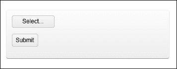

在所有这些准备就绪后，您可以点击**选择**按钮来选择要上传到服务器的文件。一旦您选择了该文件并点击**确定**，服务器将接收该文件，并执行您在服务器端代码中设置的任何处理指令。

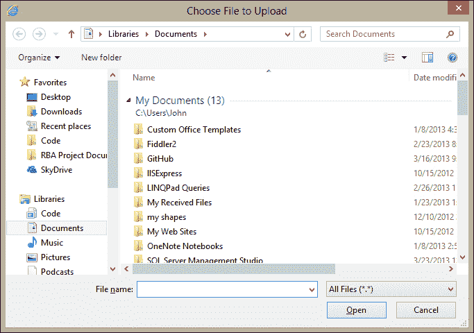

上述截图显示了将在用户的计算机上出现的文件选择对话框，以便用户可以选择要上传的文件。

通过在接收上传文件的 `action` 方法代码中添加断点，您可以看到 ASP.NET MVC 如何使用 Visual Studio 2012 解释已提交的数据。以下是一个已上传文件及其显示上传文件信息的对象的截图。在这种情况下，我上传了一个名为 `Reflection.linq` 的小文本文件。您可以看到，Web 服务器已成功接收文件，并且能够按您所需的方式处理它。此截图显示了处于调试模式的 Visual Studio，它允许我们查看对象内部状态。此外，在此截图中，我们可以看到 `IEnumerable<HttoPostedFileBase>` 中的第一个对象是一个具有 `FileName` 属性值为 `Reflection.linq` 的文件：

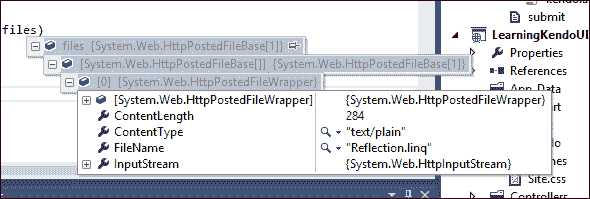

## 启用异步上传

尽管我们刚才看到的上传体验已经比传统的 HTML 上传元素更优越，但体验可以变得更好。JavaScript 现在能够异步发送文件上传，或在后台发送，这意味着用户不需要提交导致页面重新加载的表单。换句话说，这个过程可以运行得更快、更顺畅，并且需要更少的参与。要启用此功能，您只需将 `async` 配置属性添加到 Kendo Upload 小部件实例化块中。以下代码示例显示了如何操作：

```js
<form method="post" action="submit" style="width:45%">
  <div>
    <input name="files" id="files" type="file" />
    <p>
      <input type="submit" value="Submit" class="k-button" />
    </p>
  </div>
</form>
<script>
  $(document).ready(function() {
    $("#files").kendoUpload(
    {
      async: {       // async configuration
        saveUrl: "save",   // the url to save a file is '/save'
        removeUrl: "remove", // the url to remove a file is '/remove'
        autoUpload: true   // automatically upload files once selected
      }
    }
    );
  });
</script>
```

此功能还需要对服务器进行一些更改。尽管大多数代码与早期示例相同，但此动作方法返回 `ContentResult` 而不是 `ActionResult`，因为此动作方法不会将新的网页发送回浏览器。相反，它发送回一个字符串结果，通知网页中的 JavaScript 文件上传（们）已成功完成。如果文件上传（们）出现错误，服务器将发送一个错误代码，例如代码 `500` 内部服务器错误。

```js
public ContentResult Save(IEnumerable<HttpPostedFileBase> files)
{
  // The Name of the Upload component is "files"
  if (files != null)
  {
    foreach (var file in files)
    {
      // ...
      // Process the files and save them...
      // ...
  }

  // Return an empty string to signify success
  return Content("");
}
```

## 同时上传多个文件

默认情况下，Kendo UI 上传小部件允许同时上传多个文件，但您可以在以下代码示例中明确指定此设置：

```js
<script>
  $(document).ready(function() {
    $("#files").kendoUpload(
      {
        multiple: true
      }
    );
  });
</script>
```

要上传多个文件，请在上传窗口中点击文件时按住 *Ctrl* 键。查看以下截图，以显示一次性选中的多个文件。当您点击 **OK** 按钮，所有文件将一起上传到服务器，并作为一个单一事务进行处理。不再需要多个按钮和对话框！

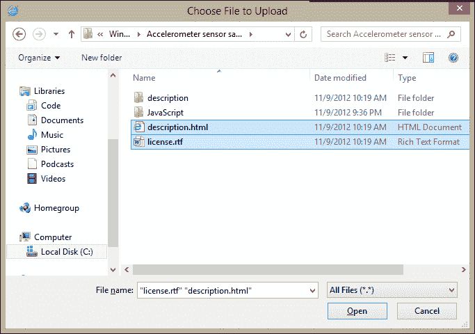

## 删除已上传的文件

当使用 Kendo UI 上传小部件上传文件时，你会在页面的文件上传区域看到文件名列表。如果你使用的是标准上传行为，而不是`async`配置，页面上列出的文件尚未上传到服务器。相反，它们的文件名已被存储，以备你点击页面的**提交**按钮时附加到 HTML 上。以下截图显示了已标记为上传的文件列表；它们尚未发送到服务器：

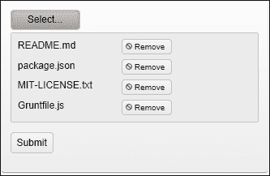

由于这些文件尚未上传，你可以点击任何这些文件旁边的**移除**按钮来从列表中移除它们，而不会产生任何副作用。然而，如果你使用的是异步文件上传功能，文件将立即上传到服务器，并且无法在完全上传之前移除它们。正如你在下一个截图中所见，这个文件已经异步加载到服务器，并且已经被服务器代码保存到某个地方：

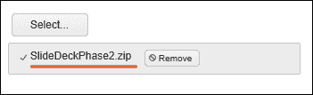

仍然有方法可以移除文件，但这需要在服务器上添加一些额外的代码来实现。具体来说，为了移除异步自动上传的文件，需要另一个控制器动作方法。这个动作方法接收一个包含一个或多个文件名的列表，并将它们从服务器上删除，因为这些文件已经上传并保存。当页面上点击**移除**按钮时，Kendo UI 上传小部件会自动调用此方法。

```js
public ContentResult Remove(string[] fileNames)
{
  // The parameter of the Remove action must be called "fileNames"

  if (fileNames != null)
  {
    foreach (var fullName in fileNames)
    {
      // ...
      // delete the files
      // ...
    }
  }

  // Return an empty string to signify success
  return Content("");
}
```

## 跟踪上传进度

当文件正在异步上传时，你可以通过文件名下方的进度条和一个旋转的点状圈来查看上传进度，这表明操作仍在进行中。以下截图显示了正在进行的文件上传：

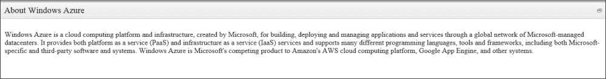

## 取消正在进行的更新

当文件正在异步上传时，进度条旁边会出现一个按钮，用于取消上传。如果你点击此按钮，它将尝试取消正在进行的异步上传。你应该注意，取消异步上传并不总是成功的。大多数文件上传都非常快，你很可能无法及时取消。此外，即使你能够及时点击**取消**按钮，后台线程在响应取消之前，这个过程仍会持续一段时间。这只是为了说明，取消文件上传可能有效，但也可能无效，并且很难预测结果。

## 使用文件拖放

如果您正在使用异步文件上传功能，还有一个您可以利用的特殊功能。由于异步文件上传通过 JavaScript 立即处理文件，因此网页可以启用一些特殊行为，例如使用鼠标将文件拖放到页面上。此功能默认启用，因此您无需进一步配置即可利用它。您只需从您的计算机中拖动一个文件并将其拖放到 Kendo UI Upload 小部件所在的屏幕上。当您将文件拖动到页面上时，您将看到页面通过显示一些文本来响应用户，指示用户将文件放在何处。当文件放下时，上传立即开始。

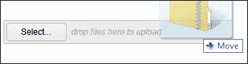

# Kendo UI Window 小部件

JavaScript 长期以来一直支持可以发送消息到网页用户的弹出窗口。这些消息可以是用户可以看到的简单文本，可以是请求权限的确认框，有时甚至可以提示用户输入一些信息。当然，这些弹出消息有两个大问题。首先，它们不够吸引人，看起来像系统消息而不是网站的一部分。其次，它们在过去被过度使用和滥用，以至于许多用户完全禁用了它们，或者养成避免使用它们的习惯，因为它们最多是令人烦恼的，最坏的情况是潜在的安全风险。

现代网络程序员已经找到了这个问题的解决方案。已经创建了可以创建不同类型弹出消息的 JavaScript 框架。他们没有使用 JavaScript 过去使用的实际系统提示，而是找到了一种方法来显示悬停的 HTML `div` 元素，这些元素根本不是弹出消息，而是可以按需隐藏或显示的页面真实部分。Kendo UI Window 小部件是构建这些漂亮的悬停页面元素的工具。

由于这项技术的核心概念是隐藏和显示特定的 HTML `div` 元素，因此此小部件的基本用法就是直接在 `div` 标签上创建一个 Kendo UI Window 小部件。这将使其在准备显示之前隐藏，一旦准备显示，它将以悬停元素的形式动画化显示在页面的其余部分上方。以下代码示例提供了一个基本示例：

```js
<div id="window">
  <p>Windows Azure is a cloud computing platform
  and infrastructure, created by Microsoft, for building, 
  deploying and managing applications and services through
  a global network of Microsoft-managed datacenters. 
  It provides both platform as a service (PaaS) and 
  infrastructure as a service (IaaS) services and supports 
  many different programming languages, tools and frameworks, 
  including both Microsoft-specific and third-party software 
  and systems. Windows Azure is Microsoft's competing product 
  to Amazon's AWS cloud computing platform, Google App Engine,
  and other systems.</p>
</div>
<button id="windowButton">See Details</button>
<script>
  $(document).ready(function() {
    $("#window").kendoWindow({
      width: "600px",
      title: "About Windows Azure",
      close: onClose
    });

    var onClose = function(){
      $("#windowButton").show();
    };

    $("#windowButton").on("click", function(){
      $("#window").data("kendoWindow").open();
      $("#windowButton").hide();
    });
  });
</script>
```

您可以看到 Kendo UI Window 小部件是如何在具有 `id` 值为 `window` 的 HTML 元素上创建的。ID 为 `windowButton` 的按钮被连接到打开 Window 小部件，事件处理程序在 Window 小部件打开时隐藏此按钮，并在 Window 小部件关闭时再次显示它。

您的 `div` 中的标记将是窗口小部件出现时的标记。这意味着您的所有样式和布局都将以与页面其余部分相同的方式正确显示；没有断开连接。以下是代码在页面上呈现的样子。请注意，Kendo UI 窗口小部件的内容尚未显示，必须首先通过事件激活；在这种情况下，该事件是点击**显示窗口**按钮：

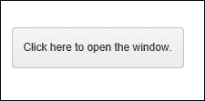

这是激活时的 Kendo UI 窗口小部件的外观：


## 自定义窗口操作

Kendo UI 窗口小部件为其创建的所有窗口添加了一些默认功能。窗口右上角有一个按钮，用作关闭按钮，有一个标题栏，用于向用户清楚地说明窗口内容的目的，如果用户用鼠标点击其中一个边缘并拖动它，窗口可调整大小。窗口小部件右上角出现的按钮可以针对您的网页和特定需求进行自定义。

如您所见，默认情况下唯一出现的按钮是关闭按钮。然而，还有三个其他按钮可以非常容易地添加：`刷新`、`最小化`和`最大化`。这些按钮已经附加了默认功能。`刷新`按钮将在内容从远程源加载到窗口小部件内部时刷新窗口小部件中的内容。`最小化`按钮将窗口小部件的大小缩小到仅标题栏。`最大化`按钮将窗口小部件放大，使其占据整个网页浏览器的屏幕大小。点击`最小化`或`最大化`按钮后，将出现一个新按钮，专门用于将窗口小部件恢复到其原始位置和大小。以下是您需要在窗口小部件中启用这些操作的代码：

```js
<script>
  $(document).ready(function() {
    $("#window").kendoWindow({
      width: "600px",
      title: "About Windows Azure",
      actions: ["Minimize", "Maximize", "Close"],
      close: onClose
    });

    var onClose = function(){
      $("#windowButton").show();
    };

    $("#windowButton").on("click", function(){
      $("#window").data("kendoWindow").open();
      $("#windowButton").hide();
    });
  });
</script>
```

启用这些操作后，窗口小部件将呈现如下：

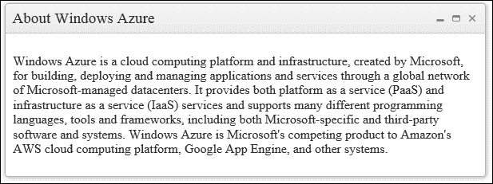

这是一个最小化的窗口小部件，请注意，`最小化`按钮已更改为将窗口恢复到原始大小和形状的按钮：

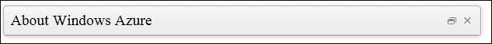

下一个屏幕截图显示了最大化的窗口小部件。请注意，`最大化`按钮已更改为将窗口恢复到原始大小和形状的按钮：


## 使用 AJAX 加载内容

到目前为止，你所看到的所有示例都在窗口小部件中显示了本地内容，或者是在网页中已经嵌入的内容。这在有限的场景中才有用。当窗口小部件可以从外部源加载内容时，例如在您的整个站点中的其他网页，窗口小部件就更加灵活了。为了实现这一点，您需要配置窗口小部件的内容源。您可以在以下代码示例中看到一个示例：

```js
<script>
  $(document).ready(function() {
    $("#window").kendoWindow({
      width: "600px",
      title: "Rams's Ten Principles of Good Design",
      content: "OtherPage.html",
      close: onClose
    });

    var onClose = function(){
      $("#windowButton").show();
    };

    $("#windowButton").on("click", function(){
      $("#window").data("kendoWindow").open();
      $("#windowButton").hide();
    });
  });
</script>
```

启用此功能后，窗口小部件将立即在激活时加载并显示此外部内容。这还有一个额外的优点，即加载的内容只有在必要时才会下载，因此页面将加载得更快。以下是一个以这种方式加载外部内容的窗口小部件示例：

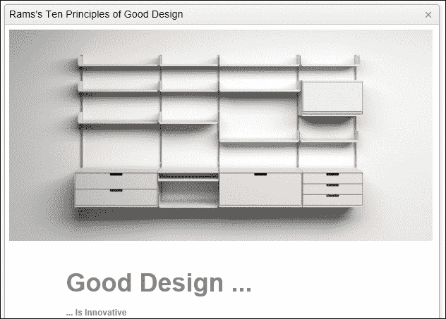

## 使用动画效果

当窗口小部件在页面上被激活时，它会以一些令人愉快的效果动画显示在屏幕上。默认情况下，它将使用缩放效果，使窗口小部件看起来像是从一个非常小的对象缩放到全尺寸。其他可用的效果是切换效果、展开效果，以及选择窗口小部件动画是否应该以半透明开始。以下代码示例显示了默认配置的动画效果：

### 注意

注意，这里没有包含特殊的动画配置。要运行默认的动画，唯一的方法是在设置中省略动画配置元素。

```js
<script>
  $(document).ready(function() {
    $("#window").kendoWindow({
      width: "600px",
      title: "About Alvar Aalto"
    }
      close: onClose
    });

    var onClose = function(){
      $("#windowButton").show();
    };

    $("#windowButton").on("click", function(){
      $("#window").data("kendoWindow").open();
      $("#windowButton").hide();
    });
  });
</script>
```

要启用切换动画，修改代码使其看起来像以下代码示例。切换动画实际上是缺少特殊的动画，因此窗口小部件会立即出现或消失，而不是通过图形过渡。

```js
<script>
  $(document).ready(function() {
    $("#window").kendoWindow({
      width: "600px",
      title: "About Alvar Aalto",
      animation: {
    open: {
      effects: ""
    },
    close: {
      effects: ""
    }
    }
      close: onClose
    });

    var onClose = function(){
      $("#windowButton").show();
    };

    $("#windowButton").on("click", function(){
      $("#window").data("kendoWindow").open();
      $("#windowButton").hide();
    });
  });
</script>
```

要启用展开动画，修改代码使其看起来像以下代码示例。`reverse`配置属性用于反转`close`效果的动画。

```js
<script>
  $(document).ready(function() {
    $("#window").kendoWindow({
      width: "600px",
      title: "About Alvar Aalto",
      animation: {
    open: {
      effects: "expand:vertical"
    },
    close: {
      effects: "expand:vertical",
      reverse: true
    }
    }
      close: onClose
    });

    var onClose = function(){
      $("#windowButton").show();
    };

    $("#windowButton").on("click", function(){
      $("#window").data("kendoWindow").open();
      $("#windowButton").hide();
    });
  });
</script>
```

透明度效果可以与这些动画效果中的任何一个一起使用，并且可以单独启用或禁用。以下代码示例显示了如何启用或禁用动画。与上一个示例的唯一区别是`effects`属性值末尾的额外字符串值`fadeIn`。

```js
<script>
  $(document).ready(function() {
    $("#window").kendoWindow({
      width: "600px",
      title: "About Alvar Aalto",
      animation: {
    open: {
      effects: "expand:vertical fadeIn"
    },
    close: {
      effects: "expand:vertical fadeIn",
      reverse: true
    }
    }
      close: onClose
    });

    var onClose = function(){
      $("#windowButton").show();
    };

    $("#windowButton").on("click", function(){
      $("#window").data("kendoWindow").open();
      $("#windowButton").hide();
    });
  });
</script>
```

## 使用窗口小部件事件

Kendo UI 窗口小部件提供了一组事件，这些事件在响应各种用户事件时被触发。由于这些事件有很多，我将在这里列出它们，并对每个事件进行简要描述：

+   `Activate`：当窗口小部件打开后动画完成时，此事件被触发

+   `Close`：当窗口小部件关闭时，此事件被触发

+   `Deactivate`：当窗口小部件关闭后动画完成时，此事件被触发

+   `Dragend`：当用户使用鼠标完成拖动窗口小部件时，此事件被触发

+   `Dragstart`：当用户开始使用鼠标拖动窗口小部件时，此事件被触发

+   `错误`: 当一个窗口小部件在通过 AJAX 加载远程内容时遇到错误时，此事件被触发。

+   `打开`: 当窗口小部件打开时，此事件被触发。

+   `刷新`: 当窗口小部件中的远程内容从远程源刷新时，此事件被触发。

+   `调整大小`: 当用户使用鼠标调整窗口小部件大小时，此事件被触发。

## 使用窗口小部件 API 方法

API 方法允许我们在 JavaScript 代码中按需在窗口小部件上执行功能。以下是对调用 API 方法时我们有哪些选项的简要描述：

+   `居中`: 调用此方法将窗口小部件移动到屏幕中央。

+   `关闭`: 调用此方法关闭窗口小部件。

+   `内容`: 调用此方法要么在没有参数的情况下获取窗口小部件的当前内容，要么在提供新内容作为参数时设置窗口小部件的内容。

+   `最大化`: 调用此方法最大化窗口小部件。

+   `最小化`: 调用此方法最小化窗口小部件。

+   `打开`: 调用此方法将关闭的窗口小部件打开。

+   `刷新`: 调用此方法通过 AJAX 从其远程源刷新窗口小部件的内容。此方法仅适用于具有 AJAX 内容属性的窗口小部件对象。

+   `恢复`: 调用此方法将窗口小部件从最小化状态恢复到正常大小和位置。

+   `设置选项`: 调用此方法设置窗口小部件的配置选项。

+   `标题`: 调用此方法要么获取或设置窗口小部件的标题。

+   `置前`: 调用此方法将窗口小部件带到页面上的其他元素的前面。

+   `切换最大化`: 调用此方法要么最大化当前未最大化的窗口小部件，要么将已最大化的窗口小部件返回到其原始大小和位置。

# 摘要

在本章中，我们学习了如何使用窗口和上传小部件。这些小部件赋予你创建可扩展和交互式网页的能力，你的用户会欣赏这些。最重要的是，这些小部件为非常常见的网络开发问题提供了现成的解决方案，这样你就可以专注于你的代码而不是解决重复性问题。

在这本书中，我们看到了可用于开发强大网页的完整系列的 Kendo UI Web 工具。正如你在每一章中看到的那样，这些小部件非常易于使用，并提供了一系列配置选项，可以根据你的具体需求和情况进行定制。不仅如此，Telerik 还有一个活跃的开发者社区，可以通过网络论坛和博客以及必要时提供付费支持来协助实施细节。我希望你喜欢学习关于 Kendo UI Web 框架中可用的强大工具的知识。这些工具将降低交付丰富网页所需的总时间和精力投入，这是我们大多数人都会高兴的事情。
