# 第十一章. Web API 示例

我们在前几章中探讨的许多小部件在与更高级的服务器端代码搭配使用时最为有用。例如，许多 Web 应用程序使用数据库并处理文件。虽然前几章展示了使用这些小部件所需的客户端代码，如 HTML 和 JavaScript，但它们并没有关注许多实际应用所使用的 ASP.NET 服务器端 C# 代码。为了展示如何在这些场景中使用 Kendo UI 框架，本章将展示一些使用 Kendo UI 框架与 ASP.NET Web API 和 Entity Framework 一起使用的专业示例。

### 注意

如果你对 ASP.NET Web API 框架不熟悉，可以访问 [www.asp.net/web-api](http://www.asp.net/web-api) 了解一些优秀的示例、视频和教程。

# 熟悉 ASP.NET Web API

ASP.NET MVC 框架的最新版本 MVC 4 包含了名为 **Web API 控制器** 的新功能模板。这些控制器是专门的 HTTP 通信端点，允许创建 RESTful API 服务。RESTful API 服务是一种 HTTP 网络服务，允许客户端使用标准 HTTP 动词（`Get`、`Post`、`Put`、`Delete` 和 `Patch`）与服务器进行通信，以执行操作。

### 注意

传统上，ASP.NET 具有创建作为 SOAP 端点（而非 REST 端点）的 Web 服务的功能。SOAP Web 服务使用 XML 架构，在序列化和反序列化强类型对象方面非常出色，并且在生产系统中得到了广泛的应用。与 RESTful 服务相比，SOAP 服务非常冗长且脆弱，因为任何新功能的实现都需要更改架构。此外，JavaScript 的爆炸性增长使得 RESTful 服务对开发者更具吸引力，因为它们可以通过 HTML `script` 块和常见的 JavaScript 代码轻松访问。

RESTful Web 服务在互联网上变得越来越普遍。许多流行的基于 Web 的服务公开 RESTful API 以实现与移动应用、基于 Web 的仪表板和其他软件项目的集成。这种广泛的应用主要归因于 **JavaScript 对象表示法**（**JSON**）在序列化和反序列化对象方面的同样广泛的应用。JSON 使得任何 Web 客户端都能轻松解释来自任何 Web 服务器的数据，而无需专门的或专有的许可证或算法。

RESTful 网络请求非常简单，如果你不知道的话，你每天都在使用它们。每次你在网络浏览器中输入一个 URL，你就是在向该 URL 地址的服务器发出一个 HTTP GET 请求。同样，大多数包含表单的网页使用 HTTP POST 动词将数据发送回网络服务器以保存。这也许会让你回想起我们之前章节中的某些代码示例。你还记得在控制器的一些操作方法上看到过`[HttpGet]`和`[HttpPost]`属性吗？这些属性向 ASP.NET 指示，只有特定类型的 HTTP 动词（GET 或 POST）对该操作方法有效。当然，这确实有安全影响，但它实际上更有用，可以根据客户端随请求发送的 HTTP 动词来确定服务器应使用哪种方法。换句话说，一个控制器可以有五个不同的操作方法，每个方法有不同的 HTTP 动词属性，如下所示：

```js
[HttpGet]
public ActionResult Get(int objectId = 0)
{
  ...
}

[HttpPost]
public ActionResult Post(Object postedObject)
{
  ...
}

[HttpPut]
public ActionResult Put(Object objectToPut)
{
  ...
}

[HttpPatch]
public ActionResult Patch(Object objectToPatch)
{
  ...
}

[HttpDelete]
public ActionResult Delete(int objectId)
{
  ...
}
```

前述代码的问题在于它为页面的每个不同功能创建了单独的路由。如果这个页面可以通过路由`http://mysite.com/movies`访问，我们可以使用`http://mysite.com/movies/get/25`来查看特定电影的数据，但为了添加新电影或删除电影，我们必须使用完全不同的路由，例如`http://mysite.com/movies/put`。这可能对于一个用户交互不多的网站来说不是什么大问题，但对于试图从远程代码中创建访问 API 的程序的开发者来说，这是一个大问题。

ASP.NET MVC Web API 通过创建专门用于创建 RESTful 服务的特殊控制器来解决此问题。在一个标准的 MVC 控制器中，每个操作方法创建一个新的路由（或 URL），最终在视图中生成一些网页内容。然而，在一个 Web API 控制器中，每个操作方法为相同的路由（或 URL）指定一个单一的 HTTP 动词。换句话说，Web API 控制器只为单个 HTTP 端点提供服务；它只针对单个路由操作。对于 API 开发者来说，这是完美的。例如，单个 HTTP 端点`http://mysite.com/api/movies`可以适当地响应所有 HTTP 动词，而无需为每个操作使用不同的 URL。

在 API 控制器内部，每个 HTTP 动词都有一到多个操作方法来处理该特定类型的请求。控制器到路由的默认值是控制器的名称。因此，名为`MoviesController.cs`的控制器默认路由为`http://mysite.com/api/movies`。这就是路由的终点；现在，请求此端点之间的唯一区别在于请求包含的 HTTP 动词以及作为参数传递的哪些参数。以下是由 ASP.NET Web API 模板为 API 控制器生成的默认代码：

```js
// GET api/values
public IEnumerable<string> Get()
{
  return new string[] { "value1", "value2" };
}

// GET api/values/5
public string Get(int id)
{
  return "value";
}

// POST api/values
public void Post([FromBody]string value)
{
}

// PUT api/values/5
public void Put(int id, [FromBody]string value)
{
}

// DELETE api/values/5
public void Delete(int id)
{
}
```

注意到操作方法的名称是 HTTP 动词的名称。这不是偶然的，操作方法名称必须与 HTTP 动词名称匹配或以 HTTP 动词名称开头。因此，一个操作方法可以被称为`Get`，或者它可以被称为`GetMovie`。请注意，在这个控制器中，有两个不同的`Get`操作方法版本。就像在标准控制器中一样，只要每个方法的签名是唯一的，相同的操作方法可以多次列出。在这种情况下，它允许我们有一个不需要任何参数的标准`Get`方法，以及一个更专业的`Get`方法，该方法返回特定记录的信息。

### 注意

您可以访问[`www.asp.net/web-api/overview/web-api-routing-and-actions/routing-in-aspnet-web-api`](http://www.asp.net/web-api/overview/web-api-routing-and-actions/routing-in-aspnet-web-api)以了解 Web API 路由规则和命名约定的良好概述。

您还会注意到，这些操作方法上没有 HTTP 动词属性。对于 API 控制器，这些属性不是必需的。然而，代码示例中有一个新的属性。您可以在`Post`和`Put`操作方法的参数前看到它：`[FromBody]`。这个特殊属性用于帮助模型绑定器在 HTTP 请求体中定位参数。它并不总是必要的，例如，当您绑定一个模型绑定器可以清楚地看到由具有特定名称的特定属性组成的复杂对象时。然而，对于像本代码示例中的简单字符串值，它需要知道您打算将 HTTP 请求体绑定到那个输入参数。还有一个属性（`[FromUri]`）用来指示参数来自 URL。大多数情况下，这些参数将是不必要的，但它们可用于帮助解决模型绑定器无法自行解决的问题。如果您不熟悉它，那么进行一些研究是值得的。Web API 用于模型绑定的基本规则如下：

+   简单类型来自 URL（URI）

+   复杂类型来自请求体

简单类型包括所有.NET Framework 的原始类型，以及`DateTime`、`Decimal`、`Guid`、`String`和`TimeSpan`。对于每个操作方法，最多只能有一个参数可以读取请求体。如果您尝试用`[FromBody]`标记多个参数，您可能会遇到运行时错误或空值。

### 注意

您可以访问[`blogs.msdn.com/b/jmstall/archive/2012/04/16/how-webapi-does-parameter-binding.aspx`](http://blogs.msdn.com/b/jmstall/archive/2012/04/16/how-webapi-does-parameter-binding.aspx)以获取有关 Web API 参数绑定的更多信息。

关于 API 控制器，还有一个重要的概念需要理解，那就是它们不会像标准控制器那样返回视图。API 控制器不是为浏览器显示生成 HTML 标记，而是生成原始数据，这些数据旨在供专门的客户端代码，如 JavaScript，消费。这种数据格式是您不必担心的事情。注意，在前面的代码示例中，动作方法只是简单地返回字符串值，而没有使用我们在一些前面的章节中看到过的`Json()`方法。我们不需要告诉 API 控制器如何格式化其数据，因为它将在通信过程中与客户端自动协商正确的格式。最常用的格式是 JSON，但某些客户端可能更喜欢 XML 或其他 ASP.NET 框架知道如何序列化的数据类型。

### 注意

您可能想知道这种自动协商是如何工作的。以下是答案：它主要基于 API 调用期间客户端的`Accept`头。您甚至可以创建自己的内容类型来扩展 API 框架以适应定制场景。更多信息请参阅此页面：[`www.asp.net/web-api/overview/formats-and-model-binding/content-negotiation`](http://www.asp.net/web-api/overview/formats-and-model-binding/content-negotiation)。

由于 API 控制器不是设计用来渲染带有标记的网页，因此您需要创建与您习惯相同的常规控制器来处理您的网页。为了与 API 控制器交互，使用 JavaScript，尤其是 jQuery，通过特定的 HTTP 动词访问 API 端点以完成页面设计的任何任务是非常常见的。

# 熟悉 Entity Framework Code First

大多数应用程序使用数据库来存储信息。然而，大多数数据库存储信息的方式并不完全符合服务器端面向对象编程。这是一个非常普遍的问题，并催生了**对象关系映射**（**ORM**）系统领域。其中许多存在，但微软为.NET 框架创建了一个特定的系统，称为**Entity Framework**（**EF**）。它基本上是一个框架，旨在更容易编写将信息存储在数据库中的代码，同时仍然像面向对象系统一样运行。如果您已经下载了本章的示例内容，请现在打开`Chapter 11`解决方案以继续。否则，创建一个新的 ASP.NET MVC 4 项目，并在被询问时选择**Web API**模板。

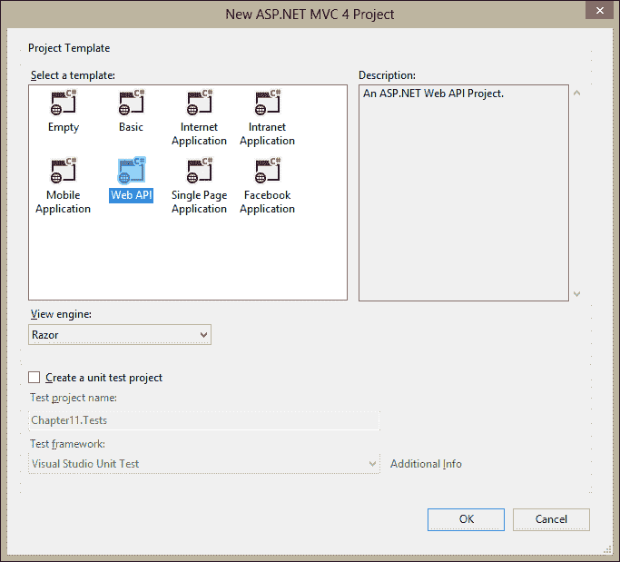

Entity Framework 的细节众多，这里没有足够的空间来探索它们。我们将通过一个基本的示例来展示如何利用 Entity Framework Code First 模型，以便我们可以在本章的示例中展示它。为了使用 Entity Framework，您必须首先通过 NuGet 将它安装到您的 Visual Studio 项目中。您可以通过在 Visual Studio 的解决方案资源管理器中右键单击项目并选择 **管理 NuGet 包…** 来这样做，如图所示：

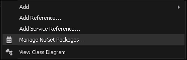

在下一屏，您应该确保您正在查看 **在线** 目录。在搜索框中输入文本 `Entity Framework`，当它在结果窗口中出现时选择 **安装**。一旦安装，它将显示一个绿色的勾选标记，表示它已准备好使用：

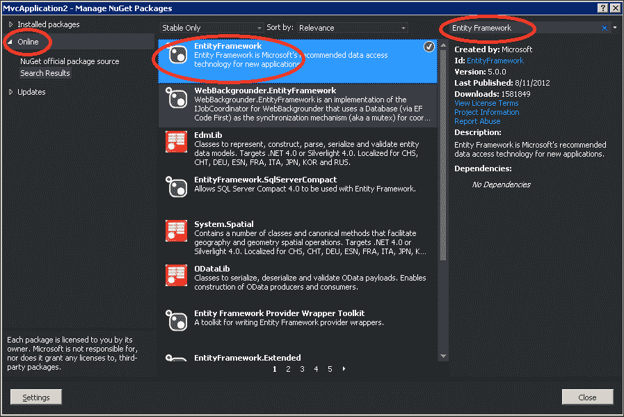

这将安装所有必要的 Entity Framework 组件到您的 Visual Studio 解决方案中。我们将使用 Entity Framework 的一个名为 **Code First** 的功能。这个功能允许我们在数据库甚至存在之前首先创建类，或实体。从这个模型中获得的最大好处是，它保证了数据库的设计和数据存储将符合我们的面向对象架构。

### 注意

如果您还没有这样做，现在下载本章的示例内容是个好时机。所有这些示例和文件都已经存在那里，所以您可以跟随带有工作代码的示例。

为了说明起见，我们将在 Visual Studio 项目的 `Models` 文件夹中创建我们的实体类。在 `Models` 文件夹中创建一个名为 `Movie.cs` 的类，如下所示：

```js
public class Movie
{
  public int Id { get; set; }
  public string Name { get; set; }
  public int ReleaseYear { get; set; }
  public int Rating { get; set; }
  public int Rank { get; set; }
}
```

Entity Framework 将从这个属性推断出 `Id` 属性应该在数据库内部成为主键。现在我们已经有了我们的模型，我们需要告诉 Entity Framework 我们想要创建一个包含它的数据库。在 `Models` 文件夹中创建另一个类，并将其命名为 `MoviesContext.cs`，如下所示：

```js
...
using System.Data.Entity;
...

public class MoviesContext : DbContext
{
  public DbSet<Movie> Movies { get; set; }
}
```

这段代码通知 Entity Framework 我们想要一个包含 `Movie` 实体 `DbSet` 的 `DbContext` 上下文。让我们继续添加一些电影到我们的数据库中，这样我们就可以在我们的示例中使用它们。为了开始，我们需要一个页面，我们可以输入电影数据，并且让网络服务器将数据保存到数据库中。

创建一个带有以下选项选择的 `MoviesController` 控制器；它将自动生成用于管理我们刚刚创建的 `Movie` 实体的基本操作方法和视图。

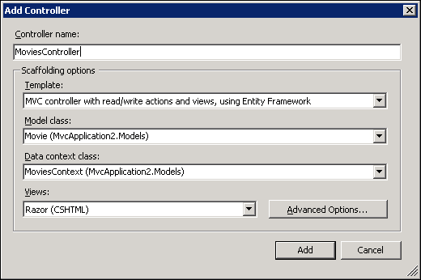

### 注意

如果您找不到 `Movie` 实体或 `MoviesContext` 类，请尝试构建您的项目并再次尝试。

现在转到`Movies/Index`页面并创建一些电影。第一次运行项目时，它可能非常慢。原因是 Entity Framework 正在后台根据你之前提供的模型和上下文动态创建你的数据库。在你看到网页的时候，数据库就已经启动并运行了。你可以在下面的屏幕截图中看到我是如何创建几个的。至少创建十个，以便在章节后面的示例中有一些数据。

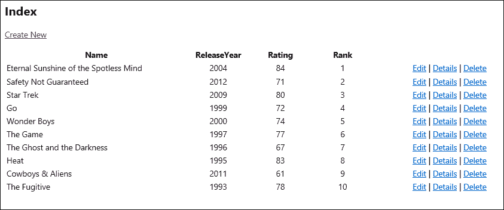

尽管还有更多关于 Entity Framework 的知识需要学习，但这个简短的例子已经带你从单个类到完全工作的数据库。我们将在这个章节的其余示例中使用这个电影数据库。如果你对 Entity Framework 不熟悉并且想了解更多，我建议检查我们刚刚用 Visual Studio 创建的`MoviesController.cs`类，看看它是如何创建默认操作的；然后你可以访问[www.msdn.com](http://www.msdn.com)获取该主题的官方文档。

# 熟悉 OData

ASP.NET Web API 框架通过称为**OData**的语法支持数据查询。OData 是一种与 HTTP URL 兼容的查询语言，因此它可以出现在 URL 查询字符串中。它为用于返回数据列表的 API 操作方法提供了两个非常强大的好处。首先，它自动将 OData 查询语言转换为 API 操作方法内部实际的数据查询。这非常强大，直到你真正看到它可能很难相信。基本上，它是一个免费的搜索引擎。其次，OData 功能允许查询在服务器上执行。这意味着服务器可以查询数据源以找到匹配的特定元素，然后将结果返回给客户端。客户端不需要查询整个数据集然后自行过滤。这是一个巨大的性能提升，同时也简化了客户端和服务器端的代码。

你可以通过四种方式为你的 API 控制器启用 OData 查询功能。每个都比前一个提供了更细粒度的控制。

+   通过`WebApiConfig.cs`全局启用查询支持

+   将`[Queryable]`属性添加到特定的 API 操作方法

+   从`ODataController`继承而不是`ApiController`

+   从`EntitySetController`继承而不是`ODataController`

第一个选项将全局启用任何具有`IQueryable`返回类型的`ApiController`操作方法的查询支持。要启用此功能，打开`App_Start`文件夹中的`WebApiConfig.cs`文件，取消注释带有`config.EnableQuerySupport()`的代码行：

```js
// Uncomment the following line of code to enable query support 
   for actions with an IQueryable or IQueryable<T> return type.
// To avoid processing unexpected or malicious queries, use the 
   validation settings on QueryableAttribute to validate 
   incoming queries.
// For more information, visit 
   http://go.microsoft.com/fwlink/?LinkId=279712.
config.EnableQuerySupport();
```

第二种方法将启用带有 `[Queryable]` 属性装饰的特定操作方法的查询支持。与前面的选项相比，它提供了更多的配置选择，因为 `[Queryable]` 属性有许多属性可以配置以微调其行为。带有此属性装饰的操作方法看起来如下：

```js
// GET api/values
[Queryable]
public IQueryable<string> Get()
{
  return new string[] { "value1", "value2" }.AsQueryable();
}
```

第三种方法涉及从 `ODataController` 继承您的控制器类而不是 `ApiController`。这将启用 Web API 提供的完整 OData 支持，并且还需要进行一些额外的配置，以便 OData 引擎理解它所公开的实体的 **实体数据模型**（**EDM**）。

```js
ODataModelBuilder modelBuilder = new ODataConventionModelBuilder();
modelBuilder.EntitySet<Movie>("Movies");
Microsoft.Data.Edm.IEdmModel model = modelBuilder.GetEdmModel();
config.Routes.MapODataRoute("ODataRoute", "OData", model);
```

上述代码需要在 Web 应用程序启动时运行，因此它应该放置在 `Global.asax` 或 `App_Start` 类之一中，例如 `WebApiConfig.cs`。它读取与 Entity Framework 相同类型的实体模型，并将其加载到 OData 路由中，以便 Web API 理解模型各部分之间的关系，主键是什么，等等。这使更高级的场景，如属性导航成为可能。有关此信息，您可以访问 [`www.asp.net/web-api/overview/odata-support-in-aspnet-web-api/getting-started-with-odata-in-web-api/create-a-read-only-odata-endpoint`](http://www.asp.net/web-api/overview/odata-support-in-aspnet-web-api/getting-started-with-odata-in-web-api/create-a-read-only-odata-endpoint) 了解介绍。

第四种方法与前面的方法类似，但它自动启用了 `ODataController` 类必须手动执行的更多 OData 功能。它仍然需要与上一个选项中的 `ODataModelBuilder` 类。上面列出的 URL 也涵盖了此主题的信息。

在本章的示例中，我们将使用 `[Queryable]` 属性来为特定的操作方法启用查询支持。我鼓励您自己更深入地探索这项技术，它是一个强大且可扩展的框架，可以为您的代码提供巨大的生产力提升。要了解更多关于 OData 的信息，您可以访问 [www.odata.org](http://www.odata.org)。

# 使用 DataSourceRequest 与 Kendo Grid

正如我们在第一章中看到的，Kendo Grid 小部件旨在允许丰富的功能，如分页、过滤和排序。我们之前看到，这可以通过客户端的 JavaScript 和 Kendo `DataSource` 对象来实现。然而，当与服务器端功能连接时，Grid 小部件的功能变得更加强大，以帮助驱动其功能。

Kendo UI Framework for ASP.NET MVC 包含一个特殊对象，用于帮助在标准 MVC 控制器中实现此功能。它不需要 Web API 或 OData，尽管如果您想手动配置 Kendo `DataSource`，则可以使用它们。在本例中，我们将学习如何使用 `DataSourceRequest` 对象以及它是如何帮助驱动 Kendo Grid 小部件的功能的。

首先，向之前创建的`MoviesController`类中添加一个新的操作方法。

```js
public ActionResult MoviesGrid([DataSourceRequest]DataSourceRequest request)
{
  return Json(
     db.Movies.ToDataSourceResult(request), JsonRequestBehavior.AllowGet);
}
```

您应立即注意到操作方法签名的特殊属性`[DataSourceRequest]`。此属性来自`Kendo.Mvc.Extensions`命名空间，因此您需要在控制器顶部的`using`语句中包含它。此属性对于 Kendo UI 框架正确理解网格小部件和服务器端操作方法之间的通信是必要的。同样重要的是，`[DataSourceRequest]`属性装饰了一个`DataSourceRequest`对象，并且从此操作方法返回的值通过名为`ToDataSourceResult(request)`的扩展方法传递。这些特殊方法驱动 Kendo 的数据绑定、排序、分页和过滤功能。

在此代码就绪后，向`KendoController`添加一个名为`Grid`的新操作方法，这将是用于视图的操作方法。

```js
public ActionResult Grid()
{
  return View();
}
```

为此方法创建一个视图，并在其中放置以下 Razor 代码：

```js
@using Kendo.Mvc.UI;

@{
    ViewBag.Title = "Grid";
}

@(Html.Kendo().Grid<Chapter11.Models.Movie>().Name("moviesGrid")
    .Columns(columns =>
        {
            columns.Bound(p => p.Name);
            columns.Bound(p => p.ReleaseYear);
            columns.Bound(p => p.Rating);
            columns.Bound(p => p.Rank);
        }
        )
    .Pageable()
    .Sortable()
    .Filterable()
    .DataSource(dataSource => dataSource
        .Ajax()
        .PageSize(5)
        .Read(read => read.Action("MoviesGrid", "Movies"))
    ))
```

如您之前所见，此`Html`辅助方法来自 Kendo UI 框架，在视图页面上生成一个网格小部件。我们已配置了列并启用了网格的`pageable`、`sortable`和`filterable`功能。对于此示例来说，重要的是我们已经将`DataSource`对象设置为指向我们之前设置的`Movies`控制器的`MoviesGrid`操作，该操作具有特殊的 Kendo 属性和对象。当我们运行我们的项目并导航到这个新视图时，我们得到一个如下所示的 Kendo 网格小部件，它具有工作分页按钮、过滤按钮和可排序的列标题：

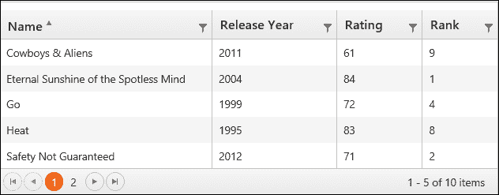

与第一章不同，*与数据交互：数据源、模板、TabStrip 和网格*，然而，这个网格小部件要求服务器计算排序顺序、页码和过滤后的结果。它是通过向服务器发送特殊的数据指令来完成的，这些指令由特殊的 Kendo 属性和对象解释。要查看这些数据指令，可以在网站运行时按*F12*键打开 Internet Explorer 开发者工具。在出现的工具栏中，点击**网络**标签，然后点击**开始捕获**。点击这些按钮后，点击网格功能之一，如页面箭头或列标题之一。你将在开发者工具栏中看到一些活动，这意味着网格正在通过 JavaScript AJAX 调用与服务器通信。双击列表中显示地址**/Movies/MoviesGrid**的第一项，如图所示：

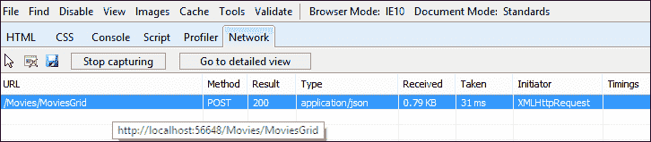

双击此项目将打开 HTTP 请求的详细描述。点击**请求体**标签以查看网格发送到服务器的信息：

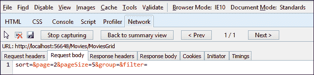

你可以看到，Grid 请求了页码`2`，每页大小为`5`条记录。这是 Kendo Grid 如何通过 HTTP 请求体与服务器通信的方式。

# 使用 Web API 驱动 ListView

与 Grid 小部件类似，ListView 小部件能够利用`[DataSourceRequest]`属性来帮助驱动其操作的特殊功能。在这种情况下，我们不仅将从服务器查询数据，还将使用 Web API 进行编辑。

在`KendoController`类中为我们的 ListView 示例创建一个动作方法，如下所示：

```js
private MoviesContext db = new MoviesContext();

public ActionResult ListView()
{
  return View(db.Movies);
}
```

然后为这个动作方法添加一个视图，并在其中添加以下 HTML 标记：

```js
@using Kendo.Mvc.UI;

@model IEnumerable<Chapter11.Models.Movie>

@{
    ViewBag.Title = "ListView";
}
<script type="text/x-kendo-tmpl" id="template">
    <div class="movie-view">
        <dl>
            <dt>Name</dt>
            <dd>${Name}</dd>
            <dt>Rating</dt>
            <dd>${Rating}</dd>
            <dt>Rank</dt>
            <dd>${Rank}</dd>
        </dl>
    </div>
    <div>
        <a class="k-button k-button-icontext k-edit-button"
            href="\\#"><span class="k-icon k-edit"></span>Edit</a>
        <a class="k-button k-button-icontext k-delete-button"
            href="\\#"><span class="k-icon k-delete"></span>Delete</a>
    </div>
</script>
<h2>ListView</h2>
```

在数据检索后，这个基本的 HTML 和 Kendo 模板将被用来构建页面。你可以看到模板只是简单地显示`Movie`对象的每个元素，然后提供编辑和删除按钮。接下来，在视图底部添加以下 MVC Razor 代码来连接一切：

```js
@(Html.Kendo().ListView(Model)
    .Name("moviesListView")
    .TagName("div")
    .ClientTemplateId("template")
    .Editable()
    .DataSource(dataSource => {
        dataSource
            .Read(read => read.Action("MoviesGrid", "Movies"))
            .Update(update => update.Type(HttpVerbs.Post)
              .Url("/api/MovieApi"))
            .PageSize(5)
            .Model(config => config.Id("Id"));
    })
    .Pageable())
```

在这里，我们创建了一个 Kendo ListView，指定了在页面上渲染时要使用的模板 ID，将其标记为可编辑，并指定了数据源。在数据源内部，我们指明了要检索以显示数据的位置（`Read`方法）以及发送更新数据的位置（`Update`方法）。

接下来，我们需要为`Movie`对象创建一个编辑模板，以便这个 ListView 可以编辑我们的`Movie`对象。在`Views/Shared`文件夹下创建一个名为`EditorTemplates`的新文件夹。然后，在`EditorTemplates`文件夹中添加一个视图，并将其命名为`Movie.cshtml`。

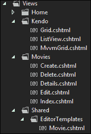

打开`Movie.cshtml`视图文件，并在其中添加以下代码：

```js
@model Chapter11.Models.Movie

<div class="movie-view">
    <dl>
        <dt>Name</dt>
        <dd>@Html.EditorFor(model => model.Name)</dd>
        <dt>Rating</dt>
        <dd>@Html.EditorFor(model => model.Rating)</dd>
        <dt>Rank</dt>
        <dd>@Html.EditorFor(model => model.Rank)</dd>
    </dl>
    <div>
        <a class="k-button k-button-icontext k-update-button"
            href="\\#"><span class="k-icon k-update"></span>Save</a>
        <a class="k-button k-button-icontext k-cancel-button"
            href="\\#"><span class="k-icon k-cancel"></span>Cancel</a>
    </div>
</div>
```

当在`Movie`项上点击**编辑**按钮时，ListView 小部件将使用此视图。以下是在默认情况下（查看电影）的页面外观。你可以看到电影项的不同元素以及用于编辑或删除它的按钮：

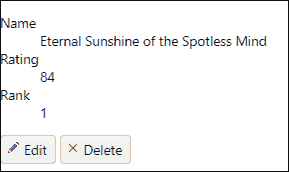

当你点击**编辑**按钮时，这就是电影项的渲染方式。看看字段是如何现在按照我们在`EditorTemplate`文件夹中为`Movie`数据类型指定的方式渲染的。

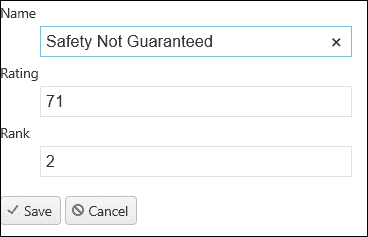

由于我们已经将其连接到 Web API，如果我们设置 Visual Studio 中 API 方法被调用时的断点，我们可以观察到发送到服务器进行处理的更改。你可以看到我在以下屏幕截图中所做的是：

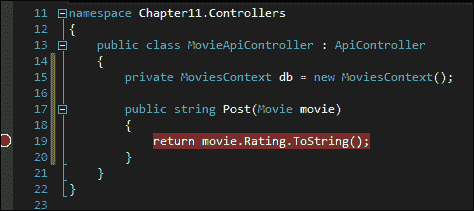

以这种方式设置 Visual Studio 后，程序将在更新时停止，你可以检查数据以观察正在发生的事情。对于生产应用程序，你希望使用 Entity Framework 来编辑`movie`对象并将更改保存到数据库中。

# 摘要

在本章中，我们看到了如何使用 Web API 来处理一些更现实的场景，这些场景涉及到管理数据的两个 Kendo 组件。我们还快速探讨了 ASP.NET Web API 的基础知识，以及 Entity Framework 和 OData。这些工具结合使用，可以是一个非常强大的组合，几乎可以创建您需要的任何自定义解决方案。

我们刚才看到的示例，都使用了 Telerik 提供的一个特殊属性，以帮助进行模型绑定和服务器端分页和筛选。当这些特殊助手可用时，使用它们是非常方便的。我鼓励您继续自行探索这些技术，看看您如何在自己的网页上创建自己的自定义解决方案。
