# 第二章：构建更少的开发工具包

我们已经介绍了 Less 背后的原理，并看到了它如何通过使用变量、函数和混入来帮助减少管理样式表所需的努力。我们几乎准备好开始编码了，但在我们这样做之前，还有一个小问题——我们需要一些工具！

您可能会想知道是否需要更多工具，鉴于 CSS 只是纯文本，而且我们不需要任何东西来编辑纯文本文件，对吧？好吧，纯文本编辑器可以工作，但正如我们将在本章中看到的，有一些工具包括对 Less 的支持，以便帮助使文件编辑更容易。

在本章中，我们将探讨一些您可能发现对处理 Less 文件有用的工具；我们将安装一些将在本书的练习中使用的工具，尽管您始终可以选择您偏好的包。

在本章中，我们将涵盖以下主题：

+   选择和安装用于处理 Less 文件的编辑器

+   注意 Less 文件的变化

+   在浏览器中进行调试

+   用于编译 Less 代码的工具

+   使用 Node 和 Grunt 等工具自动化开发

### 注意

本章中安装的软件将适用于 Windows，因为这是作者的首选开发平台；将添加注释以指示是否提供适用于 Apple Mac 或 Linux 的替代方案。

# 选择 IDE 或编辑器

我们需要从某个地方开始，还有什么地方比编辑器更好呢。毕竟，如果我们没有可以用来编写内容的东西，我们就无法生产任何东西！编辑 Less 文件非常简单——它们是纯文本文件，几乎可以在任何编辑器中编辑。

缺点是，有数十种编辑器可供选择，要么免费，要么付费。然而，有一些编辑器默认包含对 Less 的支持，或者作为附加包提供，包括以下内容：

+   **Sublime Text**: 这是一个适用于 Windows、Mac 或 Linux 的共享软件应用程序，可在[`www.sublimetext.com`](http://www.sublimetext.com)获取；在撰写本文时，许可证费用为 70 美元

+   **Notepad++**: 这是一个适用于 PC 的开源编辑器，可在[`www.notepad-plus-plus.org`](http://www.notepad-plus-plus.org)获取

+   **Coda**: 仅适用于 Mac，可在[`www.panic.com/coda`](http://www.panic.com/coda)获取；在撰写本文时，许可证费用为 99 美元

+   **Codekit**: 这是一个共享软件应用程序，可在[`www.incident57.com/codekit`](http://www.incident57.com/codekit)获取；许可证费用各不相同

可用的编辑器更多；您可以在[`lesscss.org/usage/#editors-and-plugins`](http://lesscss.org/usage/#editors-and-plugins)查看完整的编辑器列表。

### 注意

你可能已经注意到我没有提到像 Dreamweaver 这样的 IDE。虽然这些 IDE 可以很好地与 Less 文件一起工作，但它们的工作方式可能会影响学习如何有效地编写 Less 代码的体验。

同时，让我们看看安装我个人最喜欢的编辑器——Sublime Text 2。

## 安装 Sublime Text 2

Sublime Text 是一款共享软件跨平台文本编辑器，可在 [`www.sublimetext.com`](http://www.sublimetext.com) 获取。其流行源于一个简洁的界面，它允许轻松编辑，同时功能强大。Sublime Text 随附基于 Python 的 API，您可以为它编写插件。

要安装 Sublime Text，我们可以从 [`www.sublimetext.com/2`](http://www.sublimetext.com/2) 下载它。适用于 Apple Mac、Linux 和 Windows 的不同版本都可用；请下载并安装适合您平台的版本，接受所有默认设置。

### 注意

在撰写本文时，Sublime Text 的下一个版本，版本 3，可在 [`www.sublimetext.com/3`](http://www.sublimetext.com/3) 获取；目前它处于测试版，但如果您不介意使用测试软件，它对于使用来说是相当稳定的！

## 添加 Less 语法支持

接下来，我们需要为 Less 添加语法支持，这需要几个步骤——第一步是安装 Package Control Manager，这是为了安装 Sublime Text 的插件所必需的。让我们首先浏览到 Package Control 网站的安装页面 [`sublime.wbond.net/installation#st2`](https://sublime.wbond.net/installation#st2)。

我们需要复制 Sublime Text 2 标签中显示的代码，然后打开 Sublime Text 2。一旦打开，点击 **视图** 和 **显示控制台**，然后将代码粘贴到控制台中。按 *Enter* 运行安装。一旦您在控制台窗口中看到以下内容，请重新启动 Sublime Text：

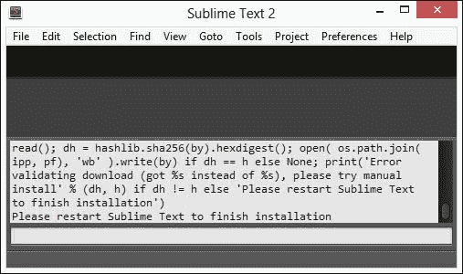

我们现在需要为 Less 安装语法支持。为此，您需要一个互联网连接，因此您可能无法在通勤时完成此操作！

假设您可以访问互联网，请按 *Ctrl* + *Shift* + *P* 打开包管理器，然后输入 **Package Control: Install Package**，并按 *Enter*，如下截图所示：

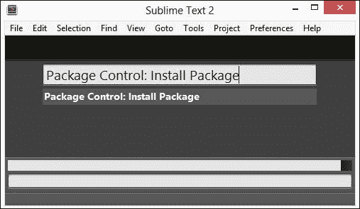

在包管理器检索最新可用的包列表时会有短暂的延迟；您可以在状态栏中监控它们的进度。

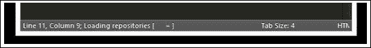

一旦检索到，将显示包列表；在包名框中输入 `LESS`，如下截图所示，然后按 *Enter*：

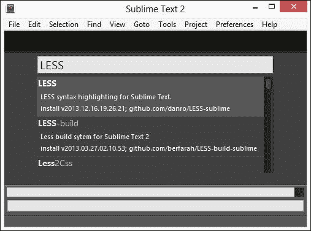

Sublime Text 将现在安装该软件包。在安装过程中会有延迟；我们可以在窗口底部的状态栏中监控其进度。一旦完成，您将在状态栏中看到**行 1，列 1；软件包 LESS 成功安装**的信息。语法支持现在已安装——如果我们打开 Sublime Text 中的一个测试 Less 文件（例如来自第四章, *使用变量、混合和函数*，本书附带代码下载的`buttons.less`），我们可以看到代码现在已着色，不再是之前的黑白格式：

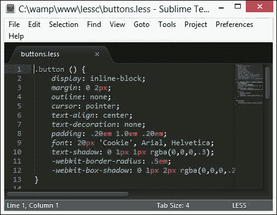

到目前为止，我们已经准备好开始编辑 Less 文件了——尽管我们还需要查看一些其他工具，才能拥有一个完整的工具集！一旦我们生成了一个 Less 文件，我们需要将其编译成有效的 CSS，因此让我们看看可用于此目的的一些工具。

# 使用独立编译器编译 Less 文件

一旦我们生成了一个有效的 Less 文件，我们需要将其编译成其 CSS 等价物。为此，我们有两种选择：第一种是从命令行编译；我们将在本章后面的“从命令行编译”部分更详细地探讨这一点。第二种是使用独立的编译器，为此我们可以使用以下可用的编译器之一：

+   WinLess ([`winless.org/`](http://winless.org/))

+   SimpLESS ([`www.wearekiss.com/simpless`](http://www.wearekiss.com/simpless)/)

+   Koala ([`koala-app.com/`](http://koala-app.com/))

+   Crunch! ([`www.crunchapp.net/`](http://www.crunchapp.net/))

这些编译器中的每一个都执行编译 Less 文件的基本功能，但方式不同。我建议您尝试每一个，并坚持使用您认为更合适的一个。

我们必须从某个地方开始，所以首先，让我们看看 WinLess。

## WinLess

WinLess 是一个基于 Windows 的开源 GUI 前端，用于 `less.js`，可以从 [`winless.org/downloads/WinLess-1.8.2.msi`](http://winless.org/downloads/WinLess-1.8.2.msi) 下载。它包括一个选项，可以自动监控存储在特定文件夹中的任何文件的更改；一旦它们被更改，相应的 CSS 文件就会更新。

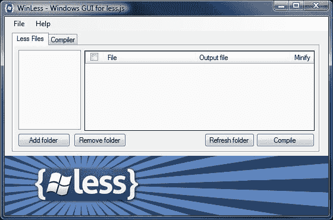

## SimpLESS

如果对您来说，一个稍微简单一些的工具就足够了，那么您始终可以尝试 SimpLESS，这是一个适用于 Windows、Apple Mac 或 Linux 平台的精简版。

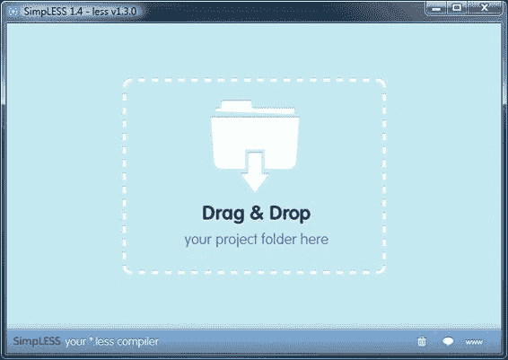

您可以从 [`www.wearekiss.com/simpless`](http://www.wearekiss.com/simpless) 下载此软件；它设计为静默地从系统托盘运行，并自动更新任何更改过的 Less 文件。

## Koala

Koala 是 Less 预处理器场景中的相对新来者。它是一个跨平台的 GUI 应用程序，可以编译大多数可用的 CSS 预处理器，包括 Less。它是使用 Node-Webkit 构建的，因此版本适用于 Mac OS、Linux 和 Windows，并且可以从 [`www.koala-app.com/`](http://www.koala-app.com/) 下载。

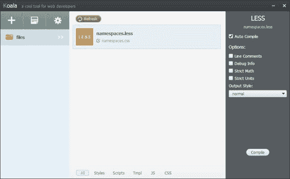

您可以通过浏览到 [`lesscss.org/usage/#guis-for-less`](http://lesscss.org/usage/#guis-for-less) 来找到可用于 Less 的其他编译器的详细信息。同时，我们将继续安装 Crunch!，作为 Less 可用编译器的一个示例。

## 安装 Crunch!

Crunch! 是 Less 的跨平台编译器，使用 Adobe AIR 工作。这个编译器与其他编译器不同，因为它允许我们在编译器内直接编辑文件。

安装 Crunch! 是一个两步过程；我们首先安装 Adobe AIR：

1.  从 [`get.adobe.com/air/`](http://get.adobe.com/air/) 下载安装程序，确保您选择适合您平台的正确版本。双击 AIR 安装程序并接受所有默认设置。

1.  接下来，请从 [`www.crunchapp.net`](http://www.crunchapp.net) 下载 Crunch!。双击 **Crunch.1.6.4.air** 包，然后在此提示下点击**安装**按钮。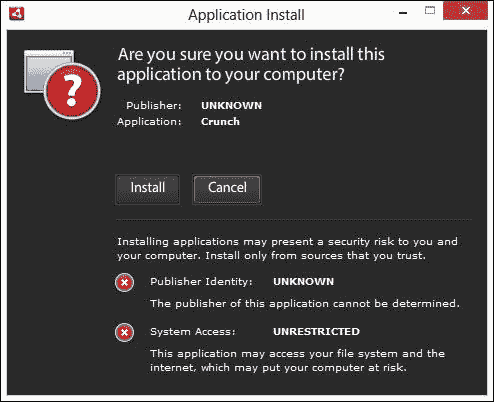

1.  点击**继续**开始安装；我们可以保持默认设置不变，因为它们将满足我们的需求：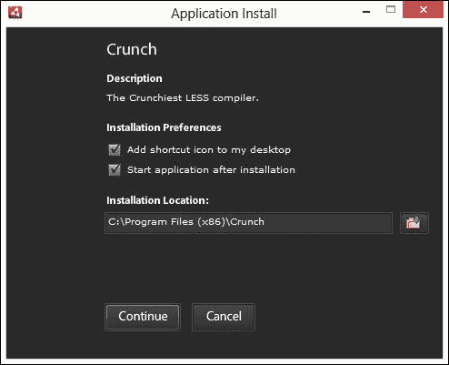

1.  几分钟后，Crunch! 的 GUI 将出现，准备使用，如图所示：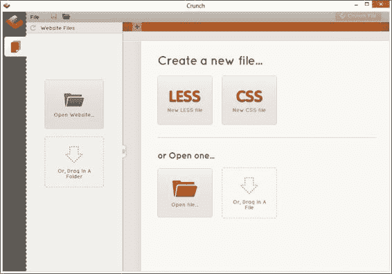

# 从命令行编译

一些用户可能更喜欢不使用独立的应用程序来编译 Less 代码任务；毕竟，谁需要学习另一个应用程序来执行可以轻松自动化并在后台运行的任务呢？

绝对可以；我们不必使用独立编译器，可以使用基于 JavaScript 的平台（即 Node.js）的命令行来执行相同的操作，Node.js 可在 [`www.nodejs.org`](http://www.nodejs.org) 获取。此应用程序的版本适用于 Windows、Linux、Mac，甚至 SunOS 平台。否则，如果您喜欢冒险，您始终可以尝试从源代码编译！让我们更详细地看看我们如何使用它。

要下载和安装 Node.js，请执行以下步骤：

1.  浏览 [`www.nodejs.org`](http://www.nodejs.org)，然后从主页点击**下载**；这应该会自动确定适合您平台的正确版本。在撰写本文时，Windows 的最新版本是`node-v0.10.24-x86.msi`。

1.  双击安装程序开始安装过程；您将看到以下欢迎屏幕。点击**下一步**。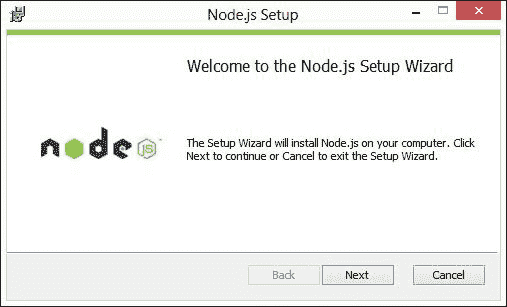

1.  在下一屏，选中 **我接受许可协议中的条款** 复选框，然后点击 **下一步**。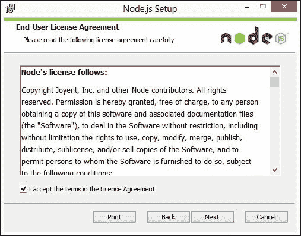

1.  在这一点上，我们需要选择 Node 将安装的位置。对于本书的目的，我们将假设它将安装在默认位置 `c:\wamp`，所以请继续点击 **下一步**。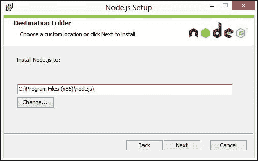

1.  在下一屏，您可以从多个选项中选择以配置 Node。对于本书中的练习目的，这并不是必要的，所以我们只需点击 **下一步**。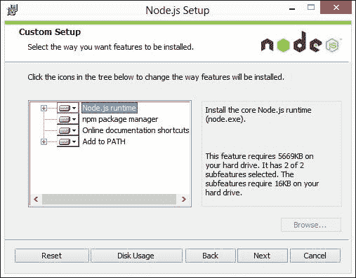

现在我们已经准备好完成安装，所以点击 **安装**，等待其完成。一旦完成，Node 就已安装并准备好供我们使用。我们现在可以安装用于命令行的 Less，我们将在下一章中介绍，即 第三章，*Less 入门*。

### 注意

如果您想了解更多关于 Node.js 的信息，那么您可能会喜欢阅读由 *Packt Publishing* 出版的书籍 *Mastering Node.js*，作者是 *Sandro Pasquali*。

## 监视 Less 文件的变化

正如我们将在下一章中看到的，从命令行编译 Less 是一个简单的过程；我们可以打开命令提示符，输入一个简单的命令，然后按 *Enter* 键让它运行。

问题在于我们必须每次都这样做。过了一段时间，这至少会变得令人厌烦！这是一件我们可以轻松解决的问题——我们首先需要安装 Grunt 的命令行界面，然后再通过设置 Grunt 自动监视并重新编译我们的 Less 源文件中的任何更改。

### 注意

Less 中有一个可选的监视模式，称为 **监视**。这仍然需要手动配置；我们将在 第三章，*Less 入门* 中更详细地探讨它。

在以下示例中，我们将通过安装一个名为 `grunt-contrib-less` 的包来添加对 Less 的支持。让我们首先在 `C:` 驱动的根目录下创建一个名为 `lessjs` 的项目文件夹。在这个文件夹内，创建一个名为 `package.json` 的新文件，并添加以下代码：

```js
{
  "name": "my_grunt_project",
  "version": "0.0.1",
  "devDependencies": {

  }
}
```

接下来，打开命令提示符并输入以下命令：

```js
npm install -g grunt --save-dev

```

这将下载并安装多个附加包；`--save-dev` 参数将自动将任何依赖项添加到 `package.json` 文件中。

如果我们查看 `lessjs` 文件夹，我们将看到我们的 `package.json` 文件；如果我们用文本编辑器打开它，它看起来可能像以下代码：

```js
{
  "name": "my-project-name",
  "version": "0.1.0",
  "devDependencies": {
    "grunt": "~0.4.2",
    "grunt-contrib-less": "~0.8.3",
    "grunt-contrib-watch": "~0.5.3"
  }
}
```

如果下载完成且没有错误记录，则运行此命令：

```js
npm install -g grunt-cli

```

将以下代码添加到新文件中，并将其保存到项目文件夹中，命名为`gruntfile.js`。我们将按部分解释该文件，以便了解每个部分的作用：

```js
module.exports = function(grunt) {
  grunt.initConfig({
    less: {
      src: {
        expand: true,
        src:    "*.less",
        ext:    ".css"
      }
    }
  },
```

我们以一个标准的 Grunt `exports`语句开始文件；在这里，我们通过设置`src`来初始化 Grunt，以便查找 Less 文件并将它们编译成 CSS 文件。我们已将 Grunt 设置为在编译时使用`expand`属性（设置为`true`）不压缩 CSS 文件，这使得我们在开发过程中更容易阅读，尽管实际上，我们将在生产环境中压缩文件以节省带宽：

```js
  watch: {
      styles: {
      options: { spawn: false },
        files: [ "*.css", "*.less"], 
        tasks: [ "less" ]
      }
  }
  });
```

由于我们定义了多个任务，我们通常会单独在命令提示符中输入任务。相反，我们可以组合我们定义的所有子任务。然后，我们可以在命令行中输入命令`grunt`时运行它们作为默认任务，这有助于节省时间：

```js
  grunt.loadNpmTasks('grunt-contrib-less');
  grunt.loadNpmTasks('grunt-contrib-watch');

  // the default task can be run just 
  // by typing "grunt" on the command line
  grunt.registerTask('default', ['watch']);
};
```

启动命令提示符，切换到项目文件夹，并在命令提示符中输入`npm install`。这将下载并安装多个额外的包。完成此操作后，在命令提示符中输入`grunt`。Grunt 将开始监视任何更改，如本例所示：

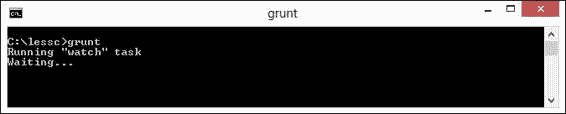

对 Less 文件所做的任何更改都将强制自动重新编译 Less 文件。

### 小贴士

如果你想深入研究这些包的源代码，你将在 GitHub 上找到许多，网址为[`github.com/gruntjs`](https://github.com/gruntjs)。

随着时间的推移，当你越来越习惯于使用 Less 进行开发时，你可能想尝试一些其他来自 Node 包管理器网站[`npmjs.org`](https://npmjs.org)的监视器包，以下是一些示例：

+   less watch（可在[`npmjs.org/package/less-watch`](https://npmjs.org/package/less-watch)找到）

+   less monitor（可在[`npmjs.org/package/less-monitor`](https://npmjs.org/package/less-monitor)找到）

+   less watcher（可在[`npmjs.org/package/lesswatcher`](https://npmjs.org/package/lesswatcher)找到）

现在我们已经安装了 Less，并使用 Grunt 自动编译，我们可以跳到下一章，在正常的文本编辑器中创建一些文件，然后手动编译它们。这会工作得很好，但我们还可以进一步自动化编译过程。让我们看看如何通过添加对 Notepad++等文本编辑器的支持来实现这一点，以便我们可以在编辑器内直接编译文件。

## 直接从文本编辑器编译 Less 文件

可用的文本编辑器有成百上千种；有些是免费或开源的，而有些则需要付费。一个免费的编辑器例子是 Notepad++；在撰写本文时，当前版本是 6.5.3，可以从[`notepad-plus-plus.org/download/v6.5.3.html`](http://notepad-plus-plus.org/download/v6.5.3.html)下载。

目前，我们将设置好并准备好使用。您将在第三章“Less 入门”中看到它的实际应用，当我们使用它从编辑器编译代码时。

下载 Notepad++的安装程序，然后双击它以启动安装过程。点击**下一步**以接受每个默认设置，这对我们的需求足够了。安装完成后，启动 Notepad++，然后从**运行**菜单中选择**运行**以启动**运行**对话框，并添加以下行（包括引号）：

`"C:\Program Files (x86)\nodejs\node_modules\.bin\lessc.cmd" -x "$(FULL_CURRENT_PATH)" > "$(CURRENT_DIRECTORY)\$(NAME_PART).css"`

点击**保存**将运行命令添加到现有预设命令列表中；在**快捷键**对话框中，选择**CTRL** + **L**快捷键，并为命令添加`编译 LESS 文件`，然后点击**确定**。

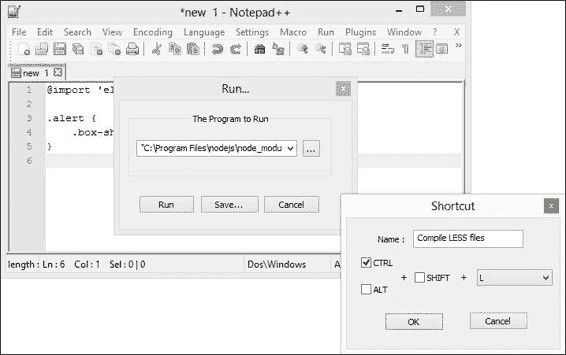

当**快捷键**窗口关闭后，点击**保存**以保存更改。目前，点击**取消**以关闭窗口。我们还没有准备好运行我们的快捷键——这将在下一章中发生。Notepad++现在已设置好，我们可以从应用程序内部编译 Less 文件的任何更改。

## 通过包安装编译支持

到目前为止，我们已经看到如何设置像 Notepad++这样的编辑器，但我们并不局限于必须使用这种技术为每个编辑器设置。对于某些编辑器，已经为这个目的创建了一个扩展或包，因此安装将简化。一个这样的例子是 Sublime Text——存在一个包，我们可以安装它以提供对 Less 的支持。

首先，启动 Sublime Text，然后按*Shift* + *Ctrl* + *P*以打开我们在此章早些时候安装的包管理器，然后输入`Package Control: Install Package`并按*Enter*。

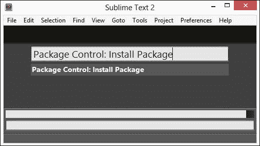

接下来，输入`lesscss`——我们需要安装`Less2CSS`包，所以当它在自动完成中显示时，点击它并按*Enter*：

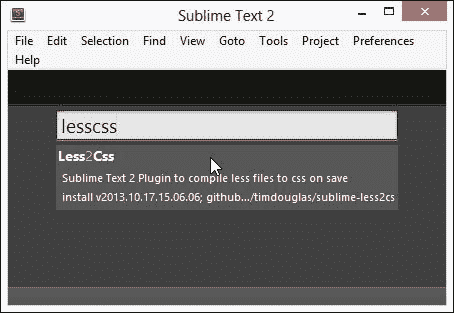

此时，Sublime Text 将安装该包，这可能需要几分钟时间——成功安装后，确认信息将出现在状态栏中。我们现在已经准备好直接在 Sublime Text 中编译 Less 文件了——我们将在下一章中使用这个功能。

# 在浏览器中调试 Less

任何描述的代码开发的关键部分是修复任何错误或错误；与 Less 代码一起工作也不例外。我们当然可以手动操作或使用像 CSS Lint（[`www.csslint.net`](http://www.csslint.net)）这样的 linting 工具，但任何一种可能都需要直接与编译后的 CSS 代码一起工作，这将使追踪错误回您现有的 Less 代码变得更加困难。

幸运的是，我们有一些选项可以帮助我们在这方面——我们可以在 Firefox 中直接使用 FireLESS 插件进行调试，或者我们可以设置一个源映射，将编译后的样式转换回原始 Less 文件中的行号。让我们先看看如何安装 FireLESS，并为我们在下一章开始编写代码做好准备。

## 使用 Firefox 调试 Less 代码

要启用 Firefox 中调试 Less 的支持，我们首先需要确保 Firebug 已安装；为此，您可以使用 Firefox 插件的正常安装过程从[`addons.mozilla.org/en-US/firefox/addon/firebug`](https://addons.mozilla.org/en-US/firefox/addon/firebug)下载它。

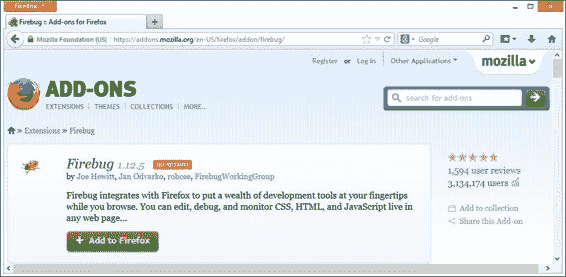

在撰写本文时，Firebug 的最新版本是 1.12.5，它适用于 Firefox 版本 23 到 26。安装过程简单，不需要重启浏览器。

接下来，我们需要安装 FireLESS。首先，浏览到[`addons.mozilla.org/en-us/firefox/addon/fireless/`](https://addons.mozilla.org/en-us/firefox/addon/fireless/)，然后点击**添加到 Firefox**以启动安装。您可能会收到一个提示，允许 Firefox 安装 Firebug—点击**允许**。Firefox 下载插件后，点击**立即安装**（如下截图所示）以开始安装：

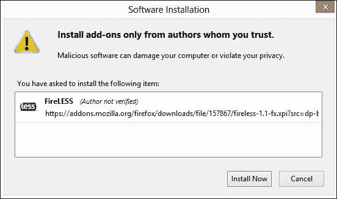

当提示时，点击**立即重启**。FireLESS 现已安装；我们将在第三章 *使用 Less 入门*中了解如何使用它。

## 使用 Chrome 调试 Less 代码

我们不仅限于仅使用 Firefox 来调试我们的源代码。我们还可以使用 Chrome；为此，我们需要在 Less 中安装对源映射的支持。

源映射是一个相对较新的功能，它可以与基于 JavaScript 或 CSS 的文件一起使用；其概念基于提供一个机制，将编译后的基于 JavaScript 或 CSS 的代码映射回原始源文件。当内容已被最小化时，这一点尤其有效—没有源映射，很难确定哪段代码出了问题！

此示例依赖于使用网络服务器才能正确工作。我们将继续安装 WampServer 以实现此目的，所以现在让我们来做这件事。

## 安装 WampServer

WampServer 可以从[`www.wampserver.com`](http://www.wampserver.com)下载—Windows 的各种版本都可以在**下载**选项卡中找到；请确保您选择适合您平台的版本。如果您在 Apple Mac 上工作，则可以尝试安装 MAMP，您可以从[`www.mamp.info`](http://www.mamp.info)下载它。Linux 用户应该可以在他们的发行版中找到一个合适的选项。

首先，打开您之前下载的安装文件。在欢迎提示中，点击 **下一步**。选择 **我接受协议**，然后点击 **下一步**，如图所示：

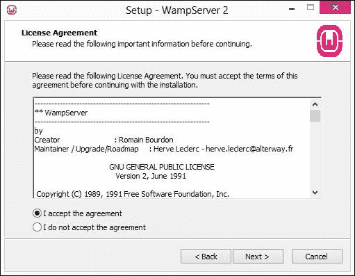

我们需要指定一个位置来安装应用程序文件（稍后，我们将在这里托管测试页面）。默认情况下，WampServer 将安装到 `c:\wamp`——这是理想的，因为它避免了使用空格，否则我们的 URL 中将出现 `%20`。

为了本书的需要，我将假设您使用了默认设置；如果您使用了不同的设置，那么您将需要在稍后托管示例文件时记住新的位置。

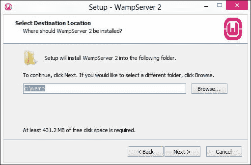

然后设置将提示您是否想要创建快速启动或桌面图标——在这个时候，您可以选择您更愿意使用的。点击 **下一步** 将显示 **准备安装** 屏幕，它给出了我们安装操作的摘要。如果一切正常，点击 **安装** 以完成过程。

然后，我们将看到 **准备安装** 窗口，然后 **设置** 执行安装。在完成之前，您将看到此消息，我们应该点击 **否**：

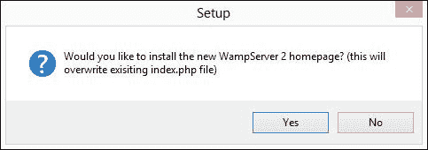

此外，我们还需要安装 Grunt 和 Node，正如本章“**监控 Less 文件的变化**”部分所述。

现在 WampServer 已经安装，打开命令提示符，将位置更改为您的项目文件夹——在这个例子中，我将使用一个名为 `lessc` 的文件夹，它将存储在 `c:\wamp\www\lessc`。

### 提示

在这个例子中，我们使用了演示文件夹——当在生产环境中工作时，这将是您提供内容的文件夹。

在提示中，输入以下命令：

```js
lessc namespaces.less > namespaces.css –source-map=namespaces.css.map

```

在这里，`namespaces.less` 和 `namespaces.css` 分别是您的 Less 和 CSS 文件的名字。当编译时，`lessc` 生成一个 `.map` 文件，浏览器将使用它来查找 Less 文件中与您的代码中的特定 CSS 样式规则相对应的各种定义。

将 `namespaces.less`、`namespaces.css`、`main.html` 和 `namespaces.css.map` 文件复制到您的 Web 服务器的 `WWW` 文件夹中——在这个例子中，这很可能是 `c:\wamp`。

打开 Google Chrome，然后浏览到 `http://localhost/lessc/main.html`。如果一切正常，您将看到以下截图，前提是您已经按下了 *F12* 来显示开发者工具栏：

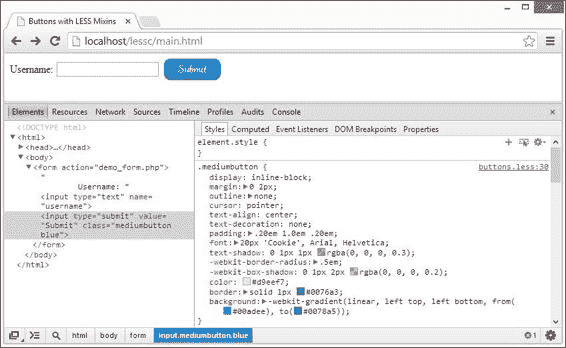

在这里，您可以查看构成 `.mediumbutton` 类的各个 CSS 样式；Chrome 显示编译后的输出样式，但代替指示每个规则在 CSS 中的位置，我们可以看到原始规则在 Less 文件中的位置。

我们将能够使用 Opera（因为最近版本现在是基于 WebKit 的）达到相同的结果。Safari 已经引入了对源映射的支持，但仅从版本 7 开始。**Internet Explorer**（**IE**）是唯一一个尚未包括任何源映射支持的浏览器。

现在，不必担心源映射是如何工作的，因为我们将在本书的稍后部分更详细地回顾这个问题。

# 其他有用的工具

我们几乎就要结束这一章了，但在我们开始开发 Less 代码之前，我们应该看看一些在你花了一些时间用 Less 开发 CSS 后可能会觉得有用的工具：

+   **Adobe Kuler**：你可以在[`kuler.adobe.com/`](https://kuler.adobe.com/)找到这个工具。尽管这个工具与 Less 没有直接关联，但你可能会在为你的网站选择配色方案时发现它很有用。Kuler 有一些有用的工具，可以帮助你从我们可以从中提取并使用颜色值的颜色调色板中选择合适的颜色。

+   **Live.js**：如果你花了一些时间编辑样式，你将不得不在每次更改后手动刷新页面；如果你做了很多更改，这可能会变得很繁琐！幸运的是，我们可以通过使用 Live.js 脚本来解决这个问题。这个工具由 Martin Kool 开发，可在[`www.livejs.com`](http://www.livejs.com)找到。它会自动强制刷新正在工作的页面，以便我们可以在更改应用后立即看到它们。

+   **CSS3 Please**：你可以在[`css3please.com/`](http://css3please.com/)找到这个工具。这是一个很棒的网站，允许你使用自己的值编辑任何列出的 CSS3 规则；它会自动将相同的规则更改应用到该规则的每个供应商前缀上，以便你有一个在每个主要浏览器中都能工作的更新规则。这在我们将在下一章中看到创建自己的混入时尤其有用。

+   **SpritePad**：你可以在[`wearekiss.com/spritepad`](http://wearekiss.com/spritepad)找到这个工具。被称为“创建你的精灵最容易的方式”，SpritePad 是一个在线创建图像精灵的优秀工具，它会自动为每个图像生成适当的 CSS。然后我们可以使用这个工具来创建混入——如果我们正在创建一个包含大量小图像且这些图像在网站上经常出现的大型网站，这尤其有用。

+   **Prefixr**：你可以在[`www.prefixr.com/`](http://www.prefixr.com/)找到这个工具。尽管这个网站不是为与 Less 一起使用而设计的，但它仍然很有用。我们可以为特定的浏览器（如 Firefox）开发一个网站，然后使用 Prefixr 为任何仍然需要它们的 CSS3 规则添加其他供应商前缀等效项。

+   **WinLess Online**：您可以在[`winless.org/online-less-compiler`](http://winless.org/online-less-compiler)找到这个工具。在本章早期，我们提到了使用 WinLess 作为 Less 编译器；它也有一个针对不使用 Windows 作为平台的用户的在线版本。尽管一些配置选项不存在（例如压缩编译后的代码），但它仍然是一个有用的工具。

+   **Less2CSS**：您可以在[`www.less2css.org`](http://www.less2css.org)找到这个工具。该网站执行与 WinLess Online 相同的功能，但有一些额外的选项，例如添加用于与源映射一起工作的媒体查询。这位开发者还建议，如果您遇到任何需要帮助的问题，请使用此网站验证您的代码。

这是我用于 Less 开发的工具选择之一；可能还有其他与这里列出的同样有用的工具。请随意使用这些工具。如果您对本书未来版本中的其他工具有任何建议，那么它们是受欢迎的！

# 摘要

当您安装并可在工作流程中使用适当的工具时，使用 Less 进行工作可以非常有益。我们首先查看了一些可用的编辑器；这些包括对 Less 的支持，如 Sublime Text 或 Notepad++。然后我们继续安装 Sublime Text 2 并为 Less 添加了支持。

接下来是关于编译 Less 代码的选项的讨论——第一个选项涵盖了如何使用 WinLess 这样的独立编译器生成最终的 CSS 代码；我们查看每个主要编译器，然后安装了 Crunch!。

我们接下来探讨了如何使用命令行来编译代码——我们分析了使用独立编译器意味着在您的开发工作流程中增加另一层，这并不是理想的选择。我们进行了一个基本的 Node.js 安装，然后首先将其配置为编译 Less 文件，接着添加了自动监视功能，并以查看如何将此与 Notepad++等编辑器链接结束。

我们接着在本章的结尾部分探讨了在浏览器中调试代码的选项。我们分析了 FireLESS 和 Firebug 如何使 Firefox 的使用变得非常简单，而配置 Chrome（和 Opera）则需要更多的工作，以便使用源映射来实现相同的效果。我们还介绍了一些其他您可能发现对使用 Less 进行开发有用的工具，例如 LESS2CSS 或 Adobe Kuler。

在下一章中，我们将真正深入下去，开始生成有效的 Less 代码。我们将查看下载和添加 Less，并在编写一些样式并查看使用命令行或通过独立编译器编译的结果之前，开始检查其语法。
