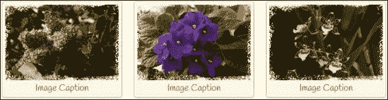
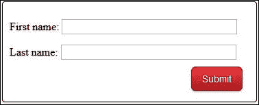
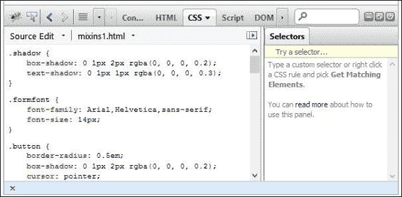
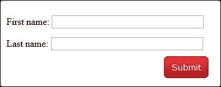
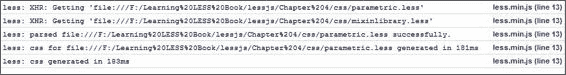
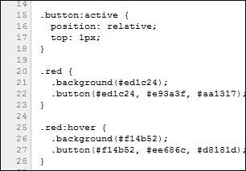
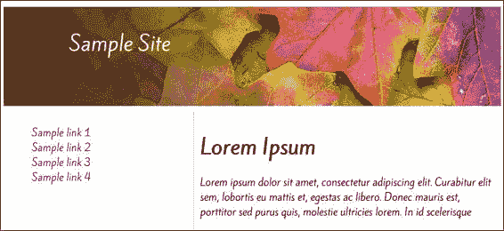
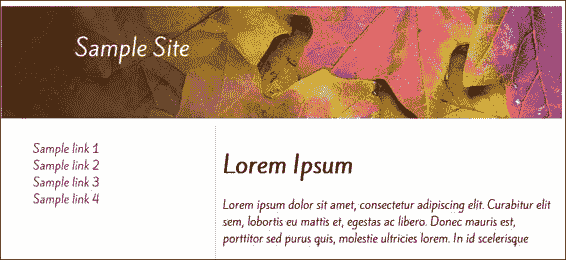
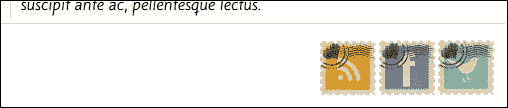

# 第四章：使用变量、混入（mixins）和函数

到目前为止，在这本书中，我们已经建立了将成为我们 Less 开发工具包的基础，并对 Less 作为 CSS 预处理器的一些语法和概念进行了快速浏览。我相信某个知名演员曾经在电影中说过，“是时候了....”

是的，是时候深入使用 Less 了！然而，等等；这一章说它是关于使用变量、函数等，这当然意味着我们在编写编程代码，对吧？

错了。别担心，我的朋友们；虽然我们将要看看函数，但它们与你在使用 C#或 Visual Basic 等语言开发时看到的函数完全不同。事实上，唯一的相似之处就是名称——正如我们将看到的，Less 世界中的函数更像是使用科学计算器而不是复杂的代码。

这只是我们将要涵盖的一小部分。在本章中，我们将探讨 Less 的一些构建块，包括：

+   创建和定义变量

+   开发简单和参数化混入（mixins）

+   使用 Less 函数

+   使用预构建库

感兴趣吗？让我们开始吧...

# 在 Less 中探索变量

就像所有美好的事物一样，我们必须从某个地方开始——现在似乎是一个合适的时机来问自己一个问题：对于那些已经熟悉编程基础的人来说，什么时候一个变量不是变量？它是常量——但是等等，这一节是关于变量的，对吧...？如果你觉得这听起来像是双关语，那么别担心，让我来解释。

Less 中的变量与大多数编程或脚本语言中的变量非常相似——它们充当值的占位符。考虑以下代码：

```js
#somediv { width: 200px; height: 200px; }
```

而不是之前的代码，我们可以这样写：

```js
@width: 200px;
@height: 200px;

#somediv { width: @width; height: @height; }
```

这段代码会产生相同的结果。

你可能会问自己，“为什么为了同样的结果要写双倍代码？”当然，我们可以简单地使用第一种方法，对吧？

是又否——就这个例子本身而言，它实际上并不那么有效。然而——这正是使用 Less 时的重大区别——当你使用相同的规则来为同一类型的多个项目设置样式，并产生相同效果时，它就变得非常有用。

如果我们需要在整个网站上为许多按钮设置样式，例如，那么我们通常会设置内联样式或使用类。如果我们需要更改样式，这可能会要求我们在样式表中多个不同位置更新样式；这是耗时且容易出错的！

相反，我们在 Less 样式的开头设置变量，这些变量在代码中会被使用。这意味着我们只需一击，就可以自动更新特定值的所有实例；这可以节省大量时间，尤其是如果客户不确定他们想看到什么时！

设置变量的关键是规划；通过一点小心和前瞻性，我们可以在样式表的头部设置变量，然后在我们的 Less 代码中适当使用它们。为了说明我的意思，让我们用一个简单的例子来实践。

## 创建宝丽来照片

在本章的第一个例子中，我们将使用 Less 创建经过验证的 **宝丽来效果**，这是加拿大开发者 Nick La ([`www.webdesignerwall.com`](http://www.webdesignerwall.com)) 开发的，并将其应用于多个图像，如下面的截图所示：



这的好处是，我们不需要在代码中使用任何 JavaScript 或 jQuery；它将使用纯 Less，我们将将其编译为有效的 CSS。

为了本书的目的，我们假设我们将使用配置为自动将 Less 文件编译为有效 CSS 的 Sublime Text，正如我们在第二章中看到的，*构建 Less 开发工具包*。

### 注意

如果你使用不同的方式来编译 Less 代码，那么你需要相应地调整步骤。

在本书附带的代码副本中，提取 `variables.html` 的副本——我们将以此为基础创建我们的宝丽来图像效果。

在我们的框架建立之后，让我们添加一些样式。在一个单独的文件中，让我们开始添加 Less 样式，从定义我们颜色的变量开始：

```js
@dark-brown: #cac09f;
@light-grayish-yellow: #fdf8e4;
@dark-grayish-yellow: #787568;
@image-width: 194px;

@caption-text: ' ';
```

现在我们已经创建了变量，是时候使用它们了；让我们从为每个列表项添加样式开始，使它们成为每个图像的容器：

```js
li { width: @image-width; padding: 5px; margin: 15px 10px; border: 1px solid @dark-brown; background: @light-grayish-yellow; text-align: center; float: left; list-style: none outside none; border-radius: 4px; box-shadow: inset 0 1px rgba(255,255,255,.8), 0 1px 2px rgba(0,0,0,.2); }
```

我们现在可以将注意力转向为每个宝丽来图像的内容添加样式；让我们首先设置主要图像出现在每个容器内，而不是向右偏移：

```js
figure { position: relative; margin: 0; }
```

接下来是添加每个花朵图像及其叠加效果：

```js
figure:before { position: absolute; content: @caption-text; top: 0; left: 0; width: 100%; height: 100%; background: url(../img/overlay.png) no-repeat; border: none; }
```

最后，让我们为每个图像标题添加样式：

```js
figcaption { font: 100%/120% Handlee, Arial, Helvetica, sans-serif; color: @dark-grayish-yellow; width: @image-width; }
```

将文件保存为 `variables.less`。Sublime Text 将自动将其编译为有效的 CSS 文件，尽管在本演示中，我们将动态编译 Less 代码，因为它并不复杂。

留意观察的读者会发现我们为标题使用了非标准字体——这是 Handlee 字体，可在 Google Fonts 中找到。为了确保它按预期工作，请立即在 `variables.html` 中的 `<title>` 标签后添加此行：

```js
<link href='http://fonts.googleapis.com/css?family=Handlee' rel='stylesheet' type='text/css'>
```

如果你在浏览器中预览结果，你会看到类似以下的内容：


在我们的例子中，我们创建了一系列变量来处理使用的颜色；而不是在我们的代码中显示难以理解的十六进制代码，我们可以使用名称，如 `@dark-brown`，这些名称更容易理解：

```js
@dark-brown: #cac09f;
@light-grayish-yellow: #fdf8e4;
@dark-grayish-yellow: #787568;
@image-width: 194px;
```

我们还可以使用变量来定义文本，例如：

```js
@caption-text: ' ';
```

需要注意的是，虽然使用变量来定义颜色是最常见的，但这绝不是变量的唯一用途。我们还可以使用变量来定义字符串，就像我们在这里所做的那样，甚至可以将它们包含在 URL 中：

```js
// Variables
@images: "../img";

// Usage
body { color: #444; background: url("@{images}/white-sand.png");}
```

这将编译为：

```js
body { color: #444; background: url("../img/white-sand.png"); }
```

### 注意

值得阅读 Less 官方网站上的变量示例（[`less.github.io/features/#variables-feature`](http://less.github.io/features/#variables-feature)）。

在我们的例子中，我们动态编译了我们的样式；因此，Less 会自动将每个变量名在整个代码中的每个实例替换为相应的值。在这个时候，我们可以轻松地将 Less 文件替换为编译后的 CSS 文件——它会产生相同的效果。这是我们应该在生产环境中做的事情；我们还应该更进一步，最小化代码以确保带宽使用量保持在最低。

## 加载变量和设置作用域

在设置和使用变量时，有一个关键要素我们需要注意：在 Less 中加载变量时设置变量作用域。

Less 中的变量是**延迟加载**的，这意味着在使用之前不需要声明。如果我们已经声明了一个变量的实例，然后再次声明它并赋予新的值，Less 将始终使用变量的最后定义，从它被调用的点向上搜索。考虑以下：

```js
@var: 0;
.style1 {
  @var: 1;
  .style {
    @var: 2;
    three: @var;
    @var: 3;
  }
  one: @var;
}
```

在这个例子中，你可能期望看到 `.style1` 包含一个 `one: 3` 的规则。然而，它将编译为 `one: 1`，因为 `@var: 3` 包含在 `.class1` 类规则中，而这个规则并不在相同的范围内。因此，在 Less 代码中正确地在正确的点上分配变量变得尤为重要，因为我们不需要在使用它们之前提前声明它们。作为一个例子，考虑以下两种编写相同代码的方法，这两种方法都会编译成同样有效的 CSS。考虑第一种方法：

```js
lazy-eval { width: @var; }

@var: @a;
@a: 9%;
```

编写代码的另一种方法是：

```js
.lazy-eval-scope { width: @var; @a: 9%; }

@var: @a;
@a: 100%;
```

这两种方法都会编译为：

```js
.lazy-eval-scope { width: 9%; }
```

你明白我的意思吗？第一种方法更简洁——如果它产生相同的结果，就没有必要使用第二种方法！关于这一点，让我们改变方向，关注我们如何通过引入 mixins 的使用来减少 Less 代码中的重复。

# 探索 mixins

在编写代码时，你有多少次写出了类似但针对不同项目的代码？你是否想过，通过一点写作风格的变化，你可以转换到使用预构建的 CSS 块，你可以在需要的时候随时将其插入到项目中？

当然，你可以开始创建自己的代码库——这会非常完美。然而，它至少有一个潜在的缺点：你很可能需要手动修改任何存储的代码以适应新项目的需求。虽然这会有效，但你可能会发现自己花费更多的时间更新代码，而不是从头开始编写！

如果我说你仍然可以维护一个代码库，但不需要修改你重用的每个代码库块，这是可能的——通过使用 Less 的混入功能。

混入是代码块，正如其名所示——它们可以被混合到你的项目代码中，并在需要时调用。它们甚至可以被移动到库样式表中，你可以将其包含在你的项目中——美丽之处在于，虽然你可能有一个巨大的库样式表，但只有那些在代码中实际使用的样式会被调用并编译到最终的 CSS 样式表中。

混入的用途广泛，就像你的想象力一样——它可以是从定义一个静态代码块并在 CSS 中调用它这么简单，到将特定值作为参数传递给混入，也就是参数化混入。为了了解混入如何工作，让我们首先使用正常的 CSS 创建一个简单的网页表单。

# 创建网页表单

如果你花过时间查看网站——在这个技术发达的现代社会，不这么做会很困难——那么你可能会遇到或需要使用无处不在的联系表单。它们无处不在——你甚至可以采取一种愤世嫉俗的观点，认为人们使用它们作为一种避免与人接触的手段！

尽管如此，它们仍然有存在的价值。在接下来的几节中，我们将开发一个简单的联系表单，并使用 Less 混入来增强它，以展示它们如何被用来减少我们需要编写的代码量。

### 注意

对于这个例子，你需要准备这本书附带代码下载的副本，因为在练习中我们将使用其中的内容。

首先，打开我们之前创建的`project.html`副本，然后更新`<head>`部分，如下所示：

```js
  <head>
    <meta charset="utf-8">
    <title>Demo: Mixins</title>
    <link rel="stylesheet" href="css/buttons.css">
  </head>
```

接下来，在`<body>`标签之间添加以下标记：

```js
  <body>
    <form id="submitfrm" action="demo_form.asp">
  <label for="fname">First name:</label>
  <input type="text" name="fname"><br>
  <label for="lname">Last name:</label>
  <input type="text" name="lname"><br>
  <input class="button red" id="submitbtn" type="submit" value="Submit">
    </form>
  </body>
```

将其保存为`mixins.html`——这个文件的副本也包含在代码下载中。从代码下载中，获取位于代码文件夹`css`子文件夹中的`buttons.css`文件，在这个章节的代码文件夹中。由于空间限制，文件的全部 59 行无法在此全部展示，但一旦它们保存在同一文件夹中，我们就可以预览结果：



如我们从 CSS 样式中所见，确实存在相当多的重复——即使是像我们这样简单的例子！让我们通过在代码中引入混入来改变这一点。

# 添加基本混入

我们可以从向代码中添加两个简单的混入开始——让我们先编辑`buttons.css`的副本，然后在文件开头添加以下代码：

```js
.shadow() { box-shadow: 0 1px 2px rgba(0,0,0,.2); text-shadow: 0 1px 1px rgba(0,0,0,.3); }

.formfont { font-size: 14px; font-family: Arial, Helvetica, sans-serif; }
```

接下来，我们可以从`.button`样式块中移除原始代码，因为这将不再需要——它将被我们三个简单的混入名称所取代：

```js
.button {
  .shadow;
  .formfont;
  display: inline-block;
  outline: none;
  cursor: pointer;
  text-align: center;
  text-decoration: none;
  padding: .5em 2em .55em;
  border-radius: .5em;
}
```

将其保存为`mixins1.less`；然后我们可以移除代码中已经存在的`buttons.css`链接。别忘了在`mixins1.html`中添加我们的 Less 文件链接：

```js
    <link rel="stylesheet" type="text/less" href="css/mixins1.less">
```

将 HTML 文件保存为`mixins1.html`——如果我们在一个浏览器中预览结果，我们不应该看到任何差异，但我们可以放心，我们知道我们的三种样式可以在代码中的任何时间重用。

在我们的例子中，我们对可以重用的块中的样式进行了简单的修改——在这种情况下，我们的三个混入可以被网站上使用的任何按钮调用，但它们需要与我们的样式相似。在每个混入中，我们将互补的样式组合在一起，例如`font-family`和`font-size`。关于应该组合什么和不应该组合什么没有硬性规定；一切都取决于什么有意义并有助于减少我们需要使用的代码量。

我们可以通过传递参数来进一步开发混入——这使得它们更有用，因为我们可以使用相同的代码产生不同的结果，这取决于我们的需求。然而，当使用混入时，有几个需要注意的陷阱——第一个是代码重复。

## 隐藏原始混入

当使用混入时，Less 会编译（并显示）混入和调用代码，这样我们最终在 CSS 样式表中会有重复的代码。这并不理想，因为它会使样式表比必要的更大，而且在出现问题时更难调试。

为了解决这个问题，我们需要对我们的现有样式进行一些小的修改——在`mixin1.less`文件中，修改以下两个 Less 混入：

```js
.shadow() {
  box-shadow: 0 1px 2px rgba(0,0,0,.2);
  text-shadow: 0 1px 1px rgba(0,0,0,.3);
}

.formfont() {
  font-size: 14px;
  font-family: Arial, Helvetica, sans-serif;
}
```

按照常规保存文件——Sublime Text 将重新编译 Less 文件。我们可以通过检查 Firebug 中的代码来证明这一点——以下截图显示了在我们的混入中不使用`()`的效果：



代码编译完成后，你可以清楚地看到样式已经被移除——它们仍然存在，但已经包含在 CSS 样式规则中，而不是作为单独的混入：


## 使用`!important`关键字

当使用混入时，我们也可以指定`!important`属性，就像我们可能对正常 CSS 所做的那样。我们只需要在必须优先于后续定义的同一规则的任何样式后立即添加它：

```js
.mixin (@a: 0) { border: @a; boxer: @a; }
.unimportant { .mixin(1); }
.important { .mixin(2) !important; }
```

这将由 Less 按以下方式编译：

```js
.unimportant { border: 1; boxer: 1; }
.important { border: 2 !important; boxer: 2 !important; }
```

由于第二个样式规则被分配了`!important`属性，这将优先于第一个规则。虽然`!important`覆盖应该谨慎使用——自从它在 CSS1 中引入以来，它已经获得了一些坏名声，因为它经常被误用。但是，如果谨慎使用，它可以发挥重要作用——尽管有些人可能会说，如果你需要依赖它，那么检查你的 CSS 以确保在没有它的情况下无法达到相同的结果是值得的！

### 注意

对于 CSS 中`!important`标签的整体作用的良好解释，你可能想参考 Ian Devlin 关于如何最佳使用此属性的文章，你可以在这里找到[`www.iandevlin.com/blog/2013/05/css/using-important-in-your-media-queries`](http://www.iandevlin.com/blog/2013/05/css/using-important-in-your-media-queries)。

让我们继续前进，看看你如何通过传递属性使混入更强大。

# 开发参数化混入

到目前为止，我们已经探讨了如何使用混入创建易于在整个样式表中重用的代码块。原则上，这工作得很好。然而，如果你发现自己想要重用相同的代码块，但由于值不同而无法重用，那该怎么办呢？

好吧，这是 Less 可以做到的；我们已经介绍了如何创建可重用的代码块混入。让我们更进一步，介绍参数的使用——在这里，我们可以在主 Less 文件和单个混入之间传递值。在编译时，Less 将使用传递的适当值来生成所需的 CSS。让我们通过对我们之前在本章中创建的简单表单进行一些更改来实际看看这个效果。

打开一个新文件并添加以下混入：

```js
.background (@bkgrd) { background: @bkgrd; }

.border-radius(@radius) {
  -webkit-border-radius: @radius;
     -moz-border-radius: @radius;
          border-radius: @radius;
}

.box-shadow (@x: 0; @y: 0; @blur: 1px; @color: #000) {
  -webkit-box-shadow: @x @y @blur @color;
     -moz-box-shadow: @x @y @blur @color;
          box-shadow: @x @y @blur @color;
}

.formfont() {
  font-size: 14px;
  font-family: Arial, Helvetica, sans-serif;
}
```

将文件保存为`mixinlibrary.less`。接下来，让我们修改`mixins1.less`的一个副本，因为其中包含一些现在已经冗余的样式。在`mixins1.less`中，对`.button`混入进行以下更改，如高亮所示：

```js
.button {
  .formfont;
  .border-radius(.5em);
  .box-shadow(1px; 2px; rgba(0,0,0,.2));
  display: inline-block;
  outline: none;
  cursor: pointer;
  text-align: center;
  text-decoration: none;
  padding: .5em 2em .55em;
}
```

在`mixins1.less`的顶部，我们需要链接我们的`mixinlibrary.less`文件；否则，编译将因错误而失败——为了解决这个问题，请在`mixins1.less`的顶部添加以下行：

```js
@import "mixinlibrary.less";
```

我们需要做一些更多的更改；在`mixins1.less`中，我们对`.red`类有三个样式规则，即`.red`、`.red:hover`和`.red:active`。在每个规则中，我们需要更改`.background-color`的规则，以使用我们包含在混入库中的 Less 混入。所以，让我们进行以下更改，如高亮所示：

```js
.red {
 .background(#ed1c24);

.red:hover {
 .background(#f14b52);

.red:hover {
 .background(#f14b52);

```

将文件保存为`parametric1.less`——别忘了更新`parametric1.html`，为 Less 样式表添加一个新的链接！如果我们在一个浏览器中预览结果，我们可以看到我们的设计（我们预期的）没有任何变化：



然而，通过使用 DOM 检查器（如 Firebug 中的**控制台**部分）进行更仔细的检查，我们可以看到我们的`mixinslibrary.less`中的混入已经成功导入：



在这个练习中，我们介绍了几种有用的技术——花点时间详细了解一下是值得的。

在之前的练习中，我们通过将它们定义为可以随时插入的静态代码块来使用 mixin。这很好，但是尽管代码块是静态的，但它们局限于每个块内包含的内容；如果需要，我们需要修改它们以使用不同的值，这使得它们不太有用。

相反，我们已纳入了参数，例如以下示例：

```js
.background(#ed1c24);
```

这些是从调用语句传递给 mixin 的，并用于根据传递的值产生不同的结果。当使用`mixinlibrary.less`中的 mixin 进行编译时，这将生成以下 CSS：

```js
background: #ed1c24;
```

这使它们变得无限有用——一个 mixin 现在可以根据传递给它的不同值提供各种不同的用途。

现在，那些敏锐的眼睛中的人注意到我说我们在这里引入了几种有用的技术吗？好吧，第二个是使用`@import`语句。值得很好地了解这个关键字，因为它是 Less 的关键部分。它允许你将长而复杂的 Less 文件分解成更小、更易于管理的文件。

等一下，我听到你在问：这难道不是意味着更多的 CSS 文件吗？不，这正是 Less 的美丽之处；无论你创建多少 Less 文件，你最终都会得到一个编译后的 CSS 文件。理想情况下，我们会限制其实际数量，出于实用目的（7-10 是一个很好的指导原则，以允许使用 WordPress 等）。如果你发现自己使用了超过 10 个，那么我建议你重新审视你的页面设计！我们将在本章的*使用外部库*部分以及第五章，*Less 中的继承、覆盖和嵌套*中稍后返回到导入 Less 和 CSS 文件。

让我们更进一步；我们通过使用`.box-shadow`mixin 引入了多个参数的使用，但值得花时间进一步探索这些，因为我们可以对我们的页面 Less 设计做出更有用的更改。

## 传递多个参数

到目前为止，我们已经看到了如何向 mixin 传递单个参数，例如使用 border-radius 规则时的半径大小。这是一个很好的开始，但就像往常一样，我们可以做得更多——传递多个参数怎么样？

这为我们打开了无限的可能性，因为我们现在可以扩大传递给我们的 mixin 的范围。例如，如果我们正在创建渐变，那么我们将在我们的 mixin 中硬编码颜色值，这使它们不太灵活！相反，如果我们使用参数化 mixin，那么这允许我们将颜色作为参数传递给 mixin，从而使 mixin 更加灵活和有用。

让我们看看在实际中它是如何工作的，通过更新我们现有的`linear-gradient`（和相关供应商前缀）代码，以使用 Less mixin。

在`mixinlibrary.less`的一个副本中，在文件末尾添加以下 mixin：

```js
.button (@color1, @color2, @color3) {
  background: -moz-linear-gradient(top, @color1 0%, @color2 6%, @color3 100%);
  background: -webkit-gradient(linear, left top, left bottom, color-stop(0%, @color1), color-stop(6%, @color2), color-stop(100%, @color3));
  background: -webkit-linear-gradient(top, @color1 0%, @color2 6%, @color3 100%);
  background: -o-linear-gradient(top, @color1 0%, @color2 6%, @color3 100%);
  background: -ms-linear-gradient(top, @color1 0%, @color2 6%, @color3 100%);
  background: linear-gradient(to bottom, @color1 0%, @color2 6%, @color3 100%);  
  filter: progid:DXImageTransform.Microsoft.gradient(startColorstr='@middle', endColorstr='@stop', GradientType=0);
  border: 1px solid #980c10;  
}
```

现在，我们的 Less 文件中有冗余代码；因此，在 `parametric1.less` 的副本中，删除每个块中的六个背景语句，以及过滤器和边框语句。用以下内容替换它们，如高亮所示：

```js
.red {
  .background(#ed1c24);
  .button(#ed1c24, #e93a3f, #aa1317);
}

.red:hover {
  .background(#f14b52);
  .button(#f14b52, #ee686c, #d8181d);
}

.red:active {
  .background(#c61017);
 .button(#c61017, #d8181e, #7c0e11);
}
```

将文件保存为 `parametric2.less`——别忘了更新 `parametric.html` 文件，使用我们 Less 文件的新名称。

在这个练习中，我们继续使用参数化 mixin 的主题，但这次，我们在每个实例中用不同的参数调用相同的 mixin。从理论上讲，只要 Less 能够将它们与每个 mixin 中的有效输入匹配，传递多少参数都没有关系。然而，如果你最终传递了 4-5 个以上的参数，那么重新评估你的 mixin 并可能考虑是否需要重写会是一个好主意！

如果我们在浏览器中预览结果，我们不应该期望在我们的表单中看到任何可见的结果，但我们可以在 Firebug 的 HTML 选项卡中看到变化：



## 将条件应用于 mixin

当使用静态或参数化 mixin 时，我们应该注意的一件事是——无论情况如何，只要传递给 mixin 的任何参数可以正确匹配和处理，mixin 都会被应用。

这并不总是好事；幸运的是，我们可以通过给 mixin 添加条件来修复这个问题，这样它们只有在满足附加的条件时才会执行。这些被称为 **受保护 mixin**——我们将在第八章 第八章. 使用 Less 的媒体查询 中更详细地介绍这些内容，我们将看到 Less 在制作响应式网站时如何得到良好的应用。

## 使用特殊关键词

如果你花时间与 mixin 一起工作，那么在 Less 开发过程中，你会在某个时候遇到两个有用的变量：`@arguments` 和 `@rest`。让我们看看它们是如何工作的，以我们上一次练习中创建的 `.box-shadow` mixin 为例。

在上一个练习中，我们创建了 `.box-shadow` mixin 来处理我们的 `box-shadow` 样式：

```js
.box-shadow (@x: 0; @y: 0; @blur: 1px; @color: #000) {
  -webkit-box-shadow: @x @y @blur @color;
     -moz-box-shadow: @x @y @blur @color;
          box-shadow: @x @y @blur @color;
}
```

我们使用以下命令引用了这个 mixin，它工作得非常完美：

```js
.box-shadow(1px; 2px; rgba(0,0,0,.2));
```

然而，如果你不想处理所有单个参数（尤其是如果涉及几个参数），那么你可以将 `@x @y @blur @color;` 替换为 `@arguments` 变量：

```js
.box-shadow(@x: 0; @y: 0; @blur: 1px; @color: #000) {
  -webkit-box-shadow: @arguments;
     -moz-box-shadow: @arguments;
          box-shadow: @arguments;
}
```

这将以完全相同的方式处理单个参数，并在 Less 编译时产生有效的 CSS。

如果你想改变 mixin 接受的参数数量，那么你可以使用 Less 的能力来引用命名变量。Less 将会自动将它们与 mixin 中的变量匹配，并在编译代码时产生适当的结果。例如：

```js
.mixin(...) {        // matches 0-N arguments
.mixin() {           // matches exactly 0 arguments
.mixin(@x: 1) {      // matches 0-1 arguments
.mixin(@x: 1; ...) { // matches 0-N arguments
.mixin(@x; ...) {    // matches 1-N arguments
```

你也可以使用 `@rest` 关键字——我们首先将不同的值传递给参数列表中的任何命名变量，然后使用 `@rest` 来告诉 Less 使用剩余的变量，就像现在这样：

```js
.mixin(@x; @rest...) {
  // @rest is bound to arguments after @x
  // @arguments is bound to all arguments
}
```

当你开始使用 mixin 时，这两个简单的技巧将非常有帮助——我们还没有介绍的一个技巧稍微复杂一些：将 mixin 用作函数。现在让我们解决这个问题，看看这对开发 mixin 意味着什么。

# 将 mixin 作为函数创建

在我们创建和开发 mixin 的旅程中，我们看到了如何将样式分组并按需更改输出，如果它被设置为接收调用语句的值。但我们还没有涵盖一个领域，那就是在 mixin 中使用函数——让我们纠正这一点，并简要看看这意味着什么。

在 mixin 内部创建的任何变量都对外部世界可见，并且可以从调用语句中引用。这意味着在 mixin 内部，我们可以调用另一个 mixin 并引用第二个 mixin 内部的任何变量：

```js
.mixin() {
  @width:  50%;
  @height: 100px;
}

.caller {
  .mixin();
  width:  @width;
  height: @height;
}
```

之前的代码在编译后会产生：

```js
.caller {
  width: 50%;
  height: 100px;
}
```

将此进一步扩展，我们可以在 mixin 内部定义的变量中像返回值一样使用它们——这适用于在 mixin 内部被调用的任何变量：

```js
.average(@a, @b) {
  @average: ((@a + @b) / 2);
}

div {
  .average(6px, 30px); // "call" the mixin
  padding: @average; // use its "return" value
}
```

上述代码将产生以下结果：

```js
div { padding: 18px; }
```

这非常有用，因为它意味着我们不必在代码开头声明一大堆变量，而是可以将它们转换为可以存储在 mixin 库中并在未来项目中重用的 mixin。我们将在本章的“将计算移动到 mixin”部分更详细地介绍这一点。

# 使用外部库

到目前为止，我们已经开发了许多 mixin，并从我们的主 Less 文件或我们创建的用于存储多个 mixin 的库文件中引用它们。这都很好，但是——稍等一下——Less 的核心概念之一是 DRY（Don't Repeat Yourself）。当我们创建这些 mixin 库文件时，我们在某种程度上是在重复其他人可能已经做的事情，通过创建和发布他们自己的解决方案。

考虑到这一点，值得在网上搜索看看是否有人已经发布了他们自己的 mixin 库供使用；你可以尝试一些好的库，包括：

+   **LESS Elements**：可在[`www.lesselements.com`](http://www.lesselements.com)找到

+   **LESS Hat 2**：可以从[`www.lesshat.com`](http://www.lesshat.com)下载

+   **3L**：托管在 GitHub 上，[`mateuszkocz.github.io/3l/`](http://mateuszkocz.github.io/3l/)

+   **ClearLess**：可在[`github.com/clearleft/clearless`](https://github.com/clearleft/clearless)找到

作为 Bootstrap 的一部分提供的 Less 库也包含一些有用的 mixin——我们将在第十章“使用 Bootstrap 与 Less”中更详细地探讨这一点，第十章。

在线还有数百个可供选择——花时间查找是值得的，因为可能存在一个库能满足你的需求。

要包含库，只需将此行添加到你的 Less 文件头部即可：

```js
@import <name of library file>
```

调用混入的名称，包括所需的任何参数。我们已经在本章的*开发参数化混入*部分中使用了这种方法，那里的原则也适用于这里，无论是调用别人制作的预构建库还是你自己的创作。

足够讨论混入（mixins）了——让我们转换话题，关注 Less 的另一个领域，那就是在代码中使用函数。

# 介绍函数

Less 的另一个有用特性是它能够计算出在 CSS 中应该使用的值，这是通过计算函数的答案而不是仅仅使用静态值来实现的。

如果你已经熟悉编程中的函数，你可能会认为在 Less 中使用函数将涉及编写大量的复杂公式。在你举手表示恐惧之前，不要害怕——它不必那么复杂！在本节中，我们将探讨如何使用一些简单的数学函数自动计算值，使用运算符和`data-uri`函数作为 Less 中提供的许多函数的示例的基础。

### 注意

你可以在主网站上看到函数的完整列表，网址为[`lesscss.org/functions/`](http://lesscss.org/functions/)。

## 创建基于列的布局

开发者必须执行的任务之一是为网站构建大纲框架——这可能是数百种设计之一，但很可能它将以某种形式使用列。

在某些情况下，这可能会带来问题，尤其是在处理不同浏览器之间的差异时。幸运的是，Less 可以在这里提供帮助——我们可以使用它的一些数学运算符轻松构建合适的布局。为了给你一个概念，这里有一个我们下一个练习中完成的文章的截图：



在随本书附带的代码下载副本中，提取`functions1.html`的副本——我们将以此为基础来设计我们的简单页面布局。

如果我们现在预览结果，设计看起来会很糟糕。让我们通过添加至关重要的样式规则来修复这个问题。在一个新文件中，添加以下 Less 样式：

```js
@baseWidth: 800px;
@mainWidth: round(@baseWidth / 1.618);
@sidebarWidth: round(@baseWidth * 0.382);

div { padding: 5px; margin-top: 5px; margin-bottom: 5px; font-family: 'Kite One', sans-serif; }
#container { width: @baseWidth; border: 1px solid black; margin-left: auto; margin-right: auto; margin-top: 5%; margin-bottom: 5%; border-radius: 4px; box-shadow: 4px 4px 4px 0px rgba(0, 0, 0, 0.5); }
#title { color: #FFF; font-family: 'Kite One', sans-serif;
font-size: 32px; font-weight: 400; padding-left: 100px; padding-top: 30px; position: absolute; }
#header { height: 150px; font-size: 18px; background-image: url("../img/leaves.jpg"); }
#leftmargin { width: @sidebarWidth; border-right: 1px solid #ccc;
float: left; box-sizing: border-box; -moz-box-sizing:border-box;
height: 575px; }
#leftmargin li { list-style: none; }
#leftmargin a { text-decoration: none; }
#leftmargin a:hover { text-decoration: underline; }
#content { width: @mainWidth; float: left; box-sizing: -box;
-moz-box-sizing:border-box; height: 575px; padding: 10px; }
#footer { border-top: 1px solid #ccc; clear: both; font-size: 12px; }
```

将文件保存为`functions.less`。Sublime Text 将自动将其编译为有效的 CSS 文件`functions.css`。如果我们预览结果，我们应该看到一个简单但完全可接受的页面出现：



在这个例子中，我们使用了一些样式来制作一个简单的两列网页。这个技巧的关键在于以下代码：

```js
@baseWidth: 800px;
@mainWidth: round(@baseWidth / 1.618);
@sidebarWidth: round(@baseWidth * 0.382);
```

在这里，我们设置了三个变量；第一个变量`@basewidth`设置了内容容器的整体大小，这对于确定我们将使用的每个列的宽度至关重要。接下来，我们设置了`@mainwidth`值，它从`@basewidth`计算得出，除以 1.618（或大约 61%）——这给出了`494px`的值。最后，我们使用相同的原则来计算列的值——这个公式的结果变为`800 x 0.382`，这给出了`305.6px`或大约总宽度的 39%。

使用这个计算意味着我们可以确保列将保持正确的宽度，无论我们的容器大小如何。

## 将计算移动到 mixin 中

在上一个例子中，我们使用了一些简单的数学来确定生成两列布局所需的大小；这构成了一个简单但有用的页面布局的基础，可以轻松地用于创建任何数量的网站。

然而，还有一个挥之不去的想法，那就是我们能否做得更好——如果我们能把我们的声明转换成一个 mixin，并像使用函数一样使用它呢？听起来疯狂吗？嗯，也许并不——我们已经在本章的“创建函数式 mixin”部分介绍了如何做到这一点的基础。让我们将一些理论应用到实践中，看看它是如何运作的。

首先，打开我们之前用于创建页面演示 Less 样式的`functions.less`副本。在顶部，删除前三条变量声明。接下来，立即在其下方添加以下 mixin——这是我们替换掉刚刚注释掉的声明的替代品：

```js
.divSize (@x) {
  @baseWidth: @x;
  @mainWidth: round(@baseWidth / 1.618);
  @sidebarWidth: round(@baseWidth * 0.382);
}
```

我们需要调整三个使用此 mixin 中变量的`<div>`元素；所以，请按照以下突出显示的更改进行操作：

```js
#container {
  .divSize(800px);
  width: @baseWidth;

#leftmargin {
  .divSize(800px);
  width: @sidebarWidth;

#content {
  .divSize(800px);
  width: @mainWidth;
```

将更改保存为`functions.less`。如果你在浏览器中预览结果，你应该在视觉上看不到任何变化。然而，这给了我们一个机会，如果我们一直在创建一个 mixin 库，就可以将 mixin 分离出来——一个很好的例子是我们之前在书中编写的`mixinlibrary.less`文件。尽管现在这个文件可能包含许多我们在这里不需要使用的 mixin，但 Less 只会拉入它在编译过程中直接调用的那些 mixin。

## 使用 data-uri 函数

到目前为止，我们将完全改变方向，看看 Less 中可用的其他函数——`data-uri`选项的使用。

`Data-uri`是 Less 中可用的一个函数，它将资源内联到样式表中；通过直接在样式表中嵌入内容，它避免了需要链接到外部文件的需求。尽管这可能对文档大小没有帮助，但它将有助于减少从服务器发出的 HTTP 请求数量；这是影响互联网上页面加载速度的关键因素之一。我们将在本节末尾介绍更多关于这些陷阱的内容。

让我们开始编写一些代码——这个过程涉及几个步骤，为了让你了解我们将要产生的内容，这里有一张完成作品的截图：



让我们从打开 `functions1.html` 的副本并修改 `<div>` 页脚开始：

```js
  </div>
  <div id="footer">
      &copy; samplesite.com 2014
    <div id="social"></div>
  </div>
</div>
```

将此文件保存为 `functions2.html`。在此处，我们需要添加一些社交媒体图标——互联网上有成千上万的选择；我在我们的示例中使用的是来自 *Vintage Social Media Stamps: Icon Pack* 的图标，由 John Negoita 设计，可在 [`designinstruct.com/free-resources/icons/vintage-social-media-stamps-icon-pack/`](http://designinstruct.com/free-resources/icons/vintage-social-media-stamps-icon-pack/) 获取。

如果你需要一些灵感，你可能想看看 [`www.hongkiat.com/blog/free-social-media-icon-sets-best-of/`](http://www.hongkiat.com/blog/free-social-media-icon-sets-best-of/) 上列出的各种包——展示了一些令人惊叹的例子！

在这个例子中，我们使用了三个图标：RSS、Facebook 和 Twitter 图标，尽管你可能更喜欢根据你的需求使用包中的不同图标。

接下来，为了使图标的定位更容易，我们将它们转换成图像精灵。对于初学者来说，图像精灵是一种非常有用的方法，可以减少从服务器请求资源的数量。如果你网站上有很多小图像，如箭头或图标，这尤其有用；一旦下载了初始图像，它将在网站上其他地方缓存以供进一步使用。

### 注意

如果你想要了解更多关于使用 CSS 图像精灵的信息，请访问 [`css-tricks.com/css-sprites/`](http://css-tricks.com/css-sprites/)。

创建图像精灵有多种方法；最简单的方法是使用在线服务，例如 [`spritepad.wearekiss.com/`](http://spritepad.wearekiss.com/) 上的服务，我们将在示例中使用它。

浏览到网站，然后将每个图像拖放到网格上。调整它们的位置，直到每个图像周围都有均匀的间隙——目标是在每个图像之间留下 3-5 像素。当你对布局满意时，点击 **下载** 以获取网站生成的转换后的精灵和相关的 CSS 样式。

从我们刚刚下载的压缩存档中，将图像提取到 `lessjs` 项目文件夹中；将其存储在 `img` 子文件夹中。切换到你的文本编辑器中的新文档，然后添加以下内容，假设你已经使用了前面概述的相同图标：

```js
#social {
  background-image: data-uri('../img/sprites.png');
  width: 175px;
  height: 60px;
  float: right;
}
```

将文件保存为 `social.less`——别忘了在 `functions2.html` 的 `<head>` 部分添加对 `social.less` 的链接：

```js
<link rel="stylesheet" href="css/social.less">
```

Sublime Text 会将代码编译成有效的 CSS——虽然使用这种方法的好处可能不会立即显现，但当你查看生成的 `social.css` 文件时（该文件包含在本书的代码下载中），你将看到效果。为了给你一个大致的概念，这是从我们的编译 `social.css` 文件中提取的内容：

```js
#social{background-image:url('data:image/png;base64,iVBORw0KGgoAAAANSUhEUgAAALgAAA...
```

如果你将文件保存并在浏览器中预览结果，你将看到图标出现在页脚，类似于这个截图：


在我们的例子中，我们取了三张图像并将它们转换成一张单独的图像精灵。然后我们使用 `data-uri` 函数从我们的 Less 样式表中引用它，并使用标准的 CSS 属性来确定其高度和宽度（这对于背景图像规则的正确工作是必要的）。

### 使用 data-uri 函数——一些注意事项

虽然确保页面大小保持在最小是开发者的最佳利益，但在使用 `data-uris` 时，我们仍需注意一些潜在的问题：

+   将使用 `data-uri` 渲染图像的网站更新可能会使其维护变得更加困难——最好在图标或图像频繁重复的地方使用 `data-uri`。

+   在 CSS 样式表中设置一个较长的过期时间是一个好习惯，这样可以使样式表尽可能多地被缓存，尤其是对于经常重复出现的图像。

+   一些浏览器会对可使用的 `data-uri` 的大小设置严格的限制。例如，IE8 的最大限制是 32KB；这将限制可以使用的图像大小。

+   你会发现嵌入式代码意味着更大的文件大小——只要文档被缓存，这通常不是问题；如果需要，你可以通过使用 **gzip** 压缩来帮助减少这一点。

这不应该让你对使用 `data-uri` 挫折——它只是意味着你需要小心地在你的页面上使用它！只要谨慎选择要使用的内容，`Data-uri` 是一种非常实用的方法，可以减少对服务器的请求次数。一个很好的例子是小的信用卡图像——这些图像在电子商务网站上频繁重复，因此它们可以很容易地内联在 CSS 样式表中。

# 摘要

呼吁！我们在本章中涵盖了大量的内容！让我们回顾一下我们学到了什么。

我们首先探讨了如何在 Less 中创建变量，并且谨慎地使用它们来有效地创建一系列图像上的经典宝丽来效果。我们看到了这种方法如何真正节省时间，通过减少对代码的修改次数，同时注意到变量的作用域可以变化，以及这如何影响我们的代码。

我们接着转向查看混入（mixins）——包括静态和参数化两种类型。在这里，我们通过一点预先思考，发现可以创建可重用的代码块，这些代码块可以轻松地插入到我们的主 Less 文件或代码库文件中。我们使用这种技术迭代地改变构建一个非常简单的网页表单所需的代码，以证明所做的改进不会影响整体结果。

接下来，我们介绍了使用函数的方法，我们看到通过使用一些简单的运算符或数学函数，我们可以用很少的输入产生一些有用的结果。我们看到了如何使用一个小混入轻松创建一个简单的两列页面布局，并且如果需要，这可以进一步发展以包含更多的列。

最后，但同样重要的是，我们探讨了使用 Less 的另一个功能，即`data-uri`运算符。我们看到了将图像转换为可以在代码中内联渲染的格式是多么容易，这有助于减少从服务器渲染内容所需的请求数量，并提高访问我们页面的速度。

在下一章中，我们将继续前进并改变方向，通过查看 Less 中的继承、覆盖和嵌套来覆盖 Less 的另一个关键领域。
