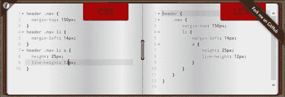
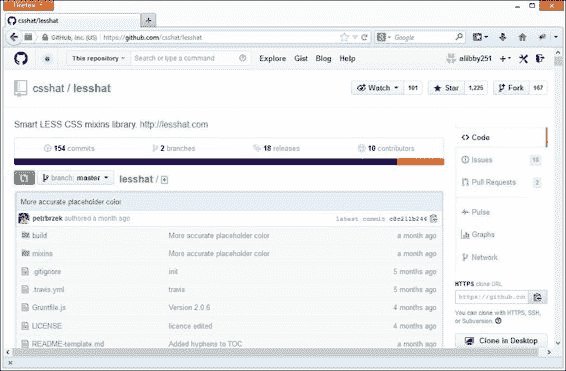
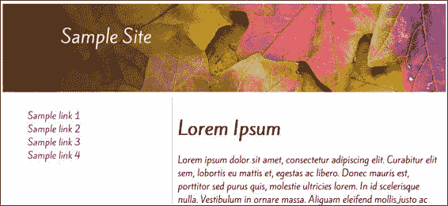
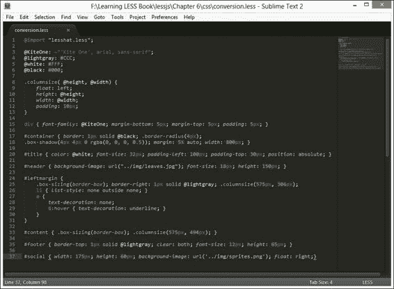

# 第六章. 将您的网站迁移到 Less

因此，到现在为止，你希望已经花了一些时间使用 Less，并且认为这对你未来的项目可能非常有用，对吧？

问题在于你可能也会想到现有的项目，它们通过使用 Less 可以轻易受益，但你不确定如何将它们转换为使用 Less。没问题；在本章中，我将带你了解如何进行这种过渡到使用 Less 的一些技巧和窍门，而不会冒任何风险。

我们首先将审视我们需要问自己的问题类型，然后继续创建我们将用于开始转换的基本框架，通过一个将迷你网站转换为使用 Less 的详细示例。

转换的关键是记住，Less 毕竟只是 CSS 的超集——大部分工作都是关于识别那些可以轻松更改的部分以及可能需要更多工作的部分。在本章中，我们将涵盖以下主题：

+   低垂的果实——Less 转换的明显候选者

+   识别 CSS 中的模式

+   构建混入库

+   将预构建库作为转换过程的一部分使用

+   将 Less 与普通 CSS 混合

+   通过实际示例进行操作

你准备好开始转换你的 CSS 了吗？好的，让我们开始吧...

# 准备初次跳跃

因此，你已经阅读了有关使用 Less 的所有内容，并且渴望开始在您的一些较旧的项目中使用它。你已经开始在您的新网站上使用它，并且非常喜欢它使编写 CSS 变得多么容易...但是，你可能正在想：我如何将其纳入一个较旧的网站？

好吧，你来了对地方——只要记住这些提示，在较旧的网站上做出改变并不需要那么困难：

+   确保你已经安装了带有 Less 支持的 Firebug，如第二章中所述，*构建 Less 开发工具包*。相信我，这将使调试你的工作变得容易得多！

+   将你的现有 CSS 通过一个网站，如 W3C CSS 验证器([`jigsaw.w3.org/css-validator/validator`](http://jigsaw.w3.org/css-validator/validator))进行验证。如果你还没有这样做，这将有助于发现任何错误，并在开始将其转换为 Less 之前确保你的代码正确验证。

+   尝试养成将 Less 转换分块进行，并且应该是一个迭代过程的心态——这减少了错过机会或在你代码中犯错误的风险；这在转换大型文件，如 WordPress 样式表时尤其重要！

+   不要忘记 Less 是 CSS 的超集——只要我们以逻辑方式完成转换过程。Less 仍然会编译尚未转换为 Less 等价的普通 CSS 代码。这意味着我们可以在转换过程中混合代码，直到所有样式都得到了适当的转换。

+   养成使用诸如[`less2css.org`](http://less2css.org)或[`lesstester.com`](http://lesstester.com)等网站的习惯。这些网站非常适合实验 Less 代码，以查看它将如何编译为有效的 CSS。

让我们将一些这些技巧付诸实践，并查看应该构成任何初始转换过程基础的初步步骤。

# 创建初始框架

一旦您决定转换为使用 Less，我们就可以采取一些步骤，这些步骤有助于初始转换过程，在我们开始编写 Less 代码之前。

让我们看看我们如何使这个过程更容易。为了本例的目的，我将假设您只有一个样式表，称为`styles.css`，并且您正在开发环境中工作，在基于 HTML 的简单网站上工作，以便熟悉转换过程。

1.  首先，将`sitestyles.css`文件重命名为`.less`扩展名的`sitestyles.less`。

1.  在您的文本编辑器中的新文件中，添加以下内容：

    ```js
    @import "sitestyles.less";
    ```

1.  将其保存为`styles.less`。在您的 HTML 代码中，将现有的链接`sitestyles.css`更改为指向`sitestyles.less`，使用以下链接：

    ```js
      <link rel="stylesheet/less" href="css/styles.less">
      <script src="img/less.min.js"></script>
    ```

使用 Crunch!或 Sublime Text（取决于您在第三章中设置的内容，*使用 Less 入门*)来编译新的`styles.less`文件，以确认它是否生成有效的`styles.css`文件。

### 注意

我们在我们的代码中直接引用了 Less 文件——这仅用于开发目的，不建议用于生产使用。

在这一点上，您可能会认为在`styles.less`文件中只有一个语句听起来可能有些过度；这是有原因的：与 Less 一起工作的关键是建立 Less 文件的初始框架，以便我们首先证明它可以编译为有效的 CSS。一旦证明这一点，就只需为每个您想要包含的部分文件添加更多的`@import`语句。在我们下次重新编译`styles.less`时，Less 会将所有这些合并到一个文件中，正如我们将在下一节中看到的。

## 将 Less 与纯 CSS 混合

如果我们将 Less 与 CSS 混合以创建导入单个部分文件的框架，我们将获得一个额外的好处：我们不必一次性转换所有 Less 文件！相反，我们可以简单地将现有的 CSS 文件拆分成更小的**部分**，然后将它们导入到主 CSS 文件（此处为`styles.less`）中——这使得转换过程更容易管理。

### 注意

部分是包含 Less 代码的单独文件——它们是帮助简化 Less 代码管理的手段，因为多个文件可以作为编译过程的一部分在一个样式表中导入。

然后，我们只需为每个需要导入的 Less 文件添加一个`@import`语句，例如以下示例所示：

```js
@import "sitestyles.less";
@import "fonts.css";
@import "css3.less";
@import "menu.less";
```

记住，无论 Less 文件有多大或正在导入多少部分，Less 在最终编译的 CSS 文件中只会导入被代码引用的样式。当我们还在开发 Less 文件时，我们可以轻松地在浏览器中动态编译它；一旦最终版本准备就绪，它就可以预先编译，生成的 CSS 文件可以导入我们的生产环境中。

# 寻找低垂的果实

现在我们已经建立了基本框架，是时候去“摘水果”了——不，我并不是字面意义上的摘水果，而是寻找那些可以轻松转换且几乎不需要努力的 CSS 语句。

每个项目的大小和范围都会有所不同，但总会有一些简单的转换我们可以进行，这些转换适用于任何项目：

1.  可以进行的一个简单更改是引入颜色变量——一旦转换，我们可以使用运算符来计算新的值，例如将特定颜色亮度提高 25%。作为开始，我们可以创建一些变量，例如以下这些：

    ```js
    @color-light-orange: #ffa500;
    @color-gray-cyan: #6a7172;
    @color-gray-dark: #313131;
    @color-grayish-orange: #d7cec3;
    ```

    我们可以在我们的样式中使用变量，而不是十六进制代码；它们将如下所示：

    ```js
    body {background: @color-gray-cyan; color: @color-gray-dark; }
    a { color: @color-light-orange; }
    h1, h2, h3, h4, h5, h6 { color: @color-gray-dark; }
    ```

    ### 注意

    理想情况下，这里使用的名称应该反映它们被使用的上下文，例如`body-textcolor`或`heading-textcolor`；我们在这里使用名称来展示它们如何替换现有的颜色，并且至少使颜色名称可读！

1.  在转换过程中，你可能想要考虑将转换后的代码移动到一个单独的 Less 部分，并使用我们之前介绍的过程导入它。虽然这允许你在 Less 和 CSS 样式之间保持区分，但也意味着如果我们正在转换现有的 CSS 样式，而转换后的 Less 代码没有在屏幕上显示，我们可能会错过机会。

1.  如果我们使用包含供应商前缀的 CSS3 样式，我们可以将我们的代码转换为从外部预构建库导入混入（mixins），例如 LESS Hat 或 LESS Elements。这将减少我们需要编写的代码量——毕竟，如果有人已经构建了一个我们可以使用的合适的混入，为什么还要重新发明轮子呢？

1.  我们可以做出的一个更进阶的更改是关于嵌套的使用——这将使我们的代码更容易阅读，因为更清楚子样式将如何影响其父元素。一个完美的例子是嵌入到页面头部`DIV`中的菜单系统：

    ```js
    header .nav { margin-top: 100px; }  
    header .nav li { margin-left: 10px; }  
    header .nav li a { height: 30px; line-height: 10px; }
    ```

我们可以手动转换或使用网站，例如[`css2less.cc`](http://css2less.cc)；虽然这个网站并不完美，但它会在转换过程中给你一个良好的起点：



### 小贴士

在线 CSS 到 Less 转换器并不完美——例如，如果您的 CSS 文件包含大量随机选择器，它们可能难以生成高质量的代码；Less 在编译过程中也会重新组合 CSS 语句，这可能会破坏您的代码。这些网站应该被视为开发的一个起点；假设在初始转换后，手动花费时间对代码进行微调。

毫无疑问，我们还可以做出其他一些简单的改变——这完全取决于将要转换为使用 Less 的网站的大小和范围。再次强调，这里的关键点是转换应该是一个迭代的过程，如果你试图一次性完成网站的转换，那么你并不会给自己带来任何好处！

让我们稍微改变一下焦点，继续到过程的下一阶段——一旦你处理了简单的转换，就是时候问自己一系列问题，所有这些问题都属于在 CSS 中识别模式这一范畴。

# 在你的 CSS 中识别模式

在你的 CSS 中识别模式，就是问自己一个问题：我如何减少代码？

有许多种方法可以做到这一点；具体的过程将取决于要转换的网站的性质。尽管如此，你可以问自己一些一般性的问题，以帮助转换过程：

+   你的网站使用了任何 CSS3 样式吗？如果使用了，考虑使用预构建的 Less 库，我们可以在我们的 Less 样式表中导入它。

+   你的 CSS 代码中是否包含任何语句，例如链接到图像元素？如果包含，您可能希望考虑使用字符串变量和插值来更好地管理链接，尤其是如果它们需要在未来进行更新。

+   你的网站使用了多少变量？如果其中任何变量将用于定义颜色，那么考虑使用一些 Less 内置的函数或运算符来动态生成颜色，例如将颜色变亮 20%或向现有颜色添加值以创建一个新的颜色。

+   你在代码中看到相同的（或非常相似的）代码块有多频繁？只要稍加注意，是否可以将其修改为与其他代码相同？如果是这样，这将是一个非常适合转换为混入的候选者。我们能够改变多少代码实例，同时仍然保持相同的效果，我们就能够从使用混入中获得更多的价值。

虽然你可能会有更多的问题要问，因为每个网站都是不同的，但并非每个问题都适用。其中一个关键问题将涉及到创建混入（mixins）以及我们是否可以将它们分离到我们自己的库中以便将来使用。

# 使用预构建的混入库

如果我们创建了许多混入，我们可以将这些混入变成一个库。然而，这并不总是必要的；相反，我们总是可以寻找方法来重用从互联网上可下载的库中的混入。

为什么我们应该使用它们？这样做有两个很好的理由：

+   我们可以避免重造轮子的需要

+   我们不需要担心库的支持或更新——这将由作者处理，通常还会得到整个开源社区的协助

可用的库有很多——它们都可以使用我们之前已经看到的相同的`@import`语句导入。我们将在本章末尾的实践示例中更详细地介绍如何使用此类库，但在此期间，以下是一些可用的库示例：

+   3L ([`mateuszkocz.github.io/3l/`](http://mateuszkocz.github.io/3l/))

+   Animate.css ([`github.com/daneden/animate.cs`](https://github.com/daneden/animate.cs))

+   ClearLess ([`github.com/clearleft/clearless`](https://github.com/clearleft/clearless))

+   CSS Effects ([`adodson.com/css-effects/`](http://adodson.com/css-effects/))

+   Cssowl ([`cssowl.owl-stars.com/`](http://cssowl.owl-stars.com/))

+   LESS Elements ([`lesselements.com/`](http://lesselements.com/))

+   LESS Hat ([`lesshat.com/`](http://lesshat.com/))

+   Oban ([`oban.io/`](http://oban.io/))

+   Preboot ([`getpreboot.com/`](http://getpreboot.com/))

在线将有更多可用资源；您可以在互联网上搜索以查看可用资源，您可能会找到更适合您需求的资源。我们将在本章后面的实践演示中使用 LESS Hat 库。

# 构建混入库

作为识别我们 CSS 中模式的一部分，我们可以识别出可以转换为混入的代码，我们可能会发现使用预构建的库，如 LESS Elements 或 LESS Hat，并不总是满足我们的需求。

这可能不是问题；可能是因为库的作者没有按照我们的期望创建混入，因为他试图满足另一个需求。如果现有的混入不可用，我们始终可以考虑创建自己的混入库作为部分，以便在未来的项目中使用。我们甚至可以考虑在 GitHub ([`www.github.com`](http://www.github.com))上托管混入，就像其他人所做的那样：



### 提示

有几个流行的代码共享平台可供选择，您可以尝试——两个很好的例子是 Google Code ([`code.google.com/`](https://code.google.com/))和 Bitbucket ([`bitbucket.org/`](https://bitbucket.org/))。

在为库创建混入时，技巧是提前几步考虑，并找出您如何转换相似的代码块，以便它们可以用一个或多个混入来替换。

如果你发现代码可以转换为 mixin，那么思考这些 mixin 应该如何编写是值得的。Less 的一个关键原则是 DRY（不要重复自己）——你可能会发现自己编写了许多可以重用的 mixin。如果仔细考虑任何可以进行的调整，这些 mixin 的实用性将会增加，这样其他 CSS 代码块就可以通过 Less 调用你创建的 mixin 来替换。

一旦你的库创建完成，你就可以在 GitHub 上托管它——这样做有几个很好的理由：

+   在社区中有一个现成的群体，他们可以帮助解决问题或支持这个库

+   这是一种向他人表示感谢的好方法，因为你可能已经使用了他们的工作

+   任何使用你的 mixin 库的人都可以帮助你提出对 mixin 的改进建议

创建自己的库并将其在线上发布，将给你带来巨大的满足感，因为你能够为开源运动做出贡献——毕竟，我们今天所达到的成就，离不开那些花费数小时创建库（如 Less）的人们的努力！

现在，让我们将注意力转向使用我们刚刚提到的这些预构建库之一——我们将通过实际例子来看看如何使用 LESS Hat。

# 通过实际例子进行操作

到目前为止，我们已经查看了一系列你可以用来将网站转换为使用 Less 的技巧和窍门——虽然有一些有用的技巧，但我认为你也会同意，看到转换过程在实际中发生要更好！考虑到这一点，让我们看看一个简单的例子，以我们在第四章中创建的 CSS 样式为例，*使用变量、mixin 和函数*，这是一个单页网站。

在我们开始做出更改之前，让我们看看为该页面创建的编译后的 CSS，以及页面的截图：



## 介绍 CSS

现在我们已经看到了将要改造以使用 Less 的页面的截图，让我们来看看我们需要转换的 CSS 代码。使用 Crunch!生成的编译后的 CSS 如下——这本书附带的代码下载中包含了这个副本，作为`conversion.css`。我们还将包括对`social.css`中样式的一点点修改，并将其包含在`conversion.css`中。这将产生相同的结果，但修改它的原因将在下一节中变得明显：

```js
#social { width: 175px; height: 60px; background-image: url('../img/sprites.png'); float: right;}
```

初看，这应该看起来像一张普通的样式表，希望它使用了一些在任何一个网站项目中都可能用到的相当常见的样式属性：


你可能正在想，这样一个简单的例子，我们在这里能做些什么，对吧？

## 确定需要做出的更改

错误！将转换到使用 Less 不应该总是关于你的样式表的大小，而应该是进入使用 Less 将使代码管理更容易的心态。将转换到使用 Less 应该是一个迭代的过程，只有当所有原始 CSS 都已转换并且 Less 正在你的网站上使用时，这个过程才会停止。

为了证明这一点，让我们看一下代码，并突出显示一些可以转换的区域。样式表是一个简单的例子，但它足以说明你可以用来将 CSS 文件转换为 Less 等价物的过程。

+   你注意到使用`#leftmargin`的三个样式规则了吗？这是一个使用嵌套的完美机会——我们可以避免重复规则名称，并且可以以更合理的方式分组样式。

+   我们使用了`#content`的`box-sizing`属性，但没有包含所有供应商前缀。这是一个很好的理由去查看网上可用的许多 mixin 库，看看其中是否包含一个合适的 mixin 我们可以使用。这避免了重新发明轮子的需要——如果合适，我们可以简单地链接到 mixin 并传递给它值。导入预构建的 mixin 也会处理操作所需的任何供应商前缀。

+   与使用难以转换为有意义的十六进制值的颜色值相比，我们可以创建变量并将值分配给它们。名称可以设置为描述所设置的颜色的值。如果需要更新，那么只需要一个更新，因为 Less 会自动处理所有其他实例的更改。

+   在`div`和`#title`中，我们包含了`font-family`属性——虽然这在正常 CSS 中可以完美工作，但我们可以使用相同的变量过程并为每个`font-family`属性创建有意义的名称。这使得它们在将来需要更改时更容易更新。

+   在`#leftmargin`和`#content`中，你可能已经注意到了这里的一个机会——我们重复使用相同的代码（尽管值略有不同）来创建我们的列。然而，有一个问题：注意`#content`在样式规则中额外有`padding: 10px`？在这种情况下，这不是问题——我们可以在`#leftmargin`中添加这个样式，而不会产生明显的负面影响。记住，关键在于先进行初始更改，然后查看我们可以更改什么，这样我们就可以向 mixin 添加更多内容，使其更有用。

+   我们可以做出的更高级的更改是，将使用`data-uri`来导入我们的 CSS 中的社交网络图片，以节省服务器请求和带宽使用。我们在第四章的原始示例中使用了它，*使用变量、混入和函数*——它对于小图像（如我们的示例）将完美工作，但对于较大的图像或那些在网站上未重复使用的图像则不太有用。

### 注意

关于什么可以定义为“小”图像并没有硬性规定——我在这个示例中使用的图像重量为 9 KB。这会稍微取决于浏览器中的任何`data-uri`限制；例如，IE8 的限制为 32 KB。这完全关乎仔细选择——如信用卡标志这样的小图像将完美无缺，但一张大图片显然就不合适了！

这些只是我们可以用来将此样式表转换为使用 Less 的一些概念。转换过程的关键不在于大小，而在于重新设计代码以使其更容易维护，并移除其他人已经创建且你可以导入到自己的项目中的代码的重复部分。一旦你开始转换代码，你将看到其他转换的机会——这完全是一个熟能生巧的例子！

## 进行更改

既然我们已经看到了可以做出的更改，让我们开始实施一些这些更改，从创建我们的 Less 框架文件开始。首先，将`conversion.css`文件重命名为`conversion.less`。接下来，在你的文本编辑器中的新文件中添加以下行：

```js
@import "conversion.less";
```

将文件保存为`styles.less`——这设置了我们的框架，以便我们可以转换我们的代码。如果你使用了 Sublime Text 或 Crunch!，那么你将发现已创建了一个`styles.css`文件——它包含从`conversion.less`编译的代码副本。以这种方式设置框架意味着我们可以在未来添加更多的`@import`语句；这些导入文件的 内容将在`styles.less`文件重新编译时自动包含到最终文章中。

## 使用 CSS3 混入

接下来，让我们看看我们使用的 CSS3 样式——我们可以将其转换为使用预构建的混入库。为了这个练习的目的，我们将使用可从[`lesshat.madebysource.com/`](http://lesshat.madebysource.com/)获取的 LESS Hat 库。点击**下载 LESS Hat**按钮——在撰写本书时，最新版本是 2.0.15。

我们需要提取`lesshat.less`文件，该文件位于`build`子文件夹中——将其复制到项目文件夹中的`css`子文件夹。切换回文本编辑器中的`conversion.less`文件，然后在开头添加以下行：

```js
@import "lesshat.less";
```

现在，这将导入我们需要从 LESS Hat 库中使用的任何混入（mixins）。

### 注意

我们不能在`styles.less`文件中包含`@import`语句用于 LESS Hat——这将在`conversion.less`中导致编译错误，因为它在编译代码时找不到它需要使用的源混入。

现在我们已经添加了 LESS Hat 库，我们可以开始调整我们的代码以使用这个库中的混入；有几个地方我们更改了代码以使用混入，如下所示：

```js
#leftmargin { .box-sizing(padding-box); border-right: 1px solid #CCCCCC; float: left; height: 575px; width: 306px; }
#content { .box-sizing(padding-box); float: left; height: 575px; padding: 10px; width: 494px; }
#container { border: 1px solid #000000; .border-radius(4px);
.box-shadow(4px 4px 0 rgba(0, 0, 0, 0.5)); margin: 5% auto; width: 800px; }
```

在这个例子中，我们只能在三个地方使用 LESS Hat。尽管这个数量有限，但我们不应该忘记，这更多不是关于我们可以使用外部混入库的实例数量，而是关于不重复造轮子，以及使用外部库意味着我们做更少的工作，前提是有一个合适的库可供使用。

## 为字体创建变量

让我们改变我们的焦点，看看在将代码转换为使用 Less 时我们可以使用另一个概念：使用变量来帮助维护值，例如字体。

在我们的代码中，有几个地方使用了字体。在正常的 CSS 中更新这些可能会很麻烦，所以让我们创建一些变量，我们可以使用这些变量来自动更新我们的 Less 代码。创建变量意味着我们只需要在代码的开始处更新一个值。Less 将自动处理这些变量其他实例的更新。

在`conversion.less`的一个副本中，在`@import`语句下面立即添加以下行：

```js
@import "lesshat.less";
@KiteOne: ~"'Kite One', arial, sans-serif";
```

仔细观察的你们会注意到，我们增加了一个变量——与本书前面提到的变量相比，唯一的区别是这个变量是封装的。我们使用波浪号符号来告诉 Less 在编译我们的代码时，要精确地按照显示的样式来复制这个变量。这意味着我们不再需要使用长句，现在我们可以简单地使用`@KiteOne`作为值：

```js
div { font-family: @KiteOne; margin-bottom: 5px; margin-top: 5px; padding: 5px; }
```

在这种情况下，我们只需要更改一条规则。在一个更大的样式表中，这种做法的好处将更加明显，因为它消除了在更新样式时手动更改每个实例的需求。

### 注意

我们将在第七章中详细介绍如何使用 Less 来操作字体，*使用 Less 操作字体*。

## 为颜色创建变量

我们还在代码中使用了几个颜色——其中一个应该是白色(`#fff`)，但另一个则不太容易识别为浅灰色。让我们使用相同的过程为这些颜色创建两个新变量，并为黑色创建一个变量：

```js
@KiteOne: "'Kite One', arial, sans-serif";
@lightgray: #ccc;
@white: #fff;
@black: #000;

```

我们现在可以像下面这样修改我们的 Less 代码以使用这些变量，这将使代码更易于阅读：

```js
#container { border: 1px solid @black; .border-radius(4px); }
#title { color: @white; font-family: @KiteOne; font-size: 32px; font-weight: 400; padding-left: 100px; padding-top: 30px; position: absolute; }
#leftmargin { .box-sizing(padding-box); border-right: 1px solid @lightgray; float: left; height: 575px; width: 306px; }
#footer { border-top: 1px solid @lightgray; clear: both; font-size: 12px; height: 65px; }
```

这将使代码更容易阅读，但也意味着如果我们需要更改值，我们只需要在开始时更改一次——Less 将自动处理所有其他实例的更新。

## 转换为使用嵌套

我们接下来的更改更为显著；它涉及到代码中`#leftmargin`样式规则的四个实例。我们不需要手动编写每个规则，可以通过使用 Less 的嵌套功能将它们组合在一起；这使得它们更容易阅读，因为它们遵循更合理的结构。

在`conversion.less`的副本中，删除四个`#leftmargin`行，并用以下内容替换：

```js
#leftmargin {
  .box-sizing(padding-box);
  border-right: 1px solid @lightgray;
  float: left; height: 575px; width: 306px;
  li { list-style: none outside none; }
  a {
    text-decoration: none;
    &:hover { text-decoration: underline; }
  }
}
```

这将使我们的代码更容易阅读，并避免在编写规则时重复元素名称的需要。注意我们如何使用&符号为`:hover`——&符号告诉 Less 将`:hover`视为伪选择器，Less 将编译为`#leftmargin a:hover`。

### 小贴士

如示例所示，使用&符号（ampersands）不仅限于伪选择器；它可以用来表示代码中使用的父选择器或类——有关更多详细信息，请参阅[`lesscss.org/features/#parent-selectors-feature`](http://lesscss.org/features/#parent-selectors-feature)。

## 引入我们自己的混合

我们最后的更改与列大小有关——如果你仔细阅读代码，你将注意到至少有两个地方我们有几乎相同的代码：`#leftmargin`和`#content`。我们可以将四个样式属性移动到一个单独的参数化混合中，如所示——将此内容添加到本章前面创建的变量下面：

```js
.columnsize( @height, @width) { float: left; height: @height;
width: @width; padding: 10px; }
```

完成后，我们可以相应地更改我们的样式规则：

```js
#leftmargin { .box-sizing(padding-box); border-right: 1px solid @lightgray; .columnsize(575px, 306px); ...}

#content { .box-sizing(padding-box); .columnsize(575px, 494px); }
```

这是一个简单的例子，说明我们可以通过一点细心，创建自己的混合来减少代码中的重复。虽然它可能不会减少我们代码中的行数，但它将帮助使代码更易于阅读，并在需要更改通过混合传递的值时更容易修改。

在这个阶段，我们已经将原始代码转换为使用 Less。如果一切顺利，我们应该得到可以编译成有效 CSS 的代码；如果你查看本书附带的代码下载，可以看到`conversion.less`的副本，并比较你的版本。

我们可以通过更改第四章中产生的 HTML 代码副本来测试转换过程的成功，*使用变量、混合和函数*。打开`functions2.html`的副本，然后寻找以下突出显示的行：

```js
  <title>Demo: Functions</title>
  <link href='http://fonts.googleapis.com/css?family=Kite+One' rel='stylesheet' type='text/css'>
 <link rel="stylesheet/less"  href="css/functions.less">
 <link rel="stylesheet" type="text/less" href="css/social.less">
  <script src="img/less.min.js"></script>
</head>
```

按照所示进行更改；然后，将文件保存为`conversion.html`：

```js
  <link href='http://fonts.googleapis.com/css?family=Kite+One' rel='stylesheet' type='text/css'>
 <link rel="stylesheet/less" href="css/styles.less">
  <script src="img/less.min.js"></script>
```

如果你在一个浏览器中预览结果，不要期望看到任何对整体页面的真正变化，除了添加的一小部分额外填充，这使左侧导航略微下移。希望这能表明，通过一些细心和思考，我们可以产生相同的结果，同时更好地管理我们的代码！

## 将图像导入样式表——一个额外的好处

在我们完成更改之前，我想加入一个小奖励；如果我们回顾一下我们可以做出的更改列表，我们注意到一个可以做出的微小更改，这与我们页面页脚中使用的社交媒体图像有关。

这个 CSS 由我们 Less 文件中的以下行控制：

```js
#social { width: 175px; height: 60px; background-image: url('../img/sprites.png'); float: right; }
```

这将作为单独的文件引入图像，这意味着对服务器的额外请求。在一个小型网站上，这不会成为问题，但在一个大型网站上，这可能会使网站带宽需求增加，这将成为一个问题。

相反，我们可以使用 Less 的一个函数，`data-uri`，这在第四章中有所介绍，即 *使用变量、混合和函数*，当我们创建我们页面的原始版本时。这对于小图像来说非常理想，尤其是那些在整个网站上重复出现的图像；这将它们转换为可以包含在我们的 CSS 中的 base64 语句，从而消除了需要从服务器请求图像的需要。

在 `conversion.less` 中，查找以下这一行：

```js
#social { width: 175px; height: 60px; background-image: url('../img/sprites.png'); float: right; }
```

如果我们想使用 `data-uri`，我们将像下面这样更改 `background-image` 属性：

```js
#social { width: 175px; height: 60px;  background-image: data-uri('../img/sprites.png'); float: right; }
```

这意味着虽然我们可能在 CSS 中有几百行代码，但我们已经减少了从服务器请求图像的需求。虽然这个过程应该谨慎使用——它只应该用于小图像，这些图像可能在整个网站上重复出现。这是一个有用的技巧，可以节省对服务器的请求，只要谨慎使用！

# 查看完成的文章

现在我们已经更改了转换后的 CSS 文件，让我们看看最终结果。为了比较，打开书中附带的代码下载中的 `conversion.less` 的副本，看看你在做出更改方面做得如何：



希望你能看到我们所做的部分更改——请注意，我们并不一定减少了所写的行数，但我们已经使代码在未来需要更改时更容易更新。诚然，在这个小型 Less 文件中，我们可能看不到使用 Less 的全部好处；但在一个较大的文件中，当从 CSS 转换为使用 Less 时，好处将变得明显。

# 摘要

在 Less 中，最难理解的概念之一是如何将现有网站转换为使用 Less。虽然有一些简单（或者可能更复杂，取决于你的看法）的问题我们可以回答，但转换一个网站可能需要一定程度的技能，以确保我们在转换过程中充分利用 Less。

在本章中，我们看到了一些问题和技巧，我们可以使用它们来开始转换过程。我们首先查看如何为转换过程的初步跳跃做准备，然后是任何人在考虑如何转换他们的 CSS 代码之前应该采取的初步步骤。我们看到了如何轻松地将代码拆分为单独的部分，这些部分可以导入到一个 Less 将编译为有效 CSS 的主文件中。

我们将 Less 代码转换为 CSS 代码的初步步骤，始于寻找低垂的果实，即快速且容易的改变。我们看到了如何使用诸如[`css2less.cc`](http://css2less.cc)之类的网站，我们可以轻松地开始转换代码；指出这些网站并不完美，但可以作为转换代码的良好基础。接下来，我们探讨了如何识别我们的 CSS 代码中的模式——我们检查了在过程中应该提出的一些问题。指出每个网站都会有所不同；因此，需要提出不同的问题。尽管如此，仍有一些基本问题适用于任何网站。

我们首先了解了如何在转换过程中使用预构建的 mixin 库，并介绍了一些可以在我们的项目中使用的示例——这是一种将他人创建的 mixin 引入的好方法，这将有助于减少创建我们样式表所需的工作量。然后，我们讨论了在现有的在线 mixin 库不能满足我们的需求时，可能需要创建我们自己的 mixin 库。

我们以一个详细的实际例子结束了这一章，展示了如何将现有的网站转换为使用 Less——我们使用了在第四章中创建的单个网页，*使用变量、混入和函数*，作为证明无论网站有多大，大多数网站都将从转换为使用 Less 中受益的例子。我们探讨了如何通过仔细检查代码的基本原则，一次检查一个代码块，并使用本章前面概述的技术，轻松地应用一些简单的转换。其中之一是我们对所使用的字体进行的一个简单更改——我们将在下一章进一步探讨这一点。
